# 8

# MATLAB 图像处理和计算机视觉

计算机视觉是一个探索处理、分析和理解视觉数据方法的学科。在图像内容分析领域，众多计算机视觉算法被用于深入理解图像中描绘的对象。涵盖图像分析的各个方面，计算机视觉处理诸如对象识别、形状分析、姿态估计、3D 建模、视觉搜索等任务。虽然人类在识别和识别周围环境中的对象方面表现出色，但计算机视觉的目标是使用计算方法忠实复制**人类视觉系统**（**HVS**）的能力。在本章中，我们将了解计算机视觉的基本概念以及如何使用 MATLAB 实现对象识别模型。

在本章中，我们将涵盖以下主要主题：

+   介绍图像处理和计算机视觉

+   探索 MATLAB 计算机视觉工具

+   构建 MATLAB 对象识别模型

+   在 MATLAB 中训练和微调预训练的深度学习模型

+   解释和说明机器学习模型

# 技术要求

在本章中，我们将介绍基本的机器学习概念。为了理解这些主题，需要具备代数和数学建模的基本知识。您还需要具备 MATLAB 的实际操作能力。

要使用本章中的 MATLAB 代码，您需要 GitHub 上提供的文件，网址为[`github.com/PacktPublishing/MATLAB-for-Machine-Learning-second-edition`](https://github.com/PacktPublishing/MATLAB-for-Machine-Learning-second-edition)。

# 介绍图像处理和计算机视觉

通过五种感官，人类从外部世界收集信息并处理它，做出决策以执行塑造他们日常生活的行动。计算机科学中最引人入胜的挑战之一是复制这一系列事件，识别和利用新的信息来源。通过模拟人类感官系统来获取和解释信息的能力被称为机器感知，这是人工智能领域的基本内容。

通过编码和信息处理等技术，能够从外部世界解释和获取信息成为可能。通过数字图像编码技术，可以将人类可以感知的内容以比特的形式表示出来。根据使用的方法，可以选择要表示的信息的数量和质量。另一方面，通过处理方法，可以解释图像中包含的信息，并尝试复制人类决策机制。其中一种人类能力是通过视觉识别场景中存在的物体类型，从而识别每个物体的独特特征。从图像中可以提取的最高水平信息是通过识别和识别场景中的单个物体来完成的。这些信息可以用来根据它们包含的物体对图像进行分类和分组。

## 理解图像处理

对于人类来说，一个基本的感觉是视觉。通过数字图像，可以以数值形式表示 HVS 在瞬间捕获的内容。图像是视觉感知的二维表示；它以电磁波的形式被感知，这些电磁波进入眼睛并影响视网膜。视网膜的组成元素捕获信息，如亮度和光谱特性。这些被转换成神经信号，通过视神经发送到负责视觉解释的大脑结构。

在数字领域，图像通常被表示为按顺序排列的点集和像素，这些点集和像素以行和列的形式排列。这种表示方式被称为光栅或位图。本质上，它涉及在两个维度上对连续信号进行二维采样：

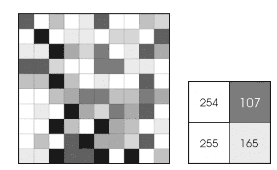

图 8.1 – 以像素序列表示的图像表示。每个像素的值从 0（黑色）到 255（白色）

表示的最简单技术是使用灰度。在这种类型的表示中，像素包含亮度值。亮度是视觉场中的基本量，表示到达观察者眼睛的光量。像素值从无（黑色）到最大光亮度（白色），而中间状态则被感知为不同灰度的阴影。

在计算机图形学中，像素是数字图像表面的最小传统单位。图像中像素的数量越多，它包含的信息就越多，因此我们注意到其中的细节的能力也增加。信息量可以通过测量分辨率来表示，无论是以绝对值（像素）还是关于物理测量（每英寸**点数**（dpi））来表示。

当决定改变图像的分辨率时，可能出现两种情况：

+   **像素尺寸不变**：组成图像的像素数量减少，导致图像尺寸缩小。

+   **像素尺寸增加**：像素（dpi）的尺寸减小，而图像的整体尺寸保持不变，导致单个像素尺寸增加。

数字图像的一个重要方面是如何表示其像素中包含的信息。在灰度图的情况下，它表示亮度，需要通过在有限数量的比特中表示来进行量化。比特数越多，量化噪声越低。使用*b*比特，有 2b 种可能的值。通常，8 比特是最常见的值，允许表示总共 256 级的亮度。已经证明，8 比特在大多数应用中可以提供可接受的灰度梯度表示。这个数量有效地适应了人视觉系统区分图像中不同亮度级别的能力。

这也适用于只包含每个像素亮度信息的灰度图像。引入颜色增加了表示的复杂性，因为它需要使用一个模型来表示它。这个模型必须能够捕捉对人视觉系统有意义的颜色信息并将其转换为数字。目标是获得一个数字向量，它“总结”了每个像素中电磁波包含的频率。

在数字领域，最常用的模型无疑是 RGB。它基于三种不同强度的颜色成分的组合：红色、绿色和蓝色。

这些组件大致对应于人视网膜中的三种锥体细胞。因此，没有必要表示现实世界中存在的所有颜色信息，而只需表示人视觉系统敏感的信息。这种电磁波携带的信息对应于击中视网膜内部器官的光线；因此，颜色对应于电磁信号的频谱。因此，为了表示信号，只需要与红色、绿色和蓝色三种颜色相关的三个成分，这三种颜色被称为原色，它们与三个不同的频率带中的亮度相对应。RGB 模型表示与原色对应的频谱带中存在的能量量，并以三个不同的值或成分的形式提供这些信息。

一旦你理解了如何将数字图像以数值形式表示，就必须知道如何处理它，以便于其表示和提取相关信息。图像处理技术可以利用数字转换算法来修改原始图像的像素，从而生成一个新的图像。然而，它们还包括从图像中提取数值或表格值的技术，代表图像的特定特征。根据它们的复杂性，这些技术可以被归入不同的类别。

最简单的处理方法是与单个像素的转换相关：

+   **灰度转换**：这是一种允许你从 RGB 模型过渡到灰度的转换类型。亮度与 RGB 模型的三个色度成分之间存在线性关系。这种转换使我们能够在后续操作中管理并处理更简单的像素。每个像素将只有一个值，对应于亮度，而不是三个值，每个色度成分（R、G、B）一个值（*图 8**.2*）：

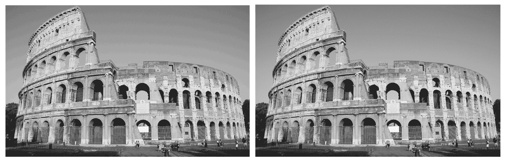

图 8.2 – 弗拉维安竞技场的灰度转换

+   **阈值化**：这是一种在图像分割阶段非常有用的转换，其目标是隔离感兴趣的对象与背景。想法是将高于某个阈值值的像素设置为最大亮度强度值，而将低于阈值的像素设置为最小强度值。

+   **混叠**：这是一种在采样期间使两个不同的信号在采样时无法区分的效果。混叠发生在采样或插值产生图像的较低分辨率时，与原始信号相比，输出被扭曲。可以使用抗混叠滤波器来纠正这个问题。在数字图像的情况下，混叠表现为摩尔纹或波浪状图案。

然后，还有直接比较和特征提取方法。第一组技术用于逐像素比较两个图像，获得一个衡量它们之间差异的值。另一方面，第二组技术允许创建初始图像的摘要，并使用一个更小的数据集，该数据集仍然可以充分描述原始集。让我们看看一些例子：

+   **直接比较方法**：从图像中可以得出许多有趣的信息之一是它们的相似度。人脑可以处理通过视网膜到达的视觉感知中的信息。有专门的神经元用于解释视觉信息（形状、颜色、运动、空间、线条等）。例如，识别面部和物体只有在提取这些信息并访问记忆之后才会发生。一种识别方法是直接方法。这种比较图像的方法也称为暴力方法，因为它涉及比较两个图像中的每个像素。这些方法应用代数公式并计算一个差异度指数，该指数表示两个图像之间的相似度。如果我们有两个图像称为*image1*和*image2*，我们可以使用以下公式计算差异度指数：

    差异度指数 = 1 − sum(sum(abs(image1 − image2))) / sum(sum(image1))

+   **均方误差**（**MSE**）：这是一个表示两个图像在绝对意义上相似程度的值。该指数逐像素比较图像，并代表这些值的平均差异。MSE 值越接近 0，分析图像之间的相似度就越大。

+   **结构相似性指数度量**（**SSIM**）：另一种直接比较的方法是 SSIM。与 MSE 相比，后者使用绝对误差进行估计。而 SSIM 则是一个基于感知的模型，它将图像退化视为结构信息感知的变化。该算法不是逐像素比较图像，而是将图像划分为 N x N 像素的网格。在每个网格内，计算像素的平均值，从而考虑相邻像素之间的关系，而不是单个像素的绝对值。

直接比较方法伴随着与处理数据量相关的显著成本，因为它们考虑了图像中包含的所有信息。通过一些技术，可以降低维度。当处理的数据量过多且存在冗余的可能性时，可以应用一种转换，采用数据的简化表示。这种简化表示不过是特征集。将输入数据转换为特征集的过程称为**特征提取**。

所选特征涵盖了输入数据的相关细节，通过利用这种浓缩的表示方法而不是原始数据的全部，使得预期的任务得以完成。这种方法最小化了准确描述大量数据集所需的成本和资源。在处理复杂的数据分析时，一个主要挑战是减少在游戏中变量的数量。分析大量变量通常意味着高内存使用和计算能力需求。此外，在应用分类算法时，存在**过拟合**的风险。在这种情况下，模型过于紧密地适应用于学习的数据集，无法泛化，从而失去有效性。特征提取是一个广泛的概念，用于描述创建变量组合的方法，旨在解决这些问题，同时保持对数据描述的足够准确性。现在我们已经介绍了最广泛使用的图像处理方法，我们可以专注于如何从图像中提取知识。

## 解释计算机视觉

计算机视觉是计算机科学和人工智能的一个跨学科领域，涉及开发算法、模型和计算机系统，这些系统能够从图像或视频中解释、理解和分析视觉信息。计算机视觉的主要目标是复制人眼视觉系统（HVS）的一些能力，使计算机能够通过视觉数据感知和理解周围的世界。

该研究领域关注广泛的任务，包括物体识别、运动检测、模式识别、从图像中提取信息、图像分割、3D 重建等。计算机视觉在众多行业中都有应用，包括医疗、汽车、安全、制造、零售、娱乐和机器人技术，仅举几例。

计算机视觉的最近发展是由深度神经网络的运用驱动的，特别是**卷积神经网络**（**CNNs**），它们在许多视觉识别任务中取得了卓越的结果。这些进步从根本上改变了机器与视觉世界互动的方式，为自动驾驶、医疗诊断、增强现实等领域开辟了新的可能性。

在抽象方面，这项任务是最复杂的。这个类别最常见的用途是物体识别。从概念上讲，这个过程可以分为两个步骤。第一步涉及使用特征提取技术根据模型定义一个感兴趣的物体。在第二步中，在图像中搜索该物体。这类变换需要使用机器学习和数据挖掘算法，通过数据集，允许为要搜索的物体构建一个模型。随后，可以确定图像中是否有像素与先前创建的模型匹配。对此有不同方法：

+   **形状匹配**：这是一种涉及搜索轮廓的方法。这种方法允许你测量形状之间的相似性，并识别属于正在搜索的物体轮廓的点之间的对应关系。基本思想是在轮廓上选择 *n* 个点。对于每个点，考虑连接它到所有其他点的 n - 1 个向量。所有这些向量的集合形成了一个在该点局部化的轮廓的复杂描述符。这个向量集是通过形状提取过程获得的，它是特征提取的一部分。想法是使用这些向量获得一个描述符，并使用它来识别其他图像中的相似形状并执行分类：

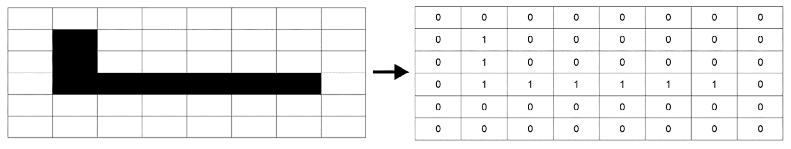

图 8.3 – 形状匹配

+   **模式匹配**：这是一种涉及在大型数据集中识别特定序列或数据（称为模式）的规律性的技术。模式识别领域涉及使用计算机算法和模式自动在数据中搜索规律性，以执行将数据分类到不同类别等操作。在数字图像中，识别过程涉及准备一个模式和对应于描述特定感兴趣物体或其一部分的一组像素。然后，在图像内执行像素分类过程，以确定是否存在与正在搜索的模式相媲美的像素组。

+   **基于特征的物体识别**：通过这项技术，可以创建代表物体典型特征的描述符。每个物体都有描述其自身的独特特征。如果我们能在数据集中识别出所有这些特征，我们可以假设该物体存在。例如，人脸可以根据特定的解剖特征进行建模，如眼睛的位置、鼻孔、嘴唇形成的角度等。这些解剖元素及其连接的向量的组合形成了一个补丁模型。这个模型代表了一组有序的元素，这些元素足以准确描述一个物体。

了解图像中对象识别技术是如何演变以及它对社会产生的影响是非常有趣的。其中最引人入胜的案例之一就是利用图像处理技术的面部识别。直到不久前，这项技术还常被视为科幻小说中的东西。然而，在过去的十年里，它不仅成为现实，而且被广泛使用。

现在我们已经分析了与图像处理和计算机视觉相关的基本概念，让我们分析解决这些问题的 MATLAB 所需工具。

# 探索 MATLAB 计算机视觉工具

计算机视觉包括开发算法、技术和系统，使计算机能够从图像和视频中获取、处理、分析和基于视觉数据做出决策。计算机视觉的主要目标是使机器能够执行通常需要人类视觉感知和理解的任务。

计算机视觉可以自动化各种任务，这些任务对于人类来说可能耗时或甚至无法持续和大规模地执行。这包括对象检测、图像分类和跟踪等任务。当经过适当训练和配置时，计算机视觉算法可以在图像识别和分割等任务中实现高水平的准确性。它们不会受到疲劳或分心的困扰，从而产生一致的结果。这些算法可以实时或接近实时地处理图像和视频，使其适用于需要快速分析和决策的应用。

计算机视觉也可以应用于广泛的行业和应用，从医疗保健和汽车行业到农业和制造业。它可以通过适当的训练适应各种领域。这些系统可以轻松扩展以处理大量数据和图像，使其适合大数据应用。在医疗成像等应用中，计算机视觉提供了一种非侵入性的诊断和监测条件的方法，无需进行侵入性程序。

相比之下，这些算法在训练时严重依赖于大量数据集。训练数据不足或存在偏差可能导致性能不佳和结果不准确。开发和微调计算机视觉模型可能很复杂且耗时。这通常需要机器学习、深度学习和图像处理方面的专业知识。在计算机视觉中使用的深度学习模型可能计算密集，需要强大的硬件，如 GPU，进行训练和推理。深度学习模型，尤其是卷积神经网络（CNNs），通常被视为黑盒，这给解释其特定决策背后的理由带来了挑战。

计算机视觉系统可能在恶劣条件下难以表现良好，例如光线不足、遮挡或相机角度变化。在监控和面部识别中应用计算机视觉引发了关于隐私和潜在滥用的担忧。这些算法可能采用其训练数据中嵌入的偏见，导致不公正或歧视性的结果。确保公平性和减轻偏见仍然是一个持续的挑战。虽然计算机视觉可以识别和分类对象，但它通常缺乏对那些对象出现背景的深入理解，这可能在某些场景中限制其有用性。

总体而言，计算机视觉是一个强大且快速发展的领域，具有改变许多行业的潜力。然而，了解其局限性和挑战，并负责任、道德地应用它，解决与数据质量、隐私和偏见相关的问题，是至关重要的。

MATLAB 为计算机视觉任务提供了各种工具和函数。这些工具可以在计算机视觉工具箱、图像处理工具箱和其他相关工具箱中找到。以下是 MATLAB 在计算机视觉中的关键工具和功能：

+   **计算机视觉工具箱**：这个工具箱专门为计算机视觉任务设计。它包括广泛的图像处理、特征提取、目标检测和识别、3D 视觉、相机标定等功能和算法。

+   **图像处理工具箱**：虽然这个工具箱不仅仅用于计算机视觉，但它通常与计算机视觉工具箱一起使用。它提供了基本的图像处理函数，如滤波、形态学操作和图像增强。

+   **相机标定**：MATLAB 提供相机标定工具，这对于将 2D 图像点映射到 3D 世界坐标至关重要。这对于 3D 重建和目标跟踪等任务至关重要。

+   **目标检测和识别**：MATLAB 提供用于目标检测和识别的函数和预训练模型。您可以使用 YOLO、SSD 和 Faster R-CNN 等流行的深度学习模型来完成这些任务。

+   **特征提取**：MATLAB 支持特征提取技术，如**尺度不变特征变换**（**SIFT**）、**加速鲁棒特征**（**SURF**）和**方向梯度直方图**（**HOG**），用于目标检测和匹配。

+   **立体视觉**：MATLAB 支持立体视觉技术，用于从立体相机设置中进行深度估计和 3D 重建。

+   **运动分析**：您可以使用 MATLAB 函数执行运动分析任务，例如光流估计、跟踪和运动分割。

+   **机器学习和深度学习**：MATLAB 与各种机器学习和深度学习框架集成，使其适合为计算机视觉任务训练自定义模型。

+   **语义分割**：MATLAB 包含用于语义分割的工具，这是一个将图像中的每个像素标记为其所属类别的过程。

+   **点云处理**：对于 3D 点云数据，MATLAB 提供了用于可视化、操作和分析的工具。

+   **应用**：MATLAB 提供了用于图像标记、相机校准和对象训练等任务的交互式应用，这些应用简化了开发工作流程。

+   **并行计算**：MATLAB 支持并行计算，允许您通过利用多个 CPU 核心或 GPU 来加速计算密集型计算机视觉任务。

这些工具和函数使 MATLAB 成为开发原型计算机视觉应用的强大环境，无论您是在进行图像分析、对象检测、3D 重建还是其他相关任务。现在，让我们学习如何使用 MATLAB 和 CNN 识别对象。

# 构建用于物体识别的 MATLAB 模型

在计算机视觉领域，一个持续的挑战是在图像中确定特定对象（物体识别）或活动的存在。对于在预定义条件下（如识别特定的几何形状，如多面体或识别面部和手写字符）的对象，这个问题可以有效地解决，且没有重大障碍。然而，当处理不受限制场景中的任意对象时，复杂性会急剧增加。

物体识别涉及在一系列图像或视频中检测特定对象的能力。人类具有在图像中轻松识别各种对象的能力，即使这些对象的形状可能有所不同。此外，即使对象部分被遮挡，也可以识别对象。然而，这仍然是计算机视觉中的一个巨大挑战。

图像中的每个对象都表现出多种引人入胜的特征，这些特征可以提取出来，构建一个关于该对象的全面描述。这个描述有助于在包含多个对象的测试图像中寻找对象时识别该对象。关键的是，从参考图像中提取的特征必须对图像尺度、干扰、光照条件和几何畸变的变化具有鲁棒性，以确保可靠的识别。卷积神经网络（CNN）在这方面表现出色，提供了具有卓越物体识别性能的算法。

## 介绍手写识别（HWR）

手写识别（HWR）包括计算机接收和理解手写输入的能力，将其转换为可读文本。这种输入可以来自各种来源，包括纸质文件、照片和触摸屏。通过光学扫描可以实现文本检测，这涉及**光学字符识别**（**OCR**），或通过智能文字识别技术。

我们长期以来一直清醒地意识到自动化 HWR 以促进人与机器之间更顺畅互动的挑战。近年来，这一挑战见证了引人入胜的进步和越来越有效的解决方案，这主要得益于巨大的经济利益和现代计算机计算能力的增长。值得注意的是，某些国家，如日本和亚洲的其他国家，在研究和财务资源方面进行了重大投资，以开创尖端 OCR 技术。

这些国家在这个研究领域热情洋溢背后的原因非常明显。他们的目标是开发能够解读各自文化中特有的复杂象形文字的设备，从而提高与机器互动的便捷性。鉴于目前尚无能够表示数千个字符的输入设备，如键盘，因此重点在于直接从手写文稿通过数字化扫描获取这些信息。

尽管如此，即使在西方国家，也投入了大量精力研究光学 HWR 领域。存在许多可以从自动文本识别中受益的应用程序。例如，自动解析预印模板或识别信封上的地址和邮政编码，这只是 OCR 技术在几个实例中证明其价值的地方。

手写识别（HWR）是通过多种技术实现的，通常涉及 OCR 技术。然而，一个全面的脚本识别系统不仅超越了 OCR，还包括格式化、精确字符分割和识别最可能的单词等任务。

为了更好地理解如何使用机器学习方法来处理 HWR，我们将使用一个在社区中广泛使用的非常流行的数据集来解决这个问题。这是**修改后的国家标准与技术研究院**（**MNIST**）数据集，一个包含大量手写数字的大型数据库。这个数据集包含 70,000 个数据示例，这是 NIST 维护的更大数据集的一个子集。这些示例代表数字，以 28 x 28 像素分辨率的格式呈现，组织成一个有 70,000 行和 785 列的矩阵。在每一行中，有 784 列对应于 28 x 28 矩阵中的像素值，还有一列包含实际的数字标签。这些数字已经被尺寸归一化，并放置在固定大小图像的中心。

MNIST 数据集中的数字图像最初是由 Chris Burges 和 Corinna Cortes 选择的，他们采用了边界框归一化和居中技术。另一方面，Yann LeCun 的数据集版本使用的是基于更大窗口内质心的居中技术。

这个数据集已经在 MATLAB 环境中可用，是一个简短版本，只有 10,000 张图像，均匀分布在 10 个数字（0-9）上。让我们开始吧：

1.  首先，我们将数据集导入 MATLAB 工作空间。该数据集包含在带有深度学习工具箱的标准 MATLAB 安装中。在我们的 MATLAB 安装文件夹下，我们将找到`toolbox\nnet\nndemos\nndatasets\DigitDataset`路径。`DigitDataset`文件夹包含 10 个子文件夹，每个子文件夹包含单个数字的 1,000 张图像；每个文件夹都是以它包含的数字命名的。为了以自动化的方式找到路径，我们可以使用以下命令：

    ```py
    FolderPath = fullfile(toolboxdir('nnet'),'nndemos','nndatasets','DigitDataset');
    DigitData = imageDatastore(FolderPath, 'IncludeSubfolders',true,'LabelSource','foldernames');
    ```

    `imageDatastore()`函数通过包含数据集路径来生成一个数据存储，用于指定的图像数据集合。我们传递了三个参数：

    +   `FolderPath`：包含图像的文件夹路径

    +   `IncludeSubfolders`：包括主文件夹中所有子文件夹的可能性

    +   `LabelSource`：我们使用文件夹名称来标记数据

    将创建一个具有一些属性的`ImageDatastore`对象。这些属性描述了数据的特征，并提供了从数据存储中检索数据的说明。在创建数据存储对象时，您可以使用名称值对作为参数来设置这些属性。如果您希望在对象创建后检查或调整属性，可以使用点符号来完成。

    让我们看看这些属性中的一些：

    +   `Files`：这是一个单元数组，用于存储数据存储中所有图像的文件路径。您可以通过访问此属性来获取文件路径列表。

    +   `Labels`：这是一个数组或单元数组，将标签或类别与数据存储中的每个图像关联起来。此属性通常用于图像分类任务。

    +   `ReadSize`：这指定了在数据迭代过程中一次读取的图像数量。这可能会影响内存使用和性能。

    现在，我们可以通过随机选择过程显示一些已加载的图像：

    ```py
    figure;
    RandId = randperm(10000,9);
    for i = 1:9
        subplot(3,3,i);
        imshow(DigitData.Files{RandId(i)});
    end
    ```

    在这里，我们使用了`randperm()`函数，该函数生成一个包含从 1 到 10,000 范围内选择的九个不同随机整数的行向量。生成的每个数字都被用作索引，以识别存储在`Data.Files`属性中的图像文件路径。*图 8**.4*显示了从数据库中提取的九张图像的拼贴：

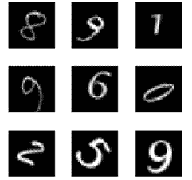

图 8.4 – MNIST 数据集

现在，我们可以检查图像在类别上的分布：

```py
ClassDist = countEachLabel(DigitData)
```

返回以下结果：

```py
ClassDist =
  10×2 table
    Label    Count
    _____    _____
      0      1000
      1      1000
      2      1000
      3      1000
      4      1000
      5      1000
      6      1000
      7      1000
      8      1000
      9      1000
```

通过这种方式，我们有证据表明图像在 10 个数字（0-9）之间均匀分布。

1.  在我们开始构建机器学习算法之前，将可用的数据分成两个不同的子集至关重要。第一个子集将作为训练数据，而第二个子集将用于算法验证。数据分区在机器学习和数据分析中起着关键作用，因为它涉及将数据集分割成多个子集进行训练、验证和模型测试。在我们的案例中，我们有 10,000 个样本，每个样本包含 1,000 张特定数字的图像。我们选择的方法是将数据分成 70% 用于训练和 30% 用于验证的部分。这个分割率被使用是因为大部分数据必须用于训练网络。因此，我们将使用 7,000 个样本进行训练，并将剩余的部分保留用于验证：

    ```py
    SplitRate = 0.7;
    [TrainDat,ValDat] = splitEachLabel(DigitData,SplitRate,'randomize');
    ```

    为了实现这一点，我们使用了 `splitEachLabel()` 函数。这个函数有效地将 `Data` 数据集中的图像文件分成两个独立的数据存储：`TrainDat` 和 `ValDat`。`TrainDat` 数据存储包含每个类别由 `SplitRate` 确定的初始部分，而 `ValDat` 数据存储包含每个类别的剩余图像。`SplitRate` 可以是 0 到 1 之间的分数值，表示分配给 `TrainDat` 的图像比例，或者它可以是一个整数，表示每个类别分配给 `TrainDat` 的确切图像数量。

1.  让我们开始构建我们的卷积网络。正如预期的那样，CNN 由一系列相互连接的层组成。首先，你需要使用一个层来导入你的输入数据：

    ```py
    layers = [
        imageInputLayer([28, 28, 1])
    ```

    `layers` 变量是一个数组，包含我们 CNN 的层列表，定义了用于深度学习的神经网络架构。为了启动这个架构，我们首先使用 `imageInputLayer`。这个层作为图像的输入，将 2D 图像数据输入到神经网络中，并执行数据归一化。此外，这个层还指定了不可修改的 `InputSize` 属性。该属性分别包含高度、宽度和通道数。在这种情况下，我们正在处理高度和宽度均为 28 的灰度图像。在输入层之后，我们建立了三个连续层的初始块：

    ```py
        convolution2dLayer(3,8,'Padding','same')
        batchNormalizationLayer
        reluLayer
        maxPooling2dLayer(2,'Stride',2)
    ```

    通过 2D 最大池化层实现下采样，该层将输入分成矩形池化区域，并随后在每个这些区域中识别最大值。

1.  接下来，我们将介绍第二组层，类似于第一组，但参数已调整：

    ```py
        convolution2dLayer(1,16,'Padding','same')
        batchNormalizationLayer
        reluLayer
        maxPooling2dLayer(2,'Stride',2)
    ```

    然后，我们添加第三个层块，以完成架构：

    ```py
        convolution2dLayer(3,32,'Padding','same')
        batchNormalizationLayer
        reluLayer
        fullyConnectedLayer(10)
    ```

    在一个全连接层（FC layer）中，输入与权重矩阵相乘，随后由偏置向量调整。在此上下文中，“参数”指定了期望的输出大小，在我们的案例中，由于我们要对`10`个不同的数字进行分类，所以是 10。这种类型的层与在传统`softmaxLayer`中常见的层配置相类似。`softmaxLayer`是一个专门用于神经网络中的层，旨在对其输入实现`softmax`函数。`softmax`函数在分类任务中得到了广泛的应用，因为它将原始分数或 logits 转换为跨越多个类别的概率分布。通常，此层作为设计用于多类分类的神经网络中的最后一个组件。它将网络的输出值转换为概率，这些概率的总和为`1`，简化了对模型预测的解释。   classificationLayer];

    分类层计算与不同且互斥类别相关的常规和加权分类任务的交叉熵损失。它通过检查前一层的输出维度来自动推断类别的数量。

1.  在训练 CNN 之前，我们需要配置设置：

    ```py
    options = trainingOptions('sgdm', ...
        'InitialLearnRate',0.01, ...
        'MaxEpochs',50, ...
        'Shuffle','every-epoch', ...
        'ValidationData',ValDat, ...
        'ValidationFrequency',30, ...
        'Verbose',false, ...
        'Plots','training-progress');
    ```

    要了解更多关于各种训练选项的信息，请阅读*第六章*，*深度学习和卷积神经网络*。

1.  是时候训练网络了：

    ```py
    CNNnet = trainNetwork(TrainDat,layers,options);
    ```

    以下图在屏幕上打印出来（*图 8**.5*）：

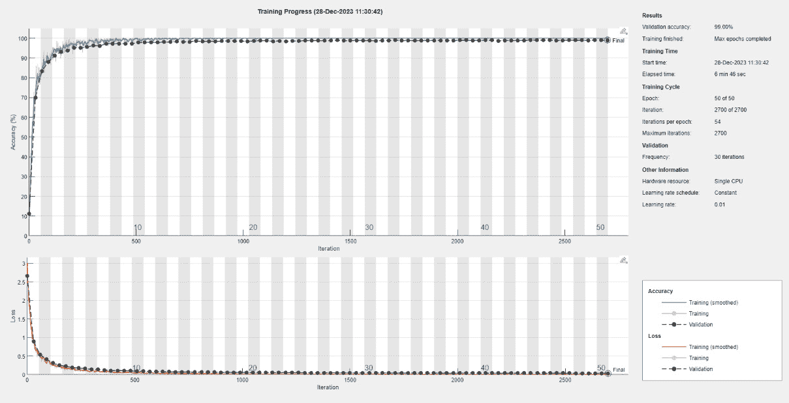

图 8.5 – 手写数字识别 CNN 的训练过程

随着训练的进行，此图将不断更新，使我们能够监控算法如何调整权重以实现收敛。我们可以看到准确率为 84.1%的结果，这表明效果良好。

自然地会问，是否有可能提高手写数字识别模型的性能。在下一节中，我们将看到如何使用迁移学习来提高模型的准确率。

# 在 MATLAB 中训练和微调预训练的深度学习模型

迁移学习是一种机器学习方法，其中为特定任务创建的模型被重新用于作为解决第二个任务的模型的初始基础。这种技术涉及利用从一个问题中获得的知识并将其应用于一个不同但相关的问题。迁移学习在深度学习和神经网络中特别有用，其中预训练模型可以被微调或用作新任务的特征提取器。

在预训练模型中，你从一个已经针对特定任务（如图像分类、自然语言处理或语音识别）在大数据集上训练过的预训练模型开始。这些预训练模型通常是具有许多层的复杂神经网络。在许多情况下，你可以使用预训练模型的层作为特征提取器。你移除最终的分类层（们），并使用早期层的激活作为新任务的特性。这在计算机视觉任务中尤为常见。你可以选择性地通过使用自己的数据集进一步训练预训练模型来微调预训练模型，以针对特定任务进行训练。这涉及到更新一些或所有层的权重，同时保留从原始任务中学到的知识。

迁移学习可以显著减少训练新任务模型所需的数据量和时间，尤其是在数据集有限的情况下。预训练模型已经从大型和多样化的数据集中学习到了有用的特征，这对于相关任务非常有价值。它可以帮助提高模型性能，当你拥有有限的计算资源或有限的标记数据时。

迁移学习在各个领域都得到了广泛应用，包括计算机视觉、自然语言处理和音频处理，并且在推进机器学习应用领域的技术前沿中发挥了关键作用。

## 引入 ResNet 预训练网络

ResNet 代表残差网络，这是一种由 Kaiming He、Xiangyu Zhang、Shaoqing Ren 和 Jian Sun 在 2015 年发表的论文《用于图像识别的深度残差学习》中引入的深刻 CNN 架构。这一开创性的架构对计算机视觉和深度学习领域产生了重大影响。

ResNet 的关键创新在于使用了残差块。在传统的深度神经网络中，随着网络的加深，训练变得越来越困难。这是因为梯度消失问题，在训练过程中，随着梯度通过网络反向传播，其值变得极其小。因此，随着深度的增加，深度网络往往会遭受性能下降的问题。

ResNet 通过引入残差块来解决这一问题，这些残差块包含跳过或快捷连接，允许梯度更容易地通过网络流动。这些快捷连接绕过一层或多层，使得训练非常深的网络变得更容易。跳过连接本质上学习了层输出和输入之间的残差（差异），因此得名“残差网络”。

我们可以总结 ResNet 的以下关键特性：

+   **深度架构**：由于使用了残差块，ResNet 可以非常深，拥有数百甚至数千层。

+   **跳过连接**：跳过连接允许梯度有效地传播，减轻了梯度消失问题。

+   **高精度**：ResNet 在各种图像分类任务上实现了最先进的性能，包括 ImageNet 大规模视觉识别挑战赛。

+   **迁移学习**：预训练的 ResNet 模型通过迁移学习广泛用作特征提取器或各种计算机视觉任务的起点。

+   **架构变体**：有几个不同深度的 ResNet 架构，例如 ResNet-18、ResNet-34、ResNet-50 以及更深的变体。

ResNet 已成为深度学习的基础架构，其跳跃连接和残差学习的原理影响了众多后续神经网络架构的设计。它不仅应用于图像分类，还应用于各种其他计算机视觉任务，包括目标检测、语义分割等。

## MATLAB 深度网络设计器应用程序

MATLAB 深度网络设计器应用程序是 MATLAB 提供的用于设计、训练和分析深度神经网络的**图形用户界面**（**GUI**）工具。它是 MATLAB 深度学习工具箱的一部分，该工具箱提供了一套全面的工具和函数，用于处理人工神经网络和深度学习。您可以通过添加层、连接它们并指定它们的属性和参数来直观地设计神经网络架构。这使得您能够轻松创建自定义网络架构。

该应用程序提供了一系列预定义层，您可以将它们拖放到网络设计中。这些层包括常见的类型，如卷积层、全连接层等。深度网络设计器应用程序简化了设计和训练深度神经网络的过程，使得对于可能不熟悉深度学习概念和编程的用户来说更加易于使用。它是研究人员、工程师和数据科学家在 MATLAB 上进行机器学习和深度学习项目时的宝贵工具。让我们更深入地了解一下：

1.  要打开深度网络设计器应用程序，只需单击 MATLAB 界面顶部的**应用**标签页中的**深度学习**部分。在**深度学习**部分，您将找到**深度网络设计器**图标。单击此图标即可打开**深度网络设计器**应用程序。或者，您可以在 MATLAB 命令窗口中输入以下命令来打开深度网络设计器应用程序：

    ```py
    deepNetworkDesigner
    ```

    此命令将启动应用程序，允许您使用 GUI 创建、设计和训练深度神经网络。您需要安装 MATLAB 深度学习工具箱才能使用深度网络设计器应用程序。如果尚未安装，您可能需要从 MATLAB 安装中单独安装它。

    将打开以下窗口（*图 8**.6*）：

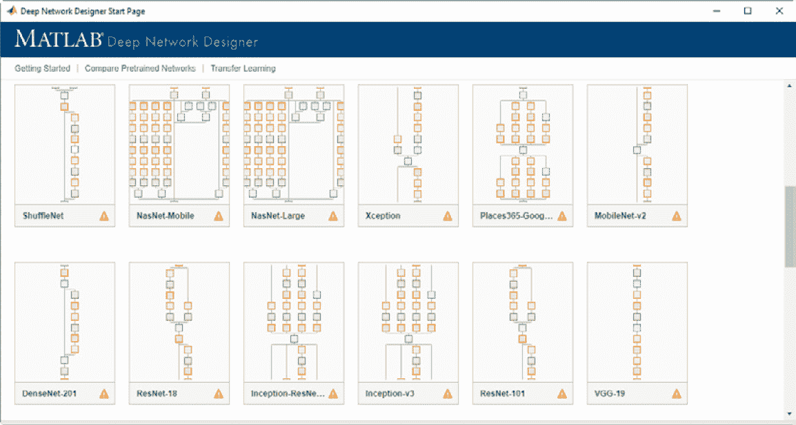

图 8.6 – 深度网络设计器起始页面

如果您找不到网络，可以使用以下命令：

```py
deepNetworkDesigner(resnet18)
```

在预训练的网络图像中，我们将找到 ResNet-18。ResNet-18 由 18 层组成，包括卷积层、残差块和全连接层。与更深层的变体（如 ResNet-50 或 ResNet-101）相比，它被认为相对较浅。像所有 ResNet 架构一样，ResNet-18 使用残差块。这些块包含跳跃连接（或快捷连接），允许在训练期间更有效地流动梯度，解决梯度消失问题。由于其在模型复杂性和性能之间的平衡，ResNet-18 在深度学习社区中得到广泛应用。它常用于图像分类、目标检测以及各种计算机视觉应用中的特征提取。其架构原则，如残差学习，影响了后续许多神经网络架构的设计。要导入 ResNet-18，需要安装相应的工具箱。

1.  导入后，我们可以导入我们将训练网络的数据库。为此，我们可以切换到应用程序的**数据**标签。点击**导入数据**图标后，将打开以下窗口（*图 8**.7*）：

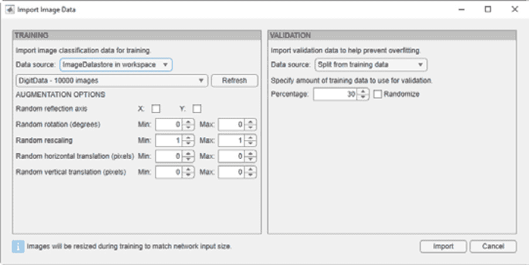

图 8.7 – 导入图像数据窗口

在**数据源**下，我们可以选择**工作空间中的 ImageDatastore**来选择已经导入到 MATLAB 工作空间中的数据，如前所述。MNIST 数据集将按*图 8**.8*所示导入：

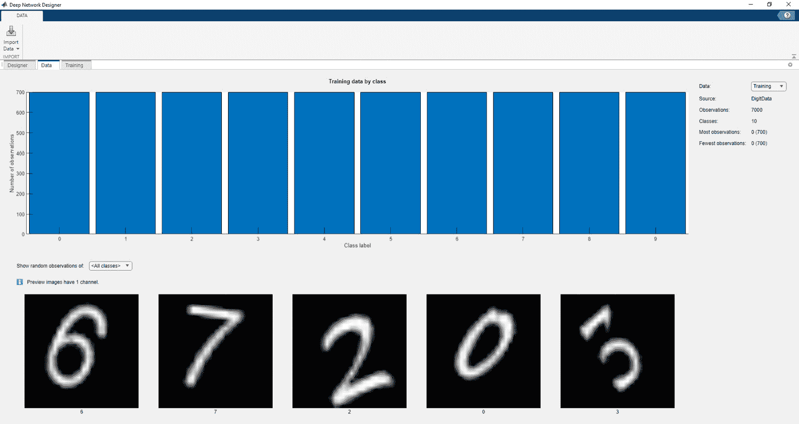

图 8.8 – 导入到深度网络设计器应用程序中的 MNIST 数据集

在*图 8**.8*中，我们可以看到图像在 10 个类别中分布良好，每个类别有 700 个图像。我们将使用 70%的数据进行训练，其余的用于验证。

1.  在这一点上，我们可以通过切换到“**设计器**”标签来设置预训练网络（ResNet-18）。我们将使用 ResNet-18 处理另一种类型的图像（一个大小为 227 x 227 x 3 的 RGB 图像）。为此，我们必须更改定义输入数据大小的第一层。点击第一层（**ImageInput**），然后点击**Canc**按钮来删除此层。

1.  之后，我们可以点击标签左侧的**ImageInputLayer**图标在**层库**中，此时我们必须将此层与下一层连接。

1.  之后，我们必须将位于“**设计器**”标签右侧的“**属性**”窗口中的`28,28,1`更改为（*图 8**.9*）。

1.  之后，我们必须更改第一层卷积。首先，我们必须删除它，然后放下一个`Convolution2Dlayer`并将其连接到另一层。然后，我们必须在“**设计器**”标签右侧的“**属性**”窗口中设置`3,3`和`64`（*图 8**.9*）：

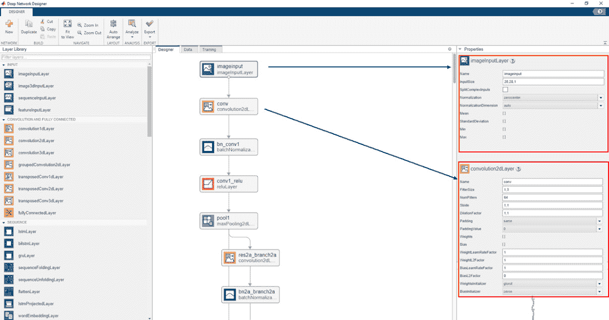

图 8.9 – 修改 ResNet-18 的前两层以适应新的输入数据

1.  现在，我们必须继续到 ResNet-18 的最后一部分，这涉及到设置分类选项。为了做到这一点，我们必须替换 FC 层和分类层，如图*图 8**.10*所示：

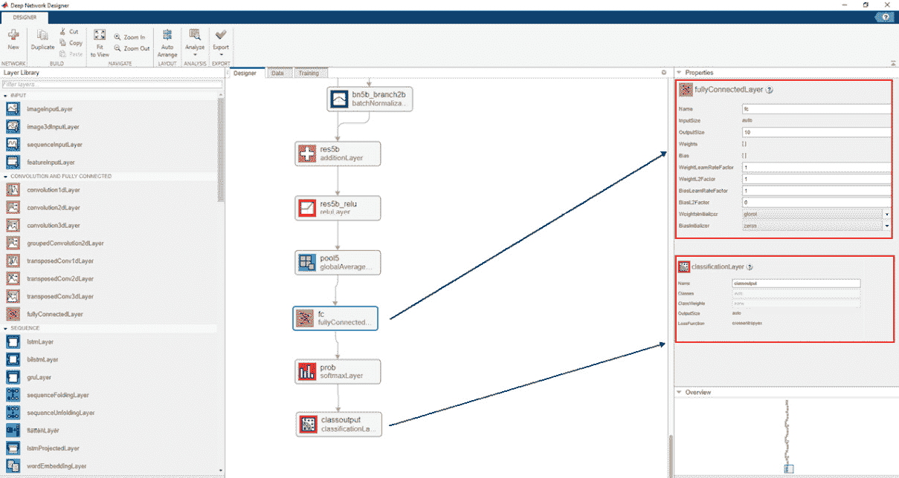

图 8.10 – 修改 ResNet-18 的最后一层以适应新的分类

为了检查层是否已正确修改，我们可以通过点击**设计师**标签页顶部的**分析**图标来测试它。

1.  现在我们已经准备好训练模型，我们可以转到 Deep Network Designer 应用程序的**训练**标签页。我们可以通过点击**训练**标签页顶部的**训练选项**图标来检查训练选项。之后，我们可以在标签页顶部点击**训练**按钮。训练过程将开始；我们将在**训练进度**窗口中检查其进度（*图 8**.11*）：

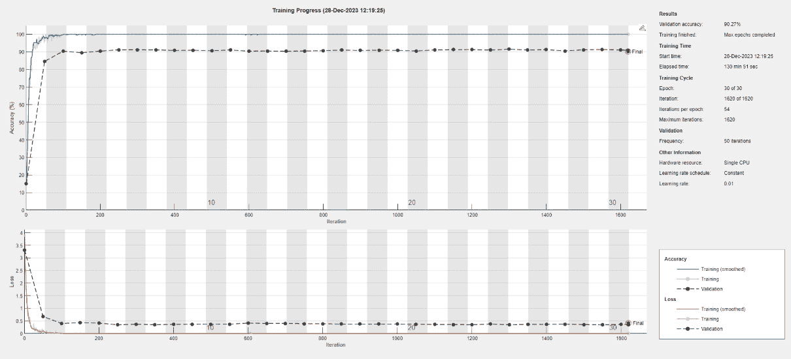

图 8.11 – 训练进度窗口

在训练过程结束时，我们将能够通过读取验证过程中获得的确切值来验证模型的性能。正如我们所看到的，我们获得了 90.27%的准确率。

现在，让我们尝试收集一些关于如何根据机器学习模型获得的结果进行解释的有用信息。

# 解释和说明机器学习模型

解释和说明机器学习模型对于理解它们的预测、使它们更加透明和可信至关重要，尤其是在解释性至关重要的应用中。这是一个需要数据科学家、领域专家和利益相关者之间协作的持续过程。解释技术选择取决于模型类型、问题域和应用程序所需的透明度水平。根据具体用例，在模型复杂性和可解释性之间取得平衡很重要。

## 理解显著性图

显著性图是一种可视化技术，用于计算机视觉和深度学习，以理解和解释神经网络预测，特别是在图像分类和对象识别任务中。显著性图有助于识别输入图像或特征图中哪些区域与模型的预测最相关。它们特别有助于深入了解神经网络为何做出特定决策。

显著性图是通过基于梯度的方法生成的，通常是反向传播。其思路是计算模型输出相对于输入图像像素的梯度。通过计算这些梯度，您可以确定输入图像中哪些像素对模型的预测影响最大。换句话说，显著性图突出了模型在做出决策时关注的区域。显著性图通常以热图的形式叠加在原始输入图像上。在热图中，颜色的强度对应于每个像素的重要性。高强度的区域表示对模型输出有强烈影响的区域：

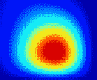

图 8.12 – 显著性图作为热图

显著性图提供了对神经网络预测的解释性。通过检查显著性图，您可以查看图像的哪些部分与特定特征相似并有助于决策。这些图可用于模型调试和改进。如果模型的预测看起来不正确，检查显著性图可以揭示模型是否关注正确的或错误的功能。显著性图有几种变体，例如特定类别的显著性图（突出显示特定类别的特定特征）和基于梯度的方法，如引导反向传播和 SmoothGrad，这些方法提高了显著性图的可解释性。

重要的是要注意，显著性图提供了对模型行为的洞察，但并不一定以人类可理解的方式解释为什么神经网络做出了特定的决策。它们只是解释工具箱中的一个工具，通常与其他技术结合使用，以更全面地理解模型决策。

## 理解特征重要性分数

特征重要性分数是一组指标或值，表示不同输入特征（也称为变量或属性）在机器学习模型预测中的相对重要性。这些分数有助于数据科学家和分析人员了解哪些特征对模型输出的影响最大。特征重要性分数对于特征选择、模型解释和调试特别有价值。

存在一些常见的方法和技术用于计算特征重要性分数：

+   **Gini 重要性**：在决策树和随机森林中，Gini 重要性衡量特征在树节点上分割数据时的使用频率。较高的值表示更重要的特征。

+   **杂质减少的平均值**：与 Gini 重要性相似，此指标计算在特定特征用于分割时，杂质（或杂质减少）减少的程度。

+   **系数幅度**：在线性模型中，系数的幅度（绝对值）表示特征的重要性。较大的系数表示更大的重要性。

+   **置换特征重要性**：这种方法涉及随机置换单个特征的价值，同时保持其他特征不变，并测量模型性能下降的程度。性能的显著下降表明这是一个重要的特征。

+   **递归特征消除** (**RFE**)：RFE 是一种迭代方法，从所有特征开始，根据模型性能逐渐移除最不重要的特征。特征被移除的顺序表明了它们的重要性。

+   **SHapley Additive exPlanations** (**SHAP**)：SHAP 值通过考虑所有可能的特征组合，提供了一个统一的特征重要性度量。它们可以应用于各种模型，包括深度学习模型。

特征重要性计算方法的选择取决于所使用的机器学习算法、数据集和实际问题。不同的算法可能提供不同的特征重要性排名，因此考虑多种方法并使用领域知识来有效解释结果至关重要。特征重要性分数有助于识别相关特征、降低维度并提高模型的可解释性。

## 发现基于梯度的属性方法

基于梯度的属性方法，也称为基于梯度的属性技术，是用于理解和归因于机器学习模型输出中单个特征或输入元素贡献的方法。这些方法依赖于梯度，梯度表示模型输出对输入特征变化的敏感性。以下是一些在机器学习中常用到的基于梯度的属性方法：

+   **梯度显著性**：显著性图强调影响模型预测的输入图像中最相关的区域。这些图是通过计算模型输出关于输入图像像素的梯度来创建的。梯度高的区域对应于具有显著相关性的区域。

+   **集成梯度**：集成梯度通过计算从参考输入（通常是全零）到实际输入的路径上关于输入的累积积分，为每个输入特征分配属性分数。这种方法提供了对特征重要性的更全面的理解。

+   **引导反向传播**：引导反向传播是一种修改后的反向传播算法，在反向传播过程中仅保留正梯度。这有助于突出输入特征对预测的积极贡献，并抑制消极贡献。

+   **SmoothGrad**：SmoothGrad 通过在多个扰动的输入版本上平均梯度并可视化平滑后的梯度值，减少了显著性图中的噪声。

+   **层级相关性传播**（**LRP**）：LRP 是一种归因方法，它为网络隐藏层中的每个神经元分配相关性分数，并将它们反向传播到输入特征。它提供了细粒度的特征相关性信息。

+   **反卷积网络**（**DeconvNets**）：DeconvNets 旨在逆转神经网络中卷积层的效果。它们有助于可视化网络不同层的特征图，以了解每个层学到了什么。

+   **梯度类激活映射**（**GradientCAM**）：GradientCAM 结合了梯度信息与类激活映射技术，以突出显示对特定类别预测重要的输入图像区域。

基于梯度的归因方法对于模型可解释性和调试非常有价值。它们有助于识别哪些特征或输入的部分对驱动模型决策有影响。选择正确的归因方法取决于模型架构、数据集和解释的具体目标。这些方法提供了对模型行为的洞察，并有助于在 AI 系统中建立信任。

# 摘要

在本章中，我们了解了计算机视觉的基本概念以及如何使用 MATLAB 实现对象识别模型。我们首先介绍了图像处理和计算机视觉。我们学习了有哪些工具可以处理图像，以及计算机视觉如何用于对象识别、运动检测和模式识别。然后，我们探讨了 MATLAB 的计算机视觉工具，以及 MATLAB 提供的功能和功能如何为计算机视觉应用的开发和原型设计创建一个强大的环境。无论你的重点是图像分析、对象检测、3D 重建或任何相关应用，MATLAB 都提供了必要的工具和功能来有效地支持你的工作。

之后，我们学习了如何使用 CNN 和 MNIST 数据集在 MATLAB 中构建对象识别模型。我们了解了如何将图像数据导入 MATLAB 工作空间，以及如何使用图像来训练 CNN。然后，我们学习了如何在 MATLAB 中使用预训练的深度学习模型来提高对象识别模型的表现。最后，我们介绍了一些用于解释和说明深度学习模型的工具。

在下一章中，我们将深入探讨与序列数据相关的根本概念，并探讨构建模型以捕捉时间序列或任何一般序列中模式的过程。我们将学习时间序列数据的基本概念，如何从序列数据中提取统计信息，以及如何实现预测股票市场数据的模型。最后，我们将了解过采样、欠采样和成本敏感学习。
