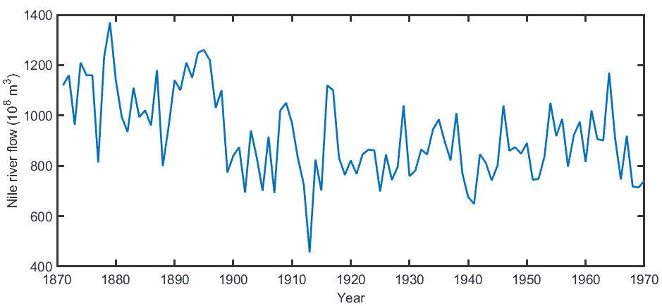
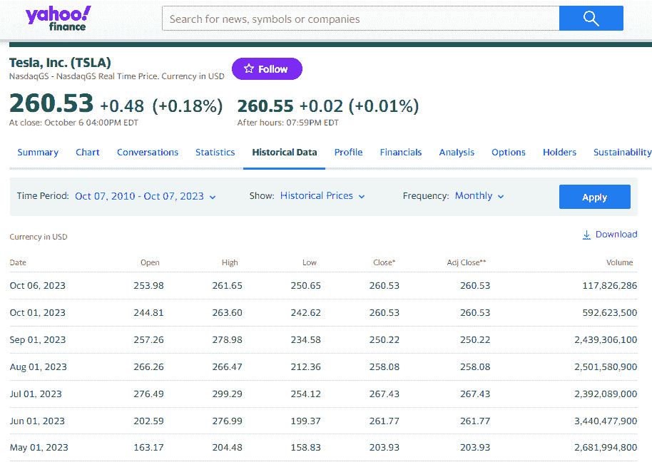
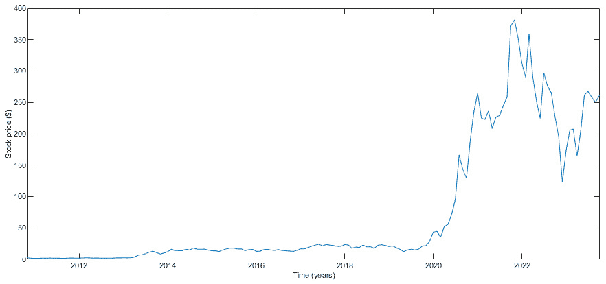
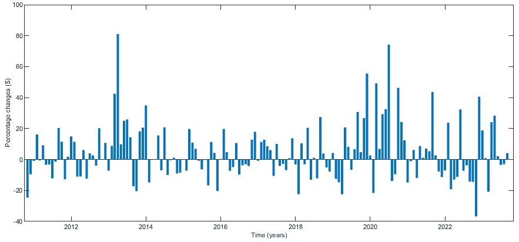
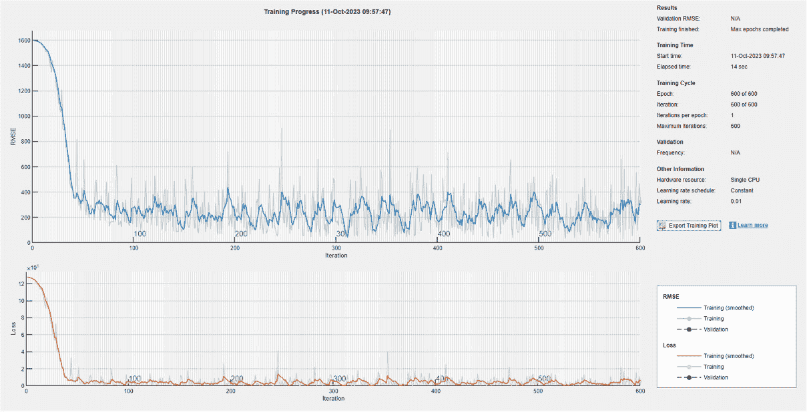
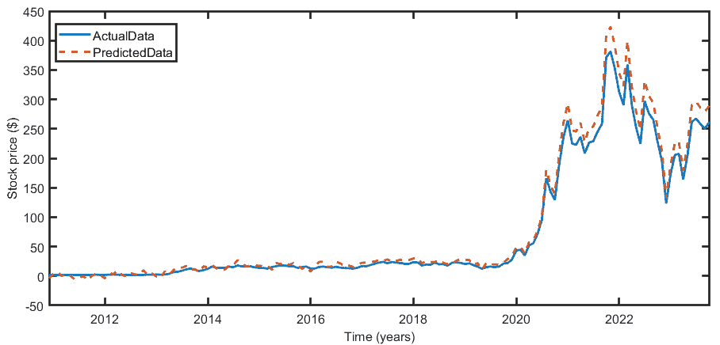

# 9

# 使用 MATLAB 进行时间序列分析和预测

时间序列数据是在一定时期内收集的一系列测量值。这些与特定变量相关的测量值在固定间隔发生。时间序列数据的一个基本特征是其顺序的重要性；观察值在时间线上的排列传达了有意义的模式。改变这种顺序可以完全改变数据的含义。序列数据是一个更广泛的概念，包括以序列方式呈现的任何数据，这包括时间序列数据。在本章中，我们将深入研究围绕序列数据的基本概念，阐明如何构建捕捉时间序列或任何序列数据中模式的模型。

在本章中，我们将涵盖以下主要主题：

+   探索时间序列数据的基本概念

+   从序列数据中提取统计数据

+   实现一个用于预测股市数据的模型

+   在 MATLAB 中处理不平衡的数据集

# 技术要求

在本章中，我们将介绍基本的机器学习概念。为了理解这些主题，需要具备代数和数学建模的基本知识。你还需要掌握 MATLAB 的实际操作技能。

要使用本章中的 MATLAB 代码，你需要以下文件（可在 GitHub 上找到，网址为[`github.com/PacktPublishing/MATLAB-for-Machine-Learning-second-edition`](https://github.com/PacktPublishing/MATLAB-for-Machine-Learning-second-edition)）：

+   `Nile.csv`

+   `TSLA.csv`

+   `TeslaStockForecasting.m`

# 探索时间序列数据的基本概念

时间序列代表了一系列按时间顺序记录的观察值，例如月收入、日股价、周利率、年利润等。时间序列分析的主要目标是考察现象随时间的历史演变，以预测其未来的轨迹。这种预测洞察力源于这样一个假设：过去观察到的重复模式将继续在未来显现。我们将探讨预测预测和不同的预测方法，提供对两者的详细描述。

## 理解预测预测

预测变量的轨迹对于制定任何事业的生产策略和计划至关重要。例如，在规划公司的生产策略时，仅仅了解产品或服务的需求是上升还是下降是不够的。预测产品需求、定价动态和原材料成本的未来趋势是至关重要的。这些因素共同对生产活动产生重大影响。

预测在整个决策过程中占据核心地位。当预测不精确或不足时，存在使从复杂的决策模型中得出的结论无效的实质性风险。“预测过程”一词涵盖了各种复杂活动，无论是明显的还是隐秘的，最终都归结为预测的创建。

术语*预测*和*预测*经常被互换使用，但区分它们的含义是有益的。预测涉及将概率与未来事件相关联或定义置信区间以估计未来可能发生值的范围。相反，预测包括确定一个可测量量在未来的确切值。因此，通过使用传统的推断统计工具来推导相应的置信区间，将预测与使用这些工具做出的预测联系起来是直接的。所有预测模型的主要目标是确定预期值的估计，以及预测模型可能产生的潜在误差的估计。

预测范围是区分预测过程的关键因素。预测可以涉及短期未来，长达 12 个月，作为运营决策的基础。这可能包括预测未来 2 个月的产品需求。或者，预测可以延伸到中期，从 12 个月到 24 个月，支持与生产计划相关的决策。在第三种情况下，预测针对的是更远的未来，超过 24 个月。在这种情况下，它们被制定来支持有关公司发展计划的经理决策。在这三种情况下，每个都由短期、中期或长期预测范围特征化，寻求利用这些预测的决策者的目标差异很大。同样，对这些相应预测所需的精确度和详细程度也各不相同。

## 介绍预测方法

预测方法是指基于历史数据和模式预测未来值、趋势或事件的各种技术和方法。这些方法在包括经济学、金融、商业和气象学在内的众多领域中至关重要。预测方法主要取决于它们支持决策的特征和目的。诸如时间跨度的持续时间、历史数据的质和一致性，以及被预测产品的特定属性（如其在生命周期中的阶段）等因素在确定适当的预测方法中起着重要作用。

从本质上讲，预测方法可以分为两大类：**定量方法**和**定性方法**。

### 解释定量预测方法

当有足够的定量数据可用时，会采用定量方法，这使得基于历史数据对未来结果进行预测成为可能。通常，这些方法用于做出短期至中期决策。以下是一些定量预测方法的例子：

+   **时间序列分析**：在这种方法中，要预测的现象被视为一个不透明的实体，重点不在于识别影响因素。这种方法的目标是识别现象演变中的过去模式，并将这些模式扩展到未来以进行预测。简单来说，预测基于现象随时间的历史行为，而不是与解释变量相关联。例如，这种方法常用于分析销售趋势、GDP 趋势和类似数据。

+   **回归分析**：回归模型量化了一个或多个预测变量与响应变量之间的相关性。这些方法基于这样一个假设，即要预测的变量可以与一个或多个独立或解释变量相关联。这种方法适用于预测数值结果，并且在经济学、金融和社会科学中常用。例如，家庭对消费品的需求被认为受收入、家庭成员的年龄和其他相关变量的影响。

+   **指数平滑**：指数平滑技术为先前观察分配指数递减的权重，优先考虑较近数据点的显著性。这有助于平滑噪声并识别时间序列数据中的趋势。

+   **机器学习**：包括决策树、随机森林和神经网络在内的机器学习算法在预测任务中找到应用，尤其是在处理大量数据集或复杂关系时。它们可以捕捉非线性模式，并在各种预测应用中越来越被采用。

这些方法在以下条件下适用：

+   关于现象先前模式的历史数据是可获得的

+   可以量化这些历史信息

+   可以合理地假设，表征过去趋势的属性将延续到未来，从而允许进行准确的预测

实质上，当有足够的可量化历史数据时，会采用定量方法。

### 描述定性预测方法

定性方法主要依赖于判断，这使得它们依赖于消费者和专家的观点和评估。当定量数据稀缺而定性信息充足时，这些方法就会发挥作用。以下是一些说明定性方法应用的实例：

+   **专家判断**：定性预测通常依赖于领域专家的专业知识和意见。德尔菲法和专家小组是收集知识渊博的个人意见的技术示例。

+   **市场研究**：定性研究方法，如调查、焦点小组和客户访谈，用于收集有关消费者偏好、行为和市场趋势的信息。这些数据对于预测未来的市场条件非常有价值。

+   **情景分析**：定性预测可以包括创建关于可能未来事件的多个情景或叙述。决策者随后考虑这些情景以做出明智的决策。

+   **历史类比**：这种方法涉及根据与过去事件或情况的相似性进行预测。在处理独特或新颖的情况时，这可能是有用的。

+   **专家系统**：专家系统和由人工智能驱动的工具可以通过汇总和解释来自各种来源的数据来协助进行定性预测，从而提供洞察和预测。

预测中定量方法和定性方法的选择取决于多种因素，包括数据的性质、历史信息的可用性、特定的预测目标以及涉及的主观程度。在许多情况下，结合使用定量和定性方法可以提高预测的准确性和稳健性，尤其是在复杂的决策环境中。

## 时间序列分析

时间序列代表了一系列与现象相关的观察结果，这些观察结果是在连续的时间点或间隔上记录的。这些间隔通常是均匀的，尽管不总是这样。时间序列数据的实例包括商品价格趋势、股票市场指数、BTP/BUND 利差和失业率等多样化的元素。

与经常假设独立观察结果来自单个随机变量的经典统计学不同，时间序列分析假设有 *n* 个观察结果来自众多相互依赖的随机变量。因此，时间序列分析涉及一个旨在解读观察数据背后的潜在生成过程的程序，而不是将每个观察结果视为独立且同分布的。

根据收集到的数据，时间序列数据可以分为两大类：

+   **连续时间序列**：数据在特定时期内连续记录，没有任何间隔或中断。这种类型的时间序列在传感器数据等应用中很常见，其中测量是在非常短的时间间隔内进行的，通常是在实时。例如，每秒记录的温度读数、每分钟更新的股票价格或连续间隔的心率监测。

+   **离散时间序列**：数据在特定的、离散的时间间隔内记录，这些间隔不一定均匀。这些间隔可以是每日、每周、每月、每年或任何其他预定的周期。离散时间序列数据常用于经济、金融和社会科学中，以分析随时间变化的趋势和模式。例如，包括月度销售额、年度 GDP 增长率或周度网站流量统计。

选择连续时间序列和离散时间序列取决于收集数据的性质和分析的具体目标。每种类型的时间序列都有其自己的统计技术和工具，用于建模、预测和提取有意义的见解。

时间序列数据也可以根据数据生成过程的潜在性质分为两大类：

+   **确定性时间序列**：这种类型的特点是数据点之间存在清晰且可预测的模式或关系。确定性时间序列中的数据值遵循特定的数学函数或规则。确定性模式可以用数学方程式或公式表示，可能包括周期性或季节性变化、趋势或特定的数学关系。确定性时间序列通常表现出很少或没有随机性，使其高度可预测。这类时间序列的例子包括表示一年内每日温度变化的正弦波、股价的线性趋势，其中价格随着时间的推移持续增加或减少，以及受已知季节性模式（如假日销售）影响的月度销售额。

+   **随机时间序列**：这种类型的特点是随机性，数据点不受特定确定性规则的支配。相反，它们受随机或概率因素的影响。随机时间序列表现出固有的随机性，使得确定性地预测未来值变得具有挑战性。它们通常涉及不确定性、噪声和随机性等元素，这些元素不能完全由确定性模型解释。统计技术，如**自回归积分移动平均**（**ARIMA**）模型或状态空间模型，通常用于分析和预测随机时间序列。这类时间序列的例子包括受多种不可预测因素影响的股价，其每日波动无法精确预测，每日天气条件，其中降雨量或温度等变量可能随机变化，以及受用户行为和外部因素影响的每日网站流量，导致随机波动。

在实践中，许多现实世界的时序数据包含确定性和随机性成分的组合。有效地分析和建模时序数据通常需要识别和分离这些成分，以获得洞察力并做出准确的预测或预测。当潜在模式定义良好且稳定时，确定性模型是有用的，而当随机性在数据中扮演重要角色时，则采用随机模型。

事实上，当处理同时表现出确定性和随机性成分的时序数据时，通常将序列表示为这两个贡献的总和。这种方法有助于更全面地理解数据，并促进建模和分析。数学上，它可以表示如下：

Y t = f(t) + w(t)

这里，我们有以下内容：

+   *Y**t*：这代表时间*t*观察到的时序数据

+   *f(t)*：这代表时间*t*的确定性成分或贡献

+   *w(t)*：这代表时间*t*的随机（随机）成分或贡献

通过将时序分解为其确定性和随机部分，分析师和研究人员可以进行以下操作：

+   **分析趋势**：确定性成分通常包括趋势、季节性和其他可以单独分析的有序模式，以了解潜在的动态。

+   **模型随机行为**：随机成分捕捉数据中的随机波动和噪声。例如，**ARIMA**或**广义自回归条件异方差性**（**GARCH**）等模型可以应用于该成分进行预测或风险评估。

这种分解方法增强了做出预测、识别异常和深入了解影响时序数据因素的能力。

使用时间表示为*t = 1 …. T*，我们表示序列，yt。时间作为控制事件序列的关键参数，不容忽视。因此，理解观察时间维度的位置变得至关重要。通常，这种信息以(*t*, *yt*)对的形式表示在笛卡尔图上，创建一个连续的线图，传达连续检测现象的印象。这种图形表示通常被称为时序图（*图 9**.1*）。

要了解如何绘制序列图，我们可以使用本书 GitHub 仓库中的`Nile.csv`文件。此文件提供了从 1871 年到 1970 年阿斯旺尼罗河年流量的数据，以 108 立方米的单位测量。我们可以使用以下代码将此数据集导入 MATLAB：

```py
Nile = readtable('Nile.csv');
```

要绘制时序图，我们可以使用以下命令：

```py
plot(Nile.time,Nile.Nile)
```

我们使用了点格式，其中`time`和`Nile`是所选两个特征的名称。以下时序图将被绘制：



图 9.1 – 阿斯旺尼罗河年流量测量

如*图 9**.1*所示，数据在 1898 年左右似乎有一个显著的变化点，表明在该时期河流流量特征发生了显著的变化或转变。

时间序列图可以立即揭示趋势、重复模式和其他随时间演变的系统性行为。在前面的图表中，我们可以看到年度数据表现出持续下降的趋势，跨越相当长的时间框架。值得注意的是，由于数据是按月记录的，因此存在重复的锯齿形模式，这表明季节性。值得注意的是，在预期降雨的月份，高峰值出现得非常一致。

时间序列的单变量分析旨在解码序列背后的动态过程，并预测现象未来的发生。在此分析中，我们专注于数据对(*t, yt*)，其中*t = 1, ……,T*。这里的关键概念是，过去和现在的数据都包含对未来现象发展趋势进行预测的有价值信息。

然而，我们必须认识到，在某些情况下，单变量分析可能过于限制。通常，我们拥有与所考虑现象相关的信息，这些信息应适当整合以增强模型的预测能力。尽管如此，单变量分析仍然是一个有价值的基线，使我们能够验证更复杂的建模方法。

在时间序列图中，可以识别出关于时间进展的四种不同模式：

+   **水平模式**：在这种情况下，序列围绕一个常数值波动，这通常是序列的平均值。这样的序列被称为平均上稳定。这种模式在质量控制中很常见，其中过程始终保持在平均值周围。

+   **季节性模式**：当序列受到诸如月度、半年或季度等重复季节性因素的影响时，就会出现季节性模式。如冰淇淋、软饮料和电力消耗等产品通常表现出季节性模式。这些受季节性影响的时间序列也被称为周期性序列，因为季节性循环在固定间隔内重复。在年度数据的情况下，季节性可能不明显。

+   **周期性模式**：周期性模式的特点是序列中存在不规则的增加和减少，这些变化并不遵循固定的周期。这区别于季节性波动。此外，周期性振荡通常比季节性变化具有更大的振幅。在经济序列中，周期性模式是由投机现象引起的经济扩张和收缩所驱动的。

+   **趋势**：趋势通过序列中持续的、长期的增长或下降来识别。例如，全球人口序列体现了增长趋势，而每月啤酒销售序列可能不显示任何可辨别的趋势，而是具有稳定的水平背景模式。

许多时间序列都表现出这些模式的组合，正是这种复杂性为预测任务增添了高度的兴趣。预测方法必须具备辨别和复制序列各种成分的能力。这涉及到过去模式将持续并继续在未来表现出其特征特征的假设。

时间序列分析的经典方法涉及将序列的确定性部分分解成一系列信号成分，这些成分传达了序列的结构信息，同时过滤掉了可忽略的噪声。在实践中，我们的目标是识别时间序列趋势中的一些先前提到的模式。

在时间序列分析中，使用三个基本成分来建模和理解数据中的潜在模式：趋势、季节和残差成分。这些成分有助于将时间序列分解为其组成部分，使其更容易分析和准确预测数据：

+   **趋势成分**：它代表了时间序列中的长期、系统性和通常平滑的运动或方向。它反映了数据在较长时间内的潜在、持续的变动或增长（增长趋势）或下降（下降趋势）。趋势成分旨在捕捉时间序列的整体行为，对于理解其基本轨迹至关重要。

+   **季节成分**：它解释了时间序列中遵循固定和已知周期的重复模式或波动。这些模式以固定的时间间隔重复，如每日、每月、每季度或每年。季节性通常与外部因素有关，如天气、假日或商业周期，并且随着时间的推移具有可预测的重复性。

+   **残差成分**：这个成分，也称为误差或噪声，代表了时间序列数据中的随机波动或未解释的变异性。它包括趋势和季节成分未考虑的所有信息。分析残差成分有助于识别数据中的不规则性、异常值或意外事件。

从数学上讲，一个时间序列（*Y**t*）可以表示为这三个成分的总和。将时间序列分解为这些成分是时间序列分析的基本步骤。一旦分离，分析师可以单独对每个成分进行建模，应用适当的统计技术，并做出更准确的预测。这种分解有助于理解数据的潜在动态，并为决策和预测提供有价值的见解。

让我们看看时间序列建模的不同方法以及如何从这些类型的数据中提取知识。

# 从顺序数据中提取统计数据

时间序列数据代表在一定时期内收集的一系列测量值。这些测量值与一个特定变量相关联，并且以固定的时间间隔获得。时间序列数据的一个基本特征是其固有的顺序，沿着时间线的观察排列传达了重要的信息。改变序列可以完全改变数据的含义。在更广泛的范围内，顺序数据包括任何按顺序呈现的数据，包括时间序列数据。

我们的主要目标是开发能够捕捉时间序列数据或任何顺序数据中潜在模式的模型。这些模型在描述时间序列模式的基本方面起着关键作用。它们使我们能够探索过去数据如何影响未来，检查数据集之间的相关性，进行未来预测，或根据特定指标控制变量。为了直观地表示时间序列数据，我们通常使用折线图或柱状图。时间序列数据分析在各个领域得到广泛应用，包括金融、信号处理、天气预报、轨迹预测、地震预测以及任何处理时间数据的领域。

在时间序列和顺序数据分析领域，我们构建的模型必须考虑数据顺序并提取相邻数据点之间的关系。现在，让我们探索一些用于分析时间序列和顺序数据的 MATLAB 代码示例。

## 在 MATLAB 中将数据集转换为时间序列格式

时间序列代表在连续时刻或时间间隔收集的现象观察序列，通常是均匀间隔或一致持续时间，尽管不一定如此。认识到时间在时间序列分析中起着基本作用至关重要。首先，我们需要提高处理描述特定现象长期观察的数据的熟练度。我们的第一步将涉及学习如何将观察序列转换为时间序列数据，然后对其进行可视化。

在 MATLAB 中，为了充分处理时间序列数据，我们可以使用`timetable`对象。时间表是一种专门为处理时间序列数据设计的表格形式。类似于常规表格，时间表按列存储数据变量，允许存储各种数据类型和大小，只要它们具有相同的行数。除了这种灵活性之外，时间表还提供针对时间相关操作的特殊函数，使跨一个或多个时间表对带时间戳的数据进行对齐、组合和计算成为可能。

时间表中的行时间由 datetime 或 duration 值组成，这些值作为单个行的标签。您可以通过行时间和变量来访问和操作时间表。要访问时间表中的特定元素，您可以使用圆括号*()*检索子表或花括号*{}*提取其内容。此外，您可以使用各自的名称引用变量和行时间向量。为了识别和注释时间表中的事件，您可以将其与事件表关联起来。事件表包含事件时间的记录、相应的事件标签以及与事件相关的其他详细信息。

首先，我们将看看如何从这样的数据中创建时间表。假设我们已经在时间表中存储了关于河流流量在不同时间测量的数据。除了存档之外，时间表还提供了与指定时间同步数据的功能。此外，我们还可以记录时间，以便添加更多关于测量条件和要测量的其他变量的信息。因此，我们可以将时间与工作区中存在的变量关联起来。变量中包含的值成为对象行的时刻。所有其他输入参数成为时间相关的变量。让我们学习如何格式化时间表数据：

1.  首先，我们必须创建包含变量的向量，从时间向量开始：

    ```py
    TimeData = datetime({'01.01.1871';'01.01.1872';'01.01.1873';
    '01.01.1874';'01.01.1875'});
    TempData = [22.1;21.1;23.2;21.9;22.5];
    RiverFlow = [1120;1160;963;1210;1160];
    ```

    首先，我们有测量时间，然后是此时此地测量的温度值，最后是单位为 108 立方米的河流流量值。为了设置时间格式，我们使用了`datetime()`函数：datetime 数组包含与每个记录时间点相关的年、月、日、小时、分钟和秒组件信息，遵循前瞻性 ISO 日历系统。此外，datetime 数组提供了灵活的输出和输入文本格式，支持存储精确到纳秒的分数秒，并具有处理时区、夏令时和闰秒等考虑的属性。

1.  使用的数据经过校正并添加到时间向量中，格式与数据类型兼容。现在，我们可以使用`timetable()`函数来创建对象：

    ```py
    NileRiverFlow = timetable(TimeData, TempData, RiverFlow);
    ```

1.  在 MATLAB 工作区中创建了一个新的时间表对象。我们可以如下检查对象的类型：

    ```py
    class(NileRiverFlow)
    ans =
        'timetable'
    ```

1.  为了理解`timetable()`函数如何处理数据，我们将按照如下方式打印创建的对象：

    ```py
    NileRiverFlow
    NileRiverFlow =
      5×2 timetable
         TimeData      TempData    RiverFlow
        ___________    ________    _________
        01-Jan-1871      22.1        1120
        01-Jan-1872      21.1        1160
        01-Jan-1873      23.2         963
        01-Jan-1874      21.9        1210
        01-Jan-1875      22.5        1160
    ```

1.  时间线也可以基于某些参数的特定值构建。例如，我们可以使用 MATLAB 工作区中已存在的`RiverFlow`变量，将其每个值与在特定时间线上定义的特定时间值关联起来。例如，我们可以定义时间步如下：

    ```py
    NileRiverFlow2 = timetable(RiverFlow,'TimeStep',years(1),
    'StartTime',years(1870));
    ```

我们将`TimeStep`设置为一年，将`StartTime`设置为 1870 年。通过这样做，`RiverFlow`的一个值与从 1870 年开始的一年增量关联到一个新的一年。

## 理解时间序列切片

切割和切块是两个在数据集上下文中使用的表达，表示将大量数据集分割成更小的部分或从不同角度考察以获得更深入见解的过程。这些术语从烹饪术语中借鉴而来，描述了厨师必须熟练执行的两种基本刀工技术。切割涉及切割，而切块则涉及将食物切成细小的均匀部分，通常连续进行。在数据分析中，切片和切块的概念通常包括将大型数据集系统地分解成更易于管理的部分以提取更多信息。

在 MATLAB 中，时间表是一种特殊的表格形式，它将特定的时间与每一行关联起来。您可以通过各种方法有效地提取其数据的时间相关子集，例如识别指定范围内的时刻或匹配重复的时间间隔。

在学习了如何从工作区中的变量创建时间表对象之后，我们可以学习如何将外部文件导入 MATLAB 作为时间表对象：

1.  我们将使用在*探索时间序列数据的基本概念*部分使用的`.csv`文件。我指的是`Nile.csv`文件；我们可以使用以下命令导入此文件：

    ```py
    NileRiverFlowData = readtimetable('Nile.csv');
    ```

    现在，让我们学习如何访问这种特定类型的数据。您可以使用点符号来检索时间表的行时间。此外，您可以通过单独使用点符号来访问特定变量，或者使用其名称来访问时间表中的所有数据，就像我们刚才做的那样。

1.  要显示时间序列对象的头两行，我们可以使用以下命令：

    ```py
    NileRiverFlowData(1:2,:)
    ```

    以下数据被打印出来：

    ```py
    NileRiverFlowData(1:2,:)
    ans =
      2×1 timetable
           time       Nile
        __________    ____
        01.01.1871    1120
        01.01.1872    1160
    ```

1.  要仅访问一个变量的数据，我们可以使用点符号，如下所示：

    ```py
    NileRiverFlowData.Nile(1:2)
    ```

1.  使用`NileRiverFlowData.Variables`语法检索整个时间表数据作为矩阵。此语法依赖于时间表的第二维名称，并且与通过花括号索引访问所有内容功能相同：

    ```py
    NileData = NileRiverFlowData{:,:};
    ```

    然而，需要注意的是，生成的矩阵没有包含行时间，因为行时间向量被视为时间表中的元数据，而不是作为变量处理。在时间表数据无法有效地连接到矩阵的情况下，将生成错误消息。

1.  要定位特定范围内的数据，您可以使用`timerange`函数，该函数为索引建立基于时间的子脚本。例如，您可以设置一个从 1880 年 1 月 1 日开始，到 1920 年 1 月 1 日结束的范围。需要注意的是，默认情况下，`timerange`函数定义了一个半开区间，包括左端点但排除右端点：

    ```py
    TimeRange = timerange('01.01.1880','01.01.1920');
    ```

1.  现在，我们可以从这个范围中切割出数据集的一部分，如下所示：

    ```py
    DataTimeRange = NileRiverFlowData(TimeRange,:);
    ```

新数据集包含从 1880 年 1 月 1 日开始到 1919 年 1 月 1 日结束的数据。

## 在 MATLAB 中重采样时间序列数据

让我们看看如何在 MATLAB 中重采样时间序列数据。这项任务涉及更改数据的频率或时间间隔，同时保留关键信息。这可以用于各种目的，例如将数据聚合到更粗的时间尺度，将数据插值到更细的时间尺度，或将来自不同来源的数据与公共时间网格对齐。MATLAB 提供了多种函数和方法来重采样时间序列数据。以下是一个基本示例，说明如何进行操作。

我们首先使用 `retime()` 函数，如下所示：

```py
WeeklyData = retime(NileRiverFlowData,'weekly','spline');
```

此函数在处理与重复或不规则时间条目相关的问题的同时，对时间表内的数据进行重采样或合并。`retime()` 函数通过结合初始数据中的变量生成时间表，并强制行时间保持一致的时间步长。此函数根据指定方法在初始变量内对数据进行重采样或合并。`retime()` 可以应用于从不同时间戳的初始值插值数据值，将数据聚合到时间间隔内，消除时间表中具有重复时间戳的行，并通过施加由新 *时间步长* 定义的有规律行时间，将不规则时间表转换为规则时间表。

在此示例中，我们通过添加从月度开始的每周数据来重采样数据集，但重采样数据的方法有很多种。我们根据相邻行进行数据值插值。输入时间表必须按顺序排序且行时间唯一是至关重要的。有四种不同的插值类型可用：

+   `linear`：线性插值

+   `spline`：分段三次样条插值

+   `pchip`：形状保持的分段三次插值

+   `makima`：修改后的 Akima 三次样条插值

使用相同的函数（`retime()`）可以聚合时间序列数据。`retime()` 函数提供了聚合选项，包括平均值。例如，我们可以对给定数据按月计算平均值：

```py
MonthlyData = retime(NileRiverFlowData,'monthly','mean');
```

以这种方式，我们使用平均值作为聚合标准，对先前重采样的每周数据进行聚合。

## 移动平均

移动平均是分析时间序列数据常用的方法。它涉及计算在特定窗口或时间间隔内移动的时间序列中的数据点的平均值。这有助于平滑波动并突出数据中的潜在趋势。移动平均有不同类型，例如**简单移动平均**（**SMA**）和**指数移动平均**（**EMA**），每种都有其特点和用例。

简单移动平均（SMA）是分析时间序列数据的基本且广泛使用的方法。它是一种统计计算，有助于平滑数据中的波动，以识别趋势或模式。以下是计算 SMA 的方法：

1.  选择一个特定的周期或窗口。

1.  对于每个数据点，计算该时间窗口内数据点的平均值。这涉及到在所选周期内累加值，然后除以该窗口内数据点的数量。

1.  将窗口向前移动一个时间步长并再次计算平均值。重复此过程，直到每个数据点。

结果是一系列平均值，代表所选周期内数据趋势。SMA 常用于各种目的，包括识别趋势、平滑时间序列数据中的噪声以及进行预测。例如，如果您想计算 10 天的 SMA 来分析每日股价，您将计算最后 10 天的收盘价，以得到每天的移动平均值。这个移动平均可以帮助您识别这 10 天内股价趋势的一般方向。

在 MATLAB 中，您可以使用`movmean()`函数计算时间序列的 SMA，该函数可在 Statistics and Machine Learning Toolbox 中找到。让我们通过一个实际示例来学习如何使用`movmean()`函数：

1.  我们将首先定义 SMA 的窗口大小：

    ```py
    windowSize = 5;
    ```

    我们定义了一个五年的窗口来计算移动平均。

1.  现在，我们可以计算移动平均：

    ```py
    SMA = movmean(NileRiverFlowData.Nile,windowSize);
    ```

    `movmean()`函数为 k 点邻域生成一个局部平均值数组。每个平均值是通过在数组的相邻元素上滑动长度为*k*的窗口来计算的，*A*。如果*k*是奇数，则窗口围绕当前位置的元素中心。对于*k*的偶数值，窗口围绕当前位置和前一个元素中心。当数组端点元素不足以填充窗口时，窗口大小会自动调整。在这种情况下，平均是根据窗口内适合的元素计算的。结果数组，表示为*M*，与数组*A*保持相同的维度。当*A*是一维向量时，`movmean()`沿着向量的长度进行处理。对于多维数组，`movmean()`沿着*A*的第一个维度操作，而不考虑大小为 1。

EMA 是移动平均的一种变体，它更重视最近的数据点。与 SMA 相比，这种特性使其对短期价格波动更敏感。要计算 EMA，请遵循以下步骤：

1.  选择一个特定的周期，通常表示为*N*。

1.  计算乘数，通常被称为“平滑因子”或“加权乘数”。这通常计算为*2 / (N + 1)*。

1.  从第一个数据点的 EMA 开始，这通常是前*N*个数据点的 SMA。

对于后续数据点，使用以下公式计算 EMA：

EMA(current) = (Price(current) − EMA(previous)) * Multiplier + EMA(previous)

在这里，我们有以下内容：

+   *EMA(current)* 是当前数据点的指数移动平均

+   *Price(current)* 是当前时间资产的定价

+   *EMA(previous)* 是前一个数据点的指数移动平均

+   *Multiplier* 是在*步骤 2*中计算的平滑因子

EMA 给最近的数据点分配更多的权重，因此它对价格变化的反应比 SMA 更快。它通常用于技术分析，以识别金融市场（如股票、货币和商品）中的趋势和潜在的反转点。交易员和分析员经常使用不同的 EMA 周期来分析短期和长期趋势。

例如，MATLAB 提供了`movavg()`等函数来计算各种类型的移动平均，包括 EMA。您可以使用此函数在 MATLAB 中计算 EMA。请记住，`movavg()`函数需要使用金融工具箱。

我们首先定义移动平均的类型，然后定义窗口大小并计算 EMA：

```py
type = 'exponential'
windowSize = 5;
EMA = movavg(NileRiverFlowData.Nile,type,windowSize)
```

EMA 也会在特定的时间窗口内计算平均值，但它会给最近的数据点分配更多的权重。它对较旧的数据点给予指数递减的权重。EMA 对数据中的最近变化反应更敏感。它对价格变化反应迅速，这使得它适合短期趋势分析和捕捉价格反转。

## 指数平滑

指数平滑是一种时间序列预测方法，它基于过去的观察来预测未来的数据点。它特别适用于具有趋势或季节性成分的数据。指数平滑给过去的数据点分配指数递减的权重，最近的观察值获得最高的权重。EMA 和指数平滑都是用于时间序列分析以捕捉趋势和模式的技术。然而，它们在公式和应用上有所不同。EMA 是指数平滑的一个子类型，通过在计算中赋予最近的数据点更大的权重来更加重视它们。EMA 的数学表达式明确包括一个平滑参数（alpha），提供了一种简单的方法来调整最近与较老观察值的影响。相反，指数平滑是一个更广泛的概念，包括各种平滑技术，其中 EMA 是一个具体的实例。虽然 EMA 需要初始值进行计算，但通常指数平滑需要初始值，这个初始值会显著影响整个平滑过程。

指数平滑有几种变体，包括以下几种：

+   **简单指数平滑法（SES**）：这种方法用于没有趋势或季节性的单变量时间序列数据。它使用单个平滑参数（alpha）为过去的观察值分配权重。下一期的预测是最近一次观察值和前一次预测的加权平均值。

+   **霍尔特线性指数平滑法**：这种方法用于具有线性趋势但没有季节性的数据。它通过引入两个平滑参数，alpha 用于水平，beta 用于趋势，扩展了 SES。它分别计算水平和趋势，并使用它们进行预测。

+   **霍尔特-温特斯指数平滑法**：这种方法用于具有趋势和季节性的数据。它通过添加一个用于季节成分的第三个平滑参数 gamma，扩展了霍尔特的线性指数平滑法。它模拟并预测水平、趋势和季节成分。

指数平滑的基本思想是对过去的观察值赋予指数递减的权重，给予近期数据更多的重要性，并使方法能够适应数据模式的变化。指数平滑在时间序列预测应用中得到了广泛的应用，如销售预测、需求预测和金融市场预测。

双重平滑和三重平滑是时间序列分析的高级技术，建立在指数平滑的基础上。双重平滑通过引入一个额外的平滑级别来处理趋势，同时引入趋势平滑参数和数据平滑参数。这种方法增强了模型捕捉和有效预测趋势的能力。三重平滑，或称霍尔特-温特斯方法，通过引入季节性成分更进一步。它包括数据平滑、趋势平滑和季节性平滑的参数，使其特别适用于具有一致模式的时间序列数据。这些技术提供了捕捉和预测复杂趋势和季节性变化的细微工具。

在 MATLAB 中，您可以使用与时间序列分析和预测相关的函数和库来实现各种类型的指数平滑。这些函数通常提供估计平滑参数和基于您的数据进行预测的工具。让我们更详细地看看：

1.  我们首先定义平滑参数（`alpha`）：

    ```py
    alpha = 0.3;
    ```

1.  我们可以根据需要调整`alpha`（`0` < `alpha` <= `1`）。之后，我们必须使用第一个数据点初始化预测：

    ```py
    forecast = NileRiverFlowData.Nile(1);
    ```

1.  最后，我们必须计算 SES 预测：

    ```py
    for I = 2:length(NileRiverFlowData.Nile)
        forecast(i) = alpha * NileRiverFlowData.Nile (i) + (1–- alpha) * forecast(i–- 1);
    end
    ```

    现在，我们可以显示预测结果：

    ```py
    disp(forecast);
    ```

`alpha`参数控制平滑水平，较低的值使预测对近期数据更敏感，而较高的值使预测更平滑。

在本节中，我们分析了从时间序列中提取信息的某些统计方法。现在，让我们看看一个实际案例，其中我们使用循环网络预测一家公司股票的表现。

# 实现预测股市的模型

预测股市走势是一项复杂且具有挑战性的工作。它涉及分析各种因素和数据点，以预测股价的未来走势。基本面分析师会考察公司的财务状况，包括其收入、盈利、债务水平和增长前景。他们还会考虑可能影响整体市场的宏观经济因素，如利率、通货膨胀和政府政策。技术分析师研究历史价格和成交量数据，寻找股票图表中的模式和趋势。他们使用移动平均线、支撑和阻力水平以及各种技术指标来做出预测。识别当前市场趋势和理解市场周期可以为潜在的未来走势提供洞察。牛市、熊市和横盘市场会对股价产生不同的影响。预测本质上是不确定的，风险管理至关重要。分散投资组合、设置止损订单和使用适当的位置规模可以帮助管理预测相关的风险。

一些交易者和投资者使用机器学习和 **人工智能** （**AI**）算法来分析大量数据，并识别市场中的潜在模式或趋势。股市预测的范围可以从短期（几天或几周）到长期（几年）。选择将取决于投资策略和目标。重要的是要记住，过去的股市表现并不能保证未来的结果。市场条件可能会迅速且不可预测地变化。股市预测涉及财务分析、技术分析、情绪分析和考虑各种外部因素的组合。虽然一些投资者和交易者可能会将预测作为其决策过程的一部分，但必须谨慎对待，并保持投资组合的多元化以有效管理风险。

在本节中，我们将深入探讨应用 **L****ong short-term memory** （**LSTM**）模型来预测一家知名公司：特斯拉公司（Tesla Inc.）的未来股价。这是一家由埃隆·马斯克（Elon Musk）、JB Straubel、Martin Eberhard、Marc Tarpenning 和 Ian Wright 于 2003 年创立的美国 **电动汽车** （**EV**）和清洁能源公司。总部位于加利福尼亚州的帕洛阿尔托。

为了评估特斯拉的股价表现，我们将利用从 2010 年 11 月 6 日到 2023 年 10 月 5 日的股票价格数据，这些数据来自纳斯达克 GS 股票报价。如果需要，也可以调整时间范围，超出默认间隔。

数据是从 Yahoo! Finance 网站获取的：[`finance.yahoo.com/quote/TSLA`](https://finance.yahoo.com/quote/TSLA)。

*图 9**.2* 展示了 Yahoo! Finance 网站的截图：



图 9.2 – Yahoo! Finance 网站

此 CSV 文件包含以下属性：

+   **日期**：报价日期

+   **Open**: 开盘价

+   **High**: 最高价

+   **Low**: 最低价

+   **Close**: 调整了拆股后的收盘价

+   **Adj Close**: 调整了红利和拆股后的收盘价

+   **Volume**: 交易量

CSV 文件中的信息被标记为`TSLA.csv`。首先，让我们调查将此数据导入 MATLAB 工作空间的过程：

1.  我们将使用以下命令以时间表格式导入数据：

    ```py
    TeslaData = readtimetable('TSLA.csv');
    ```

    如往常一样，我们应该在包含`TSLA.csv`文件的文件夹中，或者将此文件夹添加到 MATLAB 路径中。

1.  在开始使用 LSTM 方法进行数据预测之前，我们将从探索性分析开始，以了解数据分布并提取初步知识。为了从导入的数据集中获得初步洞察，我们可以使用`summary()`函数：

    ```py
    summary(TeslaData)
    ```

    打印出以下结果：

    ```py
    summary(TeslaData)
    RowTimes:
        Date: 157×1 datetime
            Values:
                Min         2010-11-01
                Median      2017-05-01
                Max         2023-10-06
    Variables:
        Open: 157×1 double
            Values:
                Min        1.4627
                Median      16.87
                Max         386.9
        High: 157×1 double
            Values:
                Min        1.6993
                Median       18.8
                Max         414.5
        Low: 157×1 double
            Values:
                Min        1.4033
                Median     15.798
                Max         326.2
        Close: 157×1 double
            Values:
                Min        1.5927
                Median     16.795
                Max        381.59
        AdjClose: 157×1 double
            Values:
                Min        1.5927
                Median     16.795
                Max        381.59
        Volume: 157×1 double
            Values:
                Min       1.1783e+08
                Median    1.8456e+09
                Max       7.0888e+09
    ```

    返回了数据的摘要，其中包含数据集中所有变量的统计数据。例如，我们可以读取记录数（`157`）以及所有变量的最小值、中位数和最大值。根据初步分析结果，很明显，特斯拉的股价在过去 13 年中经历了显著的变化。具体来说，最小值是$1.5927，而最大值达到$381.59。

1.  在查看数据集内容后，我们的下一步是进行初步的视觉探索性分析，其中我们将生成股票价格随年的图形表示：

    ```py
    plot(TeslaData.Date, TeslaData.Close)
    xlabel('Time (years)')
    ylabel('Stock price ($)')
    ```

    下面的图表将被绘制（**图 9.3**.3）：



图 9.3 – 特斯拉公司 2010 年至 2023 年的股价

检查前面的图表显示，随着时间的推移，价格有显著的增长。从 2020 年开始，这种增长呈现出指数趋势。让我们深入了解特斯拉股票随时间记录的波动情况。

1.  通过考察现象的时间序列图以及在不同时间点之间进行强度比较，探索现象的演变变得很有趣。这涉及到计算从一个时期到另一个时期的强度变化。此外，分析连续时期之间现象变化趋势也可以提供有价值的见解。

    我们将时间序列表示为*Y1*，...，*Yt*，...，*Yn*。如*时间序列分析*部分所述，时间序列反映了变量的实验观察的按时间顺序记录。这个变量可以包括各种元素，如价格趋势、股票市场指数、价差和失业率。本质上，它是一个时间顺序数据点的序列，我们试图从中提取洞察力来描述观察到的现象并预测未来的值。

    为了测量两个不同时间点之间的变化（称为*t*和*t + 1*），我们可以计算以下比率：

    Y t+1 − Y t _ Y t

    这个指数通常被称为“百分比变化”，代表一个百分比比率。它具体表示现象*Y*在时间*t + 1*相对于先前时间*t*的百分比变化率。利用百分比变化方法可以更准确地描绘数据在指定时间段内的演变情况。

    这种方法不仅应用于监控个别证券和主要市场指数的价格，还用于比较各种货币的价值。在准备包含比较财务报表的资产负债表时，通常会在不同时间点包括特定资产价格，并附上那些时期内的相应百分比变化。

1.  要在 MATLAB 中计算百分比变化，我们可以使用以下代码：

    ```py
    PctCh=100*diff(TeslaData.Close(:,1))./TeslaData.Close(1:end-1,1);
    ```

    `diff()` 函数计算数组沿第一维度的连续元素之间的差异，其中该维度的尺寸不等于 1。

1.  我们可以将得到的结果绘制成条形图，以查看差异在时间上的分布情况：

    ```py
    bar(TeslaData.Date(1:end-1,1),PctCh)
    xlabel('Time (years)')
    ylabel('Percentage changes ($)')
    ```

    *图 9**.4*显示了多年百分比变化的条形图：



图 9.4 – 多年百分比变化

股票市场的百分比变化在提供有价值的见解和执行各种功能方面起着至关重要的作用。例如，百分比变化使投资者和分析师能够衡量特定时期内个别股票、投资组合或整个市场指数的表现。这有助于评估投资的价值是增长还是下降。理解百分比变化有助于投资者评估与特定股票或资产相关的波动性和风险。通常认为百分比波动较大的股票是风险较高的投资。

1.  在计算百分比变化之后，我们可以继续到回报概念；回报是指投资者从股票投资中实现的利润或损失。回报通常以百分比表示，并代表投资在特定时期内的价值变化。

1.  在 MATLAB 中计算股票价格回报涉及计算特定时期内价格的变化百分比。我们刚刚将股票价格数据加载到 MATLAB 中作为一个矩阵。我们检查了数据是否按时间顺序组织。之后，我们计算了从一期到下一期的股票价格百分比变化。现在，我们可以计算各种类型的回报，如价格回报（资本收益）或总回报（包括收入）。对于价格回报，只需简单地将百分比变化相加，如下所示：

    ```py
    PriceReturn = sum(PctCh);
    ```

    得到了以下结果：

    ```py
    fprintf('Price Return: %.2f%%\n', PriceReturn);
    Price Return: 698.80%
    ```

    这是从特斯拉股票市场中获得的一个很好的回报，对于那些在过去三年持有股票的人来说是非常出色的。

1.  我们的目标是利用此数据集中的数据，根据 `.csv` 文件中提供的信息预测特斯拉的股价。为了训练网络，我们需要输入和输出数据。输入由数据集中的数据定义。因此，我们必须生成输出。我们将通过假设我们的目标是根据时间 *t* 的信息预测时间 *t + 1* 的特斯拉股价来实现这一点。因此，我们将建立以下公式：

    输入 = TeslaData . Close(t)

    输出 = TeslaData . Close(t + 1)

    这是一个序列到序列的回归问题，例如深度学习方法，其目标是预测一个连续值的序列作为输出，给定一个输入数据的序列。它常用于时间序列预测、自然语言处理和其他输出为数值序列的问题。在此上下文中，模型学习将输入序列映射到输出序列，输入和输出序列的长度可以不同。

1.  循环网络具有记忆，这种记忆通过定义时间步长来保留。时间步长决定了在训练期间计算权重更新梯度时，考虑过去多少步。在此上下文中，我们设定 *TimeStep = 1*。让我们根据这个假设准备数据：

    ```py
    XData=TeslaData.Close(1:end-1);
    YData=TeslaData.Close(2:end);
    ```

    在此代码中，`XData` 代表输入变量，相当于时间 *t* 的数据，而 `YData` 表示后续时期的输出值，即时间 *t + 1* 的数据。

    为了解决这类问题，我们可以使用 LSTM 网络。LSTM 是一种旨在解决训练传统 RNN 时可能出现的梯度消失问题的 **循环神经网络**（RNN）架构。LSTM 模型在处理和预测数据序列方面特别有效。它们围绕记忆细胞的概念构建，这些细胞可以在长序列中存储信息。这些记忆细胞具有学习和记住模式的能力，使它们非常适合涉及序列数据的任务。这些任务包括时间序列分析、自然语言处理和语音识别。

    理想滞后值的选择应基于自相关图和领域知识。为了评估 LSTM 模型的性能，应考虑长序列（更多滞后）。即使对于滞后值为 1 的自回归模型也能表现良好。

    LSTM 模型有三个基本的门，它们控制着网络内部的信息流动：

    +   **遗忘门**：这负责决定从先前的细胞状态中应该遗忘还是保留哪些信息

    +   **输入门**：这决定了哪些新信息应该存储在细胞状态中

    +   **输出门**：这调节从细胞状态输出的信息

    单元状态在 LSTM 的顶部水平运行，充当传送带，允许信息从一个时间步流向另一个时间步。门控帮助调节信息流入和流出单元状态。

1.  我们首先设置一些参数：

    ```py
    TrainLength = length(TeslaData.Close)-1;
    numHiddenUnits = 200;
    ```

1.  之后，我们必须构建深度网络的结构：

    ```py
    layers = [ ...
        sequenceInputLayer(TrainLength)
        lstmLayer(numHiddenUnits,'OutputMode','sequence')
        fullyConnectedLayer(50)
        dropoutLayer(0.5)
        fullyConnectedLayer(TrainLength)
        regressionLayer];
    ```

    使用了六层：

    +   `sequenceInputLayer`：序列输入层接收序列数据，在将其馈送到神经网络之前执行数据归一化。

    +   `lstmLayer`：作为 RNN 的一部分，LSTM 层专门用于捕捉时间序列和序列数据中的长期依赖关系。该层促进加性交互，有助于在训练过程中在较长的序列上增强梯度流。传递了两个参数：隐藏单元的数量和作为序列的输出模式。提供了一个参数：隐藏单元的数量，也称为隐藏大小，表示为正整数。该参数决定了层在时间步长内保留的信息量，封装在隐藏状态中。隐藏状态可以包含所有先前时间步长的数据，无论序列长度如何。隐藏单元数量的过度增加可能导致训练数据过拟合。此外，输出模式指定为两个值之一：`sequence`，它产生整个序列作为输出，和`last`，它为序列的最后一个时间步长生成输出。

    +   `fullyConnectedLayer`：全连接层将输入与权重矩阵相乘，然后结合一个偏置向量。

    +   `dropoutLayer`：这在训练过程中用于正则化。它通过在每个正向和反向传递过程中随机将一部分输入单元设置为 0 来帮助防止过拟合。这鼓励网络学习更稳健和通用的特征。

    +   `fullyConnectedLayer`：网络中的最后一个全连接层通常用于根据前一层学习到的特征进行预测。

    +   `regressionLayer`：这是一个用于深度学习回归任务的层。回归任务涉及预测连续数值，与涉及预测类别或类别的分类任务不同。`regressionLayer`专门设计用于回归问题，并且在神经网络中常用于诸如预测股价、房价、温度预测以及各种其他数值预测等任务。`regressionLayer`负责在训练期间计算神经网络生成的预测值与实际目标值之间的损失。它使用损失函数来衡量预测值与真实值之间的差异。在回归任务中常用的损失函数包括**均方误差**（**MSE**）、**平均绝对误差**（**MAE**）和 Huber 损失等。

1.  之后，我们必须指定训练选项：

    ```py
    maxEpochs = 600;
    miniBatchSize = 20;
    options = trainingOptions('adam', ...
        'MaxEpochs',maxEpochs, ...
        'MiniBatchSize',miniBatchSize, ...
        'InitialLearnRate',0.01, ...
        'GradientThreshold',1, ...
        'Shuffle','never', ...
        'Plots','training-progress',...
        'Verbose',0);
    ```

    作为优化算法，我们设置了 Adam 优化器，这是一种在训练深度神经网络中广泛使用的优化算法。它以其能够高效处理非平稳目标、高维参数空间和噪声梯度信息的能力而闻名。Adam 结合了 RMSprop 优化器和基于动量的方法的优点。我们还设置了训练轮数：一个轮次是整个训练数据集的一次完整遍历。训练可能会根据验证性能提前停止，以避免过拟合。我们为优化器设置了一个适当的学习率。你可能需要尝试不同的学习率，以找到最适合你问题的那个。

1.  现在，我们可以训练网络：

    ```py
    net = trainNetwork(XData,YData,layers,options);
    ```

    以下结果被打印出来（*图 9**.5*）：



图 9.5 – LSTM 训练过程

1.  现在，我们可以使用这个网络来预测股票的表现。每个值将从上一个值开始预测，时间步长为 1：

    ```py
    YPred = predict(net,XData,'MiniBatchSize',1);
    ```

1.  `predict()`函数通过使用一个训练良好的深度学习神经网络来预测结果。为了评估预测的性能，我们可以使用**均方根误差**（**RMSE**），其计算方法如下：

    ```py
    RMSE = sqrt(mean((YData-YPred).²));
    ```

    RMSE 是统计学和机器学习中广泛使用的度量标准，用于量化预测值和实际值之间误差或差异的平均幅度。它计算预测值和真实值之间平方差的平均值的开方。RMSE 作为评估预测模型准确性或预测质量的一种手段。

    以下值被返回：

    ```py
    RMSE =
       13.9792
    ```

1.  为了欣赏基于 LSTMs 的模型的预测能力，让我们绘制特斯拉股票的表现图，并将其与我们模型的预测进行比较：

    ```py
    plot(TeslaData.Date(2:end), YData,TeslaData.Date(2:end), YPred,'--')
    xlabel('Time (years)')
    ylabel('Stock price ($)')
    legend('ActualData', 'PredictedData')
    ```

    以下图形被打印出来（*图 9**.6*）：



图 9.6 – 实际值与预测值

我们可以在情况没有发生重大变化的时间段中欣赏预测的优良性。相反，在证券波动最大的时间段中，我们注意到一定的偏差，这表明为了做出正确的预测，有必要考虑更多的信息。

现在，让我们看看当我们必须处理不平衡数据时我们能做什么。

# 在 MATLAB 中处理不平衡数据集

在机器学习中处理不平衡数据集是一个常见的挑战，尤其是在分类任务中，其中一个类别显著多于其他类别。处理不平衡数据集至关重要，因为在这种数据上训练的模型可能会表现出对多数类别的偏差，并且在预测少数类别时表现不佳。

## 理解过采样

过采样是一种通过增加少数类实例的数量来处理数据集中类别不平衡的方法。其目的是平衡类别分布，防止机器学习模型偏向多数类。当少数类的数据有限时，过采样特别有用。过采样有多种方法，包括以下几种：

+   **随机过采样**：在随机过采样中，你随机选择并复制少数类的实例，直到类别分布平衡。这种方法简单直接，但可能会引入重复数据点而导致过拟合。

+   **合成少数过采样技术**（**SMOTE**）：SMOTE 是一种流行的过采样方法，为少数类创建合成样本。它通过选择一个少数类实例及其*k*个最近邻来实现。然后，它沿着连接所选实例及其邻居的线段生成合成数据点。SMOTE 有助于防止过拟合，并且可能比随机过采样更有效。

+   **自适应合成采样**（**ADASYN**）：ADASYN 是 SMOTE 的扩展，旨在为在分类中更具挑战性的少数类实例生成额外的合成样本。它考虑数据的分布，并为不同的实例分配不同的权重。

+   **边界-SMOTE**：边界-SMOTE 是 SMOTE 的一种变体，它专门针对少数类和多数类之间的边界附近的实例。它为这些边界实例生成合成样本，以提高分类性能。

+   **少数合成过采样技术**（**MSMOTE**）：MSMOTE 是 SMOTE 的扩展，它考虑了少数类实例的密度。它根据数据点的局部密度生成合成样本。

+   **带噪声的随机过采样**：这种技术涉及在随机过采样过程中向复制的实例添加少量随机噪声。这有助于减少过拟合。

+   **信息过采样**：信息过采样方法考虑领域知识或数据的特定特征来指导合成样本的生成。

过采样方法的选择取决于你的数据集特征和你要解决的问题。尝试不同的技术，并使用适当的指标（例如，F1 分数、精确率-召回率曲线等）评估对模型性能的影响，通常对于确定特定用例中最有效的过采样策略是必要的。需要注意的是，过采样可能并不总是最佳解决方案，你还应该考虑其他技术，如欠采样、成本敏感学习以及集成方法，以有效地解决类别不平衡问题。

## 探索欠采样

欠采样是一种技术，通过减少多数类中的实例数量来解决数据集中的类别不平衡问题。目标是创建一个更平衡的类别分布，这有助于机器学习模型避免对多数类的偏差。当你在多数类中有大量数据且希望避免过采样少数类可能出现的潜在过拟合问题时，欠采样可以是一种有用的方法。在探索欠采样时，以下是一些需要考虑的关键点：

+   **随机欠采样**：在随机欠采样中，你随机选择并从多数类中移除实例，直到类分布平衡。这种方法简单，但可能导致有价值的数据丢失。

+   **聚类质心欠采样**：聚类质心欠采样涉及对多数类实例进行聚类，并从每个簇中选择一个代表质心来形成更小的数据集。这种方法在多数类中保留了多样性，并且不太可能移除有信息的数据。

+   **Tomek 链接**：Tomek 链接是来自不同类别的实例对，它们彼此靠近但被错误分类。移除 Tomek 链接的多数类实例可以帮助改善类别之间的边界。

+   **编辑最近邻**（**ENN**）：ENN 识别并从多数类中移除与它们的邻居在类别标签上不一致的实例。ENN 可以帮助减少多数类中的噪声样本。

+   **单侧选择**：单侧选择结合了 Tomek 链接和 ENN。它使用 Tomek 链接来识别问题实例，然后使用 ENN 来移除它们。

+   **NearMiss 欠采样**：这种方法根据距离度量选择与少数类实例最近的多数类实例。NearMiss 算法确保所选的多数类实例接近少数类，从而有助于改善类别分离。

+   **信息欠采样**：信息欠采样方法考虑领域知识或数据的特定特征来指导从多数类中选择实例。

在探索欠采样时，考虑各种方面很重要。首先，选择最适合您数据集的欠采样方法。您选择的方法应取决于您数据的性质、您试图解决的问题以及可能对模型性能的影响。此外，欠采样可能会导致信息丢失，特别是如果大多数类别包含重要的数据点。在应用此技术时要谨慎，并考虑您是否可以获得更多少数类数据或探索其他方法，如过采样、成本敏感学习或集成方法。请记住，使用适当的指标评估您的模型性能，并尝试不同的方法以找到最适合您特定用例的最佳解决方案。例如，假设您有一个包含 10,000 笔信用卡交易的数据集，其中只有 100 笔是欺诈的。在这种情况下，您可能会对非欺诈交易进行欠采样，以创建一个更平衡的数据集。您可以选择随机选择，例如，500 笔非欺诈交易，从而得到一个包含 500 笔非欺诈和 100 笔欺诈交易的新数据集。

### 发现成本敏感学习

成本敏感学习是一种机器学习方法，它考虑了分类问题中不同类别错误分类的变动成本。在传统的机器学习中，所有错误分类都被同等对待。然而，在许多实际应用中，将一个类别错误分类可能比将另一个类别错误分类有更严重的后果或更高的相关成本。成本敏感学习的目标是优化模型以最小化这些特定成本。

成本敏感学习与处理类别不平衡相关，但又有区别。虽然类别不平衡关注类别的分布不均，但成本敏感学习考虑了错误分类的相关成本。成本敏感学习通常涉及使用成本矩阵，这些矩阵指定了不同类型错误分类的成本。这些矩阵为假阳性、假阴性、真阳性和真阴性分配了不同的成本。

在成本敏感学习中，分类的决策阈值可以调整以最小化预期成本。这意味着模型在预测时可能会更加保守或不太保守，这取决于成本矩阵。各种机器学习算法可以适应处理成本敏感学习。一些算法允许您指定特定类别的错误分类成本。例如，在决策树或集成方法中，您可以根据其成本为类别分配权重。

当处理成本敏感学习时，考虑反映模型成本效益的评估指标很重要，例如加权 F1 分数或成本敏感的精确度和召回率的版本。成本敏感学习通常应用于异常检测问题。在这种情况下，你希望检测罕见且可能代价高昂的事件，例如金融交易中的欺诈检测。

请记住，成本敏感学习涉及权衡。降低一种类型错误的成本可能会增加另一种类型错误的成本。在设计成本矩阵时需要仔细考虑和领域知识。在分类错误成本不均匀的情况下，成本敏感学习是一种有价值的方法，它可以帮助优化针对特定实际应用的机器学习模型。它是决策系统中不同错误后果可能显著不同的关键技术。

# 摘要

在本章中，我们探讨了数据分析与预测建模领域的一些关键概念。我们首先讨论了时间序列数据的基础，这指的是在一定时期内收集的数据，并包含顺序性。然后强调从这种顺序数据中提取统计信息是分析和理解数据中模式的重要步骤。

本章还强调了实现一个预测股票市场数据的模型的实施。这涉及到使用各种技术和算法来分析历史股票市场数据，识别模式和趋势，并对未来股价进行预测。

最后，本章讨论了在 MATLAB 中处理不平衡数据集的挑战。不平衡数据集指的是数据集中类别的分布严重倾斜的情况，这使得难以准确训练模型。我们讨论了在 MATLAB 编程环境中处理不平衡数据集的方法和策略。

总体而言，本章重点介绍了理解和分析时间序列数据的重要性，提取有意义的统计信息，实现股票市场数据的预测模型，以及解决 MATLAB 中不平衡数据集的挑战。

在下一章中，我们将了解推荐系统的基本概念，如何在数据集中识别相似用户，以及如何使用 MATLAB 实现推荐系统的实际案例。最后，我们将了解模型压缩、剪枝和量化，以便在边缘设备上进行高效的推理。
