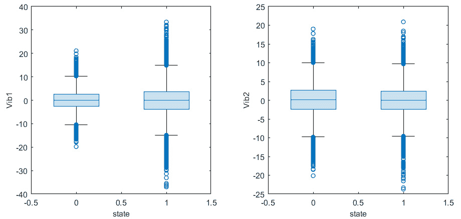
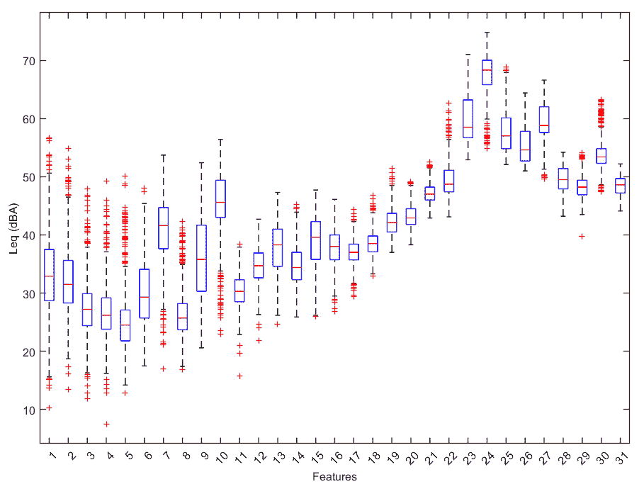

# 11

# MATLAB 中的异常检测

在物理系统生命周期的整个过程中，故障或故障的发生对其正常功能构成了潜在威胁。为了防止关键中断，在设施内实施异常检测系统变得至关重要。被称为 **故障诊断系统** 的这种机制旨在识别被监控系统中的潜在故障。故障检测的追求是维护干预中的关键和定义性阶段，需要系统性和确定性的方法来全面分析可能导致故障的所有可能原因。

在本章中，我们将学习异常检测系统的基础概念以及如何在 MATLAB 中实现异常检测系统。

我们将涵盖以下主要主题：

+   介绍异常检测和故障诊断系统

+   使用 **机器学习**（**ML**）来识别异常功能

+   使用 MATLAB 构建故障诊断系统

+   理解高级正则化技术

# 技术要求

在本章中，我们将介绍基本的机器学习概念。为了理解这些主题，需要具备代数和数学建模的基本知识。同时，也需要熟悉 MATLAB 环境的操作。

要使用本章中的 MATLAB 代码，你需要以下文件（可在 GitHub 上找到：[`github.com/PacktPublishing/MATLAB-for-Machine-Learning-second-edition`](https://github.com/PacktPublishing/MATLAB-for-Machine-Learning-second-edition)）：

+   `GearboxAccData.xlsx`

+   `AnomalyDetectGearBox.m`

+   `DroneFaultDiagnosis.xlsx`

+   `UAVFaultDiagnosis.m`

# 介绍异常检测和故障诊断系统

异常检测和故障诊断系统是各个行业的关键组成部分，特别是在安全、可靠性和效率至关重要的领域，如制造、医疗保健、金融和网络安全。这些系统旨在识别数据、过程或系统中不寻常或意外的模式、行为或条件，这些可能表明存在故障、缺陷或异常。

深入探讨异常检测领域，本节提供了一个全面的概述，揭示了在识别各种系统和数据集中偏离常规的关键原理和方法。

## 异常检测概述

异常检测是数据分析与机器学习中用于识别数据集中显著偏离预期或正常行为的数据点或模式的技术。异常，也称为离群值，是不符合大多数数据的数据点，可能表明错误、欺诈、不寻常事件或其他重要信息。异常检测在不同领域有各种应用，如网络安全、工业 **质量控制**（**QC**）、金融、医疗保健等。

我们可以开始了解不同类型的异常，以了解这个术语的含义，我们将列出一些异常类型：

+   **点异常**: 这些是被认为是异常的单个数据点，例如信用卡数据集中的一次单一欺诈交易。

+   **上下文相关异常**: 这些是上下文相关的异常。一个数据点本身可能不是异常，但在特定上下文或时间（例如，假日促销期间的网页流量突然增加）中可能是不寻常的。

+   **集体异常**: 这些是通过集体检查一组数据点而识别出的异常。这些异常涉及数据点之间的模式或关系。

解决异常检测问题有几种方法，从简单的统计技术到复杂的 ML 算法。所选择的方法取决于数据的性质和您试图解决的特定问题。在此，我们列出最常用的方法：

+   **统计方法**: 可以使用诸如 z 分数、百分位数和箱线图等统计技术，根据数据分布的均值或中位数偏差来识别异常。

+   **机器学习（ML**）: 监督、无监督和半监督的 ML 算法可用于异常检测。一些流行的方法包括隔离森林、**单类支持向量机**（**One-Class SVM**）、**自动编码器**（**AEs**）和 k-means 聚类。

+   **时间序列分析**: 使用专门的技术来检测时间序列数据中的异常，例如**自回归**（**AR**）模型、指数平滑和**移动平均**（**MAs**）。

+   **密度估计**: 使用诸如**核密度估计**（**KDE**）和**高斯混合模型**（**GMMs**）等方法来估计数据的概率密度函数，并将异常识别为低密度区域。

+   **深度学习（DL**）: **神经网络**（**NNs**），特别是**深度自动编码器**（**DAEs**）和**循环神经网络**（**RNNs**），用于在多维数据或序列中进行异常检测。

+   **集成方法**: 结合多个异常检测模型可以提高整体性能和鲁棒性。

在解决异常检测问题时，我们必须面对一些挑战。例如，确定定义异常的适当阈值可能具有挑战性。异常罕见的不平衡数据集可能会使模型训练和评估变得棘手。处理高维数据和噪声数据集也可能具有挑战性。

异常检测是识别大型数据集中罕见但可能重要的事件或模式的有价值工具。所选择的方法取决于特定领域、数据特征以及需要检测的异常的性质。

## 故障诊断系统解释

**诊断**指的是一种将来自测量参数和收集机器数据的信息转化为对其当前或潜在故障的洞察的过程。这个过程包括分析和综合活动的结合，利用物理测量和机器特定的特性来推导有关机器状态及其未来趋势的有价值信息。这些信息对于评估短期和长期可靠性至关重要。

采用故障诊断技术在确保自动化和自主系统的高安全性和可靠性方面变得越来越重要。事实上，在过去的几年里，全球科学界在开发用于诊断各种系统故障的系统方法上投入了大量的努力。故障诊断系统的首要目标是持续监控系统在运行过程中的状态，以实现三个关键目标：检测故障的存在（故障检测）、确定这些故障的具体位置（故障隔离），以及理解这些故障随时间如何演变（故障识别）。

通常，故障诊断系统的输出提供了一组受故障类型影响的敏感变量，当系统发生故障时，这些变量会进行一些修改。随后，系统从这些故障发生中提取和处理信息，以执行检测、隔离和识别故障的任务。用于故障诊断的技术可以分为三个基本类别：

+   **基于模型的**：这种方法依赖于精确的数学模型，能够实现高效的故障检测和诊断。这些模型被构建来描述所审查组件的实际退化过程。这涉及到用物理定律来描述操作条件如何影响资产的性能和寿命。关键变量包括各种热、机械、化学和电气参数。表达它们对机械设备健康的影响是一项具有挑战性的工作，需要那些创建此类解决方案的人具备高度的专业领域知识和建模技能。一旦模型建立，就变得至关重要要有传感器能够提供有关在分析和建模阶段确定的相关量的数据。这些数据作为模型的输入。这种方法的主要优势在于其描述性。它允许对每个输出背后的原因进行详细分析，因为它基于过程的物理表示。这反过来又使得验证和认证成为可能。然而，其准确性高度依赖于领域专家进行的分析和建模的质量。相反，其缺点包括复杂性高、实施成本高，以及对其系统的特异性高，限制了重用和扩展的可能性。

+   **基于知识的**：这种方法也依赖于领域专家，旨在直接模拟这些专家的专业知识和行为。目标是使这些专家拥有的知识形式化，使其能够自动复制和应用。专家系统本质上是一种软件程序，它利用从各个领域的熟练人士收集的知识库。然后，这些系统使用推理和推理机制来模拟人类思维过程，为实际问题提供支持和解决方案。实现此类模型最常见的两种技术是规则机制和模糊逻辑。基于规则的途径因其实施简单和可解释性而受到重视。然而，它们可能在表达复杂条件时不足，并且在处理许多规则时可能遭受组合爆炸。另一方面，使用模糊逻辑允许通过更不精确和更不严格的输入来描述系统的状态，简化了形式化和模型描述过程，使其更加直观。与基于模型的方法一样，专家系统的有效性高度依赖于模型的质量和详细程度，从而产生高度特定的解决方案。

+   **基于数据的方法**：基于数据的方法将统计和机器学习技术应用于从机器收集的数据，目标是辨别组件的状态。目标是获取关于机械的全面实时信息，通常通过传感器和生产维护活动日志，并将这些信息与单个组件的退化水平或系统的性能相关联。目前，这种方法在实用应用中最为普遍。这归因于它提供的几个优势，使其优于其他两种方法。数据驱动方法需要大量的数据量才能有效。然而，鉴于现代互联传感器的可访问性，通常很容易满足这一需求。与其他方法相比，它们具有一个显著的优势，即不需要深入的专业领域知识，从而减少了专家对模型最终性能的影响。虽然专家见解可以促进输入变量的选择，但它们的影响与其他方法相比较小。此外，机器学习和数据挖掘技术可以发现输入参数和系统状态之间的关系，即使专家事先也可能不知道。基于机器学习的算法可以用来构建预测模型，从而产生特定领域的知识。

开始探索机械与智能的交汇点，本节通过利用机器学习的力量，探讨了一种前沿的故障诊断方法。揭示算法和模型潜力，我们深入探讨了这些技术进步如何使复杂系统中的故障识别更加精确和高效。

## 使用机器学习进行故障诊断

机器学习算法通过接收到的输入数据自主地从数据中推导知识，消除了对明确开发者指令的需求。在这些模型中，机器独立地识别出实现预期结果所需的模式，这是**人工智能**（**AI**）的一个标志。在学习过程中，这些算法的特征是系统被提供了一个训练数据集，使其能够估计输入和输出数据之间的关系。这些关系构成了系统推断的模型参数。

选择特定的机器学习模型在很大程度上取决于系统的预期目标。根据目标，问题的性质以不同的方式建模，可以识别出两种主要方法：诊断和预测。诊断系统旨在在故障发生时定位和识别故障。这涉及到对系统的持续监控，当检测到偏离预期行为时发出警报，指定受异常影响的组件，并对异常类型进行分类。

与之相反，预测性维护旨在预测故障是否即将发生或估计其发生的概率。作为一种主动分析，预测性维护可以在干预措施方面显著降低成本，但它代表了一个更复杂的实现目标。另一个可行的选择是对同一系统同时应用诊断和预测解决方案。这种组合提供了两个宝贵的优势：在预测性分析不足的情况下，诊断可以提供支持。这种情况是不可避免的，因为一些故障并不遵循可预测的模式，即使某些故障可以以高精度预测，它们也可能不是在每个实例中都能被识别的。从诊断应用中获得的信息可以作为预测系统补充输入，从而创建更复杂和精确的模型。

根据数据类型，可以使用以下两种方法来解决故障诊断问题：

+   **回归**：回归可以作为预测挑战的建模技术。这涉及到在连续时间单位中估计组件的剩余使用寿命。在这种情况下，训练数据集应仅包含经历过故障的组件的数据，从而便于从故障事件开始向前时间标记输入。这种方法仍然遵循**监督学习**（**SL**）框架，其中输入数据与在此上下文中的连续输出值相关联。

+   **二元分类**：最简单的方法是将故障检测视为一个二元分类问题，其中每个代表系统状态的输入必须被分类为两个互斥值之一。在诊断问题解决的情况下，这涉及到确定机器是否正在正确运行或错误运行，将所有可能的状态分类为这两个类别。这个过程与 SL 相一致，因为输入数据与代表模型输出的标签配对。在这种情况下，系统学习识别输入数据与相应标签之间的关系。在预测性分析的情况下，任务转向评估机器是否可能在指定的时间框架内发生故障。这两种含义之间的区别仅在于对标签的不同解释。这意味着相同的模型可以用来解决这两个问题。区别在于在模型训练阶段如何对数据集进行标记。

+   **多类分类**：多类分类是对二分类的扩展，引入了更广泛的可用标签供选择。尽管如此，每个输入仍然只关联一个标签。在诊断场景中，扩展采用了一种简单的方法，包括确定机器是否正常运行。在后一种情况下，它涉及到从各种可能性中确定特定的异常状态。在考虑预测性应用时，问题转向确定机器潜在故障前的时间间隔。在这里，标签表示接近故障事件的各个不同间隔。

对于复杂机械故障的精确诊断，通过收集数据、采用先进的信号处理算法进行数据分析，并随后提取适当特征以高效地识别和分类故障，这是至关重要的。数据可以通过各种方法获取，主要是通过测量描述机器在运行期间状态的物理属性。这些测量是通过将物理属性转换为电值的专用传感器获得的，通常被称为传感器数据。

值得注意的是，参数的选择在很大程度上取决于正在审查的特定系统，例如噪声、振动、压力、温度和湿度。通常，在现代自动化工业系统中，必要的诊断数据是 readily available。在数据不可用的情况下，添加额外的传感器成为建立有效的故障识别策略的第一步。此外，数据还可以通过将机器的静态运行条件与特定时间点联系起来来收集，包括材料代码、机器生产速度或正在生产的产品的类型等因素。这类数据被归类为统计数据。

最后，数据可能包括与机器及其组件相关的重大事件和行动的历史，这通常被称为日志数据。这可能包括故障、维修、更换和其他相关活动的记录。

在探讨了故障诊断的基础概念之后，现在是时候实际解决一个模拟问题了。

# 使用机器学习来识别异常功能

齿轮箱，也称为齿轮机构或传动装置，是一种机械装置，旨在将机械功率从一个组件传递到另一个组件，同时改变转速、扭矩和旋转方向。齿轮箱由一组不同大小和配置的齿轮组成，它们啮合以提供基于所需输出的特定机械优势。

在汽车背景下，齿轮箱，通常被称为变速箱或换挡装置，是控制发动机输出功率和车辆速度的一个关键组件，起着核心作用。齿轮箱中的异常检测涉及识别齿轮组件及其相关系统的异常或不规则行为。在汽车齿轮中检测异常对于确保车辆的安全、可靠性和整体性能至关重要。

为了及时识别齿轮箱中的异常，我们可以使用测量温度、压力、速度和流体水平的传感器来持续收集数据。这些传感器提供了有关齿轮箱状态的宝贵信息。原始传感器数据通常包含噪声和异常值。应用数据预处理技术，如过滤和数据清洗，以确保数据的质量和可靠性。从预处理数据中提取相关特征。这些特征可能包括齿轮啮合模式、旋转速度和温度波动。异常检测通常从建立齿轮箱正常行为的基线模型开始。这是通过分析历史数据来了解典型的工作条件和性能来完成的。

应用了各种异常检测技术来识别与既定正常行为之间的偏差。一些常见的技术包括以下内容：

+   **统计方法**：这些方法标记出与平均值显著偏离或遵循不同分布的数据点

+   **机器学习算法**：这些模型可以学习识别数据中的模式并检测异常

+   **时间序列分析**：对于随时间收集的齿轮箱数据，可以使用时间序列方法，如**自回归积分移动平均**（**ARIMA**）或**长短期记忆**（**LSTM**）神经网络来检测异常

异常检测基于预定义的阈值或通过对数据的统计分析。这些阈值在模型训练阶段确定，并且可能随着时间的推移进行调整以优化检测。当检测到异常时，系统可以为车辆操作员或服务技术人员生成警报。这些警报可能包括有关特定异常、其潜在影响以及维护或修理的建议行动。

异常检测是一个持续的过程。齿轮箱的状态持续被监控，数据实时分析以确保及时检测到任何新出现的问题。在汽车齿轮箱中进行异常检测对于预测性维护至关重要，可以预防意外故障，并优化车辆的使用寿命和性能。它是现代汽车诊断和维护系统的一个关键组成部分，尤其是在商业和工业环境中，车辆可靠性至关重要。

在异常检测领域，本节重点介绍逻辑回归作为一种强大的工具的应用。通过深入了解这个统计模型的复杂性，我们发现它在识别数据集中的异常方面的有效性，并通过实际应用揭示了其细微差别。

## 使用逻辑回归进行异常检测

在这个例子中，我们将使用加速度计捕获的数据，这些加速度计记录了在两种不同的运行条件下齿轮箱的振动：一种表示健康状态，另一种表示损坏状态。为了确保全面覆盖，传感器被放置在相反方向以捕获任何操作差异。这些数据集将作为训练各种旨在分类齿轮箱运行条件的算法的基础。

让我们深入描述一下算法：

1.  我们首先将数据集导入 MATLAB 环境。该数据集提供了两个传感器记录的振动测量值，以及与之相关的发动机运行分类：`0`表示损坏状态，而`1`表示健康状态：

    ```py
    data = readtable('GearboxAccData.xlsx');
    ```

1.  导入了具有`20000`行和`3`列的表格。

1.  为了对数据进行初步的视觉检查，让我们利用图表来协助。例如，我们可以创建盒形图来展示两个传感器检测到的数据分布：

    ```py
    subplot(1,2,1)
    boxchart(data.state,data.Vib1)
    xlabel('state')
    ylabel('Vib1')
    subplot(1,2,2)
    boxchart(data.state,data.Vib2)
    xlabel('state')
    ylabel('Vib2')
    ```

    *图 11**.1*中看到的图表将被绘制：



图 11.1 – 数据的盒形图

盒形图作为一种视觉表示，用于通过基本的分散度和位置度量来描述样本的分布。在仔细审查*图 11**.1*后，可以明显看出两个传感器的数据分布不同。传感器`Vib1`似乎在故障和正常条件下的振动值之间表现出更大的差异。这意味着故障可能出现在这个传感器的位置。

1.  在对可用的数据进行视觉分析后，我们需要将数据分割，以便我们可以用它来训练一个异常检测模型。数据分割是构建和评估机器学习模型过程中的一个基本步骤。它涉及将您的数据集分成多个子集，通常包括一个训练集、一个验证集和一个测试集。这些子集在机器学习工作流程中各有特定用途。我们将数据分成两个子集：一个训练集和一个测试集。训练集是您数据中最大的一部分，用于训练机器学习模型。它是模型从中学习并使用来更新其参数的数据集。测试集用于评估最终训练模型的性能。它提供了一个无偏估计，说明模型在未见数据上的表现如何。测试集在模型开发或训练期间不应使用，以避免数据泄露。让我们看看如何进行数据分割：

    ```py
    n = length(data.state);
    SplitData = cvpartition(n,'Holdout',0.3);
    TrainIndex = training(SplitData);
    TrainData = data(TrainIndex,:);
    TestIndex = test(SplitData);
    TestData = data(TestIndex,:);
    ```

    我们首先使用`length()`函数提取了数据集中存在的观测数量：此函数提供了*X*数组中最广泛维度的尺寸。当处理向量时，这个尺寸对应于元素的总数。之后，我们使用`cvpartition()`函数为数据集建立了一个随机分区。我们可以利用这个分区来创建训练集和测试集，这对于验证统计模型至关重要。我们使用了两个对象函数，`training`和`test`，从初始数据集中提取训练数据索引和测试数据索引。然后，我们将这些索引应用于提取数据。

1.  现在，我们可以构建逻辑回归模型。逻辑回归是一种用于二元分类的统计方法，但它也可以扩展到多类分类。它是一种回归分析方法，用于建模二元结果的概率，通常表示为`0`或`1`。逻辑回归在医学、社会科学、经济学和机器学习等各个领域得到广泛应用。逻辑回归用于预测观测属于两个类别或类别之一的可能性。它不适用于多于两个类别的問題；在这种情况下，使用多项逻辑回归或其他技术。逻辑回归模型使用`sigmoid`（逻辑）函数将输入特征映射到`0`到`1`之间的概率。逻辑回归是二元分类任务中强大且可解释的方法。它是机器学习和统计学的基础技术，在需要理解输入特征与二元结果概率之间的关系时特别有用。让我们开始训练模型：

    ```py
    LogRegModel = fitglm(TrainData{:,1:2},TrainData{:,3},
    'Distribution','binomial','link', 'logit')
    ```

    我们使用`fitglm()`函数创建逻辑回归模型：此函数提供了一个拟合到表格或数据集数组中变量的广义线性模型。默认情况下，它将最后一个变量指定为响应变量。我们设置了响应变量的二项分布和`logit`作为链接函数。链接函数*f(μ) = log(μ/(1–μ))*与逻辑回归相关联。它将预测变量的线性组合转换为一个概率范围（`0`到`1`）。在这个公式中，*\(\mu\)*代表因变量为`1`的概率。对数变换将事件发生的概率映射到线性空间中，便于在二元结果背景下建模。由于逻辑函数的范围是(`0`, `1`), 对数优势比跨越整个实数线。这个链接函数在逻辑回归中至关重要，有助于估计概率和预测二元结果。

    分布指的是描述模型中响应变量（因变量）变异性的概率分布。换句话说，它指定了模型对响应变量假设的似然函数的形式。分布的选择基于响应变量的性质和模型的假设。链接函数定义了线性预测量和响应变量期望值之间的关系。我们将线性预测量建模为预测系数的线性组合。链接函数将这个线性预测量转换为响应变量的期望值。

    从训练过程中返回了以下模型：

    ```py
    LogRegModel =
    Generalized linear regression model:
        logit(y) ~ 1 + x1 + x2
        Distribution = Binomial
    Estimated Coefficients:
              Estimate        SE         tStat      pValue
            __________    _________    ________    _______
    (Intercept)0.00028422   0.016903   0.016814    0.98658
    x1         0.00041526  0.0028803    0.14417    0.88537
    x2         0.00086682  0.004003     0.21654    0.82857
    14000 observations, 13997 error degrees of freedom
    Dispersion: 1
    Chi²-statistic vs. constant model: 0.0608, p-value = 0.97
    ```

1.  训练模型后，我们可以使用它来识别异常，从算法以前从未见过的数据开始。为此，我们将使用测试数据集：

    ```py
    PredY = predict(LogRegModel, TestData{:,1:2});
    ```

    我们使用了`predict()`函数；这个函数提供了由广义线性回归模型生成的预测响应值。之后，我们还需要根据阈值获得二元预测：

    ```py
    threshold = 0.5;
    PredBin = PredY >= threshold;
    ```

1.  以这种方式，所有`>=`阈值的值都被转换为 1，所有`>`阈值的值都被转换为 0。

1.  现在我们可以计算模型的准确度。这个术语指的是预测模型的预测与实际或观察值的一致程度。它是衡量模型在做出正确预测方面表现好坏的一个指标：

    ```py
    accuracy = sum(PredBin == TestData{:,3}) / length(TestData{:,3});
    fprintf('Accuracy: %.2f%%\n', accuracy * 100);
    ```

1.  以下结果被打印出来：

    ```py
    Accuracy: 48.82%
    ```

1.  当然不是一个很高的准确度值，这告诉我们一半的预测是错误的。需要一个非线性模型来处理数据中的非线性。逻辑回归作为一个线性模型，无法捕捉因变量和自变量之间的非线性关系。当然，我们可以通过采用另一个算法来提高准确度，正如我们将在下一节中看到的。

让我们继续使用随机森林算法提高准确度。

## 使用随机森林算法提高准确度

随机森林是一种强大的集成学习算法，用于分类和回归任务。它是**Bootstrap Aggregating**（**Bagging**）算法的扩展，在训练过程中构建多个决策树，并将它们的预测结合起来以提高准确性和减少过拟合。随机森林首先从原始数据集中创建多个随机样本（带替换）。每个这样的样本被称为**bootstrap 样本**。

对于每个 bootstrap 样本，构建一个决策树。这些树通常被称为**基础学习器**或**弱学习器**。决策树具有以下特征：

+   **随机特征选择**：在树的每个节点，考虑一个随机特征子集进行分割，以减少树之间的相关性

+   **有限深度**：树通常生长到一定的深度以防止过拟合

+   **无剪枝**：随机森林算法通常不剪枝树

对于分类任务，随机森林算法中的每一棵树都会对其预测的类别进行投票。获得最多投票的类别是最终预测。对于回归任务，随机森林算法中的每一棵树都会预测一个数值。最终预测是这些单个树预测的平均值。多数投票（用于分类）或平均（用于回归）导致集成决策。

随机森林包括一种机制来估计模型的准确性，而无需单独的测试集。这被称为**袋外误差**（**OOB**）。对于每个数据点，它使用仅使用在训练期间未使用此点的树来估计错误率。随机森林可以提供每个特征在数据集中重要性的估计。这是通过测量当某个特定特征的值随机打乱时预测准确性的下降来完成的。

以下列表提供了使用随机森林的关键特性和优势：

+   随机森林以其强大的泛化性能和对过拟合的抵抗力而闻名

+   它可以处理分类数据和数值数据

+   随机特征选择和集成特性使其对噪声数据和异常值具有鲁棒性

+   随机森林可用于特征选择，因为它提供了特征重要性排名

+   它无需对超参数进行大量调整即可“即插即用”

+   它可以用于分类和回归任务

总体而言，随机森林是一种流行且有效的机器学习算法，广泛应用于各种应用，从图像分类和文本分析到金融建模和医疗保健。

为了实现一个用于检测齿轮箱数据异常的自动化系统，我们将使用在*使用逻辑回归进行异常检测*部分已经使用过的相同数据。请参考以下步骤：

1.  随机森林涉及自助法，其中我们从数据集中创建多个随机样本（有替换）。我们可以这样做来创建数据的不同子集。我们首先定义以下参数：

    ```py
    numTrees = 100;
    numSamples = size(TrainData, 1);
    sampleSize = round(0.6 * numSamples);  % Adjust as needed
    ```

1.  我们定义了森林中的树的数量（`numTrees`）、我们将用于训练的观测数（`numSamples`）和样本大小（`sampleSize`）。

1.  我们将传递`forest`来初始化森林，将数据设置为`cell`结构：

    ```py
    forest = cell(numTrees, 1);
    ```

    现在，我们将使用一个`for`循环来重复执行一段代码特定次数或遍历一个序列。这将是首先创建一个有替换的随机样本，然后在该样本上训练决策树的必要条件：

    ```py
    for i = 1:numTrees
        sampleIndices = randi(numSamples, sampleSize, 1);
        X_sample = TrainData{:,1:2}(sampleIndices, :);
        y_sample = TrainData{:,3}(sampleIndices);
        tree = fitctree(X_sample, y_sample);
        forest{i} = tree;
    end
    ```

    `fitctree()`函数训练一个用于多类分类的二叉决策树。它使用表中的输入变量和输出响应返回一个训练好的二叉分类决策树。二叉树在分支节点处使用表中的列值形成分割。

    该过程涉及随机选择样本以模拟自助抽样，但随机森林分类器通常为每个决策树选择`\( \sqrt{p} \)`个特征。在两个特征的情况下，每个决策树在`for`循环中引入时理想情况下将使用单个特征。因此，在这个场景中，预计不会出现显著的性能提升。

1.  现在，我们可以使用该模型来测试模型性能：

    ```py
    numTestSamples = size(TestData, 1);
    RPredY = zeros(numTestSamples, numTrees);
    ```

1.  我们计算了测试数据中的观测数，并使用零矩阵初始化预测。

1.  我们现在可以进行预测：

    ```py
    for i = 1:numTrees
        tree = forest{i};
        RPredY(:, i) = predict(tree, TestData{:,1:2});
    end
    ```

    再次使用`predict()`函数对算法从未见过的数据集进行预测。

1.  最后，我们将使用准确率来计算模型的性能：

    ```py
    FinalRPredY = mode(RPredY, 2);
    accuracy = sum(FinalRPredY == TestData{:,3}) / length(TestData{:,3});
    ```

1.  我们使用了`mode()`函数，该函数评估数组中的最频繁值。此函数提供指定维度的元素的模式。在我们的情况下，此函数返回一个列向量，其中包含每行的最常见值。

1.  返回以下准确率：

    ```py
    accuracy
    accuracy =
        0.5765
    ```

    我们获得了所需的改进。

在下一节中，我们将看到如何使用**无人机**（**UAV**）的声发射数据来实现故障诊断系统的实现。

# 使用 MATLAB 构建故障诊断系统

技术进步催生了高度智能的飞机，这些飞机可以自主管理飞行操作。这些飞机属于被称为 UAVs 的类别，这意味着它们可以在没有人类飞行员的情况下飞行。UAVs 提供了许多优势，包括与传统有人驾驶飞机相比显著降低的运营成本，能够在不适合人类存在的环境中操作，以及进行及时空中监视的能力，例如在自然灾害期间。

最初主要用于军事目的，UAVs 被用于单调且漫长的监视和侦察任务，以及那些对人类飞行员安全构成风险的脏任务。它们还在人类生命处于危险的危险任务中发挥了关键作用。然而，今天，它们被认为是现代航空的未来。UAV 技术的巨大潜力，其在军事行动中的成功，以及微纳米技术的进步，促使工业界和大学开发出越来越现代化和可靠的 UAV 系统。这些系统可以广泛应用于民用和军事任务。

无人机（UAV）在全球范围内的广泛应用已经凸显出一些未知的问题。虽然使用这些设备的便利性显而易见，但它们也引入了一系列与这项技术相关的挑战和潜在危险。其中引起关注的问题之一是无人机飞行的安全性——如果无人机坠毁会发生什么后果？因此，一个用于识别无人机螺旋桨缺陷的自动系统代表了一个可以保证我们达到可接受安全水平的工具。

在这个例子中，我们将开发一个从声发射测量中诊断无人机螺旋桨故障的算法：

1.  我们开始将数据集导入 MATLAB 工作空间：

    ```py
    UAVData = readtable('DroneFaultDiagnosis.xlsx');
    ```

1.  有 847 个观测值，32 个特征，31 个预测变量和 1 个二元响应。我们可以使用箱线图来探索数据：

    ```py
    boxplot(UAVData{:,1:31})
    xlabel('Features')
    ylabel('Leq (dBA)')
    ```

    下面的图表将显示：



图 11.2 – 预测变量的箱线图

我们可以看到，在图表左侧的低频部分（*图 11**.2*）显示了数据中的更多变异性。这告诉我们，低频将使我们能够识别无人机螺旋桨的损坏。由于它们独特的声学特征，低频对于识别无人机螺旋桨的损坏非常有价值。当螺旋桨损坏时，它通常会产生独特的低频振动或声音，这些在较高频率范围内不易察觉。这些低频信号可以表明结构问题，如裂缝、不平衡或变形，这些问题在较高频率范围内可能不那么明显。通过关注低频，您可以提高对与螺旋桨损坏相关的微妙但至关重要的振动的敏感性，为无人机提供更有效的早期检测和预防性维护手段。

1.  现在，我们必须为模型划分数据：

    ```py
    n= height(UAVData)
    RandSplitInd=randperm(n);
    DivNum=round(0.7*n);
    TrainData=UAVData(RandSplitInd(1:DivNum),:);
    TestData=UAVData(RandSplitInd(DivNum+1:end),:);
    ```

    我们首先使用`height()`函数提取数据的观测值数量，该函数返回表行数。然后，我们使用`randperm()`；这个函数生成一个表示从 1 到*n*的整数随机排列的行向量，确保没有重复的元素。之后，我们决定将数据分为 70%用于训练集，剩余的 30%用于测试集。最后，我们使用获得的索引将数据集划分为两个子集以训练和测试模型。

1.  为了检测无人机螺旋桨的故障，我们将使用 SVMs 进行**二元分类**。SVMs 代表一类**监督机器学习**（**SML**）模型，应用于分类和回归分析等任务。它们是强大且多功能的算法，在各种应用中表现出色，包括图像分类、文本分类和异常值检测。SVMs 主要设计用于二元分类问题，其目标是将数据点分离成两个不同的类别。分类器找到一个最佳的超平面来分离数据，最大化类之间的边距。边距是超平面和每个类最近的点之间的距离。SVMs 的目标是最大化这个边距，因为更大的边距意味着对未见数据的更好泛化和更强的鲁棒性。

1.  **支持向量分类**（**SVC**）和**支持向量回归**（**SVR**）都是 SVMs 的类型。SVC 用于分类任务，旨在将数据分离成不同的类别，而 SVR 用于回归，预测连续的结果。在两种情况下，SVMs 通过找到最大化不同类别之间边距或拟合回归数据点的最优超平面来工作。它们在处理高维空间中的复杂关系时非常有效，并且是各种机器学习应用中的宝贵工具。

1.  支持向量是距离决策边界（超平面）最近的数据点。这些点在定义边距和超平面的位置上至关重要。SVMs（支持向量机）的名字就来源于这些支持向量。在二维空间中，超平面是一条将数据分为两类直线的平面。在更高维度的空间中，它是一个超平面。目标是找到最大化边距的同时正确分类尽可能多的数据点的超平面。SVMs 可以通过将输入数据转换到更高维的空间来实现对非线性问题的应用，在这个空间中可以进行线性分离。各种核函数，如多项式核、**径向基函数**（**RBF**）核和 Sigmoid 核，被用来实现这一点。SVMs 因其能够提供鲁棒性强、泛化能力强的模型而闻名，尤其是在处理高维数据时。SVMs 在机器学习（ML）中得到了广泛应用，并在各种应用中显示出其有效性。虽然它们在许多场景中表现出色，但选择合适的核函数和调整超参数对于它们的成功至关重要。让我们应用 SVM 模型来识别无人机叶片的故障。

    ```py
    SVMModel = fitcsvm(TrainData{:,1:31}, TrainData{:,32}, 'KernelFunction', 'linear', 'BoxConstraint', 1);
    ```

1.  `fitcsvm()`函数训练一个用于分类的 SVM 模型，它可以用于单类或双类（二元）问题，在低维或中维度的预测数据集上。

    以下参数被传递：

    +   `TrainData{:,1:31}`: 模型的训练数据表示为一个表格，其中每一行代表一个观察值，每一列代表一个预测变量。不支持多列变量和非字符单元数组。

    +   `TrainData{:,32}`: 响应变量的名称应提供为字符向量或字符串标量。

    +   `KernelFunction`, `linear`: 使用 `KernelFunction` 后跟核函数名称的配对指定用于计算 `Gram` 矩阵元素的核函数的选择，该名称作为逗号分隔的对提供。以下核函数可用：`gaussian, linear,` 和 `polynomial`。

    +   `BoxConstraint`, `1`: 此参数控制正则化强度。它决定了 SVM 模型愿意容忍多少错误以实现类之间更宽的间隔。较大的 `BoxConstraint` 值允许对误分类有更大的容忍度，而较小的值则强制对训练数据进行更严格的拟合。

1.  现在，我们可以使用 SVM 模型对无人机（UAV）的声发射进行故障诊断。我们将使用测试数据集，其中包含算法尚未见过的数据：

    ```py
    PredY = predict(SVMModel, TestData{:,1:31});
    accuracy = sum(PredY == TestData{:,32}) / length(PredY);
    ```

1.  首先，我们使用 `predict()` 函数检测无人机螺旋桨的故障，然后我们计算了模型的准确率。

    以下结果被返回：

    ```py
    accuracy
    accuracy =
        0.9055
    ```

    91% 的准确率是一个非常好的结果。这是证据表明 SVM 是预测无人机螺旋桨可能故障的好选择。

在本章的下一部分，我们将介绍一些防止过拟合并提高算法性能的方法。

# 理解高级正则化技术

高级正则化技术是机器学习和统计建模中使用的防止过拟合并提高模型泛化性能的方法。当模型过于紧密地拟合训练数据时，会发生过拟合，捕捉噪声和不相关模式，这会导致在未见数据上的性能不佳。正则化技术通过在训练期间对模型参数施加约束或惩罚来鼓励更简单、更通用的模型。

## 理解 Dropout

Dropout 是一种在神经网络（NNs）中使用的正则化技术，尤其是在**深度神经网络**（**DNNs**）中，用于防止过拟合。过拟合发生在神经网络学会过于紧密地拟合训练数据时，捕捉噪声并记住特定示例，而不是从数据中泛化。Dropout 是一种简单而有效的方法，可以提高模型泛化性能。

在训练阶段，在每次正向和反向传递时，dropout 会随机“丢弃”（停用）神经网络中的一部分神经元（单元）。这意味着在正向传递期间，某些神经元的输出以一定的概率被设置为零，从而有效地将它们排除在计算之外。dropout 概率是一个超参数，决定了神经元被丢弃的概率。一个常见的值约为 0.5，这意味着每个神经元在训练期间有 50%的概率被丢弃。

dropout 过程在训练期间引入了可变性，因为在每次正向和反向传递中，激活的神经元集合都不同，网络实际上在不同的子网络上进行训练。这种可变性迫使网络学习更鲁棒的特征，并防止它过度依赖任何神经元或特征。在推理或测试阶段（当你使用训练好的模型进行预测时），dropout 通常被关闭。然而，每个神经元的输出都会乘以一个因子*1/(1 - p)*，其中*p*是训练期间使用的 dropout 概率。这种缩放有助于保持神经元激活的期望值，确保模型的行为与训练期间学习的一致。

dropout 的关键好处如下：

+   **正则化**：dropout 通过防止神经网络过度拟合训练数据而充当正则化技术。在多个子网络上的训练鼓励网络更好地泛化到未见过的数据。

+   **减少共适应**：dropout 阻止神经元过度依赖其相邻的神经元。这有助于防止神经元的共适应，即某些神经元变得专门化以预测其他神经元的输出。因此，dropout 可以导致更独立和更有信息量的特征。

+   **集成效应**：dropout 过程类似于训练具有不同架构的多个模型，这类似于模型的集成。这种集成效应可以提高模型性能。

在实践中，dropout 在深度学习中得到了广泛应用，尤其是在处理大型和复杂的神经网络时特别有效。它是一种简单而强大的技术，用于提高模型泛化能力和减少过拟合，使其成为训练鲁棒深度学习模型的基本工具。

探索模型正则化的复杂性，下一节深入探讨了 L1 和 L2 正则化的不同领域。揭示这些技术的细微差别，我们探讨了它们如何有助于增强机器学习模型的鲁棒性和泛化能力。

## 探索 L1 和 L2 正则化

L1 和 L2 正则化是机器学习和统计建模中常用的两种技术，通过向损失函数添加惩罚项来防止过拟合。它们鼓励模型具有更小的权重，在 L1 的情况下，可以导致特征选择。

让我们介绍两种典型方法：

+   **L1 正则化（Lasso）**：L1 正则化，也称为 Lasso 正则化，在损失函数中引入了一个与模型系数（权重）的绝对值成正比的惩罚项。从数学上讲，它可以表示如下：

    L1 正则化下的损失 = 原始损失 + λ * Σ|w_i|

    在这里，*λ*（lambda）是一个控制正则化强度的超参数。

    *L1*正则化会将模型的一些权重缩小到正好为零。因此，它通过有效地从模型中移除不太重要的特征来执行特征选择。*L1*正则化在你怀疑只有你的一些特征与预测相关时特别有用。它通过消除不相关的特征，帮助你创建更简单、更可解释的模型。

+   **L2 正则化（岭回归）**：L2 正则化，也称为岭回归正则化，在损失函数中添加了一个与模型系数（权重）的平方成正比的惩罚项。从数学上讲，它可以表示如下：

    L2 正则化下的损失 = 原始损失 + λ * Σ(w_i²)

    再次强调，*λ*是控制正则化强度的超参数。

    *L2*正则化鼓励所有模型权重都保持较小，但很少将它们缩小到正好为零。它防止任何特征具有压倒性的大权重，并使模型更加稳定和数值上良好条件化。*L2*正则化通常用于防止多重共线性（特征之间的高度相关性）并减少异常值的影响。当你认为所有特征都相关但不应过度影响时，它很适用。

在以下列表中，我们总结了*L1*和*L2*正则化之间的关键区别：

+   *L1*通过将一些权重设置为正好为零来鼓励稀疏性，导致特征选择，而*L2*主要缩小权重但很少完全消除它们。

+   *L1*适用于你怀疑只有部分特征相关的情形，而*L2*则更适用于你想要防止多重共线性并确保所有特征对模型都有贡献的情形。

+   *L1*和*L2*正则化的组合被称为弹性网络，它在**特征选择**（**L1**）和**特征分组**（**L2**）之间取得平衡。

在*L1*和*L2*正则化之间的选择取决于具体问题、数据的性质以及你对特征之间潜在关系的理解。在某些情况下，结合*L1*和*L2*正则化可能通过在稀疏性和稳定性之间提供平衡，从而提供最佳结果。

## 引入早停机制

提前停止是机器学习中常用的正则化技术，尤其是在训练深度神经网络（DNNs）时，用于防止过拟合并优化模型性能。它涉及在训练过程中监控模型在验证数据集上的性能，并在满足一定标准时停止训练。

在训练过程中，您的数据集通常分为两部分：训练数据集和验证数据集。训练数据集用于更新模型的参数，而验证数据集用于监控模型的性能。为了实现提前停止，您需要定义一个性能标准。常见的标准包括验证损失或验证准确率，具体取决于特定的机器学习任务（例如，回归或分类）。您的目标是使验证损失最小化或使验证准确率最大化。

随着模型的训练，您会定期通过计算验证损失或准确率来评估模型在验证数据集上的性能。

您通常会在固定的时间间隔或训练周期数之后监控验证性能。您设置一个阈值，或基于验证性能的规则，以决定何时停止训练。这可能包括跟踪验证损失是否在下降或验证准确率是否已达到平台期。最常见的情况是，当验证性能开始下降或停滞时停止训练。换句话说，您寻找验证损失开始增加或验证准确率开始下降的点。当满足提前停止条件时，训练停止。通常认为训练停止时的模型参数是最终模型。

使用提前停止的好处有哪些？有几个：

+   **防止过拟合**：提前停止可以防止模型过度拟合训练数据，因为它在模型开始拟合数据中的噪声时终止训练过程。

+   **节省训练时间**：它可以通过在达到最优或近似最优性能后停止不必要的训练来显著减少训练时间。

+   **提高泛化能力**：由于模型不会过度拟合训练数据，因此它的性能更有可能很好地泛化到新的、未见过的数据。

然而，在使用提前停止时必须谨慎：选择正确的超参数，如提前停止阈值或验证检查的频率，至关重要。错误的选择可能导致训练过早停止或过度训练。同时，使用一个模型在训练期间未见过的单独验证数据集也很重要。如果训练和验证使用相同的数据，则可能发生数据泄露。

提前停止是训练机器学习模型的一个宝贵工具，但应该在使用时仔细考虑问题和数据的特定情况。它有助于实现更好的模型泛化，并降低过拟合的风险。

# 摘要

在本章中，我们展示了如何在 MATLAB 中实现一个自动故障诊断系统。我们首先介绍了异常检测和故障诊断的基本概念。然后，我们展示了如何在 MATLAB 中实现一个识别异常操作的系统。我们使用来自变速箱的振动数据，基于逻辑回归训练了一个模型。随后，我们使用了相同的数据，但这次使用基于随机森林的模型来提高预测模型的表现。

在下一节中，我们实现了一个基于声发射识别无人机螺旋桨故障的模型。我们使用了一个基于 SVM 的分类模型。

在最后一节中，我们介绍了用于提高模型性能的正则化算法中最受欢迎的方法。

总之，这本书为初学者和经验丰富的从业者提供了一个全面的指南和无价的资源，他们正在探索机器学习动态发展的领域。这本书不仅为读者提供了关键概念和方法的基础，还赋予了他们使用 MATLAB 实现和部署机器学习模型的实际技能。随着我们踏上不断发展的技术进步之旅，这本书犹如灯塔，照亮了理解和掌握机器学习复杂领域的道路。无论你是学生、研究人员还是行业专业人士，从这些页面中获得的知识无疑将推动你在事业中充分利用机器学习的全部潜力。愿这本书成为创新的催化剂和发现的灵感，激励读者为激动人心且变革性的机器学习领域做出贡献。
