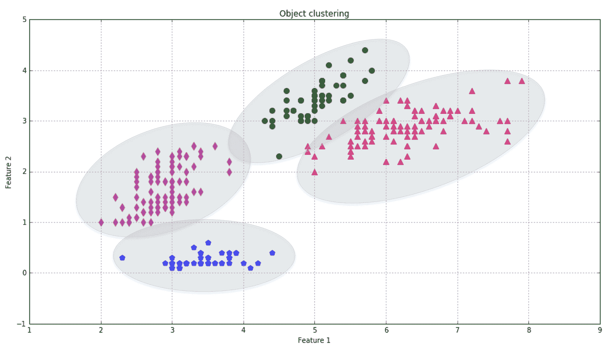

# 机器学习入门

在过去的几年里，机器学习已经成为最重要的和最有成效的 IT 和人工智能分支之一。它在其应用每天都在商业领域的各个行业中变得更加普遍，总是伴随着新的和更强大的工具和结果，这并不令人惊讶。开源、生产就绪的框架，以及每月发表的数百篇论文，正在推动 IT 历史上最普遍的民主化进程之一。但为什么机器学习如此重要和有价值呢？

# 简介 - 经典和自适应机器

从古至今，人类一直在建造工具和机器来简化他们的工作，并减少完成许多不同任务所需的总体努力。即使不知道任何物理定律，他们也发明了杠杆（首次由阿基米德正式描述）、仪器和更复杂的机器来执行更长和更复杂的程序。用锤子钉钉子变得更容易、更不痛苦，使用手推车搬运重石或木材也是如此。但是，这两个例子有什么区别呢？即使后者仍然是一个简单的机器，但其复杂性允许一个人在不考虑每一步的情况下完成一个复合任务。一些基本的机械定律在允许水平力有效地对抗重力方面起着主要作用，但人类、马或牛对此一无所知。原始人只是观察到一个天才的技巧（轮子）如何改善他们的生活。

我们学到的教训是，一个机器如果没有具体的使用可能性，不能以实用主义的方式使用，那么它永远不会高效或时尚。如果一个用户可以轻松理解哪些任务可以以更少的努力或完全自动完成，那么这个机器立即被认为是有用的，并且注定要不断改进。在后一种情况下，似乎在齿轮、轮子或轴旁边出现了一些智能。因此，我们可以将自动机器添加到我们的进化列表中：这些机器（如今我们称之为编程）是为了通过将能量转化为工作来完成特定目标而构建的。风车或水车是一些能够以最小（与直接活动相比）的人类控制完成完整任务的简单工具。

在下面的图中，有一个经典系统的通用表示，该系统接收一些输入值，处理它们，并产生输出结果：

但再次强调，磨坊成功的关键是什么？我们并不急于说，自从技术诞生以来，人类就试图将一些智能转移到他们的工具上。河流中的水和风都表现出我们可以简单称之为流动的行为。它们拥有大量的能量，无需任何费用就能为我们提供，但机器应该有一定的意识来促进这个过程。一个轮子可以在固定的轴上转动数百万次，但风必须找到一个合适的表面来推动。答案似乎很明显，但你应该尝试思考那些没有任何知识或经验的人；即使是无意识的，他们也开始了对技术的一种全新的方法。如果你倾向于将“智能”这个词保留给更近期的成果，那么可以说，这条路始于工具，首先转向简单的机器，然后转向更智能的机器。

在没有进一步的中介（但同样重要）步骤的情况下，我们可以跳入我们的时代，改变我们讨论的范围。可编程计算机已经普及，灵活，并且越来越强大；此外，互联网的扩散使我们能够以最小的努力共享软件应用和相关信息。我使用的文字处理软件、我的电子邮件客户端、网络浏览器以及在同一台机器上运行的许多其他常见工具都是这种灵活性的例子。不可否认，信息技术革命极大地改变了我们的生活，有时也改善了我们的日常工作，但没有**机器学习**（及其所有应用），还有很多任务似乎远远超出了计算机领域。垃圾邮件过滤、自然语言处理、使用网络摄像头或智能手机进行视觉跟踪、预测分析，这些都是革命性地改变了人机交互并提高了我们期望的少数应用。在许多情况下，它们将我们的电子工具转变为实际的认知扩展，改变了我们与许多日常情况的互动方式。它们通过填补人类感知、语言、推理、模型和人工工具之间的差距来实现这一目标。

下面是一个自适应系统的示意图：

这样的系统并不是基于静态或永久性的结构（模型参数和架构），而是基于持续适应其行为以适应外部信号（数据集或实时输入）的能力，就像人类一样，使用不确定和零散的信息来预测未来。

# 只有学习才是最重要的

学习究竟意味着什么？简单来说，我们可以认为学习是能够根据外部刺激而改变的能力，并且记住大部分以往的经验。因此，机器学习是一种工程方法，它给予每个能够增加或改善适应性改变倾向的技术以最大重视。例如，机械表是一种非凡的工艺品，但其结构遵循的是静态定律，如果外部发生变化，它就会变得无用。这种能力是动物所特有的，尤其是人类；根据达尔文的学说，这也是所有物种生存和进化的关键成功因素。即使机器不能自主进化，它们似乎也遵循相同的法则。

因此，机器学习的主要目标是研究、设计和改进数学模型，这些模型可以通过与上下文相关的数据（由一个通用环境提供）进行训练（一次或持续进行），以推断未来并做出决策，而不需要完全了解所有影响因素（外部因素）。换句话说，一个智能体（它是一个从环境中接收信息、选择最佳行动以实现特定目标并观察其结果的软件实体）采用统计学习方法，试图确定正确的概率分布，并使用它们来计算最有可能成功的行动（价值或决策）（误差最小）。

我更倾向于使用“推理”这个词而不是“预测”，只是为了避免这种奇怪（但并不罕见）的想法，即机器学习是一种现代魔法。此外，可以引入一个基本陈述：一个算法只有在影响实际数据的情况下，才能以相对高的精度外推一般规律并学习它们的结构。因此，“预测”这个术语可以自由使用，但与物理学或系统理论中采用的意义相同。即使在最复杂的场景中，例如使用卷积神经网络进行图像分类，每一条信息（几何、颜色、特殊特征、对比度等）都已经存在于数据中，模型必须足够灵活，能够永久地提取和学习它。

在接下来的章节中，将简要介绍一些常见的机器学习方法。数学模型、算法和实际例子将在后面的章节中讨论。

# 监督学习

监督场景的特点是存在一个教师或监督者的概念，其主要任务是向智能体提供其误差的精确度量（直接与输出值可比较）。在实际算法中，这一功能由一个由成对元素（输入和预期输出）组成的训练集提供。从这些信息出发，智能体可以调整其参数，以减少全局损失函数的幅度。在每次迭代之后，如果算法足够灵活且数据元素一致，整体准确度会提高，预测值与预期值之间的差异会接近于零。当然，在监督场景中，目标是训练一个系统，该系统还必须能够处理之前从未见过的样本。因此，有必要让模型发展出泛化能力，并避免一个常见的称为**过拟合**的问题，这是由于过大的容量导致的过度学习（我们将在下一章中更详细地讨论这个问题，但可以这样说，这种问题的主要影响之一是只能正确预测用于训练的样本，而对于其他样本的错误率始终非常高）。

在下面的图中，一些训练点用圆圈标记，细蓝色的线代表完美的泛化（在这种情况下，连接是一个简单的线段）：

使用相同的训练数据集（对应于两条较大的线）训练了两个不同的模型。前者是不可接受的，因为它不能泛化并捕捉最快的动态（从频率的角度来看），而后者在原始趋势和正确泛化预测分析中的残余能力之间似乎是一个非常好的折衷方案。

形式上，前面的例子被称为**回归**，因为它基于连续的输出值。相反，如果只有有限数量的可能结果（称为**类别**），这个过程就变成了**分类**。有时，与其预测实际的类别，不如确定其概率分布更好。例如，一个算法可以被训练来识别手写的字母，因此其输出是分类的（在英语中，将有 26 个允许的符号）。另一方面，即使是对于人类来说，当字母的视觉表示不够清晰，不足以属于单一类别时，这个过程也可能导致多个可能的输出。这意味着实际的输出最好用离散概率分布来描述（例如，使用 26 个连续值，并归一化，使它们总是加起来等于 1）。

在下面的图中，有一个具有两个特征的元素分类的例子。大多数算法通过施加不同的条件来尝试找到最佳分离超平面（在这种情况下，这是一个线性问题），但目标始终相同：减少误分类的数量并增加噪声鲁棒性。例如，看看靠近平面的三角形点（其坐标大约是[5.1 - 3.0]）。如果第二个特征的幅度受到噪声的影响，其值相当小于 3.0，那么一个稍微高一些的超平面可能会错误地将其分类。我们将在后面的章节中讨论一些强大的技术来解决这些问题。

常见的监督学习应用包括：

+   基于回归或分类分类的预测分析

+   垃圾邮件检测

+   模式检测

+   自然语言处理

+   情感分析

+   自动图像分类

+   自动序列处理（例如，音乐或语音）

# 无监督学习

这种方法基于没有任何监督者和绝对误差度量；当需要学习如何根据相似性（或距离度量）将一组元素分组（聚类）时很有用。例如，观察前面的图，人可以立即识别出两组，而不考虑颜色或形状。事实上，圆形点（以及三角形点）确定了一个连贯的集合；它与其他集合的分离程度远大于其内部点的分离程度。用比喻来说，一个理想的场景是一片只有几个岛屿的海域，这些岛屿可以通过它们的相互位置和内部凝聚力来相互分离。

在下一张图中，每个椭圆代表一个簇，其区域内的所有点都可以用相同的方式进行标记。还有一些边界点（如重叠圆区域的三角形），需要特定的标准（通常是权衡距离度量）来确定相应的簇。就像对于具有模糊性的分类（P 和变形的 R）一样，一个好的聚类方法应该考虑异常值的存在，并相应地处理它们，以提高内部连贯性（在视觉上，这意味着选择一个最大化局部密度的子划分）以及簇之间的分离。

例如，可以优先考虑单个点与质心的距离，或者属于同一簇和不同簇的点之间的平均距离。在这张图中，所有边界三角形彼此都很接近，所以最近的邻居是另一个三角形。然而，在现实生活中的问题中，通常存在边界区域，其中存在部分重叠，这意味着一些点由于特征值而具有高度的不确定性。

另一种解释可以使用概率分布来表示。如果你看椭圆，它们代表在最小和最大方差之间的多变量高斯分布区域。考虑到整个域，一个点（例如，一个蓝色星号）可能属于所有簇，但第一个（左下角）给出的概率最高，因此这决定了成员资格。一旦所有高斯分布的方差和均值（换句话说，形状）变得稳定，每个边界点就会自动被单个高斯分布捕获（除非概率相等）。技术上，我们说这种方法最大化了给定一定数据集的高斯混合物的似然性。这是一个非常重要的统计学习概念，跨越了许多不同的应用，因此将在下一章中更深入地探讨。此外，我们将讨论一些常见的聚类方法，考虑它们的优缺点，并比较它们在各种测试分布上的性能。

其他重要的技术涉及使用标记和无标记数据。因此，这种方法被称为半监督，可以在需要用少量完整（标记）示例对大量数据进行分类时采用，或者当需要向聚类算法施加某些约束时（例如，将某些元素分配到特定簇或排除其他元素）。

常见的无监督应用包括：

+   物体分割（例如，用户、产品、电影、歌曲等）

+   相似度检测

+   自动标注

# 强化学习

即使没有实际监督者，强化学习也是基于环境提供的反馈。然而，在这种情况下，信息更加定性，并不能帮助代理确定其错误的精确度量。在强化学习中，这种反馈通常被称为**奖励**（有时，负奖励被定义为惩罚），并且了解在某个状态下执行的动作是积极还是消极是有用的。最有用的动作序列是代理必须学习的策略，因此能够始终做出最佳决策，以获得最高即时的和累积奖励。换句话说，一个动作也可能是不完美的，但从全局策略的角度来看，它必须提供最高的总奖励。这个概念基于这样一个观点，即理性代理总是追求可以增加其财富的目标。能够*预见*长远前景是高级代理的显著特征，而短视的代理通常无法正确评估其即时行动的后果，因此他们的策略总是次优的。

当环境不是完全确定性的，当它通常非常动态，并且无法有一个精确的错误度量时，强化学习特别有效。在过去的几年里，许多经典算法已经应用于深度神经网络，以学习玩 Atari 视频游戏的最佳策略，并教会智能体如何将正确的行动与表示状态的输入（通常是屏幕截图或内存转储）相关联。

在以下图中，有一个训练以玩著名 Atari 游戏的深度神经网络的示意图。作为输入，有一个或多个连续的屏幕截图（这通常足以捕捉时间动态）。它们通过不同的层（稍后简要讨论）进行处理，以产生代表特定状态转换策略的输出。在应用此策略后，游戏产生反馈（作为奖励-惩罚），并使用此结果来细化输出，直到它变得稳定（因此状态被正确识别，建议的行动总是最好的）并且总奖励超过预定义的阈值。

我们将在介绍深度学习和 TensorFlow 的章节中讨论一些强化学习的例子。

# 超越机器学习 - 深度学习和生物启发自适应系统

在过去的几年里，得益于更强大且更便宜的计算机，许多研究人员开始采用复杂的（深度）神经网络架构来实现仅二十年前难以想象的目标。自 1957 年罗森布拉特发明第一个感知器以来，对神经网络的研究兴趣日益增长。然而，许多限制（涉及内存和 CPU 速度）阻碍了大规模的研究，并隐藏了这些算法类型的大量潜在应用。

在过去十年中，许多研究人员开始训练更大和更大的模型，这些模型由多个不同的层构建（这就是为什么这种方法被称为**深度学习**），以解决新的挑战性问题。便宜且快速的计算机的可用性使他们能够在可接受的时间内获得结果，并使用非常大的数据集（由图像、文本和动画组成）。这种努力导致了令人印象深刻的成果，特别是在基于像素的分类和实时智能交互中使用强化学习。

这些技术背后的理念是创建像大脑一样工作的算法，这一领域的重要进步得益于神经科学和认知心理学的贡献。特别是，对模式识别和联想记忆的兴趣日益增长，其结构和功能与新皮层中发生的情况相似。这种方法还允许使用更简单的算法，称为**无模型**；这些算法不是基于任何特定问题的数学物理公式，而是基于通用的学习技术和重复的经验。

当然，测试不同的架构和优化算法比定义一个复杂的模型要简单得多（并且可以通过并行处理来完成）。此外，深度学习在性能上优于其他方法，即使没有基于上下文的模型。这表明，在许多情况下，拥有一个不那么精确但具有不确定性的决策，比由一个非常复杂的模型（通常速度不快）确定的精确决策更好。对于动物来说，这往往是生死攸关的问题，如果它们成功了，那是因为它们隐含地放弃了某些精度。

常见的深度学习应用包括：

+   图像分类

+   实时视觉跟踪

+   自动驾驶汽车

+   逻辑优化

+   生物信息学

+   语音识别

许多这些问题也可以使用经典方法解决，有时方法更为复杂，但深度学习在所有方法中表现最佳。此外，它还允许将这些应用扩展到最初被认为极其复杂的场景，例如自动驾驶汽车或实时视觉物体识别。

本书仅详细介绍了部分经典算法；然而，有许多资源既可以作为入门，也可以用于更深入的了解。

Google DeepMind 团队（[`deepmind.com`](https://deepmind.com)）已经取得了许多有趣的结果，我建议您访问他们的网站，了解他们最新的研究和目标。

# 机器学习和大数据

另一个可以利用机器学习的领域是大数据。在 Apache Hadoop 的首次发布后，它实现了一个高效的 MapReduce 算法，不同商业环境中管理的信息量呈指数增长。同时，它用于机器学习的机会也出现了，如大规模协同过滤等应用成为现实。

想象一个拥有百万用户和仅有一千种产品的在线商店。考虑一个矩阵，其中每个用户通过隐式或显式排名与每个产品相关联。这个矩阵将包含 1,000,000 x 1,000 个单元格，即使产品的数量非常有限，对它的任何操作都将很慢且消耗内存。相反，使用集群以及并行算法，这样的问题就会消失，并且可以在非常短的时间内执行更高维度的操作。

考虑训练一个包含一百万个样本的图像分类器。单个实例需要迭代多次，处理小批量的图片。即使这个问题可以使用流式方法（有限的内存量）执行，等待几天模型才开始表现良好也并不奇怪。采用大数据方法，可以异步训练多个本地模型，定期共享更新，并与主模型重新同步。这项技术也被用于解决一些强化学习问题，其中许多代理（通常由不同的线程管理）玩同样的游戏，定期为 *全球* 智能做出贡献。

并非每个机器学习问题都适合大数据，而且并非所有大数据集在训练模型时都真正有用。然而，在特定情况下它们的结合可以通过消除通常影响较小场景的许多限制，从而产生非凡的结果。

在关于推荐系统的章节中，我们将讨论如何使用 Apache Spark 实现协同过滤。相同的框架也将被用于一个朴素贝叶斯分类的示例。

如果你想了解更多关于整个 Hadoop 生态系统，请访问 [`hadoop.apache.org`](http://hadoop.apache.org)。Apache Mahout ([`mahout.apache.org`](http://mahout.apache.org)) 是一个专门的机器学习框架，而 Spark ([`spark.apache.org`](http://spark.apache.org))，作为最快的计算引擎之一，有一个名为 **MLib** 的模块，实现了许多受益于并行处理的常见算法。

# 进一步阅读

在 Russell S. 和 Norvig P. 的 *《人工智能：一种现代方法》* 的前几章中可以找到关于人工智能的优秀介绍。在第二卷中，还有关于许多不同环境中统计学习的非常广泛的讨论。关于深度学习的完整书籍是 Goodfellow I.、Bengio Y. 和 Courville A. 的 *《深度学习》*，由麻省理工学院出版社出版。如果你想了解更多关于新皮层如何工作的信息，Kurzweil R. 的 *《如何创造思维》*，Duckworth Overlook 出版，提供了一个简单但令人惊叹的介绍。Python 编程语言的全面介绍可以在 Lutz M. 的 *《学习 Python》*，O'Reilly 出版中找到。

# 摘要

在本章中，我们介绍了自适应系统的概念；它们可以从经验中学习并修改其行为以最大化实现特定目标的可能性。机器学习是指一组允许实现自适应算法进行预测和根据其共同特征自动组织输入数据的技术的名称。

主要的学习策略有监督学习、无监督学习和强化学习。第一种假设存在一个教师，可以提供关于错误的精确反馈。因此，算法可以将其输出与正确的结果进行比较，并相应地调整其参数。在无监督场景中，没有外部教师，所以所有内容都是直接从数据中学习的。算法将试图找出属于一组元素的所有共同特征，以便能够将新的样本与正确的簇关联起来。前一种类型的例子是由所有根据某些已知特征将对象自动分类到特定类别的自动分类提供，而无监督学习的常见应用是自动将项目分组并进行后续标记或处理。第三种学习类似于监督学习，但它只接收关于其行动质量的环保反馈。它不知道具体是什么错误或其错误的程度，但接收有助于它决定是否继续采用策略或选择另一个策略的通用信息。

在下一章中，我们将讨论机器学习的一些基本要素，特别关注我们在所有其他章节中需要的数学符号和主要定义。我们还将讨论重要的统计学习概念以及关于可学习性和其限制的理论。
