# 第三章：特征选择和特征工程

特征工程是机器学习流程中的第一步，涉及所有用于清理现有数据集、增加其信噪比和减少其维度的技术。大多数算法对输入数据都有强烈的假设，当使用原始数据集时，它们的性能可能会受到负面影响。此外，数据很少是各向同性的；通常有一些特征决定了样本的一般行为，而其他相关的特征并不提供任何额外的信息。因此，了解数据集并知道用于减少特征数量或仅选择最佳特征的最常用算法是很重要的。

# scikit-learn 玩具数据集

scikit-learn 提供了一些内置数据集，可用于测试目的。它们都包含在 `sklearn.datasets` 包中，并具有一个共同的格式：数据实例变量包含整个输入集 `X`，而目标包含分类的标签或回归的目标值。例如，考虑波士顿房价数据集（用于回归），我们有：

```py
from sklearn.datasets import load_boston

>>> boston = load_boston()
>>> X = boston.data
>>> Y = boston.target

>>> X.shape
(506, 13)
>>> Y.shape
(506,)
```

在这种情况下，我们有 506 个样本，13 个特征和一个单一的目标值。在这本书中，我们将用它来进行回归，以及 MNIST 手写数字数据集（`load_digits()`）用于分类任务。scikit-learn 还提供了从零开始创建虚拟数据集的函数：`make_classification()`、`make_regression()` 和 `make_blobs()`（特别适用于测试聚类算法）。它们非常易于使用，在许多情况下，这是测试模型而不加载更复杂数据集的最佳选择。

访问 [`scikit-learn.org/stable/datasets/`](http://scikit-learn.org/stable/datasets/) 获取更多信息。

scikit-learn 提供的 MNIST 数据集由于明显的原因而有限。如果您想实验原始版本，请参考由 Y. LeCun、C. Cortes 和 C. Burges 管理的网站：[`yann.lecun.com/exdb/mnist/`](http://yann.lecun.com/exdb/mnist/)。在这里，您可以下载一个包含 70,000 个已拆分为训练集和测试集的手写数字的完整版本。

# 创建训练集和测试集

当数据集足够大时，将其拆分为训练集和测试集是一个好习惯；前者用于训练模型，后者用于测试其性能。在以下图中，有这个过程的示意图：

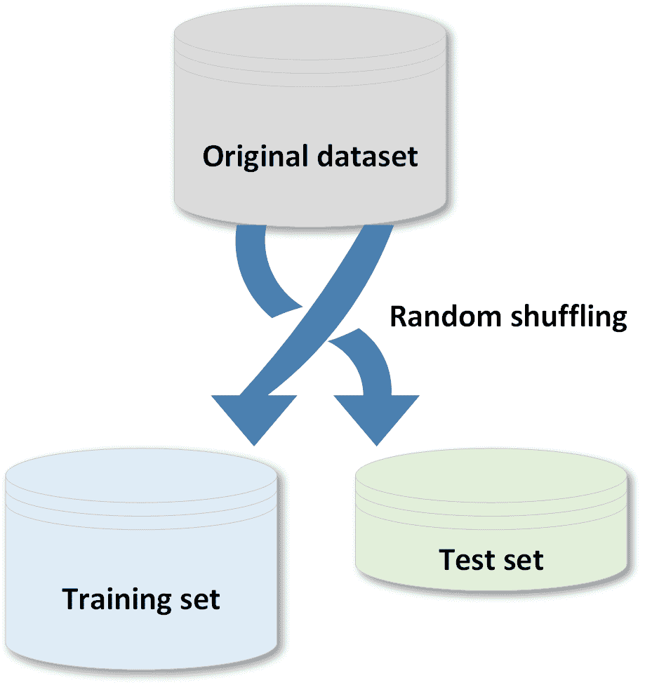

执行此类操作有两个主要规则：

+   两个数据集都必须反映原始分布

+   在拆分阶段之前，原始数据集必须随机打乱，以避免后续元素之间的相关性。

使用 scikit-learn，这可以通过 `train_test_split()` 函数实现：

```py
from sklearn.model_selection import train_test_split

>>> X_train, X_test, Y_train, Y_test = train_test_split(X, Y, test_size=0.25, random_state=1000)
```

参数`test_size`（以及`training_size`）允许指定放入测试/训练集的元素百分比。在这种情况下，训练比为 75%，测试比为 25%。另一个重要参数是`random_state`，它可以接受 NumPy 的`RandomState`生成器或一个整数种子。在许多情况下，提供实验的可重复性很重要，因此也需要避免使用不同的种子，从而避免不同的随机分割：

我的建议是始终使用相同的数字（也可以是 0 或完全省略），或者定义一个全局`RandomState`，它可以传递给所有需要的函数。

```py
from sklearn.utils import check_random_state

>>> rs = check_random_state(1000)
<mtrand.RandomState at 0x12214708>

>>> X_train, X_test, Y_train, Y_test = train_test_split(X, Y, test_size=0.25, random_state=rs)
```

这样，如果种子保持相等，所有实验都必须得出相同的结果，并且可以由其他科学家在不同的环境中轻松复制。

想要了解更多关于 NumPy 随机数生成的信息，请访问[`docs.scipy.org/doc/numpy/reference/generated/numpy.random.RandomState.html`](https://docs.scipy.org/doc/numpy/reference/generated/numpy.random.RandomState.html)。

# 管理分类数据

在许多分类问题中，目标数据集由无法立即由任何算法处理的分类标签组成。需要编码，scikit-learn 提供了至少两种有效选项。让我们考虑一个由 10 个具有两个特征的分类样本组成的小数据集：

```py
import numpy as np

>>> X = np.random.uniform(0.0, 1.0, size=(10, 2))
>>> Y = np.random.choice(('Male','Female'), size=(10))
>>> X[0]
array([ 0.8236887 ,  0.11975305])
>>> Y[0]
'Male'
```

第一种选择是使用`LabelEncoder`类，它采用字典导向的方法，将每个类别标签与一个递增的整数号码关联，即实例数组`classes_`的索引：

```py
from sklearn.preprocessing import LabelEncoder

>>> le = LabelEncoder()
>>> yt = le.fit_transform(Y)
>>> print(yt)
[0 0 0 1 0 1 1 0 0 1]

>>> le.classes_array(['Female', 'Male'], dtype='|S6')
```

可以用这种方式获得逆变换：

```py
>>> output = [1, 0, 1, 1, 0, 0]
>>> decoded_output = [le.classes_[i] for i in output]
['Male', 'Female', 'Male', 'Male', 'Female', 'Female']
```

这种方法简单且在许多情况下效果良好，但它有一个缺点：所有标签都被转换成顺序数字。然后，使用实值工作的分类器将根据它们的距离考虑相似数字，而不考虑语义。因此，通常更倾向于使用所谓的**独热编码**，它将数据二进制化。对于标签，可以使用`LabelBinarizer`类实现：

```py
from sklearn.preprocessing import LabelBinarizer

>>> lb = LabelBinarizer()
>>> Yb = lb.fit_transform(Y)
array([[1],
       [0],
       [1],
       [1],
       [1],
       [1],
       [0],
       [1],
       [1],
       [1]])

>>> lb.inverse_transform(Yb)
array(['Male', 'Female', 'Male', 'Male', 'Male', 'Male', 'Female', 'Male',
       'Male', 'Male'], dtype='|S6')
```

在这种情况下，每个分类标签首先被转换成一个正整数，然后转换成一个向量，其中只有一个特征是 1，而其他所有特征都是 0。这意味着，例如，使用具有对应主要类别的峰值的 softmax 分布可以很容易地转换成一个离散向量，其中唯一的非空元素对应于正确的类别。例如：

```py
import numpy as np

>>> Y = lb.fit_transform(Y)
array([[0, 1, 0, 0, 0],
       [0, 0, 0, 1, 0],
       [1, 0, 0, 0, 0]])

>>> Yp = model.predict(X[0])
array([[0.002, 0.991, 0.001, 0.005, 0.001]])

>>> Ypr = np.round(Yp)
array([[ 0.,  1.,  0.,  0.,  0.]])

>>> lb.inverse_transform(Ypr)
array(['Female'], dtype='|S6')
```

当分类特征的结构类似于字典列表（不一定是密集的，它们可能只为少数几个特征有值）时，可以采用另一种方法。例如：

```py
data = [
   { 'feature_1': 10.0, 'feature_2': 15.0 },
   { 'feature_1': -5.0, 'feature_3': 22.0 },
   { 'feature_3': -2.0, 'feature_4': 10.0 }
]
```

在这种情况下，scikit-learn 提供了 `DictVectorizer` 和 `FeatureHasher` 类；它们都生成可以输入到任何机器学习模型中的稀疏矩阵。后者具有有限的内存消耗，并采用 **MurmurHash 3**（阅读[`en.wikipedia.org/wiki/MurmurHash`](https://en.wikipedia.org/wiki/MurmurHash)，获取更多信息）。以下是对这两种方法的代码示例：

```py
from sklearn.feature_extraction import DictVectorizer, FeatureHasher

>>> dv = DictVectorizer()
>>> Y_dict = dv.fit_transform(data)

>>> Y_dict.todense()
matrix([[ 10.,  15.,   0.,   0.],
        [ -5.,   0.,  22.,   0.],
        [  0.,   0.,  -2.,  10.]])

>>> dv.vocabulary_
{'feature_1': 0, 'feature_2': 1, 'feature_3': 2, 'feature_4': 3}

>>> fh = FeatureHasher()
>>> Y_hashed = fh.fit_transform(data)

>>> Y_hashed.todense()
matrix([[ 0.,  0.,  0., ...,  0.,  0.,  0.],
        [ 0.,  0.,  0., ...,  0.,  0.,  0.],
        [ 0.,  0.,  0., ...,  0.,  0.,  0.]])
```

在这两种情况下，我建议您阅读原始 scikit-learn 文档，以了解所有可能的选项和参数。

当处理分类特征（通常通过 `LabelEncoder` 转换为正整数）时，也可以使用 `OneHotEncoder` 类来过滤数据集，以便应用独热编码。在以下示例中，第一个特征是一个二进制索引，表示 `'Male'` 或 `'Female'`：

```py
from sklearn.preprocessing import OneHotEncoder

>>> data = [
   [0, 10],
   [1, 11],
   [1, 8],
   [0, 12],
   [0, 15]
]

>>> oh = OneHotEncoder(categorical_features=[0])
>>> Y_oh = oh.fit_transform(data1)

>>> Y_oh.todense()
matrix([[  1.,   0.,  10.],
        [  0.,   1.,  11.],
        [  0.,   1.,   8.],
        [  1.,   0.,  12.],
        [  1.,   0.,  15.]])
```

考虑到这些方法会增加值的数量（也随着二进制版本呈指数增长），所有类都采用基于 SciPy 实现的稀疏矩阵。有关更多信息，请参阅[`docs.scipy.org/doc/scipy-0.18.1/reference/sparse.html`](https://docs.scipy.org/doc/scipy-0.18.1/reference/sparse.html)。

# 管理缺失特征

有时数据集可能包含缺失特征，因此可以考虑以下几种选择：

+   删除整行

+   创建子模型来预测这些特征

+   使用自动策略根据其他已知值输入它们

第一种选择是最激进的，只有在数据集相当大、缺失特征数量高，任何预测都可能存在风险时才应考虑。第二种选择要困难得多，因为需要确定一个监督策略来为每个特征训练一个模型，最后预测它们的值。综合考虑所有优缺点，第三种选择可能是最佳选择。scikit-learn 提供了 `Imputer` 类，该类负责使用基于均值（默认选择）、中位数或频率（将使用最频繁的条目来填充所有缺失值）的策略来填充空缺。

以下代码片段展示了使用三种方法（缺失特征条目的默认值是 `NaN`。然而，可以通过 `missing_values` 参数使用不同的占位符）的示例：

```py
from sklearn.preprocessing import Imputer

>>> data = np.array([[1, np.nan, 2], [2, 3, np.nan], [-1, 4, 2]])

>>> imp = Imputer(strategy='mean')
>>> imp.fit_transform(data)
array([[ 1\. ,  3.5,  2\. ],
       [ 2\. ,  3\. ,  2\. ],
       [-1\. ,  4\. ,  2\. ]])

>>> imp = Imputer(strategy='median')
>>> imp.fit_transform(data)
array([[ 1\. ,  3.5,  2\. ],
       [ 2\. ,  3\. ,  2\. ],
       [-1\. ,  4\. ,  2\. ]])

>>> imp = Imputer(strategy='most_frequent')
>>> imp.fit_transform(data)
array([[ 1.,  3.,  2.],
       [ 2.,  3.,  2.],
       [-1.,  4.,  2.]])
```

# 数据缩放和归一化

一个通用的数据集（我们假设它总是数值的）由不同的值组成，这些值可以来自不同的分布，具有不同的尺度，有时也存在异常值。机器学习算法本身无法区分这些不同的情况，因此，在处理之前始终最好对数据集进行标准化。一个非常常见的问题来自于非零均值和大于一的方差。在以下图中，比较了原始数据集和相同数据集缩放和居中的情况：

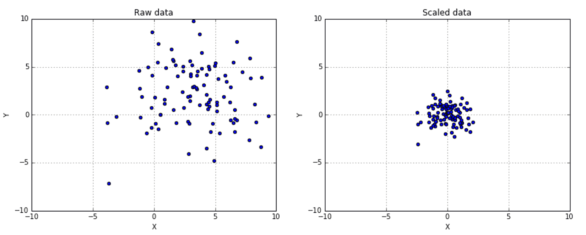

可以使用`StandardScaler`类来实现这一结果：

```py
from sklearn.preprocessing import StandardScaler

>>> ss = StandardScaler()
>>> scaled_data = ss.fit_transform(data)
```

可以通过参数`with_mean=True/False`和`with_std=True/False`（默认情况下两者都激活）来指定缩放过程是否必须包括均值和标准差。如果您需要一个更强大的缩放功能，具有对异常值的高级控制以及选择分位数范围的可能性，还有`RobustScaler`类。以下是一些不同分位数的示例：

```py
from sklearn.preprocessing import RubustScaler

>>> rb1 = RobustScaler(quantile_range=(15, 85))
>>> scaled_data1 = rb1.fit_transform(data)

>>> rb1 = RobustScaler(quantile_range=(25, 75))
>>> scaled_data1 = rb1.fit_transform(data)

>>> rb2 = RobustScaler(quantile_range=(30, 60))
>>> scaled_data2 = rb2.fit_transform(data)
```

结果显示在下述图中：

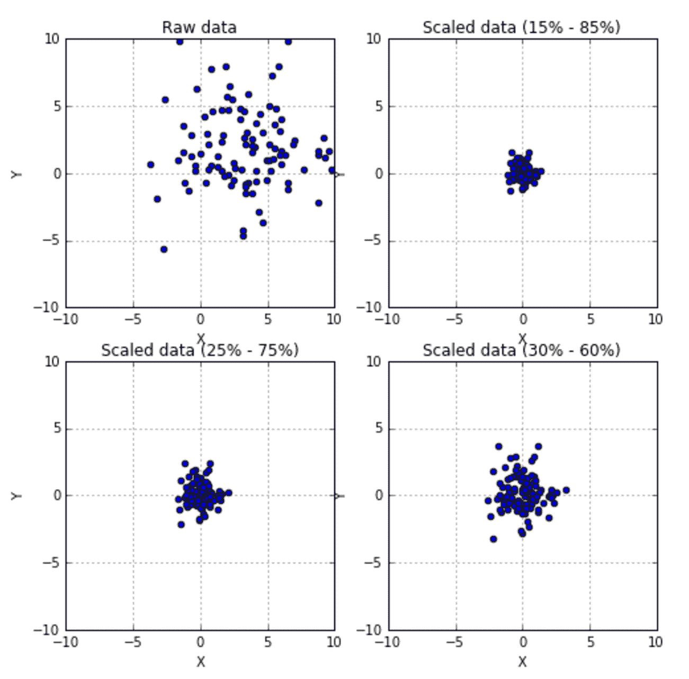

其他选项包括`MinMaxScaler`和`MaxAbsScaler`，它们通过移除不属于给定范围（前者）或考虑最大绝对值（后者）来缩放数据。

scikit-learn 还提供了一个用于样本归一化的类，`Normalizer`。它可以对数据集的每个元素应用`max`、`l1`和`l2`范数。在欧几里得空间中，它们被定义为以下方式：

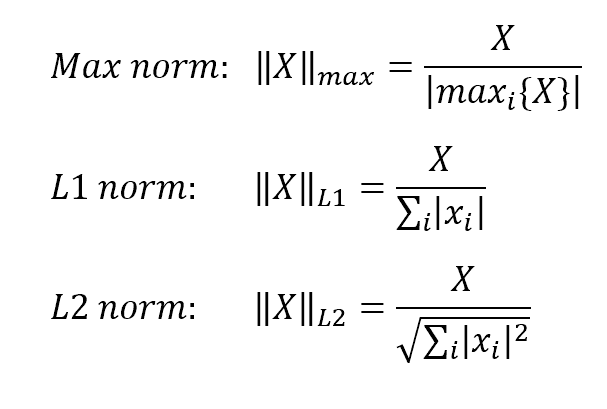

下文展示了每种归一化的示例：

```py
from sklearn.preprocessing import Normalizer

>>> data = np.array([1.0, 2.0])

>>> n_max = Normalizer(norm='max')
>>> n_max.fit_transform(data.reshape(1, -1))
[[ 0.5, 1\. ]]

>>> n_l1 = Normalizer(norm='l1')
>>> n_l1.fit_transform(data.reshape(1, -1))
[[ 0.33333333,  0.66666667]]

>>> n_l2 = Normalizer(norm='l2')
>>> n_l2.fit_transform(data.reshape(1, -1))
[[ 0.4472136 ,  0.89442719]]
```

# 特征选择和过滤

一个具有许多特征的非归一化数据集包含的信息与所有特征及其方差的相关性成比例。让我们考虑一个具有三个特征的小数据集，这些特征是通过随机高斯分布生成的：

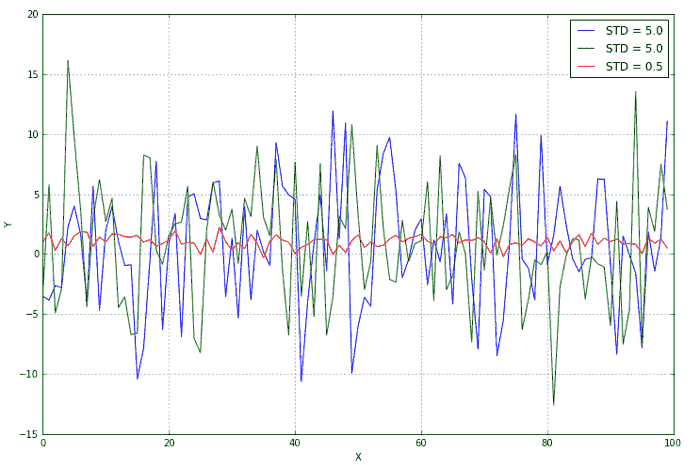

即使没有进一步的分析，很明显，中心线（具有最低方差）几乎是恒定的，并且不提供任何有用的信息。如果您还记得上一章，熵 H(X)相当小，而其他两个变量携带更多的信息。因此，方差阈值是一个有用的方法来移除所有那些贡献（在变异性和信息方面）低于预定义水平的元素。scikit-learn 提供了`VarianceThreshold`类，可以轻松解决这个问题。通过将其应用于前一个数据集，我们得到以下结果：

```py
from sklearn.feature_selection import VarianceThreshold

>>> X[0:3, :]
array([[-3.5077778 , -3.45267063,  0.9681903 ],
       [-3.82581314,  5.77984656,  1.78926338],
       [-2.62090281, -4.90597966,  0.27943565]])

>>> vt = VarianceThreshold(threshold=1.5)
>>> X_t = vt.fit_transform(X)

>>> X_t[0:3, :]
array([[-0.53478521, -2.69189452],
       [-5.33054034, -1.91730367],
       [-1.17004376,  6.32836981]])
```

第三个特征已被完全移除，因为它的方差低于所选阈值（在本例中为 1.5）。

还有许多单变量方法可以根据基于 F 检验和 p 值的特定标准来选择最佳特征，例如卡方检验或方差分析。然而，它们的讨论超出了本书的范围，读者可以在 Freedman D.、Pisani R.、Purves R.的《统计学》一书中找到更多信息。

下文展示了两个特征选择的例子，分别使用了`SelectKBest`类（它选择最佳*K*高分数特征）和`SelectPercentile`类（它仅选择属于特定百分比的子集特征）。它们都可以应用于回归和分类数据集，但需要注意选择合适的评分函数：

```py
from sklearn.datasets import load_boston, load_iris
from sklearn.feature_selection import SelectKBest, SelectPercentile, chi2, f_regression

>>> regr_data = load_boston()
>>> regr_data.data.shape
(506L, 13L)

>>> kb_regr = SelectKBest(f_regression)
>>> X_b = kb_regr.fit_transform(regr_data.data, regr_data.target)

>>> X_b.shape
(506L, 10L)

>>> kb_regr.scores_
array([  88.15124178,   75.2576423 ,  153.95488314,   15.97151242,
        112.59148028,  471.84673988,   83.47745922,   33.57957033,
         85.91427767,  141.76135658,  175.10554288,   63.05422911,
        601.61787111])

>>> class_data = load_iris()
>>> class_data.data.shape
(150L, 4L)

>>> perc_class = SelectPercentile(chi2, percentile=15)
>>> X_p = perc_class.fit_transform(class_data.data, class_data.target)

>>> X_p.shape
(150L, 1L)

>>> perc_class.scores_
array([  10.81782088,    3.59449902,  116.16984746,   67.24482759]) 
```

关于所有 scikit-learn 分数函数及其使用的更多详细信息，请访问 [`scikit-learn.org/stable/modules/feature_selection.html#univariate-feature-selection`](http://scikit-learn.org/stable/modules/feature_selection.html#univariate-feature-selection)。

# 主成分分析

在许多情况下，输入数据集 *X* 的维度很高，与之相关的每个机器学习算法的复杂性也高。此外，信息很少均匀地分布在所有特征上，正如前一章所讨论的，将会有高熵特征和低熵特征，当然，它们不会对最终结果产生显著贡献。一般来说，如果我们考虑欧几里得空间，我们有：

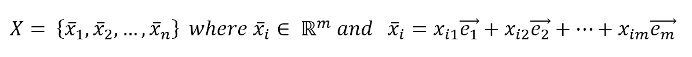

因此，每个点都是用由 *m* 个线性无关向量组成的正交基来表示的。现在，考虑一个数据集 *X*，一个自然的问题出现了：在不造成信息量急剧损失的情况下，是否可以减少 *m*？让我们考虑以下图（没有任何特定的解释）：

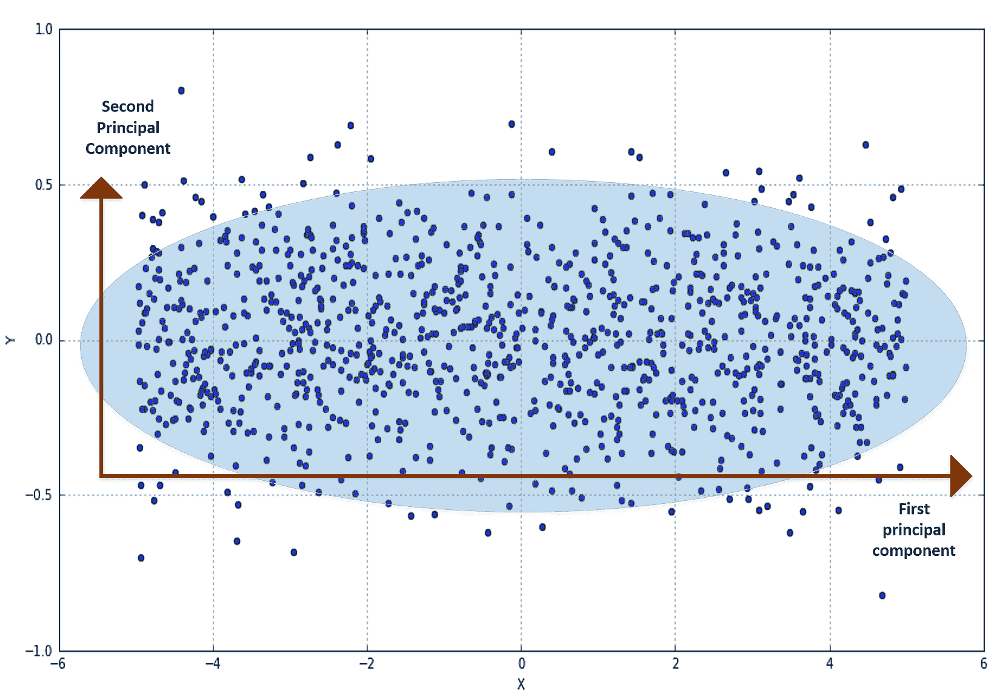

无论哪种分布生成 *X=(x,y)*，然而，水平分量的方差明显大于垂直分量。正如所讨论的，这意味着第一个组件提供的信息量更高，例如，如果 *x* 轴在保持垂直轴不变的情况下水平拉伸，分布就变成了一个深度越来越不重要的段。

为了评估每个组件带来的信息量以及它们之间的相关性，一个有用的工具是协方差矩阵（如果数据集的均值为零，我们可以使用相关矩阵）：

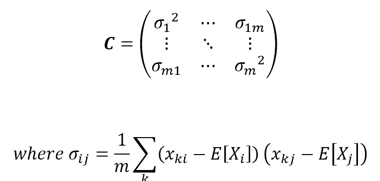

*C* 是对称和正半定的，所以所有特征值都是非负的，但每个值的含义是什么？前一个示例的协方差矩阵是：

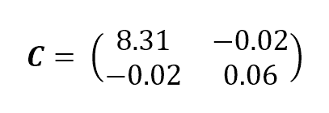

如预期的那样，水平方差明显高于垂直方差。此外，其他值都接近于零。如果你记得定义，并且为了简单起见，移除均值项，它们代表了一对组件之间的互相关。很明显，在我们的例子中，*X* 和 *Y* 是不相关的（它们是正交的），但在现实生活中的例子中，可能会有一些特征表现出残留的互相关性。从信息论的角度来看，这意味着知道 *Y* 给我们提供了一些关于 *X*（我们已知）的信息，因此它们共享的信息实际上是翻倍了。所以我们的目标也是在尝试降低其维度的同时去相关 *X*。

这可以通过考虑 *C* 的排序特征值并选择 *g < m* 值来实现：

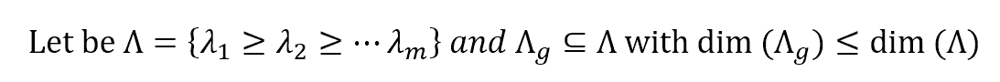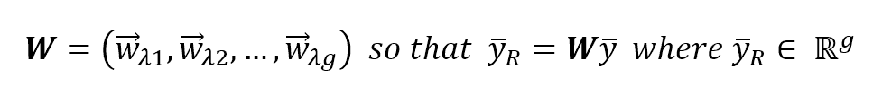

因此，可以将原始特征向量投影到这个新的（子）空间中，其中每个成分携带总方差的一部分，并且新的协方差矩阵被去相关以减少不同特征之间无用的信息共享（就相关性而言）。在 scikit-learn 中，有一个`PCA`类可以非常顺畅地完成所有这些操作：

```py
from sklearn.datasets import load_digits
from sklearn.decomposition import PCA

>>> digits = load_digits()
```

下图展示了几个随机的 MNIST 手写数字：

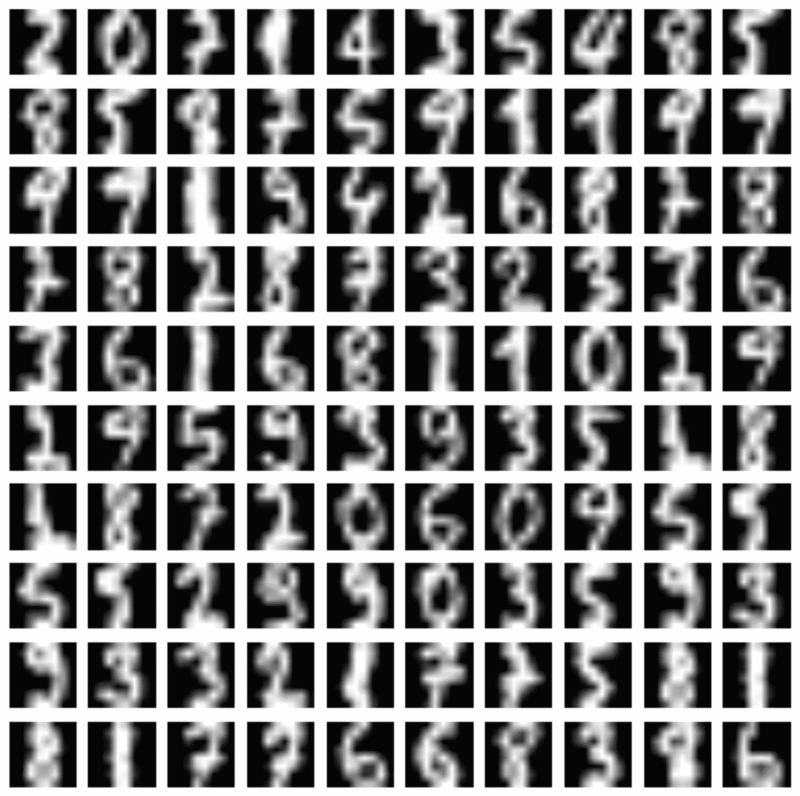

每个图像都是一个 64 位无符号整数（8 位）数字的向量（0, 255），因此初始的成分数确实是 64。然而，黑色像素的总数通常占主导地位，而书写 10 个数字所需的基本符号是相似的，因此有理由假设在几个成分上存在高交叉相关和低方差。尝试使用 36 个主成分，我们得到：

```py
>>> pca = PCA(n_components=36, whiten=True)
>>> X_pca = pca.fit_transform(digits.data / 255)
```

为了提高性能，所有整数值都被归一化到[0, 1]的范围内，并且通过参数`whiten=True`，每个成分的方差被缩放到 1。正如官方 scikit-learn 文档所说，这个过程在需要各向同性分布以使许多算法高效运行时特别有用。可以通过实例变量`explained_variance_ratio_`访问解释方差比***，***它显示了每个单独成分携带的总方差的部分：

```py
>>> pca.explained_variance_ratio_
array([ 0.14890594,  0.13618771,  0.11794594,  0.08409979,  0.05782415,
        0.0491691 ,  0.04315987,  0.03661373,  0.03353248,  0.03078806,
        0.02372341,  0.02272697,  0.01821863,  0.01773855,  0.01467101,
        0.01409716,  0.01318589,  0.01248138,  0.01017718,  0.00905617,
        0.00889538,  0.00797123,  0.00767493,  0.00722904,  0.00695889,
        0.00596081,  0.00575615,  0.00515158,  0.00489539,  0.00428887,
        0.00373606,  0.00353274,  0.00336684,  0.00328029,  0.0030832 ,
        0.00293778])
```

下图展示了 MNIST 数字示例的图表。左图表示方差比，右图表示累积方差。可以立即看出，第一成分通常是最重要的信息成分，而后续的成分则提供了分类器可能丢弃的细节：

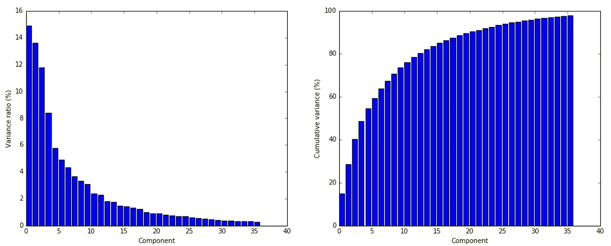

如预期的那样，从第五个成分开始，对总方差的贡献急剧减少，因此可以在不造成不可接受的信息损失的情况下降低原始维度，这可能导致算法学习错误的类别。在前面的图表中，有使用前 36 个成分重建的手写数字，这些成分在 0 到 1 之间进行了白化和归一化。为了获得原始图像，我们需要对所有新向量进行逆变换，并将它们投影到原始空间中：

```py
>>> X_rebuilt = pca.inverse_transform(X_pca)
```

结果如下所示：

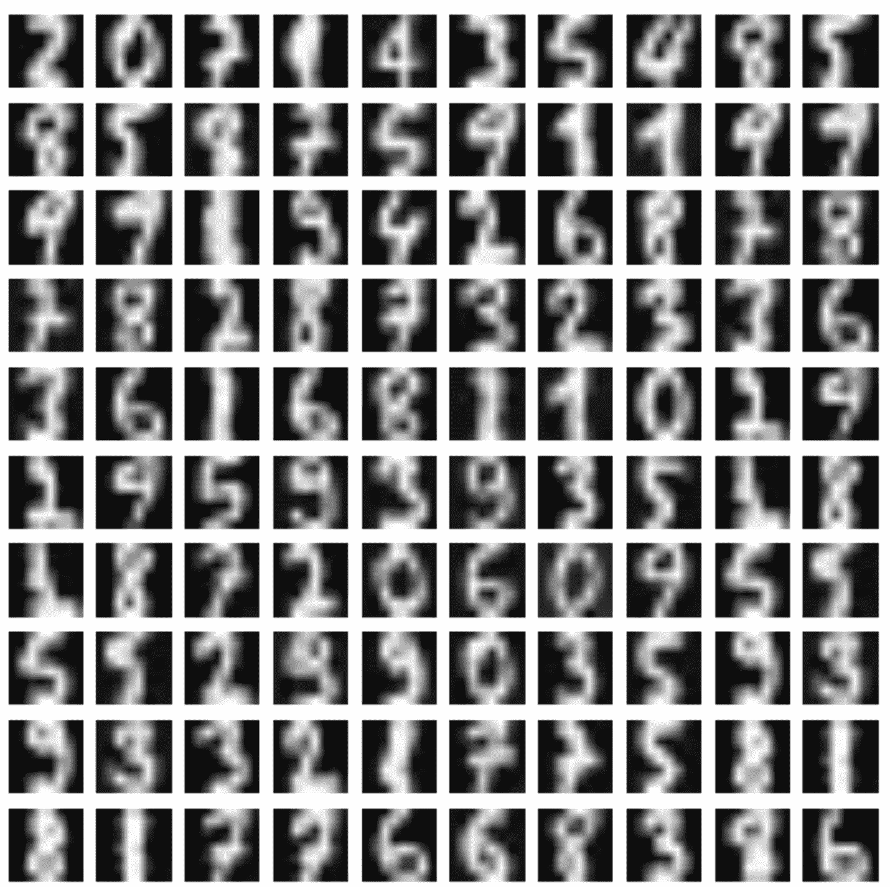

此过程还可以通过去除残留方差来部分去噪原始图像，这种方差通常与噪声或不需要的贡献相关（几乎每种书法都会扭曲一些用于识别的结构元素）。

我建议读者尝试不同的成分数量（使用解释方差数据），以及`n_components='mle'`，它实现了最佳维度的自动选择（Minka T.P, *自动选择 PCA 的维度*, NIPS 2000: 598-604）。

scikit-learn 使用**奇异值分解**（**SVD**）解决 PCA 问题，这可以在 Poole D.的《线性代数》，Brooks Cole 中详细研究。可以通过参数`svd_solver`控制算法，其值有`'auto', 'full', 'arpack', 'randomized'`。Arpack 实现了截断 SVD。随机化基于一个近似算法，它丢弃了许多奇异向量，并且在高维数据集（实际组件数量明显较小）中也能实现非常好的性能。

# 非负矩阵分解

当数据集由非负元素组成时，可以使用**非负矩阵分解**（**NNMF**）而不是标准的主成分分析（PCA）。该算法基于 Frobenius 范数优化一个损失函数（在*W*和*H*上交替进行）：

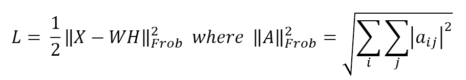

如果*dim(X) = n x m*，则*dim(W) = n x p*和*dim(H) = p x m*，其中*p*等于请求的组件数量（`n_components`参数），这通常小于原始维度*n*和*m*。

最终的重构完全是加性的，并且已经证明它对于通常没有非负元素的图像或文本特别有效。在下面的代码片段中，有一个使用 Iris 数据集（它是非负的）的示例。`init`参数可以假设不同的值（请参阅文档），这些值决定了数据矩阵的初始处理方式。对于非负矩阵，随机选择仅进行缩放（不执行奇异值分解）：

```py
from sklearn.datasets import load_iris
from sklearn.decomposition import NMF

>>> iris = load_iris()
>>> iris.data.shape
(150L, 4L)

>>> nmf = NMF(n_components=3, init='random', l1_ratio=0.1)
>>> Xt = nmf.fit_transform(iris.data)

>>> nmf.reconstruction_err_
1.8819327624141866

>>> iris.data[0]
array([ 5.1,  3.5,  1.4,  0.2])
>>> Xt[0]
array([ 0.20668461,  1.09973772,  0.0098996 ])
>>> nmf.inverse_transform(Xt[0])
array([ 5.10401653,  3.49666967,  1.3965409 ,  0.20610779])
```

NNMF 与其他分解方法一起，对于更高级的技术，如推荐系统和主题建模，将非常有用。

NNMF 对其参数（特别是初始化和正则化）非常敏感，因此建议阅读原始文档以获取更多信息：[`scikit-learn.org/stable/modules/generated/sklearn.decomposition.NMF.html.`](http://scikit-learn.org/stable/modules/generated/sklearn.decomposition.NMF.html)

# 稀疏 PCA

scikit-learn 提供了不同的 PCA 变体，可以解决特定问题。我确实建议阅读原始文档。然而，我想提到`SparsePCA`，它允许在提取主成分的同时利用数据的自然稀疏性。如果你考虑手写数字或其他必须被分类的图像，它们的初始维度可以相当高（一个 10x10 的图像有 100 个特征）。然而，应用标准 PCA 只选择平均最重要的特征，假设每个样本可以使用相同的组件重建。简化来说，这相当于：

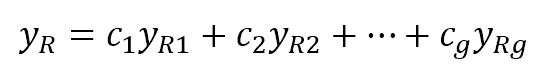

另一方面，我们总是可以使用有限数量的组件，但不需要由密集投影矩阵给出的限制。这可以通过使用稀疏矩阵（或向量）来实现，其中非零元素的数量相当低。这样，每个元素都可以使用其特定的组件重建（在大多数情况下，它们将是始终最重要的），这可以包括通常由密集 PCA 丢弃的元素。前面的表达式现在变为：

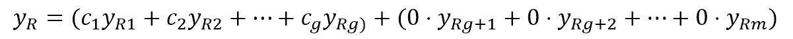

在这里，非零分量已经被放入了第一个块（它们的顺序与之前的表达式不同），而所有其他的零项已经被分开。从线性代数的角度来看，现在的向量空间具有原始的维度。然而，利用稀疏矩阵的强大功能（由`scipy.sparse`提供），scikit-learn 可以比传统的 PCA 更高效地解决这个问题。

下面的代码片段显示了一个具有 60 个组件的稀疏 PCA。在这种情况下，它们通常被称为原子，稀疏度可以通过*L1*范数正则化来控制（更高的`alpha`参数值导致更稀疏的结果）。这种方法在分类算法中非常常见，将在下一章中讨论：

```py
from sklearn.decomposition import SparsePCA

>>> spca = SparsePCA(n_components=60, alpha=0.1)
>>> X_spca = spca.fit_transform(digits.data / 255)

>>> spca.components_.shape
(60L, 64L)
```

如需有关 SciPy 稀疏矩阵的更多信息，请访问[`docs.scipy.org/doc/scipy-0.18.1/reference/sparse.html`](https://docs.scipy.org/doc/scipy-0.18.1/reference/sparse.html)。

# 核 PCA

我们将在第七章“支持向量机”中讨论核方法，然而，提及`KernelPCA`类是有用的，它对非线性可分的数据集执行 PCA。为了理解这种方法（数学公式并不简单），考虑将每个样本投影到一个特定的空间是有用的，在这个空间中，数据集变得线性可分。这个空间的部分对应于第一个、第二个、...主成分，因此，核 PCA 算法计算了我们的样本到每个部分的投影。

让我们考虑一个由一个圆和一个内部的 blob 组成的集合：

```py
from sklearn.datasets import make_circles

>>> Xb, Yb = make_circles(n_samples=500, factor=0.1, noise=0.05)
```

图形表示如下。在这种情况下，经典的 PCA 方法无法捕捉现有组件的非线性依赖关系（读者可以验证投影与原始数据集等价）。然而，通过观察样本并使用极坐标（因此，一个可以投影所有点的空间），很容易将两个集合分开，只需考虑半径：

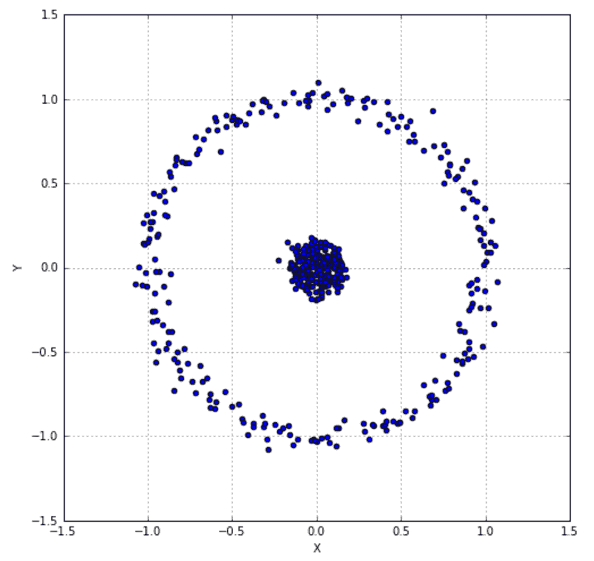

考虑到数据集的结构，我们可以研究具有径向基函数核的主成分分析（PCA）的行为。由于 `gamma` 的默认值是特征数量的 1.0/（目前，将此参数视为与高斯方差成反比），我们需要将其增加以捕捉外部圆环。1.0 的值就足够了：

```py
from sklearn.decomposition import KernelPCA

>>> kpca = KernelPCA(n_components=2, kernel='rbf', fit_inverse_transform=True, gamma=1.0)
>>> X_kpca = kpca.fit_transform(Xb)
```

实例变量 `X_transformed_fit_` 将包含我们的数据集在新空间中的投影。绘制它，我们得到：


图表显示了一个预期的分离，同时也可以看到属于中心块点的数据点具有曲线分布，因为它们对中心距离更敏感。

当我们将数据集视为由可以构成成分（特别是径向基或多项式）的元素组成时，核主成分分析（Kernel PCA）是一种强大的工具，但我们无法确定它们之间的线性关系。

想了解更多关于 scikit-learn 支持的不同核的信息，请访问 [`scikit-learn.org/stable/modules/metrics.html#linear-kernel`](http://scikit-learn.org/stable/modules/metrics.html#linear-kernel)。

# 原子提取和字典学习

字典学习是一种技术，它允许从稀疏原子字典（类似于主成分）开始重建样本。在 Mairal J., Bach F., Ponce J., Sapiro G. 的《在线字典学习用于稀疏编码》（2009 年 29 届国际机器学习会议论文集）中，描述了 scikit-learn 采取的相同在线策略，可以概括为一个双优化问题，其中：


输入数据集和目标是找到字典 *D* 以及每个样本的一组权重：

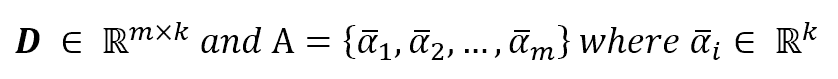

在训练过程之后，可以计算输入向量如下：

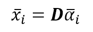

优化问题（涉及 *D* 和 alpha 向量）可以表示为以下损失函数的最小化：

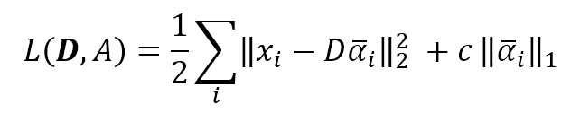

在这里，参数 *c* 控制稀疏度水平（与 *L1* 归一化的强度成正比）。这个问题可以通过交替最小二乘变量直到达到稳定点来解决。

在 scikit-learn 中，我们可以使用 `DictionaryLearning` 类（使用常用的 MNIST 数据集）实现这样的算法，其中 `n_components` 如常，决定了原子的数量：

```py
from sklearn.decomposition import DictionaryLearning

>>> dl = DictionaryLearning(n_components=36, fit_algorithm='lars', transform_algorithm='lasso_lars')
>>> X_dict = dl.fit_transform(digits.data)
```

每个原子（成分）的图表如下所示：

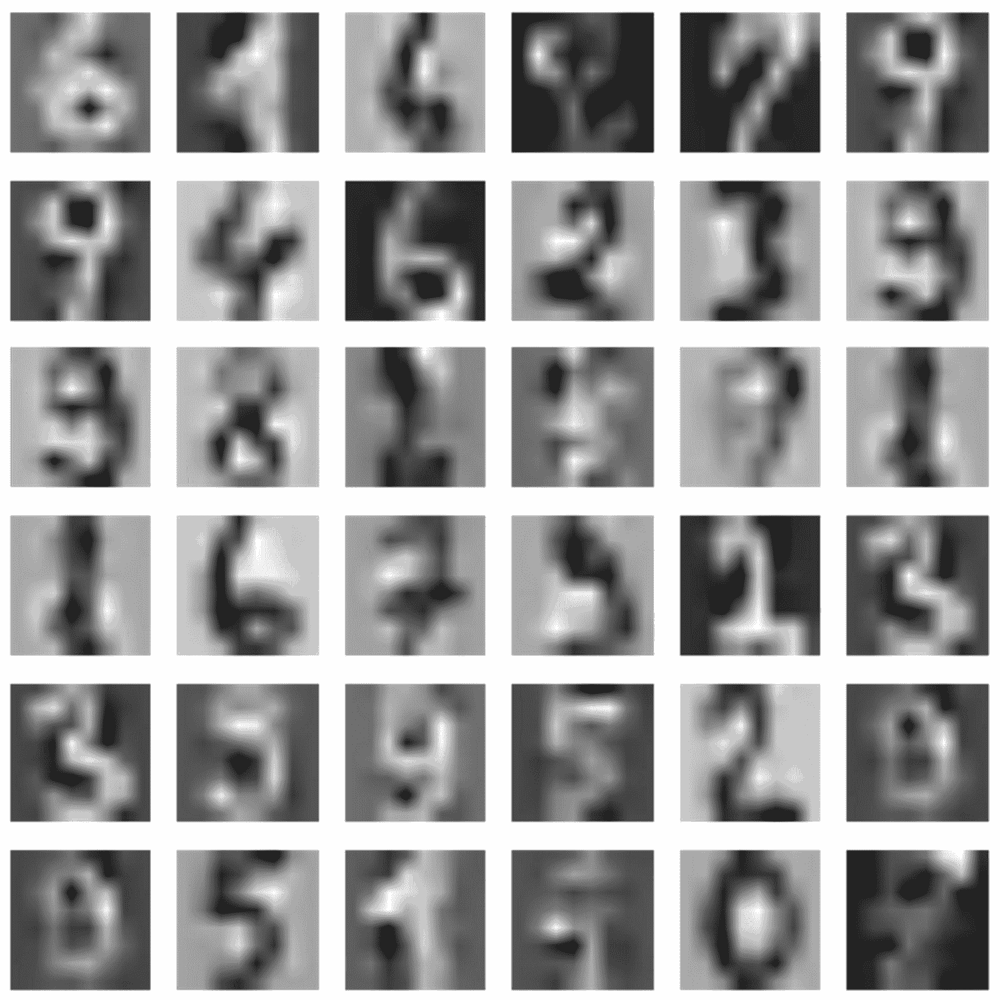

在低端机器上，这个过程可能非常耗时。在这种情况下，我建议将样本数量限制在 20 或 30 个。

# 参考文献

+   Freedman D., Pisani R., Purves R., *统计学，* 诺顿出版社

+   Gareth J., Witten D., Hastie T., Tibshirani R., *统计学习引论：R 语言应用*, Springer

+   Poole D., *线性代数*, Brooks Cole

+   Minka T.P, *PCA 的自动维度选择*, NIPS 2000: 598-604

+   Mairal J., Bach F., Ponce J., Sapiro G., *在线字典学习用于稀疏编码*, 第 29 届国际机器学习会议论文集，2009 年

# 摘要

特征选择是机器学习流程中的第一步（有时也是最重要的一步）。并非所有特征对我们都有用，有些特征使用不同的符号表示，因此通常在执行任何进一步操作之前，需要对我们的数据集进行预处理。

我们看到了如何使用随机洗牌将数据分为训练集和测试集，以及如何管理缺失元素。另一个非常重要的部分涵盖了用于管理分类数据或标签的技术，这在某些特征只假设离散值集合时非常常见。

然后我们分析了维度问题。一些数据集包含许多相互关联的特征，它们不提供任何新信息，但增加了计算复杂度并降低了整体性能。主成分分析是一种选择只包含最大总方差子集特征的方法。这种方法及其变体允许解耦特征并降低维度，而不会在准确性方面造成剧烈损失。字典学习是另一种从数据集中提取有限数量的构建块的技术，同时提取重建每个样本所需的信息。当数据集由相似元素的多个版本组成（如图像、字母或数字）时，这种方法特别有用。

在下一章中，我们将讨论线性回归，这是预测连续值的最常见和最简单的监督方法。我们还将分析如何克服一些局限性，以及如何使用相同的算法解决非线性问题。
