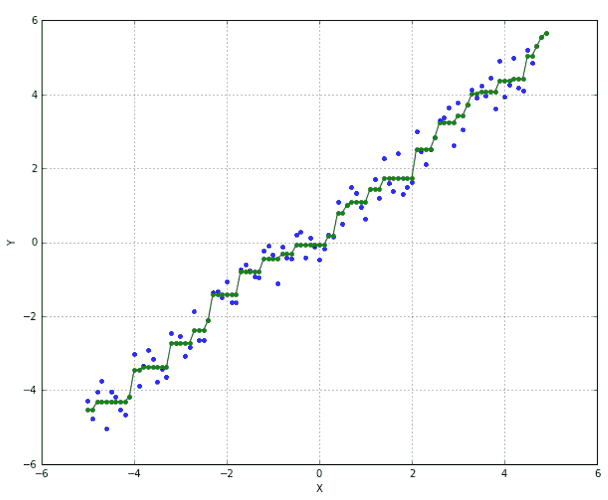

# 线性回归

线性模型是最简单的参数化方法，始终值得适当的关注，因为许多问题，甚至本质上是非线性的，都可以用这些模型轻松解决。正如之前讨论的那样，回归是一种预测，其中目标值是连续的，其应用范围很广，因此了解线性模型如何拟合数据，其优势和劣势是什么，以及在什么情况下选择替代方案更可取，是很重要的。在章节的最后部分，我们将讨论一种有趣的方法，使用相同的模型有效地处理非线性数据。

# 线性模型

考虑一个真实值向量的数据集：


每个输入向量都与一个实数值 y[i] 相关联：


线性模型基于这样的假设：可以通过基于以下规则的回归过程来近似输出值：


换句话说，强烈的假设是，我们的数据集和所有其他未知点都位于一个超平面上，最大误差与训练质量和原始数据集的适应性成正比。当数据集明显是非线性的，并且必须考虑其他模型（如神经网络或核支持向量机）时，最常见的问题之一就会出现。

# 一个二维示例

让我们考虑一个由向 -6 和 6 之间的一段添加一些均匀噪声的点构建的小数据集。原始方程是：*y = x + 2 + n*，其中 n 是噪声项。

在下面的图中，有一个候选回归函数的图表：


由于我们在平面上工作，我们寻找的回归器仅是两个参数的函数：


为了拟合我们的模型，我们必须找到最佳参数，为此我们选择普通最小二乘法。要最小化的损失函数是：


使用解析方法，为了找到全局最小值，我们必须施加：


因此（为了简单起见，它接受包含两个变量的向量的向量）：

```py
import numpy as np

def loss(v):
 e = 0.0
 for i in range(nb_samples):
 e += np.square(v[0] + v[1]*X[i] - Y[i])
 return 0.5 * e
```

梯度可以定义为：

```py
def gradient(v):
 g = np.zeros(shape=2)
 for i in range(nb_samples):
 g[0] += (v[0] + v[1]*X[i] - Y[i])
 g[1] += ((v[0] + v[1]*X[i] - Y[i]) * X[i])
 return g
```

现在可以使用 SciPy 解决优化问题：

```py
from scipy.optimize import minimize

>>> minimize(fun=loss, x0=[0.0, 0.0], jac=gradient, method='L-BFGS-B')
fun: 9.7283268345966025
 hess_inv: <2x2 LbfgsInvHessProduct with dtype=float64>
 jac: array([  7.28577538e-06,  -2.35647522e-05])
 message: 'CONVERGENCE: REL_REDUCTION_OF_F_<=_FACTR*EPSMCH'
 nfev: 8
 nit: 7
 status: 0
 success: True
 x: array([ 2.00497209,  1.00822552])
```

如预期的那样，回归去噪了我们的数据集，重建了原始方程：*y = x + 2*。

# 使用 scikit-learn 和更高维度的线性回归

scikit-learn 提供了 `LinearRegression` 类，它适用于 n 维空间。为此，我们将使用波士顿数据集：

```py
from sklearn.datasets import load_boston

>>> boston = load_boston()

>>> boston.data.shape
(506L, 13L)
>>> boston.target.shape
(506L,)
```

它有 506 个样本，13 个输入特征和一个输出。在下面的图中，有一组前 12 个特征的图表：


当处理数据集时，有一个表格视图来操作数据是非常有用的。pandas 是这个任务的完美框架，尽管这超出了本书的范围，但我建议你使用命令`pandas.DataFrame(boston.data, columns=boston.feature_names)`创建一个数据框，并使用 Jupyter 来可视化它。有关更多信息，请参阅 Heydt M.的《Learning pandas - Python Data Discovery and Analysis Made Easy》，Packt 出版社。

存在不同的尺度异常值（可以使用前几章研究的方法去除），因此最好让模型在处理数据之前对数据进行归一化。此外，为了测试目的，我们将原始数据集分为训练集（90%）和测试集（10%）：

```py
from sklearn.linear_model import LinearRegression
from sklearn.model_selection import train_test_split

>>> X_train, X_test, Y_train, Y_test = train_test_split(boston.data, boston.target, test_size=0.1)

>>> lr = LinearRegression(normalize=True)
>>> lr.fit(X_train, Y_train)
LinearRegression(copy_X=True, fit_intercept=True, n_jobs=1, normalize=True)
```

当原始数据集不够大时，将其分为训练集和测试集可能会减少可用于拟合模型的样本数量。k 折交叉验证可以通过不同的策略帮助解决这个问题。整个数据集被分为 k 个部分，始终使用 k-1 个部分进行训练，剩余的一个用于验证模型。将执行 k 次迭代，每次使用不同的验证部分。在以下图中，有一个 3 个部分/迭代的示例：


以这种方式，最终得分可以确定为所有值和所有样本的平均值，并且所有样本都会被用于训练 k-1 次。

要检查回归的准确性，scikit-learn 提供了内部方法`score(X, y)`，它评估模型在测试数据上的表现：

```py
>>> lr.score(X_test, Y_test)
0.77371996006718879
```

因此，整体准确率约为 77%，考虑到原始数据集的非线性，这是一个可接受的结果，但它也可能受到`train_test_split`所做的细分（如我们的情况）的影响。相反，对于 k 折交叉验证，我们可以使用`cross_val_score()`函数，它适用于所有分类器。评分参数非常重要，因为它决定了将采用哪个指标进行测试。由于`LinearRegression`使用普通最小二乘法，我们更喜欢负均方误差，这是一个累积度量，必须根据实际值进行评估（它不是相对的）。

```py
from sklearn.model_selection import cross_val_score

>>> scores = cross_val_score(lr, boston.data, boston.target, cv=7, scoring='neg_mean_squared_error')
array([ -11.32601065,  -10.96365388,  -32.12770594,  -33.62294354,
 -10.55957139, -146.42926647,  -12.98538412])

>>> scores.mean()
-36.859219426420601
>>> scores.std()
45.704973900600457
```

在回归中使用的另一个非常重要的指标被称为**确定系数**或*R²*。它衡量了由数据集解释的预测中的方差量。我们定义**残差**，以下数量：


换句话说，它是样本与预测之间的差异。因此，*R²*被定义为以下：


对于我们的目的，接近 1 的*R²*值意味着几乎完美的回归，而接近 0（或负数）的值意味着模型不好。使用这个指标进行交叉验证相当简单：

```py
>>> cross_val_score(lr, X, Y, cv=10, scoring='r2')
0.75
```

# 回归分析表达式

如果我们想要得到我们模型（一个超平面）的解析表达式，`LinearRegression` 提供了两个实例变量，`intercept_` 和 `coef_`：

```py
>>> print('y = ' + str(lr.intercept_) + ' ')
>>> for i, c in enumerate(lr.coef_):
 print(str(c) + ' * x' + str(i))

y = 38.0974166342 
-0.105375005552 * x0
0.0494815380304 * x1
0.0371643549528 * x2
3.37092201039 * x3
-18.9885299511 * x4
3.73331692311 * x5
0.00111437695492 * x6
-1.55681538908 * x7
0.325992743837 * x8
-0.01252057277 * x9
-0.978221746439 * x10
0.0101679515792 * x11
-0.550117114635 * x12
```

对于任何其他模型，可以通过 `predict(X)` 方法获得预测。作为一个实验，我们可以尝试向我们的训练数据添加一些高斯噪声并预测值：

```py
>>> X = boston.data[0:10] + np.random.normal(0.0, 0.1)

>>> lr.predict(X)
array([ 29.5588731 ,  24.49601998,  30.0981552 ,  28.01864586,
 27.28870704,  24.65881135,  22.46335968,  18.79690943,
 10.53493932,  18.18093544])

>>> boston.target[0:10]
array([ 24\. ,  21.6,  34.7,  33.4,  36.2,  28.7,  22.9,  27.1,  16.5,  18.9])
```

很明显，模型的表现并不理想，有许多可能的原因，最显著的是非线性性和异常值的存在。然而，一般来说，线性回归模型并不是一个完美的鲁棒解决方案。在 Hastie T.，Tibshirani R.，Friedman J. 的 *The Elements of Statistical Learning: Data Mining, Inference, and, Prediction*，Springer 一书中，你可以找到关于其优势和劣势的非常详细的讨论。然而，在这个上下文中，一个常见的威胁是由共线性引起的，这会导致低秩 *X* 矩阵。这决定了病态矩阵，它对噪声特别敏感，导致某些参数的爆炸。为了减轻这种风险并提供更鲁棒的解决方案，已经研究了以下方法。

# 岭回归、Lasso 和 ElasticNet

**岭回归**在普通最小二乘损失函数上施加额外的收缩惩罚，以限制其平方 *L2* 范数：


在这种情况下，*X* 是一个包含所有样本作为列的矩阵，而项 *w* 代表权重向量。通过系数 alpha 的附加项（如果很大，则意味着更强的正则化和更小的值），迫使损失函数不允许 *w* 无限增长，这可能是由于多重共线性或病态性引起的。在下面的图中，展示了应用岭惩罚时发生的情况：


灰色表面表示损失函数（这里，为了简单起见，我们只使用两个权重），而圆心 **O** 是由岭条件强加的边界。最小值将具有较小的 *w* 值，并避免了潜在的爆炸。

在下面的代码片段中，我们将使用交叉验证比较 `LinearRegression` 和 `Ridge`：

```py
from sklearn.datasets import load_diabetes
from sklearn.linear_model import LinearRegression, Ridge

>>> diabetes = load_diabetes()

>>> lr = LinearRegression(normalize=True)
>>> rg = Ridge(0.001, normalize=True)

>>> lr_scores = cross_val_score(lr, diabetes.data, diabetes.target, cv=10)
>>> lr_scores.mean()
0.46196236195833718

>>> rg_scores = cross_val_score(rg, diabetes.data, diabetes.target, cv=10)
>>> rg_scores.mean()
0.46227174692391299
```

有时，找到 alpha（岭系数）的正确值并不那么直接。scikit-learn 提供了 `RidgeCV` 类，允许执行自动网格搜索（在一系列值中返回最佳估计）：

```py
from sklearn.linear_model import RidgeCV

>>> rg = RidgeCV(alphas=(1.0, 0.1, 0.01, 0.005, 0.0025, 0.001, 0.00025), normalize=True)
>>> rg.fit(diabetes.data, diabetes.target)

>>> rg.alpha_
0.0050000000000000001
```

Lasso 回归器对 *w* 的 *L1* 范数施加惩罚，以确定一个可能更高的零系数数量：


稀疏性是惩罚项的结果（数学证明非平凡，将省略）。


在这种情况下，存在一些顶点，其中某个组件非空，而所有其他权重为零。与顶点相交的概率与权重向量 *w* 的维度成正比，因此，在训练 Lasso 回归器后，发现一个相当稀疏的模型是正常的。

在以下代码片段中，使用了糖尿病数据集来拟合 Lasso 模型：

```py
from sklearn.linear_model import Lasso

>>> ls = Lasso(alpha=0.001, normalize=True)
>>> ls_scores = cross_val_score(ls, diabetes.data, diabetes.target, cv=10)
>>> ls_scores.mean()
0.46215747851504058
```

对于 Lasso，也有运行网格搜索以找到最佳 alpha 参数的可能性。在这种情况下，类是 `LassoCV`，其内部动态与之前看到的 Ridge 类似。Lasso 还可以在通过 `scipy.sparse` 类生成的稀疏数据上高效运行，从而允许在不进行部分拟合的情况下训练更大的模型：

```py
from scipy import sparse

>>> ls = Lasso(alpha=0.001, normalize=True)
>>> ls.fit(sparse.coo_matrix(diabetes.data), diabetes.target)
Lasso(alpha=0.001, copy_X=True, fit_intercept=True, max_iter=1000,
 normalize=True, positive=False, precompute=False, random_state=None,
 selection='cyclic', tol=0.0001, warm_start=False)
```

当处理大量数据时，一些模型无法完全装入内存，因此无法训练它们。scikit-learn 提供了一些模型，例如 **随机梯度下降**（**SGD**），其工作方式与 `LinearRegression` 结合 `Ridge`/`Lasso` 非常相似；然而，它们还实现了 `partial_fit()` 方法，这也允许通过 Python 生成器进行连续训练。有关更多详细信息，请参阅 [`scikit-learn.org/stable/modules/linear_model.html#stochastic-gradient-descent-sgd`](http://scikit-learn.org/stable/modules/linear_model.html#stochastic-gradient-descent-sgd)。

最后一种选择是 **ElasticNet**，它将 Lasso 和 Ridge 结合成一个具有两个惩罚因子的单一模型：一个与 *L1* 范数成正比，另一个与 *L2* 范数成正比。这样，得到的模型将像纯 Lasso 一样稀疏，但具有 Ridge 提供的相同的正则化能力。结果损失函数为：


`ElasticNet` 类提供了一个实现，其中 alpha 参数与 `l1_ratio`（公式中的 beta）一起工作。`ElasticNet` 的主要特性是避免由于 *L1* 和 *L2* 范数的平衡作用而导致的特征选择性排除。

在以下代码片段中，使用了 `ElasticNet` 和 `ElasticNetCV` 类的示例：

```py
from sklearn.linear_model import ElasticNet, ElasticNetCV

>>> en = ElasticNet(alpha=0.001, l1_ratio=0.8, normalize=True)
>>> en_scores = cross_val_score(en, diabetes.data, diabetes.target, cv=10)
>>> en_scores.mean()
0.46358858847836454

>>> encv = ElasticNetCV(alphas=(0.1, 0.01, 0.005, 0.0025, 0.001), l1_ratio=(0.1, 0.25, 0.5, 0.75, 0.8), normalize=True)
>>> encv.fit(dia.data, dia.target)
ElasticNetCV(alphas=(0.1, 0.01, 0.005, 0.0025, 0.001), copy_X=True, cv=None,
 eps=0.001, fit_intercept=True, l1_ratio=(0.1, 0.25, 0.5, 0.75, 0.8),
 max_iter=1000, n_alphas=100, n_jobs=1, normalize=True,
 positive=False, precompute='auto', random_state=None,
 selection='cyclic', tol=0.0001, verbose=0)

>>> encv.alpha_
0.001
>>> encv.l1_ratio_
0.75
```

# 带有随机样本一致性的鲁棒回归

线性回归的一个常见问题是由于异常值的存在。普通最小二乘法将考虑它们，因此结果（就系数而言）将因此有偏。以下图示了这种行为的一个例子：


斜率较小的线代表一个可接受的回归，它忽略了异常值，而另一条线则受到异常值的影响。为了避免这个问题，**随机样本一致性**（**RANSAC**）提供了一种有趣的方法，它通过迭代与每个回归器一起工作，在将数据集分为内点和异常值之后。模型仅使用有效样本（通过内部评估或通过可调用的 `is_data_valid()`）进行训练，并且所有样本都会重新评估以验证它们是否仍然是内点或已变成异常值。过程在固定次数的迭代后结束，或者当达到所需的分数时。

在下面的代码片段中，有一个简单线性回归应用于前一个图中所示数据集的例子。

```py
from sklearn.linear_model import LinearRegression

>>> lr = LinearRegression(normalize=True)
>>> lr.fit(X.reshape((-1, 1)), Y.reshape((-1, 1)))
>>> lr.intercept_
array([ 5.500572])
>>> lr.coef_
array([[ 2.53688672]])
```

如预期的那样，由于异常值的存在，斜率很高。得到的回归器是 *y = 5.5 + 2.5x*（比图中所显示的斜率略小）。现在我们将使用 RANSAC 与相同的线性回归器：

```py
from sklearn.linear_model import RANSACRegressor

>>> rs = RANSACRegressor(lr)
>>> rs.fit(X.reshape((-1, 1)), Y.reshape((-1, 1)))
>>> rs.estimator_.intercept_
array([ 2.03602026])
>>> es.estimator_.coef_
array([[ 0.99545348]])
```

在这种情况下，回归器大约是 *y = 2 + x*（这是原始的无异常值清洁数据集）。

如果您想了解更多信息，我建议访问页面 [`scikit-learn.org/stable/modules/generated/sklearn.linear_model.RANSACRegressor.html`](http://scikit-learn.org/stable/modules/generated/sklearn.linear_model.RANSACRegressor.html)。对于其他鲁棒回归技术，请访问：[`scikit-learn.org/stable/modules/linear_model.html#robustness-regression-outliers-and-modeling-errors`](http://scikit-learn.org/stable/modules/linear_model.html#robustness-regression-outliers-and-modeling-errors)。

# 多项式回归

多项式回归是一种基于技巧的技术，即使在数据集具有强烈的非线性时也能使用线性模型。其思路是添加一些从现有变量计算得出的额外变量，并仅使用（在这种情况下）多项式组合：


例如，对于两个变量，可以通过将初始向量（其维度等于 *m*）转换为另一个具有更高维度的向量（其维度为 *k* > *m*）来扩展到二次问题：


在这种情况下，模型在形式上保持线性，但它可以捕捉内部非线性。为了展示 scikit-learn 如何实现这一技术，让我们考虑以下图中的数据集：


这显然是一个非线性数据集，仅基于原始二维点的线性回归无法捕捉其动态。为了尝试，我们可以在同一数据集上训练一个简单的模型（对其进行测试）：

```py
from sklearn.linear_model import LinearRegression

>>> lr = LinearRegression(normalize=True)
>>> lr.fit(X.reshape((-1, 1)), Y.reshape((-1, 1)))
>>> lr.score(X.reshape((-1, 1)), Y.reshape((-1, 1)))
0.10888218817034558
```

性能如预期的那样较差。然而，从图中看，我们可能会认为二次回归可以轻易解决这个问题。scikit-learn 提供了`PolynomialFeatures`类，该类根据`degree`参数将原始集转换为一个扩展集：

```py
from sklearn.preprocessing import PolynomialFeatures

>>> pf = PolynomialFeatures(degree=2)
>>> Xp = pf.fit_transform(X.reshape(-1, 1))

>>> Xp.shape
(100L, 3L)
```

如预期的那样，旧的*x[1]*坐标已被一个三元组所取代，其中也包含了二次和混合项。在此阶段，可以训练一个线性回归模型：

```py
>>> lr.fit(Xp, Y.reshape((-1, 1)))
>>> lr.score(Xp, Y.reshape((-1, 1)))
0.99692778265941961
```

得分相当高，我们付出的唯一代价是特征数量的增加。一般来说，这是可行的；然而，如果数量超过一个可接受的阈值，尝试维度降低或作为一个极端解决方案，转向非线性模型（如 SVM 核）是有用的。通常，一个好的方法是使用`SelectFromModel`类，让 scikit-learn 根据它们的重要性选择最佳特征。实际上，当特征数量增加时，所有特征都具有相同重要性的概率会降低。这是由于相互相关性或主要和次要趋势的共同存在，它们像噪声一样没有足够的力量改变超平面斜率的可感知性。此外，当使用多项式展开时，一些弱特征（不能用于线性分离）被它们的函数所替代，因此实际上的强特征数量减少了。

在以下代码片段中，有一个使用先前波士顿数据集的示例。`threshold`参数用于设置最小重要性级别。如果缺失，分类器将尝试通过移除尽可能多的特征来最大化效率。

```py
from sklearn.feature_selection import SelectFromModel

>>> boston = load_boston()

>>> pf = PolynomialFeatures(degree=2)
>>> Xp = pf.fit_transform(boston.data)
>>> Xp.shape
(506L, 105L)

>>> lr = LinearRegression(normalize=True)
>>> lr.fit(Xp, boston.target)
>>> lr.score(Xp, boston.target)
0.91795268869997404

>>> sm = SelectFromModel(lr, threshold=10)
>>> Xt = sm.fit_transform(Xp, boston.target)
>>> sm.estimator_.score(Xp, boston.target)
0.91795268869997404

>>> Xt.shape
(506L, 8L)
```

在仅选择最佳特征（阈值设置为 10）后，得分保持不变，维度降低保持一致（只有 8 个特征被认为对预测很重要）。如果在任何其他处理步骤之后需要返回到原始数据集，可以使用逆变换：

```py
>>> Xo = sm.inverse_transform(Xt)
>>> Xo.shape
(506L, 105L)
```

# 等调回归

有时我们需要为非递减点的数据集找到一个回归器，这些点可能呈现低级振荡（如噪声）。线性回归可以轻易实现一个非常高的得分（考虑到斜率大约是恒定的），但它像一个降噪器，产生一条无法捕捉我们想要建模的内部动态的线。对于这些情况，scikit-learn 提供了`IsotonicRegression`类，该类产生一个分段插值函数，最小化函数：


下一个示例（使用一个玩具数据集）将提供：

```py
>>> X = np.arange(-5, 5, 0.1)
>>> Y = X + np.random.uniform(-0.5, 1, size=X.shape)
```

下图是数据集的图。正如大家所看到的，它可以很容易地被线性回归器建模，但没有一个高非线性函数，很难捕捉到斜率上的微小（和局部的）变化：


`IsotonicRegression`类需要知道*y[min]*和*y[max]*（它们对应于损失函数中的*y[*0*]和*y[*n*]变量）。在这种情况下，我们设定为-6 和 10：

```py
from sklearn.isotonic import IsotonicRegression

>>> ir = IsotonicRegression(-6, 10)
>>> Yi = ir.fit_transform(X, Y)
```

结果通过三个实例变量提供：

```py
>>> ir.X_min_
-5.0
>>> ir.X_max_
4.8999999999999648
>>> ir.f_
<scipy.interpolate.interpolate.interp1d at 0x126edef8>
```

最后一个，`(ir.f_)`，是一个插值函数，可以在[*x[min]*, *x[max]*]域内评估。例如：

```py
>>> ir.f_(2)
array(1.7294334618146134)
```

下图显示了该函数（绿色线）与原始数据集的图：



想要了解更多关于 SciPy 插值的信息，请访问 [`docs.scipy.org/doc/scipy-0.18.1/reference/interpolate.html`](https://docs.scipy.org/doc/scipy-0.18.1/reference/interpolate.html)。

# 参考文献

Hastie T.，Tibshirani R.，Friedman J.，《统计学习的要素：数据挖掘、推理和预测》，Springer

# 摘要

在本章中，我们介绍了线性模型的重要概念，并描述了线性回归的工作原理。特别是，我们关注了基本模型及其主要变体：Lasso、Ridge 和 ElasticNet。它们不修改内部动态，但作为权重的正规化器，以避免当数据集包含未缩放的样本时的常见问题。这些惩罚具有特定的特性。Lasso 促进稀疏性，Ridge 试图在权重必须位于以原点为中心的圆上（其半径被参数化以增加/减少正规化强度）的约束下找到最小值。ElasticNet 是这两种技术的混合，它试图找到权重足够小且达到一定稀疏度的最小值。

我们还讨论了诸如 RANSAC 等高级技术，它以非常鲁棒的方式处理异常值，以及多项式回归，这是一种将虚拟非线性特征包含到我们的模型中并继续以相同线性方法处理它们的非常智能的方法。通过这种方式，可以创建另一个数据集，包含原始列及其多项式组合。这个新数据集可以用来训练线性回归模型，然后可以选择那些有助于实现良好性能的特征。我们看到的最后一种方法是等距回归，当插值函数始终不是递减时特别有用。此外，它还可以捕捉到由通用线性回归平滑的小振荡。

在下一章中，我们将讨论一些用于分类的线性模型。特别是，我们将关注逻辑回归和随机梯度下降算法。此外，我们将介绍一些有用的度量来评估分类系统的准确性，以及一种强大的技术来自动找到最佳超参数。
