# 逻辑回归

本章首先分析线性分类问题，特别关注逻辑回归（尽管它的名字是分类算法）和随机梯度下降方法。即使这些策略看起来过于简单，但它们仍然是许多分类任务中的主要选择。说到这一点，记住一个非常重要的哲学原则是有用的：**奥卡姆剃刀**。在我们的语境中，它表明第一个选择必须是简单的，并且只有当它不适用时，才需要转向更复杂的模型。在章节的第二部分，我们将讨论一些用于评估分类任务的常用指标。它们不仅限于线性模型，因此我们在讨论不同的策略时也使用它们。

# 线性分类

让我们考虑一个具有两个类别的通用线性分类问题。在下面的图中，有一个例子：

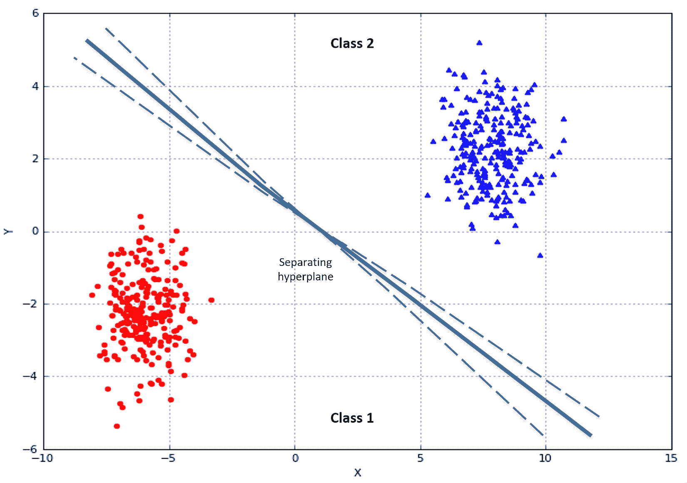

我们的目标是找到一个最优的超平面，它将两个类别分开。在多类问题中，通常采用一对一的策略，因此讨论可以仅集中在二分类上。假设我们有以下数据集：


这个数据集与以下目标集相关联：

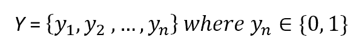

我们现在可以定义一个由 *m* 个连续分量组成的权重向量：

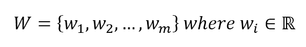

我们也可以定义数量 *z*：

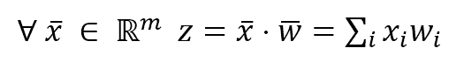

如果 *x* 是一个变量，*z* 是由超平面方程确定的值。因此，如果已经确定的系数集 *w* 是正确的，那么就会发生以下情况：

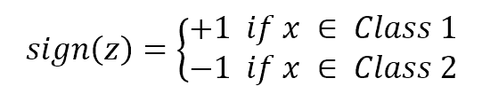

现在我们必须找到一种方法来优化 *w*，以减少分类误差。如果存在这样的组合（具有一定的错误阈值），我们说我们的问题是**线性可分**的。另一方面，当无法找到线性分类器时，问题被称为**非线性可分**。一个简单但著名的例子是由逻辑运算符 `XOR` 提供的：

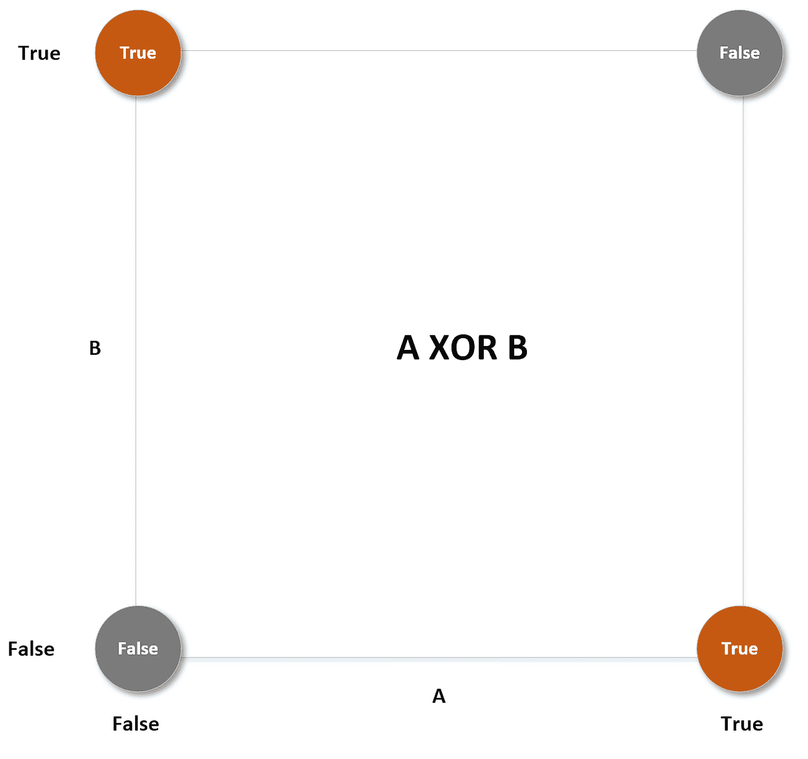

如您所见，任何一行都可能包含一个错误的样本。因此，为了解决这个问题，有必要涉及非线性技术。然而，在许多实际情况下，我们也会使用线性技术（通常更简单、更快）来解决非线性问题，接受可容忍的错误分类误差。

# 逻辑回归

即使被称为回归，这实际上是一种基于样本属于某一类别的概率的分类方法。由于我们的概率必须在 *R* 中连续并且介于 (0, 1) 之间，因此有必要引入一个阈值函数来过滤 *z* 这一项。这个名字“逻辑回归”来源于使用 sigmoid（或逻辑）函数的决定：

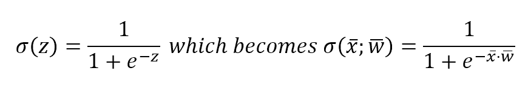

该函数的部分图示如下：

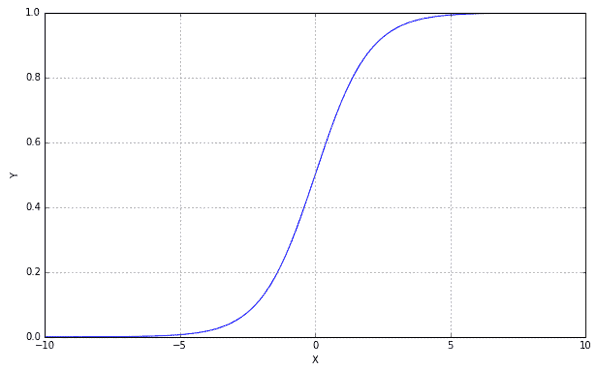

如您所见，函数在纵坐标 0.5 处与*x=0*相交，对于*x<0*，*y<0.5*，对于*x>0*，*y>0.5*。此外，其定义域为*R*，并且在 0 和 1 处有两个渐近线。因此，我们可以定义一个样本属于一个类（从现在开始，我们将它们称为 0 和 1）的概率：

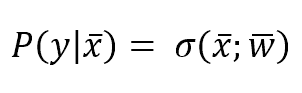

在这一点上，找到最优参数等同于在给定输出类别的情况下最大化对数似然：

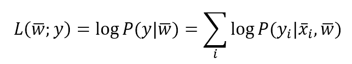

因此，优化问题可以用指示符号表示为损失函数的最小化：

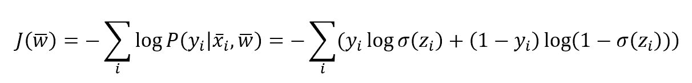

如果*y=0*，第一个项变为零，第二个项变为*log(1-x)*，这是类别 0 的对数概率。另一方面，如果*y=1*，第二个项为零，第一个项代表*x*的对数概率。这样，两种情况都包含在一个单一的表达式中。从信息论的角度来看，这意味着最小化目标分布和近似分布之间的交叉熵：

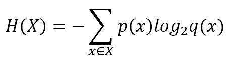

特别是，如果采用*log[2]*，该泛函表示使用预测分布对原始分布进行编码所需的额外比特数。很明显，当*J(w) = 0*时，两个分布是相等的。因此，最小化交叉熵是优化预测误差的一种优雅方法，当目标分布是分类的。

# 实现和优化

scikit-learn 实现了`LogisticRegression`类，该类可以使用优化算法解决这个问题。让我们考虑一个由 500 个样本组成的玩具数据集：

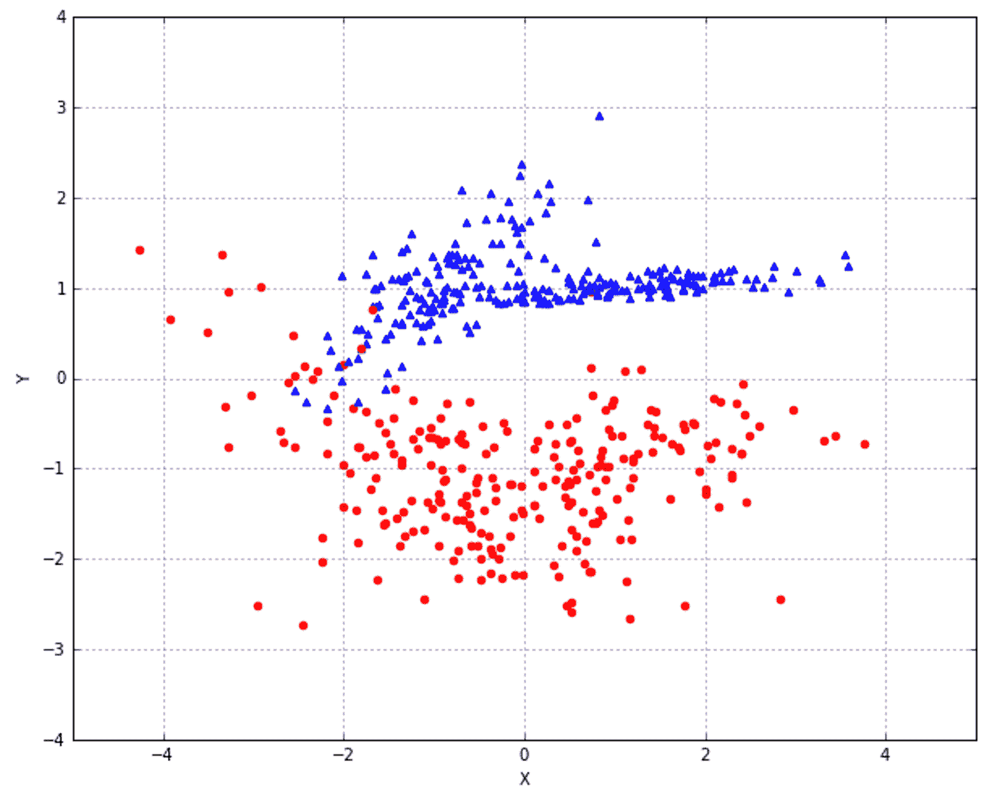

点属于类别 0，而三角形属于类别 1。为了立即测试我们分类的准确性，将数据集分为训练集和测试集是有用的：

```py
from sklearn.model_selection import train_test_split

>>> X_train, X_test, Y_train, Y_test = train_test_split(X, Y, test_size=0.25)
```

现在我们可以使用默认参数来训练模型：

```py
from sklearn.linear_model import LogisticRegression

>>> lr = LogisticRegression()
>>> lr.fit(X_train, Y_train)
LogisticRegression(C=1.0, class_weight=None, dual=False, fit_intercept=True,
 intercept_scaling=1, max_iter=100, multi_class='ovr', n_jobs=1,
 penalty='l2', random_state=None, solver='liblinear', tol=0.0001,
 verbose=0, warm_start=False)

>>> lr.score(X_test, Y_test)
0.95199999999999996
```

也可以通过交叉验证（类似于线性回归）来检查质量：

```py
from sklearn.model_selection import cross_val_score

>>> cross_val_score(lr, X, Y, scoring='accuracy', cv=10)
array([ 0.96078431,  0.92156863,  0.96      ,  0.98      ,  0.96      ,
 0.98      ,  0.96      ,  0.96      ,  0.91836735,  0.97959184])

```

分类任务在没有进一步操作的情况下成功（交叉验证也证实了这一点），还可以检查结果超平面参数：

```py
>>> lr.intercept_
array([-0.64154943])

>>> lr.coef_
array([[ 0.34417875,  3.89362924]])
```

在以下图中，展示了这个超平面（一条线），可以看到分类是如何工作的以及哪些样本被错误分类。考虑到两个块的区域局部密度，很容易看出错误分类发生在异常值和一些边界样本上。后者可以通过调整超参数来控制，尽管通常需要权衡。例如，如果我们想将分离线上的四个右点包括在内，这可能会排除右侧的一些元素。稍后，我们将看到如何找到最优解。然而，当一个线性分类器可以轻松地找到一个分离超平面（即使有一些异常值）时，我们可以说问题是可以线性建模的；否则，必须考虑更复杂的不线性技术。

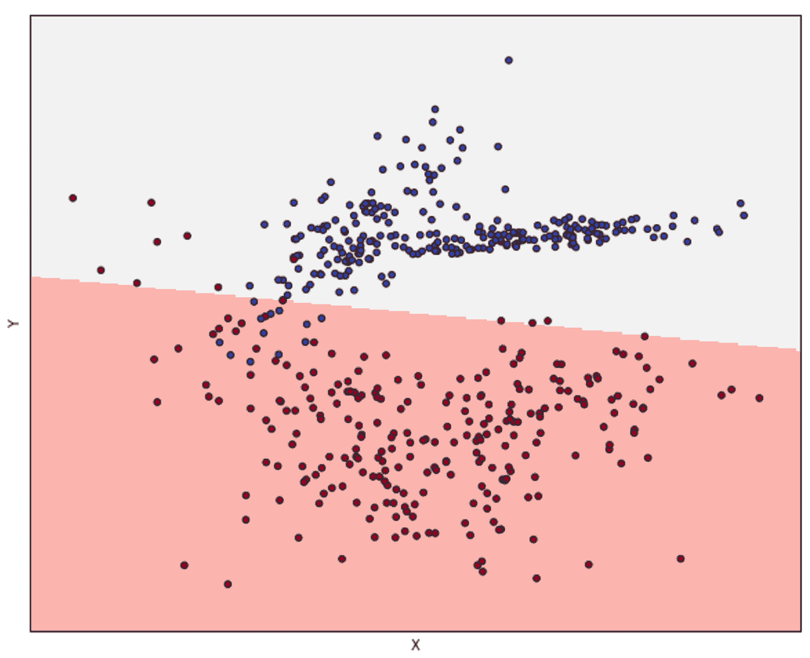

就像线性回归一样，可以对权重施加范数条件。特别是，实际的功能变为：

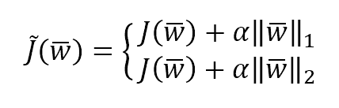

其行为与上一章中解释的相同。两者都产生收缩，但*L1*强制稀疏性。这可以通过参数 penalty（其值可以是*L1*或*L2*）和*C*（正则化因子的倒数，1/alpha）来控制，较大的值会减少强度，而较小的值（特别是小于 1 的值）会迫使权重更靠近原点。此外，*L1*将优先考虑顶点（其中所有但一个分量都是零），因此在使用`SelectFromModel`来优化收缩后的实际特征是一个好主意。

# 随机梯度下降算法

在讨论了逻辑回归的基本原理之后，介绍`SGDClassifier`类是有用的，该类实现了一个非常著名的算法，可以应用于多个不同的损失函数。随机梯度下降背后的思想是基于损失函数梯度的权重更新迭代：

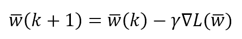

然而，更新过程不是应用于整个数据集，而是应用于从中随机提取的批次。在先前的公式中，*L* 是我们想要最小化的损失函数（如第二章中所述，*机器学习的重要元素*）和伽马（在 scikit-learn 中为`eta0`）是学习率，这是一个在学习过程中可以保持恒定或衰减的参数。`learning_rate`参数也可以保留其默认值（`optimal`），该值根据正则化因子内部计算。

当权重停止修改或其变化保持在所选阈值以下时，过程应该结束。scikit-learn 实现使用`n_iter`参数来定义所需的迭代次数。

存在许多可能的损失函数，但在这章中，我们只考虑`log`和`感知器`。其他的一些将在下一章中讨论。前者实现逻辑回归，而后者（也作为自主类`感知器`可用）是最简单的神经网络，由一个权重层*w*、一个称为偏置的固定常数和一个二元输出函数组成：

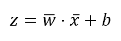

输出函数（将数据分为两类）是：

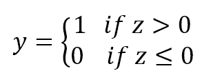

`感知器`和`逻辑回归`之间的区别在于输出函数（符号函数与 Sigmoid 函数）和训练模型（带有损失函数）。实际上，感知器通常通过最小化实际值与预测值之间的均方距离来训练：

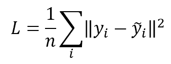

正如任何其他线性分类器一样，感知器不能解决非线性问题；因此，我们的例子将使用内置函数`make_classification`生成：

```py
from sklearn.datasets import make_classification

>>> nb_samples = 500
>>> X, Y = make_classification(n_samples=nb_samples, n_features=2, n_informative=2, n_redundant=0, n_clusters_per_class=1)
```

这样，我们可以生成 500 个样本，分为两类：

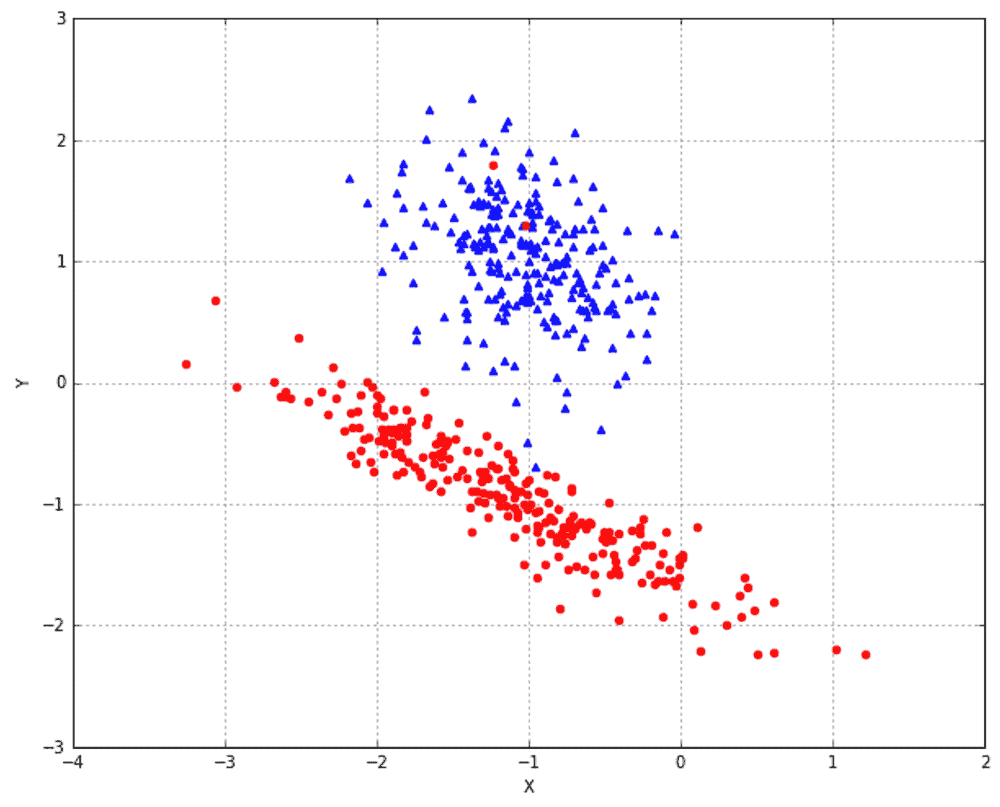

在一个确定的精度阈值下，这个问题可以线性解决，因此我们对`感知器`和`逻辑回归`的期望是等效的。在后一种情况下，训练策略集中在最大化概率分布的似然。考虑到数据集，红色样本属于类别 0 的概率必须大于 0.5（当*z = 0*时等于 0.5，因此当点位于分离超平面时），反之亦然。另一方面，感知器将调整超平面，使得样本与权重之间的点积根据类别为正或负。在以下图中，有一个感知器的几何表示（其中偏置为 0）：

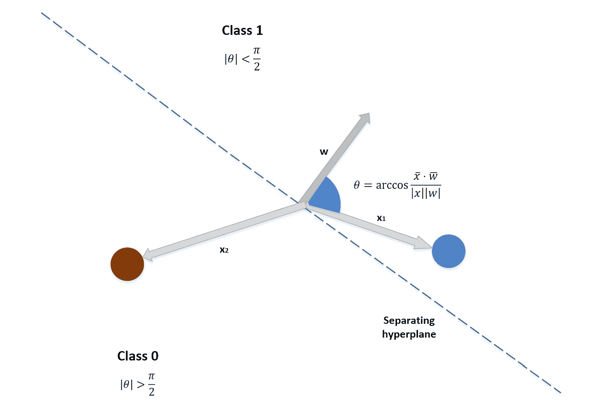

权重向量与分离超平面正交，因此只有考虑点积的符号才能进行判别。以下是一个具有感知器损失（无*L1*/*L2*约束）的随机梯度下降的例子：

```py
from sklearn.linear_model import SGDClassifier

>>> sgd = SGDClassifier(loss='perceptron', learning_rate='optimal', n_iter=10)
>>> cross_val_score(sgd, X, Y, scoring='accuracy', cv=10).mean()
0.98595918367346935
```

可以直接使用`Perceptron`类得到相同的结果：

```py
from sklearn.linear_model import Perceptron

>>> perc = Perceptron(n_iter=10)
>>> cross_val_score(perc, X, Y, scoring='accuracy', cv=10).mean()
0.98195918367346935
```

# 通过网格搜索寻找最佳超参数

寻找最佳超参数（之所以称为最佳超参数，是因为它们影响训练阶段学习的参数）并不总是容易的，而且很少有好的方法可以从中开始。个人经验（一个基本元素）必须由一个高效的工具如`GridSearchCV`来辅助，该工具自动化不同模型的训练过程，并使用交叉验证为用户提供最佳值。

例如，我们展示如何使用它来找到使用 Iris 玩具数据集进行线性回归的最佳惩罚和强度因子：

```py
import multiprocessing

from sklearn.datasets import load_iris
from sklearn.model_selection import GridSearchCV

>>> iris = load_iris()

>>> param_grid = [
 { 
 'penalty': [ 'l1', 'l2' ],
 'C': [ 0.5, 1.0, 1.5, 1.8, 2.0, 2.5]
 }
]

>>> gs = GridSearchCV(estimator=LogisticRegression(), param_grid=param_grid,
 scoring='accuracy', cv=10, n_jobs=multiprocessing.cpu_count())

>>> gs.fit(iris.data, iris.target)
GridSearchCV(cv=10, error_score='raise',
 estimator=LogisticRegression(C=1.0, class_weight=None, dual=False, fit_intercept=True,
 intercept_scaling=1, max_iter=100, multi_class='ovr', n_jobs=1,
 penalty='l2', random_state=None, solver='liblinear', tol=0.0001,
 verbose=0, warm_start=False),
 fit_params={}, iid=True, n_jobs=8,
 param_grid=[{'penalty': ['l1', 'l2'], 'C': [0.1, 0.2, 0.4, 0.5, 1.0, 1.5, 1.8, 2.0, 2.5]}],
 pre_dispatch='2*n_jobs', refit=True, return_train_score=True,
 scoring='accuracy', verbose=0)

>>> gs.best_estimator_
LogisticRegression(C=1.5, class_weight=None, dual=False, fit_intercept=True,
 intercept_scaling=1, max_iter=100, multi_class='ovr', n_jobs=1,
 penalty='l1', random_state=None, solver='liblinear', tol=0.0001,
 verbose=0, warm_start=False)

>>> cross_val_score(gs.best_estimator_, iris.data, iris.target, scoring='accuracy', cv=10).mean()
0.96666666666666679
```

可以将任何由模型支持的参数及其值列表插入到`param`字典中。`GridSearchCV`将并行处理并返回最佳估计器（通过实例变量`best_estimator_`，它是一个与通过参数`estimator`指定的相同分类器的实例）。

当使用并行算法时，scikit-learn 提供了`n_jobs`参数，允许我们指定必须使用多少线程。将`n_jobs=multiprocessing.cpu_count()`设置为有效，可以充分利用当前机器上可用的所有 CPU 核心。

在下一个示例中，我们将找到使用感知损失训练的`SGDClassifier`的最佳参数。数据集在以下图中展示：

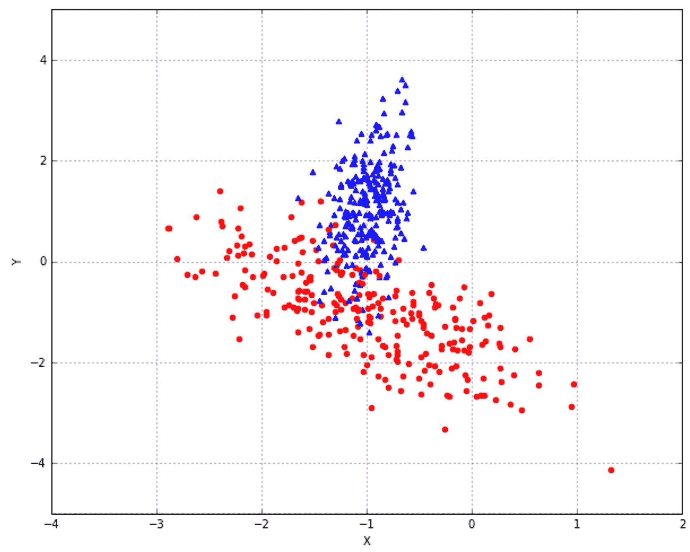

```py
import multiprocessing

from sklearn.model_selection import GridSearchCV

>>> param_grid = [
 { 
 'penalty': [ 'l1', 'l2', 'elasticnet' ],
 'alpha': [ 1e-5, 1e-4, 5e-4, 1e-3, 2.3e-3, 5e-3, 1e-2],
 'l1_ratio': [0.01, 0.05, 0.1, 0.15, 0.25, 0.35, 0.5, 0.75, 0.8]
 }
]

>>> sgd = SGDClassifier(loss='perceptron', learning_rate='optimal')
>>> gs = GridSearchCV(estimator=sgd, param_grid=param_grid, scoring='accuracy', cv=10, n_jobs=multiprocessing.cpu_count())

>>> gs.fit(X, Y)
GridSearchCV(cv=10, error_score='raise',
 estimator=SGDClassifier(alpha=0.0001, average=False, class_weight=None, epsilon=0.1,
 eta0=0.0, fit_intercept=True, l1_ratio=0.15,
 learning_rate='optimal', loss='perceptron', n_iter=5, n_jobs=1,
 penalty='l2', power_t=0.5, random_state=None, shuffle=True,
 verbose=0, warm_start=False),
 fit_params={}, iid=True, n_jobs=8,
 param_grid=[{'penalty': ['l1', 'l2', 'elasticnet'], 'alpha': [1e-05, 0.0001, 0.0005, 0.001, 0.0023, 0.005, 0.01], 'l1_ratio': [0.01, 0.05, 0.1, 0.15, 0.25, 0.35, 0.5, 0.75, 0.8]}],
 pre_dispatch='2*n_jobs', refit=True, return_train_score=True,
 scoring='accuracy', verbose=0)

>>> gs.best_score_
0.89400000000000002

>>> gs.best_estimator_
SGDClassifier(alpha=0.001, average=False, class_weight=None, epsilon=0.1,
 eta0=0.0, fit_intercept=True, l1_ratio=0.1, learning_rate='optimal',
 loss='perceptron', n_iter=5, n_jobs=1, penalty='elasticnet',
 power_t=0.5, random_state=None, shuffle=True, verbose=0,
 warm_start=False)
```

# 分类指标

一个分类任务可以通过多种不同的方式来评估，以达到特定的目标。当然，最重要的指标是准确率，通常表示为：

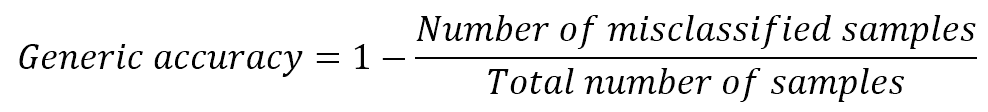

在 scikit-learn 中，可以使用内置的`accuracy_score()`函数进行评估：

```py
from sklearn.metrics import accuracy_score

>>> accuracy_score(Y_test, lr.predict(X_test))
0.94399999999999995
```

另一个非常常见的方法是基于零一损失函数，我们在第二章，*机器学习的重要元素*中看到了它，定义为所有样本上*L[0/1]*（其中*1*分配给误分类）的归一化平均值。在以下示例中，我们展示了一个归一化分数（如果它接近 0，则更好）以及相同的未归一化值（这是实际的误分类数量）：

```py
from sklearn.metrics import zero_one_loss

>>> zero_one_loss(Y_test, lr.predict(X_test))
0.05600000000000005

>>> zero_one_loss(Y_test, lr.predict(X_test), normalize=False)
7L
```

一个类似但相反的指标是**Jaccard 相似系数**，定义为：

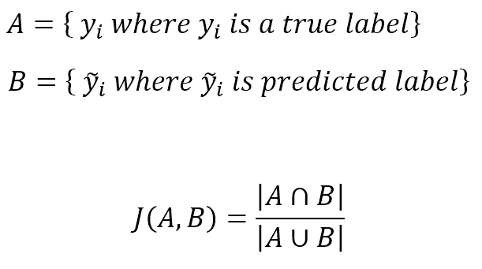

这个指标衡量相似性，其值介于 0（最差性能）和 1（最佳性能）之间。在前者情况下，交集为零，而在后者情况下，交集和并集相等，因为没有误分类。在 scikit-learn 中的实现是：

```py
from sklearn.metrics import jaccard_similarity_score

>>> jaccard_similarity_score(Y_test, lr.predict(X_test))
0.94399999999999995
```

这些指标为我们提供了对分类算法的良好洞察。然而，在许多情况下，有必要能够区分不同类型的误分类（我们考虑的是具有传统记号的二元情况：0-负，1-正），因为相对权重相当不同。因此，我们引入以下定义：

+   **真阳性**：一个被正确分类的阳性样本

+   **假阳性**：一个被分类为正例的阴性样本

+   **真阴性**：一个被正确分类的阴性样本

+   **假阴性**：一个被分类为负例的阳性样本

乍一看，假阳性和假阴性可以被认为是类似的错误，但考虑一下医学预测：虽然假阳性可以通过进一步的测试轻易发现，但假阴性往往被忽视，并随之产生后果。因此，引入混淆矩阵的概念是有用的：

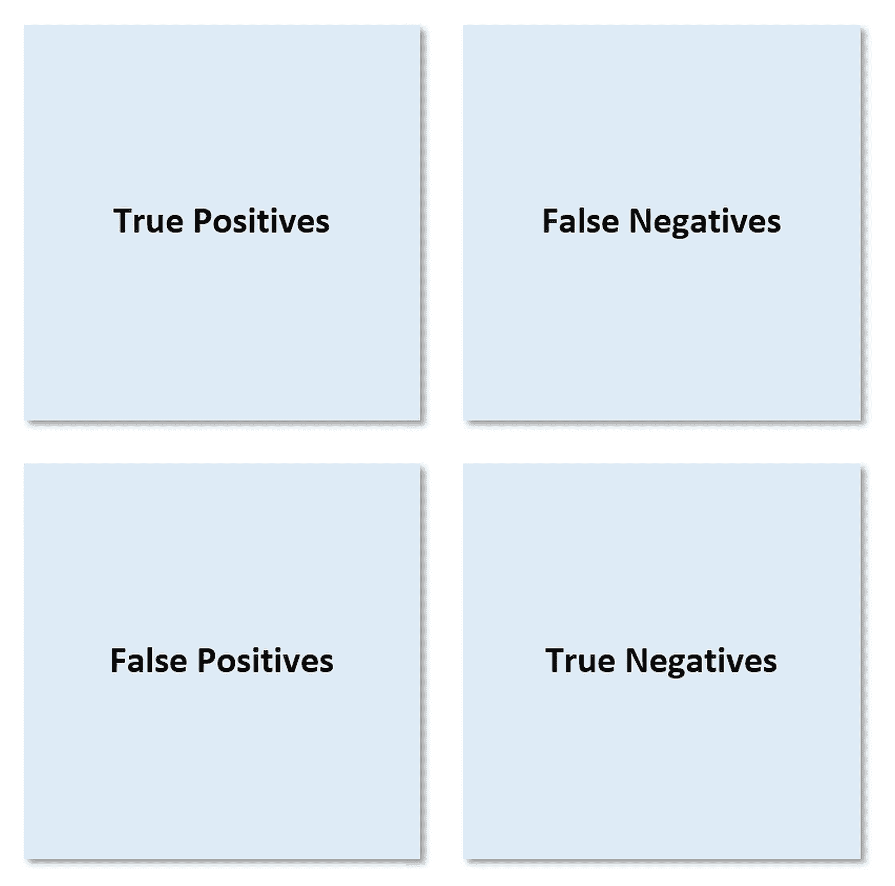

在 scikit-learn 中，可以使用内置函数构建混淆矩阵。让我们考虑一个在数据集*X*上具有标签*Y*的通用逻辑回归：

```py
>>> X_train, X_test, Y_train, Y_test = train_test_split(X, Y, test_size=0.25)
>>> lr = LogisticRegression()
>>> lr.fit(X_train, Y_train)
LogisticRegression(C=1.0, class_weight=None, dual=False, fit_intercept=True,
 intercept_scaling=1, max_iter=100, multi_class='ovr', n_jobs=1,
 penalty='l2', random_state=None, solver='liblinear', tol=0.0001,
 verbose=0, warm_start=False)
```

现在我们可以计算我们的混淆矩阵，并立即看到分类器是如何工作的：

```py
from sklearn.metrics import confusion_matrix

>>> cm = confusion_matrix(y_true=Y_test, y_pred=lr.predict(X_test))
cm[::-1, ::-1]
[[50  5]
 [ 2 68]]
```

最后的操作是必要的，因为 scikit-learn 采用了一个逆轴。然而，在许多书中，混淆矩阵的真实值位于主对角线上，所以我更喜欢反转轴。

为了避免错误，我建议您访问[`scikit-learn.org/stable/modules/generated/sklearn.metrics.confusion_matrix.html`](http://scikit-learn.org/stable/modules/generated/sklearn.metrics.confusion_matrix.html)页面，并检查真实/假正/假负的位置。

因此，我们有五个假阴性样本和两个假阳性样本。如果需要，进一步的分析可以检测到误分类，以决定如何处理它们（例如，如果它们的方差超过预定义的阈值，可以考虑它们为异常值并移除它们）。

另一个有用的直接指标是：

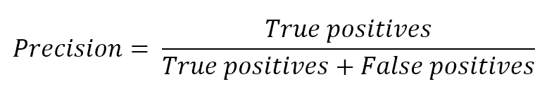

这直接关联到捕捉决定样本正性的特征的能力，以避免被错误地分类为负类。在 scikit-learn 中，实现方式如下：

```py
from sklearn.metrics import precision_score

>>> precision_score(Y_test, lr.predict(X_test))
0.96153846153846156
```

如果您不想翻转混淆矩阵，但想要得到相同的指标，必须在所有指标评分函数中添加`pos_label=0`参数。

在所有潜在的阳性样本中检测真实阳性样本的能力可以使用另一个指标来评估：

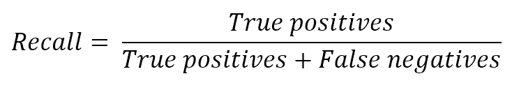

scikit-learn 的实现方式如下：

```py
from sklearn.metrics import recall_score

>>> recall_score(Y_test, lr.predict(X_test))
0.90909090909090906
```

我们有 90%的召回率和 96%的精确度并不令人惊讶，因为假阴性（影响召回率）的数量与假阳性（影响精确度）的数量成比例较高。精确度和召回率之间的加权调和平均值由以下公式提供：

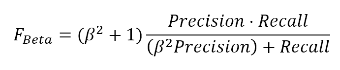

当 beta 值等于 1 时，确定所谓的*F[1]*分数，这是两个指标之间的完美平衡。当 beta 小于 1 时，更重视*精确度*；当 beta 大于 1 时，更重视*召回率*。以下代码片段展示了如何使用 scikit-learn 实现它：

```py
from sklearn.metrics import fbeta_score

>>> fbeta_score(Y_test, lr.predict(X_test), beta=1)
0.93457943925233655

>>> fbeta_score(Y_test, lr.predict(X_test), beta=0.75)
0.94197437829691033

>>> fbeta_score(Y_test, lr.predict(X_test), beta=1.25)
0.92886270956048933
```

对于*F[1]*分数，scikit-learn 提供了`f1_score()`函数，它与`fbeta_score()`函数的`beta=1`等价。

最高分是通过更重视精确度（精确度更高）来实现的，而最低分则对应着召回率占优。因此，*Beta* 系数有助于获得一个关于准确性的紧凑图景，该图景是高精确度和有限数量的假阴性之间的权衡。

# ROC 曲线

**ROC 曲线**（或接收者操作特征）是用于比较不同分类器（可以为它们的预测分配分数）的有价值工具。通常，这个分数可以解释为概率，因此它在 0 和 1 之间。平面结构如下所示：

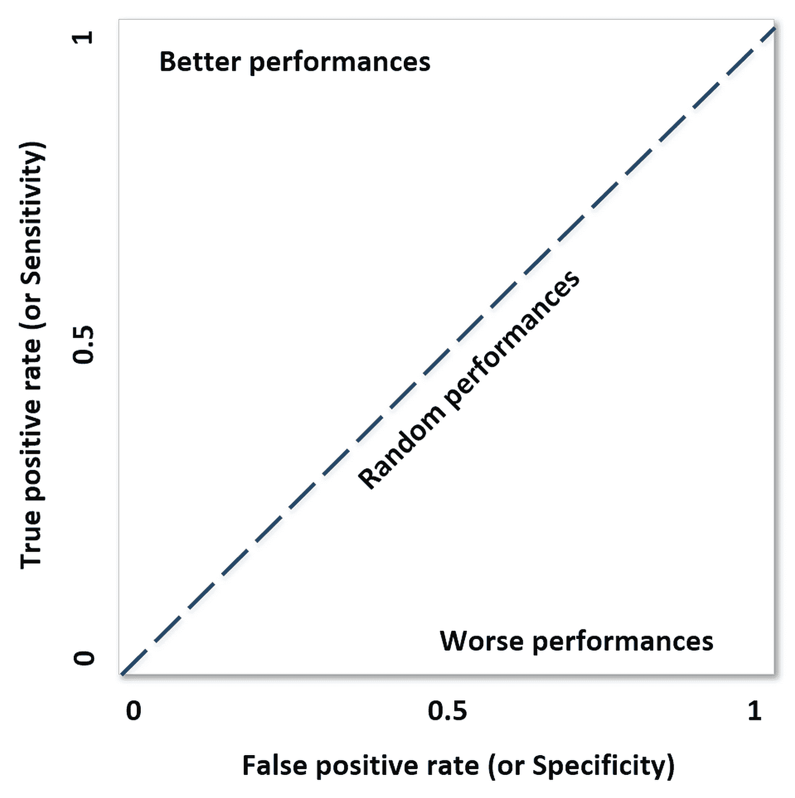

*x 轴*代表不断增加的假阳性率（也称为**特异性**），而 *y 轴*代表真正阳性率（也称为**灵敏度**）。虚线斜线代表一个完全随机的分类器，因此所有低于此阈值的曲线的性能都比随机选择差，而高于此阈值的曲线则表现出更好的性能。当然，最佳分类器的 ROC 曲线将分为 [0, 0] - [0, 1] 和 [0, 1] - [1, 1] 这两个部分，我们的目标是找到性能尽可能接近这个极限的算法。为了展示如何使用 scikit-learn 创建 ROC 曲线，我们将训练一个模型来确定预测的分数（这可以通过 `decision_function()` 或 `predict_proba()` 方法实现）：

```py
>>> X_train, X_test, Y_train, Y_test = train_test_split(X, Y, test_size=0.25)

>>> lr = LogisticRegression()
>>> lr.fit(X_train, Y_train)
LogisticRegression(C=1.0, class_weight=None, dual=False, fit_intercept=True,
 intercept_scaling=1, max_iter=100, multi_class='ovr', n_jobs=1,
 penalty='l2', random_state=None, solver='liblinear', tol=0.0001,
 verbose=0, warm_start=False)

>>> Y_scores = lr.decision_function(X_test)
```

现在我们可以计算 ROC 曲线：

```py
from sklearn.metrics import roc_curve

>>> fpr, tpr, thresholds = roc_curve(Y_test, Y_scores)
```

输出由不断增加的真正阳性和假阳性率以及不断降低的阈值（通常不用于绘制曲线）组成。在继续之前，计算**曲线下面积**（**AUC**）也是很有用的，其值介于 0（最差性能）和 1（最佳性能）之间，完全随机值对应于 0.5：

```py
from sklearn.metrics import auc

>>> auc(fpr, tpr)
0.96961038961038959
```

我们已经知道我们的性能相当好，因为 AUC 接近 1。现在我们可以使用 matplotlib 绘制 ROC 曲线。由于这本书不是专门介绍这个强大框架的，我将使用可以在多个示例中找到的代码片段：

```py
import matplotlib.pyplot as plt

>>> plt.figure(figsize=(8, 8))
>>> plt.plot(fpr, tpr, color='red', label='Logistic regression (AUC: %.2f)' % auc(fpr, tpr))
>>> plt.plot([0, 1], [0, 1], color='blue', linestyle='--')
>>> plt.xlim([0.0, 1.0])
>>> plt.ylim([0.0, 1.01])
>>> plt.title('ROC Curve')
>>> plt.xlabel('False Positive Rate')
>>> plt.ylabel('True Positive Rate')
>>> plt.legend(loc="lower right")
>>> plt.show()
```

结果 ROC 曲线如下所示：

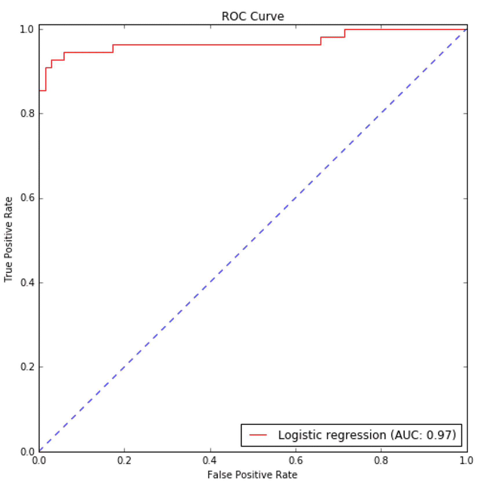

如 AUC 所证实，我们的 ROC 曲线显示出非常好的性能。在后面的章节中，我们将使用 ROC 曲线来直观地比较不同的算法。作为一个练习，你可以尝试同一模型的不同的参数，并绘制所有 ROC 曲线，以立即了解哪种设置更可取。

我建议访问 [`matplotlib.org`](http://matplotlib.org)，以获取更多信息和学习教程。此外，一个非凡的工具是 Jupyter ([`jupyter.org`](http://jupyter.org))，它允许使用交互式笔记本，在那里你可以立即尝试你的代码并可视化内联图表。

# 摘要

线性模型使用分离超平面来对样本进行分类；因此，如果可以找到一个线性模型，其准确率超过一个预定的阈值，则问题线性可分。逻辑回归是最著名的线性分类器之一，其原理是最大化样本属于正确类的概率。随机梯度下降分类器是一组更通用的算法，由采用的损失函数的不同而决定。SGD 允许部分拟合，尤其是在数据量太大而无法加载到内存中的情况下。感知器是 SGD 的一个特定实例，代表一个不能解决`XOR`问题的线性神经网络（因此，多层感知器成为了非线性分类的首选）。然而，在一般情况下，其性能与逻辑回归模型相当。

所有分类器的性能都必须使用不同的方法进行衡量，以便能够优化它们的参数或在我们对结果不满意时更改它们。我们讨论了不同的指标，特别是 ROC 曲线，它以图形方式显示了不同分类器的性能。

在下一章中，我们将讨论朴素贝叶斯分类器，这是另一组非常著名且强大的算法家族。得益于这种简单的方法，我们可以仅使用概率和结果质量来构建垃圾邮件过滤系统，并解决看似复杂的问题。即使经过几十年，它仍然优于或与许多更复杂的解决方案相当。
