# 第六章：朴素贝叶斯

朴素贝叶斯是一系列强大且易于训练的分类器，它们使用贝叶斯定理根据一组条件确定结果的可能性。换句话说，条件概率被反转，因此查询可以表示为可测量量的函数。这种方法很简单，形容词“朴素”之所以被赋予，并不是因为这些算法有限或效率较低，而是因为我们对因果因素的假设是基本的。朴素贝叶斯是多用途分类器，很容易在不同的环境中找到它们的应用；然而，它们的性能在所有那些由某些因果因素的概率确定类别的情境中尤其出色。一个很好的例子是自然语言处理，其中一段文本可以被视为字典的一个特定实例，所有术语的相对频率提供了足够的信息来推断所属类别。我们将在后面的章节中讨论这些概念。在这一章中，我们的例子将始终是通用的，以便让读者了解如何在各种环境中应用朴素贝叶斯。

# 贝叶斯定理

让我们考虑两个概率事件 A 和 B。我们可以使用乘法规则将边缘概率 *P(A)* 和 *P(B)* 与条件概率 *P(A|B)* 和 *P(B|A)* 相关联：

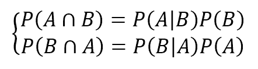

考虑到交集是可交换的，第一成员是相等的；因此，我们可以推导出**贝叶斯定理**：

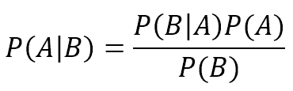

这个公式具有非常深刻的哲学意义，它是统计学习的基本元素。首先，让我们考虑边缘概率 *P(A)*；这通常是一个确定目标事件可能性的值，例如 *P(Spam)* 或 *P(Rain)*。由于没有其他元素，这种概率被称为**先验概率**，因为它通常由数学考虑或简单地由频率计数确定。例如，想象我们想要实现一个非常简单的垃圾邮件过滤器，我们已经收集了 100 封电子邮件。我们知道其中 30 封是垃圾邮件，70 封是常规邮件。因此，我们可以说 *P(Spam)* = 0.3。

然而，我们希望使用一些标准来评估（为了简单起见，让我们考虑一个），例如，电子邮件文本的长度少于 50 个字符*。因此，我们的查询变为：

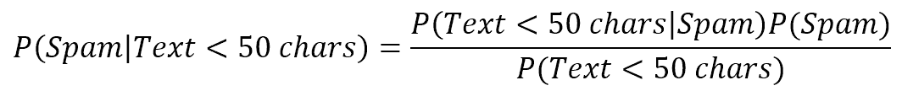

第一个项类似于*P(Spam)*，因为它是在特定条件下垃圾邮件的概率。因此，它被称为**后验概率**（换句话说，它是在知道一些额外元素后我们可以估计的概率）。在等式的右侧，我们需要计算缺失的值，但这很简单。假设有 35 封邮件的文本长度小于 50 个字符，所以*P(Text < 50 chars)* = 0.35。仅查看我们的垃圾邮件文件夹，我们发现只有 25 封垃圾邮件的文本较短，因此*P(Text < 50 chars|Spam) = 25/30 = 0.83*。结果是：


因此，收到一封非常短的电子邮件后，有 71%的概率它是垃圾邮件。现在，我们可以理解*P(Text < 50 chars|Spam)*的作用；因为我们有实际数据，我们可以测量在查询条件下我们的假设有多可能。换句话说，我们定义了一个似然（与逻辑回归进行比较），它是先验概率和后验概率（分母中的项不太重要，因为它作为一个常规化因子）之间的权重：

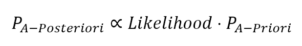

常规化因子通常用希腊字母α表示，因此公式变为：

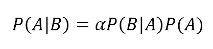

最后一步是考虑存在更多并发条件的情况（这在现实生活中的问题中更为现实）：

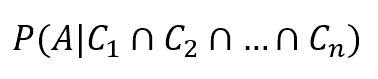

一个常见的假设被称为**条件独立性**（换句话说，每个原因产生的影响是相互独立的）并且这允许我们写出简化的表达式：

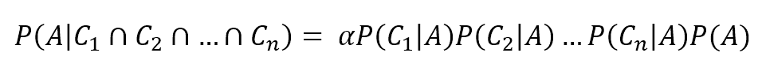

# 简单贝叶斯分类器

简单贝叶斯分类器之所以被称为简单贝叶斯，是因为它基于一个简单的条件，这暗示了原因之间的条件独立性。这在许多情况下可能很难接受，在这些情况下，特定特征的概率严格地与另一个特征相关。例如，在垃圾邮件过滤中，文本长度小于 50 个字符可能会增加图像出现的概率，或者如果域名已经被列入黑名单，用于向数百万用户发送相同的垃圾邮件，那么很可能找到特定的关键词。换句话说，原因的存在通常不是独立于其他原因的存在。然而，在张 H.的《简单贝叶斯的最优性》，AAAI 1，第 2 期（2004 年）：3 中，作者表明在特定条件下（并不罕见），不同的依赖关系相互消除，即使其简单性被违反，简单贝叶斯分类器也能成功实现非常高的性能。

让我们考虑一个数据集：


为了简化，每个特征向量将表示为：

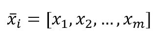

我们还需要一个目标数据集：

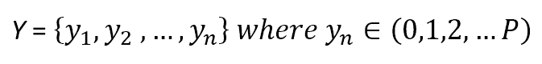

在这里，每个*y*可以属于*P*个不同类别中的一个。在条件独立下考虑贝叶斯定理，我们可以写出：

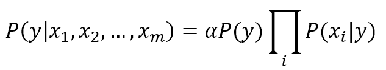

边缘先验概率*P(y)*和条件概率*P(x[i]|y)*的值是通过频率计数获得的；因此，给定一个输入向量*x*，预测的类别是后验概率最大的那个类别。

# scikit-learn 中的朴素贝叶斯

scikit-learn 实现了基于相同数量的不同概率分布的三个朴素贝叶斯变体：伯努利、多项式和高斯。第一个是一个二元分布，当特征可以存在或不存在时很有用。第二个是一个离散分布，当必须用整数表示特征时使用（例如，在自然语言处理中，它可以是一个术语的频率），而第三个是一个连续分布，其特征是均值和方差。

# 伯努利朴素贝叶斯

如果`X`是伯努利分布的随机变量，它只能假设两个值（为了简单起见，让我们称它们为 0 和 1），它们的概率是：

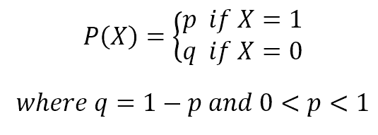

要使用 scikit-learn 尝试此算法，我们将生成一个虚拟数据集。伯努利朴素贝叶斯期望二元特征向量；然而，`BernoulliNB`类有一个`binarize`参数，允许我们指定一个阈值，该阈值将内部用于将特征转换：

```py
from sklearn.datasets import make_classification

>>> nb_samples = 300
>>> X, Y = make_classification(n_samples=nb_samples, n_features=2, n_informative=2, n_redundant=0)
```

我们已经生成了以下图中所示的二维数据集：

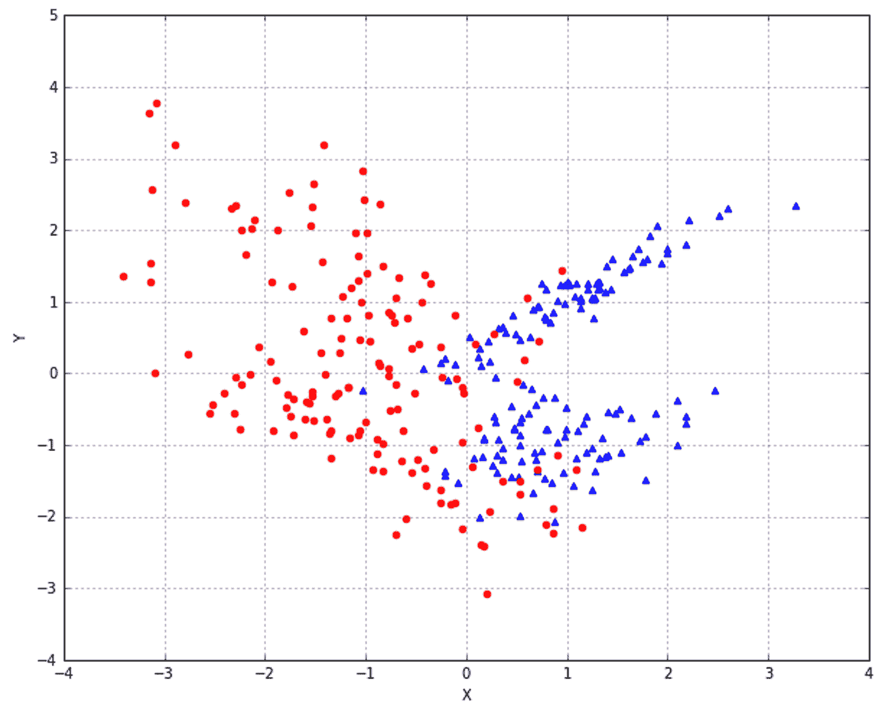

我们决定使用 0.0 作为二元阈值，因此每个点都可以用其所在象限来表征。当然，这对我们的数据集来说是一个合理的选择，但伯努利朴素贝叶斯是为二元特征向量或可以精确分割的连续值（例如，使用预定义的阈值）而设计的：

```py
from sklearn.naive_bayes import BernoulliNB
from sklearn.model_selection import train_test_split

>>> X_train, X_test, Y_train, Y_test = train_test_split(X, Y, test_size=0.25)

>>> bnb = BernoulliNB(binarize=0.0)
>>> bnb.fit(X_train, Y_train)
>>> bnb.score(X_test, Y_test)
0.85333333333333339
```

分数相当不错，但如果我们想了解二元分类器是如何工作的，看到数据是如何内部二值化的很有用：


现在，检查朴素贝叶斯预测，我们得到：

```py
>>> data = np.array([[0, 0], [0, 1], [1, 0], [1, 1]])
>>> bnb.predict(data)
array([0, 0, 1, 1])
```

这正是我们预期的。

# 多项式朴素贝叶斯

多项式分布对于建模特征向量很有用，其中每个值代表，例如，一个术语出现的次数或其相对频率。如果特征向量有*n*个元素，并且每个元素可以以概率*p[k]*假设*k*个不同的值，那么：

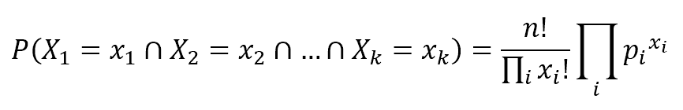

条件概率*P(x[i]|y)*通过频率计数（这相当于应用最大似然方法）来计算，但在这个情况下，考虑**alpha 参数**（称为**拉普拉斯平滑因子**）是很重要的。它的默认值是 1.0，它防止模型在频率为零时设置零概率。可以分配所有非负值；然而，较大的值将赋予缺失特征更高的概率，这种选择可能会改变模型的稳定性。在我们的例子中，我们将考虑默认值 1.0。

对于我们的目的，我们将使用`DictVectorizer`，这在第二章 - 机器学习中的重要元素中已经分析过。有自动工具可以计算术语的频率，但我们将在稍后讨论。让我们只考虑两个记录：第一个代表一个城市，第二个代表乡村。我们的字典包含假设频率，就像术语是从文本描述中提取出来的一样：

```py
from sklearn.feature_extraction import DictVectorizer

>>> data = [
   {'house': 100, 'street': 50, 'shop': 25, 'car': 100, 'tree': 20},
   {'house': 5, 'street': 5, 'shop': 0, 'car': 10, 'tree': 500, 'river': 1}
]

>>> dv = DictVectorizer(sparse=False)
>>> X = dv.fit_transform(data)
>>> Y = np.array([1, 0])

>>> X
array([[ 100.,  100.,    0.,   25.,   50.,   20.],
       [  10.,    5.,    1.,    0.,    5.,  500.]])
```

注意，术语`'river'`在第一个集合中缺失，因此保持 alpha 等于 1.0 以给它一个小的概率是有用的。输出类别是 1 代表城市，0 代表乡村。现在我们可以训练一个`MultinomialNB`实例：

```py
from sklearn.naive_bayes import MultinomialNB

>>> mnb = MultinomialNB()
>>> mnb.fit(X, Y)
MultinomialNB(alpha=1.0, class_prior=None, fit_prior=True)
```

为了测试模型，我们创建了一个有河流的虚拟城市和一个没有河流的虚拟乡村：

```py
>>> test_data = data = [
   {'house': 80, 'street': 20, 'shop': 15, 'car': 70, 'tree': 10, 'river': 1},
   {'house': 10, 'street': 5, 'shop': 1, 'car': 8, 'tree': 300, 'river': 0}
]

>>> mnb.predict(dv.fit_transform(test_data))
array([1, 0])
```

如预期的那样，预测是正确的。稍后，当讨论自然语言处理的一些元素时，我们将使用多项式朴素贝叶斯进行文本分类，并使用更大的语料库。即使多项式分布基于发生次数，它也可以成功地与频率或更复杂的函数一起使用。

# 高斯朴素贝叶斯

高斯朴素贝叶斯在处理可以用高斯分布建模的连续值时很有用：

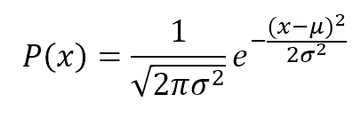

条件概率*P(x[i]|y)*也是高斯分布的；因此，有必要使用最大似然方法估计每个条件概率的均值和方差。这相当简单；事实上，考虑到高斯性质，我们得到：

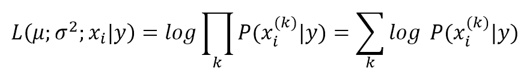

在这里，*k*索引指的是我们数据集中的样本，*P(x[i]|y)*本身就是一个高斯分布。通过最小化这个表达式的倒数（在 Russel S.，Norvig P.，《人工智能：现代方法》，Pearson 中有一个完整的分析解释），我们得到与*P(x[i]|y)*相关的每个高斯分布的均值和方差，因此模型得到了训练。

作为例子，我们使用 ROC 曲线比较高斯朴素贝叶斯与逻辑回归。数据集有 300 个样本，两个特征。每个样本属于一个单一类别：

```py
from sklearn.datasets import make_classification

>>> nb_samples = 300
>>> X, Y = make_classification(n_samples=nb_samples, n_features=2, n_informative=2, n_redundant=0)
```

数据集的图示如下所示：

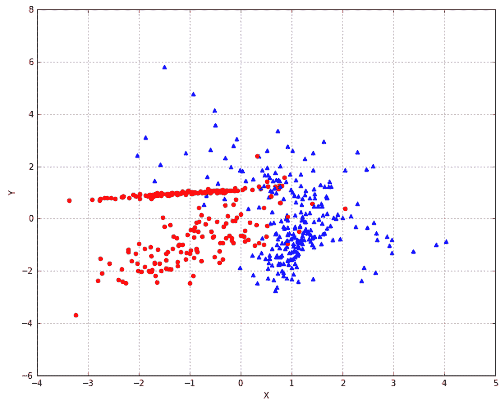

现在我们可以训练这两个模型并生成 ROC 曲线（朴素贝叶斯的 `Y` 分数是通过 `predict_proba` 方法获得的）：

```py
from sklearn.naive_bayes import GaussianNB
from sklearn.linear_model import LogisticRegression
from sklearn.metrics import roc_curve, auc
from sklearn.model_selection import train_test_split

>>> X_train, X_test, Y_train, Y_test = train_test_split(X, Y, test_size=0.25)

>>> gnb = GaussianNB()
>>> gnb.fit(X_train, Y_train)
>>> Y_gnb_score = gnb.predict_proba(X_test)

>>> lr = LogisticRegression()
>>> lr.fit(X_train, Y_train)
>>> Y_lr_score = lr.decision_function(X_test)

>>> fpr_gnb, tpr_gnb, thresholds_gnb = roc_curve(Y_test, Y_gnb_score[:, 1])
>>> fpr_lr, tpr_lr, thresholds_lr = roc_curve(Y_test, Y_lr_score)
```

生成的 ROC 曲线（与前一章中显示的相同方式生成）如下所示：

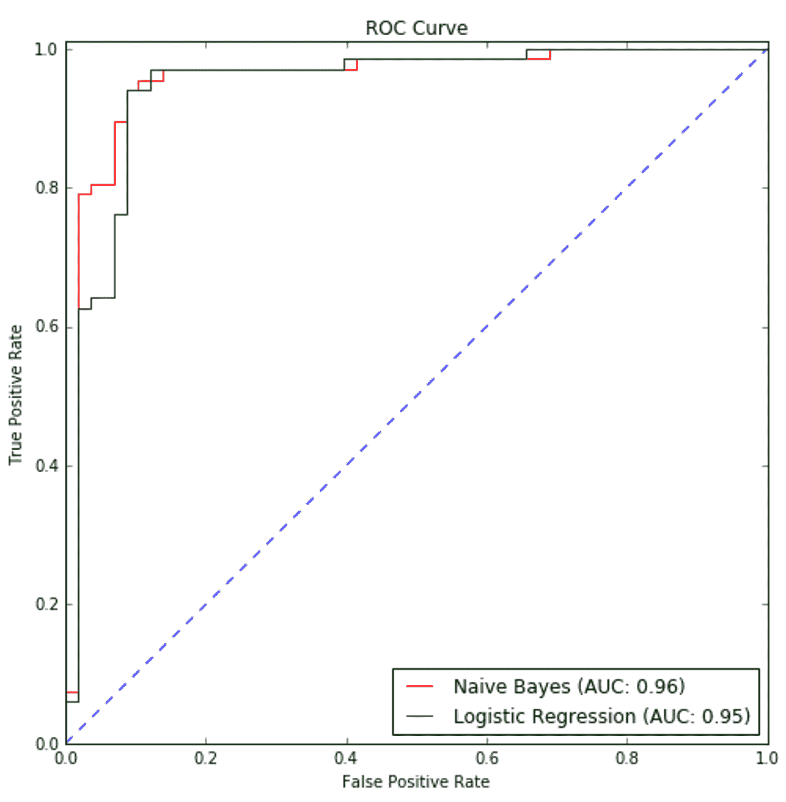

Naive Bayes 的性能略优于逻辑回归；然而，这两个分类器的准确率和 **曲线下面积**（**AUC**）相似。比较高斯和多项式朴素贝叶斯在 MNIST 数字数据集上的性能很有趣。每个样本（属于 10 个类别之一）是一个 8 x 8 的图像，编码为无符号整数（0-255）；因此，即使每个特征不表示实际的计数，也可以将其视为一种大小或频率：

```py
from sklearn.datasets import load_digits
from sklearn.model_selection import cross_val_score

>>> digits = load_digits()

>>> gnb = GaussianNB()
>>> mnb = MultinomialNB()

>>> cross_val_score(gnb, digits.data, digits.target, scoring='accuracy', cv=10).mean()
0.81035375835678214

>>> cross_val_score(mnb, digits.data, digits.target, scoring='accuracy', cv=10).mean()
0.88193962163008377 
```

多项式朴素贝叶斯比高斯变体表现更好，这个结果并不令人惊讶。实际上，每个样本可以被视为从 64 个符号的字典中派生出的特征向量。值可以是每个发生的计数，因此多项式分布可以更好地拟合数据，而高斯则稍微受限于其均值和方差。

# 参考文献

+   Russell S., Norvig P., *《人工智能：现代方法》*，Pearson

+   Zhang H., *《朴素贝叶斯的最优性，AAAI 1》*，第 2 期（2004 年）：3

+   Papoulis A., *《概率论、随机变量与随机过程》*，McGraw-Hill

# 摘要

在本章中，我们从贝叶斯定理及其内在哲学出发，介绍了朴素贝叶斯的一般方法。这些算法的朴素性是由于选择假设所有原因都是条件独立的。这意味着每个贡献在每种组合中都是相同的，特定原因的存在不能改变其他原因的概率。这并不总是现实的；然而，在某些假设下，可以证明内部依赖会相互清除，从而使结果概率不受其关系的影响。

scikit-learn 提供了三种朴素贝叶斯实现：伯努利、多项式和高斯。它们之间的唯一区别在于采用的概率分布。第一个是一个二元算法，特别适用于一个特征可以存在或不存在的情况。多项式假设有特征向量，其中每个元素代表其出现的次数（或，非常常见的是，其频率）。这种技术在自然语言处理或样本由一个共同的字典组成时非常有效。相反，高斯基于连续分布，适用于更通用的分类任务。

在下一章中，我们将介绍一种名为**支持向量机**的新分类技术。这些算法在解决线性和非线性问题方面非常强大。由于它们效率高，内部动态非常简单，并且可以在非常短的时间内进行训练，因此它们通常被选为更复杂场景的首选。
