# 第七章：支持向量机

在本章中，我们将介绍另一种使用称为支持向量机算法族的方法来进行分类。它们可以处理线性和非线性场景，允许在许多不同环境中实现高性能。与神经网络一起，SVMs 可能是许多难以找到良好分离超平面的任务的最佳选择。例如，由于它们可以使用数学技巧捕捉非常高的非线性动态，而不需要对算法进行复杂修改，因此 SVMs 长期以来一直是 MNIST 数据集分类的最佳选择。在第一部分，我们将讨论线性 SVM 的基本知识，然后将其用于它们的非线性扩展。我们还将讨论一些控制参数数量的技术，最后，将支持向量算法应用于回归问题。

# 线性支持向量机

让我们考虑一个我们想要分类的特征向量数据集：


为了简化，我们假设它是一个二元分类（在其他所有情况下，可以使用自动的 one-versus-all 策略）并将我们的类别标签设置为-1 和 1：

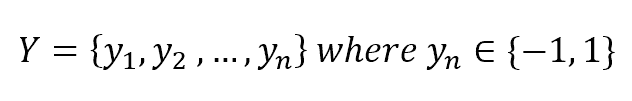

我们的目标是找到最佳分离超平面，其方程为：

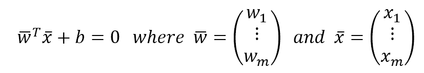

在以下图中，有一个二维表示的此类超平面：

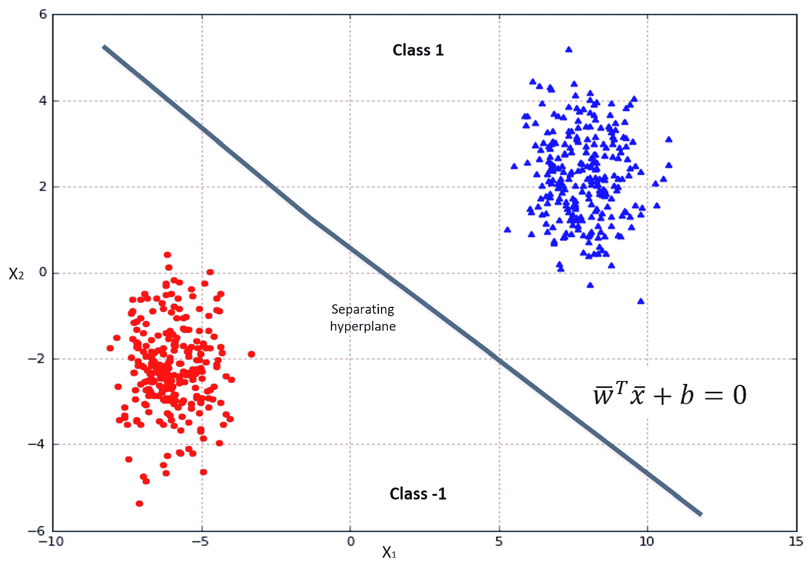

以这种方式，我们的分类器可以写成：

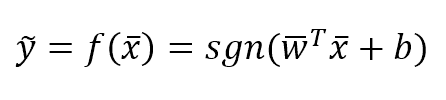

在现实场景中，两个类别通常由一个包含两个边界的间隔分开，其中有一些元素位于边界上。这些元素被称为**支持向量**。为了更通用的数学表达，最好重新归一化我们的数据集，使得支持向量将位于两个具有以下方程的超平面上：

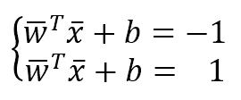

在以下图中，有一个包含两个支持向量的示例。虚线是原始的分离超平面：

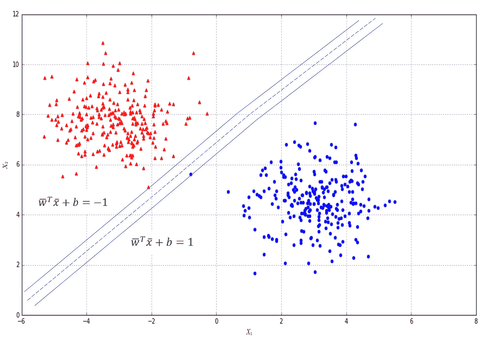

我们的目标是最大化这两个边界超平面之间的距离，以减少误分类的概率（当距离短时，误分类的概率更高，并且没有像前一个图中的两个明确分离的团块）。

考虑到边界是平行的，它们之间的距离由垂直于两者并连接两个点的线段的长度定义：

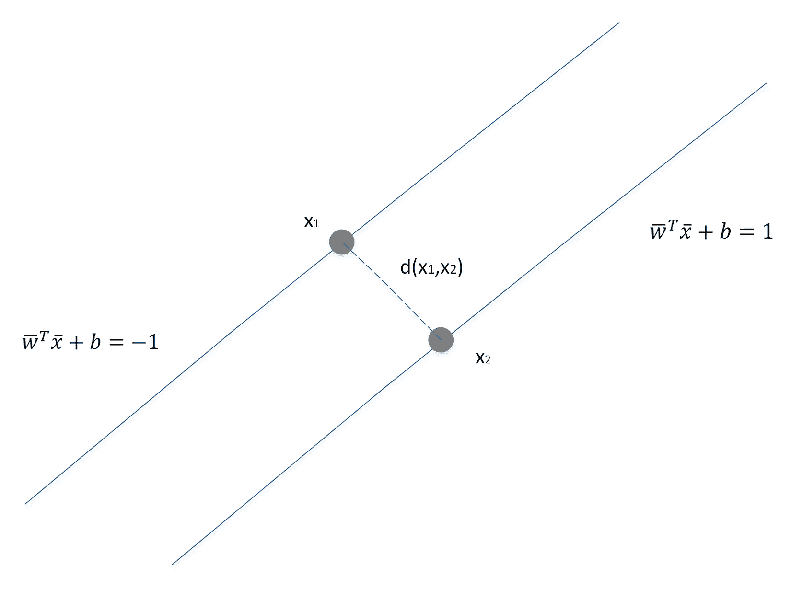

将点视为向量，因此，我们有：

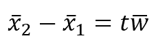

现在，考虑到边界超平面方程，我们得到：

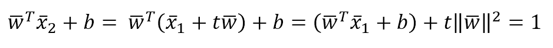

最后部分的第一个项等于-1，因此我们解出*t*：

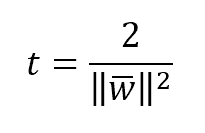

*x[1]* 和 *x[2]* 之间的距离是线段 *t* 的长度；因此我们得到：

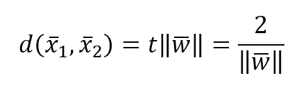

现在，考虑到我们数据集中的所有点，我们可以施加以下约束：

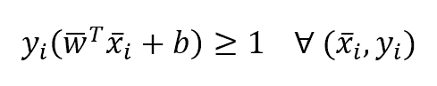

这通过使用 -1 和 1 作为类别标签和边界边缘来保证。等式仅对支持向量成立，而对于所有其他点，它将大于 1。重要的是要考虑模型不考虑这个边缘之外的向量。在许多情况下，这可以产生一个非常鲁棒的模型，但在许多数据集中，这也可能是一个强烈的限制。在下一段中，我们将使用一个技巧来避免这种僵化，同时保持相同的优化技术。

在这个阶段，我们可以定义用于训练支持向量机的最小化函数：

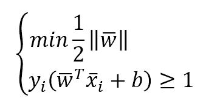

这可以通过从范数中移除平方根来进一步简化（以下二次规划问题）：

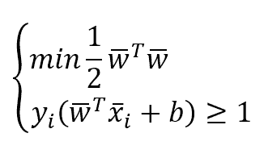

# scikit-learn 实现

为了允许模型拥有更灵活的分离超平面，所有 scikit-learn 实现都基于一个简单变体，该变体在最小化函数中包括所谓的**松弛变量**：

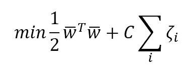

在这种情况下，约束变为：

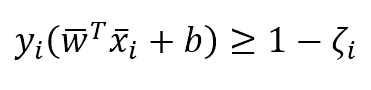

松弛变量的引入使我们能够创建一个灵活的边缘，使得属于一个类别的某些向量也可以出现在超空间的另一部分，并可以包含在模型训练中。这种灵活性的强度可以通过参数 *C* 来设置。小值（接近零）产生非常硬的边缘，而大于或等于 1 的值允许更多的灵活性（同时也增加了误分类率）。*C* 的正确选择不是立即的，但最佳值可以通过使用网格搜索自动找到，如前几章所述。在我们的例子中，我们保持默认值 1。

# 线性分类

我们的第一个例子是基于线性 SVM，如前文所述。我们首先创建一个包含 500 个向量的虚拟数据集，这些向量被划分为两类：

```py
from sklearn.datasets import make_classification

>>> nb_samples = 500
>>> X, Y = make_classification(n_samples=nb_samples, n_features=2, n_informative=2, n_redundant=0, n_clusters_per_class=1)
```

在以下图中，是数据集的图表。注意，一些点重叠在两个主要团块上。因此，需要一个正的 *C* 值来允许模型捕捉更复杂的动态。

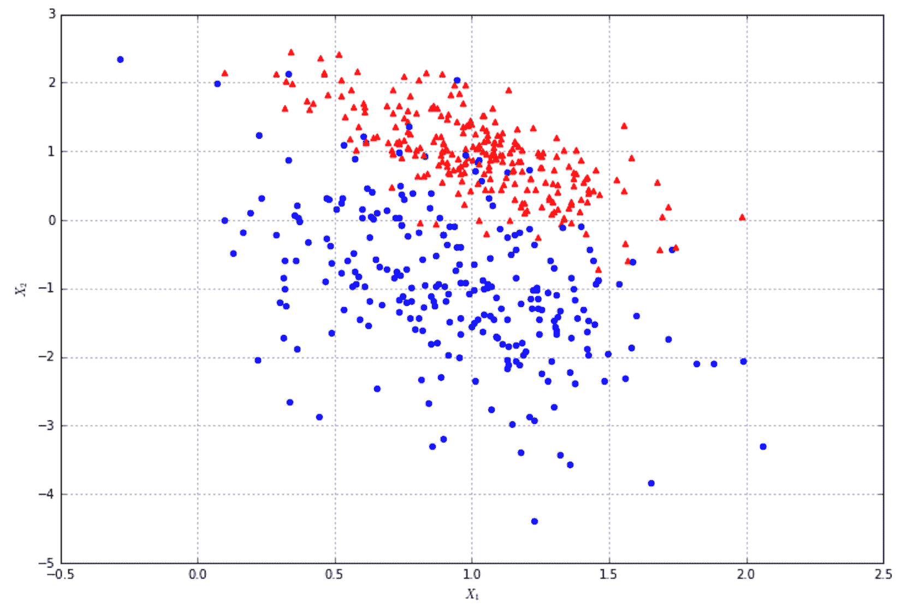

scikit-learn 提供了 `SVC` 类，这是一个非常高效的实现，在大多数情况下都可以使用。我们将使用它与交叉验证一起验证性能：

```py
from sklearn.svm import SVC
from sklearn.model_selection import cross_val_score

>>> svc = SVC(kernel='linear')
>>> cross_val_score(svc, X, Y, scoring='accuracy', cv=10).mean()
0.93191356542617032
```

在这个例子中，`kernel`参数必须设置为`'linear'`。在下一节中，我们将讨论它是如何工作的以及它如何可以显著提高 SVM 在非线性场景中的性能。正如预期的那样，准确度与逻辑回归相当，因为这个模型试图找到一个最优的线性分离器。训练好模型后，可以通过名为`support_vectors_`的实例变量获取支持向量的数组。以下图显示了它们的图示：


如图中所示，它们被放置在分离线上的一个条带中。`C`和松弛变量的影响决定了可移动的边界，部分地捕捉了现有的重叠。当然，使用线性分类器完美地分离集合是不可能的，另一方面，大多数现实生活中的问题都是非线性的；因此，这是一个必要的进一步步骤。

# 基于核的分类

当处理非线性问题时，通过将原始向量投影到一个更高维的空间中，使其可以线性分离，这是一种有用的方法。我们在讨论多项式回归时看到了类似的方法。SVMs 也采用相同的方法，尽管我们现在需要克服一个复杂性问题。我们的数学公式变为：

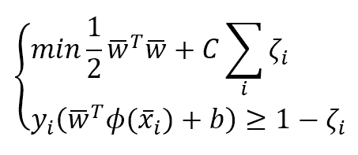

每个特征向量现在都通过一个非线性函数进行过滤，可以完全改变场景。然而，引入这样的函数增加了计算复杂度，这可能会明显地阻碍这种方法。为了理解发生了什么，有必要使用拉格朗日乘数表达二次问题。整个过程超出了本书的范围（在 Nocedal J.，Wright S. J.的《数值优化》Springer 中可以找到二次规划问题的完整和正式描述）；然而，最终的公式是：

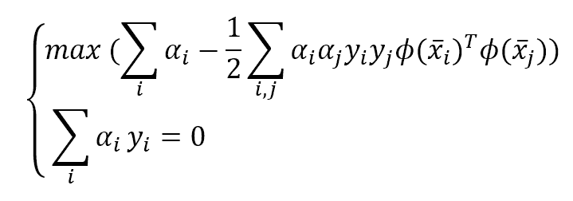

因此，对于每一对向量，有必要计算以下内容：

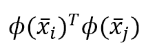

而这个程序可能成为瓶颈，对于大问题来说是不可以接受的。然而，现在所谓的**核技巧**就出现了。有一些特定的函数（称为核）具有以下特性：

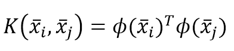

换句话说，两个特征向量核的值是两个投影向量的乘积。通过这个技巧，计算复杂度几乎保持不变，但我们可以在非常高的维度中受益于非线性投影的力量。

除了简单的乘积的线性核之外，scikit-learn 支持三种不同的核，可以解决许多现实生活中的问题。

# 径向基函数

RBF 核是 SVC 的默认值，基于以下函数：

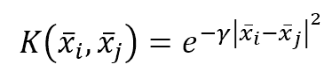

Gamma 参数决定了函数的振幅，它不受方向的影响，只受距离的影响。

# 多项式核

多项式核基于以下函数：

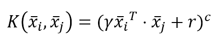

指数 *c* 通过参数 `degree` 指定，而常数项 *r* 被称为 `coef0`。这个函数可以通过大量的支持变量轻松地扩展维度，克服非常非线性的问题；然而，在资源方面的要求通常更高。考虑到一个非线性函数通常可以很好地逼近一个有界区域（通过采用多项式），因此许多复杂问题使用这个核函数变得容易解决并不令人惊讶。

# Sigmoid 核

Sigmoid 核基于以下函数：

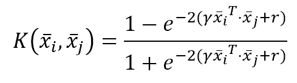

常数项 *r* 通过参数 `coef0` 指定。

# 自定义核函数

通常，内置核可以有效地解决大多数实际问题；然而，scikit-learn 允许我们创建自定义核，就像普通的 Python 函数一样：

```py
import numpy as np 

>>> def custom_kernel(x1, x2): 
 return np.square(np.dot(x1, x2) + 1)
```

该函数可以通过 SVC 的 `kernel` 参数传递，该参数可以假设固定字符串值（`'linear'`, `'rbf'`, `'poly'` 和 `'sigmoid'`）或一个可调用对象（例如 `kernel=custom_kernel`）。

# 非线性示例

为了展示核 SVM 的强大功能，我们将解决两个问题。第一个问题比较简单，但完全是非线性的，数据集是通过内置函数 `make_circles()` 生成的：

```py
from sklearn.datasets import make_circles 

>>> nb_samples = 500 
>>> X, Y = make_circles(n_samples=nb_samples, noise=0.1)
```

下图展示了该数据集的图表：

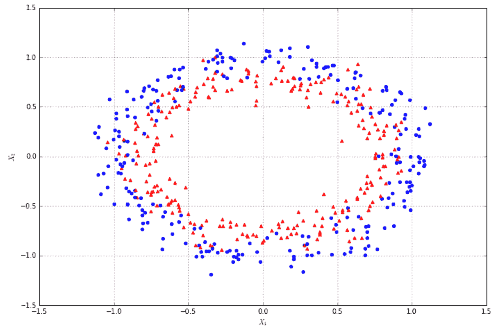

如所见，线性分类器永远无法分离这两个集合，每个近似值平均将包含 50%的错误分类。这里展示了逻辑回归的一个例子：

```py
from sklearn.linear_model import LogisticRegression 

>>> lr = LogisticRegression() 
>>> cross_val_score(lr, X, Y, scoring='accuracy', cv=10).mean() 
0.438
```

如预期，准确率低于 50%，没有其他优化可以显著提高它。让我们考虑使用 SVM 和不同核函数的网格搜索（保持每个的默认值）：

```py
import multiprocessing 
from sklearn.model_selection import GridSearchCV 

>>> param_grid = [ 
 { 
 'kernel': ['linear', 'rbf', 'poly', 'sigmoid'], 
 'C': [ 0.1, 0.2, 0.4, 0.5, 1.0, 1.5, 1.8, 2.0, 2.5, 3.0 ] 
 } 
] 

>>> gs = GridSearchCV(estimator=SVC(), param_grid=param_grid, 
 scoring='accuracy', cv=10, n_jobs=multiprocessing.cpu_count()) 

>>> gs.fit(X, Y) 
GridSearchCV(cv=10, error_score='raise', 
 estimator=SVC(C=1.0, cache_size=200, class_weight=None, coef0=0.0, 
 decision_function_shape=None, degree=3, gamma='auto', kernel='rbf', 
 max_iter=-1, probability=False, random_state=None, shrinking=True, 
 tol=0.001, verbose=False), 
 fit_params={}, iid=True, n_jobs=8, 
 param_grid=[{'kernel': ['linear', 'rbf', 'poly', 'sigmoid'], 'C': [0.1, 0.2, 0.4, 0.5, 1.0, 1.5, 1.8, 2.0, 2.5, 3.0]}], 
 pre_dispatch='2*n_jobs', refit=True, return_train_score=True, 
 scoring='accuracy', verbose=0) 

>>> gs.best_estimator_ 
SVC(C=2.0, cache_size=200, class_weight=None, coef0=0.0, 
 decision_function_shape=None, degree=3, gamma='auto', kernel='rbf', 
 max_iter=-1, probability=False, random_state=None, shrinking=True, 
 tol=0.001, verbose=False) 

>>> gs.best_score_ 
0.87
```

如从数据集的几何形状所预期，最佳的核函数是径向基函数，准确率达到 87%。进一步对 `gamma` 进行优化可以略微提高这个值，但由于两个子集之间有部分重叠，要达到接近 100%的准确率非常困难。然而，我们的目标不是过度拟合我们的模型；而是保证一个适当的泛化水平。因此，考虑到形状，有限数量的错误分类是可以接受的，以确保模型能够捕捉到边界表面的次级振荡。

另一个有趣的例子是由 MNIST 手写数字数据集提供的。我们之前已经见过它，并使用线性模型对其进行分类。现在我们可以尝试使用 SVM 找到最佳的核函数：

```py
from sklearn.datasets import load_digits 

>>> digits = load_digits() 

>>> param_grid = [ 
 { 
 'kernel': ['linear', 'rbf', 'poly', 'sigmoid'], 
 'C': [ 0.1, 0.2, 0.4, 0.5, 1.0, 1.5, 1.8, 2.0, 2.5, 3.0 ] 
 } 
] 

>>> gs = GridSearchCV(estimator=SVC(), param_grid=param_grid, 
 scoring='accuracy', cv=10, n_jobs=multiprocessing.cpu_count()) 

>>> gs.fit(digits.data, digits.target) 
GridSearchCV(cv=10, error_score='raise', 
 estimator=SVC(C=1.0, cache_size=200, class_weight=None, coef0=0.0, 
 decision_function_shape=None, degree=3, gamma='auto', kernel='rbf', 
 max_iter=-1, probability=False, random_state=None, shrinking=True, 
 tol=0.001, verbose=False), 
 fit_params={}, iid=True, n_jobs=8, 
 param_grid=[{'kernel': ['linear', 'rbf', 'poly', 'sigmoid'], 'C': [0.1, 0.2, 0.4, 0.5, 1.0, 1.5, 1.8, 2.0, 2.5, 3.0]}], 
 pre_dispatch='2*n_jobs', refit=True, return_train_score=True, 
 scoring='accuracy', verbose=0) 

>>> gs.best_estimator_ 
SVC(C=0.1, cache_size=200, class_weight=None, coef0=0.0, 
 decision_function_shape=None, degree=3, gamma='auto', kernel='poly', 
 max_iter=-1, probability=False, random_state=None, shrinking=True, 
 tol=0.001, verbose=False) 

>>> gs.best_score_ 
0.97885364496382865
```

因此，最佳分类器（几乎 98%的准确性）基于多项式核和非常低的`C`值。这意味着一个非常硬边界的非线性变换可以轻松地捕捉所有数字的动态。实际上，SVM（具有各种内部替代方案）在这个数据集上始终表现出优异的性能，并且它们的用途可以轻松地扩展到类似的问题。

另一个有趣的例子是基于 Olivetti 人脸数据集，这个数据集不属于 scikit-learn，但可以使用内置函数`fetch_olivetti_faces()`自动下载和设置：

```py
from sklearn.datasets import fetch_olivetti_faces

>>> faces = fetch_olivetti_faces(data_home='/ML/faces/')
```

通过`data_home`参数，可以指定数据集必须放置的本地文件夹。以下图中显示了样本的子集：

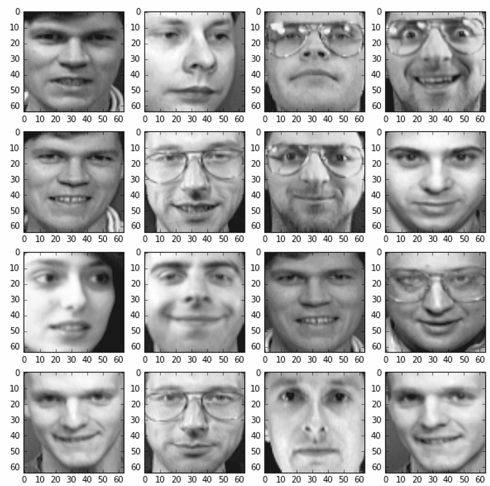

有 40 个不同的人，每个人用 10 张 64 x 64 像素的图片来表示。类别的数量（40）不算高，但考虑到许多照片的相似性，一个好的分类器应该能够捕捉到一些特定的解剖细节。使用非线性核进行网格搜索，我们得到：

```py
>>> param_grid = [
 { 
 'kernel': ['rbf', 'poly'],
 'C': [ 0.1, 0.5, 1.0, 1.5 ],
 'degree': [2, 3, 4, 5],
 'gamma': [0.001, 0.01, 0.1, 0.5]
 }
]

>>> gs = GridSearchCV(estimator=SVC(), param_grid=param_grid, scoring='accuracy', cv=8,  n_jobs=multiprocessing.cpu_count())
>>> gs.fit(faces.data, faces.target)
GridSearchCV(cv=8, error_score='raise',
 estimator=SVC(C=1.0, cache_size=200, class_weight=None, coef0=0.0,
 decision_function_shape=None, degree=3, gamma='auto', kernel='rbf',
 max_iter=-1, probability=False, random_state=None, shrinking=True,
 tol=0.001, verbose=False),
 fit_params={}, iid=True, n_jobs=8,
 param_grid=[{'kernel': ['rbf', 'poly'], 'C': [0.1, 0.5, 1.0, 1.5], 'gamma': [0.001, 0.01, 0.1, 0.5], 'degree': [2, 3, 4, 5]}],
 pre_dispatch='2*n_jobs', refit=True, return_train_score=True,
 scoring='accuracy', verbose=0)

>>> gs.best_estimator_
SVC(C=0.1, cache_size=200, class_weight=None, coef0=0.0,
 decision_function_shape=None, degree=2, gamma=0.1, kernel='poly',
 max_iter=-1, probability=False, random_state=None, shrinking=True,
 tol=0.001, verbose=False)
```

因此，最佳估计器是基于多项式的，`degree=2`，相应的准确率是：

```py
>>> gs.best_score_
0.96999999999999997
```

这证实了 SVM 即使在可以非常快速计算出的简单核中也能捕捉非线性动态的能力。对于读者来说，尝试不同的参数组合或预处理数据并应用主成分分析以降低其维度性将是有趣的。

# 受控支持向量机

在真实数据集上，SVM 可以提取大量的支持向量来提高准确性，这可能会减慢整个过程。为了找到精度和支持向量数量之间的权衡，scikit-learn 提供了一个名为`NuSVC`的实现，其中参数`nu`（介于 0—不包括—和 1 之间）可以用来同时控制支持向量的数量（较大的值会增加它们的数量）和训练错误（较小的值会减少错误的比例）。让我们考虑一个具有线性核和简单数据集的例子。以下图中是我们的数据集的散点图：

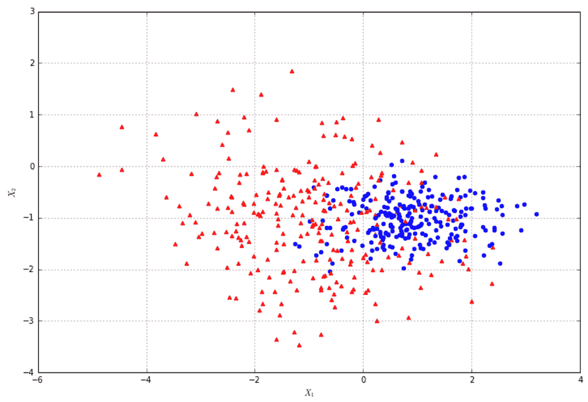

让我们从检查标准 SVM 的支持向量数量开始：

```py
>>> svc = SVC(kernel='linear') 
>>> svc.fit(X, Y) 
>>> svc.support_vectors_.shape 
(242L, 2L)
```

因此，模型找到了 242 个支持向量。现在让我们尝试使用交叉验证来优化这个数量。默认值是 0.5，这是一个可接受的权衡：

```py
from sklearn.svm import NuSVC 

>>> nusvc = NuSVC(kernel='linear', nu=0.5) 
>>> nusvc.fit(X, Y) 
>>> nusvc.support_vectors_.shape 
(251L, 2L) 

>>> cross_val_score(nusvc, X, Y, scoring='accuracy', cv=10).mean() 
0.80633213285314143
```

如预期，其行为类似于标准 SVC。现在让我们降低`nu`的值：

```py
>>> nusvc = NuSVC(kernel='linear', nu=0.15) 
>>> nusvc.fit(X, Y) 
>>> nusvc.support_vectors_.shape 
(78L, 2L) 

>>> cross_val_score(nusvc, X, Y, scoring='accuracy', cv=10).mean() 
0.67584393757503003
```

在这种情况下，支持向量的数量比之前少，而且这个选择也影响了准确性。我们不必尝试不同的值，可以通过网格搜索来寻找最佳选择：

```py
import numpy as np 

>>> param_grid = [ 
 { 
 'nu': np.arange(0.05, 1.0, 0.05) 
 } 
] 

>>> gs = GridSearchCV(estimator=NuSVC(kernel='linear'), param_grid=param_grid, 
 scoring='accuracy', cv=10, n_jobs=multiprocessing.cpu_count()) 
>>> gs.fit(X, Y) 
GridSearchCV(cv=10, error_score='raise', 
 estimator=NuSVC(cache_size=200, class_weight=None, coef0=0.0, 
 decision_function_shape=None, degree=3, gamma='auto', kernel='linear', 
 max_iter=-1, nu=0.5, probability=False, random_state=None, 
 shrinking=True, tol=0.001, verbose=False), 
 fit_params={}, iid=True, n_jobs=8, 
 param_grid=[{'nu': array([ 0.05,  0.1 ,  0.15,  0.2 ,  0.25,  0.3 ,  0.35,  0.4 ,  0.45, 
 0.5 ,  0.55,  0.6 ,  0.65,  0.7 ,  0.75,  0.8 ,  0.85,  0.9 ,  0.95])}], 
 pre_dispatch='2*n_jobs', refit=True, return_train_score=True, 
 scoring='accuracy', verbose=0) 

>>> gs.best_estimator_ 
NuSVC(cache_size=200, class_weight=None, coef0=0.0, 
 decision_function_shape=None, degree=3, gamma='auto', kernel='linear', 
 max_iter=-1, nu=0.5, probability=False, random_state=None, 
 shrinking=True, tol=0.001, verbose=False) 

>>> gs.best_score_ 
0.80600000000000005 

>>> gs.best_estimator_.support_vectors_.shape 
(251L, 2L)
```

因此，在这种情况下，默认值 0.5 产生了最准确的结果。通常，这种方法工作得相当好，但当需要减少支持向量的数量时，它可以是一个逐步减少 `nu` 值直到结果可接受的好起点。

# 支持向量回归

scikit-learn 提供了一种基于已描述算法（请参阅原始文档以获取更多信息）的非常简单的变体支持向量回归器。这种方法真正的力量在于使用非线性核（特别是多项式核）；然而，用户应建议逐步评估度数，因为复杂性可以迅速增长，同时训练时间也会增加。

对于我们的示例，我创建了一个基于二次噪声函数的虚拟数据集：

```py
>>> nb_samples = 50 

>>> X = np.arange(-nb_samples, nb_samples, 1) 
>>> Y = np.zeros(shape=(2 * nb_samples,)) 

>>> for x in X: 
 Y[int(x)+nb_samples] = np.power(x*6, 2.0) / 1e4 + np.random.uniform(-2, 2)
```

数据集在以下图中展示：

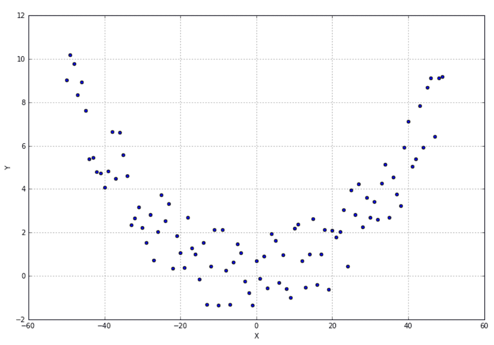

为了避免非常长的训练过程，模型使用`degree`设置为`2`进行评估。epsilon 参数允许我们指定预测的软边缘；如果预测值包含在以目标值为中心、半径等于 epsilon 的球内，则不对要最小化的函数应用惩罚。默认值是 0.1：

```py
from sklearn.svm import SVR 

>>> svr = SVR(kernel='poly', degree=2, C=1.5, epsilon=0.5) 
>>> cross_val_score(svr, X.reshape((nb_samples*2, 1)), Y, scoring='neg_mean_squared_error', cv=10).mean() 
-1.4641683636397234
```

# 参考文献

Nocedal J.，Wright S. J.，*数值优化*，Springer

# 摘要

在本章中，我们讨论了支持向量机在线性和非线性场景下的工作原理，从基本的数学公式开始。主要概念是找到通过使用有限数量的样本（称为支持向量）来最大化类别之间的距离的超平面，这些样本是最接近分离边缘的。

我们看到了如何使用核函数将非线性问题转换为线性问题，这些核函数允许将原始空间重新映射到另一个高维空间，在那里问题变得线性可分。我们还看到了如何控制支持向量的数量以及如何使用 SVM 进行回归问题。

在下一章中，我们将介绍另一种称为决策树的分类方法，这是本书中最后解释的方法。
