# 第九章：聚类基础

在本章中，我们将介绍聚类的基概念和 k-means 的结构，这是一个相当常见的算法，可以有效地解决许多问题。然而，它的假设非常强烈，特别是关于簇的凸性，这可能导致其在应用中存在一些局限性。我们将讨论其数学基础及其优化方法。此外，我们将分析两种在 k-means 无法对数据集进行聚类时可以采用的替代方案。这些替代方案是 DBSCAN（通过考虑样本密度的差异来工作）和基于点之间亲和力的非常强大的方法——谱聚类。

# 聚类基础

让我们考虑一个点集数据集：


我们假设可以找到一个标准（不是唯一的）以便每个样本都能与一个特定的组相关联：

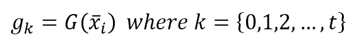

传统上，每个组被称为**簇**，寻找函数 *G* 的过程称为**聚类**。目前，我们没有对簇施加任何限制；然而，由于我们的方法是未监督的，应该有一个相似性标准来连接某些元素并分离其他元素。不同的聚类算法基于不同的策略来解决这个问题，并可能产生非常不同的结果。在下图中，有一个基于四组二维样本的聚类示例；将一个点分配给簇的决定仅取决于其特征，有时还取决于一组其他点的位置（邻域）：


在这本书中，我们将讨论**硬聚类**技术，其中每个元素必须属于单个簇。另一种方法称为**软聚类**（或**模糊聚类**），它基于一个成员分数，该分数定义了元素与每个簇“兼容”的程度。通用的聚类函数变为：

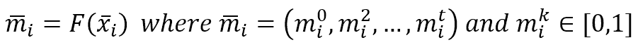

向量 *m[i]* 代表 *x[i]* 的相对成员资格，通常将其归一化为概率分布。

# K-means

k-means 算法基于（强烈的）初始条件，通过分配 k 个初始**质心**或**均值**来决定簇的数量：

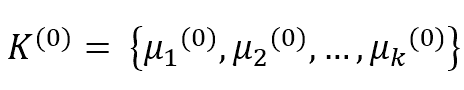

然后计算每个样本与每个质心之间的距离，并将样本分配到距离最小的簇。这种方法通常被称为**最小化簇的惯性**，其定义如下：

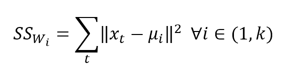

该过程是迭代的——一旦所有样本都已被处理，就会计算一个新的质心集 *K^((1))*（现在考虑属于聚类的实际元素），并且重新计算所有距离。算法在达到所需的容差时停止，换句话说，当质心变得稳定，因此惯性最小化时停止。

当然，这种方法对初始条件非常敏感，已经研究了某些方法来提高收敛速度。其中之一被称为**k-means++**（Karteeka Pavan K.，Allam Appa Rao，Dattatreya Rao A. V.，和 Sridhar G.R.，《K-Means 类型算法的鲁棒种子选择算法》，国际计算机科学和信息技术杂志 3，第 5 期，2011 年 10 月 30 日），该方法选择初始质心，使其在统计上接近最终质心。数学解释相当困难；然而，这种方法是 scikit-learn 的默认选择，并且通常对于任何可以用此算法解决的聚类问题来说都是最佳选择。

让我们考虑一个简单的示例，使用一个虚拟数据集：

```py
from sklearn.datasets import make_blobs

nb_samples = 1000
X, _ = make_blobs(n_samples=nb_samples, n_features=2, centers=3, cluster_std=1.5)
```

我们期望有三个具有二维特征的聚类，由于每个团块的方差，它们之间存在部分重叠。在我们的例子中，我们不会使用*Y*变量（它包含预期的聚类），因为我们只想生成一组局部一致的点来尝试我们的算法。

结果图示如下所示：

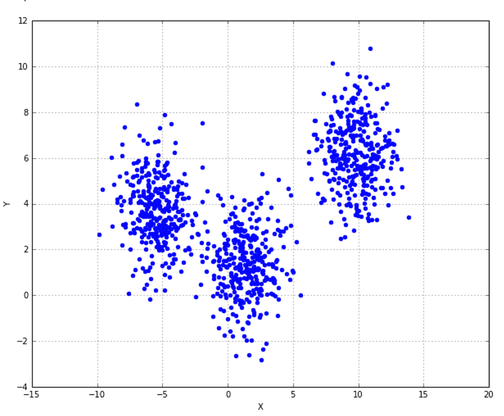

在这种情况下，问题非常简单，所以我们期望 k-means 在*X*的[-5, 0]区间内以最小误差将三个组分开。保持默认值，我们得到：

```py
from sklearn.cluster import KMeans

>>> km = KMeans(n_clusters=3)
>>> km.fit(X)
KMeans(algorithm='auto', copy_x=True, init='k-means++', max_iter=300,
 n_clusters=3, n_init=10, n_jobs=1, precompute_distances='auto',
 random_state=None, tol=0.0001, verbose=0)

>>> print(km.cluster_centers_)
[[ 1.39014517,  1.38533993]
 [ 9.78473454,  6.1946332 ]
 [-5.47807472,  3.73913652]]
```

使用三种不同的标记重新绘制数据，可以验证 k-means 如何成功地将数据分离：

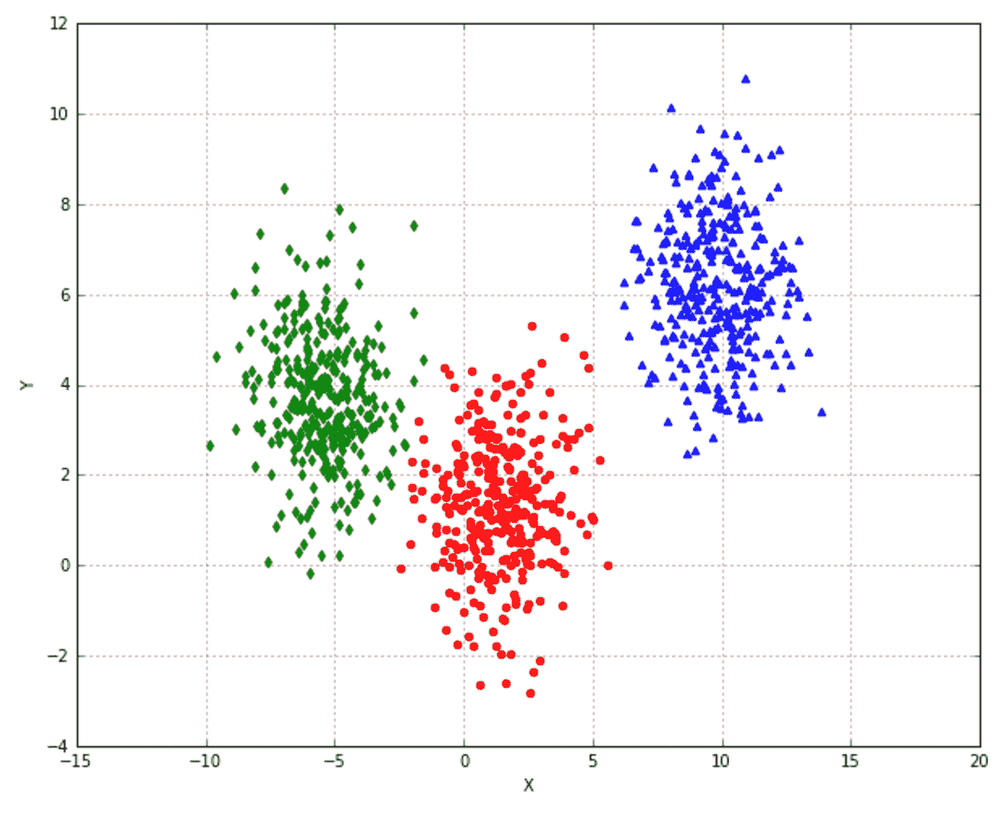

在这种情况下，分离非常容易，因为 k-means 基于欧几里得距离，它是径向的，因此预期聚类将是凸集。当这种情况不发生时，无法使用此算法解决问题。大多数时候，即使凸性没有得到完全保证，k-means 也能产生良好的结果，但有一些情况下预期的聚类是不可能的，让 k-means 找到质心可能会导致完全错误的结果。

让我们考虑同心圆的情况。scikit-learn 提供了一个内置函数来生成这样的数据集：

```py
from sklearn.datasets import make_circles

>>> nb_samples = 1000
>>> X, Y = make_circles(n_samples=nb_samples, noise=0.05)
```

该数据集的图示如下所示：

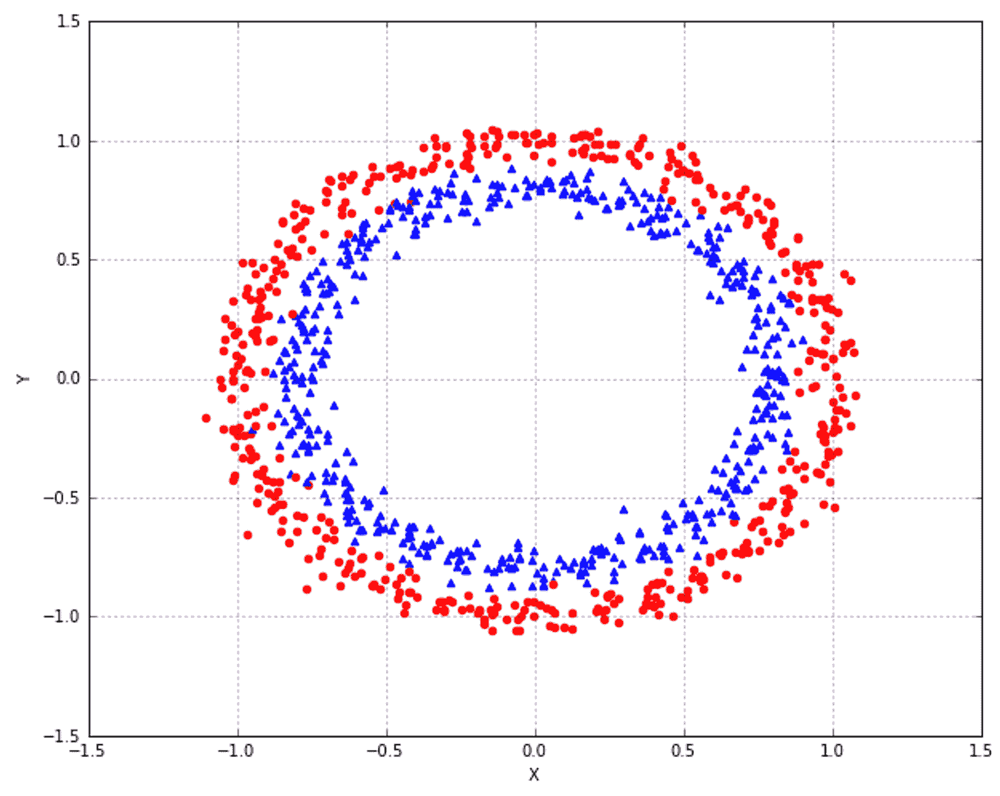

我们希望有一个内部聚类（对应于用三角形标记表示的样本）和一个外部聚类（用点表示）。然而，这样的集合不是凸集，k-means 无法正确地将它们分离（均值应该是相同的！）。实际上，假设我们尝试将算法应用于两个聚类：

```py
>>> km = KMeans(n_clusters=2)
>>> km.fit(X)
KMeans(algorithm='auto', copy_x=True, init='k-means++', max_iter=300,
 n_clusters=2, n_init=10, n_jobs=1, precompute_distances='auto',
 random_state=None, tol=0.0001, verbose=0)
```

我们得到以下图所示的分离：

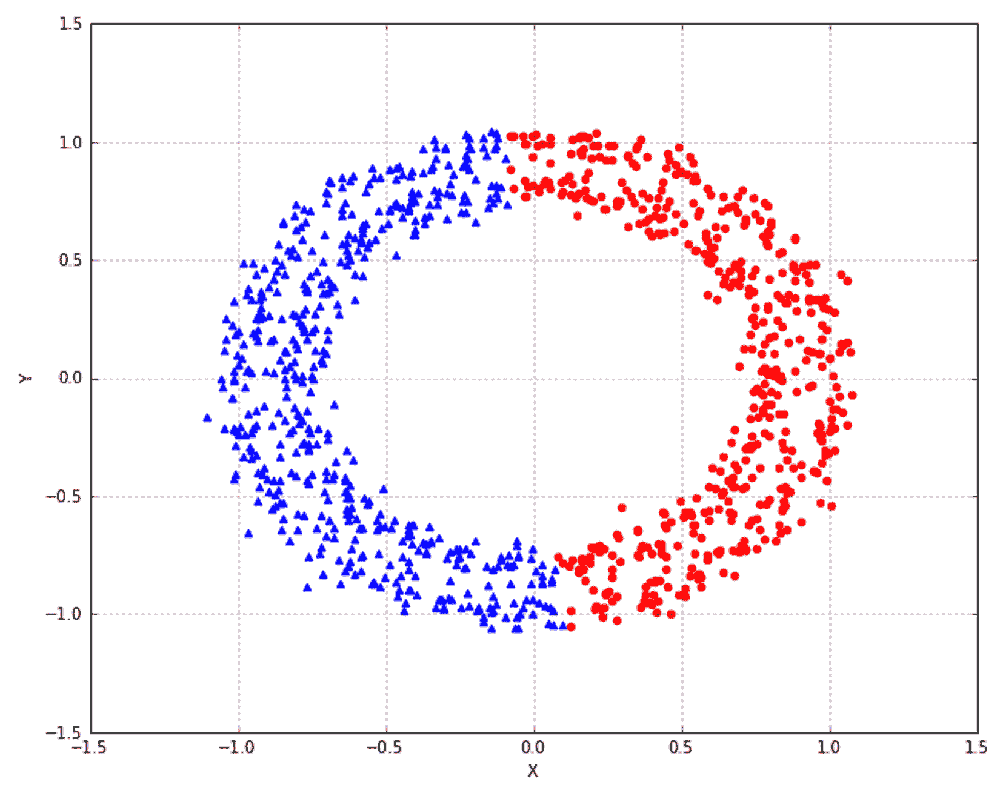

如预期，k-means 收敛到两个半圆中间的两个质心，并且得到的聚类结果与我们预期的完全不同。此外，如果必须根据与公共中心的距离来考虑样本的不同，这个结果将导致完全错误的预测。显然，必须采用另一种方法。

# 寻找最佳聚类数量

k-means 最常见的一个缺点与选择最佳聚类数量有关。过小的值将确定包含异质元素的大分组，而较大的值可能导致难以识别聚类之间差异的场景。因此，我们将讨论一些可以用来确定适当分割数量和评估相应性能的方法。

# 优化惯性

第一种方法基于这样的假设：适当的聚类数量必须产生小的惯性。然而，当聚类数量等于样本数量时，这个值达到最小（0.0）；因此，我们不能寻找最小值，而是寻找一个在惯性和聚类数量之间权衡的值。

假设我们有一个包含 1,000 个元素的数据库。我们可以计算并收集不同数量聚类下的惯性（scikit-learn 将这些值存储在实例变量`inertia_`中）：

```py
>>> nb_clusters = [2, 3, 5, 6, 7, 8, 9, 10]

>>> inertias = []

>>> for n in nb_clusters:
>>>    km = KMeans(n_clusters=n)
>>>    km.fit(X)
>>>    inertias.append(km.inertia_)
```

绘制值，我们得到以下图所示的结果：

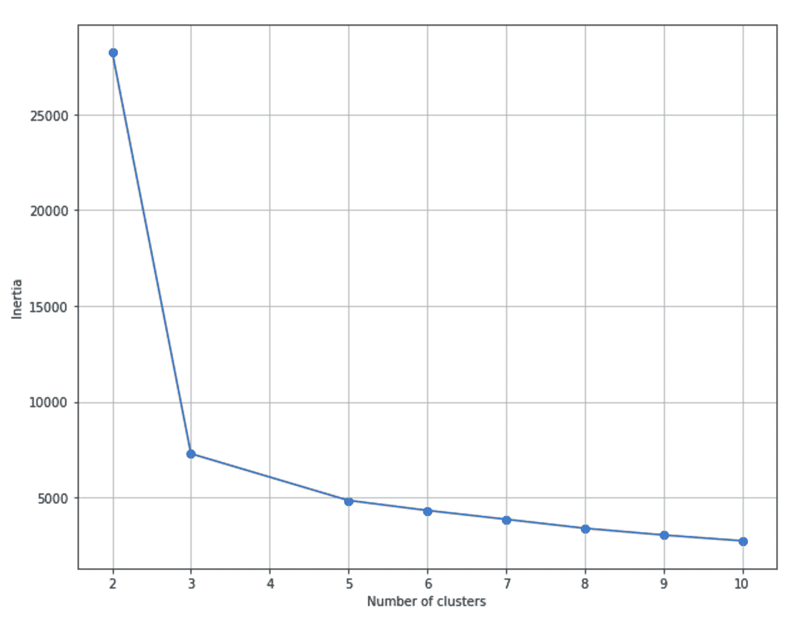

如您所见，2 和 3 之间有一个戏剧性的减少，然后斜率开始变平。我们希望找到一个值，如果减少，会导致惯性大幅增加，如果增加，会产生非常小的惯性减少。因此，一个好的选择可能是 4 或 5，而更大的值可能会产生不希望的聚类内分割（直到极端情况，每个点成为一个单独的聚类）。这种方法非常简单，可以用作确定潜在范围的第一个方法。接下来的策略更复杂，可以用来找到最终的聚类数量。

# 形状系数

形状系数基于“最大内部凝聚力和最大聚类分离”的原则。换句话说，我们希望找到产生数据集细分，形成彼此分离的密集块的数量。这样，每个聚类将包含非常相似的元素，并且选择属于不同聚类的两个元素，它们的距离应该大于最大聚类内距离。

在定义距离度量（欧几里得通常是不错的选择）之后，我们可以计算每个元素的聚类内平均距离：

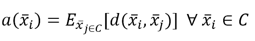

我们还可以定义平均最近簇距离（这对应于最低的簇间距离）：

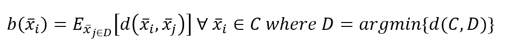

元素*x[i]*的轮廓得分定义为：

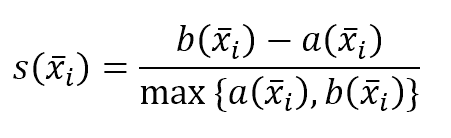

这个值介于-1 和 1 之间，其解释如下：

+   一个接近 1 的值是好的（1 是最佳条件），因为这表示*a(x[i]) << b(x[i])*。

+   接近 0 的值表示簇内和簇间测量的差异几乎为零，因此存在簇重叠。

+   接近-1 的值表示样本被分配到了错误的聚类，因为*a(x[i]) >> b(x[i])*。

scikit-learn 允许计算平均轮廓得分，以便对不同数量的聚类有一个立即的概览：

```py
from sklearn.metrics import silhouette_score

>>> nb_clusters = [2, 3, 5, 6, 7, 8, 9, 10]

>>> avg_silhouettes = []

>>> for n in nb_clusters:
>>>    km = KMeans(n_clusters=n)
>>>    Y = km.fit_predict(X)
>>>    avg_silhouettes.append(silhouette_score(X, Y))
```

对应的图表如下所示：

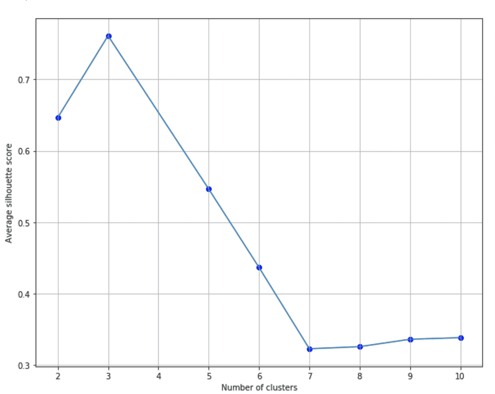

最佳值是 3（非常接近 1.0），然而，考虑到前面的方法，4 个聚类提供了更小的惯性，同时轮廓得分也合理。因此，选择 4 而不是 3 可能是一个更好的选择。然而，3 和 4 之间的决定并不立即，应该通过考虑数据集的性质来评估。轮廓得分表明存在 3 个密集的聚簇，但惯性图表明其中至少有一个可以可能分成两个簇。为了更好地理解聚类是如何工作的，还可以绘制轮廓图，显示所有簇中每个样本的排序得分。在以下代码片段中，我们为 2、3、4 和 8 个簇创建图表：

```py
from sklearn.metrics import silhouette_samples

>>> fig, ax = subplots(2, 2, figsize=(15, 10))

>>> nb_clusters = [2, 3, 4, 8]
>>> mapping = [(0, 0), (0, 1), (1, 0), (1, 1)]

>>> for i, n in enumerate(nb_clusters):
>>>    km = KMeans(n_clusters=n)
>>>    Y = km.fit_predict(X)

>>>    silhouette_values = silhouette_samples(X, Y)

>>>    ax[mapping[i]].set_xticks([-0.15, 0.0, 0.25, 0.5, 0.75, 1.0])
>>>    ax[mapping[i]].set_yticks([])
>>>    ax[mapping[i]].set_title('%d clusters' % n)
>>>    ax[mapping[i]].set_xlim([-0.15, 1])
>>>    ax[mapping[i]].grid()
>>>    y_lower = 20

>>>    for t in range(n):
>>>        ct_values = silhouette_values[Y == t]
>>>        ct_values.sort()

>>>        y_upper = y_lower + ct_values.shape[0]

>>>        color = cm.Accent(float(t) / n)
>>>        ax[mapping[i]].fill_betweenx(np.arange(y_lower, y_upper), 0, 
>>>                                     ct_values, facecolor=color, edgecolor=color)

>>>        y_lower = y_upper + 20
```

每个样本的轮廓系数是通过函数 `silhouette_values`（这些值始终介于-1 和 1 之间）计算的。在这种情况下，我们将图表限制在-0.15 和 1 之间，因为没有更小的值。然而，在限制之前检查整个范围是很重要的。

结果图表如下所示：

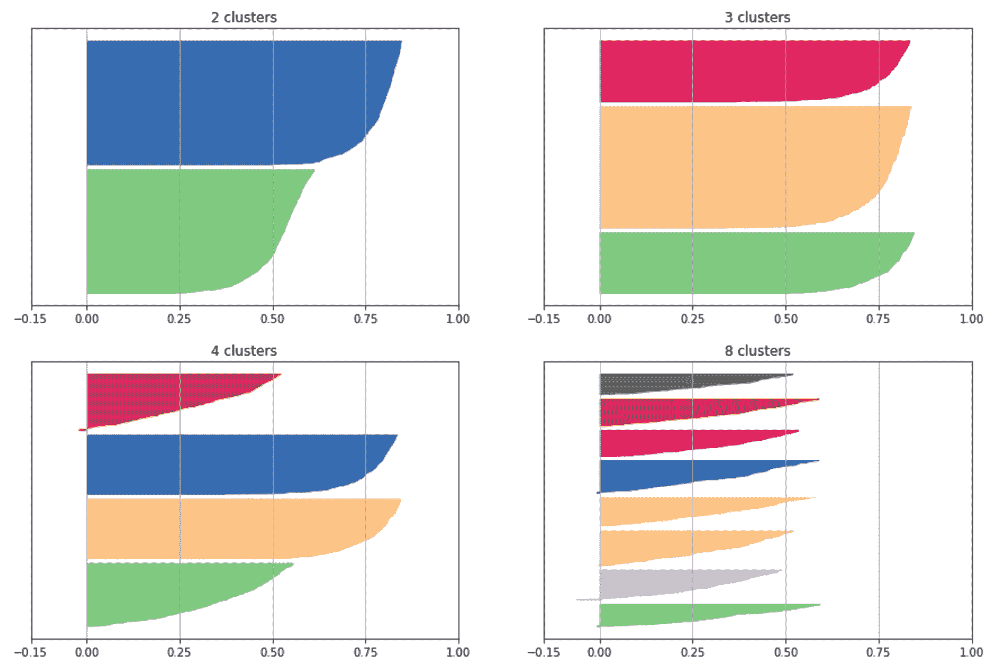

每个轮廓的宽度与属于特定聚类的样本数量成正比，其形状由每个样本的得分决定。理想的图表应包含均匀且长的轮廓，没有峰值（它们必须类似于梯形而不是三角形），因为我们期望同一聚类中的样本得分方差非常低。对于两个聚类，形状是可以接受的，但一个聚类的平均得分为 0.5，而另一个的值大于 0.75；因此，第一个聚类的内部一致性较低。在对应于 8 个聚类的图表中，展示了完全不同的情况。所有轮廓都是三角形的，其最大得分略大于 0.5。这意味着所有聚类在内部是一致的，但分离度不可接受。对于三个聚类，图表几乎是完美的，除了第二个轮廓的宽度。如果没有其他指标，我们可以考虑这个数字是最好的选择（也由平均得分证实），但聚类的数量越多，惯性越低。对于四个聚类，图表略差，有两个轮廓的最大得分约为 0.5。这意味着两个聚类完美一致且分离，而剩下的两个则相对一致，但它们可能没有很好地分离。目前，我们应在 3 和 4 之间做出选择。接下来，我们将介绍其他方法，以消除所有疑虑。

# 卡尔金斯-哈拉巴斯指数

另一种基于密集和分离良好聚类概念的方法是卡尔金斯-哈拉巴斯指数。要构建它，我们首先需要定义簇间分散度。如果我们有 k 个聚类及其相对质心和全局质心，簇间分散度（BCD）定义为：

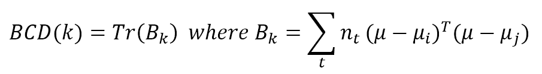

在上述表达式中，*n[k]* 是属于聚类 k 的元素数量，*mu*（公式中的希腊字母）是全局质心，而 *mu*[i] 是聚类 *i* 的质心。簇内分散度（WCD）定义为：

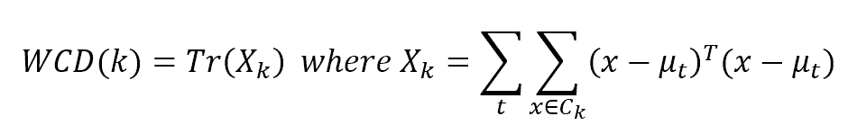

卡尔金斯-哈拉巴斯指数定义为 *BCD(k)* 和 *WCD(k)* 之间的比率：

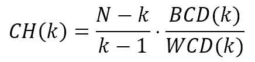

我们在寻找低簇内分散度（密集的聚团）和高簇间分散度（分离良好的聚团），需要找到最大化此指数的聚类数量。我们可以以类似于我们之前为轮廓得分所做的方式获得一个图表：

```py
from sklearn.metrics import calinski_harabaz_score

>>> nb_clusters = [2, 3, 5, 6, 7, 8, 9, 10]

>>> ch_scores = []

>>> km = KMeans(n_clusters=n)
>>> Y = km.fit_predict(X)

>>> for n in nb_clusters:
>>>    km = KMeans(n_clusters=n)
>>>    Y = km.fit_predict(X)
>>>    ch_scores.append(calinski_harabaz_score(X, Y))
```

结果图表如下所示：

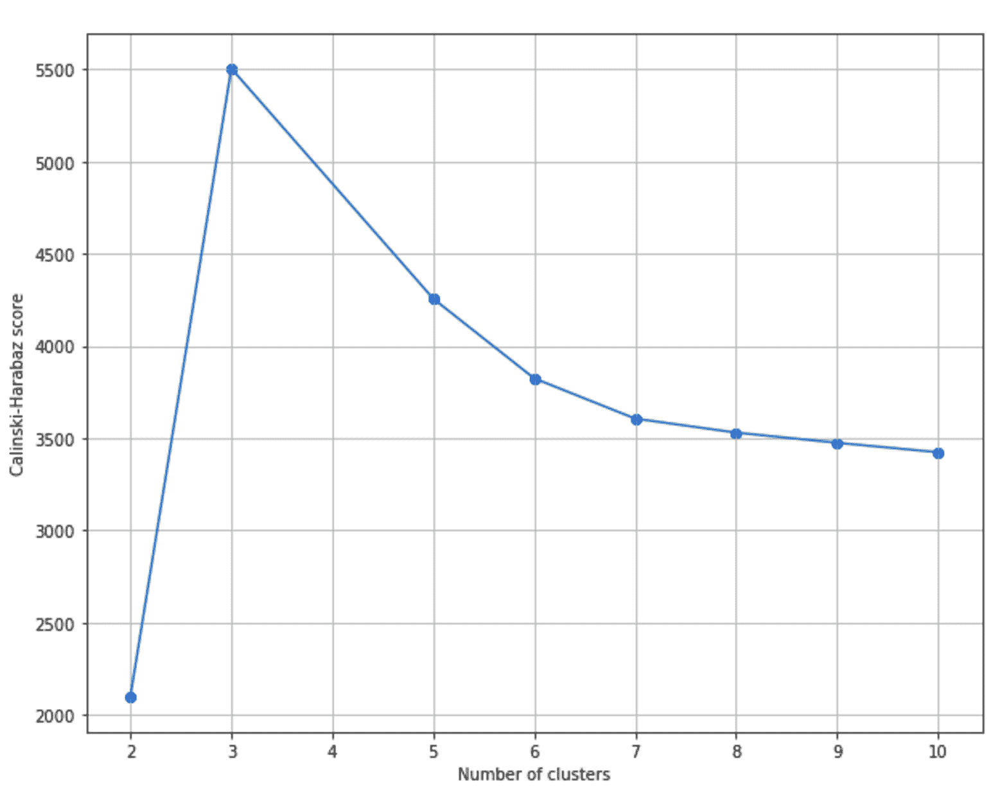

如预期的那样，最高值（5,500）是在三个聚类时获得的，而四个聚类得到的值略低于 5,000。仅考虑这种方法，没有疑问，最佳选择是 3，即使 4 也是一个合理的值。让我们考虑最后一种方法，它评估整体稳定性。

# 聚类不稳定性

另一种方法基于在 Von Luxburg U. 的文章《Cluster stability: an overview》中定义的簇不稳定性概念，arXiv 1007:1075v1，2010 年 7 月 7 日。直观地说，我们可以认为，如果一个聚类方法在扰动相同数据集的版本中产生非常相似的结果，那么这个聚类方法是稳定的。更正式地说，如果我们有一个数据集 *X*，我们可以定义一组 *m* 扰动（或噪声）版本：

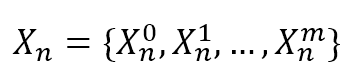

考虑两个具有相同簇数（k）的聚类之间的距离度量 *d(C(X[1]), C(X[2]))*，不稳定性定义为噪声版本聚类对之间的平均距离：

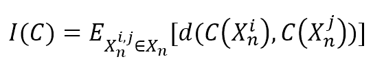

对于我们的目的，我们需要找到使 *I(C)* 最小化的 k 值（因此最大化稳定性）。首先，我们需要生成一些数据集的噪声版本。假设 *X* 包含 1,000 个二维样本，标准差为 10.0。我们可以通过添加一个均匀随机值（范围在 [-2.0, 2.0] 内）以 0.25 的概率扰动 *X*：

```py
>>> nb_noisy_datasets = 4

>>> X_noise = []

>>> for _ in range(nb_noisy_datasets):
>>>    Xn = np.ndarray(shape=(1000, 2))
>>>    for i, x in enumerate(X):
>>>        if np.random.uniform(0, 1) < 0.25:
>>>            Xn[i] = X[i] + np.random.uniform(-2.0, 2.0)
>>>        else:
>>>            Xn[i] = X[i]
>>>    X_noise.append(Xn)
```

在这里，我们假设有四个扰动版本。作为一个度量标准，我们采用汉明距离，该距离与不同意的输出元素数量成比例（如果归一化）。在这个阶段，我们可以计算不同簇数量下的不稳定性：

```py
from sklearn.metrics.pairwise import pairwise_distances

>>> instabilities = []

>>> for n in nb_clusters:
>>>    Yn = []
>>> 
>>>    for Xn in X_noise:
>>>        km = KMeans(n_clusters=n)
>>>        Yn.append(km.fit_predict(Xn))

>>> distances = []

>>> for i in range(len(Yn)-1):
>>>        for j in range(i, len(Yn)):
>>>            d = pairwise_distances(Yn[i].reshape(-1, 1), Yn[j].reshape(-1, -1), 'hamming')
>>>            distances.append(d[0, 0])

>>>    instability = (2.0 * np.sum(distances)) / float(nb_noisy_datasets ** 2)
>>>    instabilities.append(instability)
```

由于距离是对称的，我们只计算矩阵的上三角部分。结果如下所示：

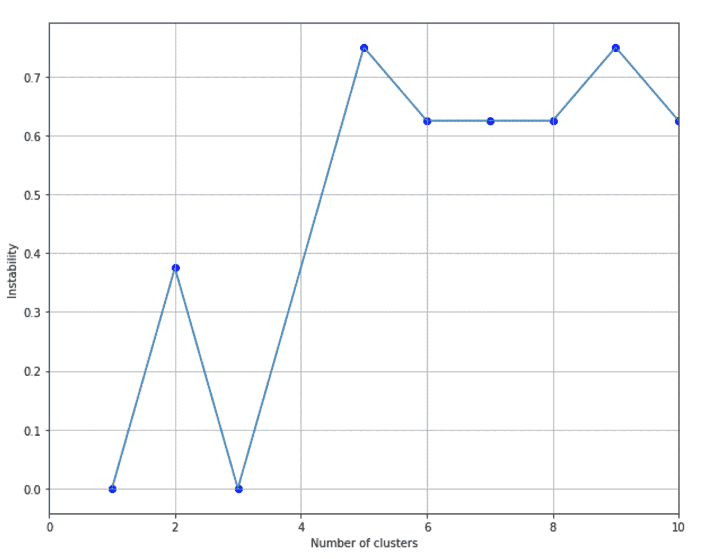

排除具有 2 个簇的配置，其中惯性非常高，我们有 3 个簇的最小值，这个值已经被前三种方法所确认。因此，我们最终可以决定将 `n_clusters` 设置为 3，排除 4 个或更多簇的选项。这种方法非常强大，但重要的是要用合理的噪声数据集数量来评估稳定性，注意不要过度改变原始几何形状。一个好的选择是使用高斯噪声，方差设置为数据集方差的分数（例如 1/10）。其他方法在 Von Luxburg U. 的文章《Cluster stability: an overview》中有所介绍，arXiv 1007:1075v1，2010 年 7 月 7 日。

即使我们已经用 k-means 展示了这些方法，它们也可以应用于任何聚类算法来评估性能并比较它们。

# DBSCAN

DBSCAN 或 **基于密度的空间聚类应用噪声** 是一种强大的算法，可以轻松解决 k-means 无法解决的非凸问题。其思想很简单：簇是一个高密度区域（对其形状没有限制），周围被低密度区域包围。这个陈述通常是正确的，并且不需要对预期簇的数量进行初始声明。该过程从分析一个小区域（形式上，一个由最小数量的其他样本包围的点）开始。如果密度足够，它被认为是簇的一部分。此时，考虑邻居。如果它们也有高密度，它们将与第一个区域合并；否则，它们将确定拓扑分离。当扫描完所有区域后，簇也已经确定，因为它们是被空空间包围的岛屿。

scikit-learn 允许我们通过两个参数来控制此过程：

+   `eps`: 负责定义两个邻居之间的最大距离。值越高，聚合的点越多，而值越小，创建的簇越多。

+   `min_samples`: 这决定了定义一个区域（也称为核心点）所需的周围点的数量。

让我们尝试一个非常困难的聚类问题，称为半月形。可以使用内置函数创建数据集：

```py
from sklearn.datasets import make_moons

>>> nb_samples = 1000
>>> X, Y = make_moons(n_samples=nb_samples, noise=0.05)
```

数据集的图示如下所示：

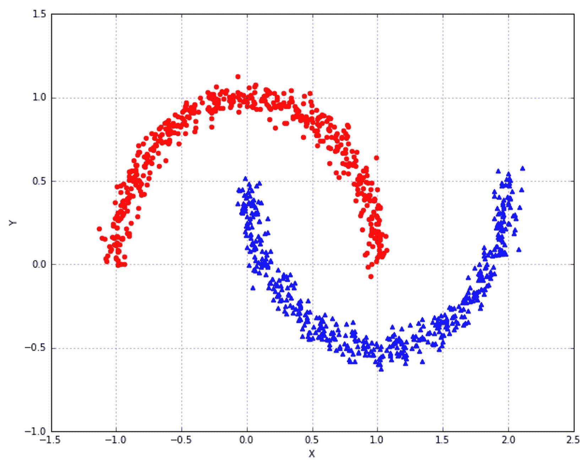

为了理解，k-means 将通过寻找最优凸性来进行聚类，结果如下所示：

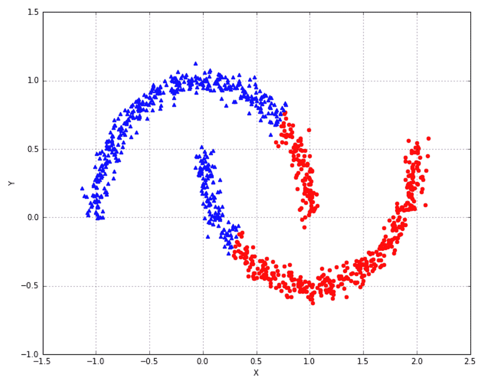

当然，这种分离是不可接受的，而且没有方法可以提高准确性。让我们尝试使用 DBSCAN（将 `eps` 设置为 0.1，`min_samples` 的默认值为 5）：

```py
from sklearn.cluster import DBSCAN

>>> dbs = DBSCAN(eps=0.1)
>>> Y = dbs.fit_predict(X)
```

与其他实现方式不同，DBSCAN 在训练过程中预测标签，因此我们已经有了一个包含每个样本分配的簇的数组 `Y`。在下图中，有两种不同的标记表示：

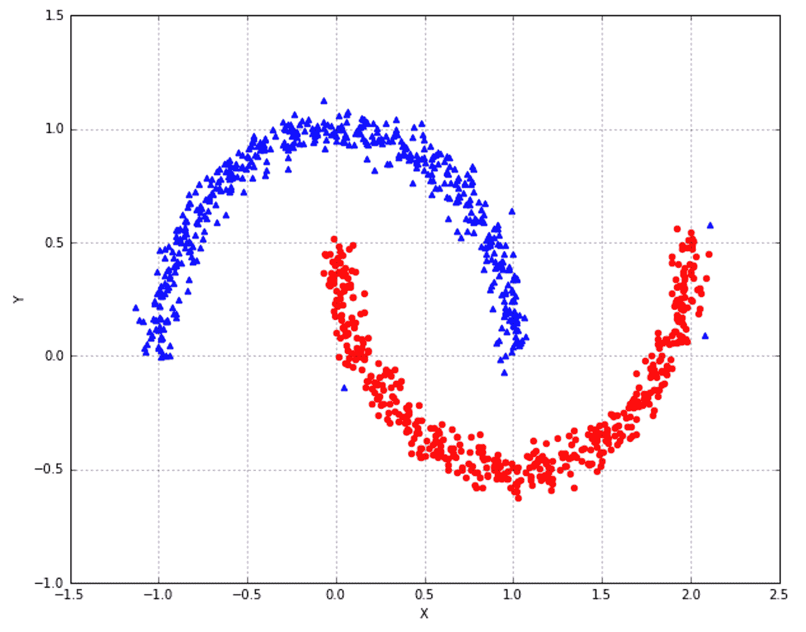

如您所见，准确度非常高，只有三个孤立点被错误分类（在这种情况下，我们知道它们的类别，因此我们可以使用这个术语，即使它是一个聚类过程）。然而，通过执行网格搜索，很容易找到优化聚类过程的最佳值。调整这些参数非常重要，以避免两个常见问题：少数大簇和许多小簇。这个问题可以通过以下方法轻松避免。

# 谱聚类

谱聚类是一种基于对称亲和矩阵的更复杂的方法：

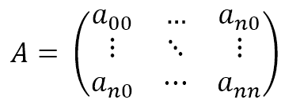

在这里，每个元素*a[ij]*代表两个样本之间的亲和度度量。最常用的度量（也由 scikit-learn 支持）是径向基函数和最近邻。然而，如果核产生的度量具有距离的特征（非负、对称和递增），则可以使用任何核。

计算拉普拉斯矩阵并应用标准聚类算法到特征向量的子集（这个元素严格与每个单独的策略相关）。

scikit-learn 实现了 Shi-Malik 算法（*Shi J., Malik J., Normalized Cuts and Image Segmentation, IEEE Transactions on Pattern Analysis and Machine Intelligence, Vol. 22, 08/2000*），也称为 normalized-cuts，该算法将样本划分为两个集合（*G[1]*和*G[2]*，这些集合形式上是图，其中每个点是一个顶点，边由归一化拉普拉斯矩阵导出），使得属于簇内点的权重远高于属于分割的权重。完整的数学解释超出了本书的范围；然而，在*Von Luxburg U., A Tutorial on Spectral Clustering, 2007*中，你可以阅读关于许多替代谱方法的完整解释。

让我们考虑之前的半月形示例。在这种情况下，亲和度（就像 DBSCAN 一样）应该基于最近邻函数；然而，比较不同的核很有用。在第一个实验中，我们使用具有不同`gamma`参数值的 RBF 核：

```py
from sklearn.cluster import SpectralClustering

>>> Yss = []
>>> gammas = np.linspace(0, 12, 4)

>>> for gamma in gammas:
 sc = SpectralClustering(n_clusters=2, affinity='rbf', gamma=gamma)
 Yss.append(sc.fit_predict(X))
```

在这个算法中，我们需要指定我们想要多少个簇，因此我们将值设置为 2。结果图如下所示：

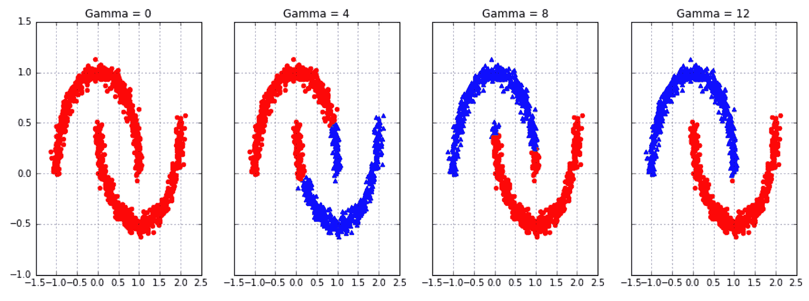

如您所见，当缩放因子 gamma 增加时，分离变得更加准确；然而，考虑到数据集，在任何搜索中都不需要使用最近邻核。

```py
>>> sc = SpectralClustering(n_clusters=2, affinity='nearest_neighbors')
>>> Ys = sc.fit_predict(X)
```

结果图如下所示：

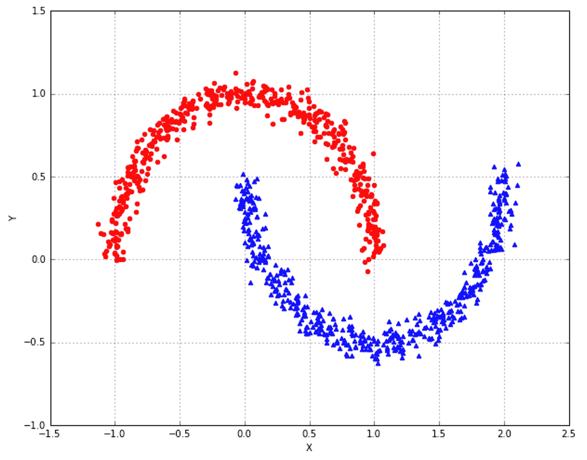

对于许多基于核的方法，谱聚类需要先前的分析来检测哪个核可以提供亲和度矩阵的最佳值。scikit-learn 也允许我们为那些难以使用标准核解决的问题定义自定义核。

# 基于真实情况的评估方法

在本节中，我们介绍了一些需要了解真实情况的评估方法。由于聚类通常作为无监督方法应用，因此这种条件并不总是容易获得；然而，在某些情况下，训练集已经被手动（或自动）标记，在预测新样本的簇之前评估模型是有用的。

# 同质性

对于一个聚类算法（给定真实情况）的一个重要要求是，每个簇应只包含属于单个类别的样本。在第二章《机器学习中的重要元素》中，我们定义了熵 *H(X)* 和条件熵 *H(X|Y)* 的概念，这些概念衡量了在知道 *Y* 的情况下 *X* 的不确定性。因此，如果类集表示为 *C*，聚类集表示为 *K*，则 *H(C|K)* 是在聚类数据集后确定正确类别的不确定性的度量。为了得到同质性分数，有必要考虑类集的初始熵 *H(C)* 来归一化这个值：

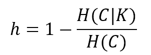

在 scikit-learn 中，有一个内置函数 `homogeneity_score()` 可以用来计算这个值。对于这个和接下来的几个例子，我们假设我们有一个标记的数据集 *X*（带有真实标签 *Y*）：

```py
from sklearn.metrics import homogeneity_score

>>> km = KMeans(n_clusters=4)
>>> Yp = km.fit_predict(X)
>>> print(homogeneity_score(Y, Yp))
0.806560739827
```

0.8 的值意味着大约有 20%的残余不确定性，因为一个或多个簇包含一些属于次要类别的点。与其他在上一节中展示的方法一样，可以使用同质性分数来确定最佳簇数量。

# 完整性

另一个互补的要求是，属于一个类别的每个样本都被分配到同一个簇中。这个度量可以通过条件熵 *H(K|C)* 来确定，这是在知道类别的情况下确定正确簇的不确定性。像同质性分数一样，我们需要使用熵 *H(K)* 来归一化这个值：

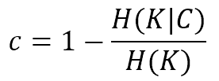

我们可以使用函数 `completeness_score()`（在相同的数据集上）来计算这个分数：

```py
from sklearn.metrics import completeness_score

>>> km = KMeans(n_clusters=4)
>>> Yp = km.fit_predict(X)
>>> print(completeness_score(Y, Yp))
0.807166746307
```

此外，在这种情况下，这个值相当高，这意味着大多数属于一个类别的样本已经被分配到同一个簇中。这个值可以通过不同的簇数量或改变算法来提高。

# 调整后的 rand 指数

调整后的 rand 指数衡量原始类划分（*Y*）和聚类之间的相似性。考虑到与前面评分中采用相同的符号，我们可以定义：

+   **a**：属于类集 *C* 和聚类集 *K* 中相同划分的元素对的数量

+   **b**：属于类集 *C* 和聚类集 **K** 中不同划分的元素对的数量

如果数据集中的样本总数为 *n*，则 rand 指数定义为：

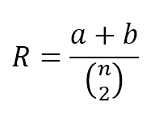

*校正后的随机性*版本是调整后的 rand 指数，其定义如下：

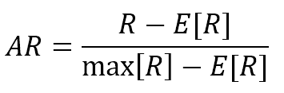

我们可以使用函数 `adjusted_rand_score()` 来计算调整后的 rand 分数：

```py
from sklearn.metrics import adjusted_rand_score

>>> km = KMeans(n_clusters=4)
>>> Yp = km.fit_predict(X)
>>> print(adjusted_rand_score(Y, Yp))
0.831103137285
```

由于调整后的兰德指数介于-1.0 和 1.0 之间，负值表示不良情况（分配高度不相关），0.83 的分数意味着聚类与真实情况非常相似。此外，在这种情况下，可以通过尝试不同的簇数量或聚类策略来优化这个值。

# 参考文献

+   Karteeka Pavan K., Allam Appa Rao, Dattatreya Rao A. V. 和 Sridhar G.R.，*针对 k-means 类型算法的鲁棒种子选择算法*，《International Journal of Computer Science and Information Technology》第 3 卷第 5 期（2011 年 10 月 30 日）

+   Shi J., Malik J., *归一化切割与图像分割*，《IEEE Transactions on Pattern Analysis and Machine Intelligence》，第 22 卷（2000 年 8 月）

+   Von Luxburg U.，*谱聚类教程*，2007

+   Von Luxburg U.，*簇稳定性：概述*，arXiv 1007:1075v1，2010 年 7 月 7 日

# 摘要

在本章中，我们介绍了基于定义（随机或根据某些标准）k 个质心代表簇并优化它们的位置，使得每个簇中每个点到质心的平方距离之和最小的 k-means 算法。由于距离是一个径向函数，k-means 假设簇是凸形的，不能解决形状有深凹处的（如半月形问题）问题。

为了解决这类情况，我们提出了两种替代方案。第一个被称为 DBSCAN，它是一个简单的算法，分析被其他样本包围的点与边界样本之间的差异。这样，它可以很容易地确定高密度区域（成为簇）以及它们之间的低密度空间。对于簇的形状或数量没有假设，因此需要调整其他参数，以便生成正确的簇数量。

谱聚类是一类基于样本之间亲和度度量的算法。它们在由亲和度矩阵的拉普拉斯算子生成的子空间上使用经典方法（如 k-means）。这样，就可以利用许多核函数的力量来确定点之间的亲和度，而简单的距离无法正确分类。这种聚类对于图像分割特别有效，但也可以在其他方法无法正确分离数据集时成为一个好的选择。

在下一章中，我们将讨论另一种称为层次聚类的另一种方法。它允许我们通过分割和合并簇直到达到最终配置来分割数据。
