# 推荐系统简介

想象一个拥有数千篇文章的在线商店。如果你不是注册用户，你可能会看到一些突出显示的主页，但如果你已经购买了一些商品，网站显示你可能购买的产品，而不是随机选择的产品，这将是很有趣的。这就是推荐系统的目的，在本章中，我们将讨论创建此类系统最常见的技术。

基本概念包括用户、项目和评分（或关于产品的隐式反馈，例如购买的事实）。每个模型都必须与已知数据（如在监督场景中）一起工作，以便能够建议最合适的项目或预测尚未评估的所有项目的评分。

我们将讨论两种不同的策略：

+   基于用户或内容

+   协同过滤

第一种方法基于我们对用户或产品的信息，其目标是将新用户与现有的一组同龄人关联起来，以建议其他成员正面评价的所有项目，或者根据其特征对产品进行聚类，并提出与考虑的项目相似的项目子集。第二种方法稍微复杂一些，使用显式评分，其目的是预测每个项目和每个用户的此值。尽管协同过滤需要更多的计算能力，但如今，廉价资源的广泛可用性允许使用此算法处理数百万用户和产品，以提供最准确的实时推荐。该模型还可以每天重新训练或更新。

# 天真的基于用户的系统

在这个第一个场景中，我们假设我们有一组由特征向量表示的用户：

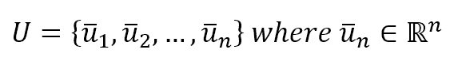

典型的特征包括年龄、性别、兴趣等。所有这些都必须使用前几章中讨论的技术之一进行编码（例如，它们可以被二值化）。此外，我们有一组项目：

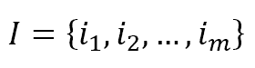

假设也存在一个关系，将每个用户与一组项目（已购买或正面评价）相关联，对于这些项目已执行了明确的行为或反馈：

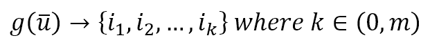

在基于用户的系统中，用户会定期进行聚类（通常使用**k 最近邻**方法），因此，考虑一个通用的用户 *u*（也是新的），我们可以立即确定包含所有与我们样本相似（因此是邻居）的用户球体：

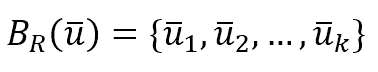

在这一点上，我们可以使用之前介绍的关系创建建议项目的集合：

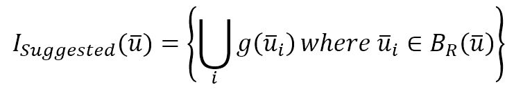

换句话说，这个集合包含所有被邻居积极评价或购买的唯一产品。我之所以使用“天真”这个词，是因为我们将要在专门讨论协同过滤的章节中讨论一个类似的替代方案。

# 基于用户的系统实现与 scikit-learn

对于我们的目的，我们需要创建一个用户和产品的虚拟数据集：

```py
import numpy as np

>>> nb_users = 1000
>>> users = np.zeros(shape=(nb_users, 4))

>>> for i in range(nb_users):
>>>    users[i, 0] = np.random.randint(0, 4)
>>>    users[i, 1] = np.random.randint(0, 2)
>>>    users[i, 2] = np.random.randint(0, 5)
>>>    users[i, 3] = np.random.randint(0, 5)
```

我们假设我们有 1,000 个用户，他们有四个特征，这些特征由介于 0 和 4 或 5 之间的整数表示。它们的具体含义无关紧要；它们的作用是表征用户并允许对集合进行聚类。

对于产品，我们还需要创建关联：

```py
>>> nb_product = 20
>>> user_products = np.random.randint(0, nb_product, size=(nb_users, 5))
```

我们假设我们有 20 个不同的项目（从 1 到 20；0 表示用户没有购买任何东西）和一个关联矩阵，其中每个用户都与 0 到 5（最大值）之间的产品数量相关联。例如：

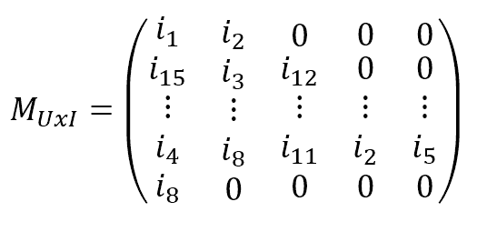

在这一点上，我们需要使用 scikit-learn 提供的`NearestNeighbors`实现来对用户进行聚类：

```py
from sklearn.neighbors import NearestNeighbors

>>> nn = NearestNeighbors(n_neighbors=20, radius=2.0)
>>> nn.fit(users)
NearestNeighbors(algorithm='auto', leaf_size=30, metric='minkowski',
 metric_params=None, n_jobs=1, n_neighbors=20, p=2, radius=2.0)
```

我们选择了 20 个邻居和等于 2 的欧几里得半径。当我们要查询模型以了解包含在以样本为中心且具有固定半径的球体内的项目时，我们会使用这个参数。在我们的案例中，我们将查询模型以获取一个测试用户的全部邻居：

```py
>>> test_user = np.array([2, 0, 3, 2])
>>> d, neighbors = nn.kneighbors(test_user.reshape(1, -1))

>>> print(neighbors)
array([[933,  67, 901, 208,  23, 720, 121, 156, 167,  60, 337, 549,  93,
 563, 326, 944, 163, 436, 174,  22]], dtype=int64)
```

现在我们需要使用关联矩阵来构建推荐列表：

```py
>>> suggested_products = []

>>> for n in neighbors:
>>>    for products in user_products[n]:
>>>       for product in products:
>>>          if product != 0 and product not in suggested_products:
>>>             suggested_products.append(product)

>>> print(suggested_products)
[14, 5, 13, 4, 8, 9, 16, 18, 10, 7, 1, 19, 12, 11, 6, 17, 15, 3, 2]
```

对于每个邻居，我们检索他/她购买的产品并执行并集操作，避免包含值为零的项目（表示没有产品）和重复元素。结果是（未排序）建议列表，对于许多不同的系统，几乎可以实时获得。在某些情况下，当用户或项目数量太多时，可以限制列表为固定数量的元素并减少邻居的数量。这种方法也是天真的，因为它没有考虑用户之间的实际距离（或相似性）来权衡建议。可以考虑将距离作为权重因子，但采用提供更稳健解决方案的协同过滤方法更简单。

# 基于内容的系统

这可能是最简单的方法，它仅基于产品，将其建模为特征向量：

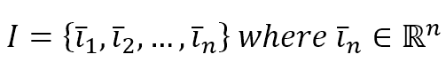

就像用户一样，特征也可以是分类的（实际上，对于产品来说更容易），例如，书籍或电影的类型，并且它们可以在编码后与数值（如价格、长度、正面评价数量等）一起使用。

然后采用聚类策略，尽管最常用的是**k 最近邻**，因为它允许控制每个邻域的大小，从而确定给定一个样本产品，其质量和建议的数量。

使用 scikit-learn，首先我们创建一个虚拟产品数据集：

```py
>>> nb_items = 1000
>>> items = np.zeros(shape=(nb_items, 4))

>>> for i in range(nb_items):
>>>    items[i, 0] = np.random.randint(0, 100)
>>>    items[i, 1] = np.random.randint(0, 100)
>>>    items[i, 2] = np.random.randint(0, 100)
>>>    items[i, 3] = np.random.randint(0, 100)
```

在这种情况下，我们有 1000 个样本，四个整数特征介于 0 和 100 之间。然后我们继续，就像上一个例子一样，将它们进行聚类：

```py
>>> nn = NearestNeighbors(n_neighbors=10, radius=5.0)
>>> nn.fit(items)
```

在这一点上，我们可以使用方法 `radius_neighbors()` 来查询我们的模型，这允许我们仅将研究限制在有限的子集。默认半径（通过参数 `radius` 设置）为 5.0，但我们可以动态地更改它：

```py
>>> test_product = np.array([15, 60, 28, 73])
>>> d, suggestions = nn.radius_neighbors(test_product.reshape(1, -1), radius=20)

>>> print(suggestions)
[array([657, 784, 839, 342, 446, 196], dtype=int64)]

>>> d, suggestions = nn.radius_neighbors(test_product.reshape(1, -1), radius=30)

>>> print(suggestions)
[ array([844, 340, 657, 943, 461, 799, 715, 863, 979, 784, 54, 148, 806,
 465, 585, 710, 839, 695, 342, 881, 864, 446, 196, 73, 663, 580, 216], dtype=int64)]
```

当然，当尝试这些示例时，建议的数量可能不同，因为我们正在使用随机数据集，所以我建议尝试不同的半径值（特别是当使用不同的度量标准时）。

当使用 **k-最近邻** 进行聚类时，考虑用于确定样本之间距离的度量标准非常重要。scikit-learn 的默认值是 Minkowski 距离，它是欧几里得和曼哈顿距离的推广，定义为：

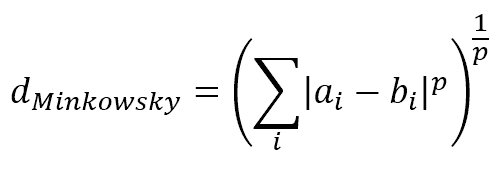

参数 *p* 控制距离的类型，默认值为 2，因此得到的度量是经典的欧几里得距离。SciPy（在 `scipy.spatial.distance` 包中）提供了其他距离，例如 **汉明** 和 **杰卡德** 距离。前者定义为两个向量之间的不一致比例（如果它们是二进制的，则这是不同位的标准化数量）。例如：

```py
from scipy.spatial.distance import hamming

>>> a = np.array([0, 1, 0, 0, 1, 0, 1, 1, 0, 0])
>>> b = np.array([1, 1, 0, 0, 0, 1, 1, 1, 1, 0])
>>> d = hamming(a, b)

>>> print(d)
0.40000000000000002
```

这意味着有 40% 的不一致比例，或者考虑到两个向量都是二进制的，有 4 个不同的位（在 10 位中）。这个度量在需要强调特定特征的呈现/缺失时可能很有用。

杰卡德距离定义为：

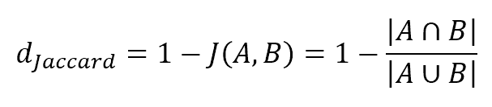

测量两个不同集合（*A* 和 *B*）的项之间的差异特别有用。如果我们的特征向量是二进制的，则可以使用布尔逻辑立即应用此距离。使用之前的测试值，我们得到：

```py
from scipy.spatial.distance import jaccard

>>> d = jaccard(a, b)
>>> print(d)
0.5714285714285714
```

这个度量在 0（相等向量）和 1（完全不同）之间有界。

至于汉明距离，当需要比较由二进制状态（如存在/不存在、是/否等）组成的项时，它非常有用。如果您想为 **k-最近邻** 采用不同的度量标准，可以直接使用 `metric` 参数指定它：

```py
>>> nn = NearestNeighbors(n_neighbors=10, radius=5.0, metric='hamming')
>>> nn.fit(items) >>> nn = NearestNeighbors(n_neighbors=10, radius=5.0, metric='jaccard')
>>> nn.fit(items)
```

# 无模型（或基于记忆）的协同过滤

与基于用户的方法一样，让我们考虑有两个元素集合：用户和物品。然而，在这种情况下，我们不假设它们有显式特征。相反，我们试图根据每个用户（行）对每个物品（列）的偏好来建模用户-物品矩阵。例如：

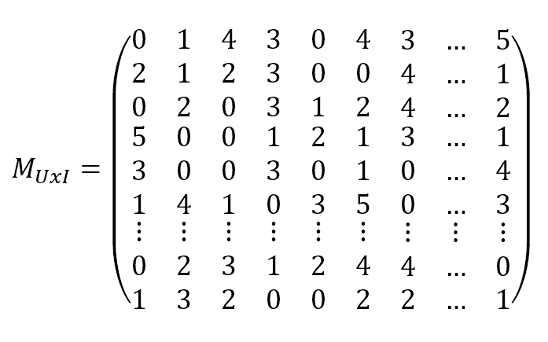

在这种情况下，评分介于 1 到 5 之间（0 表示没有评分），我们的目标是根据用户的评分向量（实际上，这是一种基于特定类型特征的内部表示）对用户进行聚类。这允许在没有任何关于用户的明确信息的情况下产生推荐。然而，它有一个缺点，称为**冷启动**，这意味着当一个新用户没有评分时，无法找到正确的邻域，因为他/她可能属于几乎任何聚类。

一旦完成聚类，很容易检查哪些产品（尚未评分）对特定用户有更高的评分，因此更有可能被购买。可以像之前那样在 scikit-learn 中实现解决方案，但我想要介绍一个名为**Crab**的小型框架（见本节末尾的框），它简化了这一过程。

为了构建模型，我们首先需要将用户-物品矩阵定义为 Python 字典，其结构如下：

```py
{ user_1: { item1: rating, item2: rating, ... }, ..., user_n: ... }
```

用户内部字典中的缺失值表示没有评分。在我们的例子中，我们考虑了 5 个用户和 5 个物品：

```py
from scikits.crab.models import MatrixPreferenceDataModel

>>> user_item_matrix = {
 1: {1: 2, 2: 5, 3: 3},
 2: {1: 5, 4: 2},
 3: {2: 3, 4: 5, 3: 2},
 4: {3: 5, 5: 1},
 5: {1: 3, 2: 3, 4: 1, 5: 3}
 }

>>> model = MatrixPreferenceDataModel(user_item_matrix)
```

一旦定义了用户-物品矩阵，我们需要选择一个度量标准以及因此一个距离函数 *d(u[i], u[j])* 来构建相似度矩阵：

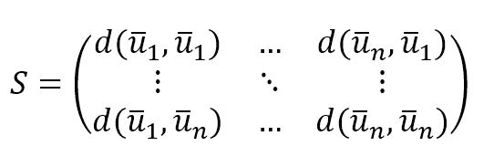

使用 Crab，我们以以下方式（使用欧几里得距离）进行此操作：

```py
from scikits.crab.similarities import UserSimilarity
from scikits.crab.metrics import euclidean_distances

>>> similarity_matrix = UserSimilarity(model, euclidean_distances)
```

有许多度量标准，如皮尔逊或贾卡德，所以我建议访问网站([`muricoca.github.io/crab`](http://muricoca.github.io/crab))以获取更多信息。在此阶段，可以构建基于 k 最近邻聚类方法的推荐系统并对其进行测试：

```py
from scikits.crab.recommenders.knn import UserBasedRecommender

>>> recommender = UserBasedRecommender(model, similarity_matrix, with_preference=True)

>>> print(recommender.recommend(2))
[(2, 3.6180339887498949), (5, 3.0), (3, 2.5527864045000417)]
```

因此，推荐系统为用户 2 建议以下预测评分：

+   **物品 2**：3.6（可以四舍五入到 4.0）

+   **物品 5**：3

+   **物品 3**：2.5（可以四舍五入到 3.0）

在运行代码时，可能会看到一些警告（Crab 仍在开发中）；然而，它们并不影响功能。如果您想避免它们，可以使用`catch_warnings()`上下文管理器：

```py
import warnings

>>> with warnings.catch_warnings():
>>>    warnings.simplefilter("ignore")
>>>    print(recommender.recommend(2))
```

可以建议所有物品，或者限制列表只包含高评分（例如，避免物品 3）。这种方法与基于用户的模型相当相似。然而，它更快（非常大的矩阵可以并行处理）并且它不关心可能导致误导结果的具体细节。只有评分被视为定义用户的有用特征。像基于模型的协同过滤一样，冷启动问题可以通过两种方式解决：

+   要求用户对一些物品进行评分（这种做法通常被采用，因为它很容易展示一些电影/书籍封面，让用户选择他们喜欢和不喜欢的内容）。

+   通过随机分配一些平均评分将用户放置在平均邻域中。在这种方法中，可以立即开始使用推荐系统。然而，在开始时必须接受一定程度的错误，并在产生真实评分时纠正虚拟评分。

Crab 是一个用于构建协同过滤系统的开源框架。它仍在开发中，因此尚未实现所有可能的功能。然而，它非常易于使用，对于许多任务来说非常强大。带有安装说明和文档的主页是：[`muricoca.github.io/crab/index.html`](http://muricoca.github.io/crab/index.html)。Crab 依赖于 scikits.learn，它仍然与 Python 3 有一些问题。因此，我建议在这个例子中使用 Python 2.7。可以使用 pip 安装这两个包：`pip install -U scikits.learn` 和 `pip install -U crab`。

# 基于模型的协同过滤

这是目前最先进的方法之一，是前一个章节中已看到内容的扩展。起点始终是基于评分的用户-项目矩阵：

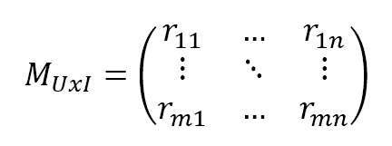

然而，在这种情况下，我们假设用户和项目都存在潜在因素。换句话说，我们定义一个通用的用户为：

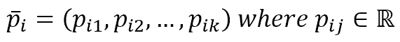

一个通用的项目定义为：

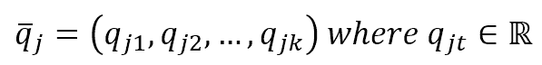

我们不知道每个向量分量的值（因此它们被称为潜在值），但我们假设通过以下方式获得排名：

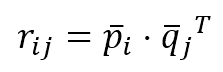

因此，我们可以这样说，排名是从一个包含 *k* 个潜在变量的潜在空间中获得的，其中 *k* 是我们希望在模型中考虑的潜在变量的数量。一般来说，有规则可以确定 *k* 的正确值，因此最佳方法是检查不同的值，并使用已知评分的子集测试模型。然而，仍然有一个大问题需要解决：找到潜在变量。有几种策略，但在讨论它们之前，了解我们问题的维度很重要。如果我们有 1000 个用户和 500 个产品，*M* 有 500,000 个元素。如果我们决定排名等于 10，这意味着我们需要找到 5000000 个变量，这些变量受已知评分的限制。正如你可以想象的那样，这个问题很容易变得无法用标准方法解决，并且必须采用并行解决方案。

# 单值分解策略

第一种方法是基于用户-项目矩阵的**奇异值分解**（**SVD**）。这种技术允许通过低秩分解来转换矩阵，也可以像 Sarwar B.，Karypis G.，Konstan J.，Riedl J.，*Incremental Singular Value Decomposition Algorithms for Highly Scalable Recommender Systems*，2002 年描述的那样以增量方式使用。特别是，如果用户-项目矩阵有*m*行和*n*列：

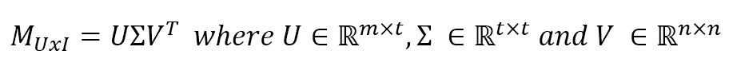

我们假设我们拥有实矩阵（在我们的情况下通常是真的），但一般来说，它们是复数。*U*和*V*是正交的，而 sigma 是对角的。*U*的列包含左奇异向量，转置*V*的行包含右奇异向量，而对角矩阵 Sigma 包含奇异值。选择*k*个潜在因子意味着取前*k*个奇异值，因此，相应的*k*个左和右奇异向量：

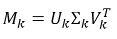

这种技术具有最小化*M*和*M[k]*之间 Frobenius 范数差异的优点，对于任何*k*的值，因此，它是逼近完整分解的最佳选择。在进入预测阶段之前，让我们使用 SciPy 创建一个示例。首先要做的是创建一个虚拟的用户-项目矩阵：

```py
>>> M = np.random.randint(0, 6, size=(20, 10))

>>> print(M)
array([[0, 4, 5, 0, 1, 4, 3, 3, 1, 3],
 [1, 4, 2, 5, 3, 3, 3, 4, 3, 1],
 [1, 1, 2, 2, 1, 5, 1, 4, 2, 5],
 [0, 4, 1, 2, 2, 5, 1, 1, 5, 5],
 [2, 5, 3, 1, 1, 2, 2, 4, 1, 1],
 [1, 4, 3, 3, 0, 0, 2, 3, 3, 5],
 [3, 5, 2, 1, 5, 3, 4, 1, 0, 2],
 [5, 2, 2, 0, 1, 0, 4, 4, 1, 0],
 [0, 2, 4, 1, 3, 1, 3, 0, 5, 4],
 [2, 5, 1, 5, 3, 0, 1, 4, 5, 2],
 [1, 0, 0, 5, 1, 3, 2, 0, 3, 5],
 [5, 3, 1, 5, 0, 0, 4, 2, 2, 2],
 [5, 3, 2, 4, 2, 0, 4, 4, 0, 3],
 [3, 2, 5, 1, 1, 2, 1, 1, 3, 0],
 [1, 5, 5, 2, 5, 2, 4, 5, 1, 4],
 [4, 0, 2, 2, 1, 0, 4, 4, 3, 3],
 [4, 2, 2, 3, 3, 4, 5, 3, 5, 1],
 [5, 0, 5, 3, 0, 0, 3, 5, 2, 2],
 [1, 3, 2, 2, 3, 0, 5, 4, 1, 0],
 [1, 3, 1, 4, 1, 5, 4, 4, 2, 1]])
```

我们假设有 20 个用户和 10 个产品。评分介于 1 到 5 之间，0 表示没有评分。现在我们可以分解*M*：

```py
from scipy.linalg import svd

import numpy as np

>>> U, s, V = svd(M, full_matrices=True)
>>> S = np.diag(s)

>>> print(U.shape)
(20L, 20L)

>>> print(S.shape)
(10L, 10L)

>>> print(V.shape)
(10L, 10L)
```

现在让我们只考虑前八个奇异值，这将使用户和项目都有八个潜在因子：

```py
>>> Uk = U[:, 0:8]
>>> Sk = S[0:8, 0:8]
>>> Vk = V[0:8, :]
```

请记住，在 SciPy 的 SVD 实现中，*V*已经转置。根据 Sarwar B.，Karypis G.，Konstan J.，Riedl J.，*Incremental Singular Value Decomposition Algorithms for Highly Scalable Recommender Systems*，2002 年的描述，我们可以很容易地通过考虑客户和产品之间的余弦相似度（与点积成正比）来进行预测。两个潜在因子矩阵是：

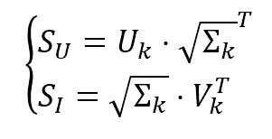

为了考虑到精度的损失，考虑每个用户的平均评分（这对应于用户-项目矩阵的行平均值）也是很有用的，这样用户*i*和项目*j*的结果评分预测就变为：

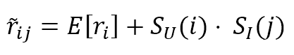

这里*SU*和*SI*分别是用户和产品向量。继续我们的例子，让我们确定用户 5 和项目 2 的评分预测：

```py
>>> Su = Uk.dot(np.sqrt(Sk).T)
>>> Si = np.sqrt(Sk).dot(Vk).T
>>> Er = np.mean(M, axis=1)

>>> r5_2 = Er[5] + Su[5].dot(Si[2])
>>> print(r5_2)
2.38848720112
```

此方法具有中等复杂度。特别是，SVD 是*O(m³)*，当添加新用户或项目时，必须采用增量策略（如 Sarwar B.、Karypis G.、Konstan J.、Riedl J.在 2002 年发表的*高度可扩展推荐系统增量奇异值分解算法*中所述）；然而，当元素数量不是太多时，它可能非常有效。在所有其他情况下，可以采用下一个策略（与并行架构一起）。

# 交替最小二乘策略

通过定义以下损失函数，可以轻松地将寻找潜在因子的难题表达为一个最小二乘优化问题：

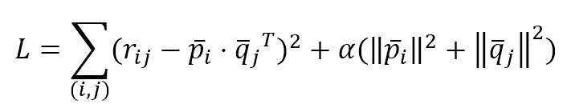

L 仅限于已知样本（用户、项目）。第二个项作为一个正则化因子，整个问题可以很容易地通过任何优化方法解决。然而，还有一个额外的问题：我们有两组不同的变量需要确定（用户和项目因子）。我们可以通过一种称为**交替最小二乘**的方法来解决此问题，该方法由 Koren Y.、Bell R.、Volinsky C.在 2009 年 8 月的 IEEE 计算机杂志上发表的*推荐系统矩阵分解技术*中描述。该算法非常容易描述，可以总结为两个主要的迭代步骤：

+   *p[i]*是固定的，*q[j]*是优化的

+   *q*[*j*]是固定的，*p[i]*是优化的

当达到预定义的精度时，算法停止。它可以很容易地通过并行策略实现，以便在短时间内处理大量矩阵。此外，考虑到虚拟集群的成本，还可以定期重新训练模型，以立即（在可接受的延迟内）包含新产品和用户。

# 使用 Apache Spark MLlib 的交替最小二乘

Apache Spark 超出了本书的范围，因此如果您想了解更多关于这个强大框架的信息，我建议您阅读在线文档或许多可用的书籍。在 Pentreath N.的*Spark 机器学习*（Packt）中，有一个关于库 MLlib 和如何实现本书中讨论的大多数算法的有趣介绍。

Spark 是一个并行计算引擎，现在是 Hadoop 项目的一部分（即使它不使用其代码），可以在本地模式或非常大的集群（具有数千个节点）上运行，以使用大量数据执行复杂任务。它主要基于 Scala，尽管有 Java、Python 和 R 的接口。在这个例子中，我们将使用 PySpark，这是运行 Spark 的 Python 代码的内置 shell。

在本地模式下启动 PySpark 后，我们得到一个标准的 Python 提示符，我们可以开始工作，就像在任何其他标准 Python 环境中一样：

```py
# Linux
>>> ./pyspark

# Mac OS X
>>> pyspark

# Windows
>>> pyspark

Python 2.7.12 |Anaconda 4.0.0 (64-bit)| (default, Jun 29 2016, 11:07:13) [MSC v.1500 64 bit (AMD64)] on win32
Type "help", "copyright", "credits" or "license" for more information.
Anaconda is brought to you by Continuum Analytics.
Please check out: http://continuum.io/thanks and https://anaconda.org
Using Spark's default log4j profile: org/apache/spark/log4j-defaults.properties
Setting default log level to "WARN".
To adjust logging level use sc.setLogLevewl(newLevel).
Welcome to
 ____ __
 / __/__ ___ _____/ /__
 _\ \/ _ \/ _ `/ __/ '_/
 /__ / .__/\_,_/_/ /_/\_\ version 2.0.2
 /_/

Using Python version 2.7.12 (default, Jun 29 2016 11:07:13)
SparkSession available as 'spark'.
>>>
```

Spark MLlib 通过一个非常简单的机制实现了 ALS 算法。`Rating`类是元组（user, product, rating）的包装器，因此我们可以轻松地定义一个虚拟数据集（这只能被视为一个示例，因为它非常有限）：

```py
from pyspark.mllib.recommendation import Rating

import numpy as np

>>> nb_users = 200
>>> nb_products = 100

>>> ratings = []

>>> for _ in range(10):
>>>    for i in range(nb_users):
>>>        rating = Rating(user=i, 
>>>                        product=np.random.randint(1, nb_products), 
>>>                        rating=np.random.randint(0, 5))
>>>        ratings.append(rating)

>>> ratings = sc.parallelize(ratings)
```

我们假设有 200 个用户和 100 个产品，并且通过迭代 10 次主循环，为随机产品分配评分来填充评分列表。我们没有控制重复或其他不常见的情况。最后的命令`sc.parallelize()`是一种请求 Spark 将我们的列表转换为称为**弹性分布式数据集**（**RDD**）的结构的方法，它将被用于剩余的操作。这些结构的大小实际上没有限制，因为它们分布在不同的执行器上（如果是在集群模式下），并且可以像处理千字节数据集一样处理 PB 级的数据集。

在这个阶段，我们可以训练一个`ALS`模型（形式上是`MatrixFactorizationModel`），并使用它来进行一些预测：

```py
from pyspark.mllib.recommendation import ALS 
>>> model = ALS.train(ratings, rank=5, iterations=10)
```

我们想要 5 个潜在因素和 10 次优化迭代。正如之前讨论的那样，确定每个模型的正确秩并不容易，因此，在训练阶段之后，应该始终有一个使用已知数据的验证阶段。均方误差是一个很好的指标，可以用来了解模型的工作情况。我们可以使用相同的训练数据集来完成这项工作。首先要做的是移除评分（因为我们只需要由用户和产品组成的元组）：

```py
>>> test = ratings.map(lambda rating: (rating.user, rating.product))
```

如果您不熟悉 MapReduce 范式，您只需要知道`map()`会对所有元素应用相同的函数（在这种情况下，是一个 lambda 函数）。现在我们可以大量预测评分：

```py
>>> predictions = model.predictAll(test)
```

然而，为了计算误差，我们还需要添加用户和产品，以便可以进行比较：

```py
>>> full_predictions = predictions.map(lambda pred: ((pred.user, pred.product), pred.rating))
```

结果是一系列具有结构`((user, item), rating)`的行，就像一个标准的字典条目`(key, value)`。这很有用，因为使用 Spark，我们可以通过它们的键来连接两个 RDD。我们也对原始数据集做了同样的事情，然后通过连接训练值和预测值来继续操作：

```py
>>> split_ratings = ratings.map(lambda rating: ((rating.user, rating.product), rating.rating))
>>> joined_predictions = split_ratings.join(full_predictions)
```

现在对于每个键 `(user, product)`，我们有两个值：目标和预测。因此，我们可以计算均方误差：

```py
>>> mse = joined_predictions.map(lambda x: (x[1][0] - x[1][1]) ** 2).mean()
```

第一个`map`操作将每一行转换为目标和预测之间的平方差，而`mean()`函数计算平均值。在这个时候，让我们检查我们的误差并生成一个预测：

```py
>>> print('MSE: %.3f' % mse)
MSE: 0.580

>>> prediction = model.predict(10, 20)
>>> print('Prediction: %3.f' % prediction)
Prediction: 2.810
```

因此，我们的误差相当低，但可以通过改变秩或迭代次数来提高。用户 10 对产品 20 的评分预测约为 2.8（可以四舍五入到 3）。如果您运行代码，这些值可能会有所不同，因为我们正在使用随机的用户-项目矩阵。此外，如果您不想使用 shell 直接运行代码，您需要在文件开头显式声明一个`SparkContext`：

```py
from pyspark import SparkContext, SparkConf

>>> conf = SparkConf().setAppName('ALS').setMaster('local[*]')
>>> sc = SparkContext(conf=conf)
```

我们通过`SparkConf`类创建了一个配置，并指定了应用程序名称和主节点（在本地模式下，使用所有可用核心）。这足以运行我们的代码。然而，如果您需要更多信息，请访问章节末尾信息框中提到的页面。要运行应用程序（自 Spark 2.0 起），您必须执行以下命令：

```py
# Linux, Mac OSx
./spark-submit als_spark.py

# Windows
spark-submit als_spark.py
```

当使用`spark-submit`运行脚本时，您将看到数百行日志，这些日志会通知您正在执行的所有操作。其中，在计算结束时，您还会看到打印函数消息（`stdout`）。

当然，这只是一个 Spark ALS 的介绍，但我希望它有助于理解这个过程有多简单，同时如何有效地解决维度限制问题。

如果您不知道如何设置环境和启动 PySpark，我建议阅读在线快速入门指南（[`spark.apache.org/docs/2.1.0/quick-start.html`](https://spark.apache.org/docs/2.1.0/quick-start.html)），即使您不了解所有细节和配置参数，它也可能很有用。

# 参考文献

+   Sarwar B.，Karypis G.，Konstan J.，Riedl J.，*高度可扩展推荐系统的增量奇异值分解算法，2002*

+   Koren Y.，Bell R.，Volinsky C.，*推荐系统的矩阵分解技术，IEEE 计算机杂志，2009 年 8 月*

+   Pentreath N.，*使用 Spark 进行机器学习*，Packt

# 摘要

在本章中，我们讨论了构建推荐系统的主要技术。在基于用户的场景中，我们假设我们拥有足够关于用户的信息来对他们进行聚类，并且我们隐含地假设相似的用户会喜欢相同的产品。这样，就可以立即确定每个新用户所在的邻域，并建议其同龄人给予正面评价的产品。以类似的方式，基于内容的场景是基于根据产品的独特特征对产品进行聚类。在这种情况下，假设较弱，因为更有可能的是，购买过某个商品或给予正面评价的用户会对类似产品做同样的事情。

然后我们介绍了协同过滤，这是一种基于显式评分的技术，用于预测所有用户和产品的所有缺失值。在基于记忆的变体中，我们不训练模型，而是直接与用户-产品矩阵一起工作，寻找测试用户的 k 个最近邻，并通过平均计算排名。这种方法与基于用户的场景非常相似，并且具有相同的局限性；特别是，管理大型矩阵非常困难。另一方面，基于模型的方法更复杂，但在训练模型后，它可以实时预测评分。此外，还有像 Spark 这样的并行框架，可以使用廉价的集群服务器处理大量数据。

在下一章中，我们将介绍一些自然语言处理技术，这些技术在自动分类文本或与机器翻译系统协同工作时非常重要。
