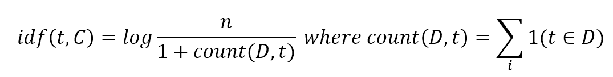
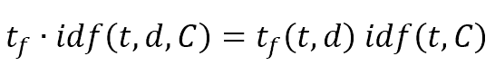

# 第十二章：自然语言处理简介

自然语言处理是一组机器学习技术，允许处理文本文档，考虑其内部结构和单词的分布。在本章中，我们将讨论收集文本、将它们拆分为原子并转换为数值向量的所有常用方法。特别是，我们将比较不同的方法来分词文档（分离每个单词）、过滤它们、应用特殊转换以避免屈折或动词变位形式，并最终构建一个共同词汇。使用词汇，将能够应用不同的向量化方法来构建特征向量，这些向量可以轻松用于分类或聚类目的。为了展示如何实现整个管道，在本章末尾，我们将设置一个简单的新闻行分类器。

# NLTK 和内置语料库

**自然语言工具包**（**NLTK**）是一个非常强大的 Python 框架，实现了大多数 NLP 算法，并将与 scikit-learn 一起在本章中使用。此外，NLTK 提供了一些内置的语料库，可用于测试算法。在开始使用 NLTK 之前，通常需要使用特定的图形界面下载所有附加元素（语料库、词典等）。这可以通过以下方式完成：

```py
import nltk

>>> nltk.download()
```

此命令将启动用户界面，如图所示：


可以选择每个单独的特征或下载所有元素（如果您有足够的空闲空间，我建议选择此选项）以立即利用所有 NLTK 功能。

NLTK 可以使用 pip（`pip install -U nltk`）或通过[`www.nltk.org`](http://www.nltk.org)上可用的二进制分发安装。在同一网站上，有完整的文档，对于深入了解每个主题非常有用。

# 语料库示例

格鲁吉亚项目的一个子集被提供，并且可以通过这种方式免费访问：

```py
from nltk.corpus import gutenberg

>>> print(gutenberg.fileids())
[u'austen-emma.txt', u'austen-persuasion.txt', u'austen-sense.txt', u'bible-kjv.txt', u'blake-poems.txt', u'bryant-stories.txt', u'burgess-busterbrown.txt', u'carroll-alice.txt', u'chesterton-ball.txt', u'chesterton-brown.txt', u'chesterton-thursday.txt', u'edgeworth-parents.txt', u'melville-moby_dick.txt', u'milton-paradise.txt', u'shakespeare-caesar.txt', u'shakespeare-hamlet.txt', u'shakespeare-macbeth.txt', u'whitman-leaves.txt']
```

单个文档可以以原始版本访问或拆分为句子或单词：

```py
>>> print(gutenberg.raw('milton-paradise.txt'))
[Paradise Lost by John Milton 1667] 

Book I 

Of Man's first disobedience, and the fruit 
Of that forbidden tree whose mortal taste 
Brought death into the World, and all our woe, 
With loss of Eden, till one greater Man 
Restore us, and regain the blissful seat, 
Sing, Heavenly Muse, that, on the secret top...

>>> print(gutenberg.sents('milton-paradise.txt')[0:2])
[[u'[', u'Paradise', u'Lost', u'by', u'John', u'Milton', u'1667', u']'], [u'Book', u'I']]

>>> print(gutenberg.words('milton-paradise.txt')[0:20])
[u'[', u'Paradise', u'Lost', u'by', u'John', u'Milton', u'1667', u']', u'Book', u'I', u'Of', u'Man', u"'", u's', u'first', u'disobedience', u',', u'and', u'the', u'fruit']
```

正如我们将要讨论的，在许多情况下，拥有原始文本以便使用自定义策略将其拆分为单词是有用的。在许多其他情况下，直接访问句子允许使用原始的结构性细分。其他语料库包括网络文本、路透社新闻行、布朗语料库以及许多更多。例如，布朗语料库是一个按体裁划分的著名文档集合：

```py
from nltk.corpus import brown

>>> print(brown.categories())
[u'adventure', u'belles_lettres', u'editorial', u'fiction', u'government', u'hobbies', u'humor', u'learned', u'lore', u'mystery', u'news', u'religion', u'reviews', u'romance', u'science_fiction']

>>> print(brown.sents(categories='editorial')[0:100])
[[u'Assembly', u'session', u'brought', u'much', u'good'], [u'The', u'General', u'Assembly', u',', u'which', u'adjourns', u'today', u',', u'has', u'performed', u'in', u'an', u'atmosphere', u'of', u'crisis', u'and', u'struggle', u'from', u'the', u'day', u'it', u'convened', u'.'], ...]
```

关于语料库的更多信息可以在[`www.nltk.org/book/ch02.html`](http://www.nltk.org/book/ch02.html)找到。

# 词袋策略

在 NLP 中，一个非常常见的管道可以细分为以下步骤：

1.  将文档收集到语料库中。

1.  分词、去除停用词（冠词、介词等）和词干提取（还原到词根形式）。

1.  构建共同词汇。

1.  向量化文档。

1.  对文档进行分类或聚类。

该管道被称为**词袋模型**，将在本章中讨论。一个基本假设是句子中每个单词的顺序并不重要。实际上，当我们定义特征向量时，我们将要看到，所采取的措施总是与频率相关，因此它们对所有元素的局部位置不敏感。从某些观点来看，这是一个限制，因为在自然语言中，句子的内部顺序对于保留意义是必要的；然而，有许多模型可以在不涉及局部排序的复杂性的情况下有效地处理文本。当绝对有必要考虑小序列时，将通过采用标记组（称为 n-gram）来实现，但在向量化步骤中将它们视为单个原子元素。

在以下图例中，有一个该过程的示意图（不包括第五步）对于一个示例文档（句子）：


执行每个步骤有许多不同的方法，其中一些是上下文特定的。然而，目标始终相同：通过移除过于频繁或来自同一词根（如动词）的术语来最大化文档的信息量并减少常用词汇表的大小。实际上，文档的信息含量是由在语料库中频率有限的特定术语（或术语组）的存在决定的。在前面图例中显示的例子中，**狐狸**和**狗**是重要术语，而**the**则无用（通常称为**停用词**）。此外，**跳跃**可以转换为标准形式**跳**，当以不同形式出现时（如跳跃或跳过），它表达了一个特定的动作。最后一步是将其转换为数值向量，因为我们的算法处理的是数字，因此限制向量的长度对于提高学习速度和内存消耗非常重要。在接下来的章节中，我们将详细讨论每个步骤，并在最后构建一个用于新闻分类的示例分类器。

# 标记化

处理文本或语料库的第一步是将它们拆分成原子（句子、单词或单词的一部分），通常定义为**标记**。这个过程相当简单；然而，针对特定问题可能会有不同的策略。

# 句子标记化

在许多情况下，将大文本拆分成句子是有用的，这些句子通常由句号或其他等效标记分隔。由于每种语言都有自己的正字法规则，NLTK 提供了一个名为`sent_tokenize()`的方法，它接受一种语言（默认为英语）并根据特定规则拆分文本。在以下示例中，我们展示了该函数在不同语言中的使用：

```py
from nltk.tokenize import sent_tokenize

>>> generic_text = 'Lorem ipsum dolor sit amet, amet minim temporibus in sit. Vel ne impedit consequat intellegebat.'

>>> print(sent_tokenize(generic_text))
['Lorem ipsum dolor sit amet, amet minim temporibus in sit.',
 'Vel ne impedit consequat intellegebat.']

>>> english_text = 'Where is the closest train station? I need to reach London'

>>> print(sent_tokenize(english_text, language='english'))
['Where is the closest train station?', 'I need to reach London']

>>> spanish_text = u'¿Dónde está la estación más cercana? Inmediatamente me tengo que ir a Barcelona.'

>>> for sentence in sent_tokenize(spanish_text, language='spanish'):
>>>    print(sentence)
¿Dónde está la estación más cercana?
Inmediatamente me tengo que ir a Barcelona.
```

# 单词标记化

将句子拆分成单词的最简单方法是类`TreebankWordTokenizer`提供的，然而，它也有一些局限性：

```py
from nltk.tokenize import TreebankWordTokenizer

>>> simple_text = 'This is a simple text.'

>>> tbwt = TreebankWordTokenizer()

>>> print(tbwt.tokenize(simple_text))
['This', 'is', 'a', 'simple', 'text', '.']

>>> complex_text = 'This isn\'t a simple text'

>>> print(tbwt.tokenize(complex_text))
['This', 'is', "n't", 'a', 'simple', 'text']

```

如您所见，在第一种情况下，句子已经被正确地拆分成单词，同时保持了标点符号的分离（这不是一个真正的问题，因为可以在第二步中将其删除）。然而，在复杂示例中，缩写词`isn't`被拆分为`is`和`n't`。不幸的是，没有进一步的加工步骤，将带有缩写词的标记转换为正常形式（如`not`）并不那么容易，因此，必须采用另一种策略。通过类`RegexpTokenizer`提供了一种灵活的方式来根据正则表达式拆分单词，这是解决单独标点问题的一个好方法：

```py
from nltk.tokenize import RegexpTokenizer

>>> complex_text = 'This isn\'t a simple text.'

>>> ret = RegexpTokenizer('[a-zA-Z0-9\'\.]+')
>>> print(ret.tokenize(complex_text))
['This', "isn't", 'a', 'simple', 'text.']
```

大多数常见问题都可以很容易地使用这个类来解决，所以我建议你学习如何编写可以匹配特定模式的简单正则表达式。例如，我们可以从句子中移除所有数字、逗号和其他标点符号：

```py
>>> complex_text = 'This isn\'t a simple text. Count 1, 2, 3 and then go!'

>>> ret = RegexpTokenizer('[a-zA-Z\']+')
>>> print(ret.tokenize(complex_text))
['This', "isn't", 'a', 'simple', 'text', 'Count', 'and', 'the', 'go']
```

即使 NLTK 提供了其他类，它们也总是可以通过自定义的`RegexpTokenizer`来实现，这个类足够强大，可以解决几乎每一个特定问题；因此，我更喜欢不深入这个讨论。

# 停用词移除

停用词是正常言语的一部分（如冠词、连词等），但它们的出现频率非常高，并且不提供任何有用的语义信息。因此，过滤句子和语料库时移除它们是一个好的做法。NLTK 提供了最常见语言的停用词列表，并且其使用是直接的：

```py
from nltk.corpus import stopwords

>>> sw = set(stopwords.words('english'))
```

下面的代码片段显示了英语停用词的一个子集：

```py
>>> print(sw)
{u'a',
 u'about',
 u'above',
 u'after',
 u'again',
 u'against',
 u'ain',
 u'all',
 u'am',
 u'an',
 u'and',
 u'any',
 u'are',
 u'aren',
 u'as',
 u'at',
 u'be', ...
```

要过滤一个句子，可以采用一种功能性的方法：

```py
>>> complex_text = 'This isn\'t a simple text. Count 1, 2, 3 and then go!'

>>> ret = RegexpTokenizer('[a-zA-Z\']+')
>>> tokens = ret.tokenize(complex_text)
>>> clean_tokens = [t for t in tokens if t not in sw]
>>> print(clean_tokens)
['This', "isn't", 'simple', 'text', 'Count', 'go']
```

# 语言检测

停用词，像其他重要特征一样，与特定语言密切相关，因此在进行任何其他步骤之前，通常有必要检测语言。由`langdetect`库提供的一个简单、免费且可靠的解决方案，该库已从谷歌的语言检测系统移植过来。其使用是直接的：

```py
from langdetect import detect

>>> print(detect('This is English'))
en

>>> print(detect('Dies ist Deutsch'))
de
```

该函数返回 ISO 639-1 代码（[`en.wikipedia.org/wiki/List_of_ISO_639-1_codes`](https://en.wikipedia.org/wiki/List_of_ISO_639-1_codes)），这些代码可以用作字典中的键来获取完整的语言名称。当文本更复杂时，检测可能更困难，了解是否存在任何歧义是有用的。可以通过`detect_langs()`方法获取预期语言的概率：

```py
from langdetect import detect_langs

>>> print(detect_langs('I really love you mon doux amour!'))
[fr:0.714281321163, en:0.285716747181]
```

可以使用 pip 安装 langdetect（`pip install --upgrade langdetect`）。更多信息可在[`pypi.python.org/pypi/langdetect`](https://pypi.python.org/pypi/langdetect)找到。

# 词干提取

词干提取是一个将特定单词（如动词或复数形式）转换为它们的根形式的过程，以便在不增加唯一标记数量的情况下保留语义。例如，如果我们考虑三个表达式“我跑”、“他跑”和“跑步”，它们可以被简化为一个有用的（尽管语法上不正确）形式：“我跑”、“他跑”、“跑”。这样，我们就有一个定义相同概念（“跑”）的单个标记，在聚类或分类目的上，可以无任何精度损失地使用。NLTK 提供了许多词干提取器的实现。最常见（且灵活）的是基于多语言算法的`SnowballStemmer`：

```py
from nltk.stem.snowball import SnowballStemmer

>>> ess = SnowballStemmer('english', ignore_stopwords=True)
>>> print(ess.stem('flies'))
fli

>>> fss = SnowballStemmer('french', ignore_stopwords=True)
>>> print(fss.stem('courais'))
cour
```

`ignore_stopwords`参数通知词干提取器不要处理停用词。其他实现包括`PorterStemmer`和`LancasterStemmer`。结果通常相同，但在某些情况下，词干提取器可以实施更选择性的规则。例如：

```py
from nltk.stem.snowball import PorterStemmer
from nltk.stem.lancaster import LancasterStemmer

>>> print(ess.stem('teeth'))
teeth

>>> ps = PorterStemmer()
>>> print(ps.stem('teeth'))
teeth

>>> ls = LancasterStemmer()
>>> print(ls.stem('teeth'))
tee
```

如您所见，Snowball 和 Porter 算法保持单词不变，而 Lancaster 算法提取一个根（这在语义上是无意义的）。另一方面，后者算法实现了许多特定的英语规则，这实际上可以减少唯一标记的数量：

```py
>>> print(ps.stem('teen'))
teen

>>> print(ps.stem('teenager'))
teenag

>>> print(ls.stem('teen'))
teen

>>> print(ls.stem('teenager'))
teen
```

不幸的是，Porter 和 Lancaster 词干提取器在 NLTK 中仅适用于英语；因此，默认选择通常是 Snowball，它在许多语言中都可用，并且可以与适当的停用词集一起使用。

# 向量化

这是词袋模型管道的最后一步，它是将文本标记转换为数值向量的必要步骤。最常见的技术是基于计数或频率计算，它们都在 scikit-learn 中可用，以稀疏矩阵表示（考虑到许多标记只出现几次而向量必须有相同的长度，这是一个可以节省大量空间的选择）。

# 计数向量化

该算法非常简单，它基于考虑一个标记在文档中出现的次数来表示一个标记。当然，整个语料库必须被处理，以确定有多少唯一的标记及其频率。让我们看看`CountVectorizer`类在简单语料库上的一个例子：

```py
from sklearn.feature_extraction.text import CountVectorizer

>>> corpus = [
 'This is a simple test corpus',
 'A corpus is a set of text documents',
 'We want to analyze the corpus and the documents',
 'Documents can be automatically tokenized'
]

>>> cv = CountVectorizer()
>>> vectorized_corpus = cv.fit_transform(corpus)
>>> print(vectorized_corpus.todense())
[[0 0 0 0 0 1 0 1 0 0 1 1 0 0 1 0 0 0 0]
 [0 0 0 0 0 1 1 1 1 1 0 0 1 0 0 0 0 0 0]
 [1 1 0 0 0 1 1 0 0 0 0 0 0 2 0 1 0 1 1]
 [0 0 1 1 1 0 1 0 0 0 0 0 0 0 0 0 1 0 0]]
```

如您所见，每个文档都已转换为固定长度的向量，其中 0 表示相应的标记不存在，而正数表示出现的次数。如果我们需要排除所有文档频率低于预定义值的标记，我们可以通过参数`min_df`（默认值为 1）来设置它。有时避免非常常见的术语可能是有用的；然而，下一个策略将以更可靠和完整的方式解决这个问题。

词汇表可以通过实例变量`vocabulary_`访问：

```py
>>> print(cv.vocabulary_)
{u'and': 1, u'be': 3, u'we': 18, u'set': 9, u'simple': 10, u'text': 12, u'is': 7, u'tokenized': 16, u'want': 17, u'the': 13, u'documents': 6, u'this': 14, u'of': 8, u'to': 15, u'can': 4, u'test': 11, u'corpus': 5, u'analyze': 0, u'automatically': 2}
```

给定一个通用向量，可以通过逆变换检索相应的标记列表：

```py
>>> vector = [0, 0, 0, 0, 0, 1, 0, 1, 0, 0, 1, 1, 0, 0, 1, 0, 0, 1, 1]
>>> print(cv.inverse_transform(vector))
[array([u'corpus', u'is', u'simple', u'test', u'this', u'want', u'we'], 
 dtype='<U13')]
```

这两种方法都可以使用外部分词器（通过参数 `tokenizer`），可以通过前几节中讨论的技术进行自定义：

```py
>>> ret = RegexpTokenizer('[a-zA-Z0-9\']+')
>>> sw = set(stopwords.words('english'))
>>> ess = SnowballStemmer('english', ignore_stopwords=True)

>>> def tokenizer(sentence):
>>>    tokens = ret.tokenize(sentence)
>>>    return [ess.stem(t) for t in tokens if t not in sw]

>>> cv = CountVectorizer(tokenizer=tokenizer)
>>> vectorized_corpus = cv.fit_transform(corpus)
>>> print(vectorized_corpus.todense())
[[0 0 1 0 0 1 1 0 0 0]
 [0 0 1 1 1 0 0 1 0 0]
 [1 0 1 1 0 0 0 0 0 1]
 [0 1 0 1 0 0 0 0 1 0]]
```

使用我们的分词器（使用停用词和词干提取），词汇表更短，向量也更短。

# N-grams

到目前为止，我们只考虑了单个标记（也称为单语素），但在许多情况下，考虑单词的短序列（双词组或三词组）作为我们的分类器的原子是有用的，就像所有其他标记一样。例如，如果我们正在分析某些文本的情感，考虑双词组如 `pretty good`、`very bad` 等可能是个好主意。从语义角度来看，实际上，考虑不仅仅是副词，而是整个复合形式很重要。我们可以向向量器告知我们想要考虑的 n-grams 范围。例如，如果我们需要单语素和双语素，我们可以使用以下代码片段：

```py
>>> cv = CountVectorizer(tokenizer=tokenizer, ngram_range=(1, 2))
>>> vectorized_corpus = cv.fit_transform(corpus)
>>> print(vectorized_corpus.todense())
[[0 0 0 0 0 1 0 1 0 0 1 1 0 0 1 0 0 0 0]
 [0 0 0 0 0 1 1 1 1 1 0 0 1 0 0 0 0 0 0]
 [1 1 0 0 0 1 1 0 0 0 0 0 0 2 0 1 0 1 1]
 [0 0 1 1 1 0 1 0 0 0 0 0 0 0 0 0 1 0 0]]

>>> print(cv.vocabulary_)
{u'and': 1, u'be': 3, u'we': 18, u'set': 9, u'simple': 10, u'text': 12, u'is': 7, u'tokenized': 16, u'want': 17, u'the': 13, u'documents': 6, u'this': 14, u'of': 8, u'to': 15, u'can': 4, u'test': 11, u'corpus': 5, u'analyze': 0, u'automatically': 2}
```

如您所见，词汇表现在包含了双词组，并且向量包括了它们的相对频率。

# Tf-idf 向量化

计数向量化的最常见限制是，算法在考虑每个标记的频率时没有考虑整个语料库。向量化的目标通常是准备数据供分类器使用；因此，避免非常常见的特征是必要的，因为当全局出现次数增加时，它们的信息量会减少。例如，在一个关于体育的语料库中，单词 `match` 可能会在大量文档中出现；因此，它几乎作为一个分类特征是无用的。为了解决这个问题，我们需要不同的方法。如果我们有一个包含 `n` 个文档的语料库 `C`，我们定义**词频**，即一个标记在文档中出现的次数，如下所示：


我们定义**逆文档频率**，如下所示：



换句话说，`idf(t,C)` 衡量每个单个术语提供的信息量。实际上，如果 `count(D,t) = n`，这意味着一个标记总是存在，且 `idf(t, C)` 接近 0，反之亦然。分母中的术语 1 是一个校正因子，它避免了当 `(D,t) = n` 时的 null idf。因此，我们不仅考虑术语频率，还通过定义一个新的度量来权衡每个标记： 



scikit-learn 提供了 `TfIdfVectorizer` 类，我们可以将其应用于前一段中使用的相同玩具语料库：

```py
>>> from sklearn.feature_extraction.text import TfidfVectorizer

>>> tfidfv = TfidfVectorizer()
>>> vectorized_corpus = tfidfv.fit_transform(corpus)
>>> print(vectorized_corpus.todense())
[[ 0\.          0\.          0\.          0\.          0\.          0.31799276
 0\.          0.39278432  0\.          0\.          0.49819711  0.49819711
 0\.          0\.          0.49819711  0\.          0\.          0\.          0\.        ]
 [ 0\.          0\.          0\.          0\.          0\.          0.30304005
 0.30304005  0.37431475  0.4747708   0.4747708   0\.          0.
 0.4747708   0\.          0\.          0\.          0\.          0\.          0\.        ]
 [ 0.31919701  0.31919701  0\.          0\.          0\.          0.20373932
 0.20373932  0\.          0\.          0\.          0\.          0\.          0.
 0.63839402  0\.          0.31919701  0\.          0.31919701  0.31919701]
 [ 0\.          0\.          0.47633035  0.47633035  0.47633035  0.
 0.30403549  0\.          0\.          0\.          0\.          0\.          0.
 0\.          0\.          0\.          0.47633035  0\.          0\.        ]]
```

现在我们检查词汇表，以便与简单的计数向量化进行比较：

```py
>>> print(tfidfv.vocabulary_)
{u'and': 1, u'be': 3, u'we': 18, u'set': 9, u'simple': 10, u'text': 12, u'is': 7, u'tokenized': 16, u'want': 17, u'the': 13, u'documents': 6, u'this': 14, u'of': 8, u'to': 15, u'can': 4, u'test': 11, u'corpus': 5, u'analyze': 0, u'automatically': 2}
```

术语`documents`在两个向量器中都是第六个特征，并且出现在最后三个文档中。正如你所看到的，它的权重大约是 0.3，而术语`the`只在第三个文档中出现了两次，其权重大约是 0.64。一般规则是：如果一个术语代表一个文档，那么它的权重会接近 1.0，而如果在一个样本文档中找到它不能轻易确定其类别，那么它的权重会降低。

在这个情况下，也可以使用外部标记化器并指定所需的 n-gram 范围。此外，还可以通过参数`norm`对向量进行归一化，并决定是否将 1 添加到 idf 分母中（通过参数`smooth_idf`）。还可以使用参数`min_df`和`max_df`定义接受的文档频率范围，以便排除出现次数低于或高于最小/最大阈值的标记。它们接受整数（出现次数）或范围在[0.0, 1.0]内的浮点数（文档比例）。在下一个示例中，我们将使用这些参数中的一些：

```py
>>> tfidfv = TfidfVectorizer(tokenizer=tokenizer, ngram_range=(1, 2), norm='l2')
>>> vectorized_corpus = tfidfv.fit_transform(corpus)
>>> print(vectorized_corpus.todense())
[[ 0\.          0\.          0\.          0\.          0.30403549  0\.          0.
 0\.          0\.          0\.          0\.          0.47633035  0.47633035
 0.47633035  0.47633035  0\.          0\.          0\.          0\.          0\.        ]
 [ 0\.          0\.          0\.          0\.          0.2646963   0.
 0.4146979   0.2646963   0\.          0.4146979   0.4146979   0\.          0.
 0\.          0\.          0.4146979   0.4146979   0\.          0\.          0\.        ]
 [ 0.4146979   0.4146979   0\.          0\.          0.2646963   0.4146979
 0\.          0.2646963   0\.          0\.          0\.          0\.          0.
 0\.          0\.          0\.          0\.          0\.          0.4146979
 0.4146979 ]
 [ 0\.          0\.          0.47633035  0.47633035  0\.          0\.          0.
 0.30403549  0.47633035  0\.          0\.          0\.          0\.          0.
 0\.          0\.          0\.          0.47633035  0\.          0\.        ]]

>>> print(tfidfv.vocabulary_)
{u'analyz corpus': 1, u'set': 9, u'simpl test': 12, u'want analyz': 19, u'automat': 2, u'want': 18, u'test corpus': 14, u'set text': 10, u'corpus set': 6, u'automat token': 3, u'corpus document': 5, u'text document': 16, u'token': 17, u'document automat': 8, u'text': 15, u'test': 13, u'corpus': 4, u'document': 7, u'simpl': 11, u'analyz': 0}
```

特别是，如果向量必须作为分类器的输入，那么归一化向量总是一个好的选择，正如我们将在下一章中看到的。

# 基于路透社语料库的文本分类器示例

我们将基于 NLTK 路透社语料库构建一个文本分类器示例。这个分类器由成千上万的新闻行组成，分为 90 个类别：

```py
from nltk.corpus import reuters

>>> print(reuters.categories())
[u'acq', u'alum', u'barley', u'bop', u'carcass', u'castor-oil', u'cocoa', u'coconut', u'coconut-oil', u'coffee', u'copper', u'copra-cake', u'corn', u'cotton', u'cotton-oil', u'cpi', u'cpu', u'crude', u'dfl', u'dlr', u'dmk', u'earn', u'fuel', u'gas', u'gnp', u'gold', u'grain', u'groundnut', u'groundnut-oil', u'heat', u'hog', u'housing', u'income', u'instal-debt', u'interest', u'ipi', u'iron-steel', u'jet', u'jobs', u'l-cattle', u'lead', u'lei', u'lin-oil', u'livestock', u'lumber', u'meal-feed', u'money-fx', u'money-supply', u'naphtha', u'nat-gas', u'nickel', u'nkr', u'nzdlr', u'oat', u'oilseed', u'orange', u'palladium', u'palm-oil', u'palmkernel', u'pet-chem', u'platinum', u'potato', u'propane', u'rand', u'rape-oil', u'rapeseed', u'reserves', u'retail', u'rice', u'rubber', u'rye', u'ship', u'silver', u'sorghum', u'soy-meal', u'soy-oil', u'soybean', u'strategic-metal', u'sugar', u'sun-meal', u'sun-oil', u'sunseed', u'tea', u'tin', u'trade', u'veg-oil', u'wheat', u'wpi', u'yen', u'zinc']
```

为了简化过程，我们将只选取两个具有相似文档数量的类别：

```py
import numpy as np

>>> Xr = np.array(reuters.sents(categories=['rubber']))
>>> Xc = np.array(reuters.sents(categories=['cotton']))
>>> Xw = np.concatenate((Xr, Xc))
```

由于每个文档已经被分割成标记，并且我们想要应用我们的自定义标记化器（带有停用词去除和词干提取），我们需要重建完整的句子：

```py
>>> X = []

>>> for document in Xw:
>>>    X.append(' '.join(document).strip().lower())
```

现在我们需要准备标签向量，将`rubber`分配为 0，将`cotton`分配为 1：

```py
>>> Yr = np.zeros(shape=Xr.shape)
>>> Yc = np.ones(shape=Xc.shape)
>>> Y = np.concatenate((Yr, Yc))
```

在这一点上，我们可以对语料库进行向量化：

```py
>>> tfidfv = TfidfVectorizer(tokenizer=tokenizer, ngram_range=(1, 2), norm='l2')
>>> Xv = tfidfv.fit_transform(X)
```

现在数据集已经准备好了，我们可以通过将其分为训练集和测试集来继续，并最终训练我们的分类器。我决定采用随机森林，因为它特别适合这类任务，但读者可以尝试不同的分类器并比较结果：

```py
from sklearn.model_selection import train_test_split
from sklearn.ensemble import RandomForestClassifier

>>> X_train, X_test, Y_train, Y_test = train_test_split(Xv, Y, test_size=0.25)

>>> rf = RandomForestClassifier(n_estimators=25)
>>> rf.fit(X_train, Y_train)
>>> score = rf.score(X_test, Y_test)
>>> print('Score: %.3f' % score)
Score: 0.874
```

得分大约是 88%，这是一个相当好的结果，但让我们尝试用一条假新闻进行预测：

```py
>>> test_newsline = ['Trading tobacco is reducing the amount of requests for cotton and this has a negative impact on our economy']

>>> yvt = tfidfv.transform(test_newsline)
>>> category = rf.predict(yvt)
>>> print('Predicted category: %d' % int(category[0]))
Predicted category: 1
```

分类结果正确；然而，通过采用我们将在下一章中讨论的一些技术，在更复杂的现实生活问题中也可以获得更好的性能。

# 参考文献

1.  Perkins J.，《Python 3 文本处理与 NLTK 3 烹饪书》，Packt。

1.  Hardeniya N.，《NLTK 基础》，Packt

1.  Bonaccorso G.，《BBC 新闻分类算法比较》，[`github.com/giuseppebonaccorso/bbc_news_classification_comparison`](https://github.com/giuseppebonaccorso/bbc_news_classification_comparison)。

# 摘要

在本章中，我们讨论了所有基本的自然语言处理技术，从语料库的定义开始，直到最终将其转换为特征向量。我们分析了不同的分词方法，以解决将文档分割成单词的特定问题或情况。然后我们介绍了一些过滤技术，这些技术是必要的，以去除所有无用的元素（也称为停用词）并将屈折形式转换为标准标记。

这些步骤对于通过去除常用术语来增加信息内容非常重要。当文档被成功清理后，可以使用简单的方法如计数向量器实现的方法，或者更复杂的方法，如考虑术语全局分布的方法，例如 tf-idf。后者是为了补充词干处理阶段的工作；实际上，它的目的是定义向量，其中每个分量在信息量高时接近 1，反之亦然。通常，一个在许多文档中都存在的单词不是一个好的分类器标记；因此，如果在前面的步骤中没有被去除，tf-idf 将自动降低其权重。在本章结束时，我们构建了一个简单的文本分类器，该分类器实现了整个词袋模型管道，并使用随机森林对新闻行进行分类。

在下一章中，我们将通过简要讨论高级技术，如主题建模、潜在语义分析和情感分析，来完成这个介绍。
