# 深度学习和 TensorFlow 简介

在本章中，我们将通过基于 TensorFlow 的一些示例简要介绍深度学习。这个主题相当复杂，需要专门的书籍；然而，我们的目标是让读者理解一些在开始完整课程之前可能有用的基本概念。在第一部分，我们介绍了人工神经网络的架构以及它们如何通过几个不同的层转换成复杂的计算图。在第二部分，我们将介绍与 TensorFlow 有关的基本概念，并展示一些基于之前章节中讨论过的算法的示例。在最后一部分，我们简要介绍了 Keras，这是一个高级深度学习框架，并构建了一个使用卷积神经网络的图像分类示例。

# 概述深度学习

在过去几十年中，深度学习因其数百个改变我们与许多电子（和非电子）系统交互方式的应用而变得非常著名。语音、文本和图像识别；自动驾驶汽车；以及智能机器人（仅举几例）都是通常基于深度学习模型的应用，并且优于任何先前的经典方法。

为了更好地理解深度架构是什么（考虑到这只是一个简要介绍），我们需要回顾并讨论标准的人工神经网络。

# 人工神经网络

**人工神经网络**（**ANN**）或简称为神经网络，是一种将输入层与输出层连接的定向结构。通常，所有操作都是可微分的，整体向量函数可以很容易地写成：

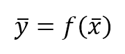

在这里：

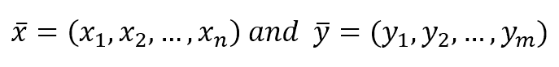

形容词“神经”来源于两个重要元素：基本计算单元的内部结构和它们之间的相互连接。让我们先从前者开始。在下面的图中，有一个人工神经元的示意图：

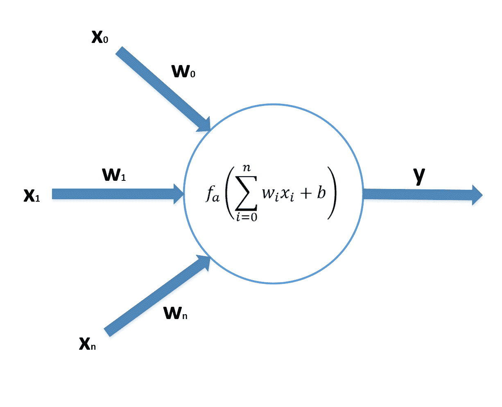

神经元核心与*n*个输入通道相连，每个通道由一个突触权重*w[i]*表征。输入被分成其组成部分，然后它们与相应的权重相乘并求和。可以添加一个可选的偏差到这个和（它就像另一个连接到单位输入的权重）。这个和通过一个激活函数*f[a]*（例如，如果你记得逻辑回归是如何工作的，可以使用 Sigmoid 函数）过滤，因此输出因此产生。在第五章“逻辑回归”中，我们也讨论了感知器（第一个人工神经网络），它正好对应这种具有二元步激活函数的架构。另一方面，逻辑回归也可以表示为一个单神经元神经网络，其中*fa*是 Sigmoid 函数。这个架构的主要问题是它本质上是线性的，因为输出总是输入向量和权重向量的点积的函数。你已经知道这样一个系统所有的局限性；因此，有必要向前迈进并创建第一个**多层感知器**（**MLP**）。在下面的图中，有一个具有 n 维输入、*p*个隐藏神经元和*k*维输出的 MLP 的示意图：

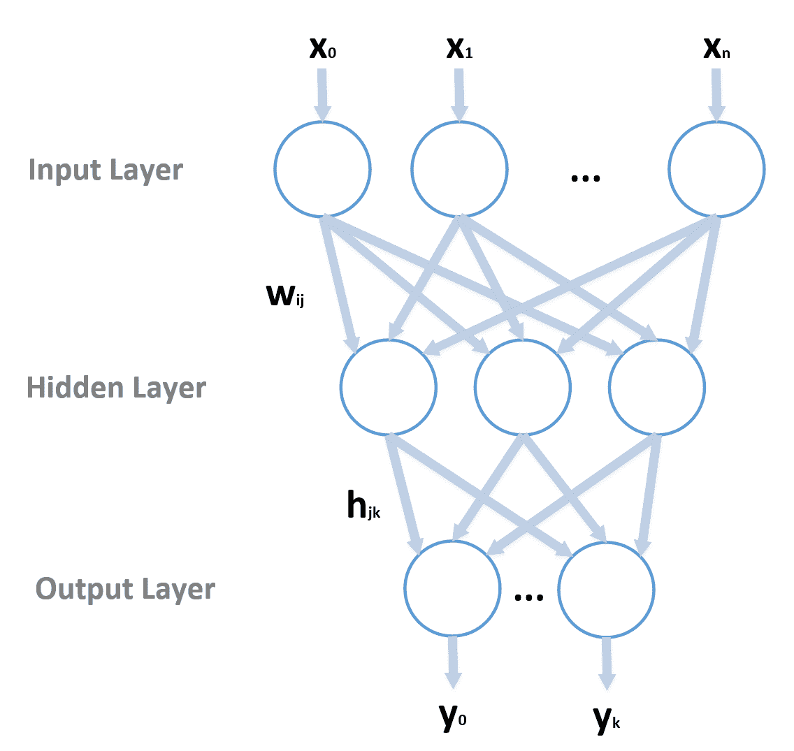

有三层（尽管数量可以更大）：输入层，它接收输入向量；一个隐藏层；以及输出层，它负责产生输出。正如你所见，每个神经元都与下一层的所有神经元相连，现在我们有两个权重矩阵，*W = (w[ij])*和*H = (h[jk])*，按照惯例，第一个索引指的是前一层，第二个索引指的是下一层。

因此，每个隐藏神经元的净输入及其相应的输出是：

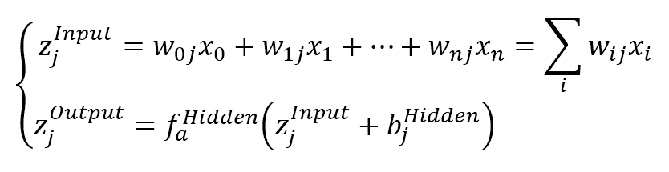

同样地，我们可以计算网络输出：

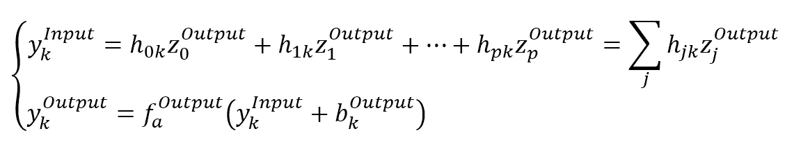

正如你所见，网络已经变得高度非线性，这一特性使我们能够模拟那些用线性方法无法管理的复杂场景。但是，我们如何确定所有突触权重和偏差的值呢？最著名的算法被称为**反向传播**，它的工作方式非常简单（唯一重要的假设是两个 *fa* 都必须是可微的）。

首先，我们需要定义一个误差（损失）函数；对于许多分类任务，它可以是总平方误差：

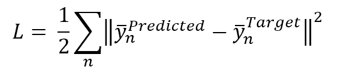

在这里，我们假设有*N*个输入样本。展开它，我们得到：

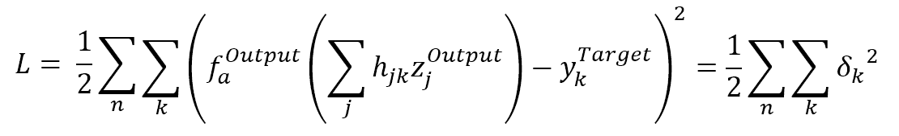

此函数依赖于所有变量（权重和偏差），但我们可以从底部开始，首先只考虑*h**jk*  ]**

同样，我们可以推导出与*w[ij]*相关的梯度：

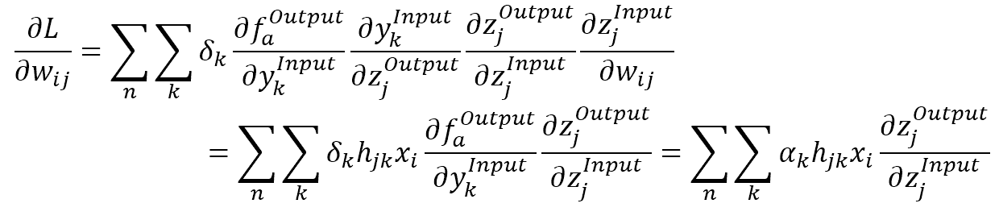

正如你所见，术语 alpha（与误差 delta 成正比）从输出层反向传播到隐藏层。如果有许多隐藏层，则此过程应递归重复，直到第一层。该算法采用梯度下降法；因此，它迭代更新权重，直到收敛：

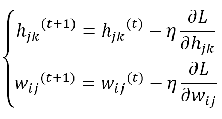

在这里，参数`eta`（公式中的希腊字母）是学习率。

在许多实际问题中，采用的是随机梯度下降法（阅读[`en.wikipedia.org/wiki/Stochastic_gradient_descent`](https://en.wikipedia.org/wiki/Stochastic_gradient_descent)，获取更多信息），该方法使用输入样本的批次，而不是考虑整个数据集。此外，可以采用许多优化方法来加速收敛，但这些内容超出了本书的范围。在 Goodfellow I.，Bengio Y.，Courville A.的《深度学习》，MIT Press*中，读者可以找到大多数这些优化的详细信息。就我们的目的而言，重要的是要知道我们可以构建一个复杂的网络，并在定义全局损失函数后，使用标准程序优化所有权重。在 TensorFlow 的章节中，我们将展示一个 MLP 的示例，但我们不会实现学习算法，因为幸运的是，所有优化器都已经构建好，并且可以应用于任何架构。

# 深度架构

MLPs 功能强大，但它们的表达能力受层数量和性质的限制。另一方面，深度学习架构基于一系列异构层，这些层在计算图中执行不同的操作。正确重塑的层输出被送入下一层，直到输出，这通常与一个用于优化的损失函数相关。最有趣的应用得益于这种堆叠策略，其中可变元素（权重和偏差）的数量可以轻松超过 1000 万；因此，捕捉细节和推广的能力超出了任何预期。在下一节中，我将简要介绍最重要的层类型。

# 全连接层

一个全连接层（有时称为密集层）由 n 个神经元组成，每个神经元接收来自前一层的所有输出值（如 MLP 中的隐藏层）。它可以由一个权重矩阵、一个偏差向量和一个激活函数来表征：

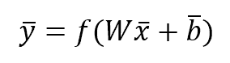

它们通常用作中间层或输出层，特别是在需要表示概率分布时。例如，可以使用深度架构进行具有*m*个输出类别的图像分类。在这种情况下，*softmax*激活函数允许有一个输出向量，其中每个元素是某个类别的概率（并且所有输出的总和总是归一化到 1.0）。在这种情况下，参数被视为**logit**或概率的对数：

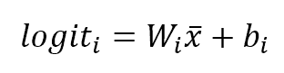

*W[i]*是*W***的 i 行。**类别*y**[i]***的概率是通过将*softmax*函数应用于每个*logit*来获得的：

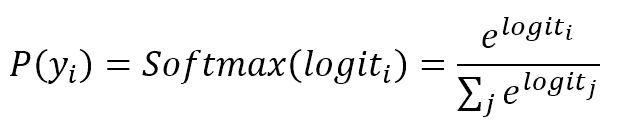

这种类型的输出可以很容易地使用交叉熵损失函数进行训练，正如已经讨论过的逻辑回归。

# 卷积层

卷积层通常应用于二维输入（尽管它们也可以用于向量和 3D 矩阵），并且由于它们在图像分类任务中表现出色，因此变得特别著名。它们基于一个小核*k*与二维输入的离散卷积（可以是另一个卷积层的输出）：

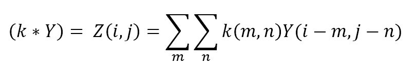

一层通常由 n 个固定大小的核组成，它们的值被视为使用反向传播算法进行学习的权重。在大多数情况下，卷积架构从具有较少较大核的层开始（例如，16（8 x 8）矩阵），并将它们的输出馈送到具有更多较小核的更高层（32（5 x 5），128（4 x 4），和 256（3 x 3））。这样，第一层应该学会捕获更通用的特征（例如，方向），而后续的层将被训练以捕获越来越小的元素（例如，脸部眼睛、鼻子和嘴巴的位置）。最后卷积层的输出通常会被展平（转换为 1D 向量）并用作一个或多个全连接层的输入。

在下面的图中，展示了一个对图片进行卷积的示意图：

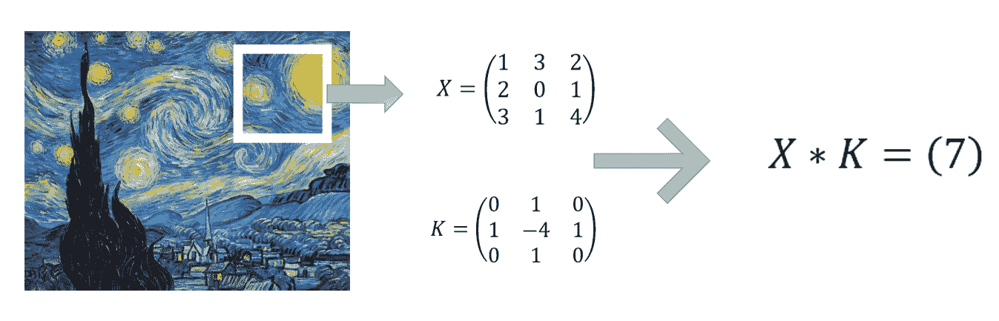

每个由 3 x 3 像素组成的正方形组与拉普拉斯核进行卷积，并转换为单个值，该值对应于上、下、左、右像素（考虑中心）的总和减去中心像素的四倍。我们将在下一节中看到一个使用此核的完整示例。

为了在卷积数量非常高时减少复杂性，可以采用一个或多个**池化层**。它们的作用是使用预定义的策略将每个输入点组（图像中的像素）转换为单个值。最常见的池化层有：

+   **最大池化**：每个二维的(*m* x *n*)像素组被转换成一个像素，其值是该组中的最大值。

+   **平均池化**：每个二维的(*m* x *n*)像素组被转换成一个像素，其值是该组的平均值。

以这种方式，原始矩阵的维度可以减少，但会损失一些信息，但这些信息通常可以丢弃（特别是在第一层，特征粒度较粗）。另一个重要的层类别是**零填充**层。它们通过在输入（1D）之前和之后或 2D 输入的左侧、右侧、顶部和底部添加空值（0）来工作。

# Dropout 层

Dropout 层用于通过随机将固定数量的输入元素设置为 0 来防止网络过拟合。这个层在训练阶段被采用，但在测试、验证和生产阶段通常被禁用。Dropout 网络可以利用更高的学习率，在损失表面上移动不同的方向（在隐藏层中设置一些随机输入值为零相当于训练不同的子模型）并排除所有不导致一致优化的错误表面区域。Dropout 在非常大的模型中非常有用，它可以提高整体性能并降低某些权重冻结和模型过拟合的风险。

# 循环神经网络

循环层由特定的神经元组成，这些神经元具有循环连接，以便将时间*t*的状态绑定到其前一个值（通常只有一个）。这类计算单元在需要捕捉输入序列的时间动态时特别有用。实际上，在许多情况下，我们期望的输出值必须与相应输入的历史相关。但是，MLP 以及我们讨论的其他模型都是无状态的。因此，它们的输出仅由当前输入决定。RNN 通过提供内部记忆来克服这个问题，该记忆可以捕捉短期和长期依赖关系。

最常见的单元是**长短期记忆**（**LSTM**）和**门控循环单元**（**GRU**），它们都可以使用标准的反向传播方法进行训练。由于这只是一个简介，我无法深入探讨（RNN 的数学复杂性非同小可）；然而，记住这一点是有用的，即每当需要在深度模型中包含时间维度时，RNNs 提供稳定且强大的支持。

# TensorFlow 简介

TensorFlow 是由 Google 创建的计算框架，已经成为最广泛使用的深度学习工具包之一。它可以与 CPU 和 GPU 一起工作，并且已经实现了构建和训练复杂模型所需的大部分操作和结构。TensorFlow 可以作为 Python 包安装在 Linux、Mac 和 Windows 上（带或不带 GPU 支持）；然而，我建议您遵循网站上的说明（链接可在本章末尾的信息框中找到），以避免常见的错误。

TensorFlow 的主要概念是计算图，或者是一系列后续操作，这些操作将输入批次转换成所需的输出。在下面的图中，有一个图的示意图：

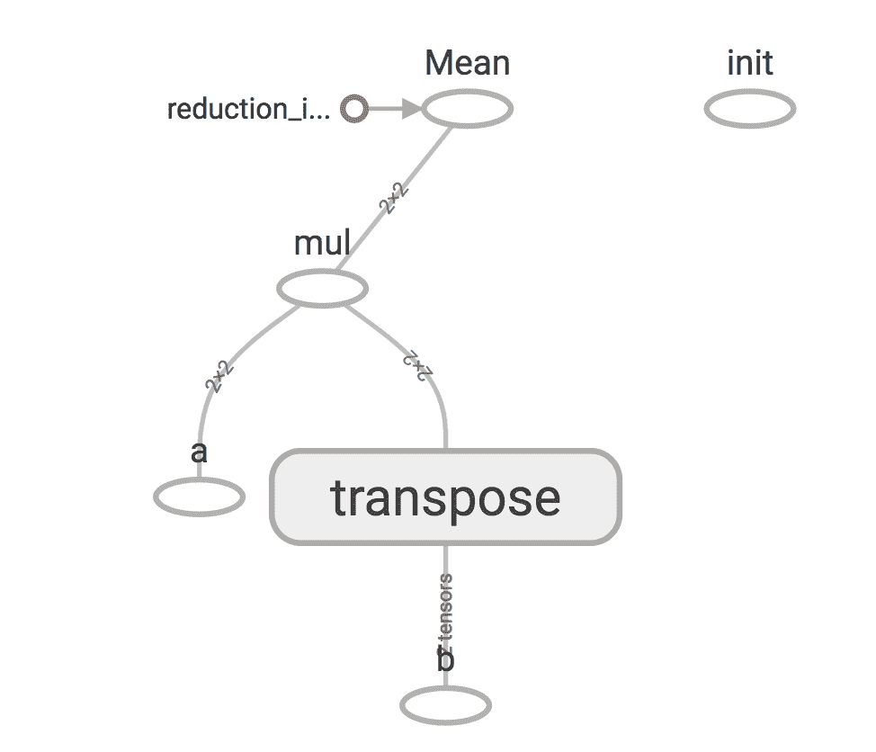

从底部开始，我们有两个输入节点（**a** 和 **b**），一个转置操作（作用于 **b**），一个矩阵乘法和均值减少。**init** 块是一个独立的操作，它正式是图的一部分，但它没有直接连接到任何其他节点；因此它是自主的（实际上，它是一个全局初始化器）。

由于这只是一个简要的介绍，列出所有与 TensorFlow 一起工作所需的最重要战略元素是有用的，以便能够构建几个简单的示例，以展示这个框架的巨大潜力：

+   **图**：这代表通过由操作组成的定向网络连接一个通用输入批次与输出张量的计算结构。它定义为 `tf.Graph()` 实例，通常与 Python 上下文管理器一起使用。

+   **占位符**：这是一个对外部变量的引用，当需要输出使用它直接或间接进行的操作时，必须显式提供。例如，占位符可以代表一个变量 `x`，它首先被转换为其平方值，然后与一个常数值相加。输出结果是 `x²+c`，通过传递一个具体的 `x` 值来实现。它定义为 `tf.placeholder()` 实例。

+   **变量**：一个内部变量，用于存储由算法更新的值。例如，一个变量可以是一个包含逻辑回归权重的向量。它通常在训练过程之前初始化，并由内置优化器自动修改。它定义为 `tf.Variable()` 实例。变量也可以用来存储在训练过程中不应考虑的元素；在这种情况下，它必须使用参数 `trainable=False` 声明。

+   **常数**：定义为 `tf.constant()` 实例的常数值。

+   **操作**：一种可以与占位符、变量和常量一起工作的数学操作。例如，两个矩阵的乘法是一个定义为 `tf.matmul(A, B)` 的操作。在所有操作中，梯度计算是最重要的之一。TensorFlow 允许从计算图中的某个确定点开始确定梯度，直到原点或逻辑上必须在其之前的另一个点。我们将看到这个操作的示例。

+   **会话**：这是 TensorFlow 和我们的工作环境（例如 Python 或 C++）之间的一种包装接口。当需要评估图时，这个宏操作将由会话管理，会话必须提供所有占位符的值，并使用请求的设备生成所需的输出。对于我们的目的，没有必要深入研究这个概念；然而，我邀请读者从网站或本章末尾列出的资源中获取更多信息。它声明为 `tf.Session()` 的实例，或者，正如我们即将做的，`tf.InteractiveSession()` 的实例。这种会话在处理笔记本或 shell 命令时特别有用，因为它会自动将其设置为默认会话。

+   **设备**：一个物理计算设备，例如 CPU 或 GPU。它通过 `tf.device()` 类的实例显式声明，并使用上下文管理器使用。当架构包含多个计算设备时，可以将工作拆分以便并行化许多操作。如果没有指定设备，TensorFlow 将使用默认设备（这是主要 CPU 或如果安装了所有必要的组件，则是一个合适的 GPU）。

我们现在可以使用这些概念分析一些简单的示例。

# 计算梯度

计算所有输出张量相对于任何连接的输入或节点的梯度的选项是 TensorFlow 最有趣的功能之一，因为它允许我们创建学习算法，而无需担心所有转换的复杂性。在这个例子中，我们首先定义一个线性数据集，表示范围在 (-100, 100) 内的函数 *f(x) = x*：

```py
import numpy as np

>>> nb_points = 100
>>> X = np.linspace(-nb_points, nb_points, 200, dtype=np.float32)
```

对应的图表如下所示：

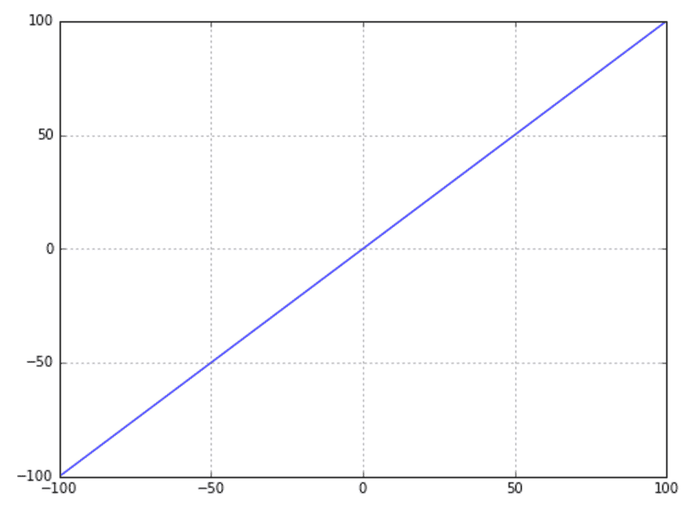

现在我们想使用 TensorFlow 来计算：

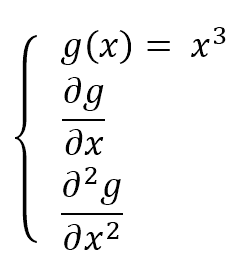

第一步是定义一个图：

```py
import tensorflow as tf

>>> graph = tf.Graph()
```

在这个图的上下文中，我们可以定义我们的输入占位符和其他操作：

```py
>>> with graph.as_default():
>>>    Xt = tf.placeholder(tf.float32, shape=(None, 1), name='x')
>>>    Y = tf.pow(Xt, 3.0, name='x_3')
>>>    Yd = tf.gradients(Y, Xt, name='dx')
>>>    Yd2 = tf.gradients(Yd, Xt, name='d2x')
```

占位符通常使用类型（第一个参数）、形状和可选名称定义。我们决定使用 `tf.float32` 类型，因为这是唯一由 GPU 也支持的类型。选择 `shape=(None, 1)` 意味着可以使用任何二维向量，其第二维等于 1。

第一个操作计算`Xt`在所有元素上的三次幂。第二个操作计算`Y`相对于输入占位符`Xt`的所有梯度。最后一个操作将重复梯度计算，但在这个情况下，它使用`Yd`，这是第一个梯度操作的输出。

我们现在可以传递一些具体的数据来查看结果。首先要做的事情是创建一个与该图连接的会话：

```py
>>> session = tf.InteractiveSession(graph=graph)
```

通过使用这个会话，我们要求使用`run()`方法进行的任何计算。所有输入参数都必须通过 feed 字典提供，其中键是占位符，值是实际的数组：

```py
>>> X2, dX, d2X = session.run([Y, Yd, Yd2], feed_dict={Xt: X.reshape((nb_points*2, 1))})
```

我们需要调整我们的数组以符合占位符。`run()`的第一个参数是我们想要计算的张量列表。在这种情况下，我们需要所有操作输出。每个输出的图如下所示：

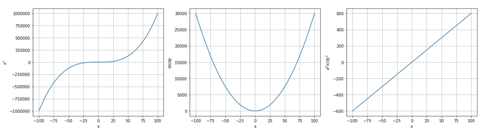

如预期，它们分别代表：*x³*，*3x²*，和*6x*。

# 逻辑回归

现在我们可以尝试一个更复杂的例子，实现逻辑回归算法。第一步，像往常一样，是创建一个虚拟数据集：

```py
from sklearn.datasets import make_classification

>>> nb_samples = 500
>>> X, Y = make_classification(n_samples=nb_samples, n_features=2, n_redundant=0, n_classes=2)
```

数据集在以下图中显示：

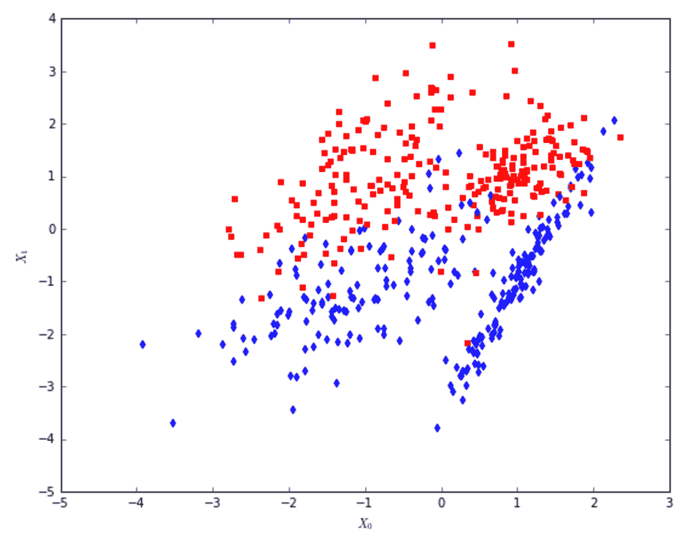

在这个阶段，我们可以创建图和所有占位符、变量和操作：

```py
import tensorflow as tf

>>> graph = tf.Graph()

>>> with graph.as_default():
>>>    Xt = tf.placeholder(tf.float32, shape=(None, 2), name='points')
>>>    Yt = tf.placeholder(tf.float32, shape=(None, 1), name='classes')
>>> 
>>>    W = tf.Variable(tf.zeros((2, 1)), name='weights')
>>>    bias = tf.Variable(tf.zeros((1, 1)), name='bias')
>>> 
>>>    Ye = tf.matmul(Xt, W) + bias
>>>    Yc = tf.round(tf.sigmoid(Ye))
>>> 
>>>    loss = tf.reduce_mean(tf.nn.sigmoid_cross_entropy_with_logits(logits=Ye, labels=Yt))
>>>    training_step = tf.train.GradientDescentOptimizer(0.025).minimize(loss)
```

需要占位符`Xt`来表示点，而`Yt`代表标签。在这个阶段，我们需要涉及几个变量：如果你记得，它们存储的是由训练算法更新的值。在这种情况下，我们需要一个权重向量`W`（包含两个元素）和一个单一的`bias`。当声明一个变量时，必须提供其初始值；我们决定使用`tf.zeros()`函数将它们都设置为零，该函数接受作为参数的期望张量的形状。

现在我们可以分两步计算输出（如果你不记得逻辑回归是如何工作的，请回顾第五章，*逻辑回归*）：首先计算 sigmoid 指数`Ye`，然后通过四舍五入 sigmoid 值得到实际的二进制输出`Yc`。逻辑回归的训练算法最小化负对数似然，这对应于真实分布`Y`和`Yc`之间的交叉熵。实现这个损失函数很容易；然而，函数`tf.log()`在数值上是不稳定的（当其值接近零时，它趋向于负无穷大并产生一个`NaN`值）；因此，TensorFlow 实现了一个更健壮的函数，`tf.nn.sigmoid_cross_entropy_with_logits()`，它假设输出是由 sigmoid 产生的来计算交叉熵。它接受两个参数，`logits`（对应于指数`Ye`）和目标`labels`，它们存储在`Yt`中。

现在，我们可以使用 TensorFlow 最强大的功能之一：训练优化器。在定义损失函数后，它将依赖于占位符、常量和变量。训练优化器（如`tf.train.GradientDescentOptimizer()`），通过其`minimize()`方法，接受要优化的损失函数。内部，根据每个特定算法，它将计算损失函数相对于所有可训练变量的梯度，并将相应的校正应用于值。传递给优化器的参数是学习率。

因此，我们定义了一个额外的操作，称为`training_step`，它对应于一个单一的状态更新步骤。无论图有多复杂，所有涉及损失函数的可训练变量都将通过单一指令进行优化。

现在是时候训练我们的逻辑回归了。首先要做的是让 TensorFlow 初始化所有变量，以便在操作需要使用它们时它们已经准备好了：

```py
>>> session = tf.InteractiveSession(graph=graph)
>>> tf.global_variables_initializer().run()
```

到这一点，我们可以创建一个简单的训练循环（应该在损失停止减少时停止；然而，我们有一个固定的迭代次数）：

```py
>>> feed_dict = {
>>>    Xt: X,
>>>    Yt: Y.reshape((nb_samples, 1))
>>> }

>>> for i in range(5000):
>>>    loss_value, _ = session.run([loss, training_step], feed_dict=feed_dict)
>>>    if i % 100 == 0:
>>>    print('Step %d, Loss: %.3f' % (i, loss_value))
Step 0, Loss: 0.269
Step 100, Loss: 0.267
Step 200, Loss: 0.265
Step 300, Loss: 0.264
Step 400, Loss: 0.263
Step 500, Loss: 0.262
Step 600, Loss: 0.261
Step 700, Loss: 0.260
Step 800, Loss: 0.260
Step 900, Loss: 0.259
...
```

如您所见，在每次迭代中，我们要求 TensorFlow 计算损失函数和训练步骤，并且我们总是传递包含`X`和`Y`的相同字典。在这个循环结束时，损失函数稳定了，我们可以通过绘制分离超平面来检查这个逻辑回归的质量：

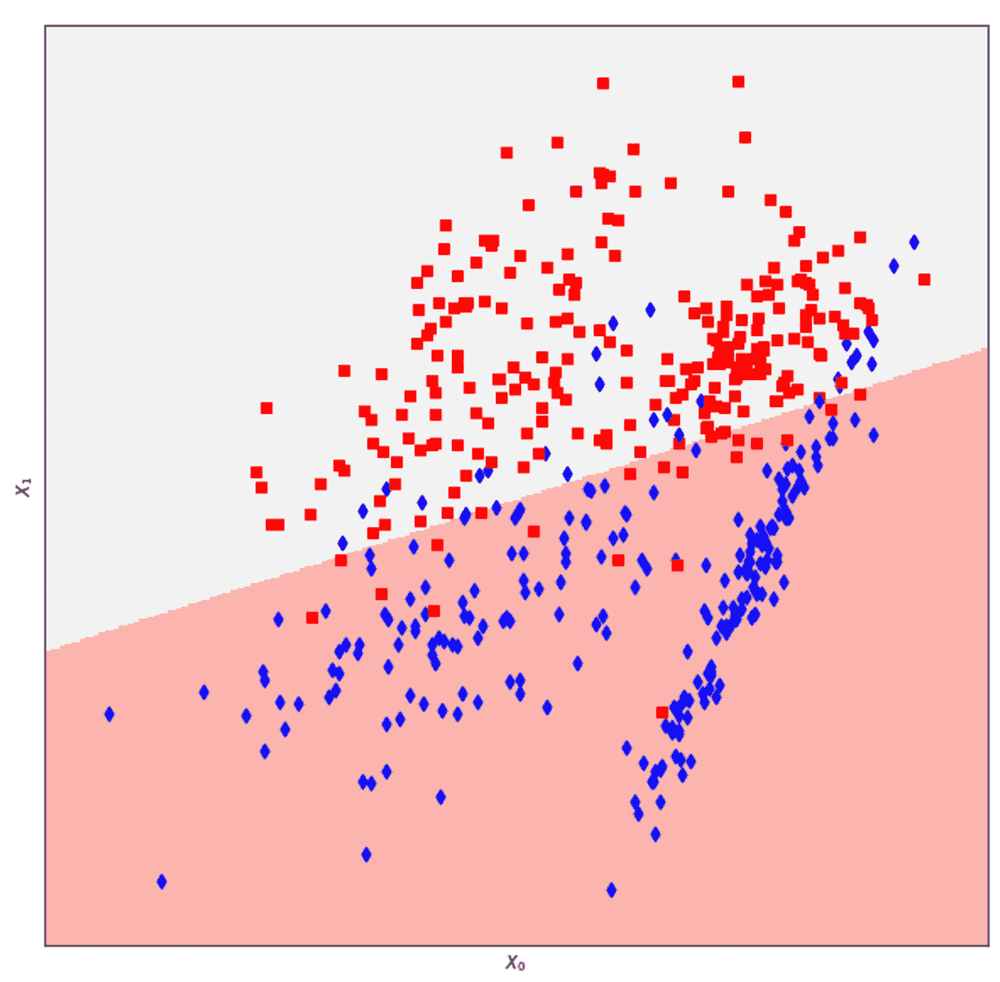

结果大约等同于使用 scikit-learn 实现得到的结果。如果我们想知道两个系数（权重）和截距（偏差）的值，我们可以通过在每个变量上调用`eval()`方法来让 TensorFlow 检索它们：

```py
>>> Wc, Wb = W.eval(), bias.eval()

>>> print(Wc)
[[-1.16501403]
 [ 3.10014033]]

>>> print(Wb)
[[-0.12583369]]
```

# 多层感知器的分类

我们现在可以构建一个具有两个密集层的架构，并训练一个用于更复杂数据集的分类器。让我们先创建它：

```py
from sklearn.datasets import make_classification

>>> nb_samples = 1000
>>> nb_features = 3

>>> X, Y = make_classification(n_samples=nb_samples, n_features=nb_features, 
>>> n_informative=3, n_redundant=0, n_classes=2, n_clusters_per_class=3)
```

即使只有两个类别，数据集有三个特征，每个类别有三个簇；因此，线性分类器几乎不可能以非常高的精度将其分离。以下图表显示了数据集的图示：

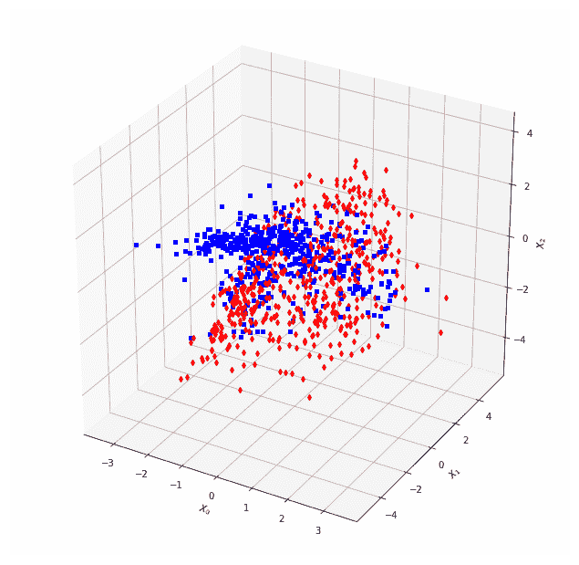

为了基准测试的目的，测试一个逻辑回归是有用的：

```py
from sklearn.model_selection import train_test_split
from sklearn.linear_model import LogisticRegression

>>> X_train, X_test, Y_train, Y_test = train_test_split(X, Y, test_size=0.2)

>>> lr = LogisticRegression()
>>> lr.fit(X_train, Y_train)
>>> print('Score: %.3f' % lr.score(X_test, Y_test))
Score: 0.715
```

在测试集上计算的分数大约是 71%，这并不算太差，但低于可接受的阈值。让我们尝试使用具有 50 个隐藏神经元（具有双曲正切激活）和 1 个 sigmoid 输出神经元的 MLP。双曲正切是：

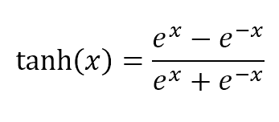

它的值在-1.0 和 1.0 之间渐近有界。

我们不会手动实现每一层，而是使用内置类`tf.contrib.layers.fully_connected()`。它接受输入张量或占位符作为第一个参数，并将层输出神经元的数量作为第二个参数。可以通过属性`activation_fn`指定激活函数：

```py
import tensorflow as tf
import tensorflow.contrib.layers as tfl

>>> graph = tf.Graph()

>>> with graph.as_default():
>>>    Xt = tf.placeholder(tf.float32, shape=(None, nb_features), name='X')
>>>    Yt = tf.placeholder(tf.float32, shape=(None, 1), name='Y')
>>> 
>>>    layer_1 = tfl.fully_connected(Xt, num_outputs=50, activation_fn=tf.tanh)
>>>    layer_2 = tfl.fully_connected(layer_1, num_outputs=1,
>>>                                  activation_fn=tf.sigmoid)
>>> 
>>>    Yo = tf.round(layer_2)
>>> 
>>>    loss = tf.nn.l2_loss(layer_2 - Yt)
>>>    training_step = tf.train.GradientDescentOptimizer(0.025).minimize(loss)
```

如前一个示例所示，我们定义了两个占位符`Xt`和`Yt`，以及两个全连接层。第一个接受`Xt`作为输入，有 50 个输出神经元（使用`tanh`激活），而第二个接受前一个层（`layer_1`）的输出，只有一个 sigmoid 神经元，代表类别。四舍五入的输出由`Yo`提供，损失函数是总平方误差，它通过`tf.nn.l2_loss()`函数实现，该函数计算网络输出（`layer_2`）与目标类别占位符`Yt`之间的差异。训练步骤使用标准的梯度下降优化器实现，就像逻辑回归示例中那样。

我们现在可以实施一个训练循环，将我们的数据集分成固定数量的批次（样本数量定义在变量`batch_size`中），并重复一个完整的周期`nb_epochs`个 epoch：

```py
>>> session = tf.InteractiveSession(graph=graph)
>>> tf.global_variables_initializer().run()

>>> nb_epochs = 200
>>> batch_size = 50

>>> for e in range(nb_epochs):
>>>    total_loss = 0.0
>>>    Xb = np.ndarray(shape=(batch_size, nb_features), dtype=np.float32)
>>>    Yb = np.ndarray(shape=(batch_size, 1), dtype=np.float32)
>>> 
>>>    for i in range(0, X_train.shape[0]-batch_size, batch_size):
>>>       Xb[:, :] = X_train[i:i+batch_size, :]
>>>       Yb[:, 0] = Y_train[i:i+batch_size]
>>> 
>>>       loss_value, _ = session.run([loss, training_step], 
>>>                                   feed_dict={Xt: Xb, Yt: Yb})
>>>       total_loss += loss_value
>>> 
>>>        Y_predicted = session.run([Yo], 
>>>               feed_dict={Xt: X_test.reshape((X_test.shape[0], nb_features))})
>>>        accuracy = 1.0 -
>>>            (np.sum(np.abs(np.array(Y_predicted[0]).squeeze(axis=1) -Y_test)) /
>>>            float(Y_test.shape[0]))
>>> 
>>>        print('Epoch %d) Total loss: %.2f - Accuracy: %.2f' % 
>>>              (e, total_loss, accuracy))

Epoch 0) Total loss: 78.19 - Accuracy: 0.66
Epoch 1) Total loss: 75.02 - Accuracy: 0.67
Epoch 2) Total loss: 72.28 - Accuracy: 0.68
Epoch 3) Total loss: 68.52 - Accuracy: 0.71
Epoch 4) Total loss: 63.50 - Accuracy: 0.79
Epoch 5) Total loss: 57.51 - Accuracy: 0.84
...
Epoch 195) Total loss: 15.34 - Accuracy: 0.94
Epoch 196) Total loss: 15.32 - Accuracy: 0.94
Epoch 197) Total loss: 15.31 - Accuracy: 0.94
Epoch 198) Total loss: 15.29 - Accuracy: 0.94
Epoch 199) Total loss: 15.28 - Accuracy: 0.94
```

如我们所见，如果不特别关注所有细节，测试集上计算出的准确率是 94%。考虑到数据集的结构，这是一个可接受的价值。在 Goodfellow I.，Bengio Y.，Courville A.的《深度学习》，MIT Press 中，读者将找到许多重要概念的详细信息，这些信息仍然可以改善性能并加快收敛过程。

# 图像卷积

即使我们没有构建完整的深度学习模型，我们也可以通过一个简单的示例测试卷积是如何工作的。我们使用的输入图像已经由`SciPy`提供：

```py
from scipy.misc import face

>>> img = face(gray=True)
```

原始图片在此显示：

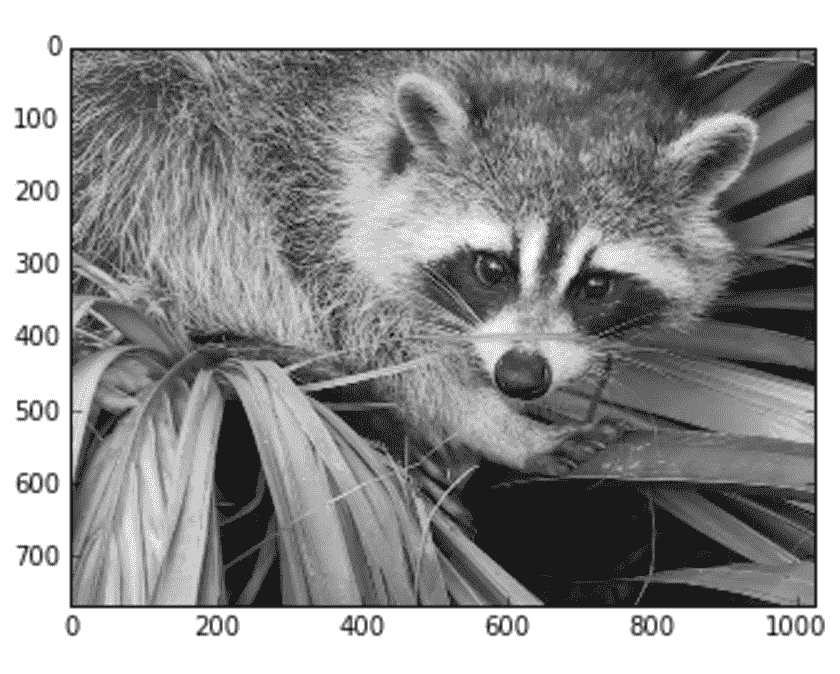

我们将应用拉普拉斯滤波器，它强调每个形状的边界：

```py
import numpy as np

>>> kernel = np.array(
>>>    [[0, 1, 0],
>>>     [1, -4, 0],
>>>     [0, 1, 0]], 
>>>    dtype=np.float32)

>>> cfilter = np.zeros((3, 3, 1, 1), dtype=np.float32)
>>> cfilter[:, :, 0, 0] = kernel 
```

因为 TensorFlow 卷积函数`tf.nn.conv2d`期望一个输入和一个输出滤波器，所以内核必须重复两次。我们现在可以构建图并测试它：

```py
import tensorflow as tf

>>> graph = tf.Graph()

>>> with graph.as_default():
>>>    x = tf.placeholder(tf.float32, shape=(None, 768, 1024, 1), name='image')
>>>    f = tf.constant(cfilter)

>>>    y = tf.nn.conv2d(x, f, strides=[1, 1, 1, 1], padding='SAME')

>>> session = tf.InteractiveSession(graph=graph)

>>> c_img = session.run([y], feed_dict={x: img.reshape((1, 768, 1024, 1))})
>>> n_img = np.array(c_img).reshape((768, 1024))
```

参数`strides`是一个四维向量（每个值对应输入维度，因此第一个是批次，最后一个是对应通道的数量），它指定滑动窗口必须移动多少像素。在这种情况下，我们想要覆盖所有图像的像素对像素的移动。参数`padding`确定如何计算新维度以及是否需要应用零填充。在我们的情况下，我们使用值`SAME`，它通过将原始维度除以相应的步长值并四舍五入到下一个整数来计算维度（因为这两个步长值都是 1.0，所以结果图像大小将正好与原始图像相同）。

输出图像在此显示：

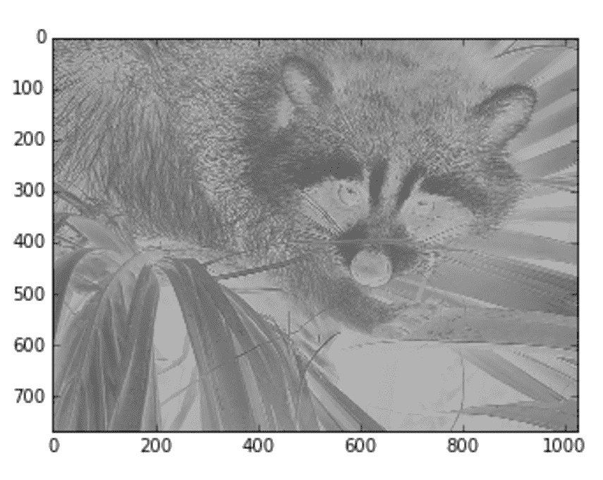

每个操作系统的安装说明可以在 [`www.tensorflow.org/install/`](https://www.tensorflow.org/install/) 找到。

# 快速浏览 Keras 内部结构

Keras ([`keras.io`](https://keras.io)) 是一个高级深度学习框架，可以无缝地与 TensorFlow、Theano 或 CNTK 等低级后端一起工作。在 Keras 中，一个模型就像一系列层，每个输出都被送入下一个计算块，直到达到最终层。模型的通用结构如下：

```py
from keras.models import Sequential

>>> model = Sequential()

>>> model.add(...)
>>> model.add(...)
...
>>> model.add(...)
```

`Sequential` 类定义了一个通用的空模型，它已经实现了添加层、根据底层框架编译模型、`fit` 和 `evaluate` 模型以及给定输入预测输出的所有所需方法。所有最常用的层都已经实现，包括：

+   密集、Dropout 和展平层

+   卷积（1D、2D 和 3D）层

+   池化层

+   零填充层

+   RNN 层

模型可以使用多个损失函数（如均方误差或交叉熵）和所有最常用的随机梯度下降优化算法（如 RMSProp 或 Adam）进行编译。有关这些方法的数学基础的更多详细信息，请参阅 Goodfellow I.，Bengio Y.，Courville A. 的《深度学习》，MIT 出版社。由于篇幅有限，不可能讨论所有重要元素，我更喜欢创建一个基于卷积网络的图像分类的完整示例。我们将使用的数据集是 CIFAR-10 ([`www.cs.toronto.edu/~kriz/cifar.html`](https://www.cs.toronto.edu/~kriz/cifar.html))，它由 60000 张小 RGB 图像（32 x 32）组成，属于 10 个不同的类别（飞机、汽车、鸟、猫、鹿、狗、青蛙、马、船、卡车）。在下图中，显示了图像的一个子集：


自从上次发布以来，Keras 允许我们使用内置函数下载这个数据集；因此，无需采取进一步行动即可使用它。

第一步是加载数据集并将其分为训练集和测试集：

```py
from keras.datasets import cifar10

>>> (X_train, Y_train), (X_test, Y_test) = cifar10.load_data()
```

训练数据集包含 50000 张图片，而测试集 10000 张。现在可以构建模型了。我们想使用几个卷积层来捕捉每个类别的特定元素。正如前文所述，这些特定的层可以学会识别特定的几何属性并以优秀的方式泛化。在我们的小型架构中，我们从 (5 x 5) 的过滤器大小开始，以捕捉所有低级特征（如方向），然后通过增加过滤器数量并减小其大小来继续。这样，高级特征（如车轮的形状或眼睛、鼻子和嘴巴的相对位置）也可以被捕捉。

```py
from keras.models import Sequential
from keras.layers.convolutional import Conv2D, ZeroPadding2D
from keras.layers.pooling import MaxPooling2D

>>> model = Sequential()

>>> model.add(Conv2D(32, kernel_size=(5, 5), activation='relu', input_shape=(32 ,32, 3)))
>>> model.add(MaxPooling2D(pool_size=(2, 2)))

>>> model.add(Conv2D(64, kernel_size=(4, 4), activation='relu'))
>>> model.add(ZeroPadding2D((1, 1)))

>>> model.add(Conv2D(128, kernel_size=(3, 3), activation='relu'))
>>> model.add(MaxPooling2D(pool_size=(2, 2)))
>>> model.add(ZeroPadding2D((1, 1)))
```

第一条指令创建了一个新的空模型。在这个时候，我们可以添加所有我们想要包含在计算图中的层。卷积层最常见的参数包括：

+   **滤波器数量**

+   **核大小**（作为元组）

+   **步长**（默认值是[1, 1]）。此参数指定滑动窗口在图像上移动时必须考虑多少像素。[1, 1]表示不丢弃任何像素。[2, 2]表示每次水平和垂直移动都将有 2 像素的宽度，依此类推。

+   **激活**（默认值为 None，表示将使用恒等函数）

+   **输入形状**（仅对于第一层此参数是强制性的）

我们的第一层有 32 个(5 x 5)滤波器，并使用**ReLU**（**归一化线性单元**）激活。此函数定义为：

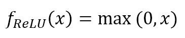

第二层通过考虑(2 x 2)块的最大池化来降低维度。然后我们应用另一个有 64 个(4 x 4)滤波器的卷积，随后是零填充（在输入的顶部、底部、左侧和右侧各 1 像素），最后，我们得到第三个有 128 个(3 x 3)滤波器的卷积层，随后是最大池化和零填充。

在这一点上，我们需要展平最后一层的输出，以便像在 MLP（多层感知器）中一样工作。

```py
from keras.layers.core import Dense, Dropout, Flatten

>>> model.add(Dropout(0.2))
>>> model.add(Flatten())
>>> model.add(Dense(128, activation='relu'))
>>> model.add(Dropout(0.2))
>>> model.add(Dense(10, activation='softmax')) 
```

在最后一个零填充层的输出上应用了一个 dropout（概率为 0.2）；然后这个多维值被展平并转换为一个向量。这个值被输入到一个有 128 个神经元的全连接层，并使用 ReLU 激活。然后对输出应用另一个 dropout（以防止过拟合），最后，这个向量被输入到另一个有 10 个神经元的全连接层，并使用*softmax*激活：

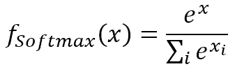

这样，模型的输出代表了一个离散的概率分布（每个值是对应类别的概率）。

在训练模型之前的最后一步是编译它：

```py
>>> model.compile(loss='categorical_crossentropy', optimizer='adam', metrics=['accuracy'])
```

Keras 将使用具有分类交叉熵损失函数（参见 TensorFlow 逻辑回归的示例）和 Adam 优化器的低级操作（如我们在上一节中讨论的）将高级描述转换为低级操作。此外，它将应用一个准确度指标以动态评估性能。

在这一点上，模型可以进行训练。我们只需要两个初步操作：

+   将图像归一化，使它们的值介于 0 和 1 之间

+   将整数标签应用 one-hot 编码

第一个操作可以通过将数据集除以 255 来简单地执行，而第二个可以通过使用内置函数`to_categorical()`轻松完成：

```py
from keras.utils import to_categorical

>>> model.fit(X_train / 255.0, to_categorical(Y_train), batch_size=32, epochs=15)
```

我们希望以 32 张图像组成的批次进行训练，持续 15 个 epoch。读者可以自由更改所有这些值以比较结果。Keras 提供的输出显示了学习阶段的进度：

```py
Epoch 1/15
50000/50000 [==============================] - 25s - loss: 1.5845 - acc: 0.4199 
Epoch 2/15
50000/50000 [==============================] - 24s - loss: 1.2368 - acc: 0.5602 
Epoch 3/15
50000/50000 [==============================] - 26s - loss: 1.0678 - acc: 0.6247 
Epoch 4/15
50000/50000 [==============================] - 25s - loss: 0.9495 - acc: 0.6658 
Epoch 5/15
50000/50000 [==============================] - 26s - loss: 0.8598 - acc: 0.6963 
Epoch 6/15
50000/50000 [==============================] - 26s - loss: 0.7829 - acc: 0.7220 
Epoch 7/15
50000/50000 [==============================] - 26s - loss: 0.7204 - acc: 0.7452 
Epoch 8/15
50000/50000 [==============================] - 26s - loss: 0.6712 - acc: 0.7629 
Epoch 9/15
50000/50000 [==============================] - 27s - loss: 0.6286 - acc: 0.7779 
Epoch 10/15
50000/50000 [==============================] - 27s - loss: 0.5753 - acc: 0.7952 
Epoch 11/15
50000/50000 [==============================] - 27s - loss: 0.5433 - acc: 0.8049 
Epoch 12/15
50000/50000 [==============================] - 27s - loss: 0.5112 - acc: 0.8170 
Epoch 13/15
50000/50000 [==============================] - 27s - loss: 0.4806 - acc: 0.8293 
Epoch 14/15
50000/50000 [==============================] - 28s - loss: 0.4551 - acc: 0.8365 
Epoch 15/15
50000/50000 [==============================] - 28s - loss: 0.4342 - acc: 0.8444
```

在第 15 个 epoch 结束时，训练集上的准确率约为 84%（一个非常好的结果）。最后的操作是使用测试集评估模型：

```py
>>> scores = model.evaluate(X_test / 255.0, to_categorical(Y_test))
>>> print('Loss: %.3f' % scores[0])
>>> print('Accuracy: %.3f' % scores[1])
Loss: 0.972
Accuracy: 0.719
```

最终验证准确率（约 72%）低于训练阶段达到的准确率。这对于深度模型来说是正常行为，因此，在优化算法时，始终使用交叉验证或一个定义良好的测试集（与训练集具有相同的分布，包含 25-30% 的总样本）是一个好习惯。

当然，我们提出的是一个非常简单的架构，但读者可以深入研究这些主题并创建更复杂的模型（Keras 还包含一些非常著名的预训练架构，如 VGG16/19 和 Inception V3，这些架构也可以用于执行具有 1000 个类别的图像分类）。

在网站上可以找到安装 Keras 所需的所有信息，包括不同后端的使用和官方文档：

[`keras.io`](https://keras.io)

# 参考文献

+   Goodfellow I.，Bengio Y.，Courville A.，*《深度学习》*，MIT Press

+   Abrahams S.，Hafner D.，*《机器智能的 TensorFlow：学习算法的实践入门》*，Bleeding Edge Press

+   Bonaccorso G.，*使用 Keras 进行神经艺术风格迁移*，[`github.com/giuseppebonaccorso/Neural_Artistic_Style_Transfer`](https://github.com/giuseppebonaccorso/Neural_Artistic_Style_Transfer)

+   Krizhevsky A，从微图像中学习多层特征，2009 ([`www.cs.toronto.edu/~kriz/learning-features-2009-TR.pdf`](https://www.cs.toronto.edu/~kriz/learning-features-2009-TR.pdf))

# 摘要

在本章中，我们简要讨论了一些基本的深度学习概念，读者现在应该理解什么是计算图以及如何使用 TensorFlow 来建模。实际上，深度架构可以看作是一系列相互连接的层。它们可以具有不同的特性和目的，但整体图始终是一个有向结构，将输入值与最终输出层关联起来。因此，可以推导出一个全局损失函数，该函数将由训练算法进行优化。我们还看到了 TensorFlow 如何计算输出张量相对于任何先前连接层的梯度，以及如何无缝地将标准反向传播策略应用于深度架构。我们没有讨论实际的深度学习问题和方法，因为它们需要更多的空间；然而，读者可以轻松找到许多有效的资源，以继续在这个迷人的领域的探索。

在下一章中，我们将总结之前讨论的许多概念，以便创建复杂的机器学习架构。
