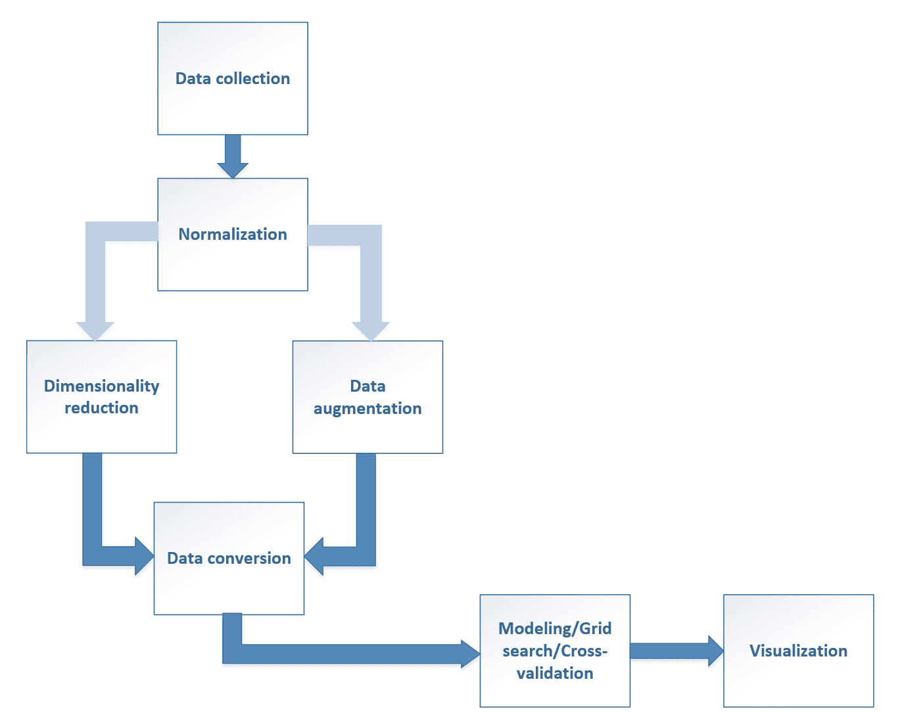

# 第十五章：创建机器学习架构

在本章中，我们将总结书中讨论的许多概念，目的是定义一个完整的机器学习架构，该架构能够预处理输入数据，分解/增强它，分类/聚类它，并最终使用图形工具展示结果。我们还将展示 scikit-learn 如何管理复杂的流程，以及如何在完整架构的全局范围内拟合它们并搜索最佳参数。

# 机器学习架构

到目前为止，我们讨论了可以用来解决特定问题的单一方法。然而，在现实情况下，很难有定义明确的可以立即输入到标准分类器或聚类算法中的数据集。机器学习工程师通常必须设计一个完整的架构，非专家可能会将其视为一个黑盒，其中原始数据进入，结果自动产生。实现最终目标所需的所有步骤都必须正确组织，并在类似于计算图的处理链中无缝连接（实际上，它通常是一个直接无环图）。不幸的是，这是一个非标准过程，因为每个现实生活中的问题都有其独特的特性。然而，有一些常见的步骤通常包含在几乎任何机器学习流程中。

在以下图片中，展示了该过程的示意图：



现在我们将简要解释每个阶段的细节以及一些可能的解决方案。

# 数据收集

第一步总是最通用的，因为它依赖于每个单独的上下文。然而，在处理任何数据之前，有必要从所有存储数据的地方收集它。理想的情况是有一个**逗号分隔值**（**CSV**）或其他合适的格式文件，可以立即加载，但更常见的情况是工程师必须查找所有的数据库表，定义正确的 SQL 查询来收集所有信息片段，并管理数据类型转换和编码。我们不会讨论这个话题，但重要的是不要低估这个阶段，因为它可能比预期的要困难得多。我建议，在可能的情况下，提取扁平化的表格，其中所有字段都放在同一行上，因为使用数据库管理系统或大数据工具处理大量数据更容易，但如果直接在普通的 PC 上使用 Python 工具进行，可能会非常耗费时间和内存。此外，对于所有文本字段，使用标准的字符编码也很重要。最常见的选择是 UTF-8，但也可以找到使用其他字符集编码的数据库表，通常在开始其他操作之前将所有文档转换为标准编码是一个好的做法。一个非常著名且功能强大的 Python 数据操作库是 pandas（SciPy 的一部分）。它基于 DataFrame 的概念（SQL 表的抽象）并实现了许多方法，允许选择、连接、分组和统计处理适合内存的数据集。在*Heydt M.，《学习 pandas - Python 数据发现与分析简化》*，Packt 这本书中，读者可以找到使用这个库解决许多实际问题所需的所有信息。在这个阶段必须管理的常见问题之一是填充缺失的特征。在第三章，“特征选择与特征工程”中，我们讨论了一些可以在开始下一步之前自动采用的实际方法。

# 归一化

对数值数据集进行归一化是其中一个最重要的步骤，尤其是当不同的特征具有不同的尺度时。在第三章，*特征选择与特征工程*中，我们讨论了几种可以用来解决这个问题的方法。通常情况下，使用`StandardScaler`来白化数据就足够了，但有时考虑噪声特征对全局趋势的影响，并使用`RobustScaler`来过滤它们，而不必担心会条件化剩余的特征会更好。读者可以很容易地验证在处理归一化和未归一化的数据集时，相同的分类器（特别是 SVM 和神经网络）的不同性能。正如我们将在下一节中看到的，将归一化步骤包含在处理管道中作为第一个动作之一，并在网格搜索中包含`C`参数，以便在训练阶段强制执行*L1*/*L2*权重归一化（参见第四章，*线性回归*中讨论正则化的重要性，当讨论岭回归、Lasso 和 ElasticNet 时）。

# 维度降低

这一步骤并非总是必需的，但在许多情况下，它可以是一个解决内存泄漏或长时间计算的好方法。当数据集具有许多特征时，某些隐藏相关性的概率相对较高。例如，产品的最终价格直接受所有材料价格的影响，如果我们移除一个次要元素，其价值会略有变化（更普遍地说，我们可以说总方差几乎保持不变）。如果你记得 PCA 是如何工作的，你就会知道这个过程也会使输入数据去相关。因此，检查 PCA 或核 PCA（用于非线性数据集）是否可以去除一些组件，同时保持解释方差接近 100%（这相当于以最小信息损失压缩数据）是有用的。在第三章，*特征选择与特征工程*中，也讨论了其他方法（如`NMF`或`SelectKBest`），这些方法可以根据各种标准（如 ANOVA 或卡方检验）选择最佳特征。在项目的初始阶段测试每个因素的影响可以节省时间，这在需要评估较慢且更复杂的算法时可能是有用的。

# 数据增强

有时原始数据集只有少数非线性特征，对于标准分类器来说捕捉动态变化相当困难。此外，将算法强加于复杂数据集可能会导致模型过拟合，因为所有能力都耗尽在尝试最小化仅考虑训练集的错误上，而没有考虑到泛化能力。因此，有时通过现有特征的函数获得派生特征来丰富数据集是有用的。`PolynomialFeatures` 是数据增强的一个例子，它可以真正提高标准算法的性能并避免过拟合。在其他情况下，引入三角函数（如 *sin(x)* 或 *cos(x)*）或相关特征（如 *x[1]x[2]*）可能很有用。前者允许更简单地管理径向数据集，而后者可以为分类器提供关于两个特征之间交叉相关性的信息。通常，数据增强可以在尝试更复杂的算法之前使用；例如，逻辑回归（这是一种线性方法）可以成功地应用于增强的非线性数据集（我们在第四章，*线性回归*，讨论多项式回归时看到了类似的情况）。选择使用更复杂（具有更高容量）的模型或尝试增强数据集取决于工程师，并且必须仔细考虑，权衡利弊。在许多情况下，例如，最好是不要修改原始数据集（这可能相当大），而是创建一个 scikit-learn 接口以实时增强数据。在其他情况下，神经网络模型可以提供更快、更准确的结果，而无需数据增强。与参数选择一样，这更多的是一种艺术而不是真正的科学，实验是唯一收集有用知识的方法。

# 数据转换

在处理分类数据时，这一步可能是最简单同时也是最重要的。我们已经讨论了几种使用数值向量编码标签的方法，没有必要重复已经解释的概念。一个一般规则是关于使用整数或二进制值（one-hot 编码）。当分类器的输出是值本身时，后者可能是最佳选择，因为，如第三章，*特征选择和特征工程*中讨论的那样，它对噪声和预测误差的鲁棒性更强。另一方面，one-hot 编码相当消耗内存。因此，当需要处理概率分布（如 NLP 中）时，整数标签（代表字典条目或频率/计数值）可能更有效。

# 模型/网格搜索/交叉验证

建模意味着选择最适合每个特定任务的分类/聚类算法。我们已经讨论了不同的方法，读者应该能够理解一组算法何时是一个合理的候选者，何时最好寻找另一种策略。然而，机器学习技术的成功往往还取决于模型中每个参数的正确选择。正如已经讨论过的，当谈到数据增强时，很难找到一个精确的方法来确定要分配的最佳值，最佳方法始终基于网格搜索。scikit-learn 提供了一个非常灵活的机制来调查不同参数组合的模型性能，以及交叉验证（这允许在没有减少训练样本数量的情况下进行稳健的验证），这确实是一个更合理的做法，即使是专家工程师也是如此。此外，当执行不同的转换时，选择的影响可能会影响整个流程，因此，（我们将在下一节中看到一些例子）我总是建议同时应用网格搜索到所有组件，以便能够评估每个可能选择的交叉影响。

# 可视化

有时，可视化中间步骤和最终步骤的结果是有用/必要的。在这本书中，我们始终使用 matplotlib 来展示图表和图解，matplotlib 是 SciPy 的一部分，提供了一个灵活且强大的图形基础设施。即使它不是本书的一部分，读者也可以轻松修改代码以获得不同的结果；为了更深入的理解，请参阅 Mcgreggor D.的《精通 matplotlib》，Packt 出版社。由于这是一个不断发展的领域，许多新的项目正在开发中，提供了新的、更时尚的绘图功能。其中之一是 Bokeh（[`bokeh.pydata.org`](http://bokeh.pydata.org)），它使用一些 JavaScript 代码创建可以嵌入到网页中的交互式图表。 

# scikit-learn 工具用于机器学习架构

现在我们将介绍两个非常重要的 scikit-learn 类，这些类可以帮助机器学习工程师创建复杂的数据处理结构，包括从原始数据集中生成所需结果所需的所有步骤。

# 管道

scikit-learn 提供了一个灵活的机制来创建由后续处理步骤组成的管道。这是由于大多数类实现了标准接口，因此大多数组件（包括数据处理/转换器和分类器/聚类工具）可以无缝交换。类`Pipeline`接受一个参数`steps`，它是一个元组列表，形式为（组件名称—实例），并创建一个具有标准 fit/transform 接口的复杂对象。例如，如果我们需要应用 PCA、标准缩放，然后我们想使用 SVM 进行分类，我们可以按以下方式创建一个管道：

```py
from sklearn.decomposition import PCA
from sklearn.pipeline import Pipeline
from sklearn.preprocessing import StandardScaler
from sklearn.svm import SVC

>>> pca = PCA(n_components=10)
>>> scaler = StandardScaler()
>>> svc = SVC(kernel='poly', gamma=3)

>>> steps = [
>>>    ('pca', pca),
>>>    ('scaler', scaler),
>>>    ('classifier', svc)
>>> ]

>>> pipeline = Pipeline(steps)
```

在这一点上，管道可以像单个分类器一样拟合（使用标准的`fit()`和`fit_transform()`方法），即使输入样本首先通过`PCA`实例，通过`StandardScaler`实例对减少的数据集进行归一化，最后，将得到的样本传递给分类器。

管道与`GridSearchCV`一起也非常有用，可以评估不同参数组合的不同组合，不仅限于单个步骤，而是考虑整个流程。考虑到前面的例子，我们可以创建一个虚拟数据集并尝试找到最佳参数：

```py
from sklearn.datasets import make_classification

>>> nb_samples = 500
>>> X, Y = make_classification(n_samples=nb_samples, n_informative=15, n_redundant=5, n_classes=2)
```

数据集相当冗余。因此，我们需要找到 PCA 的最佳组件数量和 SVM 的最佳核。当使用管道工作时，必须使用组件 ID 后跟两个下划线，然后是实际名称来指定参数的名称，例如`classifier__kernel`（如果您想检查所有具有正确名称的可接受参数，只需执行：`print(pipeline.get_params().keys())`）。因此，我们可以执行以下参数字典的网格搜索：

```py
from sklearn.model_selection import GridSearchCV

>>> param_grid = {
>>>    'pca__n_components': [5, 10, 12, 15, 18, 20],
>>>    'classifier__kernel': ['rbf', 'poly'],
>>>    'classifier__gamma': [0.05, 0.1, 0.2, 0.5],
>>>    'classifier__degree': [2, 3, 5]
>>> }

>>> gs = GridSearchCV(pipeline, param_grid)
>>> gs.fit(X, Y)
```

如预期，最佳估计量（这是一个完整的管道）有 15 个主成分（这意味着它们是不相关的）和一个具有相对较高`gamma`值（0.2）的径向基函数 SVM：

```py
>>> print(gs.best_estimator_)
Pipeline(steps=[('pca', PCA(copy=True, iterated_power='auto', n_components=15, random_state=None,
  svd_solver='auto', tol=0.0, whiten=False)), ('scaler', StandardScaler(copy=True, with_mean=True, with_std=True)), ('classifier', SVC(C=1.0, cache_size=200, class_weight=None, coef0=0.0,
  decision_function_shape=None, degree=2, gamma=0.2, kernel='rbf',
  max_iter=-1, probability=False, random_state=None, shrinking=True,
  tol=0.001, verbose=False))])
```

对应的分数是：

```py
>>> print(gs.best_score_)
0.96
```

还可以使用`Pipeline`与`GridSearchCV`一起评估不同的组合。例如，比较一些分解方法与各种分类器混合可能很有用：

```py
from sklearn.datasets import load_digits
from sklearn.decomposition import NMF
from sklearn.feature_selection import SelectKBest, f_classif
from sklearn.linear_model import LogisticRegression

>>> digits = load_digits()

>>> pca = PCA()
>>> nmf = NMF()
>>> kbest = SelectKBest(f_classif)
>>> lr = LogisticRegression()

>>> pipeline_steps = [
>>>    ('dimensionality_reduction', pca),
>>>    ('normalization', scaler),
>>>    ('classification', lr)
>>> ]

>>> pipeline = Pipeline(pipeline_steps)
```

我们想比较**主成分分析**（**PCA**）、**非负矩阵分解**（**NMF**）和基于 ANOVA 准则的 k 最佳特征选择，以及逻辑回归和核化 SVM：

```py
>>> pca_nmf_components = [10, 20, 30]

>>> param_grid = [
>>>    {
>>>        'dimensionality_reduction': [pca],
>>>        'dimensionality_reduction__n_components': pca_nmf_components,
>>>        'classification': [lr],
>>>        'classification__C': [1, 5, 10, 20]
>>>    },
>>>    {
>>>        'dimensionality_reduction': [pca],
>>>        'dimensionality_reduction__n_components': pca_nmf_components,
>>>        'classification': [svc],
>>>        'classification__kernel': ['rbf', 'poly'],
>>>        'classification__gamma': [0.05, 0.1, 0.2, 0.5, 1.0],
>>>        'classification__degree': [2, 3, 5],
>>>        'classification__C': [1, 5, 10, 20]
>>>    },
>>>    {
>>>        'dimensionality_reduction': [nmf],
>>>        'dimensionality_reduction__n_components': pca_nmf_components,
>>>        'classification': [lr],
>>>        'classification__C': [1, 5, 10, 20]
>>>    },
>>>    {
>>>        'dimensionality_reduction': [nmf],
>>>        'dimensionality_reduction__n_components': pca_nmf_components,
>>>        'classification': [svc],
>>>        'classification__kernel': ['rbf', 'poly'],
>>>        'classification__gamma': [0.05, 0.1, 0.2, 0.5, 1.0],
>>>        'classification__degree': [2, 3, 5],
>>>        'classification__C': [1, 5, 10, 20]
>>>    },
>>>    {
>>>        'dimensionality_reduction': [kbest],
>>>        'classification': [svc],
>>>        'classification__kernel': ['rbf', 'poly'],
>>>        'classification__gamma': [0.05, 0.1, 0.2, 0.5, 1.0],
>>>        'classification__degree': [2, 3, 5],
>>>        'classification__C': [1, 5, 10, 20]
>>>    },
>>> ]

>>> gs = GridSearchCV(pipeline, param_grid)
>>> gs.fit(digits.data, digits.target)
```

执行网格搜索，我们得到由 PCA（原始数据集有 64 个特征）和具有非常小的`gamma`值（0.05）和中等（5.0）*L2*惩罚参数`C`的 RBF SVM 组成的管道：

```py
>>> print(gs.best_estimator_)
Pipeline(steps=[('dimensionality_reduction', PCA(copy=True, iterated_power='auto', n_components=20, random_state=None,
  svd_solver='auto', tol=0.0, whiten=False)), ('normalization', StandardScaler(copy=True, with_mean=True, with_std=True)), ('classification', SVC(C=5.0, cache_size=200, class_weight=None, coef0=0.0,
  decision_function_shape=None, degree=2, gamma=0.05, kernel='rbf',
  max_iter=-1, probability=False, random_state=None, shrinking=True,
  tol=0.001, verbose=False))])
```

考虑到需要捕捉数字表示中的小细节，这些值是最佳选择。这个管道的分数确实非常高：

```py
>>> print(gs.best_score_)
0.968836950473
```

# 特征组合

scikit-learn 提供的另一个有趣类别是 `FeatureUnion`，它允许将不同的特征转换连接到一个单一的输出矩阵中。与管道（也可以包括特征联合）的主要区别在于，管道从不同的场景中选择，而特征联合创建了一个统一的数据集，其中不同的预处理结果被合并在一起。例如，考虑到之前的结果，我们可以尝试通过执行具有 10 个组件的 PCA 并选择根据 ANOVA 指标选择的最佳 5 个特征来优化我们的数据集。这样，维度从 20 减少到 15：

```py
from sklearn.pipeline import FeatureUnion

>>> steps_fu = [
>>>    ('pca', PCA(n_components=10)),
>>>    ('kbest', SelectKBest(f_classif, k=5)),
>>> ]

>>> fu = FeatureUnion(steps_fu)

>>> svc = SVC(kernel='rbf', C=5.0, gamma=0.05)

>>> pipeline_steps = [
>>>    ('fu', fu),
>>>    ('scaler', scaler),
>>>    ('classifier', svc)
>>> ]

>>> pipeline = Pipeline(pipeline_steps)
```

我们已经知道径向基函数支持向量机（RBF SVM）是一个不错的选择，因此我们保持架构的其余部分不变。进行交叉验证后，我们得到：

```py
from sklearn.model_selection import cross_val_score
 >>> print(cross_val_score(pipeline, digits.data, digits.target, cv=10).mean())
0.965464333604
```

得分略低于之前（< 0.002），但特征数量已显著减少，因此计算时间也有所减少。将不同数据预处理器的输出合并是一种数据增强形式，当原始特征数量过高或冗余/噪声时，必须始终考虑这一点，因为单一分解方法可能无法成功捕捉所有动态。

# 参考文献

+   Mcgreggor D.，《精通 matplotlib》，Packt

+   Heydt M.，《学习 pandas - Python 数据发现与分析变得简单》，Packt

# 摘要

在本章的最后，我们讨论了机器学习架构的主要元素，考虑了一些常见的场景和通常用于防止问题和提高整体性能的程序。在仔细评估之前，不应丢弃任何这些步骤，因为模型的成功取决于许多参数和超参数的联合作用，而找到最佳最终配置的起点是考虑所有可能的预处理步骤。

我们看到网格搜索是一个强大的调查工具，并且通常与一套完整的替代管道（包括或不包括特征联合）一起使用是一个好主意，以便在全局场景中找到最佳解决方案。现代个人计算机足够快，可以在几小时内测试数百种组合，而当数据集太大时，可以使用现有的提供商之一提供云服务器。

最后，我想再次强调，到目前为止（也考虑到深度学习领域的研究），创建一个运行良好的机器学习架构需要持续分析替代解决方案和配置，而对于任何但最简单的情况，都没有一劳永逸的解决方案。这是一门仍然保持着艺术之心的科学！
