# 第一章：什么是 DataRobot 以及为什么你需要它？

**机器学习**（**ML**）和人工智能目前非常流行，很明显，这些技术将在大多数组织的成功和竞争力中扮演关键角色。这将产生对具有数据科学技能的人的巨大需求。

本章描述了当前构建和部署机器学习模型的做法和流程，以及将这些方法扩展以满足预期需求的一些挑战。然后，本章介绍了**DataRobot**是什么以及**DataRobot**如何解决许多这些挑战，从而使得分析师和数据科学家能够快速为他们的组织增加价值。本章还帮助高管了解他们如何使用 DataRobot 高效地扩展他们的数据科学实践，而无需雇佣大量难以找到技能的员工，以及如何利用 DataRobot 提高现有数据科学团队的有效性。本章涵盖了 DataRobot 的各个组成部分、其架构、与其他工具的集成方式以及不同选项以在本地或云中设置它。它还从高层次描述了各种用户界面组件及其含义。

到本章结束时，您将了解 DataRobot 的核心功能和架构，以及为什么它是数据分析师以及经验丰富的数据科学家解决组织在从数据中提取价值时面临的最关键挑战的强大推动力。

在本章中，我们将涵盖以下主题：

+   数据科学实践和流程

+   数据科学相关的挑战

+   DataRobot 架构

+   DataRobot 的功能及其使用方法

+   DataRobot 如何解决数据科学挑战

# 技术要求

本书要求您能够访问 DataRobot。DataRobot 是一款商业软件，您需要为其购买许可证。很可能是您的组织已经购买了 DataRobot 许可证，您的管理员可以在 DataRobot 实例上为您设置账户，并提供访问 DataRobot 的适当 URL。

在本书编写时，DataRobot 网站上提供了一个试用版，您可以通过以下链接访问：[`www.datarobot.com/trial/`](https://www.datarobot.com/trial/)。请注意，试用版并不提供商业版的所有功能，并且它提供的内容可能会随时间变化。

# 生成商业价值的数据科学流程

数据科学是一种新兴实践，已经经历了许多炒作。它所代表的大部分内容都处于争议之中，实践也在迅速发展。尽管有这些争议，但毫无疑问，如果使用得当，数据科学方法可以为企业带来好处。遵循一个流程并不能保证成功，但它确实可以提高成功的几率，并允许进行改进。数据科学流程本质上是迭代的，因此重要的是不要在一个特定步骤上停留太久。那些寻找可预测和预定时间表和结果的人注定会失望。无论如何，制定一个计划，但也要准备好在前进过程中保持灵活和敏捷。数据科学项目也是一个发现项目：你永远不知道你会发现什么。你的期望或假设可能最终是错误的，你也可能从意想不到的来源发现有趣的见解。

数据科学有许多已知的应用，每天都有新的应用被发现。以下是一些示例应用：

+   预测哪个客户最有可能购买产品

+   预测哪个客户会再次回来

+   预测客户接下来会想要什么

+   预测哪个客户可能会违约贷款

+   预测哪个客户可能会发生事故

+   预测机器的哪个部件可能会失效

+   预测商店将销售多少商品

+   预测呼叫中心明天将接收到多少电话

+   预测下个月将消耗多少能源

*图 1.1* 展示了一个高层次流程，描述了数据科学项目可能从概念到价值生成的过程：

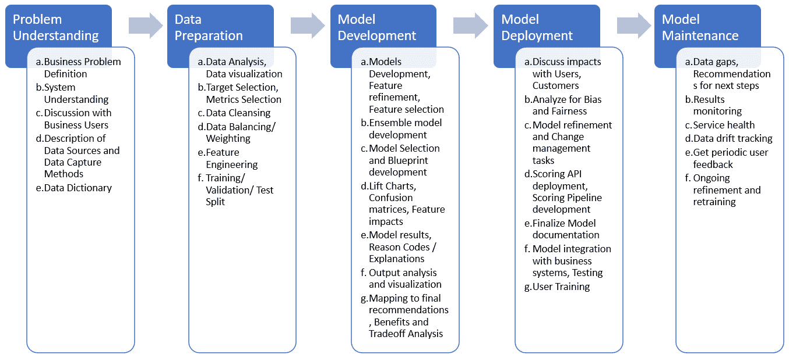

图 1.1 – 典型流程步骤及其每个步骤的详细信息

遵循这些步骤对于成功进行机器学习项目至关重要。有时，由于截止日期或开发调试过程中不可避免地出现的问题，这些步骤会被跳过。我们将展示如何使用 DataRobot 帮助您避免一些问题，并确保您的团队遵循最佳实践。这些步骤将在本书的其他章节中详细说明，并附有示例，但让我们先从高层次上熟悉它们。

## 问题理解

这可能是最重要的步骤，同时也是最不受重视的步骤。大多数数据科学项目失败是因为这一步骤被仓促完成。这也是数据科学学科中可用的方法和工具最少的地方。这一步骤包括以下内容：

+   从系统角度理解业务问题

+   理解最终用户或模型结果消费者期望的是什么

+   理解利益相关者将如何使用结果

+   理解潜在的数据来源以及数据在到达您之前是如何被捕获和修改的

+   评估使用数据和数据源是否存在任何法律问题

+   深入理解数据集的各种特征意味着什么

## 数据准备

这个步骤在数据科学社区中是众所周知的，因为数据科学团队通常大部分时间都花在这个步骤上。这是一个数据科学或数据工程团队需要使用 SQL、Python 或 R 等工具完成大量工作的任务。在这个步骤中，也需要数据科学家运用其技能和经验（例如，特征工程），尽管 DataRobot 正在开始提供这方面的能力。例如，DataRobot 提供了许多有用的数据可视化和关于数据质量的通知，但分析师需要从中理解并采取适当的行动。

这个步骤还涉及定义模型的预期结果（例如，预测下周将售出多少商品或确定贷款违约的概率），以及如何在模型开发、验证和测试阶段衡量结果的质量。

## 模型开发

这个步骤涉及使用不同的算法开发多个模型，并优化或调整算法的超参数。然后评估模型产生的结果，以缩小模型列表，可能删除一些特征，并微调超参数。

通常也会查看特征效应、特征重要性和部分依赖图来构建额外的特征。一旦你对结果满意，你开始思考如何将预测和解释转化为可使用和可操作的信息。

## 模型部署

在模型开发完成后，模型结果会与用户和利益相关者进行审查。这是你应该仔细评估结果将如何转化为行动的时候。这些行动的后果会是什么，是否存在可能出现的意外后果？这也是评估模型产生的任何公平性或偏差问题的时机。确保与用户和业务领导者讨论任何担忧。

DataRobot 提供了多种机制，可以快速将模型作为 REST API 或可执行的 Java 对象部署到组织的任何基础设施或云中。一旦模型作为 API 运行，变更管理的艰难部分就开始了。在这里，你必须确保组织为与新的业务方式相关的变化做好准备。这对那些习惯于以某种方式做事的人来说通常是困难的。沟通为什么这是必要的，为什么它更好，以及如何执行新功能是经常被忽视的重要方面。

## 模型维护

一旦模型成功部署并运行，重点就转向管理模型操作和维护。这包括确定数据差距和其他建议，以随着时间的推移改进模型，以及根据需要改进和重新训练模型。监控包括评估传入的数据以查看数据是否发生了漂移以及漂移是否需要采取行动，监控预测服务的健康状况，以及监控模型输出的结果和准确性。定期与用户会面以了解模型做得好的地方以及可以改进的地方也很重要。有时也常见使用冠军模型和挑战者模型来查看是否有一个不同的模型能够在生产环境中表现更好。

如我们之前概述的，尽管这些步骤以线性方式呈现，但在实践中，这些步骤并不按照这种确切顺序发生，通常在得到最终结果之前有很多迭代。机器学习模型开发是一个具有挑战性的过程，我们现在将讨论一些挑战以及如何应对它们。

# 数据科学相关的挑战

从数据科学项目中获得价值并非易事，许多项目以失败告终。虽然一些原因与任何类型的项目都普遍存在，但数据科学项目有一些独特的挑战。数据科学仍然是一个相对年轻和不成熟的学科，因此会遭遇任何新兴学科都会遇到的问题。数据科学从业者可以从其他成熟的学科中学习，以避免一些其他人已经学会避免的错误。让我们回顾一下使数据科学项目具有挑战性的关键问题：

+   **高质量数据缺乏**：这是一个常见的说法，但这个问题不太可能在短时间内消失。关键原因在于，大多数组织习惯于收集数据以供报告使用。这往往涉及汇总、以成功为导向的信息。另一方面，用于构建模型所需的数据需要详细，并且应该捕捉到所有结果。许多组织为了满足数据需求，在数据和数据仓库上投入了大量资金；他们犯的错误是从报告的角度而不是从模型的角度收集数据。因此，尽管花费了大量的时间和成本，他们最终发现自己处于一个可用数据不足的地方。这导致高层领导对为什么他们的团队能够利用这些花费巨大的大型数据仓库感到沮丧。在下一章中，我们将讨论花时间发展对业务的系统性理解可以帮助缓解这个问题。

+   **数据爆炸**：数据正在以指数级规模生成和收集。随着收集到的数据越来越多，数据的规模使得通过传统的报告方法进行分析和理解变得更加困难。新的数据也催生了之前不可能的新用例。数据的扩展也增加了噪声。这使得使用传统方法提取有意义的见解变得越来越困难。

+   **经验丰富的数据科学家短缺**：这也是一个受到很多媒体关注的话题。短缺的原因是这个领域相对较新，技术和方法仍在迅速发展。另一个因素是数据科学是一个多学科领域，需要多个领域的专业知识，如统计学、计算机科学和商业，以及对其应用领域的了解。目前的大多数人才库相对缺乏经验，因此大多数数据科学家没有机会使用广泛的方法和数据类型来处理各种用例。最佳实践仍在不断发展，并未得到广泛应用。随着越来越多的工作变得数据驱动，对于广泛的员工来说，具备数据意识也将变得重要。

+   **工具和环境不成熟**：目前使用的工具和环境相对不成熟，这使得高效构建和部署模型变得困难。数据科学家的大部分时间都花在与数据和基础设施问题作斗争上，这限制了他们理解业务问题和评估模型商业和伦理影响的时间。这反过来又增加了产生持久商业价值的失败概率。

+   **黑盒模型**：随着模型复杂性的增加，我们理解它们所做事情的能力下降。这种缺乏透明度造成了许多问题，可能导致模型产生无意义的或最坏情况下危险的结果。更糟糕的是，这些模型在训练和验证数据集上往往具有更好的准确性。黑盒模型往往难以向利益相关者解释，因此不太可能被用户采用。

+   **偏差和公平性**：最近提出了机器学习模型存在偏差和不公平的问题，这对于任何希望开发和部署机器学习模型的人来说都是一个关键关注点。偏差可以通过有偏差的数据、有偏差的过程，甚至使用模型结果进行有偏差的决策而渗入模型。使用黑盒模型使得这个问题更难以追踪和管理。偏差和公平性难以检测，但将越来越重要，不仅对组织的声誉，而且对它们可能引起的监管或法律问题都至关重要。

在我们讨论如何应对这些挑战之前，我们需要向您介绍 DataRobot，因为正如您可能已经猜到的，DataRobot 有助于解决许多这些挑战。

# DataRobot 架构

DataRobot 是最著名的商业自动化机器学习（**自动机器学习**，**AutoML**）工具之一。显然，旨在自动化的技术本身也应该从自动化中受益。随着你通过数据科学流程，你会意识到有许多任务在本质上具有重复性，并且标准化到足以进行自动化的程度。DataRobot 在捕捉这些任务以提高构建和部署机器学习模型的速度、规模和效率方面做得非常出色。我们将在本书中详细讨论这些方面。话虽如此，仍有许多任务和流程的方面需要数据科学家和数据分析师做出决策、采取行动和权衡。我们也将突出这些方面。以下图表展示了 DataRobot 架构的高级视图：

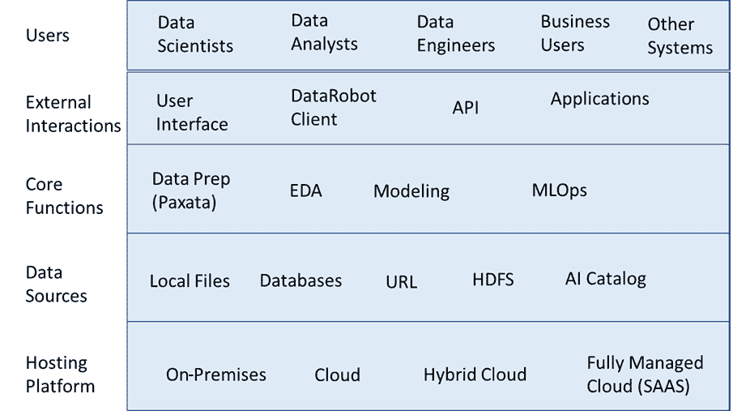

图 1.2 – DataRobot 架构的关键组件

图表展示了架构的五个关键层及其相应的组件。在接下来的章节中，我们将描述每一层以及它是如何使数据科学项目得以实现的。

## 托管平台

DataRobot 环境通过网页浏览器访问。环境本身可以托管在组织的服务器上，或者托管在云平台（如 AWS 或 DataRobot 的云）上的组织服务器实例中。每种托管选项都有其优缺点，而选择哪种选项取决于您组织的需要。其中一些在 *表 1.1* 中进行了高层次讨论：

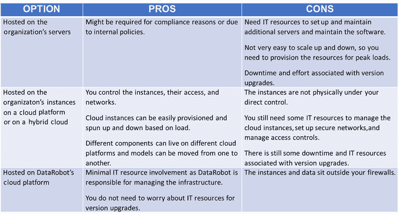

图 1.3 – 各种托管选项的优缺点

从这张表中，你可以看出 DataRobot 为你提供了很多选择，你可以选择最适合你环境的选项。重要的是让你的 IT、信息安全和法律团队参与到这次对话中来。现在让我们看看数据是如何进入 DataRobot 的。

## 数据源

数据集可以通过本地文件（`csv`、`xlsx` 等）、连接到关系型数据库、从 URL 或从 **Hadoop 分布式文件系统**（**HDFS**）（如果它适用于你的环境）导入到 DataRobot 中。数据集可以直接导入到项目中，也可以放入 AI 目录中。目录中的数据集可以在多个项目中共享。DataRobot 与多个数据管理系统提供商建立了集成和技术联盟。

## 核心功能

DataRobot 提供了一套相当全面的特性来支持整个机器学习（ML）流程，无论是通过核心产品还是通过附加组件，如 Paxata，它提供了易于使用的数据准备和**探索性数据分析（EDA**）功能。关于 Paxata 的讨论超出了本书的范围，因此我们将提供核心产品功能的详细信息。DataRobot 会自动执行几个 EDA 分析，并将这些分析呈现给用户，以获得对数据集的洞察并捕捉任何可能需要修复的数据质量问题。

自动建模功能是 DataRobot 提供的最关键的能力。这包括确定要在选定的问题上尝试的算法、执行基本特征工程、自动构建模型、调整超参数、构建集成模型以及展示结果。必须注意的是，DataRobot 主要支持监督式机器学习算法和时间序列算法。尽管有执行**自然语言处理（NLP**）和图像处理的能力，但这些功能并不全面。DataRobot 最近还通过提供快速将模型作为 REST API 部署、监控数据漂移和服务健康以及跟踪模型性能的功能，增加了 MLOps 能力。DataRobot 还在继续增加功能，例如支持地理空间数据和偏差检测。

这些任务通常需要使用 R 和 Python 等编程语言来完成，可能会相当耗时。用于编写数据分析、模型构建、输出分析和部署的代码所需的时间可能非常可观。通常，还会花费大量时间进行调试和修复错误，以及使代码更加健壮。根据模型的大小和复杂性，这个过程可能需要从几周到几个月不等。DataRobot 可以将这个时间缩短到几天。这些时间可以反过来用于更快地交付项目、构建更健壮的模型，以及更好地理解要解决的问题。

## 外部交互

可以通过一个全面的用户界面（我们将在下一节中描述）访问 DataRobot 功能，一个可以在 Python 或 R 框架中使用以编程方式通过 API 访问 DataRobot 功能的客户端库，以及一个用于外部应用程序的 REST API。DataRobot 还提供了创建应用程序的能力，这些应用程序可以被商业用户使用，使他们能够做出数据驱动的决策。

## 用户

虽然大多数人认为 DataRobot 是为不喜欢编码的数据分析师和数据科学家设计的，但它为能够编码的数据科学家提供了显著的能力，并且可以显著提高任何数据科学团队的效率。对于某些特定用例，它也提供了一些对商业用户的支持。其他系统可以通过 API 与 DataRobot 模型集成，这可以用于向外部系统添加智能或在外部数据库中存储预测。他们通过合作伙伴计划存在几个工具集成。

# 导航和使用 DataRobot 功能

现在您已经对核心功能有所了解，让我们快速浏览一下 DataRobot 的外观以及如何导航各种功能。本节将从高层次介绍 DataRobot，但请放心：我们将在后续章节中深入细节。本节仅旨在让您熟悉 DataRobot 功能。

您的 DataRobot 管理员将为您提供适当的 URL、用户名和密码以访问您的 DataRobot 实例。根据我的经验，Google Chrome 与 DataRobot 的兼容性最好，但您当然可以根据需要尝试其他浏览器。

备注

请注意，您看到的屏幕和选项取决于您拥有的产品许可证以及管理员授予您的权限。在大多数情况下，这不会影响本书的流程。由于我们将专注于 DataRobot 的 ML 开发核心，您应该能够跟上。

因此，让我们继续启动浏览器并访问您的 DataRobot URL。您将看到一个登录屏幕，如下所示：

图 1.4 – DataRobot 登录屏幕

使用您的凭据登录。登录后，您将看到一个欢迎屏幕（*图 1.4*），提示您选择您想要执行的操作。根据您的设置，您也可能直接进入数据输入屏幕（*图 1.5*）：

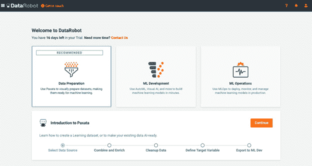

图 1.5 – 欢迎屏幕

在此阶段，我们将选择**ML 开发**选项并点击**继续**按钮。这将提示您提供您希望用于构建模型的数据集（*图 1.5*）：

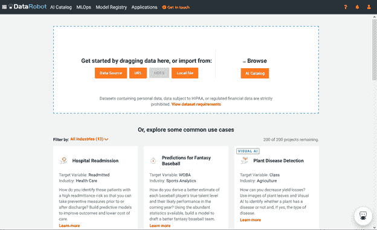

图 1.6 – 新项目/拖拽数据集屏幕

在此阶段，您可以从本地机器拖动数据集文件到屏幕上（或选择其他选项之一），DataRobot 将开始分析您数据的过程。您可以通过点击**查看数据集**要求链接来查看可用的文件格式选项（*图 1.6*）。您的实例的文件大小要求可能与这里看到的不同：

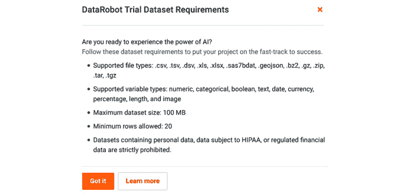

图 1.7 – 数据集要求

在这一点上，你可以从你的本地驱动器上传任何测试数据集。DataRobot 将立即开始评估你的数据（*图 1.7*）：

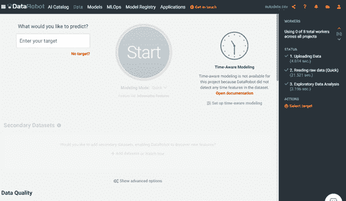

图 1.8 – 数据探索分析（EDA）

我们将在后面的章节中介绍构建项目和关联模型的过程；现在，让我们来看看我们还有哪些其他选项。如果你点击右上角的**？**图标，你会看到**文档**下拉菜单（*图 1.8*）：

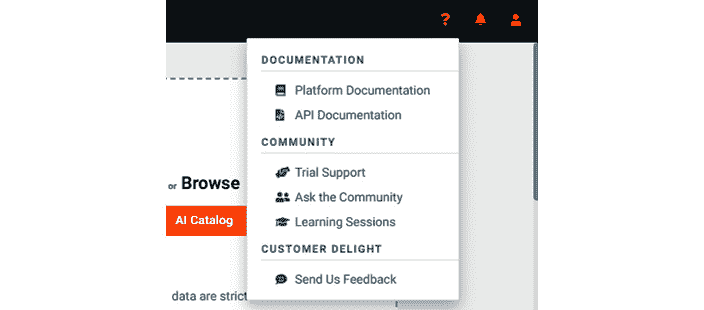

图 1.9 – 文档下拉菜单

在这里，你可以看到各种选项来了解更多关于不同功能的信息，联系客户支持，或与 DataRobot 社区互动。我强烈建议加入社区，与其他社区成员互动和学习。你可以通过[`community.datarobot.com`](https://community.datarobot.com)访问社区。如果你从下拉菜单中选择**平台文档**，你会看到关于 DataRobot 功能的详尽文档（*图 1.9*）：

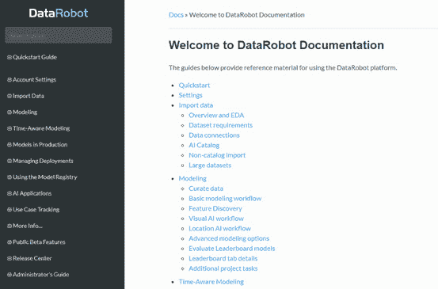

图 1.10 – DataRobot 平台文档

你可以随意查看各种主题，或者根据你正在处理的工作任务需要，返回到特定的主题。让我们再次点击右上角的**？**图标，这次从下拉菜单中选择**API 文档**。现在你会看到 DataRobot API 的文档（*图 1.10*）：

图 1.11 – DataRobot API 文档

我们将在后面的章节中介绍 API。如果你不熟悉编程或相对较新手，你现在可以忽略这部分内容。如果你是一位经验丰富的数据科学家，并且精通 Python 或 R，你可以开始审查可用的各种函数，以进一步自动化你的模型构建任务。

让我们回到 DataRobot 的主页，这次选择页面右上角的文件夹图标（*图 1.11*）：

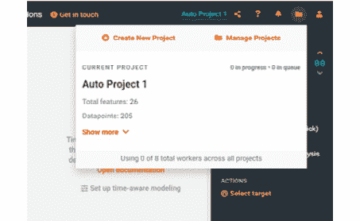

图 1.12 – 项目下拉菜单

如果你没有看到文件夹图标，这仅仅意味着你没有定义任何项目。我们将在稍后的章节中更详细地描述创建项目的过程。现在，只需熟悉不同的选项及其外观即可。在这里，你会看到创建新项目或管理现有项目的选项。在这里，你还会看到关于当前活动项目的某些细节以及最近项目的列表。

**创建新项目**选项将带您回到之前在*图 1.5*中看到的新的项目页面。如果您选择**管理项目**菜单，它将显示按创建日期列出的所有项目（*图 1.12*）。在这里，您可以选择一个项目以查看更多详细信息，克隆项目，与其他用户共享项目，或根据需要删除项目，如图所示：

![Figure 1.13 – Manage projects page]

![img/b17159_01_13.jpg]

图 1.13 – 管理项目页面

如果您点击页面右上角看起来像人的最后一个菜单项，您将看到一个下拉菜单（*图 1.13*）：

![Figure 1.14 – 用户账户管理下拉菜单]

![img/b17159_01_14.jpg]

图 1.14 – 用户账户管理下拉菜单

从这里您可以管理您的个人资料并调整账户设置。如果您有管理员权限，您可以查看和管理其他用户和组。如有需要，您还可以从 DataRobot 注销。

如果您选择**个人资料**菜单，您将看到账户的详细信息（*图 1.14*）：

![Figure 1.15 – User profile page]

![img/b17159_01_15.jpg]

图 1.15 – 用户个人资料页面

在这里您可以更新一些您的信息。您还会在顶部第二行菜单中看到一些新的菜单选项。这允许您更改设置或访问一些开发者选项等。如果您选择**设置**菜单，您将看到以下内容（*图 1.15*）：

![Figure 1.16 – 用户设置]

![img/b17159_01_16.jpg]

图 1.16 – 用户设置

在此页面上，您可以更改密码、设置双因素认证、更改主题，并设置通知（您将看到基于管理员如何设置您的账户的不同选项）。

如果您选择**开发者工具**，您将看到以下内容（*图 1.16*）：

![Figure 1.17 – Developer Tools screen]

![img/b17159_01_17.jpg]

图 1.17 – 开发者工具屏幕

在这里，您可以创建与您的账户关联的 API 密钥。如果您将使用 DataRobot API，此密钥非常有用。您还可以下载 API 包以在组织的基础设施内部署模型并设置便携式预测服务器。

如果您点击顶部的**AI 目录**菜单，您将看到 DataRobot 内可共享的数据集目录（*图 1.17*）：

![Figure 1.18 – AI Catalog]

![img/b17159_01_18.jpg]

图 1.18 – AI 目录

本页向您展示可用的数据集列表。如果您看不到任何数据集，可以通过点击**添加新数据**按钮（*图 1.18*）在此上传测试数据集。您也可以点击数据集来探索可用的数据。您可以按来源、用户定义的标签或所有者/创建者进行搜索和排序：

![Figure 1.19 – Dataset information page]

![img/b17159_01_19.jpg]

图 1.19 – 数据集信息页面

通常，数据集仅在项目中可用。如果您想在项目之间或项目迭代中共享数据集，您可以在该目录中创建数据集。这允许您在项目之间和用户之间共享这些数据集。数据集可以是静态的，也可以根据需要使用 SQL 查询动态创建。如果需要从多个表或来源为项目获取数据，您还可以通过 Spark SQL 修改或混合数据集。

如果您点击**配置文件**按钮，您将看到数据集的配置文件级别信息（*图 1.19*）。这些信息会自动为您编译。我们将在稍后详细描述这些功能及其使用方法：

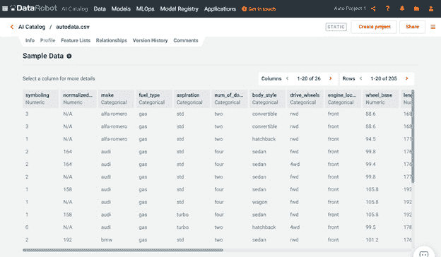

图 1.20 – 数据集信息页面

此页面显示了当时活动项目中数据集的详细信息。此页面是 DataRobot 能力的关键组成部分之一。页面显示了汇总信息以及 DataRobot 检测到的任何数据质量问题。下面，它显示了数据特征的摘要以及相对于目标特征的特征重要性。我们将在后续章节中更详细地介绍这些功能。

现在让我们点击页面左上角的**数据**菜单。此页面（*图 1.20*）展示了您当前活动项目的数据集的详细分析：

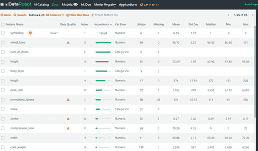

图 1.21 – 项目数据页面

本页展示了您数据集分析的结果，提供任何警告，特征的相关重要性，以及用于您项目的特征列表。我们将在后续章节中详细审查此页面的功能。

现在让我们点击顶部的**模型**菜单项。这显示了活动项目的模型排行榜（*图 1.21*）：

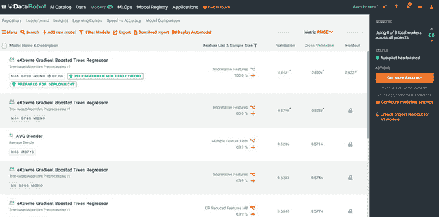

图 1.22 – 模型排行榜

这是建模过程中您将花费大量时间的另一个关键页面。在这里，您可以查看 DataRobot 构建的顶级模型及其验证、交叉验证和保留样本的性能指标。您可以深入了解任何选定的模型的细节。需要注意的是，DataRobot 主要处理监督学习问题；目前，它不支持无监督学习（除了某些异常检测）或强化学习。此外，对 NLP 和图像处理问题的支持有限。同样，在某些情况下，由于数据限制或极端规模，您会发现自动化增加了额外的开销，使得使用 DataRobot 变得不切实际。如果您的项目需要这些领域的先进功能，您将需要直接在 Python 或 R 中工作。关于这一点，我们将在后续章节中详细介绍。

现在我们转到下一个菜单项，**MLOps**。当你点击**MLOps**时，你会看到*图 1.22*所示的屏幕：

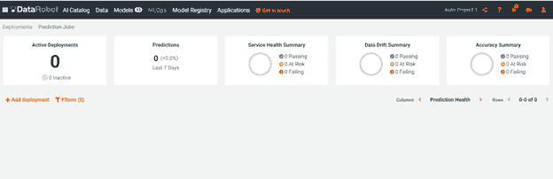

图 1.23 – MLOps 页面

**MLOps**页面显示了你的活动部署及其健康状况。你可以根据你的用例设置有关数据漂移或模型准确性的警报。

下一个菜单项是**模型注册**。现在，**模型注册**是将外部开发模型引入 DataRobot 的机制。这个功能是一个附加功能，你的组织可能已经购买或尚未购买。这个方面是一个超出本书范围的高级主题。

让我们点击下一个菜单项，**应用**。你现在会看到*图 1.23*所示的内容：

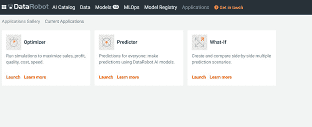

图 1.24 – 应用页面

**应用**是 DataRobot 中相对较新的功能，旨在允许商业用户轻松访问模型结果，而无需获取 DataRobot 用户许可证。

这就结束了我们对 DataRobot 是什么以及它看起来像什么的快速浏览。我们将详细回顾许多这些组件，并展示如何使用这些组件将数据科学项目从开始到结束。

# 使用 DataRobot 解决数据科学挑战

既然你已经了解了 DataRobot 提供的内容，让我们重新审视数据科学流程和挑战，看看 DataRobot 是如何帮助解决这些挑战的，以及为什么它是你的工具箱中一个有价值的工具。

## 缺乏高质量数据

尽管 DataRobot 无法做太多来应对这个挑战，但它确实提供了一些处理有质量问题数据的能力：

+   自动突出显示数据质量问题。

+   自动化的 EDA 和数据可视化可以揭示可能被忽视的问题。

+   处理并填充缺失值。

+   数据漂移检测。

## 数据爆炸

尽管数据量和种类的增加不太可能很快放缓，但 DataRobot 提供了几种能力来应对这些挑战：

+   对 SparkSQL 的支持使得大型数据集的预处理变得高效。

+   自动处理分类数据的编码并选择合适的模型蓝图。

+   自动处理地理空间特征、文本特征和图像特征。

## 缺乏经验丰富的数据科学家

这对于大多数组织和数据科学团队来说是一个关键挑战，而 DataRobot 正处于解决这个挑战的有利位置：

+   提供覆盖数据科学流程大部分步骤的能力。

+   通过提供预构建的、编码了最佳实践的蓝图，显著自动化了多个常规任务。

+   经验丰富的数据科学家可以更快地构建和部署模型。

+   对于不太擅长编码的数据分析师或数据科学家来说，可以利用 DataRobot 的能力，而无需编写大量代码。

+   对于熟悉编码的经验数据科学家来说，可以利用 API 自动构建和部署比其他情况下更大量的模型，而无需其他数据工程或 IT 人员的支持。

+   即使经验丰富的数据科学家也不知道所有可能的算法，通常也没有时间尝试许多组合，并为所有模型构建分析可视化以及解释。DataRobot 为他们处理了许多这些任务，使他们能够有更多时间专注于理解问题和分析结果。

## 不成熟的工具和环境

这是任何数据科学组织生产力和有效性的关键障碍。DataRobot 通过提供以下功能明确解决了这一关键挑战：

+   任何模型作为 REST API 部署的便捷性。

+   在开发多个竞争模型并选择最佳模型时易于使用，无需担心底层基础设施、兼容版本安装，以及无需编码和调试。这些任务可能会占用大量时间，而这些时间本可以更好地用于理解和解决业务问题。

+   DataRobot 将许多最佳实践编码到其开发过程中，以防止错误。DataRobot 自动处理许多即使是经验丰富的数据科学家也可能忽略的小细节，导致模型有缺陷或需要返工。

+   DataRobot 提供模型和建模步骤的自动化文档，否则可能会被忽略或遗忘。这在数据科学家稍后需要回顾他们或他人构建的旧模型时变得非常有价值。

## 黑盒模型

这是 DataRobot 投入大量工作以提供方法帮助模型更具可解释性的关键挑战，以下是一些方法：

+   自动生成模型的特征重要性（使用 Shapley 值和其他方法）和部分依赖图。

+   自动生成特定预测的解释。

+   自动生成可用于解释复杂模型的简单模型。

+   创建本质上更具可解释性的模型的能力，例如**广义加性模型**（**GAMs**）

## 偏差与公平性

最近，DataRobot 增加了帮助检测模型中偏差和公平性问题的新功能。这并不能保证完全没有偏差，但它是确保向积极方向发展的良好起点。以下是一些新增功能：

+   指定需要检查偏差的保护特征。

+   指定您想要用于检查公平性的偏差度量。

+   使用保护特征的指标评估您的模型。

+   使用模型解释来调查是否存在不公平的潜在可能性。

虽然许多人认为，有了这些自动化工具，您就不再需要数据科学家，但这与事实相去甚远。然而，很明显，这样的工具将通过更快地释放更多价值并使这些组织更具竞争力，使数据科学团队对其组织更有价值。因此，工具如 DataRobot 可能会越来越普遍，并得到广泛的应用。

# 摘要

今天的大多数数据科学家都陷入了实现细节的泥潭，或者正在实施次优算法。这让他们理解问题的时间更少，寻找最优算法或其超参数的时间也更少。这本书将向您展示如何将您的技能提升到下一个层次，并让软件完成重复性工作。

在本章中，我们讨论了典型的数据科学流程以及 DataRobot 如何支持这一流程。我们讨论了 DataRobot 提供大量功能的流程步骤，并强调了数据科学家在特定领域（如问题理解和分析模型部署对整体系统的影响）的专业知识和领域理解至关重要的领域。这突出了一个重要观点，即成功来自于熟练的数据科学家和分析师以及适当的工具（如 DataRobot）的结合。仅凭他们自己，并不能像结合使用那样有效。DataRobot 使相对较新的数据科学家能够快速开发和部署稳健的模型。同时，经验丰富的数据科学家可以使用 DataRobot 快速探索和构建比他们自己能够构建的更广泛的模型。

我们讨论了一些关键的数据科学挑战以及 DataRobot 如何帮助您克服一些具体挑战。这应该有助于指导领导者如何制定合适的数据科学家组合以及他们所需的工具和基础设施。我们还介绍了 DataRobot 架构、其组件以及 DataRobot 的外观。您已经体验到了开始使用它时将看到的内容，以及如何找到特定的功能和帮助。

希望本章已经向您展示了为什么无论您的经验如何或您对编码的舒适度如何，DataRobot 都可能是您工具箱中的重要工具。在接下来的章节中，我们将通过实际案例来展示如何详细使用 DataRobot，以及如何将您的项目提升到更高的水平。但在我们这样做之前，我们需要在下一章中介绍一些机器学习的基本知识。
