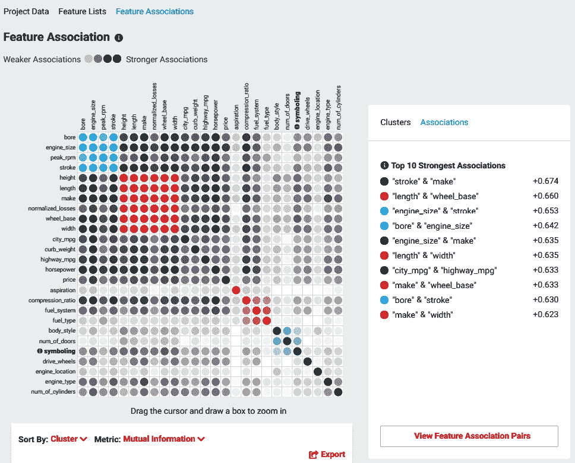
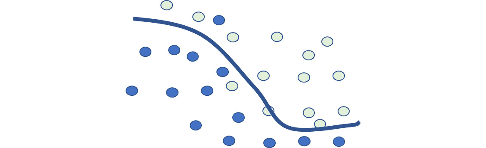
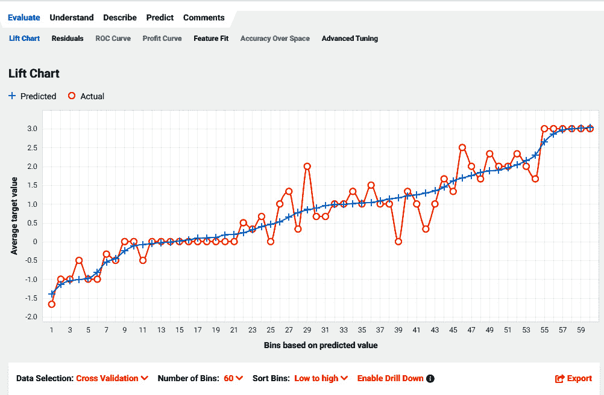
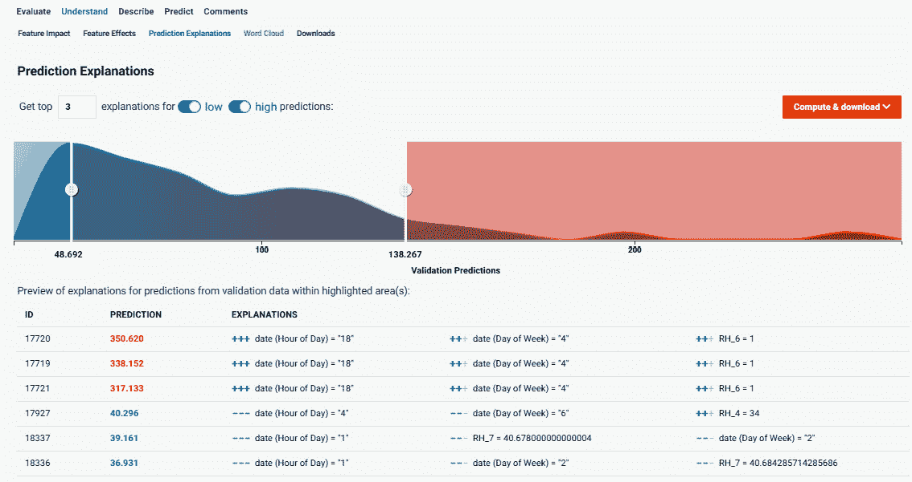
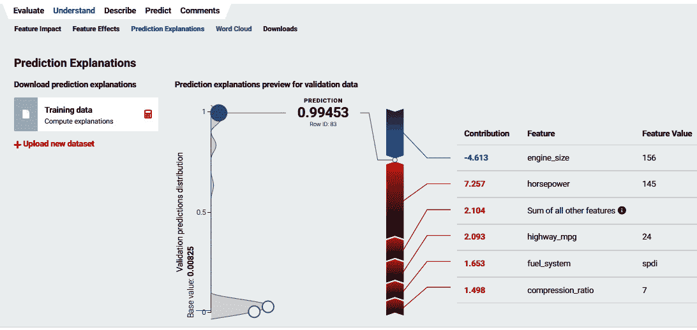

# 第二章：机器学习基础

本章涵盖了本书中将使用和参考的一些机器学习的基本概念。这是您为了有效地使用 DataRobot 所需了解的最基本知识。经验丰富的数据科学家可以安全地跳过本章。本章的目的不是让您对统计学或机器学习有一个全面的理解，而是对一些关键思想和概念进行复习。此外，重点在于了解您需要了解的实践方面，以便理解核心思想，而不必过多地深入细节。您可能会想直接跳入并让 DataRobot 自动构建模型，但如果没有基本理解，这样做可能会适得其反。如果您是数据科学团队的领导者，请确保您的团队中有经验丰富的数据科学家，他们正在指导他人，并且已经建立了其他治理流程。

在实际操作示例中，一些概念将会再次出现，但在这里我们涵盖了可能不会在特定示例中出现，但可能在某个时候与您的项目相关的许多概念。这里列出的主题可以用作指南，以确定您开始使用 DataRobot 等强大工具所需的一些基本知识。

到本章结束时，您将学习到使用 DataRobot 有效地所需的一些核心概念。在本章中，我们将涵盖以下主要主题：

+   数据准备

+   数据可视化

+   机器学习算法

+   性能指标

+   理解结果

# 数据准备

在算法可以应用于数据集之前，数据集需要符合一定的模式。数据集还需要没有错误。某些方法和技术被用来确保数据集为算法做好准备，这将是本节的重点。

## 监督学习数据集

由于 DataRobot 主要处理监督学习问题，因此我们只关注监督机器学习的数据集（其他类型将在后面的章节中介绍）。在监督机器学习问题中，我们将所有答案作为数据集的一部分提供。想象一下一张数据表，其中每一行代表一组线索及其相应的答案（*图 2.1*）：

图 2.1 – 监督学习数据集

这个数据集由包含线索（这些被称为**特征**）的列组成，还有一个包含答案的列（这被称为**目标**）。给定一个类似这样的数据集，算法学习如何根据一组线索产生正确的答案。无论你的数据以何种形式存在，你的任务首先是将其转换成类似于*图 2.1*中的表格。请注意，你可能拥有的线索可能分布在多个数据库或 Excel 文件中。你必须将这些信息全部汇总到一个表格中。如果你拥有的数据集很复杂，你可能需要使用 SQL 等语言，**Python Pandas**或**Excel**等工具，或者**Paxata**等工具。

## 时间序列数据集

时间序列或预测问题将时间作为数据集的关键组成部分。它们与监督学习数据集类似，略有不同，如*图 2.2*所示：

图 2.2 – 时间序列数据集

你需要确保你的时间序列数据集看起来与前面的图示一样。它应该有一个基于日期或时间的列，一个包含你试图预测的序列值的列，以及所需的线索列。如果你需要预测多个时间序列，你也可以添加帮助分类不同序列的列。例如，你可能对预测日期 5 和 6 的销量感兴趣。如果你的数据以其他形式存在，它需要被转换成类似于前面的图示。

## 数据清洗

你收到的数据通常会有错误。例如，你可能在应该包含数字的字段中看到文本。你可能会看到价格列中的值偶尔包含美元符号，但其他时候没有。DataRobot 可以捕捉到其中的一些，但有时自动化工具不会捕捉到这些错误，所以你需要仔细查看和分析数据集。有时将你的数据上传到 DataRobot 以查看它发现了什么，然后使用其分析来确定下一步行动是有用的。一些清洗工作需要在 DataRobot 之外完成，所以请准备好迭代几次以正确设置数据集。需要注意的常见问题包括以下内容：

+   列中的数据类型错误

+   列中的混合数据类型

+   数字列中的空格或其他字符使它们看起来像文本

+   同义词或拼写错误

+   作为字符串编码的日期

+   日期格式不同

## 数据归一化和标准化

当不同的数据特征具有不同的规模和范围时，比较它们对目标值的影响变得更加困难。此外，许多算法在处理不同规模的数据值时存在困难，有时会导致稳定性问题。避免这些问题的方法之一是对值进行归一化（不要与数据库范式混淆）或标准化。

在归一化（也称为缩放）中，您将值缩放，使它们在 0 到 1 之间：

Xnormalized = (X – Xmin) / (Xmax – Xmin)

另一方面，标准化会将数据中心化，使得平均值变为零，并按比例缩放，使得标准差变为 1。这也被称为数据的 **z 分数**：

Xstandardized = (X – Xmean) / XSD

在这里，Xmean 是所有 X 值的平均值，XSD 是 X 值的标准差。

通常，您不必担心这个问题，因为 DataRobot 会根据需要自动对数据集进行此操作。

## 异常值

异常值是相对于其他数据集值似乎不合适的数据。这些值可能非常大或非常小。一般来说，与平均值相差超过三个标准差的数据被视为异常值，但这仅适用于预期值呈正态分布的特征。异常值通常来自数据质量问题或一些不寻常的情况，这些情况被认为不足以作为训练数据。通常，被认为异常的数据点会被从数据集中移除，以防止它们对模型产生过度影响。这些经验法则仅用于突出候选值。您将必须运用自己的判断来确定是否有任何值是异常值，以及是否需要将其移除。再次强调，DataRobot 将突出潜在的异常值，但您必须审查这些数据点并确定是否将其移除或保留。

## 缺失值

这是在数据集中非常常见的问题。您的数据集可能包含许多标记为 **NULL** 或 **NaN** 的缺失值。在某些情况下，您可能会看到一个 **?**，或者您可能会看到一个组织可能用来表示缺失或未知值的异常值，例如 **-999**。您如何处理这些值在很大程度上取决于您试图解决的问题以及数据集代表的内容。很多时候，您可能会选择删除包含缺失值的行数据。有时，这可能不可行，因为您可能没有足够的数据，删除这些行可能会导致您数据集的重要部分被移除。有时，您可能会看到一个特征（或列）中有大量可能缺失的值。在这些情况下，您可能希望从数据集中删除该特征。

处理这种情况的另一种可能方法是使用合理的猜测来填充缺失值。这可能采取零值、该特征的平均值或该特征的中间值的形式。对于分类数据，缺失值通常被视为一个单独的类别。

更复杂的方法使用 k 最近邻算法根据其他相似数据点计算缺失值。没有一个答案在每次都适用，所以你需要使用你的判断和对问题的理解来做出决定。最后一个选项是让它保持原样，让 DataRobot 找出如何处理这种情况。DataRobot 有许多插补策略以及处理缺失值的算法。但你必须小心，因为这可能并不总是导致最佳解决方案。与经验丰富的数据科学家交谈，并使用你对业务问题的理解来规划行动方案。

## 类别编码

在许多问题中，你必须将你的特征转换为数值。这是因为许多算法无法处理类别数据。有许多方法可以编码类别值，DataRobot 内置了许多这些方法。其中一些技术包括单热编码、留一编码和目标编码。我们不会深入细节，因为通常你会让 DataRobot 为你处理这些，但可能会有一些情况，由于你对业务问题的理解，你可能需要以特定方式自行编码。DataRobot 的这个特性可以节省大量时间，并且通常对大多数问题都工作得很好。

## 合并类别

有时，你会有包含大量类别的类别数据。尽管有处理大量类别计数的方法（如前文所述），但很多时候，合并类别是明智的。例如，你可能有很多包含非常少数据点但彼此非常相似的类别。在这种情况下，你可以将它们合并为一个类别。在其他情况下，可能只是有人使用了不同的拼写、同义词或缩写。在这种情况下，最好也将它们合并为一个类别。有时，你可能想将数值特征分割成对用户或利益相关者有业务意义的区间。这是你需要根据对问题的理解自行进行的数据准备的一个例子。你应该在将数据上传到 DataRobot 之前完成这项工作。

## 目标泄漏

有时，数据集包含来自目标本身的特征。这些特征在事先未知或在预测时未知。无意中使用这些特征来构建模型会导致下游问题。这个问题被称为目标泄漏。应仔细检查数据集，并从训练特征中删除这些特征。DataRobot 还会自动分析特征，并尝试标记可能导致目标泄漏的任何特征。

## 项-文档矩阵

您的数据集中可能包含包含文本或注释的特征。这些注释通常包含对做出决策有用的重要信息。然而，许多算法却无法直接利用这些文本。这些文本必须被解析成数值，以便对建模算法变得有用。为此有几种方法，其中最常见的是术语-文档矩阵。这里的文档指的是单个文本或注释条目。这些文档可以被解析以分割成术语。现在您可以计算一个术语在文档中出现的次数。这个结果可以存储在一个称为**词频（TF**）矩阵中。其中一些信息也可以在词云中进行可视化。DataRobot 会自动为您构建这些词云。虽然 TF 很有用，但它可能存在局限性，因为某些术语可能在所有文档中都非常常见，因此它们在区分文档方面并不很有用。这导致另一个想法，即我们可能应该寻找仅对某些文档具有独特性的术语。这种给仅在某些文档中出现的术语赋予更多权重的概念被称为**逆文档频率（IDF**）。一个术语在文档中多次出现（TF）并且相对罕见（IDF）的组合被称为**TFIDF**。TFIDF 是 DataRobot 会自动为您计算并应用于包含文本的特征。

## 数据转换

虽然 DataRobot 会为您执行许多数据转换（并且它一直在添加更多），但有许多转换会影响您的模型，但 DataRobot 却无法捕捉到。您将不得不自己执行这些操作。这些操作的例子包括数学转换，如对数、平方、平方根、绝对值和差值。其中一些简单的可以在 DataRobot 内部设置，但对于更复杂的转换，您必须在 DataRobot 外部或使用 Paxata 等工具执行操作。有时，您会进行转换以线性化问题或处理具有长尾数据的特征。DataRobot 自动执行的一些转换如下：

+   计算聚合，如计数、最小值、最大值、平均值、中位数、最频繁值和熵

+   一个广泛的时间相关特征列表，例如随时间的变化、随时间的最大值和随时间的平均值

+   一些文本提取特征，例如词数、提取的标记和术语-文档矩阵

+   来自地理空间数据的地理空间特征

我们将在*第四章*中更详细地讨论这个主题，*为 DataRobot 准备数据*。

## 线性相关性检查

在任何给定的数据集中，都存在一些与其他特征高度相关的特征。本质上，它们携带与某些其他特征相同的信息。通常希望删除这些在数据集中高度重复其他特征的特性。DataRobot 会自动为您执行这些检查，并将这些共线性特征标记出来。这对于线性模型尤为重要，但一些新的方法可以更好地处理这个问题。使用的阈值取决于建模算法和您的业务问题。在 DataRobot 中删除这些特征以用于建模是非常容易的。

DataRobot 还生成一个相关矩阵，显示不同特征之间的相关性。这有助于识别共线性特征以及模型中要使用的候选关键特征。通过分析相关矩阵，您可以深入了解您的数据和问题。在*第五章*，“使用 DataRobot 进行探索性数据分析”，我们将讨论如何进行这种分析的示例。

## 数据划分

在开始构建模型之前，您需要将数据集划分为三个部分。这些部分被称为训练集、验证集和保留集。在模型构建过程中，这三个部分用于不同的目的。通常将数据集的 10-20%划分为保留集。剩余的部分进一步划分，其中 70-80%用于训练集，20-30%用于验证集。这种划分是为了确保模型不会过拟合，并且部署时预期的结果与模型构建期间看到的结果一致。

仅使用训练集来训练模型。验证集的设计是为了通过执行多次交叉验证测试来调整算法，以优化结果。最后，在构建模型后，使用保留集来测试模型在之前从未见过的数据上的表现。如果保留集上的结果可以接受，那么模型可以考虑部署。

DataRobot 自动化了这一过程的大部分，但它允许用户自定义分割百分比，以及如何进行分割。它还通过自动分割数据以进行基于时间的回溯测试，为时间序列或预测问题执行类似的功能。

# 数据可视化

数据分析师或数据科学家需要完成的最重要的任务之一是理解数据集。数据可视化是实现这一理解的关键。DataRobot 提供了各种可视化数据集的方法，以帮助您理解数据集。这些可视化是自动为您构建的，这样您就可以花时间分析它们，而不是准备它们。让我们看看这些是什么，以及如何使用它们。

当您访问项目的数据页面（*图 1.20*）时，您将看到您数据集的高级概要信息。仔细检查这些信息以全面了解您的数据集。如果您点击左上角的**特征关联**菜单，您将看到特征是如何相互关联的（*图 2.3*）：

图 2.3 – 使用互信息进行特征关联

此图展示了使用互信息指标来表示的相互关系。**互信息（Mutual Information，MI**）利用信息论来确定从另一个特征中获取关于一个特征的信息量。与皮尔逊相关系数相比，使用 MI 的好处是它可以用于任何类型的特征。其值从 0（两个特征是独立的）到 1（它们携带相同的信息）。这在确定哪些特征将是模型的良好候选者以及哪些特征不会提供任何有用的信息或冗余方面非常有用。在模型构建开始之前，理解并使用这种视图非常重要，尽管 DataRobot 会自动使用这些信息来做出建模决策。

除此之外，还有一个指标也被用于类似的功能。如果您点击前一个截图底部的指标下拉菜单，可以选择另一个名为**克拉美尔 V（Cramer's V**）的指标。一旦选择克拉美尔 V，您将看到一个类似的图形视图（*图 2.4*）：

图 2.4 – 使用克拉美尔 V 进行特征关联

克拉美尔 V 是 MI 的一个替代指标，并且使用方式相似。其值范围也从 0（无关系）到 1（特征高度相关）。克拉美尔 V 通常与分类变量一起使用，作为皮尔逊相关系数的替代。

注意到 DataRobot 自动找到了相互关联的特征簇。每个簇都用不同的颜色编码，特征在 *图 2.4* 中按簇排序。您可以放大到特定的簇以进一步检查它们。这是 DataRobot 环境的一个重要特性，因为非常少的数据科学家了解这个想法或使用它。这些簇很重要，因为它们突出了相互关联的特征组。这些复杂的相互依赖关系通常对于理解业务问题非常重要。通常，只有拥有大量领域经验的人才知道这些复杂的相互依赖关系。大多数人甚至不会意识到这些复杂性。如果您是某个领域的初学者，那么理解这些将相当于多年的经验。仔细研究这些，与您的业务专家讨论，以全面理解他们试图强调的内容，然后利用这些见解来改进您的模型以及您的业务流程。

此外，请注意 DataRobot 提供了一份前 10 个最强关联的列表。注意这些关联，并花些时间思考它们对您的问题意味着什么。这些关联与您对领域的了解一致吗，或者有一些惊喜？往往是惊喜导致了关键的见解，这些见解可能对您的业务具有价值。在以下列表中，您可以看到一个**查看特征关联对**按钮。如果您点击该按钮，您将看到*图 2.5*：

![Figure 2.5 – 特征关联细节

![img/Figure_2.5_B17159.jpg]

图 2.5 – 特征关联细节

此图形详细展示了两个选定特征之间的关系。在这个例子中，一个特征是分类的，而另一个是数值的。该图显示了这两个特征之间的关系，并可能为问题提供额外的见解。务必调查这些关系，特别是那些可能不符合直觉的关系。

现在，您可以点击特定的特征来查看它们的分布情况(*图 2.6*)：

![Figure 2.6 – 特征细节

![img/Figure_2.6_B17159.jpg]

图 2.6 – 特征细节

此视图显示了值的分布直方图以及它们与目标值的关系。需要关注的关键点是数据不足的范围以及非线性区域。这些可能给您提供关于特征工程的想法。这些也是您询问系统为何表现出这种行为的区域？

在完成这项背景工作后，您现在可以开始深入研究建模算法。

# 机器学习算法

现在有成百上千种机器学习算法可用于机器学习项目，而且每天都有新的算法被发明。DataRobot 支持广泛的开源机器学习算法，包括几个深度学习算法——Prophet、基于 SparkML 的算法和 H2O 算法。现在让我们看看存在哪些类型的算法以及它们的应用(*图 2.7*)：

![Figure 2.7 – 机器学习算法

![img/Figure_2.7_B17159-DESKTOP-C2VUV36.jpg]

图 2.7 – 机器学习算法

我们的重点将主要放在 DataRobot 支持的算法类型上。这些算法类型将在以下子节中描述。

### 监督学习

当您可以在训练数据集中提供答案（也称为标签）时，会使用监督学习算法。对于监督学习，您必须将数据集的一个特征指定为答案，算法通过观察多个示例并从这些示例中学习来尝试预测答案。参见*图 2.8*了解不同类型的答案：

![Figure 2.8 – 监督学习算法的目标

![img/Figure_2.8_B17159.jpg]

图 2.8 – 监督学习算法的目标

DataRobot 的功能主要集中于监督学习算法。其中包括深度学习算法以及来自 SparkML 和 H2O 的大数据算法。DataRobot 内置了最佳实践来选择最适合你问题和数据集的算法。有四种主要的监督学习问题类型：

### 回归

回归问题是指答案（目标）以数值形式出现的问题（参见*图 2.8*）。回归模型试图拟合一条曲线，使得预测值与实际值之间的误差在整个训练数据集上最小化。有时，甚至可以将分类问题设置为一个数值回归问题。在这种情况下，答案是数字，然后可以通过阈值将其转换为二进制。逻辑回归就是这样一种方法，它产生一个介于零和一之间的值。你可以将低于某个阈值的所有答案标记为零，而高于阈值的答案标记为一。根据问题，可以使用线性回归算法以及非线性回归算法。模型评估基于回归线与数据匹配的程度。常用的指标包括**RMSE**、**MAPE**、**LogLoss**和**R-squared**。常用的算法包括**XGBoost**、**Elastic Net**、**随机森林**和**GA2M**。

### 二元分类

二元分类问题具有只能取两个不同值的答案（称为类别）。这些可以是 0 或 1、是或否等形式。请参阅*图 2.8*以了解二元分类的目标特征的示例。你通常会遇到的一个典型问题是类别不平衡问题。当大多数数据集偏向于一个类别时，这种情况就会发生。这些通常通过在存在足够训练数据的情况下对过度代表的类别进行下采样来解决。当这不可能时，你可以尝试对代表性不足的类别进行过采样或使用其他方法。这些方法都不是完美的，有时你必须尝试不同的方法来查看哪种方法最有效。DataRobot 提供了在需要时指定下采样的机制。常用的二元分类算法包括**逻辑回归**、**k 最近邻**、**基于树的算法**、**SVM**和**朴素贝叶斯**。在分类问题的情况下，最好避免使用准确率作为评估结果的指标。结果通常以混淆矩阵的形式展示（本章后面将描述）。DataRobot 将自动选择在这种情况下使用适当的指标。

### 多类分类

多类分类问题是指您试图预测两个以上类别或类别的那些问题。为了简单说明目标可能的样子，请参阅*图 2.8*。多类分类能力是最近添加的，DataRobot 的许多功能可能无法与这类问题一起使用。由于没有下采样可用，您可能需要在将数据集上传到 DataRobot 之前调整您的采样。此外，请注意，您可以通过将类别合并为两个类别来经常将问题简化为二元分类问题。这可能或可能不会适用于您的用例，但如果需要，这是一个选项。此外，并非所有算法都适用于多类问题。DataRobot 将自动选择适当的算法来构建多类问题的模型。典型的指标包括 AUC、LogLoss 或平衡准确率。结果通常以混淆矩阵的形式显示（本章后面将描述）。典型的算法包括 XGBoost、随机森林和 TensorFlow。

### 时间序列/预测

时间序列或预测模型在 DataRobot 中也被称为时间感知模型。在这些问题中，您有随时间变化的数据，并且您对预测/预测未来的目标值感兴趣（*图 2.2*）。DataRobot 不仅支持时间序列的常用算法，如 ARIMA，还可以将这些问题调整为机器学习回归问题，然后应用 XGBoost 等算法来解决它们。这些问题要求将序列转换为平稳序列，并需要大量特征工程来创建基于时间的特征。这些问题还要求您考虑过去可能重复发生的重要事件（如假日或大型购物日）。时间序列模型还需要通过称为回测的特殊方法来处理验证和测试：

图 2.9 – 时间序列问题的回测

在回测中，使用过去数据构建模型，然后使用较新的、模型从未见过的保留数据来测试。这种基于时间的保留数据切片也被称为时间外验证。DataRobot 为您自动化了许多这些任务，我们将在后面更详细地看到。

### 算法

让我们回顾一下 DataRobot 中使用的几种主要算法。在这里，我们只提供这些算法的高级概述。这些算法可以通过改变它们的超参数来针对特定问题进行调整。要更详细地了解任何特定算法，您可以参考机器学习书籍或 DataRobot 文档。以下是一些重要的算法：

+   **随机森林**。随机森林模型是通过创建多个决策树模型，然后使用输出的平均值来构建的。这是通过创建训练数据的自助样本并在这些建立决策树（*Figure 2.10*）来实现的：

![Figure 2.10 – Random forest]

![Figure 2.10_B17159.jpg]

Figure 2.10 – Random forest

随机森林模型可以处理缺失数据和非线性，并在许多情况下被证明非常有效。随机森林模型可以用于回归问题以及分类问题：

+   **XGBoost**：也称为**eXtreme**梯度提升树，是基于决策树的算法，因其通常能产生非常有效的预测并能够处理缺失值而变得非常流行。它们可以处理非线性问题和特征之间的交互。XGBoost 通过创建一个随机森林并在先前树的残差上构建树来建立在随机森林模型之上。这样，每一组新的树都能够产生更好的结果。XGBoost 既可以用于回归问题，也可以用于分类问题。

+   **Rulefit**：Rulefit 模型是简单规则的集成。你可以将这些规则想象成像决策树一样链接在一起。Rulefit 模型更容易理解，因为大多数人可以理解将规则组合起来解决问题。DataRobot 通常构建此模型以帮助您理解问题并提供见解。您可以去“模型”标签页的见解部分查看从 Rulefit 模型生成的见解以及给定规则对问题的有效性。它们可以用于分类问题以及回归问题。

+   **ElasticNet**、**Ridge 回归器**、**Lasso 回归器**：这些模型使用正则化来确保模型不会过拟合且不会过于复杂。正则化是通过添加更多特征的惩罚来实现的，这反过来迫使模型要么丢弃一些特征，要么减少它们的相对影响。Lasso 回归器（也称为**L1 回归器**）使用的是系数的绝对值作为惩罚权重。使用 Lasso 的效果是尝试将系数减少到零，从而选择重要的特征并移除那些贡献不大的特征。Ridge 回归器（也称为**L2 回归器**）使用的是平方系数作为惩罚权重。这种影响是减少系数的幅度。**ElasticNet**用于指代同时使用 Lasso 和 Ridge 正则化的线性模型，以产生既简单又正则化的模型。当你有很多相互关联的特征时，这非常有用。

+   **逻辑回归**：逻辑回归是一种用于二元分类的非线性回归模型。输出形式为概率值，范围从 0 到 1。这通常与一个阈值一起使用，以将值分配为 0 或 1。

+   **SVM**（**支持向量机**）：这是一种试图找到最佳分离类别的分类算法。在二维空间中很容易看出它的样子（*图 2.11*），但该算法在高维空间中也被证明效果良好。SVM 的另一个优点是它通过使用非线性核函数来处理非线性，这些核函数可以将问题线性化：

图 2.11 – 监督学习算法的目标

+   **GA2M**（**广义加性模型**）：这是那些罕见的同时提供可理解性和高准确性的算法之一，即使在非线性问题中也能提供高准确率。名字中的数字“2”代表其建模特征之间交互的能力。GAM 模型的输出是各个特征效应经过分箱后的输出之和。由于 GAM 允许这些效应是非线性的，因此它可以捕捉问题的非线性本质。模型的结果可以用一个简单的表格表示，该表格显示了每个特征对整体答案的贡献。这种表格表示方式对大多数人来说很容易理解。对于那些可理解性和可解释性非常重要的行业或用例，这可能是你可以选择的最佳选项之一。

+   **K-最近邻**：这是一个非常直接的算法，它找到 k 个最近的数据点（基于一种特定的距离计算方式）。现在它为这些 k 个点找到分类答案。然后它确定得票最多的答案，并将其作为答案。默认的距离度量是**欧几里得**距离，但 DataRobot 会根据数据集选择合适的度量。用户还可以指定要使用的特定距离度量。

+   **TensorFlow**。TensorFlow 是一个基于深度神经网络的深度学习模型。深度神经网络是指由人工神经元集合组成的深层隐藏层。这些神经元携带高度非线性的激活函数，允许它们适应高度非线性问题。这些模型在不需要特征工程的情况下就能产生高准确率，但与其它算法相比，它们需要更多的训练数据。这些模型通常被认为非常不透明，容易过拟合，因此不适合某些应用。它们在特征和特征工程难以提取的应用中特别成功，例如图像处理。这些模型可以用于回归问题，也可以用于分类问题。

+   **Keras 神经网络**：Keras 是一个基于 TensorFlow 构建的高级深度学习库，它允许将多种类型的深度学习模型集成到 DataRobot 中。作为一个高级库，它使得构建 TensorFlow 模型变得容易得多。前述章节中描述的一切都适用于 Keras。在 DataRobot 中的特定实现非常适合稀疏数据集，并且特别适用于文本处理和分类问题。

## 无监督学习

无监督学习问题是指你未提供答案或标签的问题。这类问题的例子包括聚类或异常检测。DataRobot 对于这些问题没有太多提供，但它确实有一些异常或离群值检测的能力。这些问题是指数据点以一种非常罕见的方式不寻常。例子包括欺诈检测、网络安全漏洞检测、故障检测和数据离群值检测。DataRobot 允许你设置一个没有目标的项目，然后它会尝试识别异常数据点。对于任何聚类问题，你应该尝试使用 Python 或 R 来创建聚类模型。

## 强化学习

强化学习问题是你希望学习一系列由代理做出的决策，以便实现某个特定目标的情况。这个目标与一个奖励相关联，该奖励是给予代理的，以奖励其完全或部分实现目标。对于这种训练没有可用的数据集，因此代理必须尝试多次（使用不同的策略）并在每次尝试中学习一些东西。经过多次尝试，代理将学会产生最佳奖励的策略或规则。正如你现在可以猜到的，这些算法在没有数据但可以在现实世界（或合成世界）中反复实验的情况下工作得最好。正如我们之前讨论的，DataRobot 不是这类问题的合适工具。

## 集成/混合模型

集成是一种创建聚合或混合其他模型预测的模型的技术。不同的算法有时能更好地利用问题的不同方面或数据集。这意味着很多时候，通过结合几个好的模型，你可以提高预测的准确性。当然，这也伴随着复杂性和成本的提高。DataRobot 提供了许多混合方法，并且在大多数情况下，它会自动为你的项目构建混合模型。然后你可以评估提高的准确性是否足以证明额外的复杂性是合理的。

## 蓝图

在 DataRobot 中，每个模型都与一个蓝图相关联。蓝图是 DataRobot 用来训练特定模型的一步一步的食谱。参见*Figure 2.12*以获取示例：

![Figure 2.12 – 模型蓝图

![Figure 2.12_B17159.jpg]

Figure 2.12 – 模型蓝图

蓝图显示了 DataRobot 构建特定模型所采取的所有步骤，包括 DataRobot 所做的任何数据准备和特征工程。点击任何特定的框将显示采取的行动、使用的参数以及特定算法的文档。这也为您的建模项目提供了出色的文档，这些文档是自动为您创建的。

现在，让我们看看如何确定算法的表现如何。为此，我们需要一些性能指标。

# 性能指标

DataRobot 为模型提供了一系列的性能指标。您必须指定您想要用于优化项目模型的指标。通常，最佳指标是 DataRobot 推荐的指标。一旦模型构建完成，DataRobot 也会计算其他指标，因此您可以跨多个指标查看您模型的成果。请记住，没有哪个指标适合所有情况，您在选择评估结果的指标时应该谨慎。以下是关于常用指标的一些详细信息：

+   **RMSE**（**均方根误差**）：RMSE 是一个首先计算误差平方（实际值与预测值之间的差异）的指标。然后，在整个数据集上平均这些值，然后计算这个平均值的平方根。鉴于这个指标依赖于值的规模，其解释依赖于问题。您不能比较两个不同数据集的 RMSE。这个指标在数据不是高度偏斜的回归问题中经常使用。

+   **MAPE**（**平均绝对百分比误差**）：MAPE 在某种意义上与 RMSE 相似，因为它首先计算百分比误差的绝对值。然后，这些值在数据集上平均。鉴于这个指标按百分比缩放，比较不同数据集的 MAPE 更容易。然而，您必须注意，非常小的值（或零值）的百分比误差往往看起来很大。

+   **SMAPE**（**对称 MAPE**）：SMAPE 与 MAPE 相似，但解决了上述讨论的一些缺点。SMAPE 限制了上限百分比值，这样小的值的误差就不会压倒指标。这使得 SMAPE 成为一个可以轻松跨不同问题比较的好指标。

+   **准确率**：准确率是用于分类问题的指标之一。它可以表示如下：

    *准确率 = 正确预测数/总预测数*

    它实际上是正确预测数与所有预测数的比率。对于不平衡问题，这个指标可能会误导，因此它从不单独用来确定模型的表现。它通常与其他指标结合使用。

+   **平衡准确率**：平衡准确率通过在预测的两个类别上归一化准确率来克服准确率的问题。假设两个类别是 A 和 B：

    (a) *A 的准确率 = 正确预测 A 的数量/总数 A*

    (b) *B 的准确率 = 正确预测 B 的数量/总数 B*

    (c) *平衡准确率 = A 的准确率 + B 的准确率/2*

    平衡准确率实际上是 A 的准确率和 B 的准确率的平均值。

+   **AUC**（**ROC 曲线下的面积**）：AUC 是 ROC 曲线下的面积。这个指标经常用于分类问题，因为它也克服了与准确率指标相关的缺陷。ROC 曲线表示真正例率和假正例率之间的关系。AUC 从 0 到 1，它显示了模型区分两个类别的效果。0.5 表示随机模型，因此你希望你的模型的 AUC 大于 0.5。

+   **伽马偏差**：伽马偏差用于目标值呈伽马分布的回归问题。对于此类目标，伽马偏差测量预测值与实际值之间的平均偏差的两倍（使用对数似然函数）。拟合完美的模型将具有零偏差。

+   **泊松偏差**：泊松偏差用于回归问题，当目标是计数偏斜数据时。它的工作方式与伽马偏差非常相似。

+   **LogLoss**: LogLoss（也称为交叉熵损失）是衡量分类问题预测概率不准确性的指标。值为 0 表示模型完美，随着模型变差，logloss 值增加。

+   **R 平方**：R 平方是用于回归问题的指标，它说明了拟合线如何代表数据集。其值介于 0 和 1 之间。0 表示模型较差，无法解释任何变化，而 1 表示模型完美，解释了 100%的变化。它是使用最广泛的指标之一，但可能会因为增加更多变量而提高，而不一定改善模型。它也不适用于非线性问题。

现在我们已经讨论了一些常用的指标，让我们看看如何查看其他结果来评估模型的质量，以及不同特征对模型的影响。

# 理解结果

在本节中，我们将讨论各种指标和其他信息的可视化，以了解建模练习的结果。这些是除了上一节讨论的模型指标外，需要仔细检查的重要可视化。这些可视化是由 DataRobot 为它训练的任何模型自动生成的。

## 升值图

升值图显示了模型在预测目标值方面的有效性。由于数据点通常非常多，无法在一个图形中显示，因此升值图对输出进行排序，并将数据聚合到多个区间中。然后，它比较每个区间中预测值和实际值的平均值（*图 2.13*）：

图 2.13 – 升值图

前面的升值图显示了预测是如何从低到高排序，然后分箱（本例中有 60 个箱）。现在你可以看到每个箱中的平均预测值和平均实际值。这让你对模型在整个范围内的表现有一个概念。你可以看到模型表现较差的范围。如果模型在对你业务重要的范围内表现不佳，你可以进一步调查以了解如何在该范围内改进模型。你还可以检查不同的模型，看看是否有在更重要的区域表现更好的模型。升值图对于回归问题更有意义。

## 混淆矩阵（二进制和多类别）

对于分类问题，评估模型结果的最佳方法之一是查看混淆矩阵及其相关指标（*图 2.14*）。此选项卡适用于多类别问题：

图 2.14 – 混淆矩阵

混淆矩阵映射了每个类别的预测值与实际值的计数（频率）。让我们看看轿车列。大绿色圆圈表示我们正确地将轿车分类为轿车的次数。在该列中，你还会看到红色点，表示模型预测它为轿车，但实际上它是另一种类型。你可以看到所有类别的这些情况。相对刻度应该能给你一个关于模型表现如何以及它在哪些方面有困难的印象。

如果你选择一个特定的类别，你可以在右侧查看该类别的特定混淆矩阵。你可以看到两列（+表示预测为轿车，-表示预测为非轿车）。同样，你还可以看到两行（+表示它是轿车，-表示它不是轿车）。你还可以看到一些关键的定义和指标：

+   **真阳性**（**TP**）= 当它是轿车且预测为轿车时

+   **假阳性**（**FP**）= 当它不是轿车但预测为轿车时

+   **真阴性**（**TN**）= 当它不是轿车且预测为不是轿车时

+   **假阴性**（**FN**）= 当它是一辆轿车但预测为不是轿车时

使用这些，我们现在可以计算这个类别的某些特定指标：

+   *精确率 = 预测的正确比例 = TP/所有正预测值 = TP/(TP+FP)*

+   *召回率 = 实际值的正确比例 = TP/所有正实际值 = TP/(TP+FN)*

+   *F1 分数 = 精确率和召回率的调和平均。因此，1/F1 = 1/精确率 + 1/召回率*

## ROC

此选项卡适用于二元分类问题。**ROC**（**接收者操作特征**）曲线是真正例率和假正例率之间的关系。此曲线下的面积称为 AUC。它从 0 到 1，显示了模型在区分两个类别方面的表现（*图 2.15*）：

图 2.15 – ROC 曲线和混淆矩阵

您还可以看到之前描述的混淆矩阵以及两个类别的相关指标。您可以移动阈值并评估产生的权衡和累积收益。由于大多数问题在真正例与真负例具有不同业务价值的情况下并不对称，因此您应选择对您的业务问题有意义的阈值。

## 随时间变化的准确率

此选项卡适用于时间序列问题（*图 2.16*）并比较时间序列的实际值与预测值：

图 2.16 – 模型准确率随时间变化

您可以查看这些值用于回测或保留数据集。图表将清楚地显示模型表现不佳的地方以及您可能想要关注以改进模型的地方。

## 特征影响

除了模型性能外，您首先想了解的是特征对模型性能的影响程度。**特征影响**选项卡（*图 2.17*）可能是理解您模型的最关键部分：

图 2.17 – 特征影响

图形显示了一个按重要性排序的最重要特征列表。对于每个特征，您可以看到该特征对模型的影响程度。您可以看到哪些特征贡献很小；这可以用来创建新的特征列表，通过删除一些影响很小的特征来实现。

## 特征拟合

**特征拟合**选项卡（*图 2.18*）显示了特征贡献的另一种视图。图形显示了按重要性排序的特征：

图 2.18 – 特征拟合

对于选定的特征，它显示了预测值与实际值在特征值范围内的比较。通过审查关键特征的这些图表，可以提供有关特征如何影响结果以及表现较好的值范围和表现最差的值范围的很多见解。这有时可能会突出您可能需要收集更多数据以改进模型的数据区域。

## 特征效应

**特征效应**显示的信息与**特征拟合**（*图 2.19*）非常相似。在此图形中，特征按**特征影响**排序。此外，**特征效应**专注于部分依赖性：

图 2.19 – 特征效应和部分依赖

部分依赖图是你想要仔细研究的最重要图表之一。这些图表告诉你特征值的变化如何影响其他特征值范围内目标平均值的改变。这种洞察力对于理解业务问题、理解模型正在做什么以及更重要的是，哪些模型方面是可操作的以及哪些值范围会产生最大影响至关重要。

## 预测解释

**预测解释**描述了特定预测的原因，即针对特定实例或正在评分的行的特征值（*图 2.20*）。请注意，这与**特征影响**不同，特征影响告诉你特征在全局层面上的重要性：

图 2.20 – 预测解释

**预测解释**可以为整个数据集或数据子集生成，如前一个屏幕截图所示。例如，它将提供模型预测特定值的前三个原因。在某些用例中，出于监管原因，可能需要这些解释，但生成这些解释是个好主意，因为它们有助于理解模型为什么以某种方式预测，并且在验证或捕捉模型中的错误时非常有用。DataRobot 使用两种算法来计算解释：**XEMP**（**基于示例的解释**）或**Shapley 值**。XEMP 支持更广泛的模型，并默认选择。Shapley 值将在下一节中描述。

## Shapley 值

**Shapley** **值**（**SHAP**）是生成预测解释的另一种机制（*图 2.21*）。如果你想在解释中使用 SHAP，你必须在按下**开始**按钮之前，在项目设置的高级选项中指定这一点。一旦 DataRobot 开始构建模型，你无法切换到 SHAP。SHAP 值仅适用于线性或基于树的模型，并且对于集成模型不可用：

图 2.21 – 基于 SHAP 的解释

SHAP 值基于合作博弈论，该理论试图为协作项目中团队成员的贡献分配价值。在机器学习的背景下，它试图在存在一组特征共同进行预测时，为特定特征分配价值贡献。SHAP 值是可加的，你可以轻松地看到最终答案中有多少是由于特定特征值造成的。

# 摘要

在本章中，我们介绍了一些基本的机器学习概念，这些概念在我们继续阅读剩余章节时将非常有用，并且在你的数据科学之旅中也将非常有用。请注意，我们只对概念进行了高层次概述，根据你的工作角色，你可能需要更深入地探索一些领域。我们还将这些材料与 DataRobot 执行某些功能的方式以及你需要更加关注的地方联系起来。

希望这能让你对 DataRobot 将显示的内容以及在你项目不同阶段需要关注的地方有所了解。由于 DataRobot 自动化了模型构建和预测任务的大部分工作，你可能会有忽略 DataRobot 为你自动生成的大量输出的诱惑。请抵制这种诱惑。DataRobot 软件在生成这些输出时投入了大量的努力和资源，这是有充分的理由的。它也在为你做大量的基础工作，所以请充分利用这些功能。具体来说，我们涵盖了以下内容：在数据准备过程中需要注意哪些事项？哪些数据可视化对于理解你的数据集很重要？关键机器学习算法有哪些，你何时使用它们？你如何衡量模型结果的好坏？你如何评估模型性能并理解模型对你问题的描述？

现在我们已经了解了基础知识，我们将在下一章开始我们的数据科学之旅，学习如何理解业务问题以及如何将其转化为可以使用机器学习解决的问题规范。
