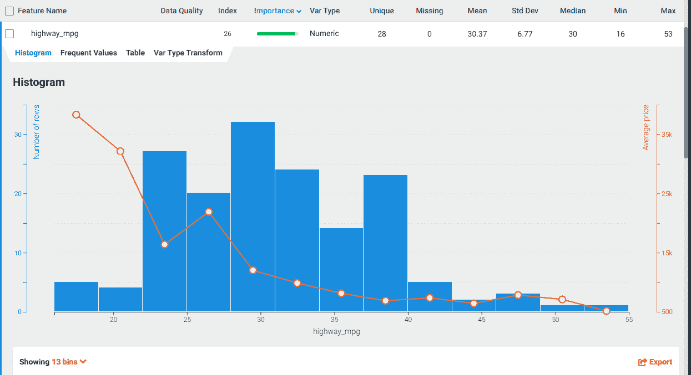

# *第五章*：使用 DataRobot 进行探索性数据分析

在本章中，我们将介绍与使用 DataRobot 探索和分析您的数据集相关的任务。DataRobot 执行许多您需要执行此分析的功能，但您仍然需要自己理解这些功能。

到本章结束时，您将学会如何利用 DataRobot 进行**探索性数据分析**（**EDA**）。在本章中，我们将涵盖以下主要内容：

+   数据摄入和数据目录

+   数据质量评估

+   EDA

+   设置目标特征和相关性分析

+   特征选择

# 数据摄入和数据目录

现在我们已经准备好了数据集，我们有两种选择将它们带入 DataRobot。我们可以访问**创建新项目/拖拽数据集**页面（*图 1.5*）或**AI 目录**页面（*图 1.17*）。如果数据集相对较小，我们可能更喜欢从**创建新项目**方法开始。经过几次迭代后，当数据集稳定下来，您可以将其移动到**AI 目录**页面，以便在其他项目中重复使用。

让我们从上传我们在*第四章*，*为 DataRobot 准备数据*中创建的汽车数据集作为本地文件开始。您可以将项目命名为`Automobile Example 1`，如下面的截图所示：

图 5.1 – 上传新项目数据集

您会注意到 DataRobot 自动开始分析数据并执行快速探索性分析。您可以看到它发现了`30`个特征和`205`行数据。

注意

如果您正在使用包含多个工作表的 Excel 文件，请确保您想要的数据位于第一个工作表中。

# 数据质量评估

DataRobot 还会进行数据质量评估，并在发现任何数据问题时通知您，如下面的截图所示：

图 5.2 – 数据质量问题

在这种情况下，它已在八个特征中发现了异常值。您可以查看详细信息，看看这些是否看起来可以接受，或者您需要删除或以其他方式修复这些异常值。我们将在下一节探索和分析这些特征时这样做。

注意到它还检查了任何特征中是否存在伪装的缺失值或过多的零。这些可能难以手动检测，并且可能对您的模型造成问题，因此如果出现这些问题，修复这些问题很重要。例如，您在*第四章*，*为 DataRobot 准备数据*中看到，我们已经修复了`normalized-losses`特征中过多零的问题。如果我们之前没有这样做，DataRobot 会提醒我们修复此问题或过滤掉这些行后再继续。它还会在选定目标特征后进行额外的分析。

你将对 Appliances Energy 数据集执行相同的流程。

# EDA

正如你在上一节中看到的，DataRobot 自动对数据集进行了初步分析。让我们看看我们将如何审查这些数据并从中获得洞察。如果你向下滚动页面，你会看到一个特征表及其特性的概述，如下面的截图所示：

图 5.3 – 数据分析概览

你可以看到，在这个表中，DataRobot 已经计算并列出了关于特征的数据质量问题的任何担忧，它是什么类型的变量，数据集中有多少唯一值，以及有多少值是缺失的。这些都是非常重要的特征，你需要审查所有这些，以确保你理解它们在告诉你什么。

例如，DataRobot 选择的变量类型是你预期的吗？如果你查看`num_of_doors`，你会注意到这是一个分类变量。尽管这是正确的，因为数据是以文本形式存在的，但你都知道这实际上是数字。你可能想修复这个问题（就像我们在*第四章*，*为 DataRobot 准备数据*中为`num_of_cylinders`所做的那样）。提前这样做将减少后续的重工作和浪费的努力。同样，你会注意到`num_of_doors`有两个缺失值。如果这个数字更高，我们就会尝试解决缺失值，正如在*第四章*，*为 DataRobot 准备数据*中讨论的那样。此外，注意唯一值。对于某些特征，我们期望有许多唯一值，而对于其他特征，则不是。检查 DataRobot 发现的是否与你的预期一致。如果不一致，尝试确定原因。当分类变量有大量唯一值时，请特别注意。我们很快就会讨论如何解决这个问题。

对于数值特征，你还会看到一些汇总统计信息，例如**平均值**、**中位数**、**标准差**（标准差）、**最小值**和**最大值**。请为每个特征进行审查，看看它们是否都看起来合理。如果你点击任何特征行，它将展开并显示更多详细信息，如下面的截图所示：

图 5.4 – “symboling”特征详情

在这里，你可以看到所有值的直方图。你现在可以看到这些数据是如何分布的。需要特别注意的一个方面是你没有太多数据的地方。例如，你可以看到对于值`-2`可用的训练数据量非常有限，因此我们预计在尝试预测这些值时可能会出现问题。现在，让我们看一下以下截图中的`normalized_losses`的详细信息：

图 5.5 – “normalized_losses”特征详情

在这个视图中，我们可以看到，在 "make" 特征周围似乎几乎没有损失，我们可以看到它的分布情况：

图 5.6 – "make" 的特征细节

由于 "make" 是一个分类特征，您可以看到每个值出现的频率。记住，我们之前已经将一些数据非常少的车型合并到了 "other" 中。如果我们没有这样做，我们会在这里注意到一些类型的数据点非常少，需要解决，否则它们在训练期间表现不佳。让我们看一下 "fuel_type"，看看我们可以从这个数据中提取什么，如下面的截图所示：

图 5.7 – "fuel_type" 的特征细节

在这里，我们注意到 "diesel" 汽车没有得到很好的代表，这可能对汽车来说是正常的。每次我们看到这种不平衡时，我们都应该尝试看看是否可以解决。现在，当我们查看 "engine_location" 特征时，如以下截图所示，我们发现了一个问题：

图 5.8 – "engine_location" 的特征细节

正如您在前面的截图中所看到的，"rear" 特征在数据集中几乎没有任何记录。从实际的角度来看，这意味着算法将忽略这个特征。如果您没有仔细查看，您可能会认为 "engine_location" 对您的目标没有影响，但正如您从这张截图中可以看出的，我们的数据集不足以做出这样的判断。现在，让我们看一下下面的截图，看看 "engine_type"，看看我们在这里发现了什么：

图 5.9 – "engine_type" 的特征细节

在这种情况下，我们发现一种类型占主导地位，而一些类型几乎没有任何代表。查看这种分布，您可能希望创建另一个特征，将此转换为二进制值，对于每种其他类型都是 "ohc" 和 **1**。这也会在数据集中创建一些平衡。

请记住，这可能会或可能不会证明是有用的。您必须在您的模型中尝试它，看看什么有效。现在，让我们看一下下面的截图，看看 "num_of_cylinders" 和 "cylinder_count"，这是我们数据准备期间创建的一个特征：

图 5.10 – "num_of_cylinders" 和 "cylinder_count" 的特征细节

正如您所看到的，尽管数据相同，但转换后的值与您首次查看直方图时得到的印象不同。数值值是数据的更准确表示，应该比分类值导致更好的模型。

希望我们已经强调了 DataRobot 自动提供的内容以及通过查看 DataRobot 生成的图表可以获得哪些类型的见解。我们现在准备好设置我们的目标特征并进行额外的分析。

# 设置目标特征和相关性分析

到您达到这个阶段时，您应该已经对您试图解决的问题以及应该的目标特征有一个相当好的了解。使用不同的特征作为不同用例的目标并不罕见。有时，您会将转换后的特征设置为目标（例如，特征的日志）。对于汽车数据集，我们想要预测汽车的**价格**。一旦您选择了目标特征，如下面的截图所示，它将分析该特征并提供一些建议：

图 5.11 – 设置目标特征

您可以从前面的截图看到，它展示了价格是如何分布的。DataRobot 也提醒说，一些目标值是缺失的。理想情况下，我们在上传数据集之前应该过滤掉带有缺失目标值的行。您还会注意到，DataRobot 将其描述为一个回归问题。另一个需要注意的事项是，它选择了**Gamma Deviance**作为优化指标。您可以在*第二章*，“机器学习基础”中了解更多关于这个指标的信息，或者您可以在 DataRobot 的帮助部分中更详细地探索它。目前来看，鉴于价格值的广泛差异，这似乎是一个不错的选择。

在我们点击**开始**按钮之前，我们应该探索高级选项。这样做的原因是，一旦您点击**开始**按钮，您就不能更改选项。话虽如此，如果没有完全理解数据，往往很难做出所有正确的选择。克服这个问题的方法之一是暂时忽略高级选项，并继续探索。

一旦我们知道我们想要什么，我们就可以创建一个新的项目并选择合适的选项。您可以看到这是一个迭代的过程，我们经常会尝试一些东西，然后回来重新做一些工作。此外，请注意，*图 5.11* 中的**建模模式**设置为**快速**。这通常是一个好的开始选择。考虑到这一点，我们实际上可以跳过选项并直接点击**开始**按钮。您会注意到 DataRobot 将开始执行额外的分析，如下面的截图所示：

图 5.12 – 特征分析

你会注意到，除了进行额外的分析外，DataRobot 实际上已经开始构建模型。这可能令人惊讶，因为我们仍在进行分析，但请放心——这些不是最终模型。让 DataRobot 构建这些模型，因为其中一些将为我们提供关于数据的有用见解。我们很可能会稍后丢弃这些模型，但它们将在我们的旅程中证明是有用的。一旦 DataRobot 完成所有任务，你将看到一条**自动驾驶完成**的消息，如下面的截图所示：

图 5.13 – 初始分析完成

现在，你会注意到 DataRobot 为所有特征填充了一个**重要性**列。这是相对于目标特征的特征相对重要性。我们还可以检查是否发现了其他数据质量问题。为此，让我们点击**数据质量评估**框中的**查看信息**下拉菜单。然后你会看到以下截图所示的选项：

图 5.14 – 数据质量评估

我们之前看到了一些问题，但现在我们看到有一些特征可能存在目标泄漏。如果存在目标泄漏，我们将过滤掉这些特征。通过查看与每个特征相关的警告标志，我们发现这些特征是`horsepower`和`engine_size`。由于这些是重要特征并且对价格有明显的影響，我们将保留这些特征。我们还看到标题行中还有一个警告符号，如下面的截图所示：

图 5.15 – 缺失的目标值

点击符号，我们看到 DataRobot 已经过滤掉了价格缺失的行。这是好的，这意味着我们不必重新创建我们的数据集并将其再次上传到 DataRobot。你也会在下面的截图注意到，现在屏幕左上角出现了一个新的标签页，称为**特征关联**。这是我们数据分析任务的关键标签页。让我们点击这个标签页来看看 DataRobot 发现了什么：

图 5.16 – 特征关联

DataRobot 将这些称为**关联**而不是**相关性**，原因在于 DataRobot 使用包含一组紧密相关特征（如`engine_size`、`bore`、`cylinder_size`和`stroke`）的`engine`。将这些关系作为一个整体来理解对于解决商业问题可能非常重要。在这个特定案例中，它告诉你你不能单独修改这些中的一个。

改变气缸直径将影响许多其他特征，即使你的模型最终没有包含这些特征。忽略这些方面通常会导致下游问题，所以请特别注意这些关系。

通过按重要性排序关联，你可以获得额外的见解，如图下所示：

图 5.17 – 按重要性排序的特征关联

前面的截图显示了按其对目标特征的影响排序的特征。这告诉你哪些特征最有可能在你的模型中突出。要寻找的一件事是，这与你在问题理解阶段构建的因果模型是否一致？如果不一致，差异和惊喜在哪里？这些通常会导致你对问题的新的见解。查看 MI 值总体上也是有用的。为此，你可以点击`.csv`文件。然后你可以在 Excel 等工具中分析它们，如图下所示：

图 5.18 – MI 值

这让你对这些值的相对规模有了更好的感觉。在这个视角下，我们可以看到，期望对价格的影响非常小。这似乎有点反直觉，值得进一步调查。为此，我们可以通过点击`价格`和`期望`来查看关联细节，如图下所示：

图 5.19 – 关联对细节

在这里，我们可以看到，对于相同的`期望`值，价格可能会有很大的变化。尽管如此，我们仍然可以看到，平均而言，`涡轮增压`的价格更高。基于这一点，我们将将其保留在模型组合中。我们还应该与领域专家讨论，看看为什么它没有与`价格`更强烈地相关联。这些讨论可能导致创建其他可能阐明这种关系的特征。另一方面，`价格`和`车门数量`之间的关系看起来并不很有趣。

仔细审查关联对，看看可以从中获得哪些见解是个好主意。至少，要审查那些值非常高或非常低的关联。具体来说，要寻找非线性关系。例如，让我们看看` curb_weight`和`highway_mpg`之间的关联，如图下所示：

图 5.20 – curb_weight 和 highway_mpg 之间的关联

在这里，你会注意到，随着` curb_weight`的增加，每加仑英里数（**MPG**）的值会减少，这是符合直觉的。我们还看到，曲线在更高的重量处开始变平。这可能是由许多原因造成的，因为影响 MPG 的其他因素并不随着重量的增加而增加。

注意，虽然这可能会或可能不会影响模型的预测准确性，但理解这些关系是确定基于模型采取的行动的关键。例如，对于重量大于`curb_weight`和`drive_wheels`的重量，重量减少可能不会为 MPG 带来很大的好处，如下面的屏幕截图所示：

![图 5.21 – `curb_weight`与`drive_wheels`之间的关系

图 5.21 – `curb_weight`与`drive_wheels`之间的关系

在前面的屏幕截图中，我们可以看到`curb_weight`受到`drive_wheels`选择的影响。如果我们在这两个特征中同时使用我们的模型，模型可能会给予`curb_weight`更高的优先级，并且可能发现`drive_wheels`的使用价值不大。因此，商业用户可能会将`drive_wheels`视为不太重要。

如你所见，这并不正确，因为`curb_weight`本身受到`drive_wheels`的影响。有时，如果不够小心，一个精确的模型可能会给出错误的印象。DataRobot 可以进行这种分析并生成这些图表，但正确理解和解释这些图表的责任在你。

让我们再次看看我们之前查看的一些单个特征图。为此，让我们查看*图 5.13*中显示的特征细节，并点击`curb_weight`。这将显示关于该特征的详细信息，如下面的屏幕截图所示：

![图 5.22 – `curb_weight`的特征细节

图 5.22 – `curb_weight`的特征细节

你会注意到，我们现在在这个图表中有了更多的一些信息。具体来说，我们现在可以看到价格如何随着`curb_weight`的变化而变化，以及`curb_weight`值的分布情况。观察这些关系可以为你提供额外的洞察力，尤其是在关系非线性时。例如，让我们看看以下屏幕截图中的`highway_mpg`的详细信息：

![图 5.23 – `highway_mpg`的特征细节

图 5.23 – `highway_mpg`的特征细节

如你所见，随着 MPG 值的增加，价格呈指数下降。鉴于这种非线性似乎也存在于其他特征中，尝试通过取价格的对数来创建一个新的目标特征可能是有用的。同样，通过查看其他特征，你可以得到一些关于特征转换的想法，这些转换可能是有益的。有些人可能会想知道为什么我们应该这样做，因为新的算法可以处理非线性。虽然这是真的，但如果从业务理解的角度来看是有意义的，仍然最好将你的非线性问题进行转换。此外，这也允许算法将计算能量集中在其他可能被忽视的领域。

现在我们已经理解了特征，并且已经按需进行了转换，我们可以专注于选择一个特征集来开始建模过程。

# 特征选择

特征选择背后的基本思想是选择对目标具有高度重要性的特征。此外，我们还想移除与其他特征高度交叉相关（或具有高互信息值）的任何特征。在 DataRobot 中，所选的特征集以特征列表的形式表示。如果您点击页面左上角的**特征列表**菜单，如图所示，您将看到 DataRobot 为数据集创建的特征列表：

![Figure 5.24 – Feature Lists]

![img/Figure_5.24_B17159.jpg]

![Figure 5.24 – Feature Lists]

在这里，您将看到一个包含所有原始特征、基于单变量分析（即，逐个分析特征）的选择特征，以及包含最重要特征的列表。**DR Reduced Features M8**列表或**单变量选择**列表看起来是良好的起点。点击**项目数据**菜单返回数据视图。现在，让我们通过从**特征列表**下拉菜单中选择**单变量选择**来检查单变量列表，如图所示：

![Figure 5.25 – Selecting a feature list]

![img/Figure_5.25_B17159.jpg]

图 5.25 – 选择特征列表

您现在可以检查已选特征列表。您可以通过删除任何不想包含在此列表中的特征来修改此列表并创建新的特征列表。如您所见，DataRobot 已经为您做了很多特征选择工作，以便开始工作。您现在可以删除一些，或者您可以在构建了一组初始模型之后，在下一轮迭代中删除它们。

令人有趣的是，DataRobot 已经使用其中一些列表构建了一些模型，我们将在下一章中探讨。

# 摘要

在本章中，我们学习了如何将数据带入 DataRobot。我们学习了如何使用 DataRobot 的功能来评估数据质量并执行 EDA。我们看到了 DataRobot 如何使探索数据、设置目标特征和执行相关性（或更准确地说，关联分析）变得非常容易。

我们学习了如何利用 DataRobot 的输出，以更好地理解我们的问题和数据集，然后如何创建用于模型构建的特征列表。您可以在 Python 或 R 中完成这些任务，它们并不困难，但它们确实需要一些时间。这些时间最好用于专注于理解问题和数据集。

在下一章中，我们将跳入你们大多数人都在等待的事情：构建模型。
