# *第六章*：使用 DataRobot 进行模型构建

在本章中，我们将了解如何使用 DataRobot 构建模型。模型构建的大部分过程已经自动化，DataRobot 提供了许多功能来自动探索广泛的算法，同时允许数据科学家微调他们想要构建的内容。这为数据科学团队节省了大量的时间，并导致探索比其他情况下更多的模型。这也导致更好地遵循最佳实践，从而减少了犯错误的机会。

到本章结束时，您将学会如何利用 DataRobot 构建各种模型。在本章中，我们将涵盖以下主要内容：

+   配置建模项目

+   构建模型和模型排行榜

+   理解模型蓝图

+   构建集成模型

# 配置建模项目

在上一章中，我们创建了一个项目并进行了数据分析。我们还看到 DataRobot 自动为我们构建了几个模型。为了构建这些模型，我们使用了默认的项目设置。

在本节中，我们将介绍 DataRobot 默认为我们做了什么，并查看我们如何可以微调这种行为。如果您还记得，一旦我们在项目页面上点击**开始**按钮（见*第五章*，*使用 DataRobot 进行探索性数据分析*），我们就无法对项目选项进行任何更改。因此，我们将创建一个新的项目来审查并选择我们想要的选项。

为了这个，让我们进入 DataRobot 并选择`Automobile Example 2`，如下面的截图所示：

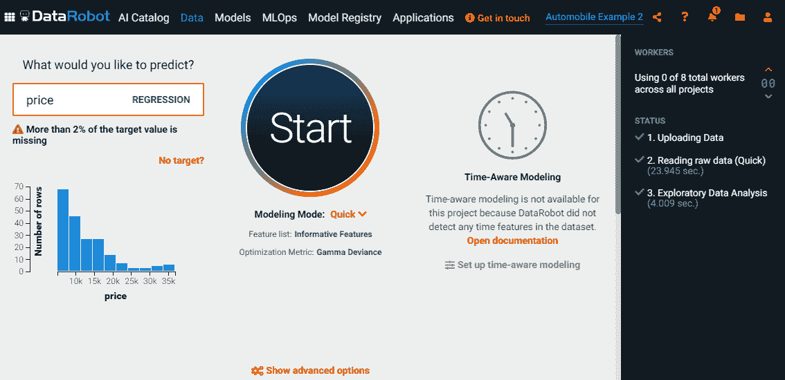

图 6.1 – 上传新项目的数据集

您可以选择与我们之前相同的目标特征（价格）。现在，请点击屏幕底部的**显示高级选项**，而不是点击**开始**按钮。您现在将看到**高级选项**屏幕，如下面的截图所示：

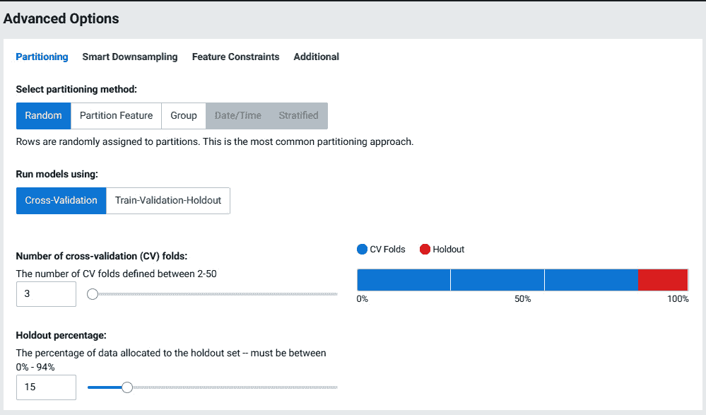

图 6.2 – 高级选项

在这里，您可以查看分区选项。您可以看到默认设置，并且可以根据需要更改它们。由于我们拥有的数据量非常有限，我已经将交叉验证折数减少到`3`，将保留百分比减少到 15%。您可以轻松更改这些值，并根据需要使用不同的设置运行。接下来，我们点击**智能降采样**选项卡，如下面的截图所示：

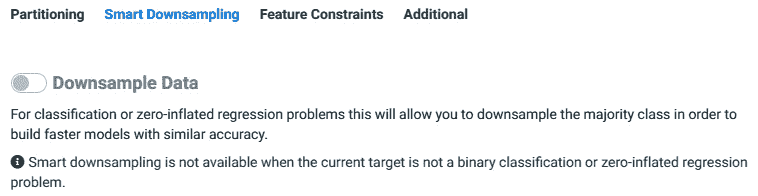

图 6.3 – 智能降采样

由于这不是一个分类问题，我们在这里不需要担心降采样。如果您有一个不平衡的分类数据集，您可以使用此选项进行降采样。现在让我们看看**特征约束**选项卡，如下面的截图所示：

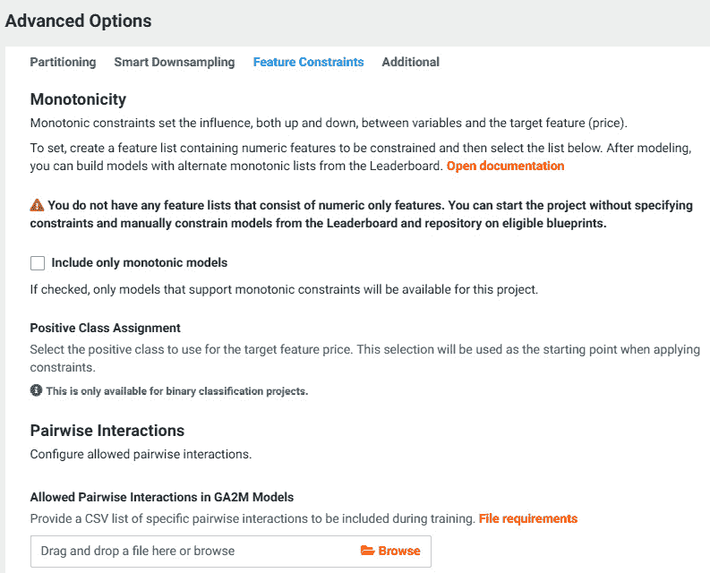

图 6.4 – 特征约束

在这里，您可以设置对特征（如单调性）的约束，即目标值是否与特征值增加的方向相同。目前，我们预见不到需要设置此类约束。在某些用例中，此类约束可能是监管要求的一部分。如果是这样，它们可以在这里指定。大多数用例不需要此类约束。现在，让我们点击**其他**选项卡，如下面的截图所示：

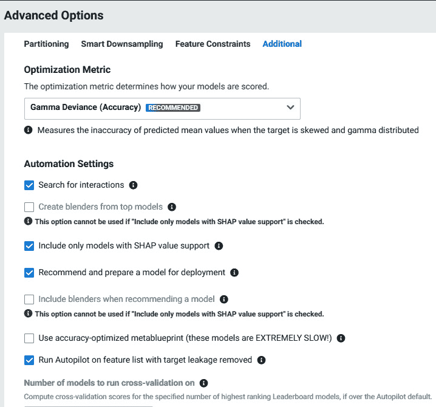

图 6.5 – 其他选项

在这里，我们看到一个选项可以更改用于建模的**优化指标**。我发现 DataRobot 的建议非常好，除非您有充分的商业理由选择不同的指标，否则您应该使用此选项。鉴于我们处于建模的早期阶段，并且我们希望了解我们的数据，我们将选择**搜索交互**选项，取消选择**从顶级模型创建混合器**选项，并选择**仅包括具有 SHAP 值支持的模型**选项。如*第二章*中所述，*机器学习基础*，**SHapley Additive exPlanations** (**SHAP**)值有助于理解模型，并将为我们的问题提供额外的见解。这可能以模型精度为代价，但我们将在稍后担心提高精度。如果您继续向下滚动此页面，您将看到更多选项，如下面的截图所示：

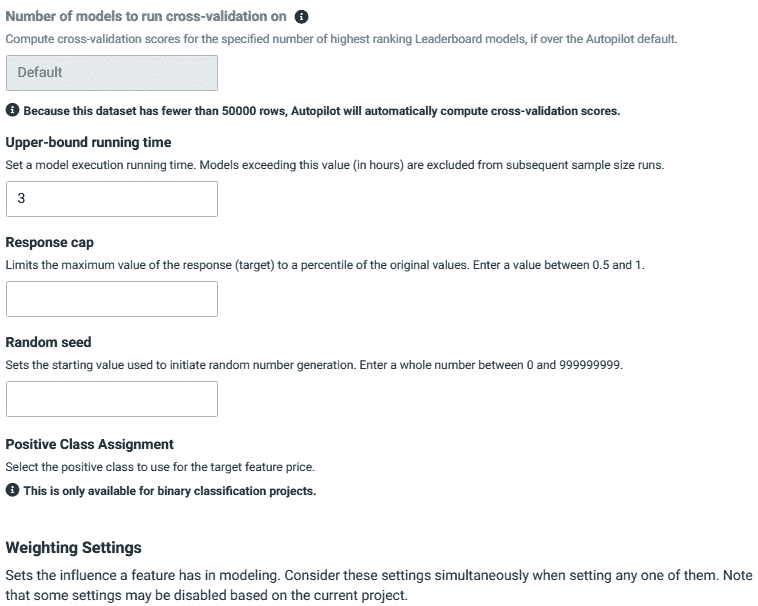

图 6.6 – 更多选项

在这里，您可以设置选项以限制运行时间，限制目标变量预测的值，设置随机种子，或为特定特征添加权重。目前，我们看不出有必要更改这些默认设置。

这完成了配置过程，我们现在可以构建模型。

# 构建模型和模型排行榜

一旦我们对配置设置进行了任何更改，我们可以向上滚动并点击**开始**按钮。DataRobot 现在将自动构建模型，如下面的截图所示：

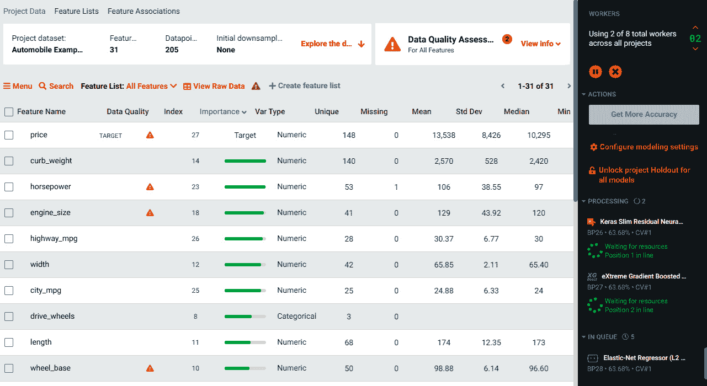

图 6.7 – 模型自动构建

您可以看到 DataRobot 正在构建哪些模型以及使用了多少训练数据。您会注意到 DataRobot 将首先使用较小的数据集构建快速模型，学习哪个表现更好，然后有选择地使用更多数据构建模型。在当前情况下，您可能看不到这一点，因为一开始数据非常少。一旦 DataRobot 完成模型构建，它将显示模型排行榜，如下面的截图所示：

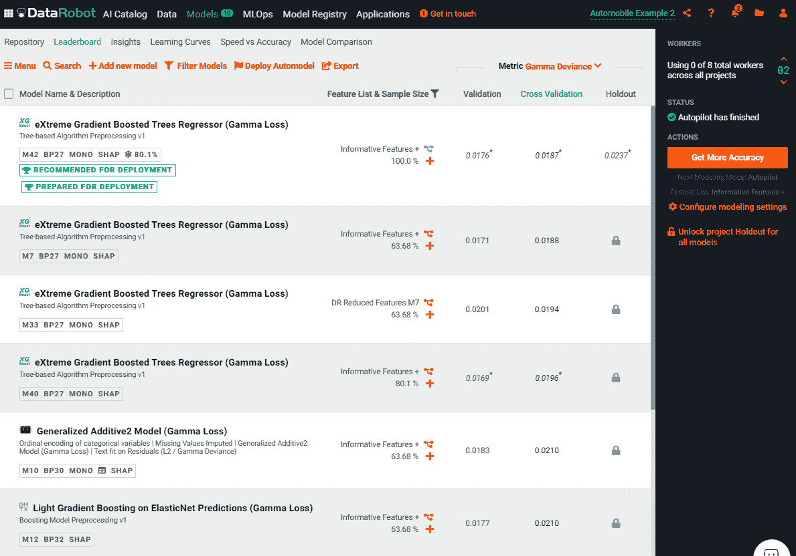

图 6.8 – 模型排行榜

在前面的屏幕截图中，您将看到哪些模型根据您为交叉验证选择的指标上升到了顶部。您还可以从下拉菜单中选择不同的指标，以查看模型在不同指标上的比较。您可以清楚地看到哪些模型上升到了顶部。在顶级看到梯度提升模型并不罕见。您还会注意到，根据所选的指标，模型排名会有所变化。您会看到一旦 DataRobot 为部署选择了一个模型，它就解锁了保留结果，并使用 100% 的数据进行训练，为部署做准备。现在，我们将忽略这一点，因为我们还没有准备好讨论部署。另一件需要注意的事情是用于顶级模型的特征列表。您会看到已经使用了新的**信息特征+**特征列表。这是 DataRobot 为这些模型创建的特征列表。让我们看看这个列表包含什么，如下所示：

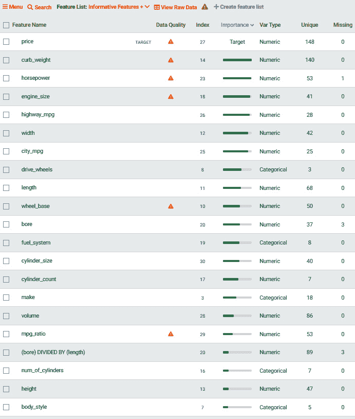

图 6.9 – 新特征列表

如您所见，此列表包含特征的一个子集，并且还包含 DataRobot 自动创建的新特征：“（孔径）除以（长度）”。这个比率可能对发动机有重要意义，您应该与**领域专家**（SMEs）讨论其作用。如果之前未知，这可能会为您的业务团队带来新的见解。实际上，这被称为**冲程比**，被认为是发动机的一个重要参数。建模过程的下一步是看看是否需要进一步细化这个特征列表。让我们回到模型排行榜，选择表现最佳的模型**eXtreme Gradient Boosted Trees Regressor (Gamma Loss)**，转到**理解**选项卡并选择**特征影响**子选项卡，如图所示：

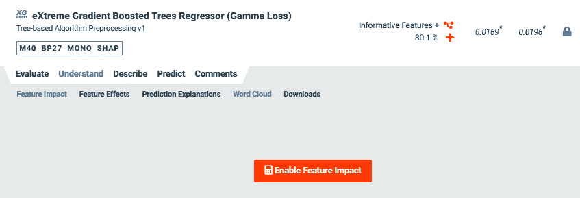

图 6.10 – 理解和特征影响选项卡

您会看到并非每个模型都会计算特征影响，所以请点击**启用特征影响**按钮，让 DataRobot 进行计算。一旦点击，DataRobot 将开始计算影响并显示结果，如图所示：

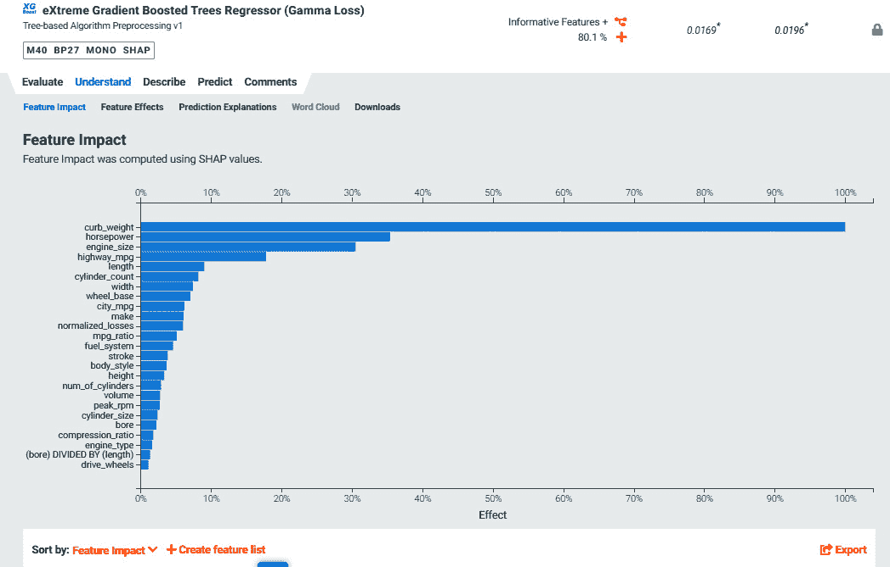

图 6.11 – 特征影响

您会注意到特征影响是使用 SHAP 值计算的，我们之前已经讨论过。默认情况下，它显示前 25 个特征。我们将在稍后讨论特征和模型的详细信息。现在，我们想查看整个特征集。为此，我们将点击右下角的**导出**按钮。现在我们将看到**导出**选项，如图所示：

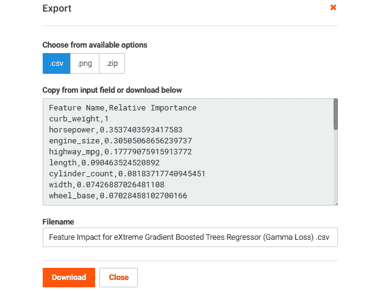

图 6.12 – 导出特征影响

您可以将此信息下载为`.csv`文件以更详细地探索它。让我们使用 Excel 打开`.csv`文件来查看特征影响，如下面的截图所示：

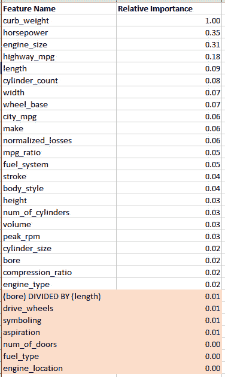

图 6.13 – 整个集合的特征影响

如您所见，最后七个特征贡献不大，我们可以尝试移除它们并查看影响。像 DataRobot 这样的工具的一个好处是运行这些实验非常快速且简单。现在我们知道我们想要做什么，让我们回到**特征影响**屏幕。注意左下角的**+ 创建特征列表**按钮。点击该按钮将弹出一个创建新特征列表的对话框，如下面的截图所示：

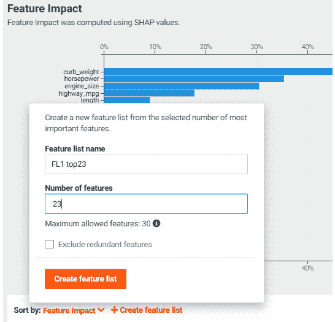

图 6.14 – 创建新的特征列表

在这里，我们可以给特征列表起一个新的名字，`FL1 top23`，并指定我们想要前 23 个最佳特征。现在，我们可以点击**创建特征列表**按钮来保存这个新的特征列表。现在，一个新的特征列表已经创建，我们可以在页面右侧的列中点击**配置建模设置**。这将弹出一个配置对话框，如下面的截图所示：

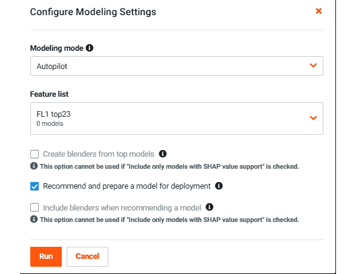

图 6.15 – 配置建模设置

现在，我们可以从下拉菜单中选择新的特征列表，`FL1 top23`。如果我们需要，可以修改其他设置并点击**运行**按钮。DataRobot 现在将开始使用新的特征列表构建模型，当过程完成后，您可以在排行榜中看到新的模型，如下面的截图所示：

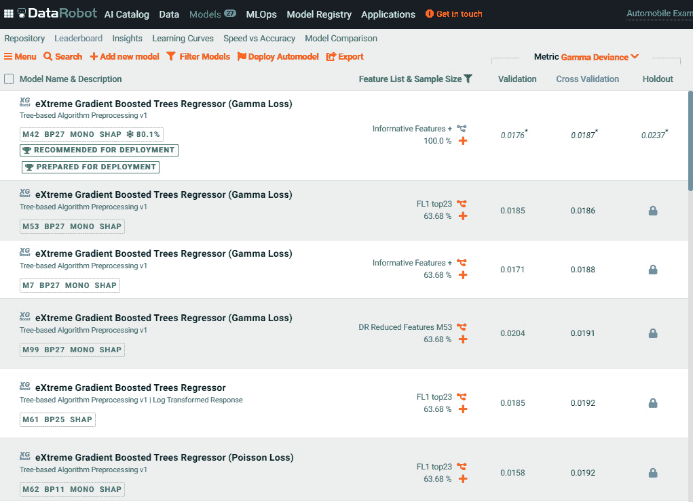

图 6.16 – 带有新模型的排行榜

如您所见，使用新特征列表构建的模型表现更好，现在位于排行榜的顶部（忽略已部署的模型，因为它使用了整个数据集）。正如我们所见，移除贡献不大的特征实际上有助于模型（即使只是略微）。鉴于这个模型使用的是更小的特征集，它是一个更理想的模型。我们可以根据需要继续这个过程。在此阶段，我们也开始更深入地查看模型的细节和它产生的结果。我们将在下一章回到这个话题。现在，我们想看看模型蓝图或 DataRobot 构建模型所采取的步骤。

# 理解模型蓝图

DataRobot 在构建模型时执行了许多数据转换和超参数调整。它利用了许多最佳实践来构建特定类型的模型，这些最佳实践以蓝图的形式编码。您可以检查这些蓝图，以了解这些最佳实践，并更好地理解构建模型所采取的步骤。要检查模型的蓝图，您可以点击一个模型，转到**描述**标签页，然后选择**蓝图**标签页，如图下所示：

![img/Figure_6.17_B17159.jpg]

![img/Figure_6.17_B17159.jpg]

Figure 6.17 – 模型蓝图

在这里，您可以查看工作流程步骤。如您所见，这个蓝图相当简单。这是因为梯度提升方法非常灵活，不需要太多的预处理。让我们看看另一个表现相当不错的模型，即**广义加性模型 2（Gamma 损失）**的蓝图，如图下所示：

![Figure 6.18 – 广义加性 2 模型（Gamma 损失）的模型蓝图

![img/Figure_6.18_B17159.jpg]

Figure 6.18 – 广义加性 2 模型（Gamma 损失）的模型蓝图

在这里，您可以看到需要对分类变量和缺失值进行预处理。现在让我们看看另一个**深度学习**（**DL**）模型的蓝图。选择**使用训练计划的 Keras 精简残差神经网络回归器**模型，并选择**蓝图**标签页，如图下所示：

![Figure 6.19 – Keras 的模型蓝图

![img/Figure_6.19_B17159.jpg]

Figure 6.19 – Keras 的模型蓝图

您可以看到，对于 Keras，我们需要进行数据清洗、缩放和分类变量的 one-hot 编码。您可以通过点击模型框来检查这些步骤的详细信息，如图下所示：

![Figure 6.20 – 处理步骤详情

![img/Figure_6.20_B17159.jpg]

Figure 6.20 – 处理步骤详情

您现在可以查看用于构建模型的任务执行情况和使用的超参数设置的解释。同时，还有一个链接可以查看关于所用方法的更多详细信息。在检查蓝图后，您可能会发现您最喜欢的算法没有被 DataRobot 使用，并且您可能会想知道该算法或模型的性能可能是什么样的。为此，您可以在页面左上角的**仓库**标签页上点击，如图下所示：

![Figure 6.21 – 蓝图仓库

![img/Figure_6.21_B17159.jpg]

Figure 6.21 – 蓝图仓库

在这里，您将看到 DataRobot 提供的所有与此项目相关的蓝图。如您所见，这是一个相当全面的列表。请注意，此列表将因项目类型的不同而有所变化（例如，时间序列项目）。您可以选择这些蓝图中的任何一个来构建一个模型。新模型将显示在排行榜上，您可以在那里评估其相对性能。目前，我们对此特定项目不感兴趣。

在这一点上，我们感兴趣的是比较一些模型，以查看它们在更详细水平上的比较效果。为此，让我们点击顶部的最右侧标签，称为**模型比较**。这将打开一个页面，您可以选择任何两个模型来查看它们的匹配情况，如下面的截图所示：

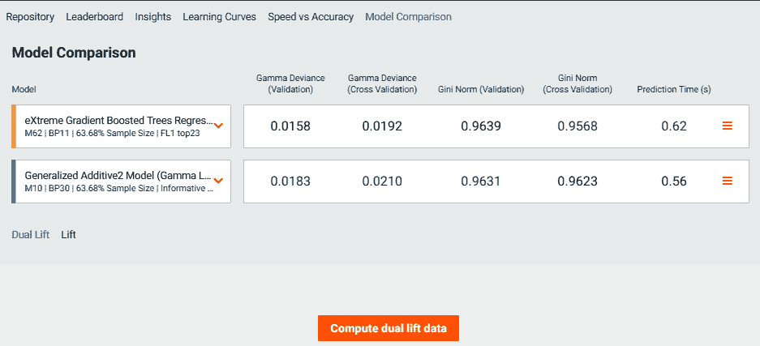

图 6.22 – 模型比较

在这里，我们选择了 XGBoost 模型和**广义加性模型**（**GAM**）模型，在多个指标上进行比较。我们可以看到这两个模型之间并不太远，您可以根据其他因素选择任何一个。正如我们之前讨论的，GAMs 的优势在于易于向商业用户解释，可以呈现为**查找表**（**LUT**），有时也称为评级表。选择 GAM 模型可能还有监管原因。让我们通过点击**计算双重提升数据**按钮进一步探索，带我们到以下屏幕：

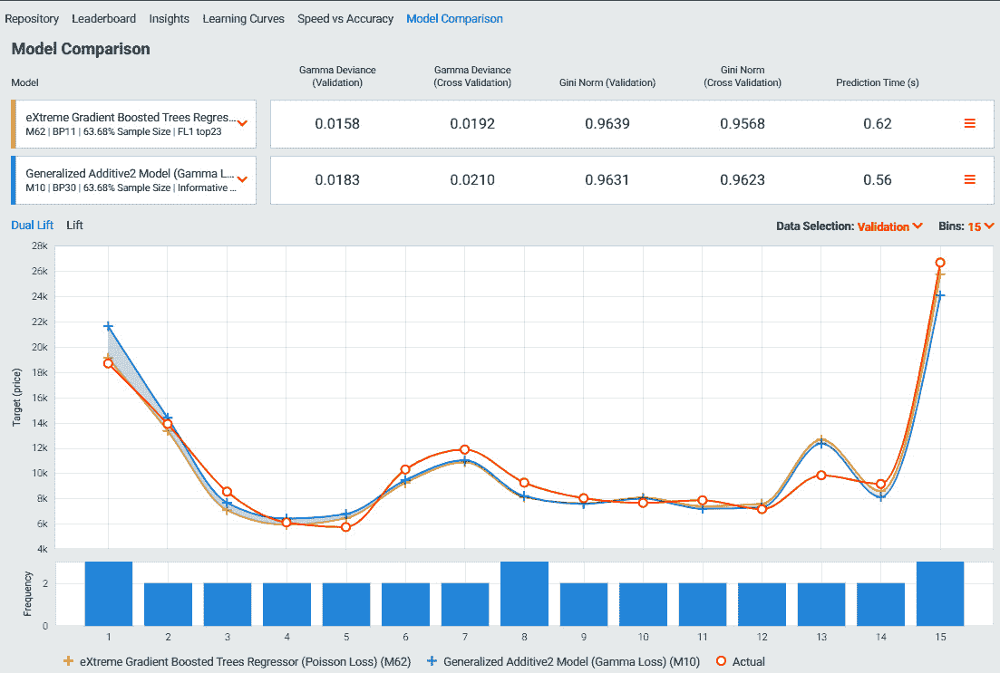

图 6.23 – 双重提升图

**双重提升图**用于比较两个模型的结果。对于双重提升图，结果是根据两个模型之间的差异进行排序，而不是根据目标值。然后，这些值被分箱以显示每个分箱的结果。阴影区域描述了两个模型之间的差异。在这里，我们再次看到这两个模型在性能上非常相似。

如果两个模型在整体上得分良好，但在此图表中的数值偏差较大，那么这些模型将是创建集成模型的良好候选者。

# 构建集成模型

众所周知，模型集合往往表现更好，并且也更稳健。DataRobot 提供了自动构建集合模型的功能；然而，这确实需要一些权衡。例如，集合模型需要更多的时间和计算资源来构建和部署，并且它们通常也更不透明。这就是我们最初没有从构建集合模型开始的原因。一旦您构建了几个模型，并且对提高模型准确率感兴趣，您可以选择构建集合。正如我们在前面的章节中看到的，我们必须明确选择构建集合的选项，这也意味着我们无法计算 SHAP 值。让我们看看这是如何操作的。首先，让我们转到项目列表页面，它显示了您当前的所有项目，如下面的截图所示：

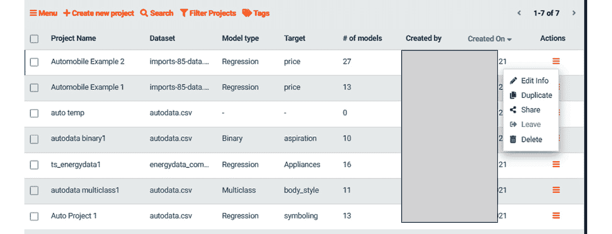

图 6.24 – 项目列表

在这里，我们将选择 `Automobile Example 2`。从菜单中，我们将选择 **Duplicate** 选项。现在您将看到 **Duplicate** 对话框，如下面的截图所示：

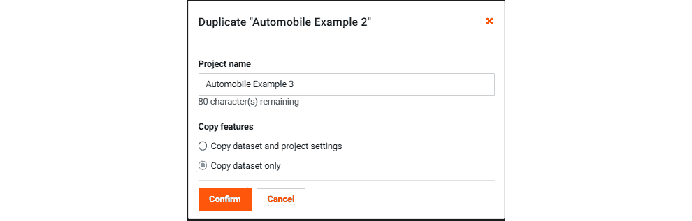

图 6.25 – 复制项目

我们可以给它一个新的名称，`Automobile Example 3`，并且我们将选择 **Copy dataset only**。这样，我们可以应用新的项目设置。让我们点击 **Confirm**。这将创建一个新的项目。我们可以选择目标为价格，现在我们点击 **Advanced Options** 选项卡，如下面的截图所示：

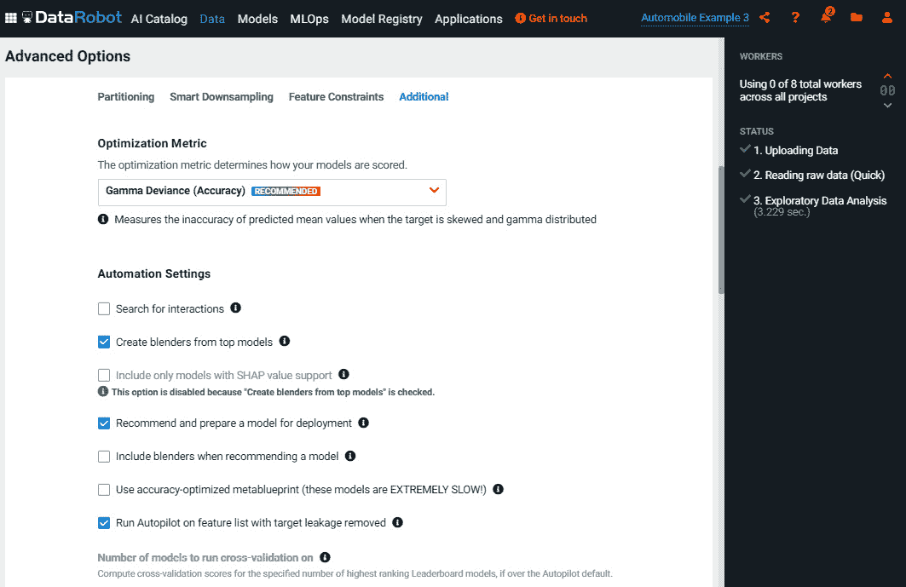

图 6.26 – 集合（混合器）的高级选项

这次，我们将选择 **Create blenders from top models** 选项，并取消选择 **Include only models with SHAP value support** 选项。现在，我们可以点击 **Start** 按钮让 DataRobot 构建模型。一旦 DataRobot 完成构建模型，我们可以检查排行榜，如下面的截图所示：

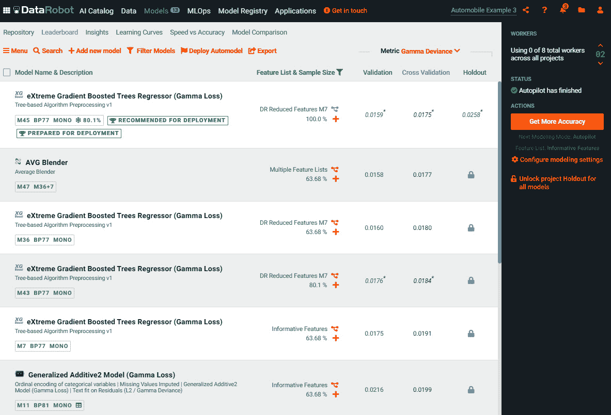

图 6.27 – 包含集合模型的排行榜

您会注意到 DataRobot 已经构建了一个 **AVG Blender** 模型，这似乎是顶级模型，但提升并不大。混合模型有时可以比单个模型产生更大的提升，因此探索这个选项是值得的。我们可以选择这个模型，然后点击 **Describe** 选项卡，再点击 **Blueprint** 选项卡，如下面的截图所示：

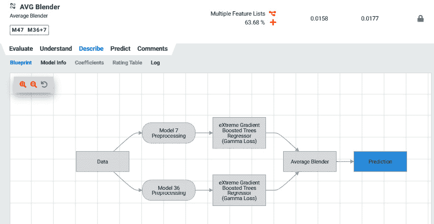

图 6.28 – AVG Blender 的蓝图

我们现在可以看到，混合器选择了两个 XGBoost 模型，因此提升并不令人惊讶。在这种情况下，我们不会选择混合模型，而是返回到上一个项目。

# 摘要

在本章中，我们学习了如何利用 DataRobot 的功能构建和比较模型。正如你所见，DataRobot 使得快速构建多个模型变得非常简单，并帮助我们比较这些模型。正如你所体验的，我们尝试了许多事情，构建了数十个模型。这种快速模型探索是 DataRobot 的关键功能，其对数据科学团队的重要性不容小觑。如果你要自己用 Python 构建这些模型，将会花费更多的时间和精力。相反，我们利用了这些时间和思考来实验不同的想法，并将更多的精力投入到理解问题上。我们还了解到了编码最佳实践的蓝图。这些蓝图对于新晋和经验丰富的数据科学家都是有用的学习工具。我们还学习了 DataRobot 如何为我们构建集成或混合模型。

可能会有一种冲动想要跳过分析阶段，直接开始部署这些模型，但重要的是在进行一些分析之前不要直接跳入这一步。我们现在已经准备好深入挖掘模型，理解它们，并看看我们能否从中获得更多见解。
