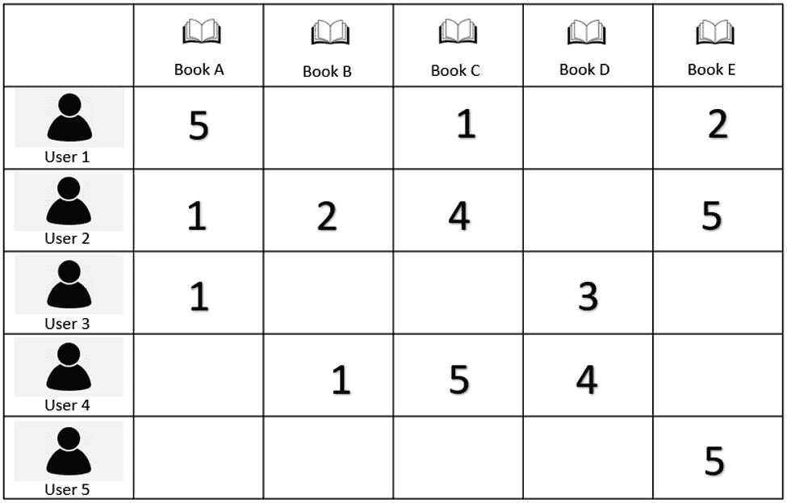
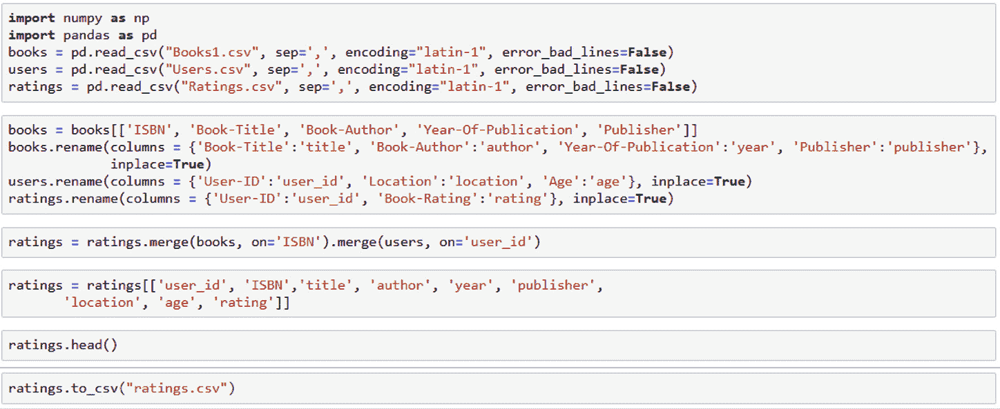
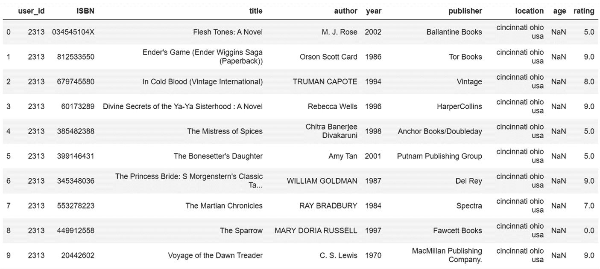
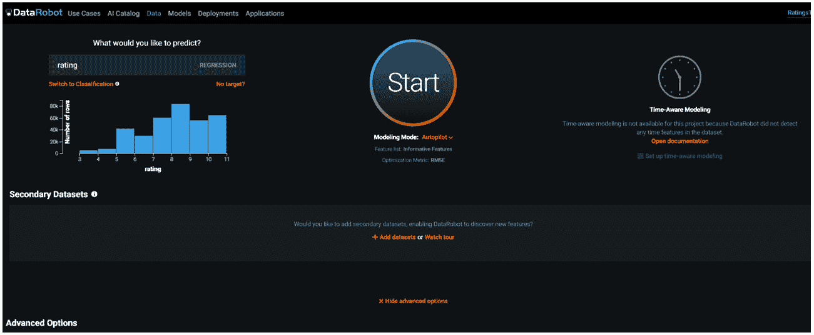
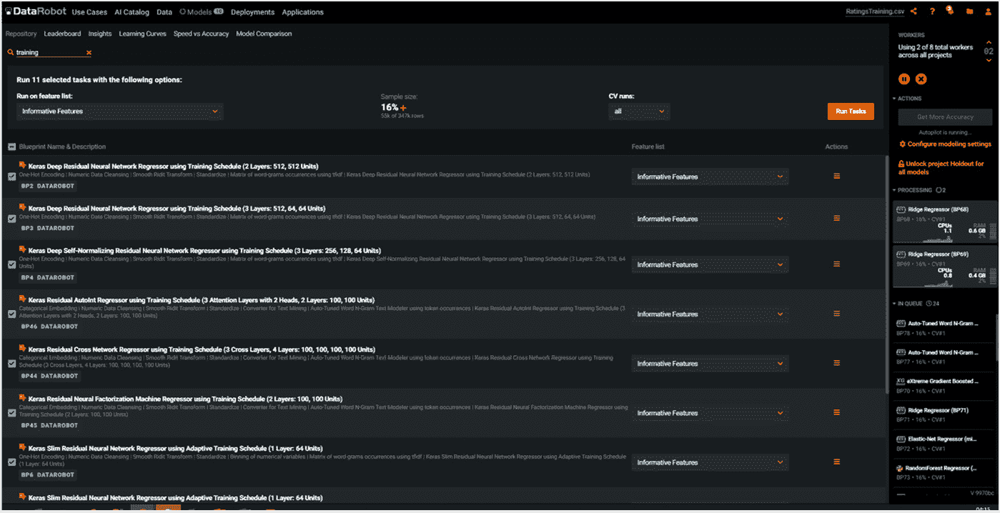
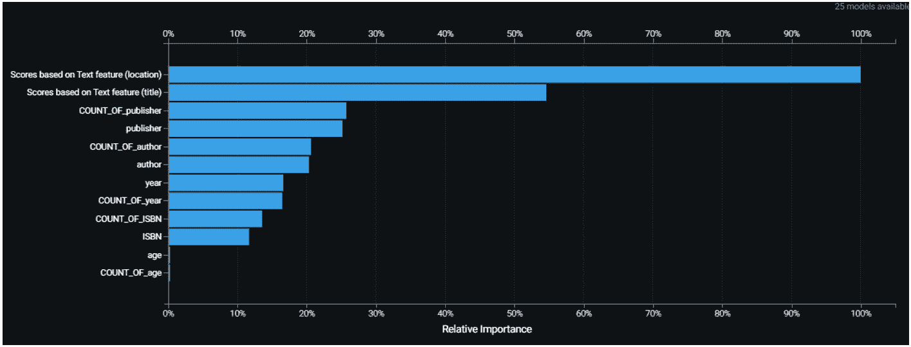
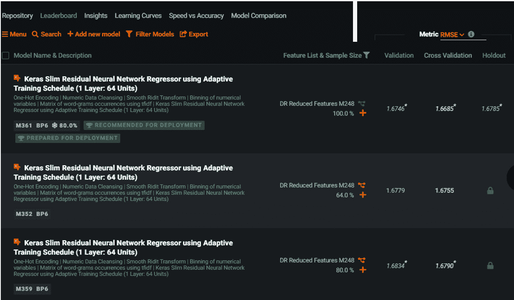
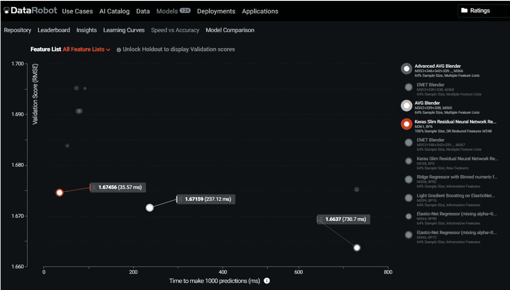

# *第十章*：推荐系统

在本章中，我们将学习推荐系统是什么，讨论它们的各种类型，并通过**DataRobot**实现的内容推荐系统进行实践。在本章中，**推荐系统**、**推荐系统**、**推荐引擎**和**推荐引擎**被交替使用。

在最简单的形式中，推荐系统向用户或买家推荐可能相关的项目。在当今的商业环境中，企业往往有大量的商品、产品或服务出售，这使得用户或买家更难找到他们想要的产品或服务。本章解释了推荐引擎在当前商业空间中的普遍性。

虽然这本书不是涵盖推荐系统所有方面的地方，但我们将讨论如何利用 DataRobot 构建和（从）推荐引擎进行预测，并展示这些系统的概念概述，以及对其类型的简要讨论。因此，在本章结束时，你将学会如何利用 DataRobot 构建内容推荐引擎。本章的主要内容包括以下内容：

+   推荐系统的概念介绍

+   构建推荐系统的方法

+   在 DataRobot 中定义和设置推荐系统

+   在 DataRobot 中构建推荐系统

+   使用 DataRobot 进行推荐系统预测

# 技术要求

本章的大部分内容需要访问 DataRobot 软件。代码示例基于一个相对较小的数据集，Book-Crossing，由三个表格组成，其操作是在**Jupyter Notebook**中完成的。

查看以下视频，了解代码的实际应用效果。[`bit.ly/3HxcNUL`](https://bit.ly/3HxcNUL)。

## Book-Crossing 数据集

用于说明 DataRobot 在构建推荐系统中的应用的示例基于 Cai-Nicolas Ziegler 及其同事的 Book-Crossing 数据集。该数据集可在[`www2.informatik.uni-freiburg.de/~cziegler/BX/`](http://www2.informatik.uni-freiburg.de/~cziegler/BX/)访问。

注意

在使用此数据集之前，本书的作者已通知数据集的所有者关于其在本书中的使用。

Cai-Nicolas Ziegler, Sean M. McNee, Joseph A. Konstan, Georg Lausen (2005). *通过主题多样化改进推荐列表。第 14 届国际万维网会议（WWW '05）论文集*。2005 年 5 月 10 日至 14 日，日本千叶。

数据是在 2004 年 8 月至 9 月间对 Book-Crossing 社区进行的四周收集期间收集的。随后的三个表格，以 CSV 格式提供，构成了这个数据集。

+   以整数形式表示的`User-ID`。还提供了用户的`Location`和`Age`值。

+   `ISBM`、`Book-Title`、`Book-Author`、`Year-Of-Publication`、`Publisher`。

+   `书籍评分`值要么是隐式的`0`，要么是显式的`1`到`10`之间（数字越高，评分越好）。然而，在本项目背景下，我们将仅关注模型开发中的显式评分。表格还包括`用户 ID`和`ISBN`值。

# 推荐系统概念介绍

企业长期以来一直有向客户推荐其产品或服务的传统。例如，走进一家书店，你可能会看到其他客户购买的热门书籍列表。这是一种简单的推荐系统，因为它为买家提供了潜在产品的快照。

为了在数字经济中取得胜利，企业正变得越来越以客户为中心。**以客户为中心**意味着公司旨在将客户的需求放在首位。然而，由于客户的需求像客户本身一样多样化，企业需要采取独特的方法来推出他们的产品。这在一定程度上解释了基于**流行度**的推荐系统的失败，因为它们未能考虑买家的独特档案。因此，随着数字化程度的提高、企业提供的商品增加以及客户需求的多样化，这种方法不太可能取得成功。

有趣的是，数据科学工具可以通过考虑买家的各种需求来提供多种方法，使推荐系统更加智能。

在介绍不同类型的推荐系统时，我们将继续使用书店的例子。

首先，基于物品的协同过滤推荐系统方法根据买家的产品购买历史以及这些*产品*与其他产品的关联性向书籍买家提出产品建议。因此，如果某个个人购买了*书籍 A*，而*书籍 A*与*书籍 B*有关联，那么就会建议*书籍 B*。第二种方法，基于用户的协同过滤，在提出建议时考虑了*买家*之间的相似性。因此，如果*买家 A*与*买家 B*相似，且*买家 A*购买了*书籍 C*，那么就会向*买家 B*推荐*书籍 C*。第三种方法，基于内容的推荐，在提出建议时考虑了书籍和用户特征。最后，混合系统方法在提出建议时结合了基于协同和基于内容的方法。很容易看出，这两种方法都各有优缺点。现在我们将更深入地探讨这些方法以及如何使用 DataRobot 构建基于内容的推荐系统。

# 构建推荐系统的方法

推荐系统旨在向买家推荐相关产品。由于它们能够考虑买家的独特性，智能推荐引擎为商家创造了数十亿美元的收入，并帮助买家找到相关产品。这对消费者和商家来说都是双赢的局面。已经介绍了创建智能推荐系统的各种数据驱动方法。推荐系统有三种主要方法：协同过滤系统、基于内容的系统和混合系统。以下将讨论这些方法的每个子部分。

## 协同过滤推荐系统

协同过滤推荐系统的核心思想是利用他人的过去行为来推断个人可能感兴趣的内容。协同过滤方法借鉴了产品与用户之间历史交互的数据存储。*表 10.1*展示了用户对书籍评分的交互矩阵。每个用户用 1 到 5 的数字对一本书进行评分，其中 5 代表最高程度的享受。在没有评分的地方，假定个人没有阅读过这本书。协同过滤有两种主要类型：*基于物品*的协同过滤和*基于用户*的协同过滤。

表 10.1 – 用户/产品交互矩阵

*基于物品的协同过滤*系统（或**物品到物品的协同算法**）通过寻找物品之间的相似性，并基于这些相似性进行推荐。这种方法基于根据物品与个人之前喜欢或购买过的物品的相似程度来向个人推荐物品。根据*表 10.1*，基于物品的过滤方法可以很容易地看出，*Book C*和*Book E*在之前的读者中被以相似的方式评分。基于这种物品关系，如果一个人对*Book C*给予高度评价，就会推荐*Book E*，反之亦然。因此，由于*用户 5*对*Book E*给予了高度评价，但尚未看到*Book C*，因此提出了对*Book C*的推荐，因为它们很可能喜欢*Book C*。

基于**用户协同过滤**的系统，会在**用户**之间找到相似性，并基于这些相似性进行推荐。**用户间协同算法**旨在找到行为相似或处于相同行为邻域的用户，这是通过他们的历史行为建立的。然后算法考虑他们的偏好并做出推荐。这些推荐系统的核心思想是假设如果个体**是**相似的，那么他们**喜欢**的东西也会相似。从**表 10.1**中可以推断出**用户 2**和**用户 4**有相似的书籍兴趣。因为**用户 4**对**书籍 D**给出了高度评价，所以认为**用户 2**喜欢**书籍 D**的可能性很高，因此推荐了这本书。正如我们所看到的，这两种协同过滤方法都是基于**相似性**这一理念。

相似度度量提供了做出推荐的基础。有几个相似度度量，其中**皮尔逊相关系数**和**余弦相似度**是最受欢迎的。其他人则通过**邻域**来接近这种相似度的测量。**K 最近邻**算法被用来找到被推荐或推荐给的对象最近的物品或用户。

由于交互数据集容易获取，构建协同过滤系统比基于内容的系统要容易得多，这将在下一节中讨论。然而，推荐系统的协同方法有几个缺点。在**表 10.1**的背景下，引入了一个没有历史记录的新用户**用户 6**。很容易看出，协同过滤系统将难以向这位用户做出推荐。对于没有历史数据的项目来说，问题类似。这个问题，也被称为**冷启动**问题，已经被广泛记录。**数据稀疏性**是与协同过滤相关联的另一个常见问题。大多数平台和大型企业都有买家和产品。然而，最活跃的用户只会购买一小部分可用的产品。因此，在驱动这些引擎时，存在一个在有意义地计算相似性所需的数据缺口。

## 基于内容的推荐系统

**基于内容的推荐系统**根据物品特征和用户档案提出建议。这种方法有一个不同的数据结构作为其基础。基于内容的系统是`1`和`5`，该模型是基于回归的，因为它预测一个区间变量。这个模型变成了一个基于内容的推荐引擎。

从前面的讨论中，我们可以看出，基于内容的系统可以轻松缓解冷启动问题，因为书籍和用户很可能有一些形式的描述。与协同过滤系统相比，基于内容的系统更具可扩展性，因为在生产环境中，当需要时可以轻松地进行预测，而不是必须同时为所有用户和产品进行预测。重要的是，即使用户只评价或购买少量产品，基于内容的系统仍然可以表现良好，因为它们关注的是描述，而不是用户或产品。然而，当物品的特征不易获得时，大多数基于内容的系统都会遇到困难。在某些情况下，生成产品的属性可能具有挑战性（例如，如果产品包含图像或声音）。在这种情况下，基于内容的系统将没有描述可以分析。此外，由于日益增长的在线隐私担忧，用户的人口统计信息可能不易获得。协同过滤和基于内容的推荐方法的局限性导致了混合系统的使用。

## 混合推荐系统

*混合推荐系统*是推荐系统的一种集成方法。混合系统通过利用两种或更多推荐策略的组合来为用户生成推荐。通过这样做，它们缓解了归因于任何一种策略的限制，从而受益于*众人的智慧*。

混合系统有几种方法。最常用（也是最容易实现）的是**加权方法**。在这里，独立推荐系统的分数被汇总以给出一个总推荐分数。汇总方法多种多样，包括基本平均、应用规则和使用线性函数。**阶段方法**也可以部署。这通常涉及将推荐系统的结果作为另一个推荐系统的输入特征进行整合。因此，*阶段 1*系统的输出成为*阶段 2*系统的额外输入。**切换方法**涉及使用规则在不同的推荐系统之间切换，以利用特定环境下的优势。例如，如果协同过滤被认为给出了更好的结果，切换机制可以使用协同过滤方法，但当出现冷启动时，它可以切换到基于内容的方法。混合系统相对于基于内容的系统的一个优势是，当项目特征难以确定时，可以开发推荐。正如将在*第十一章*中展示的，*与地理空间数据、NLP 和图像处理一起工作*，DataRobot 具有先进的图像和文本数据特征提取能力。

# 在 DataRobot 中定义和设置推荐系统

由于 DataRobot 能够从图像、音频和文本数据中提取特征，它有效地管理了基于内容的推荐系统的特征可用性限制。这一点加上 DataRobot 的自动化机器学习模型流程，意味着它非常适合利用基于内容的优势，同时弥补这种方法的特征不可用性限制。如*技术要求*部分所述，我们示例中使用的数据集包括三个表。这包括用户表（展示用户档案）、书籍表（概述书籍特征）和评分表（包含用户书籍评分）。由于我们有一个描述书籍的表，另一个描述用户的表，将这些表和评分集合并为基于内容的推荐系统的场景。为此，我们使用了 Jupyter Notebook。*图 10.1*展示了我们运行的脚本，用于导入数据集、操作数据、合并表并将它作为 CSV 文件写回：

图 10.1 – 在 Jupyter Notebook 中的数据处理

在评分表中，`rating`的值为`0`的行被排除，因为这些评分是隐式的。这些行将在“使用 DataRobot 进行推荐系统预测”部分中用来演示如何使用推荐引擎进行预测。通过更改表头以及将`ratings`、`books`和`users`值合并到一个表中，每一行都描述了一个用户和一本书，以及一个评分。数据快照显示在*表 10.2*中。尽管我们可以使用 Python API 方法（如*第十二章*，*DataRobot Python API*)在 Jupyter Notebook 中创建 DataRobot 项目以保持一致性，但我们下载了数据作为一个文件：`rating.csv`。

表 10.2 – 数据快照

按照在*第六章*，*使用 DataRobot 进行模型构建*中建立的过程，我们为推荐系统创建了一个 DataRobot 项目。在这个过程中，我们将`rating.csv`文件拖入初始项目窗口。这打开了*图 10.2*中显示的窗口。对于每一行，由于书籍评分被用作用户兴趣的指标，它可以作为目标变量。由于目标变量`ratings`的性质，这个推荐系统的机器学习模型将是回归模型类型。

图 10.2 – DataRobot 项目启动窗口

如预期的那样，评级的范围是 `1` 到 `10`。理想情况下，我们将删除具有隐式评级（`0`）和 `user_ID` 字段的行，以创建一个用于建模的稳健数据集。接下来要做的事情是构建推荐系统的机器学习模型。

# 在 DataRobot 中构建推荐系统

在 **组 ID 特征** 字段中，`user_id` 的无驾驶功能是其中一个优势。

如 *第六章* Model Building with DataRobot 详细所述，DataRobot 在创建模型时，在模型 **存储库** 选项卡中的搜索字段中的 `Training Schedule` 或简单地 `Training` 开始开发机器学习模型。这将弹出一个相关模型的列表（见 *图 10.3*）：

图 10.3 – 选择最适合推荐系统的先进建模方法

除了选择这些建模方法以包含在创建的模型列表中之外，还基于 `Informative Features` 进行了 `Autopilot Stage 1` 的模型，然后执行了所有五个 `交叉验证` 运行。点击 **运行任务** 将这些包括到处理队列中。

在创建模型之后，下一步是评估它们的准确性。在此之前，检查 **相对重要性** 图表以确定我们的模型是否符合常识是很重要的。正如 *图 10.4* 所示，通过 **洞察** 窗口打开 **变量重要性** 窗口为我们提供了探索这些模型的机会：

图 10.4 – 变量重要性

旁边带有 `London`（伦敦）的值以及标题的一个方面（例如，`Kingdom`（王国））可能被视为对模型有影响。因此，在这个简化的例子中，创建了一个更高阶的特征，它是 `London` 和 `Kingdom` 之间的交互。因此，根据这个新创建的更高阶特征的是否存在，评级预测会相应地发生很大变化。

在模型选择中，使用确定的`Keras Slim Residual Neural Network Regressor 使用自适应训练计划（1 层：64 个单元）`是表现最好的模型（见*图 10.5*）。需要强调的是，在某些情况下，测量推荐系统模型的准确性并不那么简单。想象一下，在这种情况下，我们只能有一个`1`的评分，当一个人购买一本书时，否则将是`0`。天真地衡量模型的准确性变得有限，因为`0`评分并不一定意味着个人对物品不感兴趣。这是因为可能个人从未读过这本书。因为一个好的推荐系统会推荐与个人阅读偏好相符的未读书籍，所以很可能有相当比例的误报。这是因为，尽管他们的当前评分是`0`，但相关用户很可能对阅读它们感兴趣。在这些情况下，**召回率**类型的指标在评估模型性能时变得更加重要。鉴于我们只确定个人购买物品的情况，合理地单独评估这些情况。因此，模型准确性预测正确阅读的书籍的程度，通常称为**召回率**，成为一个更合适的指标。

图 10.5 – 推荐系统排行榜标签页

对于推荐系统来说，在决定使用哪种模型时，准确性和预测速度是非常重要的考虑因素。为了使这次讨论有据可依，了解以下两点非常重要：使用推荐系统进行预测主要有两种主要方法。第一种方法是对用户和物品组合进行批处理评分，其中物品尚未被用户阅读。随着物品和用户的增加，这个数据集会呈指数级增长。第二种方法是*实时预测*。例如，想象一个个人来到一个电子商务平台。这个个人的数据以及产品的数据会迅速评分，建议几乎瞬间完成评分。在这两种情况下，预测速度对于商业成功至关重要。DataRobot 的`Keras Slim Residual Neural Network Regressor 使用自适应训练计划（1 层：64 个单元）`的预测速度是`1.6746`，每 1000 次预测的预测速度是`35.57`毫秒。一些混合模型的验证分数看起来更好，但在预测速度方面要弱得多。

图 10.6 – DataRobots 的速度与准确性对比图

这表明，尽管这个模型非常准确，但在进行预测时速度非常慢。**速度与准确性** 图表展示了几个模型的速度和准确性的快照可视化。可以使用 **模型比较** 工具进行更深入的成对比较。为了继续讨论预测，我们现在将转向在 DataRobot 中进行推荐系统预测。

# 使用 DataRobot 进行推荐系统预测

在 DataRobot 上创建建议非常简单。我们使用拖放方法（如前几章所述），因为我们的预测数据集很小。对于更大的数据集（超过 1 GB），这是推荐系统的典型情况，建议使用 DataRobot 预测 API。创建模型和进行预测的 API 方法在 *第十二章*，*DataRobot Python API* 中有详细说明。

我们示例中的预测数据集大小为 64 MB，因此拖放方法是合适的。对于这种预测方法，我们指定了要从原始数据集中使用的列。理想情况下，我们至少需要一个物品标识符和一个用户标识符。如图 *图 10.7* 所示，我们选择在我们的预测中包含 `ISBN`、`user_id` 和 `title` 字段。我们将预测数据集拖放到指定区域。像往常一样，这个数据集很快就被评估了，我们面前出现了 **运行外部测试** 或 **计算预测** 选项。

![Figure 10.7 – A recommendation engine prediction setup

![img/Figure_10.09_B17159.jpg]

Figure 10.7 – A recommendation engine prediction setup

在这个阶段，我们点击 `.csv` 文件（见 *表 10.3*）。如前所述，预测集是从原始数据集中抽取的，其中评分是隐式的（因此评分分数为零）。因此，预测数据集只包含可能的人-物品交互的有限样本。一些用户（例如，`user_id` 为 `8` 的用户），大约有 `10` 项评分，而一些用户只有 `1` 项评分。在理想情况下，所有个人未看到的物品都应该被评分。话虽如此，向用户提供的建议是按照预测的兴趣顺序排列的。对于用户 `8`，首先提供的是名为《A Second Chicken Soup for the Woman's Soul (Chicken Soup for the Soul Series)》的书籍。在某些情况下，使用的是前 *n* 条推荐。在我们的案例中，"top *n*" 指的是，根据预测值，为每个用户选择前 *n* 本书籍。

![ Table 10.3 – A recommendation engine sample prediction

![img/Figure_10.10_B17159.jpg]

表 10.3 – 推荐引擎样本预测

所选模型可以使用 DataRobot 部署为**REST** API，如第八章中所示，*模型评分和部署*，然后可以通过 DataRobot API 调用（我们将在第十二章中讨论，*DataRobot Python API*）对数据进行评分。某些 DataRobot 模型可以下载为**JAR**文件，可以与其他应用程序集成以进行实时预测。在其他地方，可以使用不同的用户-项目交互进行批量预测，然后存储在大数据存储表中，如**Google Cloud BigQuery**。

# 摘要

在本章中，我们介绍了并评估了推荐系统的不同方法。我们考察了基于内容和协同过滤推荐系统的数据结构需求，并讨论了它们的潜在假设。然后，我们指出 DataRobot 在从具有挑战性的数据类型（例如，图像数据）中提取特征方面的优势，这些数据类型通常限制了基于内容系统的使用。然后，我们说明了如何使用 DataRobot 在基于小数据集的内容推荐系统中构建和进行预测。

需要强调的是，本项目使用的数据集由多种数据类型组成。DataRobot 能够提取特征并整合不同数据类型以创建机器学习模型。在下一章中，我们将探讨在创建机器学习模型时如何使用包含图像、文本和位置数据的组合数据集。
