# 第十二章：DataRobot Python API

用户可以使用 DataRobot 的 Python 客户端包访问 DataRobot 的功能。这使得我们可以导入数据，创建机器学习项目，从模型中进行预测，并编程管理模型。API 为用户提供的优势很容易看出。Python 和 DataRobot 的集成使用使我们能够利用 DataRobot 提供的 AutoML 能力，同时利用 Python 具有的程序灵活性和潜力。

在本章中，我们将使用 DataRobot Python API 来导入数据，创建包含模型的工程，评估模型，并对它们进行预测。从高层次上讲，我们将涵盖以下主题：

+   访问 DataRobot API

+   理解 DataRobot Python 客户端

+   编程构建模型

+   编程进行预测

# 技术要求

在本章将要进行的分析和建模中，您将需要访问 DataRobot 软件。Jupyter Notebook 对于本章至关重要，因为与 DataRobot 的大部分交互都将从控制台进行。您的 Python 版本应为 2.7 或 3.4 以上。现在，让我们看看本章将使用的数据库集。

查看以下视频，了解代码在[`bit.ly/3wV4qx5`](https://bit.ly/3wV4qx5)上的实际应用。

## 汽车数据集

可以在 UCI 机器学习仓库（[`archive.ics.uci.edu/ml/datasets/Automobile`](https://archive.ics.uci.edu/ml/datasets/Automobile)）访问汽车数据集。该数据集中的每一行代表一辆特定的汽车。特征（列）描述了其特性、风险评级和相关的归一化损失。尽管这是一个小型数据集，但它具有许多既是数值型又是分类型的特征。其特征在网页上有所描述，数据以`.csv`格式提供。

数据集引用

Dua, D. 和 Graff, C. (2019). UCI 机器学习仓库 ([`archive.ics.uci.edu/ml`](http://archive.ics.uci.edu/ml))。加州大学欧文分校，信息与计算机科学学院，加州，欧文。

# 访问 DataRobot API

DataRobot 的程序化使用使得数据专家能够在保持典型编程灵活性的同时，利用平台的高效性。通过 DataRobot 的 API 访问，可以集成来自多个来源的数据，用于分析或建模目的。这种能力不仅限于摄入的数据，还包括结果的输出。例如，API 访问使得客户风险分析模型能够从不同的来源获取数据，例如 Google BigQuery、本地文件以及 AWS S3 存储桶。通过几行代码，结果可以更新 Salesforce 上的记录，以及通过 BigQuery 表显示在 PowerBI 上的记录。这种多数据源集成能力的优势进一步体现在它能够实现模型结果的自动化、定期、端到端的周期性刷新。

在此先前的案例中，客户基础可以定期重新评分。关于评分数据，DataRobot 平台只能评分小于 1 GB 的数据集。当问题需要大量数据集时，**批量预测 API** 通常会将数据分块并并发评分。对于包含数亿行的数据集，可以使用批量预测 API 设置迭代作业，分块数据并迭代评分。

此外，DataRobot 的 API 访问允许用户在分析之前开发具有商业意义的用户定义特征，以及基于评分模型结果的特征。这使得建模过程更加稳健，因为它允许将人类智能应用于结果。在前面的客户风险分析案例中，可以将客户分类到风险类别，以便于更轻松的商业决策。此外，根据给出的解释，还可以开发下一步的最佳行动方案。

此外，DataRobot 的程序化使用允许用户根据需要配置不同的可视化。这也为分析师提供了更广泛的视觉结果类型。Seaborn 和 Matplotlib Python 库提供了大量不同配置的可视化类型。这也允许可视化某些数据子组或分割。在其他好处中，甚至可以选择要可视化的数据的一些方面。

使用 DataRobot 的 API 访问其的一大优点是能够迭代创建多个项目。这里有两个简单的例子。提高多类建模结果的一种方法是用“一对多”建模范式。这涉及到为每个类别创建模型。在评分时，所有模型都用于评分数据，并且对于每一行，具有最高评分的类别被分配给该行。为了使这一点更加生动，让我们假设我们正在构建基于其他特征的预测车轮驱动类型的模型。首先，为三种主要的车轮驱动类型创建模型；即，**前轮驱动**（**FWD**）、**全轮驱动**（**4WD**）和**后轮驱动**（**RWD**）。然后，数据将对所有三个模型进行评分，并且假设呈现每一行最高预测的模型是该行所属的类别。

模型工厂是另一个例子，其中多个模型项目被集成到一个系统中，以便每个项目为数据中的子组构建模型。在某些问题中，数据往往嵌套在某种变量倾向于控制模型行为方式。一个例子是建模嵌套在班级中的学生表现。这些特征，如学校的班级教师，往往控制其他外生变量对因变量的影响。

在汽车的情况下，它们的品牌通常驱动价格。例如，无论斯柯达与奥迪有多相似，奥迪很可能更贵。因此，在开发此类案例的模型时，为每个汽车品牌创建模型是理想的。在以编程方式访问 DataRobot 的背景下，这个想法将是为每个汽车品牌运行项目的一个迭代。

除了以编程方式创建和评分 DataRobot 模型外，我们还将使用 Jupyter Notebook 的**集成开发环境**（**IDE**）来构建一个“一对多”和一个模型工厂的项目。然而，在我们能够使用 API 使用 DataRobot 创建项目之前，必须覆盖某些识别过程。让我们看看。

要以编程方式访问 DataRobot，用户需要创建一个 API 密钥。这个密钥随后用于从客户端访问平台。要创建 API 密钥，请打开主页右上角的**账户**菜单（见*图 12.1*）。从那里，访问**开发者工具**窗口（见*图 12.1*）：

![Figure 12.1 – Accessing Developer Tools

![img/B17159_12_01.jpg]

图 12.1 – 访问开发者工具

打开**开发者工具**窗口后，点击**创建新密钥**并输入新密钥的名称。在保存新密钥的名称后，API 密钥将被生成（见*图 12.2*）。之后，生成的密钥将被复制并安全存储。API 密钥以及端点对于在本地机器和数据 Robot 实例之间建立连接是必要的：

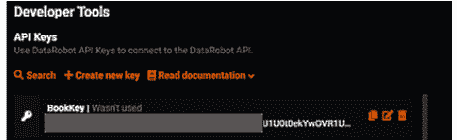

图 12.2 – 创建 API 密钥

端点参数是 DataRobot 端点的 URL。[`app.datarobot.com/api/v2`](https://app.datarobot.com/api/v2)是针对美国云端的默认端点，适用于其美国和日本用户。欧盟管理的云端点是[`app.eu.datarobot.com/api/v2`](https://app.eu.datarobot.com/api/v2)。VPC、本地、混合或私有用户通常将他们的部署端点作为 DataRobot GUI 根。为了增强安全性，这些凭证有时以`.yaml`文件的形式存储和访问。这两个凭证使得计算机与 DataRobot 实例之间能够建立连接，以使用 DataRobot Python 客户端。

# 使用 DataRobot Python 客户端

Python 编程语言是数据科学家使用最流行的编程语言之一。它既灵活又强大。能够集成 DataRobot 的 AutoML 功能并利用 Python 的灵活性，为数据科学家提供了各种好处，正如我们之前提到的。

## 使用 Jupyter IDE 进行 Python 编程。

现在，让我们探索 DataRobot Python 客户端。

要使用 DataRobot Python 客户端，Python 版本必须是 2.7 或 3.4 以上。必须安装最新版本的 DataRobot。对于云版本，`pip`命令将安装`DataRobot`包的最新版本。在 Python 上运行`!pip install datarobot`应该会安装`DataRobot`包。

安装了`DataRobot`包后，该包已被导入。`DataRobot`包的`Client`方法提供了连接到 DataRobot 实例所需的重要连接。如图 12.3 所示，`Client`方法的基本格式如下：

```py
Import DataRobot as dr
dr.Client(endpoint= 'ENTER_THE_ENDPOINT_LINK', token = 'ENTER_YOUR_API TOKEN')
```

在数据摄取方面，数据可以从不同的来源导入。这个过程与使用 Python 的正常数据导入相同。本地文件安装相当简单。在这里，你需要的是 API 密钥和文件路径。*图 12.3*展示了导入汽车数据集的代码。对于 JDBC 连接，要从 BigQuery 和 Snowflake 等平台获取数据，除了 API 密钥外，还需要数据源对象的身份以及用户数据库的凭证——它们的用户名和密码。用户数据库的凭证由其组织的数据库管理员提供。

在本节中，我们介绍了如何访问编程使用 DataRobot 所需的凭证。我们已通过编程方式导入数据。自然地，在摄取数据之后，进行一些分析和建模是接下来的步骤。在下一节中，我们将使用 Python API 创建机器学习模型。

# 编程构建模型

现在我们已经导入了数据，我们将开始以编程方式构建模型。我们将查看如何构建最基础的模型，然后探索如何提取和可视化特征影响，最后评估我们模型的性能。然后，我们将创建更复杂的项目。具体来说，我们将构建一对多**多分类**分类模型和**模型工厂**。

要创建 DataRobot 项目，我们必须使用 DataRobot 的`Project.start`方法。这个基本格式是导入必要的库（在下面的例子中是 DataRobot）。之后，展示访问凭证，如前所述。正是在这一点上调用`Project`方法。`project_name`、`sourcedata`和`target`是`Project`方法创建项目所需的最小参数。`project_name`参数告诉 DataRobot 为创建的项目命名。`sourcedata`提供有关创建模型所需数据位置的信息。这可能是一个位置或一个 Python 对象。最后，`target`指定要构建的模型的目标变量，如图所示：

```py
import datarobot as dr
dr.Client(endpoint= 'ENTER_THE_ENDPOINT_LINK', token = 'ENTER_YOUR_API TOKEN')
project = dr.Project.start(project_name = 'ENTER_PROJECT_NAME',
sourcedata='ENTER_DATA_LOCATION',
target='ENTER_YOUR_TARGET_VARIABLE')
```

创建项目的格式在前面章节中已展示，并在*图 12.3*中说明。一旦创建了模型，我们可以使用`project.get_models`方法获取它们的列表。默认情况下，这些模型按其验证分数排序。对于这个例子，我们将使用汽车数据集，我们在*第六章*中用它来构建模型，*使用 DataRobot 进行模型构建*。项目的名称是`autoproject_1`。在这里，文件的位置被特别存储在一个名为`data`的 pandas 对象中。目标变量是`price`。请注意，这些参数是区分大小写的：

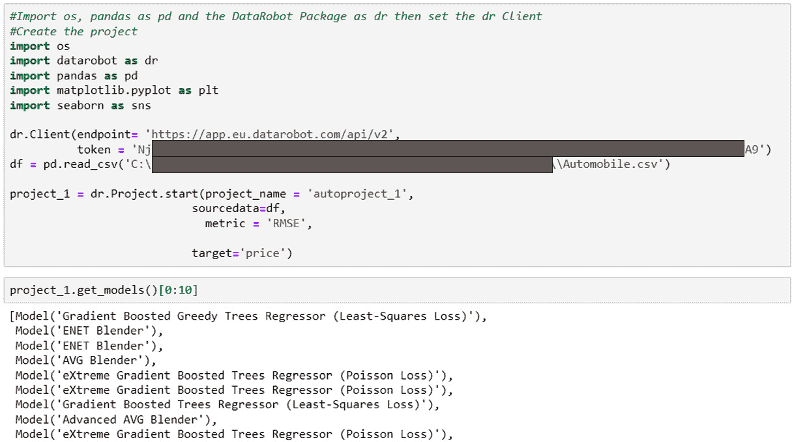

图 12.3 – 以编程方式创建 DataRobot 模型和提取其列表

一旦创建了模型，就需要调用`get_models`方法来列出模型。我们可以看到表现最好的模型是`Gradient Boosted Greedy Trees Regressor (Least-Square Loss)`。为了评估这个模型，我们需要提取其 ID。为此，我们必须创建一个对象，`best_model_01`，来存储表现最好的模型。然后对这个模型调用此指标方法。如图所示，该模型的交叉验证 RMSE 为`2107.40`：

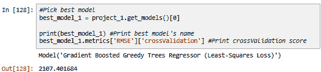

图 12.4 – 以编程方式评估 DataRobot 模型

为了提供一些关于价格驱动因素的了解，我们需要特征影响。这些可以通过 DataRobot API 使用`get_or_feature_impact`方法检索。为了可视化项目的特征影响，我们必须定义一个名为`plot_FI`的函数，该函数接受模型名称和图表标题作为参数，获取特征影响，然后使用 Seaborn 的条形图方法进行归一化和绘图。关于`autoproject_1`项目，以下截图显示了如何使用`plot_FI`函数检索和展示特征影响：

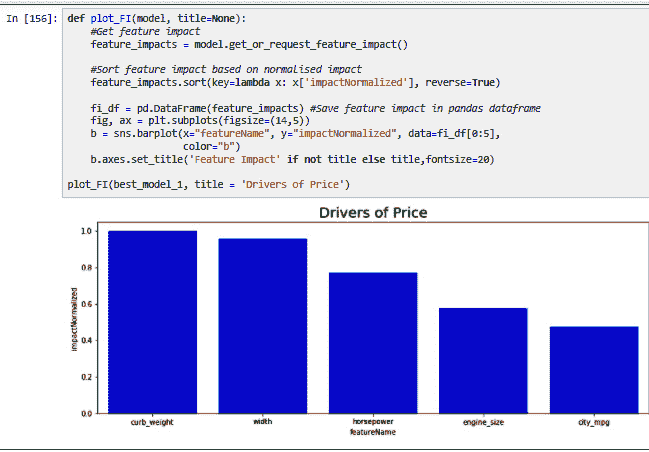

图 12.5 – 定义函数并提取特征影响

通过程序访问 DataRobot 可以进一步发挥该平台的优势。通过程序访问，您可以利用 Python 中的迭代过程，用户可以为同一数据集创建多个项目。现在，让我们看看从同一数据集创建多个项目的两种方法：**多类别**分类和**模型工厂**。

多类别分类涉及将实例分类到两个以上的类别。可以创建一个单一的项目，将行分类到这些类别中的任何一个。本质上，这是一个将行分类到所有可用类别之一的模型。另一种处理此问题的方法是为不同的类别构建不同的模型。在此方法中，为每个类别作为目标构建一个模型。您可以看到如何使用 Python 的迭代过程执行此操作；即通过遍历所有目标级别。一对多方法更适合执行具有两个以上类别的分类问题。

现在，让我们演示如何在汽车定价项目中使用一对多方法。在这里，我们将使用 pandas 的`qcut`创建价格类别。`qcut`有助于将数据划分为大小相似的区间。使用此函数，我们可以将我们的数据划分为价格类别——从低到高。以下截图显示了此价格离散化过程和检查案例在类别中的分布：

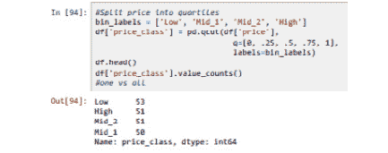

图 12.6 – 定价离散化

创建了类别后，为了允许数据**泄露**，我们将删除初始的价格变量。我们将编写一个循环，为每个价格类别构建模型。执行以下步骤：

1.  将`price_class`变量转换为哑变量。

1.  对于每次迭代，在创建一个经过哑变量处理的定价类别名称后创建一个 DataRobot 项目。

1.  对于每次迭代，我们删除正在建模的`price_class`哑变量级别。这确保了没有泄露。

1.  对于每次迭代，我们必须为目标变量哑变量构建模型。

1.  创建项目后，每个项目的最佳模型被选中并存储在字典中：

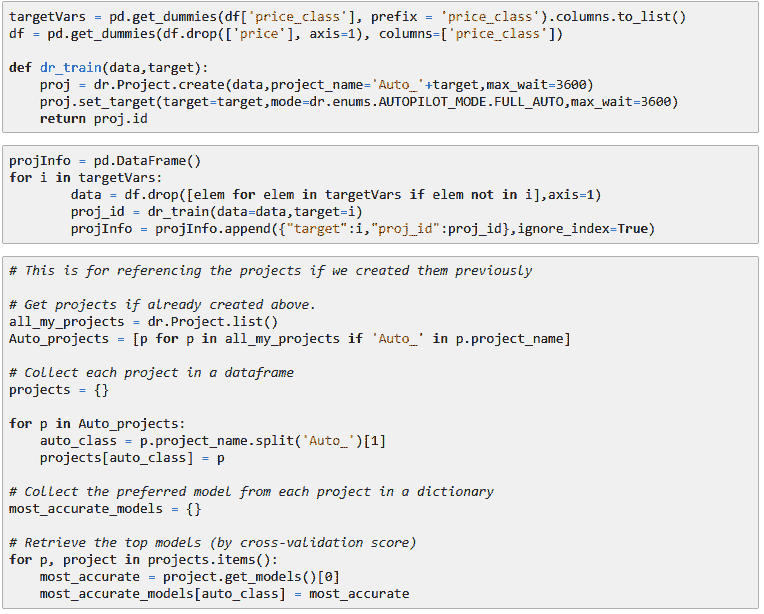

图 12.7 – 创建一个单对多分类项目套件

此过程涉及创建具有一系列模型的项目，目标遍历所有价格类别。创建项目后，使用以`Auto`开头的所有项目的迭代选择每个目标类别的最佳模型，然后选择每个项目的最佳性能模型。这些最佳模型被放置在一个字典中。

有时建议（如果不是理想的情况），使用数据子集创建不同的项目。在选择了目标变量的所有案例后，必须为每个项目创建迭代创建随机数据子集。然而，在自动定价的情况下，我们无法探索这一点，因为外样本大小有限制。

A `燃料类型`):

1.  首先，创建并存储一个项目。

1.  选择目标变量的案例（感兴趣的变量）。在这种情况下，变量是`燃料类型`。在这里，选择了这个变量，并使用这个变量的不同级别来创建 DataRobot 项目。简单来说，这一步涉及，例如，选择所有将`燃料类型`设置为`汽油`的行作为一个子组。

1.  如果需要，定义评估指标。在这里，我们可以修改我们在*第六章*中遇到的先进选项，即使用 DataRobot 进行模型构建。还可以选择并修改其他先进选项。

1.  如果需要，为班级设置一个数据限制，使得该班级将取消选择（例如，如果该班级的行数少于 20）。这一步骤的重要性在于，某些变量级别可能具有非常低的频率，因此子组内的样本量很小。因此，从这些变量中创建模型成为了一个挑战。这一步骤是使用子组内案例计数来删除此类变量级别的最佳位置。

1.  所有项目中的所有模型都被选中并存储在一个字典中。

在创建用于自动定价问题的模型因子时，一些步骤是显而易见的（参见*图 12.8*）。在这里，`燃料类型`被选为创建项目的基础特征。在这种情况下，只创建了两个项目：一个用于汽油汽车，另一个用于柴油汽车。现在我们已经创建了模型，下一步是收集每个`燃料类型`的最佳性能模型：

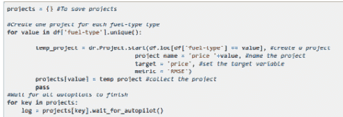

图 12.8 – 创建模型工厂

使用单对多类别分类模型和模型工厂相比，其有效性在于它们能够将模型拟合到目标变量的每个级别。这是自动完成的，并考虑了样本验证、所有预处理步骤以及模型训练过程。当数据基数和体积较高时，这些方法通常会优于典型的建模方法。

对于模型工厂，为感兴趣特征的各个级别创建了多个项目。为了评估这一点，从所有项目的字典中选择了每个项目的最佳性能模型。这个来自所有项目的最佳模型集存储在另一个字典对象中。然后，通过一个`for`循环遍历字典中的所有模型以提取模型的性能，如下面的截图所示：

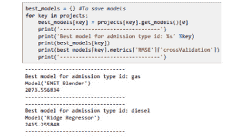

图 12.9 – 使用模型工厂评估模型的性能

改善模型性能只是您应该使用一对多多类分类模型以及模型因素的原因之一。有时，了解驱动因素同样重要。可视化不同燃料类型的特征重要性可以展示驱动因素之间的有趣对比。这意味着不同的因素会影响不同燃料类型的定价。这可能会影响战略决策。如下面的截图所示，可以使用 Python API 通过利用 Seaborn 和 Matplotlib 的图表函数来绘制特征影响：

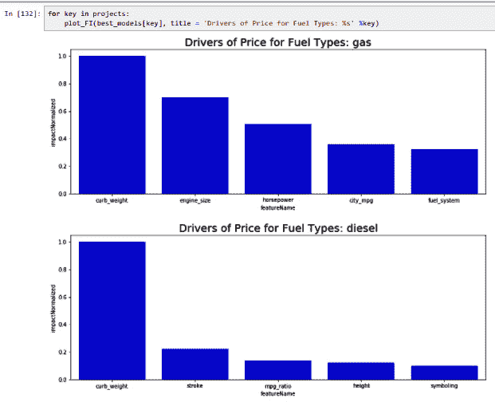

图 12.10 – 不同柴油和汽油汽车的特性影响

如我们所见，汽车燃料类型的特性影响存在一些差异。虽然` curb-weight`似乎是一个重要的驱动因素，但其影响对柴油车辆来说相对更重要。同样，对于汽油车来说，这些汽车产生的动力，如`engine_size`和`horsepower`特征所典型化的，在确定价格方面比柴油车更重要。您已经可以看到这些初步发现对决策的影响以及如何将其应用于其他商业案例。使用特征重要性来检查多个模型也可以应用于一对多分类问题。

在本节中，我们使用 Python API 创建了基本的 DataRobot 项目。之后，我们通过在一个系统中使用多个项目来解决更复杂的问题。在那里，我们创建了一对多项目来解决涉及子组的多层问题，并使用模型工厂来解决多级问题。我们还探讨了特征影响和模型评估。在程序化创建模型后，我们现在将学习如何使用这些模型进行预测。具体来说，我们将学习如何部署模型、进行预测、从模型中提取解释，并通过并行化对大型数据集进行评分。

# 程序化进行预测

使用 DataRobot 程序化使用所提供的可能性是巨大的。通过使用其 API，可以将模型部署并对它们进行预测。在制作生产环境中的程序化预测之前，需要部署模型。DataRobot 模型通过便携式预测服务器进行部署。这些是 Docker 容器，可以托管机器学习模型，并通过 REST API 提供预测和预测解释。

要部署模型，我们可以使用 DataRobot 包的`deployment`方法。在这里，我们必须提供一个描述、DataRobot 模型的 ID 以及其标签来创建部署。一个典型的 Python 部署脚本遵循以下格式：

```py
deployment = dr.Deployment.create_from_learning_model(
MODEL_ID, label='DEPLOYMENT_LABEL', description='DEPLOYMENT_DESCRIPTION',
    default_prediction_server_id=PREDICTION_SERVER_ID)
deployment
```

根据这种方法，以下截图显示了在*程序化构建模型*部分创建的`autoproject_1`如何部署。在这里，模型 ID 是`best_model_1`。我们将`AutoBase Deployment`标记为`Base Automobile Price Deployment`的描述：

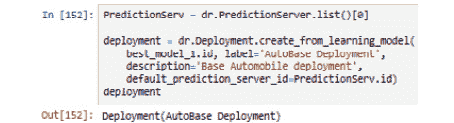

图 12.11 – 程序化部署模型

部署过程可以迭代，以使更复杂的项目能够实现。例如，使用模型工厂，无论区分变量有多少级别，只需一个`for`循环，就可以将所有最佳模型部署到 DataRobot。对于每个最佳模型，都会创建一个部署，然后用于评分新数据。以下截图显示了用于汽车项目的模型工厂部署脚本，其中燃料类型是其区分变量：

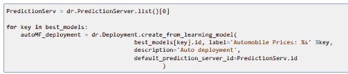

图 12.12 – 从模型工厂部署模型

部署了模型后，可以对它们进行预测。要在开发环境中进行简单预测，我们可以使用`DataRobot BatchPredictionJob.score_to_file`方法。要进行预测，此方法需要模型 ID、预测数据和评分数据将存储的位置。在这里，我们将使用`best_model_1`对用于开发模型的同一模型进行评分，即`df`数据对象，以及位置路径，指定预测文件路径为`./pred.csv`。`passthrough_columns_set`参数指定将包含在预测中的原始数据集的列。由于此设置为`'all'`，因此返回所有列，如下所示：

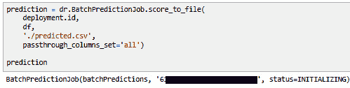

图 12.13 – 简单程序化预测

这些预测包括初始数据集的所有列，以及预测价格。在某些情况下，包括预测背后的理由是理想的。在这种情况下，应在作业配置中包含`max_explanations`参数。此参数设置每行数据应提供的最高解释数量。

# 摘要

DataRobot 为我们提供了一种独特的快速开发模型的能力。借助这个平台，数据科学家可以结合 DataRobot 的优势以及开放编程的灵活性。在本章中，我们探讨了获取用于程序化使用 DataRobot 所需凭证的方法。使用 Python 客户端，我们演示了数据摄取的方式以及如何创建基本项目。我们开始构建用于更复杂问题的模型。我们创建了模型工厂以及一对多模型。最后，我们展示了如何部署模型并用于评分数据。

使用 DataRobot 进行程序化操作的一个关键优势是能够从众多来源摄取数据，对其进行评分，并将它们存储在相关来源中。这使得进行端到端数据集评分成为可能。系统可以设置为定期进行模型评分。随之而来的是许多数据质量和模型监控问题。下一章将重点介绍如何在 DataRobot 平台上控制模型和数据的质量，以及如何使用 Python API。
