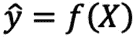
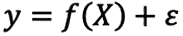
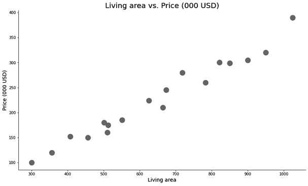
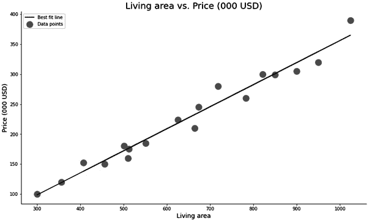
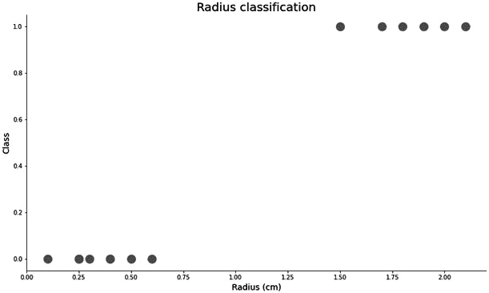
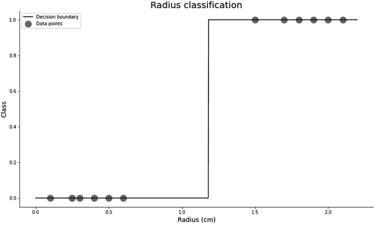
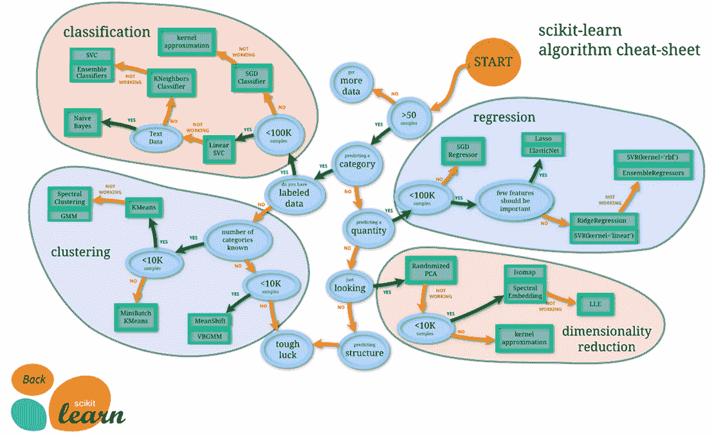

# 第一章：机器学习和自动化的理念

在本章中，我们将快速复习机器学习的核心主题。包括监督式机器学习，以及回归和分类的基本概念。

我们将从学生、专业人士和商业用户等多个角度理解为什么机器学习对于 21 世纪的成就是至关重要的，并讨论机器学习可以解决的不同类型的问题。

此外，我们将介绍自动化的概念，并了解它如何应用于机器学习任务。我们将探讨 Python 生态系统中的自动化选项，并比较它们的优缺点。我们将简要介绍**TPOT**库，并讨论它在现代机器学习自动化中的作用。

本章将涵盖以下主题：

+   回顾机器学习的历史

+   回顾自动化

+   将自动化应用于机器学习

+   Python 的自动化选项

# 技术要求

要完成本章，你只需要安装 Python，以及基本的数据处理和机器学习库，如`numpy`、`pandas`、`matplotlib`和`scikit-learn`。你将在*第二章**深入 TPOT*中学习如何安装和配置这些库，但让我们保持简单。这些库在 Anaconda 的任何发行版中都是预安装的，所以你不必担心。如果你使用的是原始 Python 而不是 Anaconda，从终端执行此行将安装所需的一切：

```py
> pip install numpy pandas matplotlib scikit-learn
```

请记住，始终在虚拟环境中安装库是一个好的实践，你很快就会学会如何做。

本章的代码可以在此处下载：

[`github.com/PacktPublishing/Machine-Learning-Automation-with-TPOT/tree/main/Chapter01`](https://github.com/PacktPublishing/Machine-Learning-Automation-with-TPOT/tree/main/Chapter01)

# 回顾机器学习的历史

25 年多前（1994 年），在《今日秀》的一期节目中提出了一个问题——“互联网究竟是什么？”很难想象，在几十年前，普通大众很难定义互联网是什么以及它是如何工作的。他们不知道，仅仅四分之一世纪后，我们就会有智能系统自我管理，并服务于大众。

机器学习的概念早在 1949 年由唐纳德·赫布提出。他提出了关于神经元兴奋和神经元之间通信的理论（*《机器学习简史》- DATAVERSITY，福特，K.，2019 年 3 月 26 日）。他是第一个提出人工神经元、它们的激活以及通过权重建立的关系的概念的人。

在 20 世纪 50 年代，亚瑟·萨缪尔开发了一个用于玩跳棋的计算机程序。当时的内存相当有限，所以他设计了一个评分函数，试图根据棋盘上的位置来衡量每位玩家的获胜概率。程序使用 MinMax 策略选择其下一步行动，这最终演变成了 MinMax 算法（*《机器学习简史 – DATAVERSITY,》Foote, K.；2019 年 3 月 26 日）。萨缪尔也是第一个提出**机器学习**这个术语的人。

弗兰克·罗森布拉特决定将赫布的人工脑细胞模型与亚瑟·萨缪尔的成果结合起来，创建了一个**感知器**。1957 年，感知器被计划为一个机器，这导致了**Mark 1 感知器**机器的建造，该机器设计用于图像分类。

这个想法至少看起来很有希望，但机器无法识别有用的视觉模式，这导致了进一步研究的中断——这个时期被称为第一次人工智能冬天。直到 20 世纪 90 年代，感知器和神经网络模型并没有什么进展。

前几段告诉我们关于 20 世纪末机器学习和深度学习状态的足够信息。一些个人在神经网络方面取得了巨大的进步，而普通大众甚至难以理解互联网是什么。

要使机器学习在现实世界中变得有用，科学家和研究人员需要两样东西：

+   **数据**

+   **计算能力**

第一个定义由于互联网的兴起而迅速变得更容易获得。第二个定义则缓慢地进入了一个指数增长阶段——无论是在 CPU 性能还是在存储容量方面。

然而，1990 年代末和 2000 年代初的机器学习状态与今天的情况相去甚远。今天的硬件导致了机器学习在生产和应用中的显著增加。很难想象一个没有 Netflix 推荐电影或 Google 不自动从常规电子邮件中过滤垃圾邮件的世界。

那么，机器学习究竟是什么呢？

## 什么是机器学习？

现在有很多关于机器学习的定义，有的更加正式，有的则不那么正式。以下是一些值得提到的定义：

+   机器学习是**人工智能**（**AI**）的一个应用，它为系统提供了自动从经验中学习和改进的能力，而不需要明确编程（*《什么是机器学习？一个定义 – Expert System,》Expert System 团队；2020 年 5 月 6 日）。

+   机器学习是一个概念，即计算机程序可以在没有人类干预的情况下学习和适应新的数据（*《机器学习 – Investopedia,》Frankenfield, J.；2020 年 8 月 31 日）。

+   机器学习是计算机科学的一个领域，旨在教会计算机如何在没有明确编程的情况下学习和行动（*《机器学习 – DeepAI,》Deep AI 团队；2020 年 5 月 17 日）。

尽管这些定义的表达方式不同，但它们传达了相同的信息。机器学习的目标是开发一个系统或算法，能够在没有人类干预的情况下从数据中学习。

数据科学家的目标不是指导算法如何学习，而是向算法提供足够大且准备好的数据集，并简要说明数据集中变量之间的关系。例如，假设目标是创建一个能够预测房价的模型。在这种情况下，数据集应提供大量历史价格观察结果，通过诸如位置、大小、房间数量、年龄、是否有阳台或车库等变量来衡量。

机器学习算法将决定哪些特征是重要的，哪些不是，因此，哪些特征具有显著的预测能力。前一段的例子解释了使用**监督机器学习**方法解决的**回归**问题。我们很快就会深入探讨这两个概念，所以如果你不太理解，不要担心。

此外，我们可能还想构建一个模型，能够以相当高的置信度预测客户是否可能流失（终止合同）。有用的特征可能包括客户正在使用的服务列表、他们使用服务的时间长短、之前的付款是否按时支付等。这是另一个监督机器学习问题的例子，但目标变量（流失）是分类的（是或否），而不是连续的，就像上一个例子中那样。我们称这类问题为**分类机器学习问题**。

机器学习不仅限于回归和分类。它还应用于许多其他领域，如聚类和降维。这些属于**无监督机器学习**技术的范畴。这些主题将不会在本章中讨论。

但首先，让我们回答关于机器学习模型可用性的问题，并讨论谁使用这些模型以及在什么情况下使用。

## 在哪些行业中，公司正在使用机器学习？

用一句话来说——无处不在。但你必须继续阅读，才能获得完整的画面。在过去十年或二十年中，机器学习几乎被应用到每个行业中。主要原因在于硬件的进步。此外，机器学习对更广泛的公众来说变得更容易使用和理解。

列举所有使用机器学习的行业及其解决的问题是不可能的。更简单的是列出那些不能从机器学习中受益的行业，因为这样的行业要少得多。

在本节中，我们将仅关注更为人熟知的行业。

下面是一个列表和解释，介绍了机器学习最常用的十个用例，从行业角度和一般概述来看：

+   **金融行业**：机器学习在金融领域越来越受欢迎。银行和金融机构可以利用它做出更明智的决策。借助机器学习，银行可以检测出最有可能无法偿还贷款的客户。此外，银行可以使用机器学习方法来跟踪和理解其客户的消费模式。这可以导致为双方都满意地创造更多个性化的服务。机器学习还可以通过某些客户账户上的意外行为来检测异常和欺诈。

+   **医疗行业**：医学的最近进步至少部分得益于机器学习的进步。可以根据这些预测方法在疾病的早期阶段检测疾病，基于此，医学专家可以制定个性化的治疗和康复计划。例如，计算机视觉技术如图像分类和目标检测可以用于对肺图像进行分类。这些技术也可以用于根据单一图像或一系列图像检测肿瘤的存在。

+   **图像识别**：这可能是机器学习应用最广泛的应用，因为它可以应用于任何行业。你可以从简单的猫狗图像分类到对非洲濒危动物皮肤状况的分类。图像识别还可以用于检测图像中是否存在感兴趣的对象。例如，在“哪里有 Waldo？”游戏中自动检测 Waldo 的逻辑与自动驾驶汽车中检测行人的算法大致相同。

+   **语音识别**：这是一个既令人兴奋又充满希望的新兴领域。基本思想是，一个算法可以自动识别音频剪辑中的 spoken words，并将其转换为文本文件。一些更知名的应用包括设备控制（通过语音命令控制空调）、语音拨号（仅通过你的声音自动识别要拨打的联系人）和互联网搜索（用你的声音浏览网页）。这些只是立即想到的几个例子。自动语音识别软件的开发具有挑战性。并非所有语言都受到支持，许多非母语者在说外语时都有口音，这可能会让机器学习算法难以识别。

+   **自然语言处理（NLP**）：私营部门的公司可以从 NLP 中获得巨大的好处。例如，如果客户留下的在线评论太多而无法手动分类，公司可以使用 NLP 来分析这些评论的情感。此外，公司可以在网页上创建聊天机器人，它们可以立即与用户开始对话，从而带来更多潜在的销售。更高级的例子是，NLP 可以用来编写长文档的摘要，甚至可以用来分割和分析蛋白质序列。

+   **推荐系统**：截至 2020 年底，很难想象一个谷歌不根据你的过去行为定制搜索结果的世界，亚马逊不自动推荐类似产品，Netflix 不根据你过去的观看推荐电影和电视剧，以及 Spotify 不推荐那些可能逃过你注意力的音乐的世界。这只是几个例子，但并不难认识到推荐系统的重要性。

+   **垃圾邮件检测**：就像很难想象一个搜索结果不符合你喜好的世界一样，也很难想象一个不自动过滤掉关于现在或永不折扣的吸尘器信息的电子邮件服务。我们每天都被信息轰炸，自动垃圾邮件检测算法可以帮助我们关注重要的事情。

+   **自动化交易**：即使股市移动得太快，没有自动化手段也无法完全捕捉到正在发生的事情。开发交易机器人并不容易，但机器学习可以帮助你根据大量的历史数据选择最佳的买卖时机。如果完全自动化，你可以在海滩上啜饮玛格丽塔酒的同时观察你的钱如何创造更多的钱。这可能对一些人来说听起来有些牵强，但有了稳健的模型和大量的领域知识，我看不到为什么不行。

+   **异常检测**：让我们回到我们的银行业例。银行可以使用异常检测算法来处理各种用例，例如标记可疑交易和活动。最近，我一直在使用异常检测算法来检测网络流量中的可疑行为，目的是自动检测网络攻击和恶意软件。如果数据格式正确，这是一种适用于任何行业的另一种技术。

+   **社交网络**：Facebook 有多少次推荐你可能认识的人？或者 YouTube 推荐了你刚刚思考的主题的视频？不，他们不是在读取你的思想，但他们知道你的过去行为和决定，并且可以相当自信地预测你的下一步。

这些只是机器学习能做什么的几个例子——当然不是详尽的列表。你现在已经熟悉了机器学习简史，并知道机器学习可以应用于广泛的任务。

下一个部分将简要回顾监督机器学习技术，例如回归和分类。

## **监督学习**

大多数实际机器学习问题都是通过**监督学习**算法解决的。监督学习指的是你有一个输入变量（一个预测因子），通常用 X 表示，以及一个输出变量（你试图预测的内容），通常用 y 表示。

特征（X）用大写字母表示，而目标变量（y）没有，这是有原因的。从数学的角度来看，X 表示特征矩阵，而矩阵通常用大写字母表示。另一方面，y 是一个向量，通常用小写字母表示向量。

监督机器学习算法的目标是学习一个可以将任何输入转换为输出的函数。监督学习算法最一般的数学表示是通过以下公式表示的：


图 1.1 – 一般监督学习公式

我们必须应用两种修正之一来使这个公式可接受。第一种修正是将 y 替换为 y-hat，因为 y 通常表示真实值，而 y-hat 表示预测。第二种我们可以做的修正是添加误差项，因为只有这样我们才能在另一侧得到正确的 y 值。误差项表示不可减少的误差——那种无法通过进一步训练减少的误差。

这是第一个修正后的公式看起来是这样的：



图 1.2 – 修正后的监督学习公式（v1）

下面是第二个公式：



图 1.3 – 修正后的监督学习公式（v2）

更常见的是看到第二个公式，但不要被任何格式所迷惑——这些公式通常表示相同的东西。

监督机器学习被称为“监督学习”，因为我们已经拥有了可用的标记数据。你可能已经因为特征和目标讨论而选择了它。这意味着我们已经有正确的答案了，因此，我们知道哪些 X 的组合会产生 y 的相应值。

最终目标是根据可用的数据做出最佳泛化。我们希望产生最无偏的模型，能够泛化到新的、未见过的数据。过拟合、欠拟合和偏差-方差权衡的概念对于产生这样的模型很重要，但它们不在这个书的范围之内。

正如我们之前提到的，监督学习问题分为两大类：

+   **回归**：目标变量在本质上连续，例如美元房价、华氏温度、磅重、英寸高度等。

+   **分类**：目标变量是一个类别，可以是二元的（真/假、阳性/阴性、疾病/无疾病），也可以是多类的（无症状/轻度症状/重度症状、学校成绩等）。

回归和分类将在以下章节中探讨。

### 回归

如前几节简要讨论的，回归指的是目标变量连续的现象。目标变量可能代表价格、重量或高度，仅举几例。

最常见的回归类型是**线性回归**，这是一个假设变量之间存在线性关系的模型。线性回归进一步分为简单线性回归（只有一个特征）和多元线性回归（多个特征）。

重要提示

请记住，线性回归不是唯一类型的回归。你可以使用决策树、随机森林、支持向量机、梯度提升和人工神经网络等算法执行回归任务，但相同的概念仍然适用。

为了快速回顾回归概念，我们将声明一个简单的 `pandas.DataFrame` 对象，包含两列 – `Living area` 和 `Price`。目标是仅根据居住空间预测价格。我们在这里使用简单的线性回归模型，因为它使数据可视化过程更简单，最终结果是使回归概念更容易理解：

1.  以下是一个数据集 – 两个列都包含任意和虚构的值：

    ```py
    import pandas as pd 
    df = pd.DataFrame({
        'LivingArea': [300, 356, 501, 407, 950, 782, 
                       664, 456, 673, 821, 1024, 900, 
                       512, 551, 510, 625, 718, 850],
        'Price': [100, 120, 180, 152, 320, 260, 
                  210, 150, 245, 300, 390, 305, 
                  175, 185, 160, 224, 280, 299]
    })
    ```

1.  为了可视化这些数据点，我们将使用 `matplotlib` 库。默认情况下，这个库看起来并不吸引人，所以通过 `matplotlib.rcParams` 包进行了一些调整：

    ```py
    import matplotlib.pyplot as plt 
    from matplotlib import rcParams
    rcParams['figure.figsize'] = 14, 8
    rcParams['axes.spines.top'] = False
    rcParams['axes.spines.right'] = False
    ```

1.  以下选项使图表默认更大，并移除了顶部和右侧的边框（脊）。以下代码片段将我们的数据集可视化为二维散点图：

    ```py
    plt.scatter(df['LivingArea'], df['Price'], color='#7e7e7e', s=200)
    plt.title('Living area vs. Price (000 USD)', size=20)
    plt.xlabel('Living area', size=14)
    plt.ylabel('Price (000 USD)', size=14)
    plt.show()
    ```

    上一段代码生成了以下图表：

    

    图 1.4 – 回归 – 居住面积与价格（000 美元）的散点图

1.  使用 `scikit-learn` 库训练线性回归模型是最容易的。该库包含大量不同的算法和技术，我们可以将其应用于我们的数据。`sklearn-learn.linear_model` 模块包含 `LinearRegression` 类。我们将使用它来在整个数据集上训练模型，并对其进行预测。在生产环境中通常不会这样做，但在这里对于进一步理解模型的工作原理是必要的：

    ```py
    from sklearn.linear_model import LinearRegression
    model = LinearRegression()
    model.fit(df[['LivingArea']], df[['Price']])
    preds = model.predict(df[['LivingArea']])
    df['Predicted'] = preds
    ```

1.  我们将预测值分配为另一个数据集列，只是为了使数据可视化更简单。再次，我们可以创建一个包含整个数据集的散点图。这次，我们将添加一条代表*最佳拟合线*的线 – 这条线上的误差最小：

    ```py
    plt.scatter(df['LivingArea'], df['Price'], color='#7e7e7e', s=200, label='Data points')
    plt.plot(df['LivingArea'], df['Predicted'], color='#040404', label='Best fit line')
    plt.title('Living area vs. Price (000 USD)', size=20)
    plt.xlabel('Living area', size=14)
    plt.ylabel('Price (000 USD)', size=14)
    plt.legend()
    plt.show()
    ```

    上一段代码生成了以下图表：

    

    图 1.5 – 回归 – 居住面积与价格（000 美元）的散点图及最佳拟合线

1.  如我们所见，简单的线性回归模型几乎完美地捕捉了我们的数据集。这并不令人惊讶，因为数据集是为了这个目的而创建的。新的预测将沿着最佳拟合线进行。例如，如果我们对预测拥有 1,000 平方米居住空间的房屋价格感兴趣，模型将做出略高于$350K 的预测。在代码中的实现很简单：

    ```py
    model.predict([[1000]])
    >>> array([[356.18038708]])
    ```

1.  此外，如果您想评估这个简单的线性回归模型，*R2*和*RMSE*等指标是一个不错的选择。R2 衡量拟合优度，因此它告诉我们我们的模型捕捉了多少方差（范围从 0 到 1）。它更正式地被称为*确定系数*。RMSE 衡量模型在平均意义上的错误程度，以感兴趣的单元为单位。例如，RMSE 值为 10 表示我们的模型平均错误为$10K，无论是正方向还是负方向。

    R2 分数和 RMSE 的计算方法如下：

    ```py
    import numpy as np
    from sklearn.metrics import r2_score, mean_squared_error
    rmse = lambda y, ypred: np.sqrt(mean_squared_error(y, ypred))
    model_r2 = r2_score(df['Price'], df['Predicted'])
    model_rmse = rmse(df['Price'], df['Predicted'])
    print(f'R2 score: {model_r2:.2f}')
    print(f'RMSE: {model_rmse:.2f}')
    >>> R2 score: 0.97
    >>> RMSE: 13.88
    ```

总结来说，我们构建了一个简单但准确的模型。不要期望现实世界中的数据表现得如此完美，也不要期望大多数时候都能构建如此准确的模型。模型选择和调整的过程既繁琐又容易出错，这就是自动化库如**TPOT**发挥作用的地方。

我们将在下一节中再次介绍分类复习，同样是在相当简单的例子中。

### 分类

在机器学习中，分类指的是目标变量是分类类型的问题。我们可以通过将目标变量转换为类别，如*已售/未售*，将*回归*部分的例子转换为分类问题。

简而言之，分类算法帮助我们处理各种场景，例如预测客户流失、肿瘤是否恶性、某人是否患有特定疾病等。您应该明白了。

分类任务可以进一步分为二元分类任务和多类分类任务。在本节中，我们将简要探讨二元分类任务。最基本的分类算法是*逻辑回归*，我们将在本节中使用它来构建一个简单的分类器。

注意

请记住，您在进行分类任务时不仅限于逻辑回归。相反——将逻辑回归模型作为基线使用是一种良好的实践，并在生产中使用更复杂的算法。更复杂的算法包括决策树、随机森林、梯度提升和人工神经网络。

在这个例子中，数据是完全虚构和任意的：

1.  我们有两个列——第一列表示某种测量（称为`Radius`），第二列表示分类（要么是 0 要么是 1）。数据集是用以下 Python 代码构建的：

    ```py
    import numpy as np
    import pandas as pd
    df = pd.DataFrame({
        'Radius': [0.3, 0.1, 1.7, 0.4, 1.9, 2.1, 0.25, 
                   0.4, 2.0, 1.5, 0.6, 0.5, 1.8, 0.25],
        'Class': [0, 0, 1, 0, 1, 1, 0, 
                  0, 1, 1, 0, 0, 1, 0]
    })
    ```

1.  我们将再次使用`matplotlib`库来进行可视化。以下是导入它并使其更具视觉吸引力的方法：

    ```py
    import matplotlib.pyplot as plt 
    from matplotlib import rcParams
    rcParams['figure.figsize'] = 14, 8
    rcParams['axes.spines.top'] = False
    rcParams['axes.spines.right'] = False
    ```

1.  我们可以重用之前回归示例中的相同逻辑来制作可视化。然而，这一次，我们不会看到类似于线的紧密数据。相反，我们会看到数据点被分成两组。在左下角是`Class`属性为 0 的数据点，而在右边的属性为 1：

    ```py
    plt.scatter(df['Radius'], df['Class'], color='#7e7e7e', s=200)
    plt.title('Radius classification', size=20)
    plt.xlabel('Radius (cm)', size=14)
    plt.ylabel('Class', size=14)
    plt.show()
    ```

    下面的图表是前面代码的输出：

    

    ![图 1.6 – 分类 – 测量值与类别之间的散点图

    分类模型的目标不是产生最佳拟合线，而是要在类别之间画出最佳可能的分离。

1.  逻辑回归模型可在`sklearn.linear_model`包中找到。我们将使用它在整个数据集上训练模型，然后在整个数据集上进行预测。再次强调，这不是我们将在本书后面继续做的事情，但了解模型内部工作原理在这个阶段是至关重要的：

    ```py
    from sklearn.linear_model import LogisticRegression
    model = LogisticRegression()
    model.fit(df[['Radius']], df['Class'])
    preds = model.predict(df[['Radius']])
    df['Predicted'] = preds
    ```

1.  我们现在可以使用这个模型对任意数量的 X 值进行预测，范围从整个数据集中的最小值到最大值。通过`np.linspace`方法获得均匀分布的数字范围。它需要三个参数 – `start`、`stop`和元素数量。我们将元素数量设置为`1000`。

1.  然后，我们可以画一条线来表示 X 值每个值的概率。通过这样做，我们可以可视化模型的决策边界：

    ```py
    xs = np.linspace(0, df['Radius'].max() + 0.1, 1000)
    ys = [model.predict([[x]]) for x in xs]
    plt.scatter(df['Radius'], df['Class'], color='#7e7e7e', s=200, label='Data points')
    plt.plot(xs, ys, color='#040404', label='Decision boundary')
    plt.title('Radius classification', size=20)
    plt.xlabel('Radius (cm)', size=14)
    plt.ylabel('Class', size=14)
    plt.legend()
    plt.show()
    ```

    上述代码产生了以下可视化：

    

    图 1.7 – 分类 – 测量值与类别之间的散点图和决策边界

    我们的分类模型基本上是一个阶梯函数，对于这个简单问题来说是可以理解的。不需要更复杂的东西来正确分类我们数据集中的每个实例。但这并不总是如此，稍后我们会详细讨论。

1.  混淆矩阵是评估分类模型的最佳方法之一。我们的*负类*是 0，*正类*是 1。混淆矩阵只是一个显示以下内容的方阵：

    +   *真阴性*：左上角的数字。这些是具有类别 0 的实例，并且模型预测为 0。

    +   *假阴性*：左下角的数字。这些是具有类别 0 的实例，但模型预测为 1。

    +   *假阳性*：右上角的数字。这些是具有类别 1 的实例，但模型预测为 0。

    +   *真阳性*：右下角的数字。这些是具有类别 1 的实例，并且模型预测为 1。

        需要多次阅读前面的列表，直到完全理解这个概念。混淆矩阵是分类评估中的一个基本概念，本书后面的章节假设你知道如何解释它。

1.  混淆矩阵可以在`sklearn.metrics`包中找到。以下是导入它并获得结果的方法：

    ```py
    from sklearn.metrics import confusion_matrix
    confusion_matrix(df['Class'], df['Predicted'])
    ```

    这里是结果：

![图 1.8 – 分类 – 使用混淆矩阵进行评估

![img/B16954_01_008.jpg]

图 1.8 – 分类 – 使用混淆矩阵进行评估

前面的图显示，我们的模型能够正确地分类每一个实例。一般来说，如果从左下角到右上角的对角线元素都是零，这意味着模型是 100%准确的。

混淆矩阵的解释结束了我们对监督机器学习方法的简要复习。接下来，我们将深入探讨自动化的概念，并讨论为什么我们需要它在机器学习中。

# 回顾自动化

本节简要讨论了自动化的概念，为什么我们需要它，以及它是如何应用于机器学习的。我们还将回答一个古老的疑问：机器学习是否会取代人类的工作，以及自动化在这方面所起的作用。

自动化在现代世界中扮演着巨大的角色，在过去几个世纪中，它使我们能够完全从危险和重复性工作中消除人的因素。这为就业市场开辟了一片新的天地，那里的工作通常基于一些无法自动化的东西，至少在这个时间点上是这样。

但首先，我们必须理解什么是自动化。

## 什么是自动化？

现在有许许多多语法上不同的定义，但它们都共享同一个基本思想。以下一个以最简单的术语表达了这一思想：

自动化是一个广泛的概念，可以涵盖许多技术领域，在这些领域中，人的输入被最小化（*什么是自动化？ – IBM,* IBM 团队；2020 年 2 月 28 日）。

定义的核心部分是*最小化人的输入*。一个自动化过程完全或几乎完全由机器管理。直到几年前，机器是自动化枯燥、常规任务的一个很好的方式，而将创造性的事情留给人类。正如你可能猜到的，机器在创造性任务上并不那么出色。也就是说，直到最近它们是这样的。

机器学习为我们提供了一种机制，不仅能够自动化计算、电子表格管理和费用跟踪，还能进行更多认知任务，如决策。这个领域每天都在发展，很难说我们何时可以期待机器接管一些更具创造性的工作。

机器学习中的自动化概念将在后面讨论，但重要的是要记住，机器学习可以将自动化提升到一个全新的水平。并非所有的自动化形式都是平等的，通常接受的自动化划分是基于复杂性的四个级别：

+   **基本自动化**：对最简单任务的自动化。**机器人流程自动化**（RPA）是完美的例子，因为它的目标是使用软件机器人来自动化重复性任务。这个自动化类别的最终目标是完全从等式中消除人为因素，从而实现快速执行重复性任务且无错误。

+   **流程自动化**：这将在整个业务流程中应用和实施基本自动化技术。最终目标是完全自动化一项业务活动，只让人类进行最终批准。

+   **集成自动化**：这使用人类定义的规则来模拟在任务完成中的人类行为。最终目标是最大限度地减少在更复杂的业务任务中的人类干预。

+   **人工智能自动化**：自动化最复杂的形式。目标是拥有能够根据先前情况和在这些情况下做出的决策进行学习和做出决定的机器。

你现在知道了什么是自动化，接下来我们将讨论为什么它是 21 世纪必须的。

## 为什么需要自动化？

公司和客户都可以从自动化中受益。自动化可以提高资源分配和管理，并使业务扩展过程更容易。由于自动化，公司可以提供更可靠和一致的服务，这导致用户体验更加一致。最终结果是，如果服务质量不一致，客户更有可能购买并花费更多。

从长远来看，自动化简化并减少了人类活动，降低了成本。此外，任何自动化流程都可能比由人类执行的同种流程表现得更好。机器不会感到疲倦，不会有过糟糕的日子，也不需要薪水。

以下列表显示了自动化的一些最重要的原因：

+   **节省时间**：自动化通过让机器代替人类完成日常例行任务来简化日常流程。结果，人类可以从一开始就专注于更具创造性的任务。

+   **降低成本**：自动化应被视为一项长期投资。当然，它确实有一些启动成本，但如果正确实施，这些成本会很快得到弥补。

+   **准确性和一致性**：如前所述，人类容易出错、有糟糕的日子和缺乏一致性。机器则不是这样。

+   **工作流程改进**：由于自动化，可以花更多的时间在重要任务上，例如为客户提供个别帮助。如果员工的班次不是由重复性和例行任务组成，他们往往会更快乐，并取得更好的成果。

困难的问题不是“你是否要自动化”，而是“你何时要自动化”。关于这个话题有很多不同的观点，并没有一个绝对的对或错。决定何时自动化取决于你拥有的预算和机会成本（如果时间不是问题，你将能够做出的决定/投资）。

自动化你所擅长的任何事情，专注于需要改进的领域，这是大多数公司的一般规则。即使作为一个个人，你每天或每周都会做一些可以用普通语言描述的事情。如果某件事情可以一步一步地描述，那么它就可以被自动化。

但自动化这个概念是如何应用到机器学习中的呢？机器学习和自动化是同义词吗？这就是我们接下来要讨论的内容。

## 机器学习和自动化是同一件事吗？

嗯，不是的。但机器学习可以将自动化提升到一个全新的水平。让我们回顾一下之前讨论过的四个自动化级别。只有最后一个使用了机器学习，这是自动化最先进的形式。

让我们以我们日常生活中的一个活动作为一个*过程*来考虑。如果你确切地知道这个过程将如何开始和结束，以及中间会发生什么，以及发生的顺序，那么这个流程可以在没有机器学习的情况下被自动化。

这里有一个例子。在过去的几个月里，你一直在监控你想要搬去的地方的房地产价格。每天早上你给自己冲一杯咖啡，坐在电脑前，然后访问一个房地产网站。你筛选结果，只查看过去 24 小时内发布的广告，然后将数据，如位置、单价、房间数量等，输入到电子表格中。

这个过程需要你一天大约一个小时的时间，一个月下来就是 30 个小时。这相当多。在 30 个小时里，你很容易就能读一本书或者参加一个在线课程，以进一步发展你在其他领域的技能。本段描述的过程可以很容易地自动化，而不需要机器学习。

让我们再看另一个例子。你每天花几个小时在股市上，决定买什么卖什么。这个过程与上一个不同，因为它涉及到某种决策。问题是，有了所有可用的在线数据集，一个有技能的个人可以使用机器学习的方法来自动化买卖决策过程。

这是一种包含机器学习的自动化形式，但不是的，机器学习和自动化不是同义词。两者都可以在没有对方的情况下工作。

以下几节将详细讨论自动化在机器学习中的作用（而不是相反），并回答我们试图自动化什么，以及如何在当今时代实现它。

# 将自动化应用于机器学习

我们已经介绍了自动化的概念和多种自动化类型，但自动化和机器学习之间有什么联系呢？我们究竟在机器学习中试图自动化什么？

这正是本节旨在阐明的内容。在本节结束时，你将了解术语*机器学习自动化*和*自动化机器学习*之间的区别。这两个术语乍听起来可能很相似，但在现实中却大相径庭。

## 我们试图自动化什么？

让我们明确一点——*机器学习过程自动化*与*机器学习业务流程自动化*无关。在前者中，我们试图自动化机器学习本身，即自动化选择最佳模型和最佳超参数的过程。后者指的是利用机器学习自动化业务流程；例如，根据历史数据决定何时买入或卖出股票的决策系统。

记住这个区别至关重要。本书的主要重点是展示如何使用自动化库来自动化机器学习的过程。通过这样做，无论数据集如何，你都将遵循完全相同的方法，并且总是得到最佳可能的模型。

选择合适的机器学习算法并不是一件容易的事情。只需看看下面的图表：

![图 1.9 – scikit-learn 中的算法（来源：Scikit-learn：Python 中的机器学习，Pedregosa 等人，JMLR 12，第 2825-2830 页，2011）]



图 1.9 – scikit-learn 中的算法（来源：Scikit-learn：Python 中的机器学习，Pedregosa 等人，JMLR 12，第 2825-2830 页，2011）

正如你所见，需要做出多个决策来选择合适的算法。此外，每个算法都有自己的超参数集（由工程师指定的参数）。更糟糕的是，其中一些超参数是连续的，所以当你把所有这些都加起来时，你作为工程师应该测试的潜在超参数组合可能有数百万种。

每个超参数组合都需要训练和评估一个全新的模型。例如，**网格搜索**这样的概念可以帮助你避免编写数十个嵌套循环，但这远非最佳解决方案。

现代的机器学习工程师并不将时间和精力花在模型训练和优化上——相反，他们专注于提高数据质量和可用性。超参数调整可以带来额外的 2%的准确率提升，但能够决定你的项目成功与否的是数据的*质量*。

我们将在下一节中更深入地探讨超参数，并展示为什么手动寻找最佳超参数并不是一个好主意。

## 参数过多的问题

让我们来看看最流行的机器学习算法之一——`XGBoost`的可用的某些超参数。以下列表显示了通用的一些：

+   `booster`

+   `verbosity`

+   `validate_parameters`

+   `nthread`

+   `disable_default_eval_metric`

+   `num_pbuffer`

+   `num_feature`

这并不多，其中一些超参数是由算法自动设置的。问题在于进一步的筛选。例如，如果你将`gbtree`作为`booster`参数的值，你可以立即调整以下值：

+   `eta`

+   `gamma`

+   `max_depth`

+   `min_child_weight`

+   `max_delta_step`

+   `subsample`

+   `sampling_method`

+   `colsample_bytree`

+   `colsample_bylevel`

+   `colsample_bynode`

+   `lambda`

+   `alpha`

+   `tree_method`

+   `sketch_eps`

+   `scale_pos_weight`

+   `updater`

+   `refresher_leaf`

+   `process_type`

+   `grow_policy`

+   `max_leaves`

+   `max_bin`

+   `predictor`

+   `num_parallel_tree`

+   `monotone_constraints`

+   `interaction_constraints`

这已经很多了！如前所述，一些超参数接受连续值，这极大地增加了组合的总数。这里是最后的甜点——这些只是单个模型的超参数。不同的模型有不同的超参数，这使得调整过程更加耗时。

简而言之，模型选择和超参数调整不是你应该手动做的事情。有更多重要的任务需要你投入精力。即使没有其他事情要做，我宁愿去吃午饭也不愿意手动调整任何一天。

AutoML 使我们能够做到这一点，因此我们将在下一节简要探讨它。

## 什么是 AutoML？

**AutoML**代表**自动化机器学习**，其主要目标是减少或完全消除数据科学家在构建机器学习模型中的作用。一开始听到这句话可能有些刺耳。我知道你在想什么。但不是——AutoML 不能取代数据科学家和其他数据专业人士。

在最佳情况下，AutoML 技术使其他软件工程师能够在他们的应用程序中利用机器学习的力量，而不需要具备坚实的 ML 背景。这种最佳情况只有在数据得到充分收集和准备的情况下才可能实现——这不是后端开发人员的专长。

对于非数据科学家来说，事情变得更加困难，机器学习过程通常需要大量的特征工程。这一步可以跳过，但往往会导致模型表现不佳。

总之，AutoML 不会取代数据科学家，恰恰相反——它在这里是为了让数据科学家的生活更轻松。AutoML 只是完全自动化模型选择和调整。

有些 AutoML 服务宣称自己可以完全自动化数据准备和特征工程工作，但这只是通过组合各种特征并创建出大多数情况下不可解释的东西。机器不知道变量之间的真实关系。这是数据科学家的工作去发现。

# 自动化选项

AutoML 并不是一个全新的概念。这个想法和一些实现已经存在多年，并且总体上获得了积极的反馈。然而，由于缺乏理解，一些组织未能实施和充分利用 AutoML 解决方案。

AutoML 并不能做所有事情——仍然需要有人收集数据、存储和准备数据。这不是一个小任务，通常需要大量的领域知识。只有在那时，自动化的解决方案才能充分发挥其潜力。

本节探讨了实现 AutoML 解决方案的一些选项。我们将比较一个用 Python 编写的基于代码的工具，以及一个作为浏览器应用程序提供的工具，这意味着不需要编写代码。我们将首先从基于代码的工具开始。

## PyCaret

**PyCaret**已被广泛用于尽可能少地编写代码来制作生产就绪的机器学习模型。这是一个完全免费的解决方案，可以轻松地训练、可视化和解释机器学习模型。

它内置了对回归和分类模型的支持，并以交互式方式显示用于任务的模型以及哪个模型产生了最佳结果。数据科学家需要决定用于任务的模型。训练和优化都简单得就像一个函数调用一样。

该库还提供了一个选项，使用博弈论算法（如**SHAP**（**Shapely Additive Explanations**））来解释机器学习模型，只需一个函数调用即可。

PyCaret 仍然需要一些人工交互。然而，通常情况下，模型的初始化和训练过程必须由用户明确选择，这打破了完全自动化的解决方案的想法。

此外，PyCaret 在处理大型数据集时运行和优化可能会比较慢。接下来，让我们看看一个无需编写代码的 AutoML 解决方案。

## ObviouslyAI

我们并非所有人都知道如何开发机器学习模型，甚至不知道如何编写代码。这就是拖放解决方案发挥作用的地方。**ObviouslyAI**无疑是其中最好的之一，而且使用起来也很简单。

这种服务允许在浏览器中进行模型训练和评估，甚至可以解释模型做出决策背后的原因。对于机器学习不是核心业务的公司来说，这是一个不费吹灰之力的选择，因为它很容易开始，而且几乎不需要像整个数据科学团队那样花费大量费用。

对于这类服务的一个大问题是定价。总是包含一个免费计划，但在这个特定案例中，它限制在少于 50,000 行的数据集。这完全适用于偶尔的测试，但对于大多数生产用例来说是一个决定性因素。

第二个决定性因素是实际的自动化。你不能轻易地自动化鼠标点击和数据集加载。这项服务完全自动化了机器学习过程，但你仍然需要做一些手动工作。

## TPOT

**TPOT**这个缩写代表**基于树的管道优化工具**。它是一个 Python 库，旨在以自动化的方式处理机器学习任务。

这里是官方文档中的一句话：

将 TPOT 视为你的数据科学助手。TPOT 是一个 Python 自动机器学习工具，它使用遗传编程优化机器学习流程（*TPOT 文档页面，TPOT 团队；2019 年 11 月 5 日*）。

遗传编程这个术语将在后面的章节中进一步讨论。现在，只需知道它基于**进化算法**——一种用于发现人类不知道如何解决的问题的特殊类型的算法。

在某种程度上，TPOT *确实是*你的数据科学助手。你可以用它来自动化数据科学项目中所有无聊的任务。术语“无聊”是主观的，但在这本书中，我们用它来指代手动选择和调整机器学习模型的任务（即：花费数天等待模型调整）。

TPOT 无法自动化数据收集和清洗的过程，原因很明显——机器无法读取你的想法。然而，它可以在准备良好的数据集上执行机器学习任务，比大多数数据科学家做得更好。

以下章节将详细讨论该库。

# 摘要

你在本节中学到了很多——或者至少有一个简短的回顾。你现在对机器学习、回归、分类和自动化的概念有了新的认识。所有这些对于接下来的、更具挑战性的章节都是至关重要的。

下一个章节之后，我们将深入探讨代码，以便你能够全面掌握该库。从最基本的回归和分类自动化，到并行训练、神经网络和模型部署，都将被讨论。

在下一章中，我们将深入探讨 TPOT 库、其用例和其底层架构。我们将讨论 TPOT 背后的核心原则——遗传编程——以及它是如何用于解决回归和分类任务的。我们还将为 Windows、macOS 和 Linux 操作系统完全配置环境。

# 问答

1.  用你自己的话定义“机器学习”这个术语。

1.  用几句话解释监督学习。

1.  回归和分类机器学习任务有什么区别？

1.  列出三个机器学习的应用领域，并提供具体的例子。

1.  你会如何描述自动化？

1.  为什么在当今时代我们需要自动化？

1.  “具有机器学习的自动化”和“机器学习自动化”这两个术语有什么区别？

1.  “机器学习”和“自动化”这两个术语是同义词吗？解释你的答案。

1.  解释手动机器学习中参数过多的问题。

1.  定义并简要解释 AutoML。

# 进一步阅读

本章中引用的资料来源如下：

+   *机器学习简史*: [`www.dataversity.net/a-brief-history-of-machine-learning/`](https://www.dataversity.net/a-brief-history-of-machine-learning/)

+   *什么是机器学习？定义*: [`expertsystem.com/machine-learning-definition/`](https://expertsystem.com/machine-learning-definition/)

+   *机器学习*: [`www.investopedia.com/terms/m/machine-learning.asp`](https://www.investopedia.com/terms/m/machine-learning.asp)

+   *机器学习定义*: [`deepai.org/machine-learning-glossary-and-terms/machine-learning`](https://deepai.org/machine-learning-glossary-and-terms/machine-learning)

+   *什么是自动化？*: [`www.ibm.com/topics/automation`](https://www.ibm.com/topics/automation)

+   *TPOT*: [`github.com/EpistasisLab/tpot`](https://github.com/EpistasisLab/tpot)
