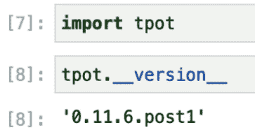

# *第二章*: 深入探索 TPOT

在本章中，你将了解 TPOT 库的理论方面及其底层架构的所有内容。例如架构和**遗传编程**（**GP**）等主题对于全面掌握库的内部工作原理至关重要。

我们将探讨 TPOT 的使用案例，深入探讨解决各种机器学习问题的不同方法。你可以期待学习回归和分类任务自动化的基础知识。

我们还将介绍为独立 Python 安装和 Anaconda 发行版设置完整环境，并展示如何设置虚拟环境。

本章将涵盖以下主题：

+   介绍 TPOT

+   TPOT 可以解决的问题类型

+   安装 TPOT 和设置环境

# 技术要求

要完成本章，你只需要一台安装了 Python 的计算机。无论是独立版本还是 Anaconda 都行。我们将在本章末尾通过虚拟环境介绍两者的安装过程。

本章没有代码。

# 介绍 TPOT

**TPOT**，或**基于树的流程优化工具**，是一个开源库，使用 Python 编程语言以自动化的方式执行机器学习。在表面之下，它使用广为人知的**scikit-learn**机器学习库来执行数据准备、转换和机器学习。它还使用 GP 过程来发现给定数据集的最佳性能流程。GP 的概念将在后面的章节中介绍。

按照惯例，每次你需要一个自动化的机器学习流程时都应该使用 TPOT。数据科学是一个广泛的领域，像 TPOT 这样的库使你能够花更多的时间在数据收集和清洗上，因为其他所有事情都是自动完成的。

下图显示了典型的机器学习流程的外观：

![图 2.1 – 示例机器学习流程

![img/B16954_02_001.jpg]

图 2.1 – 示例机器学习流程

前面的图显示了机器学习过程中哪些部分可以自动化，哪些不能自动化。数据收集阶段（**原始数据**）对于任何机器学习项目都是至关重要的。在这个阶段，你收集的数据将作为机器学习模型的输入。如果输入数据不够好，或者数据量不足，机器学习算法就不能产生高质量的模型。

假设有足够的数据并且你可以访问它，下一个最显著的问题就是数据清洗。这一步不能完全自动化，至少不是完全自动化，这是显而易见的原因。每个数据集都是不同的，因此没有单一的数据清洗方法。缺失和格式错误的数据值是最常见且最耗时的类型，通常需要大量的领域知识才能成功解决。

一旦你有了相当数量的准备好的数据，TPOT 就可以发挥作用了。TPOT 使用遗传规划（GP）来寻找特定任务的最佳算法，因此无需手动选择和优化单个算法。**自然选择中的达尔文过程**启发了遗传算法，但关于这一点将在接下来的几节中详细说明。

TPOT 管道有许多参数，具体取决于你试图解决的问题类型（回归或分类）。所有参数将在本章后面讨论，但无论问题类型如何，以下是你应该知道的内容：

+   `generations`: 代表管道优化过程运行的迭代次数

+   `population_size`: 代表每一代 GP 种群中保留的个体数量

+   `offspring_size`: 代表每一代产生的后代数量

+   `mutation_rate`: 告诉 GP 算法每一代要对多少个管道应用随机变化

+   `crossover_rate`: 告诉 GP 算法每一代要繁殖多少个管道

+   `cv`: 用于评估管道的交叉验证技术

+   `scoring`: 用于评估给定管道质量的一个函数

一旦 TPOT 完成优化，它将返回最佳管道的 Python 代码，以便你可以自行进行模型评估和验证。以下图显示了 TPOT 管道的一个简化示例：


图 2.2 – 示例 TPOT 管道

TPOT 库建立在 Python 知名的机器学习包`scikit-learn`之上。因此，TPOT 可以访问其所有类和方法。前面的图显示了**主成分分析（PCA）**和**多项式特征**作为两种可能的特征预处理操作。TPOT 不仅限于这两种，还可以使用以下任何一种：

+   `PCA`

+   `RandomizedPCA`

+   `PolynomialFeatures`

+   `Binarizer`

+   `StandardScaler`

+   `MinMaxScaler`

+   `MaxAbsScaler`

+   `RobustScaler`

这些都是内置在`scikit-learn`中的类，用于以某种方式修改数据集并返回修改后的数据集。下一步涉及某种特征选择。这一步旨在仅选择具有良好预测能力的特征并丢弃其他特征。通过这样做，TPOT 正在降低机器学习问题的维度，这最终使得问题更容易解决。

前面的图在**选择最佳特征**步骤后面隐藏了这个抽象。为了执行这一步骤，TPOT 可以使用以下算法之一：

+   `VarianceThreshold`

+   `SelectKBest`

+   `SelectPercentile`

+   `SelectFwe`

+   `RecursiveFeatureElimination`

如你所见，TPOT 在模型训练方法上非常灵活。为了进一步了解表面之下发生的事情，我们需要简要介绍一些遗传规划（GP）。接下来的部分将做到这一点。

## 遗传规划的简要概述

**GP** 是一种进化算法，是机器学习的一个子集（*遗传编程页面，GP 团队；2019 年 6 月 1 日*）。进化算法用于寻找我们人类不知道如何直接解决的问题的解决方案。这些算法生成的解决方案在最坏的情况下与最佳人类解决方案相当，通常更好。

在机器学习中，GP 可以用于发现数据集中特征之间的关系（**回归**），以及将数据分组到类别中（**分类**）。在常规软件工程中，GP 通过代码合成、遗传改进、自动错误修复以及在开发游戏策略中（*遗传编程页面，GP 团队；2019 年 6 月 1 日*）得到应用。

GP 受到生物进化和其机制的启发。它使用基于随机变异、交叉、适应度函数和代的算法来解决之前描述的机器学习回归和分类任务。这些特性应该听起来很熟悉，因为我们已经在上一节中讨论过它们。

GP 的理念对于机器学习的发展至关重要，因为它基于 *达尔文自然选择过程*。在机器学习的术语中，这些过程用于生成最优解——模型和超参数。

遗传算法有三个特性：

+   **选择**：由可能的解决方案的种群和适应度函数组成。每个适应度在每次迭代中都会被评估。

+   **交叉**：选择最佳（最适应）的解决方案并执行交叉以创建新种群的过程。

+   **变异**：从前一点中获取后代，并通过一些随机修改对其进行变异，直到获得最佳解决方案。

了解你正在处理的语言/库的基本知识和底层架构总是一个好主意。TPOT 用户友好且易于使用，因此它不需要我们了解 GP 和遗传算法的所有内容。因此，本章不会深入探讨这个主题。如果你对学习更多关于 GP 感兴趣，你可以在章节末尾找到有用的链接。

我们已经讨论了很多关于机器学习自动化、TPOT 和 GP 的优点。但是，有没有缺点？下一节将讨论其中的一些。

## TPOT 限制

到目前为止，我们只讨论了 TPOT 库和机器学习过程自动化的优点。在这种情况下，优点大于缺点，但我们仍然应该讨论潜在的缺点。第一个是执行时间。它将根据数据集的大小和硬件规格而变化，但一般来说，需要花费很多时间才能完成——对于大型数据集可能是几个小时或几天，对于较小的数据集可能是几分钟。

理解这一点至关重要。使用默认的 TPOT 设置——100 代，100 个种群大小——TPOT 在完成之前将评估 10,000 个流程。这相当于进行了 10,000 次特征工程和机器学习模型的训练。正因为如此，TPOT 预期会运行得较慢。

如果你决定将 **交叉验证** 引入其中，事情会变得更加复杂。这个术语代表了一种过程，其中机器学习模型在 *k* 个 *k – 1* 个子集上训练 *k* 次，并在一个单独的子集上进行评估。交叉验证的目的是获得模型性能的更准确表示。*k* 的选择是任意的，但在实践中，最常用的值是 10。

在实践中，交叉验证会使 TPOT 运行得更快。默认情况下，当使用交叉验证时，TPOT 将评估 100 代，100 个种群大小和 10 个交叉验证折。这导致在完成之前需要评估 100,000 个不同的流程。

为了解决这个问题，TPOT 引入了 `max_time_mins` 参数。默认情况下，它被设置为 `None`，但你可以明确地将它的值设置为任何整数。例如，指定 `max_time_mins=10` 将只给 TPOT 10 分钟的时间来优化流程。如果你想要最佳结果，这不是一个理想的选择，但在时间紧迫的情况下，它还是很有用的。

第二个缺点是，TPOT 有时可能会为同一数据集推荐不同的解决方案（流程）。当 TPOT 优化器运行时间较短时，这通常会成为问题。例如，如果你已经使用了 `max_time_mins` 参数来限制优化器的运行时间，每次得到一个略微不同的“最优”流程并不奇怪。

这并不是一个需要担心的理由，因为所有流程都应该在相同的时间框架内优于你手动完成的工作，但了解为什么会发生这种情况是至关重要的。有两个可能的原因：

+   *TPOT 优化器没有收敛*：这是最可能的情况。由于时间不足或数据集过于复杂，在给定的时间段内无法优化，TPOT 无法找到最优流程（或两者兼而有之）。

+   *存在多个“最优”流程*：对于某些机器学习问题，看到多种方法以相同的方式工作并不罕见。如果数据集相对较小，这种情况更可能出现。

本节简要介绍了 TPOT 库，并解释了它的优点和缺点。下一节将讨论 TPOT 解决的问题类型，并详细讨论回归和分类任务的自动化。

# TPOT 可以解决的问题类型

TPOT 库被设计为自动化机器学习任务的首选工具；因此，它应该能够轻松处理你抛给它的任何东西。我们很快就会从实际的角度开始使用 TPOT。*第三章*，*在回归之前探索*，展示了如何使用该库通过许多示例来处理实际任务，接下来的章节将专注于其他类型的任务。

通常，TPOT 可以用来处理以下类型的任务：

+   **回归**：目标变量是连续的，例如年龄、身高、体重、分数或价格。请参阅*第一章*，*机器学习和自动化思想*，以了解回归的简要概述。

+   **分类**：目标变量是分类的，例如已售/未售、流失/未流失或是/否。请参阅*第一章*，*机器学习和自动化思想*，以了解分类的简要概述。

+   **并行训练**：TPOT 可以通过**Dask**库以并行方式处理机器学习模型的训练。请阅读*第五章*，*使用 TPOT 和 Dask 进行并行训练*，以获得全面了解。

+   **神经网络**：TPOT 甚至可以以完全自动化的方式基于最先进的神经网络算法构建模型。请阅读*第六章*，*深度学习入门 - 神经网络快速入门*，以获得关于神经网络的快速入门课程，以及*第七章*，*TPOT 神经网络分类器*，以了解 TPOT 的实际实现。

本节其余部分简要讨论了 TPOT 如何处理回归和分类任务，并花费大量时间探索和解释它们的参数、属性和函数。你将在*第五章*，*使用 TPOT 和 Dask 进行并行训练*中学习 TPOT 如何处理并行训练，以及如何在*第六章*，*深度学习入门 - 神经网络快速入门*中处理神经网络，因为这些主题需要首先覆盖先决条件。

## TPOT 如何处理回归任务

TPOT 库通过`tpot.TPOTRegressor`类处理回归任务。这个类在包含监督回归模型、预处理程序、特征选择技术以及遵循`scikit-learn` API 的任何其他估计器或转换器的机器学习管道中进行智能搜索（*TPOT 文档页面，TPOT 团队；2019 年 11 月 5 日*）。

同一个类也将在管道中的所有对象的超参数上执行搜索。`tpot.TPOTRegressor` 类允许我们通过 `config_dict` 参数完全自定义搜索的模型、转换器和参数。

现在我们将介绍 `tpot.TPOTRegressor` 类实例化时期望的参数：

+   `generations`: 整数或 None（默认 = `100`）。一个可选参数，用于指定运行管道优化过程的迭代次数。它必须是正数。如果没有定义，则必须指定 `max_time_mins` 参数。

+   `population_size`: 整数（默认 = `100`）。一个可选参数，用于指定每代中保留在 GP 种群中的个体数量。必须是一个正数。

+   `offspring_size`: 整数（默认 = `population_size`）。一个可选参数，用于指定每个遗传算法（GP）代中要产生的子代数量。必须是一个正数。

+   `mutation_rate`: 浮点数（默认 = `0.9`）。一个可选参数，用于指定 GP 算法的突变率。必须在 [0.0, 1.0] 范围内。此参数用于指导算法在每代中对多少个管道应用随机变化。

+   `crossover_rate`: 浮点数（默认 = `0.1`）。一个可选参数，指导 GP 算法每代要“繁殖”多少个管道。必须在 [0.0, 1.0] 范围内。

+   `scoring`: 字符串或可调用函数（默认 = `neg_mean_squared_error`）。一个可选参数，用于指定回归管道评估的函数名称。可以是 `neg_median_abs_value`、`neg_mean_abs_error`、`neg_mean_squared_error` 或 `r2`。

+   `cv`: 整数、交叉验证生成器或可迭代对象（默认 = `5`）。一个可选参数，用于指定评估回归管道的交叉验证策略。如果传递的值是整数，它期望折叠数。在其他情况下，它期望一个用作交叉验证生成器的对象，或一个产生训练/测试分割的可迭代对象。

+   `subsample`: 浮点数（默认 = `1.0`）。一个可选参数，用于指定优化过程中使用的训练样本分数。必须在 [0.0, 1.0] 范围内。

+   `n_jobs`: 整数（默认 = `1`）。一个可选参数，用于指定在优化过程中并行评估管道时使用的进程数。将其设置为 `-1` 以使用所有 CPU 核心。将其设置为 `-2` 以使用除了一个以外的所有 CPU 核心。

+   `max_time_mins`: 整数或 None（默认 = `None`）。一个可选参数，用于指定 TPOT 可以执行优化的分钟数。只有当所有代在指定的最大时间分钟内评估完毕时，TPOT 才会优化更少的时间。

+   `max_eval_time_mins`: 浮点数（默认 = `5`）。一个可选参数，用于指定 TPOT 评估单个管道所需的时间（分钟）。如果参数设置得足够高，TPOT 将评估更复杂的管道。同时，这也使得 TPOT 运行时间更长。

+   `random_state`: 整数或 None（默认 = `None`）。一个可选参数，用于指定伪随机数生成器的种子。使用它以获得可重复的结果。

+   `config_dict`: 字典、字符串或 None（默认 = `None`）。一个可选参数，用于指定在优化过程中 TPOT 用于自定义操作符和参数的配置字典。可能的输入如下：

    a) *None*: TPOT 使用默认配置。

    b) *Python 字典*: TPOT 使用您的配置。

    c) *'TPOT light'*: 字符串；TPOT 将使用仅包含快速模型和预处理器的内置配置。

    d) *'TPOT MDR'*: 字符串；TPOT 将使用专门针对基因组研究的内置配置。

    e) *'TPOT sparse'*: 字符串；TPOT 将使用包含 one-hot 编码器和支持稀疏矩阵的操作符的配置字典。

+   `template`: 字符串（默认 = `None`）。一个可选参数，用于指定预定义管道的模板。用于指定 TPOT 评估的机器学习管道的期望结构。

+   `warm_start`: 布尔值（默认 = `False`）。一个可选参数，用于指示当前实例是否应重用`fit()`函数之前调用的种群。此函数将在本章后面讨论。

+   `memory`: 一个内存对象或字符串（默认 = `None`）。一个可选参数，用于在调用`fit()`函数后缓存每个转换器。此函数将在本章后面讨论。

+   `use_dask`: 布尔值（默认 = `False`）。一个可选参数，用于指定是否应使用*Dask-ML*的管道优化。

+   `periodic_checkpoint_folder`: 路径字符串（默认 = `None`）。一个可选参数，用于指定在优化过程中 TPOT 将保存管道的文件夹。

+   `early_stop`: 整数（默认 = `None`）。一个可选参数，用于指定在多少代之后如果没有改进，TPOT 将停止优化。

+   `verbosity`: 整数（默认 = `0`）。一个可选参数，用于指定 TPOT 在运行时向控制台输出多少信息。可能的选项如下：

    a) *0*: TPOT 不打印任何内容。

    b) *1*: TPOT 打印最小信息。

    c) *2*: TPOT 打印更多信息并提供进度条。

    d) *3*: TPOT 打印所有内容并提供进度条。

+   `disable_update_check`: 布尔值（默认 = `False`）。一个可选参数，表示是否应禁用 TPOT 版本检查器。您可以忽略此参数，因为它只告诉您是否有库的新版本可用，这与实际的训练无关。

如果你的目标是真正掌握这个库——至少是处理回归任务的部分——那么你应该了解很多参数。我们只涵盖了`tpot.TPOTRegressor`类的参数，接下来我们将讨论属性和函数。不用担心；可用的属性和函数并不多。

让我们从属性开始。总共有三个属性。一旦管道拟合完成，这些属性就会变得可用：

+   `fitted_pipeline_`: 来自`scikit-learn`的管道对象。显示 TPOT 在给定训练集的优化过程中发现的最佳管道。

+   `pareto_front_fitted_pipelines_`：Python 字典。它包含 TPOT 帕累托前沿上的所有管道。字典的键是表示管道的字符串，值是对应的管道。此参数仅在将`verbosity`参数设置为`3`时可用。

+   `evaluated_individuals_`：Python 字典。它包含所有评估过的管道。字典的键是表示管道的字符串，值是一个元组，包含每个管道的步骤数和相应的准确度指标。

在接下来的章节中，我们将看到所提到的属性在实际中的应用。本节剩下要讨论的只有属于`tpot.TPOTRegressor`类的函数。总共有四个：

+   `fit(features, target, sample_weight=None, groups=None)`: 此函数用于运行 TPOT 优化过程。`features`参数是用于预测目标变量的特征/预测器/属性的数组。`target`参数也是一个数组，指定了预测的目标标签列表。其他两个参数是可选的。`sample_weights`参数是一个表示每个样本权重的数组。较高的权重表示更高的重要性。最后一个参数`groups`是一个数组，指定了在执行交叉验证时用于样本的组标签。它应仅与组交叉验证函数一起使用。`fit()`函数返回拟合的 TPOT 对象的副本。

+   `predict(features)`: 此函数用于根据`features`参数生成新的预测。此参数是一个包含用于预测目标变量的特征/预测器/属性的数组的数组。该函数返回预测的数组。

+   `score(testing_features, testing_target)`: 此函数返回给定测试数据上优化管道的分数。该函数接受两个参数。第一个参数是`testing_features`。它是测试集的数组/特征矩阵。第二个参数是`testing_target`。它也是一个数组，但它是训练集中预测的目标标签。该函数返回测试集上的准确度分数。

+   `export(output_file_name)`: 此函数用于将优化后的管道导出为 Python 代码。该函数接受一个参数，`output_file_name`。它用于指定 Python 代码应存储的路径和文件名。如果未指定所提及的参数值，则整个管道将作为文本返回。

通过对参数、属性和函数的概述，您现在可以使用 TPOT 的回归功能进行实践。*第三章*，*回归前的探索*，充满了回归示例，所以如果您想自动化回归任务，请不要犹豫，直接跳转到那里。

本章的下一段将讨论 TPOT 如何处理分类任务。

## TPOT 如何处理分类任务

TPOT 库通过`tpot.TPOTClassifier`类处理分类任务。此类在包含监督回归模型、预处理程序、特征选择技术以及遵循`scikit-learn` API 的任何其他估计器或转换器的机器学习管道中进行搜索（*TPOT 文档页面，TPOT 团队；2019 年 11 月 5 日*）。该类还搜索管道中所有对象的超参数。

`tpot.TPOTClassifier`类允许我们通过`config_dict`参数完全自定义将被搜索的模型、转换器和参数。

`tpot.TPOTClassifier`类包含的大部分参数、属性和函数与之前讨论的`tpot.TPOTRegressor`相同，因此再次详细讨论它们将是冗余的。相反，我们只需提及相同的参数、属性和函数，并将介绍和解释那些用于分类或工作方式不同的函数。

首先，让我们回顾一下参数：

+   `generations`

+   `population_size`

+   `offspring_size`

+   `mutation_rate`

+   `crossover_rate`

+   `scoring`: 字符串或可调用函数（默认 = `accuracy`）。这是一个可选参数，用于评估给定管道在分类问题中的质量。以下评分函数可以使用：`accuracy`、`adjusted_rand_score`、`average_precision`、`balanced_accuracy`、`f1`、`f1_macro`、`f1_micro`、`f1_samples`、`f1_weighted`、`neg_log_loss`、`precision`、`recall`、`recall_macro`、`recall_micro`、`recall_samples`、`recall_weighted`、`jaccard`、`jaccard_macro`、`jaccard_micro`、`jaccard_samples`、`jaccard_weighted`、`roc_auc`、`roc_auc_ovr`、`roc_auc_ovo`、`roc_auc_ovr_weighted`、或 `roc_auc_ovo_weighted`。如果您想使用自定义评分函数，您可以传递一个具有以下签名的函数：`scorer(estimator, X, y)`。

+   `cv`

+   `subsample`

+   `n_jobs`

+   `max_time_mins`

+   `max_eval_time_mins`

+   `random_state`

+   `config_dict`

+   `template`

+   `warm_start`

+   `memory`

+   `use_dask`

+   `periodic_checkpoint_folder`

+   `early_stop`

+   `verbosity`

+   `disable_update_check`

+   `log_file`: 类似于文件的对象或字符串（默认 = `None`）。这是一个可选参数，用于将进度内容保存到文件。如果提供一个字符串值，它应该是所需输出文件的路径和文件名。

正如我们所看到的，一个参数已经改变，一个参数是完全新的。为了重复——请参考前面的子节，以获取每个参数的详细说明。

接下来，我们必须讨论`tpot.TPOTClassifier`类的属性。一旦管道优化过程完成，它们就会变得可用。总共有三个，它们的行为与`tpot.TPOTRegressor`类完全相同：

+   `fitted_pipeline_`

+   `pareto_front_fitted_pipelines_`

+   `evaluated_individuals_`

最后，我们将讨论函数。与参数一样，所有函数都被列出，但只有新和更改的函数会详细讨论。总共有五个函数：

+   `fit(features, classes, sample_weight=None, groups=None)`: 此函数的行为与`tpot.TPOTRegressor`中的函数相同，但第二个参数被称作`classes`而不是`target`。此参数期望一个用于预测的类别标签数组。

+   `predict(features)`

+   `predict_proba(features)`: 此函数与`predict()`函数执行相同的任务，但返回类别概率而不是类别。你可以通过检查概率来了解模型在预测上完全确定和不确定的地方。你还可以使用类别概率来调整决策阈值。你将在*第四章*，*在分类之前探索*中学习如何做到这一点。

+   `score(testing_features, testing_target)`

+   `export(output_file_name)`

现在，你准备好了解 TPOT 在实际中的工作了。大多数时候，没有必要与列出的某些参数纠缠，但你需要知道它们存在，以便于更高级的使用场景。*第四章*，*在分类之前探索*，充满了分类示例，所以如果你想学习如何自动化分类任务，不要犹豫，直接跳转到那里。

本章的下一节讨论了如何通过虚拟环境设置 TPOT 环境，无论是对于独立的 Python 安装还是通过 Anaconda 安装。

# 安装 TPOT 和设置环境

本节讨论了在深入实际内容之前所需的最后一步——安装和环境设置。假设你已经通过独立安装或 Anaconda 安装了 Python 3。

你将学习如何在以下场景下为 TPOT 设置虚拟环境：

+   独立 Python

+   Anaconda

没有必要阅读两个安装部分，只需选择更适合您的一个即可。在操作系统之间，安装方面不应该有任何差异。如果您已将 Python 作为独立安装安装，您可以通过终端访问`pip`。如果您通过 Anaconda 安装，您可以通过 Anaconda Navigator 访问。

## 在独立 Python 安装中安装和配置 TPOT

在继续之前，请确保已安装 Python 和`pip`（Python 的包管理器）。您可以通过在终端中输入以下代码行来检查`pip`是否已安装：

```py
> pip
```

如果您看到以下图中的输出，那么您就可以开始了：

![图 2.3 – 检查 pip 是否已安装

![图片 B16954_02_003.jpg]

![图 2.3 – 检查 pip 是否已安装

我们现在可以继续设置虚拟环境：

1.  首件事是安装`virtualenv`包。为此，从终端执行此行：

    ```py
    > pip install virtualenv
    ```

1.  几秒钟后，您应该会看到成功消息，如图所示：![图 2.4 – virtualenv 安装

    ![图片 B16954_02_004.jpg]

    图 2.4 – virtualenv 安装

1.  下一步是创建一个文件夹，其中将存储 TPOT 环境。我们的位于`Documents`文件夹中，但您可以将它存储在任何地方。以下是您需要执行的精确 shell 行，以创建文件夹并安装 Python 虚拟环境：

    ```py
    > cd Documents
    > mkdir python_venvs
    > virtualenv python_venvs/tpot_env
    ```

1.  执行和结果如图所示：![图 2.5 – 创建虚拟环境

    ![图片 B16954_02_005.jpg]

    图 2.5 – 创建虚拟环境

    环境现在已成功安装。

1.  要激活环境，您需要从终端执行以下行：

    ```py
    > source python_venvs/tpot_env/bin/activate
    ```

1.  括号中的文本确认环境已激活。请看以下图中从`base`环境到`tpot_env`的变化：![图 2.6 – 激活虚拟环境

    ![图片 B16954_02_006.jpg]

    图 2.6 – 激活虚拟环境

1.  要停用环境，请在终端中输入以下行：

    ```py
    jupyterlab: A notebook environment required for analyzing and exploring data and building machine learning models in an interactive way.
    ```

1.  `numpy`：Python 进行数值计算的首选库。

1.  `pandas`：一个知名的数据加载、处理、准备、转换、聚合甚至可视化的库。

1.  `matplotlib`：Python 的标准数据可视化库。我们有时会使用它进行基本绘图。

1.  `seaborn`：一个比`matplotlib`更美观的数据可视化库。

1.  `scikit-learn`：Python 进行机器学习和与之相关的所有内容的首选库。

1.  `TPOT`：用于以自动化方式找到最优机器学习管道。

1.  要安装所有提到的库，您可以从打开的终端窗口执行以下行：

    ```py
    > pip install jupyterlab numpy pandas matplotlib seaborn scikit-learn TPOT
    ```

    Python 将立即开始下载和安装库，如图所示：

    ![图 2.8 – 使用 pip 安装库

    ![图片 B16954_02_008.jpg]

    图 2.8 – 使用 pip 安装库

1.  要测试环境是否已成功配置，我们可以从终端打开`JupyterLab`。在安装完库后，执行以下 shell 命令：

    ```py
    > jupyter lab
    ```

    如果您看到以下类似内容，那么一切按计划进行。Jupyter 的浏览器窗口应立即打开：

    

    图 2.9 – 为独立安装启动 JupyterLab

1.  最后的检查，我们将查看环境中附带的是哪个 Python 版本。这可以直接从笔记本中完成，如图所示：

    图 2.10 – 检查独立安装的 Python 版本

1.  最后，我们将通过导入并打印版本来查看 TPOT 库是否已安装。此检查也可以从笔记本中完成。按照以下图示中的说明进行操作：



图 2.11 – 检查独立安装的 TPOT 版本

TPOT 现在已成功安装在虚拟环境中。下一节将介绍如何使用 Anaconda 安装和配置环境。

## 通过 Anaconda 安装和配置 TPOT

在继续之前，请确保您的机器上已安装 Anaconda。我们将使用 Anaconda 创建和管理我们的环境，并从那里进行配置：

1.  要开始，打开 Anaconda Navigator：

    图 2.12 – Anaconda Navigator

1.  要创建一个新的虚拟环境，请点击屏幕左下角的**创建**按钮：

    图 2.13 – 在 Anaconda 中创建新环境

1.  在点击`base (root)`环境后。以下是它应有的样子：

    图 2.15 – 所有虚拟环境的列表

1.  您现在可以开始在虚拟环境中安装库了。Anaconda 通过点击播放按钮并选择`jupyterlab`，使您能够轻松地从终端打开环境：这是一个用于以交互方式分析和探索数据以及构建机器学习模型的笔记本环境。

1.  `numpy`：Python 进行数值计算的常用库。

1.  `pandas`：一个用于数据加载、处理、准备、转换、聚合甚至可视化的知名库。

1.  `matplotlib`：Python 的标准数据可视化库。我们有时会使用它进行基本绘图。

1.  `seaborn`：一个比`matplotlib`更具视觉吸引力的数据可视化库。

1.  `scikit-learn`：Python 进行机器学习和相关内容的常用库。

1.  `TPOT`：用于以自动化的方式寻找最优机器学习流程。

1.  要安装所有提到的库，你可以从打开的终端窗口中执行以下行：

    ```py
    > pip install jupyterlab numpy pandas matplotlib seaborn scikit-learn TPOT
    ```

    Python 应该会立即开始下载和安装库，如下图所示：

    

    图 2.17 – 通过终端安装库

1.  为了测试环境是否成功配置，我们可以从终端打开 `JupyterLab`。在库安装完成后，执行以下 shell 命令：

    ```py
    > jupyter lab
    ```

    如果你看到以下类似的内容，那么一切按计划进行。Jupyter 的浏览器窗口应该会立即打开：

    

    图 2.18 – 从终端启动 JupyterLab

1.  为了最后的检查，我们将查看环境附带的是哪个 Python 版本。这可以直接从笔记本中完成，如下图所示：

    图 2.19 – 检查 Python 版本

1.  最后，我们将通过导入并打印版本来查看 TPOT 库是否已安装。这个检查也可以从笔记本中完成。按照以下图中的说明查看如何操作：


图 2.20 – 检查 TPOT 版本

我们现在可以开始使用 TPOT 的实际应用了。

# 摘要

你在本章中学到了很多——从 TPOT 的工作原理和遗传规划到使用 `pip` 和 Anaconda 设置环境。你现在可以以自动化的方式处理实际任务了。

以下章节将深入探讨使用 TPOT 处理回归任务，并附上几个示例。在本章讨论的所有内容，在我们动手实践后将会变得非常清晰。然后，在*第四章* *在分类之前探索*，你将通过解决分类任务来进一步巩固你的知识。

# Q&A

1.  用你自己的话定义 TPOT 库。

1.  列出并解释 TPOT 的几个局限性。

1.  你会如何限制 TPOT 中的优化时间？

1.  简要定义“遗传编程”这个术语。

1.  列出并解释 `tpot.TPOTRegressor` 类的五个参数。

1.  列出并解释 `tpot.TPOTClassifier` 类中引入的不同和新参数。

1.  虚拟环境是什么，为什么它们有用？

# 进一步阅读

这里是本章中引用的资料来源：

+   *遗传编程页面*: [`geneticprogramming.com`](http://geneticprogramming.com/)

+   *TPOT 文档页面*: [`epistasislab.github.io/tpot/`](http://epistasislab.github.io/tpot/%20)
