# 第三章：使用 TPOT 探索回归

在本章中，您将通过三个数据集获得自动回归建模的实践经验。您将学习如何以自动化的方式使用 TPOT 处理回归任务，并通过大量的实际示例、技巧和建议来掌握这一点。

我们将首先介绍一些基本主题，如数据集加载、探索性数据分析和基本数据准备。然后，我们将使用 TPOT 进行实践。您将学习如何以自动化的方式训练模型以及如何评估这些模型。

在自动训练模型之前，我们将看看如何通过基本模型（如线性回归）获得良好的性能。这些模型将作为 TPOT 需要超越的基准。

本章将涵盖以下主题：

+   将自动回归建模应用于鱼市场数据集

+   将自动回归建模应用于保险数据集

+   将自动回归建模应用于车辆数据集

# 技术要求

为了完成本章，您需要一个安装了 Python 和 TPOT 的计算机。上一章演示了如何从头开始设置环境，无论是独立的 Python 安装还是通过 Anaconda 安装。请参阅*第二章*，*深入 TPOT*，以获取环境设置的详细说明。

您可以在此处下载本章的源代码和数据集：[`github.com/PacktPublishing/Machine-Learning-Automation-with-TPOT/tree/main/Chapter03`](https://github.com/PacktPublishing/Machine-Learning-Automation-with-TPOT/tree/main/Chapter03)

# 将自动回归建模应用于鱼市场数据集

本节演示了如何使用 TPOT 将机器学习自动化应用于回归数据集。本节使用鱼市场数据集（[`www.kaggle.com/aungpyaeap/fish-market`](https://www.kaggle.com/aungpyaeap/fish-market)）进行探索和回归建模。目标是预测鱼的重量。您将学习如何加载数据集、可视化它、充分准备它，以及如何使用 TPOT 找到最佳的机器学习流程：

1.  首先要做的事情是加载所需的库和数据集。关于库，您需要`numpy`、`pandas`、`matplotlib`和`seaborn`。此外，使用`matplotlib`导入`rcParams`模块以稍微调整绘图样式。您可以在以下代码块中找到此步骤的代码：

    ```py
    import numpy as np
    import pandas as pd
    import matplotlib.pyplot as plt
    import seaborn as sns
    from matplotlib import rcParams
    rcParams['axes.spines.top'] = False
    rcParams['axes.spines.right'] = False
    df = pd.read_csv('data/Fish.csv')
    df.head()
    ```

    下面是如何查看前几行（调用`head()`方法的结果）：

    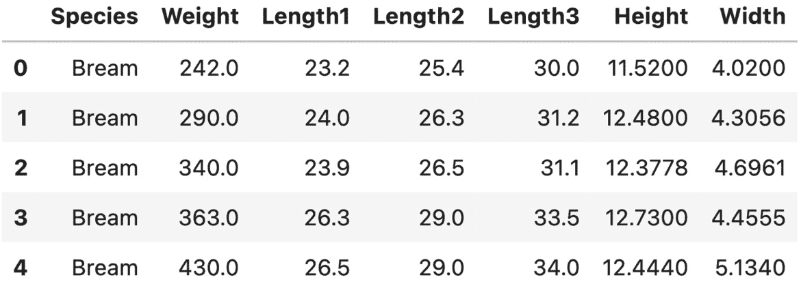

    图 3.1 – 鱼市场数据集的前五行

1.  探索性数据分析将在下一部分介绍。这不是使用 TPOT 的硬性要求，但您应该始终了解您的数据看起来如何。最感兴趣的第一件事是缺失值。以下是检查它们的方法：

    ```py
    df.isnull().sum()
    ```

    下面是相应的输出：

    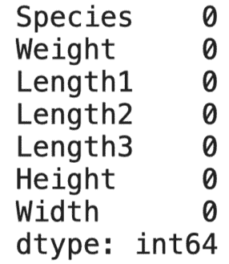

    图 3.2 – 每列缺失值的计数

    如您所见，没有缺失值。这使得数据准备过程更加容易和快捷。

1.  下一步是检查目标变量的分布情况。对于这个数据集，我们试图预测`Weight`。以下是绘制简单直方图的代码：

    ```py
    plt.figure(figsize=(12, 7))
    plt.title('Target variable (Weight) distribution', size=20)
    plt.xlabel('Weight', size=14)
    plt.ylabel('Count', size=14)
    plt.hist(df['Weight'], bins=15, color='#4f4f4f', ec='#040404');
    ```

    下面是直方图的样子：

    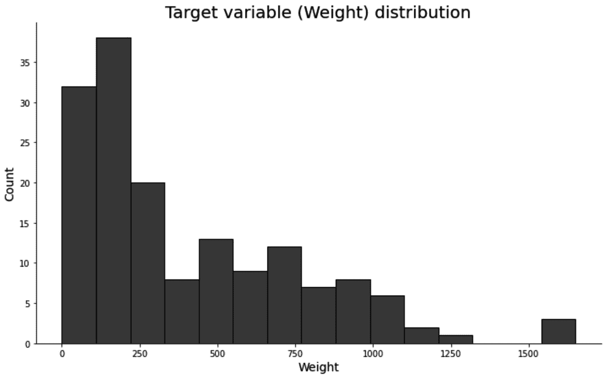

    图 3.3 – 目标变量（重量）的直方图

    大多数鱼都很轻，但也有一些重的。让我们进一步探索物种，以获得更好的了解。

1.  以下代码打印了特定物种的实例数量（总数和百分比），并且还打印了每个属性的均值和标准差。为了更精确，我们保留了原始数据集中物种等于指定物种的子集。之后，为子集中的每一列打印了记录数、总百分比、均值和标准差。

    然后这个函数被调用以针对每个独特的物种：

    ```py
    def describe_species(species):
        subset = df[df['Species'] == species]
        print(f'============ {species.upper()} ============')
        print(f'Count: {len(subset)}')
        print(f'Pct. total: {(len(subset) / len(df) * 100):.2f}%')
        for column in df.columns[1:]:
            avg = np.round(subset[column].mean(), 2)
            sd = np.round(subset[column].std(), 2)
            print(f'Avg. {column:>7}: {avg:6} +/- {sd:6}')
    for species in df['Species'].unique():
        describe_species(species)
        print()
    ```

    下面是相应的输出：

    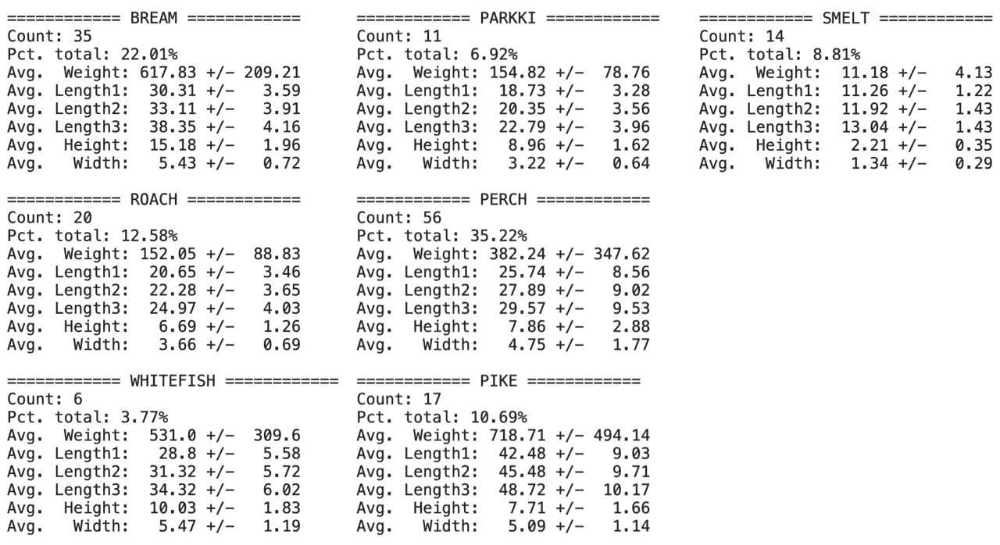

    图 3.4 – 每种鱼的特征探索

1.  最后，让我们检查属性之间的相关性。相关性只能计算数值属性。以下代码片段展示了如何使用`seaborn`库可视化相关矩阵：

    ```py
    plt.figure(figsize=(12, 9))
    plt.title('Correlation matrix', size=20)
    sns.heatmap(df.corr(), annot=True, cmap='Blues');
    ```

    这是相关矩阵：

    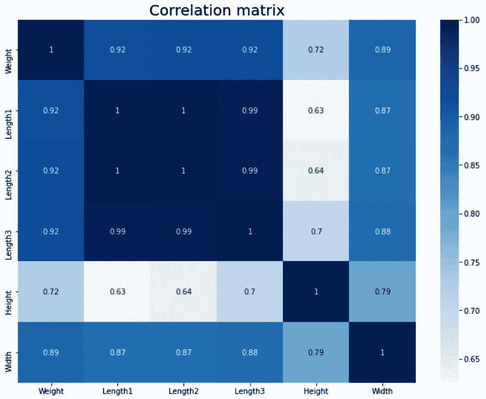

    图 3.5 – 特征的相关矩阵

    在探索性数据分析过程中，你可以做更多的事情，但我们将在这里停止。这本书展示了如何使用 TPOT 构建自动化模型，因此我们应该在那里花大部分时间。

1.  在建模之前，我们还有一步要做，那就是数据准备。我们不能将非数值属性传递给管道优化器。我们将它们转换为虚拟变量以简化问题，并在之后将它们与原始数据合并。以下是执行此操作的代码：

    ```py
    species_dummies = pd.get_dummies(df['Species'], drop_first=True, prefix='Is')
    df = pd.concat([species_dummies, df], axis=1)
    df.drop('Species', axis=1, inplace=True)
    df.head()
    ```

    下面是数据集现在的样子：

    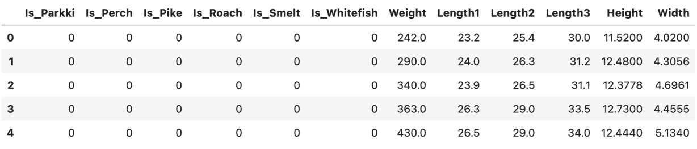

    图 3.6 – 数据准备后的鱼市场数据集的前五行

    如您所见，我们删除了`Species`列，因为它不再需要。让我们接下来开始建模。

1.  首先，我们需要做一些导入并决定评分策略。TPOT 自带一些回归评分指标。默认的是`neg_mean_squared_error`。我们无法避免负指标，但至少可以使其与目标变量的单位相同。预测重量并跟踪重量平方的错误是没有意义的。这就是**均方根误差**（**RMSE**）发挥作用的地方。这是一个简单的指标，它计算先前讨论的均方误差的平方根。由于平方根运算，我们跟踪的是原始单位（重量）中的错误，而不是平方单位（重量平方）。我们将使用 lambda 函数来定义它：

    ```py
    from tpot import TPOTRegressor
    from sklearn.model_selection import train_test_split
    from sklearn.metrics import mean_squared_error, make_scorer
    rmse = lambda y, y_hat: np.sqrt(mean_squared_error(y, y_hat))
    ```

1.  接下来在需求列表上是训练测试集分割。我们将保留 75%的数据用于训练，并在剩余的数据上进行评估：

    ```py
    X = df.drop('Weight', axis=1)
    y = df['Weight']
    X_train, X_test, y_train, y_test = train_test_split(
        X, y, test_size=0.25, random_state=42
    )
    ```

    这是训练集和测试集中实例的数量：

    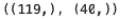

    

    图 3.7 – 训练集和测试集中的实例数量

1.  接下来，让我们使用线性回归算法创建一个模型。这个模型只是 TPOT 需要超越的基线：

    ```py
    from sklearn.linear_model import LinearRegression
    lm = LinearRegression()
    lm.fit(X_train, y_train)
    lm_preds = lm.predict(X_test)
    rmse(y_test, lm_preds)
    ```

    这是测试集上线性回归的相应 RMSE 值：

    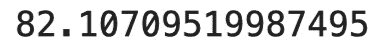

    

    图 3.8 – 线性回归模型的 RMSE 评分（基线）

    基线模型平均错误为 82 个权重单位。考虑到我们的权重高达 1,500，这还不错。

1.  接下来，让我们拟合一个 TPOT 管道优化模型。我们将使用我们的 RMSE 评分器，并进行 10 分钟的优化。你可以优化更长的时间，但 10 分钟应该优于基线模型：

    ```py
    rmse_scorer = make_scorer(rmse, greater_is_better=False)
    pipeline_optimizer = TPOTRegressor(
        scoring=rmse_scorer,
        max_time_mins=10,
        random_state=42
    )
    pipeline_optimizer.fit(X_train, y_train)
    ```

    优化完成后，控制台显示的输出如下：

    

    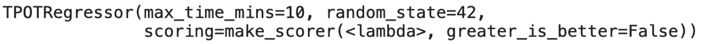

    图 3.9 – TPOT 回归器输出

1.  这是获取 RMSE 评分的方法：

    ```py
    pipeline_optimizer.score(X_test, y_test)
    ```

    下面是相应的输出：

    

    

    图 3.10 – TPOT 优化管道模型的 RMSE 评分

    不要担心数字前面的负号。实际的 RMSE 是 73.35 个重量单位。TPOT 模型优于基线模型。这就是你需要知道的一切。TPOT 通过`fitted_pipeline_`属性给我们提供了访问最佳管道的途径。以下是它的样子：

    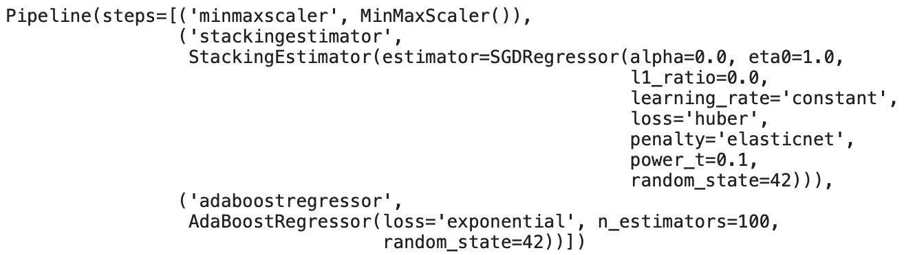

    

    图 3.11 – 完整的 TPOT 管道

1.  作为最后一步，我们可以将管道导出到 Python 文件中。以下是方法：

    ```py
    pipeline_optimizer.export('fish_pipeline.py')
    ```

    文件看起来是这样的：

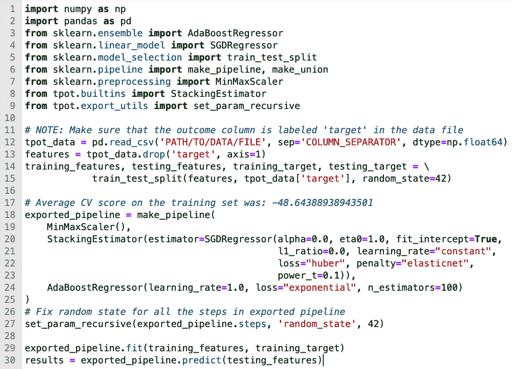


图 3.12 – TPOT 管道的源代码

你现在可以使用这个文件对新数据做出预测。

在本节中，您已经在简单数据集上使用 TPOT 构建了您的第一个自动机器学习流程。在实践中，大多数情况下，您所采取的步骤看起来会很相似。数据清洗和准备是其中有所不同之处。始终确保在将数据集传递给 TPOT 之前充分准备您的数据集。当然，TPOT 为您做了很多事情，但它不能将垃圾数据转化为可用的模型。

在下一节中，您将看到如何将 TPOT 应用于医疗保险数据集。

# 将自动回归建模应用于保险数据集

本节演示了如何将自动机器学习解决方案应用于一个稍微复杂一些的数据集。您将使用医疗保险成本数据集（[`www.kaggle.com/mirichoi0218/insurance`](https://www.kaggle.com/mirichoi0218/insurance)）来预测基于几个预测变量保险费用将花费多少。您将学习如何加载数据集，进行数据探索性分析，如何准备数据，以及如何使用 TPOT 找到最佳的机器学习流程：

1.  与前面的例子一样，第一步是加载库和数据集。我们需要`numpy`、`pandas`、`matplotlib`和`seaborn`来开始分析。以下是导入库和加载数据集的方法：

    ```py
    import numpy as np
    import pandas as pd
    import matplotlib.pyplot as plt
    import seaborn as sns
    from matplotlib import rcParams
    rcParams['axes.spines.top'] = False
    rcParams['axes.spines.right'] = False
    df = pd.read_csv('data/insurance.csv')
    df.head()
    ```

    下面的图中显示了前五行：

    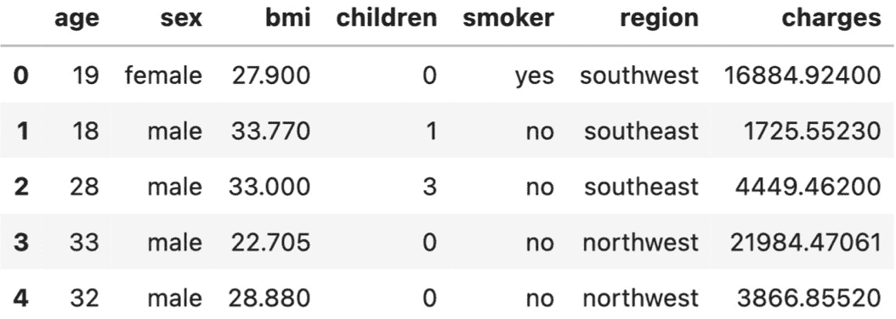

    图 3.13 – 医疗保险数据集的前五行

1.  我们将继续进行数据探索性分析。与前面的例子一样，我们首先将检查缺失值的数量。以下是执行此操作的代码：

    ```py
    df.isnull().sum()
    ```

    下面的图显示了每列的缺失值计数：

    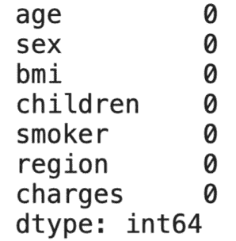

    图 3.14 – 医疗保险数据集每列的缺失值计数

    如您所见，没有缺失值。

1.  我们试图使用这个数据集预测`charges`列，所以让我们快速检查我们可以在那里期望什么类型的值。直方图似乎是一个足够简单的选项。以下是绘制直方图所需的代码：

    ```py
    plt.figure(figsize=(12, 7))
    plt.title('Target variable (charges) distribution', size=20)
    plt.xlabel('Charge', size=14)
    plt.ylabel('Count', size=14)
    plt.hist(df['charges'], bins=15, color='#4f4f4f', ec='#040404');
    ```

    下面是相应的直方图：

    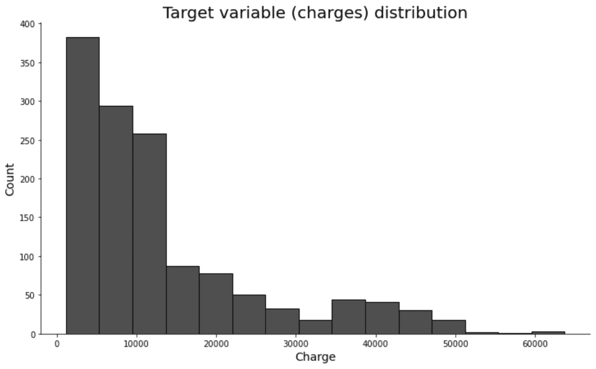

    图 3.15 – 目标变量的分布

    因此，值甚至超过了$60,000.00。大多数值都较低，所以将很有趣地看到模型将如何处理它。

1.  让我们深入分析并探索其他变量。目标是查看每个分类变量段的平均保险费用。我们将使用中位数作为平均值，因为它对异常值不太敏感。

    接近这种分析的最简单方法是创建一个函数，该函数为指定的列生成条形图。以下函数对于这个例子以及未来的许多其他例子都很有用。它从一个分组数据集中计算中位数，并使用标题、标签、图例和条形图顶部的文本来可视化条形图。您可以在一般情况下使用此函数来可视化分组操作后某些变量的中位数。它最适合分类变量：

    ```py
    def make_bar_chart(column, title, ylabel, xlabel, y_offset=0.12, x_offset=700):
        ax = df.groupby(column).median()[['charges']].plot(
            kind='bar', figsize=(10, 6), fontsize=13, color='#4f4f4f'
        )
        ax.set_title(title, size=20, pad=30)
        ax.set_ylabel(ylabel, fontsize=14)
        ax.set_xlabel(xlabel, fontsize=14)
        ax.get_legend().remove()

        for i in ax.patches:
            ax.text(i.get_x() + x_offset, i.get_height() + y_offset, f'${str(round(i.get_height(), 2))}', fontsize=15)
        return ax
    ```

1.  现在我们使用这个函数来可视化吸烟者和非吸烟者的平均保险费用。以下是代码：

    ```py
    make_bar_chart(
        column='smoker',
        title='Median insurance charges for smokers and non-smokers',
        ylabel='Insurance charge ($)',
        xlabel='Do they smoke?',
        y_offset=700,
        x_offset=0.12
    )
    ```

    下面是相应的可视化：

    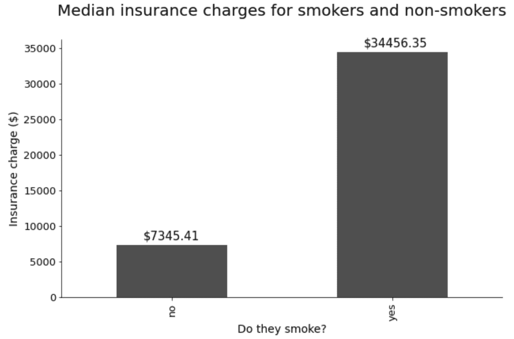

    图 3.16 – 吸烟者和非吸烟者的平均保险费用

    如您所见，吸烟者支付的保险费是非吸烟者的几倍。

1.  让我们制作一个类似的可视化来比较男性和女性的平均保险费用：

    ```py
    make_bar_chart(
        column='sex',
        title='Median insurance charges between genders',
        ylabel='Insurance charge ($)',
        xlabel='Gender',
        y_offset=200,
        x_offset=0.15
    )
    ```

    您可以在这里看到可视化：

    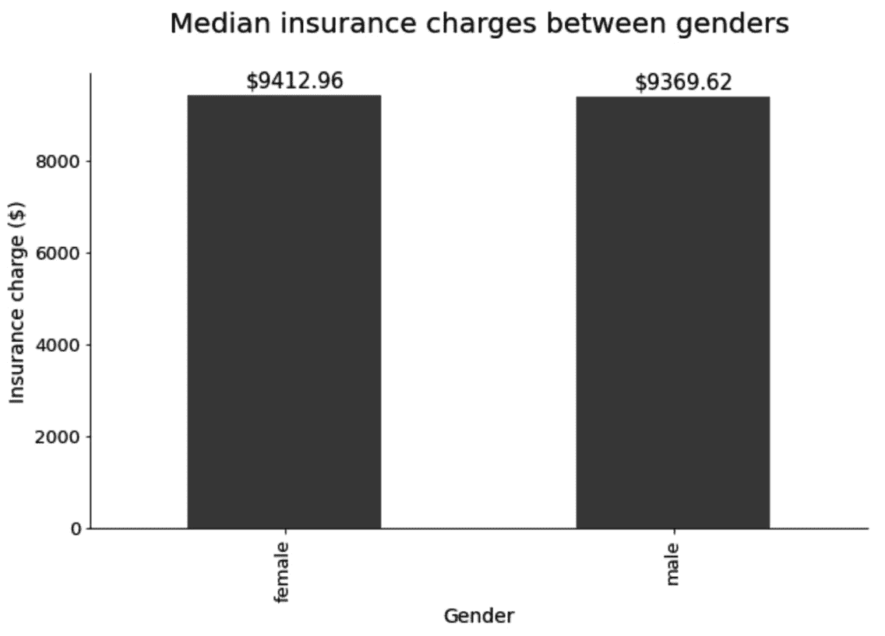

    图 3.17 – 性别之间的平均保险费用

    这里没有太大的差异。

1.  但如果我们按孩子的数量比较平均保险费用会发生什么？以下代码片段正是这样做的：

    ```py
    make_bar_chart(
        column='children',
        title='Median insurance charges by number of children',
        ylabel='Insurance charge ($)',
        xlabel='Number of children',
        y_offset=200,
        x_offset=-0.15
    )
    ```

    成本分布如下：

    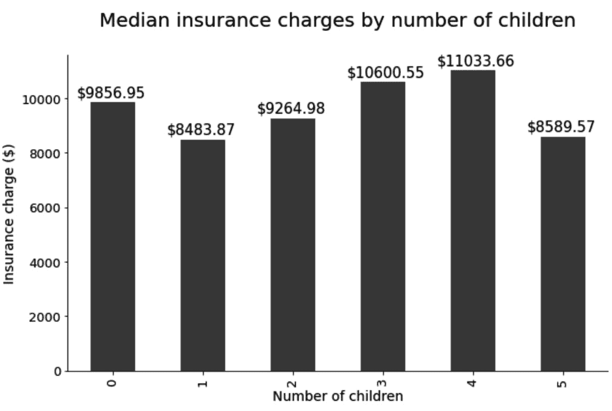

    图 3.18 – 按孩子数量划分的平均保险费用

    保险费用似乎会随着第五个孩子的出生而增加。可能没有那么多有五个孩子的家庭。你能自己确认一下吗？

1.  那么，地区呢？以下是按地区可视化平均保险费用的代码：

    ```py
    make_bar_chart(
        column='region',
        title='Median insurance charges by region',
        ylabel='Insurance charge ($)',
        xlabel='Region',
        y_offset=200,
        x_offset=0
    )
    ```

    下面这张图显示了每个地区的成本分布：

    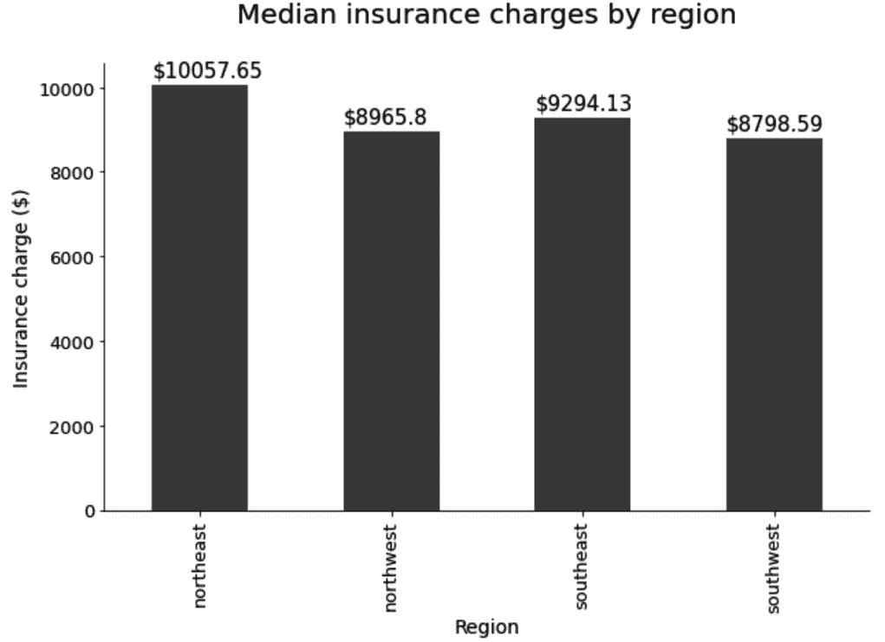

    图 3.19 – 按地区划分的平均保险费用

    值之间没有太大的差异。

    我们已经制作了大量可视化并探索了数据集。现在是时候准备它并应用机器学习模型了。

1.  为了使这个数据集准备好进行机器学习，我们需要做一些事情。首先，我们必须将`sex`和`smoker`列中的字符串值重映射为整数。然后，我们需要为`region`列创建虚拟变量。这一步是必要的，因为 TPOT 无法理解原始文本数据。

    下面是进行必要准备工作的代码片段：

    ```py
    df['sex'] = [1 if x == 'female' else 0 for x in df['sex']]
    df.rename(columns={'sex': 'is_female'}, inplace=True)
    df['smoker'] = [1 if x == 'yes' else 0 for x in df['smoker']]
    region_dummies = pd.get_dummies(df['region'], drop_first=True, prefix='region')
    df = pd.concat([region_dummies, df], axis=1)
    df.drop('region', axis=1, inplace=True)
    df.head()
    ```

    调用`head()`函数会得到以下图所示的数据集：

    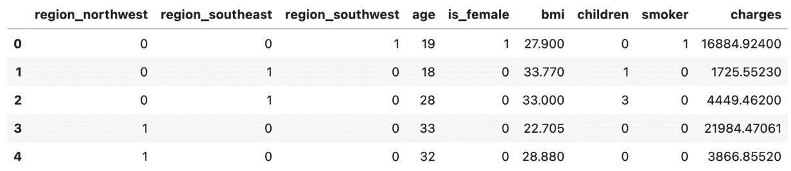

    图 3.20 – 准备后的保险数据集

1.  数据集现在已准备好进行预测建模。在我们这样做之前，让我们检查变量与目标变量之间的相关性。以下代码片段绘制了带有注释的相关矩阵：

    ```py
    plt.figure(figsize=(12, 9))
    plt.title('Correlation matrix', size=20)
    sns.heatmap(df.corr(), annot=True, cmap='Blues');
    ```

    下面这张图显示了相应的相关矩阵：

    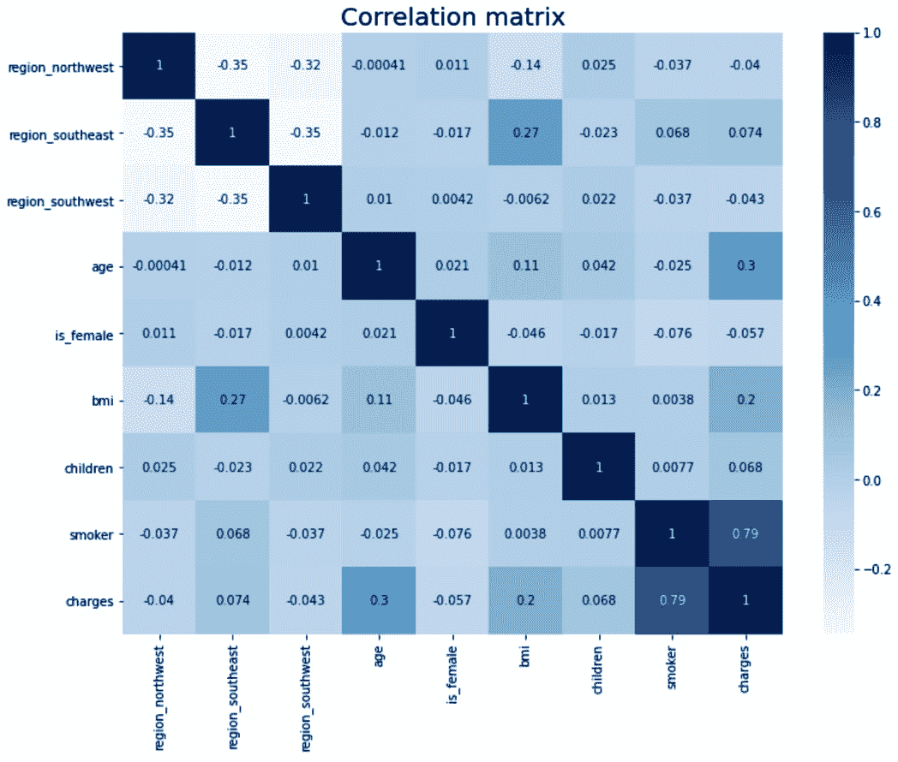

    图 3.21 – 保险数据集的相关矩阵

    下一个目标 – 预测建模。

1.  如前所述，第一步是进行训练/测试分割。以下代码片段展示了如何进行：

    ```py
    from sklearn.model_selection import train_test_split
    X = df.drop('charges', axis=1)
    y = df['charges']
    X_train, X_test, y_train, y_test = train_test_split(
        X, y, test_size=0.25, random_state=42
    )
    y_train.shape, y_test.shape
    ```

    训练集和测试集中的实例数量显示在以下图中：

    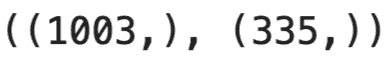

    图 3.22 – 训练集和测试集中的实例数量

1.  我们首先使用线性回归算法创建一个基线模型。这将作为 TPOT 必须超越的目标。你可以在这里找到训练基线模型的代码片段：

    ```py
    from sklearn.linear_model import LinearRegression
    from sklearn.metrics import r2_score, mean_squared_error
    rmse = lambda y, y_hat: np.sqrt(mean_squared_error(y, y_hat))
    lm = LinearRegression()
    lm.fit(X_train, y_train)
    lm_preds = lm.predict(X_test)
    print(f'R2   = {r2_score(y_test, lm_preds):.2f}')
    print(f'RMSE = {rmse(y_test, lm_preds):.2f}')
    ```

    决定系数（R2）和均方根误差（RMSE）值显示在以下图中：

    

    图 3.23 – 线性回归模型的 R2 和 RMSE

    平均而言，一个简单的线性回归模型错误为$5,926.02$。这个简单的模型捕捉了数据集中 77%的方差。

1.  我们可以通过检查分配的权重（系数）来进一步探索线性回归模型的特征重要性。

    以下代码片段打印变量名称及其对应的系数：

    ```py
    for i, column in enumerate(df.columns[:-1]):
        coef = np.round(lm.coef_[i], 2)
        print(f'{column:17}: {coef:8}')
    ```

    输出显示在以下图中：

    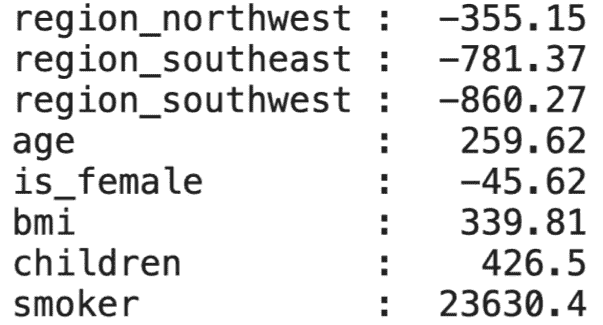

    图 3.24 – 线性回归模型的系数

    如你所见，具有最大系数的列是`smoker`。这很合理，因为它证实了我们探索性数据分析阶段所做的可视化。

1.  现在是时候动用重武器了。我们将使用 TPOT 库来生成一个自动化的机器学习流程。这次我们将优化流程以 R2 分数为目标，但如果你愿意，也可以坚持使用 RMSE 或其他任何指标。

    以下代码片段导入 TPOT 库，实例化它，并拟合流程：

    ```py
    from tpot import TPOTRegressor
    pipeline_optimizer = TPOTRegressor(
        scoring='r2',
        max_time_mins=10,
        random_state=42,
        verbosity=2
    )
    pipeline_optimizer.fit(X_train, y_train)
    ```

    10 分钟后，你应该在你的笔记本中看到以下输出：

    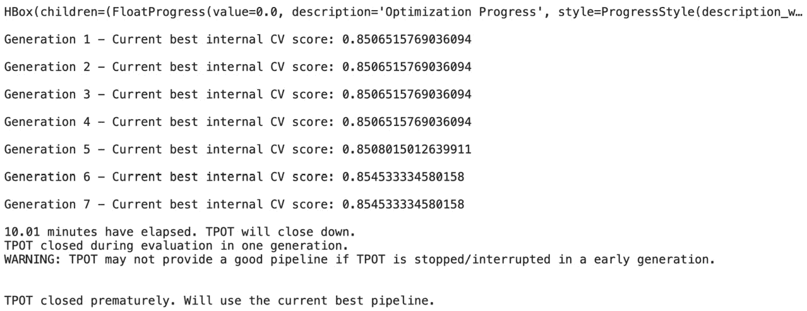

    图 3.25 – 每一代的 TPOT 分数

    在最近几代中，训练集上的分数开始上升。如果你给 TPOT 更多时间来训练，你可能会得到一个稍微更好的模型。

1.  测试集上的 R2 分数可以通过以下代码获取：

    ```py
    pipeline_optimizer.score(X_test, y_test)
    ```

    分数显示在以下图中：

    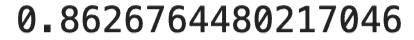

    图 3.26 – 测试集上的 TPOT R2 分数

1.  你可以手动获取测试集的 R2 和 RMSE 值。以下代码片段展示了如何操作：

    ```py
    tpot_preds = pipeline_optimizer.predict(X_test)
    print(f'R2   = {r2_score(y_test, tpot_preds):.2f}')
    print(f'RMSE = {rmse(y_test, tpot_preds):.2f}')
    ```

    相应的分数如下所示：

    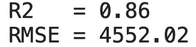

    图 3.27 – 测试集上的 TPOT R2 和 RMSE 分数

1.  作为最后一步，我们将优化流程导出到一个 Python 文件中。以下代码片段展示了如何操作：

    ```py
    pipeline_optimizer.export('insurance_pipeline.py')
    ```

    优化流程的 Python 代码如下所示：

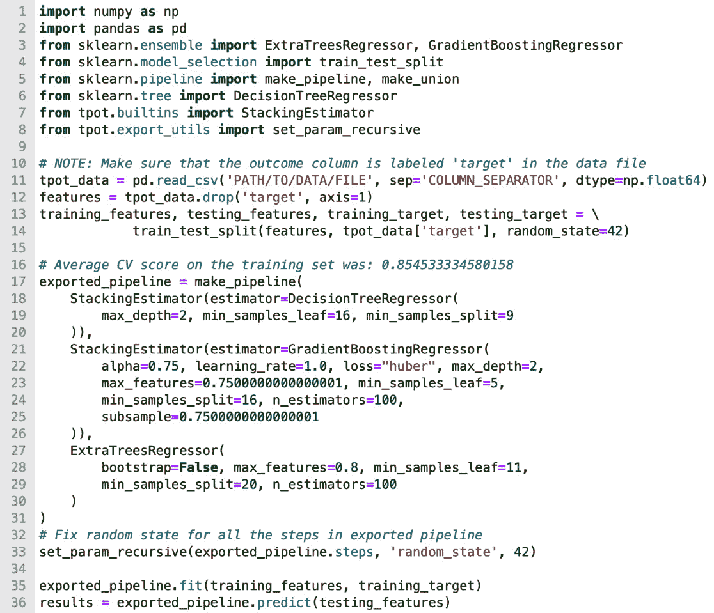

图 3.28 – 保险数据集的 TPOT 优化管道

您现在可以使用此文件对新数据做出预测。最好让管道根据需要执行优化，但即使 10 分钟也足以产生高质量的模型。

本节向您展示了如何构建针对不同指标优化的自动化管道，并在控制台上打印出更多详细输出。如您所见，优化代码大致相同。数据准备从项目到项目变化很大，这也是您将花费大部分时间的地方。

在下一节中，您将看到如何将 TPOT 应用于车辆数据集。

# 将自动回归建模应用于车辆数据集

本节展示了如何开发一个针对迄今为止最复杂的数据集的自动化机器学习模型。您将使用车辆数据集（[`www.kaggle.com/nehalbirla/vehicle-dataset-from-cardekho`](https://www.kaggle.com/nehalbirla/vehicle-dataset-from-cardekho)），如果您还没有下载，请下载。目标是根据各种预测因子（如制造年份和行驶公里数）预测销售价格。

这次，我们不会专注于探索性数据分析。如果您已经跟随了最后两个示例，您可以自己完成这项工作。相反，我们将专注于数据集准备和模型训练。将此数据集转换为机器学习准备需要做大量的工作，所以让我们立即开始：

1.  再次强调，第一步是加载库和数据集。要求与前面的示例相同。您需要`numpy`、`pandas`、`matplotlib`和`seaborn`。以下是导入库和加载数据集的方法：

    ```py
    import numpy as np
    import pandas as pd
    import matplotlib.pyplot as plt
    import seaborn as sns
    from matplotlib import rcParams
    rcParams['axes.spines.top'] = False
    rcParams['axes.spines.right'] = False
    df = pd.read_csv('data/Car.csv')
    df.head()
    ```

    调用`head()`函数显示前五行。您可以在以下图中看到它们的样式：

    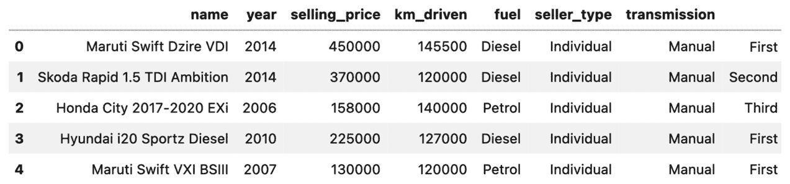

    图 3.29 – 车辆数据集的前五行

1.  数据集有很多列，*图 3.29* 中并没有显示所有列。数据准备阶段的下一步是检查缺失值。以下代码片段就是做这件事的：

    ```py
    df.isnull().sum()
    ```

    结果如下所示：

    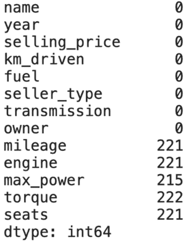

    图 3.30 – 车辆数据集中缺失值的计数

    一些值缺失，我们将通过最简单的方法解决这个问题——通过删除它们。

1.  删除缺失值可能并不总是最佳选择。您应该始终调查为什么值会缺失，以及它们是否可以（或应该）以某种方式填充。本书侧重于机器学习自动化，所以我们在这里不会这么做。

    这是删除缺失值的方法：

    ```py
    df.dropna(inplace=True)
    df.isnull().sum()
    ```

    执行前面的代码会产生以下计数：

    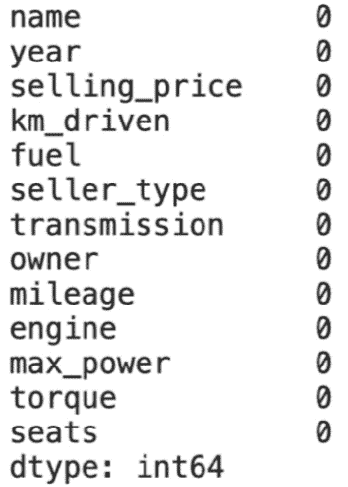

    图 3.31 – 从车辆数据集中移除缺失值

1.  现在没有任何缺失值了，但这并不意味着我们已经完成了数据准备。以下是使此数据集适合机器学习所需的步骤列表：

    +   将`transmission`列转换为整数 - 如果是手动，则为 1，否则为 0。同时，将列重命名为`is_manual`。

    +   将`owner`列重映射为整数。查看`remap_owner()`函数以获取更多说明。

    +   从相应的属性中提取汽车品牌、里程、引擎和最大马力。所有提到的属性中感兴趣的价值是第一个空格之前的内容。

    +   从属性`name`、`fuel`和`seller_type`创建虚拟变量。

    +   将原始数据集与虚拟变量连接，并删除不必要的属性。

        下面是`remap_owner()`函数的代码：

        ```py
        def remap_owner(owner):
            if owner == 'First Owner': return 1
            elif owner == 'Second Owner': return 2
            elif owner == 'Third Owner': return 3
            elif owner == 'Fourth & Above Owner': return 4
            else: return 0
        ```

        下面是执行所有提到的转换的代码：

        ```py
        df['transmission'] = [1 if x == 'Manual' else 0 for x in df['transmission']]
        df.rename(columns={'transmission': 'is_manual'}, inplace=True)
        df['owner'] = df['owner'].apply(remap_owner)
        df['name'] = df['name'].apply(lambda x: x.split()[0])
        df['mileage'] = df['mileage'].apply(lambda x: x.split()[0]).astype(float)
        df['engine'] = df['engine'].apply(lambda x: x.split()[0]).astype(int)
        df['max_power'] = df['max_power'].apply(lambda x: x.split()[0]).astype(float)
        brand_dummies = pd.get_dummies(df['name'], drop_first=True, prefix='brand')
        fuel_dummies = pd.get_dummies(df['fuel'], drop_first=True, prefix='fuel')
        seller_dummies = pd.get_dummies(df['seller_type'], drop_first=True, prefix='seller')
        df.drop(['name', 'fuel', 'seller_type', 'torque'], axis=1, inplace=True)
        df = pd.concat([df, brand_dummies, fuel_dummies, seller_dummies], axis=1)
        ```

        应用转换后，数据集看起来是这样的：

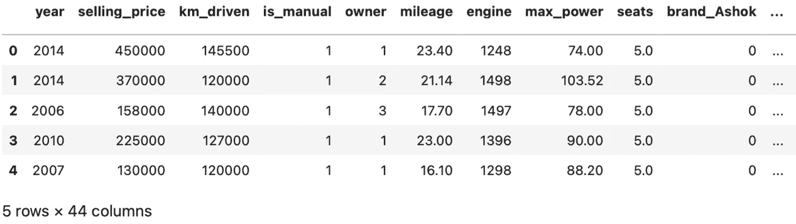

图 3.32 – 准备好的车辆数据集

此格式的数据可以传递给机器学习算法。我们接下来就做这件事。

1.  和往常一样，我们将从训练/测试集分割开始。以下代码片段显示了如何在数据集上执行此操作：

    ```py
    from sklearn.model_selection import train_test_split
    X = df.drop('selling_price', axis=1)
    y = df['selling_price']
    X_train, X_test, y_train, y_test = train_test_split(
        X, y, test_size=0.25, random_state=42
    )
    y_train.shape, y_test.shape
    ```

    你可以在*图 3.33*中看到两个集合中的实例数量：

    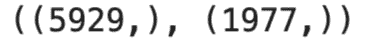

    图 3.33 – 训练集和测试集中的实例数量

    如您所见，这是一个比我们之前拥有的更大的数据集。

1.  这次我们不会使用评估回归模型的常规指标（R2 和 RMSE）。我们将使用`scikit-learn`库，因此我们需要手动实现它。以下是实现方法：

    ```py
    def mape(y, y_hat): 
        y, y_hat = np.array(y), np.array(y_hat)
        return np.mean(np.abs((y - y_hat) / y)) * 100
    ```

1.  现在是时候建立一个基线模型了。再次强调，它将是一个线性回归模型，使用测试集的 R2 和 MAPE 指标进行评估。以下是实现基线模型的代码：

    ```py
    from sklearn.linear_model import LinearRegression
    from sklearn.metrics import r2_score
    lm = LinearRegression()
    lm.fit(X_train, y_train)
    lm_preds = lm.predict(X_test)
    print(f'R2   = {r2_score(y_test, lm_preds):.2f}')
    print(f'MAPE = {mape(y_test, lm_preds):.2f}')
    ```

    相应的结果显示在下图中：

    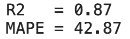

    图 3.34 – 基线模型的 R2 和 MAPE

    平均而言，基线模型错误率为 43%。这很多，但我们不得不从某处开始。

1.  让我们看一下线性回归模型的系数，以确定哪些特征是重要的。以下是获取系数的代码：

    ```py
    for i, column in enumerate(df.columns[:-1]):
        coef = np.round(lm.coef_[i], 2)
        print(f'{column:20}: {coef:12}')
    ```

    下面是系数：

    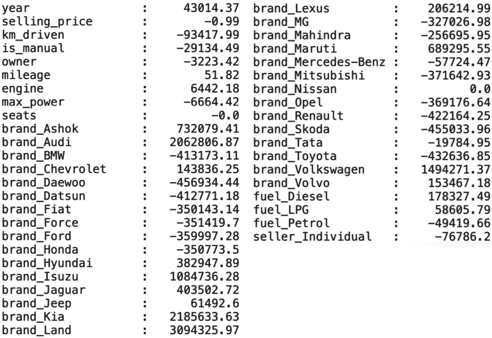

    图 3.35 – 基线模型系数

    请花点时间来欣赏一下这种可解释性。年份越高，汽车越新，这导致价格越高。车辆行驶的公里数越多，价格就越低。看起来自动挡汽车的售价也更高。你明白了。可解释性是线性回归提供的东西。但它缺乏准确性。这正是 TPOT 要改进的地方。

1.  接下来，我们将拟合一个 TPOT 模型，并针对 MAPE 分数进行优化。我们将在每个可用的 CPU 核心上（由`n_jobs=-1`指示）训练模型 10 分钟：

    ```py
    from tpot import TPOTRegressor
    from sklearn.metrics import make_scorer
    mape_scorer = make_scorer(mape, greater_is_better=False)
    pipeline_optimizer = TPOTRegressor(
        scoring=mape_scorer,
        max_time_mins=10,
        random_state=42,
        verbosity=2,
        n_jobs=-1
    )
    pipeline_optimizer.fit(X_train, y_train)
    ```

    10 分钟后的输出显示在以下图中：

    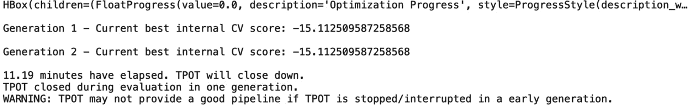

    图 3.36 – TPOT 优化过程的输出

    看起来 10 分钟的时间对 TPOT 来说远远不够以发挥其最佳性能。

    结果的管道显示在以下图中：

    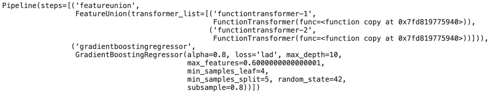

    图 3.37 – 10 分钟后的最佳拟合管道

1.  现在是真相大白的时候了——MAPE 是否有所下降？以下是查找代码：

    ```py
    tpot_preds = pipeline_optimizer.predict(X_test)
    print(f'R2   = {r2_score(y_test, tpot_preds):.2f}')
    print(f'MAPE = {mape(y_test, tpot_preds):.2f}')
    ```

    输出显示在以下图中：

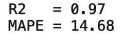

图 3.38 – TPOT 优化模型的 R2 和 MAPE

如您所见，TPOT 显著降低了错误并同时提高了拟合优度（R2）。正如预期的那样。

最后的代码示例部分向您展示了如何在更复杂的数据集上训练自动化模型是多么容易。根据你优化的指标，程序大致相同，但数据准备阶段才是所有差异的来源。

如果你花更多的时间准备和分析数据，也许还会移除一些噪声数据，你将获得更好的结果，这是有保证的！尤其是在有很多列包含文本数据的情况下。可以从那里提取出很多特征。

# 摘要

这是本书的第一个完全实践性的章节。您已经将前几章的理论与实践相结合。您不仅构建了一个，而是构建了三个完全自动化的机器学习模型。毫无疑问，您现在应该能够使用 TPOT 来解决任何类型的回归问题。

就像数据科学和机器学习中的大多数事情一样，90%的工作归结为数据准备。TPOT 可以使这个比例更高，因为花在设计和调整模型上的时间更少。明智地利用这额外的时间，并让自己完全熟悉数据集。这是不可避免的。

在下一章中，您将看到如何为分类数据集构建自动化机器学习模型。那一章也将完全是实践性的。稍后，在第五章*并行训练 TPOT 和 Dask*中，我们将结合理论与实践。

# Q&A

1.  哪种类型的数据可视化可以让你探索连续变量的分布？

1.  解释 R2、RMSE 和 MAPE 指标。

1.  你可以使用 TPOT 的自定义评分函数吗？如果可以，如何使用？

1.  为什么首先构建基线模型是必要的？哪种算法被认为是回归任务的“基线”？

1.  线性回归模型的系数能告诉你什么？

1.  在训练 TPOT 模型时，如何使用所有 CPU 核心？

1.  你可以使用 TPOT 获取最佳管道的 Python 代码吗？
