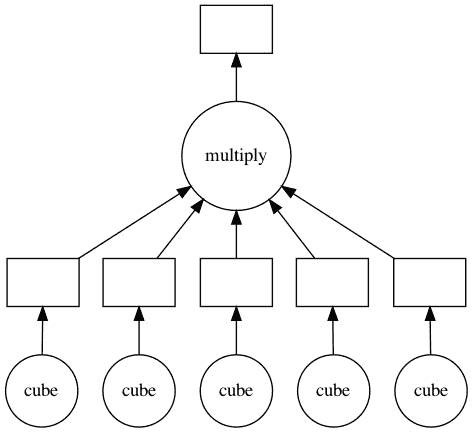
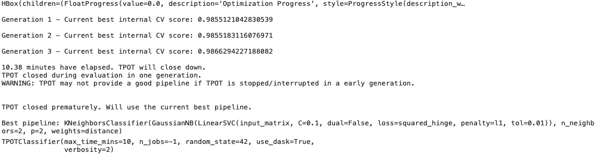

# *第五章*：使用 TPOT 和 Dask 进行并行训练

在本章中，你将深入探讨一个更高级的话题；那就是自动化机器学习。你将学习如何通过在 Dask 集群上分配工作来以并行方式处理机器学习任务。本章将比前两章更具理论性，但你仍然会学到许多有用的东西。

我们将涵盖 Python 并行背后的基本主题和思想，你将学习以几种不同的方式实现并行。然后，我们将深入探讨 Dask 库，探索其基本功能，并了解如何将其与 TPOT 结合使用。

本章将涵盖以下主题：

+   Python 并行编程简介

+   Dask 库简介

+   使用 TPOT 和 Dask 训练机器学习模型

让我们开始吧！

# 技术要求

在阅读和理解这一章之前，你不需要有任何关于 Dask 或甚至并行编程的经验。虽然将如此大的概念压缩到几页纸上几乎是不可能的，但你应该仍然能够跟上并完全理解这里所写的一切，因为所有概念都将得到解释。

你可以在此处下载本章的源代码和数据集：[`github.com/PacktPublishing/Machine-Learning-Automation-with-TPOT/tree/main/Chapter05`](https://github.com/PacktPublishing/Machine-Learning-Automation-with-TPOT/tree/main/Chapter05)。

# Python 并行编程简介

在某些情况下，需要按顺序执行任务（即第二个任务在第一个任务完成后开始）。例如，第二个函数的输入可能依赖于第一个函数的输出。如果是这样，这两个函数（进程）不能同时执行。

但大多数情况下并非如此。想象一下，在仪表盘显示之前，你的程序正在连接到三个不同的 API 端点。第一个 API 返回当前的天气状况，第二个返回股票价格，最后一个返回今天的汇率。一个接一个地调用 API 没有意义。它们之间没有依赖关系，所以按顺序运行它们会浪费大量时间。

不仅如此，这还会浪费 CPU 核心。大多数现代电脑至少有四个 CPU 核心。如果你是按顺序运行任务的，你只在使用一个核心。为什么不能使用所有这些核心呢？

在 Python 中实现并行的一种方式是使用多进程。这是一种基于进程的并行技术。正如你所想象的那样，Python 内置了一个 `multiprocessing` 库，本节将教你如何使用它。从 Python 3.2 及更高版本开始，这个库不再被推荐用于在应用程序中实现多进程。有一个新的库出现了，它的名字叫 `concurrent.futures`。这又是另一个你将在本节中学习如何使用的内置库。

解释和理解多进程的最简单方式是使用 Python 的内置 `time` 库。你可以用它来跟踪时间差异，以及故意暂停程序执行等。这正是我们所需要的，因为我们可以在它们之间插入一些时间间隔的打印语句，然后观察程序在顺序执行和并行执行时的行为。

你将通过几个动手实例了解 Python 中多进程的工作方式。

首先，请查看以下代码片段。在这个片段中，已经声明了 `sleep_func()` 函数。它的任务是打印一条消息，暂停程序执行 1 秒，然后在函数完成时打印另一条消息。我们可以监控这个函数运行任意次数（比如说五次）并打印出执行时间。代码片段如下：

```py
import time 
def sleep_func():
    print('Sleeping for a 1 second')
    time.sleep(1)
    print('Done.')
if __name__ == '__main__':
    time_start = time.time()
    # Run the function 5 times
    sleep_func()
    sleep_func()
    sleep_func()
    sleep_func()
    sleep_func()
    time_stop = time.time()
    print(f'Took {round(time_stop - time_start, 2)} seconds to execute!')
```

相应的输出如下所示：

```py
Sleeping for a 1 second
Done.
Sleeping for a 1 second
Done.
Sleeping for a 1 second
Done.
Sleeping for a 1 second
Done.
Sleeping for a 1 second
Done.
Took 5.02 seconds to execute!
```

那么，这里发生了什么？至少说，没有什么意外。`sleep_func()` 函数按顺序执行了五次。执行时间大约为 5 秒。你也可以以下面的方式简化前面的代码片段：

```py
import time 
def sleep_func():
    print('Sleeping for a 1 second')
    time.sleep(1)
    print('Done.')
if __name__ == '__main__':
    time_start = time.time()
    # Run the function 5 times in loop
    for _ in range(5):
        sleep_func()
    time_stop = time.time()
    print(f'Took {round(time_stop - time_start, 2)} seconds to execute!')
```

结果与你预期的一样：

```py
Sleeping for a 1 second
Done.
Sleeping for a 1 second
Done.
Sleeping for a 1 second
Done.
Sleeping for a 1 second
Done.
Sleeping for a 1 second
Done.
Took 5.01 seconds to execute!
```

这种方法有什么问题吗？嗯，是的。我们浪费了时间和 CPU 核心。这些函数在某种程度上并不依赖，那么我们为什么不在并行中运行它们呢？正如我们之前提到的，有两种方法可以做到这一点。让我们首先检查通过 `multiprocessing` 库的老方法。

这种方法有点繁琐，因为它需要声明一个进程、启动它并加入它。如果你只有几个进程，这并不那么麻烦，但如果你程序中有成百上千个进程呢？这很快就会变得繁琐。

以下代码片段演示了如何并行运行 `sleep_func()` 函数三次：

```py
import time 
from multiprocessing import Process
def sleep_func():
    print('Sleeping for a 1 second')
    time.sleep(1)
    print('Done.')
if __name__ == '__main__':
    time_start = time.time()
    process_1 = Process(target=sleep_func)
    process_2 = Process(target=sleep_func)
    process_3 = Process(target=sleep_func)
    process_1.start()
    process_2.start()
    process_3.start()
    process_1.join()
    process_2.join()
    process_3.join()
    time_stop = time.time()
    print(f'Took {round(time_stop - time_start, 2)} seconds to  execute!')
```

输出如下所示：

```py
Sleeping for a 1 second
Sleeping for a 1 second
Sleeping for a 1 second
Done.
Done.
Done.
Took 1.07 seconds to execute!
```

如你所见，三个进程都是独立且并行启动的，因此它们都成功地在同一秒内完成了任务。

`Process()` 和 `start()` 都是显而易见的，但 `join()` 函数在做什么呢？简单来说，它告诉 Python 等待进程完成。如果你在所有进程中调用 `join()`，则最后两行代码不会执行，直到所有进程都完成。为了好玩，尝试移除 `join()` 调用；你会立即明白其含义。

你现在对多进程有了基本的直觉，但故事还没有结束。Python 3.2 引入了一种新的、改进的并行执行任务的方法。`concurrent.futures` 库是目前最好的库，你将学习如何使用它。

使用它，你不需要手动管理进程。每个执行过的函数都会返回一些东西，在我们的`sleep_func()`函数中是`None`。你可以通过返回最后一个语句而不是打印它来改变它。此外，这种新的方法使用`ProcessPoolExecutor()`来运行。你不需要了解任何关于它的东西；只需记住，它用于同时执行多个进程。从代码的角度来看，简单地将你想要并行运行的所有内容放在里面。这种方法解锁了两个新的函数：

+   `submit()`: 用于并行运行函数。返回的结果将被追加到列表中，这样我们就可以在下一个函数中打印它们（或做任何其他事情）。

+   `result()`: 用于从函数中获取返回值。我们只需简单地打印结果，但你也可以做任何其他事情。

总结一下，我们将结果追加到列表中，然后在函数执行完毕后打印它们。以下代码片段展示了如何使用最新的 Python 方法实现多进程：

```py
import time 
import concurrent.futures
def sleep_func():
    print('Sleeping for a 1 second')
    time.sleep(1)
    return 'Done.'
if __name__ == '__main__':
    time_start = time.time()
    with concurrent.futures.ProcessPoolExecutor() as ppe:
        out = []
        for _ in range(5):
            out.append(ppe.submit(sleep_func))
        for curr in concurrent.futures.as_completed(out):
            print(curr.result())
    time_stop = time.time()
    print(f'Took {round(time_stop - time_start, 2)} seconds to execute!')
```

结果如下所示：

```py
Sleeping for a 1 second
Sleeping for a 1 second
Sleeping for a 1 second
Sleeping for a 1 second
Sleeping for a 1 second
Done.
Done.
Done.
Done.
Done.
Took 1.17 seconds to execute!
```

如你所见，程序的行为与我们之前所做的一样，增加了一些好处——你不需要自己管理进程，而且语法更加简洁。

我们目前遇到的一个问题是缺少函数参数。目前，我们只是调用一个不接受任何参数的函数。这种情况在大多数时候都不会发生，因此尽早学习如何处理函数参数是很重要的。

我们将向`sleep_func()`函数引入一个参数，允许我们指定执行将被暂停多长时间。函数内的打印语句相应地更新。暂停时间在`sleep_seconds`列表中定义，并在每次迭代中将该值作为第二个参数传递给`append()`。

整个代码片段如下所示：

```py
import time 
import concurrent.futures
def sleep_func(how_long: int):
    print(f'Sleeping for a {how_long} seconds')
    time.sleep(how_long)
    return f'Finished sleeping for {how_long} seconds.'
if __name__ == '__main__':
    time_start = time.time()
    sleep_seconds = [1, 2, 3, 1, 2, 3]
    with concurrent.futures.ProcessPoolExecutor() as ppe:
        out = []
        for sleep_second in sleep_seconds:
            out.append(ppe.submit(sleep_func, sleep_second))
        for curr in concurrent.futures.as_completed(out):
            print(curr.result())
    time_stop = time.time()
    print(f'Took {round(time_stop - time_start, 2)} seconds to execute!')
```

结果如下所示：

```py
Sleeping for 1 seconds
Sleeping for 2 seconds
Sleeping for 3 seconds
Sleeping for 1 seconds
Sleeping for 2 seconds
Sleeping for 3 seconds
Finished sleeping for 1 seconds.
Finished sleeping for 1 seconds.
Finished sleeping for 2 seconds.
Finished sleeping for 2 seconds.
Finished sleeping for 3 seconds.
Finished sleeping for 3 seconds.
Took 3.24 seconds to execute!
```

这样你就可以在并行处理中处理函数参数了。请记住，每个机器上的执行时间可能不会完全相同，因为运行时间将取决于你的硬件。一般来说，你应该看到与脚本的非并行版本相比的速度提升。你现在已经了解了并行处理的基础。在下一节中，你将了解 Python 的 Dask 库是如何进入画面的，在接下来的章节中，你将结合并行编程、Dask 和 TPOT 来构建机器学习模型。

# Dask 库简介

你可以将 Dask 视为数据规模处理中最革命的 Python 库之一。如果你是常规的 pandas 和 NumPy 用户，你会喜欢 Dask。这个库允许你处理 NumPy 和 pandas 不允许的数据，因为它们不适合 RAM。

Dask 支持 NumPy 数组和 pandas DataFrame 数据结构，所以你将很快熟悉它。它可以在你的电脑或集群上运行，这使得扩展变得更加容易。你只需要编写一次代码，然后选择你将运行它的环境。就这么简单。

另有一点需要注意，Dask 允许你通过最小的改动并行运行代码。正如你之前看到的，并行处理事物意味着执行时间减少，这是我们通常希望的行为。稍后，你将学习 Dask 中的并行性是如何通过 `dask.delayed` 实现的。

要开始，你必须安装这个库。确保正确的环境被激活。然后，从终端执行以下命令：

```py
pipenv install "dask[complete]"
```

有其他安装选项。例如，你可以只安装数组或 DataFrames 模块，但最好从一开始就安装所有内容。不要忘记在库名称周围加上引号，否则会导致错误。

如果你已经安装了所有东西，你将能够访问三个 Dask 集合——数组、DataFrames 和 bags。所有这些都可以存储比你的 RAM 大的数据集，并且它们都可以在 RAM 和硬盘之间分区数据。

让我们从 Dask 数组开始，并与 NumPy 的替代品进行比较。你可以在 Notebook 环境中执行以下代码单元，创建一个具有 1,000x1,000x1,000 维度的 NumPy 单位数组。`%%time` 魔法命令用于测量单元格执行完成所需的时间：

```py
%%time
import numpy as np
np_ones = np.ones((1000, 1000, 1000))
```

构建比这个更大的数组会导致我的机器出现内存错误，但这对比较来说已经足够了。相应的输出如下所示：

```py
CPU times: user 1.86 s, sys: 2.21 s, total: 4.07 s
Wall time: 4.35 s
```

如你所见，创建这个数组花费了 4.35 秒。现在，让我们用 Dask 来做同样的事情：

```py
%%time
import dask.array as da
da_ones = da.ones((1000, 1000, 1000))
```

如你所见，唯一的变化在于库导入名称。如果你第一次遇到 Dask 库，执行时间的结果可能会让你感到惊讶。它们在这里展示：

```py
CPU times: user 677 µs, sys: 12 µs, total: 689 µs
Wall time: 696 µs 
```

是的，你确实在读这段话。Dask 创建了一个具有相同维度的数组，耗时 696 微秒，这比之前快了 6,250 倍。当然，你不应该期望在现实世界中执行时间会有这么大的减少，但差异仍然应该相当显著。

接下来，让我们看看 Dask DataFrames。语法应该再次感觉非常相似，所以你不需要花太多时间来学习这个库。为了完全展示 Dask 的功能，我们将创建一些大型数据集，这些数据集将无法适应单个笔记本电脑的内存。更准确地说，我们将创建 10 个基于时间序列的 CSV 文件，每个文件代表一年的数据，按秒聚合并通过五个不同的特征进行测量。这有很多，创建它们肯定需要一些时间，但最终你应该会有 10 个数据集，每个数据集大约有 1 GB 的大小。如果你像我一样有一个 8 GB RAM 的笔记本电脑，你根本无法将其放入内存中。

以下代码片段创建了这些数据集：

```py
import pandas as pd
from datetime import datetime
for year in np.arange(2010, 2020):
    dates = pd.date_range(
        start=datetime(year=year, month=1, day=1),
        end=datetime(year=year, month=12, day=31),
        freq='S'
    )
    df = pd.DataFrame()
    df['Date'] = dates
    for i in range(5):
        df[f'X{i}'] = np.random.randint(low=0, high=100, size=len(df))

    df.to_csv(f'data/{year}.csv', index=False)
!ls data/
```

只需确保你的笔记本位于这个`/data`文件夹中，你就可以顺利开始了。另外，如果你要跟进度，请确保你有 10 GB 的磁盘空间。最后一行，`!ls data/`，列出了`data`文件夹中所有文件。你应该看到以下内容：

```py
2010.csv 2012.csv 2014.csv 2016.csv 2018.csv
2011.csv 2013.csv 2015.csv 2017.csv 2019.csv
```

现在，让我们看看 pandas 读取单个 CSV 文件并执行简单聚合操作需要多少时间。更精确地说，数据集按月份分组，并提取总和。以下代码片段演示了如何进行此操作：

```py
%%time
df = pd.read_csv('data/2010.csv', parse_dates=['Date'])
avg = df.groupby(by=df['Date'].dt.month).sum()
```

结果在这里显示：

```py
CPU times: user 26.5 s, sys: 9.7 s, total: 36.2 s
Wall time: 42 s
```

如你所见，pandas 执行这个计算需要 42 秒。这并不算太糟糕，但如果你绝对需要加载所有数据集并执行计算呢？让我们接下来探索这个问题。

你可以使用`glob`库来获取指定文件夹中所需文件的路径。然后你可以单独读取它们，并使用 pandas 的`concat()`函数将它们堆叠在一起。聚合操作以相同的方式进行：

```py
%%time
import glob
all_files = glob.glob('data/*.csv')
dfs = []
for fname in all_files:
    dfs.append(pd.read_csv(fname, parse_dates=['Date']))

df = pd.concat(dfs, axis=0)
agg = df.groupby(by=df['Date'].dt.year).sum()
```

这里没有太多可说的——笔记本只是简单地崩溃了。将 10 GB+的数据存储到 8 GB RAM 的机器中是不切实际的。你可以通过分块加载数据来解决这个问题，但这又是一个头疼的问题。

Dask 能做些什么来帮助呢？让我们学习如何使用 Dask 加载这些 CSV 文件并执行相同的聚合操作。你可以使用以下代码片段来完成：

```py
%%time
import dask.dataframe as dd
df = dd.read_csv('data/*.csv', parse_dates=['Date'])
agg = df.groupby(by=df['Date'].dt.year).sum().compute()
```

结果将再次让你感到惊讶：

```py
CPU times: user 5min 3s, sys: 1min 11s, total: 6min 15s
Wall time: 3min 41s
```

这是正确的——在不到 4 分钟内，Dask 成功地将超过 10 GB 的数据读取到 8 GB RAM 的机器上。仅此一点就足以让你重新考虑 NumPy 和 pandas，尤其是如果你正在处理大量数据或者你预计在不久的将来会处理数据。

最后，还有 Dask 的 bags。它们用于存储和处理无法放入内存的通用 Python 数据类型——例如，日志数据。我们不会探索这个数据结构，但了解它的存在是很好的。

另一方面，我们将使用 Dask 来探索并行处理的概念。在上一节中，你已经了解到没有有效的理由要按顺序处理数据或执行任何其他操作，因为一个操作的输入并不依赖于另一个操作的输出。

*Dask 延迟*允许并行执行。当然，你仍然可以依赖我们之前学到的多进程概念，但为什么还要这样做呢？这可能是一个繁琐的方法，而 Dask 有更好的解决方案。使用 Dask，你不需要改变编程语法，就像纯 Python 那样。你只需要使用`@dask.delayed`装饰器来注释你想并行化的函数，然后就可以开始了！

你可以将多个函数并行化，然后将它们放入计算图中。这正是我们接下来要做的。

以下代码片段声明了两个函数：

+   `cube()`: 返回一个数字的立方

+   `multiply()`: 将列表中的所有数字相乘并返回乘积

这里是你需要的库导入：

```py
import time
import dask
import math
from dask import delayed, compute
```

让我们在五个数字上运行第一个函数，并在结果上调用第二个函数，看看会发生什么。注意`cube()`函数内部的`time.sleep()`调用。这将使我们在并行化和非并行化函数之间发现差异变得容易得多：

```py
%%time
def cube(number: int) -> int:
    print(f'cube({number}) called!')
    time.sleep(1)
    return number ** 3
def multiply(items: list) -> int:
    print(f'multiply([{items}]) called!')
    return math.prod(items)
numbers = [1, 2, 3, 4, 5]
graph = multiply([cube(num) for num in numbers])
print(f'Total = {graph}')
```

这就是您的常规（顺序）数据处理。这没有什么问题，尤其是在操作如此少且简单的情况下。相应的输出如下：

```py
cube(1) called!
cube(2) called!
cube(3) called!
cube(4) called!
cube(5) called!
multiply([[1, 8, 27, 64, 125]]) called!
Total = 1728000
CPU times: user 8.04 ms, sys: 4 ms, total: 12 ms
Wall time: 5.02 s
```

如预期的那样，由于顺序执行，代码单元运行了大约 5 秒钟。现在，让我们看看您需要对这些函数进行哪些修改以实现并行化：

```py
%%time
@delayed
def cube(number: int) -> int:
    print(f'cube({number}) called!')
    time.sleep(1)
    return number ** 3
@delayed
def multiply(items: list) -> int:
    print(f'multiply([{items}]) called!')
    return math.prod(items)
numbers = [1, 2, 3, 4, 5]
graph = multiply([cube(num) for num in numbers])
print(f'Total = {graph.compute()}')
```

因此，只需要`@delayed`装饰器和在图上调用`compute()`。结果如下所示：

```py
cube(3) called!cube(2) called!cube(4) called!
cube(1) called!
cube(5) called!
multiply([[1, 8, 27, 64, 125]]) called!
Total = 1728000
CPU times: user 6.37 ms, sys: 5.4 ms, total: 11.8 ms
Wall time: 1.01 s
```

如预期的那样，由于并行执行，整个过程仅用了不到一秒钟。之前声明的计算图还有一个方便的特性——它很容易可视化。您需要在您的机器上安装*GraphViz*，并将其作为 Python 库。对于每个操作系统，安装过程都不同，所以我们在这里不详细说明。快速 Google 搜索会告诉您如何安装它。一旦完成安装，您可以执行以下代码行：

```py
graph.visualize()
```

对应的可视化显示如下：



图 5.1 – Dask 计算图的可视化

如您从图中所见，`cube()`函数被并行调用五次，其结果存储在上面的桶中。然后，使用这些值调用`multiply()`函数，并将乘积存储在顶部的桶中。

关于 Dask 的基本知识，您需要了解的就是这些。您已经学会了如何使用 Dask 数组和数据框，以及如何使用 Dask 并行处理操作。不仅如此，您还了解了 Dask 在现代数据科学和机器学习中的关键作用。数据集的大小通常超过可用内存，因此需要现代解决方案。

在下一节中，您将学习如何使用 Dask 训练 TPOT 自动化机器学习模型。

# 使用 TPOT 和 Dask 训练机器学习模型

优化机器学习管道是首要的任务，这是一个耗时的过程。我们可以通过并行运行来显著缩短它。当与 TPOT 结合使用时，Dask 和 TPOT 工作得很好，本节将教会您如何在 Dask 集群上训练 TPOT 模型。不要让“集群”这个词吓到您，因为您的笔记本电脑或 PC 就足够了。

您需要安装一个额外的库才能继续，它被称为`dask-ml`。正如其名所示，它用于使用 Dask 进行机器学习。从终端执行以下命令来安装它：

```py
pipenv install dask-ml
```

完成这些后，您可以打开 Jupyter Lab 或您喜欢的 Python 代码编辑器并开始编码。让我们开始：

1.  让我们从库导入开始。我们还会在这里做出数据集的决定。这次，我们不会在数据清洗、准备或检查上花费任何时间。目标是尽快准备好数据集。scikit-learn 中的 `load_digits()` 函数很有用，因为它旨在获取许多 8x8 像素的数字图像以进行分类。

    由于一些库经常用不必要的警告填满你的屏幕，我们将使用 `warnings` 库来忽略它们。有关所有库导入的参考，请参阅以下代码片段：

    ```py
    import tpot
    from tpot import TPOTClassifier
    from sklearn.datasets import load_digits
    from sklearn.model_selection import train_test_split
    from dask.distributed import Client
    import warnings
    warnings.filterwarnings('ignore')
    ```

    这里唯一的新事物是来自 `dask.distributed` 的 `Client` 类。它用于与 Dask 集群（在这种情况下是你的计算机）建立连接。

1.  你现在将创建一个客户端实例。这将立即启动 Dask 集群并使用你所有可用的 CPU 核心。以下是创建实例和检查集群运行位置的代码：

    ```py
    client = Client()
    client
    ```

    执行后，你应该看到以下输出：

    ![Figure 5.2 – Dask 集群信息]

    ![img/B16954_05_002.jpg]

    ![Figure 5.2 – Dask 集群信息]

    你可以点击仪表板链接，它将带你到 http://127.0.0.1:8787/status。以下截图显示了仪表板首次打开时的样子（没有运行任务）：

    ![Figure 5.3 – Dask 集群仪表板（无运行任务）]

    ![img/B16954_05_003.jpg]

    图 5.3 – Dask 集群仪表板（无运行任务）

    一旦开始训练模型，仪表板将变得更加多彩。我们将在下一步进行必要的准备。

1.  你可以调用 `load_digits()` 函数来获取图像数据，然后使用 `train_test_split()` 函数将图像分割成训练和测试子集。在这个例子中，训练/测试比例是 50:50，因为我们不想在训练上花费太多时间。在几乎任何情况下，训练集的比例都应该更高，所以请确保记住这一点。

    分割完成后，你可以对子集调用 `.shape` 来检查它们的维度。以下是整个代码片段：

    ```py
    digits = load_digits()
    X_train, X_test, y_train, y_test = train_test_split(
        digits.data,
        digits.target,
        test_size=0.5,
    )
    X_train.shape, X_test.shape
    ```

    相应的输出在以下图中显示：

    ![Figure 5.4 – 训练和测试子集的维度]

    ![img/B16954_05_004.jpg]

    图 5.4 – 训练和测试子集的维度

    下一个目标 – 模型训练。

1.  你现在拥有使用 TPOT 和 Dask 训练模型所需的一切。你可以以与之前非常相似的方式这样做。这里的关键参数是 `use_dask`。如果你想使用 Dask 进行训练，你应该将其设置为 `True`。其他参数都是众所周知的：

    ```py
    estimator = TPOTClassifier(
        n_jobs=-1,
        random_state=42,
        use_dask=True,
        verbosity=2,
        max_time_mins=10
    )
    ```

    现在，你已准备好调用 `fit()` 函数并在训练子集上训练模型。以下是执行此操作的代码行：

    ```py
    estimator.fit(X_train, y_train)
    ```

    一旦开始训练模型，Dask 仪表板的界面将立即改变。以下是过程进行几分钟后的样子：

![Figure 5.5 – 训练期间的 Dask 仪表板]

![img/B16954_05_005.jpg]

图 5.5 – 训练期间的 Dask 仪表板

10 分钟后，TPOT 将完成管道优化，你将在你的笔记本中看到以下输出：



图 5.6 – TPOT 优化输出

要将 TPOT 和 Dask 结合起来，你需要做的是所有这些。

你现在知道如何在 Dask 集群上训练模型，这是处理更大数据集和更具挑战性问题的推荐方法。

# 摘要

本章不仅包含了关于 TPOT 和以并行方式训练模型的信息，还包含了关于并行性的通用信息。你已经学到了很多——从如何并行化只做了一段时间休眠的基本函数，到并行化带有参数的函数和 Dask 基础知识，再到在 Dask 集群上使用 TPOT 和 Dask 训练机器学习模型。

到现在为止，你已经知道了如何以自动化的方式解决回归和分类任务，以及如何并行化训练过程。接下来的章节，*第六章**，*深度学习入门 – 神经网络速成课*，将为你提供关于神经网络所需的知识。这将构成*第七章**，使用 TPOT 的神经网络分类器*的基础，我们将深入探讨使用最先进的神经网络算法训练自动化机器学习模型。

和往常一样，请随意练习使用 TPOT 解决回归和分类任务，但这次，尝试使用 Dask 并行化这个过程。

# 问答

1.  定义“并行性”这个术语。

1.  解释哪些类型的任务可以并行化，哪些不可以。

1.  列出并解释在应用程序中实现并行化的三种选项（所有这些都在本章中列出）。

1.  Dask 是什么？它为什么比 NumPy 和 pandas 在处理更大数据集时更优越？

1.  名称并解释在 Dask 中实现的三种基本数据结构。

1.  Dask 集群是什么？

1.  你需要做什么来告诉 TPOT 它应该使用 Dask 进行训练？
