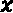

# *第六章*：深度学习入门：神经网络快速课程

在本章中，你将学习深度学习和人工神经网络的基础知识。你将了解这些主题背后的基本思想和理论，以及如何使用 Python 训练简单的神经网络模型。本章将为后续章节提供一个极好的入门，在这些章节中，管道优化和神经网络的理念将结合在一起。

我们将涵盖深度学习背后的基本主题和思想，为什么它在过去几年中变得流行，以及神经网络比传统机器学习算法表现更好的案例。你还将获得实际操作经验，从零开始编写自己的神经网络，以及通过预制的库来实现。

本章将涵盖以下主题：

+   深度学习概述

+   介绍人工神经网络

+   使用神经网络对手写数字进行分类

+   比较回归和分类中的神经网络

# 技术要求

在深度学习和神经网络方面没有先前的经验是必要的。你应该能够仅从本章中理解基础知识。先前的经验是有帮助的，因为深度学习不是一次就能学会的。

你可以在此处下载本章的源代码和数据集：[`github.com/PacktPublishing/Machine-Learning-Automation-with-TPOT/tree/main/Chapter06`](https://github.com/PacktPublishing/Machine-Learning-Automation-with-TPOT/tree/main/Chapter06)。

# 深度学习概述

深度学习是机器学习的一个子领域，它专注于神经网络。神经网络作为一个概念并不新鲜——它们在 20 世纪 40 年代就被引入了，但直到它们开始在数据科学竞赛中获胜（大约在 2010 年左右），才获得了更多的流行。

深度学习和人工智能可能最有成效的一年是 2016 年，这一切都归功于一个单一事件。*AlphaGo*，一个玩围棋的计算机程序，击败了世界排名第一的选手。在此事件之前，围棋被认为是一种计算机无法掌握的游戏，因为存在如此多的潜在棋盘配置。

如前所述，深度学习基于神经网络。你可以将神经网络想象成**有向无环图** – 由顶点（节点）和边（连接）组成的图。输入层（最左侧的第一层）接收来自数据集的原始数据，通过一个或多个隐藏层传递，并构建输出。

你可以在以下图表中看到神经网络的一个示例架构：


图 6.1 – 一个示例神经网络架构

最左侧的小黑点表示输入数据——直接来自你的数据集的数据。然后这些值通过各自的权重和偏差与隐藏层连接。这些权重和偏差的常见称呼是**可调参数**。我们将在下一节中讨论这个术语并展示如何计算它们。

神经网络中的每个节点都称为**神经元**。让我们看看单个神经元的架构：


图 6.2 – 单个神经元

X 值对应于输入层或前一隐藏层的值。这些值相乘（*x1 * w1*，*x2 * w2*）然后相加（*x1w1 + x2w2*）。在求和之后，添加一个偏差项，最后，所有内容都通过一个**激活函数**。这个函数决定神经元是否会“激活”。用最简单的话说，就像一个开关。

这里展示了权重和偏差的简要说明：

+   权重：

    a) 与前一层的值相乘

    b) 可以改变幅度或完全将值从正变为负

    c) 在函数术语中——调整权重会改变函数的斜率

+   偏差：

    a) 解释为函数的偏移

    b) 偏差的增加会导致函数向上移动

    c) 偏差的减少会导致函数向下移动

除了人工神经网络之外，还有许多类型的神经网络架构，这里将讨论它们：

+   **卷积神经网络**（**CNNs**）——一种最常见的神经网络类型，用于分析图像。它们基于卷积操作——两个矩阵之间的操作，其中一个矩阵在另一个矩阵上滑动（卷积）并计算逐元素乘积。这个操作的目标是找到一个滑动的矩阵（核）可以从输入图像中提取正确的特征，从而简化图像分类任务。

+   **循环神经网络**（**RNNs**）——一种最常见的神经网络类型，用于处理序列数据。如今，这些网络被应用于许多任务，如手写识别、语音识别、机器翻译和时间序列预测。RNN 模型一次处理序列中的单个元素。处理完毕后，新的更新单元的状态传递到下一个时间步。想象一下根据前 *n* 个字符预测单个字符；这就是一般的概念。

+   **生成对抗网络**（**GANs**）——一种最常见的神经网络类型，用于在从真实数据学习后创建新的样本。GAN 架构由两个独立的模型组成——生成器和判别器。生成器模型的任务是生成假图像并将其发送到判别器。判别器的工作就像一个法官，试图判断图像是否为假。

+   **自编码器** – 无监督学习技术，旨在学习高维数据集的低维表示。从某种意义上说，它们的工作方式类似于**主成分分析**（**PCA**）。

这四个深度学习概念不会在本书中介绍。我们将只关注人工神经网络，但了解它们的存在是有好处的，以防你想要自己深入研究。

下一节将探讨人工神经网络，并展示如何在 Python 中实现它们，无论是从头开始还是使用数据科学库。

# 介绍人工神经网络

人工神经网络的基本构建块是神经元。单独来看，一个神经元是无用的，但当它组合成一个更复杂的网络时，它可以具有强大的预测能力。

如果你不能理解其中的原因，想想你的大脑以及它是如何工作的。就像人工神经网络一样，它也是由数百万个神经元组成的，只有当它们之间有通信时才会工作。由于人工神经网络试图模仿人脑，它们需要以某种方式复制大脑中的神经元及其之间的连接（权重）。这一关联将在本节中逐步变得不那么抽象。

今天，人工神经网络可以用来解决常规机器学习算法可以解决的任何问题。简而言之，如果你可以用线性或逻辑回归解决问题，你也可以用神经网络解决。

在我们能够探索整个网络的复杂性和内部工作原理之前，我们必须从简单开始——从单个神经元的理论开始。

## 单个神经元的理论

使用 Python 模拟单个神经元很容易。例如，假设一个神经元从五个其他神经元（输入，或 X）接收值。在将其实现为代码之前，我们先从视觉上考察这种行为。以下图表显示了单个神经元在接收来自前一层五个神经元的值时的样子（我们正在模拟右侧的神经元）：


图 6.3 – 模拟单个神经元

X 代表输入特征，这些特征可能来自原始数据或前一个隐藏层。每个输入特征都分配有一个权重，用 W 表示。相应的输入值和权重相乘并求和，然后在结果上加上偏置项（b）。

计算我们神经元输出值的公式如下：


让我们用具体的数值来使这个概念更清晰。以下图表看起来与图 6.3 相同，但用实际的数字代替了变量：


图 6.4 – 神经元值计算

我们可以直接将这些值代入前面的公式来计算值：


实际上，单个神经元可以从前一层可能成千上万的神经元中获得其值，因此手动计算值并直观表达是不切实际的。

即使你决定这样做，那也只是一个前向传递。神经网络在反向传递中学习，手动计算这个传递要复杂得多。

## 编码单个神经元

接下来，让我们看看如何使用 Python 半自动化地计算神经元值：

1.  首先，让我们声明输入值、它们各自的权重以及偏置项的值。前两者是列表，而偏置项只是一个数字：

    ```py
    inputs = [5, 4, 2, 1, 6]
    weights = [0.1, 0.3, 0.05, 0.4, 0.9]
    bias = 4
    ```

    这就是计算输出值所需的所有内容。接下来，让我们看看你的选择有哪些。

1.  计算神经元输出值有三种简单的方法。第一种是最手动的方法，即明确地乘以相应的输入和权重，然后将它们与偏置项相加。

    下面是一个 Python 实现：

    ```py
    output = (inputs[0] * weights[0] + 
              inputs[1] * weights[1] + 
              inputs[2] * weights[2] +
              inputs[3] * weights[3] +
              inputs[4] * weights[4] + 
              bias)
    output
    ```

    执行此代码后，你应该会看到一个`11.6`的值打印出来。更精确地说，这个值应该是`11.600000000000001`，但不用担心这个计算误差。

    下一种方法稍微更可扩展一些，它归结为同时迭代输入和权重，并递增之前声明的输出变量。循环结束后，添加偏置项。下面是如何实现这种计算方法的：

    ```py
    output = 0
    for x, w in zip(inputs, weights):
        output += x * w
    output += bias
    output
    ```

    输出仍然是相同的，但你可以立即看到这个选项的可扩展性有多高。想象一下，如果前一个网络层有 1,000 个神经元，使用第一个选项——这甚至都不方便。

    第三种也是首选的方法是使用科学计算库，例如 NumPy。有了它，你可以计算向量点积并添加偏置项。下面是如何操作的：

    ```py
    import numpy as np
    output = np.dot(inputs, weights) + bias
    output
    ```

    这个选项既易于编写也易于执行，所以是首选的。

你现在知道如何编码单个神经元——但神经网络使用的是神经元层。你将在下一节中了解更多关于层的内容。

## 单层的理论

为了简化问题，可以将层想象成向量或简单的组。层并不是一些复杂或抽象的数据结构。在代码术语中，你可以将它们视为列表。它们包含一定数量的神经元。

编码单个神经层与编码单个神经元相当相似。我们仍然有相同的输入，因为它们要么来自前一个隐藏层，要么来自输入层。变化的是权重和偏置。在代码术语中，权重不再被视为列表，而是列表的列表（或矩阵）。同样，偏置现在是一个列表而不是标量值。

简单来说，你的权重矩阵将会有与新层中神经元数量一样多的行，以及与前一层的神经元数量一样多的列。让我们通过一个示例图来使这个概念更加具体化：


图 6.5 – 神经层

权重值故意没有放在之前的图中，因为它看起来会很杂乱。要在代码中实现这一层，你需要以下结构：

+   输入向量（1 行，5 列）

+   权重矩阵（2 行，5 列）

+   偏置向量（1 行，2 列）

线性代数中的一个矩阵乘法规则指出，两个矩阵需要具有形状（m, n）和（n, p），以便在乘法后产生一个（m, p）矩阵。考虑到这一点，你可以通过转置权重矩阵轻松地进行矩阵乘法。

从数学上讲，这是你可以用来计算输出层值的公式：


在这里，以下适用：

+   是输入向量。

+   是权重矩阵。

+   是偏置向量。

让我们为所有这些声明值，并看看如何计算输出层的值：


之前提到的公式现在可以用来计算输出层的值：


这基本上就是你可以计算整个层的输出的方法。对于实际的神经网络，计算量会增长，因为每一层有数千个神经元，但数学背后的逻辑是相同的。

你可以看到手动计算层输出是多么繁琐。你将在下一节中学习如何在 Python 中计算这些值。

## 编码单层

现在我们来探讨三种计算单层输出值的方法。与单个神经元一样，我们将从手动方法开始，并以 NumPy 的一行代码结束。

你必须首先声明输入、权重和偏置的值，所以下面是如何做的：

```py
inputs = [5, 4, 2, 1, 6]
weights = [
    [0.1, 0.3, 0.05, 0.4, 0.9],
    [0.3, 0.15, 0.4, 0.7, 0.2]
]
biases = [4, 2]
```

让我们继续计算输出层的值：

1.  让我们从手动方法开始。不，我们不会像处理神经元那样进行相同的程序。当然，你可以这样做，但看起来会太杂乱且不实用。相反，我们将立即使用`zip()`函数遍历`weights`矩阵和`biases`数组，并计算单个输出神经元的值。

    这个过程会重复进行，直到有那么多神经元，每个输出神经元都会被添加到一个表示输出层的列表中。

    这是整个代码片段：

    ```py
    layer = []
    for n_w, n_b in zip(weights, biases):
        output = 0
        for x, w in zip(inputs, n_w):
            output += x * w
        output += n_b
        layer.append(output)

    layer
    ```

    结果是一个包含值`[11.6, 6.8]`的列表，这与我们之前手动计算得到的结果相同。

    虽然这种方法可行，但仍然不是最优的。让我们看看如何改进。

1.  你现在将通过将输入值与`weights`矩阵的每一行进行向量点积来计算输出层的值。在完成此操作后，将添加偏置项。

    让我们看看它是如何实际工作的：

    ```py
    import numpy as np
    layer = []
    for n_w, n_b in zip(weights, biases):
        layer.append(np.dot(inputs, n_w) + n_b)
    layer
    ```

    层的值仍然是相同的——`[11.6, 6.8]`，这种方法比之前的方法稍微可扩展一些。它还可以进一步改进。让我们看看下一步如何操作。

1.  你可以使用一行 Python 代码在输入和转置权重之间执行矩阵乘法，并添加相应的偏差。下面是如何操作的：

    ```py
    layer = np.dot(inputs, np.transpose(weights)) + biases
    layer
    ```

    如果出于某种原因，你想手动计算输出，这是推荐的方法。NumPy 可以完全处理它，因此它也是最快的。

现在，你已经知道了如何计算单个神经元和神经网络单层的输出值。到目前为止，我们还没有涵盖神经网络中的一个关键概念，它决定了神经元是否会“触发”或“激活”。这些被称为激活函数，我们将在下一节中介绍。

## 激活函数

激活函数对于神经网络输出，以及深度学习模型的输出至关重要。它们不过是数学方程，而且相对简单。激活函数是决定神经元是否“激活”的函数。

另一种思考激活函数的方式是将其视为一种门控，它位于当前神经元接收到的输入和其输出（传递到下一层）之间。激活函数可以像阶跃函数（开启或关闭神经元）那样简单，或者稍微复杂一些且非线性。在学习和提供准确预测的复杂数据中，非线性函数非常有用。

接下来，我们将介绍一些最常用的激活函数。

### 阶跃函数

阶跃函数基于一个阈值。如果输入的值高于阈值，则神经元被激活。这就是为什么我们可以说阶跃函数充当开/关开关——中间没有值。

你可以使用 Python 和 NumPy 轻松地声明和可视化一个基本的阶跃函数。过程如下：

1.  首先，你必须定义一个阶跃函数。典型的阈值是 0，因此只有当传递给函数的值大于 0（输入值是前一个输入的总和乘以权重并加上偏差）时，神经元才会激活。

    这种逻辑在 Python 中实现起来非常简单：

    ```py
    def step_function(x):
        return 1 if x > 0 else 0
    ```

1.  现在，你可以声明一个值列表，这些值将作为该函数的输入，然后对列表应用`step_function()`。以下是一个示例：

    ```py
    xs = np.arange(-10, 10, step=0.1)
    ys = [step_function(x) for x in xs]
    ```

1.  最后，你只需两行代码就可以使用 Matplotlib 库可视化该函数：

    ```py
    plt.plot(xs, ys, color='#000000', lw=3)
    plt.title('Step activation function', fontsize=20)
    ```

    你可以在以下图表中直观地看到函数的工作方式：


图 6.6 – 阶跃激活函数

阶跃函数的最大问题是它不允许有多个输出——只有两个。接下来，我们将深入研究一系列非线性函数，你将看到它们的不同之处。

### Sigmoid 函数

Sigmoid 激活函数通常被称为逻辑函数。它在神经网络和深度学习的领域中非常受欢迎。它本质上将输入转换为一个介于 0 和 1 之间的值。

你将在后面看到函数的工作方式，你将立即注意到它相对于阶梯函数的优势 – 梯度是平滑的，所以输出值中没有跳跃。例如，如果值略有变化（例如，从-0.000001 到 0.0000001），你不会从 0 跳到 1。

Sigmoid 函数在深度学习中确实存在一个常见问题 – **梯度消失**。这是一个在反向传播（神经网络学习过程中的一个过程，远超本章范围）中经常出现的问题。简单来说，梯度在反向传递过程中“消失”，使得网络无法学习（调整权重和偏差），因为建议的调整太接近于零。

你可以使用 Python 和 NumPy 轻松声明和可视化 Sigmoid 函数。过程如下：

1.  首先，你需要定义 Sigmoid 函数。其公式已经相当成熟：*(1 / (1 + exp(-x)))*，其中*x*是输入值。

    下面是如何在 Python 中实现此公式的示例：

    ```py
    def sigmoid_function(x):
         return 1 / (1 + np.exp(-x))
    ```

1.  现在，你可以声明一个值列表，该列表将作为此函数的输入，然后应用`sigmoid_function()`到这个列表上。以下是一个示例：

    ```py
    xs = np.arange(-10, 10, step=0.1)
    ys = [step_function(x) for x in xs]
    ```

1.  最后，你只需两行代码就可以使用 Matplotlib 库可视化该函数：

    ```py
    plt.plot(xs, ys, color='#000000', lw=3)
    plt.title(Sigmoid activation function', fontsize=20)
    ```

    你可以在以下图表中看到函数的视觉工作方式：


图 6.7 – Sigmoid 激活函数

一个很大的缺点是 sigmoid 函数返回的值不是围绕零中心分布的。这是一个问题，因为对高度负值或高度正值输入的建模变得更加困难。双曲正切函数解决了这个问题。

### 双曲正切函数

双曲正切函数（或 TanH）与 Sigmoid 函数密切相关。它也是一种激活函数，也受到梯度消失问题的影响，但其输出值围绕零中心分布 – 函数的范围从-1 到+1。

这使得对高度负值或高度正值输入的建模变得容易得多。你可以使用 Python 和 NumPy 轻松声明和可视化双曲正切函数。过程如下：

1.  首先，你需要定义双曲正切函数。你可以使用 NumPy 的`tanh()`函数来实现。

    下面是如何在 Python 中实现它的示例：

    ```py
    def tanh_function(x):
        return np.tanh(x)
    ```

1.  现在，你可以声明一个值列表，该列表将作为此函数的输入，然后应用`tanh_function()`到这个列表上。以下是一个示例：

    ```py
    xs = np.arange(-10, 10, step=0.1)
    ys = [step_function(x) for x in xs]
    ```

1.  最后，你只需两行代码就可以使用 Matplotlib 库可视化该函数：

    ```py
    plt.plot(xs, ys, color='#000000', lw=3)
    plt.title(Tanh activation function', fontsize=20)
    ```

    你可以在以下图表中看到函数的视觉工作方式：


图 6.8 – 双曲正切激活函数

为了有效地训练和优化神经网络，您需要一个充当线性函数但本质上是非线性的激活函数，以便网络能够学习数据中的复杂关系。这就是本节最后一个激活函数的作用所在。

### 矩形线性单元函数

矩形线性单元（或 ReLU）函数是您在大多数现代深度学习架构中都能看到的激活函数。简单来说，它返回 0 和 x 之间的两个值中的较大值，其中 x 是输入值。

ReLU 是最具计算效率的函数之一，它允许相对快速地找到收敛点。您将在下一节中看到如何在 Python 中实现它：

1.  首先，您必须定义 ReLU 函数。这可以从头开始完成，也可以使用 NumPy 完成，因为您只需要找到两个值（0 和 x）中的较大值。

    这是 Python 中实现 ReLU 的方法：

    ```py
    def relu_function(x):
        return np.maximum(0, x)
    ```

1.  您现在可以声明一个值列表，该列表将作为此函数的输入，然后应用`relu_function()`到此列表。以下是一个示例：

    ```py
    xs = np.arange(-10, 10, step=0.1)
    ys = [step_function(x) for x in xs]
    ```

1.  最后，您可以使用 Matplotlib 库仅用两行代码来可视化该函数：

    ```py
    plt.plot(xs, ys, color='#000000', lw=3)
    plt.title(ReLU activation function', fontsize=20)
    ```

    您可以在以下图表中直观地看到该函数的工作原理：


图 6.9 – ReLU 激活函数

这就是 ReLU 的概述。您可以使用默认版本或任何变体（例如，泄漏 ReLU 或参数 ReLU），具体取决于用例。

您现在已经了解了足够的理论，可以使用 Python 编写一个基本的神经网络。我们还没有涵盖所有的理论主题，所以像损失、梯度下降、反向传播等术语可能仍然感觉抽象。我们将在接下来的动手示例中尝试解开这些谜团。

# 使用神经网络对手写数字进行分类

深度学习的“hello world”是训练一个能够对手写数字进行分类的模型。这正是本节要做的。使用 TensorFlow 库实现它只需要几行代码。

在您继续之前，您必须安装 TensorFlow。根据您是在 Windows、macOS 还是 Linux 上，以及您是否有 CUDA 兼容的 GPU，安装过程会有所不同。您可以参考官方安装说明：[`www.tensorflow.org/install`](https://www.tensorflow.org/install)。本节其余部分假设您已安装 TensorFlow 2.x。以下是需要遵循的步骤：

1.  首先，您必须导入 TensorFlow 库以及一些额外的模块。`datasets`模块使您能够直接从笔记本中下载数据。`layers`和`models`模块将在以后用于设计神经网络的架构。

    这是导入代码片段：

    ```py
    import tensorflow as tf
    from tensorflow.keras import datasets, layers, models
    ```

1.  现在，您可以继续进行数据收集和准备。调用`datasets.mnist.load_data()`将下载训练和测试图像以及相应的训练和测试标签。这些图像是灰度的，大小为 28x28 像素。这意味着您将有一系列 28x28 的矩阵，其值范围从 0（黑色）到 255（白色）。

    然后，您可以通过重新缩放图像来进一步准备数据集 – 将值除以 255，将所有内容转换为 0 到 1 的范围：

    ```py
    (train_images, train_labels), (test_images, test_labels) = datasets.mnist.load_data()
    train_images, test_images = train_images / 255.0, test_images / 255.0
    ```

    在您的笔记本中应该看到以下内容：

    

    图 6.10 – 下载 MNIST 数据集

1.  此外，您还可以检查图像中的一个矩阵值，看看您是否能在其中找到模式。

    以下代码行使检查矩阵变得容易 – 它打印它们并将所有浮点数四舍五入到一个小数点：

    ```py
    print('\n'.join([''.join(['{:4}'.format(round(item, 1)) for item in row]) for row in train_images[0]]))
    ```

    结果如下截图所示：

    

    图 6.11 – 检查单个图像矩阵

    您是否注意到在图像中很容易找到数字 5？您可以通过执行`train_labels[0]`来验证。

1.  您可以继续布局神经网络架构。如前所述，输入图像的大小为 28x28 像素。人工神经网络不能直接处理矩阵，因此您必须将这个矩阵转换为向量。这个过程被称为`layers.Dense()`来构建一个层。

    这个隐藏层也需要一个激活函数，因此可以使用 ReLU。

    最后，您可以添加最终的（输出）层，该层需要与不同类别的数量一样多的神经元 – 在这个例子中是 10 个。

    这是网络架构的整个代码片段：

    ```py
    model = models.Sequential([
      layers.Flatten(input_shape=(28, 28)),
      layers.Dense(128, activation='relu'),
      layers.Dense(10)
    ])
    ```

    `models.Sequential`函数允许您将层一个接一个地堆叠起来，并且，嗯，从单个层中构建一个网络。

    您可以通过在模型上调用`summary()`方法来查看模型的架构：

    ```py
    model.summary()
    ```

    结果如下截图所示：

    

    图 6.12 – 神经网络架构

1.  在模型训练之前，您还需要做一件事，那就是编译模型。在编译过程中，您需要指定优化器、损失函数和优化指标的具体值。

    这些内容在本章中尚未涉及，但下面将简要解释每个部分：

    +   *优化器* – 用于改变神经网络属性以减少损失值的算法。这些属性包括权重、学习率等。

    +   *损失* – 一种用于计算梯度的方法，然后使用这些梯度来更新神经网络中的权重。

    +   *指标* – 您正在优化的指标（例如，准确率）。

        深入探讨这些主题超出了本书的范围。有很多资源可以帮助您了解深度学习背后的理论。本章仅旨在介绍基本概念。

        你可以通过执行以下代码来编译你的神经网络：

        ```py
        model.compile(
            optimizer='adam',
            loss=tf.keras.losses.SparseCategoricalCrossentropy(from_logits=True),
            metrics=['accuracy']
        )
        ```

1.  现在，你已经准备好训练模型了。训练子集将被用来训练网络，测试子集将被用来评估。网络将训练 10 个 epoch（即 10 次完整遍历整个训练数据）。

    你可以使用以下代码片段来训练模型：

    ```py
    history = model.fit(
        train_images, 
        train_labels, 
        epochs=10, 
        validation_data=(test_images, test_labels)
    )
    ```

    执行前面的代码将启动训练过程。所需时间取决于你的硬件配置以及你是否使用了 GPU 或 CPU。你应该会看到以下类似的屏幕截图：

    

    图 6.13 – MNIST 模型训练

    经过 10 个 epoch 后，验证集上的准确率达到了 97.7%——如果我们考虑到常规神经网络在图像处理上表现不佳的话，这已经是非常出色的了。

1.  要在新的实例上测试你的模型，你可以使用`predict()`方法。它返回一个数组，告诉你对于给定类别的预测是否正确。这个数组将有 10 个项，因为共有 10 个类别。

    然后，你可以调用`np.argmax()`来获取值最高的项：

    ```py
    import numpy as np
    prediction = model.predict(test_images[0].reshape(-1, 784))
    print(f'True digit = {test_labels[0]}')
    print(f'Predicted digit = {np.argmax(prediction)}')
    ```

    结果将在下面的屏幕截图中展示：


图 6.14 – 测试 MNIST 模型

如你所见，预测是正确的。

就是这样简单，使用 TensorFlow 等库训练神经网络。请记住，在现实世界中，我们不建议使用这种方式处理图像分类，因为我们已经将 28x28 的图像展平，立即丢失了所有的二维信息。对于图像分类，CNN（卷积神经网络）会是一个更好的方法，因为它们可以从二维数据中提取有用的特征。我们的人工神经网络在这里表现良好，因为 MNIST 是一个简单且干净的数据库集——这不是你在工作中会遇到的很多情况。

在下一节中，你将了解使用神经网络处理分类和回归任务的差异。

# 回归与分类中的神经网络

如果你使用过 scikit-learn 进行过任何机器学习，你就会知道，对于回归和分类数据集，都有专门的类和模型。例如，如果你想将决策树算法应用于分类数据集，你会使用`DecisionTreeClassifier`类。同样，对于回归任务，你会使用`DecisionTreeRegressor`类。

但你该如何使用神经网络呢？没有专门用于分类和回归任务的类或层。

相反，你可以通过调整输出层中的神经元数量来适应。简单来说，如果你处理的是回归任务，输出层中必须只有一个神经元。如果你处理的是分类任务，输出层中的神经元数量将与目标变量中的不同类别数量相同。

例如，你看到了上一节中的神经网络在输出层有 10 个神经元。原因是存在从零到九的 10 个不同的数字。如果你预测的是某物的价格（回归），输出层将只有一个神经元。

神经网络的任务是学习适当的参数值（权重和偏置），以产生最佳输出值，无论你正在解决什么类型的问题。

# 摘要

如果这是您第一次接触深度学习和神经网络，那么这一章可能难以理解。反复阅读材料可能会有所帮助，但这还不足以完全理解这个主题。关于深度学习，甚至关于深度学习的小子集，已经写出了整本书。因此，在一章中涵盖所有内容是不可能的。

尽管如此，您应该了解神经元、层和激活函数概念背后的基本理论，并且您可以随时自学更多。下一章，*第七章**，TPOT 神经网络分类器*，将向您展示如何连接神经网络和管道优化，这样您就可以完全自动地构建最先进的模型。

和往常一样，请随时探索深度学习和神经网络的理沦和实践。这绝对是一个值得进一步研究的学术领域。

# Q&A

1.  你将如何定义“深度学习”这个术语？

1.  传统机器学习算法与深度学习中使用的算法有什么区别？

1.  列出并简要描述五种类型的神经网络。

1.  你能想出如何根据每层的神经元数量来计算网络中的可训练参数数量吗？例如，具有架构[10, 8, 8, 2]的神经网络总共有 178 个可训练参数（160 个权重和 18 个偏置）。

1.  列出四种不同的激活函数，并简要解释它们。

1.  用你自己的话描述神经网络中的*损失*。

1.  解释为什么用常规人工神经网络来建模图像分类模型不是一个好主意。
