# 第七章：使用 TPOT 的神经网络分类器

在本章中，你将学习如何以自动化的方式构建你的深度学习分类器——通过使用 TPOT 库。假设你已了解人工神经网络的基本知识，因此诸如*神经元*、*层*、*激活函数*和*学习率*等术语应该听起来很熟悉。如果你不知道如何简单地解释这些术语，请回顾*第六章*，*深度学习入门：神经网络快速入门*。

在本章的整个过程中，你将了解到构建基于神经网络的简单分类器是多么容易，以及你如何调整神经网络以更好地满足你的需求和训练数据。

本章将涵盖以下主题：

+   探索数据集

+   探索训练神经网络分类器的选项

+   训练神经网络分类器

# 技术要求

你不需要有深度学习和神经网络的实际操作经验。然而，了解一些基本概念和术语是必须的。如果你对这个主题完全陌生，请回顾*第六章*，*深度学习入门：神经网络快速入门*。

你可以在此处下载本章的源代码和数据集：[`github.com/PacktPublishing/Machine-Learning-Automation-with-TPOT/tree/main/Chapter07`](https://github.com/PacktPublishing/Machine-Learning-Automation-with-TPOT/tree/main/Chapter07)。

# 探索数据集

没有必要对数据集进行过度探索。仅仅因为我们可以用 TPOT 训练神经网络模型，并不意味着我们应该花费 50 多页来无谓地探索和转换复杂的数据集。

因此，在本章中，你将使用 scikit-learn 内置的数据集——乳腺癌数据集。这个数据集不需要从网络上下载，因为它已经内置在 scikit-learn 中。让我们先加载并探索它：

1.  首先，你需要加载几个库。我们导入 NumPy、pandas、Matplotlib 和 Seaborn，以便于数据分析和可视化。此外，我们还从`sklearn.datasets`模块导入`load_breast_cancer`函数。这是将数据集加载进来的函数。最后，从 Matplotlib 导入`rcParams`模块，以便使默认样式更容易看清楚：

    ```py
    import numpy as np
    import pandas as pd
    import matplotlib.pyplot as plt
    import seaborn as sns
    from sklearn.datasets import load_breast_cancer
    from matplotlib import rcParams
    rcParams['figure.figsize'] = (14, 7)
    rcParams['axes.spines.top'] = False
    rcParams['axes.spines.right'] = False
    ```

1.  你现在可以使用`load_breast_cancer`函数来加载数据集。该函数返回一个字典，因此我们可以使用`keys()`方法来打印键：

    ```py
    data = load_breast_cancer()
    data.keys()
    ```

    结果如下所示：

    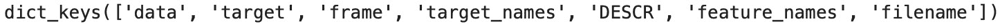

    图 7.1 – 乳腺癌数据集的字典键

1.  您现在可以使用这个字典来提取感兴趣的属性。目前最重要的是 `data` 和 `target` 键。您可以将它们的值存储到单独的变量中，然后从它们中构建一个数据框对象。使用原始值是可能的，但 pandas 数据框数据结构将允许更轻松的数据操作、转换和探索。

    这里是如何将这些数据转换为 pandas 数据框的：

    ```py
    features = data.data
    target = data.target
    df =\
    pd.DataFrame(data=features,columns=data.feature_names)
    df['target'] = target
    df.sample(8)
    ```

    结果如下表所示：

    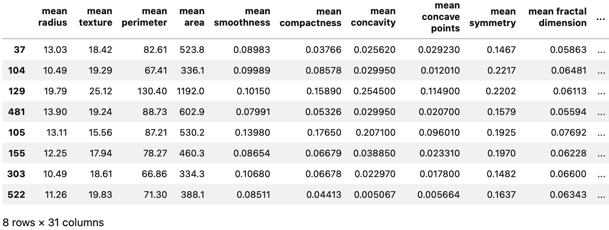

    图 7.2 – 乳腺癌数据集的八行样本

1.  在分析方面，您首先想要做的是检查缺失数据。Pandas 内置了一个 `isnull()` 方法，它为数据集中的每个值返回布尔值。然后，您可以在这些结果上调用 `sum()` 方法来获取每列的缺失值计数：

    ```py
    df.isnull().sum()
    ```

    结果如下所示：

    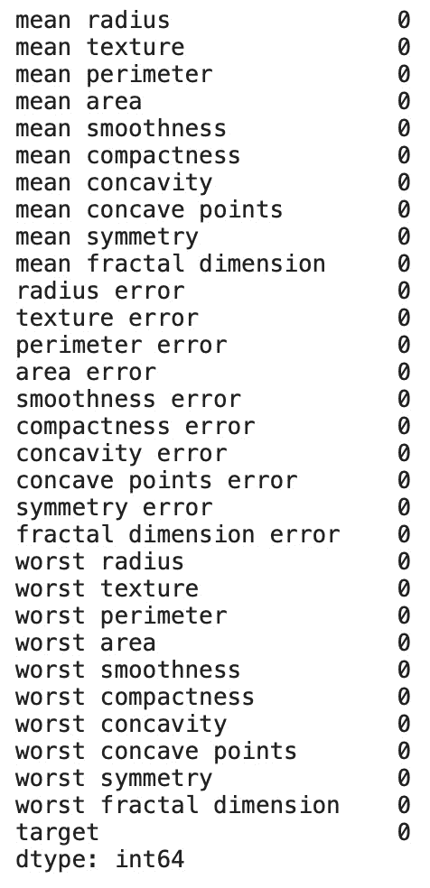

    图 7.3 – 每列的缺失值计数

    如您所见，没有缺失值。

1.  在探索阶段，下一步是熟悉您的数据集。数据可视化技术可以提供一种极好的方式来完成这项工作。

    例如，您可以声明一个名为 `make_count_chart()` 的函数，它接受任何分类属性并可视化其分布。下面是这个函数的代码示例：

    ```py
    def make_count_chart(column, title, ylabel, xlabel, y_offset=0.12, x_offset=700):
        ax = df[column].value_counts().plot(kind='bar', fontsize=13, color='#4f4f4f')
        ax.set_title(title, size=20, pad=30)
        ax.set_ylabel(ylabel, fontsize=14)
        ax.set_xlabel(xlabel, fontsize=14)

        for i in ax.patches:
            ax.text(i.get_x() + x_offset, i.get_height()\
     + y_offset, f'{str(round(i.get_height(), 2))}',\
     fontsize=15)
        return ax
    ```

    您现在可以使用以下代码片段来可视化目标变量，以找出有多少实例是良性的，有多少是恶性的：

    ```py
    make_count_chart(
        column='target',
        title=\
    'Number of malignant (1) vs benign (0) cases',
        ylabel='Malignant? (0 = No, 1 = Yes)',
        xlabel='Count',
        y_offset=10,
        x_offset=0.22
    )
    ```

    结果如下所示：

    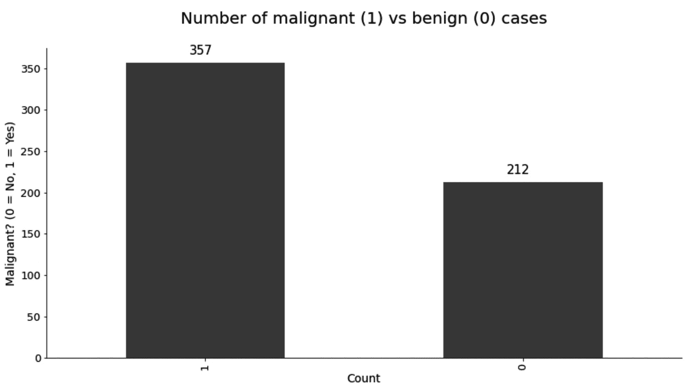

    图 7.4 – 恶性和良性病例数量

    如您所见，恶性病例的数量要多得多，所以类别并不完全平衡。类别不平衡可能导致高度准确但不可用的模型。想象一下，您正在对罕见事件进行分类。在每 10,000 笔交易中，只有一笔被分类为异常。显然，机器学习模型没有多少机会学习使异常与其他事件不同的原因。

    此外，总是预测交易是正常的会导致一个 99.99% 准确的模型。这是一个最先进的准确率，但模型不可用。

    处理不平衡数据集有许多技术，但这些超出了本书的范围。

1.  下一个步骤是相关性分析。这一步的目标是看看哪些特征对目标变量影响最大。换句话说，我们想要确定特征方向变化与目标类之间的相关性。在 30+ 列的数据集上可视化整个相关性矩阵并不是最好的主意，因为这需要一个太大而无法舒适地放在单页上的图。相反，我们可以计算特征与目标变量之间的相关性。

    这里是如何为`平均面积`特征进行此操作的示例——通过从 NumPy 调用`corrcoeff()`方法：

    ```py
    np.corrcoef(df['mean area'], df['target'])[1][0]
    ```

    结果如下所示：

    

    ```py
    corr_with_target = []
    for col in df.columns[:-1]:
        corr = np.corrcoef(df[col], df['target'])[1][0]
        corr_with_target.append({'Column': col, 'Correlation': corr})

    corr_df = pd.DataFrame(corr_with_target)
    corr_df = \
    corr_df.sort_values(by='Correlation', ascending=False)
    ```

    请注意循环开始处的`[:-1]`。由于目标变量是最后一列，我们可以使用上述切片技术排除目标变量，从而不将其包含在相关性计算中。目标变量与非目标变量之间的相关系数将为 1，这对我们来说并不特别有用。

    您现在可以使用以下代码来绘制与目标变量的相关性水平条形图：

    ```py
    plt.figure(figsize=(10, 14))
    plt.barh(corr_df['Column'], corr_df['Correlation'], color='#4f4f4f')
    plt.title('Feature correlation with the target variable', fontsize=20)
    plt.xlabel('Feature', fontsize=14)
    plt.ylabel('Correlation', fontsize=14)
    plt.show()
    ```

    结果如下所示：

    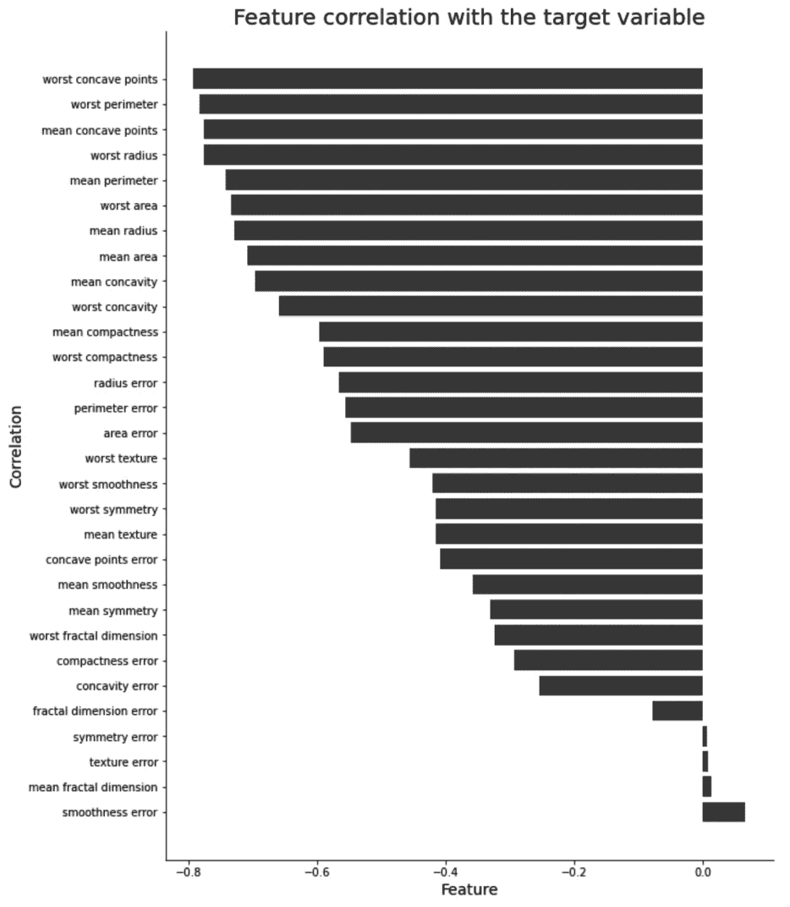

    图 7.6 – 特征与目标变量的相关性

    如您所见，大多数特征与目标变量具有高度负相关性。负相关性意味着当一个变量增加时，另一个变量会减少。在我们的例子中，特征数量的减少会导致目标变量的增加。

1.  您还可以根据目标变量的值可视化每个数值列的分布。更准确地说，这意味着在单个图表上绘制两个单独的直方图，每个直方图只显示相应目标值子集的分布。

    例如，这意味着一个直方图将显示每个变量的恶性实例的分布，另一个直方图将显示良性实例的分布。

    您即将看到的代码片段声明了一个`draw_histogram()`函数，该函数遍历数据集中的每一列，根据目标变量的不同类别绘制直方图，并将此直方图附加到图上。

    一旦所有直方图都被附加，该图将显示给用户。用户还必须指定他们想要的行数和列数，这为设计可视化提供了一些额外的自由度。

    这是绘制此直方图网格的代码片段：

    ```py
    def draw_histogram(data, columns, n_rows, n_cols):
        fig = plt.figure(figsize=(12, 18))
        for i, var_name in enumerate(columns):
            ax = fig.add_subplot(n_rows, n_cols, i + 1)
            sns.histplot(data=data, x=var_name, hue='target')
            ax.set_title(f'Distribution of {var_name}')
        fig.tight_layout()
        plt.show()
    draw_histogram(df, df.columns[:-1], 9, 4)
    ```

    这将是一个非常大的数据可视化，包含 9 行和 4 列。最后一行将只有 2 个直方图，因为总共有 30 个连续变量。

    结果如下所示：

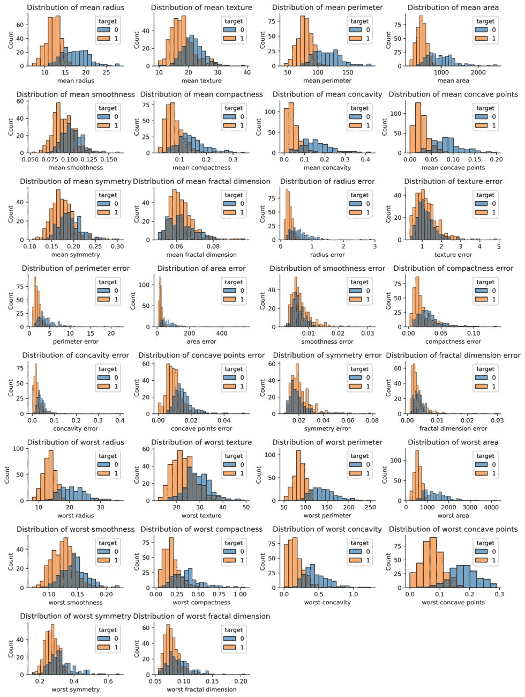

图 7.7 – 每个连续变量的直方图

如您所见，大多数情况下存在明显的分离，因此我们的模型在类之间进行合理的分离时不应有太多困难。

那就是我们在探索性数据分析方面要做的所有事情。您可以，并且被鼓励去做更多，特别是对于自定义和更复杂的数据集。下一节将向您介绍您用于训练自动神经网络分类器的选项。

# 探索训练神经网络分类器的选项

当使用 TPOT 训练神经网络模型时，你有许多选项。整个神经网络的故事在 TPOT 中仍然是新的和实验性的，需要比常规的 scikit-learn 估计器更多的手动工作。

默认情况下，TPOT 不会使用神经网络模型，除非你明确指定它必须使用。这种指定是通过选择一个包含一个或多个神经网络估计器的适当配置字典来完成的（你也可以手动编写这些字典）。

更方便的选项是从`tpot/config/classifier_nn.py`文件中导入配置字典。该文件包含两个 PyTorch 分类器配置，如下面的图所示：

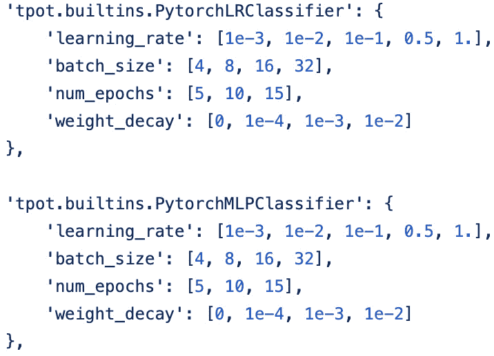

图 7.8 – TPOT PyTorch 分类器配置

从前面的图中，你可以看到 TPOT 目前可以处理基于深度学习库的两种不同类型的分类器：

+   逻辑回归：在`tpot.builtins.PytorchLRClassifier`中展示

+   多层感知器：在`tpot.builtins.PytorchMLPClassifier`中展示

你可以选择导入此文件或手动编写配置。此外，你还可以指定自己的配置字典，这些字典以某种方式修改了现有的配置。例如，你可以使用以下代码来使用基于 PyTorch 的逻辑回归估计器：

```py
tpot_config = {
    'tpot.nn.PytorchLRClassifier': {
        'learning_rate': [1e-3, 1e-2, 1e-1, 0.5, 1.]
    }
}
```

在本章后面，当我们开始实现神经网络分类器时，将讨论自定义配置。

你应该记住，使用 TPOT 训练神经网络分类器是一个耗时的任务，通常比 scikit-learn 估计器训练时间要长得多。一般来说，你应该预计神经网络训练时间要慢几个数量级。这是因为神经网络架构可以有数百万个可训练和可调整的参数，找到所有这些参数的正确值需要时间。

考虑到这一点，你应该首先考虑更简单的选项，因为 TPOT 很可能在默认的 scikit-learn 估计器上为你提供一个性能优异的管道。

下一节将继续从上一节停止的地方继续训练神经网络分类器，并展示如何使用不同的训练配置来训练你的模型。

# 训练神经网络分类器

到目前为止，我们已经加载了数据集并进行了基本的数据探索性分析。本章的这一部分将专注于通过不同的配置来训练模型：

1.  在我们开始模型训练之前，我们需要将我们的数据集分成训练集和测试集。这样做将允许我们有一个模型从未见过的数据样本，并且可以稍后用于评估。

    以下代码片段将以 75:25 的比例分割数据：

    ```py
    from sklearn.model_selection import train_test_split
    X = df.drop('target', axis=1)
    y = df['target']
    X_train, X_test, y_train, y_test =train_test_split(\
    X, y, test_size=0.25, random_state=42)
    ```

    我们可以开始训练了。

1.  像往常一样，让我们从训练一个基线模型开始。这将作为神经网络分类器必须超越的最小可行性能。

    最简单的二元分类算法是逻辑回归。以下代码片段从 scikit-learn 中导入它，以及一些评估指标，如混淆矩阵和准确率。此外，该片段实例化了模型，进行了训练，在保留集上进行了预测，并打印了混淆矩阵和准确率。

    以下是一个代码片段：

    ```py
    from sklearn.linear_model import LogisticRegression
    from sklearn.metrics import confusion_matrix, accuracy_score
    lr_model = LogisticRegression()
    lr_model.fit(X_train, y_train)
    lr_preds = lr_model.predict(X_test)
    print(confusion_matrix(y_test, lr_preds))
    print()
    print(accuracy_score(y_test, lr_preds))
    ```

    结果如下所示：

    ![图 7.9 – 基线模型的混淆矩阵和准确率]

    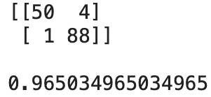

    图 7.9 – 基线模型的混淆矩阵和准确率

    我们现在知道基线模型的准确率为 96.5%，产生了 4 个假阳性和 1 个假阴性。接下来，我们将使用 TPOT 训练一个自动化的神经网络分类器，并看看结果如何比较。

1.  如前所述，使用 TPOT 训练神经网络分类器是一项艰巨的任务。因此，你可能最好切换到一个免费的 GPU 云环境，例如*Google Colab*。

    这将确保更快的训练时间，同时你也不会让你的电脑过热。一旦进入该环境，你可以使用以下代码片段来训练基于 PyTorch 的逻辑回归模型：

    ```py
    from tpot import TPOTClassifier
    classifier_lr = TPOTClassifier(
        config_dict='TPOT NN',
        template='PytorchLRClassifier',
        generations=2,
        random_state=42,
        verbosity=3
    )
    classifier_lr.fit(X_train, y_train)
    ```

    这将训练模型两代。你会在训练过程中看到各种输出，如下所示：

    ![图 7.10 – TPOT 神经网络训练过程]

    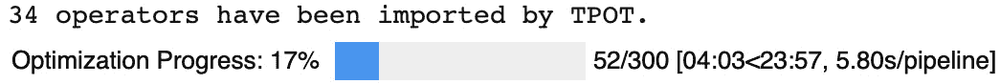

    ```py
    classifier_lr.fitted_pipeline_
    ```

    结果如下所示：

    ![图 7.12 – TPOT PyTorch 逻辑回归最佳流程]

    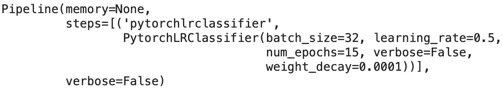

    ```py
    from sklearn.metrics import confusion_matrix,\
     accuracy_score
    tpot_lr_preds = classifier_lr.predict(X_test)
    print(confusion_matrix(y_test, tpot_lr_preds))
    print()
    print(accuracy_score(y_test, tpot_lr_preds))
    ```

    结果如下所示：

    ![图 7.13 – PyTorch 逻辑回归模型的混淆矩阵和准确率得分]

    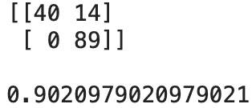

    图 7.13 – PyTorch 逻辑回归模型的混淆矩阵和准确率得分

    如你所见，两代并不足以产生一个优于基线模型的结果。让我们看看使用多层感知器模型是否有所帮助。

1.  我们仍然处于 Google Colab 环境中，因为在你自己的电脑上训练要慢得多（取决于你的配置）。现在的想法是使用多层感知器模型而不是逻辑回归，看看模型的变化如何影响性能。

    首先，你必须修改`TPOTClassifier`的`template`参数，如下所示：

    ```py
    classifier_mlp = TPOTClassifier(
        config_dict='TPOT NN',
        template='PytorchMLPClassifier',
        generations=2,
        random_state=42,
        verbosity=3
    )
    ```

    如你所见，我们现在使用`PytorchMLPClassifier`而不是`PytorchLRClassifier`。要开始优化过程，只需用训练数据调用`fit()`方法：

    ```py
    classifier_mlp.fit(X_train, y_train)
    ```

    与逻辑回归算法一样，你也会在优化过程中看到进度条：

    ![图 7.14 – TPOT 多层感知器训练过程]

    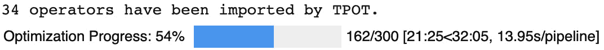

    ```py
    classifier_mlp.fitted_pipeline_
    ```

    结果如下所示：

    ![图 7.16 – TPOT PyTorch 多层感知器最佳流程]

    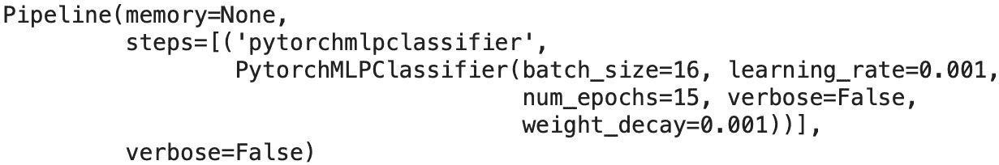

    ```py
    from sklearn.metrics import confusion_matrix,\
     accuracy_score
    tpot_mlp_preds = classifier_mlp.predict(X_test)
    print(confusion_matrix(y_test, tpot_mlp_preds))
    print()
    print(accuracy_score(y_test, tpot_mlp_preds))
    ```

    结果如下所示：

    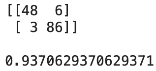

    图 7.17 – PyTorch 多层感知器模型的混淆矩阵和准确率得分

    如你所见，两代仍然不足以产生优于基线模型的结果，但 MLP 模型的表现优于逻辑回归模型。现在让我们看看使用自定义训练配置是否可以将准确率进一步提高。

1.  最后，让我们看看如何为逻辑回归或多层感知器模型指定可能的超参数值。你所要做的就是指定一个自定义配置字典，其中包含你想要测试的超参数（如学习率、批量大小和迭代次数），并以列表的形式为这些超参数分配值。

    这里有一个例子：

    ```py
    custom_config = {
        'tpot.builtins.PytorchMLPClassifier': {
            'learning_rate': [1e-1, 0.5, 1.],
            'batch_size': [16, 32],
            'num_epochs': [10, 15],
        }
    }
    ```

    现在，你可以在训练模型时使用这个`custom_config`字典。以下是一个基于多层感知器模型的示例训练片段：

    ```py
    classifier_custom = TPOTClassifier(
        config_dict=custom_config,
        template='PytorchMLPClassifier',
        generations=2,
        random_state=42,
        verbosity=3
    )
    classifier_custom.fit(X_train, y_train)
    ```

    如你所见，只有`config_dict`参数发生了变化。一旦训练过程开始，你将在笔记本中看到类似这样的进度条：

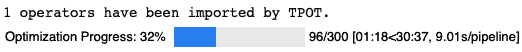

图 7.18 – 使用神经网络的 TPOT 自定义调整

一旦训练过程完成，你应在笔记本中看到以下类似的内容：

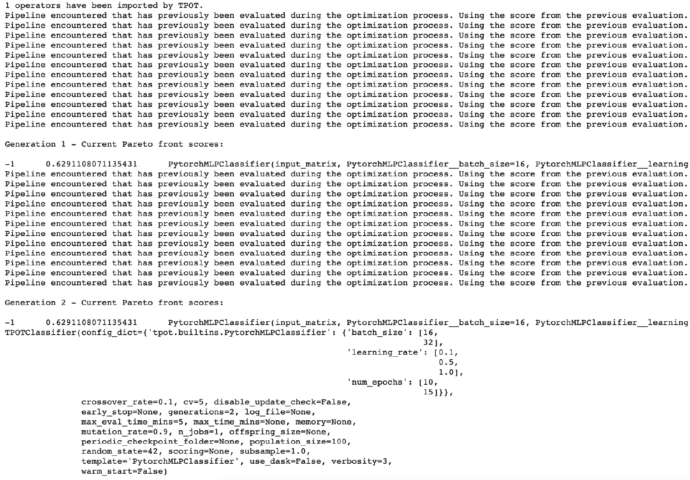

图 7.19 – 带有自定义超参数的 TPOT 多层感知器分类器

就这么简单！为了验证，你可以通过执行以下命令来检查最佳拟合管道：

```py
classifier_custom.fitted_pipeline_
```

结果如下所示：

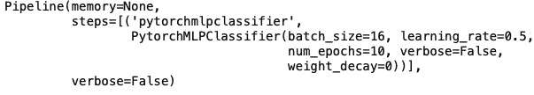

图 7.20 – 带有自定义超参数的模型的 TPOT 最佳拟合管道

如你所见，所有超参数值都在指定的范围内，这表明自定义模型已成功训练。

这就结束了本节以及本节整体中的模型训练部分。接下来是一个对我们迄今为止所学内容的简要总结，以及对即将在后续章节中介绍内容的简要介绍。

# 摘要

本章在动手示例和演示方面相当密集。你或许已经学会了如何使用 TPOT 训练自动化分类管道，以及在整个过程中你可以调整什么。

现在，你应该能够使用 TPOT 训练任何类型的自动化机器学习模型，无论是回归、分类、标准分类器还是神经网络分类器。这是一个好消息，因为这是 TPOT 示例的最后一章。

在下一章*第八章*，*TPOT 模型部署*，你将学习如何将模型的预测功能封装在 REST API 中，然后将在本地和云中进行测试和部署。你还将学习部署后如何与 API 进行通信。

最后，在上一章*第九章*，*在生产中使用部署的 TPOT 模型*，你将学习如何利用部署的 API 开发有用的东西。更准确地说，你将学习如何在笔记本环境中通过向部署的 API 发起 REST 调用来进行预测，以及如何开发一个简单的 GUI 应用程序，使你的模型对最终用户更具吸引力。

和往常一样，你可以更深入地研究 TPOT，但到目前为止，你已经领先于大多数人，并且你准备好让机器学习变得有用。在那里见！

# 问题

1.  TPOT 中关于神经网络有哪些可用的算法？

1.  大约神经网络分类器训练速度比默认的 scikit-learn 分类器慢多少倍？

1.  列出并简要解释使用 TPOT 和神经网络训练模型时可用的一些超参数。

1.  在使用 TPOT 训练自定义神经网络模型时，能否指定自定义的超参数值范围？如果是的话，如何操作？

1.  模型训练完成后，如何找到最佳拟合的流水线？

1.  使用如 Google Colab 这样的 GPU 运行时在 TPOT 训练神经网络模型时有哪些优势？

1.  描述为什么多层感知器模型中的单个神经元可以被视为逻辑回归。
