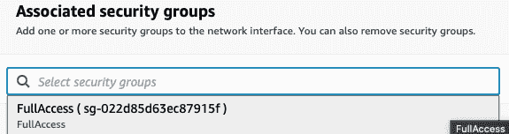

# *第八章*: TPOT 模型部署

在本章中，您将学习如何将任何自动化机器学习模型部署到本地主机和云端。您将了解到如果您旨在创建机器学习驱动的软件，部署步骤是必要的。假设您知道如何使用 TPOT 训练基本的回归和分类模型。不需要了解前几章（Dask 和神经网络）的主题，因为我们在这里不会涉及这些内容。

在本章中，您将了解到将模型封装在 API 中并向非数据科学家用户暴露其预测能力是多么容易。您还将了解到哪些云服务提供商最适合您免费开始。

本章将涵盖以下主题：

+   我们为什么需要模型部署？

+   介绍`Flask`和`Flask-RESTful`

+   自动化模型部署的最佳实践

+   将机器学习模型部署到本地主机

+   将机器学习模型部署到云端

# 技术要求

如前所述，您需要知道如何使用 TPOT 构建基本的机器学习模型。如果您对库还不够熟悉，请不要担心，我们将从头开始开发模型。如果您是 TPOT 的完全新手，请参阅*第二章*，*深入 TPOT*，*第三章*，*使用 TPOT 探索回归*，和*第四章*，*使用 TPOT 探索分类*。

本章将包含大量的代码，因此如果您遇到困难，可以参考官方 GitHub 仓库：[`github.com/PacktPublishing/Machine-Learning-Automation-with-TPOT/tree/main/Chapter08`](https://github.com/PacktPublishing/Machine-Learning-Automation-with-TPOT/tree/main/Chapter08)。

# 我们为什么需要模型部署？

如果您已经在费劲周折地训练和优化机器学习模型，为什么不更进一步，将其部署出来供每个人使用呢？

也许您希望将模型的预测能力集成到 Web 应用程序中。也许您是一位希望将机器学习带到 Android 和 iOS 的移动应用开发者。选项无穷无尽，但它们都有一个共同点——需要部署。

现在，机器学习模型部署与机器学习本身无关。目标是编写一个简单的 REST API（最好使用 Python，因为本书中使用的语言是 Python）并将调用`predict()`函数的任何形式的端点暴露给世界。您希望以 JSON 格式发送参数到您的应用程序，并将它们用作模型的输入。一旦做出预测，您只需将其返回给用户即可。

是的，这就是机器学习模型部署的全部内容。当然，事情可能会变得更加技术化，但保持简单将让我们达到 95% 的效果，而你总是可以进一步探索以获得额外的 5%。

当涉及到模型部署的技术方面时，Python 为你提供了一系列选项。你可以使用 `Flask` 和 `Flask-RESTful`、`FastAPI`、`Django` 或 `Pyramid`。当然，还有其他选项，但它们的“市场份额”或多或少可以忽略不计。你将在本章的下一节开始使用第一个选项。

下一个部分旨在通过几个基本的动手示例介绍这些库。之后，我们将深入了解机器学习。

# 介绍 Flask 和 Flask-RESTful

`Flask` 是一个用于构建 Web 应用的轻量级框架。它使你能够简单开始，并在需要时进行扩展。`Flask-RESTful` 是 `Flask` 的一个扩展，它允许你快速构建 RESTful API。

要开始使用这两个库，你需要安装它们。你可以在终端中执行以下行：

```py
> pip install flask flask-restful
```

这就是你需要开始的地方。让我们首先探索 `Flask` 的基础知识：

1.  信不信由你，你只需要七行代码就可以使用 `Flask` 创建你的第一个 Web 应用程序。它可能不会做任何有用的事情，但这仍然是一个正确的方向。

    首先，你需要导入库并创建一个应用程序实例。然后，你需要创建一个函数，该函数返回你想要在网站上显示的内容，并用 `@app.route(route_url)` 装饰器装饰该函数。请记住，你应该用函数应该显示结果的 URL 字符串替换 `route_url`。如果你传递一个正斜杠（`/`），结果将在根页面上显示——但关于这一点，我们稍后再说。

    最后，你必须使用 `if __name__ == '__main__'` 检查使 Python 文件可执行。应用程序将在本地的 `8000` 端口上运行。

    请参考以下代码片段以了解你的第一个 `Flask` 应用程序：

    ```py
    from flask import Flask 
    app = Flask(__name__)
    @app.route('/')
    def root():
        return 'Your first Flask app!'
    if __name__ == '__main__':
        app.run(host='0.0.0.0', port=8000)
    ```

    要运行应用程序，你必须在终端中执行 Python 文件。在我的机器上，该文件被命名为 `flask_basics.py`，因此要运行它，请执行以下操作：

    ```py
    Running on http://0.0.0.0:8000/ message, you can see where the application is running, ergo which URL you need to visit to see your application. Just so you know, the 0.0.0.0 part can be replaced with localhost.Once there, you'll see the following displayed, indicating that everything worked properly:Figure 8.2 – Your first Flask applicationAnd that's how easy it is to build your first web application with `Flask`. You'll learn how to make something a bit more complex next.
    ```

1.  到目前为止，你已经知道如何使用 `Flask` 构建最简单的应用程序——但这不是你来的原因。我们想要构建 API 而不是应用程序，这是一个不同的故事。它们之间的区别相当明显——API 不带用户界面（除了文档页面），而 Web 应用程序则带。API 只是一个服务。实际上，你可以使用 `Flask` 直接构建 API。我们将探讨如何做到这一点，并解释为什么这不是最佳选择。

    首先，创建一个新的 Python 文件。这个文件将被引用为 `flask_basics2.py`。在里面，我们将有一个用于两种可能的 API 调用类型的单个路由。它们都有添加两个数字并返回结果的任务，但它们以不同的方式完成。让我们列出这些差异：

    a) `/adding`（GET）依赖于之前实现的逻辑。更准确地说，当调用端点时，会发起一个 GET 请求。唯一的区别是这次，参数是通过 URL 传递的。例如，调用`/adding?num1=3&num2=5`应在屏幕上显示`8`。参数值直接从 URL 中提取。您将看到这一动作，所以一切都会立即变得清晰。

    b) `/adding`（POST）与第一个端点非常相似，但发起的是 POST 请求。这是一种更安全的通信方法，因为参数值不是直接通过 URL 传递，而是在请求体中传递。此端点以 JSON 格式返回求和结果，因此您需要将结果包装在`flask.jsonify()`函数中。

    这两个函数旨在完成一个相同的目标 – 求两个数的和并返回结果。以下是如何实现这种逻辑的一个示例：

    ```py
    from flask import Flask, request, jsonify
    app = Flask(__name__)
    @app.route('/adding')
    def add_get():
        num1 = int(request.args.get('num1'))
        num2 = int(request.args.get('num2'))
        return f'<h3>{num1} + {num2} = {num1 + num2}</h3>'
    @app.route('/adding', methods=['POST'])
    def add_post():
        data = request.get_json()
        num1 = data['num1']
        num2 = data['num2']
        return jsonify({'result': num1 + num2})
    if __name__ == '__main__':
        app.run(host='0.0.0.0', port=8000)
    ```

    如您所见，`add_get()`函数返回一个格式为 HTML 的字符串。如果您想返回整个 HTML 文档，也可以，但这不是我们现在感兴趣的事情，所以我们不会进一步探讨。

    要运行应用程序，您需要在终端中执行 Python 文件。在我的机器上，该文件名为`flask_basics2.py`，因此要运行它，请执行以下命令：

    ```py
    /adding for GET first:

    ```

    import requests

    req = requests.post(

    url='http://localhost:8000/adding',

    json={'num1': 3, 'num2': 5}

    )

    res = req.content

    print(res)

    ```py

    If you were to run this code now, here's what you would see as the output: Figure 8.6 – The POST endpoint with parameters (Python)This is essentially a string, so some conversion to JSON will be mandatory before you can work with the returned value. More on that later, in *Chapter 9*, *Using the Deployed TPOT Model in Production*.So far, you've seen how the `Flask` library can be used to develop both web applications and web services (APIs). It's a good first option, but there's a better approach if you're only interested in building APIs – `Flask-RESTful`. Let's explore it next.
    ```

1.  您已经安装了`Flask-RESTful`。使用它的语法略有不同。它使用`get()`、`post()`和`put()`，这些代表当发起特定类型的请求时会发生什么。

    所有 API 类都继承自`Flask-RESTful.Resource`类，并且每个端点必须通过`add_resource()`方法手动绑定到特定的 URL 字符串。

    总结一下，我们将有一个`Add`类，它有两个方法：`get()`和`post()`。这些方法内部的逻辑与之前相同，唯一的例外是我们不会在任何地方返回 HTML。

    这是整个代码片段：

    ```py
    from flask import Flask, request, jsonify
    from flask_restful import Resource, Api 
    app = Flask(__name__)
    api = Api(app)
    class Adding(Resource):
        @staticmethod
        def get():
            num1 = int(request.args.get('num1'))
            num2 = int(request.args.get('num2'))
            return num1 + num2
        @staticmethod
        def post():
            data = request.get_json()
            num1 = data['num1']
            num2 = data['num2']
            return jsonify({'result': num1 + num2})
    api.add_resource(Adding, '/adding')
    if __name__ == '__main__':
        app.run(host='0.0.0.0', port=8000)
    ```

    `Adding`类内部的所有内容都在`/adding`端点上可用。

    如您所见，该 API 将在不同的端口上运行，以便于区分这个 API 和之前的那个。

    如果您现在打开`http://localhost:8000/adding`，您会看到以下消息：


图 8.7 – Flask-RESTful 无参数 GET

我们现在遇到了与默认`Flask`API 相同的错误，原因是 URL 中没有给出参数值。如果您要更改它并调用`http://localhost:8000/adding?num1=5&num2=10`，您会在浏览器窗口中看到以下内容：


图 8.8 – Flask-RESTful 带参数 GET

如前所述，直接从浏览器与 API 通信不被认为是最佳实践，但你可以使用 GET 请求类型来做这件事。你最好使用像 Postman 这样的工具，而你已经知道如何使用它。

对于 POST 方法，你可以调用之前相同的 URL，即`http://localhost:8000/adding`，并在请求体中以 JSON 格式传递参数。以下是使用 Postman 进行操作的步骤：


图 8.9 – 使用 Postman 的 Flask-RESTful POST

你也可以通过 Python 来做同样的事情，但你现在应该已经知道如何做了。

你现在已经了解了使用 Python、`Flask`和`Flask-RESTful`进行 REST API 开发的基础知识。这是一个相对快速、实用的部分，作为即将到来的内容的入门。在下一节中，我们将讨论部署机器学习模型的几个最佳实践，在最后两节中，我们将探讨如何分别在本地和云中训练和部署模型。

# 自动化模型部署的最佳实践

自动化模型的部署与你的常规机器学习模型的部署大致相同。这归结为首先训练模型，然后以某种格式保存模型。在常规机器学习模型的情况下，你可以轻松地将模型保存为`.model`或`.h5`文件。没有理由不将 TPOT 模型也这样做。

如果你记得前面的章节，TPOT 可以将最佳管道导出为 Python 文件，这样就可以在模型未训练的情况下使用该管道进行训练，并在之后保存模型。如果模型已经训练，则只获取预测。

通过检查文件是否存在，可以确定模型是否已被训练。如果模型文件存在，我们可以假设模型已被训练，因此可以加载它并做出预测。否则，模型应该首先进行训练和保存，然后才能进行预测。

在连接到机器学习 API 时使用 POST 请求类型也是一个好主意。它比 GET 更好，因为参数值不会直接传递到 URL 中。正如你可能知道的，参数值可能是敏感的，所以尽可能隐藏它们是个好主意。

例如，你可能需要在做出预测之前通过 API 进行身份验证。很容易理解为什么直接在 URL 中发送用户名和密码凭证不是一个好主意。POST 方法可以解决这个问题，本章的其余部分将很好地利用这一点。

简而言之，在做出预测之前，你应该始终检查模型是否已训练，并在需要时进行训练。另一个要点是，在我们的情况下，POST 比 GET 更好。你现在已经了解了部署机器学习模型的一些基本最佳实践。在下一节中，我们将训练并部署模型到本地主机。

# 将机器学习模型部署到本地主机

在我们可以部署模型之前，我们需要先训练它。你已经知道如何使用 TPOT 进行训练的所有内容，所以我们不会在这里花费太多时间。目标是训练一个简单的 Iris 分类器，并以某种方式导出预测功能。让我们一步一步地完成这个过程：

1.  像往常一样，第一步是加载库和数据集。你可以使用以下代码片段来完成此操作：

    ```py
    import pandas as pd
    df = pd.read_csv('data/iris.csv')
    df.head()
    ```

    这是前几行看起来像什么：

    

    

    图 8.10 – Iris 数据集的前几行

1.  下一步是将特征与目标变量分开。这次，我们不会将数据集分为训练集和测试集，因为我们不打算评估模型的性能。换句话说，我们知道模型表现良好，现在我们想在整个数据集上重新训练它。此外，目标变量中的字符串值将按照以下方式重映射为其整数表示：

    a) Setosa – 0

    b) Virginica – 1

    c) Versicolor – 2

    以下代码行执行了之前描述的所有操作：

    ```py
    X = df.drop('species', axis=1)
    y = df['species']
    y = y.replace({'setosa': 0, 'virginica': 1, 'versicolor': 2})
    y
    ```

    现在的目标变量看起来是这样的：

    

    

    图 8.11 – 值重映射后的目标变量

1.  下一个步骤是模型训练。我们将使用 TPOT 进行 15 分钟的模型训练。这部分你应该很熟悉，因为我们没有使用之前章节中没有使用或描述过的任何参数。

    以下代码片段将在整个数据集上训练模型：

    ```py
    from tpot import TPOTClassifier
    clf = TPOTClassifier(
        scoring='accuracy',
        max_time_mins=15,
        random_state=42,
        verbosity=2
    )
    clf.fit(X, y)
    ```

    在训练过程中，你会看到许多输出，但达到 100%的准确率不应该花费太多时间，如下图所示：

    

    

    图 8.12 – TPOT 训练过程

    在 15 分钟的时间框架内，将经过多少代取决于你的硬件，但一旦完成，你应该看到类似以下的内容：

    

    

    图 8.13 – 训练后的 TPOT 输出

1.  一旦训练过程完成，你将能够访问`fitted_pipeline_`属性：

    ```py
    clf.fitted_pipeline_
    ```

    这是一个可以导出以供以后使用的管道对象。以下是它应该看起来像什么（请注意，你可能在你的机器上看到不同的结果）：

    

    

    图 8.14 – TPOT 拟合管道

1.  为了演示这个管道的工作原理，请查看以下代码片段。它使用一个表示单个花种的二维输入数据数组调用`fitted_pipeline_`属性的`predict()`函数：

    ```py
    clf.fitted_pipeline_.predict([[5.1, 3.5, 0.2, 3.4]])
    ```

    结果显示在以下图中：

    

    

    图 8.15 – TPOT 预测

    记得我们几页前的重映射策略吗？`0`表示这种物种被分类为`setosa`。

1.  我们必须完成的最后一步是将此模型的预测能力保存到文件中。`joblib` 库使得这一步变得简单，因为你只需要调用 `dump()` 函数来保存模型，并调用 `load()` 函数来加载模型。

    这里有一个快速演示。目标是把 `fitted_pipeline_` 属性保存到名为 `iris.model` 的文件中。你可以使用以下代码来完成：

    ```py
    import joblib
    joblib.dump(clf.fitted_pipeline_, 'iris.model')
    ```

    就这么简单！一旦模型保存到文件中，你将看到以下输出：

![图 8.16 – 保存 TPOT 模型

![图片 B16954_08_16.jpg]

图 8.16 – 保存 TPOT 模型

为了验证模型仍然可以正常工作，你可以使用 `load()` 函数在新的变量中加载模型：

```py
loaded_model = joblib.load('iris.model')
loaded_model.predict([[5.1, 3.5, 0.2, 3.4]])
```

上述代码的输出显示在下图中：

![图 8.17 – 保存模型的预测

![图片 B16954_08_17.jpg]

图 8.17 – 保存模型的预测

就这样，保存机器学习模型以供以后使用变得非常简单。我们现在拥有了部署此模型所需的一切，所以让我们继续下一步。

模型部署过程将与之前使用 `Flask` 和 `Flask-RESTful` 所做的非常相似。在继续逐步指南之前，你应该为你的 API 创建一个目录，并具有以下目录/文件结构：

![图 8.18 – API 目录结构

![图片 B16954_08_18.jpg]

图 8.18 – API 目录结构

如你所见，根目录被命名为 `api`，其中包含两个 Python 文件 —— `app.py` 和 `helpers.py`。该文件夹还有一个用于存储之前训练的模型的文件夹。

让我们一步一步地构建 API：

1.  让我们从 `helpers.py` 文件开始。这个 Python 文件的目标是从 `app.py` 中移除所有计算和数据操作。后者仅用于声明和管理 API 本身，其他所有操作都在其他地方执行。

    `helpers.py` 文件将包含两个函数 —— `int_to_species(in_species)` 和 `predict_single(model, X)`。

    第一个函数的目标是反转我们之前声明的映射，并给出整数表示的实际花卉种类名称。以下是给出整数输入时返回的字符串的具体列表：

    a) 0 – `setosa`

    b) 1 – `virginica`

    c) 2 – `versicolor`

    如果传递了其他数字，则返回一个空字符串。你可以按照以下方式找到此函数的代码：

    ```py
    def int_to_species(in_species):
        if in_species == 0:
            return 'setosa'
        if in_species == 1:
            return 'virginica'
        if in_species == 2:
            return 'versicolor'
    ```

    接下来是 `predict_single(model, X)` 函数。该函数旨在根据模型和输入值的列表返回预测及其概率。该函数还执行以下检查：

    a) `X` 是一个列表吗？如果不是，则抛出异常。

    b) `X` 是否有四个项目（花瓣长度、花瓣宽度、花萼长度和花萼宽度）？如果不是，则抛出异常。

    这些检查是必需的，因为我们不希望不良或格式错误的数据进入我们的模型并使 API 崩溃。

    如果所有检查都通过，预测和概率将作为字典返回给用户，并列出每个参数的输入数据。以下是实现此函数的方法：

    ```py
    def predict_single(model, X):
        if type(X) is not list:
            raise Exception('X must be of list data type!')
        if len(X) != 4:
            raise Exception('X must contain 4 values - \
    sepal_length, sepal_width, petal_length, petal_width')
        prediction = model.predict([X])[0]
        prediction_probability =\
    model.predict_proba([X])[0][prediction]
        return {
            'In_SepalLength': X[0],
            'In_SepalWidth': X[1],
            'In_PetalLength': X[2],
            'In_PetalWidth': X[3],
            'Prediction': int_to_species(prediction),
            'Probability': prediction_probability
        }
    ```

    这里是调用 `predict_single()` 函数的一个示例：

    ```py
    predict_single(
        model=joblib.load('api/model/iris.model'), 
        X=[5.1, 3.5, 0.2, 3.4]
    )
    ```

    结果如下所示：

    

    图 8.19 – 调用 predict_single() 函数的结果

1.  现在，让我们转向 `app.py`。如果您从本章的开头就一直在跟进，编写这个文件将易如反掌。目标是始终加载模型，并在调用 `/predict` 端点时触发 `PredictSpecies` 类的 `post()` 方法。您将不得不自己实现这个类和方法。

    用户必须以 JSON 格式传递输入数据。更准确地说，每个花卉测量值都是单独传递的，因此用户总共需要指定四个参数的值。

    如果一切顺利，`helpers.py` 中的 `predict_single()` 函数将被调用，并将结果返回给用户。

    让我们看看 `app.py` 的实现：

    ```py
    import joblib 
    import warnings
    from flask import Flask, request, jsonify
    from flask_restful import Resource, Api
    from helpers import predict_single
    warnings.filterwarnings('ignore')
    app = Flask(__name__)
    api = Api(app)
    model = joblib.load('model/iris.model')
    class PredictSpecies(Resource):
        @staticmethod
        def post():
            user_input = request.get_json()
            sl = user_input['SepalLength']
            sw = user_input['SepalWidth']
            pl = user_input['PetalLength']
            pw = user_input['PetalWidth']
            prediction =\
    predict_single(model=model, X=[sl, sw, pl, pw])
            return jsonify(prediction)
    api.add_resource(PredictSpecies, '/predict')
    if __name__ == '__main__':
        app.run(host='0.0.0.0', port=8000)
    ```

1.  您现在拥有了运行 API 所需的一切。您可以像之前使用其他 API 一样运行它，即在终端中执行以下行：

    ```py
    > python app.py
    ```

    如果一切顺利，您将看到以下消息：

    

    图 8.20 – 运行 API

1.  API 现在正在 `http://localhost:8000` 上运行。我们将使用 Postman 应用程序来测试 API。

    这里是第一个示例：


图 8.21 – API 测试示例 1

如您所见，模型 100% 确信这种物种属于 `setosa` 类。让我们再试一个：


图 8.22 – API 测试示例 2

这具有相同的置信水平，但预测类别不同。让我们来点不一样的，传递一些与训练集不同的值：


图 8.23 – API 测试示例 3

如您所见，这次模型并不完全自信，因为输入数据与训练时看到的数据有很大不同。

到此为止，TPOT 模型部署到本地主机！本章剩下的唯一事情是将模型带到云端，使其在任何地方都可以访问。让我们接下来这么做。

# 将机器学习模型部署到云

云部署机器学习模型意味着创建一个云虚拟机，将我们的 API 转移到它上面，并运行它。这是一个繁琐的过程，但由于涉及许多步骤，随着重复执行会变得更容易。如果您从这个部分精确地遵循每个步骤，一切都会顺利。只需确保不要遗漏任何细节：

1.  要开始，请访问 [`portal.aws.amazon.com/billing/signup#/start`](https://portal.aws.amazon.com/billing/signup#/start) 并创建一个账户（假设您还没有一个）。以下是网站目前的模样（截至 2021 年 2 月）：![图 8.24 – AWS 注册网站

    ![图片 B16954_08_24.jpg]

    图 8.24 – AWS 注册网站

    注册过程将花费一些时间，您将需要输入您的信用卡信息。请放心；我们将创建完全免费的虚拟机实例，所以您不会收取任何费用。

1.  一旦注册过程完成，点击搜索栏中的 `ubuntu`：![图 8.26 – Ubuntu Server 20.04

    ![图片 B16954_08_26.jpg]

    图 8.26 – Ubuntu Server 20.04

    一旦点击 **选择**，您将需要指定类型。如果您不想被收费，请确保选择免费版本：

    ![图 2.27 – Ubuntu 实例类型

    ![图片 B16954_08_27.jpg]

    图 2.27 – Ubuntu 实例类型

    然后，点击 **审查和启动** 按钮。您将被带到以下屏幕：

    ![图 2.28 – Ubuntu 实例确认

    ![图片 B16954_08_28.jpg]

    图 2.28 – Ubuntu 实例确认

    一旦点击 **启动**，将出现以下窗口。请确保选择相同的选项，但密钥对名称由您决定：

    ![图 8.29 – Ubuntu 密钥对

    ![图片 B16954_08_29.jpg]

    图 8.29 – Ubuntu 密钥对

    在输入详细信息后，点击 **下载密钥对** 按钮。下载完成后，您将能够点击 **启动实例** 按钮：

    ![图 8.30 – 启动 Ubuntu 实例

    ![图片 B16954_08_30.jpg]

    图 8.30 – 启动 Ubuntu 实例

    最后，完成所有操作后，您可以点击 **查看实例** 按钮：

    ![图 8.31 – 查看实例

    ![图片 B16954_08_31.jpg]

    图 8.31 – 查看实例

    您将立即看到您创建的实例。在看到实例正在运行之前可能需要一些时间，所以请耐心等待：

    ![图 8.32 – 运行实例

    ![图片 B16954_08_32.jpg]

    图 8.32 – 运行实例

1.  要获取连接参数，请点击实例行，并在 **密钥文件** 选项中选择 `.ppk` 文件。按下 **连接** 按钮后，您将看到以下内容：![图 8.36 – FileZilla 主机密钥

    ![图片 B16954_08_36.jpg]

    图 8.36 – FileZilla 主机密钥

    只需按 **确定**，您就可以开始了。连接成功，如下图所示：

    ![图 8.37 – FileZilla 成功连接

    ![图片 B16954_08_37.jpg]

    图 8.37 – FileZilla 成功连接

    您现在可以将 **api** 文件夹拖动到远程虚拟机上的 **ubuntu** 文件夹中，如图所示：

    ![图 8.38 – 将 API 数据传输到远程虚拟机

    ![图片 B16954_08_38.jpg]

    图 8.38 – 将 API 数据传输到远程虚拟机

    在进一步配置和启动 API 之前，让我们看看您如何通过终端获取连接。

1.  在存储 `.pem` 文件的新终端窗口中打开。一旦进入，执行以下命令以更改权限：

    ```py
    TPOT_Book_KeyPair.pem with your filename and also make sure to write your instance name after ubuntu@. If you did everything correctly, you should see the following in your terminal:

    ```

    > sudo apt-get update && sudo apt-get install python3-pip

    ```py

    Finally, let's install every required library. Here's the command for doing so within a virtual environment:

    ```

    > pip3 install virtualenv
    > 
    > virtualenv tpotapi_env
    > 
    > source tpotapi_env/bin/activate
    > 
    > pip3 install joblib flask flask-restful sklearn tpot

    ```py

    There are a few steps you still need to complete before starting the API, such as managing security.
    ```

1.  如果现在运行 API，不会引发错误，但您将无法以任何方式访问 API。这是因为我们首先需要“修复”一些权限。简单来说，我们的 API 需要从任何地方可访问，但默认情况下并不是。

    首先，导航到 **网络与安全** | **安全组** 侧边栏：

    

    图 8.40 – 安全组

    您应该在浏览器窗口的右上角看到 **创建安全组** 按钮：

    

    图 8.41 – 创建安全组按钮

    当新窗口弹出时，您必须指定一些内容。**安全组名称** 和 **描述** 字段完全是任意的。另一方面，**入站规则** 组不是任意的。您必须添加一个具有以下选项的新规则：

    a) **类型**: **所有流量**

    b) **源**: **任何地方**

    参考以下图示获取更多信息：

    

    图 8.42 – 创建安全组

    在指定正确的值后，您必须滚动到屏幕底部并点击 **创建安全组** 选项：

    

    图 8.43 – 验证安全组

    我们还没有完成。下一步是转到侧边栏上的 **网络与安全** | **网络接口** 选项：

    

    图 8.44 – 网络接口选项

    一旦进入，右键单击唯一可用的网络接口（假设这是您第一次进入 AWS 控制台）并选择 **更改安全组** 选项：

    

    图 8.45 – 更改安全组

    整个目的就是将“从任何地方访问”的规则分配给我们的虚拟机。一旦弹出窗口，从选项下拉列表中选择之前声明的安全组：

    

    图 8.46 – 选择安全组

    添加完成后，点击 **保存** 按钮保存此关联：

    

    图 8.47 – 保存安全关联

1.  配置我们的虚拟机是一个相当漫长的过程，但现在您终于可以启动 `Flask` 应用程序（REST API）了。为此，导航到 `/api` 文件夹并执行以下操作：

    ```py
    > python3 app.py
    ```

    到现在为止，你应该看到一个熟悉的消息：

    

    图 8.48 – 通过终端启动 REST API

    就这样！API 现在正在运行，我们可以测试它是否正常工作。

1.  在通过 Postman 发送请求之前，我们首先需要找到远程虚拟机的完整 URL。你可以通过在**实例**下右键单击实例并点击**连接**选项来找到它。在那里，你会看到**SSH 客户端**标签页：


图 8.49 – 虚拟机 URL

现在我们知道了完整的 URL：`http://ec2-18-220-113-224.us-east-2.compute.amazonaws.com:8000/predict`。从现在开始，流程与在本地主机上相同，如下图所示：


图 8.50 – 测试我们部署的 API

如你所见，连接已经建立，API 返回了与本地部署版本相同的响应。

就这样，你就有了一个将机器学习模型部署到 AWS 虚拟机的完整流程。这个过程可能相当繁琐，如果是第一次尝试，甚至可能有些棘手。随着你部署越来越多的机器学习模型，这个过程会变得越来越容易，因为流程是相同的。

如果你不想让任何人从任何地方访问你的 API，你可以玩一下权限，但这超出了本书的范围。这一章大致结束了——做得很好！接下来是所学内容的总结，然后是另一个有趣且实用的章节。

# 摘要

这一章是目前最长的，而且非常注重实践任务。你希望已经能够跟上并学习了如何部署使用 TPOT 构建的机器学习模型——无论是在本地还是在云端。

现在你已经能够部署任何使用 Python 构建的机器学习模型。此外，你还知道如何部署基本的 Python 网络应用程序，前提是你具备前端技术（如 HTML、CSS 和 JavaScript）的相关知识。我们没有深入这个领域，因为这不属于本书的范围。

在以下章节中*第九章*，*在生产中使用部署的 TPOT 模型*，你将学习如何围绕这个 REST API 构建一个基本的应用程序。更准确地说，你将学习如何制作一个简单且外观不错的网页界面，该界面可以根据输入数据预测花卉种类。但在那之前，你将练习使用 Python 向我们的 API 发送请求。

和往常一样，你可以自由地更详细地研究模型部署，因为 AWS 不是唯一的选择。有许多云服务提供商提供某种免费层，AWS 只是池塘中的一条鱼。

# 问题

1.  我们为什么需要（并希望）模型部署？

1.  REST API 在模型部署中扮演什么角色？

1.  列举一些可以用来部署机器学习模型的 Python 库。

1.  GET 和 POST 请求类型之间有什么区别？

1.  Python 中 `joblib` 库背后的基本思想是什么？

1.  用你自己的话解释什么是虚拟机。

1.  哪个免费工具可以用来测试 REST API？
