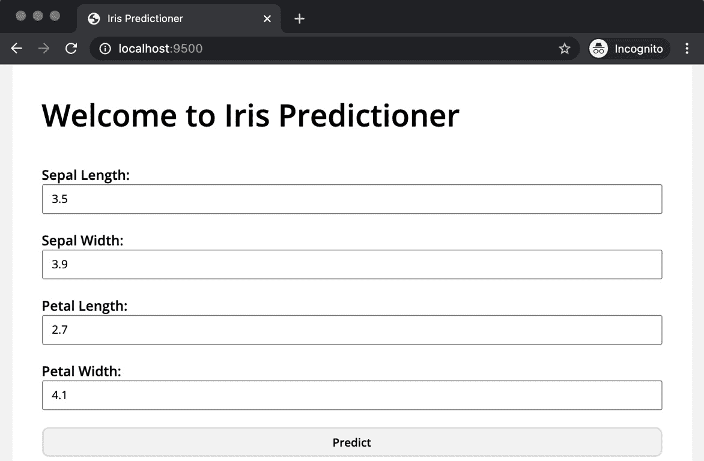

# *第九章*：在生产中使用部署的 TPOT 模型

您已经到达了最后一章——恭喜！到目前为止，您通过解决分类和回归任务学习了 TPOT 的基础知识，了解了 TPOT 如何与 Dask 和神经网络协同工作，以及如何在本地和云端部署机器学习模型。

本章将作为甜点，因为您将学习如何与您的部署模型进行通信，以构建即使是 5 岁的孩子也能使用的东西。更具体地说，您将学习如何通过笔记本环境和简单的 GUI 网页应用程序与您的 API 进行通信。

本章将涵盖以下主题：

+   在笔记本环境中进行预测

+   开发一个简单的 GUI 网页应用程序

+   在 GUI 环境中进行预测

# 技术要求

这是本书的最后一章，因此假设您有一些先验知识。您需要知道如何使用 TPOT 构建基本的机器学习模型以便部署。假设您的模型已部署到在 *第八章**，TPOT 模型部署*中创建的 AWS 虚拟机上。如果不是这种情况，请回顾该章节。

本章将包含大量的代码，如果您遇到困难，可以参考官方 GitHub 仓库：[`github.com/PacktPublishing/Machine-Learning-Automation-with-TPOT/tree/main/Chapter09`](https://github.com/PacktPublishing/Machine-Learning-Automation-with-TPOT/tree/main/Chapter09)。

# 在笔记本环境中进行预测

如果您在上一章之后休息了一天（或几天），那么您与远程虚拟机的连接可能已经结束。因此，您需要重新连接并再次启动 API。有方法可以使您的 API 总是运行，但这超出了本书的范围。此外，如果您已将 `TPOT_Book_KeyPair.pem` 文件移动到其他文件夹，您将需要重置权限：

1.  考虑到这一点，如果您需要重置权限，请仅执行以下片段中的第一个命令行：

    ```py
    > chmod 400 TPOT_Book_KeyPair.pem
    > ssh -i "TPOT_Book_KeyPair.pem" ubuntu@ec2-18-220-113-224.us-east-2.compute.amazonaws.com
    > cd api
    > python3 app.py
    ```

1.  您的 API 正在运行。下一步是打开 JupyterLab 或 Jupyter Notebook 环境，并发出请求。您需要 `requests` 库来完成此操作，以下是导入它的方法：

    ```py
    import requests
    ```

    接下来，让我们声明几个变量。这些变量将保存主机名、端口和端点的值：

    ```py
    HOST ='http://ec2-18-220-113-224.us-east-2.compute.amazonaws.com'
    PORT = '8000'
    ENDPOINT = '/predict'
    ```

    从那里，我们可以轻松地将这三个变量连接成一个，形成一个 URL：

    ```py
    URL = f'{HOST}:{PORT}{ENDPOINT}'
    URL
    ```

    这就是它应该看起来像的样子：

    ![图 9.1 – URL 连接字符串

    ![img/B16954_09_1.jpg]

    图 9.1 – URL 连接字符串

    由于主机名的差异，您的操作可能略有不同。

1.  接下来，我们将声明一个字典，它将作为输入数据。它将与通过 Postman 发送的上一章中的数据相同。以下是代码片段：

    ```py
    in_data = {
        'SepalLength': 0.4,
        'SepalWidth': 3.1,
        'PetalLength': 0.1,
        'PetalWidth': 14
    }
    ```

    这就是我们需要进行请求的所有内容。让我们接下来这么做。

1.  你可以使用 `requests` 包中的 `post()` 函数来发送 POST 请求。需要两个参数——URL 和 JSON 格式的数据：

    ```py
    req = requests.post(url=URL, json=in_data)
    req
    ```

    结果将在以下图中显示：

    ```py
    response = req.content
    response
    ```

    这就是响应的外观：

    图 9.3 – API 响应作为字符串

    ![图片 B16954_09_3.jpg]

    图 9.3 – API 响应作为字符串

    如你所见，预测成功返回了，但默认情况下不是所需的格式。

1.  要改变这一点，你需要将响应字符串转换为 JSON 对象。你可以使用 `json` 包中的 `loads()` 函数来完成此操作：

    ```py
    import json
    response_json = json.loads(response)
    response_json
    ```

    这里是结果：

    ![图 9.4 – API 响应作为 JSON 对象]

    ![图片 B16954_09_4.jpg]

    图 9.4 – API 响应作为 JSON 对象

1.  你可以像访问普通字典对象一样访问预测的类别（或任何其他属性）。以下是一个示例：

    ```py
    response_json['Prediction']
    ```

    这是返回的内容：

![图 9.5 – API 预测类别]

![图片 B16954_09_5.jpg]

图 9.5 – API 预测类别

这基本上就是你可以使用 Python 从部署的 REST API 获取预测的方法！在下一节中，你将围绕这个 API 构建一个基本的交互式网络应用程序，使其对任何人来说都极其简单易用。

# 开发一个简单的 GUI 网络应用程序

本节旨在展示如何使用 `Flask` 框架开发一个简单的网络应用程序。重点转向构建一个捕获表单数据的应用程序，然后将其传递到我们部署的机器学习 API：

1.  首先，创建以下目录结构：![图 9.6 – 网络应用程序目录结构]

    ![图片 B16954_09_6.jpg]

    图 9.6 – 网络应用程序目录结构

    大部分逻辑都在 `app.py` 中处理，而 `templates` 文件夹用于存储应用中的 HTML 文件——稍后我会详细介绍这一点。

1.  这次我们将更好地组织代码，因此你需要创建一个额外的文件来存储环境变量。在根目录 (`webapp`) 中创建一个名为 `.env` 的文件——并填充以下内容：

    ```py
    SECRET_KEY=SecretKey
    HOST=0.0.0.0
    PORT=9000
    API_ENDPOINT=http://ec2-18-220-113-224.us-east-2.compute.amazonaws.com:8000/predict
    ```

    创建这样的单独文件被认为是开发任何类型的网络应用程序的最佳实践。

    要使用这些环境变量，你需要在虚拟环境中安装一个额外的包：

    ```py
    > pip install python-dotenv
    ```

1.  现在我们来构建应用程序的基本结构。打开 `app.py` 文件并编写以下代码：

    ```py
    import os
    from flask import Flask, render_template
    from dotenv import load_dotenv
    load_dotenv('.env')
    app = Flask(__name__)
    @app.route('/')
    def index():
        return render_template('index.html')
    if __name__ == '__main__':
        app.run(host=os.getenv('HOST'), port=os.getenv('PORT'))
    ```

    如果你现在运行应用程序，你不会得到错误，但屏幕上不会显示任何内容。原因是简单的——我们还没有处理 `index.html` 文件。在我们这样做之前，让我们讨论代码中唯一可能不熟悉的部分：`render_template()` 函数。简单地说，这个函数将显示一个 HTML 文件，而不是显示函数返回的字符串或值。有一种方法可以传递参数，但稍后再说。

1.  接下来是 `index.html`——以下是你可以粘贴到文件中的代码：

    ```py
    <!DOCTYPE html>
    <html lang="en">
    <head>
        <meta charset="UTF-8">
        <meta http-equiv="X-UA-Compatible" content="IE=edge">
        <meta name="viewport" content="width=device-width, initial-scale=1.0">
        <title>Iris Predictioner</title>
    </head>
    <body>
        <h1>Welcome to Iris Predictioner</h1>
    </body>
    </html>
    ```

    如果你之前没有写过一行 HTML，不要担心——它是一种简单的标记语言。把这里看到的一切都当作样板。我们感兴趣的是`<body></body>`标签内的内容。

    如果你现在运行你的应用程序，它看起来会是这样：

    

    图 9.7 – 爱尔兰预测应用程序（v1）

    这是一个简单且极其无聊的 Web 应用程序，但至少它工作了。

1.  如前所述，我们的 Web 应用程序必须以某种方式处理表单数据，因此让我们开始工作。有一个专门的包用于处理`Flask`中的表单数据，称为`Flask-WTF`。以下是安装它的方法：

    ```py
    forms.py file in the root directory – /webapp/forms.py. Let's take a look at the code this file contains and explain it:

    ```

    from flask_wtf import FlaskForm

    from wtforms import FloatField, SubmitField

    from wtforms.validators import DataRequired

    class IrisForm(FlaskForm):

    sepal_length = FloatField(

    label='花瓣长度', 验证器=[DataRequired()]

    )

    sepal_width = FloatField(

    label='花瓣宽度', 验证器=[DataRequired()]

    )

    petal_length = FloatField(

    label='花瓣长度', 验证器=[DataRequired()]

    )

    petal_width = FloatField(

    label='花瓣宽度', 验证器=[DataRequired()]

    )

    submit = SubmitField(label='预测')

    ```py

    Okay, so what's going on in this file? Put simply, `Flask-WTF` allows us to declare forms for `Flask` applications easily, in a class format. We can use any of the built-in field types and validators. For this simple example, we'll only need float and submit fields (for flower measurements and the submit button). Validation-wise, we only want that no fields are left blank.That's all you need to do, and `Flask` will take care of the rest.
    ```

1.  接下来是`app.py`。需要做一些更改：

    +   `Flask-WTF`表单需要一个配置好的密钥才能工作。你可以通过访问`.env`文件来添加它。你声明的值完全是任意的。

    +   我们现在的索引路由需要允许 POST 和 GET 方法，因为它将处理表单。在`index()`函数内部，你将需要实例化之前编写的`IrisForm`类，并在点击提交按钮且没有验证错误时返回相关结果。

        你可以使用`validate_on_submit()`函数进行检查。如果检查通过，输入数据将以标题格式返回（我们稍后会看到如何显示预测）。如果没有通过，则返回`index.html`模板。

    +   现在调用`render_template()`时，会传递一个参数到我们的 HTML 文件——`iris_form`。这给了 HTML 文件访问表单数据的能力。你将在下一分钟看到如何处理它。

        这就是更改后你的文件应有的样子：

        ```py
        import os
        from flask import Flask, render_template
        from forms import IrisForm
        from dotenv import load_dotenv
        load_dotenv('.env')
        app = Flask(__name__)
        app.config['SECRET_KEY'] = os.getenv('SECRET_KEY')
        @app.route('/', methods=['GET', 'POST'])
        def index():
            iris_form = IrisForm()
            if iris_form.validate_on_submit():
                return f'''
                        <h3>
                            Sepal Length: {iris_form.sepal_length.data}<br>
                            Sepal Width: {iris_form.sepal_width.data}<br>
                            Petal Length: {iris_form.petal_length.data}<br>
                            Petal Width: {iris_form.petal_width.data}
                        </h3>
                    '''
            return render_template('index.html', iris_form=iris_form)
        if __name__ == '__main__':
            app.run(host=os.getenv('HOST'), port=os.getenv('PORT'))
        ```

        我们几乎完成了。让我们接下来调整`index.html`文件。

1.  `index.html`是你需要调整以使应用程序工作的最后一个文件。我们需要的只是显示之前声明的字段的表单。同时，保护你的应用程序免受**跨站请求伪造**（**CSRF**）攻击也是强制性的。为此，你必须在表单字段之前放置一个令牌。

    这就是 HTML 文件应有的样子：

    ```py
    <!DOCTYPE html>
    <html lang="en">
    <head>
        <meta charset="UTF-8">
        <meta http-equiv="X-UA-Compatible" content="IE=edge">
        <meta name="viewport" content="width=device-width, initial-scale=1.0">
        <title>Iris Predictioner</title>
    </head>
    <body>
        <h1>Welcome to Iris Predictioner</h1>
        <form method="POST" action="{{ url_for('index') }}">
            {{ iris_form.csrf_token }}
            {{ iris_form.sepal_length.label }} {{ iris_form.sepal_length(size=18) }}
            <br>
            {{ iris_form.sepal_width.label }} {{ iris_form.sepal_width(size=18) }}
            <br>
            {{ iris_form.petal_length.label }} {{ iris_form.petal_length(size=18) }}
            <br>
            {{ iris_form.petal_width.label }} {{ iris_form.petal_width(size=18) }}
            <br>
            <input type="submit" value="Predict">
        </form>
    </body>
    </html>
    ```

    如你所见，要访问从 Python 文件发送的参数，你必须用双大括号包围代码。

1.  如果你现在启动应用程序，屏幕上会显示以下内容：


图 9.8 – 爱尔兰预测应用程序

这就是你的机器学习应用的前端！它有点丑陋，但我们稍后会对其进行美化。让我们先测试一下功能。

我们不希望表单在任何一个输入值都为空的情况下被提交。如果立即按下按钮，会发生以下情况：


图 9.9 – 爱尔兰预测应用表单验证（1）

验证测试 1 – 完成。让我们看看如果只有一个输入字段为空会发生什么：


图 9.10 – 爱尔兰预测应用表单验证（2）

发生了同样的消息，正如你所期望的那样。为了总结，如果任何一个输入字段为空，表单将无法提交。

要继续，填写所有字段，如图所示：


图 9.11 – 爱尔兰预测应用表单值

如果你现在点击按钮，你会看到以下结果：


图 9.12 – 爱尔兰预测应用结果

到目前为止，一切正常，但在将应用连接到我们的爱尔兰预测 API 之前，我们还需要做一步——美化。这一步是可选的，因为如果你决定立即跳到 API 连接部分，应用仍然可以工作。

为你的 Flask 应用设置适当的样式需要一点工作和重构。你可以在这里找到整个步骤列表。请注意，这本书假设没有 HTML 和 CSS 知识。你可以自由地复制粘贴这些文件的内容，但鼓励你自己进一步探索：

1.  让我们从 `app.py` 开始。我们不会返回一个包含打印为单个长字符串的输入值的 `H2` 标签，而是返回一个将显示表格的 HTML 模板。现在，我们只填写输入数据，并为预测和预测概率设置假值。

    这里是更改后的文件应该看起来是什么样子：

    ```py
    import os
    from flask import Flask, render_template
    from forms import IrisForm
    from dotenv import load_dotenv
    load_dotenv('.env')
    app = Flask(__name__)
    app.config['SECRET_KEY'] = os.getenv('SECRET_KEY')
    @app.route('/', methods=['GET', 'POST'])
    def index():
        iris_form = IrisForm()
        if iris_form.validate_on_submit():
            return render_template(
                'predicted.html',
                sepal_length=iris_form.sepal_length.data,
                sepal_width=iris_form.sepal_width.data,
                petal_length=iris_form.petal_length.data,
                petal_width=iris_form.petal_width.data,
                prediction='Prediction',
                probability=100000
            )
        return render_template('index.html', iris_form=iris_form)
    if __name__ == '__main__':
        app.run(host=os.getenv('HOST'), port=os.getenv('PORT'))
    ```

1.  让我们在做这件事的同时创建一个模板文件。在 `/templates` 目录下创建一个 `predicted.html` 文件。如前所述，这个文件将包含一个显示 API 响应的表格（一旦我们实现它）。

    这里是文件应该看起来是什么样子：

    ```py
    <!DOCTYPE html>
    <html lang="en">
    <head>
        <meta charset="UTF-8">
        <meta http-equiv="X-UA-Compatible" content="IE=edge">
        <meta name="viewport" content="width=device-width, initial-scale=1.0">
        <link rel="stylesheet" href="{{ url_for('static', filename='css/main.css') }}">
        <title>Iris Predictioner</title>
    </head>
    <body>
        <div class="container">
            <h1>Predictions:</h1>
            <table>
                <thead>
                  <tr><th>Attribute</th><th>Value</th></tr>
                </thead>
                <tbody>
                  <tr><td>Sepal Length</td><td>{{ sepal_length }}</td></tr>
                  <tr><td>Sepal Width</td><td>{{ sepal_width }}</td></tr>
                  <tr><td>Petal Length</td>td>{{ petal_length }}</td></tr>
                  <tr><td>Petal Width</td><td>{{ petal_width }}</td></tr>
                  <tr><td>Prediction</td><td>{{ prediction }}</td></tr>
                  <tr><td>Probability</td><td>{{ probability }}</td></tr>
                </tbody>
            </table>
        </div>
    </body>
    </html>
    ```

    如你所见，我们已经利用了参数传递的强大功能来显示数据在预测模型中的进出。如果你对文档头中 CSS 文件链接的问题感到好奇——现在不用担心。在处理 CSS 之前，我们还需要处理一件事。

1.  最后，让我们重新格式化 `index.html`。这个文件只需要进行一些小的更改——几个 CSS 类和几个 `div` 元素。以下是重新格式化版本的整个代码片段：

    ```py
    <!DOCTYPE html>
    <html lang="en">
    <head>
        <meta charset="UTF-8">
        <meta http-equiv="X-UA-Compatible" content="IE=edge">
        <meta name="viewport" content="width=device-width, initial-scale=1.0">
        <link rel="stylesheet" href="{{ url_for('static', filename='css/main.css') }}">
        <title>Iris Predictioner</title>
    </head>
    <body>
        <div class="container">
            <h1>Welcome to Iris Predictioner</h1>
            <form method="POST" action="{{ url_for('index') }}">
                {{ iris_form.csrf_token }}
                <div class="single-input">
                    {{ iris_form.sepal_length.label }} {{ iris_form.sepal_length(size=18) }}
                </div>
                <div class="single-input">
                    {{ iris_form.sepal_width.label }} {{ iris_form.sepal_width(size=18) }}
                </div>
                <div class="single-input">
                    {{ iris_form.petal_length.label }} {{ iris_form.petal_length(size=18) }}
                </div>
                <div class="single-input">
                    {{ iris_form.petal_width.label }} {{ iris_form.petal_width(size=18) }}
                </div>
                <input class="btn-submit" type="submit" value="Predict">
            </form>
        </div>
    </body>
    </html>
    ```

1.  我们几乎完成了。到目前为止，你已经重构了所有需要重构的文件，现在你将创建一个额外的文件夹和文件。在根目录下，创建一个名为`static`的文件夹。创建后，在它里面创建一个名为`css`的额外文件夹。这个文件夹将包含我们应用程序的所有样式。在`css`文件夹中，创建一个名为`main.css`的文件。

    总结一下，创建这些文件夹和文件后，你的目录结构应该如下所示：

    

    ```py
    @import url('https://fonts.googleapis.com/css2?family=Open+Sans:wght@400;600&display=swap');
    * { margin: 0; padding: 0; box-sizing: border-box;
        font-family: 'Open Sans', sans-serif; }
    body { background-color: #f2f2f2; }
    .container { width: 800px; height: 100vh; margin: 0 auto;
        background-color: #ffffff; padding: 0 35px; }
    .container > h1 { padding: 35px 0; font-size: 36px;
        font-weight: 600; }
    .single-input { display: flex; flex-direction: column;
        margin-bottom: 20px; }
    .single-input label { font-weight: 600; }
    .single-input label::after { content: ":" }
    .single-input input { height: 35px; line-height: 35px;
        padding-left: 10px; }
    .btn-submit { width: 100%; height: 35px;
        background-color: #f2f2f2; font-weight: 600;
        cursor: pointer; border: 2px solid #dddddd;
        border-radius: 8px; }
    table { font-size: 18px; width: 100%; text-align: left; }
    ```

    完成了。让我们运行应用程序，看看现在的样子。

1.  如果你现在重新运行应用程序，你会看到样式开始生效。以下图示显示了输入表单的外观：


图 9.14 – 样式化的 Iris 预测应用程序

应用程序现在远非完美，但至少已经是一个可展示的形式。让我们按照以下图示来完善它：


图 9.15 – 样式化的 Iris 预测应用程序（2）

最后，让我们点击**预测**按钮，看看另一页的样子：


图 9.16 – Iris 预测应用程序预测

在样式方面，我们可以到此为止。应用程序现在看起来相当不错，但你也可以自由地进一步调整它。

由此，你就可以看到如何构建和样式化一个围绕机器学习模型构建的`Flask`应用程序。下一节将连接我们的 API，使应用程序完全可用。在那里见。

# 在 GUI 环境中进行预测

欢迎来到本书的最后一部分。本节将把我们的简单 Web 应用程序与已部署的机器学习 API 联系起来。这非常类似于生产环境，其中你部署了一个或多个机器学习模型，而应用程序开发团队希望将其用于他们的应用程序。唯一的区别是，你既是数据科学团队也是应用程序开发团队。

再次强调，我们还需要对应用程序结构进行一些修改：

1.  让我们从简单的部分开始。在根目录下，创建一个名为`predictor.py`的 Python 文件。这个文件将包含一个函数，该函数实现了本章开头在笔记本环境中进行预测时讨论的逻辑。

    简而言之，这个函数必须向 API 发送 POST 请求，并以 JSON 格式返回响应。

    这是文件中的整个代码片段：

    ```py
    import os
    import json
    import requests
    from dotenv import load_dotenv
    load_dotenv('.env')
    def predict(sepal_length, sepal_width, petal_length, petal_width):
        URL = os.getenv('API_ENDPOINT')
        req = requests.post(
            url=URL,
            json={
                'SepalLength': sepal_length,
                'SepalWidth': sepal_width,
                'PetalLength': petal_length,
                'PetalWidth': petal_width
            }
        )
        response = json.loads(req.content)
        return response
    ```

    请记住，URL 参数的值在你的机器上可能会有所不同，所以请相应地更改它。

    没有必要进一步解释这个代码片段，因为它几乎与你之前看到和编写的代码相同。

1.  现在我们对 `app.py` 进行一些修改。我们将在输入字段验证后立即导入此文件并调用 `predict()` 函数。一旦返回响应，其值将作为参数传递给 `return` 语句的相应字段。

    这是 `app.py` 文件的整个代码片段：

    ```py
    import os
    import numpy as np
    from flask import Flask, render_template
    from forms import IrisForm
    from predictor import predict
    from dotenv import load_dotenv
    load_dotenv('.env')
    app = Flask(__name__)
    app.config['SECRET_KEY'] = os.getenv('SECRET_KEY')
    @app.route('/', methods=['GET', 'POST'])
    def index():
        iris_form = IrisForm()
        if iris_form.validate_on_submit():
            pred_response = predict(
                sepal_length=iris_form.sepal_length.data,
                sepal_width=iris_form.sepal_width.data,
                petal_length=iris_form.petal_length.data,
                petal_width=iris_form.petal_width.data
            )
            return render_template(
                'predicted.html',
                sepal_length=pred_response['In_PetalLength'],
                sepal_width=pred_response['In_PetalWidth'],
                petal_length=pred_response['In_SepalLength'],
                petal_width=pred_response['In_SepalWidth'],
                prediction=pred_response['Prediction'],
                probability=f"{np.round((pred_response['Probability'] * 100), 2)}%"
            )
        return render_template('index.html', iris_form=iris_form)
    if __name__ == '__main__':
        app.run(host=os.getenv('HOST'), port=os.getenv('PORT'))
    ```

    如您所见，预测概率被转换为百分比并四舍五入到小数点后两位。这样做的原因只是为了在应用程序中输出更美观的格式。

1.  现在是时候进行有趣的测试了。打开应用程序，在表单中输入一些数据。以下是一个示例：



图 9.17 – 爱尔兰预测应用程序最终测试

一旦你点击了**预测**按钮，你将在屏幕上看到以下结果：


图 9.18 – 爱尔兰预测应用程序最终结果

到此为止，你就有了一个基于部署的机器学习模型的完整且完全工作的 GUI Web 应用程序。

不包括随后的摘要，这是本章的最后一部分，也是整本书的结尾。你现在知道如何部署机器学习模型并在部署的模型周围构建简单的 Web 应用程序。恭喜！

# 摘要

本章属于实践性很强的章节，但我希望你已经设法跟上了。如果你做到了，你已经学到了很多——从如何在笔记本环境中进行预测到在简单和自定义构建的 Web 应用程序中进行预测。

不仅如此，你还完成了整本书。恭喜！在这九个章节中，你学到了很多。我们从机器学习的基础，通过基本的回归和分类示例开始，然后逐渐构建我们对 TPOT 的知识。你还学习了 TPOT 如何与并行训练和神经网络一起工作。但可能你获得的最重要的新技能是模型部署。没有它，你的模型就毫无用处，因为没有人可以使用它们来创造价值。

和往常一样，你可以自由探索 TPOT 以及它提供的所有惊人的功能。这本书应该为你提供一个很好的起点，因为它只用了几百页就带你从零开始构建围绕部署的自动化机器学习模型的 Web 应用程序。这确实值得骄傲！

# 问答

1.  你可以使用哪个 Python 库向部署的 REST API 发送请求？

1.  在发送 POST 请求时，数据以什么格式提供？

1.  命名用于构建和操作表单的 Flask 扩展。

1.  如果我们谈论的是进入机器学习模型的数据，为什么验证 Web 应用程序表单很重要？

1.  你可以通过 Flask 将参数传递给 HTML 模板文件吗？如果是这样，你如何在 HTML 中显示它们的值？

1.  解释将 CSS 文件链接到 Flask 应用程序的过程。

1.  解释为什么将机器学习模型闲置在您的电脑上是没有意义的。
