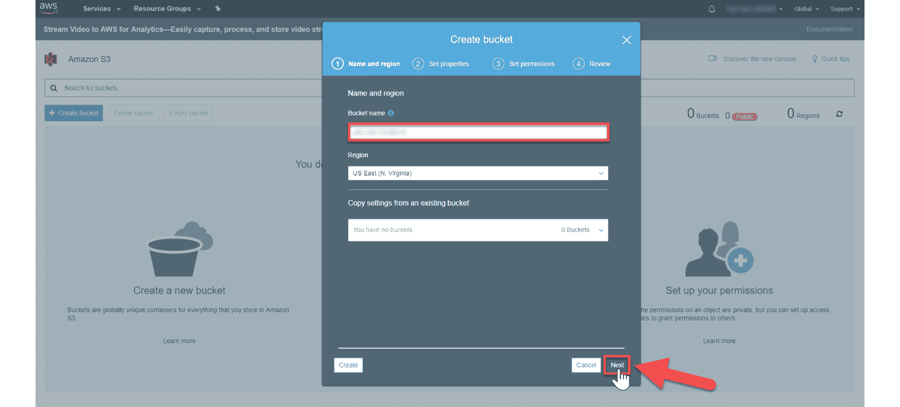
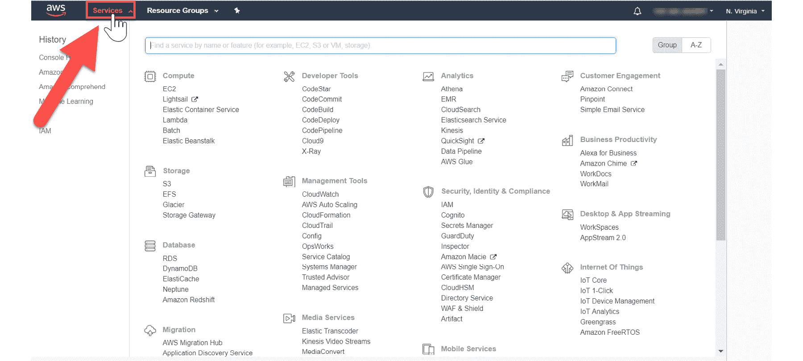

1

# 亚马逊网络服务的简介

## 学习目标

到本章结束时，你将能够：

+   描述使用亚马逊 S3 在 AWS 上工作的基础知识

+   使用 AWS 管理控制台和命令行界面（CLI）从亚马逊 S3 导入和导出数据

+   使用 AWS 管理控制台

+   识别机器学习服务

本章描述了使用 AWS 管理控制台操作 S3 以及识别机器学习服务。

## 简介

本章将向您介绍**亚马逊网络服务（AWS）**界面，并教会您如何使用**亚马逊简单存储（S3）**存储和检索数据。

接下来，您将通过管理控制台和**命令行界面（CLI）**导入和导出文本数据来应用您的 S3 知识。

最后，你将学习如何定位和测试**人工智能（AI）**，

**机器学习（ML）**服务。

## 什么是 AWS？

AWS 是一个安全的云平台，通过互联网上的云服务平台提供按需计算能力、数据库存储、应用程序和其他 IT 资源，采用按使用付费的定价模式。截至 2018 年，根据 Canalys（https://www.canalys.com/static/press_release/2018/270418-cloud-infrastructure-market-grows-47-q1-2018-despite-underuse.pdf）的数据，AWS 在全球云基础设施服务市场中占据主导地位，市场份额约为 30%，相比之下，微软（约 15%）和谷歌（约 5%）位居其后。

### 什么是机器学习？

机器学习是计算机科学领域人工智能的一个子集，通常使用统计技术来提供计算机在没有编程的情况下通过数据学习的能力。机器学习探索构建和构建算法，这些算法可以从数据中学习并做出预测。这些算法超越了静态指令，并使用从样本输入中得到的模型进行数据驱动的预测和决策。

在当今世界，机器学习是必不可少的，因为它是所有行业竞争和运营数据策略的一个组成部分。更具体地说，机器学习允许从**自然语言处理（NLP）**中获得见解来驱动聊天机器人；在金融行业中使用欺诈检测机器学习见解，以及机器学习应用允许高效的在线推荐引擎，例如 Facebook 上的朋友建议、Netflix 显示你可能喜欢的电影，以及亚马逊上更多需要考虑的项目。

### 什么是人工智能？

人工智能是机器表现出的智能；更具体地说，任何感知其环境并采取行动以增加成功实现其目标机会的设备。当代的例子包括理解人类语言、在最高水平的战略游戏中竞争（如国际象棋和围棋），以及自动驾驶汽车。

人工智能很重要，因为它为现有产品增加了智能。目前使用的产品将借助人工智能功能进一步改进，例如，Siri 被添加到新一代苹果产品中。会话聊天机器人可以与大量数据结合，以改善家庭和办公室的技术。

总体而言，本章将为您提供 AWS 的基础知识，以在项目中构建复杂的 AI 和 ML 应用程序。这将帮助您识别免费层 AWS 服务，从而您将能够单独使用它们，或将它们集成以分析数据、构建会话聊天机器人、存储和处理大量数据，并将您的想法变为现实。

本章将向您介绍 AWS 接口，并帮助您学习如何使用 **Amazon Simple Storage Service (S3**) 存储和检索数据。您将通过通过 AWS 管理控制台和 CLI 导入和导出文本数据来应用您的 S3 知识。您还将学习如何定位和测试人工智能和机器学习服务。

## 什么是 Amazon S3？

**S3** 是一种在线云对象存储和检索服务。Amazon S3 是一种云对象存储。与数据关联服务器不同，S3 存储独立于服务器，可以通过互联网访问。存储在 S3 中的数据使用可通过互联网访问的 **应用程序编程接口** (**API**) 作为对象进行管理（HTTPS）。

使用 S3 的好处如下：

+   Amazon S3 在最大的全球云基础设施上运行，以提供 99.99% 的耐用性。

+   它提供了最广泛的数据传输选项。

+   它允许您在不将数据移动到单独的分析系统的情况下运行大数据分析。

+   它支持安全标准和合规证书。

+   它提供了一套灵活的存储管理和行政功能。

    #### 注意

    更多信息请参阅：[`aws.amazon.com/s3/`](https://aws.amazon.com/s3/)。

### 为什么使用 S3？

**S3** 是存储和检索您文件的地方。它适用于存储静态内容，如文本文件、图像、音频文件、视频文件等。例如，如果网站仅由 HTML 和图像组成，S3 可以用作静态网站服务器。网站可以连接到 FTP 客户端以提供静态文件。此外，S3 还可以用于存储用户生成的图像和文本文件。

然而，它最重要的两个应用如下：

+   要存储来自网页或移动应用的静态数据

+   要实现大数据分析

它可以很容易地与额外的 AWS 机器学习和基础设施服务结合使用。例如，导入到 Amazon S3 的文本文档可以通过在 AWS Lambda 函数中运行的代码进行总结，该函数使用 AWS Comprehend 进行分析。我们将在第 *2* 章“使用 NLP 概述文本文档”和第 *3* 章“执行主题建模和主题提取”中介绍这两者。

### 使用 S3 在 AWS 上的基础知识

访问 S3 的第一步是创建一个 AWS 免费层账户，该账户提供对 AWS 管理控制台的访问。AWS 管理控制台是一个网络应用程序，提供了一种访问所有 AWS 强大存储和 ML/AI 服务的方法。

第二步是了解访问级别。AWS 定义了**身份和访问管理（IAM）**。用于访问 IAM 的电子邮件/密码相同。

### AWS 免费层账户

AWS 提供了一个免费层账户（在其各自的免费使用条款内），其中包含的一项存储服务是*Amazon Simple Storage*（*S3*）。因此，您可以通过测试服务来优化您的 ML 和 AI 工作流程，在做出大额投资之前最大限度地节约成本并减少错误。

### 将数据导入和导出到 S3

AWS 导入和导出是一项服务，您可以使用它将大量数据从物理存储设备传输到 AWS。您将便携式存储设备邮寄到 AWS，AWS 导入/导出通过 Amazon 的高速内部网络直接从您的存储设备传输数据。您的数据加载通常在您的存储设备到达 AWS 后的下一个工作日开始。数据导出或导入完成后，服务将返回您的存储设备。对于大型数据集，AWS 数据传输可以比互联网传输快得多，并且比升级您的连接更经济。

### S3 与文件系统的不同之处

S3 用于存储几乎任何类型的文件，因此，它可能会与传统文件系统相似而造成混淆。然而，S3 在几个方面与传统文件系统有所不同。总的来说，传统文件系统中的文件夹在 S3 中是**存储桶**；传统文件系统中的一个文件在 S3 中是一个**对象**。S3 使用对象，因为您可以在存储桶中存储任何数据类型（即，不仅仅是文件）。

另一个不同之处在于对象的访问方式。存储在存储桶中的对象可以通过网络服务端点（例如，例如，Chrome、Firefox 等网页浏览器）访问，因此每个对象都需要一个全局唯一的名称。对象的名称限制与创建新网站时选择 URL 的限制类似。显然，您需要根据相同的逻辑选择一个唯一的 URL，就像您的房子有一个唯一的地址一样。

例如，如果您创建了一个名为`myBucket`的存储桶（具有公共权限设置）并将一个名为`pos_sentiment__leaves_of_grass.txt`的文本文件上传到存储桶，那么该对象可以通过相应的子域通过网页浏览器访问。

## 核心 S3 概念

S3 的层次结构包括以下概念：

**可存储的数据类型**：S3 推荐用于存储静态内容，如文本文件、图像、音频、视频等。

**对象**：对象是存储在 S3 中最基本的实体。每个对象都包含数据、元数据和键。元数据是关于数据的数据，提供了关于存储在对象中的数据的基本信息。元数据存储在一组名称-值对中，用于描述与对象相关的信息。

**键**：键是分配给对象的名称，它唯一地标识了存储在存储桶内的对象。存储桶中的所有对象都关联有一个键。

**存储桶**：就像文件夹一样，存储桶是存储对象的容器。存储桶在根级别创建，没有文件系统层次结构。更具体地说，你可以有多个存储桶，但不能在存储桶内创建子存储桶。存储桶是对象的容器，你可以控制（在存储桶中创建、删除和列出对象）对其的访问，查看其访问日志，并选择亚马逊 S3 将存储存储桶的地理位置。

**区域**：区域指的是亚马逊 S3 根据用户偏好存储存储桶的地理位置。区域可以在创建存储桶时选择。位置应该基于数据将被访问最多的地方。总的来说，如果 S3 用于存储仅在一个特定地理区域内访问的网站文件，则特定区域选择对 S3 的影响最大。具有不同形式的存储桶中的对象存储如下：


###### 图 1.1：对象存储

![图 1.2：对象存储：使用唯一键和 myBucket

![img/image003.jpg]

###### 图 1.2：使用唯一键和 myBucket 的对象存储

![图 1.3：存储在 myBucket 中的对象

![img/image005.jpg]

###### 图 1.3：存储在 myBucket 中的对象

### S3 操作

S3 应用程序程序接口（API）相当简单，并为相应的实体包括以下操作：

+   **存储桶**：在存储桶中创建、删除和列出键

+   **对象**：写入、读取和删除

## 数据复制

亚马逊在亚马逊数据中心的多台服务器上跨区域复制数据。数据复制的优点包括高可用性和持久性。更具体地说，当你创建一个新的对象到 S3 时，数据会被保存在 S3 中；然而，这个更改需要被复制到亚马逊 S3 的所有区域。总的来说，复制可能需要一些时间，你可能会注意到由于各种复制机制导致的延迟。请在执行指示的操作时考虑以下事项。

删除对象后，复制可能会造成延迟，允许已删除的数据在完全复制删除之前显示。由于复制延迟，创建对象并立即尝试在对象列表中显示它可能会延迟。

### REST 接口

S3 的本地界面是**表示状态传输** **(REST)** API。建议始终使用 HTTPS 请求执行任何 S3 操作。我们将使用以下两个高级接口与 S3 交互：AWS 管理控制台和 AWS **命令行界面** (**CLI**)。使用 API 访问对象非常简单，包括以下针对相应实体的操作：

+   Bucket 中的键

+   **对象**：写入、读取或删除

### 练习 1：使用 AWS 管理控制台创建 S3 Bucket

在这个练习中，我们将把一个文本文件导入到我们的 S3 Bucket 中。要导入文件，您需要能够访问 Amazon S3 控制台：

1.  在点击 https://console.aws.amazon.com/console/home 时按住 *Ctrl* 键，在新浏览器标签页中打开 AWS 管理控制台。

1.  在 AWS 服务下方的搜索栏中点击：

    ###### 图 1.4：搜索 AWS 服务

1.  在搜索栏中输入`S3`，将显示一个自动填充的列表。然后，点击**S3 云可扩展存储**下拉选项：

    ###### 图 1.5：选择 S3 服务

1.  现在，我们需要创建一个 S3 Bucket。在 S3 仪表板中，点击

    **创建 Bucket**按钮。

1.  如果这是您第一次创建 bucket，您的屏幕将如下所示：

    ###### 图 1.6：创建 Bucket

    #### 注意

    如果您已经创建了 S3 Bucket，您的仪表板将列出您创建的所有 Bucket。

1.  **输入一个唯一的 Bucket 名称**：Bucket 名称必须在 Amazon S3 中所有现有 Bucket 名称中是唯一的。如果您遇到命名问题，请参阅 https://docs.aws.amazon.com/AmazonS3/latest/dev/BucketRestrictions.html。

1.  **区域**：如果默认区域自动填充，则保持默认位置。如果未自动填充，请选择靠近您当前位置的区域。

1.  点击**下一步**按钮继续创建 bucket：

    ###### 图 1.7：创建 Bucket 窗口

1.  S3 Bucket 提供了版本控制、服务器访问日志、标签、对象级日志和默认加密等属性选项。然而，我们将不会启用它们。

1.  您的 Bucket 将显示在 bucket 列表中，如下所示：


###### 图 1.8：Bucket 已创建

### 练习 2：使用您的 S3 Bucket 导入和导出文件

在这个练习中，我们将使用 S3 Bucket 导入和导出文件。以下是为完成这些步骤：

**导入文件：**

1.  您将导入一个文件到您的 Amazon S3 Bucket。

1.  点击 Bucket 的名称以导航到 Bucket：

    ###### 图 1.9：导航到 Bucket

1.  您正在 Bucket 的主页。选择**上传**：

    ###### 图 1.10：将文件上传到 Bucket

1.  要选择上传的文件，点击`pos_sentiment__leaves_of_grass.txt`位置并选择您想要存储的样本文件：![img/image021.jpg]

    ###### 图 1.11：向 Bucket 添加新文件

1.  选择要上传的文件后，选择**下一步**：

    ###### 图 1.12：选择要上传到 Bucket 的文件

1.  点击**下一步**按钮并保留默认选项![img/image025.jpg]

    ###### 图 1.13：上传文件时的默认选项页面

1.  您可以为您的对象设置属性设置，例如`存储类别`、`加密`和`元数据`。但是，保留默认值不变，然后点击**下一步**按钮：

    ###### 图 1.14：设置属性

1.  点击**上传**按钮上传文件：![图 1.15：上传文件选项

    ![img/image029.jpg]

    ###### 图 1.15：上传文件

1.  您将被引导到 Bucket 主屏幕中的对象：

![图 1.16：Bucket 中上传的文件

![img/image031.jpg]

###### 图 1.16：上传到 Bucket 的文件

**导出文件**：

1.  选择要导出的文件旁边的复选框（*红标记#1 - 请参阅以下截图*）。这将填充文件信息显示屏幕。点击**下载**（*红标记#2 - 请参阅以下截图*）以检索文本文件：

    ###### 图 1.17：导出文件

1.  文件将下载，如屏幕左下角所示：


###### 图 1.18：下载文件以导出

## AWS 命令行界面（CLI）

CLI 是基于 AWS SDK for Python（Boto）构建的开源工具，用于执行设置、确定调用是否按预期工作、验证状态信息等。CLI 为所有 AWS 服务提供了另一个访问工具，包括 S3。与控制台不同，CLI 可以通过脚本进行自动化。

要验证您的 AWS 账户到 CLI，您必须创建一个配置文件以获取您的公钥和私钥。接下来，您将安装并配置 AWS CLI。

### 练习 3：配置命令行界面

在这个练习中，我们将使用各自的 AWS 访问密钥 ID 和 AWS 秘密访问密钥配置 CLI。以下为完成步骤：

1.  前往：https://console.aws.amazon.com/console/home，然后点击**用户**：

    ###### 图 1.19：带有用户选项高亮的亚马逊控制台主页

1.  在已登录的 AWS 管理控制台右上角，点击**我的安全凭证**：![img/image039.jpg]

    ###### 图 1.20：选择我的安全凭证

1.  然后，点击**继续到安全凭证**：

    ###### 图 1.21：安全凭证

1.  点击**访问密钥**（**访问密钥 ID 和密钥访问密钥**）选项：

    ###### 图 1.22：访问密钥生成

1.  然后，点击**创建新访问密钥**：

    ###### 图 1.23：创建新访问密钥

1.  点击**下载密钥文件**以下载密钥文件：

    ###### 图 1.24：下载密钥文件

1.  包含密钥的`rootkey.csv`将被下载。点击它以查看详细信息：

    ###### 图 1.25：下载的密钥文件

1.  将密钥存储在安全的位置。保护您的 AWS 账户，并且永远不要在非安全位置共享、通过电子邮件或存储密钥。AWS 代表永远不会请求您的密钥，因此在处理潜在的钓鱼诈骗时要保持警惕。

1.  打开命令提示符并输入`aws configure`：

1.  您将被提示输入四个输入变量，依次输入您相应的信息，然后在每个输入后按*Enter*键：

    `AWS 访问密钥 ID`

    `AWS 密钥访问密钥`

    `默认区域`

    `默认输出格式`（json）

1.  名称是在您的控制台中获得的（此处显示为**N. Virginia**，但您的名称由您的唯一位置决定）：

    ###### 图 1.26：位置搜索

1.  代码是从以下**可用区域**列表中获得的：

    ###### 图 1.27：可用区域列表

1.  命令提示符的最终输入变量将如下所示。然后，按*Enter*键：


###### 图 1.28：在命令提示符中配置 AWS CLI 的最后一步

## 命令行界面（CLI）使用方法

使用命令时，至少指定一个路径参数。两个路径参数是 LocalPath 和 S3Uri：

**LocalPath**：这代表本地文件或目录的路径，可以写成绝对路径或相对路径。

`s3://myBucketName/myKey`。路径参数必须以`s3://`开头，以指示路径参数指的是 S3 对象。

整个命令结构是`aws s3 <Command> [<Arg> …]`。以下表格显示了不同的命令，包括描述和示例：


###### 图 1.29：命令列表

## 递归和参数

逐个导入文件很耗时，尤其是如果您有一个文件夹中有很多文件需要导入。一个简单的解决方案是使用递归过程。递归过程是指能够调用自身的过程，这样您作为用户就可以避免为每个文件输入相同的导入命令。

执行递归 CLI 命令需要向 API 传递一个参数。这听起来很复杂，但实际上非常简单。首先，参数只是一个名称或选项，它被传递给程序以影响接收程序的运行。在我们的例子中，参数是 **recursive**，执行递归命令的整个命令如下：

```py
aws s3 cp s3://myBucket . --recursive
```

使用命令，将相应 Bucket 中的所有 s3 对象复制到指定的目录：


###### 图 1.30：参数列表

### 活动 1：使用 CLI 将数据导入和导出到 S3

在这个活动中，我们将使用 CLI 在 S3 中创建一个 Bucket 并导入第二个文本文件。假设你是一位企业家，你正在创建一个聊天机器人。你已经确定了包含能够让你的聊天机器人更有效地与客户互动的内容的文本文件。在文本文件可以被解析之前，它们需要上传到 S3 Bucket。一旦它们在 S3 中，就可以进行进一步的分析。为了确保这一过程正确完成，你需要安装 Python，设置好环境，并使用 CLI 进行用户认证：

1.  配置命令行界面并验证它是否能够成功连接到您的 AWS 环境。

1.  创建一个新的 S3 Bucket。

1.  将文本文件导入到 Bucket 中。

1.  从 Bucket 中导出文件并验证导出的对象。

    #### 注意

    要查看详细步骤，请参阅本书末尾的附录 A，第 192 页的 *附录 A*。

## 使用 AWS 控制台识别机器学习服务

AWS 控制台提供了一个基于 Web 的界面，用于导航、发现和利用 AWS 服务的 AI 和 ML。在本主题中，我们将探讨两种使用控制台搜索机器学习服务的方法。此外，我们将使用从网站检索的文本数据测试一个 ML API。

### 练习 4：导航 AWS 管理控制台

在这个练习中，我们将导航 AWS 管理控制台以定位机器学习服务。从控制台 https://console.aws.amazon.com/console/ 开始，仅使用控制台搜索功能，导航到 Amazon Lex https://console.aws.amazon.com/lex/ 服务信息页面：

1.  点击 https://console.aws.amazon.com/console/ 以导航到 AWS 控制台。然后，点击 **服务**：

    ###### 图 1.31：AWS 控制台

1.  滚动页面以查看所有机器学习服务。然后，点击 **Amazon Lex**：

    ###### 图 1.32：机器学习选项

1.  您将被重定向到 Amazon Lex 主屏幕：


###### 图 1.33：Amazon Lex 主屏幕

定位新的 AWS 服务是发现更多工具以解决您的数据项目解决方案的关键技能。现在，让我们回顾另一种通过 **搜索栏** 定位机器学习资源的方法。

### 活动二：测试 Amazon Comprehend 的 API 功能

在这个活动中，我们将通过在 API 探索器中使用部分文本文件输入来显示文本分析输出。探索 API 是一种技能，通过确保输出符合项目所需格式来节省开发时间。因此，我们将测试 Comprehend 的文本分析功能。

假设你是一位正在创建聊天机器人的企业家。你已经确定了一个商业主题和相应的文本文档，这些文档将使聊天机器人使你的业务成功。你的下一步是识别/验证一个 AWS 服务来解析文本文档以进行情感、语言、关键词和实体的分析。在投入时间编写完整的程序之前，你希望通过 AWS 管理控制台的用户界面测试 AWS 服务的功能。为了确保这一点，你需要在网上搜索一篇（用英语或西班牙语撰写）包含你感兴趣的主题（体育、电影、时事等）的文章。AWS 管理控制台也可以通过根用户账户访问。

你知道探索 API 是一种技能，可以通过确保输出符合项目所需格式来节省开发时间。以下为完成步骤：

1.  通过 AWS 管理控制台识别一个 AWS 服务，以实现你的目标。

1.  导航到你的网页，其中包含英语和西班牙语的文章。

1.  复制用英语或西班牙语撰写的文章中的文本，以识别以下特征：情感、语言、关键词和实体。

1.  获得代表文章的分数：情感、语言、关键词和实体。

    #### 注意

    要参考详细步骤，请参阅本书末尾的附录 A，第 194 页。

## 摘要

在本章的开头，我们解释了什么是亚马逊网络服务（Amazon Web Services）、什么是机器学习以及什么是人工智能。随后，你学习了什么是亚马逊 S3 以及为什么使用亚马逊 S3。你还探索了使用 S3 与 AWS 一起工作的基本要求。有了这些，你使用了 IAM（身份和访问管理）。

接下来，你学习了如何将数据导入和导出到 S3。随后，你探索了 S3 的组件。同时，你了解了 REST 接口。在本章的最后部分，我们探讨了 AWS 命令行及其用法。最后，我们探讨了递归和参数的概念，以及如何使用 AWS 控制台来识别机器学习服务。

在下一章中，你将学习如何使用自然语言处理（NLP）来总结文本文档。研究新的 AWS 服务对于发现解决你正在工作的任何机器学习问题的额外解决方案至关重要。
