2

# 第二章：摘要

使用 NLP 处理文本文档

## 学习目标

到本章结束时，你将能够：

+   使用 Amazon Comprehend 检查文本，以确定其主要语言

+   从一组文档中提取信息，如实体（人或地点）、关键词（指示内容的名词短语）、情感倾向和主题

+   设置 Lambda 函数以使用 Comprehend 处理和分析导入的文本

本章描述了使用 Amazon Comprehend 概括文本文档以及创建 Lambda 函数来分析文本的方法。

## 简介

Amazon Comprehend 服务不断从 Amazon.com 的产品描述和消费者评论中学习新数据，因此，它持续提高理解各种主题（如政府、健康、媒体、教育、广告等）的能力。总体而言，Amazon Comprehend 可以分析一组文本文档，并可以根据主题组织文章，识别最常提到的特征，并根据主题对文章进行分组，以便为网站访客提供个性化推荐。

在本章的第一部分，你学习了如何使用 Amazon Comprehend 通过从文档内容中使用**自然语言处理（NLP）**来提取见解。现在，你将学习如何使用 Amazon Comprehend API 通过识别文档中的语言、实体、关键词、情感和主题来产生见解。这将使你能够理解基于深度学习的 NLP，以构建更复杂的应用程序，我们将在第二天进行。

在本章的第二部分，你将了解 AWS Lambda，以及如何将此服务与 Amazon Comprehend 集成。你还将集成数据库，为构建可扩展的 NLP 处理应用程序提供基础。

## 什么是自然语言处理？

Amazon Comprehend 是一种自然语言处理（NLP）服务。NLP 服务的总体目标是使机器理解我们的口语和书面语言。虚拟助手，如 Alexa 或 Siri，使用 NLP 从输入数据中产生见解。输入数据由一种语言结构化，该语言具有独特的语法、句法和词汇。因此，处理文本数据需要首先识别语言，然后应用后续规则来识别文档的信息。NLP 的通用任务是捕获这些信息作为数值表示。通用任务进一步具体化为特定任务，例如识别语言、实体、关键词、情感倾向和主题。

Amazon Comprehend 处理任何 UTF-8 格式的文本文件。它使用预训练的模型来检查文档或文档集，以便收集关于文档集的见解。Amazon 持续训练模型，因此无需提供训练数据。

## 使用 Amazon Comprehend 检查文本并确定主要语言

Amazon Comprehend 用于从各种主题（健康、媒体、电信、教育、政府等）和文本数据中的语言中获取见解。因此，分析文本数据并利用更复杂的功能（如主题、实体和情感分析）的第一步是确定主导语言。确定主导语言确保了更深入分析的正确性。

为了检查文本以确定主要语言，有两种操作（`DetectDominantLanguage` 和 `BatchDetectDominantLanguage`）。

`DetectDominantLanguage` 接受至少 20 个字符长度的 `UTF-8` 文本字符串，并且必须包含少于 5,000 个 UTF-8 编码字符。`BatchDetectDominantLanguage` 接受字符串数组作为列表。该列表可以包含最多 25 个文档。每个文档应至少有 20 个字符，并且必须包含少于 5,000 个 UTF-8 编码字符。

响应包括使用双字母代码识别的语言。以下表格显示了不同国家的语言代码：

#### 注意

查看 https://docs.aws.amazon.com/comprehend/latest/dg/how-languages.html 以获取支持语言的最新列表。

![图 2.1：Amazon Comprehend – 支持的语言

![img/image0011.jpg]

###### 图 2.1：Amazon Comprehend 支持的语言

反应还包括一个分数，表示 Amazon Comprehend 对特定语言是文档中的主导语言的确定性水平（见以下截图）。语言分数与其他分数独立，因此反应不提供文档中由特定语言表示的百分比：

![图 2.2：主导语言分数置信度输出

![img/image002.jpg]

###### 图 2.2：主导语言分数置信度输出

### 练习 5：使用命令行界面在文本文档中检测主导语言

在这个练习中，你将学习如何使用 `detectDominantLanguage` 函数检测 Comprehend。以下步骤描述了如何检测主导语言：

#### 注意

源代码可通过 GitHub 上的存储库获取：https://github.com/TrainingByPackt/Machine-Learning-with-AWS/blob/master/lesson2/topic_a/detect_dominant_languages.py。

1.  首先，我们必须导入 Python 的 AWS SDK（boto3）http://boto3.readthedocs.io/en/latest/：

    ```py
    import boto3 	
    ```

1.  然后，导入 JSON 模块以序列化 JSON https://docs.python.org/3.6/library/json.html：

    ```py
    import json 	
    ```

1.  将 `<`输入区域`>` 替换为您的唯一区域（例如，`us-east-1`）。以下实例化一个新的 Comprehend 客户端：

    ```py
    comprehend = boto3.client(service_name='comprehend', region_name='<input region>')	
    ```

1.  接下来，我们将英语和西班牙语字符串分配给 Comprehend 进行分析：

    ```py
    english_string = 'Machine Learning is fascinating.'
    spanish_string = 'El aprendizaje automático es fascinante.'
    ```

1.  接下来，我们打印一个字符串来指示我们的脚本即将执行的相关变量：

    ```py
    print('Calling DetectDominantLanguage')
    print('english_string result:')
    ```

1.  最后，使用`engligh_string`和`spanish_string`变量调用 Comprehend 的`detect_dominant_language`方法 https://docs.aws.amazon.com/comprehend/latest/dg/API_DetectDominantLanguage.html 。`json.dumps()`将 JSON 数据写入终端中的 Python 字符串：

    ```py
    print(json.dumps(comprehend.detect_dominant_language(Text = english_string), sort_keys=True, indent=4))
    ```

1.  将更改保存到文件中。如果尚未打开，请打开命令提示符并激活您的虚拟环境。

1.  导航到`detect_dominant_languages.py`的位置。在命令提示符中输入`python detect_dominant_languages.py`。执行此命令将生成以下输出（见以下截图）：

    如预期的那样，`english_text`字符串被识别为英语（使用"`en`"语言代码），置信度分数为 ~0.99（见以下输出）。

    如预期的那样，`spanish_text` 字符串被识别为西班牙语（使用 "`es`" 语言代码），置信度分数为 ~0.99（见以下输出）：

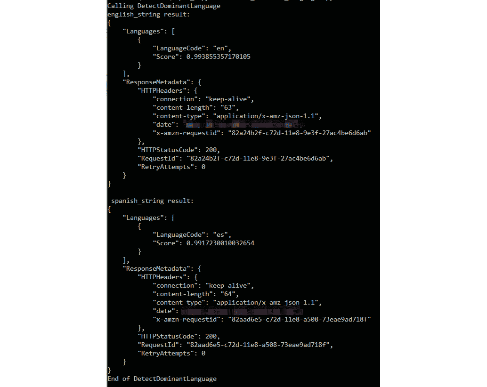

###### 图 2.3：检测主导语言输出 – 英语和西班牙语

### 练习 6：使用命令行界面（CLI）检测多份文档中的主导语言

在这个练习中，你将学习如何检测 Comprehend 的`detectDominantLanguage`操作对多份文档。以下步骤描述了如何检测主导语言：

#### 注意

源代码可通过 GitHub 上的存储库获取：https://github.com/TrainingByPackt/Machine-Learning-with-AWS/blob/master/lesson2/topic_a/batch_detect_dominant_languages.py。

1.  首先，我们导入 Python 的 AWS SDK（boto3） http://boto3.readthedocs.io/en/latest/：

    ```py
    import boto3 	
    ```

1.  然后，我们导入 JSON 模块以序列化 JSON https://docs.python.org/3.6/library/json.html ：

    ```py
    import json 	
    ```

1.  将 `<`输入区域`>` 替换为您的唯一区域（例如，`us-east-1`）。以下实例化了新的 Comprehend 客户端：

    ```py
    comprehend = boto3.client(service_name='comprehend', region_name='<input region>')	
    ```

1.  接下来，分配一个包含英语和西班牙语字符串的列表，由 Comprehend 进行分析：

    `english_string_list` = ['机器学习令人着迷.', '学习人工智能是我的热情。']

    `spanish_string_list` = ['自动学习令人着迷.', '学习人工智能是我的热情。']

1.  最后，我们使用`engligh_string_list`和`spanish_string_list`变量调用 Comprehend 的"`batch_detect_dominant_language`"方法 https://docs.aws.amazon.com/comprehend/latest/dg/API_DetectDominantLanguage.html。然后，`json.dumps()`将 JSON 数据写入终端中的 Python 字符串：

    ```py
    print(json.dumps(comprehend.batch_detect_dominant_language(Text = english_string_list), sort_keys=True, indent=4))
    ```

需要记住的重要概念是 Comprehend 能够检测不同的语言，并且可以接受文本输入作为单个字符串或批量格式作为

一系列字符串。

在本章中，我们回顾了 Comprehend 的`DetectDominantLanguage`方法的架构，以及如何传入字符串和字符串列表。接下来，我们将从一系列文档中提取实体、短语和情感。

## 从一系列文档中提取信息

在业务层面，了解客户在给虚拟助手发短信时是否愤怒或高兴，以及原因，这对保留客户至关重要。在 NLP 层面，这需要提取更多信息，并使用更复杂的算法。需要提取和量化的附加信息包括 `实体`，`关键词`，`情感倾向` 和 `主题`。

### 命名实体检测 – AWS SDK for Python (boto3)

实体是对现实世界中对象唯一名称的文本引用，例如人、地点、商业物品以及对日期和数量等测量的精确引用。例如，在文本 "Martin lives at 27 Broadway St." 中，**Martin** 可能被检测为 **PERSON**，而 **27 Broadway St** 可能被检测为 **LOCATION**。

实体还有一个分数来表示检测到的实体类型的置信水平。以下表格显示了实体类型和描述的完整列表：


###### 图 2.4：AWS Comprehend 实体类型和描述

### DetectEntites – 输入和输出

DetectEntites 接收一个 `LanguageCode` 和一段文本作为输入，然后提供关于输入文本中每个实体的以下信息：`BeginOffset`，`EndOffset`，`Score`，`Text` 和 `Type`。以下表格显示了 AWS Comprehend DetectEntities 的完整列表，类型和描述：

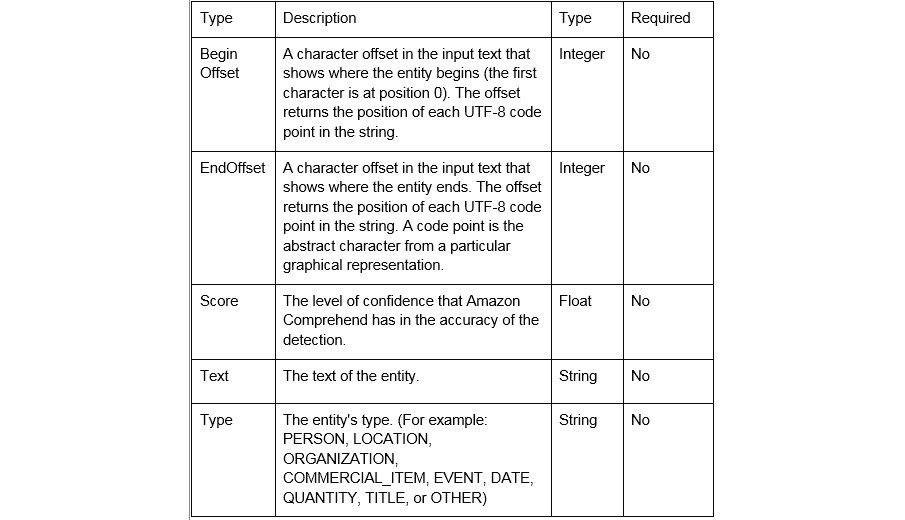

###### ![图 2.5：AWS Comprehend 实体类型和描述### 练习 7：确定文档中的命名实体在这个练习中，我们将确定文档中的命名实体。为此，我们将使用 Amazon Comprehend 的 `DetectEntities` 操作。以下是为检测命名实体所采取的步骤：#### 注意源代码可通过 GitHub 在以下仓库中获取：https://github.com/TrainingByPackt/Machine-Learning-with-AWS/blob/master/lesson2/topic_b/detect_entities.py.1.  导航到 `detect_entities.py` 位置，将 `<input region>` 替换为您的特定区域，并保存文件。    现在，通过以下命令导入 AWS SDK for python (boto3) https://boto3.amazonaws.com/v1/documentation/api/latest/index.html：    ```py    import boto3    ```1.  现在，通过以下命令导入 `JSON` 模块以序列化 `JSON` https://docs.python.org/3.6/library/json.html：    ```py    import json    ```1.  现在，实例化一个新的 Comprehend 客户端：    ```py    comprehend = boto3.client(service_name='comprehend', region_name='<input region>')    ```1.  现在，在实例化一个新的 Comprehend 之后，提供 `english_string = "I study Machine Learning in Seattle on Thursday.":`    ```py    print('Calling DetectEntities')    ```1.  现在，`json.dumps()` 将 JSON 数据写入 Python 字符串：    ```py    print(json.dumps(comprehend.detect_entities(Text = english_string, LanguageCode='en'), sort_keys=True, indent=4))    print('End of DetectEntities\n')    ```1.  通过执行 `detect_entities.py` 命令并使用 `python` 运行代码。前面代码的输出如下截图所示：

###### 图 2.6：AWS Comprehend DetectEntities 输出

由于输入是简单的示例，置信度分数都是 ~0.99。正如预期的那样，**西雅图**被检测为**地点**，而**星期四**被检测为**日期**：

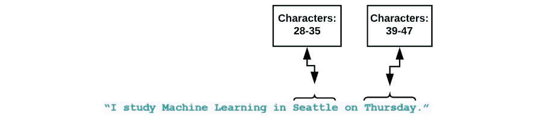

###### 图 2.7：AWS Comprehend BeginOffset 和 EndOffset 检查

### 在一组文档（文本文件）中检测实体

我们现在将从一个文档集（文本文件）中提取实体。导航到 https://github.com/TrainingByPackt/Machine-Learning-with-AWS/blob/master/lesson2/topic_b/detect_entities_from_documents.py 位置，将 `<`input region`>` 替换为您的特定区域，并保存文件。通过执行以下命令运行代码：`python detect_key_phrases.py`：

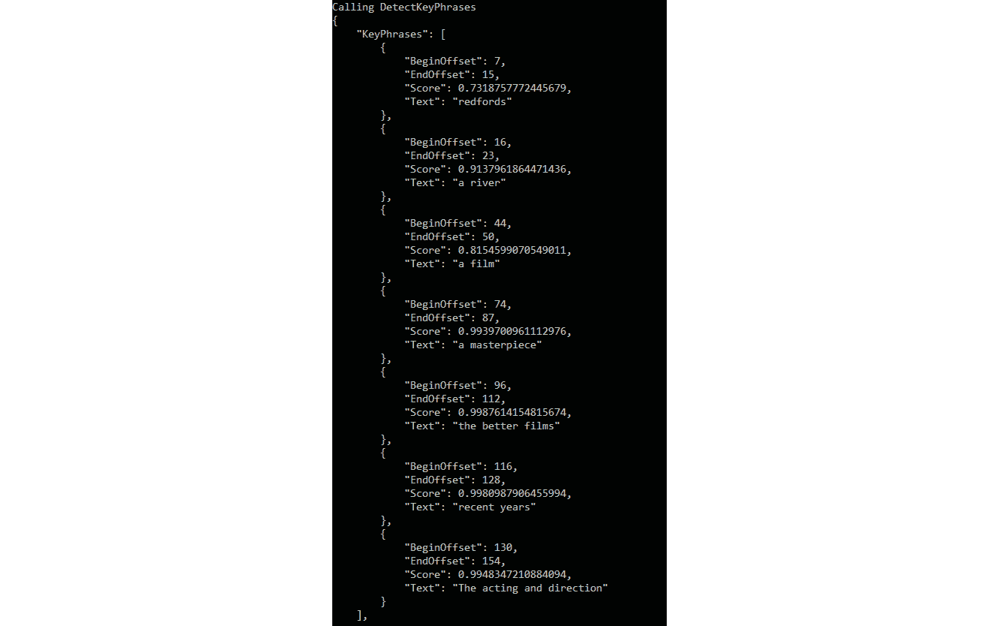

###### 图 2.8：DetectKeyPhrases 输出

### 检测关键短语

对于 AWS 来说，一个关键短语相当于一个名词短语，它代表一个实际事物。在英语中，当我们把代表一个具体想法的不同单词组合在一起时，我们称之为名词短语。例如，"**一台快速的机器**" 是一个名词短语，因为它由 "**一台**"，冠词，"**快速**"，形容词，和 "**机器**"，一个名词组成。AWS 寻找合适的词组组合，并给出分数，表示字符串实际上是一个名词短语的置信度。

### 练习 8：确定关键短语检测。

在这个练习中，我们将确定关键短语检测。为此，我们将使用 Amazon Comprehend 的 `DetectKeyPhrase` 操作。以下是为检测命名实体的步骤：

#### 注意

源代码可通过 GitHub 在以下存储库中获取：https://github.com/TrainingByPackt/Machine-Learning-with-AWS/blob/master/lesson2/topic_b/detect_key_phrases.py。

1.  导航到 `detect_key_phrases.py` 位置，将 `<input region>` 替换为您的特定区域，并保存文件。通过以下命令导入 AWS SDK for python (boto3) http://boto3.readthedocs.io/en/latest/：

    ```py
    import boto3
    ```

1.  现在，导入 JSON 模块以使用以下命令序列化来自 https://docs.python.org/3.6/library/json.html 的 JSON：

    ```py
    import json
    ```

1.  现在，使用以下代码创建一个新的 Comprehend 客户端：

    ```py
    comprehend = boto3.client(service_name='comprehend', region_name='<input region>')
    ```

1.  现在，提供要分析的 **英文** 文本，使用以下代码：

    ```py
    english_string = 'I study Machine Learning in Seattle on Thursday.'
    print('Calling DetectKeyPhrases')
    # json.dumps() writes JSON data to a Python string
    print(json.dumps(comprehend.detect_entities(Text = english_string, LanguageCode='en'), sort_keys=True, indent=4))
    print('End of DetectKeyPhrases\n')
    ```

1.  通过执行以下命令运行代码：`python detect_key_phrases.py`。您将看到以下输出：

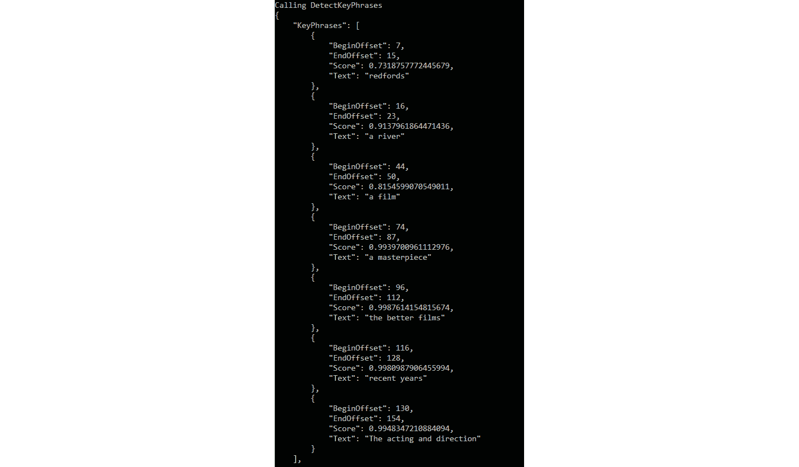

###### 图 2.9：AWS Comprehend DetectKeyPhrases 输出

### 检测情感

Amazon Comprehend 可以用来确定文档的情感。您可以确定情感是积极的、消极的、中性的还是混合的。例如，您可以使用情感分析来确定博客文章的评论情感，以确定您的读者是否喜欢该文章。

### 练习 9：检测情感分析

在这个练习中，我们将确定情感分析。为此，我们将使用 Amazon Comprehend 的`DetectSentiment`操作。以下是检测情感分析的步骤：

#### 注意

源代码可通过以下 GitHub 仓库中的链接获取：https://github.com/TrainingByPackt/Machine-Learning-with-AWS/blob/master/lesson2/topic_b/detect_sentiment.py。

1.  导航到`detect_sentiment.py`位置，将`<`input region`>`替换为您的特定区域，并保存文件。通过以下命令从 http://boto3.readthedocs.io/en/latest/导入 Python 的`AWS SDK`（boto3）：

    ```py
    import boto3
    ```

1.  现在，导入`JSON`模块以使用以下命令序列化来自 https://docs.python.org/3.6/library/json.html 的 JSON：

    ```py
    import json
    ```

1.  现在，使用以下代码实例化一个新的 comprehend 客户端：

    ```py
    comprehend = boto3.client(service_name='comprehend', region_name='<input region>')
    ```

1.  然后，提供要分析的文本字符串，使用以下代码：

    ```py
    english_string = 'Today is my birthday, I am so happy.'
    print('Calling DetectSentiment')
    json.dumps() writes JSON data to a Python string
    print('english_string results:')
    print(json.dumps(comprehend.detect_sentiment(Text = english_string,                                          LanguageCode='en'), 
    sort_keys=True, 
    	indent=4))
    print('End of DetectSentiment\n')
    ```

    通过执行以下命令运行代码：`python detect_seniment.py`。输出如下所示：

![图 2.10：AWS Comprehend – DetectSentiment 输出

![img/image0091.jpg]

###### 图 2.10：AWS Comprehend – DetectSentiment 输出

## 设置 Lambda 函数并使用 Comprehend 分析导入的文本

在这个主题中，我们将集成 AWS Lambda 函数到 Comprehend，这提供了一个更强大、可扩展的基础设施。您可以使用 AWS Lambda 在事件（如 Amazon S3 桶中的数据更改）发生时运行您的代码。

通过对事件执行代码提供了一种开发可扩展软件架构的实用解决方案。总体而言，这增加了我们的数据管道，并提供了处理更复杂的 Big Data 体积和 NLP 操作的能力。

### 什么是 AWS Lambda？

AWS Lambda 是一种无需配置或管理服务器的计算服务。AWS Lambda 仅在需要时执行代码，并自动扩展。AWS Lambda 在高度可用的计算基础设施上运行您的代码，该基础设施执行计算服务的管理。更具体地说，AWS Lambda 执行以下操作：服务器和操作系统维护、容量配置和自动扩展、代码监控和日志记录。

总体而言，Lambda 的目标是创建短小、简单、模块化的代码段，您可以将其组合成更大的处理基础设施。

### AWS Lambda 做什么？

Lambda 允许用户运行小段代码（Java、Node 或 Python）以完成特定任务。这些特定任务可以是存储并执行对 AWS 设置的更改，或者响应 S3 中的事件（我们将在本主题的后面部分探讨这一点）。在 Lambda 之前，您通常需要一个单独的 EC2 服务器来运行整个代码；然而，Lambda 允许代码的小段运行，而无需 EC2。

### Lambda 函数结构

AWS Lambda 提供了两种实现 Python 代码的选项。首先，您可以上传一个完整的 Python 代码文件。其次，您可以使用 Lambda 函数编辑器完全内联，这意味着您可以直接输入和修改代码，而无需将任何文件上传到 AWS。您输入的代码将在 Lambda 函数被调用时执行。第二种选项将允许更容易地进行测试，因此我们将使用它。

让我们检查 Lambda 函数的结构：

+   当您创建一个函数（例如，`s3_trigger`）时，AWS 会创建一个同名文件夹，并在 `Lambda_handler` 函数中包含一个名为 `Lambda_function.py` 的 Python 文件，这是我们的 Lambda 函数的入口点。入口点接受两个参数作为参数：

+   事件参数提供了有效负载的值，该有效负载是从 `调用` 进程发送到函数的。它通常采用 Python `dict` 类型的形式，尽管它也可能是列表、`str`、`int`、`float` 或 `NoneType` 之一。

+   上下文参数是 **LambdaContext** 类型，包含运行时信息。您将在稍后的练习中使用此参数。函数的返回值可以是任何可 JSON 序列化的类型。此值在序列化后返回给调用应用程序。

我们将结合使用 Lambda、S3 和 Amazon Comprehend，以便在文本文档上传到 S3 时自动执行文档分析。Lambda 函数的架构如下：

![图 2.11: 架构图]

![img/image010.jpg]

###### ![图 2.11: 架构图]

### 练习 10：为 S3 设置 Lambda 函数

在这个练习中，我们将集成以下 AWS 服务：S3、Lambda 和 Amazon Comprehend。为了执行此练习，应记住架构。将文件 (`test_s3trigger_configured.txt`) 上传到 S3 并查看 Comprehend 的分析结果。以下是为设置 Lambda 函数的步骤。

**创建 S3 存储桶**

1.  首先，导航到 Amazon S3 服务，https://console.aws.amazon.com/s3/，并点击 **创建存储桶**：![图 2.12: 为 Lambda 触发器创建 S3 存储桶

    ![img/image0111.jpg]

    ###### ![图 2.12: 为 Lambda 触发器创建 S3 存储桶]

1.  对于存储桶名称，键入 `aws-ml-s3-trigger`，然后点击 **创建**：![图 2.13: 创建 S3 存储桶

    ![img/image012.jpg]

    ###### ![图 2.13: 创建 S3 存储桶]

1.  您的 `Bucket` 将被创建，您将被重定向到 **存储桶列表**：![图 2.14: S3 存储桶列表屏幕

    ![img/image0131.jpg]

    ###### ![图 2.14: S3 存储桶列表屏幕]

1.  接下来，导航到 https://console.aws.amazon.com/Lambda/ 并点击 **创建函数**：![图 2.15: AWS Lambda 主屏幕。

    ![img/image014.jpg]

    ###### ![图 2.15: AWS Lambda 主屏幕。

1.  从选项中选择从头开始创建作者。对于名称，`type s3_trigger`：![图 2.16: AWS Lambda – 使用“从头开始创建作者”选择创建函数

    ![img/image0151.jpg]

    ###### 图 2.16：AWS Lambda – 使用“从头开始创建”选项创建函数

1.  对于运行时选项，从列表中选择`Python 3.6`：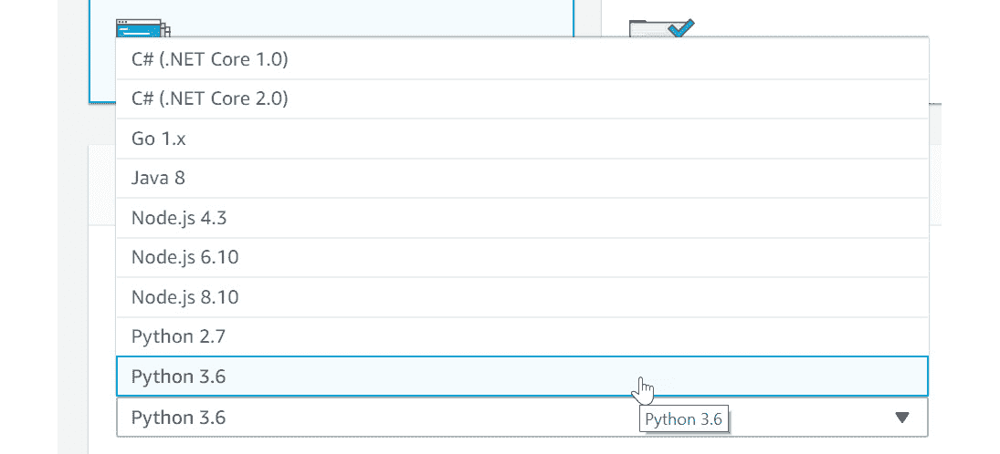

    ###### 图 2.17：AWS Lambda – Python 3.6 选择

1.  对于角色字段，在角色名称字段中选择`s3TriggerRole`。然后，点击 AWS 中的`Lambda 函数`：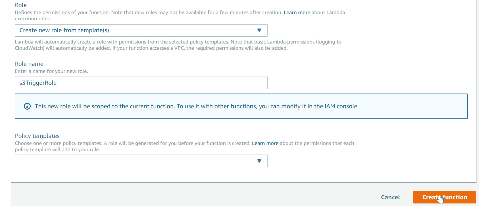

    ###### 图 2.18：AWS Lambda – 创建函数屏幕

1.  然后，点击**策略模板**下的下拉菜单：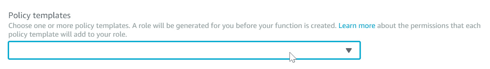

    ###### 图 2.19：策略模板选择下拉菜单

1.  选择**Amazon S3**对象的只读权限：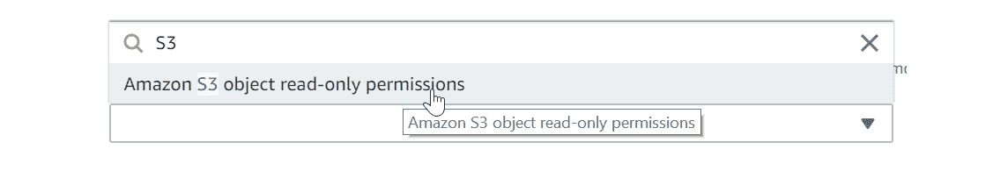

    ###### 图 2.20：Amazon S3 对象只读权限选择

1.  然后，点击`Lambda 函数`：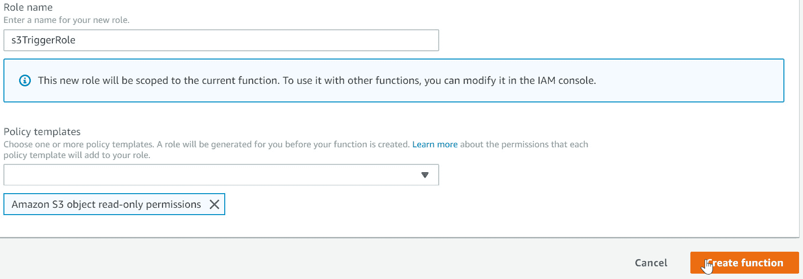

    ###### 图 2.21：点击创建函数

    #### 注意

    如果你收到`NoSuchEntity`错误，这是当 Amazon 为`s3_trigger`创建服务角色时出现的临时警告。AWS 在“角色”标题下有关于可能临时问题的参考。这不会影响你继续本章的能力。刷新你的屏幕，几分钟后警告信息应该会消失。

1.  当`Logs`服务作为函数角色的资源可用时，你会知道问题已经解决：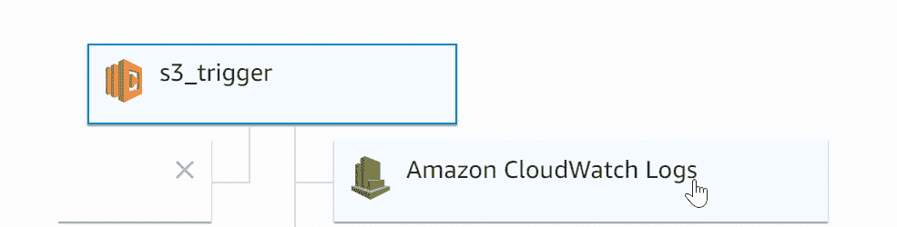

    ###### 图 2.22：Amazon CloudWatch 日志

1.  你应该看到一个配置屏幕，如下所示：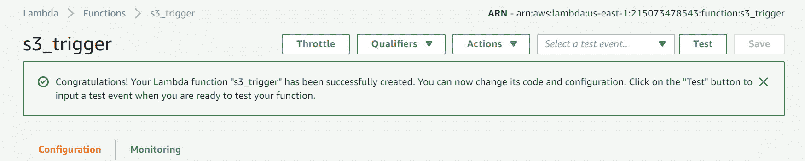

    ###### 图 2.23：AWS Lambda 成功 s3_trigger 验证屏幕

1.  现在，让我们添加 S3 作为触发器。在**添加触发器**下，滚动到 S3：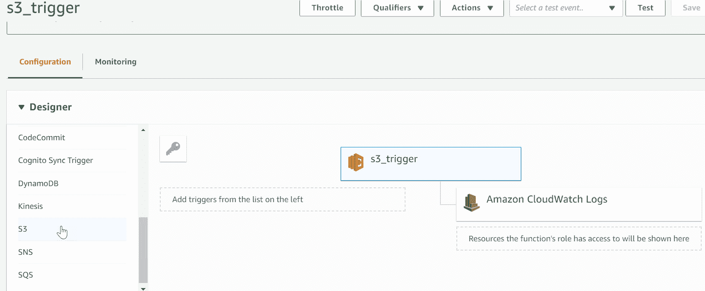

    ###### 图 2.24：AWS Lambda – 添加 S3 作为触发器选择屏幕

1.  点击`S3`，它将自动填充在`s3_trigger`下。点击`S3`后，你的屏幕将如下所示：

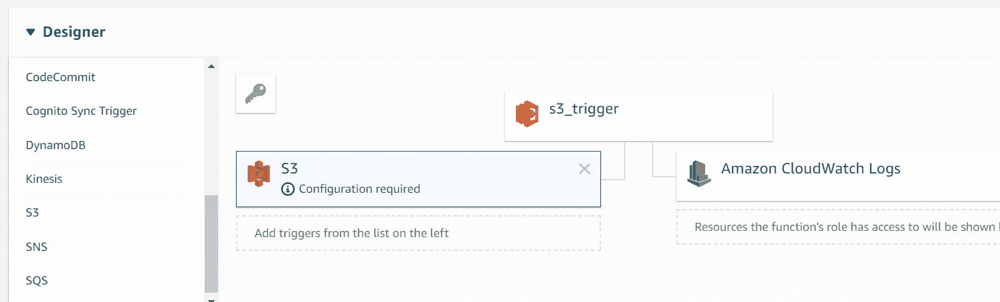

###### 图 2.25：AWS Lambda – S3 触发器选择，需要配置

### 练习 11：配置 S3 存储桶的触发器

在这个练习中，我们将配置前面练习中创建的`Bucket`的触发器。要配置触发器，请按照以下步骤操作：

1.  将屏幕向下滚动到`aws-ml-s3-trigger`的配置触发器部分：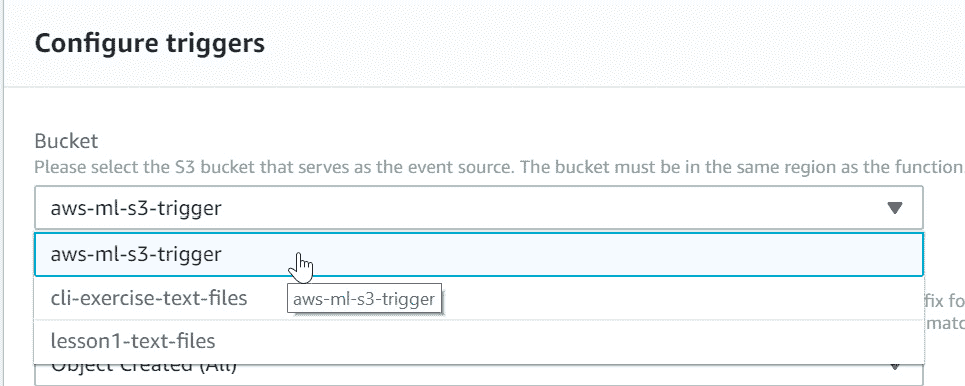

    ###### 图 2.26：AWS Lambda – 配置 S3 触发器，S3 存储桶选择

1.  保持其余默认设置。接下来，将屏幕向下滚动并点击**添加**：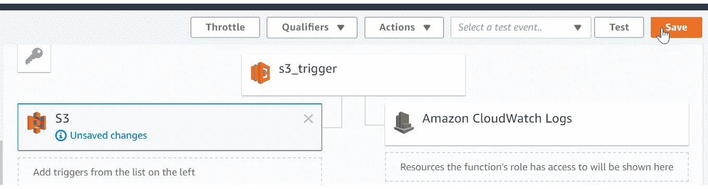

    ###### 图 2.27：AWS Lambda – 将 S3 存储桶添加为触发器

1.  下一步是点击**保存**按钮：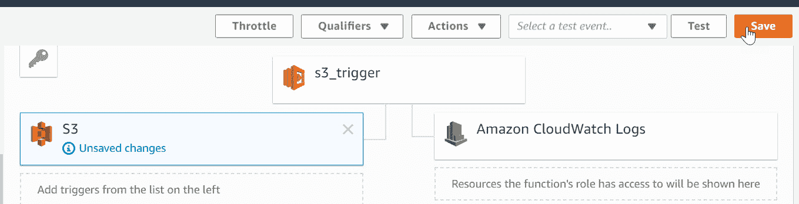

    ###### AWS Lambda – 保存 S3 触发器

1.  接下来，将屏幕向下滚动到**函数代码**部分。默认代码将与以下代码相同或类似：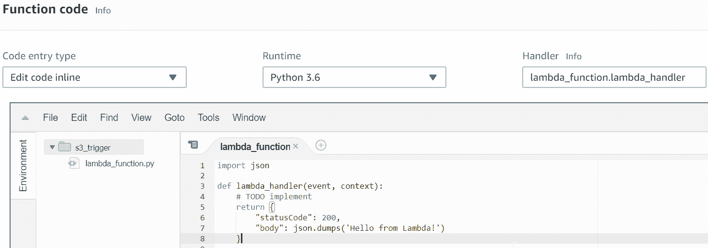

    ###### 图 2.28：AWS Lambda 默认 Lambda_function 屏幕

    在这里，我们可以在 Lambda 函数屏幕内完全输入和编辑我们的代码（只要代码输入类型设置为“编辑内联代码”，这是下拉菜单中的默认值）。

    #### 注意

    对于这一步，你可以跟随操作并输入代码，或者从 https://github.com/TrainingByPackt/Machine-Learning-with-AWS/blob/master/lesson2/topic_c/s3_trigger.py 文件中的源代码文件夹获取代码。

1.  首先，我们导入 Python 的**AWS SDK**（boto3）http://boto3.readthedocs.io/en/latest/：

    ```py
    import boto3
    ```

1.  接下来，创建一个接受两个参数-事件和上下文的函数：

    ```py
    def Lambda_handler(event, context):
    ```

1.  接下来，创建 s3 客户端对象：

    ```py
    s3 = boto3.client("s3")
    ```

1.  添加一个`if`事件来检查是否发生事件。

1.  接下来，将`<input Bucket name>`替换为你创建的 Bucket（在我的例子中是`aws-ml-s3-trigger`）：

    ```py
    Bucket = "<input Bucket name>"
    ```

1.  接下来，首先访问事件`Records`的第一个索引以获取文本文件对象：

    ```py
    text_file_obj = event["Records"][0]
    ```

1.  接下来，将文本`filename`分配给一个变量，并打印文件名：

    ```py
    filename = str(text_file_obj['s3']['object']['key'])
    print("filename: ", filename)
    ```

1.  接下来，通过获取 Bucket 和 key 来创建文件对象：

    ```py
    file_obj = s3.get_object(Bucket = Bucket, Key = filename)
    ```

1.  将文本分配给`body_str_obj`变量：

    ```py
    body_str_obj = str(file_obj['Body'].read())
    ```

1.  将<`input region name`>替换为你的特定区域。此外，创建 comprehend 变量（在我的例子中是 us-east-1）：

    ```py
    comprehend = boto3.client(service_name="comprehend", region_name='<input region_name>') 
    ```

1.  接下来的三行代码调用相应的 comprehend 函数来检测文本文档中的情感、实体和关键短语。然后，输出打印到控制台：

    ```py
    sentiment_response = comprehend.detect_sentiment(Text = body_str_obj, LanguageCode = "en")
    print("sentiment_response: \n", sentiment_response)
    entity_response = comprehend.detect_entities(Text = body_str_obj, LanguageCode = "en")
    print("\n\nentity_response: \n", entity_response)
    key_phases_response = comprehend.detect_key_phrases(Text = body_str_obj, LanguageCode = "en") 
    print("\n\nkey_phases_response: \n", key_phases_response)
    ```

1.  最后一条语句返回字符串'Hello from Lambda'，如下所示：

    ```py
    return 'Hello from Lambda'
    ```

1.  现在，点击**保存**按钮：

1.  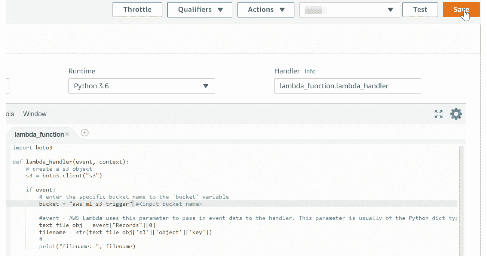

###### 图 2.29：AWS Lambda – 保存屏幕

通过这个练习，`s3_trigger`函数可以访问 S3，但不能访问 Amazon Comprehend。我们需要将策略附加到`S3_trigger`函数上，以便允许它访问 Amazon Comprehend 以执行文本分析函数（`detect_sentiment`、`detect_entities`和`detect_key_phrases`）。

### 练习 12：将策略分配给 S3_trigger 以访问 Comprehend

在这个练习中，我们将策略附加到`S3_trigger`函数上，以便允许它访问 comprehend。分配策略的完成步骤如下：

1.  导航到 https://console.aws.amazon.com/iam 的“身份和访问管理”仪表板：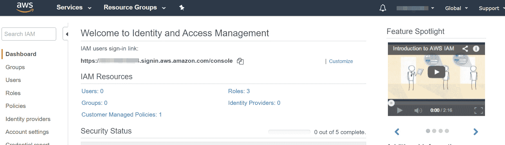

    ###### 图 2.30：IAM 仪表板

1.  现在，一旦你到达 IAM 仪表板，点击**角色**：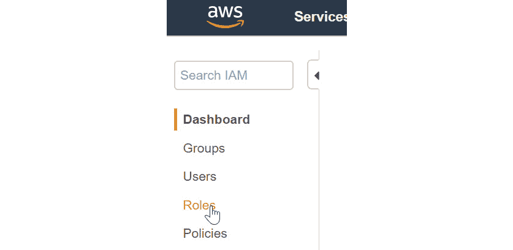

    ###### 图 2.31：IAM 仪表板的左侧

1.  现在，屏幕将填充角色列表。在角色列表中点击`s3TriggerRole`：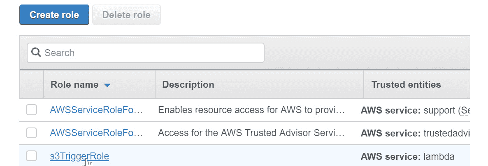

    ###### 图 2.32：角色列表选择 s3TriggerRole

1.  `s3TriggerRole`的选项将被启用。然后，单击**附加策略**：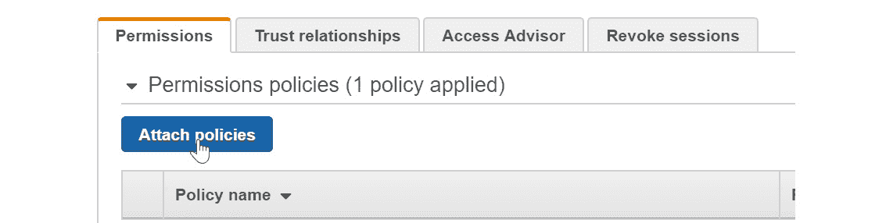

    ###### 图 2.33：s3TriggerRole 的权限选项卡

1.  输入`Comprehend`以过滤策略。然后，点击`ComprehendFullAccess`旁边的复选框：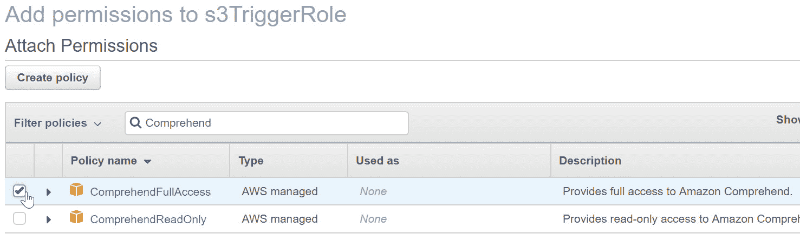

    ###### 图 2.34：ComprehendFullAccess 策略选择

1.  一旦选中复选框，请单击屏幕右下角的**附加策略**：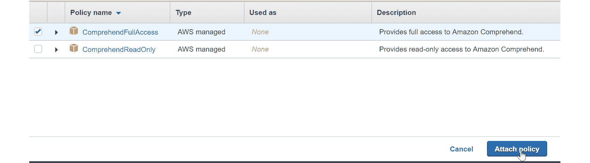

    ###### 图 2.35：附加所选策略

1.  您将被重定向到`s3TriggerRole`屏幕，并且您将收到以下消息：

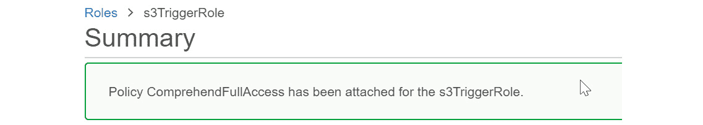

###### 图 2.36：成功附加策略消息

### 活动三：将 Lambda 与 Amazon Comprehend 集成以执行文本分析

在此活动中，我们将 Lambda 函数与 Comprehend 集成，以便在文档上传到 S3 时执行文本分析（检测情感、检测实体和检测关键短语）。

假设你是一位正在创建聊天机器人的企业家。你已经确定了一个商业主题和相应的文本文档，其中包含的内容可以使你的业务成功。你的下一步是将 Lambda 函数与 Comprehend 集成，以进行情感、关键短语和实体的分析。为了确保正确执行，你需要有`test_s3trigger_configured.txt`。在执行`s3_trigger`之前，请考虑以下文本的以下方面的输出：情感（正面、负面或中性）、实体（数量、人物、地点等）和关键短语：

1.  首先，导航到`S3_trigger` Lambda 函数。

1.  将`test_s3trigger_configured.txt`添加到 S3 存储桶中，以验证 Lambda `S3_trigger`函数。

1.  现在，将文件上传到存储桶并监控该文件。

1.  接下来，使用日志流在`CloudWatch`中单击“查看日志”。

1.  现在，以文本格式展开输出。

1.  以下将是输出结果：

    `情感响应` -> 被分类为有 60.0%的可能性是正面

    `情感响应：`

```py
{'Sentiment': 'POSITIVE','SentimentScore':{'Positive': 0.6005121469497681,'Negative': 0.029164031147956848, 'Neutral': 0.3588017225265503, 'Mixed': 0.01152205839753151}, 
```

`实体响应` --> 被分类为有 70.5%的可能性是数量

`实体响应：`

```py
{Entities':[{'Score':0.7053232192993164, 'Type': 'QUANTITY','Text': '3 trigger', 'BeginOffset': 35, 'EndOffset': 44}], 
```

`关键短语响应` -> 被分类为有 89.9%的可能性是“测试文件”和 98.5%的可能性是“s3 触发器”是关键短语：

`关键短语响应：`

```py
 {'KeyPhrases': [{'Score': 0.8986637592315674, 'Text': 'a test file', 'BeginOffset': 8, 'EndOffset': 19}, {'Score': 0.9852105975151062, 'Text': 'the s3 trigger', 'BeginOffset': 30, 'EndOffset': 44}],
```

#### 注意

要了解详细步骤，请参阅本书末尾的附录 A 第 198 页。

## 摘要

在本章中，你学习了如何构建 Comprehend 的`DetectDominantLanguage`方法的结构，以及如何传入字符串和字符串列表。你学习了如何提取实体、情感、关键短语和主题，这些为复杂 NLP 处理提供了数据。这允许 Amazon Comprehend 通过在已上传到 S3 的文本文档上自动进行文本分析，从而变得更加高效。

总体而言，这些独立功能的综合提供了构建基于复杂机器学习的 NLP 应用（例如，Siri、Alexa 等）的基础。了解每个函数如何以及为什么运作，将使你能够构建自己的基于 AWS 的 NLP 应用。

在下一章中，我们将探讨主题建模并执行主题提取。
