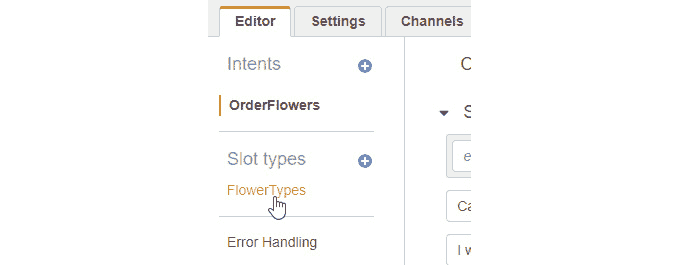

4

# 使用自然语言创建聊天机器人

## 学习目标

到本章结束时，您将能够：

+   定义聊天机器人和聊天机器人设计的基本概念

+   设置 Amazon Lex 服务

+   创建一个自定义聊天机器人来查询不同的股价

本章描述了使用 Amazon Lex 设计聊天机器人的过程。

## 引言

在上一章中，您学习了如何通过**Amazon Comprehend**的主题建模提取和分析常见主题。

在本章中，您将学习如何使用**Amazon Lex**构建聊天机器人。首先，我们将讨论如何设计聊天机器人。然后，我们将通过创建一个示例聊天机器人来深入了解 Amazon Lex 服务。

接下来，我们将创建自己的定制聊天机器人，用于查询披萨订购。最后，您将集成您的聊天机器人，以便通过文本界面与之交互。

## 什么是聊天机器人？

**聊天机器人**是一个使用规则和人工智能推理模拟智能对话的应用程序。与聊天机器人互动时，目标是能够与用户进行对话，以达到解决客户查询或从他们那里提出前进方式的程度。

正如正常对话一样，我们与机器人互动的方式可以是书面文字或语音。通常，聊天机器人会集成到消息平台中，如 Slack、Facebook、Kik、微信等。这也可以集成到自定义的网页或移动界面中。

当然，在现有的消息平台上进行集成更容易，因为用户可能已经熟悉该界面。此外，这些平台为聊天机器人开发者提供基础设施和开发工具的支持。

聊天机器人的例子包括产品订购系统、报告、内部沟通和调度。

### 聊天机器人的商业案例

传统上，我们通过输入设备，如键盘和鼠标与计算机互动。今天，计算能力和效率已经发展到我们可以几乎像与其他人互动一样自然地与计算机进行对话。这些对话由于计算机能够添加上下文信息，并跟踪和记住几次单独交互的上下文而显得更加人性化。

因此，对话界面真正流行开来并不令人惊讶。Gartner 的一项研究估计，到 2020 年，用户进行的 30%的浏览将是不带屏幕的。考虑到人类与计算机之间的所有互动，这是一个巨大的数字。

BI Intelligence 进行的一项研究发现，截至 2015 年第一季度，全球顶级四款消息应用每月活跃用户数量超过了顶级四款社交网络的用户数量，并且没有放缓的迹象。

企业无法忽视这一趋势，他们正在寻找在用户互动（通过文本）最频繁的地方接触用户：如 Facebook、Skype、Slack、WhatsApp 和微信等即时通讯平台，名单还在不断延长。即时通讯平台使用户之间的沟通更加便捷，聊天机器人使用户能够更快地传达他们想要的信息，比与其他人互动更加高效。

在这个主题中，你将了解**自然语言理解**（NLU）。使用这些知识，你将首先探索 AWS Lex 服务并构建你的第一个示例聊天机器人。作为下一步，你将构建一个自定义聊天机器人。

## 什么是自然语言理解？

自然语言处理（NLP）是处理自然语言的一套技术的总称。自然语言理解（NLU）是 NLP 的一个专注于处理实际对话输入的子集。

NLU 能够处理非结构化输入并将其转换为结构化、机器可理解的格式。用户输入的词语被转换成意图和实体，或称为槽位。NLU 聊天机器人还能够从用户输入中推断意图和槽位，这些可能与——但并不完全相同于——它所训练的示例。

### 核心概念概述

在我们开始构建聊天机器人之前，你需要先了解一些概念。现在，我们将探讨“聊天机器人”这一术语的技术含义以及构成聊天机器人并共同为用户提供对话体验的各个组件的名称。

**聊天机器人**

聊天机器人，也称为`bot`，是一种能够使用自然语言与用户进行对话的软件。目标是让用户相信他们可以自由自然地与聊天机器人互动，几乎就像与另一个人交谈一样。

**话语**

用户对聊天机器人说的话被称为**话语**。聊天机器人将用户的话语视为输入，并能够将其解析为机器可识别的格式。以下是一些话语的示例：

+   我想去看牙医。

+   你能告诉我今天的天气怎么样吗？

**意图**

**意图**代表用户根据其话语内容想要执行的动作。聊天机器人根据其内部业务规则或应用程序流程推断意图并支持它，结果可能是其内部状态的变化或执行一个动作。这些通常也会导致向用户提供反馈或信息的响应。

因此，从先前的对话示例中，一个聊天机器人可能会推断出以下意图：

+   我想去看牙医 => SeeDentist

+   你能告诉我今天的天气怎么样吗？ => GetWeather

推断意图是 Lex 这样的 NLU 平台在幕后执行的重要部分。一些训练示例，以用户可能提供的句子形式，被输入到平台中，并从这些示例中构建一个概率模型。这意味着在实践中，平台应该能够从与系统训练的示例相似但不是其一部分的输入中推断出正确的意图。

**提示**

当机器人需要从用户那里获取更多信息或对意图不清楚时，它可以提出后续问题，以收集更多信息。这些被称为**提示**。提示通常用于填写必需的槽位值，尽管您的应用程序逻辑可能尝试填写可选的值，如果您希望的话。

**槽位**

槽位是与意图相关联的信息或参数。该信息可以包含在初始用户请求中，Lex 将能够解析信息并将其正确分配给相应的槽位。如果此信息不是作为请求的一部分提供，那么机器人应该能够单独提示用户提供信息。槽位可以是可选的或必需的。

**槽位**所表示的信息类型称为槽位类型。Lex 中有许多内置槽位类型，代表常见的信息类型，如城市或州。以下是一些 Lex 内置的常见槽位类型的示例：


**槽位**

###### 图 4.1：Lex 内置的槽类型表

当然，这只是示例的一个非常有限的子集。Lex 中还有许多其他内置类型，以及针对不同语言的类型！

#### 备注

您可以参考以下链接以获取内置意图和槽位的完整列表：https://docs.aws.amazon.com/lex/latest/dg/howitworks-builtins.html

大多数内置意图和槽位都作为 Alexa 技能套件文档的一部分进行记录，Lex 有一些差异，这些差异在先前的链接中有记录。请确保将链接添加到书签并经常参考该页面，因为亚马逊不断更新服务，事情可能会发生变化。

如果您希望您的机器人处理的信息类型不是这些内置类型之一，您可以定义自己的类型，以及槽位允许的实际值。您将在我们接下来的练习中看到这是如何工作的。

**履行**

注意，机器人只有在填写了所有必需的槽位值后才能继续下一步操作！当然，这并不适用于可选的槽位值。

当一个意图的所有必需槽位都已填写时，槽位就准备好履行了。在这个阶段，机器人准备好执行履行意图所需的企业逻辑。企业逻辑可以是以下任何一种操作：

+   内部状态的变化

+   在内部运行代码

+   调用一个内部或外部服务，从中获取信息

+   调用一个内部或外部服务以将其信息发布到其中

完成操作可以带或不带一些用户反馈，但作为最佳实践，总是更好地偏向于提供更多反馈给用户，而不是更少。

## 使用 Amazon Lex 设置

### 简介

在这个练习中，我们将创建一个示例聊天机器人，这是**Amazon Lex**提供的一个选项。这里的目的是了解示例聊天机器人的各个组件，并将它们与之前学习到的自然语言理解组件相关联。完成这个练习后，您应该能够轻松地导航 Lex 用户界面，并为您的下一个练习轻松创建意图、槽位和槽位类型，在下一个练习中，您将根据自己的业务逻辑构建自定义聊天机器人。

### 练习 15：创建一个示例聊天机器人来订购鲜花

在这个练习中，我们将创建并测试示例聊天机器人，以此作为熟悉**Amazon Lex**控制台界面的手段。以下是为创建示例聊天机器人完成所需的步骤：

![图 4.2：示例聊天机器人界面]

![img/image0021.jpg]

###### 图 4.2：示例聊天机器人界面

1.  让我们先导航到**Amazon Lex**主屏幕。您可以从主 AWS 控制台屏幕点击 Lex 服务链接或直接导航到 https://console.aws.amazon.com/lex。

1.  如果这是您第一次使用 Amazon Lex，您应该看到以下屏幕：![图 4.3：Amazon Lex 入门屏幕]

    ![img/image0032.jpg]

    ###### 图 4.3：Amazon Lex 入门屏幕

1.  您可以点击**开始**按钮以继续。

    #### 注意

    如果您之前已经创建了一个机器人，您将看到一个不同的屏幕，您可以在其中点击**创建**按钮，而不是：

    ![图 4.4：创建屏幕]

    ![img/image0041.jpg]

    ###### 图 4.4：创建屏幕

1.  然后，您将看到一个用于创建机器人的选项列表。这显示了两个选项：**创建自己的**和**尝试一个示例**。

1.  现在，在**尝试一个示例**部分下选择**OrderFlowers**选项：![图 4.5：选择机器人]

    ![img/image0052.jpg]

    ###### 图 4.5：选择机器人

1.  这将为您提供进一步填写选项。您可以保留机器人名称为默认值，`OrderFlowers`，并选择`COPPA`选项。您可以将`IAM`角色选项保留原样。它将自动为示例机器人创建一个角色：![图 4.6：IAM 角色和 COPPA 选择]

    ![img/image0061.jpg]

    ###### 图 4.6：IAM 角色和 COPPA 选择

1.  点击**创建**按钮，进入下一个屏幕并继续下一步。

**使用聊天机器人编辑器**

1.  在**意图**、**槽位**、**槽位类型**和**样本话语**上。您将看到只有一个`OrderFlowers`：![图 4.7：聊天机器人编辑器屏幕]

    ![img/Image_Lesson4_007.jpg]

    ###### 图 4.7：聊天机器人编辑器屏幕

1.  输入的示例语句对应于以下意图：

    ###### 图 4.8：槽类型屏幕

1.  同样有三个槽。其中两个槽（`PickupDate` 和 `PickupTime`）使用内置类型。第三个槽是一个自定义定义的槽，名为 `FlowerType`。每个槽都有一个与之关联的提示，这是由机器人生成的，以便获取槽的信息。

1.  同样还有一个名为 `FlowerTypes` 的 `槽类型`。当用户被提示输入要订购的花卉类型时，这些值会被识别为 `FlowerType` 槽的值：

    ###### 图 4.9：槽类型屏幕

1.  点击 `FlowerTypes` 链接以打开一个包含槽类型定义和示例值的对话框。以下为选择和编辑槽类型的步骤。

    ###### 图 4.10：选择 FlowerTypes

    

    ###### 图 4.11：编辑槽类型

1.  您还可以点击左侧区域的 **错误处理** 链接以显示机器人将向用户显示的用于澄清的提示（**澄清提示**）以及用于终止交互的短语（**挂起短语**），在用户尝试最大次数后：


###### 图 4.12：错误处理

**测试聊天机器人**

1.  您可以在屏幕右侧的测试聊天机器人区域测试聊天机器人。如果它尚未打开，您可能需要点击一个箭头图标来展开它：

    ###### 图 4.13：测试机器人屏幕

1.  您可以进行完整的交互，如下面的截图所示：

    ###### 图 4.14：聊天机器人交互界面

1.  以下截图显示了与机器人的对话：

    ###### 图 4.15：聊天机器人交互界面

    当所有必需的 `槽` 都填写完毕时，`意图` 就被认为是准备就绪的。这意味着所有意图所需的信息都已提供，聊天机器人背后的应用程序逻辑现在可以适当地处理该意图。

1.  意图可以以 `JSON` 对象或已实现于 `AWS Lambda 服务` 的 `Lambda 函数` 的形式返回给调用应用程序。此时可以调用它，将 `JSON` 信息作为参数传递给它。您将在稍后看到它是如何工作的：

    ###### 图 4.16：摘要视图屏幕

1.  关于对话框状态面板中显示的结果，第一个显示的是聊天机器人的状态文本表示。这是摘要视图，显示诸如识别到的意图、槽类型以及现在从 Lex NLU 系统可用的值等信息。

1.  对话状态是 `ReadyForFulfillment`，这表示意图已准备好实现，如前一个屏幕截图所示：

![图 4.17: dialogState]

](img/image0152.jpg)

###### 图 4.17: DialogState

在详细视图中，将显示返回给与聊天机器人交互的应用程序的 `JSON` 对象。使用 `JSON` 是应用程序从 Lex 聊天机器人系统中检索信息和向其发送信息的一种结构化方式。您可以看到，这里提供的信息与摘要视图中的信息相同，只是格式为 `JSON`。

#### 注意

意图的 Lex JSON 结构以及其他资源（如槽位和槽位类型）的格式在此处有文档说明：https://docs.aws.amazon.com/lex/latest/dg/import-export-format.html。

## 创建自定义聊天机器人

在这个主题中，我们将使用 `GetQuote` 创建一个自定义聊天机器人来获取股市报价。这表示，例如，为了获取特定股票代码的股市报价，将位于名为 **ticker** 的槽位中。然后，聊天机器人将从名为 **IEX** 的免费金融 API 中查找该股票代码的报价，并通过对话式响应将信息返回给用户：

#### 注意

股票代码是表示在交易所（如纽约证券交易所或纳斯达克）交易的股票的标准方式。一系列字母代表正在交易的公司的股票。


###### 图 4.18: 聊天机器人工作流程

我们可以为这个过程创建一个流程图，如下所示。让我们更详细地了解一下：

![图 4.19: 聊天机器人工作流程流程图]

](img/image0172.jpg)

###### 图 4.19: 聊天机器人工作流程流程图

**识别意图和填充槽位值**

作为第一步，聊天机器人等待用户的输入，以识别一个有效的意图。当它从用户发布的语句中提取 `GetQuote` 意图作为意图时，它将尝试填充所需的槽位。在我们的例子中，我们只有一个 `StockTicker` 类型的槽位（这是一个自定义槽位类型）。聊天机器人将发出提示，要求用户提供槽位的值，并解析用户的响应以填充槽位值。

有效槽位是系统识别的槽位。如果槽位值不是允许值列表的一部分，或者如果系统无法识别输入的槽位值，则称其为 `invalid` 或 `not valid`。

如果槽位值无效，它将回退到尝试填充槽位（至少尝试到我们指定的次数，然后放弃并返回开始）。一旦聊天机器人填充了有效的槽位值，它将继续实现意图。

**使用 Lambda 函数实现意图**

当默认的执行操作是将意图和槽位值返回给用户，以便他/她可以在自己的应用程序中继续处理时，我们将选择在 AWS 上设置一个 Lambda 函数，该函数可以处理意图并运行满足它的业务逻辑。

在这一点上，Lex 中运行的聊天机器人进程将继续调用我们为执行而编写和指定的 Lambda 函数。

`Lambda_function.Lambda_handler`

当 Lex 调用执行函数时，它会发送一个包含关于发送者、意图和槽位值的各种信息的`JSON`有效负载。`Lambda_handler()`方法从`JSON`中解析意图和槽位参数值，然后调度另一个函数调用，从外部 API 获取我们所需的市值报价。

最后，`Lambda 函数`还将响应打包为另一个`JSON`字符串，并将其返回给 Lex。Lex 在后台解析`JSON`响应，并将响应消息呈现给用户。

我们将在接下来的两个活动中对这些元素进行更深入的探讨。在第一个活动中，我们将设置新的聊天机器人，在第二个活动中，我们将实现我们的 Lambda 处理函数，以便将用户请求的股票代码的实际市场价格返回给用户。

## 识别意图并填充槽位的聊天机器人

在下一个练习中，你将创建一个自定义聊天机器人，该机器人可以识别名为`GetQuote`的意图，以获取给定股票代码的市场报价。机器人将提示用户输入他/她感兴趣的股票代码值，直到槽位被填满。你还将学习如何在同一句话中声明意图和填充槽位。聊天机器人可以通过对话界面进行测试。

### 练习 16：创建一个可以识别意图并填充槽位的聊天机器人

在这个练习中，我们将创建并测试一个基于 Amazon Lex 的聊天机器人，该机器人具有自定义的`意图`和`槽位`。以下是为创建具有自定义意图和槽位的聊天机器人的步骤：

1.  第一步是导航到 AWS 控制台中的`Amazon Lex 服务`，可以通过点击 AWS 控制台中的适当链接或导航到 https://console.aws.amazon.com/lex。

1.  下一步是点击**开始**按钮，以便进入**聊天机器人**创建屏幕：![图 4.20：开始屏幕

    ![img/image0181.jpg]

    ###### 图 4.20：开始屏幕

1.  在这一点上，你可以通过点击**自定义聊天机器人**选项按钮来创建一个自定义聊天机器人。这将显示聊天机器人的详细信息，可以填写，如下面的截图所示：![图 4.21：自定义聊天机器人选项

    ![img/image0192.jpg]

    ###### 图 4.21：自定义聊天机器人选项

1.  `MarketNanny`。输出语音字段设置为`None`。这仅仅是一个基于文本的应用。这是因为我们将在本节中仅用文本与机器人交互，而暂时不使用语音。

1.  会话超时可以设置为默认的 5 分钟。IAM 角色字段显示 IAM 角色的名称，Lex 会自动创建该角色以供机器人应用程序使用。

1.  最后，`COPPA`字段涉及**儿童在线隐私保护法案**，在线应用程序必须遵守。假设没有 13 岁以下的儿童在课堂上，您可以点击**否**。然而，如果您是 13 岁以下的在校学生或打算让 13 岁以下的人使用您的聊天机器人，那么您应该点击**是**选项。

    #### 注意

    1998 年通过了一项法律来保护 13 岁以下儿童的隐私。该法律指出，在线网站在未经父母同意的情况下，不得收集 13 岁以下用户的个人信息，以及其他规定。您可以在 https://www.ftc.gov/enforcement/rules/rulemaking-regulatory-reform-proceedings/childrens-online-privacy-protection-rule 了解更多关于 COPPA 法案的信息。

1.  最后，点击带有自定义`Slot type`的`Slot`。

1.  点击**创建意图**按钮，将弹出一个**添加**意图的弹出对话框：

    ###### 图 4.22：MarketNanny 机器人编辑器

1.  相反，如果您已经定义了一个意图，您可以通过点击屏幕左侧列中意图标题旁边的**+**号来创建一个新的意图。

1.  创建包含一个或多个 Lex 格式的`JSON`文件和意图的`ZIP`文件。

1.  搜索现有意图允许您重用您可能之前定义或导入的意图，以及由**Amazon Lex**定义的内置意图。

1.  您只需点击**创建**意图链接，即可进入以下对话框。

1.  在`GetQuote`中。当您告诉机器人您对市场报价感兴趣时，机器人将识别这个意图。点击**添加**按钮完成此步骤：

    ###### 图 4.23：创建意图屏幕

1.  此时，您应该回到编辑器屏幕，并且应该看到屏幕左侧工具栏部分的`GetQuote`意图。编辑器屏幕还包含一些用于定义和自定义新意图的字段。

1.  首件事是填写一些示例语句来训练`GetQuote`意图：

    ###### 图 4.24：创建意图

1.  在输入一些示例语句后，您点击页面顶部的**构建**按钮，以启动机器人的训练过程：

    ###### 图 4.25：构建机器人

1.  将会出现一个带有另一个**构建**按钮的后续对话框，您也应该点击：

    ###### 图 4.26：构建确认

1.  在此之后，您应该等待，直到您看到成功的构建对话框，这可能需要几秒钟到几分钟：![图 4.27：机器人构建成功

    ![img/image0252.jpg]

    ###### 图 4.27：机器人构建成功

1.  您可以在屏幕右上角的`测试机器人`面板中测试您的新意图。

    #### 注意

    如果测试机器人面板不可见，您可能需要点击一个箭头按钮来展开它并使其可见。

1.  在面板中输入语句以验证机器人能否从语句中识别正确的意图：![图 4.28：测试机器人

    ![img/image026.jpg]

    ###### 图 4.28：测试机器人

1.  当它返回响应：意图`GetQuote`是`ReadyForFulfillment`时，您知道它已经正确识别了意图。请随意根据您的样本语句进行实验，以验证**NLU**引擎是否正常工作。

在这一点上，您的机器人除了尝试识别`GetQuote`意图并标记它已准备好执行外，几乎不做任何事情。这是因为我们没有向`意图`添加任何`槽位`。

**槽位添加**

1.  您的下一步将是添加一个槽位，以及为槽位添加一个自定义的槽位类型：![图 4.29：添加槽位

    ![img/image0273.jpg]

    ###### 图 4.29：添加槽位

1.  添加一个`槽位类型`。这可以通过按`JSON`结构完成。然而，在点击`new Slot`类型之前，我们将点击：

    ###### 图 4.30：创建槽位类型

1.  在`描述`字段中，并保留`展开值`。

1.  在`StockTicker`槽位类型下。如果您愿意，也可以添加一些自己的槽位：

    ###### 图 4.31：添加槽位类型

1.  最后，点击**添加**槽位到意图按钮，以便将槽位类型添加到意图中，并关闭对话框。

1.  我们也可以点击**保存**槽位类型按钮，并在单独的步骤中将槽位添加到意图中，但使用按钮是完成这两个动作的单步快捷方式。

1.  当您关闭对话框时，您会发现 Lex 在槽位部分也添加了一个新的槽位条目，并且它方便地预先填充了`StockTicker`槽位类型，您应该在条目的**名称**字段中将槽位名称更改为 ticker。

1.  点击**提示**字段下的轮盘，将其展开到一个新的对话框：

    ###### 图 4.32：编辑器对话框

1.  提示编辑器对话框（命名为 ticker 提示）允许输入用于`Slot`的提示，机器人将使用这些提示来存储用户的`输入`以及用户在机器人试图通过提示从用户那里获取信息时通常会提供的相应样本`语句`。

1.  槽位值在相应话语中的位置由花括号 `{}` 表示，花括号内的槽位名称。在这种情况下，由于槽位被命名为 ticker，因此在样本话语中用 `{ticker}` 表示。

1.  在提示部分填写提示（一个提示就足够了——如果您添加更多提示，机器人将随机使用它们，以增加多样性）。

1.  然后，在相应的话语部分添加一些`话语`，表示槽位值的放置，在每个样本语句中使用占位符令牌 `{ticker}`。

1.  将最大重试次数字段保留为默认值两个。这意味着它将尝试获取槽位的值两次，然后才会发出一个`错误`信号：

    ###### 图 4.33：股票提示屏幕

1.  最后，点击**保存**按钮以保存槽位提示和相应的话语定义。

1.  最后，点击屏幕底部的**保存**意图按钮，然后点击屏幕顶部的**构建**按钮，以便启动使用我们已定义的新槽位和槽位类型的训练过程，并在训练完成后等待完成对话框显示：

    ###### 图 4.34：保存意图

1.  您更新后的意图现在可以在**测试机器人**面板中测试：

    ###### 图 4.35：更新后的意图测试机器人

1.  在机器人流程结束时，当所有所需的信息都已填写完毕，它将以之前相同的格式返回意图。然而，它会在这一响应行之后跟随另一行，包含槽位参数的名称和值：

    ```py
    ticker:GOOG
    ```

1.  这表明股票槽位已被填充了值为`GOOG`。所以，太好了；我们的槽位意图正在起作用！

1.  当您在玩机器人以验证意图和槽位是否按预期工作的时候，为什么不尝试点不同的事情：输入一些之前没有用于训练机器人的样本话语。

1.  将您的初始话语输入为**我能得到一个市场报价吗？**，并查看机器人是否能识别意图。请注意，尽管这句话与样本话语相似，但它并不是那些话语之一：

    ###### 图 4.36：测试机器人屏幕

1.  如前一个屏幕截图所示，Lex 不仅能够从它未训练过的话语中识别出正确的意图，而且还能正确地将它之前未见过的符号（ADP）识别为股票槽位的值。

1.  现在，让我们通过在句子中插入一个随机插入语作为句子的一部分来尝试槽位提示的对话形式，再次使用一个机器人之前未训练过的新股票符号（**VZ**）。同样，它被正确处理和识别：

    ###### 图 4.37：测试机器人屏幕

1.  显然，在训练和现实世界的对话输入示例之间，使用 NLU 引擎有很大的灵活性。

### 自然语言理解引擎

NLU 展示了使用在大量对话句子上训练并形成大型推理模型的 NLU 引擎的优势。

它能够连接与它专门训练的句子不同的句子。实际上，它们可以非常不同，但模型足够大，可以推断出语义含义是相似的。

你还可以使用一个技巧来让用户更容易与你的机器人互动。你可以在建立意图的同一句话中填写槽位值。这可以通过简单地在你提供的示例语句中包含槽位占位符令牌（在这种情况下为`{ticker},`）来实现：

1.  将一个新的示例语句添加到`GetQuote`意图中，如下所示：

    ###### 图 4.38：GetQuote 屏幕

1.  **ticker**占位符令牌表示该槽位可以直接在初始语句中填写，在这种情况下，不需要生成提示：

    ###### 图 4.39：机器人的构建屏幕

1.  点击**构建**按钮，像以前一样训练你的更新意图，然后在测试机器人面板中测试它，如下所示：

    ###### 图 4.40：测试机器人屏幕

1.  你可以看到意图已经准备好执行，并且槽位值已经适当地填写，只需一个步骤。

现在，我们已经完成了在 Amazon Lex 中定义自定义聊天机器人的过程，包括自定义意图、槽位类型和槽位。此外，我们还训练并测试了机器人，以验证它能够以高精度分类正确的意图并从对话输入中正确推断槽位值。最后，我们添加了一种快捷方法，通过在示例语句中插入槽位值的占位符令牌，直接在初始语句中填写槽位值，以训练 Lex 背后的 NLU 引擎。

## Lambda 函数 – 业务逻辑实现

你可以创建 AWS Lambda 函数，以便运行你的 Amazon Lex 机器人的代码。你可以在意图配置中识别 Lambda 函数以启动和验证执行，如果没有 Lambda 函数，你的机器人将返回意图信息给客户端应用程序以执行。

在下一个练习中，你将学习如何将聊天机器人背后的业务逻辑作为 AWS 中的 Lambda 函数实现，并调用真实世界的 REST API 从外部服务获取信息返回给用户。

### 练习 17：创建一个 Lambda 函数来处理聊天机器人满足

在这个练习中，我们将使用在 AWS 上创建和部署的 `Lambda 函数`来处理聊天机器人满足业务逻辑。在上一个练习中，我们创建了一个具有 `GetQuote` 意图和股票槽的聊天机器人。在这个练习中，我们将实现满足业务逻辑。以下是实现业务逻辑的步骤：

1.  通过 AWS 控制台导航到 AWS Lambda 屏幕，或者直接导航到：https://console.aws.amazon.com/Lambda.

1.  如果你之前从未使用过 Lambda，你应该会看到一个欢迎屏幕：

    ###### 图 4.41：AWS Lambda 启动屏幕

1.  点击**创建**函数按钮，开始操作。

1.  在下一页上选择**从头开始创建作者**选项：

    ###### 图 4.42：选择作者

1.  对于运行时，从下拉菜单中选择 `Python 3.6`，因为你将在这个练习中使用 Python 语言实现处理程序。在名称字段中，填写 `marketNannyHandler`：

    ###### 图 4.43：填写值

1.  对于角色字段，从下拉菜单中选择**创建**新角色从模板：

    ###### 图 4.44：角色选择屏幕

1.  在角色名称字段中输入名称 `marketNannyProcessorRole`。然后，点击**创建函数**按钮以在 AWS 中创建 Lambda 函数。你应该看到一个确认屏幕，如下所示：


###### 图 4.45：确认屏幕

### 实现 Lambda 函数

在这里，你将完全在行内使用 Lambda 函数编辑器，这意味着你可以直接输入和修改代码，而无需将任何文件上传到 AWS。你输入的代码将在 Lambda 函数被调用时执行：


###### 图 4.46：函数代码屏幕

首先，让我们看看 Lambda 函数的结构。

当你创建了名为 `marketNannyHandler` 的函数时，AWS 创建了一个具有相同名称的文件夹，并在文件夹中包含一个名为 `Lambda_function.py` 的 Python 文件。此文件包含 `Lambda_handler` 函数的占位符，它是我们 Lambda 函数的入口点。入口点接受两个参数作为参数：

+   事件参数提供了从调用进程发送到函数的有效负载值。它通常采用 Python `dict` 类型的形式，但也可能是 `list`、`str`、`int`、`float` 或 `NoneType` 之一。

+   上下文参数是`LambdaContext`类型，包含运行时信息。在这个练习中，您将不会使用此参数。

函数的返回值可以是任何可以被`JSON`序列化的类型。此值在序列化后返回给调用应用程序。

### 输入参数结构

现在，让我们更仔细地看看事件参数的结构，该参数被传递给`Lambda_handler`函数。如果我们请求带有股票值`GOOG`的市场报价，参数中意图部分的`JSON`值将如下所示：

```py
{
     …
    "currentIntent": 
    {
        "name": "GetQuote", 
        "Slots": 
        {
            "ticker": "GOOG"
        },
     …
}
```

我们感兴趣的相关值，用于处理，是`currentIntent`部分下的`Slots`中的`name`和单个`ticker`值。

由于我们的`JSON`输入被转换为 Python 字典，我们可以在 Lambda 函数中简单地获取这些值，如下所示：

```py
event['currentIntent']['name']
event['currentIntent']['Slots']['ticker']
```

### 实现高级处理函数

实现我们的处理器的第一步是识别意图名称并调用实现它的相应函数。此代码如下所示：

```py
def get_quote(request):
    return "Quote handling logic goes here."
def Lambda_handler(event, context):
    intent = event['currentIntent']['name']
    if intent == 'GetQuote':
        return get_quote(event)
    return "Sorry, I'm not sure what you have in mind.  Please try again."
```

到目前为止，这已经足够用于实际测试您的聊天机器人，如果您愿意的话，但让我们继续进行实现。

### 实现获取市场报价的函数

下一步将是实现`get_quote`函数，该函数负责获取市场报价信息并将其返回给调用处理函数：

```py
def get_quote(request):
    Slots = request['currentIntent']['Slots']
    ticker = Slots['ticker']
    price = call_quote_api(ticker)
```

注意，我们已将参数命名为 request，因此我们发送给函数的事件`object`在此函数中被称为 request。它包含相同的值和结构，只是重命名了。因此，我们可以通过获取具有`ticker`键的项的值来获取之前提到的股票槽位值，如下所示：

```py
request['currentIntent']['Slots']
```

我们随后调用`call_quote_api()`函数来获取股票条目价值的行情报价。我们尚未实现`call_quote_api()`函数，所以让我们接下来完成这个任务。

我们将实现`call_quote_api`函数，如下所示：

```py
import json
from urllib.request import urlopen
def call_quote_api(ticker):
    response = urlopen('https://api.iextrading.com/1.0/stock/{}/delayed-quote'.format(ticker))
    response = json.load(response)
    return response['delayedPrice']
```

其中，股票值是股票参数的值（在这个特定例子中，它将是`GOOG`）。我们使用 IEX API，该 API 在互联网上提供了一个静态端点，即 https://api.iextrading.com，以获取延迟报价，使用他们 REST API 的 1.0 版本。

由于它被实现为一个简单的`GET`请求，股票参数嵌入在`URL`中，没有其他特殊头信息，如 API 密钥或用户信息，我们可以简单地使用`urllib.request`模块中的内置`urlopen`方法（我们将必须记住导入它）来接收包含嵌入股票的 URL 的响应。

由于响应也是 `JSON` 格式，我们需要导入 `json 模块` 并使用 `json.load 函数` 加载响应。我们感兴趣的唯一字段是 `delayedPrice`，因此我们将它作为函数的返回值。

### 将信息返回给调用应用（聊天机器人）

现在我们已经获得了市场报价值，我们可以将其返回到我们的调用应用，即我们实现的聊天机器人。然而，我们需要做一些小事情来返回这个值。首先，我们需要将其格式化为对话响应，如下面的字符串所示：

```py
message = 'The last price (delayed) of ticker {} was {}'.format(ticker, price)
```

这应该让聊天机器人显示以下消息：

```py
The last price (delayed) of ticker GOOG was 1107.32
```

最后一步是构建一个包含我们的消息和其他一些信息的 `JSON` 返回格式。我们将使用 helper 函数 close 来完成这项工作：

```py
return close(message)
```

我们的 close 函数接受一个参数，即我们希望返回给聊天机器人的字符串（在这种情况下，这是消息变量的值）。它生成一个 `JSON` 包装器，该包装器符合我们的 Lex 机器人期望的结构，并且可以从其中提取内容并将其交付给用户。包装器的结构在此阶段并不重要，但如果您好奇，可以查看 close 函数的实现。

### 连接到聊天机器人

到目前为止，唯一剩下的任务是将 Lambda 函数连接到聊天机器人并测试它：

1.  要这样做，请返回到 Amazon Lex 控制台并选择 `MarketNanny` 机器人：

    ###### 图 4.47：连接到机器人

1.  然后，向下滚动到满足部分并选择 AWS Lambda 函数选项。接下来，从 Lambda 函数下拉菜单中选择 `marketNannyHandler` 函数，并将版本或别名保留为默认值 **最新**：

    ###### 图 4.48：确认提示

1.  通过点击 **构建** 按钮重建意图，并在测试聊天机器人面板中与 Lambda 处理器一起测试聊天机器人：


###### 图 4.49：聊天机器人更新

以下截图显示了与机器人交互以了解 AAPL 当前价格的过程：


###### 图 4.50：聊天机器人更新

### 活动 5：创建自定义机器人和配置机器人

在这个活动中，我们将为`PizzaOrdering`创建一个定制机器人。机器人执行自动订购披萨的任务。一个 Amazon Lex 机器人由**自动语音识别**（**ASR**）和**自然语言理解**（**NLU**）功能驱动，这些功能与**Amazon Alexa**所使用的技术相同。为此，我们将考虑以下示例：假设用户想要订购披萨；用户可能会说，“**我可以订购披萨吗，请？**”或者，“**我想订购披萨**”。你可以配置意图，以便 Amazon Lex 将信息简单地返回给客户端应用程序，以执行必要的履行。为确保其正确执行，你需要导航到 Amazon Lex 服务以创建定制机器人：

1.  为`比萨订购`创建一个定制机器人。

1.  创建一个意图。

1.  创建一个槽类型。

1.  配置意图。

1.  配置机器人。

    #### 注意

    要查看详细步骤，请参阅本书末尾的*附录 A*，在第 217 页

## 摘要

在本章中，你学习了基本聊天机器人和聊天机器人设计。你还学习了如何设置 Amazon Lex 服务，以及如何创建一个示例聊天机器人。接下来，我们探讨了聊天机器人的工作流程。然后，我们查看了一个聊天机器人工作流程的流程图。最后，我们深入探讨了创建一个显示股票价格的定制聊天机器人。

在下一章中，我们将探讨如何将语音与聊天机器人结合使用。
