6

# 使用计算机视觉分析图像

## 学习目标

到本章结束时，您将能够：

+   使用计算机视觉的 Rekognition 服务进行图像分析。

+   在图像中检测对象和场景。

+   检测图像中内容审核的需求。

+   在图像中分析和识别名人面孔。

+   比较不同图像中的面孔，以查看它们彼此之间匹配的紧密程度。

+   从图像中提取文本。

本章描述了使用各种技术分析图像内容的 Amazon Rekognition 服务。

## 简介

在前面的章节中，您使用 Amazon Lex 服务创建了一个名为`MarketNanny`的聊天机器人。这个聊天机器人接收您关于股票代码的输入，然后，将此信息转发到 Lambda 函数，该函数随后前往外部`API`检索该信息。Lambda 函数然后将此信息发送回聊天机器人，聊天机器人随后通过对话文本和语音界面将其提供给您。

您之前已经使用过文本界面，在下一章中，您学习了如何使用 Amazon Connect 服务设置基于语音的呼叫中心。您创建了一个联系流程，并用适当的节点和属性填充它，以便这些节点连接到您的`MarketNanny`聊天机器人，并允许任何人通过拨打本地电话号码通过语音界面与聊天机器人进行对话！

在本章中，您将使用**Amazon Rekognition 服务**执行各种图像处理任务。首先，您将在图像中识别对象和场景。然后，您将测试图像是否可能被标记为需要内容审核。接下来，您将使用 Rekognition 分析面孔。您还将识别图像中的名人和知名人士。您将比较在不同图像和设置（例如，在群体中或单独）中出现的面孔，并在不同图像中识别相同的人。最后，您将从可能显示文本的图像中提取文本。

## Amazon Rekognition 基础知识

Amazon Rekognition 是 AWS 提供的一项服务，允许您使用机器学习进行图像分析。它建立在 AWS 自身的可扩展基础设施之上，并使用深度学习技术，如果需要，每天可以分析数十亿张图像。它也由亚马逊不断更新，学习新的标签和功能。

Amazon Rekognition 的一些用例如下：

+   使用文本关键词搜索您的图像内容库。

+   通过比较实时图像与参考图像来确认用户身份。

+   根据公共图像分析趋势，包括图像中人们的情感和情绪。

+   检测露骨和暗示性内容，并自动过滤以满足您的需求

+   从图像中检索文本。

    #### 注意

    Amazon Rekognition 也是医疗应用中符合**HIPAA**资格的服务。如果您希望在 HIPAA 下保护您的数据，您需要联系亚马逊客户支持并填写业务合作伙伴附加协议（BAA）。有关 HIPAA 的更多信息，请访问以下链接：https://aws.amazon.com/compliance/hipaa-compliance/。

### Amazon Rekognition 免费层信息

在这本书中，您将仅使用所提供服务的免费层。然而，了解免费使用的限制和定价是很重要的。对于图像处理，您可以免费获得以下服务：

+   加入后，新的 Amazon Rekognition 客户最初每年可以分解高达 5,000 张图片。

+   您可以使用此补充计划利用所有 Amazon Rekognition API，并且还可以免费存储高达 1,000 张面孔。

    #### 注意

    如果您超出免费层的限制，您将根据以下链接中发布的费率向亚马逊付费：https://aws.amazon.com/rekognition/pricing/。

## Rekognition 与深度学习

深度学习是机器学习的一个重要子领域，也是人工智能的一个分支。深度学习的工作方式是通过使用具有许多处理层的深度图从原始数据中推断高级抽象。

深度学习结构，例如**卷积深度神经网络**（**CNNs**）和**循环神经网络**（**RNNs**），已被连接到计算机视觉、语音识别、自然语言处理和音频识别，以提供结果。

Rekognition 服务在幕后使用深度学习来提供其各种功能。它使用预训练的模型，因此用户无需训练系统。具体的细节是亚马逊的专有和机密信息，但我们可以看到它是如何工作的，以及如何在本章中使用 Rekognition。

### 在图像中检测对象和场景

Amazon Rekognition 提供了一种功能，可以在图像中检测对象和场景并对其进行标记。标签可能是一个对象、场景或概念，例如**人物**、**水**、**沙子**、**海滩**（场景）和**户外**（概念）。

每个标签都附带一个置信度分数，该分数衡量服务在 0 到 100 的范围内得到该标签正确答案的概率。这允许您或您的应用程序自行判断允许或丢弃结果的阈值。

Rekognition 支持数千个标签，包括以下表格中显示的类别：

![图 6.1：Amazon Rekognition 支持的标签

![Image_Lesson6_001.jpg]

###### 图 6.1：Amazon Rekognition 支持的标签

此外，亚马逊正在不断训练系统以识别新的面孔，您可以通过**Amazon 客户支持**请求您可能希望使用的、系统中没有的标签。

要创建一个示例图像的 Amazon Rekognition，您可以执行以下操作：

1.  在 AWS 控制台中导航到 Amazon Rekognition 服务网页：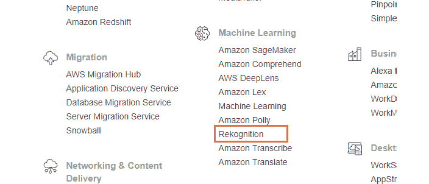

    ###### 图 6.2：在 AWS 控制台中选择 Rekognition 服务。

1.  您可以在**机器学习**部分找到 Rekognition。当您在 Rekognition 页面时，点击左侧工具栏中的对象和场景检测链接，导航到**对象和场景检测**页面。

1.  点击工具栏中的**对象** **和** **场景检测**链接，导航到**对象**和**场景检测**页面。

1.  接下来，在**使用自己的图像**面板下选择**文本框**。https://images.unsplash.com/photo-1540253208288-6a6c32573092?w=800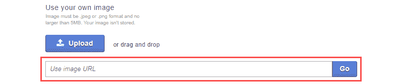

    ###### 图 6.3：使用图像 URL 输入文本框。

    图像的结果如下：

    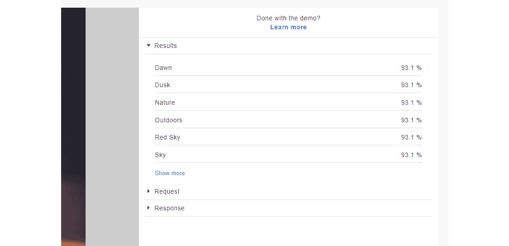

    ###### 图 6.4：样本图像的结果。

1.  您可以看到，在图像中，置信度为 93.1%的检测到的对象如下：

    +   黎明

    +   黄昏

    +   自然

    +   户外

    +   红色天空

    +   天空

1.  点击**显示更多**链接以显示具有较低置信水平的更多结果。这将显示检测到的更多对象：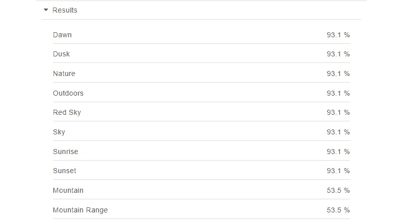

    ###### 图 6.5：样本图像的完整标签集。

1.  您可以选择您自己的应用程序中想要截断结果的置信度阈值。

### 练习 21：使用自己的图像检测对象和场景

在这个练习中，我们将使用 Amazon Rekognition 检测自定义图像的对象和场景。自定义图像可以来自网站，或者您可以从本地机器上传它们。以下为检测对象和场景的步骤：

1.  在 AWS 控制台中导航到 Amazon Rekognition 服务页面或直接访问 URL https://console.aws.amazon.com/rekognition。

1.  点击工具栏中的**对象** **和** **场景检测**链接，导航到**对象** **和** **场景检测**页面。

1.  接下来，在**使用自己的图像面板**下选择**文本框**。

1.  输入以下 URL 以获得要分析的图像：https://images.unsplash.com/photo-1522874160750-0faa95a48073?w=800。

1.  以下为图片：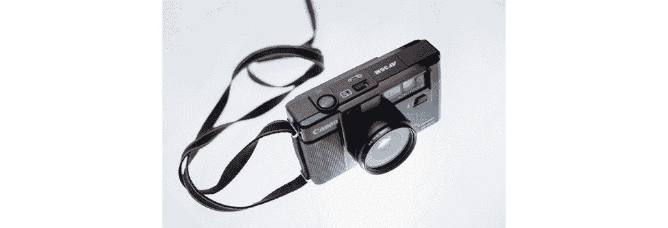

    ###### 图 6.6：提供的第一张图片。

    #### 注意

    我们从名为 https://unsplash.com/的股票图片网站上收集了图片，这些图片可以免费下载和使用，没有任何限制，用于本书的目的。始终遵守版权法，并注意你所在司法管辖区可能适用的任何限制或许可费用（如果适用）。您可以在以下位置查看 unsplash.com 图片的许可：https://unsplash.com/license。

1.  您可以在图片右侧的**结果**面板下查看对象检测的结果。在这种情况下，这是一张相机的图片，结果应如下所示：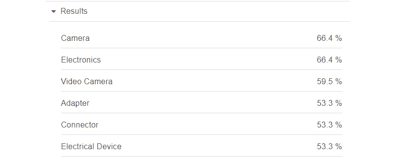

    ###### 图 6.7：提供的第一张图片的结果。

1.  如您所见，结果非常准确。接下来，您可以尝试以下图片，并验证结果是否与每张图片后立即显示的表格中的结果一致。https://images.unsplash.com/photo-1517941875027-6321f98198ed?w=800 和 https://images.unsplash.com/photo-1500111709600-7761aa8216c7?w=800

1.  以下为图片：

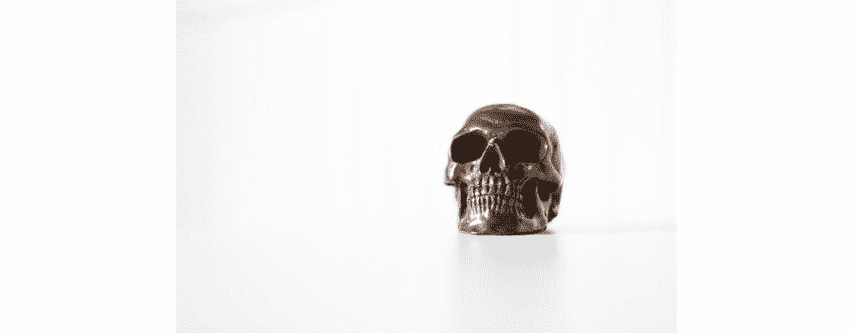

###### 图 6.8：提供的第二张图片。

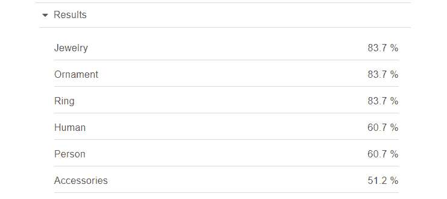

###### 图 6.9：提供的第二张图片的结果。

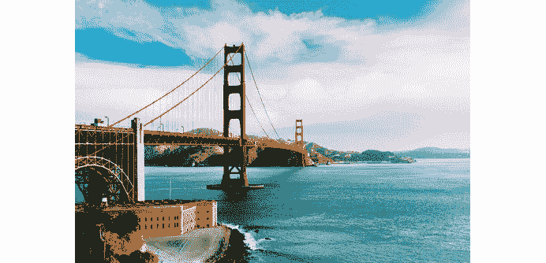

###### 图 6.10：提供的第三张图片。

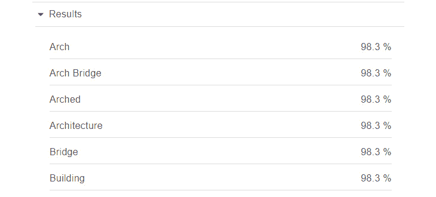

###### 图 6.11：提供的第三张图片的结果。

### 图片审查

除了对象和场景检测外，Rekognition 还提供过滤不适当内容的能力。您可以使用审查标签进行逐点子分类，从而让您调整用于确定您认为满意或令人震惊的图片类型的通道。使用 `DetectModerationLabels` 操作检测图像中的不安全内容。

您可以利用此组件来增强照片分享目的地、聚会、约会应用、青少年内容平台、电子商务平台和购物中心等。在这本书中，我们不会使用任何成人或裸露图片，但我们可以展示使用此功能的内容，这些内容在某些地区可能被认为是色情或暗示性的，例如泳装或夜店服装。

在本节中，图片默认为模糊状态，因此除非您按下“查看内容”按钮，否则无需查看它们。

#### 注意

如果您认为任何色情或暗示性图片令人反感，请根据您个人的、道德的、宗教的或文化规范跳过此部分。

Amazon Rekognition 使用分层分类法对显眼和暗示性内容的类别进行标记。两个顶级类别是**显眼裸露**和**暗示性**。每个顶级类别都有多个二级类别。使用此功能检测并标记的内容类型如下：

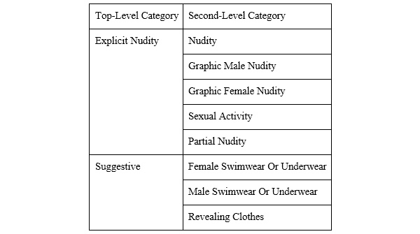

###### 图 6.12：内容类型类别

要创建一个**图片审查**的样本图片，您可以执行以下操作：

1.  导航到 AWS 控制台中的 Amazon Rekognition 服务页面，或直接访问 URL https://console.aws.amazon.com/rekognition。

1.  点击工具栏中的**图片审查**链接，导航到**图片审查**页面。

1.  接下来，在**使用自己的图片**面板下选择**文本框**。

1.  输入以下图像的 URL 以进行分析：https://images.unsplash.com/photo-1512101176959-c557f3516787?w=800.

1.  你会立即注意到内容被模糊处理了。正在分析的图像是左边的第一张图像，它已经被选中。你会看到服务已正确识别出图像中的**女性泳装或内衣**类型的**建议性内容**，置信度为**98.4%**。

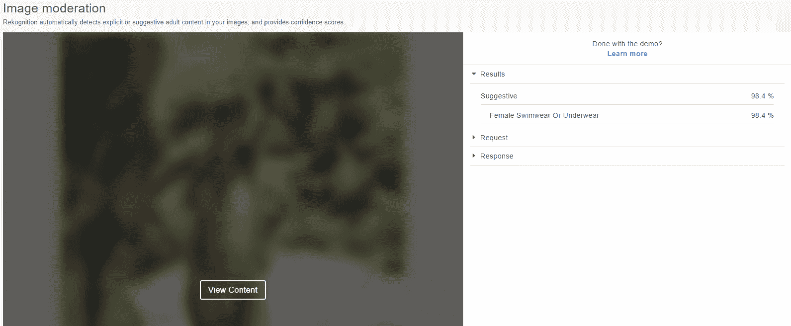

###### 图 6.13：图像审查的结果。

### 练习 22：检测图像中的令人反感的内容

在这个练习中，我们将检测图像中的令人反感的内容。现在，你可以尝试使用自己的图像来使用这项服务。我们已选择了三张我们将尝试使用此功能的图片：

1.  将以下`URL`复制粘贴或输入到页面底部的**使用图片 URL**文本框中，然后按**Go**按钮以从服务中获得结果：https://images.unsplash.com/photo-1525287957446-e64af7954611?w=800.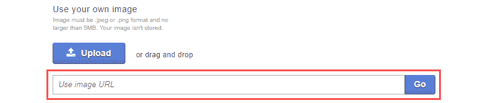

    ###### 图 6.14：使用图片 URL 上传文本框。

1.  你应该收到一个结果，表明该服务已找到女性泳装或内衣内容，置信度为**98.4%**：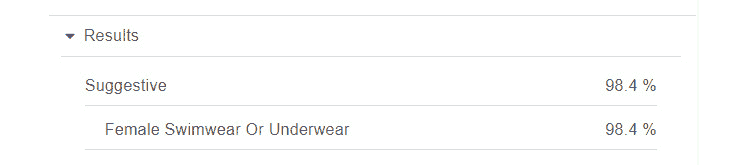

    ###### 图 6.15：服务找到的结果

1.  要提供给服务的以下图像 URL 是：https://images.unsplash.com/photo-1509670811615-bb8b07cb3caf?w=800.

1.  就像之前一样，将其输入到**使用图片 URL**文本框中，然后按**Go**按钮。这张图片没有令人反感的内容：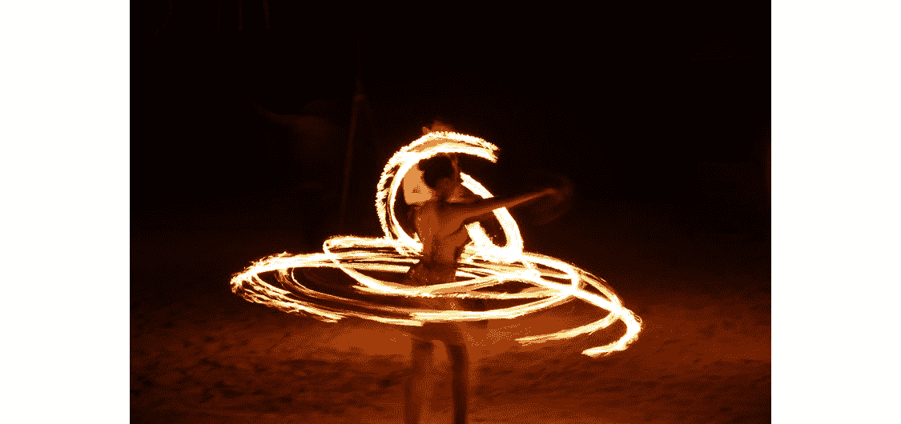

    ###### 图 6.16：图像审查的第一个提供的图像。

1.  你应该看到**Rekognition**正确返回了无结果：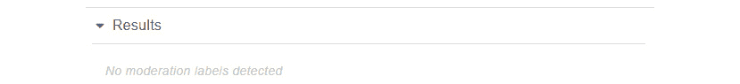

    ###### 图 6.17：第一个提供的图像的图像审查结果。

1.  最后，我们将使用一张应该再次返回一些结果的图片：https://images.unsplash.com/photo-1518489913881-199b7c7a081d?w=800.

    这个应该再次被正确识别为包含女性泳装或内衣内容的，置信度为**97.1%**：

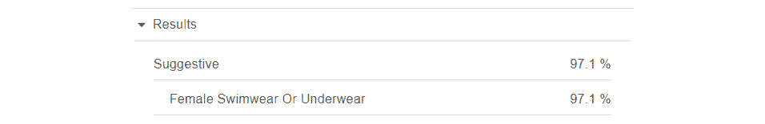

###### 图 6.18：第二个提供的图像的图像审查结果。

### 面部分析

Rekognition 还可以对面部进行更详细的分析。给定一张可检测到人脸的图片，它可以判断人脸是男性还是女性，人脸的年龄范围，这个人是否在微笑并看起来很开心，以及他们是否戴眼镜。

它还可以检测更详细的信息，例如眼睛和嘴巴是张开还是闭合，以及这个人是否有胡须或胡子。

要创建样本图像的面部分析，您可以执行以下操作：

#### 注意

点击左侧工具栏中的“面部分析”链接以导航到面部分析页面。

1.  在“使用您的图像”面板下选择“文本框”。

1.  输入以下图像的 URL 以进行分析：https://images.unsplash.com/photo-1525943837837-af668e09139d?w=800.

1.  对于此图像，您会看到主要图像框显示一个边界矩形，它显示了检测到面部所在的区域。在边界框内，还有三个点来标识关键面部图像的位置：嘴巴和鼻子检测。 .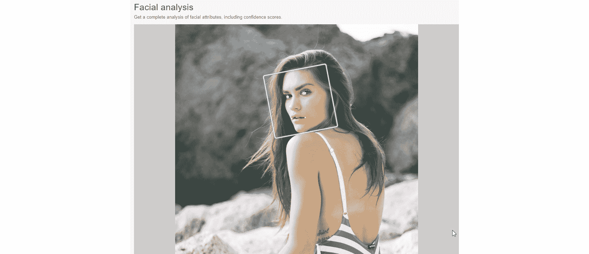

    ###### 图 6.19：面部分析的第一张样本图像。

1.  在图像右侧的“结果”部分，您可以看到 Rekognition 已经检测到图像中的以下面部属性：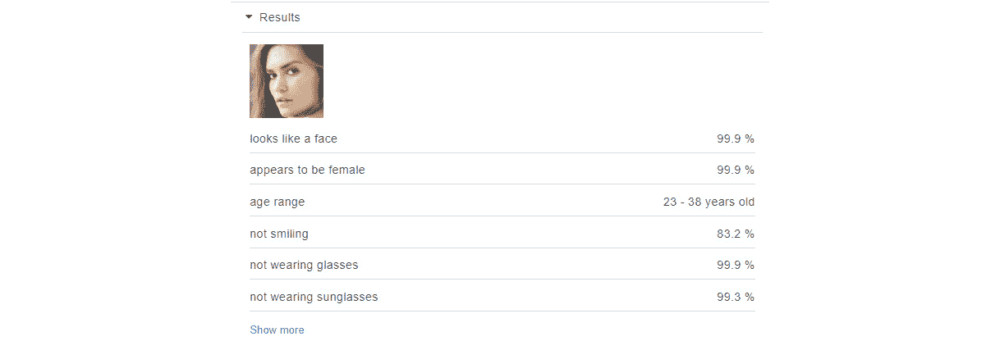

    ###### 图 6.20：面部分析第一张样本图像的结果。

1.  您可以点击“显示更多”链接以显示其他也已识别的属性。

1.  所有这些识别出的特征都具有极高的置信度，表明该服务对其发现非常自信。

### 练习 23：分析您自己的图像

在这个练习中，您已经提供了三个图像的链接，以便您可以使用自己的图像尝试该服务：

#### 注意

点击左侧工具栏中的“面部分析”链接以导航到“面部分析”页面。

1.  要分析的第一张图像的 URL 如下：https://images.unsplash.com/photo-1494790108377-be9c29b29330。

1.  您可以复制并粘贴或键入此 `URL` 到页面底部的“使用您的图像”部分下的“使用图像 URL”文本框中，如下所示：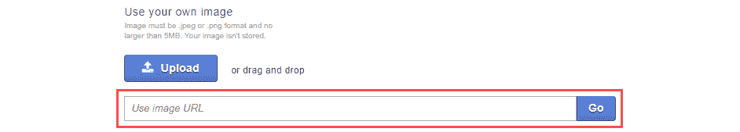

    ###### 图 6.21：图像 URL 输入文本框。

    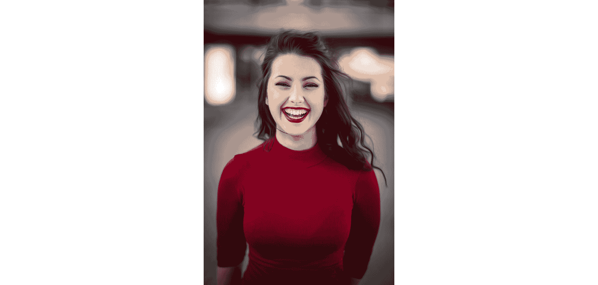

    ###### 图 6.22：用于面部分析的第一张图像。

1.  您可以从边界框和点中看出，Rekognition 能够轻松识别面部：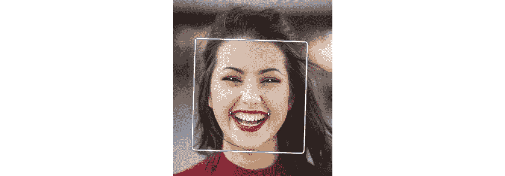

    ###### 图 6.23：用于面部分析的第一张图像的边界框。

1.  在“结果”部分，它相当准确地显示了图像中面部属性：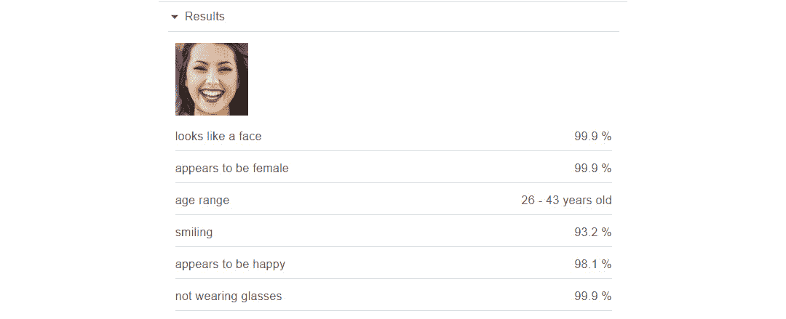

    ###### 图 6.24：用于面部分析的第一张图像的结果。

1.  第二张图像是另一张不同的面部，也没有微笑。您可以输入此 URL 以将其提供给 Rekognition：https://images.unsplash.com/photo-1488426862026-3ee34a7d66df?w=800.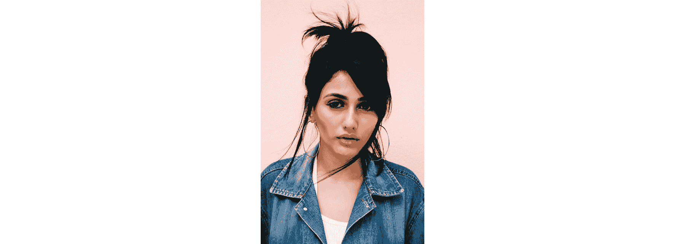

    ###### 图 6.25：用于面部分析的第二张图像。

1.  Rekognition 再次很好地识别了面部：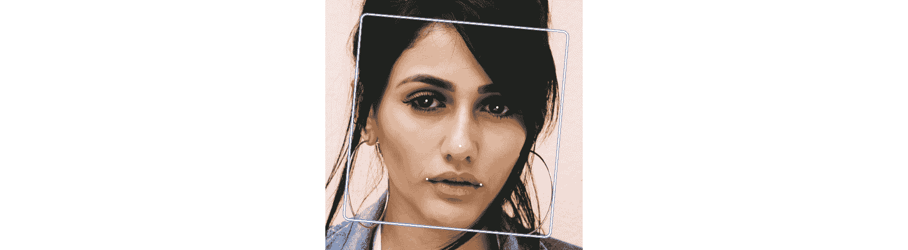

    ###### 图 6.26：为面部分析提供的第二张图像的边界框

1.  结果还反映她没有微笑：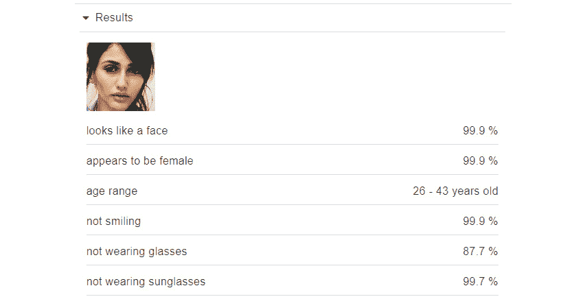

    ###### 图 6.27：为面部分析提供的第二张图像的结果。

1.  最后，我们将通过以下链接给 Rekognition 一张男性的图像，看看它的表现如何：https://images.unsplash.com/photo-1472099645785-5658abf4ff4e?w=1000.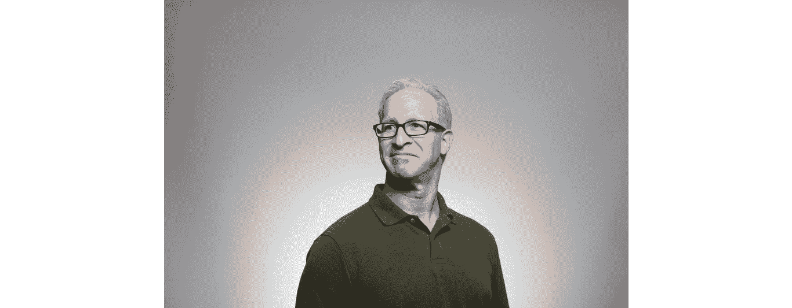

    ###### 图 6.28：为面部分析提供的第三张图像。

1.  如预期，该服务可以识别男性和女性。它通过边界框识别面部：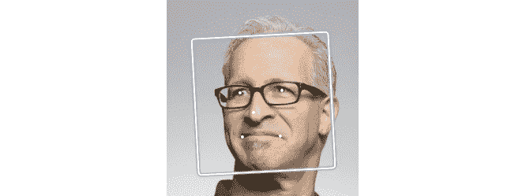

    ###### 图 6.29：为面部分析提供的第三张图像的边界框。

1.  它还以高置信度（99.9%）显示结果，表明面部是男性。它还相应地更新了年龄范围：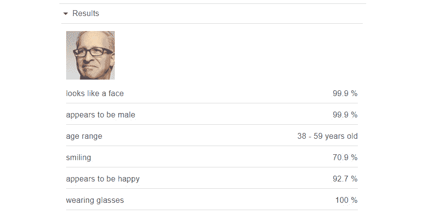

    ###### 图 6.30：为面部分析提供的第三张图像的结果。

1.  它有 70.9%的信心认为这个男人在微笑，但我们从图像中可以看出，他并没有笑得很开心，如果不是完全不笑的话。

1.  最后，该服务 100%确信他戴着眼镜，99%确信他没有戴太阳镜，这是对图像的高度准确描述。

### 名人识别

Rekognition 提供了在图像中识别和标记名人和其他著名人物的能力。这包括在政治、体育、商业、娱乐和媒体等领域中突出的各种人物。

重要的是要记住，Rekognition 只能识别它已经训练过的面部，因此不涵盖完整的、详尽的名人名单。然而，由于亚马逊持续训练系统，它不断向服务中添加新的面部。

#### 注意

点击左侧工具栏中的名人识别链接，导航到名人识别页面。

要创建样本图像的名人识别，您可以执行以下操作：

1.  在“使用您的图像”面板下选择**文本框**。

1.  输入以下图像的 URL 以进行分析：https://images.pexels.com/photos/53487/james-stewart-man-person-actor-53487.jpeg.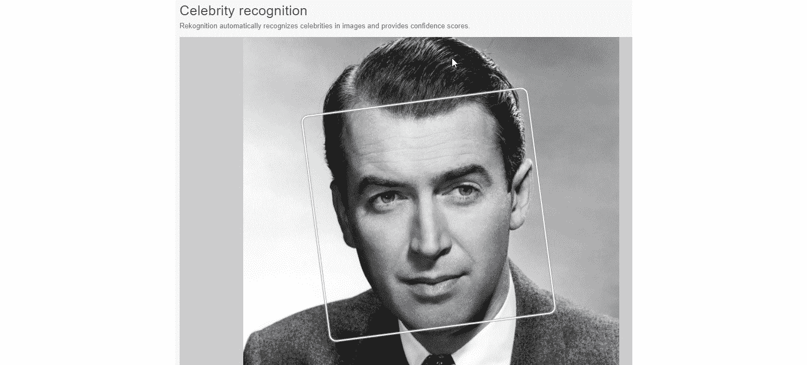

    ###### 图 6.31：名人识别的第一个样本图像，包含结果。

1.  点击**了解更多**链接，您将被带到詹姆斯·斯图尔特的 IMDB 页面：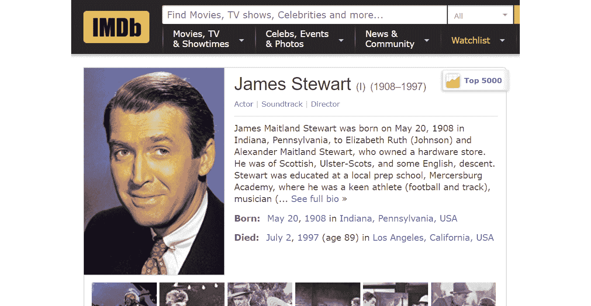

    ###### 图 6.32：第一个样本图像的“了解更多”链接。

    ### 练习 24：在您的图像中识别名人

    在这个练习中，我们将使用另一个拥有更多名人图片集合的网站。您也可以免费无限制地使用这些图片。现在，您可以在自己的图片上尝试这项服务。我们已选择三张图片，我们将使用此功能进行测试。

    您可以在此处查看 pexels.com 图片的许可：https://www.pexels.com/creative-commons-images/

    #### 注意

    点击左侧工具栏中的名人识别链接以导航到名人识别页面。

1.  将以下`URL`复制并粘贴或输入到页面底部**使用您的图片**部分下的**使用图片 URL**文本框中，然后按**Go**按钮以从服务中获得结果：

    ###### 图 6.33：使用图片 URL 输入文本框

1.  首先输入到文本框中的 URL 是 https://images.pexels.com/photos/276046/pexels-photo-276046.jpeg。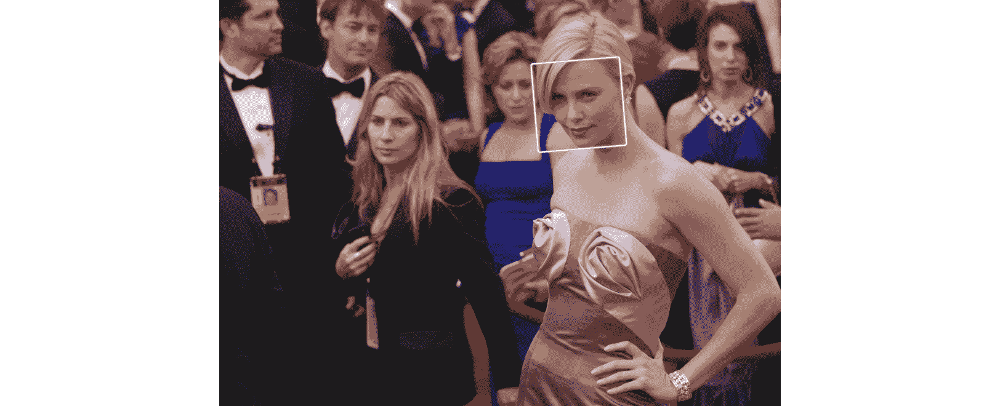

    ###### 图 6.34：为名人识别提供的第一个图片。

1.  这是一张著名女演员**查理兹·塞隆**的图片。结果部分将显示她的名字和一个**了解更多**链接，该链接将带您访问她的**IMDB**页面：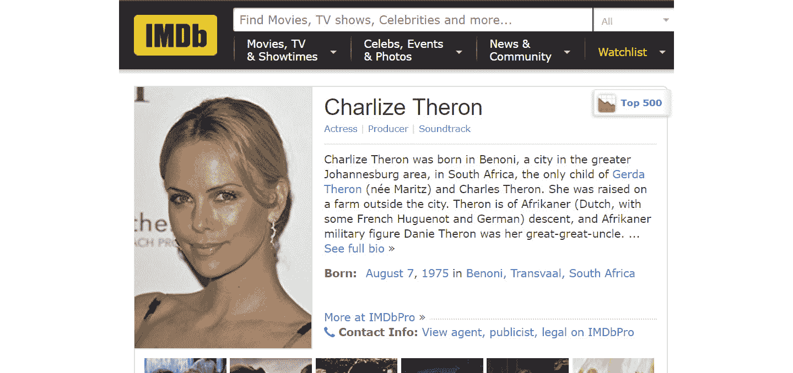

    ###### 图 6.35：为提供的第一个名人识别图片的“了解更多”链接

1.  您可以输入到文本框中的第二张图片的 URL 是 https://images.pexels.com/photos/2281/man-person-suit-united-states-of-america.jpg?w=800，这给我们带来了以下图片：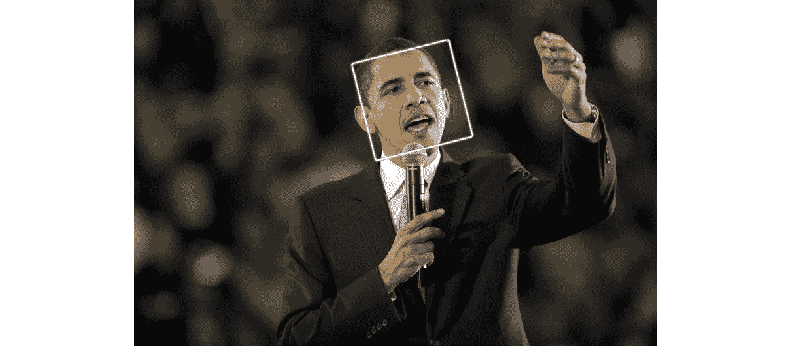

    ###### 图 6.36：为提供的第二张名人识别图片的“了解更多”链接

1.  这张图片展示了前美国总统巴拉克·**奥巴马**。Rekognition 能够轻松地识别他，并在结果部分显示他的名字。**了解更多**链接再次链接到他的**IMDB**页面：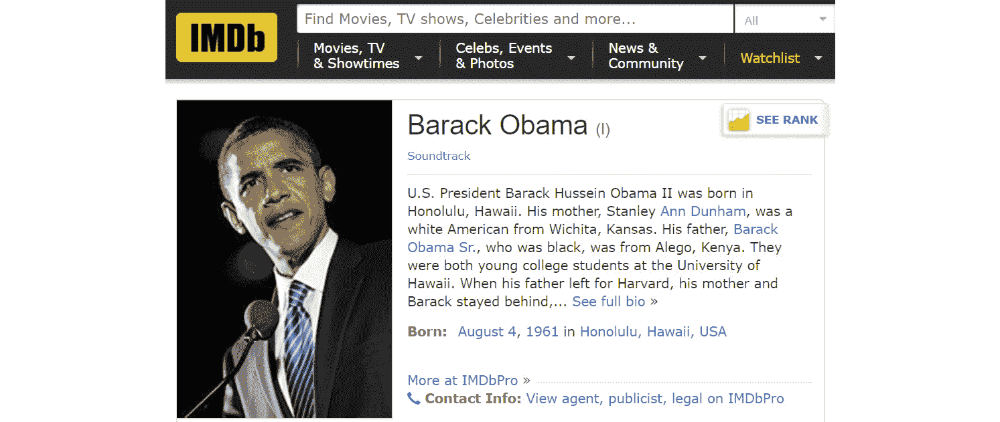

    ###### 图 6.37：为提供的第二张名人识别图片的“了解更多”链接。

1.  最后一张图片包含多位名人。您可以将以下 URL 输入到 Rekognition 中：https://images.pexels.com/photos/70550/pope-benedict-xvi-president-george-bush-laura-bush-andrews-afb-70550.jpeg?w=800，这给我们带来了以下图片：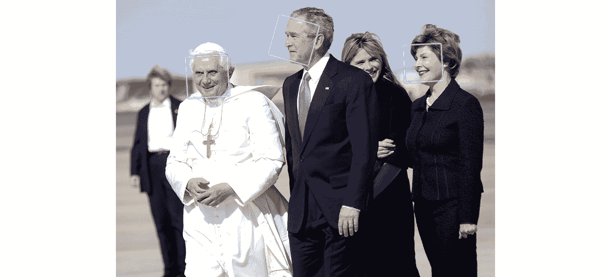

    ###### 图 6.38：为名人识别提供的第三张图片，有三个边界框。

1.  您可以在结果部分看到，Rekognition 识别了图片中的三位名人：

    +   乔治·W·布什

    +   保罗·本尼迪克特十六世

    +   劳拉·布什

以下图片显示了名人识别的结果：

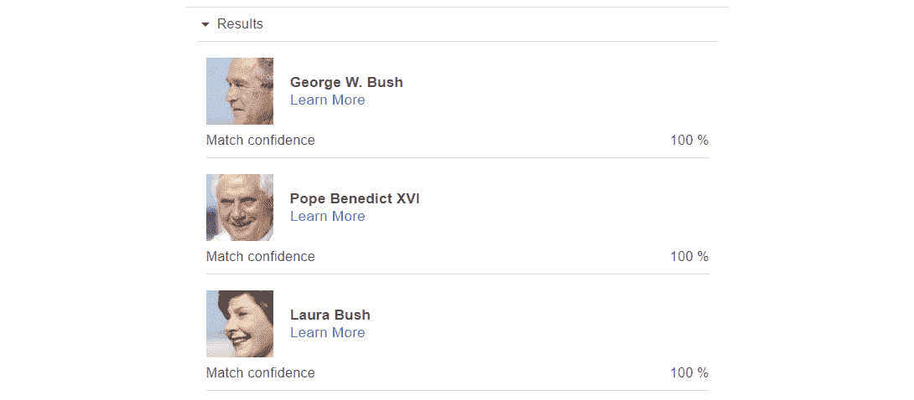

###### 图 6.39：为名人识别提供的第三张图片的结果。

1.  在他们的名字下点击“了解更多”链接，会跳转到各自的 IMDB 页面。正如我们之前所做的那样，您可以通过点击它们来验证这一点。

### Face 对比

Rekognition 允许您比较两张图像中的面孔。这主要是为了识别两张图像中哪些面孔是相同的。作为一个用例示例，这也可以用于将人们的照片与他们的个人照片进行比较。

本节展示了行业标准，以便您可以使用 Amazon Rekognition 分析包含不同面孔的图片中的面孔。当您指定参考面孔（源）和比较面孔（目标）图片时，Rekognition 会考虑源图片中最大的面孔（即参考面孔），最多识别目标图片中的 100 个面孔（即比较面孔），然后发现源图片中的面孔与目标图片中的面孔的匹配程度。每个比较的接近度得分在结果表中显示。

本功能的使用有一些限制如下：

+   如果源图像包含多个面孔，则使用最大的一个与目标图像进行比较。

+   目标图像可以包含多达 15 个面孔。源图像中检测到的面孔将与目标图像中检测到的每个面孔进行比较。

    #### 注意

    点击左侧工具栏中的“Face 对比”链接，导航到 Face 对比页面。

使用面部对比功能时，有两个图像部分并排显示。您可以选择将左侧部分的图像与右侧部分的图像进行比较。要创建样本图像的面部分析，您可以执行以下操作：

1.  在左侧的“使用自己的图像”面板下选择**文本框**。

1.  输入以下图像的 URL 以进行分析：https://images.unsplash.com/photo-1524788038240-5fa05b5ee256?w=800。

1.  在右侧的“使用自己的图像”面板下选择**文本框**。

1.  输入以下图像的 URL 以进行分析：https://images.unsplash.com/photo-1524290266577-e90173d9072a?w=800:![图 6.39：提供的第一批样本图像的 Face 对比。

    ![img/image0372.jpg]

    ###### 图 6.40：提供的第一批样本图像的 Face 对比。

1.  使用默认选择，您可以在结果部分看到，它以**97%**的置信度在右侧识别出左侧图像中的女孩：

![图 6.40：提供的第一批样本图像的 Face 对比结果。

![img/image0381.jpg]

###### 图 6.41：提供的第一批样本图像的 Face 对比结果。

### 活动一：在 Rekognition 中创建和分析不同的面孔

在这个活动中，你可以使用自己的图像尝试 Rekognition。例如，我们提供了两组显示相同人物的图像的链接。你可以通过使用**使用图像 URL**文本框将图像集输入左侧（比较）和右侧（比较）两侧。记住，这次有两个，所以有两个**Go**按钮要按。这些图像的链接是 https://images.unsplash.com/photo-1484691065994-f1b2f364d7a6?w=800 和 https://images.unsplash.com/photo-1485463598028-44d6c47bf23f?w=800。为了确保你正确这样做，你需要导航到 Amazon Rekognition 服务：

1.  将第一组图像上传到 Rekognition，以便它可以识别面部。

1.  按以下参数比较第一组图像：

    +   置信度

    +   比较不同角度

    +   光照

    +   眼镜在脸上的位置

1.  将第二组图像上传到 Rekognition。

1.  比较第二组图像以确定面部相似度。

### 图像中的文本

图像中的文本是 Amazon Rekognition 的一项功能，允许你在图像中检测和识别文本，如**街道名称**、**字幕**、**产品名称**和**车辆牌照**。此功能专门设计用于与真实世界的图像而不是文档图像一起工作。

对于提供的每一张图像，该服务返回一个文本标签和边界框，以及一个置信度分数。这对于在图像集合中搜索文本可以非常有用。每张图像可以根据此结果和其他服务功能的结果标记相应的文本元数据。

目前，支持的文本是拉丁字母和数字（西文）。每张图像可以识别多达 50 个字符序列。文本必须是水平的，旋转**+/-** 90 度。

#### 注意

点击左侧工具栏中的“图像中的文本”链接以导航到“图像中的文本”页面。

要识别样本图像中的文本，你可以这样做：

1.  在左侧的“使用自己的图像”面板下选择**文本框**。

1.  输入以下图像的 URL 以进行分析：https://images.unsplash.com/photo-1527174744973-fc9ce02c141d?w=800，你将看到以下图像：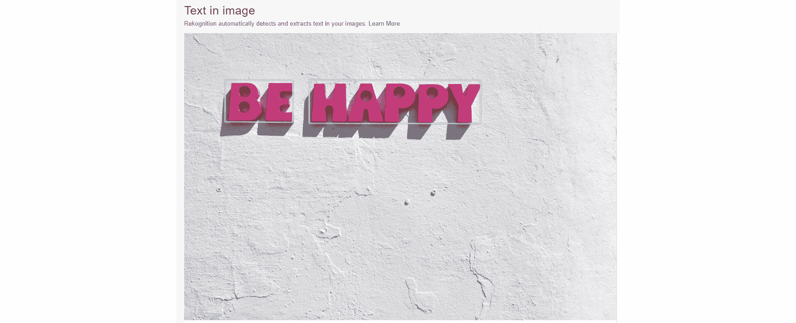

    ###### 图 6.42：为图像中的文本提供的第一个样本图像。

1.  Rekognition 用边框包围检测到的文本，以便你可以识别它已识别的文本区域。你可以在结果部分看到文本提取的结果：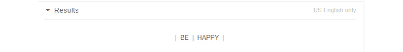

    ###### 图 6.43：为图像中的文本提供的第一个样本图像的结果。

1.  你可以看到，Rekognition 已经从图像中提取了文本，单词之间用分隔符|分隔，分别在不同的区域。

### 练习 25：从你的图像中提取文本

在这个练习中，你将从自己的图像中提取文本。我们为你提供了三张免费使用的图像：

#### 注意

点击左侧工具栏中的“图像中的文本”链接以导航到图像中的文本页面。

1.  将网址复制并粘贴或输入到页面底部“**使用自己的图片**”部分下的“**使用图片 URL**”文本框中：https://images.unsplash.com/photo-1521431974017-2521d1cdcd65?w=800，你将看到以下图片：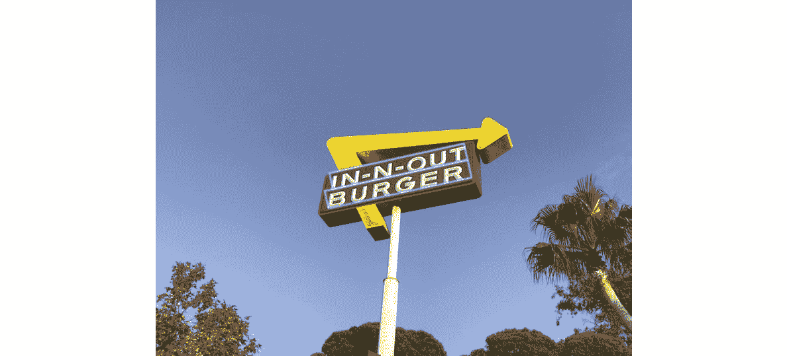

    ###### 图 6.44：为图像中的文本提供的第一张图片

1.  你可以看到围绕图像的边界框，这表示 Rekognition 已经识别出图像中的文本。结果可以在图像右侧的结果面板中查看：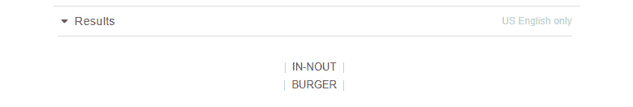

    ###### 图 6.45：为图像中的文本提供的第一张图片的结果

1.  下一张图片的网址如下。像之前一样，将其复制并粘贴或输入到“**使用图片 URL**”文本框中：https://images.unsplash.com/photo-1528481958642-cd4b4efb1ae1?w=800，你将看到以下图片：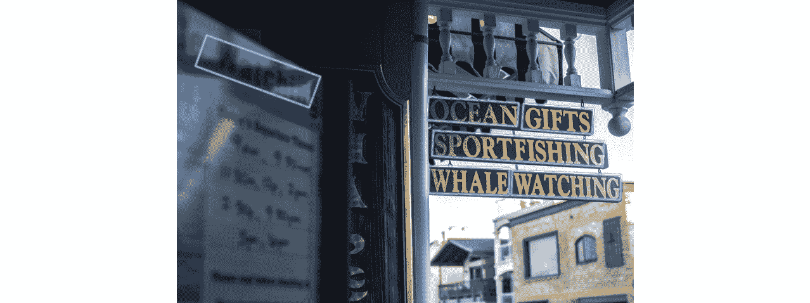

    ###### 图 6.46：为图像中的文本提供的第二张图片。

1.  你可以看到 Rekognition 已经识别出商店窗口中的主要文本：**OCEAN GIFTS SPORTFISHING WHALE WATCHING**。

1.  然而，它还在图像左侧模糊文本周围放置了一个矩形。当你查看结果时，你将在文本输出中看到额外的文本：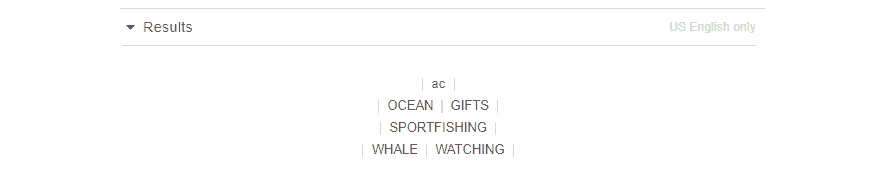

    ###### 图 6.47：为图像中的文本提供的第二张图片的结果

1.  它已经从模糊文本中识别出`ac`，没有更多。这是你应该注意并留意在结果中的事情。Rekognition 可能会混淆并返回虚假的结果。

1.  最后，将以下网址复制并粘贴或输入到“**使用图片 URL**”文本框中：https://images.unsplash.com/photo-1456668609474-b579f17cf693?w=800，你将看到以下图片：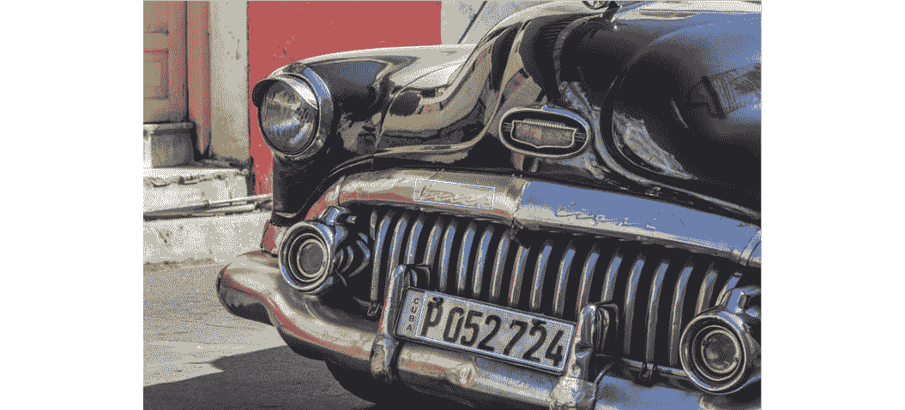

    ###### 图 6.48：为图像中的文本提供的第三张图片。

1.  这又是车牌的一个例子。然而，如果你仔细看，你可能会看到该服务不仅在车牌周围放置了边界框，还在汽车上部的格栅上的其他文本周围放置了边界框，它认为它能够识别。结果如下：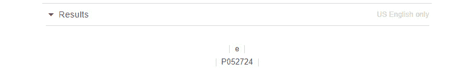

    ###### 图 6.49：为图像中的文本提供的第三张图片的结果。

1.  除了车牌文本外，它还识别了它所划定的区域中的文本“e”。再次强调，当依赖结果时，这是需要注意的事情，并且在这种情况下，手动验证过程显然是有益的。

    #### 注意

    要参考详细步骤，请参阅本书末尾的*附录 A*，第 232 页。

## 摘要

在本章中，您学习了如何使用 Amazon Rekognition 服务的各种功能，并将其应用于图像。首先，您使用该服务识别图像中的物体和场景。接下来，您通过使用 Rekognition 识别图像中的不适当内容，来对可能含有不适当内容的图像进行审查。

您能够使用 Rekognition 分析面部，并且还能识别他们的性别、年龄范围、是否在微笑以及是否佩戴眼镜。

您还使用该服务识别名人及知名人士，并比较不同图像中的面部是否相同。最后，您能够提取图像中显示的文本。

这些类型的功能在几年前似乎是不可思议的。机器学习和人工智能的本质在于，最近、今天以及可预见的未来，计算机能够做到的事情取得了巨大的进步——AWS 将能够为您提供和您的应用程序这些服务！
