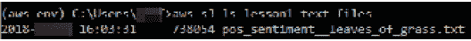

# 附录 A

## 关于

本节包含的内容旨在帮助学生执行书中提到的活动。它包括学生需要执行的详细步骤，以完成并实现本书的目标。

## 第一章：Amazon Web Services 简介

### 活动一：使用 CLI 将数据导入和导出到 S3。

1.  通过执行"`aws s3 ls`"来验证配置是否正确，以输出您的存储桶名称（存储桶名称将是唯一的）：

    ###### 图 1.34：命令行

1.  执行"aws s3 ls <bucket-name>"以输出存储桶中的文本文件`pos_sentiment__leaves_of_grass.txt`

    ###### 图 1.35：命令行

1.  使用以下命令创建一个新的 S3 存储桶（请注意：您的存储桶名称必须是唯一的。有关具体细节，请参阅 S3 ["存储桶命名规则](https://docs.aws.amazon.com/AmazonS3/latest/dev/BucketRestrictions.html)"）：

    ###### 图 1.36：命令行

1.  在命令提示符中，导航到"`neg_sentiment__dracula.txt`"的位置。执行"`aws s3 cp neg_sentiment__dracula.txt`"以将文本文件导入到您的 S3 存储桶。

    ###### 图 1.37：命令行

1.  使用您的命令行导航到"`peter_pan.txt`"文件的位置。使用以下命令将文件"`peter_pan.txt`"导入到您的 S3 存储桶（在本例中命名为"`aws-test-ml-and-ai-two`"）：

    ###### 图 1.38：命令行

1.  在命令行中导航到您的桌面。使用命令"`mkdir s3_exported_files`"创建一个名为"`s3_exported_files`"的新本地文件夹

    ###### 图 1.39：命令行

1.  接下来，使用"- -recursive"参数递归地从 S3 存储桶将两个文件（"`neg_sentiment__dracula.txt`"和"`peter_pan.txt`"）导出到您的本地目录。下面是命令执行的示例。

    ###### 图 1.40：命令行

1.  使用"`dir`"命令（见下文）验证对象是否已成功导出到您的本地文件夹：


###### 图 1.41：输出

### 活动二：测试 Amazon Comprehends API 功能。

在本节中，我们将学习如何使用 API 探索器中的部分文本文件输入来分析显示文本输出。我们将探索 API 的技能，通过确保输出符合项目所需格式来节省开发时间。因此，我们将测试 Comprehend 的文本分析功能。

我们将考虑一个例子，假设你是一位正在创建聊天机器人的企业家。你确定了一个商业主题和相应的文本文档，其中包含的内容可以使聊天机器人使你的业务成功。你的下一步是确定/验证 AWS 服务以解析文本文档进行情感、语言、关键词和实体的分析。在投入时间编写完整的程序之前，你希望通过 AWS 管理控制台的界面测试 AWS 服务的功能。为了确保它正确发生，你需要在网上搜索一篇文章（用英语或西班牙语撰写），其中包含你感兴趣的主题（体育、电影、时事等）。此外，AWS 管理控制台可通过根用户账户访问。

你知道探索 API 是一种节省开发时间的技能，通过确保输出符合你项目的期望格式。

1.  在 AWS 服务搜索栏中点击以搜索服务名称。图 1.42: AWS 服务搜索

    ###### 图 1.42: AWS 服务搜索

1.  搜索 `Amazon Comprehend` 选项并选择你将被引导的选项。开始屏幕。图 1.10: 选择服务

    ###### 图 1.43: 选择服务

1.  您将被引导到 `API 探索器`。导航到主题建模和文档。中间是一个图形用户界面，用于探索 API，右侧提供文本输入的实时输出。图 1.44: API 探索器

    ###### 图 1.44: API 探索器

1.  点击清除文本以清除所有默认服务。在新标签页中打开以下 URL [`www.gutenberg.org/cache/epub/1322/pg1322.txt`](http://www.gutenberg.org/cache/epub/1322/pg1322.txt)图 1.45: API 探索器屏幕

    ###### 图 1.45: API 探索器屏幕

1.  复制第一首诗，然后在资源管理器中粘贴并点击分析以查看输出

    ###### 图 1.46: 分析输出

1.  查看屏幕右侧的实体、关键词、语言，并向下滚动以查看情感。


###### 图 1.47: 结果

你现在知道如何探索 API，以及如何显示相同的情感输出。

## 第二章：使用 NLP 概述文本文档

### 活动 3：将 Lambda 与 Amazon Comprehend 集成以执行文本分析

1.  接下来，我们将上传 `"`test_s3trigger_configured.txt`"` 文件到我们的 S3 存储桶以验证 lambda s3_trigger 函数配置成功。

1.  导航到 s3 页面：[`console.aws.amazon.com/s3/`](https://console.aws.amazon.com/s3/)

1.  点击你正在使用的存储桶名称以测试 `s3_trigger` 函数（在我的情况下："`aws-ml-s3-trigger`"）。图 2.37: S3 存储桶列表

    ###### 图 2.37: S3 存储桶列表

1.  **点击** 上传。图 2.38: S3 存储桶列表上传屏幕

    ###### 图 2.38: S3 存储桶列表上传屏幕

1.  将显示以下屏幕。

    ###### 图 2.39：S3 上传存储桶“添加文件”屏幕。

1.  **点击**添加文件。

    ###### 图 2.40：S3 添加文件选择屏幕。

1.  导航到"`test_s3trigger_configured.txt`"文件的位置。选择文件。

1.  **导航**到文本文件的位置并打开文件。文件包含以下文本：

1.  "我是一个测试文件，用于验证 s3 触发器是否成功配置！"

1.  在我们执行 s3_trigger 之前，考虑以下文本的以下方面：情感（正面、负面或中性）、实体（数量、人物、地点等）和关键词。

    #### 注意

    "test_s3trigger_configured.txt"可在以下 GitHub 仓库中找到：[`github.com/TrainingByPackt/Machine-Learning-with-AWS/blob/master/lesson2/topic_c/test_s3trigger_configured.txt`](https://github.com/TrainingByPackt/Machine-Learning-with-AWS/blob/master/lesson2/topic_c/test_s3trigger_configured.txt)

1.  点击**上传**。

    ###### 图 2.41：S3 文件添加到存储桶以进行 Lambda 触发器测试

1.  返回到`s3_trigger`。**点击**监控

    ###### 图 2.42：选择监控选项卡

1.  点击在 CloudWatch 中查看日志。

    ###### 图 2.43：在 CloudWatch 中选择查看日志

1.  点击**日志流**。

    ###### 图 2.44：选择日志流

1.  选择文本旁边的圆形选项以展开输出：

    ###### 图 2.9：点击圆形选项以展开 lambda 输出

1.  下面是输出的前几行，要查看整个输出，您需要向下滚动以查看所有结果（见下文）。我们将在下一步解释总输出。

    ###### 图 2.45：s3_trigger 输出的顶部部分

1.  **Sentiment_response** -> 被分类为 60.0%可能是正面

1.  Sentiment_response:

    {'Sentiment': 'POSITIVE', 'SentimentScore': {'Positive': 0.6005121469497681, 'Negative': 0.029164031147956848, 'Neutral': 0.3588017225265503, 'Mixed': 0.01152205839753151},

    **entity_response** --> 被分类为 70.5%可能是数量类型

    entity_response:

    {Entities': [{'Score': 0.7053232192993164, 'Type': 'QUANTITY', 'Text': '3 trigger', 'BeginOffset': 35, 'EndOffset': 44}],

    **key_phases_response** -> 被分类为 89.9%可能是“一个测试文件”和 98.5%可能是“s3 触发器”是关键词。

    key_phases_response:

    {'KeyPhrases': [{'Score': 0.8986637592315674, 'Text': 'a test file', 'BeginOffset': 8, 'EndOffset': 19}, {'Score': 0.9852105975151062, 'Text': 'the s3 trigger', 'BeginOffset': 30, 'EndOffset': 44}],

## 第三章：执行主题建模和主题提取

### 活动四：对一组具有未知主题的文档执行主题建模

1.  导航到以下链接以获取包含负面评论的文本数据文件[`github.com/TrainingByPackt/Machine-Learning-with-AWS/blob/master/lesson3/activity/localfoldernegative_movie_review_files/cv000_29416.txt`](https://github.com/TrainingByPackt/Machine-Learning-with-AWS/blob/master/lesson3/activity/localfoldernegative_movie_review_files/cv000_29416.txt)

1.  导航到 S3：[`s3.console.aws.amazon.com/s3/home`](https://s3.console.aws.amazon.com/s3/home)

1.  点击"`input-for-topic-modeling`"的存储桶。

    ###### 图 3.43：'input-for-topic-modeling'的 S3 主屏幕

1.  点击创建文件夹。

    ###### 图 3.44：点击创建文件夹

1.  输入"`negative_movie_review_files`"，然后点击`text_files_to_s3.py`并将其粘贴到编辑器中。源代码可在以下 GitHub 仓库中找到：[`github.com/TrainingByPackt/Machine-Learning-with-AWS/blob/master/lesson3/activity/text_files_to_s3.py`](https://github.com/TrainingByPackt/Machine-Learning-with-AWS/blob/master/lesson3/activity/text_files_to_s3.py)

1.  首先，你将使用以下注释导入 os 和 boto3 包

    ```py
    import os
    import boto3
    ```

1.  接下来，输入你独特的存储桶名称。

    ```py
    BUCKET_NAME = '<insert a unique bucket name>' 
    BUCKET_FOLDER = 'negative_movie_review_files/' 
    ```

1.  接下来，获取文本文件的本地路径的工作目录：

    ```py
    LOCAL_PATH = os.getcwd() +'\\local_folder__negative_movie_review_files\\'
    ```

1.  创建所有文本文件的列表：

    ```py
    text_files_list = [f for f in os.listdir(LOCAL_PATH) if f.endswith('.txt')]
    ```

1.  遍历所有文件，并将每个文件上传到 s3：

    ```py
    for filename in text_files_list:
        s3.upload_file(LOCAL_PATH + filename, BUCKET_NAME, BUCKET_FOLDER + filename)
    ```

1.  接下来，在你的命令提示符中，导航到"`activity__topic_modeling_on_documents`"目录，并执行以下代码：python `text_files_to_s3.py`

1.  结果是将 1000 个文本文件上传到 S3 的`negative_movie_review_files`文件夹。下面是 S3 的顶级输出（见下文）：

    ###### 图 3.47：S3 中的 negative_movie_review_files

1.  接下来，导航到 AWS Comprehend。点击 comprehend 链接：[`console.aws.amazon.com/comprehend/home`](https://console.aws.amazon.com/comprehend/home)。

    ###### 图 3.48：Amazon Comprehend 主屏幕

1.  现在，点击**组织**。

    ###### 图 3.49：选择组织

1.  现在，点击创建作业。

    ###### 图 3.50：点击创建作业

1.  现在，在名称输入字段中输入"`unknown_topic_structure_job`"。

    ###### 图 3.51：输入'unknown_topic_strucutre_job'

1.  现在，滚动到选择输入数据部分，并点击搜索。

    ###### 图 3.52：选择搜索按钮

1.  点击所选存储桶旁边的箭头以输入用于主题建模的文件（`aws-ml-input-for-topic-modeling`）。

    ###### 图 3.53：展开 S3 存储桶子文件夹

1.  点击“`negative_movie_review_files`”文件夹旁边的圆圈。图 3.54：选择 negative_movie_review_files 文件夹

    ###### 图 3.54：选择 negative_movie_review_files 文件夹

1.  现在，点击选择以选择文件。图 3.55：点击选择按钮

    ###### 图 3.55：点击选择按钮

1.  你将被重定向到 Amazon Comprehend 主页面。从输入格式下拉菜单中选择“**每文件一个文档**”选项。图 3.56：选择每文件一个文档选项

    ###### 图 3.56：选择每文件一个文档选项

1.  接下来，在主题数量输入字段中输入 40。图 3.57：输入 40 个主题

    ###### 图 3.57：输入 40 个主题

1.  滚动到选择输出位置，并点击搜索

    ###### 图 3.58：点击搜索

1.  选择为主题建模输出唯一命名的输出存储桶。图 3.59：选择用于主题建模输出的 S3 存储桶

    ###### 图 3.59：选择用于主题建模输出的 S3 存储桶

1.  点击选择按钮。图 3.60：通过点击选择按钮确认

    ###### 图 3.60：通过点击选择按钮确认

1.  点击下拉菜单并选择“`AmazonComprehendServiceRole-myTopicModeingRole`” IAM 角色。图 3.61：选择现有的 IAM 角色

    ###### 图 3.61：选择现有的 IAM 角色

1.  点击**创建**作业按钮。图 3.62：点击创建作业

    

    ###### 图 3.62：点击创建作业

1.  主题建模作业状态将首先显示“**已提交**”。图 3.63：状态‘已提交’

    

    ###### 图 3.63：状态‘已提交’

1.  主题建模作业状态将随后显示“**进行中**”。主题建模作业持续时间约为 6 分钟。

    ###### 图 3.64：“进行中”状态

1.  当状态变为“完成。”时，点击“`unknown_topic_structure_job`”链接。图 3.65：选择超链接的主题建模链接

    ###### 图 3.65：选择超链接的主题建模链接

1.  滚动并点击主题建模输出超链接（*你的将显示不同的唯一主题建模作业字母数字字符串）。

    ###### 图 3.66：点击主题建模输出 S3 位置

1.  你将被导向主题建模作业的 S3 输出文件夹。点击超链接文件夹。

    ###### 图 3.67：超链接文件夹位置

1.  点击输出文件夹。图 3.68：点击输出

    ###### 图 3.68：点击输出

1.  点击`output.tar.gz`文件。

    ###### 图 3.69：点击 output.tar.gz 文件

1.  点击下载为。

    ###### 图 3.70：点击下载为

1.  右键点击`output.tar.gz`文件，点击**保存链接为…**

    ###### 图 3.71：选择保存链接为...

1.  选择桌面并点击保存。

    ###### 图 3.72：点击保存

1.  导航到桌面。右键点击 output.tar.gz 文件，选择**提取到此处**。右键点击 output.tar 文件，选择提取到此处

    ###### 图 3.73：选择提取到此处

1.  结果是两个 CSV 文件：`doc-topics.csv`和`topic-terms.csv`。点击并下载主题建模输出。

    作为参考，提取的 CSV 文件可通过以下 GitHub 目录获取：

    [`github.com/TrainingByPackt/Machine-Learning-with-AWS/blob/master/lesson3/activity/SOLUTION__topic_modeling_output/doc-topics.csv`](https://github.com/TrainingByPackt/Machine-Learning-with-AWS/blob/master/lesson3/activity/SOLUTION__topic_modeling_output/doc-topics.csv)

    [`github.com/TrainingByPackt/Machine-Learning-with-AWS/blob/master/lesson3/activity/SOLUTION__topic_modeling_output/topic-terms.csv`](https://github.com/TrainingByPackt/Machine-Learning-with-AWS/blob/master/lesson3/activity/SOLUTION__topic_modeling_output/topic-terms.csv)

    #### 注意

    对于这一步，你可以跟随练习并输入代码，或者从文件`local_csv_to_s3_for_analysis.py`中的源代码文件夹中获取它，并将其粘贴到编辑器中。为了参考，源代码可通过以下 GitHub 仓库获取：[`github.com/TrainingByPackt/Machine-Learning-with-AWS/blob/master/lesson3/activity/local_csv_to_s3_for_analysis.py`](https://github.com/TrainingByPackt/Machine-Learning-with-AWS/blob/master/lesson3/activity/local_csv_to_s3_for_analysis.py)

1.  首先，我们将导入 boto3 库

    ```py
    import boto3
    ```

1.  接下来，导入 pandas 库

    ```py
    import pandas as pd 
    ```

1.  创建 S3 客户端对象。

    ```py
    s3 = boto3.client('s3')
    ```

1.  接下来，为存储源 CSV 文件创建一个唯一的 S3 存储桶名称。这里选择了"`unknown-tm-analysis`"，但你需要创建一个唯一的名称。

    ```py
    bucket_name = '<insert a unique bucket name>' #  
    ```

1.  接下来，创建一个新的存储桶。

    ```py
    s3.create_bucket(Bucket=bucket_name)
    ```

1.  创建一个 CSV 文件名列表以导入。

    ```py
    filenames_list = ['doc-topics.csv', 'topic-terms.csv']
    ```

1.  遍历每个要上传到 S3 的文件

    ```py
    for filename in filenames_list:
        s3.upload_file(filename, bucket_name, filename)
    ```

1.  接下来，检查文件名是否为"`doc-topics.csv`"

    ```py
        if filename == 'doc-topics.csv':
    ```

1.  现在，获取`doc-topics.csv`文件对象并将其分配给`'obj'`变量。

    ```py
    obj = s3.get_object(Bucket=bucket_name, Key=filename)
    ```

1.  接下来，读取 csv 对象并将其分配给`doc_topics`变量。

    ```py
            doc_topics = pd.read_csv(obj['Body'])
        else:
            obj = s3.get_object(Bucket=bucket_name, Key=filename)
            topic_terms = pd.read_csv(obj['Body'])
    ```

1.  在主题列上合并文件以获取每个文档的最常见术语。

    ```py
    merged_df = pd.merge(doc_topics, topic_terms, on='topic')
    ```

1.  将`merged_df`打印到控制台

    ```py
    print(merged_df) 
    ```

1.  接下来，在命令提示符中导航到 CSV 文件的位置，并使用以下命令执行代码：

    ```py
    "python local_csv_to_s3_for_analysis.py"
    ```

1.  控制台输出是一个合并的数据框，提供了文档名称及其相应的术语和术语的权重（见下文）：


###### 图 3.74：活动合并主题建模输出

## 第四章：使用自然语言创建聊天机器人

### 活动 5：创建自定义机器人和配置机器人

1.  如果你正在创建你的第一个机器人，请选择“**开始**”。否则，选择“机器人”，然后选择“**创建**”。

1.  在“**创建**”你的 **Lex 机器人** 页面上，选择“自定义机器人”并提供以下信息：

    +   **应用名称**：PizzaOrderingBot

    +   **输出语音**：Salli

    +   **会话超时**：5 分钟。

    +   **儿童导向**：选择适当的响应。

1.  选择“**创建**”。

1.  控制台向 Amazon Lex 发送创建新机器人的请求。Amazon Lex 将机器人版本设置为 `$LATEST`。创建机器人后，Amazon Lex 显示机器人“编辑标签页”：

    ###### 图 4.50：编辑标签页

1.  在 Amazon Lex 控制台中，选择“意图”旁边的加号（+），然后选择“**创建**”新意图。

1.  在 `OrderPizza`（），然后选择“**添加**”。

1.  在左侧菜单中，选择“槽类型”旁边的加号（**+**）。在“**添加槽类型**”对话框中，添加以下内容：

    +   **槽类型名称**：饼皮

    +   **描述** – 可用饼皮。

1.  选择“限制到槽值和同义词”。

    +   **值** – 输入 thick。按 Tab 键，然后在“同义词”字段中输入 stuffed。选择加号（+）。输入 thin，然后再次选择加号（**+**）。

        对话应如下所示：


###### 图 4.51：槽对话框

1.  选择“**添加槽到意图**”。

1.  在 `slotOne` 到 `crust` 之间，将提示更改为“你想要什么类型的饼皮？”？

1.  使用以下表中的值重复步骤 1 到 4：

    ###### 图 4.53：槽和提示的值

1.  在 `OrderPizza` 配置页面上，按以下方式配置意图：

1.  样例语句 – 输入以下字符串。大括号 {} 包含槽名称。

    +   我想要点披萨

    +   我想要点披萨

    +   我想要点一个 {pizzaKind} 披萨

    +   我想点一个 {size} {pizzaKind} 的披萨

    +   我想要一个 {size} {crust} 饼皮的 {pizzaKind} 披萨

    +   我可以点个披萨吗？

    +   我可以点一个 {pizzaKind} 披萨吗？

    +   我可以点一个 {size} {pizzaKind} 披萨吗？

1.  **Lambda 初始化和验证** – 保持默认设置。

1.  **确认提示** – 保持默认设置。

1.  `Lambda 函数`。

1.  选择 `PizzaOrderProcessor`。

1.  如果 `OrderPizza` 意图权限调用 `PizzaOrderProcessorLambda` 函数。

1.  不选择“**无**”。

    意图应如下所示：


###### 图 4.54：语句和槽编辑器

1.  配置 `PizzaOrderingBot` 机器人的错误处理。

1.  导航到 `PizzaOrderingBot` 机器人。选择“编辑”。然后选择“错误处理”。

    ###### 图 4.55：机器人编辑器

1.  使用“编辑”标签页来配置机器人错误处理。

    +   你在“澄清提示”中提供的信息映射到机器人的 `clarificationPrompt` 配置。

    +   当 Amazon Lex 无法确定用户意图时，该服务会返回包含以下信息的响应

    +   你在挂断短语中提供的信息映射到机器人的 abortStatement 配置。

    +   如果在连续请求一定次数后，服务无法确定用户的意图，Amazon Lex 会返回包含以下信息的响应。

1.  保持默认设置。

1.  要构建`PizzaOrderingBot`机器人，请选择**构建**。

1.  Amazon Lex 为机器人构建机器学习模型。当你测试机器人时，控制台使用运行时 API 将用户输入发送回 Amazon Lex。然后，Amazon Lex 使用机器学习模型来解释用户输入。构建可能需要一些时间。

1.  要测试机器人，在“测试机器人”窗口中，开始与你的 Amazon Lex 机器人进行交流。例如，你可能说或输入：

    ###### 图 4.56：测试机器人

1.  使用你在`OrderPizza`意图中配置的示例语句来测试机器人。例如，以下是你为`PizzaOrder`意图配置的示例语句之一：

```py
I want a {size} {crust} crust {pizzaKind} pizza
```

要测试它，请输入以下内容：

```py
I want a large thin crust cheese pizza
```

当你输入"I want to order a pizza"时，Amazon Lex 会检测到意图(`OrderPizza`)。然后，Amazon Lex 会请求槽位信息。在你提供所有槽位信息后，Amazon Lex 会调用你为该意图配置的 Lambda 函数。Lambda 函数向 Amazon Lex 返回一条消息("Okay, I have ordered your ...")，Amazon Lex 再将此消息返回给你。

**检查响应**

在聊天窗口下方有一个面板，允许你检查 Amazon Lex 的响应。面板提供有关你的机器人状态的全面信息，这些信息会随着你与机器人的交互而变化。

面板内容显示了操作的当前状态。

**对话状态** – 与用户对话的当前状态。它可以是 ElicitIntent、ElicitSlot、ConfirmIntent 或 Fulfilled。

**摘要** – 显示对话的简化视图，显示正在满足的意图的槽位值，以便你可以跟踪信息流。它显示了意图名称、槽位数量和已填充槽位数量，以及所有槽位及其相关值的列表。


###### 图 4.57：摘要检查响应

**详细** – 显示来自聊天机器人的原始 JSON 响应，以提供更深入的了解机器人交互和测试和调试聊天机器人时的对话当前状态。如果你在聊天窗口中输入，检查面板会显示来自[PostText](https://docs.aws.amazon.com/lex/latest/dg/API_runtime_PostText.html)操作的 JSON 响应。如果你对聊天窗口说话，检查面板会显示来自[PostContent](https://docs.aws.amazon.com/lex/latest/dg/API_runtime_PostContent.html)操作的响应头。


###### 图 4.58：详细检查响应

## 第五章：使用语音与聊天机器人交互

### 活动 6：创建自定义机器人并将其与 Amazon Connect 连接

**创建 Amazon Lex 机器人**

创建一个自定义机器人来演示与 Amazon Connect 的 Press 或 Say 集成。机器人提示呼叫者按或说出一个与任务菜单选项匹配的数字以完成任务。在这种情况下，输入是检查他们的账户余额。

1.  打开[Amazon Lex 控制台](https://console.aws.amazon.com/lex/)。

1.  如果你正在创建你的第一个机器人，请选择**开始**。否则，选择**机器人**，**创建**。

1.  在**创建您的 Lex 机器人**页面，选择**自定义机器人**并提供以下信息：

    +   **机器人名称** – 对于这个演示，将机器人命名为 AccountBalance。

    +   **输出语音** – 选择机器人与呼叫者通话时使用的语音。Amazon Connect 的默认语音是 Joana。

    +   **会话超时** – 选择机器人等待从呼叫者那里获取输入多长时间后结束会话。

    +   **COPPA** – 选择机器人是否受儿童在线隐私保护法约束。

    +   **用户语句存储** – 选择**存储**

1.  选择**创建**。

**配置 Amazon Lex 机器人**

通过提供意图、示例语句、输入槽位和错误处理来确定机器人如何响应客户。

1.  `AccountLookup`。

1.  创建另一个`意图`，并将其命名为`SpeakToAgent`。

1.  `AccountLookup`意图。

1.  添加一个示例语句，例如“检查我的账户余额”（不包括引号），然后选择`+`图标。

1.  添加第二个语句，“`一`”（不带引号），然后选择**+**图标。

    这将把“一”的语句或“1”的按键分配给 AccountLookup 意图。


###### 图 5.29：示例语句

+   选择`SpeakToAgent`。

+   添加一个示例语句，例如“与代理通话”，然后选择**+**。

+   添加第二个语句，“**二**”（不带引号），然后选择+图标。

1.  “请使用您的按键式电话键盘输入您的账户号码。”

1.  确保已选中**必需**复选框，并选择**+**图标。


###### 图 5.30：槽位添加

1.  `AccountLookup`意图。

1.  在**响应**部分，添加机器人对客户说的话。例如，“您的账户余额为$2,586.34。”

1.  选择**保存意图**。

1.  对于 SpeakToAgent 意图，添加一条消息，让呼叫者知道他们的电话正在连接到代理。例如，“好的，很快就会有代理与您联系。”

1.  选择**保存意图**。

1.  构建并测试 Amazon Lex 机器人

    在创建您的机器人后，在发布之前确保它按预期工作。

    +   要启用测试机器人窗口，请选择构建。这可能需要一分钟左右。

    +   当构建完成时，选择**测试聊天机器人**。

###### 图 5.31：发布机器人

+   在**测试聊天机器人**面板中，在聊天窗口中输入消息。

+   要测试 AccountLookup 意图，请输入“1”（不带引号），然后输入一个账户号码。


###### 图 5.32：测试机器人

+   要确认“SpeakToAgent”意图是否正常工作，请输入“2”（不带引号）。

1.  发布 Amazon Lex 机器人并创建别名

    +   接下来，发布机器人以便您可以在 Amazon Connect 中的联系流程中添加它。

    +   选择**发布**。

    +   为您的机器人提供一个别名。使用别名在联系流程中指定此版本的机器人，例如，博客。

    +   选择**发布**。


###### 图 5.33：发布机器人

1.  将 Amazon Lex 机器人添加到 Amazon Connect 实例

    +   要在您的联系流程中使用机器人，请将机器人添加到您的 Amazon Connect 实例。您只能添加在同一个 AWS 账户和与您的实例相同的区域中创建的机器人。

    +   打开[Amazon Connect 控制台](https://aws.amazon.com/connect/)。

    +   选择要添加机器人的实例的“实例别名”。

    +   选择“联系流程”。

    +   在“Amazon Lex”下，选择`AccountBalance`机器人并选择“保存 Lex 机器人”。如果您在打开实例设置后发布了机器人，请重新加载页面以使其显示。

1.  创建联系流程并添加您的 Amazon Lex 机器人

    接下来，创建一个新的联系流程，该流程使用您的 Amazon Lex 机器人。在创建联系流程时，您可以配置播放给呼叫者的消息。

    +   使用具有联系流程和 Amazon Lex 机器人权限的账户登录到您的 Amazon Connect 实例。

    +   选择`路由`、`联系流程`、`创建联系流程`，并输入名称。

    +   在“交互”下，将一个“获取客户输入”块拖到设计器中，并将其连接到“入口点”块。

    +   打开“获取客户输入”块，并选择“文本到语音（临时）”，输入文本。

    +   输入一条消息，为呼叫者提供有关他们可以做什么的信息。例如，使用与机器人中使用的意图相匹配的消息，例如“要检查您的账户余额，请按或说 1。要与代理交谈，请按或说 2。”

1.  将 Amazon Lex 机器人添加到您的联系流程

    机器人被定义为获取客户输入的方法。

    +   在“获取客户输入”块中，选择“Amazon Lex”。

    +   对于“名称”，使用`AccountBalance`。对于“别名”，使用**博客**。

    +   要指定意图，请在“意图”下选择“添加参数”。

    +   输入 AccountLookup，并选择“添加另一个参数”。

    +   输入 SpeakToAgent，然后选择保存。

1.  完成联系流程

    +   在呼叫者与机器人交互后，完成联系流程以完成客户的呼叫。

    +   如果呼叫者按下 1 以获取其账户余额，请使用“提示”块播放消息并断开通话。

    +   如果呼叫者按下 2 以与代理交谈，请使用“设置队列”块来设置队列并将呼叫者转移到队列，从而结束联系流程。

    +   要完成“AccountLookup”意图：

    +   在“交互”下，将一个“播放提示”块拖到设计器中，并将“获取客户输入”块的“AccountLookup”节点连接到它。在客户从 Amazon Lex 机器人获取其账户余额后，“播放提示”块中的消息将播放。

    +   在“终止/转移”下，将一个“断开/挂断”块拖到设计器中，并将播放提示块连接到它。在播放提示信息后，通话将被断开。

    +   要完成“SpeakToAgent”意图：

    +   添加一个“设置队列”块并将其连接到“获取客户输入”块的`SpeakToAgent`节点。

    +   添加一个“转移到队列”块并将“设置队列”块的“成功”和“错误”节点连接到它。您还可以添加一条消息，当无法转移通话因为队列已满或发生错误时播放。

    +   选择**保存**和**发布**。

        您完成的接触流程看起来大致如下：


###### 图 5.34：接触流程

1.  将接触流程分配给一个电话号码

    +   当呼叫者拨打到您的接触中心时，他们被发送的接触流程是分配给他们拨打的电话号码的。为了使新的接触流程生效，请将其分配给您的实例的电话号码。

    +   打开 Amazon Connect 仪表板。

    +   选择**查看电话号码**。

    +   选择要分配接触流程的电话号码。

    +   添加一个描述。

    +   在“接触流程/IVR”菜单中，选择您刚刚创建的接触流程。

    +   选择**保存**。

## 第六章：使用计算机视觉分析图像

### 活动 7：比较您自己的图像中的人脸


###### 图 6.49：用于人脸比较的第一组提供的图像

1.  Rekognition 能够以 98% 的置信度识别出人脸是同一个人，即使在不同角度、光照和眼镜位置下

    ###### 图 6.50：用于人脸比较的第一组提供的图像的结果

1.  第二组图像是：[`images.unsplash.com/photo-1526510747491-58f928ec870f?w=600`](https://images.unsplash.com/photo-1526510747491-58f928ec870f?w=600) 和 [`images.unsplash.com/photo-1529946179074-87642f6204d7?w=600`](https://images.unsplash.com/photo-1529946179074-87642f6204d7?w=600) .

    ###### 图 6.51：用于人脸比较的第二组提供的图像

1.  再次，Rekognition 以 **96%** 的置信度识别出人脸，即使在不同角度下。


###### 图 6.52：用于人脸比较的第二组提供的图像的结果
