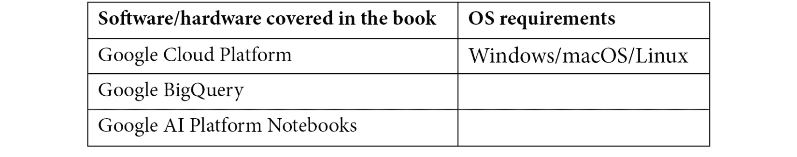

# 前言

**机器学习**（**ML**）的民主化是人工智能行业中增长最快的趋势之一。在这个领域，BigQuery ML 代表了连接数据分析与实施创新机器学习模型之间差距的基本工具。通过本书，您将有机会学习如何使用增量方法结合技术解释和动手练习来使用 BigQuery 和 BigQuery ML。在简短的介绍之后，您将立即能够使用 BigQuery ML 在具体用例上构建机器学习模型。到本书结束时，您将能够选择合适的机器学习算法来训练、评估和使用高级机器学习模型。

# 本书面向对象

本书面向数据科学家、数据分析师、数据工程师以及任何想要开始使用 Google 的 BigQuery ML 的人。如果您想加速机器学习模型的发展，或者您是一个希望以简单方式使用 SQL 应用机器学习的商业用户，本书也会很有用。需要具备基本的 BigQuery 和 SQL 知识。

# 本书涵盖内容

*第一章*, *Google Cloud 和 BigQuery 简介*，提供了对 Google Cloud 平台和 BigQuery 分析数据库的概述。

*第二章*, *设置您的 GCP 和 BigQuery 环境*，解释了配置您的第一个 Google Cloud 账户、项目和 BigQuery 环境。

*第三章*, *介绍 BigQuery 语法*，涵盖了在 BigQuery 上工作的主要 SQL 操作。

*第四章*, *使用线性回归预测数值*，解释了开发一个线性回归机器学习模型来预测自行车租赁服务的行程时长。

*第五章*, *使用二元逻辑回归预测布尔值*，解释了实现一个二元逻辑回归机器学习模型来预测出租车公司客户的行为的实现。

*第六章*, *使用多类逻辑回归对树木进行分类*，解释了开发一个多类逻辑机器学习算法，根据树木的自然特征自动分类树种。

*第七章*, *使用 K-Means 算法进行聚类*，介绍了如何实现一个聚类系统来识别出租车公司中表现最佳的司机。

*第八章*, *使用时间序列进行预测*，概述了设计并实现一个预测工具来预测和展示特定产品的销售情况。

*第九章*，*通过矩阵分解建议合适的产品*，解释了如何使用矩阵分解算法构建推荐引擎，为每位客户推荐最佳产品。

*第十章*，*使用 XGBoost 预测布尔值*，介绍了如何实现一个提升树机器学习模型来预测出租车公司客户的行为了。

*第十一章*，*实现深度神经网络*，涵盖了设计并实现一个**深度神经网络**（**DNN**）来预测自行车租赁服务的行程时间。

*第十二章*，*使用 AI Notebooks 与 BigQuery ML 结合使用*，解释了如何将 AI Platform Notebooks 与 BigQuery ML 集成以开发和共享机器学习模型。

*第十三章*，*使用 BigQuery ML 运行 TensorFlow 模型*，解释了 BigQuery ML 和 TensorFlow 如何协同工作。

*第十四章*，*BigQuery ML 技巧和最佳实践*，涵盖了在开发 BigQuery ML 模型期间可以应用的最佳实践和技巧。

# 要充分利用本书

您需要具备基本的 SQL 语法知识以及一些使用数据库的经验。

对机器学习基础知识的了解不是强制性的，但建议具备。



如果您使用的是本书的数字版，我们建议您亲自输入代码或通过 GitHub 仓库（下一节中提供链接）访问代码。这样做将帮助您避免与代码复制粘贴相关的任何潜在错误。

# 下载示例代码文件

您可以从 GitHub（[`github.com/PacktPublishing/Machine-Learning-with-BigQuery-ML`](https://github.com/PacktPublishing/Machine-Learning-with-BigQuery-ML)）下载本书的示例代码文件。如果代码有更新，它将在现有的 GitHub 仓库中更新。

我们还有其他来自我们丰富的图书和视频目录的代码包，可在[`github.com/PacktPublishing/`](https://github.com/PacktPublishing/)找到。去看看吧！

# 代码实战

您可以在[`bit.ly/3f11XbU`](https://bit.ly/3f11XbU)观看本书的“代码实战”视频。

# 下载彩色图像

我们还提供了一份包含本书中使用的截图/图表彩色图像的 PDF 文件。您可以从这里下载：[`static.packt-cdn.com/downloads/9781800560307_ColorImages.pdf`](https://static.packt-cdn.com/downloads/9781800560307_ColorImages.pdf)。

# 使用的约定

本书使用了多种文本约定。

`文本中的代码`：表示文本中的代码单词、数据库表名、文件夹名、文件名、文件扩展名、路径名、虚拟 URL、用户输入和 Twitter 账号。以下是一个示例：“使用 `ORDER BY` 子句根据特定字段列表对查询结果进行排序。”

代码块设置如下：

```py
UPDATE
    `bigqueryml-packt.03_bigquery_syntax.first_table`
SET
    description= 'This is my updated description'
WHERE
    id_key=1;
```

**粗体**：表示新术语、重要单词或屏幕上看到的单词。例如，菜单或对话框中的单词在文本中显示如下。以下是一个示例：“BigQuery 支持两种不同的 SQL 语法：**标准 SQL** 和 **旧版 SQL**。”

小贴士或重要注意事项

显示如下。

# 联系我们

我们欢迎读者的反馈。

`客户服务@packtpub.com`。

**勘误表**：尽管我们已经尽最大努力确保内容的准确性，但错误仍然可能发生。如果您在这本书中发现了错误，我们将非常感激您能向我们报告。请访问 [www.packtpub.com/support/errata](http://www.packtpub.com/support/errata)，选择您的书籍，点击勘误表提交表单链接，并输入详细信息。

`版权所有@packt.com`，并提供材料链接。

**如果您有兴趣成为作者**：如果您在某个领域有专业知识，并且您有兴趣撰写或为书籍做出贡献，请访问 [authors.packtpub.com](http://authors.packtpub.com)。

# 评论

请留下评论。一旦您阅读并使用过这本书，为何不在您购买它的网站上留下评论呢？潜在读者可以查看并使用您的客观意见来做出购买决定，Packt 公司可以了解您对我们产品的看法，我们的作者也可以看到他们对书籍的反馈。谢谢！

如需了解 Packt 的更多信息，请访问 [packt.com](http://packt.com)。
