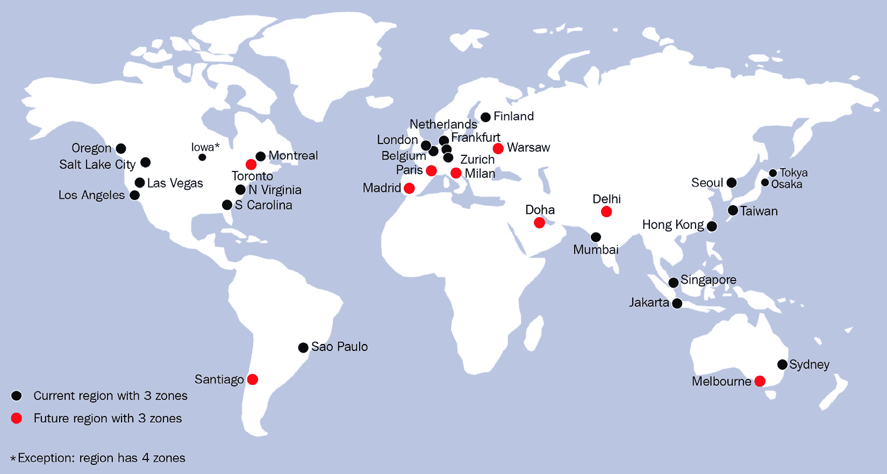
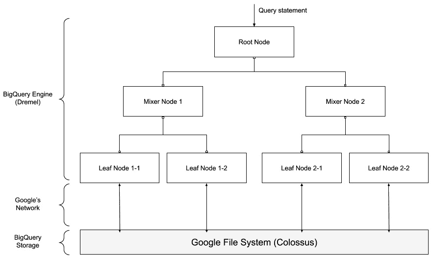
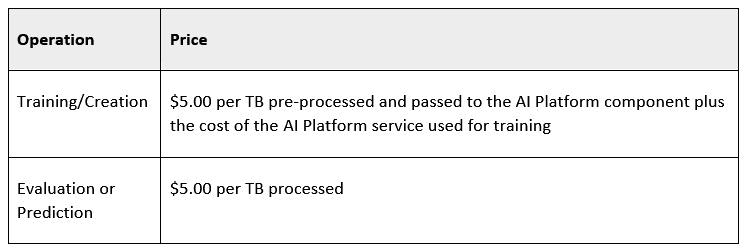
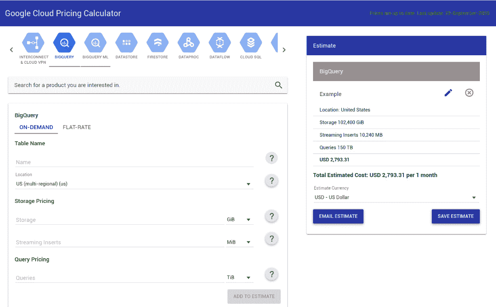

# *第一章*：Google Cloud 和 BigQuery 简介

公共云的采用使公司和用户能够访问创新且成本效益高的技术。这在大数据和**人工智能**（**AI**）领域尤其有价值，因为新的解决方案正在提供几年前仅凭本地系统似乎无法实现的可能性。为了在公司的日常业务中有效，新的 AI 能力需要在不同角色之间共享，而不仅仅是技术人员。目前，大多数云服务提供商都在应对将 AI 民主化到不同部门和不同技能的员工中的挑战。

在这种情况下，**Google Cloud** 提供了多项服务，以加速大量数据的处理并构建可以做出更好决策的**机器学习**（**ML**）应用程序。

在本章中，我们将逐步介绍在即将到来的动手活动中将非常有用的主要概念。我们将采用增量方法，探讨以下主题：

+   介绍 Google Cloud Platform

+   探索 GCP 上的 AI 和 ML 服务

+   介绍 BigQuery

+   发现 BigQuery ML

+   理解 BigQuery 定价

# 介绍 Google Cloud Platform

从 1998 年 Google Search 的推出开始，Google 开发了一个世界上最大和最强大的 IT 基础设施之一。今天，这个基础设施被数十亿用户用于使用 **Gmail**、**YouTube**、**Google Photo** 和 **Maps** 等服务。10 年后，在 2008 年，Google 决定将其网络和 IT 基础设施向商业客户开放，将最初为消费应用程序开发的架构转向公共服务，并推出了 **Google Cloud Platform**（**GCP**）。

Google 目前为大型企业和小型及中型企业提供 90 多项服务，涵盖以下类别：

+   **计算**：用于支持使用虚拟机（如 Google Compute Engine）、容器（如 Google Kubernetes Engine）或平台（如 AppEngine）的工作负载或应用程序。

+   **存储和数据库**：用于以简单方便的方式存储数据集和对象。一些示例包括 Google Cloud Storage、Cloud SQL 和 Spanner。

+   **网络**：用于通过 **虚拟私有云**（**VPC**）、防火墙和完全管理的全球路由器轻松连接全球不同位置和数据中心。

+   **大数据**：用于以结构化、半结构化或非结构化格式存储和处理大量信息。这些服务包括 Google DataProc、GCP 提供的 Hadoop 服务以及本书的主要焦点 BigQuery。

+   **人工智能和机器学习**：这个产品领域为各种用户提供各种工具，使他们能够在日常业务中利用 AI 和 ML。一些示例包括 TensorFlow、AutoML、Vision APIs 和本书的主要焦点 BigQuery ML。

+   **身份、安全和管理工作**：这个领域包括所有必要的服务，以防止未经授权的访问、确保安全和监控所有其他云基础设施。身份访问管理、密钥管理服务、云日志和云审计日志只是这些工具中的一些。

+   **物联网**（**IoT**）：用于将植物、车辆或任何其他对象连接到 GCP 基础设施，从而能够开发现代 IoT 应用案例。这个领域的核心组件是 Google IoT Core。

+   **API 管理**：工具，通过 REST API 向客户和合作伙伴公开服务，提供充分利用互连优势的能力。在这个支柱中，Google Apigee 是最著名的产品之一，并被认为是这个市场领域的领导者。

+   **生产力**：用于提高所有希望开始与 Google 合作并采用其商业方式的公司的工作效率和协作，通过 Google Workplace（以前称为 GSuite）强大的工具。

## 与 GCP 交互

所提到的所有服务都可以通过四个不同的接口访问：

+   **Google Cloud Console**：GCP 的基于网页的用户界面，可以通过兼容的网页浏览器（如 Google Chrome、Edge 或 Firefox）轻松访问。在本书的手动练习中，我们将主要使用 Google Cloud Console：

![图 1.1 – Google Cloud Console 截图

![img/B16772_01_001.jpg]

图 1.1 – Google Cloud Console 截图

+   **Google Cloud SDK**：可以通过安装客户端 SDK 来与 GCP 服务通过命令行交互。通过将这些任务和操作安排到脚本中，可以非常方便地自动化任务和操作。

+   **客户端库**：SDK 还包括一些客户端库，用于使用最常用的编程语言（如 Python、Java 和 Node.js）与 GCP 交互。

+   **REST API**：在 GCP 上执行的所有任务或操作都可以通过从任何兼容软件调用特定的 REST API 来执行。

现在我们已经学会了如何与 GCP 交互，让我们来看看 GCP 与其他云服务提供商有何不同。

## 发现 GCP 的关键差异化特点

GCP 不是市场上唯一的公共云服务提供商。其他公司也开始了这种业务，例如，与 **Amazon Web Services**（**AWS**）、**Microsoft Azure**、**IBM** 和 **Oracle**。因此，在我们深入本书内容之前，了解 GCP 与云市场中的其他提供有何不同可能很有价值。

每个云服务提供商都有自己的使命、战略、历史和优势。让我们看看为什么 Google Cloud 可以被认为与其他所有云服务提供商不同。

### 安全

Google 为其全球数据中心提供端到端的安全模型，使用由 Google 开发和使用的定制硬件，默认启用应用程序加密。Google 为 GCP 采用的安全最佳实践与用于运行拥有超过 10 亿用户的应用程序（如 Gmail 和 Google Maps）开发的相同。

### 全球网络和基础设施

在撰写本文时，Google 的基础设施在全球 24 个不同地区、74 个可用区域和 144 个网络边缘位置可用，使客户能够连接到 Google 的网络，并确保在带宽、网络延迟和安全方面提供最佳体验。此网络允许 GCP 用户在不同地区之间移动数据，而无需离开 Google 的专有网络，从而最大限度地降低在公共互联网上发送信息的风险。截至目前，估计大约 40% 的互联网流量通过 Google 的专有网络。

在以下图中，我们可以看到 GCP 区域在全球的分布情况：

](img/B16772_01_002.jpg)

图 1.2 – Google 全球可用性地图

最新版本的地图可以在以下网址查看：[`cloud.google.com/about/locations`](https://cloud.google.com/about/locations)。

### 无服务器和完全托管方法

Google 提供了许多完全托管和无服务器服务，以使客户能够专注于高价值活动，而不是维护操作。一个很好的例子是将在本章下一节介绍的 BigQuery，一个无服务器数据仓库。

### 环境可持续性

Google 数据中心使用的 100% 能源来自可再生能源。此外，Google 承诺到 2030 年成为第一家对所有运营（如数据中心和园区）实现无碳化的主要公司。

### 普及人工智能

Google 是人工智能行业的先驱，正在利用人工智能和机器学习来改进其消费产品，例如 Google Photos，同时也用于提高其数据中心性能和效率。所有关于人工智能和机器学习的 Google 专业知识都可以通过采用 GCP 服务，如 AutoML 和 BigQuery ML，由客户利用。这将是本书的主要内容。

既然我们已经讨论了 GCP 作为服务的一些关键要素，让我们更具体地看看人工智能和机器学习。

# 探索 GCP 上的 AI 和 ML 服务

在我们深入探讨 GCP 的所有 AI 和 ML 工具之前，记住 Google 是一家 AI 公司，并在其许多其他产品中嵌入 AI 和 ML 功能，为顾客提供最佳的用户体验，这一点非常重要。仅仅看看 Google 的产品，我们就可以很容易地感知到 AI 可以成为企业的关键资产。以下是一些例子：

+   Gmail 智能回复允许用户快速回复电子邮件，根据对话的上下文提供有意义的建议。

+   Google Maps 能够通过结合不同的数据源，精确预测我们从一地移动到另一地的时间。

+   Google Translate 为超过一百种语言提供翻译服务。

+   YouTube 和 Google Play Store 能够根据用户偏好推荐最佳观看视频或最有用的移动应用程序。

+   Google Photos 能够识别我们照片中的人、动物和地点，简化了归档和组织我们照片的工作。

Google 证明了利用人工智能和机器学习能力在我们的业务中开辟了新的机遇，增加了我们的收入，节省了金钱和时间，并为我们的客户提供了更好的体验。

为了更好地理解 GCP 在人工智能和机器学习服务方面的丰富性，重要的是强调 GCP 服务能够解决机器学习模型典型生命周期中出现的所有需求：

1.  数据集的摄取和准备

1.  模型的构建和训练

1.  评估和验证

1.  部署

1.  模型的维护和进一步改进

在以下图中，您可以查看整个 AI 和机器学习 GCP 产品组合：

![图 1.3 – 以其图标表示的 GCP 人工智能和机器学习服务

![img/B16772_01_003.jpg]

图 1.3 – 以其图标表示的 GCP 人工智能和机器学习服务

每一个之前提到的五个阶段都可以完全由用户管理或委托给 GCP 的自动化能力，根据客户的需求和技能。因此，可以将 GCP 提供的人工智能和机器学习服务分为三个子类别：

+   **核心平台服务**

+   **人工智能应用**

+   **解决方案**

对于这些子类别中的每一个，我们将介绍目前最重要的服务以及可能从中受益的一些典型用户。

## 核心平台服务

核心人工智能和机器学习服务是客户可以在 GCP 上使用的最细粒度项目，以开发人工智能和机器学习用例。它们为用户提供最大的控制和灵活性，以换取较少的自动化；用户还需要在机器学习方面拥有更多的专业知识。

### 处理单元（CPU、GPU 和 TPU）

使用传统的**基础设施即服务**（**IaaS**）方法，开发者可以为他们的 Google Compute Engine 实例配备强大的处理单元，以加速可能需要很长时间运行的机器学习模型的训练阶段，尤其是当需要处理复杂上下文或大量数据时。除了我们笔记本电脑上可用的**中央处理器**（**CPUs**）之外，GCP 还提供了由 Nvidia 制造的高性能**图形处理器**（**GPUs**）的使用，这些处理器可在云端使用以加快计算密集型任务的执行。除此之外，还有**张量处理单元**（**TPUs**），它们专门设计用于支持机器学习工作负载并执行矩阵计算。

### 深度学习 VM 镜像

对于数据科学家来说，最大的挑战之一是快速配置环境以开发他们的 ML 模型。因此，Google Cloud 提供了预配置的 **Google Compute Engine**（**GCE**）映像，可以轻松配置预构建的组件和库集，这些组件和库集专门用于 ML。

在以下屏幕截图中，您可以查看这些 **虚拟机**（**VM**）在 GCP 市场中的展示方式：

图 1.4 – GCP 市场中的深度学习 VM

**深度学习 VM 映像**也针对 ML 工作负载进行了优化，并且已经预先配置以使用 GPU。当从 GCP 市场中配置 GCE 映像时，它已经配置了最常用的 ML 框架和编程语言，例如 Python、TensorFlow、scikit-learn 等。这使得数据科学家能够专注于模型开发，而不是开发环境的配置和供应。

### TensorFlow

**TensorFlow** 是一个开源的数学、统计学和 ML 框架。它由 Google Brain 为 Google 内部使用而推出，后来在 Apache License 2.0 下发布。它仍然是大多数成功 Google 产品的核心。该框架原生支持 Python，但也可以与其他编程语言（如 Java、C++ 和 Go）一起使用。它需要 ML 专业知识，但允许用户在定制和灵活性方面取得很好的成果，以开发最佳的 ML 模型。

### AI 平台

**AI 平台**是 GCP 的一个集成服务，它提供无服务器工具来训练、评估、部署和维护 ML 模型。使用此服务，数据科学家可以只关注他们的代码，简化所有 ML 开发的辅助活动，如供应、维护和可扩展性。

### AI 平台 Notebooks

AI 平台 Notebooks 是一个完全托管的服务，为数据科学家提供了一个已经集成并连接到所有其他 GCP 资源的 **JupyterLab** 环境。类似于深度学习 VM 映像，**AI 平台 Notebooks** 实例预先配置了最新的 AI 和 ML 框架版本，允许您使用图表和书面说明来开发 ML 模型。

到目前为止所描述的所有服务都需要对 ML 有良好的了解，并且在最常用的编程语言中手动编码的实践经验。核心平台服务满足数据科学家和需要对其构建的解决方案有完全控制和灵活性的 ML 工程师的需求，他们已经拥有强大的技术技能。

## 构建模块

在核心平台服务之上，Google Cloud 提供了预构建的组件，可用于加速新 ML 用例的开发。这一类别包括以下方面：

### AutoML

与上一节中概述的服务不同，**AutoML**提供了即使在有限领域专业知识的情况下也能构建机器学习模型的能力。它利用 Google 的机器学习能力，并允许用户提供数据以训练 Google 已开发的算法的定制版本。AutoML 目前提供训练图像（**AutoML Vision**）、视频（**AutoML Video Intelligence**）、自由文本（**AutoML Natural Language**）、翻译（AutoML Translation）和结构化数据（**AutoML Tables**）模型的能力。当机器学习模型训练完成并准备好使用时，它将自动部署并通过 REST 端点提供。

### 预构建 API

Google Cloud 提供了预构建 API，这些 API 在底层利用机器学习技术，但已经过训练并准备好使用。API 通过标准 REST 接口公开，可以轻松集成到应用程序中，用于处理图像（**Vision API**）、视频（**Video API**）、自由文本（**Natural Language API**）、翻译（**Translation API**）、电子商务数据（**Recommendations AI**）和对话场景（**Speech-to-Text API**、**Text-to-Speech API**和**Dialogflow**）。使用预构建的机器学习 API 是通用应用程序的最佳选择，其中可以使用通用训练数据集。

### BigQuery ML

如本章后续部分将详细讨论**BigQuery ML**，目前你只需知道这个组件允许用户使用 SQL 语言，利用存储在 BigQuery 中的结构化数据和一系列支持的算法来构建机器学习模型。

这里描述的任何构建块都不需要任何特定的机器学习知识或任何编程语言的证明编码经验。实际上，这些服务是为那些不太熟悉机器学习但希望快速且轻松地开始使用的开发人员或业务分析师而设计的。另一方面，具有机器学习专业知识的科学家也可以利用构建块来加速模型开发，从而缩短解决方案的上市时间。

要查看构建块的摘要、用法和目标用户，让我们看看以下表格：

![图 1.5 – 构建块摘要表

![图片 B16772_01_005.jpg]

图 1.5 – 构建块摘要表

现在我们已经学习了构建块的基础知识，让我们来看看 GCP 提供的解决方案。

## 解决方案

按照增量方法，构建块和核心平台服务也捆绑在一起，以提供即插即用的解决方案。这些预构建模块可以被公司采用并立即用于改善他们的业务。这些解决方案在本节中介绍。

### AI Hub

Google Cloud 的**AI Hub**充当 AI 组件的市场。它可以以公共模式使用，以共享和使用社区开发并由 GCP 积极工作的资产，或者它可以以私有模式使用，以在您的公司内部共享 ML 资产。此服务的目标是简化不同用户之间有价值资产的共享，促进重用并加速新用例的部署。

在下面的屏幕截图中，您可以查看 AI Hub 的主页：

![Figure 1.6 – Screenshot of AI Hub on GCP]

![img/B16772_01_006.jpg]

图 1.6 – GCP 上 AI Hub 的屏幕截图

现在我们已经了解了 AI Hub 的作用，让我们来看看 Cloud Talent Solution。

### Cloud Talent Solution

Cloud Talent Solution 基本上是一个针对人力资源办公室的解决方案，利用 AI 改进候选人发现和招聘流程。我们不会进一步描述此解决方案，但将在本章末尾的*进一步资源*部分提供链接。

### 接触中心 AI

**接触中心 AI**是一种解决方案，可用于通过由 AI 和自动化驱动的接触中心来提高客户体验的有效性。该解决方案基于 Dialogflow 以及文本到语音和语音到文本 API。

### 文档 AI

此解决方案专注于文档处理，以提取相关信息并简化通常需要人工努力的业务流程。该解决方案能够解析 PDF 文件、图像和手写文本，将这些信息转换为数字化结构格式，使其可访问并可进行研究。

从它们的描述中可以轻易看出，Google 提供的 AI 解决方案更偏向于商业导向，旨在解决特定的挑战。它们可以配置和定制，但基本上是针对商业用户的。

在继续之前，让我们看一下以下表格，该表格总结了本节中解释的概念，并提供了不同 AI 和 ML 服务类别的清晰概述：

![Figure 1.7 – Summary of GCP AI and ML services]

![img/B16772_01_007.jpg]

图 1.7 – GCP AI 和 ML 服务的概述

小贴士

当您需要开发新的用例时，我们建议在尝试重新发明轮子之前，先使用预构建的解决方案和构建块。如果一个构建块已经满足您用例的所有要求，那么使用它将非常有价值。它将在开发和维护阶段节省时间和精力。只有在用例复杂或非常特别，无法使用构建块或解决方案解决的情况下，才开始考虑使用核心服务。

正如我们在本节中看到的，GCP 的 AI 和 ML 服务非常广泛。现在，让我们更深入地探讨本书的主要主题：Google BigQuery。

# 介绍 BigQuery

Google BigQuery 是谷歌在 2006 年内部构建的高度可扩展、无服务器、分布式数据仓库技术，并于 2010 年在 GCP 上公开发布。由于其架构，它能够存储 PB 级的数据，并以高性能和按需扩展查询它们。由于其无服务器特性，存储和查询数据的 BigQuery 用户无需管理底层基础设施，可以专注于实现带来商业价值的逻辑，节省时间和资源。

BigQuery 目前被许多大型企业使用，它们利用它来做出数据驱动的决策，包括 Twitter、家得宝和道琼斯。

## BigQuery 架构

BigQuery 具有分布式架构，在谷歌数据中心成千上万的节点上运行。您的数据集不是存储在单个服务器上，而是被分块并在不同地区复制，以确保最大性能和可用性。

在 BigQuery 中，存储层和计算层是完全解耦的。这意味着查询引擎在存储数据的服务器之外的其他服务器上运行。这一特性使 BigQuery 能够在数据量和查询执行方面提供出色的可扩展性。这种解耦范式仅得益于谷歌的 Petabit 网络，它利用谷歌在全球范围内专有的光纤电缆，将数据快速从一个服务器移动到另一个服务器。

现在让我们更深入地了解 BigQuery 如何管理存储和计算引擎。

### 存储层

与传统的数据仓库不同，BigQuery 以列格式而不是行格式存储数据。这种方法使您能够执行以下操作：

+   实现每个列的更好压缩率，因为列中的数据通常是同质的，更容易压缩。

+   减少读取的数据量，以获得数据仓库用例的最佳性能，这些用例通常基于表中的一小部分列和聚合操作，如总和、平均值和最大值。

所有数据都存储在谷歌的专有分布式文件系统 Google 文件系统（代号科洛苏斯）中。数据的分布允许它在发生故障的情况下保证更快的 I/O 性能和更好的数据可用性。Google 文件系统基于两种不同的服务器类型：

+   **主服务器**：不存储数据但负责管理每个文件元数据的节点，例如组成文件的每个数据块的位置和可用副本数量。

+   **数据块服务器**：实际存储跨不同服务器复制的文件数据块的节点。

在以下图中，您可以了解 Google 文件系统如何管理数据：

![图 1.8 – Google 文件系统（科洛苏斯）存储策略

![img/B16772_01_008.jpg]

图 1.8 – Google 文件系统（科洛苏斯）存储策略

现在我们已经了解了 BigQuery 如何处理大量数据，让我们看看计算层如何访问这些数据。

### 计算层（查询层）

完全与存储解耦，计算层负责接收来自 BigQuery 用户的查询语句并以最快的方式执行它们。查询引擎基于 Dremel 技术，该技术由谷歌开发并于 2010 年发表在论文中。该引擎利用多级树架构：

1.  树的根节点接收要执行的查询。

1.  根节点将查询分割并分配给其他名为混合器的中间节点。

1.  混合节点负责在将查询传递给叶节点或其他中间混合节点之前重写查询。

1.  叶节点负责从 Google 文件系统中并行读取数据块。

1.  当从文件系统中提取出正确的数据块时，叶节点会对数据进行计算，并最终将它们在其他的叶节点之间进行洗牌。

1.  计算结束时，每个叶节点生成一个结果，并将其返回给父节点。

1.  当所有结果返回到根节点时，查询的结果将被发送给请求执行的用户或应用程序。

基于 multi-level tree 的 BigQuery 查询执行过程在以下图中表示：

图 1.9 – BigQuery 引擎是一个多级树

每个节点提供多个处理单元，称为 BigQuery 插槽，以执行查询的业务逻辑。一个 BigQuery 插槽可以被视为 Dremel 节点上的虚拟 CPU。所需插槽的计算以执行特定查询的复杂性和受影响的数据量自动由 BigQuery 管理。

## BigQuery 相比传统数据仓库的优势

现在我们已经了解了 BigQuery 之下的技术架构，让我们看看这种架构如何转化为使用它的企业相对于其他传统本地数据仓库成为数据驱动型公司的优势。

### 无服务器

正如我们提到的，BigQuery 具有无服务器架构，这使用户免于管理服务器配置和维护，以及与操作系统升级和修补相关的所有维护操作，这些操作支持数据仓库的运行。得益于无服务器方法，用户可以轻松地将数据导入 BigQuery 并使用它，而无需进行容量规划或预先进行任何硬件和软件配置。这对于原型设计和实现快速失败的方法尤为重要，这种方法有利于创新和实验的文化。

### 可扩展性

无论您需要存储兆字节的数据还是拍字节的数据；BigQuery 都能在数据存储和处理方面为您提供最大的灵活性和可扩展性。得益于其多租户架构，小型或中型企业可以像最大型企业一样利用相同的创新功能，或者他们可以从一个小用例开始，根据业务需求进行扩展。传统的数据仓库技术使用相同的服务器进行存储和计算。因此，它们对于不平衡的用例（例如，需要大量数据存储但不需要高性能计算，或者相反）并不特别适合。得益于其解耦架构，正如我们在上一节中看到的，BigQuery 被设计为根据用户的实际需求独立扩展存储和计算能力，从而降低解决方案的总拥有成本。

### 可用性

多亏了其弹性、分布式架构，BigQuery 能够提供每月可用性百分比超过 99.99% 的 **服务级别协议** (**SLA**)。这种非常高的可用性标准是由 Google 无需 BigQuery 用户额外努力就授予的，用户无需关心高可用性或灾难恢复策略。

### 性能

BigQuery 引擎能够在几秒钟内查询千兆字节的数据，在几分钟内查询拍字节的数据。这种性能是使用传统的本地数据仓库很难实现的。更高的性能意味着可以更快地获得洞察力，以及处理大量数据，这些数据通常在没有大量硬件和软件投资的情况下，在本地是无法管理的。为了进一步提高性能，BigQuery 提供了启用 BigQuery BI Engine 的可能性。BigQuery BI Engine 是一个内存分析层，可以在 BigQuery 上激活以更快地执行查询，具有亚秒级延迟。

### 实时性

传统的数据仓库是为长时间批量操作设计的，通常无法管理实时工作负载。然而，BigQuery 提供了一个特定的接口来实时摄取数据，使其立即可用于分析。这一特性为希望加速其分析并克服数据仓库典型方法的公司开辟了新的可能性，数据仓库通常涉及处理前一天的业务情况。

### 格式灵活性

BigQuery 在 Google 文件系统中以压缩和优化的格式存储文件，但提供了以数据湖技术中通常使用的各种格式加载数据的选项。用户可以使用 Avro、ORC、CSV 和 JSON 格式将数据加载到 BigQuery 中。

### 创新功能

BigQuery 提供了两种在传统数据仓库中不可用的 SQL 扩展：

+   **BigQuery GIS**：通过 SQL 语句执行地理计算和操作，能够轻松管理地理空间数据

+   **BigQuery ML**：允许用户利用 SQL 语言训练、评估和运行 ML 模型，无需编程经验，加速创新用例的开发

### 安全性

默认情况下，BigQuery 在将客户数据存储在 Google 文件系统之前自动加密和解密数据。BigQuery 还负责管理和轮换加密和解密密钥。为了进一步提高安全性，BigQuery 提供了使用 **客户管理加密密钥**（**CMEKs**）的选项。在这种情况下，密钥由客户直接在 Google Cloud Key Management System 中管理。

通过设置 Google **身份访问管理系统**（**IAM**）中的正确角色，可以防止未授权的数据访问和使用。

### 与其他 GCP 服务的集成

使用 BigQuery 的一个巨大好处是与许多其他 GCP 服务本地的集成：

![图 1.10 – BigQuery 与其他 GCP 服务的集成]

![img/B16772_01_010.jpg]

图 1.10 – BigQuery 与其他 GCP 服务的集成

正如我们在前面的屏幕截图中可以看到的，Google BigQuery 可以使用外部表从 **Google Bigtable**、**Google Cloud Storage**、**Google Cloud SQL** 和 **Google Drive** 读取数据。这个功能可以简化从其他数据库到 BigQuery 的数据导入，这也可以使用 ETL/ELT 工具如 **Google Dataflow** 和 **Data Fusion** 来执行。当数据集存储在 BigQuery 中时，它们可以从其他 GCP 组件访问，例如用于数据处理和准备的 **Google DataProc**、**DataPrep**，用于数据可视化的 **Data Studio**、**Looker** 和 **Google Sheets**。BigQuery 与 AI Platform Notebooks 集成，允许数据科学家和工程师轻松地从他们的 Jupyter 环境访问数据。

总结来说，将数据引入 BigQuery 打开了大量可供用户根据需要使用的选项。

### 丰富的合作伙伴生态系统

除了与其他 GCP 服务的集成之外，Google 的合作伙伴还提供了与 BigQuery 的连接器和集成，从而创建了一个丰富的数据管理生态系统。一些例子包括 Informatica、Tableau、Fivetran、Talend 和 Confluent。

### 公共数据集

如果你想从头开始使用 BigQuery，你可以利用来自 **BigQuery 公共数据集计划**的现有公共表。该计划包含来自不同行业和不同国家关于不同主题的有趣数据集。我们将在下一章中使用的一些示例包括来自共享单车服务的交易、纽约市的开放数据和出租车行程记录。

## 与 BigQuery 交互

与 BigQuery 交互有不同的方式。它们是：

+   Google Cloud Console 中的 BigQuery 网页界面，可通过网络浏览器访问的图形用户界面，是交互 BigQuery 的最简单方式。

+   `bq` 命令行，在安装 Google Cloud SDK 时可用。它可以通过将它们包含在脚本中来自动化作业和命令。

+   BigQuery REST API。BigQuery 本地提供的 API 层可以用来将此服务与其他应用程序集成。

+   客户端库，以促进最常用编程语言的使用，例如 C#、Go、Java、Node.js、PHP、Python 和 Ruby。

+   由 Google 合作伙伴 Magnitude Simba Driver 开发的 JDBC/ODBC 驱动程序适用于 Windows、macOS 和 Linux 系统。

+   第三方和 Google 的合作伙伴为他们的应用程序开发了 BigQuery 连接器，例如 Tableau 用于商业智能，Informatica 和 Talend 用于数据摄取和集成。

对于我们的目的，我们将查看 Google Cloud Console 中可用的 BigQuery 网页 UI，它将在接下来的章节中用于使用 BigQuery ML 进行开发。

在下面的屏幕截图中，您可以看到 BigQuery UI 在 GCP 控制台中的外观：

![图 1.11 – GCP 控制台中可用的 BigQuery 网页和图形用户界面]

![图片 B16772_01_011.jpg]

![图 1.11 – GCP 控制台中可用的 BigQuery 网页和图形用户界面]

在左侧列中，可用的主要 BigQuery 功能以及数据集被列出并可供用户查看。在这种情况下，只有一个数据集。

屏幕的其余部分被开发画布占据，底部显示结果和输出。我们将在 *第二章*，“设置您的 GCP 和 BigQuery 环境”中学习如何使用 BigQuery 网页 UI，届时我们将创建 GCP 项目并开始使用 BigQuery。

## BigQuery 数据结构

BigQuery 结构，如表、视图和 ML 模型，组织在数据集中。每个数据集都是一个不同结构的容器，可以用来控制对底层数据结构的访问。数据集直接链接到以下内容：

+   托管数据集本身的 GCP 项目，通常与存储费用计费相关的计费账户相关联

+   在创建时定义的地理位置（区域或多区域），以后不能更改

+   分配给数据集的特定名称，应在 GCP 项目中是唯一的

在以下图中，您可以看到由项目、数据集、表和 BigQuery ML 模型组成的层次结构示例：

![图 1.12 – BigQuery 层次结构：数据集、表、视图和 ML 模型]

![图片 B16772_01_012.jpg]

![图 1.12 – BigQuery 层次结构：数据集、表、视图和 ML 模型]

在 GCP 上托管的数据集，*项目 A*，如果设置了正确的权限，也可以被链接到另一个 GCP 项目，*项目 B* 的用户查询。在这种情况下，存储费用将计费给托管数据集结构的 *项目 A*，而计算费用则计费给与 *项目 B* 相关的计费账户。这正是我们在未来章节中使用 BigQuery 公共数据集进行动手练习时会发生的情况。

小贴士

记住，你的查询只能包括位于同一区域的表。在 BigQuery 中，你不能查询存储在不同地理位置的表。如果你想在位于不同区域的表中执行查询，你需要将数据导出并导入到同一区域的数据集中，通过 Google Cloud Storage 进行。

现在我们已经了解了 BigQuery 的主要特性，让我们更具体地关注这本书的核心：BigQuery ML。

# 发现 BigQuery ML

开发一个新的机器学习模型可能需要大量的努力，可能是一项耗时的工作。它通常需要不同的技能，是一项复杂的活动，尤其是在大型企业中。机器学习模型的典型旅程可以用以下流程来概括：

![图 1.13 – 机器学习模型的典型开发生命周期

![img/B16772_01_013.jpg]

图 1.13 – 机器学习模型的典型开发生命周期

前两个步骤涉及初步的原始数据分析操作：

1.  在**数据探索和理解**阶段，数据工程师或数据科学家首先查看数据，试图理解数据集中所有列的含义，然后选择考虑的新用例中的字段。

1.  在**数据准备**阶段，数据工程师对数据集进行筛选、聚合和清理，使其可用于后续的训练阶段。

在这两个初步阶段之后，实际的机器学习开发过程开始：

1.  利用 TensorFlow 等机器学习框架和 Python 等编程语言，数据科学家将参与**设计机器学习模型**步骤，在训练数据集上尝试不同的算法。

1.  当选择了正确的机器学习算法后，数据科学家会执行**机器学习模型的调优**步骤，应用特征工程技术和超参数调优以获得更好的模型性能。

1.  当模型准备就绪时，在评估数据集上执行最终的**评估**步骤。这一阶段证明了机器学习模型在不同于训练数据集的新数据集上的有效性，并最终导致对资产的进一步优化。

1.  在开发过程之后，机器学习模型通常会在具有可扩展性和健壮性要求的生产环境中部署和使用。

1.  由于不同的输入数据或为了应用进一步的改进，机器学习模型最终也会在后续阶段进行更新。

所有这些步骤都需要不同的技能，并且基于不同利益相关者的协作，例如，数据分析师进行数据探索和理解，数据工程师进行数据准备，数据科学家进行机器学习模型的开发，最后是 IT 部门确保模型在安全、健壮和可扩展的生产环境中可用。

BigQuery ML 简化并加速了新机器学习模型整个开发过程，允许你执行以下操作：

+   设计、训练、评估和部署机器学习模型，利用 SQL 和公司现有的技能。

+   自动化大多数通常耗时很高的调优活动，以获得有效的模型。

+   确保您拥有一个强大、可扩展且易于使用的机器学习模型，利用我们已在本章“BigQuery 相对于传统数据仓库的优势”部分讨论的所有 BigQuery 原生功能。

在以下图中，您可以查看使用 BigQuery ML 的机器学习模型的生命周期：

图 1.14 – 使用 BigQuery ML 的机器学习模型开发生命周期

现在我们已经学习了 BigQuery ML 的基础知识，让我们来看看它可以带来的主要好处。

## BigQuery ML 优势

BigQuery ML 可以在机器学习模型的生命周期中带来商业和技术效益：

+   商业用户和数据分析师可以从传统的描述性和报告方法演变到新的预测方法，利用他们现有的 SQL 技能做出更好的决策。

+   技术用户可以在模型的调优阶段从 BigQuery ML 的自动化中受益，使用一个独特、集中的工具，可以加速整个机器学习模型开发过程。

+   由于构建机器学习模型所需的数据集已经对正确用户可用，无需从一个数据存储库移动到另一个数据存储库，这降低了合规性和数据重复的风险，因此开发过程进一步加快。

+   IT 部门无需管理基础设施以在生产环境中管理和使用机器学习模型，因为 BigQuery 的无服务器架构原生支持以可扩展、安全、稳健的方式支持模型。

在我们分析了 BigQuery ML 可以带来的好处之后，现在让我们看看支持的机器学习算法有哪些。

## BigQuery ML 算法

BigQuery ML 支持的机器学习算法列表正在迅速增长。目前，以下监督式机器学习技术目前得到支持：

+   **线性回归**：使用线性模型预测数值

+   **二元逻辑回归**：适用于在只有两种不同选项之间进行选择的分类用例（是或否、1 或 0、真或假）

+   **多类逻辑回归**：适用于在多个选项之间进行选择的分类场景

+   **矩阵分解**：基于历史信息开发推荐引擎

+   **时间序列**：利用过去的时间序列数据预测业务 KPI

+   **提升树**：适用于具有 XGBoost 的分类和回归用例

+   **AutoML 表**：从 BigQuery SQL 界面利用 AutoML 功能

+   **深度神经网络**（**DNN**）：用于开发分类或回归场景的 TensorFlow 模型，避免任何代码行

当训练数据集不包含标记数据时，学习被定义为无监督学习。BigQuery ML 目前支持以下内容：

+   **K-means 聚类**：用于相似对象的（人、事实、事件）数据分割

除了列出的内容外，BigQuery ML 还允许您使用 SQL 语句导入和使用预训练的 TensorFlow 模型。

# 理解 BigQuery 定价

在本节中，解释了 BigQuery 和 BigQuery ML 的定价模型。由于 GCP 服务的定价不断演变，我们建议您咨询[`cloud.google.com/bigquery/pricing`](https://cloud.google.com/bigquery/pricing)以获取最新更新。

让我们来看看 BigQuery 的模型。

## BigQuery 定价

BigQuery 定价根据该技术的使用情况进行扩展。有三个主要成本驱动因素：

+   **存储**：根据存储在 BigQuery 中的数据量计算的价格。

+   **计算资源**：用于查询、转换和处理数据或训练、评估和使用机器学习模型所使用的资源。

+   **流式传输**：根据通过 BigQuery 流式传输 API 摄取的记录数计算的价格。

### 存储

BigQuery 存储成本是根据您的数据集未压缩的大小计算的。BigQuery 提供两层存储：

+   **活跃**：在过去 90 天内插入或更新的表中的所有数据都被视为活跃数据。截至撰写本文时，活跃存储的收费为每月每太字节 20.00 美元。

+   **长期**：在过去 90 天内未修改的表中的所有数据都被视为长期存储。截至撰写本文时，长期存储的收费为每月每太字节 10.00 美元。Google 会自动应用长期存储的更改，无需 BigQuery 用户采取任何行动。

    小贴士

    多亏了 BigQuery 长期存储，不再需要将归档数据传输到 Google Cloud Storage 以节省费用。您可以在非常低的成本下保持数据在线并可供访问。

### 计算资源

BigQuery 计算成本是根据执行查询处理的数据量计算的。计算成本可能根据客户选择的模型而变化：

+   **按需**：这是默认选项。在这种情况下，用户只需为实际使用的资源付费。

+   **固定费率**：希望对 BigQuery 成本有精确估计并希望保持其稳定性的用户或公司可以启用此选项。在这种情况下，需要为特定时间段进行预留，并将固定数量的 BigQuery 插槽分配给一个或多个 GCP 项目。截至 2020 年 10 月，可以预留的最小插槽数量为 100，最小承诺时间为 60 秒。目前，Google 允许您根据实际需求选择不同的固定费率选项。此选项可以通过月度、年度或灵活承诺启用。灵活选项允许您购买 BigQuery 插槽的短期（至少 60 秒）。

    小贴士

    请记住，您不需要为存储 BigQuery 公共数据集付费：您只需为访问和查询它们付费。因此，使用 BigQuery 公共数据集可以是一种成本效益的方式，在 BigQuery 上进行测试时，只需支付计算费用，而不支付存储费用。

### 流式传输

将数据加载到 BigQuery 中通常是免费的，除了通过 BigQuery 流式 API 发生的摄取过程。截至 2020 年 10 月，您将为此接口每 200 MB 被摄取的数据支付 0.010 美元。每一行被视为至少 1 KB。

小贴士

如果您的用例不需要实时摄取数据，我们建议您使用批量加载机制将数据摄取到 BigQuery 中，这通常是免费的。

## BigQuery ML 定价

BigQuery ML 的定价模型与 BigQuery 计算成本类似。正如我们在上一节中看到的，客户可以在以下选项之间进行选择：

+   按需（按使用付费）定价模型

+   固定费率定价模型

如果客户已经选择激活具有固定数量 BigQuery 插槽的固定费率模式，BigQuery 插槽也将用于训练、评估和运行 BigQuery ML 模型。

如果客户使用按需定价模型，有必要将 BigQuery ML 算法分为两个不同的类别：

+   **外部模型**：此类包括提升树、深度神经网络（DNN）、TensorFlow 和 AutoML。这些模型在其他与 BigQuery 集成的 GCP 服务上训练，并按不同的方式收费。

+   **内部模型**：此类包括之前提到的所有直接在 BigQuery 上训练的算法。

在撰写本文时，内部模型的定价基于 ML 生命周期主要阶段（训练、评估和预测）处理的数据量：

图 1.15 – BigQuery ML 对内部 ML 模型的定价

外部模型的定价基于用于模型训练的外部 AI 平台资源的成本，以及额外应用于其上的 BigQuery ML 费用：

图 1.16 – BigQuery ML 对外部 ML 模型的定价

价格始终在审查中，并可能在 GCP 上发生变化。因此，我们建议您查阅 [`cloud.google.com/bigquery-ml/pricing`](https://cloud.google.com/bigquery-ml/pricing)。

## 免费操作和免费层

BigQuery 提供了各种免费操作，以及免费层，以免费尝试这项技术。

以下操作在 BigQuery 中始终免费：

+   加载数据

+   复制数据（除了为复制请求的额外存储空间）

+   导出数据

+   删除数据集、表、视图、分区或函数

+   任何元数据操作

+   读取元数据表和列

+   创建或替换**用户定义函数**（**UDFs**）

为了鼓励用户在 BigQuery 上进行实验，每个月用户都有能力利用一定阈值以下的免费操作预算，如下表所示：

图 1.17 – BigQuery ML 免费层

现在我们已经看到了我们可以使用的 BigQuery 免费层，让我们来看看价格计算器。

## 价格计算器

如果您想对使用按需定价的 BigQuery 的成本进行良好估算，您可以使用 Google Cloud 价格计算器：[`cloud.google.com/products/calculator`](https://cloud.google.com/products/calculator)。以下截图显示了存储、通过流式传输摄取和处理以下数据量的月度成本：

+   未压缩存储容量：10 TB

+   流式插入量：1 GB

+   查询处理的数据：150 TB：

图 1.18 – BigQuery 价格计算器

您可以使用价格计算器来估算所有其他 GCP 服务的消耗，以更好地了解您的 GCP 成本。

# 摘要

在本章的第一部分，我们迈出了学习 GCP 提供的内容、与其他公共云提供商的不同之处以及谷歌如何利用其无处不在的应用程序（如 Gmail 和 Google Maps）通过 GCP 为公司提供优质服务的第一步。

我们还发现，谷歌在 AI 和 ML 方面的丰富经验，通过制作如 Google Photos 等产品而发展起来，也构成了 GCP 服务的一部分。每个 AI 和 ML 服务都可以根据其技能和背景解决各种用例和不同类型的用户。例如，大多数技术用户，如数据科学家，可以利用 TensorFlow 在其开发的 ML 模型上获得极大的灵活性和控制力，而商业用户可以使用谷歌的解决方案通过文档 AI 和客服 AI 解决特定的挑战。中间类别由 AI 和 ML 构建块组成；这些服务可以加速新 ML 用例的开发或通过公司推广创新技术的使用。

这些构建块之一是 BigQuery：其扩展 BigQueryML 通过利用现有的 SQL 技能来开发机器学习模型。BigQuery ML 的使用可以为希望民主化机器学习的公司带来巨大利益，通过简化通常需要不同利益相关者、技能和工具参与的繁重且耗时的工作，使大量员工能够参与其中。

在下一章中，我们将通过创建一个新的谷歌云项目并首次访问 BigQuery 来进行实际操作。

# 进一步资源

+   **谷歌云产品**: [`cloud.google.com/products/`](https://cloud.google.com/products/)

+   **GCP 概述**: [`cloud.google.com/docs/overview`](https://cloud.google.com/docs/overview)

+   **为什么谷歌云平台与众不同**: [`cloud.google.com/free/docs/what-makes-google-cloud-platform-different`](https://cloud.google.com/free/docs/what-makes-google-cloud-platform-different)

+   **谷歌地区和位置**: [`cloud.google.com/about/locations`](https://cloud.google.com/about/locations)

+   **谷歌的可持续发展计划**: [`sustainability.google/commitments/`](https://sustainability.google/commitments/)

+   **AI Hub**: [`aihub.cloud.google.com/?hl=en`](https://aihub.cloud.google.com/?hl=en)

+   **云人才解决方案**: [`cloud.google.com/solutions/talent-solution?hl=en`](https://cloud.google.com/solutions/talent-solution?hl=en)

+   **BigQuery 技术架构**:[`cloud.google.com/files/BigQueryTechnicalWP.pdf`](https://cloud.google.com/files/BigQueryTechnicalWP.pdf)

+   **BigQuery 接口**: [`cloud.google.com/bigquery/docs/interacting-with-bigquery`](https://cloud.google.com/bigquery/docs/interacting-with-bigquery)

+   **BigQuery ML**: [`cloud.google.com/bigquery-ml/docs`](https://cloud.google.com/bigquery-ml/docs)
