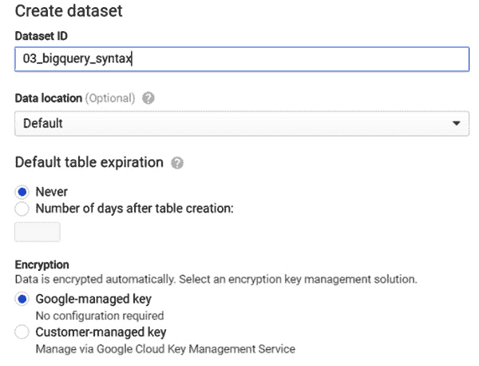
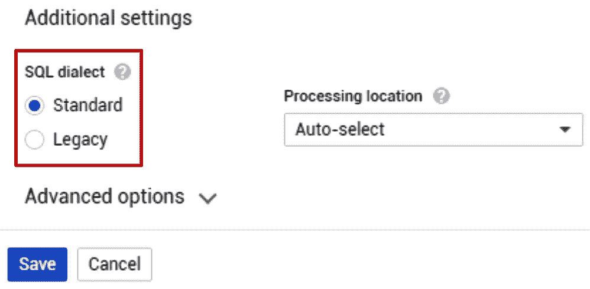

# *第三章*：介绍 BigQuery 语法

BigQuery 方言符合标准 ANSI 2011，对于熟悉其他方言并具备 SQL 经验的人来说，学习起来相当容易。在语法方面的主要差异由 BigQuery 扩展表示，这些扩展使我们能够使用诸如**机器学习**（**ML**）等高级功能。将 ML 能力引入 SQL 允许不同角色访问它。这种方法的目标是明确地使公司在不同职能中使用 ML 民主化，尽可能多地创造价值。通过 BigQuery ML，Google Cloud 正在填补技术熟练的 ML 技能人员和非常了解公司数据且多年从事相关工作业务分析师之间的差距。

为了增强你对 BigQuery 环境和其方言的信心，我们将探讨以下主题：

+   创建 BigQuery 数据集

+   发现 BigQuery SQL

+   深入了解 BigQuery ML

# 技术要求

本章需要访问网络浏览器和以下内容：

+   一个 GCP 账户来访问 Google Cloud 控制台

+   一个 GCP 项目来托管 BigQuery 数据集

现在我们已经准备好了技术要求，让我们深入了解创建 BigQuery 数据集的过程。

查看以下视频以查看代码的实际应用：[`bit.ly/3vR8I7f`](https://bit.ly/3vR8I7f)

# 创建 BigQuery 数据集

在下一节中创建的数据结构之前，有必要创建一个新的 BigQuery 数据集，该数据集将使用以下章节创建的数据结构。对于每个实践章节，我们将创建一个新的数据集，以隔离每个用例并保持逻辑上分离的结构：

1.  通过浏览 GCP 控制台中的 GCP 导航菜单并选择**BigQuery**服务来访问 BigQuery UI。

1.  在 BigQuery UI 的导航菜单中选择正确的 GCP 项目后，可以点击**创建数据集**按钮：

    

    图 3.1 – 创建新的 BigQuery 数据集

1.  在屏幕右侧出现的叠加窗口中，选择你偏好的`数据集 ID`，并保留所有其他选项使用默认值。为了托管本章的数据结构，我们建议使用名称`03_bigquery_syntax`。然后，选择**创建数据集**：




图 3.2 – 创建数据集屏幕

现在我们已经创建了第一个 BigQuery 数据集，让我们概述一下 BigQuery SQL 语法的核心特点。

# 发现 BigQuery SQL

BigQuery 支持两种不同的 SQL 方言：**标准 SQL**和**旧版 SQL**。在本书中，我们将使用标准 SQL，但如果你想要测试来自旧版应用程序的查询，了解旧版 SQL 是什么以及如何启用它可能是有用的。

正如我们已经提到的，BigQuery 是在谷歌内部开发的一个产品，最初是为了处理日志记录而实现的。查询引擎 Dremel 能够支持现在定义为 Legacy SQL 的一组有限的 SQL 操作。

在下面的屏幕截图中，您可以查看如何更改**SQL 方言**：



图 3.3 – 更改 SQL 方言的查询设置菜单截图

默认情况下，BigQuery UI 配置为使用 Standard SQL，但您可以通过在 SQL 语句的第一行使用特定的选项来更改 SQL 方言，即位于`#legacySQL`关键字下的`更多`按钮。**查询设置**按钮位于 BigQuery UI 的**更多**按钮下。

小贴士

为了开发新的用例，我们建议您采用 BigQuery Standard SQL，但请记住，您可能会发现仍然基于 Legacy SQL 的现有应用程序。如果您发现查询未通过查询编辑器验证，请在干预 SQL 语句之前尝试切换到 Legacy SQL。

## CRUD 操作

在本段中，我们将学习如何执行基本命令，以便在 BigQuery 中**创建、读取、更新和删除**（**CRUD**）对象。这不是所有可以与 BigQuery 一起使用的操作的详尽视图，但本节的目标是提供您面对本书下一章的实际操作章节所需的最少知识。

### 创建

这类语句通常用于在 BigQuery 中创建对象，如表、视图、**用户定义函数**（**UDFs**）和机器学习模型，或者向现有表中插入新记录：

1.  作为第一步，让我们在 BigQuery 中创建一个新的空表：

    ```py
    CREATE TABLE
      `bigqueryml-packt.03_bigquery_syntax.first_table` 
      ( id_key INT64,
        description STRING);
    ```

    查询语句的前两个词`CREATE TABLE`是自解释的，用于开始创建新表的创建。之后，我们可以找到我们正在创建的对象的标识符。它由以下字符串通过`.`字符连接而成：

    +   GCP 项目的名称：`bigqueryml-packt`

    +   BigQuery 数据集的标识符：`03_bigquery_syntax`

    +   要创建的表名：`first_table`

        标识符的字符串也被反引号字符包围，即`` ` ``。这个字符界定了我们对象名称的开始和结束。

        在两个圆括号之间，你可以看到字段列表，字段类型通过逗号字符分隔。在这个例子中，表只包含两个字段：数值型的`id_key`和文本型的`description`。

        小贴士

        如果已经存在具有相同名称的表，则可以使用`CREATE OR REPLACE TABLE`关键字创建一个新表来替换现有的表。这种技术在需要定期安排脚本多次运行时特别有用。这些关键字会自动清理先前执行的结果。

1.  现在我们已经创建了我们第一个空表，让我们`INSERT`我们的第一条记录：

    ```py
    INSERT INTO
      `bigqueryml-packt.03_bigquery_syntax.first_table` VALUES
      ( 1,
        'This is my first record inserted in BigQuery' );
    ```

    对于将新记录插入到我们的`first_table`中，我们使用了`INSERT INTO`和`VALUES`关键字。在圆括号之间，我们列出了要插入的实际值。在这种情况下，我们选择了整数`1`作为`id_key`，以及字符串`'This is my first record inserted in BigQuery'`，并用单引号括起来。

1.  在表上方，可以创建一个类似于`CREATE TABLE`的`CREATE VIEW`语句，唯一的区别在于视图结构基于`AS`关键字后面的`SELECT`语句。在这种情况下，`first_view`具有与`first_table`相同的结构，并且不对存储在表中的记录应用任何过滤器或转换。

### 读取

读取操作主要基于`SELECT`语句，并且可以应用于不同的数据库对象，如表和视图。

让我们在`first_table`表上执行一个`SELECT`语句：

```py
SELECT
  *
FROM
  `bigqueryml-packt.03_bigquery_syntax.first_table`
WHERE
  id_key=1;
```

要从表或视图中读取数据，必须使用`SELECT`关键字，后跟要读取的字段列表或通配符`*`，然后是`FROM`关键字和源数据结构的标识符。还可以包含一个`WHERE`子句来表示我们想要应用的所有逻辑过滤器。在这种情况下，我们只选择具有`id_key=1`的记录，这与我们之前插入到表中的唯一记录相对应。

小贴士

不建议使用通配符`*`，尤其是在具有大量列的表上。由于 BigQuery 具有列式存储，仅选择真正需要的字段可以显著提高查询的性能并降低计算成本。

在具有嵌套`SELECT`语句的层次查询中，可以使用`WITH`子句来提高查询的可读性：

1.  作为第一步，让我们创建一个嵌套的`SELECT`语句：

    ```py
    SELECT COUNT(*) FROM (
        SELECT
          *
        FROM
          `bigqueryml-packt.03_bigquery_syntax.first_table`
        WHERE
          id_key=1
      );
    ```

1.  之后，我们可以使用`WITH`子句重写相同的逻辑。查询变成了这个：

    ```py
    WITH records_with_clause AS (SELECT *
        FROM
          `bigqueryml-packt.03_bigquery_syntax.first_table`
        WHERE
          id_key=1)

    SELECT COUNT(*) FROM records_with_clause;
    ```

    在第二个查询中，`WITH`子句嵌入了`AS`关键字后面的逻辑，并用圆括号括起来。在定义了名为`records_with_clause`的`WITH`子句之后，这个查询的逻辑可以在下一个`SELECT COUNT`语句中再次调用。

    小贴士

    `WITH`子句不会创建临时表。使用`WITH`子句可以提高查询的可读性，尤其是在存在多个嵌套`SELECT`语句的情况下，但它不会影响查询的性能。

BigQuery 提供了利用许多其他操作符的可能性，这些操作符在本章中不会详细描述，因为它们在动手练习中不会广泛使用。这些附加操作符允许你执行以下操作：

+   使用`ORDER BY`子句根据特定的字段列表对查询结果进行排序。

+   使用`COUNT`、`SUM`、`MAX`、`AVG`以及`GROUP BY`和`HAVING`子句对查询结果应用聚合。

+   使用 `NEST`、`UNNEST`、`ARRAY_AGG` 和 `ARRAY_LENGTH` 管理数组数据类型。

+   使用 `INNER JOIN`、`LEFT OUTER JOIN`、`RIGHT OUTER JOIN` 和 `CROSS JOIN` 连接两个或多个表。

### 更新

尽管 BigQuery 是作为一个分析工具诞生的，但它支持更新操作，如 `UPDATE` 和 `MERGE`，并且可以用于更改 BigQuery 表中的现有记录。

为了更改记录或记录集的值，我们可以使用以下方式的 `UPDATE` 语句：

```py
UPDATE
    `bigqueryml-packt.03_bigquery_syntax.first_table`
SET
    description= 'This is my updated description'
WHERE 
    id_key=1;
```

在代码的前两行中，`UPDATE` 关键字后面跟着要应用操作的表的标识符。之后，`SET` 关键字定义了应更改的列。在这种情况下，`description` 将被修改。

`WHERE` 子句允许您仅对匹配过滤器的记录应用 `UPDATE` 操作。在这种情况下，只有 `id_key` 等于 `1` 的记录受到影响。

更新表的另一个强大语句是 `MERGE` 函数。此函数可以在单个 SQL 语句中应用插入、更新和删除操作，以合并两个不同表的记录。

### 删除

删除操作特别有用，可以删除记录或从 BigQuery 中删除对象以防止存储成本：

1.  作为第一步，我们可以使用以下 `DELETE` 语句从 `first_table` 表中删除一条记录：

    ```py
    DELETE
        `bigqueryml-packt.03_bigquery_syntax.first_table`
    WHERE 
        id_key=1;
    ```

    如果我们分析 SQL 代码，我们可以看到 `DELETE` 关键字后面跟着要应用操作的表的标识符。`WHERE` 子句过滤要删除的记录集。在这种情况下，只有 `id_key` 等于 `1` 的记录受到影响。

1.  另一种从表中删除记录的方法是使用 `TRUNCATE TABLE` 操作符。此函数允许您使用单个语句删除所有记录：

    ```py
    TRUNCATE TABLE 
      `bigqueryml-packt.03_bigquery_syntax.first_table`;
    ```

    在 `TRUNCATE` 之后，我们的 `first_table` 将继续存在，但将不包含任何记录。

1.  要删除整个表及其结构，我们可以使用 `DROP TABLE` 关键字：

    ```py
    DROP TABLE 
      `bigqueryml-packt.03_bigquery_syntax.first_table`;
    ```

    删除表将从数据集中移除它，使得数据结构不可访问。如果我们探索 `03_bigquery_syntax` 数据集的对象列表，我们可以看到 `first_table` 表不再可见：

    ![图 3.4 – 受 `DROP TABLE` 语句影响的表不再可见

    ![图片 B16722_03_004.jpg]

    图 3.4 – 受 `DROP TABLE` 语句影响的表不再可见

    在这种情况下，一个有趣的方面是，建立在 `first_table` 表之上的 `first_view` 仍然可见。

1.  如果我们尝试对其执行 `SELECT` 语句，将会引发以下错误：![图 3.5 – 当底层表被删除时查询视图会引发错误

    ![图片 B16722_03_005.jpg]

    图 3.5 – 当底层表被删除时查询视图会引发错误

    由 BigQuery 生成的错误会通知用户，底层表已不再可用且无法找到。

1.  为了保持我们的数据集一致性，最好也使用`DROP VIEW`语句删除视图：

    ```py
    DROP VIEW 
      `bigqueryml-packt.03_bigquery_syntax.first_view`;
    ```

    删除视图类似于删除表，但这个操作只影响元数据，因为视图实际上并不存储任何记录。

在本章的这一部分，我们发现了我们可以使用 BigQuery SQL 执行的主要操作；现在是我们深入 BigQuery ML 及其语法的时候了。

# 深入 BigQuery ML

在 BigQuery 中开发 ML 模型涉及三个主要步骤：

1.  **模型创建**，在这个阶段，你需要选择 ML 模型的**特征**和**标签**以及调整 ML 模型的选项。在这个阶段，BigQuery 将在你选择的训练集上运行 ML 模型的训练。

1.  **模型评估**允许你在不同的记录集上测试之前步骤中训练的模型，以防止任何**过拟合**。

1.  **模型使用**：当 ML 模型准备就绪时，我们可以将其应用于新的数据集，以便根据可用的特征进行预测或标签分类。

在接下来的段落中，我们将查看这三个阶段的语法以及这些语句是如何使用代码占位符构建的。

### 创建 ML 模型（训练）

当你确定了 ML 用例以及用于训练模型的记录集后，你可以开始使用以下查询来训练模型：

```py
CREATE MODEL`<project_name>.<dataset_name>.<ml_model_name>`
TRANSFORM (<list_of_features_transformed>
OPTIONS(<list_of_options>)
AS <select_statement>;
```

与创建 BigQuery 表的创建过程非常相似，训练新模型的语句包括以下内容：

+   `CREATE MODEL`关键字。

+   然后是新 ML 模型的名称。这个标识符由项目名称、数据集名称和 ML 模型名称的连接组成，由`.`字符分隔，并用反引号包围。

+   `TRANSFORM`子句不是必需的，但非常有用。它允许我们列出在训练之前应用于特征的预处理转换。将这些准备函数放在这里允许我们在实际使用模型时自动应用相同的操作。

+   一个`OPTIONS`列表要求我们指定我们想要使用的`model_type`，例如线性回归或逻辑回归。这个选项列表也用于通过`input_label_cols`关键字选择 ML 模型的标签列表。其他选项可以用来调整 ML 模型，这些将在本书的下一章节中解释，并伴有实际操作练习。

+   `AS`关键字后跟`SELECT`语句。这个语句定义了 ML 模型将要训练的记录集。

除了`CREATE MODEL`语句之外，我们还可以使用以下内容：

+   使用`CREATE OR REPLACE MODEL`创建新模型或用相同名称替换现有模型。

+   使用`CREATE MODEL IF NOT EXISTS`仅在不存在具有相同名称的模型时训练新模型。

现在我们已经了解了如何在 BigQuery ML 中创建 ML 模型，让我们看看下一个阶段：模型的评估。

### 评估 ML 模型

在一组记录上训练 ML 模型后，极其重要的是在不同于训练集的第二数据集上评估其性能，以避免任何**过拟合**。

重要提示

在术语过拟合中，我们指的是当 ML 模型从训练数据集中学习得很好，但在新的数据集上表现不佳的情况。这通常发生在模型过于依赖训练数据集的细节，并受到其中存在的噪声的影响。

根据在模型创建过程中选择的 ML 算法，我们可以选择不同的评估函数。

#### 评估函数

此函数可用于线性回归、逻辑回归、*k*-均值聚类、矩阵分解和基于 ARIMA 的时间序列模型：

```py
SELECT *
FROM ML.EVALUATE(
    MODEL `<project_name>.<dataset_name>.<ml_model_name>`,
          `<project_name>.<dataset_name>.<evaluation_table>`
    , STRUCT(<threshold> AS threshold));
```

`ML.EVALUATE`函数仅返回一条记录，其中包含我们已训练和评估的 ML 模型的关键性能指标。它返回的指标取决于模型类型。查询占位符由以下组成：

+   一个初始的`SELECT *`语句，允许我们检索评估阶段返回的所有字段。

+   从`ML`包中调用评估函数：`ML.EVALUATE`。

+   我们非常熟悉的 ML 模型标识符的语法：项目、数据集和模型名称。

+   `<evaluation_table>`是将在其上评估 ML 模型的表格。此表可以用`SELECT`语句替换，不是强制的。如果您不提供评估阶段的表，BigQuery 将使用整个训练集或其一部分来评估您的 ML 模型。

+   可选的`<threshold>`，可用于评估逻辑回归模型。如果此值未指定，BigQuery 将使用`0.5`作为默认值。

    小贴士

    要使用`ML.EVALUATE`函数，评估集的字段名称应与在模型创建期间使用的训练数据集的字段名称相匹配。

#### 混淆矩阵函数

此函数返回一个混淆矩阵来评估逻辑回归和多类逻辑回归模型的性能：

```py
SELECT *
FROM ML.CONFUSION_MATRIX(
    MODEL `<project_name>.<dataset_name>.<ml_model_name>`,
          `<project_name>.<dataset_name>.<evaluation_table>`
    , STRUCT(<treshold> AS threshold));
```

此函数返回两行两列，包含假阳性、假阴性、真阳性和真阴性的数量。与`EVALUATE`函数相比，在语法方面的唯一区别是通过使用`ML.CONFUSION_MATRIX`函数来表示。

#### ROC 曲线函数

此函数只能用于逻辑回归模型，并根据传递给函数的阈值数组返回多个记录：

```py
SELECT *
FROM ML.ROC_CURVE(
    MODEL `<project_name>.<dataset_name>.<ml_model_name>`,
          `<project_name>.<dataset_name>.<evaluation_table>`
    , GENERATE_ARRAY(<treshold_1>, <treshold_2>, <treshold_n> ));
```

我们可以从上一段分析的其他评估函数中看到的唯一有意义的区别是存在一个阈值数组。`GENERATE_ARRAY`函数创建一个数组，其中包含由逗号分隔的阈值值，并用圆括号括起来。

此函数的输出包括输入的阈值、召回值、假阳性率以及真阳性、假阳性、真阴性和假阴性的数量。

我们已经了解了 BigQuery ML 模型的所有评估技术，现在是时候看看如何应用它们并获取结果了。

### 使用 ML 模型

当我们对我们的 ML 模型的性能满意时，下一步就是使用它来实现我们的目标，并最终从实施中获得商业价值。

#### 预测函数

此函数适用于线性回归、逻辑回归、多类逻辑回归、*k*-均值聚类和导入的 TensorFlow 模型：

```py
SELECT *
FROM ML.PREDICT(
    MODEL `<project_name>.<dataset_name>.<ml_model_name>`,
          `<project_name>.<dataset_name>.<features_table>`
    , STRUCT(<treshold> AS threshold));
```

查询由以下内容组成：

+   使用 `SELECT * FROM` 语句获取 `ML.PREDICT` 函数返回的所有记录和字段。

+   `ML.PREDICT` 关键字，它接受用于预测的 ML 模型名称（`<ml_model_name>`）和包含要执行预测的特征的表（`<features_table>`）作为输入。

+   可选地，您可以为逻辑回归模型使用 `<threshold>` 值，后跟 `AS threshold` 关键字。

`ML.PREDICT` 函数为 `<features_table>` 中的每一行生成并返回一个记录。每一行由特征和预测标签组成。

#### 预测函数

此函数只能用于时间序列 ML 模型：

```py
SELECT *
FROM ML.FORECAST(
    MODEL `<project_name>.<dataset_name>.<ml_model_name>`,
    STRUCT(<horizon_value> AS horizon, 
           <confidence_value> AS confidence_level));
```

与 `PREDICT` 语句不同，它不需要表作为输入。它允许我们选择以下内容：

+   一个特定的 `<horizon_value>`。范围代表应预测的时间点数量。如果您不指定此值，BigQuery 将使用 `3` 作为默认值。

+   `confidence_level`，表示预测值中位于预测区间内的百分比。

#### 推荐函数

此函数只能用于矩阵分解 ML 模型。它为 `<user_item_table>` 表或训练表中的每个用户和物品组合返回一个评分：

```py
SELECT *
FROM ML.RECOMMEND(
     MODEL `<project_name>.<dataset_name>.<ml_model_name>`,
          (`<project_name>.<dataset_name>.<user_item_table>`));
```

查询由以下内容组成：

+   使用 `SELECT * FROM` 语句获取来自 `ML.RECOMMEND` 函数结果的记录和字段。

+   `ML.RECOMMEND` 关键字，它接受用于预测的 ML 模型名称（`<ml_model_name>`）作为输入，可选地，还包括包含用户和物品的输入表（`<user_item_table>`）。如果未提供表，BigQuery 将使用整个训练表进行推荐。

我们已经学习了如何应用 BigQuery ML 模型；如果模型不再需要，最好删除它以节省资源。让我们看看我们如何做到这一点。

### 删除 ML 模型

删除 ML 模型相当简单，语法与取消表类似：

```py
DROP MODEL `<project_name>.<dataset_name>.<ml_model_name>`;
```

使用 `DROP MODEL` 关键字后跟 BigQuery ML 模型的标识符，您可以从数据集中删除该资产。

你还可以使用 `DROP MODEL IF EXISTS` 关键字，这可以防止如果 BigQuery ML 模型已经被删除时发生错误。此操作仅在模型存在于数据集中时才会删除模型：

```py
DROP MODEL IF EXISTS
`<project_name>.<dataset_name>.<ml_model_name>`;
```

当模型被删除时，我们可以确信不会消耗资源来保持它在 BigQuery 中的活跃状态。

# 摘要

在本章中，我们学习了 BigQuery 语法的要点。在创建数据集之后，我们发现了如何创建表、插入记录以及读取存储在表中的行。你还学习了如何更新现有记录以及如何删除不再有用的行和对象，例如表和视图。

完成对 BigQuery SQL 语法的概述后，我们深入探讨了 ML 模型生命周期的主要阶段。实现用例的三个主要阶段是创建、评估和使用 ML 模型。对于训练阶段，我们了解到如何使用 SQL 训练和创建新模型。之后，我们了解了所有可以用来监控训练模型有效性的函数，评估其关键性能指标。最后，我们看到了如何在新数据集上使用训练模型进行推断以获得结果和预测、预报或建议。在本章结束时，我们还学习了如何删除不再有用的 BigQuery ML 模型。

现在我们已经清楚地理解了语法以及我们可以在 BigQuery 中使用的所有功能，是时候将这些概念应用到我们的第一个实际案例中。在下一章中，我们将开发我们的第一个 BigQuery ML 模型，用于预测纽约市一个重要自行车租赁服务中自行车行程的估计时长。

# 更多资源

+   **BigQuery 数据集**: [`cloud.google.com/bigquery/docs/datasets`](https://cloud.google.com/bigquery/docs/datasets)

+   **BigQuery SQL 语法**: [`cloud.google.com/bigquery/docs/reference/standard-sql/query-syntax`](https://cloud.google.com/bigquery/docs/reference/standard-sql/query-syntax)

+   **BigQuery 数据类型**: [`cloud.google.com/bigquery/docs/reference/standard-sql/data-types`](https://cloud.google.com/bigquery/docs/reference/standard-sql/data-types)

+   **创建模型语法**: [`cloud.google.com/bigquery-ml/docs/reference/standard-sql/bigqueryml-syntax-create`](https://cloud.google.com/bigquery-ml/docs/reference/standard-sql/bigqueryml-syntax-create)

+   **评估语法**: [`cloud.google.com/bigquery-ml/docs/reference/standard-sql/bigqueryml-syntax-evaluate`](https://cloud.google.com/bigquery-ml/docs/reference/standard-sql/bigqueryml-syntax-evaluate)

+   **混淆矩阵语法**: [`cloud.google.com/bigquery-ml/docs/reference/standard-sql/bigqueryml-syntax-confusion`](https://cloud.google.com/bigquery-ml/docs/reference/standard-sql/bigqueryml-syntax-confusion)

+   **ROC 曲线语法**: [`cloud.google.com/bigquery-ml/docs/reference/standard-sql/bigqueryml-syntax-roc`](https://cloud.google.com/bigquery-ml/docs/reference/standard-sql/bigqueryml-syntax-roc)

+   **预测语法**: [`cloud.google.com/bigquery-ml/docs/reference/standard-sql/bigqueryml-syntax-predict`](https://cloud.google.com/bigquery-ml/docs/reference/standard-sql/bigqueryml-syntax-predict)

+   **预测语法**: [`cloud.google.com/bigquery-ml/docs/reference/standard-sql/bigqueryml-syntax-forecast`](https://cloud.google.com/bigquery-ml/docs/reference/standard-sql/bigqueryml-syntax-forecast)

+   **推荐语法**: [`cloud.google.com/bigquery-ml/docs/reference/standard-sql/bigqueryml-syntax-recommend`](https://cloud.google.com/bigquery-ml/docs/reference/standard-sql/bigqueryml-syntax-recommend)
