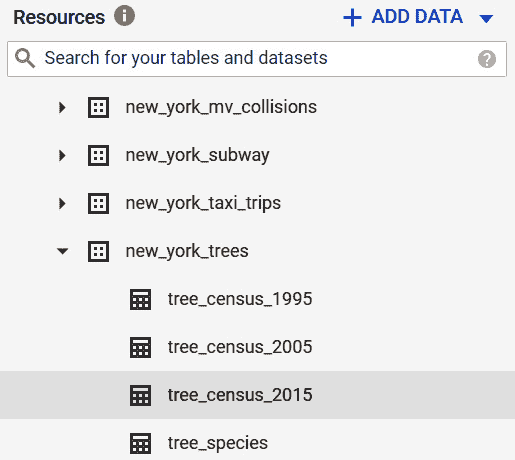
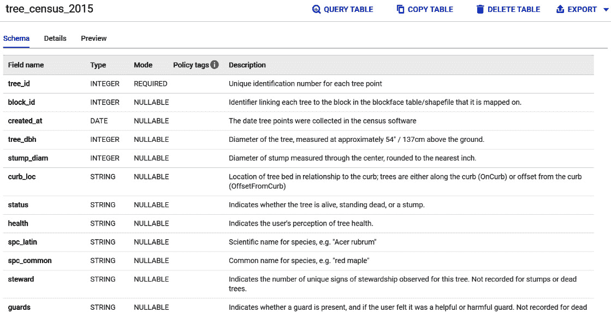
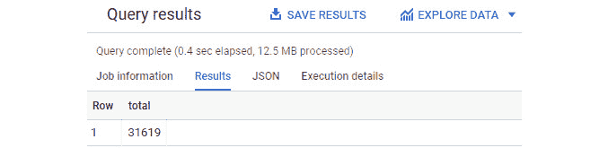
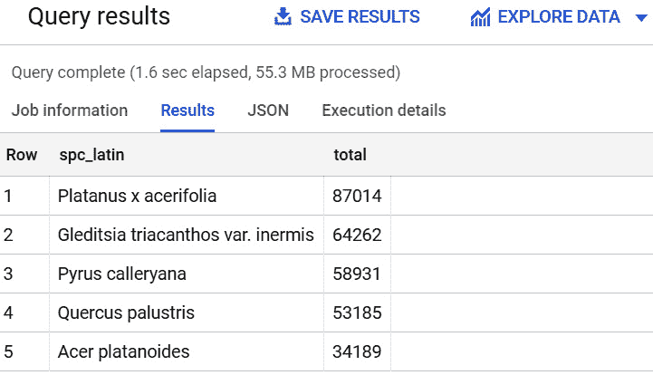
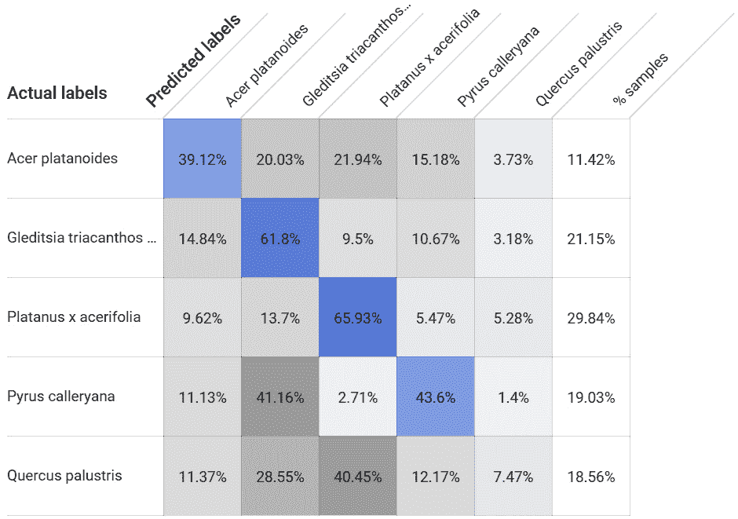
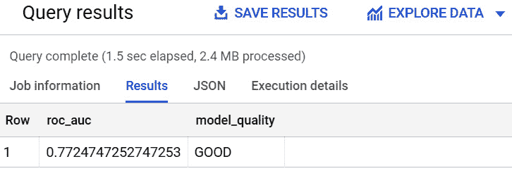
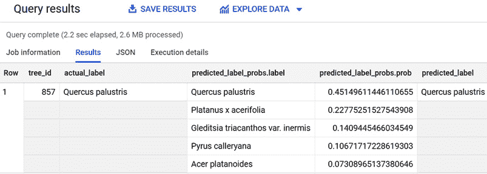

# 第六章：使用多类逻辑回归对树木进行分类

多类逻辑回归是用于将事件、实体和行为分类到固定数量类别的**机器学习（ML**）算法。当需要预测实体分类到多个组时，它可用于不同的行业和业务场景。一个典型的分类用例是，根据公司的盈利能力和偏好对公司客户群进行细分，以便针对最有效的营销活动定位正确的客户。

这种技术是二分类逻辑回归的扩展，使我们能够克服两个可能标签的限制，并使适用性扩展到其他可以找到多个类别进行识别的上下文中。

在本章中，我们将看到实现、评估和测试多类逻辑回归模型所需的所有阶段，利用 BigQuery ML。

在本章中，我们将讨论以下主题：

+   介绍业务场景

+   发现多类逻辑回归

+   探索和理解数据集

+   训练多类逻辑回归模型

+   评估多类逻辑回归模型

+   使用多类逻辑回归模型

+   提炼业务结论

# 技术要求

本章要求您访问网络浏览器，并具备利用以下功能的能力：

+   一个 GCP 账户以访问 Google Cloud 控制台

+   一个用于托管 BigQuery 数据集的 GCP 项目

现在我们已经准备好了技术要求，让我们深入分析和发展我们的 BigQuery ML 逻辑回归模型。

查看以下视频，了解代码的实际应用：[`bit.ly/3h4w7xG`](https://bit.ly/3h4w7xG)

# 介绍业务场景

对于这个业务场景，我们可以想象自己是一名纽约市的 ML 专家。在市应执行的所有活动中，对树木进行普查和验证其状况是最耗时的之一。

这些树木分布在新泽西市的不同区域，收集每棵树的信息是由志愿者或纽约市员工手动完成的。信息收集完成后，数据存储在数据库中，并通过 BigQuery 公共数据集公开，以便进行进一步分析([`console.cloud.google.com/marketplace/details/city-of-new-york/nyc-tree-census`](https://console.cloud.google.com/marketplace/details/city-of-new-york/nyc-tree-census))。

在以下图中，我们可以看到中央公园的一张照片，这是纽约市树木最多的区域之一：


图 6.1 – 纽约市中央公园的树木

为了支持和加速负责分类树木和评估其状况的人员的工作，你们的一位经理可能要求你构建一个机器学习模型。

机器学习模型的目标是根据树木的特征，如位置、大小和健康状况，自动将树木分类到不同的种类。

对于这个用例，我们只需关注城市中最常见的五种树木种类。

现在我们已经简要解释并理解了业务场景，让我们看看我们可以用来将对象或事件分类到多个类别的机器学习技术。

# 发现多类逻辑回归

在本节中，我们将学习多类逻辑回归的基础知识以及何时可以应用这项技术。

**多类逻辑回归**是一种分类技术，可以用来将事件、对象、客户或其他实体分类到多个类别。与二元逻辑回归不同，这个机器学习算法可以将输出值分类到超过两个离散类别。

为了预测多个标签中的一个，这个机器学习算法计算每个结果的概率，并选择概率最高的标签。

作为一种回归算法，标签的预测基于一组称为特征的独立变量，这些变量用于预测称为标签的因变量。

这种机器学习技术可以用来回答以下业务问题：

+   我的客户的评论是*中性*、*正面*还是*负面*？

+   我的客户属于*金*、*银*还是*铜*等级？

+   特定客户的流失概率是*高*、*中*还是*低*？

+   图像识别算法识别的是*猫*、*狗*、*老鼠*还是*牛*？

在我们的业务场景中，由于树木的种类有限，我们只关注五种，我们可以利用多类逻辑回归。具体来说，我们感兴趣的是根据树木的大小、位置和健康状况特征将其分类到五种种类之一。

训练多类逻辑回归模型意味着尝试找到可以用于输入变量（称为特征）和输出变量（称为标签）之间方程的系数值。

训练完成后，我们将利用**混淆矩阵**来评估我们的多类逻辑回归模型的表现。在多类逻辑回归中，混淆矩阵由多行和多列组成。

为了评估我们的机器学习模型的表现，我们还将使用**曲线下面积**（**AUC**）**接收者操作特征**（**ROC**）。

现在我们已经学习了多类逻辑回归的基础知识，是时候看看我们将用于构建机器学习模型的那个数据集了。

# 探索和理解数据集

正如我们在前面的用例中所做的那样，在深入开发机器学习模型之前，分析可用于解决我们用例的数据是必要的。

我们将首先分析表结构，以便清楚地了解可用于我们业务场景的数据。

## 理解数据

在本节中，我们将查看数据以了解其结构以及如何用它来构建我们的机器学习模型。

要开始探索数据，我们需要做以下几步：

1.  登录 Google Cloud 控制台，并通过导航菜单访问**BigQuery**用户界面。

1.  在我们创建的项目下创建一个新的数据集，该项目在*第二章*，*设置您的 GCP 和 BigQuery 环境*中提到。对于此用例，我们将使用默认选项创建数据集`06_nyc_trees`。

1.  打开 GCP 项目`new_york_trees`。

1.  如以下截图所示，BigQuery 公共数据集包含多个表，用于存储每 10 年收集的数据：

    图 6.2 – 纽约市树木公共数据集包含了每 10 年收集的树木普查数据

1.  我们将使用最新的一个：`tree_census_2015`。这个表包含了 2015 年在纽约市种植并注册的所有树木信息。

1.  让我们在 BigQuery 导航菜单中点击表名`tree_census_2015`以访问表的架构：

    图 6.3 – tree_census_2015 表的结构列出了所有可以作为标签和特征的字段

1.  每个字段都在**描述**列中有很好的描述。

    表中包含表示每种树木物种的科学名称的**spc_latin**列，该列以**STRING**形式表示。这个字段将是我们的机器学习模型的标签。

    为了对每棵树进行分类，我们可以利用其他字段中的信息。一些列描述了树木的大小。例如，**tree_dbh**测量树木的直径，**stump_diam**代表树桩的直径。我们还可以利用关于树木**健康状况**的信息。我们可以想象，一些物种比其他物种更健壮，更适合纽约市的天气。

    其他字段与树木在城市中的位置以及其生活环境的背景关系更为密切。为了训练我们的机器学习模型，我们可以使用树木所在的邮编区域：**zip_city**。其他一些例子包括包含树木种植区域名称的**boroname**列，以及代表树木所属地区的**nta_name**。

    我们还可以假设某些物种比其他物种更具侵入性——`sidewalk` 字段表示树木旁边的人行道是否因树木的根而受损、开裂或抬起。

    从架构的角度来看，此表包含大量可用于开发我们的分类模型的有用信息。让我们继续我们的分析，更深入地了解数据。

在本节中，我们已经分析了 `tree_census_2015` 表的元数据，现在是我们查看实际数据并开始查询的时候了。

## 检查数据质量

正如我们从之前的用例中已经理解的那样，数据质量对于构建有效的机器学习模型至关重要。在本节中，我们将应用一些数据质量检查，以确定应使用的正确记录：

1.  首先，我们将检查表 `tree_census_2015` 是否包含 `spc_latin` 等于 NULL 的记录。这是基本的，因为字段 `spc_latin` 将用作我们机器学习模型的标签：

    ```py
    SELECT  COUNT(*) total
    FROM    `bigquery-public-data.new_york_trees.tree_census_2015`
    WHERE
             spc_latin is NULL;
    ```

    代码块将统计表 ``bigquery-public-data.new_york_trees.tree_census_2015`` 中字段 `spc_latin` 为空的记录数量。

    在下面的屏幕截图中，您可以查看查询结果，其中我们得到了超过三千一的结果：

    

    图 6.4 – 查询结果显示某些行包含空标签

    因此，在接下来的查询中，我们将排除字段 `spc_latin` 为空的记录。

1.  仅关注字段 `spc_latin` 为 `NOT NULL` 的行，我们可以检查所有其他潜在特征字段上空值的存在：

    ```py
    SELECT  COUNT(*)
    FROM    `bigquery-public-data.new_york_trees.tree_census_2015`
    WHERE
             spc_latin is NOT NULL
             AND (
                zip_city is NULL OR
                tree_dbh is NULL OR
                boroname is NULL OR
                nta_name is NULL OR
                nta_name is NULL OR
                health is NULL OR
                sidewalk is NULL) ;
    ```

    此外，在这种情况下，查询的结果不是零。事实上，我们可以轻松地识别出三个在 `health` 和 `sidewalk` 字段中呈现 `NULL` 值的记录。

    我们将在机器学习模型生命周期的后续阶段过滤这些记录。

现在我们已经对我们的数据集进行了质量检查，并了解了哪些记录应该被过滤，让我们专注于分割我们的数据集，以便只针对树木的五种最频繁出现的物种创建我们的 BigQuery 机器学习模型。

## 数据集分割

在本节中，我们将准备我们将用于训练、评估和测试我们的机器学习模型的表。

为了我们的目的，我们将从数据集中提取出现频率最高的五种物种。之后，我们将创建用于训练、评估和测试我们的机器学习模型的 BigQuery 表：

1.  首先，我们将使用以下查询仅识别 `tree_census_2015` 表中的五种最频繁出现的物种：

    ```py
    SELECT   spc_latin,
             COUNT(*) total
    FROM    `bigquery-public-data.new_york_trees.tree_census_2015`
    WHERE
             spc_latin is NOT NULL
             AND zip_city is NOT NULL
             AND tree_dbh is NOT NULL
             AND boroname is NOT NULL
             AND nta_name is NOT NULL
             AND health is NOT NULL
             AND sidewalk is NOT NULL
    GROUP BY
             spc_latin
    ORDER BY
             total desc
    LIMIT 5;
    ```

    SQL 语句使用 `GROUP BY spc_latin` 子句和 `COUNT(*)` 操作符计算 `tree_census_2015` 表中每种物种出现的次数。

    查询按照`total`字段（包含`COUNT`的结果）的值以降序排列记录，最后，查询的结果集通过查询末尾的`LIMIT 5`子句限制为结果集的前五条记录。

    SQL 语句基于 BigQuery 公共表`tree_census_2015`，经过我们在前面的*检查数据质量*部分中确定的数据质量检查适当过滤。

    在下面的屏幕截图中，我们可以看到查询结果和我们的数据集中最常见的树木物种：

    

    图 6.5 – 查询的结果显示了纽约市最常见的树木

    从查询结果中，我们可以轻松地读取从最常见到最不常见的树木的拉丁学名。

1.  由于我们将在接下来的 SQL 查询中使用这五种物种的子集，我们可以在我们的`SELECT`语句的开头添加一个`CREATE TABLE`语句，以便将结果物化到`top5_species`表中：

    ```py
    CREATE OR REPLACE TABLE `06_nyc_trees.top5_species` AS
          SELECT   spc_latin,
             COUNT(*) total
          FROM    `bigquery-public-data.new_york_trees.tree_census_2015`
          WHERE
                   spc_latin is NOT NULL
                   AND zip_city is NOT NULL
                   AND tree_dbh is NOT NULL
                   AND boroname is NOT NULL
                   AND nta_name is NOT NULL
                   AND health is NOT NULL
                   AND sidewalk is NOT NULL
          GROUP BY
                   spc_latin
          ORDER BY
                   total desc
          LIMIT 5;
    ```

    通过执行查询，我们将得到创建一个新表的创建，该表仅包含两个字段和五条记录。`spc_latin`代表树木的物种，而`total`计算每个物种在原始数据集中的出现次数。

1.  现在，我们可以利用`top5_species`表来过滤仅关注物种，并创建训练表：

    ```py
    CREATE OR REPLACE TABLE `06_nyc_trees.training_table` AS 
    SELECT  *
    FROM    `bigquery-public-data.new_york_trees.tree_census_2015`
    WHERE
             zip_city is NOT NULL
             AND tree_dbh is NOT NULL
             AND boroname is NOT NULL
             AND nta_name is NOT NULL
             AND health is NOT NULL
             AND sidewalk is NOT NULL
             AND spc_latin in 
             (SELECT spc_latin from  `06_nyc_trees.top5_species`)
             AND MOD(tree_id,11)<=8;
    ```

    查询通过`SELECT *`语句创建一个包含原始数据集中所有列的表。它应用了所有必要的过滤器，以获取`spc_latin`标签的非空值以及所有其他潜在特征。

    使用`IN`子句，`training_table`将只包含与数据集中最频繁的五种物种相关的记录。

    查询的最后一条语句，带有`MOD(tree_id,11)<=8`子句，使我们能够只从整个记录集中选择 80%的记录。`MOD`代表模运算，返回`tree_id`除以 11 的余数。

1.  使用类似的方法，我们可以创建用于评估我们的机器学习模型的表：

    ```py
    CREATE OR REPLACE TABLE `06_nyc_trees.evaluation_table` AS 
    SELECT  *
    FROM    `bigquery-public-data.new_york_trees.tree_census_2015`
    WHERE
             zip_city is NOT NULL
             AND tree_dbh is NOT NULL
             AND boroname is NOT NULL
             AND nta_name is NOT NULL
             AND health is NOT NULL
             AND sidewalk is NOT NULL
             AND spc_latin in 
             (SELECT spc_latin from `06_nyc_trees.top5_species`) 
             AND MOD(tree_id,11)=9;
    ```

    对于`evaluation_table`，我们将通过`MOD(tree_id,11)=9`过滤器选择仅 10%的记录。

1.  最后，我们将执行以下 SQL 语句以创建用于应用我们的多类分类模型的表：

    ```py
    CREATE OR REPLACE TABLE `06_nyc_trees.classification_table` AS 
    SELECT  *
    FROM    `bigquery-public-data.new_york_trees.tree_census_2015`
    WHERE
             zip_city is NOT NULL
             AND tree_dbh is NOT NULL
             AND boroname is NOT NULL
             AND nta_name is NOT NULL
             AND health is NOT NULL
             AND sidewalk is NOT NULL
             AND spc_latin in 
             (SELECT spc_latin from `06_nyc_trees.top5_species`) 
             AND MOD(tree_id,11)=10;
    ```

    `classification_table`与数据集的前几部分非常相似，但多亏了`MOD`函数，它将包含数据集剩余的 10%。

在本节中，我们分析了包含有关纽约市树木信息的`new_york_trees`数据集。我们对数据进行了一些数据质量检查，以排除空值。然后，我们分割了数据，重点关注表中出现的五种最常见的物种。现在我们已经完成了准备工作，是时候继续前进并开始训练我们的 BigQuery ML 模型了。

# 训练多类逻辑回归模型

现在我们已经清楚地理解了数据结构，并且将其分割成多个表格以支持 ML 模型生命周期的不同阶段，让我们专注于我们多类逻辑回归模型的训练。我们将执行 SQL 查询来创建我们的多类逻辑回归模型：

1.  让我们开始创建我们 ML 模型的第一版本：

    ```py
    CREATE OR REPLACE MODEL `06_nyc_trees.classification_model_version_1`
    OPTIONS
      ( model_type='LOGISTIC_REG',
        auto_class_weights=TRUE
      ) AS
    SELECT
      zip_city,
      tree_dbh,
      spc_latin as label
    FROM
      `06_nyc_trees.training_table` ;
    ```

    创建`classification_model_version_1`模型所使用的查询仅基于两个特征：邮编区域和树木直径。

    SQL 语句以关键字`CREATE OR REPLACE MODEL`开始，用于运行训练，后面跟着`OPTIONS`子句。在选项中，我们可以指定模型类型等于`LOGISTIC_REG`和`auto_class_weights=TRUE`。这个选项在我们面对不平衡的训练数据集，某些标签出现频率高于其他标签时尤其有用。在我们的案例中，最常见的物种的出现次数是第五个物种的两倍以上。因此，我们应用了这种调整。

    重要提示

    BigQuery ML 语法在二元逻辑回归和多类逻辑回归之间没有区别。在两种情况下，BigQuery ML 模型类型都是`LOGISTIC_REG`。差异是由训练数据集列标签中出现的不同值的数量引起的。如果标签只包含两个值，BigQuery ML 将训练二元逻辑回归。如果标签包含超过两个不同值，模型将作为多类逻辑回归进行训练。

1.  训练执行后，我们可以通过点击导航菜单中的**classification_model_version_1**并选择**评估**选项卡来访问我们第一个 ML 模型的信息。

    以下截图展示了我们第一次尝试的关键性能指标：

    ![Figure 6.6 – The Evaluation tab shows the performance metrics related

    到选定的 BigQuery ML 模型

    ![img/B16722_06_006.jpg]

    Figure 6.6 – The Evaluation tab shows the performance metrics related to the selected BigQuery ML model

    为了了解我们 ML 模型的有效性，我们可以查看**ROC AUC**值为**0.7383**。

    通过在**评估**选项卡中用鼠标向下滚动，我们可以查看我们多类逻辑回归模型的混淆矩阵。

    在以下图中，混淆矩阵显示了训练数据集中预测和实际标签的百分比：

    

    图 6.7 – 评估选项卡显示了与所选 BigQuery ML 模型相关的混淆矩阵

    通过查看混淆矩阵，我们可以直观地注意到，我们的机器学习模型在某些物种上表现相当好，但在其他物种上表现非常差。例如，当实际标签是**Quercus palustris**时，在 40%的情况下，机器学习模型建议的是不同的物种：**Platanus x acerifolia**。

1.  让我们尝试通过以下 BigQuery ML SQL 语句添加新特征来改进我们的模型：

    ```py
    CREATE OR REPLACE MODEL `06_nyc_trees.classification_model_version_2`
    OPTIONS
      ( model_type='LOGISTIC_REG',
        auto_class_weights=TRUE
      ) AS
    SELECT
      zip_city,
      tree_dbh,
      boroname,
      nta_name,
      spc_latin as label
    FROM
      `06_nyc_trees.training_table` ;
    ```

    与第一次尝试相比，我们在模型的训练中加入了额外的特征。实际上，我们将`boroname`字段和`nta_name`中包含的区名添加到了特征列表中。

    执行 SQL 语句后，让我们访问新模型的**评估**选项卡，看看我们是否提高了其性能。查看**ROC AUC**值为**0.7667**，我们可以看到我们模型性能的轻微提升。

1.  作为最后的尝试，我们将通过添加额外的特征来丰富我们的机器学习模型。新字段与树木的健康状况和根的大小相关：

    ```py
    CREATE OR REPLACE MODEL `06_nyc_trees.classification_model_version_3`
    OPTIONS
      ( model_type='LOGISTIC_REG',
        auto_class_weights=TRUE
      ) AS
    SELECT
      zip_city,
      tree_dbh,
      boroname,
      nta_name,
      health,
      sidewalk,
      spc_latin as label
    FROM
      `06_nyc_trees.training_table`;
    ```

    与之前的机器学习模型相比，在`classification_model_version_3`中，我们包括了`health`字段，它描述了我们的树木的健康状况，以及`sidewalk`字段，用于指定树木的根是否损坏了相邻的人行道。

1.  查看我们最后一个机器学习模型在`0.7696`的性能。

    小贴士

    尽管使用更多特征可以增加 BigQuery ML 分类模型的 ROC AUC 值，但我们需要考虑性能提升和实现它所花费的资源之间的平衡。在现实场景中，尤其是在数据量真的很大时，我们需要选择那些可能对我们 BigQuery ML 模型性能产生最高影响的特征。

在本节中，我们创建了不同的机器学习模型，尝试在我们的数据集中使用不同的特征。在下一节中，我们将使用具有最高 ROC AUC 值的模型：`classification_model_version_3`。

接下来，让我们利用评估数据集评估我们的机器学习模型的表现。

# 评估多类逻辑回归模型

在本节中，我们将执行查询以检查多类逻辑回归模型的表现。

对于我们的 BigQuery ML 模型的评估阶段，我们将使用`ML.EVALUATE`函数和`evaluation_table`表，该表专门创建用于托管评估记录。

如我们所见，评估是在模型训练阶段使用的相同字段上进行的，但这些字段是从完全独立于训练数据集创建的`evaluation_table`表中提取的。

外部`SELECT`语句提取了`ML.EVALUATE`函数返回的`roc_auc`值。它还提供了一个从`'POOR'`开始，到`'EXCELLENT'`等级，经过一些中间阶段如`'NEEDS IMPROVEMENTS'`和`'GOOD'`，的模型质量的描述。

让我们执行以下查询以提取我们 ML 模型的关键性能指标：

```py
SELECT
  roc_auc,
  CASE
    WHEN roc_auc > .9 THEN 'EXCELLENT'
    WHEN roc_auc > .8 THEN 'VERY GOOD'
    WHEN roc_auc > .7 THEN 'GOOD'
    WHEN roc_auc > .6 THEN 'FINE'
    WHEN roc_auc > .5 THEN 'NEEDS IMPROVEMENTS'
  ELSE
  'POOR'
END
  AS model_quality
FROM 
  ML.EVALUATE(MODEL `06_nyc_trees.classification_model_version_3`,
    (
    SELECT
       zip_city,
       tree_dbh,
       boroname,
       nta_name,
       health,
       sidewalk,
       spc_latin as label
     FROM `06_nyc_trees.evaluation_table`));
```

从以下截图，我们可以看到查询结果——**roc_auc**值达到了 0.77 以上。我们的 BigQuery ML 模型的结果可以被认为是**良好**的：



图 6.8 – 查询提取 BigQuery ML 模型的 ROC AUC 值和模型质量的简短描述

现在我们已经验证了该机器学习模型在非重叠评估数据集上也能保持其性能，我们可以开始使用它来对`classification_table`表中的树木进行分类。

# 使用多类逻辑回归模型

在本节中，我们将测试我们的 ML 模型并分析结果。

要使用我们的 BigQuery ML 模型，我们将使用`ML.PREDICT`函数和`classification_table`表，该表存储了记录，以测试我们的模型，如下代码块所示：

```py
SELECT
  tree_id,
  actual_label,
  predicted_label_probs,
  predicted_label
FROM
  ML.PREDICT (MODEL `06_nyc_trees.classification_model_version_3`,
    (
    SELECT
       tree_id,
       zip_city,
       tree_dbh,
       boroname,
       nta_name,
       health,
       sidewalk,
       spc_latin as actual_label
    FROM
      `06_nyc_trees.classification_table`
     ));
```

查询语句由`SELECT`关键字组成，它提取了`tree_id`、字段中物种的实际值`actual_label`以及预测字段`predicted_label_probs`和`predicted_label`。

`ML.PREDICT`函数应用于`SELECT`语句，从`classification_table`中提取特征和实际物种。`actual_label`字段将仅作为预测的基准，而不是在预测阶段使用。

在以下截图中，我们可以看到之前查询执行得到的记录的结构：



图 6.9 – 分类模型生成的输出数据集的记录

在这种情况下，**tree_id**等于**857**，这棵树是**Quercus palustris**，并且被 BigQuery ML 模型正确分类，因为**predicted_label**与实际值完全相同。**predicted_label_probs**表示最高分类标签的置信度为 45%。所有其他可能的物种都由较低的几率来表征。

现在我们已经应用了我们的模型，让我们对分类用例的一些最终考虑进行阐述。

# 提出业务结论

使用上一节中得到的**多类逻辑回归模型**的结果，我们将对 ML 模型的有效性得出一些结论。

在之前的查询中添加一个父`SELECT COUNT`语句，我们可以计算与总记录数相比有多少预测是正确的。

让我们执行以下查询来计算我们的 BigQuery ML 模型在`classification_table`表中正确分类树木的频率：

```py
SELECT COUNT(*)
FROM (
      SELECT
        tree_id,
        actual_label,
        predicted_label_probs,
        predicted_label
      FROM
        ML.PREDICT (MODEL `06_nyc_trees.classification_model_version_3`,
          (
          SELECT
             tree_id,
             zip_city,
             tree_dbh,
             boroname,
             nta_name,
             health,
             sidewalk,
             spc_latin as actual_label
          FROM
            `06_nyc_trees.classification_table`
           )
        )
)
WHERE
      actual_label = predicted_label;
```

`SELECT COUNT`查询的结果返回了 13,323 个预测值，其中正确预测的标签值为 13,323。

考虑到`classification_table`表的总大小为 27,182，我们可以声明在 49%的情况下，我们的 ML 模型能够根据其特征和位置预测正确的树种。

这可能看起来是一个不好的结果，但我们需要考虑多分类逻辑回归比二分类更复杂，因为存在多个选项可能会误导我们模型的结果。

# 摘要

在本章中，我们构建了我们的第一个多分类模型。在简要介绍用例之后，我们发现了多分类逻辑回归是什么以及它是如何根据特征将事件、行为和对象分类到两个以上类别的。

在深入开发 ML 模型之前，我们分析了与纽约市树木相关的数据集模式，并应用了一些必要的质量检查，以构建一个有效的 ML 模型。

在训练阶段，我们使用不同的特征训练了三个不同的 ML 模型，以逐步提高 BigQuery ML 模型的表现。

然后，我们选择了第三个 ML 模型，并对其进行了评估。在这个阶段，我们注意到 ML 模型能够在新记录上保持其性能，并准备进入下一阶段。

在最后一步，我们使用我们的 ML 模型将纽约市的树木分类为五个不同的类别，并利用它们的特征，如大小、健康状况和在城市中的位置。

我们还计算出我们的分类模型在 49%的情况下能够正确分类树种。

在下一章中，我们将介绍无监督 ML 和 K-Means 聚类技术。

# 进一步资源

+   **纽约市树木普查公共数据集**：[`console.cloud.google.com/marketplace/product/city-of-new-york/nyc-tree-census`](https://console.cloud.google.com/marketplace/product/city-of-new-york/nyc-tree-census)

+   **BigQuery ML 创建模型**：[`cloud.google.com/bigquery-ml/docs/reference/standard-sql/bigqueryml-syntax-create`](https://cloud.google.com/bigquery-ml/docs/reference/standard-sql/bigqueryml-syntax-create)

+   **BigQuery ML 评估模型**：[`cloud.google.com/bigquery-ml/docs/reference/standard-sql/bigqueryml-syntax-evaluate`](https://cloud.google.com/bigquery-ml/docs/reference/standard-sql/bigqueryml-syntax-evaluate)

+   **BigQuery ML 预测**：[`cloud.google.com/bigquery-ml/docs/reference/standard-sql/bigqueryml-syntax-predict`](https://cloud.google.com/bigquery-ml/docs/reference/standard-sql/bigqueryml-syntax-predict)

+   **BigQuery ML 多类逻辑回归示例**: [`cloud.google.com/bigquery-ml/docs/logistic-regression-prediction`](https://cloud.google.com/bigquery-ml/docs/logistic-regression-prediction)
