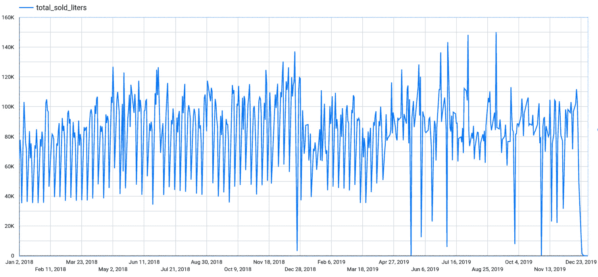

# *第八章*：使用时间序列进行预测

使用历史数据预测未来趋势是我们可以用机器学习做的最迷人的活动之一。

基于历史数据点和时间序列进行预测特别有趣，并且可以在不同行业中非常有用。预测可以帮助我们预测未来，也可以帮助我们识别不遵守预期模式的数据异常。

在本章中，我们将通过使用 ARIMA Plus 算法来专注于时间序列预测。这项技术可以用于预测不同领域的数值，例如公司的销售额、餐厅的顾客数量、股票价格和建筑的电力消耗。

要了解我们如何使用 BigQuery ML 来预测趋势以及有效地展示我们的结果，我们将讨论以下主题：

+   介绍业务场景

+   发现时间序列预测

+   探索和理解数据集

+   训练时间序列预测模型

+   评估时间序列预测模型

+   使用时间序列预测模型

+   展示预测结果

# 技术要求

本章要求你访问网络浏览器，并能够利用以下功能：

+   一个 GCP 账户以访问 Google Cloud Console

+   一个 GCP 项目来托管 BigQuery 数据集

现在，我们已经准备好了技术要求，让我们深入分析和开发我们的 BigQuery ML 预测模型。

查看以下视频以查看代码的实际应用：[`bit.ly/2QY0Qlp`](https://bit.ly/2QY0Qlp)

# 介绍业务场景

想象一下你是一名为爱荷华州工作的商业分析师。该州通过收集领土内每个商店的数据来监控酒类和烈酒的零售分销。控制酒类销售对于监控公民健康和检查税收收入尤为重要。

在下面的屏幕截图中，你可以看到一家商店中典型的酒类和烈酒货架的图片：


图 8.1 – 酒店货架

对于我们的业务场景，我们可以想象爱荷华州想要利用前几年收集的历史数据来预测 2020 年前 30 天将售出的升数。

你的经理可能会要求你利用数据库中已经收集的时间序列数据来预测该州所有商店将售出的升数。

作为一名商业分析师，你的任务是找到最佳的算法来预测销售量，并以图形方式向州长的工作人员展示结果。

现在我们已经解释并理解了问题陈述，让我们看看我们可以用来使用历史数据预测销售的机器学习技术。

# 发现时间序列预测

**时间序列**是一系列按一定时间频率映射的数据点。例如，它可以包含定期收集的股票价格，特定时间段内每天的销售量，或**物联网**（**IoT**）传感器在白天测量的温度。

在以下图中，您可以看到 2020 年前 15 天由温度传感器收集的数据的时间序列图：


图 8.2 – 温度传感器生成的时间序列示例

**使用时间序列分析进行预测**包括使用机器学习模型通过利用已知的历史数据来预测特定测量的未来值。

BigQuery ML 提供了一种特定的机器学习算法，用于使用时间序列数据预测数值。该算法旨在执行以下操作：

+   自动清理和调整训练数据以克服数据质量问题，例如缺失或重复的值和峰值。

+   补偿由特定时期（如节假日）引起的变异。

+   使用季节性和趋势分解 Loess 算法分解趋势。

+   从数据中推断季节性。

+   最后，应用**自回归积分移动平均**（**ARIMA**）模型的趋势建模，使用历史数据预测未来的数值。

您可以使用 ARIMA 模型来发现时间序列数据中的隐藏模式或预测特定测量的未来值。

在本节中，我们学习了时间序列预测的基础知识。现在让我们看看我们将用于构建 BigQuery ML 模型的数据集。

# 探索和理解数据集

在开始开发机器学习模型之前，我们将开始查看数据集及其结构。

让我们从对 BigQuery 公共数据集中我们拥有的时间序列数据进行清晰理解开始，以便在下一节构建我们的预测模型。

## 理解数据

在本节中，我们将分析数据的结构以确定用于创建机器学习模型的字段。

要开始探索数据，我们需要做以下几步：

1.  登录我们的 Google Cloud 控制台，并通过导航菜单访问**BigQuery**用户界面。

1.  在我们创建的*第二章*，“设置您的 GCP 和 BigQuery 环境”中创建一个新的数据集。对于此用例，我们将使用默认选项创建名为`08_sales_forecasting`的数据集。

1.  打开 GCP 项目`iowa_liquor_sales`。

    如以下截图所示，BigQuery 公共数据集仅包含一个表，该表托管了爱荷华州酒类商店收集的数据：

    

    图 8.3 – 爱荷华州酒类销售公共数据集包含爱荷华州所有酒类商店的销售数据

    我们将使用**sales**表来构建我们的预测模型。这个表包含了自 2012 年以来爱荷华州州内所有酒类销售的信息。

1.  让我们点击 BigQuery 导航菜单中的表名**sales**以访问表的模式：

    图 8.4 – 表的结构列出了表中收集的所有信息

1.  每个字段都在**描述**列中有很好的描述。

    表包含**date**列，它代表销售的日子。为了我们的目的，我们将尝试预测特定一天销售的总体积。因此，我们可以注意到**volume_sold_liters**字段的 presence。这个数值字段表示每次交易中销售的酒类数量。

在本节中，我们已经分析了**sales**表的元数据，并了解了哪些字段对我们构建预测模型感兴趣。接下来，是时候查看实际数据并开始查询了。

## 检查数据质量

在本节中，我们将应用一些数据质量检查来分析我们的训练数据集的完整性。

让我们开始分析将要用于构建我们的 BigQuery ML 模型的表格：

1.  为了确定数据集的时间范围，让我们从`bigquery-public-data.iowa_liquor_sales.sales`表提取`date`字段的最低值和最高值：

    ```py
    SELECT min(date), max(date) FROM `bigquery-public-data.iowa_liquor_sales.sales`; 
    ```

    通过执行这个 SQL 语句，我们可以注意到数据从 2012 年开始，到 2020 年 11 月底结束。

    查询结果如下所示：

    

    图 8.5 – 查询结果显示数据集的时间范围

    为了我们的目的，我们可以专注于 2018 年和 2019 年的销售，以预测 2020 年最初的 30 天。

1.  在第二步中，我们将分析在选定时间段内可以找到的唯一日期数量：

    ```py
    SELECT COUNT(DISTINCT date)
    FROM
            `bigquery-public-data.iowa_liquor_sales.sales`
    WHERE
            EXTRACT (year from date) = 2019         OR  EXTRACT (year from date) = 2018;
    ```

    查询`COUNT`和字段`date`中可用的`DISTINCT`值。使用表达式`EXTRACT (year from date)`，SQL 语句仅考虑发生在`2018`年和`2019`年的销售。

    查询结果如下所示：


图 8.6 – 查询结果显示数据集中的唯一日期

从结果来看，数据集不包含两年中每一天的信息。这可能是由于公共假日和商店关闭导致的缺失值造成的。这不是一个大问题，因为 BigQuery ML 将在训练阶段自动管理缺失值。

现在我们已经执行了一些 SQL 查询以更好地了解我们的数据集，让我们专注于创建我们的训练数据集。

## 创建训练数据集

在本节中，我们将创建一个表格来存储将在下一节中用于训练预测模型的数据点。在训练模型之前，我们还将使用数据工作室来图形化分析时间序列。

为了训练我们的模型，我们将创建一个特定的表格，该表格将托管我们时间序列的历史数据点：

1.  让我们创建一个只包含两个字段的表格。第一个是`date`，第二个是`total_sold_liters`：

    ```py
    CREATE OR REPLACE TABLE `08_sales_forecasting.iowa_liquor_sales` AS
    SELECT 
            date,
            SUM(volume_sold_liters) total_sold_liters
    FROM
            `bigquery-public-data.iowa_liquor_sales.sales`
    WHERE
            EXTRACT (year from date) = 2019 OR  EXTRACT (year from date) = 2018
    GROUP BY
            date;
    ```

    该查询在数据集`08_sales_forecasting`中创建表`iowa_liquor_sales`。

    该表包含两个不同的字段：`date`列表示交易发生的时间，第二个字段是计算一天内销售的酒类数量的`SUM`。`total_sold_liters`是一个基于`GROUP BY date`子句的聚合值，并且对于`2018`年和`2019`年的每一天。

1.  第二步将是图形化分析存储在`iowa_liquor_sales`表中的数据。

    如以下截图所示，从左侧的大查询导航菜单中，让我们选择数据集`08_sales_forecasting`然后选择表`iowa_liquor_sales`：

    ![图 8.7 – 训练表 iowa_liquor_sales 在 BigQuery 导航菜单中可见

    ![img/B16722_08_007.jpg]

    图 8.7 – 训练表 iowa_liquor_sales 在 BigQuery 导航菜单中可见

1.  之后，让我们点击**导出**然后点击**使用数据工作室探索**，如下截图所示：![图 8.8 – 从 BigQuery 中，可以打开数据工作室

    ![img/B16722_08_008.jpg]

    图 8.8 – 从 BigQuery 中，可以打开数据工作室

    **数据工作室**是由 Google 提供的一个免费数据可视化工具，与 BigQuery 原生集成，可以轻松用于在报告和图表中绘制数据。

1.  在数据工作室中，我们可以选择**时间序列图表**作为图表类型，如下截图所示：![图 8.9 – 在数据工作室中，可以选择时间序列图表来可视化数据

    ![img/B16722_08_009.jpg]

    图 8.9 – 在数据工作室中，可以选择时间序列图表来可视化数据

1.  然后，我们可以选择**日期**字段作为**维度**，以及**总销售升数**作为**度量**，如下截图所示：![图 8.10 – 在数据工作室中，可以选择维度和度量设置来绘制图表

    ![img/B16722_08_010.jpg]

    图 8.10 – 在数据工作室中，可以选择维度和度量设置来绘制图表

1.  之后，我们可以转到**样式**选项卡，并在**缺失数据**组合框中选择**线性插值**：![图 8.11 – 线性插值选项允许改善可视化

    的图表在缺失值的情况下

    ![img/B16722_08_011.jpg]

    图 8.11 – 线性插值选项允许在存在缺失值的情况下改善图表的可视化

1.  在这些配置之后，我们可以可视化 Data Studio 绘制的图表，该图表表示所选期间销售的酒类数量的趋势线：



图 8.12 – 时间序列以图表上的蓝色线条在 Data Studio 中显示

现在我们已经创建了我们的预测模型将进行训练和可视化的表，并在图表中显示了数据，让我们深入了解机器学习模型的创建。

# 训练时间序列预测模型

在本节中，我们将训练 BigQuery ML 时间序列预测模型。

让我们开始训练机器学习模型 `liquor_forecasting`，执行以下 SQL 语句：

```py
CREATE OR REPLACE MODEL `08_sales_forecasting.liquor_forecasting`
OPTIONS
 (model_type = 'ARIMA',
  time_series_timestamp_col = 'date',
  time_series_data_col = 'total_sold_liters',
  auto_arima = TRUE,
  data_frequency = 'AUTO_FREQUENCY'
) AS
SELECT *
FROM
 `08_sales_forecasting.iowa_liquor_sales`; 
```

SQL 语句由以下部分组成：

+   查询的前几行以关键字 `CREATE OR REPLACE MODEL` 开头，后面跟着机器学习模型的标识符 `` `08_sales_forecasting.liquor_forecasting` ``，以及 `OPTIONS`。

+   现在，让我们专注于我们用来训练机器学习模型的选项。选定的模型类型是 `'ARIMA'`。此选项描述了我们用来训练 BigQuery ML 预测模型的算法。

+   `time_series_timestamp_col = 'date'` 指定了用于在时间序列中存储数据点时间的列。

+   下一个选项选择 `total_sold_liters` 列作为存储每个数据点值的列，并由子句 `time_series_data_col = 'total_sold_liters'` 表示。

+   属性 `auto_arima` 设置为 `TRUE`，允许 BigQuery ML 自动识别模型的参数 `p`、`d` 和 `q`。

+   最后一个参数 `'AUTO_FREQUENCY'`，BigQuery 自动推断时间序列的频率。在这种情况下，频率是每日的。其他选项有 `'HOURLY'`、`'DAILY'`、`'WEEKLY'`、`'MONTHLY'`、`'QUARTERLY'` 和 `'YEARLY'`。

+   SQL 语句的最后部分由对训练表 `iowa_liquor_sales` 应用 `SELECT` 语句组成。

现在我们已经基于 ARIMA 算法训练了时间序列预测模型，让我们看看如何使用 BigQuery ML 语法和 BigQuery UI 来评估它。

# 评估时间序列预测模型

在本节中，我们将评估我们在前一节中训练的机器学习模型的性能。

时间序列模型的评估阶段可以通过使用 `ML.EVALUATE` BigQuery ML 函数来完成。

让我们执行以下查询以提取所有表征 ARIMA 模型的评估参数：

```py
SELECT *
FROM
 ML.EVALUATE(MODEL `08_sales_forecasting.liquor_forecasting`);
```

查询的结果在以下屏幕截图中进行了可视化：


图 8.13 – 从时间序列预测模型评估中提取的记录

每一行定义了一个被分类为 **ARIMA(p,d,q)** 模型的非季节性 ARIMA 模型。对于每一行，我们可以注意到以下内容：

+   字段 **non_seasonal_p** 代表 ARIMA 模型的参数 **p**。行值是用于预测的自回归项的数量。它表示用于预测时间序列下一个值的观测值数量。

+   字段 **non_seasonal_d** 代表 ARIMA 模型的参数 **d**。行值表示需要将一个数据点与前一个数据点之间的差值应用多少次，以减轻数据集的季节性。

+   **non_seasonal_q** 代表 ARIMA 模型的参数 **q**。它表示用于预测时间序列下一个值的移动平均数所计算的观测值数量。

+   **has_drift** 显示是否对模型应用了漂移常数。

+   **log_likelihood** 是一个参数，用于衡量统计模型与特定数据集的拟合程度。

+   **AIC** 代表 **Akaike 信息准则**。此值用于评估模型的好坏。AIC 的值越低，通常越好。因此，我们可以认为第一个模型是最好的。

+   **variance** 衡量数据点与序列平均值之间的距离。

+   **seasonal_periods** 列表示我们数据中的季节性模式。在这种情况下，BigQuery ML 已经在销售时间序列中识别出 **WEEKLY** 和 **YEARLY** 模式。

现在我们已经介绍了我们时间序列预测模型的性能指标，让我们尝试使用它来预测 2020 年前 30 天的数据。

# 使用时间序列预测模型

要使用我们的 BigQuery ML 模型，我们将使用 `ML.FORECAST` 函数来指定预测的参数。

查询将提取由接受以下参数的预测函数生成的所有字段：

+   模型名称 `08_sales_forecasting.liquor_forecasting`，前面有 `MODEL` 关键字。

+   一个包含预测的 `horizon`：`30` 天和选择的 `confidence_level` – 在这种情况下，80% 的 `STRUCT`：

    ```py
    SELECT
      *
    FROM
      ML.FORECAST(MODEL `08_sales_forecasting.liquor_forecasting`,
                  STRUCT(30 AS horizon, 0.8 AS confidence_level)); 
    ```

查询的执行将生成以下屏幕截图所示的记录：


图 8.14 – 预测函数生成的结果

我们可以在 *图 8.14* 中注意到，预测是按照 `confidence_level` 字段中的日期按时间顺序排列的。值为 0.8 表示 80% 的预测值应落在由字段 **prediction_interval_lower_bound** 和 **prediction_interval_upper_bound** 确定的预测区间内。

现在我们已经应用了我们的模型，让我们了解如何有效地使用 Data Studio 展示结果。

# 展示预测结果

在本节中，我们将使用数据工作室创建一个时间序列图，以便图形化地展示预测结果。

使用以下查询，我们可以创建一个包含历史值和预测值的表格：

```py
CREATE OR REPLACE TABLE `08_sales_forecasting.iowa_liquor_sales_forecast` AS
SELECT
  history_date AS date,
  history_value,
  NULL AS forecast_value,
  NULL AS prediction_interval_lower_bound,
  NULL AS prediction_interval_upper_bound
FROM
  (
    SELECT
      date AS history_date,
      total_sold_liters AS history_value
    FROM
      `08_sales_forecasting.iowa_liquor_sales`
  )
UNION ALL
SELECT
  CAST(forecast_timestamp AS DATE) AS date,
  NULL AS history_value,
  forecast_value,
  prediction_interval_lower_bound,
  prediction_interval_upper_bound
FROM
  ML.FORECAST(MODEL `08_sales_forecasting.liquor_forecasting`,
              STRUCT(30 AS horizon, 0.8 AS confidence_level));
```

执行 SQL 语句生成`iowa_liquor_sales_forecast`表，该表由以下内容组成：

+   所有记录都来自训练表`iowa_liquor_sales`，我们从其中提取了时间序列的`history_date`和`history_value`。我们还添加了一些`NULL`字段，以通过查询的第二部分与`UNION ALL`分隔的标准模式。

+   由`ML.FORECAST`函数生成的所有预测记录已在上一节*使用时间序列预测模型*中应用。特别值得注意的是，我们不仅提取了`forecast_value`，还提取了预测的下限和上限，分别由字段`prediction_interval_lower_bound`和`prediction_interval_upper_bound`表示。

+   存在`CAST`函数，应用于`forecast_timestamp`列，这是必要的，以便根据训练表的模式将数据类型从`TIMESTAMP`更改为`DATE`。

正如我们在*创建训练数据集*部分所做的那样，我们现在可以执行以下操作：

1.  从 BigQuery 导航菜单中选择我们刚刚创建的`iowa_liquor_sales_forecast`表。

1.  点击**导出**然后**使用数据工作室探索**以访问报告工具。

1.  从**图表**面板中选择**时间序列图表**。

1.  按照以下截图所示，将**历史值**、**预测值**、**预测区间下限**和**预测区间上限**拖放到**指标**面板中：

    图 8.15 – 数据面板允许我们自定义图表的指标

1.  移动到**样式**面板，向下滚动直到找到**缺失数据**部分。在这里，我们选择**线性插值**。

1.  然后，在屏幕顶部，我们可以对**日期**列应用过滤器，以便我们的图表仅关注从 2019 年 12 月 1 日到 2020 年 1 月 30 日的期间：

    图 8.16 – 在日期列上应用过滤器

1.  点击**应用**，图表最终将如图所示可视化：

图 8.17 – 数据工作室中的时间序列图表

观察图表的图例，我们可以通过不同的颜色可视化历史值和预测值。我们还可以注意到，**预测值**线始终包含在预测区间内。

# 摘要

在本章中，我们构建了我们的时间序列预测机器学习模型。在介绍业务场景之后，我们发现了时间序列预测是什么，特别是用于从历史数据点预测值的 ARIMA 算法。

在深入开发 BigQuery ML 模型之前，我们对爱荷华州收集的与该地区商店酒类销售相关的数据进行了分析。为此，我们引入了报告工具 Data Studio 的使用，它可以通过 BigQuery UI 容易地访问，并利用它绘制时间序列图表。

然后，我们创建了我们的训练表，其中包含历史数据的时间序列，并在其上训练了我们的 BigQuery ML 模型。然后，我们通过利用 BigQuery ML SQL 语法评估了时间序列预测模型。

在最后一步，我们使用 30 天的预测范围预测了爱荷华州销售的酒类数量，并在 Data Studio 仪表板上绘制了结果，该仪表板可以向非技术人员展示。

在下一章中，我们将介绍矩阵分解算法来构建推荐引擎。

# 进一步资源

+   **爱荷华州酒类零售销售公共数据集**: [`console.cloud.google.com/marketplace/product/iowa-department-of-commerce/iowa-liquor-sales`](https://console.cloud.google.com/marketplace/product/iowa-department-of-commerce/iowa-liquor-sales)

+   **BigQuery ML 创建模型**: [`cloud.google.com/bigquery-ml/docs/reference/standard-sql/bigqueryml-syntax-create`](https://cloud.google.com/bigquery-ml/docs/reference/standard-sql/bigqueryml-syntax-create)

+   **BigQuery ML 评估模型**: [`cloud.google.com/bigquery-ml/docs/reference/standard-sql/bigqueryml-syntax-evaluate`](https://cloud.google.com/bigquery-ml/docs/reference/standard-sql/bigqueryml-syntax-evaluate)

+   **BigQuery ML 预测**: [`cloud.google.com/bigquery-ml/docs/reference/standard-sql/bigqueryml-syntax-forecast`](https://cloud.google.com/bigquery-ml/docs/reference/standard-sql/bigqueryml-syntax-forecast)

+   **BigQuery ML 时间序列预测示例**: [`cloud.google.com/bigquery-ml/docs/arima-single-timeseries-forecasting-tutorial`](https://cloud.google.com/bigquery-ml/docs/arima-single-timeseries-forecasting-tutorial)
