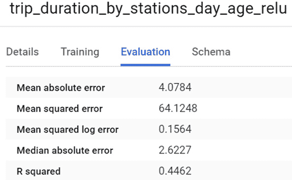
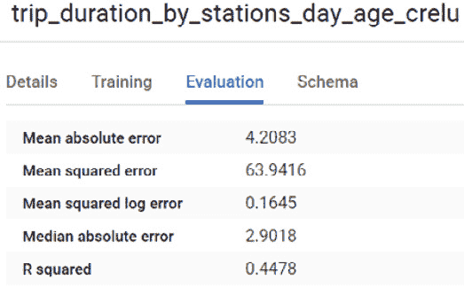
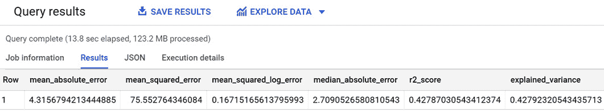
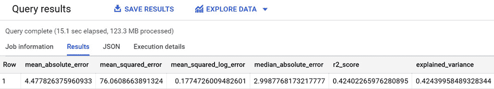
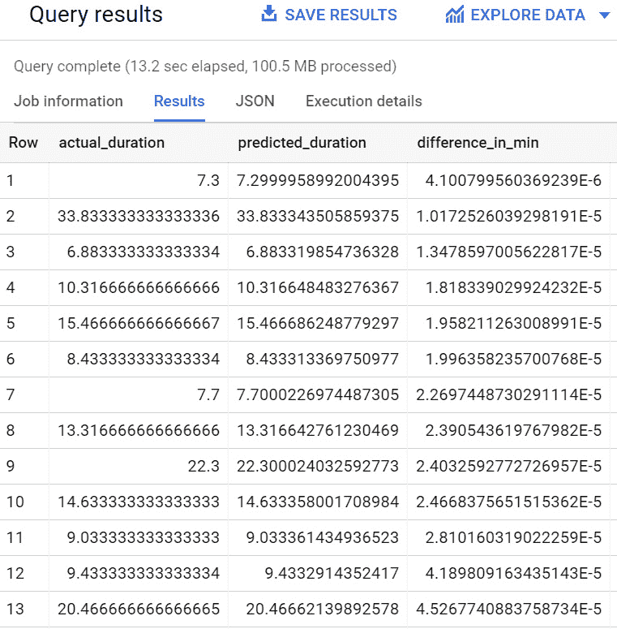
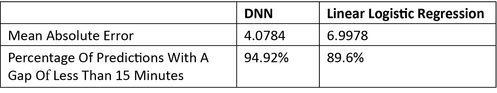

# *第十一章*：实现深度神经网络

**深度神经网络**（**DNNs**）是实现机器学习算法的最先进技术之一。它们在多种用例中广泛使用，并且可以被认为是日常生活中无处不在的。

当我们与虚拟助手互动，或使用移动应用程序进行自动翻译和图像识别时，我们正在利用使用大量音频和图像数据集训练的深度神经网络（DNNs）的能力。

在阅读本章后，您将能够使用 BigQuery ML 开发、评估和测试一个 DNN。在本章中，我们将看到使用 BigQuery ML 通过预测与纽约市自行车共享服务相关的租赁时长来实施 DNN 的所有必要阶段。

使用 BigQuery ML，我们将探讨以下主题：

+   介绍商业场景

+   发现 DNNs

+   准备数据集

+   训练 DNN 模型

+   评估 DNN 模型

+   使用 DNN 模型

+   提取业务结论

# 技术要求

本章要求您能够访问网络浏览器，并能够利用以下内容：

+   一个 GCP 账户以访问 Google Cloud Console

+   一个 GCP 项目来托管 BigQuery 数据集

现在我们已经准备好了技术要求，让我们深入分析和发展我们的 BigQuery ML DNN 模型。

查看以下视频以查看代码的实际应用：[`bit.ly/33lbq8A`](https://bit.ly/33lbq8A)

# 介绍商业场景

在本节中，您将了解到将使用 DNN 技术处理的商业场景。

商业场景与在*第四章*中介绍和使用的用例非常相似，即*使用线性回归预测数值*。在这一章中，我们将使用与纽约市自行车共享服务相关的相同数据集，但我们将应用更先进的机器学习算法。

我们可以记住，机器学习模型的假设目标是预测自行车租赁的行程时间。预测值可以用于通过新的移动应用程序为自行车共享服务的客户提供更好的体验。利用预测的骑行时长，客户将得到到达特定目的地所需时间的明确指示，以及骑行成本的估计。

既然我们已经解释并理解了商业场景，让我们来看看我们可以使用的机器学习技术，以自动根据特征对树木进行分类。

# 发现 DNNs

在本节中，我们将学习什么是**DNNs**，并了解哪些回归和分类用例可以使用高级机器学习算法来管理。

**人工神经网络**（**ANNs**）是试图复制人脑的人工系统。它们受到生物神经网络的启发，由神经元和连接神经元的突触组成。人工网络中的每个神经元都是一个组件，它对输入应用特定的数学激活函数，并返回一个通过突触传递给下一个神经元的输出。在 ANNs 中，神经元通常组织在输入和输出之间的层中。

与线性模型不同，ANNs 旨在模拟输入和输出变量之间的非线性关系。

**DNNs**是由多个层组成的 ANNs，这些层位于输入和输出之间，通常是两层或更多。每个神经元的层被称为**隐藏层**，其功能是接受一系列输入信号，并将一系列输出信号返回给下一层。

在以下图中，我们可以看到 DNN 由三个输入变量、两个隐藏层和一个输出变量组成：

![图 11.1 – DNN 的示意图

![img/B16722_11_001.jpg]

图 11.1 – DNN 的示意图

网络中的每个神经元都对输入信号应用特定的函数，并将该函数的输出作为神经元的输出。训练 DNN 是一项专注于找到网络中每个神经元之间每个突触的正确权重的活动。

尽管如此，为了实现 DNNs 的潜力，我们需要重要的硬件资源，但使用这种技术实现的机器学习模型可以在典型的人脑任务中实现最佳结果。以下是一些例子：

+   **语音识别**：处理音频文件以识别语音中的单词，使其可读的能力。这种能力在智能手机的虚拟助手或接触中心应用程序中得到广泛应用。

+   **图像和面部识别**：在图片和视频中识别不同实体、动物或人物的可能性。这项技术特别有用，可以自动从图像和视频中提取见解，避免任何人工努力。

+   **自然语言处理**：广泛用于分析和检索自由文本中的信息，以及分析消息的情感。例如，这类算法被用于自动识别社交网络中的政策违规，或在产品评论中评估情感。

既然我们已经了解了 DNNs 是什么，让我们关注 BigQuery ML 如何提供这些强大的算法。

## BigQuery ML 中的 DNNs

在本节中，我们将学习 BigQuery ML 提供的创建 DNN 模型模型类型选项。

BigQuery ML 允许您创建两种不同类型的深度神经网络（DNNs）：

+   **DNNClassifier**：此算法可用于将事件、对象或实体分类到有限数量的离散类别中。

+   **DNNRegressor**：这种模型与之前的模型类似，区别在于它返回一个连续的结果。因此，它可以用来预测数值。

对于我们的业务场景，我们将使用**DNNRegressor**，因为我们的目标是预测一个连续值：*自行车租赁的骑行时间*。

根据我们的用例选择了要使用的 DNN 类型后，下一个选择将集中在每个神经元将应用于输入信号的功能。BigQuery ML 允许我们选择以下函数之一：

+   **Rectified Linear Function** (**ReLU**)：这是一个线性函数，如果输入值是正的，则返回输入值本身，否则返回零。

+   **ReLU6**：这与之前的函数类似，但最大输出值被限制为 6。这只是一个从不同函数的经验测试中得出的任意值。

+   **Concatenated Rectified Linear Units** (**CReLU**)：与之前的函数不同，它保留了负值。

+   **Exponential Linear Unit** (**ELU**)：这是一个指数函数，它倾向于更快地收敛到结果并产生更精确的输出。

+   **Scaled Exponential Linear Unit** (**SELU**)：这是 ELU 的演变，它添加了数学函数的自我归一化。

+   **SIGMOID**：这与一个阶梯函数类似，始终输出介于 0 和 1 之间的值。这个函数将非线性引入 DNN。

+   **TANH**：这与 sigmoid 函数类似，但返回的值介于-1 和 1 之间。

每个函数都有一些优点和缺点，并且应根据用例和训练数据集来选择，以实现最佳结果。对于我们的业务场景，我们将尝试使用这些函数中的一些来训练 DNN，并选择产生最佳结果的函数。

现在我们已经学习了 DNN 的基础知识和 BigQuery ML 通过其 SQL 界面提供的主要选项，让我们开始准备创建我们的机器学习模型所需的数据。

# 准备数据集

在开始 ML 实现之前，有必要分析和准备我们用例的数据。由于数据集已经在*第四章*中使用了，*使用线性回归预测数值*，我们将不会从头开始分析，但我们将专注于与我们用例相关的查询。

开始准备我们的数据，我们需要做以下事情：

1.  登录 Google Cloud 控制台，并通过导航菜单访问**BigQuery**用户界面。

1.  在*第二章*中创建的项目下创建一个新的数据集，*设置您的 GCP 和 BigQuery 环境*。对于这个用例，我们将使用默认选项创建数据集`11_nyc_bike_sharing_dnn`。

1.  现在我们已经准备好创建包含训练数据集的表。让我们执行以下 SQL 语句：

    ```py
    CREATE OR REPLACE TABLE `11_nyc_bike_sharing_dnn.training_table` AS
                  SELECT 
                       tripduration/60 tripduration,
                       start_station_name,
                       end_station_name,
                       IF (EXTRACT(DAYOFWEEK FROM starttime)=1 OR EXTRACT(DAYOFWEEK FROM starttime)=7, true, false) is_weekend,
                       EXTRACT(YEAR FROM starttime)-birth_year as age
                  FROM
                        `bigquery-public-data.new_york_citibike.citibike_trips`
                  WHERE 
                        (
                            (EXTRACT (YEAR FROM starttime)=2017 AND
                              (EXTRACT (MONTH FROM starttime)>=04 OR EXTRACT (MONTH FROM starttime)<=10))
                            OR (EXTRACT (YEAR FROM starttime)=2018 AND
                              (EXTRACT (MONTH FROM starttime)>=01 OR EXTRACT (MONTH FROM starttime)<=02))
                        )
                        AND (tripduration>=3*60 AND tripduration<=3*60*60)
                        AND  birth_year is not NULL
                        AND birth_year < 2007; 
    ```

    查询结果存储在新创建的表中，名为 `` `11_nyc_bike_sharing_dnn.training_table` ``，我们创建此表是为了支持我们用例的以下步骤。

    `SELECT` 语句从 `citibike_trips` 表中提取字段并应用一些转换。`tripduration` 从秒转换为分钟。`start_station_name` 和 `end_station_name` 字段直接提取。使用 `starttime`，查询计算租赁是否发生在工作日或周末。最后，使用 `starttime` 和 `birth_year` 之间的差值计算顾客在骑行时的年龄。

    正如我们在 *第四章* 中所做的那样，*使用线性回归预测数值值*，`WHERE` 子句允许我们仅考虑我们想要用于训练阶段的月份。对于训练数据集，时间范围从 2017 年 4 月到 2018 年 2 月。在相同的 `WHERE` 子句中，我们还应用了来自数据质量检查的过滤器。

1.  在创建训练表之后，我们可以创建第二个表，专门用于记录将用于评估我们的机器学习模型的：

    ```py
    CREATE OR REPLACE TABLE  `11_nyc_bike_sharing_dnn.evaluation_table` AS
    SELECT 
                       tripduration/60 tripduration,
                       start_station_name,
                       end_station_name,
                       IF (EXTRACT(DAYOFWEEK FROM starttime)=1 OR EXTRACT(DAYOFWEEK FROM starttime)=7, true, false) is_weekend,
                       EXTRACT(YEAR FROM starttime)-birth_year as age
                   FROM
                        `bigquery-public-data.new_york_citibike.citibike_trips`
                   WHERE 
                        (EXTRACT (YEAR FROM starttime)=2018 AND (EXTRACT (MONTH FROM starttime)=03 OR EXTRACT (MONTH FROM starttime)=04))
                        AND (tripduration>=3*60 AND tripduration<=3*60*60)
                        AND  birth_year is not NULL
                        AND birth_year < 2007;
    ```

    查询与用于创建训练表的语句非常相似。唯一的区别是 `WHERE` 子句中选择的时期。对于 `` `11_nyc_bike_sharing_dnn.evaluation_table` `` 表，我们专注于之前从训练表中排除的 2018 年 3 月和 4 月的记录。

1.  采用相同的方法，我们也可以创建用于测试我们的机器学习模型的表：

    ```py
    CREATE OR REPLACE TABLE  `11_nyc_bike_sharing_dnn.prediction_table` AS
                  SELECT 
                       tripduration/60 tripduration,
                      start_station_name,
                       end_station_name,
                       IF (EXTRACT(DAYOFWEEK FROM starttime)=1 OR EXTRACT(DAYOFWEEK FROM starttime)=7, true, false) is_weekend,
                       EXTRACT(YEAR FROM starttime)-birth_year as age
                  FROM
                        `bigquery-public-data.new_york_citibike.citibike_trips`
                  WHERE 
                        EXTRACT (YEAR FROM starttime)=2018
                        AND EXTRACT (MONTH FROM starttime)=05
                         AND (tripduration>=3*60 AND tripduration<=3*60*60)
                        AND  birth_year is not NULL
                        AND birth_year < 2007;
    ```

    查询应用了创建训练和评估表时使用的相同逻辑，但仅考虑了 2018 年 5 月的月份。

现在我们已经分割了数据集，并且明确了用于训练、评估和测试阶段的记录，让我们使用 BigQuery ML 训练我们的 DNN 模型。

# 训练 DNN 模型

既然我们已经将数据集分割成多个表以支持机器学习模型生命周期的不同阶段，让我们使用不同的激活函数来训练我们的深度神经网络（DNN）回归模型：

1.  首先，我们可以通过使用 `RELU` 函数开始训练一个 DNN 模型。让我们执行以下 SQL 语句来创建机器学习模型 `` `11_nyc_bike_sharing_dnn.trip_duration_by_stations_day_age_relu` ``：

    ```py
    CREATE OR REPLACE MODEL `11_nyc_bike_sharing_dnn.trip_duration_by_stations_day_age_relu`
    OPTIONS
      (model_type='DNN_REGRESSOR',
            ACTIVATION_FN = 'RELU') AS
    SELECT
      start_station_name,
      end_station_name,
      is_weekend,
      age,
      tripduration as label
    FROM
      `11_nyc_bike_sharing_dnn.training_table`;
    ```

    在 SQL 语句中，我们可以注意到用于创建新模型的 `CREATE OR REPLACE MODEL` 关键字。这些关键字后面跟着由数据集和机器学习模型名称连接而成的模型标识符。

    在这些第一行之后，我们发现 `OPTIONS` 关键字，其中指定了机器学习模型类型。由于我们试图预测连续字段 `tripduration`，我们选择了使用 `DNN_REGRESSOR` 作为 `model_type`。

    在训练深度神经网络（DNN）期间，另一个重要的选项是应用于网络神经元的激活函数。对于这次尝试，我们使用最常见的一种函数：`RELU`。这个选择通过`ACTIVATION_FN = 'RELU'`子句来指定。

    在`OPTIONS`之后，我们需要指定机器学习模型将要训练的记录集。由于我们已经在*第四章*中识别了相关字段，即使用线性回归预测数值，查询使用`start_station_name`、`end_station_name`、`is_weekend`和`age`作为 DNN 模型的特征。

    使用关键词`as label`，我们指示 BigQuery ML 将`tripduration`作为我们机器学习模型的标签。作为替代，我们可以在包含关键词`INPUT_LABEL_COLS`的`OPTIONS`列表中包含标签。

    由于 DNN 是高级且复杂的模型，在收敛到解决方案并生成机器学习模型之前可能需要几分钟。

1.  在 SQL 查询执行结束时，我们可以在 BigQuery 导航菜单中选择`trip_duration_by_stations_day_age_relu` DNN 模型，并点击`tripduration`。

    如以下截图所示，**平均绝对误差**非常接近 4 分钟：

    

    图 11.2 – 评估选项卡显示了 DNN 模型的一些关键性能指标

1.  作为第二次尝试，我们可以尝试更改神经网络中的激活函数，看看是否可以进一步提高第一个模型的表现。让我们使用`CRELU`激活函数运行以下 SQL 语句：

    ```py
    CREATE OR REPLACE MODEL `11_nyc_bike_sharing_dnn.trip_duration_by_stations_day_age_crelu`
    OPTIONS
      (model_type='DNN_REGRESSOR',
            ACTIVATION_FN = 'CRELU') AS
    SELECT
      start_station_name,
      end_station_name,
      is_weekend,
      age,
      tripduration as label
    FROM
      `11_nyc_bike_sharing_dnn.training_table`;
    ```

    训练 DNN 的查询`11_nyc_bike_sharing_dnn.trip_duration_by_stations_day_age_crelu`与我们第一次尝试中使用的 SQL 语句非常相似。唯一的区别在于`OPTIONS`中指定的不同激活函数。使用`ACTIVATION_FN = 'CRELU'`子句，我们在网络神经元中使用`CRELU`函数。

    训练查询的执行将需要几分钟才能完成。

1.  在 SQL 查询执行结束时，我们可以在 BigQuery 导航菜单中选择`trip_duration_by_stations_day_age_crelu` DNN 模型，并在**评估**选项卡中可视化性能。

    如以下截图所示，**平均绝对误差**几乎接近 4 分钟：



图 11.3 – 评估选项卡显示了 DNN 模型的一些关键性能指标

现在，让我们开始评估在本节中训练的 DNN。

# 评估 DNN 模型

为了评估我们的 BigQuery ML DNNs，我们将使用 `ML.EVALUATE` 函数以及我们专门创建的作为评估数据集的表格：

1.  首先，我们可以开始评估模型 `` `11_nyc_bike_sharing_dnn.trip_duration_by_stations_day_age_relu` ``。让我们运行以下查询：

    ```py
    SELECT
      *
    FROM
      ML.EVALUATE(MODEL `11_nyc_bike_sharing_dnn.trip_duration_by_stations_day_age_relu`,
        (
        SELECT
              start_station_name,
              end_station_name,
              is_weekend,
              age,
              tripduration as label
        FROM
               `11_nyc_bike_sharing_dnn.evaluation_table` ));
    ```

    在 SQL 语句中，我们可以注意到使用了关键字 `ML.EVALUATE` 来评估 DNN。评估函数后面跟着 BigQuery ML 模型的标识符：`` `11_nyc_bike_sharing_dnn.trip_duration_by_stations_day_age_relu` ``。

    评估函数应用于提取表 `` `11_nyc_bike_sharing_dnn.evaluation_table` `` 中所有字段的 `SELECT` 语句。

    几秒钟后，我们可以看到以下截图所示的评估阶段的结果：

    

    图 11.4 – 评估 SQL 语句的结果

    我们可以注意到 **平均绝对误差** 值与我们训练阶段达到的值并没有太大的不同。我们可以说，我们的模型没有受到过拟合的影响，并且在评估数据集的新记录上表现良好。

1.  让我们在第二个模型 `` `11_nyc_bike_sharing_dnn.trip_duration_by_stations_day_age_crelu` `` 上应用相同的评估逻辑。为了评估这个 BigQuery ML 模型的性能，我们运行以下 SQL 语句：

    ```py
    SELECT
      *
    FROM
      ML.EVALUATE(MODEL `11_nyc_bike_sharing_dnn.trip_duration_by_stations_day_age_crelu`,
        (
        SELECT
              start_station_name,
              end_station_name,
              is_weekend,
              age,
              tripduration as label
        FROM
               `11_nyc_bike_sharing_dnn.evaluation_table` ));
    ```

    最后一个查询与上一个查询的唯一区别在于受评估的 DNN 的名称：`` `11_nyc_bike_sharing_dnn.trip_duration_by_stations_day_age_crelu` ``。

    几秒钟后，我们将看到以下截图所示的评估结果：



图 11.5 – 评估 SQL 语句的结果

此外，在这种情况下，**平均绝对误差** 值与我们训练阶段达到的 4 分钟值相差不远。这个模型没有受到过拟合的影响，并且与之前的模型相似。

现在我们已经评估了我们的 BigQuery ML 模型，让我们看看如何使用基于 `ReLU` 激活函数的 DNN 来预测自行车租赁的持续时间。

# 使用 DNN 模型

在本节中，我们将使用基于 `ReLU` 函数的 DNN 模型，并训练它利用 BigQuery ML 功能来预测纽约市自行车共享公司的骑行持续时间。

为了测试我们的 DNN，我们将在 `prediction_table` 表上使用 `ML.PREDICT` 函数。让我们运行以下 SQL 语句：

```py
SELECT
   tripduration as actual_duration,
   predicted_label as predicted_duration,
   ABS(tripduration - predicted_label) difference_in_min
FROM
  ML.PREDICT(MODEL `11_nyc_bike_sharing_dnn.trip_duration_by_stations_day_age_relu`,
    (
    SELECT
         start_station_name,
          end_station_name,
          is_weekend,
          age,
          tripduration
    FROM
           `11_nyc_bike_sharing_dnn.prediction_table`
    ))
    order by  difference_in_min asc;
```

查询语句由一个 `SELECT` 关键字组成，它提取了租赁的实际和预测持续时间。它计算了分钟数的差异，并按分钟数的最小差异到最大差异排序。为了计算差异，我们使用了 `ABS` 函数，该函数提取了数字的绝对值。

`ML.PREDICT` 函数应用于 `SELECT` 语句，该语句从 `prediction_table` 中提取特征和实际持续时间。这个最后字段仅用于与预测值进行比较，并且不用于 DNN 返回预测。

在以下屏幕截图，你可以看到查询执行的结果：



图 11.6 – 查询输出显示了实际和预测标签，差异以分钟表示

现在我们已经测试了我们的 BigQuery ML 模型，让我们来看看一些最终的考虑因素，比较基于 `CReLU` 激活函数的 DNN 结果与我们在 *第四章* 中使用线性回归所取得的结果，*使用线性回归预测数值值*。

# 提炼商业结论

在本节中，我们将应用我们的 DNN 模型，并了解 BigQuery ML 模型能够预测接近实际租赁持续时间的次数。

我们将在之前的查询中添加一个父 `SELECT COUNT` 语句，以计算实际持续时间与预测值之间的差异小于 `15` 分钟的次数。

让我们执行以下查询来计算预测的行程持续时间与实际值相差较远的情况发生的频率：

```py
SELECT COUNT (*)
FROM (
SELECT
   tripduration as actual_duration,
   predicted_label as predicted_duration,
   ABS(tripduration - predicted_label) difference_in_min
FROM
  ML.PREDICT(MODEL  `11_nyc_bike_sharing_dnn.trip_duration_by_stations_day_age_relu`,
    (
    SELECT
          start_station_name,
          end_station_name,
          is_weekend,
          age,
          tripduration
    FROM
           `11_nyc_bike_sharing_dnn.prediction_table`
    ))
    order by  difference_in_min asc) where difference_in_min<=15 ;  
```

`SELECT COUNT` 查询的结果返回了 1,640,446 个预测值，预测值与实际值之间的差异小于 `15` 分钟。

考虑到 `prediction_table` 表的总大小为 1,728,078，我们可以说在 94.92% 的情况下，我们的 DNN 能够预测行程持续时间，差异小于 15 分钟。

现在，我们可以将我们用 DNN 达到的最佳结果与我们在 *第四章* 中使用线性回归模型所达到的性能进行比较，*使用线性回归预测数值值*。

## 深度神经网络与线性模型

在以下表格中，基于 `CReLU` 激活函数的 DNN 模型的结果与线性回归模型进行了比较：



图 11.7 – DNN 模型与线性回归模型的比较

通过查看前面的表格，我们可以得出结论，为了预测纽约市自行车共享服务的行程持续时间，使用 DNN 模型可以获得最佳结果。因此，我们可以建议使用 DNN 模型向公司的客户提供行程持续时间建议。使用 DNN，我们可以将平均绝对误差降低超过 43%。在某些行业中，这样的改进可能为公司带来巨大的竞争优势。

# 摘要

在本章中，我们实现了两个 DNN。我们回顾了在*第四章*中已经介绍过的业务场景，即*使用线性回归预测数值*。用例基于预测纽约市自行车共享服务的租赁时间的需求。之后，我们学习了 DNN 的基础知识以及可以用于实现网络中神经元的各种激活函数。

我们将 BigQuery 公共数据集分割成三个不同的表：一个用于存放训练数据，第二个用于评估阶段，最后一个用于测试我们的 DNN 模型。

在 BigQuery ML 模型的训练阶段，我们测试了两种不同的激活函数，`ReLU`和`CReLU`，通过比较平均绝对误差来找到最佳的一个。

之后，我们在一组新的记录上评估了我们的深度神经网络（DNN）模型，以防止过拟合，并对我们 BigQuery ML 模型的高质量更有信心。

最后，我们将基于`ReLU`函数的模型应用于最后一批记录，以预测每辆自行车租赁的行程时长。我们发现我们的 BigQuery ML 模型能够预测超过 94%的租赁的行程时长，其预测值与实际行程时长相差不超过 15 分钟。

最后，我们还比较了 DNN 模型与在*第四章*中实现的线性回归结果。我们注意到 DNN 优于线性回归，将平均绝对误差降低了 43%，并且能够为我们业务场景实现更好的结果。

在下一章中，我们将学习如何使用 BigQuery ML 与 GCP AI 笔记本结合使用。

# 进一步资源

+   **纽约市自行车共享公共数据集**：[`console.cloud.google.com/marketplace/product/city-of-new-york/nyc-citi-bike`](https://console.cloud.google.com/marketplace/product/city-of-new-york/nyc-citi-bike)

+   **BigQuery ML 创建模型**：[`cloud.google.com/bigquery-ml/docs/reference/standard-sql/bigqueryml-syntax-create-dnn-models`](https://cloud.google.com/bigquery-ml/docs/reference/standard-sql/bigqueryml-syntax-create-dnn-models)

+   **BigQuery ML 评估模型**：[`cloud.google.com/bigquery-ml/docs/reference/standard-sql/bigqueryml-syntax-evaluate`](https://cloud.google.com/bigquery-ml/docs/reference/standard-sql/bigqueryml-syntax-evaluate)

+   **BigQuery ML 预测**：[`cloud.google.com/bigquery-ml/docs/reference/standard-sql/bigqueryml-syntax-predict`](https://cloud.google.com/bigquery-ml/docs/reference/standard-sql/bigqueryml-syntax-predict)
