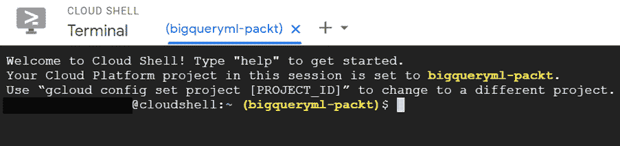

# 第十三章：使用 BigQuery ML 运行 TensorFlow 模型

TensorFlow 是最常用且相关的机器学习（ML）框架之一。它允许数据科学家和机器学习工程师开发高级模型，同时也提供了极大的灵活性和丰富的数学函数集。

TensorFlow 提供的先进功能为想要利用数据科学家和机器学习工程师开发的现有模型的数据分析师提供了巨大的机会。

此外，BigQuery ML 与 TensorFlow 之间的互操作性代表了填补公司内部业务和技术利益相关者之间差距的一种方式。第一组通常更关注数据的深入知识，而第二组则更侧重于技术导向和编程技能。

在本章中，我们将学习 TensorFlow 是什么以及如何与 BigQuery ML 一起使用。我们将了解如何将 BigQuery ML 模型导出为 TensorFlow 格式，以及如何使用 BigQuery ML SQL 语法运行 TensorFlow 模型。

为了了解我们如何将 BigQuery ML 与 TensorFlow 相结合，我们将涵盖以下主题：

+   介绍 TensorFlow

+   探索 BigQuery ML 与 TensorFlow 之间的关系

+   将 BigQuery ML 模型转换为 TensorFlow

+   使用 BigQuery ML 运行 TensorFlow 模型

# 技术要求

本章要求您能够访问网络浏览器并利用以下资源：

+   一个 GCP 账户来访问 Google Cloud 控制台

+   一个 GCP 项目来托管 BigQuery 数据集

+   一个 GCP 项目来托管 Google Cloud 存储桶

现在我们已经涵盖了技术要求，让我们开始探索 BigQuery ML 用于 TensorFlow 模型。

查看以下视频以查看代码的实际应用：[`bit.ly/33ngmdf`](https://bit.ly/33ngmdf)

# 介绍 TensorFlow

在本节中，我们将介绍**TensorFlow**，其起源以及这个框架在机器学习（ML）社区中所取得的成就。

**TensorFlow**是一个开源库，用于开发机器学习（ML）模型。它非常灵活，可以用于解决各种用例和业务场景。由于 TensorFlow 基于数学函数，其名称来源于数学概念**张量**。

在数学中，**张量**是一个代数对象，它描述了其他代数对象集合之间的关系。张量的例子包括矢量和矩阵。

TensorFlow 库最初是由谷歌工程师创建的，并于 2015 年以 Apache 许可证发布。现在，由于其潜力和灵活性，它被认为是最受欢迎的机器学习（ML）框架之一。实际上，TensorFlow 模型可以在本地机器、本地服务器、云中或边缘设备上执行，例如在手机和视频监控摄像头中。

重要提示

**边缘计算**是一种将业务逻辑的计算更靠近所需位置的计算范式。当 ML 模型在边缘运行时，它通常直接在收集模型所需数据的传感器或摄像头上执行，而无需连接到其他系统。

TensorFlow 在 ML 社区中得到广泛应用，并应用于解决人工智能领域中的不同挑战，例如以下内容：

+   Airbnb 利用 TensorFlow 对客户照片进行分类，从而改善了出租房屋的虚拟游览。更多详情，请访问以下链接：[`medium.com/airbnb-engineering/categorizing-listing-photos-at-airbnb-f9483f3ab7e3`](https://medium.com/airbnb-engineering/categorizing-listing-photos-at-airbnb-f9483f3ab7e3)。

+   Google 使用 TensorFlow 为其产品赋予人工智能能力，例如 Google 搜索、Gmail 和 Translate。更多详情，请访问以下链接：[`ai.googleblog.com/search/label/TensorFlow`](https://ai.googleblog.com/search/label/TensorFlow)。

+   PayPal 使用 TensorFlow 来防止欺诈，并将 ML 应用于提高其欺诈检测模型的准确性。更多详情，请访问以下链接：[`medium.com/paypal-engineering`](https://medium.com/paypal-engineering)。

+   Twitter 利用 TensorFlow 识别并向用户展示最相关的推文。更多详情，请访问以下链接：[`blog.tensorflow.org/2019/03/ranking-tweets-with-tensorflow.html`](https://blog.tensorflow.org/2019/03/ranking-tweets-with-tensorflow.html)。

+   其他有趣的用例可以在 TensorFlow 案例研究网页上找到，网址为 [`www.tensorflow.org/about/case-studies?hl=en`](https://www.tensorflow.org/about/case-studies?hl=en)。

与 BigQuery ML 相比，使用 TensorFlow 开发 ML 模型需要高级编程技能。实际上，TensorFlow 库的高度灵活性是通过在代码开发上投入一定时间来创建模型的需求来平衡的。现在，建议使用 Python 来开发 TensorFlow 的 ML 模型。

一旦 TensorFlow 模型的开发和训练阶段完成，就可以将其导出为 **SavedModel** 格式。

**SavedModel** 格式包含整个 TensorFlow 模型。此格式允许我们在所有兼容环境中无需再次运行代码即可部署模型。SavedModel 由多个文件和文件夹组成，这些文件和文件夹存储在同一个父文件夹中：

+   SavedModel 文件存储 TensorFlow 逻辑。此文件称为 `saved_model.pb`。

+   `variables` 目录包含训练模型的参数。

+   `assets` 文件夹可以包含 ML 模型使用的外部和附加文件。

当 TensorFlow 模型处于 SavedModel 格式时，它可以在我们希望使用此模型的平台轻松加载和使用。该平台可以是物理服务器、云实例、智能手机或 **物联网**（**IoT**）设备。

在本节中，我们介绍了 TensorFlow 的基础知识。在下一节中，我们将探讨 BigQuery ML 如何与 TensorFlow 相关联。

# 探索 BigQuery ML 和 TensorFlow 之间的关系

在本节中，我们将了解 BigQuery ML 和 TensorFlow 之间的关系。完成本节后，我们将能够根据我们的用例理解何时使用 BigQuery ML 和 TensorFlow，以及如何在使用这两种技术时获得最佳效果。

## 理解共性和差异

BigQuery ML 和 TensorFlow 有一些相似之处，但也有一些相关的差异需要强调。

在以下表格中，我们总结了这两个框架的主要相似点和差异点：

![图 13.1 – 比较 BigQuery ML 和 TensorFlow

![img/B16722_13_001.jpg]

图 13.1 – 比较 BigQuery ML 和 TensorFlow

首先，重要的是要强调 TensorFlow 在实现 ML 模型方面提供了更大的灵活性。虽然 BigQuery ML 以其支持的特定模型类型列表（https://cloud.google.com/bigquery-ml/docs/introduction#supported_models_in）为特征，但 TensorFlow 提供了更广泛的 ML 技术范围。

BigQuery ML 被设计为 BigQuery 的扩展，因此它只关注结构化数据，这些数据可以用表格格式表示。所有 BigQuery ML 技术都是基于在 BigQuery 表中存储的行上训练和应用模型的可能性。另一方面，TensorFlow 对不同的格式开放，包括自由文本、图像、音频和视频。

要训练、评估和测试 BigQuery ML 模型，用户应了解 SQL 语法并具备基本的 ML 经验。另一方面，实现 TensorFlow 模型则需要良好的编程技能和对 ML 主题的良好了解，因为该框架在定制方面提供了更高的灵活性。

考虑到这两种技术的特点，很明显，它们针对的是公司中的不同利益相关者。虽然 BigQuery ML 可以轻松被熟悉数据分析任务和 SQL 查询的业务分析师和数据分析师使用，但 TensorFlow 是为高级程序员设计的，例如经验丰富的数据科学家和 ML 工程师。

现在我们已经理解了 BigQuery ML 和 TensorFlow 的共性和差异，在下一节中，我们将学习这两个框架如何相互补充。

## 与 BigQuery ML 和 TensorFlow 协作

在本节中，我们将探讨如何结合使用 BigQuery ML 和 TensorFlow，以充分利用这两种技术。

以下图表显示了使用 BigQuery ML 和 TensorFlow 的业务分析师和数据科学家之间的交互：

![图 13.2 – BigQuery ML 和 TensorFlow 之间的交互

![img/B16722_13_002.jpg]

图 13.2 – BigQuery ML 和 TensorFlow 之间的交互

如我们在*第一章*中所述，“Google Cloud 和 BigQuery 简介”，ML 开发周期的第一步是探索数据并完全理解它。

在分析的第一阶段之后，需要对数据进行清理和准备，以便训练 ML 算法。这一阶段对于创建有价值的 ML 模型并进入训练阶段至关重要。

当真正开发 ML 模型时，根据我们的知识、背景和以往经验，我们有两种选择：

+   如果你是一名业务分析师或数据分析师，你将更喜欢使用 BigQuery ML，因为它简单直观，得益于 SQL 语法。

+   如果你是一名数据科学家或 ML 工程师，你将选择训练一个 TensorFlow 模型，因为它具有灵活性，并且提供了更多定制的机会。

如前图所示，上部分代表利用 BigQuery ML SQL 语句在已存储在 BigQuery 中的数据上创建、评估和使用 ML 模型的业务分析师或数据分析师的典型工作流程。这一部分要求你具备良好的 SQL 语言知识、ML 基础知识以及底层数据。

另一方面，图的下部分代表基于由数据科学家或 ML 工程师创建的 TensorFlow 库的开发过程，这些人在编程和 ML 算法方面拥有丰富的经验。

通常，数据分析师对数据非常了解，但对最先进的编程技术知之甚少，而数据科学家和 ML 工程师具有深入的编码技能，但对业务数据的理解有限。这种情况通常发生在更成熟的公司中，因为员工具有不同的专业背景。这种情况通常会导致那些对行业非常了解的人和那些更专注于编程的业务流程之间产生摩擦。

为了减少这种差距并减轻摩擦的风险，BigQuery ML 允许我们做以下事情：

+   将使用 BigQuery ML 开发的 ML 模型导出为 TensorFlow SavedModel 格式。

+   导入以 SavedModel 格式保存的 TensorFlow ML 模型。

观察前图，我们可以看到业务分析师可以将 BigQuery ML 模型导出并部署到与 BigQuery 不同但兼容 TensorFlow 的其他环境中。

另一方面，已经实现了高级 TensorFlow 模型的数据科学家可以将它们保存到 Google Cloud 存储桶中，这意味着它们可以被导入到 BigQuery ML 中。

这种 BigQuery ML 和 TensorFlow 框架之间的双向交互使我们能够做以下事情：

+   扩展 BigQuery ML 模型的适用性，使其不再局限于使用存储在 BigQuery 中的数据。

+   导入 BigQuery ML 高级 TensorFlow 模型，这些模型最初不支持 BigQuery ML 语法，并通过 SQL 查询在 BigQuery 中使用它们。

在本节中，我们学习了 BigQuery ML 和 TensorFlow 如何交互，以及为什么利用这种集成如此重要。在下一节中，我们将训练一个 BigQuery ML 模型并将其导出为 TensorFlow 格式。

# 将 BigQuery ML 模型转换为 TensorFlow

在本节中，我们将训练与我们在 *第十一章* 的 *实现深度神经网络* 部分中训练的相同深度神经网络，然后将其导出为 TensorFlow SavedModel 格式。

## 训练 BigQuery ML 以导出它

在我们开始训练模型之前，让我们访问 BigQuery 来创建用于训练和预测的数据集和表格：

1.  登录我们的 Google Cloud Console，并通过导航菜单访问 **BigQuery** 用户界面。

1.  在我们为 *第二章* 的 *设置您的 GCP 和 BigQuery 环境* 创建的项目下创建一个新的数据集。对于此用例，我们将创建一个名为 `13_tensorflow_model` 的数据集，并使用默认选项。

1.  现在，我们已经准备好创建一个包含训练数据集的表格。让我们执行以下 SQL 语句：

    ```py
    CREATE OR REPLACE TABLE `13_tensorflow_model.training_table` AS
                  SELECT
                       tripduration/60 tripduration,
                       start_station_name,
                       end_station_name,
                       IF (EXTRACT(DAYOFWEEK FROM starttime)=1 OR EXTRACT(DAYOFWEEK FROM starttime)=7, true, false) is_weekend,
                       EXTRACT(YEAR FROM starttime)-birth_year as age
                  FROM
                        `bigquery-public-data.new_york_citibike.citibike_trips`
                  WHERE
                        (
                            (EXTRACT (YEAR FROM starttime)=2017 AND
                              (EXTRACT (MONTH FROM starttime)>=04 OR EXTRACT (MONTH FROM starttime)<=10))
                            OR (EXTRACT (YEAR FROM starttime)=2018 AND
                              (EXTRACT (MONTH FROM starttime)>=01 OR EXTRACT (MONTH FROM starttime)<=02))
                        )
                        AND (tripduration>=3*60 AND tripduration<=3*60*60)
                        AND  birth_year is not NULL
                        AND birth_year < 2007; 
    ```

    此查询的结果存储在新的 `` `13_tensorflow_model.training_table` `` 表中，我们创建此表是为了支持我们用例的以下步骤。

    此查询的业务逻辑与我们在 *第十一章* 的 *准备数据集* 部分中应用的逻辑相同。

1.  现在，我们将创建一个用于测试我们的 ML 模型的表格：

    ```py
    CREATE OR REPLACE TABLE  `13_tensorflow_model.prediction_table` AS
                  SELECT
                       tripduration/60 tripduration,
                       start_station_name,
                       end_station_name,
                       IF (EXTRACT(DAYOFWEEK FROM starttime)=1 OR EXTRACT(DAYOFWEEK FROM starttime)=7, true, false) is_weekend,
                       EXTRACT(YEAR FROM starttime)-birth_year as age
                            FROM
                        `bigquery-public-data.new_york_citibike.citibike_trips`
                  WHERE
                        EXTRACT (YEAR FROM starttime)=2018
                        AND EXTRACT (MONTH FROM starttime)=05
                         AND (tripduration>=3*60 AND tripduration<=3*60*60)
                        AND  birth_year is not NULL
                        AND birth_year < 2007;
    ```

    此查询应用了用于创建训练表的相同逻辑，但只考虑了 2018 年 5 月。

1.  现在，让我们训练我们的 ML 模型，该模型将在 *导出 BigQuery ML 模型* 部分中导出为 TensorFlow 格式：

    ```py
    CREATE OR REPLACE MODEL `13_tensorflow_model.bigquery_ml_model_to_export`
    OPTIONS
      (model_type='DNN_REGRESSOR',
            ACTIVATION_FN = 'CRELU') AS
    SELECT
      start_station_name,
      end_station_name,
      is_weekend,
      age,
      tripduration as label
    FROM
      `13_tensorflow_model.training_table`;
    ```

    创建 `` `13_tensorflow_model.bigquery_ml_model_to_export` `` ML 模型所使用的业务逻辑与我们在 *第十一章* 的 *训练深度神经网络模型* 部分中使用的逻辑相同，*实现深度神经网络*。

现在我们已经训练了一个 ML 模型，在下一节中，我们将学习如何将其导出为 TensorFlow SavedModel 格式。

## 导出 BigQuery ML 模型

在本节中，我们将导出一个 BigQuery ML 模型到 Google Cloud 存储桶中的 TensorFlow SavedModel 格式。让我们开始吧：

1.  首先，我们需要从 Google Cloud Console 访问 Cloud Shell：![图 13.3 – Google Cloud Console 中的激活 Cloud Shell 按钮

    ![img/B16722_13_003.jpg]

    图 13.3 – Google Cloud Console 中的激活 Cloud Shell 按钮

    重要提示

    **云壳**是一个基于 Linux 的在线环境，可以通过 Google Cloud 控制台的网页浏览器访问。使用云壳，您可以通过利用其预加载的实用程序（如 **gcloud** 命令行工具）来管理您的 Google Cloud 资源。

1.  点击**云壳**按钮后，将在屏幕底部提供 Linux 命令行。如果您是第一次使用 Google Cloud Shell，将显示以下横幅：

    

    图 13.4 – 云壳信息框

    点击蓝色**继续**按钮后，将提供 Linux 命令行，如下截图所示：

    

    

    图 13.5 – 云壳环境

1.  我们需要通过运行以下命令对 Google Cloud SDK 的账户进行认证：

    ```py
    gcloud auth login
    ```

    命令行将显示一个网页 URL。通过点击此 URL，我们将授权账户使用 Cloud SDK。在此过程结束时，您将在网页上看到一个代码，您可以将其复制并粘贴到 Cloud Shell 中以完成授权过程。

1.  然后，我们可以运行以下命令来设置新的 `PROJECT` 变量中的当前项目名称：

    ```py
    PROJECT=$(gcloud config get-value project)
    ```

1.  使用 `PROJECT` 变量，我们将创建第二个变量 `BUCKET`，它将包含要创建的 Google Cloud 存储桶的名称，BigQuery ML 模型将导出到该存储桶：

    ```py
    BUCKET=${PROJECT}-us-bigqueryml-export-tf
    ```

    Google Cloud 存储桶的名称将是我们的项目名称和 `-us-bigqueryml-export-tf` 字符串的连接。

1.  现在我们已经将存储桶的名称存储在一个变量中，我们可以通过运行以下命令来创建新的存储桶：

    ```py
    gsutil mb -l us gs://${BUCKET}
    ```

    重要提示

    使用 `gsutil mb` 命令创建新的存储桶，而 `–l US` 选项指定了我们希望创建存储桶的地理位置。在这种情况下，存储桶将在美国创建。

    如果您是第一次使用 Cloud Shell 创建 Google Cloud 存储桶，则在创建存储桶之前将出现以下横幅：

    

    图 13.6 – 云壳授权框

    点击蓝色**授权**按钮后，将创建存储桶。

1.  现在，让我们执行以下命令，将 BigQuery ML 模型以 TensorFlow SavedModel 格式导出到 Google Cloud 存储桶中。让我们运行以下命令：

    ```py
         bq extract -m 13_tensorflow_model.bigquery_ml_model_to_export gs://${BUCKET}/bqml_exported_model
    ```

    使用 `bq extract` 命令提取 `–m` 选项后面的指定 BigQuery ML 模型。命令的最后部分表示我们想要提取模型及其相关子文件夹的 Google Cloud 存储桶路径；即 `bqml_exported_model`。作为替代，也可以使用以下 SQL 查询来导出 BigQuery ML 模型：

    ```py
    EXPORT MODEL 13_tensorflow_model.bigquery_ml_model_to_export
    OPTIONS (URI = "gs://${BUCKET}/bqml_exported_model" );
    ```

1.  要验证导出模型的存档，我们可以浏览 Google Cloud 控制台菜单，并在**存储**下访问**浏览器**功能，如下面的截图所示：![图 13.7 – Google Cloud Storage – 浏览器]

    ![img/B16722_13_007.jpg]

图 13.7 – Google Cloud Storage – 浏览器

在访问我们在*步骤 6*中创建的 Google Cloud 存储桶并进入`bqml_exported_model`子文件夹后，我们将看到 BigQuery ML 模型的导出版本，如下面的截图所示：

![图 13.8 – 导入到 TensorFlow SavedModel 格式的 BigQuery ML 模型]

![img/B16722_13_008.jpg]

图 13.8 – 导入到 TensorFlow SavedModel 格式的 BigQuery ML 模型

从这个文件列表中，我们可以轻松识别出我们在本章*介绍 TensorFlow*部分中提到的 TensorFlow SavedModel 格式的主体组件。我们可以看到包含 TensorFlow 程序的`saved_model.pb`文件，以及`assets`和`variables`文件夹和一些额外的元数据文件。

现在模型已经导出到 TensorFlow SavedModel 格式，可以与他人共享，并在 BigQuery 之外的 TensorFlow 兼容环境中运行。

在本节中，我们学习了如何使用 TensorFlow SavedModel 格式将 BigQuery ML 模型导出到 Google Cloud 存储桶。在下一节中，我们将学习如何将现有的 TensorFlow 模型导入到 BigQuery ML 中。

# 使用 BigQuery ML 运行 TensorFlow 模型

在本节中，我们将导入在*将 BigQuery ML 模型转换为 TensorFlow*部分中导出的 TensorFlow 模型。一旦模型被导入，我们将通过 BigQuery ML 语法使用它。

首先，我们需要记住我们的 BigQuery ML 模型已经被导出到 Google Cloud 存储桶的文件夹中。该 ML 模型以 TensorFlow SavedModel 格式存储，并且与任何其他由使用 TensorFlow 的数据科学家开发的 ML 模型具有相同的格式。

如果我们想在 BigQuery ML 中使用 TensorFlow 模型，我们需要执行以下步骤：

1.  首先，让我们运行`CREATE OR REPLACE MODEL` SQL 语句。请注意，存储桶的路径`'gs://<PROJECT_NAME>-us-bigqueryml-export-tf/bqml_exported_model/*'`是基于您当前项目的名称，因此您需要将`<PROJECT_NAME>`占位符替换为您正在工作的项目名称：

    ```py
    CREATE OR REPLACE MODEL `13_tensorflow_model.trip_duration_tf_imported_model`
    OPTIONS (model_type='tensorflow',
             model_path='gs://<PROJECT_NAME>-us-bigqueryml-export-tf/bqml_exported_model/*');
    ```

    查询的语法由`CREATE OR REPLACE MODEL`关键字组成，后跟新 ML 模型的标识符；即`13_tensorflow_model.trip_duration_tf_imported_model`。

    在`OPTIONS`子句中，我们在`model_type`选项中指定了`'tensorflow'`。使用`model_path`参数，我们指定了 TensorFlow SavedModel 将在 Google Cloud 存储桶中存储的文件夹。

1.  为了验证 BigQuery ML 成功加载了 TensorFlow 模型，我们可以浏览 BigQuery 导航菜单，并检查模型是否存在于 `13_tensorflow_model` 数据集中。

    以下截图显示了 TensorFlow 模型已经被导入到 BigQuery ML 中。其名称为 `trip_duration_tf_imported_model`：

    

    

    图 13.9 – 导入到 BigQuery 的 TensorFlow 模型

1.  如果我们点击 `trip_duration_tf_imported_model`，我们将能够访问机器学习模型的详情。

    以下截图显示了导入的机器学习模型的详情：

    

    

    图 13.10 – 我们导入到 BigQuery 的机器学习模型的详情

    在模型的 **详情** 页面上，我们可以清楚地看到模型类型是 **TENSORFLOW**。这一特性确认了，原始的机器学习模型原本是以 TensorFlow SavedModel 格式存在的，并且已经被导入到 BigQuery ML 中。

1.  现在，我们可以使用导入的 TensorFlow 模型与 BigQuery ML 的 `ML.PREDICT` 函数。让我们运行以下 SQL 语句：

    ```py
    SELECT
      *
    FROM
      ML.PREDICT(MODEL `13_tensorflow_model.trip_duration_tf_imported_model`,
        (
        SELECT
             start_station_name,
              end_station_name,
              is_weekend,
              age,
              tripduration
        FROM
               `13_tensorflow_model.prediction_table`));
    ```

    查询的结果将在几秒钟后在 BigQuery UI 中展示。

    以下截图显示了查询的执行结果，以及由机器学习模型生成的预测：


图 13.11 – 由导入到 BigQuery 的 TensorFlow 模型生成的预测

如我们所见，预测值存储在 `predictions` 列中，并代表使用自行车共享服务从 `start_station_name` 到 `end_station_name` 的预测行程时间。

在本节中，我们学习了如何将 TensorFlow 模型导入到 BigQuery ML 中，以及如何通过利用 BigQuery ML SQL 语法来使用它。

# 摘要

在本章中，我们学习了 TensorFlow 是什么以及为什么它在机器学习行业中如此重要。

首先，我们分析了 BigQuery ML 和 TensorFlow 之间的主要共同点和差异，并了解到它们针对的是机器学习社区中的不同目标受众。

然后，我们发现了如何通过结合这两个框架来补充 BigQuery ML 和 TensorFlow，以获得最大价值。

通过采取逐步渐进的方法，我们学习了如何将 BigQuery ML 模型导出为 TensorFlow 格式，以便我们可以在除了 BigQuery 以外的环境中部署它们。

之后，我们测试了如何在 BigQuery ML 中导入和使用 TensorFlow 模型。这种方法使得数据分析师可以轻松访问和使用由数据科学家和机器学习工程师开发的先进 TensorFlow ML 模型。最后，在导入机器学习模型后，我们在 BigQuery 表上测试了导入的机器学习模型，以预测使用纽约市自行车共享服务的骑行行程时间。

在下一章中，我们将关注一些 BigQuery 技巧和最佳实践，以便我们进一步提高我们的机器学习技能。

# 进一步资源

+   **纽约市自行车共享公共数据集**: [`console.cloud.google.com/marketplace/product/city-of-new-york/nyc-citi-bike`](https://console.cloud.google.com/marketplace/product/city-of-new-york/nyc-citi-bike)

+   **为 TensorFlow 创建 BigQuery ML 模型**: https://cloud.google.com/bigquery-ml/docs/reference/standard-sql/bigqueryml-syntax-create-tensorflow

+   **评估 BigQuery ML 模型**: [`cloud.google.com/bigquery-ml/docs/reference/standard-sql/bigqueryml-syntax-evaluate`](https://cloud.google.com/bigquery-ml/docs/reference/standard-sql/bigqueryml-syntax-evaluate)

+   **BigQuery ML 预测**: [`cloud.google.com/bigquery-ml/docs/reference/standard-sql/bigqueryml-syntax-predict`](https://cloud.google.com/bigquery-ml/docs/reference/standard-sql/bigqueryml-syntax-predict)

+   **TensorFlow 官方网站**: https://www.tensorflow.org/
