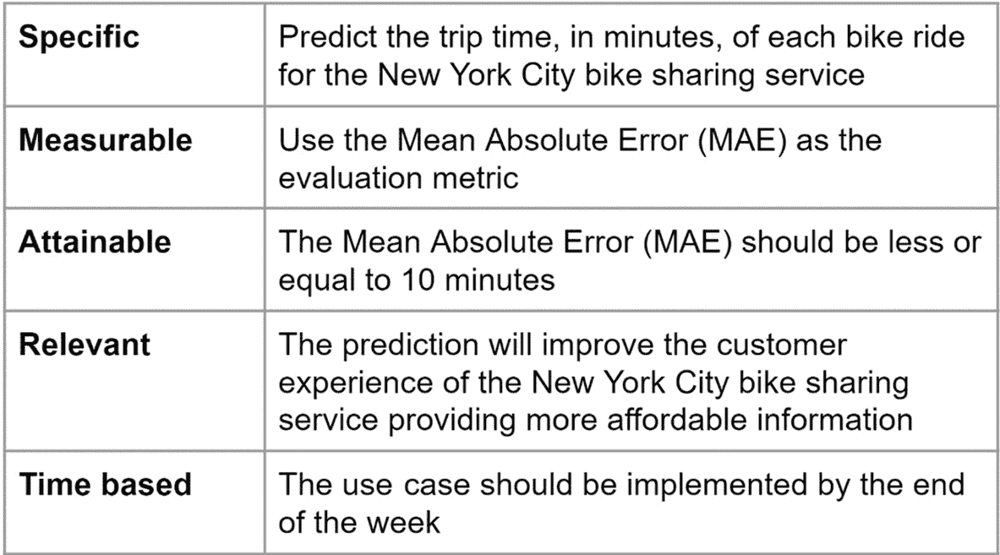
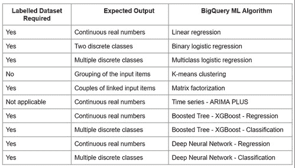
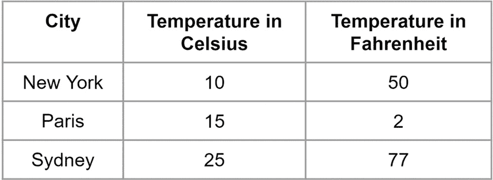
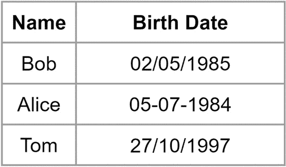
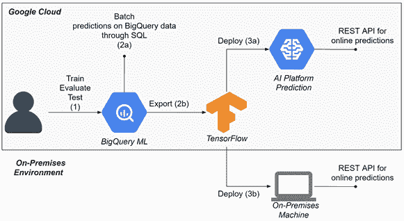

# *第十四章*：BigQuery ML 技巧和最佳实践

BigQuery ML 具有民主化数据分析师和业务分析师使用 **机器学习（ML**）的优势。实际上，BigQuery ML 允许没有任何编程经验的用户实施高级 ML 算法。尽管 BigQuery ML 设计用于简化并自动化 ML 模型的创建，但在 ML 算法的开发生命周期中，仍有一些最佳实践和技巧应该被采用，以获得有效的性能。

拥有数据科学背景可以帮助我们在进一步提高 ML 模型的性能以及避免在用例实施过程中的陷阱。在本章中，我们将学习如何为每个特定的业务场景选择正确的技术，并了解我们可以利用的工具来提高 ML 模型的性能。

按照典型的 ML 开发生命周期，我们将讨论以下主题：

+   选择合适的 BigQuery ML 算法

+   准备数据集

+   理解特征工程

+   调整超参数

+   使用 BigQuery ML 进行在线预测

# 选择合适的 BigQuery ML 算法

在本节中，我们将学习在实施 ML 模型之前定义一个明确的企业目标为什么如此重要，并了解哪些 BigQuery ML 算法适用于每个特定的用例。

重要提示

**数据科学家**是负责收集、分析和理解大量数据的专业人士。这个角色通常需要统计和编码技能的混合。

**数据分析师**与数据科学家不同。数据分析师更专注于行业知识和业务流程，而不是编码和编程技能。这个角色的人拥有大量数据操作和可视化的经验，能够从数据中提出相关的业务洞察。

为了在机器学习（ML）中获得有意义的成果，有必要定义一个明确的企业目标。在开始实际实施 ML 模型之前，数据分析师和数据科学家应该清楚地定义他们希望实现的企业目标。

一种设置明确目标最著名的技巧被称为 **具体、可衡量、可实现、相关和基于时间（SMART**）框架。在这个范式下，每个字母代表我们的最终目标应该满足的特定特征，如下所述：

+   **具体性**：有必要定义一个明确且精确的企业目标。

+   **可衡量性**：为了理解 BigQuery ML 模型是否满足我们的标准，我们需要选择一个或多个 **关键绩效指标（KPI**），例如 **接收者操作特征（ROC**），**曲线下面积（AUC**）值，或 **平均绝对误差（MAE**）。

+   **可达成**：我们需要分析我们想要解决的用例的复杂性，并设定合理的期望——例如，我们不能期望我们的 BigQuery ML 模型 100%地预测正确的值。

+   **相关**：我们需要将精力集中在最重要的用例上，因为可能某些业务场景只能为我们公司带来有限的优势。

+   **基于时间**：作为数据分析师和数据科学家，我们在时间方面资源有限。集中精力在正确的目标上对于为公司创造价值是至关重要的。

我们可以将 SMART 框架应用于 ML 领域，以帮助我们选择正确的用例和正确的 BigQuery ML 算法来使用。

例如，在下面的表中，您可以可视化 SMART 框架应用于我们在*第四章*，*使用线性回归预测数值*中开发的用例：



图 14.1 – 将 SMART 框架应用于 ML 用例

一旦我们使用 SMART 方法定义了我们的业务目标，我们就准备好选择最佳的 BigQuery ML 算法，以帮助我们解决业务场景。

根据我们想要实现的企业目标和我们可以利用的训练数据集，我们可以确定可以解决我们用例的 BigQuery ML 算法。

在下面的表中，我们可以看到我们可以用于开发我们的 ML 模型的所有 BigQuery ML 技术的总结：



图 14.2 – 一瞥 BigQuery ML 算法

为了实现我们的目标，我们可以导航到*图 14.2*中表示的表，并清楚地找到可以解决我们用例的 BigQuery ML 算法。例如，对于我们在*图 14.1*中分析的业务场景，我们可以断言以下内容：

+   我们在*第四章*，*使用线性回归预测数值*中使用的 BigQuery 公共数据集是一个标记数据集，因为对于每条记录，它包括过去行程的行程时间。

+   预期的结果是连续的实数。实际上，用例的目标是预测行程时间，以分钟为单位。

通过查看*图 14.2*中提供的表格，我们注意到我们可以使用以下 BigQuery ML 算法之一来解决我们的预测用例：

+   **线性回归**

+   **提升树 – XGBoost – 回归**

+   **深度神经网络 – 回归**

在本节中，我们学习了如何设定明确的企业目标。然后，我们了解了我们可以使用哪些 BigQuery ML 技术来解决我们的业务目标。在下一节中，我们将专注于准备数据集以获得有效的 ML 模型。

# 准备数据集

在本节中，我们将学习哪些技术可以应用以确保我们用于构建机器学习模型的数据是正确的并产生预期的结果。之后，我们将探讨我们可以使用的策略来将数据集分割为训练集、验证集和测试集。

## 与高质量数据一起工作

在本节中，我们将了解我们的数据集应该具备哪些特征，以便开发有效的 BigQuery ML 模型。

由于机器学习模型是从数据中学习的，因此向我们的机器学习算法提供高质量的数据非常重要，尤其是在训练阶段。由于**数据质量**是一个非常广泛的话题，需要一本书来详细分析它。因此，我们将仅关注与构建机器学习模型相关的主要数据质量概念。 

重要提示

**数据质量**是一个包括过程、专业人员、技术和最佳实践的学科，用于识别和纠正数据中的异常、错误和缺陷。

这种做法对于支持基于可信和负担得起的数据洞察的商业决策至关重要。

我们可以根据不同的数据质量维度来衡量数据集的质量。

在下面的图中，你可以看到用于衡量数据质量的不同维度：

![图 14.3 – 数据质量维度]

![图片 B16722_14_003.jpg]

图 14.3 – 数据质量维度

我们可以根据以下维度来评估数据集的质量：**准确性**、**完整性**、**一致性**、**及时性**、**有效性**和**唯一性**。

在接下来的章节中，我们将解释每个数据质量维度以及为什么它对于机器学习模型的实现很重要。

### 准确性

**准确性**指的是我们数据集中可用的信息。如果一个数值是错误的并且不反映现实，这将影响建立在它之上的 BigQuery ML 模型的有效性。

发现不准确的信息并不容易，但我们可以应用一些数据质量检查来识别数据中的相关问题——例如，我们可以执行查询来识别并最终删除包含错误值的记录。

在下面的表格中，你可以看到一个典型的不准确数据示例，其中包含一个负值来表示一个人的年龄：

![图 14.4 – 一个年龄列中存在不准确值的表格示例]

![图片 B16722_14_004.jpg]

图 14.4 – 一个年龄列中存在不准确值的表格示例

在`SELECT`查询中使用`MAX`和`MIN`运算符可以是一个很好的方法来找到列中的错误值。这些记录被称为异常值，因为它们与其他列中的记录相比具有非常不同的值。执行一些初步的**结构化查询语言**（**SQL**）查询以提取特征和标签的最大值和最小值对于帮助识别数据集中最相关的错误非常有用。

例如，在*图 14.4*中，Alice 的年龄将在**年龄**列中被识别为异常值。在这些情况下，我们可以考虑过滤掉具有非现实值的记录。

### 完整性

`NULL`字段，这些字段将影响我们模型的表现。

在以下表中，你可以看到一个不完整数据的示例：


图 14.5 – 年龄列中存在不完整值的表格示例

为了防止存在不完整记录，最有效的解决方案是在查询中应用特定的过滤器，以排除具有缺失值的记录。一个典型的完整性检查是在特征或模型的标签不应为空且应不同于`NULL`时添加`WHERE`子句。

在以下代码片段中，你可以看到一个应用了完整性检查的`SELECT`语句示例，针对`<TEXT_FIELD>`占位符：

```py
SELECT *
FROM <TABLE_NAME>
WHERE
    <TEXT_FIELD> IS NOT NULL AND <TEXT_FIELD> <> '' 
```

在前面的示例中，我们正在对由`<TABLE_NAME>`占位符表示的表应用完整性检查。质量检查验证`<TEXT_FIELD>`字段不等于`NULL`且不为空。

如果一条记录包含不完整的字段，我们可以选择从数据集中排除此记录，或者用默认值替换缺失值以填补空白。

### 一致性

在数据中实现**一致性**是执行的最复杂任务之一。在企业环境中，相同的数据通常存储在多个位置，可能以不同的格式或单位表示。当一个列的值与其他列的值不兼容时，数据是不一致的。

例如，我们可以想象一个包含以°C 表示的温度的列和另一个以°F 表示相同温度的列的表。如果这两个值应该代表相同的温度但计算不准确，则表将显示不一致性。

在以下表中，你可以看到第二条记录在温度值上存在不一致性：



图 14.6 – 温度列中存在不一致值的表格示例

在*图 14.6*中，第二条记录——对应于在**巴黎**测量的温度——在°C 和°F 尺度之间存在不一致性。

为了检查数据的一致性，我们通常应该在同一个表或不同表中的多个字段上应用验证检查。

### 及时性

**及时性**在需要使用 BigQuery ML 模型时尤为重要。当我们训练 ML 模型时，我们需要确保在 ML 模型执行时，训练阶段使用的所有特征都将可用。

在**第四章**（*Chapter 4*）的商业场景中，*使用线性回归预测数值*，我们使用了自行车租赁公司的起始站和终点站来预测行程时长。在这种情况下，我们利用起始站和终点站训练了 BigQuery ML 模型，但如果在预测时终点站不可用，ML 模型就变得不适用且毫无价值。

为了避免这种常见的错误，我们需要检查所有用于训练模型的特征在预测阶段（当 ML 模型生成预测时）也将可用。

### **有效性**

值的**有效性**严格相关于字段应有的预期格式。如果一个列包含以*DD/MM/YYYY*格式表示的日期值，而其中一个记录呈现的格式为*DD-MM-YYYY*，则该记录的有效性会受到损害。

在以下表中，您将注意到第二个记录对于**出生日期**字段呈现了一个无效值：



图 14.7 – 一个在出生日期列中包含无效值的表的示例

为了满足这一维度，我们必须检查一个列中所有值都存储在相同的格式和同一种方式中。为了检查每个字段的精确格式，我们可以将正则表达式应用于列中的值。

### **唯一性**

**唯一**信息意味着在一个表中恰好有一个记录来表示一个特定的项目。数据重复可能由几个原因造成，例如数据摄取过程中的错误，或在数据加载过程中的不可控中断和重启。

为了防止这些错误，我们需要知道构成我们记录的**主键**（**PK**）的字段，并且我们需要检查**PK**与一个——并且只有一个——记录匹配。

重要提示

在一个表中，**PK**是唯一标识一行的最小列集。

重复记录的存在可能导致 ML 模型从非实际但由技术错误生成的发生中学习。

现在我们已经发现了在实施我们的 BigQuery ML 模型之前需要检查的所有数据质量维度，让我们来看看我们可以用来将数据集分割为训练集、验证集和测试集的技术。

## 数据集的分割

在本节中，我们将学习如何轻松分割数据集以支持 BigQuery ML 模型的训练、验证和测试阶段。

对于大多数 BigQuery ML 算法，我们需要将初始数据集分为三个不同的集合，如下所示：

+   **训练**数据集代表我们将用于训练我们的 BigQuery ML 模型的样本数据。

+   **验证集**与训练集不同，我们可以用它来评估模型的性能。我们在与训练阶段使用的样本数据完全不同的新数据上执行验证。在这个阶段，我们还可以调整模型的超参数。

+   **测试集**是用于最终应用模型并验证其结果和性能的数据集。

将初始数据集分割成这三个子集可能会很繁琐，但如果您有足够的数据，可以应用以下经验规则：

+   训练集的数据占 80%。

+   10% 用于验证集。

+   剩余的 10% 用于测试集。

+   如果我们在处理大量数据，我们可以减少用于验证集和测试集的观测值的百分比。

在以下屏幕截图中，您可以看到最佳分割策略的图形表示：


图 14.8 – 机器学习的 80/10/10 分割策略

为了达到最佳结果，分割过程应该尽可能随机。

在以下代码块中，您可以看到如何通过使用 `MOD` 函数应用此经验规则：

```py
SELECT
  CASE
    WHEN MOD(<RECORD_KEY>, 10) < 8 THEN 'training'
    WHEN MOD(<RECORD_KEY>, 10) = 8 THEN 'evaluation'
    WHEN MOD(<RECORD_KEY>, 10) = 9 THEN 'test'
  END AS dataframe
FROM
  <TABLE_NAME>
```

在示例中，存储在由占位符 `<TABLE_NAME>` 表示的表中的记录根据字段 dataframe 的值分为三个不同的集合。在这种情况下，MOD 函数返回一个从 0 到 10 的值。使用此函数允许我们将记录分为三个不同的集合。通过利用 `MOD(<RECORD_KEY>, 10)<8, MOD(<RECORD_KEY>, 10) = 8 和 MOD(<RECORD_KEY>, 10) = 9` 这两个子句，我们可以将记录分为 `'training'`、`'evaluation'` 和 `'test'` 集合。

现在我们已经了解了如何根据我们的训练、验证和测试需求来分割数据集，让我们来看看对特征工程技术的理解。

# 理解特征工程

在本节中，我们将了解在训练阶段之前我们可以使用哪些技术来改进 BigQuery ML 模型的特征。

重要提示

**特征工程**是在原始数据上应用预处理函数的实践，以提取对训练机器学习模型有用的特征。创建预处理特征可以显著提高机器学习模型的性能。

按照设计，BigQuery ML 在使用 `CREATE MODEL` 函数进行训练阶段时，会自动应用特征工程，但它也允许我们应用预处理转换。

为了在训练和预测阶段自动应用特征工程操作，我们可以在训练 BigQuery ML 模型时将所有预处理函数包含在 `TRANSFORM` 子句中。

如以下代码示例所示，我们需要在 `OPTIONS` 子句之前使用 `TRANSFORM` 子句，并在 `CREATE MODEL` 语句之后：

```py
CREATE MODEL <MODEL_NAME>
TRANSFORM(<TRANSFORM_CLAUSES>)
OPTIONS
  (<OPTION_CLAUSES>) AS
<TRAINING_TABLE>
```

在 BigQuery ML 中，有两种不同类型的特征工程函数，如下所述：

+   **标量**函数作用于单个记录

+   **分析性**函数在所有行上计算结果

在以下列表中，您可以查看在 BigQuery ML 中可以应用的最重要特征工程函数：

+   `ML.BUCKETIZE`: 这个函数用于将数值表达式转换为分类字段——例如，您可以使用此函数将一个人的年龄转换为 *Young*（年轻）、*Middle*（中年）或 *Old*（老年）桶。

+   `ML.FEATURE_CROSS`: 这个函数用于将两个特征组合成一个独特的特征。例如，如果在数据集中我们有一个人的性别和出生地，我们可以将这些两个特征组合起来简化我们的 BigQuery ML 模型。当我们在相关特征中并且想要在我们的机器学习模型中包含这两个信息时，这种技术特别适用。

+   `ML.QUANTILE_BUCKETIZE`: 这个函数与 `ML.BUCKETIZE` 函数非常相似。在这种情况下，该函数是分析性的，并应用于数据集中的所有记录。记录分割成桶是基于整个记录集的百分位数。

    重要提示

    **分位数**是数据集的特定部分。例如，它标识有多少值高于或低于某个阈值。

+   `ML.MIN_MAX_SCALER`: 这是一个分析函数，根据整个记录集中的值分布返回一个从零到一的值。

+   `ML.STANDARD_SCALER`: 这是一个分析函数，允许我们使用记录集的标准差和平均值。

对于特征工程和预处理的完整函数列表，您可以访问以下链接的官方 BigQuery 文档：[`cloud.google.com/bigquery-ml/docs/reference/standard-sql/bigqueryml-preprocessing-functions`](https://cloud.google.com/bigquery-ml/docs/reference/standard-sql/bigqueryml-preprocessing-functions)。

现在我们已经了解了特征工程，让我们继续学习超参数调整。

# 调整超参数

在本节中，我们将探讨在 BigQuery ML 中可以调整的最重要超参数。

重要提示

**超参数调整**是选择最佳参数集以训练特定机器学习模型的实践。超参数在机器学习训练阶段影响并控制学习过程。

按设计，BigQuery ML 使用默认超参数来训练模型，但高级用户可以手动更改它们以影响训练过程。

在 BigQuery ML 中，我们可以在 `OPTIONS` 子句中指定超参数作为可选参数。在开始训练 BigQuery ML 模型之前，我们可以更改的最相关的超参数（取决于模型）如下所示：

+   `L1_REG`: 这是一个正则化参数，我们可以使用它通过保持模型权重接近零来防止过拟合。

+   `L2_REG`: 这是一个第二正则化参数，我们可以使用它来防止过拟合。

+   `MAX_ITERATIONS`：这代表 BigQuery ML 在训练模型时将执行的最大迭代次数。

+   `LEARN_RATE`：这是一个参数，它影响模型根据前一次迭代的错误进行多少变化。

+   `MIN_REL_PROGRESS`：这是在迭代后继续训练所必需的最小改进。

+   `NUM_CLUSTERS`：这用于 K-Means 算法，表示模型将创建的簇的数量。

+   `HIDDEN_UNITS`：这用于**深度神经网络**（**DNNs**），表示网络中的隐藏层数量。

关于你可以使用 BigQuery ML 应用的所有超参数的完整列表，我们建议访问官方文档[`cloud.google.com/bigquery-ml/docs/reference/standard-sql/bigqueryml-syntax-create`](https://cloud.google.com/bigquery-ml/docs/reference/standard-sql/bigqueryml-syntax-create)。

# 使用 BigQuery ML 进行在线预测

在本节中，我们将了解如何以同步和在线的方式使用 BigQuery ML 模型。

BigQuery ML 为商业和数据分析师民主化机器学习技术提供了巨大的机会。当 BigQuery ML 训练并准备好使用时，我们可以在 BigQuery 中直接通过 SQL 查询调用它，或者将其导出到 TensorFlow 格式。

每个用例的需求驱动我们应该采用的预测类型，如下所述：

+   当我们想要启用请求-响应应用程序，并且获取即时预测至关重要时，我们使用**在线预测**。

+   当我们不需要立即预测时，我们会采用**批量预测**来处理大量数据——例如，安排每日或每周的工作，计算自上次作业执行以来收集的数据的预测。

虽然使用 BigQuery SQL 语句更适合对存储在 BigQuery 表中的大量记录进行批量预测，但将 BigQuery ML 模型导出到 TensorFlow 的可能性为应用开辟了新的机会。

在下面的图中，你可以看到 BigQuery ML 模型从训练阶段到部署阶段的生命周期：




图 14.9 – 使用 BigQuery ML 模型进行在线预测

从前面的图中，我们看到在 BigQuery ML 模型生命周期的第一步**（1**）中，我们通过利用存储在 BigQuery 中的训练数据集来训练 ML 模型。在这个第一步中，ML 模型经历了开发周期的三个主要阶段，如下所述：

+   **训练**：在这个阶段，BigQuery ML 模型从训练数据中学习。

+   **评估**：在这个步骤中，我们评估模型的 KPI 指标，并且可以调整超参数。

+   **测试**：在这个最后阶段，我们最终在测试数据集上测试 BigQuery ML 模型以获取预测。

当 BigQuery ML 模型在性能方面满足我们的期望时，我们可以做以下操作：

+   通过 SQL 在 BigQuery 中使用模型**（2a）**，通过利用已存储在表中的数据。这种方法通常适用于批量预测——例如，我们可以定期运行 BigQuery SQL 语句，每天或每周执行模型，生成新的预测。

+   将模型导出到 TensorFlow 的`SavedFormat**（2b）**`，正如我们在*第十三章*，“使用 BigQuery ML 运行 TensorFlow 模型”中描述的那样。这种方法特别适合在 BigQuery 之外的其他 TensorFlow 兼容平台上运行机器学习模型。同样的方法可以通过将机器学习模型导出到 XGBoost 增强器格式来采用。

当我们导出 BigQuery ML 模型后，我们可以将机器学习算法部署到以下之一：

+   **Google Cloud AI Platform Prediction** **（3a）**：使用这个 Google Cloud 模块，我们可以在云中部署训练好的机器学习模型，并利用云基础设施来提供模型和生成在线预测。这种云服务自动配置和管理基础设施资源以运行机器学习模型，并且可以根据来自客户端应用程序的请求数量进行扩展。在 Google Cloud AI Platform Prediction 上的部署会自动生成一个**表示状态传输** (**REST**)端点，可以通过**超文本传输协议** (**HTTP**)请求来调用模型。

    这种方法在当我们有多个客户端应用程序需要与我们的机器学习模型交互，而我们又不想担心服务的基础设施维护时特别有用。作为先决条件，我们需要考虑的是，我们只能在使用互联网连接的情况下使用这种方法。实际上，为了调用云平台暴露的 REST **应用程序编程接口** (**API**)，我们需要从客户端应用程序向云发送 HTTP 请求。

+   一种可以在**本地机器**上部署使用容器的**（3b）**方法。TensorFlow 模型实际上可以通过利用**TensorFlow Serving Docker**容器来部署。要了解在**Docker**容器中部署 TensorFlow 模型的步骤，您可以查看[`www.tensorflow.org/tfx/serving/docker`](https://www.tensorflow.org/tfx/serving/docker)上的文档。

    重要提示

    **容器**是一种在单个操作系统之上运行的虚拟化机制。**Docker**是一个用于部署容器化应用程序的容器引擎。容器引擎为每个应用程序分配硬件资源，并管理虚拟基础设施的可伸缩性。

当机器学习模型需要在特定条件下运行时，例如在无互联网连接或敏感数据的情况下，我们可以使用这种方法。实际上，当我们部署本地机器学习模型时，云基础设施不再参与预测，并且本地环境和云之间没有数据传输。

在这两种部署场景中，可以通过使用 HTTP 请求调用 ML 模型，在请求有效负载中传递输入参数。在 ML 模型执行结束时，预测结果返回到响应有效负载中。

# 摘要

在本章中，我们学习了在实施 BigQuery ML 机器学习用例时可以应用的最重要技巧和最佳实践。

我们分析了数据准备的重要性；我们开始关注数据质量方面；然后，我们学习了如何轻松地将数据分割以获得平衡的训练、验证和测试集。

然后，我们探讨了如何使用 BigQuery ML 的函数来改进机器学习模型的表现。

之后，我们专注于调整超参数。当我们训练模型时，BigQuery ML 允许我们选择不同的参数，这些变量影响训练阶段。

最后，我们理解了为什么在其它平台上部署 BigQuery ML 模型如此重要，以便我们获得在线预测并满足近实时业务场景。

恭喜您完成本书的阅读！现在您应该能够为您的业务场景和用例使用 BigQuery ML。我建议您继续关注这个如此有趣且发展迅速的主题。

# 更多资源

+   **BigQuery ML 创建模型**: [`console.cloud.google.com/marketplace/product/city-of-new-york/nyc-citi-bike`](https://console.cloud.google.com/marketplace/product/city-of-new-york/nyc-citi-bike)

+   **BigQuery ML 预处理函数**: [`cloud.google.com/bigquery-ml/docs/reference/standard-sql/bigqueryml-preprocessing-functions`](https://cloud.google.com/bigquery-ml/docs/reference/standard-sql/bigqueryml-preprocessing-functions)

+   `导入 TensorFlow 模型的`CREATE MODEL**语句**: [`cloud.google.com/bigquery-ml/docs/reference/standard-sql/bigqueryml-syntax-create-tensorflow`](https://cloud.google.com/bigquery-ml/docs/reference/standard-sql/bigqueryml-syntax-create-tensorflow)

+   `ML EVALUATE` **函数**: [`cloud.google.com/bigquery-ml/docs/reference/standard-sql/bigqueryml-syntax-evaluate`](https://cloud.google.com/bigquery-ml/docs/reference/standard-sql/bigqueryml-syntax-evaluate)

+   `ML PREDICT` **函数**: [`cloud.google.com/bigquery-ml/docs/reference/standard-sql/bigqueryml-syntax-predict`](https://cloud.google.com/bigquery-ml/docs/reference/standard-sql/bigqueryml-syntax-predict)

+   **导出 BigQuery ML 模型以进行在线预测**: [`cloud.google.com/bigquery-ml/docs/export-model-tutorial`](https://cloud.google.com/bigquery-ml/docs/export-model-tutorial)
