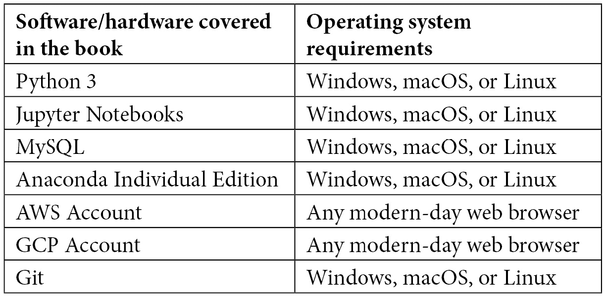

# 前言

在过去的几年中，机器学习领域发生了重大变化，影响了我们的日常生活和商业决策的方式。生物技术和生命科学行业最丰富的资源之一就是它们源源不断的数据来源。随着我们向更多数据驱动的模型迈进，生命科学和机器学习的交汇点经历了前所未有的增长，揭示了大量信息和隐藏的模式，为公司提供了重大的竞争优势。

在本书的整个过程中，我们将从监督学习和无监督学习的角度探讨机器学习的一些最重要的元素。我们不仅将学习开发和训练稳健的模型，还将使用 AWS 和 GCP 在云端部署它们，使我们能够立即将它们提供给最终用户。

# 本书面向的对象

本书专门针对希望跨越到数据科学领域的学术和工业界的科学专业人士。无论是个人贡献者还是已经在制药、生命科学和生物技术领域建立起来的管理者，都会发现这本书不仅有用，而且对当前的项目具有极大的适用性。尽管本书提供了 Python 和机器学习的介绍，但为了最大限度地利用本书，建议具备基本的 Python 编程知识和数据科学入门级背景。

# 本书涵盖的内容

*第一章*, *介绍生物技术中的机器学习*，简要介绍了生物技术领域以及机器学习可以应用的领域，以及本书将使用的一些技术。

*第二章*, *介绍 Python 和命令行*，概述了 Bash 和 Python 编程语言中一些必须掌握的技术和命令，以及一些最常用的 Python 库。

*第三章*, *开始使用 SQL 和关系数据库*，你将学习 SQL 查询语言，并了解如何使用 MySQL 和 AWS RDS 创建远程数据库。

*第四章*, *使用 Python 可视化数据*，介绍了使用 Python 编程语言进行数据可视化和表示的一些最常见方法。

*第五章*, *理解机器学习*，涵盖了标准机器学习流程的一些最重要的元素，介绍了监督学习和无监督方法，以及如何保存模型以供将来使用。

*第六章*，*无监督机器学习*，您将在这里学习无监督模型，并深入了解与乳腺癌相关的聚类和降维方法。

*第七章*，*监督学习机器学习*，您将在这里学习监督学习模型，并深入了解分类和回归方法。

*第八章*，*理解深度学习*，提供了深度学习领域的概述，我们将探讨深度学习模型的元素，以及两个与使用 Keras 进行蛋白质分类和 AWS 进行异常检测相关的教程。

*第九章*，*自然语言处理*，在探索流行的库和工具的同时，向您介绍一些最常用的 NLP 选项，以及与聚类以及使用 transformers 进行语义搜索相关的两个教程。

*第十章*，*探索时间序列分析*，通过基于时间的方法来探索数据，其中我们分解时间序列数据集的组成部分，并使用 Prophet 和 LSTMs 开发两个预测模型。

*第十一章*，*使用 Flask 应用程序部署模型*，介绍了将模型和应用程序部署给最终用户的最受欢迎的框架之一。

*第十二章*，*将应用程序部署到云中*，介绍了两个最受欢迎的云计算平台，以及三个允许用户将他们的工作部署到 AWS LightSail、GCP AppEngine 和 GitHub 的教程。

# 要充分利用本书

为了最大限度地发挥您的时间价值，建议您具备基本的 Python 编程语言和 Bash 命令行知识。此外，建议您在生物技术和生命科学领域有一些背景知识，以便最好地理解教程和用例。



**如果您使用的是本书的数字版，我们建议您亲自输入代码或从书的 GitHub 仓库（下一节中有一个链接）获取代码。这样做将帮助您避免与代码复制粘贴相关的任何潜在错误。**

# 下载示例代码文件

您可以从 GitHub 在[`github.com/PacktPublishing/Machine-Learning-in-Biotechnology-and-Life-Sciences`](https://github.com/PacktPublishing/Machine-Learning-in-Biotechnology-and-Life-Sciences)下载本书的示例代码文件。如果代码有更新，它将在 GitHub 仓库中更新。

我们还有其他来自我们丰富的图书和视频目录的代码包，可在[`github.com/PacktPublishing/`](https://github.com/PacktPublishing/)找到。查看它们吧！

# 下载彩色图像

我们还提供了一份包含本书中使用的截图和图表彩色图像的 PDF 文件。您可以从这里下载：[`static.packt-cdn.com/downloads/9781801811910_ColorImages.pdf`](https://static.packt-cdn.com/downloads/9781801811910_ColorImages.pdf)。

# **使用的约定**

本书使用了多种文本约定。

`文本中的代码`：表示文本中的代码单词、数据库表名、文件夹名、文件名、文件扩展名、路径名、虚拟 URL、用户输入和 Twitter 昵称。以下是一个示例：“将下载的`WebStorm-10*.dmg`磁盘映像文件作为系统中的另一个磁盘挂载。”

代码块应如下设置：

```py
from sklearn.preprocessing import StandardScaler
scaler = StandardScaler()
X_scaled = scaler.fit_transform(dfx.drop(columns = ["annotation"]))
```

当我们希望您注意代码块中的特定部分时，相关的行或项目将以粗体显示：

```py
>>> heterogenousList[0]
dichloromethane
>>> heterogenousList[1]
3.14 
```

任何命令行输入或输出应如下编写：

```py
$ mkdir machine-learning-biotech
```

**粗体**：表示新术语、重要单词或您在屏幕上看到的单词。例如，菜单或对话框中的单词以粗体显示。以下是一个示例：“从**管理**面板中选择**系统信息**。”

**提示或重要注意事项**

它看起来像这样。

# 联系我们

我们始终欢迎读者的反馈。

`customercare@packtpub.com` 并在消息的主题中提及书名。

**勘误表**：尽管我们已经尽最大努力确保内容的准确性，但错误仍然可能发生。如果您在这本书中发现了错误，我们将非常感激您能向我们报告。请访问 [www.packtpub.com/support/errata](http://www.packtpub.com/support/errata) 并填写表格。

`copyright@packt.com` 并附有链接到材料。

**如果您有兴趣成为作者**：如果您在某个领域有专业知识，并且您有兴趣撰写或为书籍做出贡献，请访问 [authors.packtpub.com](http://authors.packtpub.com)。

# 分享您的想法

一旦您阅读了《生物技术及生命科学中的机器学习》，我们很乐意听到您的想法！请点击此处直接进入此书的亚马逊评论页面并分享您的反馈。

您的评论对我们和科技社区都很重要，并将帮助我们确保我们提供高质量的内容。
