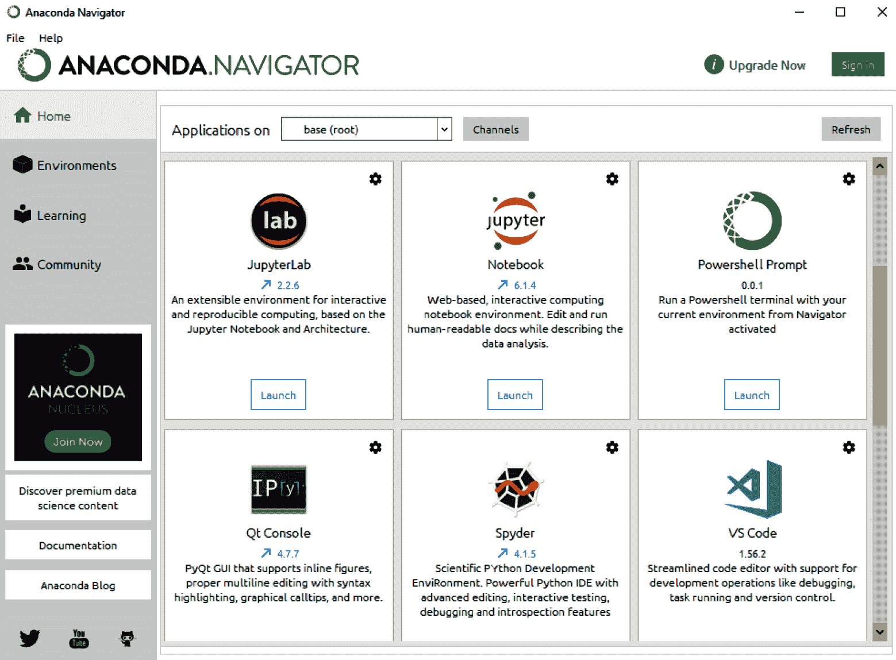
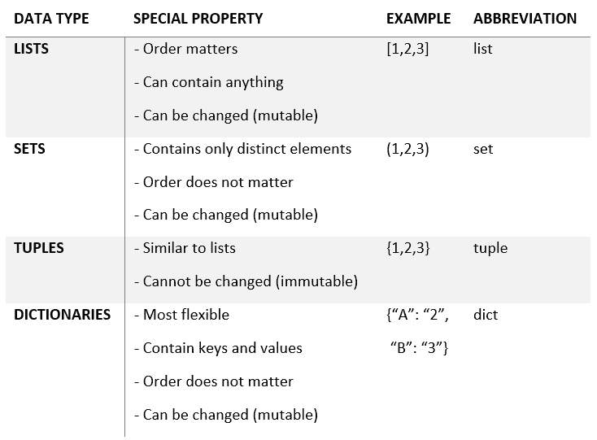
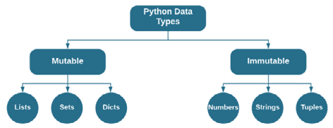
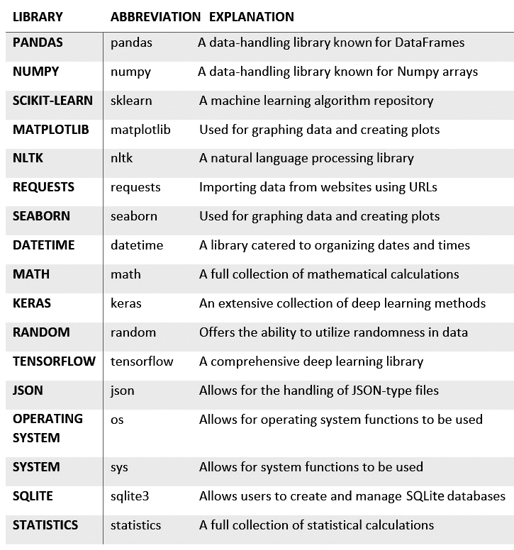
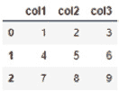
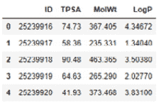
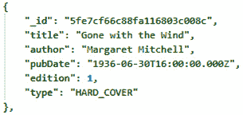
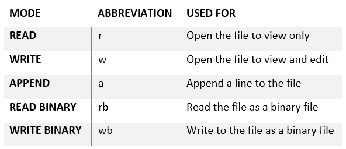
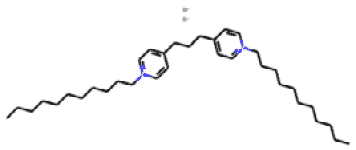

# 第二章：介绍 Python 和命令行

当你走进一家咖啡馆时，你几乎会立刻注意到三种类型的人：那些与他人社交的人，那些在项目上工作的人，以及那些编码的人。编码者可以通过他们电脑屏幕上的黑色背景和白色字母轻松辨认出来——这被称为**命令行**。对于许多人来说，命令行可能看起来凶猛且令人畏惧，但对于其他人来说，这是一种生活方式。

进行任何类型的数据科学项目的一个重要部分是能够有效地通过终端命令行导航目录和执行命令。命令行允许用户以高效和简洁的方式查找文件、安装库、定位包、访问数据以及执行命令。本章绝对不是命令行所有功能的全面概述，但它确实涵盖了一个数据科学家应该知道的必要命令列表。

在本章中，我们将涵盖以下具体主题：

+   介绍命令行

+   探索 **Python** 语言

+   指南 – Python 入门

+   指南 – 使用 Rdkit 和 BioPython

# 技术要求

在本章中，我们将使用**macOS**的**应用程序**文件夹，或者在**Windows** **PC**的启动菜单中找到的**命令提示符**。尽管这两个在功能上等效，但某些命令背后的语法会有所不同。如果你使用的是 PC，我们鼓励你从其网站下载**Git for Windows** ([`git-scm.com/download/win`](https://git-scm.com/download/win))，这将允许你使用**Bash**命令行来跟随。当我们开始在命令行中编辑文件时，我们需要一个名为**Vim**的编辑器。大多数 Mac 用户将预装 Vim。我们鼓励 PC 用户从其网站([`www.vim.org/download.php`](https://www.vim.org/download.php))下载 Vim。

此外，我们还将使用**Anaconda**发行版来探索 Python。我们将在不久的将来介绍如何在你的系统上下载它。安装 Anaconda 的过程对于 Mac 和 PC 用户几乎相同，Python 代码的执行也几乎相同。

在本书的整个过程中，你看到的代码也将可在**GitHub**上找到。我们可以将 GitHub 视为代码可以生存的空间，使我们能够维护版本控制、进行编辑，并与他人分享我们的工作。随着你跟随本章的内容，我们鼓励你参考相关的 GitHub 仓库，该仓库可在[`github.com/PacktPublishing/Machine-Learning-in-Biotechnology-and-Life-Sciences`](https://github.com/PacktPublishing/Machine-Learning-in-Biotechnology-and-Life-Sciences)找到。

# 介绍命令行

命令行在**Mac**、**PC**和**Linux**上都是可用的。虽然以下示例是在 Mac 上执行的，但非常类似的功能也适用于 PC，但语法略有不同。

您可以通过打开命令行（称为 `@` 符号）开始此过程。让我们看看一些基本命令。

为了识别您当前（工作）目录的路径，您可以使用 `pwd` 命令：

```py
  $ pwd
```

这将返回您当前所在的精确目录。在我的系统中，返回的路径如下：

```py
Users/alkhalifas
```

为了识别此特定目录内的内容，您可以使用 `ls` 命令，它将返回目录和文件的列表：

```py
  $ ls
```

您可以在命令行中使用 `mkdir` 命令（后跟您希望创建的目录名称）在命令行内创建新目录。例如，您可以使用以下命令创建 `machine-learning-practice` 目录：

```py
  $ mkdir machine-learning-biotech
```

如果您再次使用 `ls` 命令列出此目录的内容，新目录将出现在该列表中。您可以使用 `cd`（即 *change directory*）命令导航到该目录：

```py
  $ cd machine-learning-practice
```

您还可以再次使用 `pwd` 命令来检查您的新路径：

```py
  $ pwd
Users/alkhalifas/machine-learning-biotech
```

为了返回上一个目录，您可以使用 `cd` 命令，后跟一个空格和两个点（`..`）：

```py
  $ cd ..
```

重要提示

值得注意的是，根据您使用的命令行，目录名称可能区分大小写。例如，输入 `Downloads` 而不是 `downloads` 可能会被解释为不同的位置，因此这可能会返回错误。在命名文件和目录时保持一致性将是您在命令行中成功的关键。

## 创建和运行 Python 脚本

现在您已经学到了一些基础知识，让我们继续使用命令行创建我们的第一个 Python 应用程序。我们可以使用 `vim` 命令（后跟您希望创建和编辑的文件名称）创建和编辑新文件：

```py
  $ vim myscript.py
```

这将在您的命令行 Vim 编辑器中打开一个空文件，您可以在其中编写或粘贴代码。默认情况下，您将处于 *view* 模式。您可以通过按键盘上的 *I* 键切换到 *edit* 模式。您会注意到 Vim 窗口底部的状态已更改为 **- - INSERT - -**，这意味着您现在可以向此文件添加代码：


图 2.1 – Vim 窗口

将以下几行 Python 代码（或复制并粘贴）输入到文件中，然后按 *Esc* 键。您会注意到状态不再是 `:wq` 并按 *Enter*。*w* 键将写入文件，而 *q* 键将退出编辑器。有关其他 Vim 命令的更多详细信息，请参阅 Vim 网站 [`www.vim.org/`](https://www.vim.org/)：

```py
# myscript.py
import datetime
now = datetime.datetime.now()
print("Hello Biotech World")
print ("The current date and time is:")
print (now.strftime("%Y-%m-%d %H:%M:%S"))
```

到此为止，你已经编写了你的第一个 Python 脚本。我们可以继续使用你之前安装的 Python 解释器来执行这个脚本。在我们这样做之前，让我们谈谈这个脚本将做什么。从第一行开始，我们将导入一个名为`datetime`的库，这将允许我们确定系统的当前日期和时间。接下来，我们将`datetime`对象分配给一个我们将称之为`now`的变量。我们将在下一节讨论对象和变量，但在此期间，可以将它们视为可以填充值（如日期或数字）的变量。最后，我们将打印一个短语`Hello Biotech World!`，然后是当前时间的声明。

让我们试一试：

```py
  $ python3 myscript.py
```

执行此文件后，以下结果将出现在你的屏幕上：

```py
Hello Biotech World!
The current date and time is:
2021-05-23 18:40:21
```

在这个例子中，我们使用了一个名为`datetime`的库，这个库是在你安装 Anaconda 发行版时默认安装的。还安装了许多其他库，但没有安装的更多。随着我们通过这些项目，我们将使用许多这些其他库，我们可以使用`pip`来安装。

之前的例子运行没有任何错误。然而，在编程中这种情况很少见。有时候，一个遗漏的句号或未关闭的括号会导致错误。在其他情况下，程序可能会无限期地运行——可能是在你不知情的情况下在后台运行。通常关闭终端命令行会停止正在运行的应用程序。然而，有时关闭命令行窗口并不是一个选择。要识别后台运行的过程，你可以使用`ps`（即`process`）命令：

```py
  $ ps -ef
```

这将显示所有正在运行的过程列表。第一列是`UID`（用户 ID），接着是`PID`（进程 ID）列。再往右几列，你可以看到当前活跃和正在运行的特定文件名（如果有）。你可以使用`grep`命令来缩小列表，以找到所有与 Python 相关的：

```py
  $ ps -ef | grep python
```

如果一个 Python 脚本（例如，`someScript.py`）在后台持续运行，你可以很容易地使用`grep`命令确定进程 ID，这意味着你可以随后使用`pkill`命令来结束该进程：

```py
  $ pkill -9 -f someScript.py
```

这将终止脚本并释放你的计算机内存以供其他任务使用。

## 使用 pip 安装包

管理 Python 库的最佳资源之一是`sklearn`，我们可以直接在终端命令行使用`pip install`命令来安装它：

```py
  $ pip install sklearn
```

软件包管理器将打印一些反馈消息，提醒你安装的状态。在某些情况下，安装将成功，在其他情况下，可能不会。你在这里收到的反馈将有助于确定是否需要采取下一步行动。

将会有一些情况，其中一个库需要另一个库才能运行——这被称为`pip`将自动为你处理依赖关系，但这并不总是如此。

要识别库的依赖关系，你可以使用`pip show`命令：

```py
  $ pip show sklearn
```

命令行将随后打印出与给定库相关的名称、版本、URL 以及许多其他属性。在某些情况下，显示的版本可能是过时的，或者根本不是你需要的版本。你可以再次使用`pip install`命令来更新库到较新版本，或者通过在库名称后指定来选择特定版本：

```py
  $ pip install sklearn==0.15.2
```

随着你安装的包的数量开始增长，记住它们的名称和相关版本将变得越来越困难。为了生成给定环境中的包列表，你可以使用`pip freeze`命令：

```py
  $ pip freeze > requirements.txt
```

此命令将**冻结**一系列库及其相关版本，并将它们写入一个名为`requirements.txt`的文件。当将代码从一个计算机迁移到另一个计算机时，这种做法在团队中很常见。

## 当事情不按预期进行时…

通常，代码会失败，命令会出错，会出现一些问题，而解决方案可能不会立即找到。不要让这些情况让你气馁。当你开始探索命令行、Python 以及大多数其他基于代码的尝试时，你可能会遇到一些你无法解决的错误和问题。然而，很可能其他人已经解决了你的问题。用于搜索和诊断代码相关问题的最佳资源之一是**Stack Overflow**——一个主要面向个人和公司，用于提问和寻找所有类型代码相关问题的解决方案的协作和知识共享平台。强烈建议你利用这个美好的资源。

现在我们已经对命令行及其无限的能力有了很好的了解，让我们开始更详细地探索 Python。

# 探索 Python 语言

世界上存在许多不同的计算机语言。**Python**、**R**、**SQL**、**Java**、**JavaScript**、**C++**、**C**和**C#**只是其中的一些例子。尽管这些语言在语法和应用方面各不相同，但它们可以被分为两大类：*低级*和*高级*语言。*低级*语言——如 C 和 C++——是在机器级别运行的计算机语言。它们关注非常具体的事情，例如将位从一个位置移动到另一个位置。另一方面，*高级*语言——如 R 和 Python——关注更抽象的过程，例如对一个列表中的数字进行平方。它们完全不考虑机器级别发生的事情。

在我们更详细地讨论 Python 之前，让我们先谈谈编译程序的概念。大多数程序——例如用 C++和 Java 编写的程序——都需要一种称为**编译器**的东西。将编译器想象成一种软件，它在程序启动或执行之前立即将人类可读的代码转换为机器可读的代码。虽然大多数语言都需要编译器，但像 Python 这样的语言则不需要。Python 需要一种称为**解释器**的东西，它在结构上本质上与编译器相似，但它会立即执行命令而不是将它们转换为机器可读的代码。考虑到这一点，我们将 Python 定义为一种*高级*、*通用*和*解释型*编程语言。Python 常用于统计分析、机器学习应用，甚至游戏和网站开发。由于 Python 是一种解释型语言，它可以在 IDE 中使用，也可以直接在终端命令行中使用：

```py
  $ python
```

接下来，我们将讨论集成开发环境（IDEs）。

## 选择 IDE

Python 代码可以通过几种不同的方式准备。例如，我们可以通过在终端命令行中使用 Vim 文本编辑器来准备它，如前一小节所示。虽然这种方法相当有效，但在结构化文件、组织目录和执行代码时，您通常会遇到冗余。或者，大多数数据科学家默认使用更图形化的编辑器，称为**集成开发环境**（**IDEs**）。有许多免费且可下载的 IDE，例如**Spyder**、**PyCharm**、**Visual Studio**或**Jupyter Lab**。

每个 IDE 都有其各自的优缺点，这些优缺点高度依赖于用户的用例和工作流程。大多数新数据科学家在开始时通常默认使用**Jupyter Notebook**和/或**Jupyter Lab**。为了本书的目的，所有代码都将使用 Jupyter Notebook 准备和共享。假设在上一章中正确遵循了 Anaconda 的安装说明，Jupyter Notebook 应该已经安装在本地的计算机上。您可以通过打开**Anaconda Navigator**并选择**Jupyter Notebook**来启动应用程序：



图 2.2 – Anaconda Navigator 窗口

或者，您也可以通过在终端命令行中输入以下命令来启动 Jupyter Notebook 应用程序：

```py
  $ jupyter notebook
```

按下回车键后，之前看到的相同的 Jupyter Notebook 应用程序应该会出现在您的屏幕上。这仅仅是一种打开 Jupyter Notebook 的更快方法。

## 数据类型

Python 能够处理许多不同类型的数据。这些通常可以分为两大类：**原始数据类型**和**集合**，如下面的图所示：


图 2.3 – 显示 Python 数据类型的图表

第一种数据类型类别是原始值。正如其名所示，这些数据类型是 Python 中最基本的构建块。以下是一些例子：


图 2.4 – 原始数据类型的表格

第二种数据类型类别是集合。集合是由一个或多个原始值组合而成的。每种集合类型都有与之相关的特定属性，在某些条件下产生不同的优势和劣势。以下是一些例子：



图 2.5 – 显示不同数据类型集合的表格

作为科学家，我们自然会倾向于尽可能好地组织信息。我们之前根据它们的原始和集合性质对数据类型进行了分类。然而，我们也可以根据一个称为**可变性**的概念来分类数据类型。可变性也可以被理解为*可删除性*。变量，例如表示列表的变量，持有该类型的一个实例。当对象被创建或实例化时，它会被分配一个唯一的 ID。通常，在运行时定义后，该对象的类型不能更改，但是，如果它被认为是*可变的*，则可以更改。整数、浮点数和布尔值等对象被认为是*不可变的*，因此创建后不能更改。另一方面，列表、字典和集合等对象是可变对象，可以更改。因此，它们被认为是可变的，正如您可以从*图 2.6*中看到的那样：



图 2.6 – 根据可变性分类的 Python 数据类型

现在我们已经了解了一些基础知识，让我们探索 Python 语言的一些更令人兴奋的领域。

# 教程 – Python 入门

Python 是一种广泛的语言，任何试图在 10 页以下总结其功能的尝试都会有限制。虽然这本书的目的不是作为 Python 的全面指南，但我们将讨论许多数据科学家应该了解的*必知*命令和能力。我们将看到这些命令中的大多数将在接下来的教程中出现。

## 创建变量

Python 的一个核心概念是变量的概念。`+`)或减法(`-`)可以与变量结合使用来创建`5`将被分配给`x`变量，然后，`10`的值将被分配给`y`变量。现在代表数值的两个变量（`x`和`y`），可以创建一个名为`z`的变量来表示`x`和`y`的和：

```py
     $ python
  >>> x = 5
  >>> y = 10
  >>> z = x + y
  >>> print(z)
  15
```

变量可以采用许多数据类型。除了前面代码中显示的整数值之外，变量还可以被分配字符串、浮点数，甚至是布尔值：

```py
  >>> x = "biotechnology"
  >>> x = 3.14159
  >>> x = True
```

可以使用`type()`函数确定变量的具体数据类型：

```py
  >>> x = 55
  >>> type(x)
      int
```

在 Python 中，数据类型不需要显式声明（与 C++或 Java 等语言不同）。实际上，Python 还允许变量被**转换**为其他类型。例如，我们可以将一个整数转换为字符串：

```py
  >>> x = 55
  >>> x = str(x)
  >>> type(x)
      str
```

我们可以从返回的结果中看到，数据现在已经是字符串类型了！

## 导入已安装的库

安装完库后，你可以使用`import`函数将库导入到你的 Python 脚本或 Jupyter Notebook 中。你可以以下面的方式整体导入库：

```py
>>> import statistics
```

或者，我们可以显式地从库中导入所有类：

```py
>>> from statistics import *
```

导入任何库的最佳方式是只导入你计划使用的类。我们可以以`statistics`库为例：

```py
>>> from statistics import mean
```

随着你进一步进入数据科学领域，安装和导入库将变得习以为常。下表展示了任何新数据科学家都应该了解的一些最常见且最有用的库。尽管并非所有这些库都会在本书的范围内被涵盖，但了解它们是有用的。



图 2.7 – 一个显示一些最常见 Python 库的表格

上表中包含的库是在你开始数据科学之旅时可能会遇到的一些最常见的库。在下一节中，我们将重点关注`math`库来进行一些计算。

## 一般计算

在 Python 语言中，我们可以创建变量并赋予它们特定的值，正如我们之前观察到的。随后，我们可以使用这些变量中的值来形成表达式并进行数学计算。例如，考虑常用的*阿伦尼乌斯方程*，它常用于预测分子稳定性和计算反应速率的温度依赖性。这个方程在研发中主要用于两个目的：

+   优化合成制造过程中的反应条件以最大化产量

+   根据温度和湿度的变化预测片剂和药丸的长期稳定性

该方程可以表示如下：


在这种情况下，*k* 是速率常数，*A* 是频率因子，*EA* 是活化能，*R* 是理想气体常数，*T* 是温度（**开尔文**，**K**）。我们可以使用这个方程来计算温度变化如何影响速率常数。假设当前的需求是预测如果温度从 293 K 变化到 303 K 会发生什么。首先，我们需要定义一些变量：

```py
     >>> from math import exp
     >>> EA = 50000
     >>> R = 8.31
     >>> T1 = 293

     >>> exp(-EA / (R*T1))
  1.2067e-09
```

现在，我们可以重新分配温度变量的另一个值并重新计算：

```py
     >>> T2 = 303
     >>> exp(-EA / (R*T2))
  2.3766e-09
```

总之，这表明温度的简单变化几乎将分数翻倍！

## 列表和字典

**列表**和**字典**是 Python 中最常见和最基本的数据类型。列表只是元素的有序集合（类似于数组），可以包含相同类型或不同类型的元素：

```py
   >>> homogenousList = ["toluene", "methanol", "ethanol"]
  >>> heterogenousList = ["dichloromethane", 3.14, True]
```

可以使用`len()`函数捕获任何给定列表的长度：

```py
  >>> len(heterogenousList)
  3
```

可以使用索引位置检索列表元素。记住，Python 中的所有索引都是从`0`开始的，因此，这个列表的第一个元素位于`0`索引处：

```py
  >>> heterogenousList[0]
  dichloromethane
  >>> heterogenousList[1]
  3.14
```

与它们的原始对应物不同，列表是可变的，因为它们在创建后可以被修改。我们可以使用`append()`函数向列表中添加另一个元素：

```py
  >>> len(homogenousList)
  3
  >>> homogenousList.append("acetonitrile")
  >>> len(homogenousList)
  4
```

另一方面，字典通常用于它们的**键**和**值**的关联。给定一个字典，你可以指定一个*键*的名称及其相应的*值*。例如，一个包含化学名称和它们的有效期的化学清单在标准的 Python 列表中工作得并不好。化学名称和它们的日期在这个格式中很难*关联*在一起。

然而，使用字典来建立这种关联是完美的：

```py
  >>> singleChemical = {"name" : "acetonitrile",
          "exp_date" : "5/26/2021"}
```

这本词典现在代表了一个单一的*化学元素*，在这个意义上，有一个键分配给它作为名称，另一个键分配给它作为有效期。你可以通过指定键来检索字典中的特定值：

```py
>>> singleChemical["name"]
  acetonitrile
```

要构建一个完整的化学清单，你需要为每个化学物质创建多个字典，并将它们全部添加到一个列表中。这种格式被称为**JSON**，我们将在本章的后面更详细地探讨。

## 数组

Python 中的**数组**与列表类似，因为它们可以包含不同类型的元素，可以有多个重复项，并且可以随时间改变和变异。数组可以通过简单的函数轻松扩展、追加、清除、复制、计数、索引、反转或排序。以下是一个例子：

1.  让我们继续使用`numpy`创建一个数组：

    ```py
    import numpy as np
    newArray = np.array([1,2,3,4,5,6,7,8,9,10])
    ```

1.  你可以使用`append()`函数向列表末尾添加另一个元素：

    ```py
      >>> newArray= np.append(newArray,25)
      >>> newArray
       [1,2,3,4,5,6,7,8,9,10,25]
    ```

1.  可以使用`len()`函数确定数组的长度：

    ```py
      >>> len(newArray)
       11
    ```

1.  数组也可以使用方括号进行切片，并分配给新的变量。例如，以下代码取列表的前五个元素：

    ```py
      >>> firstHalf = newArray[:5]
      >>> firstHalf
       [1,2,3,4,5]
    ```

现在我们已经掌握了 Python 的一些基础知识，让我们深入探讨更复杂的话题——*函数*。

## 创建函数

Python 中的**函数**是一种组织代码和隔离过程的方式，允许你定义明确的输入和明确的输出。以一个平方数字的函数为例：

```py
def squaring_function(x):
  # A function that squares the input
  return x * x
```

函数是*一等*的，因为它们可以被分配给变量或随后传递给其他函数：

```py
  >>> num = squaring_function(5)
  >>> print(num)
  25
```

根据它们的目的，函数可以有多个输入和输出。通常认为一个函数应该只服务于一个特定的目的，而不再多。

## 迭代和循环

将会有许多任务必须以重复或迭代的方式进行。在先前的例子中，一个值被平方了，但是如果有 10 个值需要被平方怎么办？你可以手动重复运行这个函数，或者使用`for`循环和`while`循环来迭代。`for`循环通常用于已知迭代次数的情况。另一方面，`while`循环通常用于需要根据给定条件中断循环的情况。让我们来看一个`for`循环的例子：

```py
input_list = [1, 2, 3, 4, 5, 6, 7, 8, 9, 10]
output_list = []
for val in input_list:
    squared_val = squaring_function(val)
    output_list.append(squared_val)
    print(val, " squared is: ", squared_val)
```

首先，定义一个值列表。然后创建一个空列表——平方值将被写入其中。我们然后遍历这个列表，平方值，将其追加（添加）到新列表中，然后打印值。虽然`for`循环在迭代方面很棒，但在处理大型数据集的情况下，它们在某些情况下可能会非常慢。

然而，`while`循环也可以用于各种类型的迭代，特别是在迭代需要在满足条件时停止时。让我们来看一个`while`循环的例子：

```py
current_val = 0
while current_val < 10:
    print(current_val)
    current_val += 1
```

现在我们已经对循环及其使用有了更深入的了解，让我们探索一种更高级的迭代形式，称为*列表推导*。

## 列表推导

与`for`循环一样，**列表推导**允许使用一行强大的代码来迭代一个过程。我们可以使用这行代码来复制之前平方值的例子：

```py
   >>> my_squared_list = [squaring_function(val) for val in  input_list]
```

有三个主要的原因说明你应该使用列表推导：

+   它可以将几行代码缩减为单行，使你的代码更加整洁。

+   它可能比其`for`循环版本快得多。

+   这是一个关于编写高效代码的极好面试问题。提示提示。

## DataFrames

`pandas`库可以说是 Python 数据科学空间中最常见的对象之一。DataFrames 类似于结构化表格（例如，可以将`DataFrame`对象构建如下：

```py
>>> import pandas as pd
>>> 
 df = pd.DataFrame([[1,2,3],[4,5,6],[7,8,9]],columns = ['col1','col2', 'col3'])
>>> print(df)
```

这将给出以下输出：



图 2.8 – 显示 DataFrame 对象结果的表格

在`DataFrame`对象内部几乎每一个参数都可以被改变和调整以适应其中的数据。例如，列可以被重新标记为全词：

```py
>>> df.columns = ["ColumnA", "ColumnB", "ColumnC"]
```

可以创建新的列来表示数学函数的输出。例如，可以准备一个表示`ColumnC`平方值的列：

```py
>>> df["ColumnC_Squared"] = df["ColumnC"] ** 2
>>> print(df)
```

这个输出的结果如下：


图 2.9 – 显示 DataFrame 对象结果的表格

或者，可以使用您本地机器上的现有 CSV 文件来准备 DataFrames。这可以通过使用`read_csv()`函数来完成：

```py
  >>> import pandas as pd
  >>> df = pd.read_csv('dataset_lipophilicity_sd.csv')
```

而不是导入整个数据集，可以选择特定的列集：

```py
  >>> df = df[["ID", "TPSA", "MolWt", "LogP"]]
  >>> df.head()
```

这个输出的结果如下：



Figure 2.10 – 展示 DataFrame 对象结果的表格

或者，也可以使用 `tail()` 函数来查看数据的最后几行：

```py
  >>> df.tail()
```

DataFrames 是 Python 中最常见的数据处理和展示形式之一，因为它们类似于大多数人熟悉的标准的 2D 表格。处理大量数据的一个更有效的方法是使用 `PySpark` 库。

现在我们能够在我们的机器上本地管理和处理数据，让我们看看如何使用 *API 请求* 从外部源检索数据。

## API 请求和 JSON

在某些情况下，数据可能不会存储在您的计算机本地，您需要从远程位置检索它。发送和接收数据最常见的方式之一是以 **应用程序编程接口**（**API**）的形式。API 的主要思想是使用 HTTP 请求来获取数据，通常以 **JSON** 格式进行通信。让我们来看一个例子：

```py
import requests
r = requests.get('https://raw.githubusercontent.com/alkhalifas/node-api-books/master/services/books.json')
data = r.json()
```

将 JSON 视为一个字典列表，其中每个字典是一个元素。我们可以根据它们的索引位置选择列表中的特定元素。在 Python 中，我们从 `0` 开始计数，因此，我们字典列表中的第一个元素将具有索引位置 `0`：

```py
  >>> data[0]
```

这给我们以下结果：



Figure 2.11 – 来自 HTTP 请求的结果样本

可以使用相应的 *键* 访问字典中的 *值*：

```py
  >>> data[0]["type"]
  HARD_COVER
```

与 CSV 文件类似，JSON 文件也可以使用 `read_json()` 函数导入到 DataFrame 中。

## 解析 PDF

与我们导入 Python 的许多结构化数据形式不同，例如 CSV 和 JSON 文件，您通常会遇到非结构化的数据形式——例如，文本文件或 PDF 文件。对于大多数使用 `tika` 的应用程序——开源社区中最受欢迎的一个——我们可以通过使用 `pip` 安装库来开始：

```py
  alkhalifas@titanium ~ % pip install tika
```

然后，我们可以继续读取感兴趣的特定 PDF 文件：

```py
  from tika import parser
   raw = parser.from_file("./datasets/COVID19-CDC.pdf")
   print(raw['content'])
```

`raw['content']` 中的数据将是 `tika` 库解析的 PDF 文件文本。这些数据现在可以用于后续的自然语言处理（NLP）应用程序中的预处理和使用。

## Pickling 文件

我们迄今为止处理的大多数文档都是通常保存在您计算机上的文件，例如 PDF、CSV 和 JSON 文件。那么，我们如何保存 Python 对象呢？如果您有一个重要的项目列表需要保存，比如我们之前的例子中的化学品，您需要一种方法将这些文件本地保存以便以后使用。为此，大多数数据科学家使用`pickle`。`pickle`库允许您将 Python 对象保存和存储为`.pkl`文件，以便以后在 Python 中使用。这些文件可以稍后导入到 Python 中，用于新任务。这是一个在 Python 中序列化和反序列化对象的过程。让我们看看使用`.pkl`文件的一个例子。我们首先导入`pickle`库，然后创建一个项目列表：

```py
>>> import pickle
>>> cell_lines = ["COS", "MDCK", "L6", "HeLa", "H1", "H9"]
```

为了将列表保存为`.pkl`文件，我们需要指定文件保存的位置。请注意，我们将使用`wb`模式（即*写二进制*模式）。然后我们将使用`dump()`函数来保存内容：

```py
>>> pickledList = open('./tmp/cellLineList.pkl', 'wb')
>>> pickle.dump(cell_lines, pickledList)
```

不论文件是本地保存还是与同事共享，都可以使用类似的方式通过 Python 中的`load()`命令将其重新加载：

```py
>>> pickledList = open('./tmp/cellLineList.pkl', 'rb')
>>> cell_lines_loaded = pickle.load(pickledList)
>>> print(cell_lines_loaded)
["COS", "MDCK", "L6", "HeLa", "H1", "H9"]
```

注意，在前面的例子中，我们根据任务在两个参数之间切换 – `wb`（写二进制）和`rb`（读二进制） – 这些是可以选择的两种加载和保存文件的模式。还有许多其他选项可以使用。这里应该注意的主要区别是*二进制*格式的使用。在 Windows 上，以二进制模式打开文件将解决文本文件中的换行符，这在`ASCII`文件中很常见。以下表格概述了一些最常见的模式：



图 2.12 – 一个显示最常见的读写模式的表格

现在我们已经对 API 和我们可以对数据进行操作有了基本的理解，让我们看看**面向对象编程（OOP**）在 Python 中的应用。

## 面向对象编程

与许多其他语言（如 C++、Java 和 C#）类似，面向对象的概念也可以在 Python 中使用。在面向对象编程中，主要目的是使用**类**来组织和封装数据对象及其相关函数。

让我们探讨一个在化学库存管理背景下的面向对象编程（OOP）的例子。大多数现代生物技术公司都有广泛的库存系统，用于监控他们内部的化学品库存。库存系统允许公司确保供应不会耗尽，并且到期日期得到充分监控，以及许多其他任务。现在，我们将利用我们对 Python 的了解以及面向对象的概念来构建一个库存管理系统：

1.  我们首先导入我们将需要来管理我们日期的两个库：

    ```py
    import datetime
    from dateutil import parser
    ```

1.  接下来，我们使用以下语法为类定义一个名称：

    ```py
    class Chemical:
    ```

1.  然后，我们构建了一个称为构造函数的代码片段：

    ```py
    class Chemical:
            def __init__(self, name, symbol, exp_date, count):
                self.name = name
                self.symbol = symbol
                self.exp_date = exp_date
                self.count = count
    ```

    `__init__` 函数的目的是初始化或创建此对象，我们使用 `self` 来引用该特定类的实例。例如，如果我们创建了两个化学对象，`self.name` 对于一个对象可能是 `acetonitrile`，而对于另一个对象则是 `methanol`。

1.  接下来，我们可以定义一些与我们的类相关的函数。这些函数是类特定的，并且以某种方式与类相关联，使得它们只能通过它来访问。我们将这些函数称为 `self` 作为参数，以将函数绑定到感兴趣的特定实例。在以下示例中，我们将创建一个 `isExpired()` 函数，该函数将读取化学品的过期日期，并在过期时返回 `True` 值。我们首先确定今天的日期，然后使用 `self.exp_date` 参数检索对象的日期。然后，我们返回一个布尔值，它是两个日期比较的结果的乘积：

    ```py
            def isExpired(self):
                todays_date = datetime.datetime.today()
                exp_date = parser.parse(self.exp_date)
                return todays_date > exp_date
    ```

1.  我们可以通过使用 `Chemical` 类创建一个新的对象来测试这一点：

    ```py
    >>> chem1 = Chemical(name="Toluene", symbol="TOL", exp_date="2019-05-20", count = 5)
    ```

1.  有了这些，我们已经构建了一个我们称之为 `chem1` 的化学对象。我们可以通过指定字段的名称来检索 `chem1` 的字段或属性：

    ```py
    name field was not followed by parentheses in the way we have previously seen. This is because name is only a field that is associated with the class and not a function. 
    ```

1.  我们可以通过类似的方式指定来使用我们的函数：

    ```py
    self argument.
    ```

1.  我们可以创建我们类的多个实例，每个实例包含不同的日期：

    ```py
    >>> chem2 = Chemical(name="Toluene", symbol="TOL", exp_date="2021-11-25", count = 4)
    >>> chem3 = Chemical(name="Dichloromethane", symbol="DCM", exp_date="2020-05-13", count = 12)
    >>> chem4 = Chemical(name="Methanol", symbol="MET", exp_date="2021-01-13", count = 5)
    ```

    每个这些对象在跟随它们的字段或函数时都会返回各自的值。

1.  我们还可以创建函数来总结对象特定实例中的数据：

    ```py
            def summarizer(self):
                print("The chemical", self.name, "with the symbol (",self.symbol,") has the expiration date", self.exp_date)
    ```

1.  然后，我们可以调用任何我们创建的化学对象的 `summarizer()` 函数，以检索其状态的易读摘要：

    ```py
    >>> print(chem1.summarizer())
    The chemical Toluene with the symbol ( TOL ) has the expiration date 2019-05-20
    ```

1.  我们迄今为止编写的函数没有接受任何额外的参数，只是为我们检索数据。化学库存系统通常需要更新以反映已过期或被消耗的项目，从而改变计数。函数也可以用来更改或修改对象内的数据：

    ```py
            def setCount(self, value):
                self.count = value
    ```

1.  我们可以简单地添加 `value` 作为参数来设置该实例的计数（由 `self.count` 表示）为相应的值。我们可以通过我们的一个对象来测试这一点：

    ```py
    >>> chem1 = Chemical(name="Toluene", symbol="TOL", exp_date="2019-05-20", count = 5)
    >>> chem1.count
      5
    >>> chem1.setCount(25)
    >>> chem1.count
    25
    ```

OOP（面向对象编程）有许多其他用途、应用和模式，这些模式超出了我们刚刚看到的示例。例如，库存系统不仅需要维护其库存，还需要管理每个项目的过期日期，记录销售详情，并具有编译和报告这些指标的方法和函数。如果您对 Python 中类的开发感兴趣，请访问官方 Python 文档以了解更多信息（[`docs.python.org/3/tutorial/classes.html`](https://docs.python.org/3/tutorial/classes.html)）。

# 教程 – 使用 Rdkit 和 BioPython

在之前的教程中，我们看到了如何使用 Python 来计算属性、组织数据、解析文件以及更多示例。除了我们迄今为止使用的库之外，在生物技术和生命科学领域操作时，我们还需要特别注意两个库：**Rdkit**和**BioPython**。在接下来的章节中，我们将探讨这些包中许多可用功能的几个示例。考虑到这一点，让我们开始吧！

## 与小分子和 Rdkit 一起工作

数据科学家在处理小分子相关数据时最常用的包之一是名为`rdkit`的包，它包含了许多不同的工具和能力，以至于我们需要另一本完全不同的书来全面覆盖。以下列出了该包通常被认为是五个最常见的应用，如*图 2.13*所示：


图 2.13 – rdkit 包中的主要功能

让我们举例说明这些功能，以便我们熟悉`rdkit`包。

### 与 SMILES 表示一起工作

与我们之前看到的某些包类似，`rdkit`是按类组织的。现在让我们利用`Chem`类通过几个简单的步骤加载`SMILES`表示。

我们将首先导入`Chem`类：

```py
from rdkit import Chem 
```

将 2D 分子结构从一个 Python 脚本传输到另一个最简单和最常见的方法是使用`SMILES`表示。例如，我们可以将`SMILES`表示描述如下：

```py
SMILES = "[Br-].[Br-].CCCCCCCCCCC[N+]1=CC=C(CCCC2=CC=N+C=C2)C=C1" 
```

我们可以使用`Chem`类中的`MolFromSmiles`函数将我们的`SMILES`表示加载到`rdkit`中：

```py
molecule = Chem.MolFromSmiles(SMILES) 
molecule 
```

当打印我们分配的分子变量时，将返回如图 2.14 所示的分子图示：



图 2.14 – 使用 rdkit 的 QAC 的 2D 表示

注意，我们不需要任何额外的包来打印这个图，因为`rdkit`非常全面，包含了运行这些可视化所需的一切。在下一节中，我们将看到`rdkit`在相似性计算方面的另一个示例。

结构现在已加载，可以进行许多不同的应用和计算。在这里最常见的方法之一是在分子内搜索子结构。我们可以通过使用`rdkit`中的`MolFromSmarts`函数来完成这项任务：

```py
tail_pattern = Chem.MolFromSmarts('CCCCCCCCCCC') 
patter 
```

执行此操作后，我们将得到以下图示，显示了感兴趣的子结构：


图 2.15 – 一个感兴趣的 2D 子结构

在加载了主要分子和模式之后，我们可以使用`HasSubstructMatch`函数来确定子结构是否存在：

```py
molecule.HasSubstructMatch(tail_pattern) 
```

执行此代码后，将返回 `True` 的值，表示该结构确实存在。另一方面，如果运行另一个子结构，例如苯酚，返回的值将是 `False`，因为该子结构不存在于主分子中。

此外，还可以使用 `rdkit` 中的 `DataStructs` 类来运行相似度计算。我们可以从导入该类并输入两个感兴趣的分子开始：

```py
from rdkit import DataStructs 
from rdkit.Chem import Draw 
mol_sim = [Chem.MolFromSmiles('[Br-].[Br-].CCCCCC[N+]1=CC=C(CCCC2=CC=N+C=C2)C=C1'), Chem.MolFromSmiles('[Br-].[Br-].CCCCCCCCCCC[N+]1=CC=C(CCCC2=CC=N+C=C2)C=C1')] 
```

如果我们使用之前提到的 `MolFromSmiles` 方法从视觉上比较这两个分子，我们可以看到两个结构之间存在细微的差异，即其中一个分子的疏水性尾部存在双键。

接下来，我们可以使用 `RDKFingerprint` 函数来计算指纹：

```py
fps = [Chem.RDKFingerprint(x) for x in mol_sim] 
```

最后，我们可以使用 `CosineSimilarity` 指标来计算两个结构之间的差异：

```py
DataStructs.FingerprintSimilarity(fps[0],fps[1], metric=DataStructs.CosineSimilarity) 
```

此计算将产生大约 99.14% 的值，表明结构基本上是相同的，除了存在一个细微的差异。

# 摘要

Python 是一种强大的语言，无论您的专业领域如何，它都会为您服务得很好。在本章中，我们讨论了与命令行工作相关的一些重要概念，例如创建目录、安装包、创建和编辑 Python 脚本。我们还广泛地讨论了 Python 编程语言。我们回顾了一些最常用的 IDE、通用数据类型和计算。我们还回顾了一些更复杂的数据类型，如列表、DataFrames 和 JSON 文件。我们还了解了 API 的基础知识以及如何进行 HTTP 请求，并介绍了与 Python 类相关的 OOP。本章中我们探讨的所有示例都与数据科学领域内常见应用相关，因此对这些概念有深入理解将非常有益。

尽管本章旨在向您介绍数据科学中的一些重要概念（如变量、列表、JSON 文件和字典），但我们并没有涵盖所有内容。还有许多其他主题，例如元组、集合、计数器、排序、正则表达式以及 OOP 的许多方面，我们尚未讨论。Python 的文档——无论是印刷版还是在线版——都非常广泛，而且大部分是免费的。我敦促您利用这些资源，尽可能多地从中学习。

在本章中，我们讨论了许多处理少量数据的方法，包括切片和运行基本计算。在企业层面，数据通常以显著更大的数量出现，因此，我们需要合适的工具来处理它。这个工具就是**结构化查询语言**（**SQL**），我们将在下一章中了解它。
