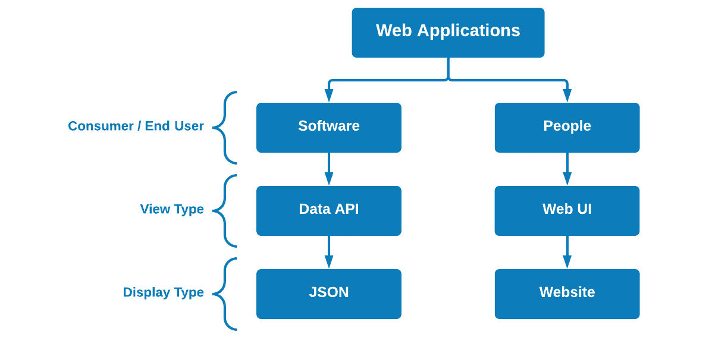
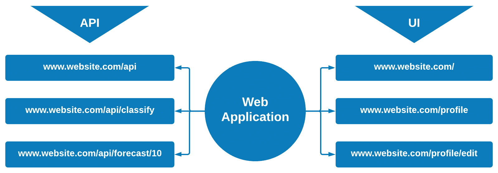
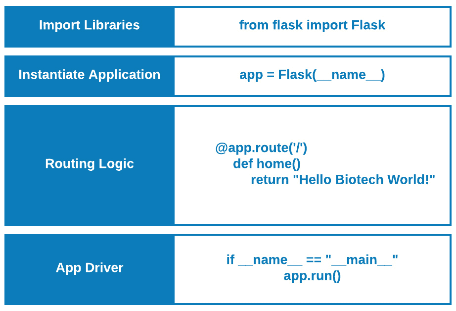
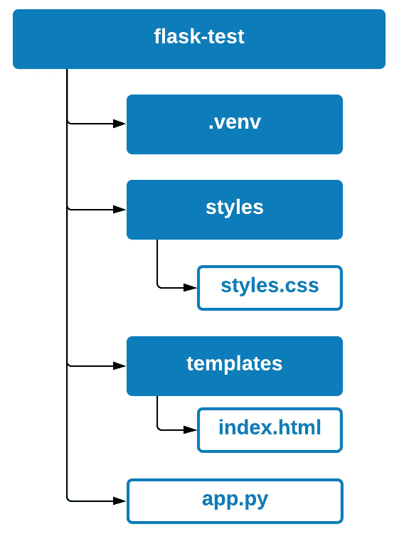
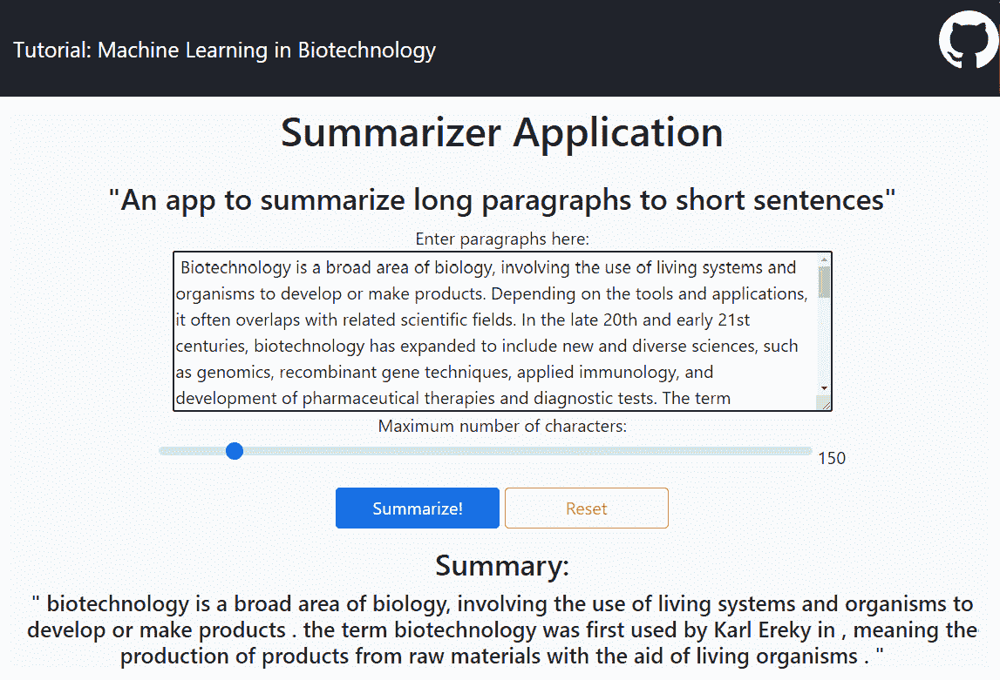
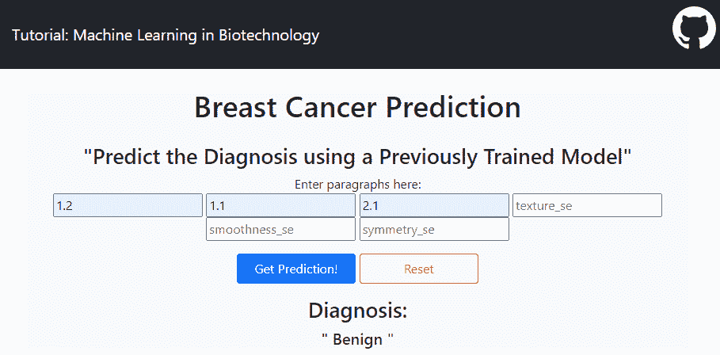

# 第十一章：使用 Flask 应用程序部署模型

在本书的整个过程中，我们探讨了在乳腺癌检测、科学主题建模、蛋白质分类和分子性质预测等领域开发众多稳健的机器学习模型。在这些教程中，我们准备并验证了我们的模型，以便它们具有尽可能强的预测能力。现在，我们将从开发新模型转向将训练好的模型部署给最终用户。

在本章中，我们将探讨用于准备 Web 应用程序的最受欢迎的框架之一：**Flask**。我们将使用 Flask 准备一个 Web 应用程序，向最终用户提供我们的模型，我们还将准备一个 **应用程序编程接口**（**API**）来向其他 Web 应用程序提供我们的预测。

在本章中，我们将涵盖以下主题：

+   理解 API 框架

+   使用 Flask 和 Visual Studio Code 进行工作

+   将 Flask 用作 API 和 Web 应用程序

+   教程 – 使用 Flask 部署预训练模型

带着这些目标，让我们开始吧！

# 理解 API 框架

无论您是在登录您的电子邮件账户、浏览社交媒体，还是登录在线零售商，我们每天都在使用 **Web 应用程序** 来完成各种任务。例如，想象一个用户在他们的本地计算机上滚动查看电子实验室笔记。当用户登录并看到他们的数据时，这些信息是通过 API（即应用程序编程接口，不要与活性药物成分混淆）检索的。一旦在后台为用户检索到数据，它就会在前端以美观的 **用户界面**（**UI**）中填充，使用户能够与数据交互、进行更改并保存它。我们可以以各种方式使用 Web 应用程序和 API，例如传输数据、与他人沟通，甚至进行预测，如图 *11.1* 所示：


图 11.1 – 一些 Web 应用程序功能的示例

带着所有这些功能，API 和它们的对应物为 Web 应用程序空间提供了创建 UI 以服务数据和进行预测的主要工具。如图 *11.2* 所示，有多个有用的 **Web 应用程序框架** 可用于各种编程语言：


图 11.2 – 一些 Web 应用程序框架的示例

为了本章的目的，我们将关注更受欢迎的机器学习部署框架之一：Flask ([`github.com/pallets/flask`](https://github.com/pallets/flask))。与它的类似框架相比，Flask 可以被视为一个 **微 Web 框架**——它完全用 Python 编写，高度抽象，使用户能够轻松开始模型部署过程。

当我们开始使用 Flask 框架部署模型时，重要的是要问自己我们的应用程序的最终用户是谁。在许多情况下，使用我们之前训练的模型进行预测将由同事和利益相关者完成。因此，拥有一个可用的 UI 将非常重要。另一方面，我们的部署模型可能不需要个人，而是需要软件或另一个需要以编程方式与之交互的 Web 应用程序。在这种情况下，UI 将不是必需的——然而，我们需要一种有组织的方式（例如，**JSON**）来处理两个系统之间的数据传输。我们可以在 *图 11.3* 中看到这两个案例的描述：



图 11.3 – 两种常见的 Web 应用类型

在任何情况下，我们都可以使用 Flask 来适应这两种情况。Flask 框架提供了各种架构——既简单又复杂——使用户能够选择最适合他们需求的模式。与 **Django**、**Node.js** 和 **Spring** 等类似框架一样，Flask API 通常使用 URL 以类似的方式运行。对于后端 API 和前端 UI，我们可以使用 URL 来组织我们开发应用程序的方式。例如，用户可以登录网站查看和编辑其个人资料中的数据，而 API 可以允许外部实体与模型交互，如图 *11.4* 所示：



图 11.4 – 带示例的两种常见的 Web 应用类型

为了与 Web 应用程序交互，用户需要发起一个被称为 **HTTP 请求** 的操作，这通常是在用户不知情的情况下完成的。每个请求通常都与一个 URL 相关联，使用户能够完成任务。四种 HTTP 请求类型如图 *11.5* 所示：


图 11.5 – 四种 HTTP 请求类型

例如，如果一个用户导航到 `www.website.com/profile` 并意图检索其个人资料详情，他们将使用一个 `GET` 请求。另一方面，一个使用 API 并意图对文本片段进行分类的应用程序将使用 `POST` 请求将文本发送到 [www.website.com/api/classify](http://www.website.com/api/classify)。这些 URL 路径在 Web 应用程序范围内被称为 *路由*，它们允许开发者和数据科学家更好地组织他们的模型以进行部署。在下一节中，我们将看到如何在 Flask 框架中更具体地使用路由。

# 使用 Flask 和 Visual Studio Code 进行工作

Flask 是在 **Python** 语言中最常用且功能最丰富的 Web 应用程序之一。其抽象和 **高级框架** 使得所有级别的用户都能在短时间内快速实现。在本节的整个过程中，我们将了解 Flask 应用程序的不同组件，并在我们的机器上本地部署一个简单的模型。

在我们开始使用 Flask 之前，我们需要一个 **集成开发环境** (**IDE**) 来进行工作。到目前为止，我们几乎一直在 **Jupyter Notebook** 中训练和开发模型。当涉及到实现时，我们需要另一种类型的 IDE 来进行工作。我们可以使用许多 Python IDE，例如 **PyCharm**、**Spyder** 或 **Visual Studio** **代码** (**VSC**)。我个人发现 VSC 是最易于使用的，因此在本节中我们将使用它作为我们的主要 IDE。您可以从他们的网站 ([`code.visualstudio.com/download`](https://code.visualstudio.com/download)) 或使用 **Anaconda** 下载 VSC。

开始安装过程，这可能需要几分钟。在等待的同时，在您的本地计算机上创建一个名为 `flask-test` 的新文件夹。一旦安装过程完成，打开 VSC。您可以通过几个简单的步骤打开您刚刚创建的文件夹：

1.  点击顶部菜单中的 **文件**。

1.  点击 **打开文件夹**。

1.  导航到您的目录并点击 **选择文件夹**。

您现在应该能在资源管理器窗格中右键单击并选择 **新建文件** 来在 `app.py` 中看到您目录的名称。

`app.py` 文件是 Flask 在其框架中使用的主体文件。应用程序中的所有内容都包含在这个文件中，或者从该文件中引用。尽管其内容取决于用户的精确实现，但该文件通常包含四个主要部分：

1.  导入库、数据和其它资源

1.  实例化应用程序并声明其他有用的函数

1.  声明应用程序的路由

1.  运行 `__name__ == "__main__"` 驱动代码

    我们可以在 *图 11.6* 中看到这些组件的示意图：



图 11.6 – Flask 应用程序的主要组件

让我们现在继续填充 `app.py` 中的代码。这通常在四个主要部分中完成：

1.  我们将首先从 `flask` 库中导入 `Flask` 类：

    ```py
    from flask import Flask
    ```

1.  接下来，我们需要创建我们 Flask 应用的一个实例：

    ```py
    app = Flask(__name__)
    ```

1.  我们现在可以使用应用对象来为我们的应用程序创建路由。路由通过在与之交互时直接执行其下方的函数来操作。让我们创建一个简单的路由，它返回 `"Hello Biotech World!"`：

    ```py
    @app.route('/')
    def biotech():
        return "Hello Biotech World!"
    ```

1.  最后，我们需要一个应用程序的驱动程序，它可以满足使用 `if __name__ == '__main__'` 的条件。我们还将设置 `debug` 参数为 `True` 以帮助我们解决任何潜在的问题，并将 `port` 值设置为 `8080`：

    ```py
    if __name__ == '__main__':
        app.run(debug=True, port=8080)
    ```

    在 VSC 的命令行中，运行 Python 应用程序：

    ```py
    http://localhost:8080/. Upon reaching this URL, you should be greeted by our previous message. Please note that the localhost URL is a link only accessible locally on your computer and is not available to others. The concept of routes should be familiar to us from the many websites we have used in the past. We can break down a URL into its smaller components, as depicted in *Figure 11.7*:
    ```


图 11.7 – URL 的主要组件

在我们的案例中，我们目前正在编辑应用的路径或端点。Flask 应用可以处理许多路径和端点，为开发者提供了很大的灵活性。

您可以通过在命令行中按 *CTRL* + *C* 来停止应用程序的运行，这将停止进程。进程停止后，您可以复制当前路由和函数直接在其下方创建第二个路由。将路径值设为 `/lifescience`（而不是仅仅 `/`），并为其函数提供一个独特的名称，例如 `lifescience`。接下来，更改返回值，再次运行应用程序，并导航到 `http://localhost:8080/lifescience`。如果一切顺利，您应该能够看到您的新消息！

路由和函数

请注意，路由必须是唯一的——这意味着您不能在 Flask 中有多个指向 `/biotech` 的路由。同样，路由下方的函数在其名称上也必须是唯一的。

当部署我们的模型时，我们将使用类似的架构。然而，返回语句通常将包括供人们使用的 UI 或供应用程序消费的数据。在下一节中，我们将通过使用 **自然语言处理**（**NLP**）用例来更深入地探讨这一点。

# 使用 Flask 作为 API 和 Web 应用

在 *第九章* *自然语言处理* 中，我们探讨了使用 `transformers` 库来运行文本相似度搜索引擎的目的。通过使用这项技术，我们可以探索其他模型和实现，例如 **情感分析**、**文本分类**以及更多。在自然语言处理（NLP）方面，有一种特定类型的模型已经获得了很大的关注，那就是 **摘要** 模型。

我们可以将摘要模型视为设计用来将几段文本缩减为几个句子的任务，从而使用户能够减少阅读所需的时间。幸运的是，我们可以使用 `transformers` 库实现一个现成的摘要模型，并将其安装在我们的 `app.py` 文件中。我们不仅需要满足人类用户（通过使用 UI），还需要满足可能对使用我们的模型感兴趣的网络应用程序（API）。为了适应这两种情况，我们将在项目中需要总共三个文件来开始：

+   `app.py`：这是主文件，其中实例化了 Flask 框架和所有 NLP 模型。

+   `styles.css`：这是一个 CSS 文件，它允许我们设置 UI 的样式。

+   `index.html`：这是一个带有预构建 UI 页面的 HTML 文件，人类用户将与它交互。

为了更好的组织，让我们将 CSS 文件添加到名为 `styles` 的目录中，将 HTML 文件添加到名为 `templates` 的目录中。

当我们处理新的 Flask 应用程序时，我们通常希望使用 `pip` 安装的库方面有一个 *空白状态*。换句话说，每个 Flask 应用程序都应该拥有自己的 *虚拟环境*，在那里我们只安装应用程序需要和使用的库。我们可以使用 `virtualenv` 来实现这一点，而讽刺的是，`virtualenv` 本身也可以通过 `pip` 安装。

安装完成后，我们可以在命令行中使用 `virtualenv` 创建一个新的项目环境，命名为 `.venv`：

```py
$ python38 virtualenv .venv
```

你可以给你的虚拟环境起任何你喜欢的名字，但大多数用户通常默认使用前面命令中的名字。当你看到当前工作目录中出现了指定名称的新目录时，你就知道这个命令执行成功了。我们现在需要 *激活* 这个环境，这可能会根据你使用的系统类型而有点棘手。**Windows** 用户可以使用以下命令来激活他们的环境：

```py
> .\.venv\Scripts\activate
```

另一方面，**Linux** 和 **Mac** 用户可以通过以下命令来激活他们的环境：

```py
$ source .venv\bin\activate
```

你可以通过查看命令行当前工作目录的左侧是否有环境名称出现来确认环境已被激活。现在，请安装 `flask` 和 `transformers`，因为我们将在当前环境中需要这些库。

在设置好环境并包含前面讨论的三个文件后，我们应该有一个如 *图 11.8* 所示的目录结构：



图 11.8 – 在 VSC 中此项目的当前文件夹结构

在项目结构现在已经到位的情况下，让我们向 `app.py` 文件中添加一些代码。我们可以从导入这个应用程序中需要的库开始：

```py
from flask import Flask, jsonify, request, render_template 
import json
from transformers import pipeline
import re
```

现在库已经导入，我们可以像之前一样实例化 `Flask` 应用程序的实例。然而，这次我们需要指定模板文件夹：

```py
app = Flask(__name__, template_folder='templates')
```

应用实例化后，我们现在可以从 transformers 的`pipeline`类创建摘要模型的实例：

```py
summarizer = pipeline("summarization")
```

接下来，我们可以添加我们的*路由*。我们首先创建一个到主页的路由，该路由使用`index.html`文件显示 UI：

```py
@app.route('/')
def home():
    return render_template('index.html')
```

我们需要添加两个路由：一个用于 UI，另一个用于 API。根据框架、行业和用例的不同，有许多最佳实践。在大多数情况下，`api`端点通常以`api`这个词开头，以区分它们。让我们先创建一个用于 UI 的路由：

```py
@app.route('/prediction', methods = ["POST"])
def ui_prediction():
    """
    A function that takes a JSON with two fields: "text" & "maxlen"
    Returns: the summarized text of the paragraphs.
    """
    print(request.form.values())
    paragraphs = request.form.get("paragraphs")
    paragraphs = re.sub("\d+", "", paragraphs)
    maxlen = int(request.form.get("maxlen"))
    summary = summarizer(paragraphs, max_length=maxlen, min_length=49, do_sample=False)
    return render_template('index.html', prediction_text = '" {} "'.format(summary[0]["summary_text"])), 200
```

注意，在这个函数内部，我们使用`request.form.get`函数从 UI 表单中检索值。此外，我们使用一些正则表达式来清理文本，然后使用摘要模型总结内容。最后，我们返回摘要和`index.html`文件。

现在我们为 api 创建第二个路由：

```py
@app.route('/api/prediction', methods = ["POST"])
def api_prediction():
    """
    A function that takes a JSON with two fields: "text" & "maxlen"
    Returns: the summarized text of the paragraphs.
    """
    query = json.loads(request.data)
    paragraphs = re.sub("\d+", "", query["text"])
    maxlen = query["maxlen"]
    minlen = query["minlen"]
    summary = summarizer(paragraphs, max_length=maxlen, min_length=minlen, do_sample=False)
    return jsonify(summary), 200
```

注意，除了获取输入数据、清理内容和摘要之外，我们还可以直接从`JSON`对象中获取`maxlen`和`minlen`参数。

最后，我们可以继续执行代码：

```py
if __name__ == '__main__':
    app.run(debug=True)
```

这样，我们就成功开发了 Flask 应用。一旦部署，你应该能够导航到`http://localhost:5000/`并开始总结文本段落！我们可以在*图 11.9*中看到一个应用的示例：



图 11.9 – 摘要 Web 应用的截图

此外，我们可以使用`POST`请求等应用，添加 URL，然后将数据以字典的形式添加，并指定内容类型为 application/JSON：

```py
{
    "text" : "Biotechnology is a broad area of biology, involving the use of living systems and organisms to develop or make products. 
                              …
 molecular biology, biochemistry, cell biology, embryology, genetics, microbiology) and conversely provides methods to support and perform basic research in biology.",
    "maxlen" : 60,
    "minlen" : 30
}
```

现在应用正在运行，我们成功创建了一个解决方案，使用 Flask 为人类用户和其他 Web 应用提供服务。在本书的最后一章，我们将把这个应用部署到云端。然而，完成这一步骤的一个重要步骤是提供一个需要安装的库列表。鉴于我们已经设置了一个虚拟环境，我们可以通过`pip`轻松地将这些库的列表转移到`requirements.txt`文件中：

```py
$ pip freeze > requirements.txt
```

这样，你现在应该能在`app.py`相同的目录下看到一个`requirements.txt`文件。确保你使用的环境只包含你计划使用的库非常重要。这有助于保持应用轻量级且使用快速。在下一节中，我们将查看一个更深入的应用——一个使用之前训练的模型，该模型涉及本书前面看到的乳腺癌数据集。

# 教程 – 使用 Flask 部署预训练模型

在创建 Flask 应用程序的先前的例子中，我们看到了如何结合预测模型使用应用程序来部署解决方案给最终用户。然而，我们部署的模型是一个现成的解决方案，而不是我们自己开发的模型。在本节中，我们将在 Flask 应用程序中再次部署一个模型；然而，我们使用的是基于我们在*第五章*中看到的癌症数据集的模型，*理解机器学习*。

如果你还记得，这个模型的主要思想是接受给定肿瘤的一组测量值，并根据这些测量值确定诊断结果，结果可能是`恶性`或`良性`。在这个应用程序中，我们将允许用户与训练好的模型交互，并输入模型将用于预测的测量值。考虑到这一点，让我们开始吧！

就像之前一样，继续添加一个新的文件夹和一个新的虚拟环境来安装相关的库。

使用与之前相同的目录结构和流程，我们可以首先导入相关的库。请注意，我们在这里添加了`pickle`库，因为我们需要使用之前创建的*序列化*模型：

```py
from flask import Flask, jsonify, request, render_template 
import json
import pickle
import pandas as pd
from sklearn.preprocessing import StandardScaler
```

我们下一步涉及导入我们训练的两个模型——实际的分类模型和用于数据的标准缩放模型：

```py
loaded_scaler= pickle.load(open("./models/ch10_scaler.pickle",'rb'))
loaded_clf= pickle.load(open("./models/ch10_rfc_clf.pickle",'rb'))
```

然后，我们可以定义一个`predict_diagnosis`函数，以便在开发我们的路由时清理代码。这个函数将接受以列表形式输入的数据、缩放模型和分类模型：

```py
def predict_diagnosis(inputData, scaler, model):
    """
    Function that takes a list of measurements, scales them, and returns a prediction
    """
    inputDataDF = pd.DataFrame([inputData])
    scaledInputData = scaler.transform(inputDataDF)
    prediction = model.predict(scaledInputData)
    return prediction[0]
```

接下来，我们将实例化 Flask 应用程序，同时指定`template`文件夹：

```py
app = Flask(__name__, template_folder='templates')
```

在处理完这些事项后，我们可以专注于我们的路由。首先，我们将创建一个`home`路由，用户将首先看到：

```py
@app.route('/')
def home():
    return render_template('index.html')
```

接下来，我们需要一个`prediction`路由，就像之前一样。这里唯一的区别是输入值的数量将更多，因为我们现在正在处理更多的特征：

```py
@app.route('/prediction', methods = ["POST"])
def prediction():
    print(request.form.values())
    radius_mean = request.form.get("radius_mean")
    texture_mean = request.form.get("texture_mean")
    smoothness_mean = request.form.get("smoothness_mean")
    texture_se = request.form.get("texture_se")
    smoothness_se = request.form.get("smoothness_se")
    symmetry_se = request.form.get("symmetry_se")
    input_features = [radius_mean, texture_mean, smoothness_mean, texture_se, smoothness_se, symmetry_se]
    prediction = predict_diagnosis(input_features, loaded_scaler, loaded_clf)
    prediction = "Malignant" if prediction == "M" else "Benign"

    return render_template('index.html', prediction_text = '" {} "'.format(prediction))
```

最后，我们可以继续运行应用程序：

```py
if __name__ == '__main__':
    app.run(debug=False, port=5000)
```

在运行模型并在网络浏览器中导航到 localhost 后，应用程序将出现。请尝试使用 UI 进行一些预测，如图*图 11.10*所示：



图 11.10 – 乳腺癌网络应用程序的屏幕截图

我们可以看到，该模型能够接受我们的输入数据，运行预测，并将结果返回给用户。我们没有在这里做的一件事是为其他网络应用程序与我们的模型交互创建一个 API 路由。作为一个挑战，请继续创建这个路由，以之前的总结应用程序为例。

# 摘要

在本章中，我们偏离了模型开发的方向，更多地关注了模型如何部署以与 Web 应用程序交互。我们研究了通过 API 进行数据传输的想法，并且还了解了一些最常用的框架。我们调查了最常用的 Python Web 应用程序框架之一，即 Flask。使用 Flask，我们开发了一个 NLP 摘要模型，允许人类用户和其他 Web 应用程序与之交互并使用其功能。此外，我们还学习了如何部署之前训练好的模型，例如来自`scikit-learn`的模型。

在这些实例中，我们在开发它们的框架和功能时，在本地启动了我们的模型。在下一章中，我们将通过使用**Docker**容器和**AWS**将我们的模型部署到云端，使我们的模型对他人可用。
