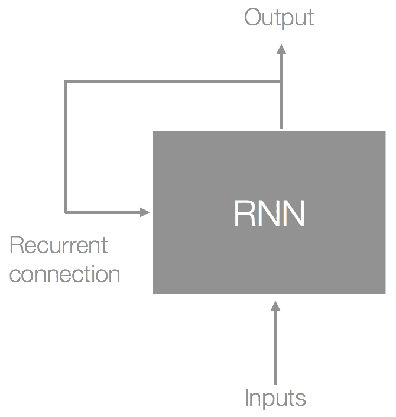

# 机器学习（ML）简介

让我们从展望未来开始，设想我们将如何与计算机互动。与今天需要我们不断输入电子邮件和密码才能访问信息的计算机不同，未来的计算机将能够通过我们的面部、声音或活动轻松地识别我们。与今天需要逐步指令才能执行操作的计算机不同，未来的计算机将能够预测我们的意图，并为我们提供一种自然的方式与它进行对话，就像我们与其他人互动一样，然后继续帮助我们实现目标。我们的计算机不仅会帮助我们，还会成为我们的朋友、医生等等。它可以在门口递送我们的杂货，并成为我们与日益复杂和充满信息丰富的物理世界之间的接口。

这个愿景令人兴奋的是，它不再属于科幻领域，而是一个正在出现的现实。推动这一进展的主要因素之一是机器学习（ML）技术的进步和采用，这是一门赋予计算机人类感知能力的学科，从而赋予它们看到、听到和理解世界——无论是物理世界还是数字世界——的能力。

尽管在过去 3-4 年中取得了巨大的进步，但大多数想法和潜力都锁在研究项目和论文中，而不是用户手中。因此，本书的目标是帮助开发者更好地理解这些概念。它将使您能够将它们付诸实践，以便我们能够到达这个未来——一个计算机增强我们而不是由于它们无法理解我们的世界而奴役我们的未来。

由于 Core ML 的限制——它只能执行推理——本书与其他机器学习（ML）书籍有很大不同，核心关注点是机器学习的应用。具体来说，我们将专注于计算机视觉应用而不是机器学习的细节。但为了更好地让您充分利用机器学习（ML），我们将花一些时间介绍每个示例相关的概念。

在动手实践示例之前，让我们从头开始，培养对机器学习（ML）是什么以及如何应用它的欣赏。在本章中，我们将：

+   首先，介绍机器学习（ML）。我们将了解它与经典编程的不同之处以及为什么您可能会选择它。

+   看一看机器学习（ML）今天的一些应用示例，以及所使用的数据类型和机器学习（ML）算法。

+   最后，介绍机器学习（ML）项目的典型工作流程。

让我们从首先讨论机器学习（ML）是什么以及为什么每个人都谈论它开始。

# 什么是机器学习（ML）？

机器学习（ML）是人工智能（AI）的一个子领域，人工智能（AI）是 20 世纪 50 年代诞生的计算机科学话题，其目标是试图让计算机思考或提供与我们人类相似水平的自动化智能。

早期在人工智能领域取得的成功是通过使用一套广泛的定义规则实现的，这些规则被称为**符号人工智能**，允许专家决策通过计算机来模仿。这种方法在许多领域都取得了良好的效果，但有一个很大的不足，那就是为了创建一个专家，你需要一个专家。不仅如此，他们的专业知识还需要以某种方式数字化，这通常需要明确的编程。

机器学习提供了一种替代方案；我们不需要手动编写规则，它从示例和经验中学习。它还与经典编程不同，它是概率性的，而不是离散的。也就是说，它能够比其对应物更好地处理模糊性或不确定性，当给出一个未明确识别和处理的模糊输入时，其对应物可能会失败。

我将借用谷歌工程师 Josh Godron 在机器学习入门视频中使用的例子，以更好地突出机器学习的差异和价值。

假设你被分配了一个对苹果和橙子进行分类的任务。让我们首先使用我们称之为经典编程的方法来处理这个问题：


我们的输入是每个图像的像素数组，对于每个输入，我们需要明确定义一些规则，这些规则能够区分苹果和橙子。使用前面的例子，你可以通过简单地计算橙色和绿色像素的数量来解决这个问题。绿色像素比例较高的将被分类为苹果，而橙色像素比例较高的将被分类为橙子。这对于这些例子来说效果很好，但如果我们的输入变得更加复杂，这种方法就会失效：


新图像的引入意味着我们简单的颜色计数函数再也无法充分区分我们的苹果和橙子，甚至无法对苹果进行分类。我们需要重新实现该函数以处理引入的新细微差别。因此，我们的函数变得更加复杂，并且与输入更加紧密地耦合，不太可能泛化到其他输入。我们的函数可能类似于以下内容：

```py
func countColors(_ image:UIImage) -> [(color:UIColor, count:Int)]{
// lots of code 
}

func detectEdges(_ image:UIImage) -> [(x1:Int, y1:Int, x2:Int, y2:Int)]
{
// lots of code
}

func analyseTexture(_ image:UIImage) -> [String]
{
// lots of code 
} 

func fitBoundingBox(_ image:UIImage) -> [(x:Int, y:Int, w:Int, h:Int)]
{
// lots of code 
}
```

这个函数可以被认为是我们的模型，它描述了输入与其标签（苹果或橙子）之间的关系，如下面的图示所示：


替代方案，以及我们感兴趣的方法，是让这个模型自动使用示例；本质上，这就是机器学习的全部内容。它为我们提供了一个有效的工具来模拟复杂任务，这些任务否则几乎不可能通过规则来定义。

机器学习模型的创建阶段被称为**训练**，它由所选的机器学习算法和数据输入类型决定。一旦模型被训练，也就是说，一旦它学会了，我们就可以用它从数据中做出推断，如下面的图示所示：


我们在这里展示的例子，对橙子和苹果进行分类，是一种特定的机器学习算法，称为**分类器**，或者更具体地说，是多分类分类器。该模型是通过**监督学习**训练的；也就是说，我们提供了带有相关标签（或类别）的输入示例。了解存在的机器学习算法类型以及训练类型是有用的，这是下一节的主题。

# 机器学习算法简要概述

在本节中，我们将探讨一些机器学习应用的例子，并且在每个例子中，我们将推测所使用的数据类型、学习风格和机器学习算法。我希望到本节结束时，你将受到机器学习可能性的启发，并对存在的数据类型、算法和学习风格有所欣赏。

在本节中，我们将通过介绍数据类型、算法和学习风格来展示一些现实生活中的例子。我们的意图并不是展示示例的准确数据表示或实现，而是利用这些例子使思想更加具体化。

# Netflix – 提供推荐

没有一本机器学习书籍会不提及推荐引擎——这可能是机器学习最广为人知的应用之一。部分原因在于 Netflix 宣布了一项针对电影评分预测的 100 万美元竞赛，也称为**推荐**。再加上亚马逊在利用这一技术上的商业成功。

推荐引擎的目标是预测某人想要特定产品或服务的可能性。在 Netflix 的背景下，这意味着向其用户推荐电影或电视节目。

提供推荐的一种直观方式是尝试模仿现实世界，在现实世界中，一个人可能会向志同道合的人寻求推荐。构成相似性的因素取决于领域。例如，你可能会有一组朋友，你会向他们寻求餐厅推荐，另一组朋友则是电影推荐。决定这些群体的因素是他们对你特定领域的品味与你自己的品味相似程度。我们可以使用（基于用户的）**协同过滤（CF**）算法来复制这一点。该算法通过找到每个用户之间的距离，然后使用这些距离作为相似性指标来推断特定用户的电影预测；也就是说，那些更相似的人将对预测做出更大的贡献，而那些有不同偏好的人则贡献较小。让我们看看 Netflix 的数据可能的形式：

| **用户** | **电影** | **评分** |
| --- | --- | --- |
| 0: Jo | A: 怪兽电力公司 | 5 |
|  | B: 波恩身份 | 2 |
|  | C: 火星救援 | 2 |
|  | D: 银河系漫游指南 | 1 |
| 1: Sam | C: 火星救援 | 4 |
|  | D: 银河系漫游指南 | 4 |
|  | E: 矩阵 | 4 |
|  | F: 梦幻特工 | 5 |
| 2: Chris | B: 波恩身份 | 4 |
|  | C: 火星救援 | 5 |
|  | D: Blade Runner | 5 |
|  | F: Inception | 4 |

对于每个示例，我们有一个用户、一部电影和一个分配的评分。为了找到每个用户之间的相似度，我们首先可以计算每对用户之间共享电影的欧几里得距离。欧几里得距离为最不相似的用户提供了较大的值；我们通过将 1 除以这个距离来反转这个值，得到一个结果，其中 1 代表完美匹配，0 表示用户之间最不相似。以下为欧几里得距离和计算两个用户之间相似度的函数的公式：


欧几里得距离和相似度公式

```py
func calcSimilarity(userRatingsA: [String:Float], userRatingsB:[String:Float]) -> Float{
  var distance = userRatingsA.map( { (movieRating) -> Float in 
    if userRatingsB[movieRating.key] == nil{
      return 0 
    }
    let diff = movieRating.value - (userRatingsB[movieRating.key] ?? 0)
    return diff * diff
  }).reduce(0) { (prev, curr) -> Float in 
    return prev + curr
  }.squareRoot()
  return 1 / (1 + distance)
}
```

为了使这一点更加具体，让我们通过以下步骤来找到与山姆最相似的用户，山姆对以下电影进行了评分：`["The Martian" : 4, "Blade Runner" : 4, "The Matrix" : 4, "Inception" : 5]`。现在，让我们计算山姆和乔之间的相似度，然后是山姆和克里斯之间的相似度。

**山姆和乔**

乔对电影的评分是`["Monsters Inc." : 5, "The Bourne Identity" : 2, "The Martian" : 2, "Blade Runner" : 1]`；通过计算每个用户评分集合交集的相似度，我们得到一个值为*0.22*。

**山姆和克里斯**

与之前类似，但现在，通过使用克里斯的电影评分（`["The Bourne Identity" : 4, "The Martian" : 5, "Blade Runner" : 5, "Inception" : 4]`）来计算相似度，我们得到一个值为*0.37*。

通过人工检查，我们可以看到克里斯与山姆的相似度高于乔，我们的相似度评分通过给克里斯一个比乔更高的值来显示这一点。

为了帮助说明为什么这有效，让我们将每个用户的评分投影到以下图表中，如图所示：


上述图表显示了用户在偏好空间中的分布；在这个偏好空间中，两个用户越接近，他们的偏好就越相似。这里我们只展示了两个轴，但正如前表所示，这可以扩展到多个维度。

我们现在可以使用这些相似性作为权重，这些权重有助于预测特定用户会对特定电影给出何种评分。然后，利用这些预测，我们可以推荐一些用户可能想要观看的电影。

上述方法是一种**聚类**算法，属于**无监督学习**，在这种学习风格中，示例没有关联的标签，机器学习算法的职责是在数据中找到模式。其他常见的无监督学习算法包括 Apriori 算法（篮子分析）和 K-means。

当有大量信息可以受益于在呈现给用户之前进行过滤和排序时，推荐是适用的。在设备上执行推荐操作提供了许多好处，例如能够在过滤和排序结果时结合用户的上下文。

# 阴影绘制 – 为自由手绘提供实时用户指导

为了突出人与机器之间的协同作用，人工智能有时被称为**增强智能**（**AI**），强调系统增强我们的能力而不是完全取代我们。

一个越来越受欢迎的领域，并且对我个人来说特别感兴趣的是辅助创作系统，这个领域位于**人机交互**（**HCI**）和机器学习（ML）的交叉点。这些系统是为了辅助一些创作任务而创建的，例如绘画、写作、视频和音乐。

在本节中我们将讨论的例子是阴影绘制，这是一个由 Y.J. Lee、L. Zitnick 和 M. Cohen 在 2011 年于微软进行的研究项目。阴影绘制是一个通过匹配和定位现有物体数据集中的参考图像来辅助用户绘制的系统，然后在背景中轻柔地渲染阴影作为用户绘图的指南。例如，如果预测用户正在绘制一辆自行车，那么系统就会在用户的笔下方渲染指南来帮助他们绘制该物体，如图所示：


就像我们之前做的那样，让我们来看看我们可能如何处理这个问题，具体关注对草图进行分类；也就是说，我们将预测用户正在绘制什么物体。这将给我们机会看到新的数据类型、算法和机器学习的应用。

本项目中使用的数据集由从互联网上通过 40 个类别查询（如人脸、汽车和自行车）收集的 30,000 张自然图像组成，每个类别存储在其自己的目录中；以下图表显示了这些图像的一些示例：


在获得原始数据后，下一步，也是任何机器学习项目的典型步骤，是执行**数据预处理**和**特征工程**。以下图表显示了预处理步骤，包括：

+   重新缩放每张图像

+   去饱和（变为黑白）

+   边缘检测


我们下一步是将我们的数据抽象成对我们的机器学习算法更有意义和有用的东西；这被称为**特征工程**，在典型的机器学习工作流程中是一个关键步骤。

一种方法，以及我们将描述的方法，是创建一个被称为**视觉词袋**的东西。这本质上是对描述每个图像以及集体描述每个类别的特征（视觉词）的直方图。构成特征的是什么取决于数据和机器学习算法；例如，我们可以提取并计算每张图像的颜色，其中颜色成为我们的特征，并集体描述我们的图像，如下面的图表所示：


但因为我们处理的是草图，我们想要一个相当粗糙的东西——可以捕捉到将封装图像的一般结构的一般线条方向。例如，如果我们描述一个正方形和一个圆，正方形将包含水平和垂直线条，而圆将主要包含对角线条。为了提取这些特征，我们可以使用一种称为**方向梯度直方图**（**HOG**）的计算机视觉算法；在处理完图像后，你将得到图像局部区域中的梯度方向直方图。这正是我们想要的！为了帮助说明这个概念，这里对单个图像的此过程进行了总结：


在处理完我们数据集中的所有图像后，我们的下一步是找到一个（或多个）直方图，可以用来识别每个类别；我们可以使用一种称为**K-means**的无监督学习聚类技术，其中每个类别的直方图是该聚类的中心。以下图表描述了这一过程；我们首先为每个图像提取特征，然后使用 K-means 对这些特征进行聚类，其中距离是通过直方图梯度来计算的。一旦我们的图像被聚类到它们的组中，我们就提取每个组的中心（均值）直方图作为我们的类别描述符：


一旦我们为每个类别（代码簿）获得了直方图，我们就可以使用每个图像提取的特征（视觉词）和相关的类别（标签）来训练一个**分类器**。一个流行且有效的分类器是**支持向量机**（**SVM**）。SVM 试图找到一个最佳分离类别的超平面；这里的“最佳”指的是具有最大类别成员之间距离的平面。术语“超”是因为它将向量转换到高维空间，这样类别就可以用线性平面（因为我们在一个空间内工作）来分离。以下图表显示了在二维空间中两个类别可能看起来是什么样子：


我们的模型现在已经训练完成，因此用户在绘制图像时，我们可以实时地对图像进行分类，这样我们就可以通过为他们提供想要绘制的对象（或至少提及我们预测他们将要绘制的对象）的指南来协助用户。这非常适合像 iPhone 或 iPad 这样的触摸界面！这不仅有助于绘图应用，而且在用户需要输入的任何时候，如基于图像的搜索或记笔记时，都非常有用。

在这个例子中，我们展示了如何使用特征工程和**无监督学习**来增强数据，使得我们的模型能够更充分地使用**监督学习**算法 SVM 进行**分类**。在深度神经网络出现之前，特征工程是机器学习中的一个关键步骤，有时也是这些原因的限制因素：

+   这需要特殊技能和有时需要领域专业知识

+   它取决于一个能够找到和提取有意义特征的人

+   它要求提取的特征能够在整个人群中推广，也就是说，足够表达，可以应用于所有例子

在下一个例子中，我们介绍了一种称为**卷积神经网络（CNN**或**ConvNet**）的神经网络类型，它负责处理大量的特征工程。

描述实际项目和方法的论文可以在这里找到：[`vision.cs.utexas.edu/projects/shadowdraw/shadowdraw.html`](http://vision.cs.utexas.edu/projects/shadowdraw/shadowdraw.html)。

# Shutterstock – 基于构图进行图像搜索

在过去的 10 年里，我们在网络上看到了视觉内容的创建和消费呈爆炸式增长，但在 CNN 成功之前，图像是通过在手动分配的标签上执行简单的关键词搜索来找到的。所有这些都改变了，大约在 2012 年，A. Krizhevsky，I. Sutskever 和 G. E. Hinton 发表了他们的论文《使用深度卷积网络的 ImageNet 分类》。这篇论文描述了他们用于赢得 2012 年**ImageNet 大规模视觉识别挑战赛（ILSVRC**）的架构。这是一个像奥运会一样的计算机视觉竞赛，团队在一系列 CV 任务（如分类、检测和目标定位）中进行竞争。而且那一年，CNN 首次以 15.4%的测试错误率获得了第一名（下一个最佳参赛者的测试错误率为 26.2%）。从那时起，CNN 已经成为计算机视觉任务的默认方法，包括成为执行视觉搜索的新方法。很可能，它已经被 Google、Facebook 和 Pinterest 等公司采用，使得找到正确的图像变得比以往任何时候都容易。

最近，（2017 年 10 月），Shutterstock 宣布了一种 CNN（卷积神经网络）更为新颖的应用，他们引入了用户不仅能够在图像中搜索多个项目，还能搜索这些项目的构图的能力。以下截图展示了一个搜索小猫和电脑的例子，小猫位于电脑的左侧：


那么，CNNs 是什么？如前所述，CNNs 是一种非常适合视觉内容的神经网络，因为它们能够保留空间信息。它们在某种程度上类似于之前的例子，其中我们明确定义了一个过滤器来从图像中提取局部特征。CNN 执行类似的操作，但与我们的前一个例子不同，过滤器不是明确定义的。它们是通过训练学习的，并且它们不是局限于单层，而是由许多层构建的。每一层都建立在上一层的基础上，每一层在它所代表的内容上变得越来越抽象（这里的抽象意味着更高阶的表示，即从像素到形状）。

为了帮助说明这一点，以下图表展示了网络如何建立对猫的理解。第一层的过滤器提取简单的特征，例如边缘和角落。下一层在这些基础上使用自己的过滤器，从而提取出更高层次的概念，例如形状或猫的各个部分。这些高层次的概念随后被组合起来用于分类目的：


这种更深入理解数据并减少对手动特征工程依赖的能力，使得深度神经网络在过去几年中成为最受欢迎的机器学习算法之一。

为了训练模型，我们使用图像作为输入，标签作为预期输出，向网络提供示例。给定足够的示例，模型将为每个标签构建一个内部表示，这可以足够用于**分类**；当然，这是一种**监督学习**。

我们最后一个任务是找到项目或项目的位置；为了实现这一点，我们可以检查网络的权重，以找出哪些像素激活了特定的类别，然后围绕具有最大权重的输入创建一个边界框。

我们现在已经识别了图像中的项目及其位置。有了这些信息，我们可以预处理我们的图像库，并将其作为元数据缓存，以便通过搜索查询访问。我们将在本书的后面部分再次探讨这个想法，届时你将有机会实现一个版本，以帮助用户在相册中找到图像。

在本节中，我们看到了如何使用机器学习来改善用户体验，并简要介绍了 CNNs 背后的直觉，这是一种非常适合视觉环境的神经网络，其中保留特征邻近性和构建更高层次的抽象很重要。在下一节中，我们将继续探索机器学习应用，通过介绍另一个提高用户体验的例子以及一种非常适合序列数据（如文本）的新类型的神经网络。

# iOS 键盘预测 - 下一个字母预测

引用可用性专家 Jared Spool 的话，“好的设计，当做得好时，应该是无形的。”这对于机器学习也是正确的。机器学习的应用不必对用户明显，有时（更常见的情况）机器学习的微妙应用可以证明同样有影响力。

这的一个很好的例子是 iOS 的一个功能，称为**动态目标调整大小**；每次你在 iOS 键盘上输入时，它都在工作，它积极地尝试预测你想要输入的单词：


使用这个预测，iOS 键盘会动态地改变键的触摸区域（在此由红色圆圈表示），这个键是基于之前输入的最可能字符。

例如，在先前的图中，用户输入了`"Hell"`；现在合理地假设用户最可能点击的下一个字符是`"o"`。鉴于我们对英语语言的知识，这是直观的，但我们如何教会机器知道这一点呢？

这就是**循环神经网络**（**RNNs**）发挥作用的地方；它是一种在时间上持续状态的神经网络。你可以将这种持续状态视为一种记忆形式，这使得 RNNs 非常适合处理序列数据，如文本（任何输入和输出相互依赖的数据）。这种状态是通过使用从细胞输出到反馈循环来创建的，如下面的图所示：



先前的图显示了单个 RNN 细胞。如果我们将其展开到时间上，我们会得到如下所示的东西：


以**hello**为例，先前的图显示了在五个时间步长上的展开 RNN；在每一个时间步长，RNN 预测下一个可能的字符。这个预测是由其内部的语言表示（来自训练）和后续输入决定的。这种内部表示是通过在文本样本上训练来构建的，其中输出使用输入，但在下一个时间步（如前面所示）。一旦训练完成，推理遵循类似的路径，只是我们将预测的字符从输出馈送到网络，以获取下一个输出（以生成序列，即单词）。

神经网络和大多数机器学习算法需要它们的输入是数字，因此我们需要将我们的字符转换为数字，然后再转换回来。处理文本（字符和单词）时，通常有两种方法：**独热编码**和**嵌入**。让我们快速了解每个方法，以获得一些处理文本的直觉。

文本（字符和单词）被认为是分类的，这意味着我们不能用一个单一的数字来表示文本，因为文本和价值之间没有固有的关系；也就是说，将**the**分配为 10 和**cat**分配为 20 意味着**cat**比**the**更有价值。相反，我们需要将它们编码成一种不引入偏差的形式。一种解决方案是使用单热编码，它使用一个大小为你的词汇表（在我们的例子中是字符的数量）的数组，将特定字符的索引设置为 1，其余设置为 0。以下图展示了语料库**"hello"**的编码过程：


在前面的图中，我们展示了编码字符时所需的步骤；我们首先将语料库拆分为单个字符（称为**标记**，这个过程称为**标记化**）。然后我们创建一个作为我们的词汇表集合，最后我们用每个字符分配一个向量来编码这个集合。

在这里，我们只展示在将文本传递给我们的机器学习算法之前所需的步骤。

一旦我们的输入被编码，我们就可以将它们输入到我们的网络中。输出也将以这种格式表示，其中最可能的字符是具有最大值的索引。例如，如果预测到**'e'**，那么最可能的输出可能类似于[0.95, 0.2, 0.2, 0.1]。

但单热编码有两个问题。第一个问题是对于大型词汇表，我们最终得到一个非常稀疏的数据结构。这不仅是对内存的不高效使用，还需要额外的计算来进行训练和推理。第二个问题，当操作单词时更为明显，是我们编码后失去了任何上下文意义。例如，如果我们对单词**dog**和**dogs**进行编码，那么编码后我们就会失去这些单词之间的任何关系。

一种替代方案，也是解决这两个问题的方案，是使用嵌入。这些通常是从训练好的网络中得到的权重，每个标记使用密集向量表示，这可以保留一些上下文意义。这本书主要关注计算机视觉任务，所以我们不会在这里详细介绍。只需记住，我们需要将我们的文本（字符）编码成我们的机器学习算法可以接受的形式。

我们使用**弱监督**来训练模型，类似于监督学习，但不需要显式标记来推断标签。一旦训练完成，我们可以使用前面描述的**多类分类**来预测下一个字符。

在过去几年里，我们见证了辅助写作的演变；一个例子是谷歌的智能回复（Smart Reply），它提供了一种端到端的方法来自动生成简短的电子邮件回复。令人兴奋的时代！

这结束了我们对机器学习问题类型及其相关数据类型、算法和学习风格的简要介绍。我们对每个方面都只是触及了皮毛，但随着你阅读本书，你将接触到更多数据类型、算法和学习风格。

在下一节中，我们将回顾训练和推理的整体工作流程，然后结束本章。

# 一个典型的机器学习工作流程

如果我们分析到目前为止所提供的每个示例，我们会看到每个都遵循一个类似的模式。首先是定义问题或所需的功能。一旦我们确定了我们想要做什么，我们就确定可用的数据以及/或所需的数据。有了数据在手，我们的下一步是创建我们的机器学习模型并为训练准备数据。

训练之后，我们在这里没有讨论的内容是验证我们的机器学习模型，即测试它是否满意地达到了我们的要求。一个例子是能够做出准确的预测。一旦我们训练了一个模型，我们就可以通过输入真实数据来利用它，即输入训练集之外的数据。在下面的图中，我们看到了训练和推理步骤的总结：


在本书中，我们将大部分时间用于使用训练好的模型，但了解我们如何得到这些模型将有助于你开始创建自己的智能应用。这也有助于你识别在现有数据上应用机器学习的机会，或者激发你寻找新的数据来源。还值得注意的是，在训练数据上的预处理步骤与在推理时对输入数据进行预处理是等效的——这是我们将在整本书中花费大量时间讨论和编码的内容。

# 摘要

在本章中，我们通过将其与经典编程进行对比，介绍了机器学习及其价值。然后，我们花了一些时间探索了机器学习的不同应用，并对每种应用都推测了所使用的数据类型、算法和学习风格。采取这种方法是为了帮助揭开机器学习的工作原理，并鼓励你开始思考如何利用数据来改善用户体验或提供新的功能。我们将继续以这种方式贯穿整本书，显然会更多地强调通过与计算机视觉相关的示例应用来利用机器学习。

在下一章中，我们将介绍 Core ML，这是 iOS 专门设计的框架，旨在使那些对机器学习经验很少或没有经验的开发者能够使用机器学习。
