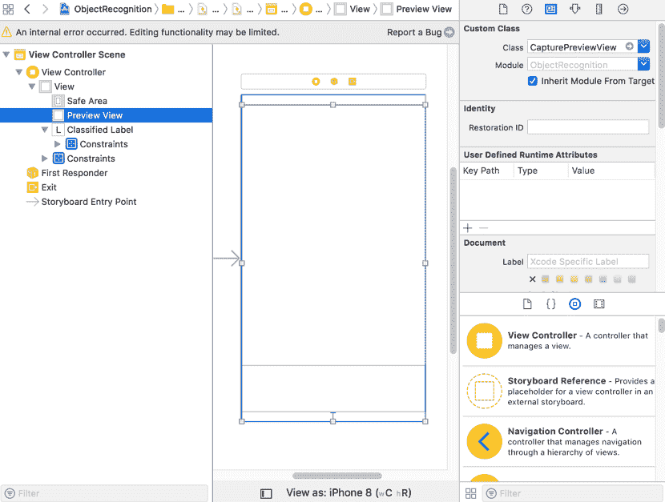

# 识别世界中的物体

在本章中，我们将通过研究可能被认为是 101 Core ML 应用程序的内容，深入到机器学习（**ML**）和 Core ML 的世界中。我们将使用一个图像分类模型，使用户能够将 iPhone 对准任何物体，并让应用识别视图中最占主导地位的物体。

我们将首先讨论**卷积神经网络**（**ConvNets** 或 **CNNs**），这是一种非常适合图像分类的神经网络类别，然后再进入实现阶段。从骨架项目开始，你很快就会发现，在 Core ML 的帮助下，将机器学习集成到你的应用中是多么容易。

在本章中，我们将涵盖以下主题：

+   获得一些关于机器如何理解图像的直观认识

+   构建本章的示例应用程序

+   捕获照片帧并在传递给 Core ML 模型之前对其进行预处理

+   使用 Core ML 模型进行推理并解释结果

卷积神经网络通常被称为 CNNs 或 ConvNets，这两个术语在这本书中是互换使用的。

# 理解图像

如前所述，我的意图不是给你一个特定 ML 算法的理论或深入理解，而是温和地介绍一些主要概念。这将帮助你获得对它们如何工作的直观理解，以便你知道在哪里以及如何应用它们，同时为你提供一个深入了解特定主题的平台，我强烈建议你这样做。

对于一本关于深度学习的优秀入门书籍，我强烈推荐 Andrew Trask 的书《Grokking Deep Learning》。对于 ML 的一般介绍，我建议 Toby Segaran 的书《Programming Collective Intelligence: Building Smart Web 2.0 Applications》。

在本节中，我们将介绍 CNNs，特别是介绍它们是什么以及为什么它们非常适合空间数据，即图像。但在讨论 CNNs 之前，我们将首先检查数据；然后我们将看到为什么 CNNs 比它们的对应物，即全连接神经网络（或简称神经网络）表现得更好。

为了说明这些概念，考虑以下任务：对以下数字进行分类，其中每个数字都表示为 5 x 5 像素矩阵。深灰色像素的值为 1，浅灰色像素的值为 0：


使用全连接神经网络（单个隐藏层），我们的模型将学习每个像素与其相关标签的联合概率；也就是说，模型将为与标签相关的像素分配正权重，并使用最可能性的输出作为最可能的标签。在训练过程中，我们将每个图像展平，然后将其输入到我们的网络中，如下面的图所示：


这效果非常好，如果你有机器学习，尤其是深度学习的经验，你很可能已经遇到过 MNIST 数据集。这是一个包含标记的手写数字数据集，每个数字都中心渲染成 28 x 28 的灰度图（单通道，像素值范围从 0-255）。使用单层全连接网络很可能会得到接近 90%的验证准确率。但是，如果我们引入一些复杂性，比如将图像移动到一个更大的空间中，如图所示，会发生什么呢？


全连接网络没有空间或局部关系的概念；在这种情况下，模型需要学习每个数字在每个可能位置的所有变体。为了进一步强调能够捕捉空间数据关系的重要性，考虑需要学习更复杂的图像，例如使用丢弃 2D 信息的网络来对猫和狗进行分类。单独的像素无法描绘出眼睛、鼻子或耳朵等复杂形状；只有当你考虑相邻像素时，你才能描述这些更复杂的形状：


图片来自 Kaggle 竞赛猫狗对比（https://www.kaggle.com/c/dogs-vs-cats）

我们需要一种能够从原始像素中抽象出来的东西，能够使用高级特征来描述图像。让我们回到我们的数字数据集，并研究我们如何可能提取用于分类任务的高级特征。正如在先前的例子中提到的，我们需要一组从原始像素中抽象出来的特征，不受位置影响，并保留 2D 空间信息。如果你熟悉图像处理，或者甚至图像处理工具，你很可能已经遇到过**边缘检测**或**边缘滤波器**的概念和结果；最简单的说法，这些是通过在整个图像上传递一组核来实现，输出是强调边缘的图像。让我们看看这图示上是如何的。首先，我们有我们的核集；每个核提取图像的特定特征，例如水平边缘、垂直边缘或 45 度角的边缘：


对于这些滤波器中的每一个，我们将它们应用到我们的图像上，提取每个特征；为了帮助说明这一点，让我们取一个数字并将垂直核应用到它上面：


如前图所示，我们将水平核在图像上滑动，使用图像和核的值生成一个新的图像。我们继续这样做，直到达到图像的边界，如下图所示：


这的输出是一个显示图像内检测到的垂直线的映射。使用这个和其他内核，我们现在可以用每个类的主导梯度来描述每个类，而不是使用像素位置。这个更高层次的抽象使我们能够独立于位置识别类别，以及描述更复杂的对象。

在处理内核时，有两个需要注意的有用事项是**步长**值和**填充**。步长决定了你在滑动内核跨过图像时步长的大小。在上一个例子中，我们的步长设置为 1；也就是说，我们只滑动一个值。填充指的是你如何处理边界；在这里，我们使用**valid**，这意味着我们只处理有效范围内的像素。**same**则意味着在图像周围添加一个边界，以确保输出大小与输入相同。

我们在这里所做的是所谓的**特征工程**，这是神经网络自动执行的事情；特别是，这正是 CNN 所做的事情。它们创建一系列内核（或卷积矩阵），用于通过卷积图像从相邻像素中提取局部特征。与我们的先前工程示例不同，这些内核是在训练期间学习的。因为它们是自动学习的，我们可以创建许多过滤器，这些过滤器可以提取图像的细微差别，从而允许我们有效地堆叠卷积层。这允许我们学习更高层次的抽象。例如，第一层可能学会检测简单的边缘，而第二层（在先前提取的特征上操作）可能学会提取简单的形状。我们走得越深，我们的特征达到的层次就越高，如图所示：


就这样！一个能够通过学习特征和抽象层来高效描述世界的架构。现在，让我们通过使用预训练模型和 Core ML 来实践，让我们的手机能够识别它所看到的物体。

# 识别世界中的物体

为了回顾，我们本章的目标是创建一个能够识别它所看到的应用程序。我们将首先捕获视频帧，为我们的模型准备这些帧，最后将它们输入到 Core ML 模型中进行推理。让我们开始吧。

# 数据采集

如果你还没有这样做，请从配套仓库下载最新代码：[`github.com/packtpublishing/machine-learning-with-core-ml`](https://github.com/packtpublishing/machine-learning-with-core-ml)。下载后，导航到目录`Chapter3/Start/ObjectRecognition/`并打开项目`ObjectRecognition.xcodeproj`。加载后，你将看到本章的骨架项目，如下面的截图所示：


为了帮助您在项目中导航，以下是一个核心文件/类及其主要功能的列表：

+   `VideoCapture` 将负责管理和处理摄像头，包括捕获视频帧

+   `CaptureVideoPreviewView.swift` 包含 `CapturePreviewView` 类，它将被用来展示捕获的帧

+   `CIImage` 为 `CIImage` 类提供了便利的扩展，用于准备帧以供 Core ML 模型使用

+   如您所期望的，`VideoController` 是应用程序的控制器，负责与导入的 Core ML 模型进行接口交互

我们将在接下来的章节中对这些进行修改，以实现所需的功能。我们的第一个任务将是获取对摄像头的访问权限并开始捕获帧；为此，我们将利用 Apple 的 iOS 框架 **AVFoundation** 和 **CoreVideo**。

AVFoundation 框架包含用于在 iOS 和其他平台上处理捕获、处理、合成、控制、导入和导出音视频媒体类的集合。在本章中，我们最感兴趣的是该框架的一个子集，用于处理摄像头和媒体捕获，但您可以在 Apple 的官方文档网站上了解更多关于 AVFoundation 框架的信息：[`developer.apple.com/documentation/avfoundation`](https://developer.apple.com/documentation/avfoundation)。

CoreVideo 提供了一个基于管道的 API，用于操作数字视频，能够通过 Metal 和 OpenGL 的支持来加速处理过程。

我们将指定将设置和从摄像头捕获帧的责任分配给 `VideoCapture` 类；现在让我们直接进入代码。从左侧面板中选择 `VideoCapture.swift` 以在编辑窗口中打开。在做出修改之前，让我们检查已经存在的内容以及还需要完成的工作。

在类的顶部，我们定义了 `VideoCaptureDelegate` 协议：

```py
public protocol VideoCaptureDelegate: class {
    func onFrameCaptured(
      videoCapture: VideoCapture, 
      pixelBuffer:CVPixelBuffer?, 
      timestamp:CMTime)
}
```

`VideoCapture` 将将捕获的帧传递给已注册的代理，从而使 `VideoCapture` 类能够专注于捕获帧的任务。我们传递给代理的是对自身的引用、类型为 `CVPixelBuffer` 的图像数据（捕获帧）以及类型为 `CMTime` 的时间戳。`CVPixelBuffer` 是 CoreVideo 专门用于存储像素数据的数据结构，也是我们的 Core ML 模型所期望的数据结构（我们将在稍后看到）。`CMTime` 是一个用于封装时间戳的结构体，我们将直接从视频帧中获取它。

在协议下，我们有 `VideoCapture` 类的骨架。在本节中，我们将逐步介绍它，以及一个扩展来实现 `AVCaptureVideoDataOutputSampleBufferDelegate` 协议，我们将使用它来捕获帧：

```py
public class VideoCapture : NSObject{
    public weak var delegate: VideoCaptureDelegate?
    public var fps = 15
    var lastTimestamp = CMTime()
    override init() {
        super.init()
    }
    private func initCamera() -> Bool
    {
        return true
    }
    public func asyncStartCapturing(
        completion: (() -> Void)? = nil)
        {
         }
    public func asyncStopCapturing(
        completion: (() -> Void)? = nil)
        {
        }
}
```

大部分内容应该是显而易见的，所以我只会强调不那么明显的地方，从变量`fps`和`lastTimestamp`开始。我们使用这些变量一起控制我们向代理传递帧的速率；我们这样做是因为我们假设我们捕获帧的速度远快于我们处理它们的速度。为了避免我们的摄像头出现延迟或跳跃，我们明确限制向代理传递帧的速率。**每秒帧数**（**fps**）设置这个频率，而`lastTimestamp`则与计算自上次处理帧以来经过的时间一起使用。

我在这里要强调的代码的另一部分是`asyncStartCapturing`和`asyncStopCapturing`方法；正如其名称所暗示的，这些方法分别负责启动和停止捕获会话。因为它们都将使用阻塞方法，这可能会花费一些时间，所以我们将任务从主线程派发出去，以避免阻塞它并影响用户体验。

最后，我们有扩展；它实现了`AVCaptureVideoDataOutputSampleBufferDelegate`协议：

```py
extension VideoCapture : AVCaptureVideoDataOutputSampleBufferDelegate{
    public func captureOutput(_ output: AVCaptureOutput,
                              didOutput sampleBuffer: CMSampleBuffer,
                              from connection: AVCaptureConnection)
    {
    }
}
```

我们将在稍后讨论细节，但基本上是我们分配给摄像头以处理摄像头传入帧的代理。然后我们将它代理到分配给这个类的`VideoCaptureDelegate`代理。

现在我们来逐步实现这个类的各个方法，从`initCamera`方法开始。在这个方法中，我们想要设置一个管道，该管道将从设备的物理摄像头捕获帧并将它们传递到我们的代理方法。我们通过首先获取物理摄像头的引用，然后将其包装在`AVCaptureDeviceInput`类的一个实例中来实现这一点，该类负责管理与物理摄像头的连接和通信。最后，我们为帧添加一个目的地，这是我们在其中使用`AVCaptureVideoDataOutput`类的一个实例的地方，我们将自己指定为接收这些帧的代理。这个管道被包裹在称为`AVCaptureSession`的东西中，它负责协调和管理这个管道。

现在我们定义一些我们将需要的实例变量；在类`VideoCapture`内部添加以下变量：

```py
let captureSession = AVCaptureSession()
let sessionQueue = DispatchQueue(label: "session queue")
```

我们之前提到了`captureSession`的目的，但也介绍了一个`DispatchQueue`。当将代理添加到`AVCaptureVideoDataOutput`（用于处理新帧的到来）时，你也会传递一个`DispatchQueue`；这允许你控制帧在哪个队列上被管理。在我们的例子中，我们将处理图像的操作从主线程上移除，以避免影响用户界面的性能。

现在我们已经声明了实例变量，我们将把注意力转向`initCamera`方法，将其分解成小的代码片段。在方法体内添加以下内容：

```py
captureSession.beginConfiguration()       
captureSession.sessionPreset = AVCaptureSession.Preset.medium 
```

我们通过调用方法 `beginConfiguration` 向 `captureSession` 信号我们想要批量配置多个配置；这些更改不会在我们通过调用会话的 `commitConfiguration` 方法提交之前生效。然后，在下一行代码中，我们设置所需的品质级别：

```py
guard let captureDevice = AVCaptureDevice.default(for: AVMediaType.video) else {
    print("ERROR: no video devices available")
    return false
}

guard let videoInput = try? AVCaptureDeviceInput(device: captureDevice) else {
    print("ERROR: could not create AVCaptureDeviceInput")
    return false
}

if captureSession.canAddInput(videoInput) {
    captureSession.addInput(videoInput)
}
```

在下一个代码片段中，我们获取物理设备；在这里，我们获取默认的能够录制视频的设备，但您也可以轻松地搜索具有特定功能（如前置摄像头）的设备。在成功获取设备后，我们将它包装在一个 `AVCaptureDeviceInput` 的实例中，该实例将负责从物理摄像头捕获数据并将其最终添加到会话中。

我们现在必须添加这些帧的目的地；再次，将以下片段添加到 `initCamera` 方法中，您之前停止的地方：

```py
let videoOutput = AVCaptureVideoDataOutput()

let settings: [String : Any] = [
    kCVPixelBufferPixelFormatTypeKey as String: NSNumber(value: kCVPixelFormatType_32BGRA)
]
videoOutput.videoSettings = settings
videoOutput.alwaysDiscardsLateVideoFrames = true
videoOutput.setSampleBufferDelegate(self, queue: sessionQueue)

if captureSession.canAddOutput(videoOutput) {
    captureSession.addOutput(videoOutput)
}

videoOutput.connection(with: AVMediaType.video)?.videoOrientation = .portrait
```

在之前的代码片段中，我们创建、设置并添加了我们的输出。我们首先实例化 `AVCaptureVideoDataOutput` 的一个实例，然后定义我们想要的数据。在这里，我们请求全彩（`kCVPixelFormatType_32BGRA`），但根据您的模型，请求灰度图像（`kCVPixelFormatType_8IndexedGray_WhiteIsZero`）可能更有效率。

将 `alwaysDiscardsLateVideoFrames` 设置为 true 意味着在调度队列忙碌时到达的任何帧都将被丢弃——这对于我们的示例来说是一个理想的功能。然后，我们使用方法 `videoOutput.setSampleBufferDelegate(self, queue: sessionQueue)` 将我们自己以及我们的专用调度队列指定为处理传入帧的代理。一旦我们配置了输出，我们就可以将其作为配置请求的一部分添加到会话中。为了防止我们的图像被旋转 90 度，我们随后请求图像以竖直方向显示。

添加最终语句以提交这些配置；只有在我们这样做之后，这些更改才会生效：

```py
captureSession.commitConfiguration()
```

这现在完成了我们的 `initCamera` 方法；让我们迅速（请原谅这个双关语）转到负责启动和停止此会话的方法。将以下代码添加到 `asyncStartCapturing` 方法的主体中：

```py
sessionQueue.async {
    if !self.captureSession.isRunning{
       self.captureSession.startRunning()
    }

    if let completion = completion{
        DispatchQueue.main.async {
            completion()
        }
    }
 }
```

如前所述，`startRunning` 和 `stopRunning` 方法都会阻塞主线程，并且可能需要一些时间来完成；因此，我们将它们在主线程之外执行，再次避免影响用户界面的响应性。调用 `startRunning` 将启动从订阅的输入（摄像头）到订阅的输出（代理）的数据流。

如果有任何错误，将通过通知 `AVCaptureSessionRuntimeError` 报告。您可以使用默认的 `NotificationCenter` 订阅以监听它。同样，您可以通过通知 `AVCaptureSessionDidStartRunning` 和 `AVCaptureSessionDidStopRunning` 分别订阅以监听会话开始和停止。

类似地，将以下代码添加到 `asyncStopCapturing` 方法中，该方法将负责停止当前会话：

```py
sessionQueue.async {
    if self.captureSession.isRunning{
        self.captureSession.stopRunning()
    }

    if let completion = completion{
        DispatchQueue.main.async {
            completion()
         }
     }
 }
```

在`initCamera`方法中，我们使用语句`videoOutput.setSampleBufferDelegate(self, queue: sessionQueue)`将自己注册为代理以处理到达的帧；现在让我们关注如何处理它。如您所回忆的那样，我们在`captureOutput`方法中为`VideoCapture`类添加了一个扩展来实现`AVCaptureVideoDataOutputSampleBufferDelegate`协议。添加以下代码：

```py
guard let delegate = self.delegate else{ return }

 let timestamp = CMSampleBufferGetPresentationTimeStamp(sampleBuffer)

 let elapsedTime = timestamp - lastTimestamp
 if elapsedTime >= CMTimeMake(1, Int32(fps)) {

 lastTimestamp = timestamp

 let imageBuffer = CMSampleBufferGetImageBuffer(sampleBuffer)

 delegate.onFrameCaptured(videoCapture: self,
 pixelBuffer:imageBuffer,
 timestamp: timestamp)
 }
```

在浏览这段代码片段之前，值得提一下这个方法接收了哪些参数以及我们如何使用它们。第一个参数，`output`，其类型为`AVCaptureVideoDataOutput`，它引用了与此帧相关的输出。下一个参数，`sampleBuffer`，其类型为`CMSampleBuffer`，这是我们用来访问当前帧数据的。与帧一起，每个帧关联的持续时间、格式和时间戳也可以获得。最后一个参数，`connection`，其类型为`AVCaptureConnection`，它提供了与接收到的帧相关联的连接的引用。

现在，让我们逐行分析代码，我们首先检查是否有未分配的代理，并在必要时提前返回。然后我们确定自上次处理帧以来是否已经过去了足够的时间，记住我们正在限制处理帧的频率以确保流畅的体验。在这里，我们不是使用系统时钟，而是通过语句`let timestamp = CMSampleBufferGetPresentationTimeStamp(sampleBuffer)`获取与最新帧相关的时间；这确保了我们是在相对于帧的相对时间而不是系统的绝对时间进行测量。鉴于已经过去了足够的时间，我们继续通过语句`CMSampleBufferGetImageBuffer(sampleBuffer)`获取样本的图像缓冲区引用，最后将其传递给指定的代理。

现在已经完成了`VideoCapture`类的编写；让我们继续使用`ViewController`将其连接到我们的视图。但在跳入代码之前，让我们通过故事板检查接口，以便更好地理解我们将在哪里展示视频流。在 Xcode 中，从左侧的项目导航器面板中选择`Main.storyboard`以打开界面构建器；打开后，您将看到一个类似于以下截图的布局：



没有什么复杂的；我们有一个标签来显示我们的结果，还有一个视图来渲染我们的视频帧。如果您选择 VideoPreview 视图并检查分配给它的类，您将看到我们有一个名为 CapturePreviewView 的自定义类来处理渲染。让我们跳入这个类的代码并进行必要的修改：

```py
import AVFoundation
 import UIKit

 class CapturePreviewView: UIView {

 }
```

幸运的是，`AVFoundation` 提供了一个专门用于从摄像头渲染帧的 `CALayer` 子类；我们剩下的工作就是重写视图的 `layerClass` 属性并返回适当的类。将以下代码添加到 `CapturePreviewView` 类中：

```py
override class var layerClass: AnyClass {
    return AVCaptureVideoPreviewLayer.self
}
```

这种方法在视图创建的早期阶段就被称作，用于确定要实例化哪个 `CALayer` 并将其与该视图关联。正如之前提到的，`AVCaptureVideoPreviewLayer` ——正如其名称所暗示的那样——专门用于处理视频帧。为了获取渲染的帧，我们只需将 `AVCaptureSession` 赋值为 `AVCaptureVideoPreviewLayer.session` 属性。现在让我们来做这件事；首先在 Xcode 中打开 `ViewController` 类，并添加以下变量（粗体）：

```py
@IBOutlet var previewView:CapturePreviewView!
@IBOutlet var classifiedLabel:UILabel!

 let videoCapture : VideoCapture = VideoCapture()
```

`previewView` 和 `classifiedLabel` 是通过 Interface Builder 与界面关联的现有变量。在这里，我们创建了一个 `VideoCapture` 的实例，这是我们之前实现的。接下来，我们将使用 `VideoCapture` 实例设置并启动摄像头，然后将会话分配给我们的 `previewView` 层。在 `ViewDidLoad` 方法下的 `super.viewDidLoad()` 语句中添加以下代码：

```py
if self.videoCapture.initCamera(){
 (self.previewView.layer as! AVCaptureVideoPreviewLayer).session = self.videoCapture.captureSession

 (self.previewView.layer as! AVCaptureVideoPreviewLayer).videoGravity = AVLayerVideoGravity.resizeAspectFill

 self.videoCapture.asyncStartCapturing()
 } else{
 fatalError("Failed to init VideoCapture")
 }
```

大部分的代码应该对你来说都很熟悉，因为其中很多都是使用我们刚刚实现的方法。首先我们初始化摄像头，调用 `VideoCamera` 类的 `initCamera` 方法。然后，如果成功，我们将创建的 `AVCaptureSession` 分配给层的会话。我们还向层暗示了我们希望它如何处理内容，在这种情况下是填充屏幕同时尊重其宽高比。最后，我们通过调用 `videoCapture.asyncStartCapturing()` 启动摄像头。

现在一切完成，是时候测试一切是否正常工作了。如果你在 iOS 11+ 设备上构建和部署，你应该能在手机屏幕上看到渲染的视频帧。

在下一节中，我们将介绍如何在执行推理（识别）之前，如何捕获和处理这些帧以供我们的模型使用。

# 数据预处理

在这个阶段，我们的应用正在渲染来自摄像头的帧，但我们还没有接收到任何帧。为了做到这一点，我们将自己设置为接收这些帧，正如前一个章节中实现的那样。现有的 `ViewController` 类已经有一个扩展实现了 `VideoCaptureDelegate` 协议。剩下要做的就是将我们自己设置为 `VideoCapture` 实例的代理并实现回调方法的细节；以下是为 `extension` 编写的代码：

```py
extension ViewController : VideoCaptureDelegate{
    func onFrameCaptured(videoCapture: VideoCapture,
     pixelBuffer:CVPixelBuffer?,
     timestamp:CMTime){
     }
 }
```

根据你的编码风格，你同样可以在主类内部实现协议。我倾向于使用扩展来实现协议——这是一个个人偏好。

首先，让我们将自己设置为代理以开始接收帧；在 `ViewController` 类的 `ViewDidLoad` 方法中，在我们初始化摄像头之前添加以下语句：

```py
self.videoCapture.delegate = self
```

现在我们已经将自己指定为代理，我们将通过回调接收帧（在定义的帧率下）：

```py
func onFrameCaptured(videoCapture: VideoCapture,
 pixelBuffer:CVPixelBuffer?,
 timestamp:CMTime){
 // TODO
 }
```

在这个方法中，我们将准备并喂给模型数据以对帧内的主要对象进行分类。模型期望的内容取决于模型本身，因此为了更好地了解我们需要传递什么，让我们下载我们将用于此示例的训练好的模型并将其导入到我们的项目中。

训练好的模型可以从各种来源获得；在某些情况下，您可能需要将它们进行转换，而在其他情况下，您可能需要自己训练模型。但在这个例子中，我们可以利用苹果公司提供的模型；打开您的网络浏览器，导航到 [`developer.apple.com/machine-learning/`](https://developer.apple.com/machine-learning/)：


您将被带到苹果公司提供了一系列预训练和转换模型的网页。方便的是，大多数可用的模型都是专门用于对象分类的；鉴于我们的用例，我们特别感兴趣的是在大量对象上训练的模型。我们的选项包括 MobileNet、SqueezeNet、ResNet50、Inception v3 和 VGG16。其中大多数都是在 ImageNet 数据集上训练的，这是一个包含超过 1000 万个图像的参考数据集，这些图像已被手动分配到 1000 个类别之一。可以通过“查看原始模型详细信息”链接获取对原始研究论文和性能的引用。对于这个例子，我们将使用 Inception v3，它在大小和准确性之间取得了良好的平衡。

在这里，我们使用的是 Inception v3 模型，但更换模型的工作量很小；它需要更新引用，因为生成的类名都带有模型名称的前缀，正如您很快就会看到的，并确保您符合模型预期的输入（这可以通过使用 Vision 框架来缓解，您将在未来的章节中看到）。

点击“下载 Core ML 模型”链接以继续下载，下载完成后，将 `Inceptionv3.mlmodel` 文件拖放到 Xcode 左侧的“项目导航器”面板上，如果需要则检查“复制项目”，否则保持默认设置。从左侧的项目导航器面板中选择 `Inceptionv3.mlmodel` 文件，以便在编辑器区域中显示详细信息，如下面的截图所示：


确保模型被正确分配到适当的目标是重要的；在这个例子中，这意味着验证 ObjectRecognition 目标是否被选中，如右边的工具面板上所见。还值得注意的是模型的预期输入和输出。在这里，模型期望一个 299 x 299 大小的彩色图像作为输入，并返回一个字符串形式的单个类标签以及所有类别的字符串-双精度浮点数概率字典。

当导入 `.mlmodel` 文件时，Xcode 将为模型本身以及输入和输出参数生成包装器，以便与模型接口；这在此处得到了说明：


你可以通过在模型类部分旁边的箭头按钮上轻触来轻松访问它；轻触后，你会看到以下代码（分为三个不同的块以提高可读性）：

```py
@available(macOS 10.13, iOS 11.0, tvOS 11.0, watchOS 4.0, *)
 class Inceptionv3Input : MLFeatureProvider {

 /// Input image to be classified as color (kCVPixelFormatType_32BGRA) image buffer, 299 pixels wide by 299     pixels high
 var image: CVPixelBuffer

 var featureNames: Set<String> {
     get {
         return ["image"]
     }
 }

 func featureValue(for featureName: String) -> MLFeatureValue? {
     if (featureName == "image") {
         return MLFeatureValue(pixelBuffer: image)
     }
     return nil
 }

 init(image: CVPixelBuffer) {
     self.image = image
     }
 }
```

上述代码的第一个块是我们模型的输入。这个类实现了 `MLFeatureProvider` 协议，该协议代表模型的一组特征值，在这种情况下，是图像特征。在这里，你可以看到预期的数据结构，`CVPixelBuffer`，以及注释中声明的具体细节。让我们继续检查生成的类，看看输出的绑定：

```py
@available(macOS 10.13, iOS 11.0, tvOS 11.0, watchOS 4.0, *)
 class Inceptionv3Output : MLFeatureProvider {

 /// Probability of each category as dictionary of strings to doubles
 let classLabelProbs: [String : Double]

 /// Most likely image category as string value
 let classLabel: String

 var featureNames: Set<String> {
     get {
         return ["classLabelProbs", "classLabel"]
     }
 }

 func featureValue(for featureName: String) -> MLFeatureValue? {
     if (featureName == "classLabelProbs") {
         return try! MLFeatureValue(dictionary: classLabelProbs as [NSObject : NSNumber])
     }
     if (featureName == "classLabel") {
         return MLFeatureValue(string: classLabel)
     }
     return nil
}

 init(classLabelProbs: [String : Double], classLabel: String) {
     self.classLabelProbs = classLabelProbs
     self.classLabel = classLabel
     }
 }
```

如前所述，输出公开了一个概率目录和一个表示主导类的字符串，每个都作为属性公开或可以通过传递特征名称的 getter 方法 `featureValue(for featureName: String)` 访问。我们最后提取生成的代码是模型本身；现在让我们检查一下：

```py
@available(macOS 10.13, iOS 11.0, tvOS 11.0, watchOS 4.0, *)
 class Inceptionv3 {
 var model: MLModel

 /**
 Construct a model with explicit path to mlmodel file
 - parameters:
 - url: the file url of the model
 - throws: an NSError object that describes the problem
 */
 init(contentsOf url: URL) throws {
 self.model = try MLModel(contentsOf: url)
 }

 /// Construct a model that automatically loads the model from the app's bundle
 convenience init() {
 let bundle = Bundle(for: Inceptionv3.self)
 let assetPath = bundle.url(forResource: "Inceptionv3", withExtension:"mlmodelc")
 try! self.init(contentsOf: assetPath!)
 }

 /**
 Make a prediction using the structured interface
 - parameters:
 - input: the input to the prediction as Inceptionv3Input
 - throws: an NSError object that describes the problem
 - returns: the result of the prediction as Inceptionv3Output
 */
 func prediction(input: Inceptionv3Input) throws -> Inceptionv3Output {
 let outFeatures = try model.prediction(from: input)
 let result = Inceptionv3Output(classLabelProbs: outFeatures.featureValue(for: "classLabelProbs")!.dictionaryValue as! [String : Double], classLabel: outFeatures.featureValue(for: "classLabel")!.stringValue)
 return result
 }

 /**
 Make a prediction using the convenience interface
 - parameters:
 - image: Input image to be classified as color (kCVPixelFormatType_32BGRA) image buffer, 299 pixels wide by 299 pixels high
 - throws: an NSError object that describes the problem
 - returns: the result of the prediction as Inceptionv3Output
 */
 func prediction(image: CVPixelBuffer) throws -> Inceptionv3Output {
 let input_ = Inceptionv3Input(image: image)
 return try self.prediction(input: input_)
 }
 }
```

这个类封装了模型类，并为通过 `prediction(input: Inceptionv3Input)` 和 `prediction(image: CVPixelBuffer)` 方法执行推理提供了强类型方法，每个方法都返回我们之前看到的输出类——`Inceptionv3Output`。现在，知道了我们的模型期望什么，让我们继续实现预处理功能，以便将捕获的帧输入到模型中。

Core ML 2 引入了一种处理批量的能力；如果你的模型是用 Xcode 10+ 编译的，你还将看到额外的 `<CODE>func predictions(from: MLBatchProvider, options: MLPredictionOptions)</CODE>` 方法，允许你对输入批次进行推理。

在这个阶段，我们知道我们正在接收正确的数据类型 (`CVPixelBuffer`) 和图像格式（在配置捕获视频输出实例时在设置中明确定义的 `kCVPixelFormatType_32BGRA`），来自相机。但我们接收到的图像比预期的 299 x 299 大得多。我们的下一个任务将是创建一些实用方法来进行调整大小和裁剪。

为了实现这一点，我们将扩展`CIImage`以包装和处理我们接收到的像素数据，并利用`CIContext`再次获取原始像素。如果您不熟悉 CoreImage 框架，那么可以说它是一个致力于高效处理和分析图像的框架。`CIImage`可以被认为是该框架的基数据对象，通常与`CIFilter`、`CIContext`、`CIVector`和`CIColor`等其他 CoreImage 类一起使用。在这里，我们关注`CIImage`，因为它提供了方便的方法来操作图像，以及与`CIContext`一起提取`CIImage`中的原始像素数据（`CVPixelBuffer`）。

在 Xcode 中，从项目导航器中选择`CIImage.swift`文件以在编辑器区域中打开它。在这个文件中，我们扩展了`CIImage`类，添加了一个负责缩放的方法以及一个返回原始像素（`CVPixelBuffer`）的方法，这是我们的 Core ML 模型所需的格式：

```py
extension CIImage{

 func resize(size: CGSize) -> CIImage {
     fatalError("Not implemented")
 }

 func toPixelBuffer(context:CIContext,
 size insize:CGSize? = nil,
     gray:Bool=true) -> CVPixelBuffer?{
         fatalError("Not implemented")
     }
 }
```

让我们从实现`resize`方法开始；这个方法接收期望的大小，我们将使用它来计算相对比例；然后我们将使用这个比例来均匀缩放图像。将以下代码片段添加到`resize`方法中，替换`fatalError("Not implemented")`语句：

```py
let scale = min(size.width,size.height) / min(self.extent.size.width, self.extent.size.height)

 let resizedImage = self.transformed(
 by: CGAffineTransform(
 scaleX: scale,
 y: scale))
```

除非图像是正方形，否则我们可能会在垂直或水平方向上出现溢出。为了处理这个问题，我们将简单地居中图像并将其裁剪到期望的大小；通过在`resize`方法中添加以下代码来实现（在前面代码片段下方）：

```py
let width = resizedImage.extent.width
 let height = resizedImage.extent.height
 let xOffset = (CGFloat(width) - size.width) / 2.0
 let yOffset = (CGFloat(height) - size.height) / 2.0
 let rect = CGRect(x: xOffset,
 y: yOffset,
 width: size.width,
 height: size.height)

 return resizedImage
 .clamped(to: rect)
 .cropped(to: CGRect(
 x: 0, y: 0,
 width: size.width,
 height: size.height))
```

我们现在有了调整图像大小的功能；我们下一个功能是获取`CIImage`的`CVPixelBuffer`。让我们通过实现`toPixelBuffer`方法的主体来实现这一点。首先，让我们回顾一下方法签名，然后简要谈谈所需的功能：

```py
func toPixelBuffer(context:CIContext, gray:Bool=true) -> CVPixelBuffer?{
     fatalError("Not implemented")
 }
```

此方法期望一个`CIContext`和一个标志，指示图像应该是灰度（单通道）还是全色；`CIContext`将用于将图像渲染到像素缓冲区（我们的`CVPixelBuffer`）。现在让我们逐步完善`toPixelBuffer`的实现。

在图像上所需的预处理（调整大小、灰度化和归一化）取决于 Core ML 模型及其训练数据。您可以通过在 Xcode 中检查 Core ML 模型来了解这些参数。如果您还记得，我们模型期望的输入是（图像颜色 299 x 299）；这告诉我们 Core ML 模型期望图像是彩色（三个通道）且大小为 299 x 299。

我们首先创建我们将渲染图像的像素缓冲区；将以下代码片段添加到`toPixelBuffer`方法的主体中，替换`fatalError("Not implemented")`语句：

```py
let attributes = [
 kCVPixelBufferCGImageCompatibilityKey:kCFBooleanTrue,
 kCVPixelBufferCGBitmapContextCompatibilityKey:kCFBooleanTrue
 ] as CFDictionary

 var nullablePixelBuffer: CVPixelBuffer? = nil
 let status = CVPixelBufferCreate(kCFAllocatorDefault,
 Int(self.extent.size.width),
 Int(self.extent.size.height),
 gray ? kCVPixelFormatType_OneComponent8 : kCVPixelFormatType_32ARGB,
 attributes,
 &nullablePixelBuffer)

 guard status == kCVReturnSuccess, let pixelBuffer = nullablePixelBuffer
 else { return nil }
```

我们首先创建一个数组来保存定义像素缓冲区兼容性要求的属性；在这里，我们指定我们希望我们的像素缓冲区与`CGImage`类型兼容（`kCVPixelBufferCGImageCompatibilityKey`）以及与 CoreGraphics 位图上下文兼容（`kCVPixelBufferCGBitmapContextCompatibilityKey`）。

我们接下来创建一个像素缓冲区，传入我们的兼容性属性、格式（取决于`gray`的值，可以是灰度或全色）、宽度、高度以及变量的指针。然后解包可空的像素缓冲区，并确保调用成功；如果这些中的任何一个为`false`，则返回`NULL`。否则，我们就可以将`CIImage`渲染到新创建的像素缓冲区中。将以下代码追加到`toPixelBuffer`方法中：

```py
CVPixelBufferLockBaseAddress(pixelBuffer, CVPixelBufferLockFlags(rawValue: 0))

 context.render(self,
 to: pixelBuffer,
 bounds: CGRect(x: 0,
 y: 0,
 width: self.extent.size.width,
 height: self.extent.size.height),
 colorSpace:gray ?
 CGColorSpaceCreateDeviceGray() :
 self.colorSpace)

 CVPixelBufferUnlockBaseAddress(pixelBuffer, CVPixelBufferLockFlags(rawValue: 0))

 return pixelBuffer
```

在绘制之前，我们通过`CVPixelBufferLockBaseAddress`锁定像素缓冲区的地址，然后使用`CVPixelBufferUnlockBaseAddress`方法解锁。当我们从 CPU 访问像素数据时，我们必须这样做，我们在这里就是这样做的。

一旦锁定，我们只需使用`CIContext`将缩放后的图像渲染到缓冲区，传入目标矩形（在这种情况下，像素缓冲区的完整大小）和目标颜色空间，这取决于之前提到的`gray`的值。在解锁像素缓冲区后，如前所述，我们返回我们新创建的像素缓冲区。

我们现在扩展了`CIImage`，添加了两个方便的方法，一个负责缩放，另一个负责创建其自身的像素缓冲区表示。我们现在将返回到`ViewController`类，处理在将数据传递给模型之前所需的预处理步骤。在 Xcode 的项目导航面板中选择`ViewController.swift`文件以显示源代码，并在`ViewController`类的主体中添加以下变量：

```py
let context = CIContext()
```

如前所述，我们将将其传递给`CIImage.toPixelBuffer`方法以将图像渲染到像素缓冲区。现在返回到`onFrameCaptured`方法，并添加以下代码，以使用我们刚刚创建的预处理方法：

```py
guard let pixelBuffer = pixelBuffer else{ return }

 // Prepare our image for our model (resizing)
 guard let scaledPixelBuffer = CIImage(cvImageBuffer: pixelBuffer)
 .resize(size: CGSize(width: 299, height: 299))
 .toPixelBuffer(context: context) else{ return }
```

我们首先解包`pixelBuffer`，如果它是`NULL`则返回；然后我们创建一个`CIImage`实例，传入当前帧，然后使用我们的扩展方法执行缩放（299 x 299）并将渲染输出到像素缓冲区（将灰度参数设置为 false，因为模型期望全色图像）。如果成功，我们将返回一个准备好的图像，可以传递给我们的模型进行推理，这是下一节的重点。

# 进行推理

对于期待一些硬核编码的人来说，这可能有点令人失望，但它的简单性无疑是对苹果工程师在使这个框架成为与机器学习模型工作最便捷方式之一所付出的努力的致敬。无需多言，让我们把最后几块拼图放在一起；我们从之前章节导入的模型实例化开始。

在`ViewController`类的主体部分靠近顶部的地方，添加以下行：

```py
let model = Inceptionv3()
```

我们的模式现在准备好了；我们回到`onFrameCaptured`方法，从我们之前离开的地方开始，并添加以下代码片段：

```py
let prediction = try? self.model.prediction(image:scaledPixelBuffer)

 // Update label
 DispatchQueue.main.sync {
 classifiedLabel.text = prediction?.classLabel ?? "Unknown"
 }
```

如果您错过了，我在进行推理的地方使用了粗体。就是这样！

执行推理后，我们只需将`classLabel`属性（概率最高的类别）分配给我们的`UILabel`，`classifiedLabel`。

在放置好最后一块拼图后，我们构建并部署。看看我们的应用程序表现如何，识别我们附近的一些物体。在你完成对空间的调查后，回到这里，我们将结束本章，并继续更伟大、更令人印象深刻的例子。

# 摘要

在本章中，我们介绍了对象识别，这是使用 Core ML 的机器学习 101 项目。我们花了一些时间介绍 CNN 或卷积神经网络，这是一类非常适合从图像中提取模式的神经网络。我们讨论了它们如何通过每个卷积层构建越来越高的抽象层次。然后我们利用我们新获得的知识，通过实现允许我们的应用程序通过其摄像头识别物理世界的功能来使用它。我们亲眼看到，大部分工作不是执行推理，而是实现促进和利用它的功能。这就是我们的收获；智能本身并没有用。我们在这本书中感兴趣的是将训练好的模型应用于提供直观和智能的体验。例如，这个例子可以轻松地变成一个语言辅导助手，使用户通过观察周围的世界来学习一门新语言。

在下一章中，我们将继续我们的 Core ML 计算机视觉之旅，看看我们如何通过识别某人的面部表情来推断他们的情绪状态。让我们开始吧。
