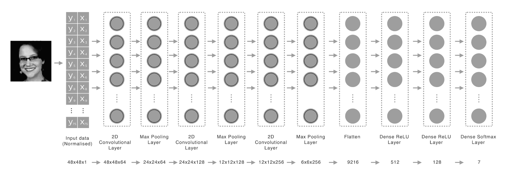

# 使用卷积神经网络进行情感检测

直到最近，与计算机的交互与与，比如说，电动工具的交互并没有太大的区别；我们拿起它，打开它，手动控制它，然后放下，直到下一次我们需要它来完成那个特定任务。但最近，我们看到了这种状况即将改变的迹象；计算机允许自然形式的交互，并且正在变得更加普遍、更强大、更深入到我们的日常生活中。它们正在变得越来越不像无情的笨拙工具，更像朋友，能够娱乐我们，照顾我们，并帮助我们完成工作。

随着这种转变，计算机需要能够理解我们的情绪状态。例如，你不想在你失业（被一个 AI 机器人取代）下班回家后，你的社交机器人还开玩笑（！）。这是一个被称为**情感计算**（也称为**人工情感智能**或**情感 AI**）的计算机科学领域，该领域研究能够识别、解释、处理和模拟人类情绪的系统。这一阶段的第一步是能够识别情绪状态，这是本章的主题。我们将首先介绍我们将使用的数据和模型，然后介绍我们如何处理 iPhone 上的表情识别问题以及如何适当地预处理数据以进行推理。

到本章结束时，你将实现以下目标：

+   构建了一个简单的应用程序，该程序将使用前置摄像头实时推断您的情绪

+   通过使用`Vision`框架获得了实践经验

+   对**卷积神经网络**（**CNNs**）的工作原理以及它们如何在边缘应用有了更深入的理解和直觉

让我们先介绍我们将使用的数据和模型。

# 面部表情

我们的面部是我们情绪的最强指示器之一；当我们笑或哭时，我们将我们的情绪展示出来，让他人窥视我们的内心。这是一种非言语交流形式，据称，它占我们与他人交流的 50%以上。四十个独立控制的肌肉使面部成为我们拥有的最复杂的系统之一，这也可能是我们将其用作传达我们当前情绪状态这样重要信息媒介的原因。但我们能对其进行分类吗？

2013 年，**国际机器学习会议**（**ICML**）举办了一场竞赛，邀请参赛者使用超过 28,000 张灰度图像的训练数据集构建面部表情分类器。它们被标记为愤怒、厌恶、恐惧、快乐、悲伤、惊讶或中性。以下是一些训练数据的样本（可在[`www.kaggle.com/c/challenges-in-representation-learning-facial-expression-recognition-challenge`](https://www.kaggle.com/c/challenges-in-representation-learning-facial-expression-recognition-challenge)找到）：


如前所述，训练数据集包含 28,709 张 48 x 48 像素的灰度人脸图像，其中每个面部居中，并关联一个定义分配情感的标签。这种情感可以是以下标签之一（添加了文本描述以提高可读性）：


神经网络（或任何其他机器学习算法）实际上不能自己做什么。神经网络所做的只是找到两个数据集（输入及其相应的输出）之间的直接或间接相关性。为了使神经网络学习，我们需要向它展示两个有意义的、输入和输出之间存在真实相关性的数据集。在处理任何新的数据问题时，一个好的做法是提出一个预测理论，说明你如何接近它或使用数据可视化或其他探索性数据分析技术来寻找相关性。这样做，我们也能更好地理解我们需要如何准备我们的数据，以便与训练数据对齐。

让我们看看可以应用于训练数据的数据可视化技术的结果；在这里，我们假设每个表情（快乐、悲伤、愤怒等）之间都存在某种模式。一种视觉检查这种方法的方式是通过平均每个表情及其相关的方差。这可以通过找到所有图像的相应类（表情示例、快乐、愤怒等）的平均值和标准差来实现。以下图像显示了某些表情的结果：


在你克服了图像的诡异感之后，你会感觉到确实存在某种模式，并理解我们的模型需要学习什么才能识别面部表情。从这个练习中得出的其他一些值得注意的、相当明显的结果包括厌恶表情的方差量；这暗示我们的模型可能难以有效地学习识别这种表情。另一个观察结果——并且更适用于我们本章的任务——是训练数据由面向前的面部图像组成，面部周围几乎没有填充，因此突出了模型期望的输入。现在我们对我们数据有了更好的了解；让我们继续介绍本章我们将使用的模型。

在第三章，“世界中的物体识别”，我们介绍了 CNN 或卷积神经网络背后的直觉。因此，鉴于我们本章不会介绍任何新概念，我们将省略对模型细节的任何讨论，只是在这里提供参考，并对其架构和期望输入数据格式进行一些评论：



上一张图是模型架构的可视化；它是一个典型的 CNN，在扁平化并输入一系列全连接层之前，有一堆卷积和池化层。最后，它被输入到一个 softmax 激活层，用于多类分类。如前所述，模型期望一个维度为 48 x 48 x 1 的 3D 张量（宽度、高度、通道）。为了避免将大数值（0 - 255）输入到我们的模型中，输入已经被归一化（每个像素除以 255，得到 0.0 - 1.0 的范围）。模型输出给定输入相对于每个类的概率，即每个类代表给定输入相关性的概率。为了做出预测，我们只需选择概率最大的类。

该模型在 22,967 个样本上进行了训练，其余 5,742 个样本用于验证。经过 15 个 epoch 后，模型在验证集上达到了大约 59%的准确率，成功挤进了 Kaggle 竞赛的第 13 名（在撰写本章时）。以下图表显示了训练过程中的准确率和损失：


这就结束了我们对本章将使用的数据和模型的简要介绍。两个主要的收获是对模型在训练期间所喂食的数据的欣赏，以及我们的模型仅达到了 59%的准确率。

前者决定了我们在将数据输入模型之前如何获取和处理数据。后者提供了一个进一步研究的机会，以更好地理解是什么因素拉低了准确率以及如何提高它；它也可以被视为一个设计挑战——一个围绕这个限制条件的设计。

在本章中，我们主要关注前者，因此，在下一节中，我们将探讨如何在将数据输入模型之前获取和预处理数据。让我们开始吧。

# 输入数据和预处理

在本节中，我们将实现预处理功能，以将图像转换为模型所期望的形式。我们将在 Playground 项目中逐步构建这个功能，然后在下一节将其迁移到我们的项目中。

如果您还没有这样做，请从配套仓库中拉取最新代码：[`github.com/packtpublishing/machine-learning-with-core-ml`](https://github.com/packtpublishing/machine-learning-with-core-ml)。下载完成后，导航到目录`Chapter4/Start/`并打开 Playground 项目`ExploringExpressionRecognition.playground`。加载完成后，您将看到本章的 Playground，如下面的截图所示：


在开始之前，为了避免看到我的照片，请将测试图像替换为你的个人照片或来自互联网的免费照片，理想情况下是一组表达各种情绪的照片。

除了测试图像外，这个游乐场还包括一个编译好的 Core ML 模型（我们在上一张图片中介绍了它）及其生成的输入、输出和模型本身的包装器。还包括一些对`UIImage`、`UIImageView`、`CGImagePropertyOrientation`和空`CIImage`扩展的扩展，我们将在本章后面返回。其他扩展提供了帮助我们在游乐场中可视化图像的实用函数。

在跳入代码之前，让我们快速讨论我们将采取的方法，以确定我们实际上需要实现的内容。

到目前为止，我们执行机器学习的过程相当直接；除了对输入数据进行一些格式化外，我们的模型不需要太多工作。这里的情况并非如此。典型的人的照片通常不仅仅是一个面部，除非你正在处理护照照片，否则他们的面部通常不会很好地对齐到框架中。在开发机器学习应用时，你有两条主要路径。

第一种方法，正变得越来越流行，是使用一种端到端机器学习模型，它只需接收原始输入并产生足够的结果。在端到端模型中取得巨大成功的特定领域之一是语音识别。在端到端深度学习之前，语音识别系统由许多较小的模块组成，每个模块都专注于提取特定的数据片段以供下一个模块使用，而下一个模块通常是手动设计的。现代语音识别系统使用端到端模型，接收原始输入并输出结果。以下图中可以见到这两种描述的方法：


显然，这种方法不仅限于语音识别，我们还看到它被应用于图像识别任务以及其他许多任务。但是，有两件事使这个特定案例与众不同；第一是我们可以通过首先提取面部来简化问题。这意味着我们的模型需要学习的特征更少，提供了一个更小、更专业的模型，我们可以对其进行调整。第二件事，无疑很明显，是我们的训练数据仅由面部组成，而不是自然图像。因此，我们别无选择，只能将我们的数据通过两个模型运行，第一个用于提取面部，第二个用于对提取的面部进行表情识别，如图所示：


幸运的是，对于我们的第一个任务——通过 iOS 11 发布的`Vision`框架来检测面部——苹果公司已经为我们处理得差不多了。《Vision》框架提供了高性能的图像分析和计算机视觉工具，通过简单的 API 暴露出来。这使得面部检测、特征检测和跟踪，以及图像和视频中的场景分类成为可能。后者（表情识别）是我们将使用之前介绍过的 Core ML 模型来处理的。

在引入`Vision`框架之前，面部检测通常是通过 Core Image 过滤器来完成的。更早之前，你需要使用类似 OpenCV 的工具。你可以在这里了解更多关于 Core Image 的信息： [`developer.apple.com/library/content/documentation/GraphicsImaging/Conceptual/CoreImaging/ci_detect_faces/ci_detect_faces.html`](https://developer.apple.com/library/content/documentation/GraphicsImaging/Conceptual/CoreImaging/ci_detect_faces/ci_detect_faces.html).

现在我们已经对需要完成的工作有了鸟瞰图，让我们将注意力转向编辑器，开始将这些内容组合起来。首先加载图片；将以下代码片段添加到你的 playground 中：

```py
var images = [UIImage]()
for i in 1...3{
    guard let image = UIImage(named:"images/joshua_newnham_\(i).jpg")
        else{ fatalError("Failed to extract features") }

    images.append(image)
}

let faceIdx = 0 
let imageView = UIImageView(image: images[faceIdx])
imageView.contentMode = .scaleAspectFit
```

在前面的代码片段中，我们只是简单地加载我们资源文件夹`Images`中包含的每一张图片，并将它们添加到一个我们可以方便地在整个 playground 中访问的数组中。一旦所有图片都加载完毕，我们设置一个常量`faceIdx`，这将确保我们在整个实验中访问相同的图片。最后，我们创建一个`ImageView`来轻松预览它。一旦运行完成，点击右侧面板中的眼睛图标来预览加载的图片，如图所示：


接下来，我们将利用`Vision`框架中提供的功能来检测面部。使用`Vision`框架时的典型流程是**定义一个请求**，这决定了你想要执行哪种分析，以及**定义处理程序**，它将负责执行请求并提供获取结果的方式（通过代理或显式查询）。分析的结果是一系列观察结果，你需要将它们转换为适当的观察类型；每个这些的具体示例可以在以下内容中看到：

如前述图表所示，请求确定将执行哪种类型的图像分析；处理器使用请求或多个请求以及图像执行实际分析并生成结果（也称为**观察结果**）。这些结果可以通过属性或代理访问，如果已经分配的话。观察的类型取决于执行的请求；值得注意的是，`Vision`框架紧密集成到 Core ML 中，并在您与数据和过程之间提供另一层抽象和一致性。例如，使用分类 Core ML 模型将返回类型为`VNClassificationObservation`的观察结果。这层抽象不仅简化了事情，还提供了一种与机器学习模型一致工作的方法。

在前面的图中，我们展示了专门用于静态图像的请求处理器。`Vision`还提供了一个专门用于处理图像序列的请求处理器，这在处理如跟踪等请求时更为合适。以下图表展示了适用于此用例的一些具体请求和观察类型示例：


那么，何时使用`VNImageRequestHandler`和`VNSequenceRequestHandler`？尽管名称提供了何时使用一个而不是另一个的线索，但概述一些差异是值得的。

图像请求处理器用于交互式探索图像；它在其生命周期内保持对图像的引用，并允许优化各种请求类型。序列请求处理器更适合执行如跟踪等任务，并且不对图像上的多个请求进行优化。

让我们看看这一切在代码中的样子；将以下片段添加到您的游乐场中：

```py
let faceDetectionRequest = VNDetectFaceRectanglesRequest()
let faceDetectionRequestHandler = VNSequenceRequestHandler()
```

在这里，我们只是创建请求和处理程序；如前述代码所述，请求封装了图像分析的类型，而处理器负责执行请求。接下来，我们将`faceDetectionRequestHandler`用于运行`faceDetectionRequest`；添加以下代码：

```py
try? faceDetectionRequestHandler.perform(
    [faceDetectionRequest],
    on: images[faceIdx].cgImage!,
    orientation: CGImagePropertyOrientation(images[faceIdx].imageOrientation)) 
```

处理器的`perform`函数在失败时可能会抛出错误；因此，我们在语句的开头用`try?`包裹调用，并且可以查询处理器的`error`属性来识别失败的原因。我们向处理器传递一个请求列表（在本例中，只有我们的`faceDetectionRequest`），我们想要进行分析的图像，以及，最后，图像在分析期间可以使用的方向。

一旦分析完成，我们就可以通过请求本身的`results`属性来检查获得的观察结果，如下所示：

```py
if let faceDetectionResults = faceDetectionRequest.results as? [VNFaceObservation]{
    for face in faceDetectionResults{
 // ADD THE NEXT SNIPPET OF CODE HERE
    }
}
```

观察的类型取决于分析；在这种情况下，我们期待一个`VNFaceObservation`。因此，我们将其转换为适当的类型，然后遍历所有观察结果。

接下来，我们将对每个识别到的脸部提取边界框。然后，我们将继续在图像中绘制它（使用在`UIImageViewExtension.swift`文件中找到的`UIImageView`扩展方法）。在前面代码中显示的`for`循环内添加以下代码块：

```py
if let currentImage = imageView.image{
    let bbox = face.boundingBox

    let imageSize = CGSize(
        width:currentImage.size.width,
        height: currentImage.size.height)

    let w = bbox.width * imageSize.width
    let h = bbox.height * imageSize.height
    let x = bbox.origin.x * imageSize.width
    let y = bbox.origin.y * imageSize.height

    let faceRect = CGRect(
        x: x,
        y: y,
        width: w,
        height: h)

    let invertedY = imageSize.height - (faceRect.origin.y + faceRect.height)
    let invertedFaceRect = CGRect(
        x: x,
        y: invertedY,
        width: w,
        height: h)

    imageView.drawRect(rect: invertedFaceRect)
}
```

我们可以通过`boundingBox`属性获取每个脸部的边界框；结果是归一化的，因此我们需要根据图像的尺寸进行缩放。例如，你可以通过将`boundingBox`与图像的宽度相乘来获取宽度：`bbox.width * imageSize.width`。

接下来，我们将反转 y 轴，因为 Quartz 2D 的坐标系与 UIKit 的坐标系相反，如图所示：


我们通过从图像的高度中减去边界框的起点和高度来反转坐标，然后将这个值传递给我们的`UIImageView`以渲染矩形。点击右面板中与`imageView.drawRect(rect: invertedFaceRect)`语句对齐的“眼睛”图标以预览结果；如果成功，你应该看到以下类似的内容：


反转脸部矩形的另一种方法是使用`AfflineTransform`，例如：

`var transform = CGAffineTransform(scaleX: 1, y: -1)`

`transform = transform.translatedBy(x: 0, y: -imageSize.height)`

`let invertedFaceRect = faceRect.apply(transform)`

这种方法代码更少，因此出错的机会也更少。所以，这是推荐的方法。之前采用长方法是为了帮助阐明细节。

现在我们快速转换一下，尝试另一种类型的请求；这次，我们将使用`VNDetectFaceLandmarksRequest`来分析我们的图像。它与`VNDetectFaceRectanglesRequest`类似，因为这个请求将检测脸部并暴露其边界框；但是，与`VNDetectFaceRectanglesRequest`不同，`VNDetectFaceLandmarksRequest`还提供了检测到的面部特征点。一个特征点是一个显著的面部特征，如你的眼睛、鼻子、眉毛、面部轮廓或任何其他可检测的特征，它描述了面部的一个重要属性。每个检测到的面部特征点由一组描述其轮廓（轮廓线）的点组成。让我们看看这看起来怎么样；在下面的代码中添加一个新的请求：

```py
imageView.image = images[faceIdx]

let faceLandmarksRequest = VNDetectFaceLandmarksRequest()

try? faceDetectionRequestHandler.perform(
    [faceLandmarksRequest],
    on: images[faceIdx].cgImage!,
    orientation: CGImagePropertyOrientation(images[faceIdx].imageOrientation))
```

前面的代码片段应该对你来说很熟悉；它几乎与之前我们做的相同，但这次我们将`VNDetectFaceRectanglesRequest`替换为`VNDetectFaceLandmarksRequets`。我们还使用`imageView.image = images[faceIdx]`语句刷新了图像视图。像之前一样，让我们遍历每个检测到的观察结果并提取一些常见的特征点。首先创建外循环，如下面的代码所示：

```py
if let faceLandmarkDetectionResults = faceLandmarksRequest.results as? [VNFaceObservation]{
    for face in faceLandmarkDetectionResults{
        if let currentImage = imageView.image{
            let bbox = face.boundingBox

            let imageSize = CGSize(width:currentImage.size.width,
                                   height: currentImage.size.height)

            let w = bbox.width * imageSize.width
            let h = bbox.height * imageSize.height
            let x = bbox.origin.x * imageSize.width
            let y = bbox.origin.y * imageSize.height

            let faceRect = CGRect(x: x,
                                  y: y,
                                  width: w,
                                  height: h)

        }
    }
}
```

到目前为止，代码看起来很熟悉；接下来，我们将查看每个里程碑。但首先，让我们创建一个函数来处理将我们的点从 Quartz 2D 坐标系转换为 UIKit 坐标系的转换。我们在`faceRect`声明相同的块中添加以下函数：

```py
func getTransformedPoints(
    landmark:VNFaceLandmarkRegion2D,
    faceRect:CGRect,
    imageSize:CGSize) -> [CGPoint]{

    return landmark.normalizedPoints.map({ (np) -> CGPoint in
        return CGPoint(
            x: faceRect.origin.x + np.x * faceRect.size.width,
            y: imageSize.height - (np.y * faceRect.size.height + faceRect.origin.y))
    })
} 
```

如前所述，每个里程碑由一组描述该特定里程碑轮廓的点组成，并且，像我们之前的特征一样，这些点在 0.0 - 1.0 之间归一化。因此，我们需要根据相关的面部矩形对其进行缩放，这正是我们在前面的例子中所做的。对于每个点，我们对其进行缩放和转换，将其转换到适当的坐标系中，然后将映射后的数组返回给调用者。

现在让我们定义一些我们将用于可视化每个里程碑的常量；我们在刚刚实现的函数`getTransformedPoints`中添加以下两个常量：

```py
let landmarkWidth : CGFloat = 1.5
let landmarkColor : UIColor = UIColor.red 
```

我们现在将逐步展示一些重要里程碑，展示我们如何提取特征，偶尔也会展示结果。让我们从左眼和右眼开始；在您刚刚定义的常量之后立即添加以下代码：

```py
if let landmarks = face.landmarks?.leftEye {
    let transformedPoints = getTransformedPoints(
        landmark: landmarks,
        faceRect: faceRect,
        imageSize: imageSize)

    imageView.drawPath(pathPoints: transformedPoints,
                       closePath: true,
                       color: landmarkColor,
                       lineWidth: landmarkWidth,
                       vFlip: false)

    var center = transformedPoints
        .reduce(CGPoint.zero, { (result, point) -> CGPoint in
        return CGPoint(
            x:result.x + point.x,
            y:result.y + point.y)
    })

    center.x /= CGFloat(transformedPoints.count)
    center.y /= CGFloat(transformedPoints.count)
    imageView.drawCircle(center: center,
                         radius: 2,
                         color: landmarkColor,
                         lineWidth: landmarkWidth,
                         vFlip: false)
}

if let landmarks = face.landmarks?.rightEye {
    let transformedPoints = getTransformedPoints(
        landmark: landmarks,
        faceRect: faceRect,
        imageSize: imageSize)

    imageView.drawPath(pathPoints: transformedPoints,
                       closePath: true,
                       color: landmarkColor,
                       lineWidth: landmarkWidth,
                       vFlip: false)

    var center = transformedPoints.reduce(CGPoint.zero, { (result, point) -> CGPoint in
        return CGPoint(
            x:result.x + point.x,
            y:result.y + point.y)
    })

    center.x /= CGFloat(transformedPoints.count)
    center.y /= CGFloat(transformedPoints.count)
    imageView.drawCircle(center: center,
                         radius: 2,
                         color: landmarkColor,
                         lineWidth: landmarkWidth,
                         vFlip: false)
} 
```

希望从前面的代码片段中可以看出，我们通过查询面部观察的`landmark`属性来获取每个里程碑的引用，该属性本身引用了适当的里程碑。在前面的代码中，我们获取了`leftEye`和`rightEye`里程碑的引用。对于每个里程碑，我们首先绘制眼睛的轮廓，如图所示：


接下来，我们遍历每个点以找到眼睛的中心，并使用以下代码绘制一个圆：

```py
var center = transformedPoints
    .reduce(CGPoint.zero, { (result, point) -> CGPoint in
    return CGPoint(
        x:result.x + point.x,
        y:result.y + point.y)
})

center.x /= CGFloat(transformedPoints.count)
center.y /= CGFloat(transformedPoints.count)
imageView.drawCircle(center: center,
                     radius: 2,
                     color: landmarkColor,
                     lineWidth: landmarkWidth,
                     vFlip: false)
```

这稍微有些不必要，因为可用的里程碑之一是`leftPupil`，但我想要使用这个实例来强调检查可用里程碑的重要性。块的下一半关注于对右眼执行相同的任务；到结束时，您应该得到一个类似以下内容的图像，其中画有双眼：


让我们继续突出显示一些可用的里程碑。接下来，我们将检查面部轮廓和鼻子；添加以下代码：

```py
if let landmarks = face.landmarks?.faceContour {
    let transformedPoints = getTransformedPoints(
        landmark: landmarks,
        faceRect: faceRect,
        imageSize: imageSize)

    imageView.drawPath(pathPoints: transformedPoints,
                       closePath: false,
                       color: landmarkColor,
                       lineWidth: landmarkWidth,
                       vFlip: false)
}

if let landmarks = face.landmarks?.nose {
    let transformedPoints = getTransformedPoints(
        landmark: landmarks,
        faceRect: faceRect,
        imageSize: imageSize)

    imageView.drawPath(pathPoints: transformedPoints,
                       closePath: false,
                       color: landmarkColor,
                       lineWidth: landmarkWidth,
                       vFlip: false)
}

if let landmarks = face.landmarks?.noseCrest {
    let transformedPoints = getTransformedPoints(
        landmark: landmarks,
        faceRect: faceRect,
        imageSize: imageSize)

    imageView.drawPath(pathPoints: transformedPoints,
                       closePath: false,
                       color: landmarkColor,
                       lineWidth: landmarkWidth,
                       vFlip: false)
}
```

模式现在应该很明显了；在这里，我们可以绘制`faceContour`、`nose`和`noseCrest`这些里程碑；完成这些后，您的图像应该看起来像以下这样：

作为练习，使用`innerLips`和`outerLips`里程碑绘制嘴唇（以及任何其他面部里程碑）。实现这一点后，您应该得到类似以下的内容：


在返回到我们的任务——对面部表情进行分类之前，让我们快速完成关于里程碑检测的一些实际用途的旁白（除了在脸上绘制或放置眼镜之外）。

如前所述，我们的训练集主要由正面朝前且方向相当直的图像组成。考虑到这一点，了解每个眼睛的位置的一个实际用途是能够对图像进行评估；也就是说，人脸是否足够在视野中并且方向正确？另一个用途是将人脸稍微重新定位，以便更好地与您的训练集匹配（考虑到我们的图像被缩小到 28 x 28，因此可以忽略一些质量损失）。

目前，我将这些实现的细节留给您，但通过使用两个眼睛之间的角度，您可以应用仿射变换来纠正方向，即旋转图像。

现在我们回到主要任务——分类；像之前一样，我们将创建一个`VNDetectFaceRectanglesRequest`请求来处理识别给定图像中的每个面部，并且对于每个面部，我们将在将其输入到我们的模型之前进行一些预处理。如果您还记得我们关于模型的讨论，我们的模型期望一个单通道（灰度）的人脸图像，大小为 48 x 48，其值在 0.0 和 1.0 之间归一化。让我们一步一步地通过这个任务的每个部分，从创建请求开始，就像我们之前做的那样：

```py
imageView.image = images[faceIdx]
let model = ExpressionRecognitionModelRaw()

if let faceDetectionResults = faceDetectionRequest.results as? [VNFaceObservation]{
    for face in faceDetectionResults{
        if let currentImage = imageView.image{
            let bbox = face.boundingBox

            let imageSize = CGSize(width:currentImage.size.width,
                                   height: currentImage.size.height)

            let w = bbox.width * imageSize.width
            let h = bbox.height * imageSize.height
            let x = bbox.origin.x * imageSize.width
            let y = bbox.origin.y * imageSize.height

            let faceRect = CGRect(x: x,
                                  y: y,
                                  width: w,
                                  height: h)                        
        }
    }
}
```

现在您应该对前面的代码很熟悉了，唯一的区别在于我们模型的实例化（粗体语句）：`let model = ExpressionRecognitionModelRaw()`。接下来，我们想要从图像中裁剪出人脸；为了做到这一点，我们需要编写一个实用函数来实现这一功能。由于我们希望将其应用到我们的应用程序中，让我们将其编写为`CIImage`类的一个扩展。在左侧面板中点击`Sources`文件夹内的`CIImageExtension.swift`文件以打开相关文件；目前，此文件只是一个空的扩展体，如下面的代码所示：

```py
extension CIImage{
}
```

尝试在`CIImage`的体内添加以下代码片段以实现裁剪功能：

```py
public func crop(rect:CGRect) -> CIImage?{
    let context = CIContext()
    guard let img = context.createCGImage(self, from: rect) else{
        return nil
    }
    return CIImage(cgImage: img)
}
```

在前面的代码中，我们只是创建了一个新的图像，该图像被限制为传入的区域；这个方法`context.createCGImage`返回一个`CGImage`，然后我们将其包装在`CIImage`中，然后再返回给调用者。在我们的裁剪方法处理完毕后，我们回到主 playground 源代码，并在之前声明的面部矩形之后添加以下代码片段以从我们的图像中裁剪人脸：

```py
let ciImage = CIImage(cgImage:images[faceIdx].cgImage!)

let cropRect = CGRect(
    x: max(x - (faceRect.width * 0.15), 0),
    y: max(y - (faceRect.height * 0.1), 0),
    width: min(w + (faceRect.width * 0.3), imageSize.width),
    height: min(h + (faceRect.height * 0.6), imageSize.height))

guard let croppedCIImage = ciImage.crop(rect: cropRect) else{
    fatalError("Failed to cropped image")
} 
```

我们首先从`CGImage`（由`UIImage`实例引用）创建一个`CIImage`实例；然后我们填充我们的面部矩形。这样做的原因是为了更好地匹配我们的训练数据；如果你参考我们的先前实验，检测到的边界紧密地围绕着眼睛和下巴，而我们的训练数据则包含了一个更全面的视图。选定的数字是通过试错得到的，但我猜想眼睛之间的距离和面部高度之间可能存在某种统计相关的比率——也许吧。我们最后使用之前实现的`crop`方法裁剪我们的图像。

接下来，我们将图像（调整到模型期望的大小）进行缩放，但，同样，这个功能目前还没有可用。所以，我们的下一个任务！回到`CIImageExtension.swift`文件，并添加以下方法来处理缩放：

```py
public func resize(size: CGSize) -> CIImage {
    let scale = min(size.width,size.height) / min(self.extent.size.width, self.extent.size.height)

    let resizedImage = self.transformed(
        by: CGAffineTransform(
            scaleX: scale,
            y: scale))

    let width = resizedImage.extent.width
    let height = resizedImage.extent.height
    let xOffset = (CGFloat(width) - size.width) / 2.0
    let yOffset = (CGFloat(height) - size.height) / 2.0
    let rect = CGRect(x: xOffset,
                      y: yOffset,
                      width: size.width,
                      height: size.height)

    return resizedImage
        .clamped(to: rect)
        .cropped(to: CGRect(
            x: 0, y: 0,
            width: size.width,
            height: size.height))
}
```

你可能会注意到，我们在这里没有像之前那样反转面部矩形；原因是我们之前只要求这样做，以便从 Quartz 2D 坐标系转换到 UIKit 坐标系，而我们在这里没有这样做。

尽管代码行数很多，但大部分代码都是关于计算使图像居中所需的缩放和转换。一旦我们计算出这些值，我们只需将一个包含我们的缩放值的`CGAffineTransform`传递给`transformed`方法，然后将居中对齐的矩形传递给`clamped`方法。现在这个功能已经实现，让我们回到主 playground 代码，通过以下行来使用它，对裁剪后的图像进行缩放：

```py
let resizedCroppedCIImage = croppedCIImage.resize(
    size: CGSize(width:48, height:48))
```

在我们可以将数据传递给模型进行推理之前，还需要三个步骤。第一步是将它转换为单通道，第二步是将像素重新缩放，使它们的值在 0.0 和 1.0 之间，最后我们将它包裹在一个`MLMultiArray`中，然后我们可以将其喂给模型的`predict`方法。为了实现这一点，我们将向我们的`CIImage`类添加另一个扩展。它将使用单通道渲染图像，同时提取像素数据，并以数组的形式返回，这样我们就可以轻松地访问它进行缩放。回到`CIImageExtension.swift`文件，并添加以下方法：

```py
public func getGrayscalePixelData() -> [UInt8]?{
    var pixelData : [UInt8]?

    let context = CIContext()

    let attributes = [
        kCVPixelBufferCGImageCompatibilityKey:kCFBooleanTrue,
        kCVPixelBufferCGBitmapContextCompatibilityKey:kCFBooleanTrue
        ] as CFDictionary

    var nullablePixelBuffer: CVPixelBuffer? = nil
    let status = CVPixelBufferCreate(
        kCFAllocatorDefault,
        Int(self.extent.size.width),
        Int(self.extent.size.height),
        kCVPixelFormatType_OneComponent8,
        attributes,
        &nullablePixelBuffer)

    guard status == kCVReturnSuccess, let pixelBuffer = nullablePixelBuffer
        else { return nil }

    CVPixelBufferLockBaseAddress(
        pixelBuffer,
        CVPixelBufferLockFlags(rawValue: 0))

    context.render(
        self,
        to: pixelBuffer,
        bounds: CGRect(x: 0,
                       y: 0,
                       width: self.extent.size.width,
                       height: self.extent.size.height),
        colorSpace:CGColorSpaceCreateDeviceGray())

    let width = CVPixelBufferGetWidth(pixelBuffer)
    let height = CVPixelBufferGetHeight(pixelBuffer);

    if let baseAddress = CVPixelBufferGetBaseAddress(pixelBuffer) {
        pixelData = Array<UInt8>(repeating: 0, count: width * height)
        let buf = baseAddress.assumingMemoryBound(to: UInt8.self)
        for i in 0..<width*height{
            pixelData![i] = buf[i]
        }
    }

    CVPixelBufferUnlockBaseAddress(
        pixelBuffer,
        CVPixelBufferLockFlags(rawValue: 0))

    return pixelData
}
```

再次强调，不要被代码的数量吓倒；这个方法主要完成两个任务。第一个任务是将图像渲染到使用单通道灰度的`CVPixelBuffer`中。为了突出这一点，负责的代码如下所示：

```py
public func getGrayscalePixelData() -> [UInt8]?{
    let context = CIContext()

    let attributes = [
        kCVPixelBufferCGImageCompatibilityKey:kCFBooleanTrue,
        kCVPixelBufferCGBitmapContextCompatibilityKey:kCFBooleanTrue
        ] as CFDictionary

    var nullablePixelBuffer: CVPixelBuffer? = nil
    let status = CVPixelBufferCreate(
        kCFAllocatorDefault,
        Int(self.extent.size.width),
        Int(self.extent.size.height),
        kCVPixelFormatType_OneComponent8,
        attributes,
        &nullablePixelBuffer)

    guard status == kCVReturnSuccess, let pixelBuffer = nullablePixelBuffer
        else { return nil }

    // Render the CIImage to our CVPixelBuffer and return it
    CVPixelBufferLockBaseAddress(
        pixelBuffer,
        CVPixelBufferLockFlags(rawValue: 0))

    context.render(
        self,
        to: pixelBuffer,
        bounds: CGRect(x: 0,
                       y: 0,
                       width: self.extent.size.width,
                       height: self.extent.size.height),
        colorSpace:CGColorSpaceCreateDeviceGray())        

    CVPixelBufferUnlockBaseAddress(
        pixelBuffer,
        CVPixelBufferLockFlags(rawValue: 0))
}
```

我们将图像渲染到`CVPixelBuffer`中，为我们提供了一个方便的方式来访问原始像素，然后我们可以使用这些像素来填充我们的数组。然后我们将这个结果返回给调用者。负责这一过程的代码主要部分如下所示：

```py
let width = CVPixelBufferGetWidth(pixelBuffer)
let height = CVPixelBufferGetHeight(pixelBuffer);

if let baseAddress = CVPixelBufferGetBaseAddress(pixelBuffer) {
    pixelData = Array<UInt8>(repeating: 0, count: width * height)
    let buf = baseAddress.assumingMemoryBound(to: UInt8.self)
    for i in 0..<width*height{
        pixelData![i] = buf[i]
    }
}
```

在这里，我们首先通过使用`CVPixelBufferGetWidth`和`CVPixelBufferGetHeight`分别获取图像的宽度和高度来确定维度。然后我们使用这些信息创建一个适当大小的数组来存储像素数据。然后我们获取`CVPixelBuffer`的基址并调用它的`assumingMemoryBound`方法来给我们一个类型指针。我们可以使用这个指针来访问每个像素，我们这样做是为了在返回之前填充`pixelData`数组。

现在你已经实现了`getGrayscalePixelData`方法，回到沙盒的主源代码，继续你之前中断的地方，添加以下代码：

```py
guard let resizedCroppedCIImageData =
    resizedCroppedCIImage.getGrayscalePixelData() else{
        fatalError("Failed to get (grayscale) pixel data from image")
}

let scaledImageData = resizedCroppedCIImageData.map({ (pixel) -> Double in
    return Double(pixel)/255.0
})
```

在前面的代码片段中，我们使用`getGrayscalePixelData`方法获取我们裁剪图像的原始像素，在将每个像素除以 255.0（最大值）之前进行缩放。我们准备工作的最后任务是把我们数据放入模型可以接受的数据结构中，即`MLMultiArray`。添加以下代码来完成这个任务：

```py
guard let array = try? MLMultiArray(shape: [1, 48, 48], dataType: .double) else {
    fatalError("Unable to create MLMultiArray")
}

for (index, element) in scaledImageData.enumerated() {
    array[index] = NSNumber(value: element)
}
```

我们首先创建一个具有输入数据形状的`MLMultiArray`实例，然后继续复制我们的标准化像素数据。

在我们的模型实例化和数据准备就绪后，我们现在可以使用以下代码进行推理：

```py
DispatchQueue.global(qos: .background).async {
    let prediction = try? model.prediction(
        image: array)

    if let classPredictions = prediction?.classLabelProbs{
        DispatchQueue.main.sync {
            for (k, v) in classPredictions{
                print("\(k) \(v)")
            }
        }
    }
} 
```

此前，我们在后台线程上进行了推理，然后将每个类别的所有概率打印到控制台。现在，完成这个任务后，运行你的沙盒，如果一切正常，你应该会得到以下类似的结果：

| 生气  | 0.0341557003557682 |
| --- | --- |
| 快乐 | 0.594196200370789 |
| 厌恶 | 2.19011440094619e-06 |
| 悲伤 | 0.260873317718506 |
| 恐惧 | 0.013140731491148 |
| 惊讶 | 0.000694742717314512 |
| 中立 | 0.0969370529055595 |

作为智能系统的设计师和构建者，你的任务是解释这些结果并将它们呈现给用户。以下是一些你可能想要问自己的问题：

+   在将类别设置为真之前，一个可接受的概率阈值是多少？

+   这个阈值是否可以依赖于其他类的概率来消除歧义？也就是说，如果**悲伤**和**快乐**的概率为 0.3，你可以推断出预测是不准确的，或者至少不是很有用。

+   是否有接受多个概率的方法？

+   是否应该向用户公开阈值，并允许他们手动设置和/或调整它？

这些只是你应该问的几个问题。具体问题及其答案将取决于你的用例和用户。到目前为止，我们已经拥有了预处理和进行推理所需的一切；现在让我们将注意力转向本章的应用。

如果你发现没有任何输出，可能是因为你需要将沙盒标记为无限运行，这样它就不会在运行后台线程之前退出。你可以在你的沙盒中添加以下语句来实现这一点：`PlaygroundPage.current.needsIndefiniteExecution = true`

当这个设置为`true`时，你需要明确停止沙盒。

# 将所有内容整合在一起

如果您还没有做的话，请从附带的存储库中拉取最新的代码：[`github.com/packtpublishing/machine-learning-with-core-ml`](https://github.com/packtpublishing/machine-learning-with-core-ml)。下载后，导航到目录`Chapter4/Start/FacialEmotionDetection`并打开项目`FacialEmotionDetection.xcodeproj`。一旦加载，您可能会希望识别出项目结构，因为它与我们第一个例子非常相似。因此，我们将只关注这个项目特有的主要组件，我建议您回顾前面的章节，以澄清任何不清楚的地方。

让我们先回顾一下我们的项目和其主要组件；您的项目应该看起来与以下截图所示相似：


如前一个截图所示，项目看起来与我们的前几个项目非常相似。我将假设类`VideoCapture`、`CaptureVideoPreviewView`和`UIColorExtension`看起来很熟悉，并且您对它们的内 容感到舒适。`CIImageExtension`是我们之前章节中刚刚实现的，因此我们在这里不会涉及它。`EmotionVisualizerView`类是一个自定义视图，用于可视化我们模型的输出。最后，我们有捆绑的`ExpressionRecognitionModelRaw.mlmodel`。在本节中，我们的主要焦点将是将之前章节中实现的功能进行封装，以处理预处理，并将其在`ViewController`类中连接起来。在我们开始之前，让我们快速回顾一下我们正在做什么，并考虑一些表情/情感识别的实际应用。

在本节中，我们正在构建一个简单的检测到的面部可视化；我们将把我们的摄像头输入传递给我们的预处理程序，然后将其交给我们的模型进行推理，最后将结果传递给我们的`EmotionVisualizerView`以在屏幕上渲染输出。这是一个简单的例子，但足以实现嵌入到您自己的创作中所需的所有机制。那么，它的一些实际用途有哪些呢？

从广义上讲，有三个主要用途：**分析**、**反应**和**预测**。分析通常是您可能会听到的。这些应用通常观察用户对所呈现内容的反应；例如，您可能会测量用户观察到的唤醒程度，然后将其用于驱动未来的决策。

虽然分析体验主要保持被动，但反应性应用会根据实时反馈主动调整体验。一个很好地说明这一点的例子是来自麻省理工学院*社会机器人小组*的研究项目**DragonBot**，该项目探索智能辅导系统。

DragonBot 使用情感意识来适应学生；例如，其应用之一是一个根据识别到的情感调整单词的阅读游戏。也就是说，系统可以根据用户的能力调整任务的难度（在这种情况下是单词），这种能力是通过识别到的情感确定的。

最后，我们有预测性应用。预测性应用是半自主的。它们主动尝试推断用户的环境并预测一个可能的行为，因此调整它们的状态或触发一个动作。一个虚构的例子可能是一个电子邮件客户端，如果用户在愤怒时编写了消息，它会延迟发送消息。

希望这能突出一些机会，但就目前而言，让我们回到我们的例子，开始构建负责处理预处理的类。首先创建一个新的 Swift 文件，命名为`ImageProcess.swift`；在文件中，添加以下代码：

```py
import UIKit
import Vision

protocol ImageProcessorDelegate : class{
    func onImageProcessorCompleted(status: Int, faces:[MLMultiArray]?)
}

class ImageProcessor{

    weak var delegate : ImageProcessorDelegate?

    init(){

    }

    public func getFaces(pixelBuffer:CVPixelBuffer){
        DispatchQueue.global(qos: .background).async {  

    }
}
```

在这里，我们为代理定义了处理预处理完成后结果的协议，以及暴露启动任务方法的主体类。我们将使用的绝大部分代码是我们已经在 playground 中编写的；首先在类级别声明请求和请求处理器：

```py
let faceDetection = VNDetectFaceRectanglesRequest()

let faceDetectionRequest = VNSequenceRequestHandler()
```

现在，让我们利用请求，让我们的处理器在`getFaces`方法背景队列调度块的体内执行它：

```py
let ciImage = CIImage(cvPixelBuffer: pixelBuffer)
let width = ciImage.extent.width
let height = ciImage.extent.height

// Perform face detection
try? self.faceDetectionRequest.perform(
    [self.faceDetection],
    on: ciImage) 

var facesData = [MLMultiArray]()

if let faceDetectionResults = self.faceDetection.results as? [VNFaceObservation]{
    for face in faceDetectionResults{

    }
}
```

这一切都应该对您来说都很熟悉。我们将请求和图像传递给图像处理器。然后，我们实例化一个数组来保存图像中检测到的每个面部的数据。最后，我们获得观察结果并开始遍历它们。在这个块中，我们将执行预处理并填充我们的`facesData`数组，就像我们在 playground 中所做的那样。在循环中添加以下代码：

```py
let bbox = face.boundingBox

let imageSize = CGSize(width:width,
                       height:height)

let w = bbox.width * imageSize.width
let h = bbox.height * imageSize.height
let x = bbox.origin.x * imageSize.width
let y = bbox.origin.y * imageSize.height

let paddingTop = h * 0.2
let paddingBottom = h * 0.55
let paddingWidth = w * 0.15

let faceRect = CGRect(x: max(x - paddingWidth, 0),
                      y: max(0, y - paddingTop),
                      width: min(w + (paddingWidth * 2), imageSize.width),
                      height: min(h + paddingBottom, imageSize.height))
```

在前面的块中，我们获得了检测到的面部边界框并创建了包括填充在内的裁剪边界。我们的下一个任务将从图像中裁剪面部，将其调整到我们的目标大小 48 x 48，提取原始像素数据并对其进行归一化，最后填充一个`MLMultiArray`。然后，这个数组被添加到我们的`facesData`数组中，以便返回给代理；将以下代码添加到您的脚本中即可实现这一点：

```py
if let pixelData = ciImage.crop(rect: faceRect)?
    .resize(size: CGSize(width:48, height:48))
    .getGrayscalePixelData()?.map({ (pixel) -> Double in
        return Double(pixel)/255.0 
    }){
    if let array = try? MLMultiArray(shape: [1, 48, 48], dataType: .double)     {
        for (index, element) in pixelData.enumerated() {
            array[index] = NSNumber(value: element)
        }
        facesData.append(array)
    }
}
```

除了将方法链接起来以使其更易于阅读（至少对我来说是这样）之外，这里没有引入任何新内容。我们的最终任务是完成通知代理；在观察循环块外部添加以下代码：

```py
DispatchQueue.main.async {
    self.delegate?.onImageProcessorCompleted(status: 1, faces: facesData)
}
```

现在，随着这一切的完成，我们的`ImageProcessor`已经准备好使用。让我们将其连接起来。跳转到`ViewController`类，我们将在这里连接我们的`ImageProcessor`。我们将将其结果传递给我们的模型，最后将模型的输出传递给`EmotionVisualizerView`以向用户展示结果。让我们首先回顾一下目前存在的内容：

```py
import UIKit
import Vision
import AVFoundation

class ViewController: UIViewController {

    @IBOutlet weak var previewView: CapturePreviewView!

    @IBOutlet weak var viewVisualizer: EmotionVisualizerView!

    @IBOutlet weak var statusLabel: UILabel!

    let videoCapture : VideoCapture = VideoCapture() 

    override func viewDidLoad() {
        super.viewDidLoad()

        videoCapture.delegate = self

        videoCapture.asyncInit { (success) in
            if success{

                (self.previewView.layer as! AVCaptureVideoPreviewLayer).session = self.videoCapture.captureSession

                (self.previewView.layer as! AVCaptureVideoPreviewLayer).videoGravity = AVLayerVideoGravity.resizeAspectFill

                self.videoCapture.startCapturing()
            } else{
                fatalError("Failed to init VideoCapture")
            }
        }

        imageProcessor.delegate = self
    }
}

extension ViewController : VideoCaptureDelegate{

    func onFrameCaptured(
        videoCapture: VideoCapture,
        pixelBuffer:CVPixelBuffer?,
        timestamp:CMTime){
        // Unwrap the parameter pixxelBuffer; exit early if nil
        guard let pixelBuffer = pixelBuffer else{
            print("WARNING: onFrameCaptured; null pixelBuffer")
            return
        }
    }
}
```

我们的`ViewController`引用了其 IB 对应物，最值得注意的是`previewView`和`viewVisualizer`。前者将渲染捕获的相机帧，而`viewVisualizer`将负责可视化模型的输出。然后我们有`videoCapture`，这是一个封装设置、捕获和拆除相机的实用类。我们通过指定自己为代理并实现适当的协议来获取捕获的帧，就像我们在底部作为扩展所做的那样。

让我们先声明完成任务所需的模型和`ImageProcessor`变量；在`ViewController`的类级别添加以下内容：

```py
let imageProcessor : ImageProcessor = ImageProcessor()

let model = ExpressionRecognitionModelRaw()
```

接下来，我们需要将自己指定为`ImageProcessor`的代理，以便在处理完成后接收结果。将以下语句添加到`viewDidLoad`方法的底部：

```py
imageProcessor.delegate = self
```

我们将很快返回以实现所需的协议；现在，让我们通过传递从相机接收到的帧来利用我们的`ImageProcessor`。在`onFrameCaptured`方法中，我们添加以下语句，该语句将每个帧传递给我们的`ImageProcessor`实例。以下代码块中已用粗体显示：

```py
extension ViewController : VideoCaptureDelegate{

    func onFrameCaptured(
        videoCapture: VideoCapture,
        pixelBuffer:CVPixelBuffer?,
        timestamp:CMTime){

        guard let pixelBuffer = pixelBuffer else{
            print("WARNING: onFrameCaptured; null pixelBuffer")
            return
        }

        self.imageProcessor.getFaces(
 pixelBuffer: pixelBuffer)
    }
} 
```

我们最后的任务将是实现`ImageProcessorDelegate`协议；当我们的`ImageProcessor`完成对给定相机帧的每个面部识别和提取，以及执行模型所需的预处理时，将调用此协议。一旦完成，我们将数据传递给我们的模型以进行推理，最后将这些数据传递到我们的`EmotionVisualizerView`。因为这里没有引入新的内容，所以让我们直接添加整个块：

```py
extension ViewController : ImageProcessorDelegate{

    func onImageProcessorCompleted(
        status: Int,
        faces:[MLMultiArray]?){
        guard let faces = faces else{ return }

        self.statusLabel.isHidden = faces.count > 0

        guard faces.count > 0 else{
            return
        }

        DispatchQueue.global(qos: .background).async {
            for faceData in faces{

                let prediction = try? self.model
                    .prediction(image: faceData)

                if let classPredictions =
                    prediction?.classLabelProbs{
                    DispatchQueue.main.sync {
                        self.viewVisualizer.update(
                            labelConference: classPredictions
                        )
                    }
                }
            }
        }
    }
}
```

值得注意的是，我们的模型需要在后台线程上进行推理，而`ImageProcessor`在其代理上调用主线程。因此，我们将推理调度到后台，然后在主线程上返回结果——这在你想要更新用户界面时是必要的。

完成这些后，我们现在处于构建和部署以进行测试的良好位置；如果一切顺利，你应该会看到以下内容：


让我们通过回顾我们已经涵盖的内容并指出一些在进入下一章之前值得探索的有趣领域来结束本章。

在本章中，我们采取了天真方法来处理捕获的帧；在商业应用中，您可能希望优化此过程，例如利用`Vision`框架中的**对象跟踪**来替换显式的面部检测，这计算成本更低。

# 摘要

在本章中，我们应用了卷积神经网络（CNN）来识别面部表情的任务。利用这一点，我们可以推断出给定面部的情绪状态。像往常一样，我们花费了大部分时间来理解模型所需的输入并实现促进这一功能的特性。但是，在这个过程中，我们发现了开发智能应用时的一些重要考虑因素；第一个是明确意识到使用端到端解决方案或多步骤方法，其中多步骤方法是您最常用的方法。

这实际上意味着你，作为智能应用的设计师和构建者，将构建由许多模型组成的数据管道，每个模型都在为下一个步骤转换数据。这与深度网络的工作方式类似，但提供了更大的灵活性。第二个考虑因素是强调 iOS 上可用的互补框架的可用性，特别是`Vision`框架。它被用作我们流程中的一步，但为常见任务提供了很多便利，以及一致的流程。

在这个例子中，我们的流程只包含两个步骤：面部检测和情绪识别。但我们还简要地尝试了`Vision`框架的一个功能，该功能可以用来识别面部特征点。因此，考虑使用面部特征点来训练情绪分类器而不是原始像素是合理的。在这种情况下，我们的流程将包括三个步骤：面部检测、特征点检测，最后是情绪识别。

最后，我们简要探讨了几个用例，展示了情绪识别如何被应用；随着我们的计算机从纯工具向伴侣转变，能够检测和反应用户的情绪状态将变得越来越重要。因此，这是一个值得进一步探索的领域。

在下一章中，我们将介绍迁移学习的概念以及我们如何利用它将一种图像的风格转移到另一种图像上。
