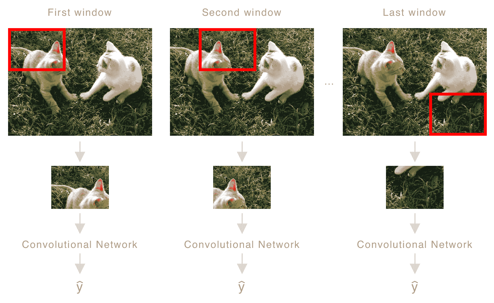

# 在世界中定位物体

到目前为止，我们只限于使用**卷积神经网络**（**CNN**）识别图像中单个最显著的物体。我们看到了如何训练一个模型来接受图像并提取一系列特征图，然后将其输入到**全连接层**以输出一系列类别的概率分布。然后，通过激活层将这些输出解释为对图像中物体的分类，如下所示：


在本章中，我们将在此基础上构建，探讨如何检测和定位单个图像中的多个物体。我们将首先建立对这个过程的理解，然后通过实现一个用于相册应用的图像搜索功能来演示。这个应用允许用户根据图像中存在的物体以及它们之间的相对位置（物体组成）来过滤和排序图像。在这个过程中，我们还将亲身体验 Core ML Tools，这是苹果公司发布的一套工具，用于将流行的**机器学习**（**ML**）框架中的模型转换为 Core ML。

让我们先了解如何在图像中检测多个物体需要哪些条件。

# 目标定位和目标检测

如本章引言中所述，我们已经介绍了使用 CNN 进行目标识别背后的概念。在这种情况下，我们使用一个训练好的模型来执行分类；它通过使用卷积层学习一系列特征图，然后输入到全连接（或密集）层，并通过激活层最终输出，从而给出了每个类别的概率。通过选择概率最大的类别来推断类别。

让我们区分一下目标识别、目标定位和目标检测。目标识别是识别图像中最主要物体的任务，而目标定位则执行分类并预测物体的边界框。目标检测进一步扩展了这一概念，允许检测和定位多个类别，这也是本章的主题。

这个过程被称为**目标识别**，是一个分类问题，但在这里我们并没有获得完整的图像（有意为之）。那么，检测到的物体的位置如何？这将有助于提高机器人系统的感知能力或扩展智能界面的应用范围，例如智能裁剪和图像增强。那么，检测多个物体及其位置呢？前者，检测单个物体的位置，被称为**目标定位**，而后者通常被称为**目标检测**，如下所示：


我们将首先介绍目标定位，然后逐步过渡到目标检测。这些概念是互补的，前者可以看作是目标识别的扩展，这是你已经熟悉的。

当训练用于分类的模型时，我们调整权重以使它们在预测单个类别时达到最小损失。对于目标定位，我们本质上希望扩展这一功能，不仅预测类别，还要预测识别出的对象的位置。让我们通过一个具体的例子来帮助说明这个概念。想象我们正在训练一个模型来识别和定位猫、狗或人。为此，我们的模型需要输出每个类别的概率（猫、狗或人），正如我们之前看到的，还需要它们的定位。这可以用物体的中心 *x* 和 *y* 位置以及宽度和高度来描述。为了简化训练任务，我们还包含一个表示对象是否存在或否的值。以下图展示了两个输入图像及其相关的输出。假设这里我们的独热编码类别顺序为猫、狗和人。也就是说，猫将被编码为 *(1,0,0)*，狗为 *(0,1,0)*，人为 *(**0,0,1)*：


前面图像中显示的输出结构由以下元素组成：


在这里，我们有三个类别，但这可以推广到包括任意数量的类别。值得注意的是，如果没有检测到对象（我们输出的第一个元素），则忽略其余元素。另一个需要强调的重要点是，边界框是用单位而不是绝对值来描述的。

例如，*b[x]* 的值为 *0.5* 将表示图像宽度的一半，其中左上角是 **(0, 0)**，右下角是 **(1, 1)**，如图所示：


我们可以借鉴用于分类的典型 CNN 的很多结构。在那里，图像通过一系列卷积层，其输出是一个特征向量，然后通过一系列全连接层，最后通过 softmax 激活进行多类别分类（给出所有类别的概率分布）。我们不仅可以将卷积层的特征向量传递到单个全连接层，还可以将它们传递到一层（或几层）进行二元分类（第四个元素：对象是否存在）和另一层（或一系列层）来预测边界框，使用回归方法。

这些修改的结构可以在以下图中看到，其中修改的内容用粗体表示：


这是一个好的开始，但我们的图像通常包含许多对象。因此，让我们简要描述如何解决这个问题。

我们现在进入目标检测领域，我们感兴趣的是在单个图像中检测和定位多个对象（不同类别的对象）。到目前为止，我们已经看到如何从图像中检测单个对象及其位置，因此从这个角度来看，逻辑上的下一步是将我们的问题围绕这个架构进行重塑。

我的意思是，我们可以使用这种方法或类似的方法，但不是传递完整的图像，而是可以传递图像的裁剪区域；这些区域是通过在图像上滑动窗口来选择的，如下所示（并且与我们的猫主题保持一致）：



由于显而易见的原因，这被称为**滑动窗口检测算法**，对于那些有计算机视觉经验的人来说应该是熟悉的（在模板匹配等许多应用中使用）。同时，也需要强调训练上的差异；在目标定位中，我们通过传递完整的图像及其相关的输出向量（*b[x]，b[y]，b[w]，h[y]，p[c]，c[1]，c[2]，c[3]，...*）来训练网络，而在这里，网络是在每个对象的**紧密裁剪图像**上训练的，这些图像可能占据我们的窗口大小。

对于好奇的读者想知道这个算法如何检测那些不适合窗口大小的对象，一个方法可能是简单地调整图像的大小（既减小也增大），或者类似地，使用不同大小的窗口，即一组小、中、大窗口。

这种方法有两个主要缺点；第一个是它计算成本高，第二个是由于依赖于窗口大小和步长大小，它不允许非常精确的边界框。前者可以通过重新设计 CNN，使其在单次遍历中执行滑动窗口算法来解决，但我们仍然面临着边界框不准确的问题。

幸运的是，对于 2015 年的我们，J. Redmon、S. Divvala、R. Girshick 和 A. Farhadi 发布了他们的论文《你只需看一次（YOLO）：统一、实时目标检测》。它描述了一种只需要单个网络的方法，该网络能够在单次遍历中从完整图像中预测边界框和概率。由于它是一个统一的流程，整个过程足够高效，可以在实时中进行，因此我们本章使用的网络就是这样的。

论文《你只需看一次：统一、实时目标检测》的链接如下：[`arxiv.org/abs/1506.02640`](https://arxiv.org/abs/1506.02640)。

让我们花些时间熟悉 YOLO 算法，我们将简要了解算法的一般概念和输出解释，以便在后续章节的示例应用中使用。

与本章中我们讨论的先前方法相比，YOLO 的一个主要区别在于模型的训练方式。与第一个方法类似，当引入目标定位时，模型是在图像和标签对上训练的，标签的元素包括(*b[x]*, *b[y]*, *b[w]*, *b[h]*, *p[c]*, *c[1]*, *c[2]*, ...)，YOLO 网络也是如此。但是，YOLO 网络不是在整张图像上训练，而是将图像分解成网格，每个单元格都有一个相关的标签，正如之前概述的那样。在下一张图中，你可以看到这一点。这里展示的网格是一个 3 x 3 的，为了可读性；这些通常更密集，正如你很快就会看到的：


在训练时，我们输入图像，网络结构使得它为每个网格单元格输出一个**向量**（如之前所示）。为了使这一点更具体，以下图展示了这些输出中的一些是如何在这个网格的单元格中呈现的：


这应该对你来说很熟悉，因为正如之前提到的，这与我们最初介绍的目标定位方法非常相似。唯一的重大区别是，它是在每个网格单元格上进行的，而不是在整个图像上。

值得注意的是，尽管对象跨越多个单元格，但训练样本只使用单个单元格（通常是图像中心的单元格）来标记对象，其他包含单元格没有分配给任何对象。

在我们继续之前，让我们来解释一下边界框变量。在先前的图中，我为每个对象输入了近似值；就像目标定位一样，这些值在单元格内的值之间归一化到*0.0*和*1.0*。但是，与目标定位不同，这些值是**局部**于单元格本身的，而不是图像。以第一只猫为例，我们可以看到它在*x*轴上的中心位置是*0.6*，在*y*轴上的中心位置是*0.35*；这可以解释为在单元格*x*轴上的位置是 60%，在单元格*y*轴上的位置是 35%。因为我们的边界框超出了单元格，所以分配的值大于一，正如我们在先前的图中看到的：


之前，我们强调训练样本只为每个对象分配一个单元格，但鉴于我们在每个单元格上运行对象检测和定位，我们很可能会得到多个预测。为了管理这一点，YOLO 使用了一种称为**非极大值抑制**的方法，我们将在接下来的几段中介绍，你将在即将到来的示例中实现它。

如前所述，因为我们对每个网格单元格执行对象检测和定位，所以我们最终可能会得到多个边界框。这在下图中显示。为了简化说明，我们只关注一个对象，但当然这也适用于所有检测到的对象：


在先前的图中，我们可以看到网络在三个单元格中预测并定位了猫。对于每个单元格，我在它们相关的边界框的右上角添加了一个虚构的置信值。

**置信值**是通过将对象存在概率（*p[c]*）与最可能的类别相乘来计算的，即概率最高的类别。

非极大值抑制的第一步很简单，就是过滤掉不满足一定阈值的预测；从所有目的来看，让我们将我们的对象阈值设为*0.3*。使用这个值，我们可以看到我们过滤掉了一个预测（置信值为*0.2*），留下我们只有两个，如下图所示：


在下一步中，我们遍历所有检测到的框，从置信度最高的框到最低的框，移除任何占用相同空间的其它边界框。在先前的图中，我们可以清楚地看到这两个边界框实际上占用了相同的空间，但我们如何程序化地确定这一点呢？

为了确定这一点，我们计算所谓的**交并比**（**IoU**）并将返回值与一个阈值进行比较。正如其名所示，我们通过将两个边界框的**交集面积**除以它们的**并集面积**来计算这个值。值为*1.0*告诉我们两个边界框正好占用了相同的空间（如果你使用单个边界框自身进行此计算，你会得到这个值）。任何低于此值的都给出了重叠占用的比率；一个典型的阈值是*0.5*。下图说明了我们示例的交集和并集面积：


由于这两个边界框的交并比（IoU）相对较高，我们将剪除最不可能的框（置信度分数较低的框），最终得到一个单一的边界框，如下图所示：


我们重复此过程，直到遍历了模型的所有预测。在进入本章的示例项目并开始编写代码之前，还有一个概念需要介绍。

到目前为止，我们假设（或受限于这种想法）每个单元格都与没有对象或单个对象相关联。但是，对于两个对象重叠的情况，即两个对象的重心位置占据相同的网格单元格，又该如何处理呢？为了处理这种情况，YOLO 算法实现了一种称为**锚框**的东西。锚框允许在边界形状不同的情况下，多个对象占据单个网格单元格。让我们通过直观的解释来使这一点更加具体。在下一张图中，我们有一个图像，其中两个对象的重心占据相同的网格单元格。根据我们当前的输出向量，我们需要将单元格标记为人物或自行车，如下所示：


锚框的思路是我们将输出向量扩展到包括不同类型的锚框（在此处表示为两个，但实际上可以是任何数量）。这允许每个单元格编码多个对象，只要它们的边界形状不同。

从上一张图中，我们可以看到我们可以使用两个锚框，一个用于人物，另一个用于自行车，如下所示：


现在我们已经定义了锚框，我们将向量输出扩展，以便对于每个网格单元格，我们可以编码两个锚框的输出，如下所示：


每个锚框可以独立于同一单元格和其他单元格的任何其他输出进行处理；也就是说，我们处理它的方式与之前完全相同，唯一的增加是我们现在有更多的边界框需要处理。

为了澄清，尽管某些形状比其他形状更适合，但锚框并不局限于特定的类别。它们通常是使用某种无监督学习算法（如**k-means**）在现有数据集中找到的典型通用形状。

这就结束了我们需要理解本章示例的所有概念以及我们将在接下来的章节中实现的内容，但在我们这样做之前，让我们通过使用 Core ML Tools Python 包将 Keras 模型转换为 Core ML 的过程进行回顾。

# 将 Keras Tiny YOLO 转换为 Core ML

在上一节中，我们讨论了本章将使用的模型和算法的概念。在本节中，我们将通过使用苹果的 Core ML Tools Python 包将训练好的 Tiny YOLO Keras 模型转换为 Core ML，从而更接近实现本章的示例项目；但在这样做之前，我们将简要讨论该模型及其训练所使用的数据。

YOLO 是在一个名为**darknet**的神经网络框架上构思的，目前默认的 Core ML 工具包不支持它；幸运的是，YOLO 和 darknet 的作者已经在他们的网站上公开了训练模型的架构和权重，网址为[`pjreddie.com/darknet/yolov2/`](https://pjreddie.com/darknet/yolov2/)。YOLO 有一些变体，它们是在**Common Objects in Context**（**COCO**）数据集上训练的，该数据集包含 80 个类别，或者是在 PASCAL **Visual Object Classes**（**VOC**）Challenge 2007 上训练的，该挑战包含 20 个类别。

官方网站可以在[`cocodataset.org`](http://cocodataset.org)找到，*The PASCAL VOC Challenge 2007*的网站在[`host.robots.ox.ac.uk/pascal/VOC/index.html`](http://host.robots.ox.ac.uk/pascal/VOC/index.html)。

在本章中，我们将使用 YOLOv2 的 Tiny 版本以及从*The PASCAL VOC Challenge 2007*数据集上训练的模型权重。我们将使用的 Keras 模型是基于官方网站上可用的配置文件和权重构建的（之前提供的链接）。

如同往常，我们将省略模型的大部分细节，而是以图表形式提供模型，如下所示。然后我们将讨论一些相关部分，然后再将其转换为 Core ML 模型：


首先要注意的是输入和输出的形状；这表明我们的模型将期望输入什么，以及它将输出什么供我们使用。如前所述，输入大小是 416 x 416 x 3，这正如你可能所怀疑的，是一个 416 x 416 的 RGB 图像。输出形状需要更多的解释，当我们到达本章的示例编码时，它将变得更加明显。

输出形状是 13 x 13 x 125。13 x 13 告诉我们应用网格的大小，也就是说，416 x 416 的图像被分割成 13 x 13 的单元格，如下所示：


如前所述，每个单元都有一个 125*-*向量的编码，表示对象存在的概率，如果存在，则包括边界框和所有 20 个类别的概率；直观上，这可以这样解释：


我想要强调的关于这个模型的最后一个要点是其简洁性；网络的大部分由由卷积层组成的卷积块构成：**批量归一化**、**LeakyReLU**激活，最后是一个**最大池化**层。这逐渐增加了网络的滤波器大小（深度），直到达到所需的网格大小，然后仅使用卷积层、**批量归一化**和**LeakyReLU**激活来转换数据，并丢弃**最大池化**。

现在，我们介绍了批归一化和漏斗 ReLU 等术语，这些可能对一些人来说不熟悉；在这里，我将简要描述每个术语，从批归一化开始。在将输入层馈送到网络之前对其进行归一化被认为是最佳实践。例如，我们通常将像素值除以 255，将它们强制进入 0 到 1 的范围。我们这样做是为了使网络更容易学习，通过消除任何大值（或值的较大方差），这可能导致我们在训练过程中调整权重时网络发生振荡。批归一化对隐藏层的输出而不是输入执行相同的调整。

ReLU 是一个激活函数，将所有小于 0 的值设置为 0，即它不允许非正值在网络中传播。漏斗 ReLU 提供了 ReLU 的较宽松实现，当神经元不活跃时允许一个小的非零梯度通过。

这就结束了我们对模型的简要概述。您可以从 J. Redmon 和 A. Farhadi 的官方论文《YOLO9000：更好、更快、更强》中了解更多信息，该论文可在[`arxiv.org/abs/1612.08242`](https://arxiv.org/abs/1612.08242)找到。现在，让我们将注意力转向将训练好的 Tiny YOLO Keras 模型转换为 Core ML。

如第一章《机器学习导论》中所述，Core ML 更像是工具套件而不是单一框架。套件的一部分是 Core ML Tools Python 包，它帮助将其他框架训练的模型转换为 Core ML，以便于快速集成。目前，官方转换器支持 Caffe、Keras、LibSVM、scikit-learn 和 XGBoost，但该包是开源的，为其他流行的机器学习框架提供了许多其他转换器，例如 TensorFlow。

转换过程的核心是生成一个模型规范，它是学习模型的机器可解释表示，并由 Xcode 用于生成 Core ML 模型，包括以下内容：

+   **模型描述**：编码模型输入和输出的名称和类型信息

+   **模型参数**：表示模型特定实例所需的一组参数（模型权重/系数）

+   **附加元数据**：关于模型来源、许可和作者的信息

在本章中，我们展示了最简单的流程，但我们将回顾第六章 Creating Art with Style Transfer 中的 Core ML Tools 包，以了解如何处理自定义层。

为了避免在本地或远程机器上设置环境时出现任何复杂性，我们将利用微软提供的免费 Jupyter 云服务。请访问[`notebooks.azure.com`](https://notebooks.azure.com)并登录，或者如果您还没有，请注册。

登录后，点击导航栏中的“库”菜单链接，这将带您到一个包含所有库列表的页面，类似于以下截图所示：


接下来，点击“+新建库”链接以打开创建新库对话框：


然后点击“从 GitHub”标签，并在 GitHub 仓库字段中输入`https://github.com/packtpublishing/machine-learning-with-core-ml`。之后，为您的库起一个有意义的名称，并点击导入按钮以开始克隆仓库并创建库的过程。

创建库后，您将被重定向到根目录；从这里，点击`Chapter5/Notebooks`文件夹以打开本章的相关文件夹。最后，点击笔记本`Tiny YOLO_Keras2CoreML.ipynb`。为了确保我们都在同一页面上（有意为之），以下是点击`Chapter5/Notebooks`文件夹后您应该看到的截图：


现在我们已经加载了笔记本，是时候逐个检查每个单元格以创建我们的 Core ML 模型了；所有必要的代码都已存在，剩下的只是依次执行每个单元格。要执行一个单元格，您可以使用快捷键*Shift* + *Enter*，或者点击工具栏中的运行按钮（这将运行当前选定的单元格），如下面的截图所示：


我将对每个单元格的功能进行简要说明；确保我们在浏览它们时执行每个单元格，这样我们最终都会得到转换后的模型，然后我们将下载并用于下一节的 iOS 项目。

我们首先通过运行以下单元格来确保环境中可用 Core ML Tools Python 包：

```py
!pip install coremltools
```

安装完成后，我们通过导入它来使包可用：

```py
import coremltools
```

模型架构和权重已序列化并保存到文件`tinyyolo_voc2007_modelweights.h5`中；在下面的单元格中，我们将将其传递给 Keras 转换器的转换函数，该函数将返回转换后的 Core ML 模型（如果无错误发生）。除了文件外，我们还传递了`input_names`、`image_input_names`、`output_names`和`image_scale`参数的值。`input_names`参数接受单个字符串或字符串列表（用于多个输入），并用于在 Core ML 模型的接口中显式设置用于引用 Keras 模型输入的名称。

我们还将此输入名称传递给`image_input_names`参数，以便转换器将输入视为图像而不是 N 维数组。与`input_names`类似，传递给`output_names`的值将在 Core ML 模型的界面中用于引用 Keras 模型的输出。最后一个参数`image_scale`允许我们在将输入传递给模型之前添加一个缩放因子。在这里，我们将每个像素除以 255，这迫使每个像素处于*0.0*到*1.0*的范围内，这是处理图像时的典型预处理任务。还有许多其他参数可供选择，允许您调整和微调模型的输入和输出。您可以在官方文档网站上了解更多信息，网址为[`apple.github.io/coremltools/generated/coremltools.converters.keras.convert.html`](https://apple.github.io/coremltools/generated/coremltools.converters.keras.convert.html)。在下一个片段中，我们将使用我们刚刚讨论的内容进行实际转换：

```py
coreml_model = coremltools.converters.keras.convert(
    'tinyyolo_voc2007_modelweights.h5',
    input_names='image',
    image_input_names='image',
    output_names='output',
    image_scale=1./255.)
```

参考转换后的模型`coreml_model`，我们添加了元数据，这些数据将在 Xcode 的 ML 模型视图中提供和显示：

```py
coreml_model.author = 'Joshua Newnham'
coreml_model.license = 'BSD'
coreml_model.short_description = 'Keras port of YOLOTiny VOC2007 by Joseph Redmon and Ali Farhadi'
coreml_model.input_description['image'] = '416x416 RGB Image'
coreml_model.output_description['output'] = '13x13 Grid made up of: [cx, cy, w, h, confidence, 20 x classes] * 5 bounding boxes'
```

我们现在准备好保存我们的模型；运行最后的单元格以保存转换后的模型：

```py
coreml_model.save('tinyyolo_voc2007.mlmodel')
```

现在我们已经保存了我们的模型，我们回到之前显示`Chapter5`目录内容的标签页，并下载`tinyyolo_voc2007.mlmodel`文件。我们可以通过右键点击它并选择下载菜单项，或者点击下载工具栏项来完成，如下面的截图所示：


拥有我们转换后的模型在手，现在是时候跳入 Xcode 并处理本章的示例项目了。

# 使查找照片变得更简单

在本节中，我们将把我们的模型应用于智能搜索应用中；我们首先快速介绍该应用，以便我们清楚地了解我们想要构建的内容。然后，我们将实现与解释模型输出和搜索启发式相关联的功能。我们将省略许多常规的 iOS 功能，以便我们能够专注于应用程序的智能方面。

在过去的几年里，我们看到了智能在相册应用中的大量嵌入，为我们提供了高效的方法来展示那些隐藏在数百（如果不是数千）张我们多年来积累的照片中的猫照片。在本节中，我们希望继续这一主题，但通过利用通过目标检测获得的语义信息，将智能水平提升一点。我们的用户将能够搜索图像中的特定对象，以及基于对象及其相对位置的照片。例如，他们可以搜索两个人并排站立在车前的图像或图像。

用户界面允许用户绘制他们希望定位的对象及其相对大小。在本节中，我们的任务是实现基于这些搜索标准的智能，以返回相关图像。

下一个图示显示了用户界面；前两个截图显示了搜索屏幕，用户可以在其中直观地表达他们想要寻找的内容。通过使用标记的边界框，用户能够描述他们想要寻找的内容，他们希望如何排列这些对象以及相对对象的大小。最后两个截图显示了搜索结果，当展开（最后一个截图）时，图像将叠加检测到的对象及其关联的边界框：


在导入我们刚刚转换和下载的模型之前，让我们先浏览一下现有的项目。

如果您还没有做，请从配套仓库中拉取最新代码：[`github.com/packtpublishing/machine-learning-with-core-ml`](https://github.com/packtpublishing/machine-learning-with-core-ml)。下载完成后，导航到目录 `Chapter5/Start/` 并打开项目 `ObjectDetection.xcodeproj`。加载后，您将看到本章的项目，如下面的截图所示：


我将把探索整个项目作为您的练习，而我会专注于本节中的文件 `PhotoSearcher.swift` 和 `YOLOFacade.swift`。`PhotoSearcher.swift` 是我们将实现负责根据搜索标准和 `YOLOFacade.swift` 中检测到的对象过滤和排序照片的成本函数的地方，`YOLOFacade.swift` 的唯一目的是封装 Tiny YOLO 模型并实现解释其输出的功能。但在深入代码之前，让我们快速回顾一下我们将要工作的流程和数据结构。

下面的图示说明了应用程序的一般流程；用户首先通过 `SearchViewController` 定义搜索标准，该控制器被描述为一个包含归一化 `ObjectBounds` 的数组。我们稍后会详细介绍这些内容。当用户启动搜索（右上角的搜索图标）时，这些标准会被传递给 `SearchResultsViewController`，它将找到合适图像的任务委托给 `PhotoSearcher`。

`PhotoSearcher` 继续遍历我们所有的照片，将每一张照片通过 `YOLOFacade` 进行对象检测，使用我们在上一节中转换的模型。这些结果被传回 `PhotoSearcher`，它根据搜索标准评估每一项的成本，然后过滤和排序结果，最后将它们传回 `SearchResultsViewController` 以供显示：


每个组件都通过数据对象 `ObjectBounds` 或 `SearchResult` 与另一个组件进行通信。因为我们将在本章的其余部分使用它们，所以让我们快速介绍它们，所有这些都在 `DataObjects.swift` 文件中定义。让我们从以下片段中的 `ObjectBounds` 开始：

```py
struct ObjectBounds {
    public var object : DetectableObject
    public var origin : CGPoint
    public var size : CGSize

    var bounds : CGRect{
        return CGRect(origin: self.origin, size: self.size)
    }
}    
```

如其名所示，`ObjectBounds` 正是这样——它使用 `origin` 和 `size` 变量封装了对象的边界。`object` 本身是 `DetectableObject` 类型，它提供了一个结构来存储类索引及其关联的标签。它还提供了一个静态对象数组，这些对象可用于我们的搜索，如下所示：

```py
struct DetectableObject{
    public var classIndex : Int
    public var label : String

    static let objects = [
        DetectableObject(classIndex:19, label:"tvmonitor"),
        DetectableObject(classIndex:18, label:"train"),
        DetectableObject(classIndex:17, label:"sofa"),
        DetectableObject(classIndex:14, label:"person"),
        DetectableObject(classIndex:11, label:"dog"),
        DetectableObject(classIndex:7, label:"cat"),
        DetectableObject(classIndex:6, label:"car"),
        DetectableObject(classIndex:5, label:"bus"),
        DetectableObject(classIndex:4, label:"bottle"),
        DetectableObject(classIndex:3, label:"boat"),
        DetectableObject(classIndex:2, label:"bird"),
        DetectableObject(classIndex:1, label:"bicycle")
    ]
}
```

`ObjectBounds` 用于用户定义的搜索标准和 `YOLOFacade` 返回的搜索结果；在前者中，它们描述了用户感兴趣寻找的位置和对象（搜索标准），而在后者中，它们封装了对象检测的结果。

`SearchResult` 并不复杂；它的目的是封装搜索结果，并添加图像和成本，这些成本在成本评估阶段（*步骤 8*）设置，如前图所示。对于完整的代码，结构如下：

```py
struct SearchResult{
    public var image : UIImage  
    public var detectedObjects : [ObjectBounds]
    public var cost : Float
}
```

值得注意的是，在之前的图中，用词 **Normalized** 注释的 `ObjectBounds` 消息，指的是基于源或目标大小的单位值；也就是说，*x = 0.5* 和 *y = 0.5* 的原点定义了源图像的中心。这样做是为了确保边界不受它们操作图像变化的影响。你很快就会看到，在将图像传递给我们的模型之前，我们需要将其调整大小并裁剪到 416 x 416 的大小（这是我们模型的预期输入），但我们需要将它们转换回原始大小以渲染结果。

现在，我们对我们将消费和生成哪些对象有了更好的了解；让我们继续实现 `YOLOFacade` 并逐步构建。

让我们从导入上一节中刚刚转换的模型开始；找到下载的 `.mlmodel` 文件并将其拖放到 Xcode 中。导入后，从左侧面板中选择它以检查元数据，以便提醒自己需要实现的内容。它应该类似于以下截图：


现在我们已经导入了模型，让我们来了解 `YOLOFacade` 负责的功能实现；这包括预处理图像，将其传递给我们的模型进行推理，然后解析模型的输出，包括执行 **非最大值抑制**。从左侧面板中选择 `YOLOFacade.swift` 以在主窗口中显示代码。

该类通过扩展分为三个部分，第一部分包括变量和入口点；第二部分包括执行推理和解析模型输出的功能；第三部分包括我们在本章开头讨论的非最大抑制算法。让我们从开始的地方开始，目前看起来是这样的：

```py
class YOLOFacade{

    // TODO add input size (of image)
    // TODO add grid size
    // TODO add number of classes
    // TODO add number of anchor boxes
    // TODO add anchor shapes (describing aspect ratio)

    lazy var model : VNCoreMLModel? = {
        do{
            // TODO add model
            return nil
        } catch{
            fatalError("Failed to obtain tinyyolo_voc2007")
        }
    }()

    func asyncDetectObjects(
        photo:UIImage,
        completionHandler:@escaping (_ result:[ObjectBounds]?) -> Void){

        DispatchQueue.global(qos: .background).sync {

            self.detectObjects(photo: photo, completionHandler: { (result) -> Void in
                DispatchQueue.main.async {
                    completionHandler(result)
                }
            })
        }
    }

}  
```

`asyncDetectObjects`方法是类的入口点，由`PhotoSearcher`在接收到来自 Photos 框架的每一张图片时调用；当被调用时，此方法简单地委托任务到后台的`detectObject`方法，并等待结果，然后将它们传递回主线程上的调用者。我已经用`TODO`注释了这个类，以帮助您保持专注。

让我们先声明模型所需的目标大小；这将用于预处理模型的输入并将归一化边界转换为源图像的尺寸。添加以下代码：

```py
// TODO add input size (of image)
var targetSize = CGSize(width: 416, height: 416)
```

接下来，我们定义模型在输出解析过程中使用的属性；这些包括网格大小、类别数量、锚框数量，以及每个锚框的尺寸（每一对分别描述宽度和高度）。对您的`YOLOFacade`类进行以下修改：

```py
// TODO add grid size
let gridSize = CGSize(width: 13, height: 13)
// TODO add number of classes
let numberOfClasses = 20
// TODO add number of anchor boxes
let numberOfAnchorBoxes = 5
// TODO add anchor shapes (describing aspect ratio)
let anchors : [Float] = [1.08, 1.19, 3.42, 4.41, 6.63, 11.38, 9.42, 5.11, 16.62, 10.52]
```

现在让我们实现模型属性；在这个例子中，我们将利用 Vision 框架来处理预处理。为此，我们需要将我们的模型包装在一个`VNCoreMLModel`实例中，这样我们就可以将其传递给`VNCoreMLRequest`；按照以下所示进行以下修改，加粗显示：

```py
lazy var model : VNCoreMLModel = {
    do{
        // TODO add model
        let model = try VNCoreMLModel(
 for: tinyyolo_voc2007().model)
 return model
    } catch{
        fatalError("Failed to obtain tinyyolo_voc2007")
    }
}()
```

现在让我们将注意力转向`detectObjects`方法。它将负责通过`VNCoreMLRequest`和`VNImageRequestHandler`进行推理，将模型的输出传递给`detectObjectsBounds`方法（我们将在下一章中介绍），并将归一化边界转换为原始（源）图像的尺寸。

在本章中，我们将推迟对 Vision 框架类（`VNCoreMLModel`、`VNCoreMLRequest`和`VNImageRequestHandler`）的讨论，直到下一章，届时我们将简要说明每个类的作用以及它们是如何协同工作的。

在`YOLOFacade`类的`detectObjects`方法中，将注释`// TODO preprocess image and pass to model`替换为以下代码：

```py
let request = VNCoreMLRequest(model: self.model)
request.imageCropAndScaleOption = .centerCrop

let handler = VNImageRequestHandler(cgImage: cgImage, options: [:])

do {
    try handler.perform([request])
} catch {
    print("Failed to perform classification.\n\(error.localizedDescription)")
    completionHandler(nil)
    return
}
```

在前面的代码片段中，我们首先创建了一个`VNCoreMLRequest`实例，并将我们的模型传递给它，该模型本身已经被一个`VNCoreMLModel`实例包装。这个请求执行了繁重的工作，包括预处理（由模型的元数据推断）和执行推理。我们将它的`imageCropAndScaleOption`属性设置为`centerCrop`，正如你可能预期的，这决定了图像如何调整大小以适应模型输入。请求本身并不实际执行任务；这是`VNImageRequestHandler`的责任，我们通过传递我们的源图像并执行处理器的`perform`方法来声明它。

如果一切按计划进行，我们应该期望通过请求的结果属性获得模型的输出。让我们继续到最后一个代码片段；将注释`// TODO pass models results to detectObjectsBounds(::)`和随后的语句`completionHandler(nil)`替换为以下代码：

```py
guard let observations = request.results as? [VNCoreMLFeatureValueObservation] else{
    completionHandler(nil)
    return
}

var detectedObjects = [ObjectBounds]()

for observation in observations{
    guard let multiArray = observation.featureValue.multiArrayValue else{
        continue
    }

    if let observationDetectedObjects = self.detectObjectsBounds(array: multiArray){

        for detectedObject in observationDetectedObjects.map(
            {$0.transformFromCenteredCropping(from: photo.size, to: self.targetSize)}){
                detectedObjects.append(detectedObject)
        }
    }
}

completionHandler(detectedObjects) 
```

我们首先尝试将结果转换为`VNCoreMLFeatureValueObservation`数组，这是一种图像分析观察类型，它提供键值对。其中之一是`multiArrayValue`，然后我们将其传递给`detectObjectsBounds`方法以解析输出并返回检测到的对象及其边界框。一旦`detectObjectsBounds`返回，我们就使用`ObjectBounds`方法的`transformFromCenteredCropping`将每个结果映射，该方法负责将归一化边界转换为源图像的空间。一旦每个边界都被转换，我们就调用完成处理程序，传递检测到的边界。

下两个方法封装了 YOLO 算法的大部分内容和此类的大部分代码。让我们从`detectObjectsBounds`方法开始，逐步进行。

此方法将接收一个形状为*(125, 13, 13)*的`MLMultiArray`；这应该对你来说很熟悉（尽管是反过来的），其中*(13, 13)*是我们网格的大小，而 125 编码了五个块（与我们的五个锚框相对应），每个块包含边界框、对象存在的概率（或不存在）以及跨越 20 个类别的概率分布。为了方便起见，我再次添加了说明此结构的图解：


为了提高性能，我们将直接访问`MLMultiArray`的原始数据，而不是通过`MLMultiArray`下标。虽然直接访问给我们带来了性能提升，但它也有一个权衡，即我们需要正确计算每个值的索引。让我们定义我们将用于计算这些索引的常量，以及获取对原始数据缓冲区和一些用于存储中间结果的数组的访问权限；在你的`detectObjectsBounds`方法中添加以下代码：

```py
let gridStride = array.strides[0].intValue
let rowStride = array.strides[1].intValue
let colStride = array.strides[2].intValue

let arrayPointer = UnsafeMutablePointer<Double>(OpaquePointer(array.dataPointer))

var objectsBounds = [ObjectBounds]()
var objectConfidences = [Float]() 
```

如前所述，我们首先定义了网格、行和列的步长常量，每个常量都用于计算当前值。这些值通过`MLMultiArray`的`strides`属性获得，它给出了每个维度的数据元素数量。在这种情况下，这将是 125、13 和 13。接下来，我们获取`MLMultiArray`的底层缓冲区的引用，最后，我们创建两个数组来存储边界和相关的置信度值。

接下来，我们想要遍历模型的输出并独立处理每个网格单元及其后续的锚框；我们通过使用三个嵌套循环并计算相关索引来实现这一点。让我们通过添加以下代码片段来完成这个任务：

```py
for row in 0..<Int(gridSize.height) {
    for col in 0..<Int(gridSize.width) {
        for b in 0..<numberOfAnchorBoxes {

            let gridOffset = row * rowStride + col * colStride
            let anchorBoxOffset = b * (numberOfClasses + numberOfAnchorBoxes)
            // TODO calculate the confidence of each class, ignoring if under threshold 
        }
    }
}
```

这里重要的值是`gridOffset`和`anchorBoxOffset`；`gridOffset`给出了特定网格单元的相关偏移量（正如其名称所暗示的），而`anchorBoxOffset`给出了相关锚框的索引。现在我们有了这些值，我们可以使用`(anchorBoxOffset + INDEX_TO_VALUE) * gridStride + gridOffset` 索引来访问每个元素，其中`INDEX_TO_VALUE`是我们想要访问的锚框向量中的相关值，如图所示：

![图片

现在我们知道了如何访问我们缓冲区中每个网格单元的每个边界框，让我们用它来找到最可能的类别，并在我们的第一次测试中忽略任何未达到我们阈值（定义为方法参数，默认值为 0.3*：`objectThreshold:Float = 0.3`）的预测。添加以下代码，替换掉之前的注释`// TODO calculate the confidence of each class, ignoring if under threshold`：

```py
let confidence = sigmoid(x: Float(arrayPointer[(anchorBoxOffset + 4) * gridStride + gridOffset]))

var classes = Array<Float>(repeating: 0.0, count: numberOfClasses)
for c in 0..<numberOfClasses{
    classes[c] = Float(arrayPointer[(anchorBoxOffset + 5 + c) * gridStride + gridOffset])
}
classes = softmax(z: classes)

let classIdx = classes.argmax
let classScore = classes[classIdx]
let classConfidence = classScore * confidence

if classConfidence < objectThreshold{
    continue
}

// TODO obtain bounding box and transform to image dimensions 
```

在前面的代码片段中，我们首先获取一个对象存在的概率并将其存储在常量`confidence`中。然后，我们用一个包含所有类别概率的数组填充数组，在它们之上应用 softmax。这将压缩这些值，使得它们的累积值等于*1.0*，本质上为我们提供了所有类别的概率分布。

然后，我们找到概率最大的类别索引，并将其与我们的`confidence`常量相乘，这给了我们我们将要阈值化并用于非极大值抑制的类别置信度。如果预测未达到我们的阈值，我们将忽略该预测。

在继续进行程序之前，我想快速地绕道一下，突出并解释一下前面代码片段中使用的一些方法，即`softmax`方法和类数组中的`argmax`属性。Softmax 是一种逻辑函数，它本质上将一个数字向量压缩，使得向量中的所有值加起来等于 1；它是一种在处理多类分类问题时常用的激活函数，其中结果被解释为每个类的可能性，通常将具有最大值的类作为预测类（在阈值内）。实现可以在`Math.swift`文件中找到，该文件利用 Accelerate 框架来提高性能。为了完整性，这里展示了方程和实现，但细节被省略，留给您去探索：


在这里，我们使用了一个略微修改过的之前显示的方程；在实践中，如果任何值非常大，计算 softmax 值可能会出现问题。对它应用指数运算会使它爆炸，而将任何值除以一个巨大的值可能会导致算术计算问题。为了避免这种情况，通常最好的做法是从所有元素中减去最大值。

因为有相当多的函数用于这个操作，让我们从内到外逐步构建。以下是一个执行逐元素减法的函数：

```py
/**
 Subtract a scalar c from a vector x
 @param x Vector x.
 @param c Scalar c.
 @return A vector containing the difference of the scalar and the vector
 */
public func sub(x: [Float], c: Float) -> [Float] {
    var result = (1...x.count).map{_ in c} 
    catlas_saxpby(Int32(x.count), 1.0, x, 1, -1.0, &amp;result, 1) 
    return result
}
```

接下来，计算数组逐元素指数的函数：

```py
/**
 Perform an elementwise exponentiation on a vector 
 @param x Vector x.
 @returns A vector containing x exponentiated elementwise.
 */
func exp(x: [Float]) -> [Float] {
    var results = Float 
    vvexpf(&amp;results, x, [Int32(x.count)]) 
    return results
}
```

现在，执行数组求和的函数，如下所示：

```py
/**
 Compute the vector sum of a vector
 @param x Vector.
 @returns A single precision vector sum.
 */
public func sum(x: [Float]) -> Float {
    return cblas_sasum(Int32(x.count), x, 1)
}
```

这是 softmax 函数使用的最后一个函数！它将负责对给定的标量执行逐元素除法，如下所示：

```py
 /**
 Divide a vector x by a scalar y
 @param x Vector x.
 @parame c Scalar c.
 @return A vector containing x dvidided elementwise by vector c.
 */
public func div(x: [Float], c: Float) -> [Float] {
    let divisor = Float
    var result = Float 
    vvdivf(&amp;result, x, divisor, [Int32(x.count)]) 
    return result
}
```

最后，我们使用 softmax 函数（使用之前描述的 max 技巧）：

```py
/**
 Softmax function
 @param z A vector z.
 @return A vector y = (e^z / sum(e^z))
 */
func softmax(z: [Float]) -> [Float] {
    let x = exp(x:sub(x:z, c: z.maxValue))    
    return div(x:x, c: sum(x:x))
}
```

除了前面提到的函数之外，它还使用 Swift 数组类的扩展属性`maxValue`；这个扩展还包括之前提到的`argmax`属性。因此，我们将它们一起在下面的代码片段中展示，该片段位于`Array+Extension.swift`文件中。在展示代码之前，提醒一下`argmax`属性的功能——它的目的是返回数组中最大值的索引，这是 Python 包 NumPy 中常见的方法：

```py
extension Array where Element == Float{

    /**
     @return index of the largest element in the array
     **/
    var argmax : Int {
        get{
            precondition(self.count > 0)

            let maxValue = self.maxValue
            for i in 0..<self.count{
                if self[i] == maxValue{
                    return i
                }
            }
            return -1
        }
    }

    /**
     Find the maximum value in array
     */
    var maxValue : Float{
        get{
            let len = vDSP_Length(self.count)

            var max: Float = 0
            vDSP_maxv(self, 1, &amp;max, len)

            return max
        }
    }
}
```

现在，让我们将注意力转回到模型输出的解析和提取检测到的对象及其关联的边界框。在循环中，我们现在有一个我们相当有信心的预测，因为它已经通过了我们的阈值过滤器。下一个任务是提取和转换预测对象的边界框。添加以下代码，替换掉`// TODO obtain bounding box and transform to image dimensions`这一行：

```py
let tx = CGFloat(arrayPointer[anchorBoxOffset * gridStride + gridOffset])
let ty = CGFloat(arrayPointer[(anchorBoxOffset + 1) * gridStride + gridOffset])
let tw = CGFloat(arrayPointer[(anchorBoxOffset + 2) * gridStride + gridOffset])
let th = CGFloat(arrayPointer[(anchorBoxOffset + 3) * gridStride + gridOffset])

let cx = (sigmoid(x: tx) + CGFloat(col)) / gridSize.width 
let cy = (sigmoid(x: ty) + CGFloat(row)) / gridSize.height
let w = CGFloat(anchors[2 * b + 0]) * exp(tw) / gridSize.width 
let h = CGFloat(anchors[2 * b + 1]) * exp(th) / gridSize.height

// TODO create a ObjectBounds instance and store it in our array of candidates  
```

我们首先从网格单元的锚框段获取前四个值；这返回了相对于网格的中心位置和大小。下一个块负责将这些值从网格坐标系转换到图像坐标系。对于中心位置，我们通过一个`sigmoid`函数传递返回的值，使其保持在*0.0 - 1.0*之间，并根据相关列（或行）进行偏移。最后，我们将其除以网格大小（13）。同样，对于尺寸，我们首先获取相关的锚框，将其乘以预测尺寸的指数，然后除以网格大小。

如前所述，我现在提供函数`sigmoid`的实现，供参考，该函数可以在`Math.swift`文件中找到。方程如下：


```py
/**
 A sigmoid function 
 @param x Scalar
 @return 1 / (1 + exp(-x))
 */
public func sigmoid(x: CGFloat) -> CGFloat {
    return 1 / (1 + exp(-x))
}
```

代码的最后部分只是创建了一个`ObjectBounds`实例，传递了转换后的边界框和相关的`DetectableObject`类（根据类索引进行过滤）。添加以下代码，替换注释`// TODO create a ObjectBounds instance and store it in our array of candidates`：

```py
guard let detectableObject = DetectableObject.objects.filter(
    {$0.classIndex == classIdx}).first else{
    continue
}

let objectBounds = ObjectBounds(
    object: detectableObject,
    origin: CGPoint(x: cx - w/2, y: cy - h/2),
    size: CGSize(width: w, height: h))

objectsBounds.append(objectBounds)
objectConfidences.append(classConfidence)
```

除了存储`ObjectBounds`之外，我们还存储`confidence`，这将在我们实现非极大值抑制时使用。

这完成了嵌套循环内所需的功能；到这个过程结束时，我们有一个填充了候选检测对象的数组。我们的下一个任务将是过滤它们。在`detectObjectsBounds`方法的末尾，添加以下语句（在任意循环之外）：

```py
return self.filterDetectedObjects(
    objectsBounds: objectsBounds,
    objectsConfidence: objectConfidences)
```

在这里，我们只是返回`filterDetectedObjects`方法的结果，我们现在将关注这个方法。该方法已被屏蔽，但尚未实现任何功能，如下所示：

```py
func filterDetectedObjects(
    objectsBounds:[ObjectBounds],
    objectsConfidence:[Float],
    nmsThreshold : Float = 0.3) -> [ObjectBounds]?{

    // If there are no bounding boxes do nothing
    guard objectsBounds.count > 0 else{
        return []
    }
        // TODO implement Non-Max Supression

    return nil
}
```

我们的工作是实现非极大值抑制算法；为了回顾，算法可以描述如下：

1.  按照置信度从高到低对检测到的框进行排序

1.  当有效框仍然存在时，执行以下操作：

    1.  选择置信度值最高的框（我们排序数组中的顶部）

    1.  遍历所有剩余的框，丢弃任何 IoU 值大于预定义阈值的框

让我们从创建传递给方法的置信度数组的副本开始；我们将使用它来获取一个排序索引数组，以及标记任何被前一个框充分重叠的框。这是通过简单地将其置信度值设置为 0 来完成的。添加以下语句来完成这项工作，同时创建排序索引数组，替换注释`// TODO implement Non-Max Suppression`：

```py
var detectionConfidence = objectsConfidence.map{
    (confidence) -> Float in
    return confidence
}

let sortedIndices = detectionConfidence.indices.sorted {
    detectionConfidence[$0] > detectionConfidence[$1]
}

var bestObjectsBounds = [ObjectBounds]()

// TODO iterate through each box 
```

如前所述，我们首先克隆置信度数组，将其分配给变量`detectionConfidence`。然后，我们按降序排序索引，最后创建一个数组来存储我们想要保留和返回的框。

接下来，我们将创建包含算法大部分内容的循环，包括选择置信度最高的下一个框并将其存储在我们的`bestObjectsBounds`数组中。添加以下代码，替换注释`// TODO iterate through each box`：

```py
for i in 0..<sortedIndices.count{
    let objectBounds = objectsBounds[sortedIndices[i]]

    guard detectionConfidence[sortedIndices[i]] > 0 else{
        continue
    }

    bestObjectsBounds.append(objectBounds)

    for j in (i+1)..<sortedIndices.count{
        guard detectionConfidence[sortedIndices[j]] > 0 else {
            continue
        }
        let otherObjectBounds = objectsBounds[sortedIndices[j]]

        // TODO calculate IoU and compare against our threshold        
    }
}
```

大部分代码应该是自解释的；值得注意的一点是，在每一个循环中，我们测试相关框的置信度是否大于 0。如前所述，我们使用这个方法来表示一个对象由于被置信度更高的框充分重叠而被丢弃。

剩下的工作是计算`objectBounds`和`otherObjectBounds`之间的 IoU，如果`otherObjectBounds`不满足我们的 IoU 阈值`nmsThreshold`，则使其无效。用以下代码替换注释`// TODO calculate IoU and compare against our threshold`：

```py
if Float(objectBounds.bounds.computeIOU(
    other: otherObjectBounds.bounds)) > nmsThreshold{
    detectionConfidence[sortedIndices[j]] = 0.0
}
```

在这里，我们使用一个`CGRect`扩展方法`computeIOU`来处理计算。让我们看看这个在`CGRect+Extension.swift`文件中实现的代码：

```py
extension CGRect{

    ...

    var area : CGFloat{
        get{
            return self.size.width * self.size.height
        }
    }

    func computeIOU(other:CGRect) -> CGFloat{
        return self.intersection(other).area / self.union(other).area
    }    
}
```

由于`CGRect`结构体中已经存在`intersection`和`union`，这个方法既简洁又方便。

在我们完成`YOLOFacade`类以及 YOLO 算法之前，还有一件最后的事情要做，那就是返回结果。在`filterDetectedObjects`方法的底部，返回数组`bestObjectsBounds`；完成这个步骤后，我们现在可以将注意力转向实现智能搜索照片应用程序之前的功能的最后部分。

本章很好地强调了将机器学习集成到您的应用程序中的大部分工作都围绕着在将数据输入模型之前对数据进行**预处理**以及在模型输出上进行**解释**。**Vision 框架**很好地减轻了预处理任务，但处理输出仍然需要大量的工作。幸运的是，无疑是因为对象检测对许多应用程序来说非常有吸引力，苹果明确添加了一个新的观察类型，用于对象检测，称为**VNRecognizedObjectObservation**。尽管我们在这里没有涉及；我鼓励您查阅官方文档[`developer.apple.com/documentation/vision/vnrecognizedobjectobservation`](https://developer.apple.com/documentation/vision/vnrecognizedobjectobservation)。

下一个功能部分是评估每个返回的检测对象相对于用户搜索标准的花费；我的意思是过滤和排序照片，以便结果与用户所寻求的内容相关。作为提醒，搜索标准由一个`ObjectBounds`数组定义，共同描述用户在图像中想要的对象、它们之间的相对位置，以及相对于彼此和图像本身的尺寸。以下图显示了用户如何在我们的应用程序中定义他们的搜索：


在这里，我们只实现四个评估中的两个，但这应该为你自己实现剩下的两个提供了一个足够的基础。

在`YOLOFacade`返回所有图像的检测对象后，在`PhotoSearcher`类中执行成本评估。此代码位于`asyncSearch`方法（在`PhotoSearcher.swift`文件中），如下代码片段所示：

```py
public func asyncSearch(
    searchCriteria : [ObjectBounds]?,
    costThreshold : Float = 5){
    DispatchQueue.global(qos: .background).async {
        let photos = self.getPhotosFromPhotosLibrary()

        let unscoredSearchResults = self.detectObjects(photos: photos)

        var sortedSearchResults : [SearchResult]?

        if let unscoredSearchResults = unscoredSearchResults{
            sortedSearchResults = self.calculateCostForObjects(
 detectedObjects:unscoredSearchResults,
 searchCriteria: searchCriteria).filter({
 (searchResult) -> Bool in
 return searchResult.cost < costThreshold
 }).sorted(by: { (a, b) -> Bool in
 return a.cost < b.cost
 })
        }

        DispatchQueue.main.sync {
            self.delegate?.onPhotoSearcherCompleted(
                status: 1,
                result: sortedSearchResults)
        }
    }
} 
```

`calculateCostForObjects`方法接收来自`YOLOFacade`的搜索条件和结果，并返回一个`SearchResults`数组，其中包含从`detectObjects`返回的具有成本属性的搜索结果，之后它们会被过滤和排序，然后返回给代理。

让我们深入到`calculateCostForObjects`方法，并讨论一下我们所说的成本；`calculateCostForObjects`方法的代码如下：

```py
 private func calculateCostForObjects(
    detectedObjects:[SearchResult],
    searchCriteria:[ObjectBounds]?) -> [SearchResult]{

    guard let searchCriteria = searchCriteria else{
        return detectedObjects
    }

    var result = [SearchResult]()

    for searchResult in detectedObjects{
        let cost = self.costForObjectPresences(
            detectedObject: searchResult,
            searchCriteria: searchCriteria) +
            self.costForObjectRelativePositioning(
                detectedObject: searchResult,
                searchCriteria: searchCriteria) +
            self.costForObjectSizeRelativeToImageSize(
                detectedObject: searchResult,
                searchCriteria: searchCriteria) +
            self.costForObjectSizeRelativeToOtherObjects(
                detectedObject: searchResult,
                searchCriteria: searchCriteria)

        let searchResult = SearchResult(
            image: searchResult.image,
            detectedObjects:searchResult.detectedObjects,
            cost: cost)

        result.append(searchResult)
    }

    return result
}
```

`SearchResult`每次与用户的搜索条件不同时都会产生成本，这意味着成本最低的结果是与搜索条件匹配得更好的结果。我们对四个不同的启发式方法执行成本评估；每种方法将负责将计算出的成本添加到每个结果中。在这里，我们只实现`costForObjectPresences`和`costForObjectRelativePositioning`，剩下的两个将作为你的练习。

让我们直接进入并开始实现`costForObjectPresences`方法；目前，它不过是一个占位符，如下所示：

```py
private func costForObjectPresences(
    detectedObject:SearchResult,
    searchCriteria:[ObjectBounds],
    weight:Float=2.0) -> Float{

    var cost : Float = 0.0

    // TODO implement cost function for object presence

    return cost * weight
}
```

在编写代码之前，让我们快速讨论一下我们要评估的内容。也许，这个函数更好的名字应该是`costForDifference`，因为我们不仅想要评估图像是否在搜索条件中声明了对象，而且我们也同样希望增加额外对象的成本。也就是说，如果用户只搜索了两只狗，但照片上有三只狗或两只狗和一只猫，我们希望增加这些额外对象的成本，以便我们更倾向于与搜索条件（仅两只狗）最相似的对象。

为了计算这个，我们只需要找到两个数组之间的绝对差异；为了做到这一点，我们首先为`detectedObject`和`searchCriteria`中的所有类别创建一个计数字典。字典的键将是对象的标签，相应的值将是数组中对象的计数。以下图示了这些数组和用于计算的公式：


现在，让我们来实现它；添加以下代码来完成这个任务，替换掉注释`// TODO implement cost function for object presence`：

```py
var searchObjectCounts = searchCriteria.map {
    (detectedObject) -> String in
    return detectedObject.object.label
    }.reduce([:]) {
        (counter:[String:Float], label) -> [String:Float] in
        var counter = counter
        counter[label] = counter[label]?.advanced(by: 1) ?? 1
        return counter
}

var detectedObjectCounts = detectedObject.detectedObjects.map {
    (detectedObject) -> String in
    return detectedObject.object.label
    }.reduce([:]) {
        (counter:[String:Float], label) -> [String:Float] in
        var counter = counter
        counter[label] = counter[label]?.advanced(by: 1) ?? 1
        return counter
}

// TODO accumulate cost based on the difference
```

现在，随着我们的计数字典创建并填充，我们只需遍历所有可用的类别（使用`DetectableObject.objects`中的项）并根据两个数组之间的绝对差异来计算成本。添加以下代码，它执行此操作，通过替换注释`// TODO accumulate cost based on the difference`：

```py
for detectableObject in DetectableObject.objects{
    let label = detectableObject.label

    let searchCount = searchObjectCounts[label] ?? 0
    let detectedCount = detectedObjectCounts[label] ?? 0

    cost += abs(searchCount - detectedCount)
}
```

这的结果是对于与搜索条件差异最大的图像，成本更大；最后要指出的是，成本在返回之前乘以一个权重（函数参数）。每个评估方法都有一个权重参数，允许在设计和运行时轻松调整搜索，优先考虑一种评估方法而不是另一种。

我们接下来要实现的是下一个，也是最后一个成本评估函数，即`costForObjectRelativePositioning`方法；此方法的存根如下：

```py
 private func costForObjectRelativePositioning(
    detectedObject:SearchResult,
    searchCriteria:[ObjectBounds],
    weight:Float=1.5) -> Float{

    var cost : Float = 0.0

    // TODO implement cost function for relative positioning

    return cost * weight
} 
```

正如我们之前所做的那样，让我们快速讨论一下这个评估背后的动机以及我们计划如何实现它。此方法用于优先考虑与用户搜索组成相匹配的项目；这允许我们的搜索显示与用户搜索的排列非常相似的图像。例如，用户可能正在寻找两张狗并排坐着或并排的图像，或者他们可能想要一张两张狗并排坐在沙发上的图像。

对于这个任务，无疑有许多你可以采取的方法，这可能是一个神经网络用例，但这里采取的方法是我能想到的最简单的方法，以避免不得不解释复杂的代码；所使用的算法描述如下：

1.  对于`searchCriteria`中每个类型为`ObjectBounds`的对象（`a`）

    1.  在邻近度（仍在`searchCriteria`内）中找到最近的对象（`b`）

    1.  从`a`到`b`创建一个归一化方向向量

    1.  在`detectedObject`中找到匹配的对象`a'`（相同的类别）

        1.  在`detectedObject`中搜索所有其他具有与`b`相同类别的对象（`b'`）

            1.  从`a'`到`b'`创建一个归一化方向向量

            1.  计算两个向量（角度）的点积；在这种情况下，我们的向量是`a->b`和`a'->b'`

    1.  使用具有最低点积的`a'`和`b'`，根据角度与搜索条件的差异来增加成本

实质上，我们所做的是从`searchCriteria`和`detectedObject`数组中找到两个匹配的对，并基于角度差异来计算成本。

两个对象的方向向量是通过从一个对象的位置减去另一个对象并归一化它来计算的。然后可以在两个（归一化）向量上使用点积来找到它们的角度，其中如果向量指向同一方向，则返回*1.0*；如果它们垂直，则返回*0.0*；如果指向相反方向，则返回*-1.0*。

下图展示了这一过程的一部分；我们首先在搜索条件中找到一对接近的对象。在计算点积后，我们遍历图像中检测到的所有对象，并找到最合适的对；“合适”在这里意味着相同的对象类型和可能的匹配对中与搜索条件最接近的角度：


一旦找到可比较的成对对象，我们将根据角度差异计算成本，正如我们很快将看到的。但我们在自己之前走得太远了；我们首先需要一种找到最近对象的方法。让我们使用一个嵌套函数来实现，我们可以在`costForObjectRelativePositioning`方法中调用它。添加以下代码，替换掉注释`// TODO implement cost function for relative positioning`：

```py
func indexOfClosestObject(
    objects:[ObjectBounds],
    forObjectAtIndex i:Int) -> Int{

    let searchACenter = objects[i].bounds.center

    var closestDistance = Float.greatestFiniteMagnitude
    var closestObjectIndex : Int = -1

    for j in 0..<objects.count{
        guard i != j else{
            continue
        }

        let searchBCenter = objects[j].bounds.center
        let distance = Float(searchACenter.distance(other: searchBCenter))
        if distance < closestDistance{
            closestObjectIndex = j
            closestDistance = distance
        }
    }

    return closestObjectIndex
}

// TODO Iterate over all items in the searchCriteria array 
```

之前的功能将用于在给定`ObjectBounds`数组和我们要搜索的对象索引的情况下找到最近的对象。从那里，它只是遍历数组中的所有项目，返回那个，嗯，最近的对象。

现在我们已经实现了辅助函数，让我们创建一个循环来检查用户搜索标准中的搜索项对。将以下代码添加到`costForObjectRelativePositioning`方法中，替换掉注释`// TODO Iterate over all items in the searchCriteria array`：

```py
for si in 0..<searchCriteria.count{
    let closestObjectIndex = indexOfClosestObject(
        objects: searchCriteria,
        forObjectAtIndex: si)

    if closestObjectIndex < 0{
        continue
    }

    // Get object types
    let searchAClassIndex = searchCriteria[si].object.classIndex
    let searchBClassIndex = searchCriteria[closestObjectIndex].object.classIndex

    // Get centers of objects
    let searchACenter = searchCriteria[si].bounds.center
    let searchBCenter = searchCriteria[closestObjectIndex].bounds.center

    // Calcualte the normalised vector from A -> B
    let searchDirection = (searchACenter - searchBCenter).normalised

    // TODO Find matching pair
}  
```

我们首先搜索当前对象最近的对象，如果没有找到，则跳到下一个项目。一旦我们有了搜索对，我们就通过从第一个边界的中点减去其配对并归一化结果来计算方向。

现在我们需要找到两个类中的所有对象，我们将逐一评估它们以找到最佳匹配。在此之前，让我们先获取`searchAClassIndex`和`searchBClassIndex`索引的所有类；添加以下代码，替换掉注释`// TODO Find matching pair`：

```py
// Find comparable objects in detected objects
let detectedA = detectedObject.detectedObjects.filter {
    (objectBounds) -> Bool in
    objectBounds.object.classIndex == searchAClassIndex
}

let detectedB = detectedObject.detectedObjects.filter {
    (objectBounds) -> Bool in
    objectBounds.object.classIndex == searchBClassIndex
}

// Check that we have matching pairs
guard detectedA.count > 0, detectedB.count > 0 else{
    continue
}

// TODO Search for the most suitable pair
```

如果我们无法找到匹配的成对对象，我们将继续到下一个项目，知道已经为两个数组中对象的不匹配添加了成本。接下来，我们遍历所有成对对象。对于每一对，我们计算归一化方向向量，然后与我们的`searchDirection`向量计算点积，取点积最接近的那个（角度最接近）。将以下代码替换掉注释`// TODO Search for the most suitable pair`：

```py
var closestDotProduct : Float = Float.greatestFiniteMagnitude
for i in 0..<detectedA.count{
    for j in 0..<detectedB.count{
        if detectedA[i] == detectedB[j]{
            continue
        }

        let detectedDirection = (detectedA[i].bounds.center - detectedB[j].bounds.center).normalised
        let dotProduct = Float(searchDirection.dot(other: detectedDirection))
        if closestDotProduct > 10 ||
            (dotProduct < closestDotProduct &amp;&amp;
                dotProduct >= 0) {
            closestDotProduct = dotProduct
        }
    }
}

// TODO Add cost 
```

与我们处理搜索对的方式类似，我们通过减去成对的中心位置来计算方向向量，然后对结果进行归一化。然后，使用两个向量`searchDirection`和`detectedDirection`，我们计算点积，如果它是第一个或迄今为止点积最低的，则保留引用。

对于这个方法和这个项目，我们还需要做最后一件事。但在这样做之前，让我们稍微偏离一下，看看对`CGPoint`所做的几个扩展，特别是之前使用的`dot`和`normalize`。这些扩展可以在`CGPoint+Extension.swift`文件中找到。像之前一样，我将列出代码以供参考，而不是描述细节，其中大部分我们已经讨论过了：

```py
extension CGPoint{

    var length : CGFloat{
        get{
            return sqrt(
                self.x * self.x + self.y * self.y
            )
        }
    }

    var normalised : CGPoint{
        get{
            return CGPoint(
                x: self.x/self.length,
                y: self.y/self.length)
        }
    }

    func distance(other:CGPoint) -> CGFloat{
        let dx = (self.x - other.x)
        let dy = (self.y - other.y)

        return sqrt(dx*dx + dy*dy)
    }

    func dot(other:CGPoint) -> CGFloat{
        return (self.x * other.x) + (self.y * other.y)
    }

    static func -(left: CGPoint, right: CGPoint) -> CGPoint{
        return CGPoint(
            x: left.x - right.x,
            y: left.y - right.y)
    }
}   
```

现在，回到`costForObjectRelativePositioning`方法，完成我们的方法和项目。我们的最终任务是添加到成本中；这很简单，只需从`1.0`中减去存储的`closestDotProduct`（记住，我们希望增加较大差异的成本，其中两个归一化向量指向同一方向时点积为`1.0`），并通过将其包装在`abs`函数中来确保值是正的。现在让我们来做这件事；添加以下代码，替换注释`// TODO add cost`：

```py
cost += abs((1.0-closestDotProduct))
```

完成这些工作后，我们已经完成了这个方法，以及本章的编码。做得好！现在是时候测试一下了；构建并运行项目，看看你的辛勤工作是如何发挥作用的。下面展示了一些搜索及其结果：


尽管 YOLO 算法性能良好，适用于近实时使用，但我们的示例远未优化，不太可能在大量照片集上表现良好。随着 Core ML 2 的发布，Apple 提供了一条途径，我们可以用它来使我们的过程更高效。这将是下一节的主题，在总结之前。

# 批量优化

目前，我们的过程涉及遍历每一张照片并对每一张单独进行推理。随着 Core ML 2 的发布，我们现在可以选择创建一个批处理并将这个批处理传递给我们的模型进行推理。就像规模经济带来的效率一样，在这里，我们也获得了显著的改进；所以让我们通过将我们的项目调整为以单个批处理而不是单个处理我们的照片来适应我们的项目。

让我们从栈的底部开始工作，从我们的`YOLOFacade`类开始，然后移动到`PhotoSearcher`。为此，我们将直接使用我们的模型而不是通过 Vision 代理，所以我们的第一个任务是替换`YOLOFacade`类的`model`属性，如下所示：

```py
let model = tinyyolo_voc2007().model
```

现在，让我们重写`detectObjects`方法，以处理照片数组而不是单个实例；因为大多数更改都集中在这里，我们将从头开始。所以，请从你的`YOLOFacade`类中删除该方法，并用以下存根替换它：

```py
func detectObjects(photos:[UIImage], completionHandler:(_ result:[[ObjectBounds]]?) -> Void){

    // TODO batch items (array of MLFeatureProvider)

    // TODO Wrap our items in an instance of MLArrayBatchProvider 

    // TODO Perform inference on the batch 

 // TODO (As we did before) Process the outputs of the model 

 // TODO Return results via the callback handler 
}
```

我已经对方法的签名进行了修改，并列举了我们的剩余任务。第一个任务是创建一个`MLFeatureProvider`数组。如果你还记得第三章中的内容，*识别世界中的物体*，当我们将 Core ML 模型导入 Xcode 时，它会为模型、输入和输出生成接口。输入和输出是`MLFeatureProvider`的子类，因此在这里我们想要创建一个`tinyyolo_voc2007Input`数组，它可以由`CVPixelBuffer`的实例化对象来实例化。

要创建这个，我们将转换传递给方法的照片数组，包括所需的预处理步骤（调整大小为 416 x 416）。将注释`// TODO batch items (array of MLFeatureProvider)`替换为以下代码：

```py
let X = photos.map({ (photo) -> tinyyolo_voc2007Input in
    guard let ciImage = CIImage(image: photo) else{
        fatalError("\(#function) Failed to create CIImage from UIImage")
    }
    let cropSize = CGSize(
        width:min(ciImage.extent.width, ciImage.extent.height),
        height:min(ciImage.extent.width, ciImage.extent.height))

    let targetSize = CGSize(width:416, height:416)

    guard let pixelBuffer = ciImage
        .centerCrop(size:cropSize)?
        .resize(size:targetSize)
        .toPixelBuffer() else{
        fatalError("\(#function) Failed to create CIImage from UIImage")
    }

    return tinyyolo_voc2007Input(image:pixelBuffer)

}) 

// TODO Wrap our items in an instance of MLArrayBatchProvider 

// TODO Perform inference on the batch 

// TODO (As we did before) Process the outputs of the model 

// TODO Return results via the callback handler 
```

为了简单和可读性，我们省略了任何类型的错误处理；显然，在生产环境中，您需要适当地处理异常。

要对一个批次进行推理，我们需要确保我们的输入符合`MLBatchProvider`接口。幸运的是，Core ML 提供了一个具体的实现，它方便地封装了数组。现在让我们来做这件事；将注释`// TODO Wrap our items in an instance of MLArrayBatchProvider`替换为以下代码：

```py
let batch = MLArrayBatchProvider(array:X)

// TODO Perform inference on the batch 

// TODO (As we did before) Process the outputs of the model 

// TODO Return results via the callback handler 
```

要进行推理，只需在我们的模型上调用`predictions`方法即可；像往常一样，将注释`// TODO Perform inference on the batch`替换为以下代码：

```py
guard let batchResults = try? self.model.predictions(
    from: batch,
    options: MLPredictionOptions()) else{
        completionHandler(nil)
        return
}

// TODO (As we did before) Process the outputs of the model 
// TODO Return results via the callback handler 

```

我们得到的是一个`MLBatchProvider`的实例（如果成功）；这基本上是我们每个样本（输入）的结果集合。我们可以通过批提供者的`features(at: Int)`方法访问特定的结果，该方法返回一个`MLFeatureProvider`的实例（在我们的案例中，是`tinyyolo_voc2007Output`）。

在这里，我们简单地像之前一样处理每个结果，以获得最显著的结果；将注释`// TODO (As we did before) Process the outputs of the model`替换为以下代码：

```py
var results = [[ObjectBounds]]()

for i in 0..<batchResults.count{
    var iResults = [ObjectBounds]()

    if let features = batchResults.features(at: i)
        as? tinyyolo_voc2007Output{

        if let observationDetectObjects = self.detectObjectsBounds(
            array: features.output){

            for detectedObject in observationDetectObjects.map(
                {$0.transformFromCenteredCropping(
                    from: photos[i].size,
                    to: self.targetSize)}){

                    iResults.append(detectedObject)
            }

        }
    }
    results.append(iResults)
}

// TODO Return results via the callback handler 
```

与之前相比，唯一的区别是我们现在正在迭代一个输出批次而不是单个输出。我们需要做的最后一件事是调用处理器；将注释`// TODO Return results via the callback handler`替换为以下语句：

```py
completionHandler(results)
```

现在已经完成了对`YOLOFacade`类所需的所有更改；让我们跳转到`PhotoSearcher`并做出必要的、最后的更改。

这里的重大变化是我们现在需要一次性传递所有照片，而不是逐个传递。定位`detectObjects`方法，并用以下代码替换其主体：

```py
var results = [SearchResult]()

yolo.detectObjects(photos: photos) { (photosObjectBounds) in
    if let photosObjectBounds = photosObjectBounds,
        photos.count == photosObjectBounds.count{
        for i in 0..<photos.count{
            results.append(SearchResult(
                image: photos[i],
                detectedObjects: photosObjectBounds[i],
                cost: 0.0))
        }
    }
}

return results
```

代码相同，但组织得略有不同，以处理从`YOLOFacade`类输入和输出的批次。现在是构建、部署和运行应用程序的好时机；特别注意从适应批量推理中获得的高效性。当你回来时，我们将用简要的总结结束本章。

# 概述

在本章中，我们介绍了目标检测的概念，将其与目标识别和目标定位进行了比较。虽然其他两个概念仅限于单个主要目标，但目标检测允许多目标分类，包括预测它们的边界框。然后我们花了一些时间介绍了一个特定的算法 YOLO，在熟悉 Apple 的 Core ML Tools Python 包之后，我们逐步将训练好的 Keras 模型转换为 Core ML。一旦我们有了模型，我们就继续用 Swift 实现 YOLO，目标是创建一个智能搜索应用程序。

尽管这是一章相当长的内容，但我希望您觉得它很有价值，并且对深度神经网络如何学习和理解图像以及它们如何以新颖的方式应用于创造新体验有了更深的直觉。提醒自己，使用相同的架构，我们只需更换训练数据，就可以创建新的应用。例如，您可以在手及其对应边界框的数据集上训练这个模型，通过允许用户通过触摸与数字内容互动，从而创建一个更加沉浸式的**增强现实**（AR）体验。

但现在，让我们继续我们的 Core ML 理解之旅，探索我们还可以如何应用它。在下一章中，您将看到流行的 Prisma 如何通过风格转换创建那些令人惊叹的照片。
