# 使用风格迁移创作艺术

在本章中，我们将探讨 2017 年最流行的主流深度学习应用之一——风格迁移。我们首先介绍风格迁移的概念，然后是其更快的替代方案，即快速神经风格迁移。与其他章节类似，我们将提供模型背后的直觉（而不是细节），通过这样做，您将获得对深度学习算法潜力的更深入理解和欣赏。与之前的章节不同，本章将更多地关注使模型在 iOS 上工作所需的步骤，而不是构建应用程序，以保持内容的简洁性。

到本章结束时，您将实现以下目标：

+   对风格迁移的工作原理有了直观的理解

+   通过使用 Core ML Tools Python 包和自定义层，获得了在 Core ML 中使 Keras 模型工作的实际经验

让我们从介绍风格迁移并建立对其工作原理的理解开始。

# 将风格从一个图像转移到另一个图像

想象一下，能够让历史上最伟大的画家之一，如文森特·梵高或巴勃罗·毕加索，用他们独特的风格重新创作一张您喜欢的照片。简而言之，这就是风格迁移允许我们做的事情。简单来说，它是一个使用另一个内容生成照片的过程，其风格来自另一个，如下所示：

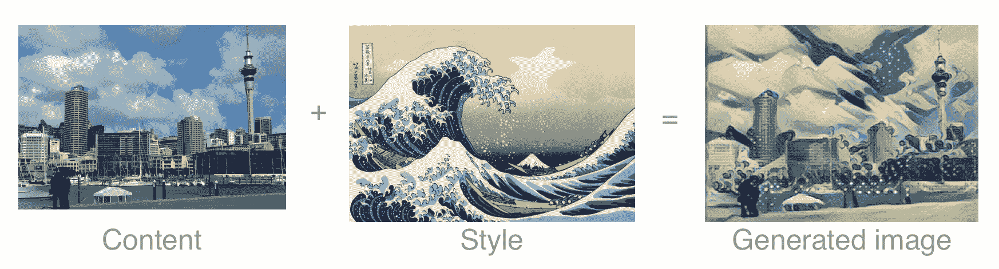

在本节中，我们将描述（尽管是高层次地）它是如何工作的，然后转向一个允许我们在显著更短的时间内执行类似过程的替代方案。

我鼓励您阅读 Leon A. Gatys、Alexander S. Ecker 和 Matthias Bethge 撰写的原始论文，《艺术风格神经算法》，以获得更全面的概述。这篇论文可在[`arxiv.org/abs/1508.06576`](https://arxiv.org/abs/1508.06576)找到。

到目前为止，我们已经了解到神经网络通过迭代减少损失来学习，损失是通过使用某些指定的成本函数计算的，该函数用于指示神经网络在预期输出方面的表现如何。然后，**预测输出**与**预期输出**之间的差异被用来通过称为**反向传播**的过程调整模型的权重，以最小化这种损失。

上述描述（有意）省略了此过程的细节，因为我们的目标是提供直观的理解，而不是细节。我建议阅读 Andrew Trask 的《Grokking Deep Learning》以获得对神经网络底层细节的温和介绍。

与我们迄今为止所使用的分类模型不同，其中输出是跨越某些标签集的概率分布，我们更感兴趣的是模型生成能力。也就是说，我们不是调整模型的权重，而是想调整生成图像的像素值，以减少一些定义的成本函数。

因此，如果我们定义一个成本函数来衡量生成图像和内容图像之间的损失，以及另一个来衡量生成图像和风格图像之间的损失，我们就可以简单地合并它们。这样我们就得到了整体损失，并使用这个损失来调整生成图像的像素值，以创建一个具有目标内容的目标风格的图像，如图所示：

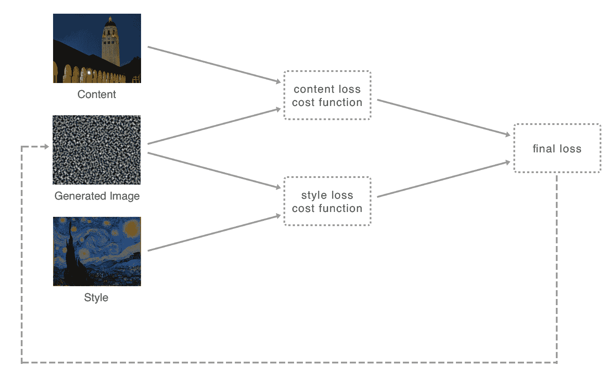

在这个阶段，我们已经对所需的过程有一个大致的了解；剩下的是建立对这些成本函数背后的直觉。也就是说，你是如何确定你生成的图像在内容图像的某些内容和风格图像的风格方面有多好？为此，我们将稍微回顾一下，通过检查每个激活来了解 CNN 的其他层是如何学习的。

关于**卷积神经网络**（**CNNs**）学习细节和图像的详细信息，来自 Matthew D. Zeiler 和 Rob Fergus 的论文《可视化与理解卷积网络》，可在[`arxiv.org/abs/1311.2901`](https://arxiv.org/abs/1311.2901)找到。

CNN 的典型架构由一系列卷积和池化层组成，然后输入到一个全连接网络（用于分类情况），如图所示：

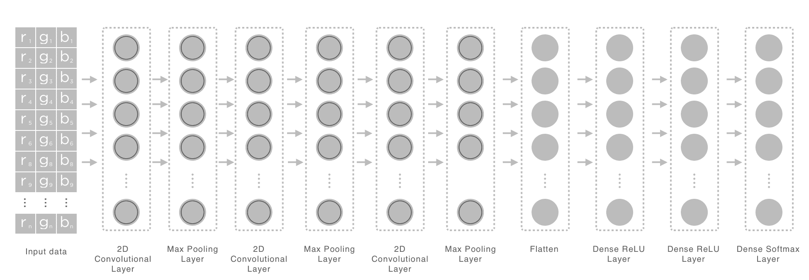

这种平面表示忽略了 CNN 的一个重要特性，即在每一对后续的卷积和池化层之后，输入的宽度和高度都会减小。这种结果就是感受野向网络深处增加；也就是说，深层有更大的感受野，因此比浅层捕获更高层次的特征。

为了更好地说明每一层学习的内容，我们将参考 Matthew D. Zeiler 和 Rob Fergus 的论文《可视化与理解卷积网络》。在他们之前的论文中，他们通过将训练集中的图像传递过去，以识别最大化每一层激活的图像块；通过可视化这些块，我们可以了解每一层的每个神经元（隐藏单元）学习到了什么。以下是 CNN 中一些这些块的截图：

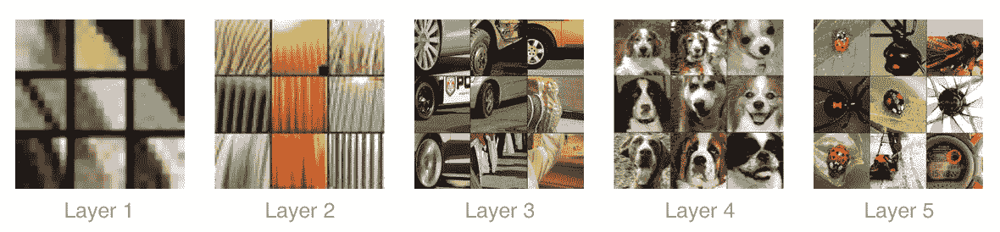

来源：《可视化与理解卷积网络》；Matthew D Zeiler, Rob Fergus

在前面的图中，你可以看到九个图像块，这些图像块在每个网络层的每个隐藏单元中最大化。前面图中省略的是尺寸上的变化；也就是说，你走得越深，图像块就会越大。

从前面的图像中可以明显看出，较浅的层提取简单的特征。例如，我们可以看到**层 1**的单个隐藏单元被对角线边缘激活，而**层 2**的单个隐藏单元则被垂直条纹块激活。而较深的层提取高级特征或更复杂的特征，再次，在前面图中，我们可以看到**层 4**的单个隐藏单元被狗脸的块激活。

我们回到定义内容与风格成本函数的任务，首先从内容成本函数开始。给定一个内容图像和一个生成图像，我们想要测量我们有多接近，以便最小化这种差异，从而保留内容。我们可以通过选择我们之前看到的具有大感受野的 CNN 中的一个较深层来实现这一点，它能够捕捉复杂的特征。我们通过内容图像和生成图像传递，并测量输出激活（在这一层）之间的距离。这可能会在更深层的网络学习复杂特征，如狗的脸或汽车的情况下显得合乎逻辑，但将它们与较低级别的特征（如边缘、颜色和纹理）解耦。以下图展示了这一过程：

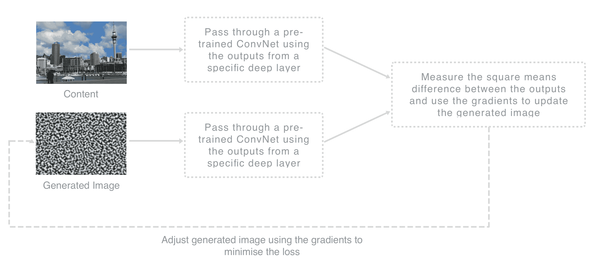

这就解决了我们的内容成本函数问题，可以通过运行实现此功能的网络来轻松测试。如果实现正确，它应该会产生一个看起来与输入（内容图像）相似的生成图像。现在，让我们将注意力转向测量风格。

在前面的图中，我们看到了网络的较浅层学习简单的特征，如边缘、纹理和颜色组合。这为我们提供了关于在尝试测量风格时哪些层可能有用的线索，但我们仍然需要一种提取和测量风格的方法。然而，在我们开始之前，究竟什么是风格？

在[`www.dictionary.com/`](http://www.dictionary.com/)上进行快速搜索，可以发现“风格”被定义为“*一种独特的外观，通常由设计时所依据的原则决定*”。让我们以葛饰北斋的*《神奈川冲浪里》*为例：


*神奈川冲浪里*是称为**木版印刷**的过程的输出；这是艺术家草图被分解成层（雕刻的木块），每个层（通常每个颜色一个）用于复制艺术品。它类似于手动印刷机；这个过程产生了一种独特的平坦和简化的风格。在前面的图像中还可以看到另一种主导风格（以及可能的副作用），那就是使用了有限的颜色范围；例如，水由不超过四种颜色组成。

我们可以捕获风格的方式，如 L. Gatys、A. Ecker 和 M. Bethge 在论文《艺术风格神经算法》中定义的那样。这种方式是使用风格矩阵（也称为**gram 矩阵**）来找到给定层中不同通道之间激活的相关性。正是这些相关性定义了风格，并且我们可以用它来衡量我们的风格图像和生成的图像之间的差异，从而影响生成的图像的风格。

为了使这一点更加具体，借鉴 Andrew Ng 在他的 Coursera 深度学习课程中使用的例子，让我们从之前的例子中取**层 2**。风格矩阵计算的是给定层中所有通道之间的相关性。如果我们使用以下插图，展示两个通道的九个激活，我们可以看到第一通道的垂直纹理与第二通道的橙色块之间存在相关性。也就是说，当我们看到第一通道中的垂直纹理时，我们预计最大化第二通道激活的图像块将带有橙色：

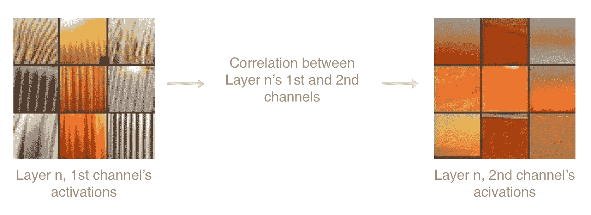

这个风格矩阵为风格图像和生成的图像都进行了计算，我们的优化迫使生成的图像采用这些相关性。计算完这两个风格矩阵后，我们可以通过简单地找到两个矩阵之间平方差的和来计算损失。以下图示说明了这个过程，就像我们之前在描述内容损失函数时做的那样：

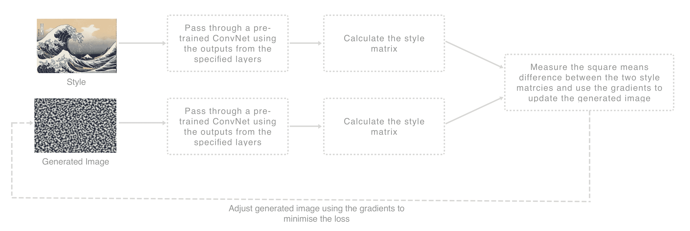

有了这些，我们现在已经完成了对风格迁移的介绍，并希望给你一些关于如何使用网络对图像的感知理解来提取内容和风格的直观感受。这种方法效果很好，但有一个缺点，我们将在下一节中解决。

# 转移风格的更快方法

如你所从本节标题中推断出的，前节中介绍的方法的一个主要缺点是，该过程需要迭代优化，以下图示总结了这一点：

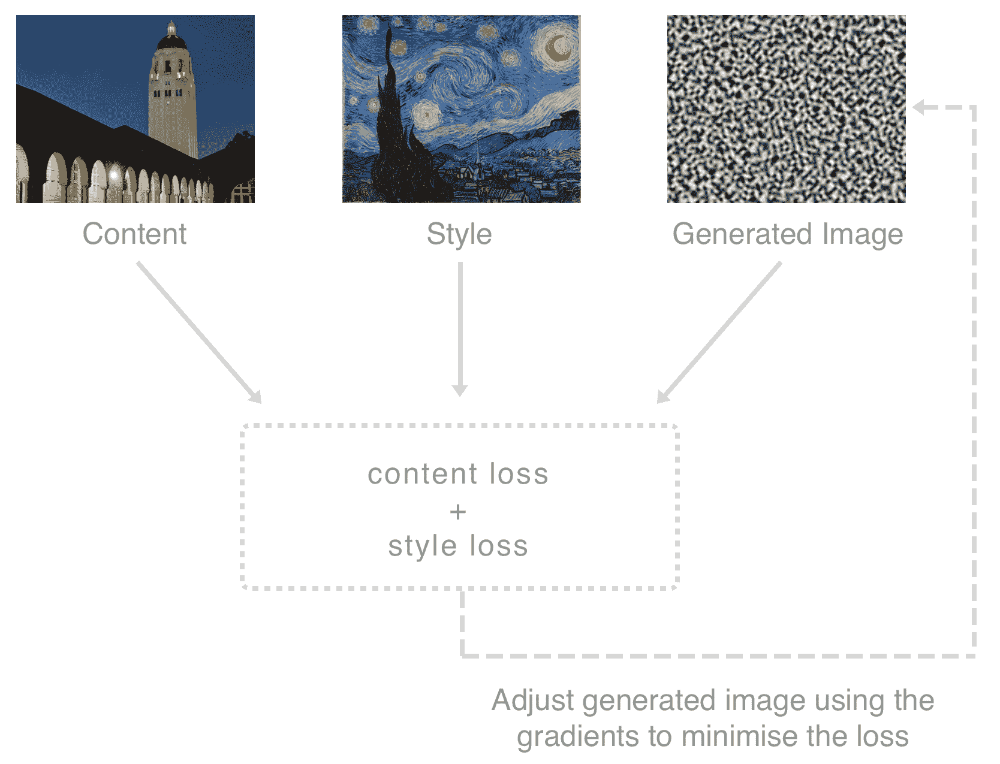

这种优化在执行许多迭代以最小化损失方面类似于训练。因此，即使使用一台普通的计算机，这也通常需要相当多的时间。正如本书开头所暗示的，我们理想情况下希望将自己限制在边缘进行推理，因为它需要的计算能力显著较低，并且可以在接近实时的情况下运行，使我们能够将其用于交互式应用程序。幸运的是，在他们的论文《用于实时风格迁移和超分辨率的感知损失》中，J. Johnson、A. Alahi 和 L. Fei-Fei 描述了一种将风格迁移的训练（优化）和推理解耦的技术。

之前，我们描述了一个网络，它以生成图像、风格图像和内容图像作为输入。该网络通过迭代调整生成图像，使用内容和风格的损失函数来最小化损失；这提供了灵活性，允许我们插入任何风格和内容图像，但代价是计算成本高，即速度慢。如果我们牺牲这种灵活性以换取性能，将自己限制在单一风格，并且不执行生成图像的优化，而是训练一个 CNN 会怎样？CNN 将学习风格，一旦训练完成，就可以通过网络的单次遍历（推理）来生成风格化的图像。这正是论文《用于实时风格迁移和超分辨率的感知损失》所描述的，也是我们将在本章中使用的网络。

为了更好地阐明先前方法和这种方法之间的区别，请花一点时间回顾并比较前面的图与以下图：

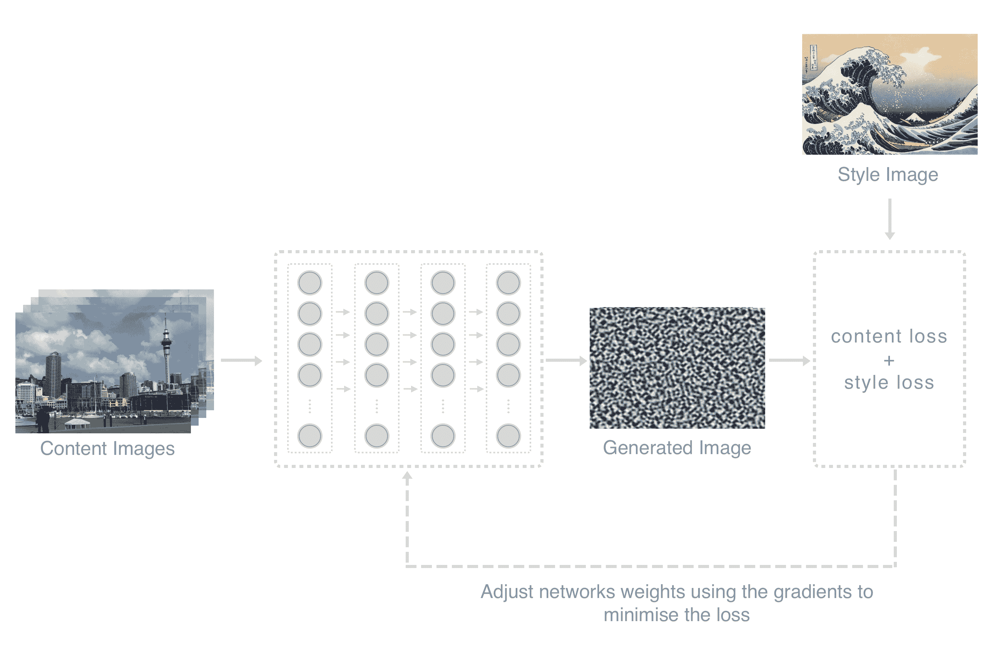

与先前的方法不同，在先前的方法中，我们针对一组给定内容、风格和生成图像进行优化，并调整生成图像以最小化损失，我们现在向 CNN 提供一组内容图像，并让网络生成图像。然后，我们执行与之前描述的相同损失函数，针对单一风格。但是，我们不是调整生成图像，而是使用损失函数的梯度来调整网络的权重。我们重复这个过程，直到我们足够地最小化了所有内容图像的平均损失。

现在，随着我们的模型训练完成，我们可以让我们的网络通过单次遍历来风格化图像，如图所示：

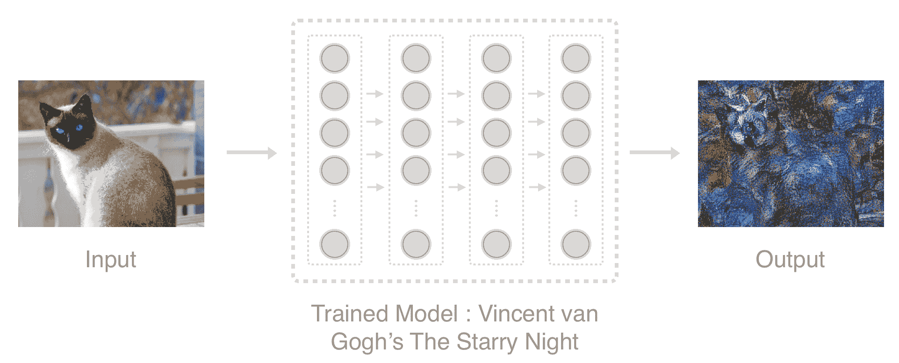

在前两节中，我们以高层次概述了这些网络的工作原理。现在，是时候构建一个利用所有这些功能的应用程序了。在下一节中，我们将快速浏览如何将训练好的 Keras 模型转换为 Core ML，然后再继续本章的主要主题——为 Core ML 实现自定义层。

# 将 Keras 模型转换为 Core ML

与我们在上一章中所做的一样，在本节中，我们将使用 **Core ML Tools** 包将训练好的 Keras 模型转换为 Core ML 模型。为了避免在您的本地或远程机器上设置环境的任何复杂性，我们将利用微软提供的免费 Jupyter 云服务。访问 [`notebooks.azure.com`](https://notebooks.azure.com) 并登录（如果您还没有，请先注册）。

登录后，点击导航栏中的“库”菜单链接，这将带您到一个包含您所有库列表的页面，类似于以下截图所示：

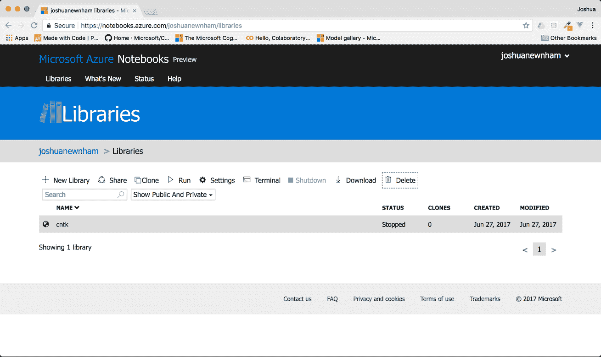

接下来，点击“新建库”链接以打开创建新库对话框：

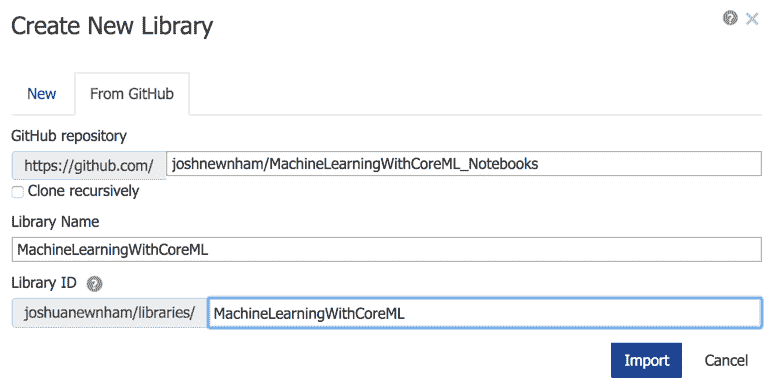

然后，点击“从 GitHub”标签，并在 GitHub 仓库字段中输入 `https://github.com/packtpublishing/machine-learning-with-core-ml`。之后，给您的库起一个有意义的名字，并点击导入按钮以开始克隆仓库并创建库的过程。

创建库后，您将被重定向到根目录。从那里，点击 `Chapter6/Notebooks` 文件夹以打开本章的相关文件夹，最后点击笔记本 `FastNeuralStyleTransfer_Keras2CoreML.ipynb`。以下是点击 `Chapter6` 文件夹后您应该看到的截图：

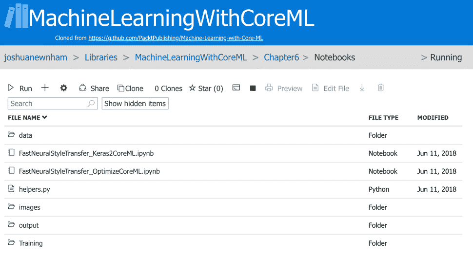

讨论笔记本的细节，包括网络和训练的细节超出了本书的范围。对于好奇的读者，我在 `training` 文件夹中的 `chapters` 文件夹内包含了本书中使用的每个模型的原始笔记本。

我们的笔记本现在已加载，是时候逐个遍历每个单元格来创建我们的 Core ML 模型了；所有必要的代码都已存在，剩下的只是依次执行每个单元格。要执行一个单元格，你可以使用快捷键 *Shift* + *Enter* 或者点击工具栏中的运行按钮（这将运行当前选中的单元格），如下面的截图所示：

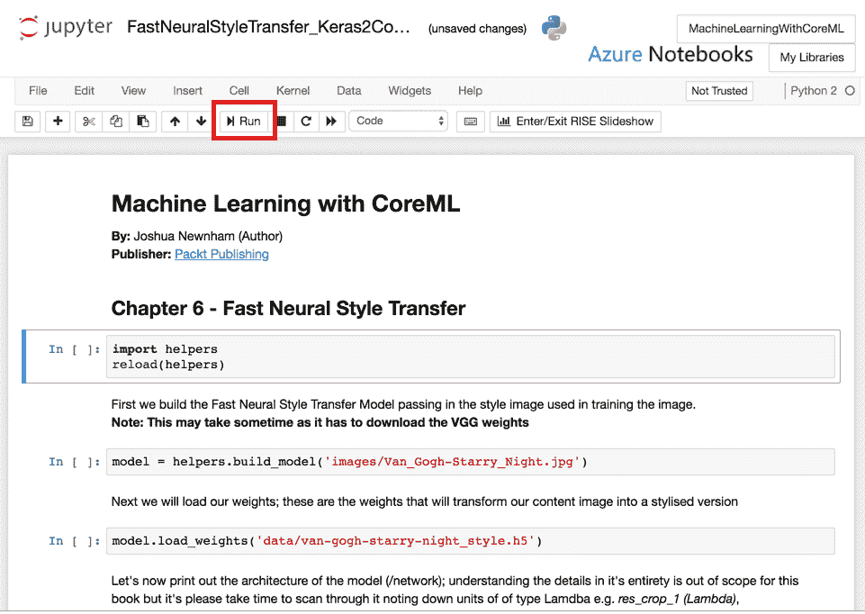

我将简要解释每个单元格的作用。确保我们在遍历它们时执行每个单元格，这样我们最终都能得到转换后的模型，然后我们可以将其下载并导入到我们的 iOS 项目中：

```py
import helpers
reload(helpers)
```

我们首先导入一个包含创建并返回我们想要转换的 Keras 模型的函数的模块：

```py
model = helpers.build_model('images/Van_Gogh-Starry_Night.jpg')
```

我们接着使用我们的 `helpers` 方法 `build_model` 来创建模型，传入模型训练所用的风格图像。请记住，我们正在使用一个在单个风格上训练的前馈网络；虽然该网络可以用于不同的风格，但每个风格的权重是唯一的。

调用 `build_model` 将需要一些时间来返回；这是因为模型使用了一个在返回之前下载的已训练模型（VGG16）。

说到权重（之前训练的模型），现在让我们通过运行以下单元格来加载它们：

```py
model.load_weights('data/van-gogh-starry-night_style.h5')
```

与上述代码类似，我们传递了在文森特·梵高的《星夜》画作上训练的模型的权重，用于其风格。

接下来，让我们通过在模型本身上调用 `summary` 方法来检查模型的架构：

```py
model.summary()
```

调用此方法将返回，正如其名称所暗示的，我们模型的摘要。以下是生成的摘要摘录：

```py
____________________________________________________________________
Layer (type) Output Shape Param # Connected to 
====================================================================
input_1 (InputLayer) (None, 320, 320, 3) 0 
____________________________________________________________________
zero_padding2d_1 (ZeroPadding2D) (None, 400, 400, 3) 0 input_1[0][0] 
____________________________________________________________________
conv2d_1 (Conv2D) (None, 400, 400, 64) 15616 zero_padding2d_1[0][0] 
____________________________________________________________________
batch_normalization_1 (BatchNorm (None, 400, 400, 64) 256 conv2d_1[0][0] 
____________________________________________________________________
activation_1 (Activation) (None, 400, 400, 64) 0 batch_normalization_1[0][0] 
____________________________________________________________________
...
...
____________________________________________________________________
res_crop_1 (Lambda) (None, 92, 92, 64) 0 add_1[0][0] 
____________________________________________________________________
...
... 
____________________________________________________________________
rescale_output (Lambda) (None, 320, 320, 3) 0 conv2d_16[0][0] 
====================================================================
Total params: 552,003
Trainable params: 550,083
Non-trainable params: 1,920
```

如前所述，深入探讨 Python、Keras 或该模型的细节超出了范围。相反，我在这里提供了一段摘录，以突出模型中嵌入的自定义层（粗体行）。在 Core ML Tools 的上下文中，自定义层是指尚未定义的层，因此它们在转换过程中不会被处理，因此处理这些层的责任在我们。您可以将转换过程视为将机器学习框架（如 Keras）中的层映射到 Core ML 的过程。如果没有映射存在，那么就由我们来填写细节，如下面的图示所示：

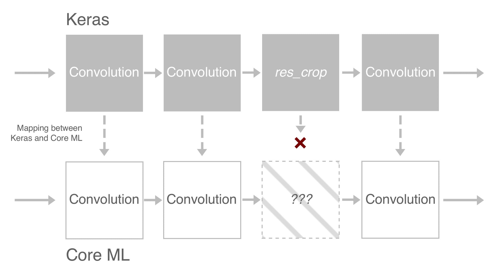

之前显示的两个自定义层都是 Lambda 层；Lambda 层是一个特殊的 Keras 类，它方便地允许使用函数或 Lambda 表达式（类似于 Swift 中的闭包）来编写快速且简单的层。Lambda 层对于没有状态的层非常有用，在 Keras 模型中常见，用于执行基本计算。这里我们看到两个被使用，`res_crop` 和 `rescale_output`。

`res_crop` 是 ResNet 模块的一部分，它裁剪输出（正如其名称所暗示的）；该函数足够简单，其定义如下面的代码所示：

```py
def res_crop(x):
    return x[:, 2:-2, 2:-2] 
```

我建议您阅读 K. He、X. Zhang、S. Ren 和 J. Sun 的论文《用于图像识别的深度残差学习》，以了解更多关于 ResNet 和残差块的信息，该论文可在以下链接找到：[`arxiv.org/pdf/1512.03385.pdf`](https://arxiv.org/pdf/1512.03385.pdf)。

实际上，这所做的一切就是使用宽度高度轴上的填充 2 来裁剪输出。我们可以通过运行以下单元格来进一步调查这个层的输入和输出形状：

```py
res_crop_3_layer = [layer for layer in model.layers if layer.name == 'res_crop_3'][0] 

print("res_crop_3_layer input shape {}, output shape {}".format(
    res_crop_3_layer.input_shape, res_crop_3_layer.output_shape))
```

此单元格打印了层 `res_crop_3_layer` 的输入和输出形状；该层接收形状为 `(None, 88, 88, 64)` 的张量，并输出形状为 `(None, 84, 84, 64)` 的张量。这里元组被分解为：（批量大小，高度，宽度，通道）。批量大小设置为 `None`，表示它在训练过程中动态设置。

我们下一个 Lambda 层是 `rescale_output`；这是在网络末尾用于将 Convolution 2D 层的输出重新缩放，该层通过 tanh 激活传递数据。这迫使我们的数据被限制在 -1.0 和 1.0 之间，而我们需要它在 0 到 255 的范围内，以便将其转换为图像。像之前一样，让我们看看它的定义，以更好地了解这个层的作用，如下面的代码所示：

```py
def rescale_output(x):
    return (x+1)*127.5 
```

此方法执行一个元素级操作，将值 -1.0 和 1.0 映射到 0 和 255。类似于前面的方法 (`res_crop`)，我们可以通过运行以下单元格来检查这个层的输入和输出形状：

```py
rescale_output_layer = [layer for layer in model.layers if layer.name == 'rescale_output'][0]

print("rescale_output_layer input shape {}, output shape {}".format(
    rescale_output_layer.input_shape, 
    rescale_output_layer.output_shape))
```

一旦运行，这个单元格将打印出层的输入形状为 `(None, 320, 320, 3)` 和输出形状为 `(None, 320, 320, 3)`。这告诉我们这个层不会改变张量的形状，同时也显示了我们的图像输出维度为 320 x 320，具有三个通道（RGB）。

我们现在已经审查了自定义层，并看到了它们实际的功能；下一步是执行实际的转换。运行以下单元格以确保环境中已安装 Core ML Tools 模块：

```py
!pip install coremltools
```

一旦安装，我们可以通过运行以下单元格来加载所需的模块：

```py
import coremltools
from coremltools.proto import NeuralNetwork_pb2, FeatureTypes_pb2
```

在这种情况下，我提前警告你我们的模型包含自定义层；在某些（如果不是大多数）情况下，你可能会在转换过程失败时发现这一点。让我们通过运行以下单元格并检查其输出来看一下具体是什么样子：

```py
coreml_model = coremltools.converters.keras.convert(
    model, 
    input_names=['image'], 
    image_input_names=['image'], 
    output_names="output")
```

在前面的代码片段中，我们将我们的模型传递给 `coremltools.converters.keras.convert` 方法，该方法负责将我们的 Keras 模型转换为 Core ML。除了模型外，我们还传递了模型的输入和输出名称，以及设置 `image_input_names` 以告知该方法我们希望输入 `image` 被视为图像而不是多维数组。

如预期，运行这个单元格后，你会收到一个错误。如果你滚动到输出的底部，你会看到行 `ValueError: Keras layer '<class 'keras.layers.core.Lambda'>' not supported`。在这个阶段，你需要审查你模型的架构以确定导致错误的层，并继续你即将要做的事情。

通过在转换调用中启用参数 `add_custom_layers`，我们防止转换器在遇到它不认识的层时失败。作为转换过程的一部分，将插入一个名为 custom 的占位符层。除了识别自定义层外，我们还可以将 `delegate` 函数传递给参数 `custom_conversion_functions`，这允许我们向模型的规范中添加元数据，说明如何处理自定义层。

现在让我们创建这个 `delegate` 方法；运行以下代码的单元格：

```py
def convert_lambda(layer):
    if layer.function.__name__ == 'rescale_output':
        params = NeuralNetwork_pb2.CustomLayerParams()
        params.className = "RescaleOutputLambda"
        params.description = "Rescale output using ((x+1)*127.5)"
        return params
    elif layer.function.__name__ == 'res_crop':
        params = NeuralNetwork_pb2.CustomLayerParams()
        params.className = "ResCropBlockLambda"
        params.description = "return x[:, 2:-2, 2:-2]"
        return params
    else:
        raise Exception('Unknown layer')
    return None 
```

这个`delegate`会传递转换器遇到的每个自定义层。因为我们处理的是两个不同的层，所以我们首先检查我们正在处理哪个层，然后继续创建并返回一个`CustomLayerParams`实例。这个类允许我们在创建模型规范时添加一些元数据，用于 Core ML 转换。在这里，我们设置其`className`，这是我们在 iOS 项目中实现这个层的 Swift（或 Objective-C）类的名称，以及`description`，这是在 Xcode 的 ML 模型查看器中显示的文本。

现在我们已经实现了`delegate`方法，让我们重新运行转换器，传递适当的参数，如下面的代码所示：

```py
coreml_model = coremltools.converters.keras.convert(
    model, 
    input_names=['image'], 
    image_input_names=['image'], 
    output_names="output",
    add_custom_layers=True,
    custom_conversion_functions={ "Lambda": convert_lambda })
```

如果一切顺利，你应该会看到转换器输出它访问的每一层，没有错误消息，最后返回一个 Core ML 模型实例。现在我们可以给我们的模型添加元数据，这是在 Xcode 的 ML 模型视图中显示的内容：

```py
coreml_model.author = 'Joshua Newnham'
coreml_model.license = 'BSD'
coreml_model.short_description = 'Fast Style Transfer based on the style of Van Gogh Starry Night'
coreml_model.input_description['image'] = 'Preprocessed content image'
coreml_model.output_description['output'] = 'Stylized content image' 
```

在这个阶段，我们可以保存模型并将其导入 Xcode，但我想再做一些事情来让我们的生活更轻松。在本质上（请原谅这个双关语），Core ML 模型是 Xcode 在导入时用于构建模型的网络规范（包括模型描述、模型参数和元数据）。我们可以通过调用以下语句来获取对这个规范的引用：

```py
spec = coreml_model.get_spec() 
```

参考模型的规范，我们接下来搜索输出层，如下面的代码片段所示：

```py
output = [output for output in spec.description.output if output.name == 'output'][0]
```

我们可以通过简单地打印出来来检查输出；运行以下代码的单元格来完成这个操作：

```py
output
```

你应该会看到类似以下的内容：

```py
name: "output"
shortDescription: "Stylized content image"
type {
  multiArrayType {
    shape: 3
    shape: 320
    shape: 320
    dataType: DOUBLE
  }
}
```

注意类型，目前是`multiArrayType`（它在 iOS 中的对应物是`MLMultiArray`）。这没问题，但需要我们显式地将其转换为图像；如果模型直接输出图像而不是多维数组会方便得多。我们可以通过简单地修改规范来实现这一点。具体来说，在这个例子中，这意味着填充类型的`imageType`属性，以提示 Xcode 我们期望一个图像。现在让我们通过运行带有以下代码的单元格来完成这个操作：

```py
output.type.imageType.colorSpace = FeatureTypes_pb2.ImageFeatureType.ColorSpace.Value('RGB') 

output.type.imageType.width = width 
output.type.imageType.height = height

coreml_model = coremltools.models.MLModel(spec) 
```

我们首先设置颜色空间为 RGB，然后设置图像的预期宽度和高度。最后，我们通过传递更新后的规范并使用语句`coremltools.models.MLModel(spec)`创建一个新的模型。现在，如果你查询输出，你应该会看到以下类似输出：

```py
name: "output"
shortDescription: "Stylized content image"
type {
  imageType {
    width: 320
    height: 320
    colorSpace: RGB
  }
}
```

我们已经为执行这个转换节省了大量代码；我们的最后一步是在将其导入 Xcode 之前保存模型。运行最后一个单元格，它正是这样做的：

```py
coreml_model.save('output/FastStyleTransferVanGoghStarryNight.mlmodel')
```

在关闭浏览器之前，让我们下载模型。你可以通过返回到 `Chapter6/Notebooks` 目录并深入到 `output` 文件夹来完成此操作。在这里，你应该能看到文件 `FastStyleTransferVanGoghStarryNight.mlmodel`；只需右键单击它并选择下载菜单项（或者通过左键单击并选择下载工具栏项）：

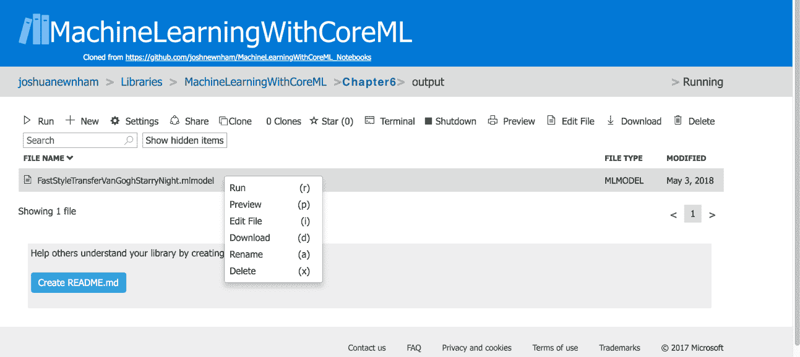

拥有我们的模型后，现在是时候跳入 Xcode 并实现那些自定义层了。

# 在 Swift 中构建自定义层

在本节中，我们将主要关注实现模型所依赖的自定义层，并且通过使用现有的模板——你无疑已经非常熟悉的结构——来省略应用的大部分细节。

如果你还没有这样做，请从配套的仓库中拉取最新的代码：[`github.com/packtpublishing/machine-learning-with-core-ml`](https://github.com/packtpublishing/machine-learning-with-core-ml)。下载后，导航到目录 `Chapter6/Start/StyleTransfer/` 并打开项目 `StyleTransfer.xcodeproj`。一旦加载，你将看到本章的项目：

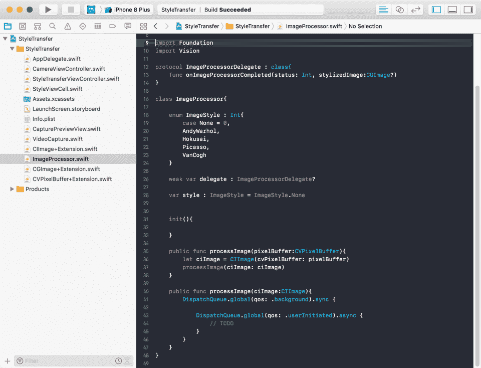

应用程序由两个视图控制器组成。第一个，`CameraViewController`，为用户提供相机实时流和拍照的能力。拍照时，控制器会展示另一个视图控制器 `StyleTransferViewController`，并传递捕获的相片。`StyleTransferViewController` 然后展示图像，并在底部包含一个水平 `CollectionView`，其中包含用户可以通过点击选择的样式集。

每当用户选择一种样式时，控制器都会更新 `ImageProcessors` 样式属性，然后调用其方法 `processImage`，传入指定的图像。正是在这里，我们将实现将图像传递给模型并通过指定的代理 `onImageProcessorCompleted` 方法返回结果的功能，然后将其展示给用户。

现在，随着我们的项目已加载，让我们导入我们刚刚创建的模型；找到下载的 `.mlmodel` 文件并将其拖放到 Xcode 中。一旦导入，我们从左侧面板中选择它来检查元数据，以提醒自己需要实现的内容：

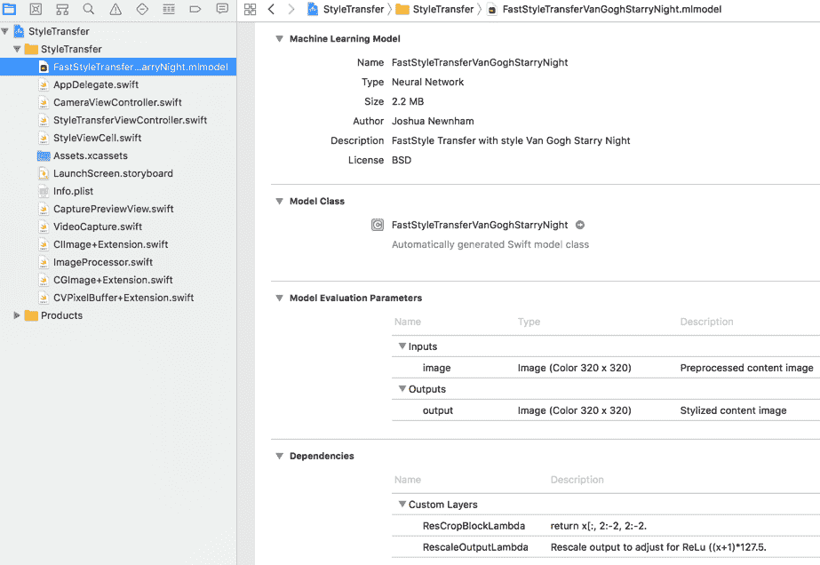

通过检查模型，我们可以看到它期望一个大小为 320 x 320 的输入 RGB 图像，并且它将以相同的尺寸输出图像。我们还可以看到模型期望两个名为 `ResCropBlockLambda` 和 `RescaleOutputLambda` 的自定义层。在实现这些类之前，让我们将模型连接起来，并且为了好玩，看看在没有实现自定义层的情况下尝试运行它会发生什么。

从左侧面板选择`ImageProcessor.swift`；在这个项目中，我们将使用 Vision 框架来完成所有预处理。首先，在`ImageProcessor`类的主体中添加以下属性，例如在`style`属性下方：

```py
lazy var vanCoghModel : VNCoreMLModel = {
    do{
        let model = try VNCoreMLModel(for: FastStyleTransferVanGoghStarryNight().model)
        return model
    } catch{
        fatalError("Failed to obtain VanCoghModel")
    }
}()
```

第一个属性返回一个`VNCoreMLModel`实例，封装了我们的`FastStyleTransferVanGoghStarryNight`模型。封装我们的模型是必要的，以便使其与 Vision 框架的请求类兼容。

在下面添加以下片段，它将负责根据所选样式返回适当的`VNCoreMLModel`：

```py
var model : VNCoreMLModel{
    get{
        if self.style == .VanCogh{
            return self.vanCoghModel
        }

        // default
        return self.vanCoghModel
    }
}
```

最后，我们创建一个方法，它将负责根据当前所选模型（由当前的`style`确定）返回一个`VNCoreMLRequest`实例：

```py
func getRequest() -> VNCoreMLRequest{
    let request = VNCoreMLRequest(
        model: self.model,
        completionHandler: { [weak self] request, error in
            self?.processRequest(for: request, error: error)
        })
    request.imageCropAndScaleOption = .centerCrop
    return request
}
```

`VNCoreMLRequest`负责在将输入图像传递给分配的 Core ML 模型之前对其进行必要的预处理。我们实例化`VNCoreMLRequest`，传入一个完成处理程序，当调用时，它将简单地将其结果传递给`ImageProcessor`类的`processRequest`方法。我们还设置了`imageCropAndScaleOption`为`.centerCrop`，以便我们的图像在保持其宽高比的同时调整大小到 320 x 320（如果需要，裁剪中心图像的最长边）。

现在我们已经定义了属性，是时候跳转到`processImage`方法来启动实际的工作了；添加以下代码（以粗体显示，并替换`// TODO`注释）：

```py
public func processImage(ciImage:CIImage){        
    DispatchQueue.global(qos: .userInitiated).async {
 let handler = VNImageRequestHandler(ciImage: ciImage)
 do {
 try handler.perform([self.getRequest()])
 } catch {
 print("Failed to perform classification.\n\(error.localizedDescription)")
 }
    }
}
```

前面的方法是我们的图像风格化入口点；我们首先实例化一个`VNImageRequestHandler`实例，传入图像，并通过调用`perform`方法启动过程。一旦分析完成，请求将调用我们分配给它的`delegate`，即`processRequest`，传入相关请求和结果（如果有错误）。现在让我们具体实现这个方法：

```py
func processRequest(for request:VNRequest, error: Error?){
    guard let results = request.results else {
        print("ImageProcess", #function, "ERROR:",
              String(describing: error?.localizedDescription))
        self.delegate?.onImageProcessorCompleted(
            status: -1,
            stylizedImage: nil)
        return
    }

    let stylizedPixelBufferObservations =
        results as! [VNPixelBufferObservation]

    guard stylizedPixelBufferObservations.count > 0 else {
        print("ImageProcess", #function,"ERROR:",
              "No Results")
        self.delegate?.onImageProcessorCompleted(
            status: -1,
            stylizedImage: nil)
        return
    }

    guard let cgImage = stylizedPixelBufferObservations[0]
        .pixelBuffer.toCGImage() else{
        print("ImageProcess", #function, "ERROR:",
              "Failed to convert CVPixelBuffer to CGImage")
        self.delegate?.onImageProcessorCompleted(
            status: -1,
            stylizedImage: nil)
        return
    }

    DispatchQueue.main.sync {
        self.delegate?.onImageProcessorCompleted(
            status: 1,
            stylizedImage:cgImage)
    }
}
```

虽然`VNCoreMLRequest`负责图像分析，但`VNImageRequestHandler`负责执行请求（或请求）。

如果分析过程中没有发生错误，我们应该返回带有其结果属性的请求实例。因为我们只期望一个请求和结果类型，我们将结果转换为`VNPixelBufferObservation`数组的实例，这是一种适合使用 Core ML 模型进行图像分析的观察类型，其作用是图像到图像处理，例如我们的风格转换模型。

我们可以通过属性`pixelBuffer`从结果中获取的观察结果中获取我们风格化图像的引用。然后我们可以调用扩展方法`toCGImage`（在`CVPixelBuffer+Extension.swift`中找到）以方便地以我们可以轻松使用的格式获取输出，在这种情况下，更新图像视图。

如前所述，让我们看看当我们尝试在不实现自定义层的情况下运行图像通过我们的模型时会发生什么。构建并部署到设备上，然后拍照，然后从显示的样式中选择梵高风格。这样做时，你会观察到构建失败并报告错误：“从工厂创建 Core ML 自定义层实现时出错，层名为 "RescaleOutputLambda"`（正如我们所预期的）。

让我们现在通过实现每个自定义层来解决这个问题，从 `RescaleOutputLambda` 类开始。创建一个名为 `RescaleOutputLamdba.class` 的新 Swift 文件，并用以下代码替换模板代码：

```py
import Foundation
import CoreML
import Accelerate

@objc(RescaleOutputLambda) class RescaleOutputLambda: NSObject, MLCustomLayer {    
    required init(parameters: [String : Any]) throws {
        super.init()
    }

    func setWeightData(_ weights: [Data]) throws {

    }

    func outputShapes(forInputShapes inputShapes: [[NSNumber]]) throws
        -> [[NSNumber]] {

    }

    func evaluate(inputs: [MLMultiArray], outputs: [MLMultiArray]) throws {

    }
}
```

在这里，我们创建了一个名为 `MLCustomLayer` 的具体类，这是一个定义我们神经网络模型中自定义层行为的协议。该协议包含四个必需的方法和一个可选方法，具体如下：

+   `init(parameters)`: 初始化传递字典 `parameters` 的自定义层实现，该字典包含任何额外的配置选项。如您所回忆的，我们在将我们的 Keras 模型转换为自定义层时为每个自定义层创建了一个 `NeuralNetwork_pb2.CustomLayerParams` 实例。在这里，我们可以添加更多条目，这些条目将被传递到这个字典中。这提供了一些灵活性，例如允许您根据设置的参数调整您的层。

+   `setWeightData()`: 为层内连接分配权重（对于具有可训练权重的层）。

+   `outputShapes(forInputShapes)`: 这个方法确定层如何修改输入数据的大小。我们的 `RescaleOutputLambda` 层不会改变层的大小，所以我们只需返回输入形状，但我们将利用这个方法来实现下一个自定义层。

+   `evaluate(inputs, outputs)`: 这个方法执行实际的计算；这是一个必需的方法，当模型在 CPU 上运行时会被调用。

+   `encode(commandBuffer, inputs, outputs)`: 这个方法是可选的，作为 `evaluate` 方法的替代，后者使用 GPU 而不是 CPU。

由于我们没有传递任何自定义参数或设置任何可训练权重，我们可以跳过构造函数和 `setWeightData` 方法；让我们逐一介绍剩余的方法，从 `outputShapes(forInputShapes)` 开始。

如前所述，这个层不会改变输入的形状，因此我们可以简单地返回输入形状，如下面的代码所示：

```py
func outputShapes(forInputShapes inputShapes: [[NSNumber]]) throws
    -> [[NSNumber]] {
        return inputShapes
}
```

现在我们已经实现了`outputShapes(forInputShapes)`方法，让我们将注意力转向层的实际计算工作，即`evaluate`方法。`evaluate`方法接收一个`MLMultiArray`对象的数组作为输入，以及另一个`MLMultiArray`对象的数组，其中它预期存储结果。让`evaluate`方法接受输入和输出数组，这为支持不同的架构提供了更大的灵活性，但在这个例子中，我们只期望有一个输入和一个输出。

作为提醒，这个层是为了将每个元素从-1.0 - 1.0 的范围缩放到 0 - 255 的范围（这是典型图像所期望的）。最简单的方法是遍历每个元素并使用我们在 Python 中看到的方程进行缩放：`((x+1)*127.5`。这正是我们将要做的；将以下（加粗）代码添加到`evaluate`方法的主体中：

```py
func evaluate(inputs: [MLMultiArray],outputs: [MLMultiArray]) throws {    
    let rescaleAddition = 1.0
 let rescaleMulitplier = 127.5

 for (i, input) in inputs.enumerated(){
 // expecting [1, 1, Channels, Kernel Width, Kernel Height]
 let shape = input.shape 
 for c in 0..<shape[2].intValue{
 for w in 0..<shape[3].intValue{
 for h in 0..<shape[4].intValue{
 let index = [
 NSNumber(value: 0),
 NSNumber(value: 0),
 NSNumber(value: c),
 NSNumber(value: w),
 NSNumber(value: h)]
 let outputValue = NSNumber(
 value:(input[index].floatValue + rescaleAddition)
 * rescaleMulitplier)

 outputs[i][index] = outputValue
 }
 }
 }
 }
} 
```

这种方法的主体是由用于创建索引的代码组成的，该索引用于从输入中获取适当的值并指向其输出对应项。一旦创建了索引，Python 公式就被移植到 Swift 中：`input[index].doubleValue + rescaleAddition) * rescaleMulitplier`。这标志着我们第一个自定义层的结束；现在让我们实现第二个自定义层，`ResCropBlockLambda`。

创建一个名为`ResCropBlockLambda.swift`的新文件，并添加以下代码，覆盖任何现有代码：

```py
import Foundation
import CoreML
import Accelerate

@objc(ResCropBlockLambda) class ResCropBlockLambda: NSObject, MLCustomLayer {

    required init(parameters: [String : Any]) throws {
        super.init()
    }

    func setWeightData(_ weights: [Data]) throws {
    }

    func outputShapes(forInputShapes inputShapes: [[NSNumber]]) throws
        -> [[NSNumber]] {
    }

    func evaluate(inputs: [MLMultiArray], outputs: [MLMultiArray]) throws {
    }
}
```

正如我们在上一个自定义层中所做的那样，我们已经根据`MLCustomLayer`协议确定了所有必需的方法。再次强调，我们可以忽略构造函数和`setWeightData`方法，因为在这个层中它们都没有被使用。

如果你还记得，正如其名称所暗示的，这个层的功能是裁剪残差块的一个输入的宽度和高度。我们需要在`outputShapes(forInputShapes)`方法中反映这一点，以便网络知道后续层的输入维度。使用以下代码更新`outputShapes(forInputShapes)`方法：

```py
func outputShapes(forInputShapes inputShapes: [[NSNumber]]) throws
    -> [[NSNumber]] {        
 return [[NSNumber(value:inputShapes[0][0].intValue),
 NSNumber(value:inputShapes[0][1].intValue),
 NSNumber(value:inputShapes[0][2].intValue),
 NSNumber(value:inputShapes[0][3].intValue - 4),
 NSNumber(value:inputShapes[0][4].intValue - 4)]];
}
```

在这里，我们从宽度和高度中减去了一个常数`4`，实际上是在宽度和高度上填充了 2。接下来，我们实现`evaluate`方法，它执行这个裁剪。用以下代码替换`evaluate`方法：

```py
func evaluate(inputs: [MLMultiArray], outputs: [MLMultiArray]) throws {
 for (i, input) in inputs.enumerated(){

 // expecting [1, 1, Channels, Kernel Width, Kernel Height]
 let shape = input.shape
 for c in 0..<shape[2].intValue{
 for w in 2...(shape[3].intValue-4){
 for h in 2...(shape[4].intValue-4){
 let inputIndex = [
 NSNumber(value: 0),
 NSNumber(value: 0),
 NSNumber(value: c),
 NSNumber(value: w),
 NSNumber(value: h)]

 let outputIndex = [
 NSNumber(value: 0),
 NSNumber(value: 0),
 NSNumber(value: c),
 NSNumber(value: w-2),
 NSNumber(value: h-2)]

 outputs[i][outputIndex] = input[inputIndex]
 }
 }
 }
 }
} 
```

与我们的`RescaleOutputLambda`层的`evaluate`方法类似，这个方法的主体必须与创建输入和输出数组的索引有关。我们只是通过限制循环的范围来调整它，以达到所需的宽度和高度。

现在，如果你构建并运行项目，你将能够将图像通过梵高网络运行，并得到它的风格化版本，类似于以下图像所示：

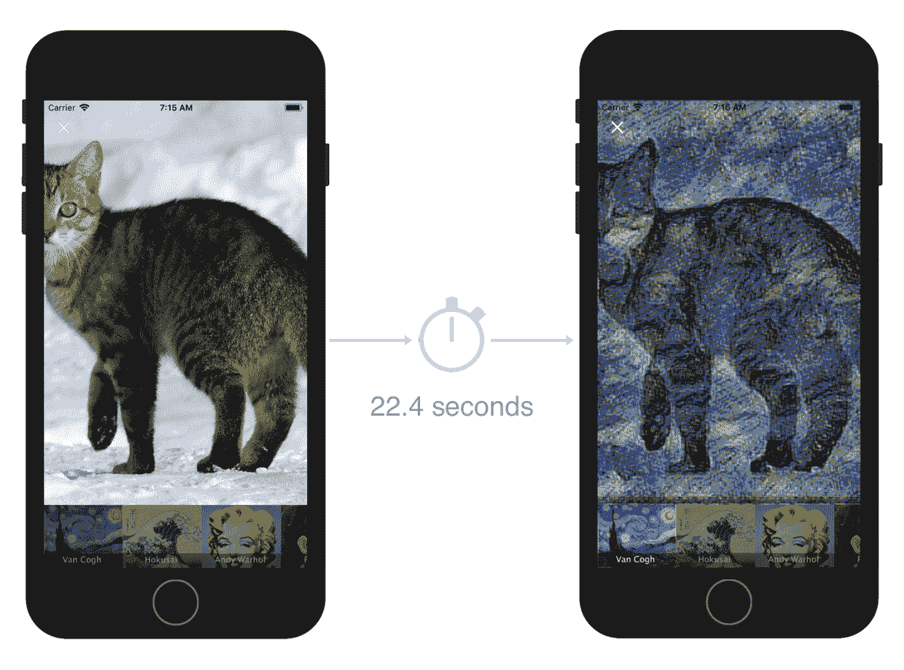

在模拟器上运行时，整个过程大约花费了**22.4 秒**。在接下来的两个部分中，我们将花时间探讨如何减少这个时间。

# 加速我们的层

让我们回到`RescaleOutputLambda`层，看看我们可能在哪里能减少一秒或两秒的处理时间。作为提醒，这个层的作用是对输出中的每个元素进行缩放，其中我们的输出可以被视为一个大向量。幸运的是，苹果为我们提供了高效的框架和 API 来处理这种情况。我们不会在循环中对每个元素进行操作，而是将利用`Accelerate`框架及其`vDSPAPI`在单步中执行此操作。这个过程被称为**向量化**，是通过利用 CPU 的**单指令多数据**（**SIMD**）指令集来实现的。回到`RescaleOutputLambda`类，并使用以下代码更新`evaluate`方法：

```py
func evaluate(inputs: [MLMultiArray], outputs: [MLMultiArray]) throws {
    var rescaleAddition : Float = 1.0
    var rescaleMulitplier : Float = 127.5

 for (i, _) in inputs.enumerated(){

 let input = inputs[i]
 let output = outputs[i]

 let count = input.count
 let inputPointer = UnsafeMutablePointer<Float>(
 OpaquePointer(input.dataPointer)
 )
 let outputPointer = UnsafeMutablePointer<Float>(
 OpaquePointer(output.dataPointer)
 )

 vDSP_vsadd(inputPointer, 1,
 &rescaleAddition,
 outputPointer, 1,
 vDSP_Length(count))

 vDSP_vsmul(outputPointer, 1,
 &rescaleMulitplier,
 outputPointer, 1,
 vDSP_Length(count))
 }
}
```

在前面的代码中，我们首先获取每个输入和输出缓冲区的指针的引用，将它们包装在`UnsafeMutablePointer`中，这是 vDSP 函数所要求的。然后，只需简单地使用等效的 vDSP 函数应用我们的缩放操作，我们将逐一介绍这些函数。

首先，我们将常数`1`添加到输入中，并将结果保存到输出缓冲区中，如下面的代码片段所示：

```py
vDSP_vsadd(inputPointer, 1,
           &rescaleAddition,
           outputPointer, 1,
           vDSP_Length(count))
```

其中函数`vDSP_vsadd`接收指向我们的向量（`inputPointer`）的指针，并将`rescaleAddition`添加到其每个元素中，然后再将其存储到输出中。

接下来，我们将我们的乘数应用于输出（当前每个值都设置为输入加 1）的每个元素；此代码的示例如下：

```py
vDSP_vsmul(outputPointer, 1,
           &rescaleMulitplier,
           outputPointer, 1,
           vDSP_Length(count))
```

与`vDSP_vsadd`类似，`vDSP_vsmul`接收输入（在这种情况下，我们的输出）；我们想要乘以每个元素的标量；输出；用于持久化结果的步长；最后，我们想要操作的元素数量。

如果你重新运行应用程序，你会看到我们已经成功将总执行时间减少了几秒钟——考虑到这个层只在我们的网络末尾运行一次，这已经很不错了。我们能做得更好吗？

# 利用 GPU

你可能还记得，当我们介绍`MLCustomLayer`协议时，有一个可选方法`encode(commandBuffer, inputs, outputs)`，它被保留用于在宿主设备支持的情况下在 GPU 上执行评估。这种灵活性是 Core ML 相对于其他机器学习框架的优势之一；它允许混合运行在 CPU 和 GPU 上的层，并允许它们协同工作。

要使用 GPU，我们将使用苹果的`Metal`框架，这是一个与 OpenGL 和 DirectX（现在还有 Vulkan）相当的图形框架，对于那些熟悉 3D 图形的人来说。与我们的先前解决方案不同，它们将所有代码包含在一个方法中，我们需要在外部文件中编写执行计算的代码，这个文件被称为**Metal 着色器**文件。在这个文件中，我们将定义一个内核，该内核将被编译并存储在 GPU 上（当加载时），允许它并行地在 GPU 上分散数据。现在让我们创建这个内核；创建一个名为`rescale.metal`的新`metal`文件，并添加以下代码：

```py
#include <metal_stdlib>
using namespace metal;

kernel void rescale(
    texture2d_array<half, access::read> inTexture [[texture(0)]],
    texture2d_array<half, access::write> outTexture [[texture(1)]],
    ushort3 gid [[thread_position_in_grid]])
{
    if (gid.x >= outTexture.get_width() || gid.y >= outTexture.get_height())
    {
        return;
    }

    const float4 x = float4(inTexture.read(gid.xy, gid.z));
    const float4 y = (1.0f + x) * 127.5f;

    outTexture.write(half4(y), gid.xy, gid.z);
}  
```

讨论`metal`的细节超出了范围，所以我们只突出一些与之前方法的关键差异和相似之处。首先，值得认识到为什么 GPU 已经成为神经网络复兴的主要催化剂。GPU 架构允许为我们的数组中的每个元素生成一个内核（之前已看到）——大规模并行！

由于 GPU 框架传统上是为了图形操作而构建的，我们在操作数据和操作内容上存在一些细微差别。其中最显著的是，我们将`MLMultiArray`替换为`texture2d_array`（纹理），并通过`thread_position_in_grid`进行采样来访问它们。不过，实际的计算应该与原始 Python 代码相似，`const float4 y = (1.0f + x) * 127.5f`。一旦计算完成，我们将它转换为 float 16（半精度）并写入输出纹理。

我们的下一步是配置`RescaleOutputLambda`类以使用`Metal`和 GPU，而不是 CPU。回到`RescaleOutputLambda.swift`文件，并做出以下修改。

首先，通过在文件顶部添加以下语句来导入`Metal`框架：

```py
import Metal
```

接下来，我们定义一个类型为`MTLComputePipelineState`的类变量，作为我们刚刚创建的内核的处理程序，并在`RescaleOutputLambda`类的构造函数中设置它。按照代码片段中加粗的部分对类和构造函数进行以下修改：

```py
@objc(RescaleOutputLambda) class RescaleOutputLambda: NSObject, MLCustomLayer {

 let computePipeline: MTLComputePipelineState

    required init(parameters: [String : Any]) throws {
 let device = MTLCreateSystemDefaultDevice()!
 let library = device.makeDefaultLibrary()!
 let rescaleFunction = library.makeFunction(name: "rescale")!
 self.computePipeline = try! device.makeComputePipelineState(function: rescaleFunction)

        super.init()
    }
    ...
}
```

如果没有抛出错误，我们将有一个编译后的缩放内核的引用；最后一步是利用它。在`RescaleOutputLambda`类中添加以下方法：

```py
func encode(commandBuffer: MTLCommandBuffer,
            inputs: [MTLTexture],
            outputs: [MTLTexture]) throws {

    guard let encoder = commandBuffer.makeComputeCommandEncoder() else{
        return
    }

    let w = computePipeline.threadExecutionWidth
    let h = computePipeline.maxTotalThreadsPerThreadgroup / w
    let threadGroupSize = MTLSizeMake(w, h, 1)

    for i in 0..<inputs.count {
        let threadGroups = MTLSizeMake(
            (inputs[i].width + threadGroupSize.width - 1) /
                threadGroupSize.width,
            (inputs[i].height+ threadGroupSize.height - 1) /
                threadGroupSize.height,
            (inputs[i].arrayLength + threadGroupSize.depth - 1) /
                threadGroupSize.depth)

        encoder.setTexture(inputs[i], index: 0)
        encoder.setTexture(outputs[i], index: 1)
        encoder.setComputePipelineState(computePipeline)
        encoder.dispatchThreadgroups(
            threadGroups,
            threadsPerThreadgroup:
            threadGroupSize)
        encoder.endEncoding()
}
```

如前所述，我们将省略细节，只突出这种方法与之前方法的关键差异和相似之处。

简而言之，这个方法的大部分工作是通过编码器将数据传递给计算内核，然后在 GPU 上分发它。我们首先传递输入和输出纹理，如下面的代码片段所示：

```py
encoder.setTexture(inputs[i], index: 0)
encoder.setTexture(outputs[i], index: 1)
```

然后我们设置处理器，它指向我们在前面的代码片段中创建的缩放内核：

```py
encoder.setComputePipelineState(computePipeline)
```

最后，将任务分发给 GPU；在这种情况下，我们的计算内核对输入纹理的每个通道的每个像素进行调用：

```py
encoder.dispatchThreadgroups(
    threadGroups,
    threadsPerThreadgroup:
    threadGroupSize)
encoder.endEncoding()
```

如果你再次构建和运行，你可能会希望得到相同的结果，但用时更少。我们已经看到了两种优化我们网络的方法；我将优化`ResCropBlockLambda`作为一个练习留给你。现在，在我们结束这一章之前，让我们将注意力转移到讨论你的模型权重上。

# 减少你的模型权重

我们已经花费了大量时间讨论网络的层；我们了解到层由权重组成，这些权重被配置成能够将输入转换为期望的输出。然而，这些权重是有代价的；每一个（默认情况下）都是一个 32 位的浮点数，特别是在计算机视觉中，典型的模型有数百万个，导致网络大小达到数百兆字节。除此之外；你的应用程序可能需要多个模型（本章就是一个很好的例子，需要为每种风格创建一个模型）。

幸运的是，我们本章中的模型权重数量适中，仅重 2.2 MB；但这可能是一个例外。所以我们将利用这一章作为借口来探索一些我们可以减少模型权重的途径。但在这样做之前，让我们快速讨论一下，尽管这可能是显而易见的。你应该注意你的模型大小的三个主要原因包括：

+   下载时间

+   应用程序占用空间

+   对内存的需求

这些都可能会阻碍用户体验，并且是用户快速卸载应用程序或根本不下载的原因。那么，你如何减少你的模型大小以避免阻碍用户。有三种主要的方法：

+   减少你的网络使用的层数

+   减少每个层中的单元数量

+   减少权重的尺寸

前两个要求你能够访问原始网络和工具来重新架构和训练模型；最后一个是最容易获得的，也是我们现在要讨论的。

在 iOS 11.2 中，苹果允许你的网络使用半精度浮点数（16 位）。现在，随着 iOS 12 的发布，苹果更进一步，引入了量化，这允许我们使用八个或更少的位来编码我们的模型权重。在下面的图中，我们可以看到这些选项之间的比较：

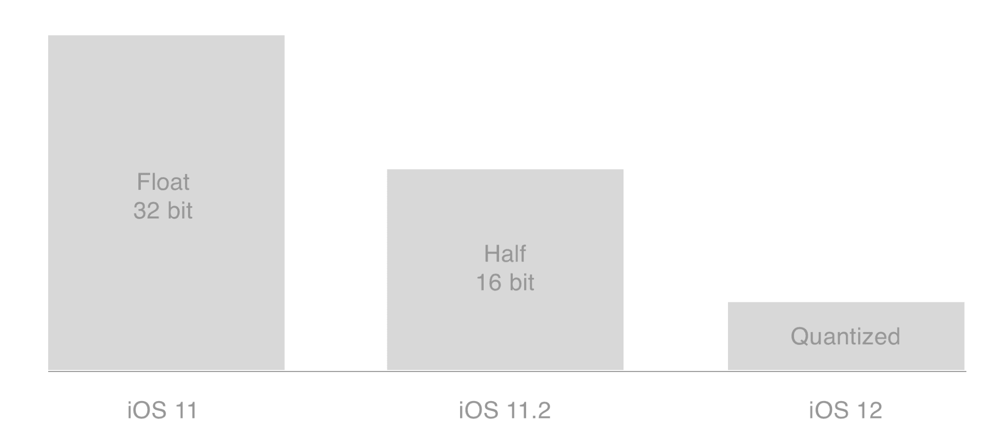

让我们逐一讨论，首先从通过将它的浮点数从 32 位转换为 16 位来降低我们的权重精度开始。

对于这两种技术（半精度和量化），我们将使用 Core ML Tools Python 包；因此，首先打开您的浏览器并转到 [`notebooks.azure.com`](https://notebooks.azure.com)。页面加载后，导航到文件夹 `Chapter6/Notebooks/` 并打开 Jupyter Notebook `FastNeuralStyleTransfer_OptimizeCoreML.ipynb`。像之前一样，我们将在这里逐个介绍 Notebook 的单元格，假设您将按照我们介绍的内容执行每个单元格（如果您正在一起工作的话）。

我们首先导入 Core ML Tools 包；执行以下代码的单元格：

```py
try:
    import coremltools
except:
    !pip install coremltools    
    import coremltools 
```

为了方便起见，我们将 `import` 包裹在一个异常块中，这样如果它不存在，它会自动安装该包。

在撰写本文时，Core ML 2 仍然处于测试版，并且最近才公开宣布。如果您使用的 Core ML Tools 版本低于 2.0，请将 `!pip install coremltools` 替换为 `!pip install coremltools>=2.0b1` 以安装最新的测试版，以便访问本节所需的模块。

接下来，我们将使用以下语句加载我们之前保存的 `mlmodel` 文件：

```py
coreml_model = coremltools.models.MLModel('output/FastStyleTransferVanGoghStarryNight.mlmodel')
```

接下来，我们通过简单地调用 `coremltools.utils.convert_neural_network_weights_to_fp16` 并传入您的模型来执行转换。如果成功，此方法将返回一个等效模型（您传入的模型），使用半精度权重而不是 32 位来存储其权重。运行以下代码的单元格来完成此操作：

```py
 fp16_coreml_model = coremltools.utils.convert_neural_network_weights_to_fp16(coreml_model)
```

最后，我们将其保存下来，以便我们可以在以后下载并导入到我们的项目中；运行下一个单元格的代码：

```py
fp16_coreml_model.save('output/fp16_FastStyleTransferVanGoghStarryNight.mlmodel')
```

执行上述操作（本质上只有三行代码）后，我们已经成功将模型的大小从 2.2 MB 减小到 1.1 MB——那么，有什么问题吗？

如您所料，这里有一个权衡；降低模型权重的精度将影响其准确性，但可能不足以引起关注。您唯一知道的方法是通过比较优化后的模型和原始模型，并在测试数据上重新评估它，确保它满足您所需的准确度/结果。为此，Core ML Tools 提供了一系列工具，使得这个过程相当无缝，您可以在官方网站 [`apple.github.io/coremltools/index.html`](https://apple.github.io/coremltools/index.html) 上了解这些工具。

与通过 Core ML Tools 使用概念相比，量化并不复杂；它是一种巧妙的技术，所以让我们快速讨论它是如何实现 8 位压缩的，然后再运行代码。

从高层次来看，量化是一种将连续值范围映射到离散集的技术；你可以将其视为将你的值聚类到一组离散的组中，然后创建一个查找表，将你的值映射到最近的组。大小现在取决于使用的聚类数量（索引），而不是值，这允许你使用从 8 位到 2 位的任何位数来编码你的权重。

为了使这个概念更具体，以下图表说明了颜色量化的结果；其中 24 位图像被映射到 16 种离散颜色：

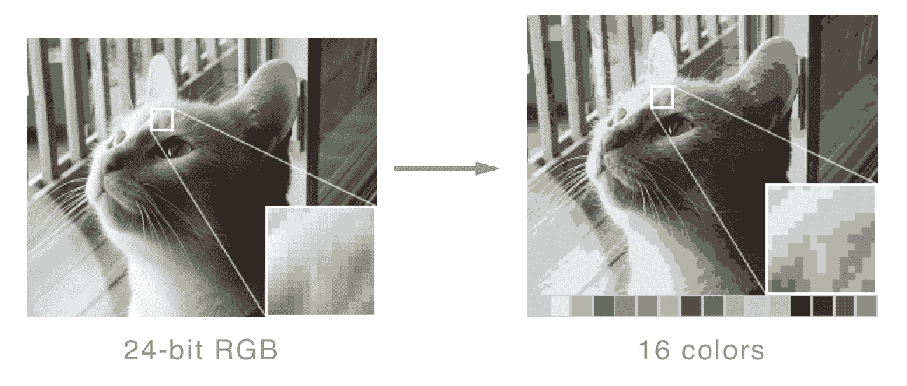

而不是每个像素代表其颜色（使用 24 位/8 位/通道），现在它们现在是 16 色调色板的索引，即从 24 位到 4 位。

在我们使用 Core ML Tools 包进行量化优化模型之前，你可能想知道这种调色板（或离散值集）是如何得到的。简短的回答是，有多种方法，从将值线性分组，到使用 k-means 等无监督学习技术，甚至使用自定义的、特定领域的技巧。Core ML Tools 允许所有变体，选择将取决于你的数据分布和测试期间获得的结果。让我们开始吧；首先，我们将从导入模块开始：

```py
from coremltools.models.neural_network import quantization_utils as quant_utils
```

通过这个声明，我们已经导入了模块并将其分配给别名`quant_utils`；下一个单元，我们将使用不同的大小和方法来优化我们的模型：

```py
lq8_coreml_model = quant_utils.quantize_weights(coreml_model, 8, 'linear')
lq4_coreml_model = quant_utils.quantize_weights(coreml_model, 4, 'linear')
km8_coreml_model = quant_utils.quantize_weights(coreml_model, 8, 'kmeans')
km4_coreml_model = quant_utils.quantize_weights(coreml_model, 4, 'kmeans')
```

完成此操作后，在我们将它们下载到本地磁盘并导入 Xcode 之前，让我们将每个优化后的模型保存到输出目录（这可能需要一些时间）：

```py
coremltools.models.MLModel(lq8_coreml_model) \
    .save('output/lq8_FastStyleTransferVanGoghStarryNight.mlmodel')
coremltools.models.MLModel(lq4_coreml_model) \
    .save('output/lq4_FastStyleTransferVanGoghStarryNight.mlmodel')
coremltools.models.MLModel(km8_coreml_model) \
    .save('output/km8_FastStyleTransferVanGoghStarryNight.mlmodel')
coremltools.models.MLModel(km4_coreml_model) \
    .save('output/km8_FastStyleTransferVanGoghStarryNight.mlmodel')
```

由于我们已经在本章中详细介绍了下载和将模型导入项目的步骤，因此我将省略这些细节，但我确实鼓励你检查每个模型的输出结果，以了解每种优化如何影响结果——当然，这些影响高度依赖于模型、数据和领域。以下图表显示了每种优化的结果以及模型的大小：

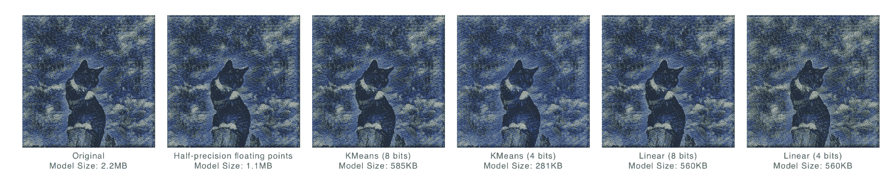

承认，由于图像分辨率低（以及可能因为你正在以黑白阅读），很难看到差异，但一般来说，原始图像和 k-means 8 位版本之间的质量差异很小。

随着 Core ML 2 的发布，Apple 提供了另一个强大的功能来优化您的 Core ML 模型；具体来说，是关于将多个模型合并成一个单一包。这不仅减少了您应用程序的大小，而且对您，即开发者，与模型交互时也方便。例如，灵活的形状和大小允许变量输入和输出维度，也就是说，您有多个变体或在一个限制范围内的变量范围。您可以在他们的官方网站上了解更多关于这个功能的信息：[`developer.apple.com/machine-learning`](https://developer.apple.com/machine-learning)；但在此阶段，我们将在进入下一章之前，对这个章节做一个简要总结。

# 摘要

在本章中，我们介绍了风格迁移的概念；这是一种旨在将图像的内容与其风格分离的技术。我们讨论了它是如何通过利用一个训练好的 CNN 来实现这一点的，我们看到了网络的深层如何提取关于图像内容的特征，同时丢弃任何无关信息。

同样，我们看到较浅的层提取了更细微的细节，如纹理和颜色，我们可以通过寻找每个层的特征图（也称为 **卷积核** 或 **过滤器**）之间的相关性来使用这些细节来隔离给定图像的风格。这些相关性就是我们用来衡量风格和引导我们网络的方法。在隔离了内容和风格之后，我们通过结合两者生成了一个新的图像。

然后，我们指出了在实时进行风格迁移（使用当前技术）的局限性，并介绍了一个轻微的变化。我们不是每次都优化风格和内容，而是训练一个模型来学习特定的风格。这将允许我们通过网络的单次通过为给定的图像生成一个风格化的图像，正如我们在本书中处理的其他许多示例中所做的那样。

在介绍了这些概念之后，我们接着展示了如何将 Keras 模型转换为 Core ML，并借此机会实现自定义层，这是一种以 Swift 为中心的实现层的方法，这些层在机器学习框架和 Core ML 之间没有直接的映射。在实现了自定义层之后，我们花了些时间研究如何使用 `Accelerate`（SIMD）和 `Metal` 框架（GPU）来优化它们。

优化的主题延续到下一节，我们讨论了一些可用于减少模型大小的工具；在那里，我们研究了两种方法，以及我们如何使用 Core ML 工具包以及一个关于大小和精度之间权衡的警告来利用它们。

在下一章中，我们将探讨如何将我们所学应用到识别用户草图。
