# 使用卷积神经网络（CNN）辅助绘图

到目前为止，我们已经看到如何利用 Core ML 以及一般性的**机器学习**（**ML**）来更好地理解我们所生活的物理世界（感知任务）。从设计用户界面的角度来看，这使我们能够减少用户和系统之间的摩擦。例如，如果你能够从用户的面部照片中识别出用户，你可以省去认证所需的步骤，就像 iPhone X 上的 Apple Face ID 功能所展示的那样。有了 Core ML，我们有可能让设备更好地为我们服务，而不是我们为它们服务。这符合开发者 Eric Raymond 提出的一条规则：*一台* *计算机永远不应该要求用户提供任何它可以自动检测、复制或推断的信息*。

我们可以将这个想法进一步深化；给定足够的数据量，我们可以预测用户试图做什么，并帮助他们完成任务。这是本章的基点。在很大程度上受到谷歌的 AutoDraw AI 实验的启发和影响，我们将实现一个应用程序，试图猜测用户试图画什么，并提供预先绘制的图案供用户替换（图像搜索）。

在本章中，我们将通过探讨如何尝试预测用户试图画什么，并为他们找到替换建议来探索这个想法。我们将探讨两种技术。第一种是使用我们越来越熟悉的**卷积神经网络**（**CNN**）来进行预测，然后看看我们如何应用基于上下文的相似度排序策略，以更好地将建议与用户试图绘制的图像对齐。在下一章中，我们将继续探索，看看我们如何使用**循环神经网络**（**RNN**）来完成同样的任务。

到本章结束时，你将：

+   将卷积神经网络（CNN）应用于草图识别任务

+   获得为模型准备输入的更多经验

+   学习如何从卷积神经网络（CNN）中提取特征图，并用于测量两张图像的相似度

有很多内容要介绍，所以让我们从构建一个简单的绘图应用程序开始。

# 向智能界面迈进

在深入探讨如何之前，让我们先快速讨论一下为什么，以便激励我们并鼓励对这一概念进行创造性探索。正如引言中提到的，第一个动机是减少摩擦。考虑一下你手机上的软键盘（没有物理按钮的键盘）；由于媒介的限制，如空间和反馈的缺乏，没有预测文本的输入将会变得繁琐到无法使用的地步。同样，尽管用手指画画很方便，但我们的手指并不那么精确，这使得绘画变得困难。

这个概念（增强）的另一个优点是其民主化绘图技术技能的能力。人们通常甚至不尝试绘图，因为他们已经说服自己这超出了他们的能力范围，或者可能我们认为我们可以提高一个人的绘图能力。这是 2011 年在 SIGGRAPH 上由 Yong Jae Lee、Larry Zitnick 和 Michael Cohen 提出的名为*ShadowDraw*的研究项目的动机。他们的项目表明，通过在用户的笔触下方引导阴影图像，可以显著提高输出质量。

最后，我想强调的最后一个原因是，这个概念为用户提供了一种在更高层次抽象上工作的方法。例如，想象一下，如果你被要求绘制一个新动画的故事板草图。当你绘制场景时，系统会根据正在工作的内容替换你的草图及其相关的角色和道具，让你能够在更高保真度下设计，而不牺牲速度。

希望到现在为止，我已经说服你将人工智能集成到用户界面中的潜在机会。让我们将我们的重点转向“如何”，我们将在下一节开始讨论。

# 绘画

在本节中，我们将首先检查现有的入门应用程序并实现绘图功能。然后，在下一节中，我们将探讨如何通过预测用户试图绘制的图像并提供他们可以替换的替代图像来增强用户。

如果你还没有这样做，请从随附的存储库[`github.com/packtpublishing/machine-learning-with-core-ml`](https://github.com/packtpublishing/machine-learning-with-core-ml)中拉取最新代码。下载后，导航到`Chapter7/Start/QuickDraw/`目录并打开项目`QuickDraw.xcodeproj`。加载后，你将看到本章的入门项目，如下面的屏幕截图所示：

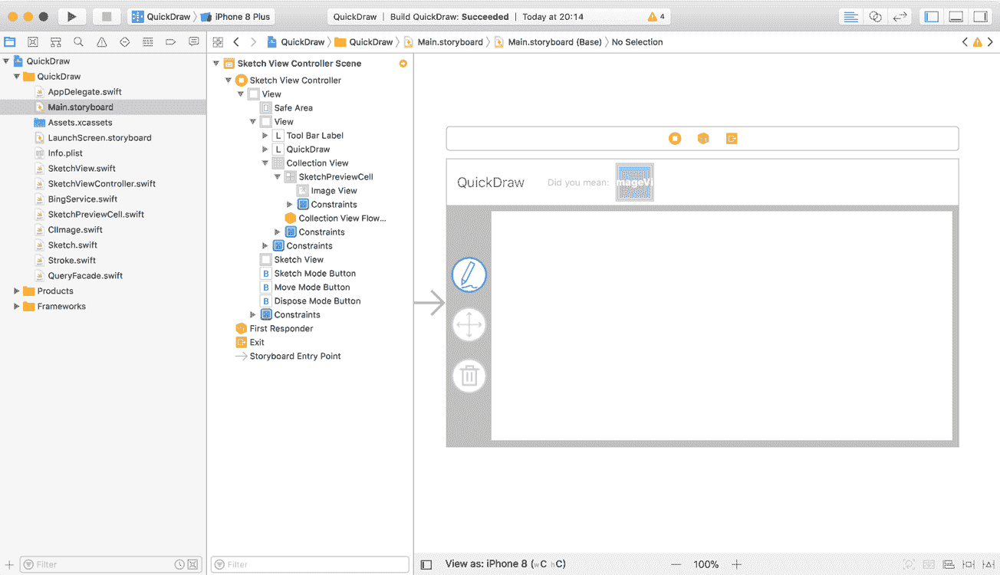

在之前的屏幕截图中，你可以看到应用程序的整体应用；界面由一个视图组成，其中在左侧下方有一个简单的工具栏，允许用户在草图和移动之间切换。有一个清除所有内容的按钮。工具栏右侧的区域是画布，它将负责渲染用户所绘制的任何图像和替代图像。最后，顶部区域由一个标签和集合视图组成。集合视图将使用户可以替换的建议图像可用，而标签只是为了让用户意识到通过集合视图呈现给他们的图像的目的。

如前所述，我们的第一个任务将是实现绘图功能。一些管道工作已经完成，但大部分工作尚未完成，这给了我们一个机会来遍历代码，更好地理解应用程序的架构以及机器学习是如何被集成的。在深入代码之前，让我们简要讨论项目内每个相关源文件的目的。就像一本书的目录一样，这将让你更好地了解事物是如何拼接在一起的，并帮助你更熟悉项目：

+   `SketchView`：这是一个自定义的`UIControl`，负责捕捉用户的触摸并将其转换为绘图。它还将负责渲染这些绘图和替代绘图，即已被替换的草图。如前所述，此控件已添加到视图中。在本节中，我们将实现触摸事件的功能。

+   `SketchViewController`：这是主视图背后的控制器，负责监听用户完成编辑（抬起他们的指针）并将当前草图传递给`QueryFacade`进行处理。此控制器还负责处理模式切换（草图、移动或清除所有内容）以及在移动模式下在屏幕上拖动草图。

+   `BingService`：我们将使用微软的 Bing 图像搜索 API 来查找我们的建议图像。Bing 提供了一个简单的 RESTful 服务，允许进行图像搜索，以及一些相关参数来微调你的搜索。注意：我们不会编辑这个。

+   `SketchPreviewCell`：这是`UICollectionViewCell`类的一个简单扩展，使得嵌套在单元格内的`UIImageView`可用。注意：我们不会编辑这个。

+   `CIImage`：你应该很熟悉——这是我们之前在第三章中实现的，*识别世界中的物体*。我们将在此章中广泛使用它来进行缩放和获取图像的原始数据（包括草图）。

+   `Sketch`：这是我们草图的模式；我们将实现两个版本。一个是用于渲染用户创建的草图，由笔触构成，另一个是用于封装一个`UIImage`，它替代了草图（笔触）。

+   `Stroke`：一个描述草图一部分的数据对象，本质上编码了用户绘制的路径，以便我们可以渲染它。

+   `QueryFacade`：这是一个将执行所有繁重工作的类。一旦用户完成编辑，视图控制器将导出草图并将其传递给`QueryFacade`，该类将负责三件事：猜测用户试图绘制的内容、获取和下载相关建议，并在将它们排序后传递回视图控制器，通过集合视图向用户展示。此过程的示意图如下：

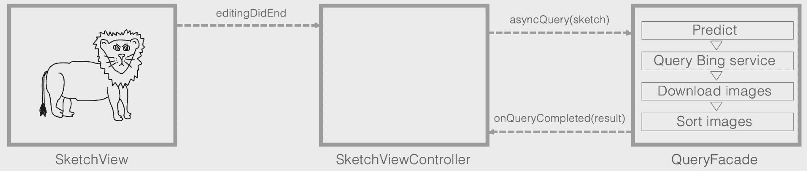

希望你现在对如何将所有事物串联起来有了更好的理解；让我们从底部开始，逐步构建。点击`Stroke.swift`文件以将文件聚焦在主区域；一旦打开，你会看到一个不太显眼的代码量，正如这个片段所示：

```py
import UIKit
    class Stroke{    
}
```

只为了回顾一下，`Stroke`的目的在于封装用户绘制的单个路径，以便在将其重新渲染到屏幕上时能够重新创建它。路径不过是一系列点，这些点在用户沿着屏幕移动手指时被捕获。除了路径之外，我们还将存储笔迹的颜色和宽度；这些决定了笔迹的视觉美学。将以下属性添加到`Stroke`类中，以及类的构造函数：

```py
var points : [CGPoint] = [CGPoint]()
var color : UIColor!
var width : CGFloat!

init(startingPoint:CGPoint,
     color:UIColor=UIColor.black,
     width:CGFloat=10.0) {
    self.points.append(startingPoint)
    self.color = color
    self.width = width
}
```

接下来，我们将向我们的`Stroke`类添加一些计算属性，这些属性将在渲染和导出草图时使用。从辅助渲染的属性开始，我们将使用 Core Graphics 框架来渲染与草图关联的每条笔迹的路径。渲染是通过 Core Graphics 上下文（`CGContext`）完成的，它方便地公开了使用`addPath`和`drawPath`方法渲染路径的方法，我们很快就会看到。`addPath`方法期望一个`CGPath`类型，这不过是一系列绘图指令，描述了如何绘制路径，我们可以很容易地从笔迹的点中推导出来。现在让我们这样做；将`path`属性添加到`Stroke`类中：

```py
var path : CGPath{
    get{
        let path = CGMutablePath.init()
        if points.count > 0{
            for (idx, point) in self.points.enumerated(){
                if idx == 0{
                    path.move(to: point)
                } else{
                    path.addLine(to: point)
                }
            }
        }        
        return path
    }
}
```

如前所述，`CGPath`由一系列绘图指令组成。在前面的片段中，我们正在使用与`Stroke`关联的点创建路径。除了第一个之外，所有其他点都通过线条连接，而第一个只是将其移动到正确的位置。

Core Graphics 框架是一个轻量级且底层的 2D 绘图引擎。它包括基于路径的绘图、变换、颜色管理、离屏渲染、图案和阴影、图像创建和图像蒙版等功能。

我们接下来的两个属性用于获取草图的边界框，即包含所有笔迹的最小和最大`x`和`y`位置的边界。在笔迹本身中实现这些将使我们的任务更容易。将`minPoint`和`maxPoint`属性添加到你的`Stroke`类中，如下面的代码块所示：

```py
var minPoint : CGPoint{
    get{
        guard points.count > 0 else{
            return CGPoint(x: 0, y: 0)
        }

        let minX : CGFloat = points.map { (cp) -> CGFloat in
            return cp.x
            }.min() ?? 0

        let minY : CGFloat = points.map { (cp) -> CGFloat in
            return cp.y
            }.min() ?? 0

        return CGPoint(x: minX, y: minY)
    }
}

var maxPoint : CGPoint{
    get{
        guard points.count > 0 else{
            return CGPoint(x: 0, y: 0)
        }

        let maxX : CGFloat = points.map { (cp) -> CGFloat in
            return cp.x
            }.max() ?? 0

        let maxY : CGFloat = points.map { (cp) -> CGFloat in
            return cp.y
            }.max() ?? 0

        return CGPoint(x: maxX, y: maxY)
    }
}
```

对于每个属性，我们只是将每个轴（*x*和*y*）映射到它自己的数组中，然后根据它们的方法找到最小值或最大值。现在我们已经完成了`Stroke`类的构建。让我们向上移动到层，并实现`Sketch`类的功能。从左侧面板中选择`Sketch.swift`以在编辑窗口中打开。在做出修改之前，让我们检查一下已经存在的内容以及还需要完成的工作：

```py
protocol Sketch : class{
    var boundingBox : CGRect{ get }
    var center : CGPoint{ get set }
    func draw(context:CGContext)
    func exportSketch(size:CGSize?) -> CIImage?
}
```

目前，尚无具体的类存在，这将是本节这一部分的我们的任务。在我们开始编码之前，让我们回顾一下 `Sketch` 的职责。如前所述，我们的 `Sketch` 将负责渲染与用户绘图相关的笔划集合或用户选择的用于替代自己绘图的图像。因此，我们将使用 `Stroke` 类的两个实现，一个专门用于处理笔划，另一个用于图像；我们将从负责管理和渲染笔划的那个开始。

每个实现都应公开一个 `draw` 和 `exportSketch` 方法以及 `boundingBox` 和 `center` 属性。现在让我们简要地描述一下这些方法，从最明显的 `draw` 方法开始。我们期望 `Sketch` 负责渲染自身，无论是绘制每一笔还是根据草图类型渲染指定的图像。`exportSketch` 方法将用于获取草图的矢量版本，并依赖于 `boundingBox` 属性，使用它来确定画布上包含信息（即绘图）的区域。然后，它将草图矢量化为 `CIImage`，这可以随后用于喂养模型。最后一个属性 `center` 返回并设置中心点，在用户在移动模式下拖动它时使用，如前所述。

现在让我们继续实现一个处理笔划的 `Sketch` 的具体版本。在 `Sketch` 类中添加以下代码，仍然在 `Sketch.swift` 文件中：

```py
class StrokeSketch : Sketch{
    var label : String?  
    var strokes = [Stroke]()
    var currentStroke : Stroke?{
        get{
            return strokes.count > 0 ? strokes.last : nil 
        }
    }   
    func addStroke(stroke:Stroke){
        self.strokes.append(stroke)
    }
}  
```

在这里，我们定义了一个新的类 `StrokeSketch`，遵循 `Sketch` 协议。我们定义了两个属性：一个用于存储所有笔划的列表，一个字符串，我们可以用它来注释草图。我们还公开了两个辅助方法。一个是返回当前笔划，在用户绘图时使用，另一个是方便地添加新笔划的方法。

现在让我们实现负责渲染草图的函数；将以下代码添加到 `StrokeSketch` 类中：

```py
 func draw(context:CGContext){
    self.drawStrokes(context:context)
}

func drawStrokes(context:CGContext){
    for stroke in self.strokes{
        self.drawStroke(context: context, stroke: stroke)
    }
}

private func drawStroke(context:CGContext, stroke:Stroke){
    context.setStrokeColor(stroke.color.cgColor)
    context.setLineWidth(stroke.width)
    context.addPath(stroke.path)
    context.drawPath(using: .stroke)
} 
```

我们将实现协议的 `draw` 方法，但将绘制任务委托给 `drawStrokes` 和 `drawStroke` 方法。`drawStrokes` 方法简单地遍历我们草图类当前持有的所有笔划，并将它们传递给 `drawStroke` 方法，传递 Core Graphics 上下文和当前的 `Stroke` 引用。在 `drawStroke` 方法中，我们首先更新上下文的笔划颜色和线宽，然后继续添加并绘制相关的路径。现在我们已经实现了这一点，用户可以绘制了。但为了完整性，让我们实现获取边界框、获取和更新草图、中心和将草图矢量化为 `CIImage` 的功能。我们从 `boundingBox` 属性及其相关方法开始。将以下代码添加到 `StrokeSketch` 类中：

```py
var minPoint : CGPoint{
    get{
        guard strokes.count > 0 else{
            return CGPoint(x: 0, y: 0)
        }

        let minPoints = strokes.map { (stroke) -> CGPoint in
            return stroke.minPoint
        }

        let minX : CGFloat = minPoints.map { (cp) -> CGFloat in
            return cp.x
            }.min() ?? 0

        let minY : CGFloat = minPoints.map { (cp) -> CGFloat in
            return cp.y
            }.min() ?? 0

        return CGPoint(x: minX, y: minY)
    }
}

var maxPoint : CGPoint{
    get{
        guard strokes.count > 0 else{
            return CGPoint(x: 0, y: 0)
        }

        let maxPoints = strokes.map { (stroke) -> CGPoint in
            return stroke.maxPoint
        }

        let maxX : CGFloat = maxPoints.map { (cp) -> CGFloat in
            return cp.x
            }.max() ?? 0

        let maxY : CGFloat = maxPoints.map { (cp) -> CGFloat in
            return cp.y
            }.max() ?? 0

        return CGPoint(x: maxX, y: maxY)
    }
}

var boundingBox : CGRect{
    get{
        let minPoint = self.minPoint
        let maxPoint = self.maxPoint

        let size = CGSize(width: maxPoint.x - minPoint.x, height: maxPoint.y - minPoint.y)

        let paddingSize = CGSize(width: 5,
                                 height: 5)

        return CGRect(x: minPoint.x - paddingSize.width,
                      y: minPoint.y - paddingSize.height,
                      width: size.width + (paddingSize.width * 2),
                      height: size.height + (paddingSize.height * 2))
    }
}
```

我们首先实现了`minPoint`和`maxPoint`属性；它们类似于我们`Stroke`类中的`minPoint`和`maxPoint`。但它们不是在点集合上操作，而是在笔划集合上操作，并利用它们的对应物（`Stroke`类的`minPoint`和`maxPoint`属性）。接下来，我们实现了`boundingBox`属性，它创建一个`CGRect`，包含这些最小和最大点，并添加一些填充以避免裁剪笔划本身。

现在，我们将实现`Stroke`协议中声明的`center`属性。这个协议期望实现`get`和`set`块。获取器将简单地返回我们刚刚实现的边界框的中心，而设置器将遍历所有笔划并使用前一个中心和新的中心值之间的差异来平移每个点。让我们现在实现它。将以下代码添加到您的`StrokeSketch`类中；在这里，`boundingBox`属性是一个很好的位置：

```py
var center : CGPoint{
    get{
        let bbox = self.boundingBox
        return CGPoint(x:bbox.origin.x + bbox.size.width/2,
                       y:bbox.origin.y + bbox.size.height/2)
    }
    set{
        let previousCenter = self.center
        let newCenter = newValue
        let translation = CGPoint(x:newCenter.x - previousCenter.x,
                                  y:newCenter.y - previousCenter.y)
        for stroke in self.strokes{
            for i in 0..<stroke.points.count{
                stroke.points[i] = CGPoint(
                    x:stroke.points[i].x + translation.x,
                    y:stroke.points[i].y + translation.y)
            }
        }
    }
}
```

在这里，我们首先获取当前中心，然后计算这个中心与分配给属性的新的中心之间的差异。之后，我们遍历所有笔划及其相应的点，添加这个偏移量。

我们需要实现的最后一个方法以符合 Sketch 协议是`exportSketch`。这个方法的目的是将草图光栅化成图像（`CIImage`），并根据`size`参数进行缩放（如果有的话）；否则，它默认为草图本身的实际大小。这个方法本身相当长，但并没有做过于复杂的事情。我们已经在`draw`方法中实现了渲染草图的功能。但不是将渲染到由视图传入的 Core Graphics 上下文中，而是想要创建一个新的上下文，根据大小参数和实际的草图尺寸调整比例，并最终从它创建一个`CIImage`实例。

为了使其更易于阅读，让我们将方法分解为这些部分，从计算比例开始。然后我们将查看创建和渲染到`context`的过程，最后将其包裹在`CIImage`中；将以下代码添加到您的`StrokeSketch`类中：

```py
func exportSketch(size:CGSize?=nil) -> CIImage?{
    let boundingBox = self.boundingBox
    let targetSize = size ?? CGSize(
        width: max(boundingBox.width, boundingBox.height),
        height: max(boundingBox.width, boundingBox.height))

    var scale : CGFloat = 1.0

    if boundingBox.width > boundingBox.height{
        scale = targetSize.width / (boundingBox.width)
    } else{
        scale = targetSize.height / (boundingBox.height)
    }

    guard boundingBox.width > 0, boundingBox.height > 0 else{
        return nil
    }     
}
```

在这个代码块中，我们声明了我们的方法并实现了确定导出大小和比例的功能。如果没有传递大小，我们则简单地回退到草图边界框属性的尺寸。最后，我们确保我们有一些可以导出的内容。

现在我们任务是创建`context`并根据导出的比例渲染草图；将以下代码添加到`exportSketch`方法中：

```py
UIGraphicsBeginImageContextWithOptions(targetSize, true, 1.0)

guard let context = UIGraphicsGetCurrentContext() else{
    return nil
}

UIGraphicsPushContext(context)

UIColor.white.setFill()
context.fill(CGRect(x: 0, y: 0,
                    width: targetSize.width, height: targetSize.height))

context.scaleBy(x: scale, y: scale)

let scaledSize = CGSize(width: boundingBox.width * scale, height: boundingBox.height * scale)

context.translateBy(x: -boundingBox.origin.x + (targetSize.width - scaledSize.width)/2,
                    y: -boundingBox.origin.y + (targetSize.height - scaledSize.height)/2)

self.drawStrokes(context: context)

UIGraphicsPopContext()
```

我们使用 Core Graphics 中的 `UIGraphicsBeginImageContextWithOptions` 方法来创建一个新的 `context`，并通过 `UIGraphicsGetCurrentContext` 方法获取对这个 `context` 的引用。`UIGraphicsBeginImageContextWithOptions` 创建一个临时的渲染上下文，其中第一个参数是此上下文的目标大小，第二个参数确定我们是否使用不透明或透明背景，最后一个参数确定显示缩放因子。然后我们用白色填充 `context`，并使用 `scaleBy` 方法更新上下文的 `CGAffineTransform` 属性。随后的绘制方法，如移动和绘制，都将通过这种方式进行变换，这为我们很好地处理了缩放。然后我们将这个 `context` 传递给我们的 sketch 的 `draw` 方法，该方法负责将 sketch 渲染到上下文中。我们的最终任务是获取 `context` 中的图像并将其包装在一个 `CIImage` 实例中。现在让我们来做这件事；将以下代码添加到您的 `exportSketch` 方法中：

```py
guard let image = UIGraphicsGetImageFromCurrentImageContext() else{
    UIGraphicsEndImageContext()
    return nil
}
UIGraphicsEndImageContext()

return image.ciImage != nil ? image.ciImage : CIImage(cgImage: image.cgImage!)
```

多亏了 Core Graphics 方法 `UIGraphicsGetImageFromCurrentImageContext`，这项任务变得非常简单。`UIGraphicsGetImageFromCurrentImageContext` 返回一个包含上下文光栅化版本的 `CGImage` 实例。要创建一个 `CIImage` 实例，我们只需将我们的图像传递给构造函数并返回它。

我们已经完成了 `Sketch` 类——至少目前是这样——并且我们正缓慢地向上层移动。接下来，我们将完善 `SketchView` 类，它将负责促进 sketch 的创建和绘制。从左侧面板选择 `SketchView.swift` 文件，将其在编辑窗口中打开，让我们快速回顾现有的代码。`SketchView` 已经使用扩展被分解成块；为了使代码更易读，我们将展示每个块及其核心功能：

```py
class SketchView: UIControl {
    var clearColor : UIColor = UIColor.white
    var strokeColor : UIColor = UIColor.black
    var strokeWidth : CGFloat = 1.0
    var sketches = [Sketch]()
    var currentSketch : Sketch?{
        get{
            return self.sketches.count > 0 ? self.sketches.last : nil
        }
        set{
            if let newValue = newValue{
                if self.sketches.count > 0{
                    self.sketches[self.sketches.count-1] = newValue
                } else{
                    self.sketches.append(newValue)
                }
            } else if self.sketches.count > 0{
                self.sketches.removeLast()
            }
            self.setNeedsDisplay()
        }
    }

    override init(frame: CGRect) {
        super.init(frame: frame)
    }

    required init?(coder aDecoder: NSCoder) {
        super.init(coder: aDecoder)
    }

    func removeAllSketches(){
        self.sketches.removeAll()
        self.setNeedsDisplay()
    }
}  
```

之前的代码的大部分应该是自解释的，但我确实想快速将您的注意力引到 `currentSketch` 属性上；我们将使用这个获取器为我们提供一个方便的方式来获取最后一个 sketch，我们将认为它是当前活动的 sketch。设置器稍微有些模糊；它为我们提供了一个方便的方式来替换当前活动（最后一个）的 sketch，当我们处理用用户建议的图像替换用户的 sketch 时，我们将使用它。下一个块实现了绘制功能，这应该对您来说很熟悉；在这里，我们只是清除 `context` 并遍历所有 sketch，将绘制委托给它们：

```py
extension SketchView{ 
    override func draw(_ rect: CGRect) {
        guard let context = UIGraphicsGetCurrentContext() else{ return }
        self.clearColor.setFill()
        UIRectFill(self.bounds)
        // them draw themselves
        for sketch in self.sketches{
            sketch.draw(context: context)
        }
    }
}  
```

我们最后的块将负责实现绘制功能；目前，我们只是创建了拦截触摸事件的占位方法。完善这些方法将是我们的下一个任务：

```py
extension SketchView{
    override func beginTracking(_ touch: UITouch, 
                                with event: UIEvent?) -> Bool{
        return true
    }
    override func continueTracking(_ touch: UITouch?, 
                                   with event: UIEvent?) -> Bool {
        return true
    }
    override func endTracking(_ touch: UITouch?, 
                              with event: UIEvent?) {        
    }
    override func cancelTracking(with event: UIEvent?) { 
    }
}
```

在我们编写代码之前，让我们简要回顾一下我们在这里试图实现的目标。如前所述，`SketchView`将负责功能，允许用户用手指绘图。我们过去几页构建了支持此功能的数据对象（`Stroke`和`Sketch`），我们将在这里使用它们。

当用户第一次触摸视图时（`beginTracking`），触摸开始。当我们检测到这一点时，我们首先检查是否有一个当前活动且合适的草图；如果没有，我们将创建一个并将其设置为当前草图。接下来，我们将创建一个笔划，用于跟踪用户在屏幕上拖动手指。一旦用户抬起手指或手指被拖出视图边界，它就被认为是完成的。然后我们将请求视图重新绘制自己，并通过广播事件`UIControlEvents.editingDidBegin`动作通知任何监听方。让我们将这些放入代码中；将以下代码添加到`SketchView`类中的`beginTracking`方法内：

```py
let point = touch.location(in: self)
if sketches.count == 0 || !(sketches.last is StrokeSketch){
    sketches.append(StrokeSketch())
}
guard let sketch = self.sketches.last as? StrokeSketch else {
    return false
}
sketch.addStroke(stroke:Stroke(startingPoint: point,
                               color:self.strokeColor,
                               width:self.strokeWidth))
self.setNeedsDisplay()
self.sendActions(for: UIControlEvents.editingDidBegin)
return true
```

如 iOS 文档所述，在此，我们遵循常见的控件中的目标-动作机制，通过广播有趣的事件来简化其他类如何与该控件集成。

接下来，我们将实现`continueTracking`方法的主体；在这里，我们只是将一个新的点添加到当前草图当前笔划中。正如我们之前所做的那样，我们请求视图重新绘制自己并广播`UIControlEvents.editingChanged`动作。将以下代码添加到`continueTracking`方法的主体中：

```py
guard let sketch = self.sketches.last as? StrokeSketch, let touch = touch else{
    return false
}
let point = touch.location(in: self)
sketch.currentStroke?.points.append(point)
self.setNeedsDisplay()
self.sendActions(for: UIControlEvents.editingChanged)
return true
```

之前的代码与用户抬起手指时我们需要的大部分代码相似，除了返回 true（这告诉平台该视图希望继续消耗事件）以及将`UIControlEvents.editingChanged`事件替换为`UIControlEvents.editingDidEnd`。将以下代码添加到你的`endTracking`方法主体中：

```py
guard let sketch = self.sketches.last as? StrokeSketch, let touch = touch else{
    return
}
let point = touch.location(in: self)
sketch.currentStroke?.points.append(point)
self.setNeedsDisplay()
self.sendActions(for: UIControlEvents.editingDidEnd)
```

我们需要添加到`SketchView`类的最后一部分代码是处理当前手指跟踪被取消的情况（当手指从当前视图移出或超出设备的跟踪范围，即移出屏幕时触发）。在这里，我们只是将其视为跟踪已完成，除了不添加最后一个点。将以下代码添加到你的`cancelTracking`方法主体中：

```py
guard let _ = self.sketches.last as? StrokeSketch else{
    return
}
self.setNeedsDisplay()
self.sendActions(for: UIControlEvents.editingDidEnd)
```

我们的`SketchView`完成之后，我们的应用程序现在支持绘图功能。现在是时候在模拟器或设备上构建并运行应用程序，以检查一切是否正常工作。如果是这样，那么你应该能够在屏幕上绘制，如下面的图像所示：

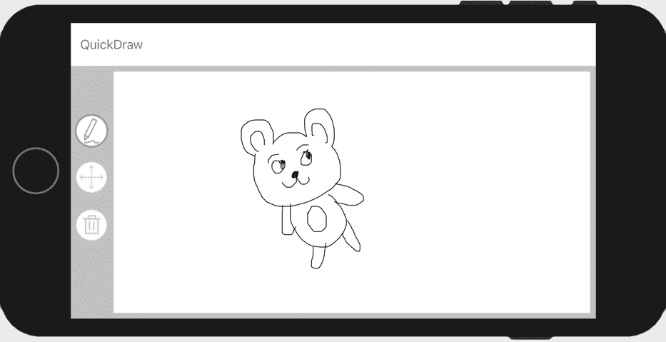

移动和清除画布的功能已经实现；点击移动按钮可以拖动你的草图，点击垃圾桶按钮可以清除画布。我们的下一个任务将是导入一个训练好的 Core ML 模型，并实现为用户分类和推荐图像的功能。

# 识别用户的草图

在本节中，我们将首先回顾我们将使用的数据集和模型，以猜测用户正在绘制的内容。然后，我们将将其集成到正在绘制用户的流程中，并实现替换用户草图与所选图像的功能。

# 检查训练数据和模型

对于本章，我们使用 Mathias Eitz、James Hays 和 Marc Alexa 在 2012 年 SIGGRAPH 上发表的研究论文《人类如何绘制物体？》中使用并公开的数据集训练了一个 CNN。该论文比较了人类对草图进行分类的性能与机器的性能。数据集包含 20,000 个草图，均匀分布在 250 个对象类别中，从飞机到斑马；这里展示了几个示例：

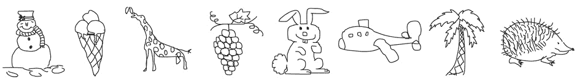

从感知研究中，他们发现人类正确识别草图的对象类别（如雪人、葡萄等）的比例为 73%。他们的竞争对手，他们的机器学习模型，正确识别的比例为 56%。还不错！你可以在官方网站上了解更多关于这项研究并下载相关数据集：[`cybertron.cg.tu-berlin.de/eitz/projects/classifysketch/`](http://cybertron.cg.tu-berlin.de/eitz/projects/classifysketch/).

在这个项目中，我们将使用一个稍微小一些的集合，其中 250 个类别中有 205 个；具体的类别可以在 CSV 文件 `/Chapter7/Training/sketch_classes.csv` 中找到，以及用于准备数据和训练模型的 Jupyter Notebooks。原始草图以 SVG 和 PNG 格式提供。由于我们使用的是 CNN，因此使用了光栅化图像（PNG），但已从 1111 x 1111 重新缩放为 256 x 256；这是我们模型的预期输入。然后，数据被分为训练集和验证集，其中 80%（每个类别的 64 个样本）用于训练，20%（每个类别的 17 个样本）用于验证。

网络架构与之前章节中使用的大致相似，只是第一层使用了更大的核窗口来提取草图的辅助特征，如下所示：

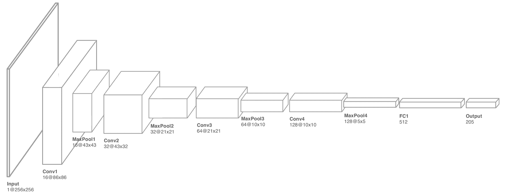

回想一下，将卷积层堆叠在一起允许模型构建一组共享的高级模式，然后可以使用这些模式进行分类，而不是使用原始像素。最后一个卷积层被展平，然后输入到全连接层，在那里最终做出预测。你可以将这些全连接节点视为当输入中存在某些（高级）模式时开启的开关，如下面的图表所示。我们将在本章后面实现排序时回到这个概念。

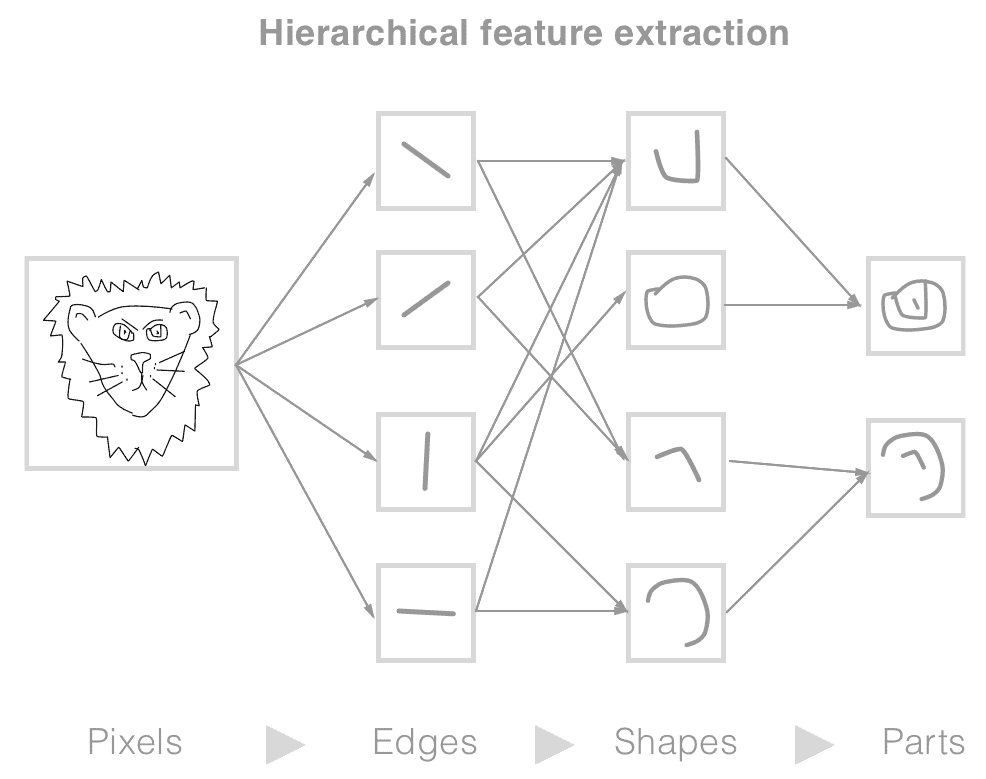

经过 68 次迭代（周期）后，模型在验证数据上达到了大约 65%的准确率。并不算出色，但如果考虑前两个或三个预测，那么这个准确率会增加到近 90%。以下图表显示了训练和验证准确率以及训练过程中的损失：

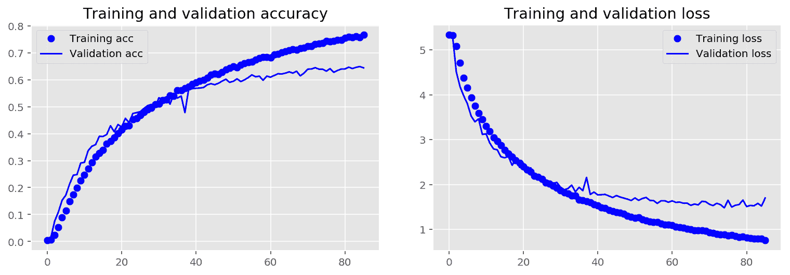

在我们的模型训练完成后，下一步是使用苹果提供的 Core ML 工具（如前几章所述）将其导出，并将其导入到我们的项目中。

# 绘图分类

在本节中，我们将介绍如何将 Core ML 模型导入到我们的项目中，并将其连接起来，包括使用模型对用户的草图进行推理，以及搜索和推荐替代图像供用户替换草图。让我们开始将 Core ML 模型导入到我们的项目中。

在项目仓库文件夹`/CoreMLModels/Chapter7/cnnsketchclassifier.mlmodel`中定位模型；选择模型后，将其拖入你的 Xcode 项目，保留导入选项的默认设置。一旦导入，选择模型以检查详细信息，应该类似于以下截图：

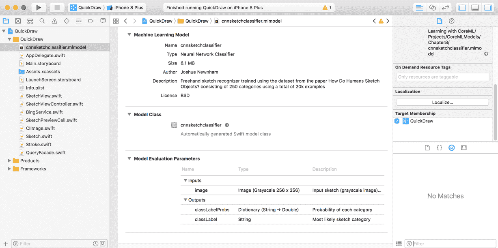

正如我们所有的模型一样，我们验证模型是否包含在目标中，通过检查适当的 Target Membership 是否被选中，然后我们将注意力转向输入和输出，这些现在应该已经很熟悉了。我们可以看到，我们的模型期望一个单通道（灰度）256 x 256 的图像，并通过输出对象的 classLabel 属性返回主导类别，同时通过 classLabelProbs 属性返回所有类别的概率字典。

现在我们已经导入了模型，让我们讨论如何将其集成到我们的项目中的细节。回想一下，我们的`SketchView`在用户绘制时发出`UIControlEvents.editingDidStart`、`UIControlEvents.editingChanged`和`UIControlEvents.editingDidEnd`事件。如果你检查`SketchViewController`，你会看到我们已经注册了监听`UIControlEvents.editingDidEnd`事件，如下面的代码片段所示：

```py
override func viewDidLoad() {
        super.viewDidLoad()
        ...
        ...
        self.sketchView.addTarget(self, action:
 #selector(SketchViewController.onSketchViewEditingDidEnd),
 for: .editingDidEnd)
        queryFacade.delegate = self 
}
```

每当用户结束一笔画时，我们将开始尝试猜测用户正在绘制的草图并搜索合适的替代品。此功能通过`.editingDidEnd`动作方法`onSketchViewEditingDidEnd`触发，但将被委托给`QueryFacade`类，该类将负责实现此功能。这就是我们将在这个部分和下一个部分花费大部分时间的地方。同时，也值得在之前的代码片段中突出显示`queryFacade.delegate = self`这一声明。`QueryFacade`将在主线程之外执行大部分工作，并在完成后通知此代理状态和结果，我们将在稍后讨论。

让我们先实现`onSketchViewEditingDidEnd`方法的功能，然后再关注`QueryFacade`类。在`SketchViewController`类中，导航到`onSketchViewEditingDidEnd`方法，并添加以下代码：

```py
guard self.sketchView.currentSketch != nil,
    let sketch = self.sketchView.currentSketch as? StrokeSketch else{
    return
} 

queryFacade.asyncQuery(sketch: sketch)
```

在这里，我们正在获取当前草图，如果没有草图可用或它不是一个`StrokeSketch`，则返回它；我们将其交给我们的`queryFacade`（`QueryFacade`类的一个实例）。现在让我们将注意力转向`QueryFacade`类；在 Xcode 的左侧面板中选择`QueryFacade.swift`文件，将其在编辑区域中打开。已经实现了很多底层代码，以便我们能够专注于预测、搜索和排序的核心功能。让我们快速讨论一些细节，从属性开始：

```py
let context = CIContext()
let queryQueue = DispatchQueue(label: "query_queue")
var targetSize = CGSize(width: 256, height: 256)
weak var delegate : QueryDelegate?
var currentSketch : Sketch?{
    didSet{
        self.newQueryWaiting = true
        self.queryCanceled = false
    }
}

fileprivate var queryCanceled : Bool = false
fileprivate var newQueryWaiting : Bool = false
fileprivate var processingQuery : Bool = false
var isProcessingQuery : Bool{
    get{
        return self.processingQuery
    }
}

var isInterrupted : Bool{
    get{
        return self.queryCanceled || self.newQueryWaiting
    }
} 
```

`QueryFacade`只关注最新的草图。因此，每次使用`currentSketch`属性分配新的草图时，`queryCanceled`被设置为`true`。在每次任务（如执行预测、搜索和下载）期间，我们检查`isInterrupted`属性，如果为`true`，则提前退出并继续处理最新的草图。

当你将草图传递给`asyncQuery`方法时，草图被分配给`currentSketch`属性，然后继续调用`queryCurrentSketch`方法来完成大部分工作，除非当前有一个正在处理中：

```py
func asyncQuery(sketch:Sketch){
    self.currentSketch = sketch

    if !self.processingQuery{
        self.queryCurrentSketch()
    }
}

fileprivate func processNextQuery(){
    self.queryCanceled = false

    if self.newQueryWaiting && !self.processingQuery{
        self.queryCurrentSketch()
    }
}

fileprivate func queryCurrentSketch(){
    guard let sketch = self.currentSketch else{
        self.processingQuery = false
        self.newQueryWaiting = false

        return
    }

    self.processingQuery = true
    self.newQueryWaiting = false

    queryQueue.async {

        DispatchQueue.main.async{
            self.processingQuery = false
            self.delegate?.onQueryCompleted(
                status:self.isInterrupted ? -1 : -1,
                result:nil)
            self.processNextQuery()
        }
    }
}
```

最终，我们到达`queryCurrentSketch`方法，我们将在这里转向并实现所需的功能。但在这样做之前，让我们快速讨论我们将要做什么。

回想一下，我们的目标是帮助用户快速绘制场景；我们计划通过预测用户试图绘制的内容并建议图像来实现这一点，用户可以用这些图像替换他们的草图。预测是这个系统的主要组成部分，使用我们刚刚导入的训练模型进行，但请记住，我们在验证数据集上达到了大约 65%的准确率。这留下了很多错误的空间，可能会抑制用户而不是增强他们。为了减轻这一点并提供更多功能，我们将选择前 3-4 个预测并拉下相关图像，而不是依赖于单一分类。

我们将这些预测类别传递给微软的 Bing 图像搜索 API 以查找相关图像，然后继续下载每个图像（虽然这并不是最优化方法，但对于实现这个原型来说是足够的）。一旦我们下载了图像，我们将根据每个图像与用户所绘制的图像的相似度对图像进行排序，我们将在下一节中回到这一点，但现在我们将专注于这一步骤之前的过程。让我们继续猜测用户试图做什么。

如我们之前所做的那样，让我们自下而上地工作，在将所有支持方法在 `queryCurrentSketch` 方法中整合在一起之前先实现它们。让我们首先声明我们模型的实例；在 `QueryFacade` 类的顶部附近添加以下变量：

```py
let sketchClassifier = cnnsketchclassifier()
```

现在，我们的模型已经实例化并准备就绪，我们将导航到 `QueryFacade` 类的 `classifySketch` 方法；在这里，我们将使用我们导入的模型进行推理，但让我们首先回顾一下已经存在的内容：

```py
func classifySketch(sketch:Sketch) -> [(key:String,value:Double)]?{
    if let img = sketch.exportSketch(size: nil)?
        .resize(size: self.targetSize).rescalePixels(){
        return self.classifySketch(image: img)
    }    
    return nil
}
func classifySketch(image:CIImage) -> [(key:String,value:Double)]?{    
    return nil
}
```

在这里，我们可以看到 `classifySketch` 是重载的，一个方法接受一个 `Sketch`，另一个接受一个 `CIImage`。当调用前者时，将使用 `exportSketch` 方法获取草图的光栅化版本。如果成功，它将使用 `targetSize` 属性调整光栅化图像的大小。然后，它将调整像素值，然后将准备好的 `CIImage` 传递给备选的 `classifySketch` 方法。

像素值在 0-255（每个通道；在这种情况下，只有一个通道）的范围内。通常，你试图避免在网络中拥有大数字。原因是它们会使你的模型学习（收敛）变得更加困难——某种程度上类似于试图驾驶一个方向盘只能向左或向右硬转的车。这些极端会导致大量过度转向，使导航变得极其困难。

第二个 `classifySketch` 方法将负责执行实际推理；我们已经在第三章，“世界中的物体识别”中看到如何做到这一点。在 `classifySketch(image:CIImage)` 方法内添加以下代码：

```py
if let pixelBuffer = image.toPixelBuffer(context: self.context, gray: true){
    let prediction = try? self.sketchClassifier.prediction(image: pixelBuffer)

    if let classPredictions = prediction?.classLabelProbs{
        let sortedClassPredictions = classPredictions.sorted(by: { (kvp1, kvp2) -> Bool in
            kvp1.value > kvp2.value
        })

        return sortedClassPredictions
    }
}

return nil
```

在这里，我们使用图像、`toPixelBuffer`方法，这是我们之前在第三章中添加到`CIImage`类的一个扩展，以获得其自身的灰度`CVPixelBuffer`表示。现在，根据其缓冲区，我们将其传递给我们的模型实例`sketchClassifier`的`prediction`方法，以获得每个标签的概率。我们最终将这些概率从最有可能到最不可能进行排序，然后将排序后的结果返回给调用者。

现在，根据我们对用户试图绘制的对象的了解，我们将继续搜索和下载我们最有信心的一些图像。搜索和下载的任务将由`QueryFacade`类中的`downloadImages`方法负责。此方法将使用现有的`BingService`，该服务公开了搜索和下载图像的方法。现在让我们连接这些功能；跳转到`downloadImages`方法并将其体中的以下突出显示代码添加进去：

```py
func downloadImages(searchTerms:[String],
                    searchTermsCount:Int=4,
                    searchResultsCount:Int=2) -> [CIImage]?{
 var bingResults = [BingServiceResult]()

 for i in 0..<min(searchTermsCount, searchTerms.count){
 let results = BingService.sharedInstance.syncSearch(
 searchTerm: searchTerms[i], count:searchResultsCount)

 for bingResult in results{
 bingResults.append(bingResult)
 }

 if self.isInterrupted{
 return nil
 }
 }
}
```

`downloadImages`方法接受`searchTerms`、`searchTermsCount`和`searchResultsCount`参数。`searchTerms`是我们`classifySketch`方法返回的标签的排序列表，`searchTermsCount`确定我们使用这些搜索术语的数量（默认为 4）。最后，`searchResultsCount`限制了每个搜索术语返回的结果数量。

上述代码使用传递给方法中的搜索术语进行顺序搜索。如前所述，这里我们使用微软的 Bing 图像搜索 API，这需要注册，我们将在稍后回到这个问题。在每次搜索后，我们检查`isInterrupted`属性以确定是否需要提前退出；否则，我们继续进行下一个搜索。

搜索返回的结果包括一个引用图像的 URL；我们将使用这个 URL 下载每个结果中的图像，在返回`CIImage`数组给调用者之前。现在让我们添加这个功能。将以下代码添加到`downloadImages`方法中：

```py
var images = [CIImage]()

for bingResult in bingResults{
    if let image = BingService.sharedInstance.syncDownloadImage(
        bingResult: bingResult){
        images.append(image)
    }

    if self.isInterrupted{
        return nil
    }
}

return images
```

如前所述，这个过程是同步的，在每次下载后，我们检查`isInterrupted`属性以确定是否需要提前退出，否则将下载的图像列表返回给调用者。

到目前为止，我们已经实现了支持预测、搜索和下载的功能；我们的下一个任务是连接所有这些功能。回到`queryCurrentSketch`方法，并在`queryQueue.async`块内添加以下代码。确保您替换掉`DispatchQueue.main.async`块：

```py
queryQueue.async {

 guard let predictions = self.classifySketch(
 sketch: sketch) else{
 DispatchQueue.main.async{
 self.processingQuery = false
 self.delegate?.onQueryCompleted(
 status:-1, result:nil)
 self.processNextQuery()
 }
 return
 }

 let searchTerms = predictions.map({ (key, value) -> String in
 return key
 })

 guard let images = self.downloadImages(
 searchTerms: searchTerms,
 searchTermsCount: 4) else{
 DispatchQueue.main.async{
 self.processingQuery = false
 self.delegate?.onQueryCompleted(
 status:-1, result:nil)
 self.processNextQuery()
 }
 return
 }

 guard let sortedImage = self.sortByVisualSimilarity(
 images: images,
 sketch: sketch) else{
 DispatchQueue.main.async{
 self.processingQuery = false
 self.delegate?.onQueryCompleted(
 status:-1, result:nil)
 self.processNextQuery()
 }
 return
 }

    DispatchQueue.main.async{
 self.processingQuery = false
 self.delegate?.onQueryCompleted(
 status:self.isInterrupted ? -1 : 1,
 result:QueryResult(
 predictions: predictions,
 images: sortedImage))
 self.processNextQuery()
 }
}
```

这是一段大量的代码，但并不复杂；让我们快速浏览一下。我们首先调用我们刚刚实现的`classifySketch`方法。如您所忆，除非被中断，否则此方法将返回标签和概率的排序列表，否则将返回`nil`。我们应该通过在方法早期退出之前通知委托来处理这种情况（这是我们应用于所有任务的一个检查）。

一旦我们获得了排序标签的列表，我们就将它们传递给`downloadImages`方法以接收相关的图像，然后我们将这些图像传递给`sortByVisualSimilarity`方法。这个方法目前只返回图像列表，但这是我们将在下一节中返回的内容。最后，该方法通过主线程将状态和排序后的图像包装在`QueryResult`实例中传递给委托，然后在调用`processNextQuery`方法之前检查是否需要处理新的草图。

在这个阶段，我们已经实现了根据我们对用户当前绘制的猜测下载替代图像所需的所有功能。现在，我们只需跳转到`SketchViewController`类来设置这个功能，但在这样做之前，我们需要获取一个订阅密钥来使用 Bing 的图像搜索。

在您的浏览器中，访问[`azure.microsoft.com/en-gb/services/cognitive-services/bing-image-search-api/`](https://azure.microsoft.com/en-gb/services/cognitive-services/bing-image-search-api/)并点击“尝试 Bing 图像搜索 API”，如图所示：


点击“尝试 Bing 图像搜索 API”后，您将看到一系列对话框；阅读并（如果）同意后，登录或注册。继续按照屏幕提示操作，直到你到达一个页面，告知 Bing 搜索 API 已成功添加到您的订阅中，如图所示：


在这个页面上，向下滚动直到你找到条目“Bing 搜索 API v7”。如果你检查这个块，你应该会看到一个端点和密钥的列表。将其中一个密钥复制并粘贴到`BingService.swift`文件中，替换常量`subscriptionKey`的值；以下截图显示了包含服务密钥的网页：


通过从左侧面板中选择`SketchViewController.swift`文件返回到`SketchViewController`，并定位到方法`onQueryCompleted`：

```py
func onQueryCompleted(status: Int, result:QueryResult?){
}  
```

回想一下，这是一个在`QueryDelegate`协议中定义的方法签名，`QueryFacade`使用它来通知代理查询是否失败或完成。正是在这里，我们将展示通过我们刚刚实现的过程找到的匹配图像。我们首先检查状态。如果被认为成功（大于零），我们将从`queryImages`数组中移除所有引用的项，这是我们的`UICollectionView`数据源，用于向用户展示建议的图像。一旦清空，我们遍历`QueryResult`实例中引用的所有图像，在请求`UICollectionView`重新加载数据之前，将它们添加到`queryImages`数组中。将以下代码添加到`onQueryCompleted`方法的主体中：

```py
guard status > 0 else{
    return
}

queryImages.removeAll()

if let result = result{
    for cimage in result.images{
        if let cgImage = self.ciContext.createCGImage(cimage, from:cimage.extent){
            queryImages.append(UIImage(cgImage:cgImage))
        }
    }
}

toolBarLabel.isHidden = queryImages.count == 0
collectionView.reloadData() 
```

到此为止，我们已经准备好处理猜测用户绘制的内容并展示可能的建议。现在是时候在模拟器或设备上构建和运行应用程序，以检查一切是否正常工作。如果是这样，你应该会看到以下类似的内容：

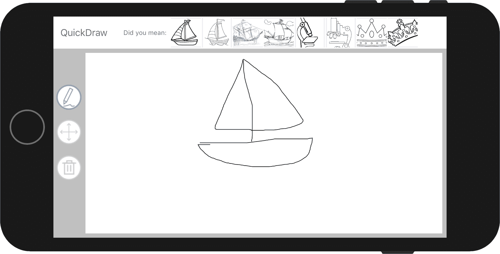

在完成本节之前，还有一件事要做。记住我们的目标是帮助用户快速绘制场景或类似的东西，我们的假设是猜测用户正在绘制的内容并建议预先绘制的图像将帮助他们完成任务。到目前为止，我们已经进行了预测并向用户提供了建议，但当前用户无法用任何建议替换他们的草图。现在让我们解决这个问题。

我们的`SketchView`目前只渲染`StrokeSketch`（它封装了用户绘制的元数据）。因为我们的建议是光栅化图像，我们的选择是扩展这个类（以渲染笔触和光栅化图像）或创建一个新的`Sketch`协议的具体实现。在这个例子中，我们将选择后者，并实现一个能够渲染光栅化图像的新类型的`Sketch`。选择`Sketch.swift`文件，将其带到 Xcode 的编辑区域焦点，滚动到最底部，并添加以下代码：

```py
class ImageSketch : Sketch{
   var image : UIImage!
   var size : CGSize!
   var origin : CGPoint!
   var label : String!

    init(image:UIImage, origin:CGPoint, size:CGSize, label: String) {
        self.image = image
        self.size = size
        self.label = label
        self.origin = origin
    }    
}
```

我们定义了一个简单的类，它引用了一个图像、原点、大小和标签。原点决定了图像应该渲染的左上角位置，而大小决定了其大小！为了满足`Sketch`协议，我们必须实现`center`和`boundingBox`属性以及`draw`和`exportSketch`方法。让我们依次实现这些，首先是`boundingBox`。

`boundingBox`属性是从`origin`和`size`属性派生出的计算属性。将以下代码添加到您的`ImageSketch`类中：

```py
var boundingBox : CGRect{
    get{
        return CGRect(origin: self.origin, size: self.size)
    }
} 
```

类似地，`center`将是另一个从`origin`和`size`属性派生出的计算属性，简单地将`origin`相对于`size`进行转换。将以下代码添加到您的`ImageSketch`类中：

```py
var center : CGPoint{
    get{
        let bbox = self.boundingBox
        return CGPoint(x:bbox.origin.x + bbox.size.width/2,
                       y:bbox.origin.y + bbox.size.height/2)
    } set{
        self.origin = CGPoint(x:newValue.x - self.size.width/2,
                              y:newValue.y - self.size.height/2)
    }
}
```

`draw`方法将简单地使用传入的`context`在`boundingBox`内渲染分配的`image`；将以下代码添加到您的`ImageSketch`类中：

```py
func draw(context:CGContext){
    self.image.draw(in: self.boundingBox)
}  
```

我们最后一个方法`exportSketch`也非常直接。在这里，我们创建一个`CIImage`实例，传入`image`（类型为`UIImage`）。然后，我们使用我们在第三章中实现的扩展方法对其进行调整，*识别世界中的物体*。将以下代码添加到完成`ImageSketch`类的代码中：

```py
func exportSketch(size:CGSize?) -> CIImage?{
    guard let ciImage = CIImage(image: self.image) else{
        return nil
    }

    if self.image.size.width == self.size.width && self.image.size.height == self.size.height{
        return ciImage
    } else{
        return ciImage.resize(size: self.size)
    }
} 
```

我们现在有一个可以处理渲染光栅化图像（如我们搜索返回的图像）的`Sketch`实现。我们的最终任务是替换用户绘制的草图与用户从`UICollectionView`中选择的项。通过在 Xcode 左侧面板中选择`SketchViewController.swift`来返回`SketchViewController`类，将其在编辑区域中打开。一旦加载，导航到方法`collectionView(_ collectionView:, didSelectItemAt:)`；这对大多数人来说应该很熟悉。这是处理从`UICollectionView`中选择的单元格的代理方法，我们将在这里处理替换用户当前草图与所选项。

让我们从获取当前草图和所选的关联图像开始。将以下代码添加到`collectionView(_collectionView:,didSelectItemAt:)`方法体中：

```py
guard let sketch = self.sketchView.currentSketch else{
    return
}
self.queryFacade.cancel()
let image = self.queryImages[indexPath.row] 
```

现在，根据当前的草图和图像，我们想要尝试保持大小与用户的草图相对一致。我们将通过简单地获取草图的边界框并按比例缩放尺寸以尊重所选图像的宽高比来实现这一点。添加以下代码以处理此操作：

```py
    var origin = CGPoint(x:0, y:0)
    var size = CGSize(width:0, height:0)

    if bbox.size.width > bbox.size.height{
        let ratio = image.size.height / image.size.width
        size.width = bbox.size.width
        size.height = bbox.size.width * ratio
    } else{
        let ratio = image.size.width / image.size.height
        size.width = bbox.size.height * ratio
        size.height = bbox.size.height
    } 
```

接下来，我们通过获取草图的中心并相对于其宽度和高度进行偏移来获取原点（图像的左上角）。通过添加以下代码来完成此操作：

```py
origin.x = sketch.center.x - size.width / 2
origin.y = sketch.center.y - size.height / 2
```

我们现在可以使用图像、大小和原点来创建一个`ImageSketch`，并通过将其分配给`SketchView`实例的`currentSketch`属性来简单地替换当前的草图。将以下代码添加以执行此操作：

```py
self.sketchView.currentSketch = ImageSketch(image:image,
                                            origin:origin,
                                            size:size,
                                            label:"")
```

最后，进行一些清理工作；我们将通过从`queryImages`数组（其数据源）中移除所有图像并请求它重新加载自身来清除`UICollectionView`。将以下代码块添加到完成`collectionView(_ collectionView:,didSelectItemAt:)`方法的代码中：

```py
self.queryImages.removeAll()
self.toolBarLabel.isHidden = queryImages.count == 0
self.collectionView.reloadData()
```

现在所有连接都已就绪；我们已经实现了所有猜测用户绘制的内容、提供建议以及允许用户将他们的草图与替代方案进行交换的功能。现在是构建和运行的好时机，以确保一切按计划进行。如果是这样，那么您应该能够用顶部显示的其中一个建议替换您的草图，如图所示：

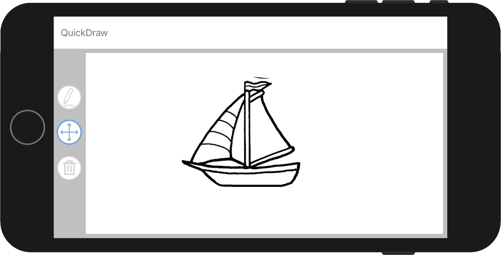

在结束本章之前，还有一个最后的章节。在本节中，我们将探讨一种技术，以微调我们的搜索结果，使其更好地匹配用户所绘的内容。

# 按视觉相似度排序

到目前为止，我们已经实现了我们设定的目标，即推断用户试图绘制的内容，并向他们提供可以交换草图的建议。但我们的解决方案目前还不足以理解用户。当然，它可能预测正确并提供用户所绘内容的正确类别，但它忽略了用户绘图中任何风格或细节。例如，如果用户在画，并且只想画一个猫头，我们的模型可能会正确预测用户在画猫，但忽略了他们的画缺少身体的事实。它可能会建议全身猫的图片。

在本节中，我们将探讨一种更敏感地对待用户输入的技术，并提供一个非常基础的解决方案，但可以在此基础上构建。这种方法将尝试根据与用户草图相似的程度对图像进行排序。在深入代码之前，让我们先简要讨论一下相似度度量，通过查看我们如何测量不同领域中的相似度，例如句子。以下是我们将基于讨论的三个句子：

+   **"the quick brown fox jumped over the lazy dog"**

+   **"the quick brown fox runs around the lazy farm dog"**

+   **"machine learning creates new opportunities for interacting with computers"**

这个练习对于那些熟悉表示方法的人来说很熟悉。在这里，我们将创建一个包含我们语料库（在这个例子中是三个句子）中所有单词的词汇表，然后通过以下截图所示，为每个句子创建向量，即通过将句子中的单词与词汇表中的相应索引进行增量。

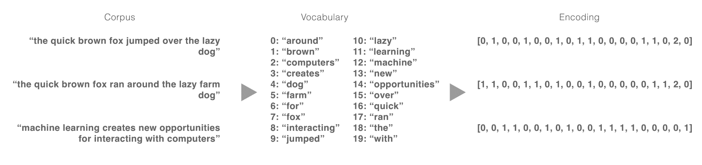

由于我们的句子现在已被编码为向量，我们可以通过执行距离操作（如**欧几里得距离**和**余弦距离**）来衡量每句话之间的相似度。以下为每个这些距离的方程式：

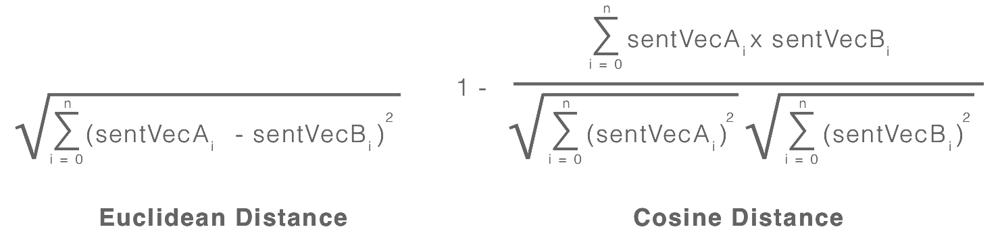

现在我们来计算每句话之间的距离，并比较结果。以下截图显示了结果：

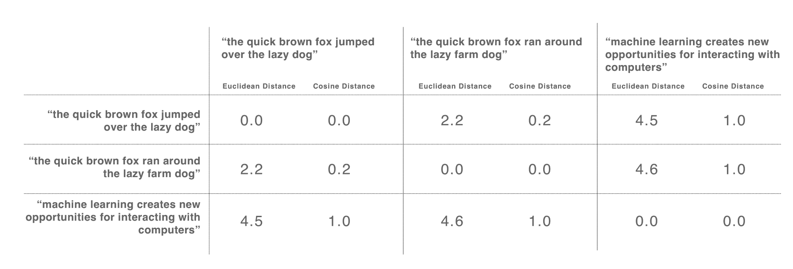

正如你所期望的，句子“the quick brown fox jumped over the lazy dog”和“the quick brown fox ran around the lazy farm dog”之间的距离比句子“machine learning creates new opportunities for interacting with computers”之间的距离要小。如果你要构建一个推荐引擎，尽管是一个简单的推荐引擎，你可能会将具有更多共同词汇的句子排名高于具有较少共同词汇的句子。对于图像来说，情况也是如此，但与句子不同，我们在这里使用的是来自网络层的特征。

回想一下，我们用于分类草图的网络由一系列卷积层组成，每一层都是基于其下层的模式构建更高层次的模式。直观上，我们可以将这些更高层次的模式视为我们的词汇（特征），而全连接网络则代表给定图像中存在的词汇。为了使这一点更清晰，这里展示了一个简单的插图：

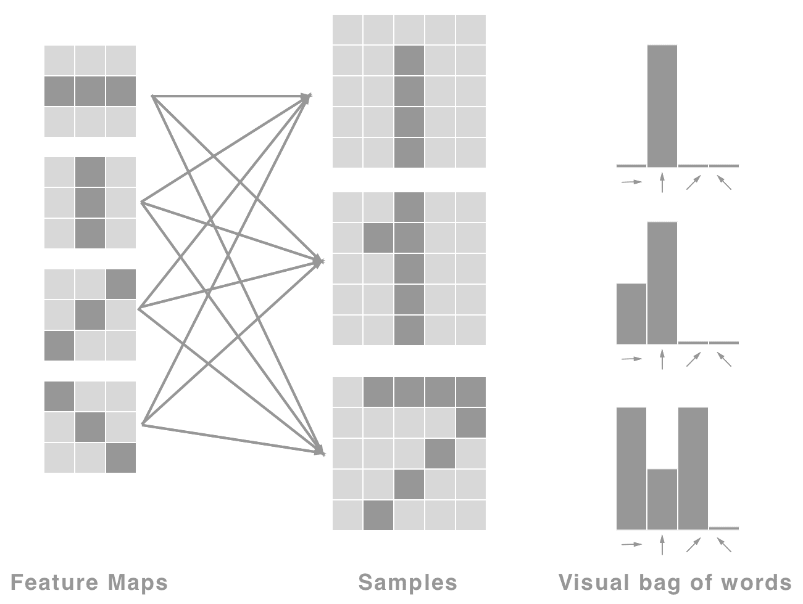

检查这张图，我们可以看到左侧的特征图集合，这些可以被视为用于从图像中提取水平、垂直、左对角和右对角边缘的卷积核。

中间是我们将从中提取这些特征的样本。最后，在最右边，我们有每个样本提取的特征（直方图）。我们使用这些提取的特征作为我们的特征向量，并可以使用它们来计算它们之间的距离，就像我们在之前的图中看到的那样。

因此，如果我们能够从一个图像中提取这种类型的特征向量，那么我们也将能够根据用户的草图（使用其提取的特征向量）对它们进行排序。但我们是怎样得到这个特征向量的呢？回想一下，我们已经有了一个学习高级特征图的网络。如果我们能够获得一个向量，指示给定图像中哪些特征最为活跃，那么我们可以使用这个向量作为我们的特征向量，并使用它来计算其他图像之间的距离，例如用户的草图和下载的图像。这正是我们将要做的；我们不会通过一个 softmax 激活层（用于对类别进行预测）来喂给网络，而是从我们的网络中移除这个层，留下最后的全连接层作为新的输出层。这实际上为我们提供了一个特征向量，我们可以用它来与其他图像进行比较。以下图显示了更新后的网络的结构：

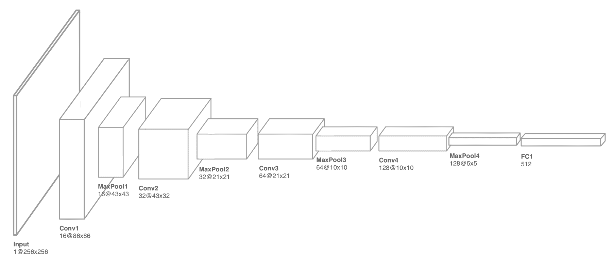

如果你将这个网络与上一节中展示的网络进行比较，你会注意到唯一的变化是缺少了全连接层。现在这个网络的输出是一个大小为 512 的特征向量。让我们通过实际操作来使这个概念更加具体。

我假设您已经从仓库[`github.com/packtpublishing/machine-learning-with-core-ml`](https://github.com/packtpublishing/machine-learning-with-core-ml)中拉取了相应的代码。导航到`Chapter7/Start/QuickDraw/`目录并打开游乐场`FeatureExtraction.playground`。这个游乐场包括之前描述的生成代码和编译模型，以及一些我们将使用的视图和辅助方法；所有这些都应该相当直观。让我们首先通过添加以下代码到游乐场的顶部来导入一些依赖项并声明一些变量：

```py
import Accelerate
import CoreML

let histogramViewFrame = CGRect(
    x: 0, y: 0,
    width: 600, height: 300)

let heatmapViewFrame = CGRect(
    x: 0, y: 0,
    width: 600, height: 600)

let sketchFeatureExtractor = cnnsketchfeatureextractor()
let targetSize = CGSize(width: 256, height: 256)
let context = CIContext()
```

在这里，我们声明了两个矩形；它们将确定我们稍后创建的视图的框架，最重要的是，实例化我们的模型，我们将使用它从每个图像中提取特征。关于这一点，如果你在左侧面板上展开`Resources`文件夹，然后在`Images`文件夹中再次展开，你会看到我们将使用的图片，如图所示：

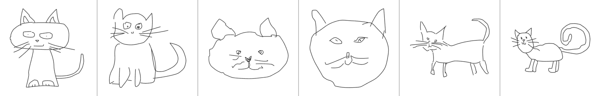

正如我们之前讨论的，我们希望能够对图像进行排序，以便建议的图像与用户绘制的图像尽可能接近。继续我们的用户只画猫头的例子，我们希望有一种方法可以排序图像，使得只有猫头的图像出现在有猫和身体的图像之前。让我们继续我们的实验；添加以下方法，我们将使用这些方法从给定的图像中提取特征：

```py
func extractFeaturesFromImage(image:UIImage) -> MLMultiArray?{
    guard let image = CIImage(
        image: image) else{
        return nil
    }
    return extractFeaturesFromImage(image: image)
}

func extractFeaturesFromImage(image:CIImage) -> MLMultiArray?{
    guard let imagePixelBuffer = image.resize(
        size: targetSize)
        .rescalePixels()?
        .toPixelBuffer(context: context,
                       gray: true) else {
        return nil
    }

    guard let features = try? sketchFeatureExtractor.prediction(
        image: imagePixelBuffer) else{
        return nil
    }

    return features.classActivations
}
```

大多数代码应该对你来说都很熟悉；我们有一个用于处理`UIImage`的重载方法，该方法在将其传递给其他方法之前，简单地创建一个`CIImage`实例。这将处理图像的准备工作，并将其最终输入到模型中。一旦完成推理，我们返回模型属性`classActiviations`，正如之前所讨论的。这是来自最后一个全连接层的输出，我们将将其用作我们的特征向量进行比较。

接下来，我们将加载所有图像并从每个图像中提取特征。将以下代码添加到您的游乐场中：

```py
var images = [UIImage]()
var imageFeatures = [MLMultiArray]()
for i in 1...6{
    guard let image = UIImage(named:"images/cat_\(i).png"),
        let features = extractFeaturesFromImage(image:image) else{
            fatalError("Failed to extract features")
    }

    images.append(image)
    imageFeatures.append(features)
}
```

现在我们有了图像和特征，让我们检查一些图像及其特征图。我们可以通过创建一个`HistogramView`实例并将特征传递给它来完成此操作。以下是完成此操作的代码：

```py
let img1 = images[0]
let hist1 = HistogramView(frame:histogramViewFrame, data:imageFeatures[0])

let img2 = images[1]
let hist2 = HistogramView(frame:histogramViewFrame, data:imageFeatures[1])

// cat front view
let img3 = images[2]
let hist3 = HistogramView(frame:histogramViewFrame, data:imageFeatures[2])

let img4 = images[3]
let hist4 = HistogramView(frame:histogramViewFrame, data:imageFeatures[3])

// cats head
let img5 = images[4]
let hist5 = HistogramView(frame:histogramViewFrame, data:imageFeatures[4])

let img6 = images[5]
let hist6 = HistogramView(frame:histogramViewFrame, data:imageFeatures[5]) 
```

您可以通过在预览视图中的眼睛图标上单击来手动检查每个图像，如图中所示：

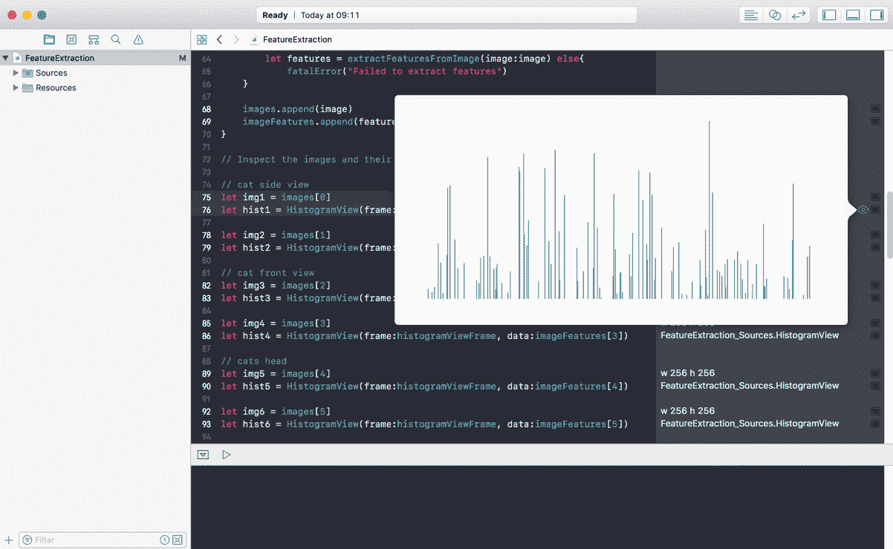

单独检查它们并没有提供太多见解。因此，在这个图中，我展示了我们可以检查的三张图片：

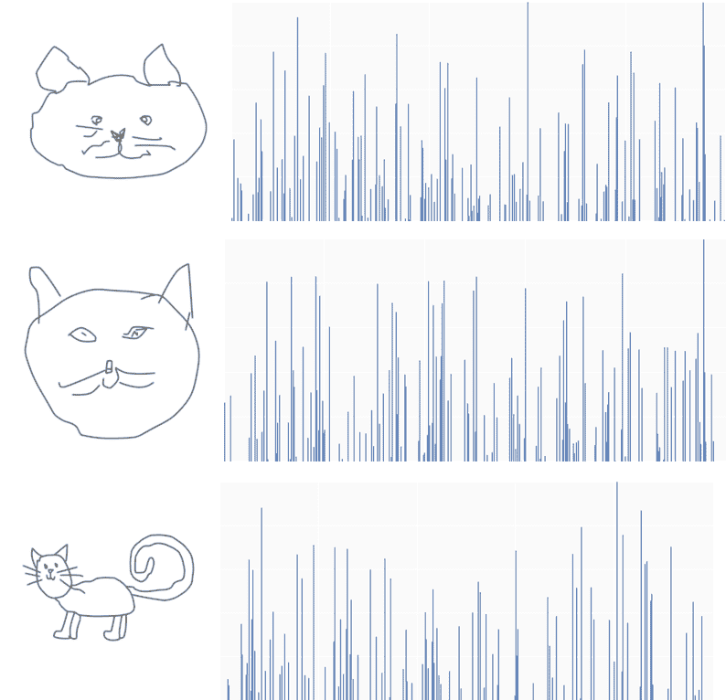

没有太多关注，你可以感觉到猫头的特征向量比猫的侧面视图的特征向量更接近，尤其是在图表的右侧。

让我们进一步通过计算每张图像之间的余弦距离并在热图上绘制它们来探索这一点。首先添加以下代码；它将用于计算余弦距离：

```py
func dot(vecA: MLMultiArray, vecB: MLMultiArray) -> Double {
    guard vecA.shape.count == 1 && vecB.shape.count == 1 else{
        fatalError("Expecting vectors (tensor with 1 rank)")
    }

    guard vecA.count == vecB.count else {
        fatalError("Excepting count of both vectors to be equal")
    }

    let count = vecA.count
    let vecAPtr = UnsafeMutablePointer<Double>(OpaquePointer(vecA.dataPointer))
    let vecBPptr = UnsafeMutablePointer<Double>(OpaquePointer(vecB.dataPointer))
    var output: Double = 0.0

    vDSP_dotprD(vecAPtr, 1, vecBPptr, 1, &output, vDSP_Length(count))

    var x: Double = 0

    for i in 0..<vecA.count{
        x += vecA[i].doubleValue * vecB[i].doubleValue
    }

    return x
}

func magnitude(vec: MLMultiArray) -> Double {
    guard vec.shape.count == 1 else{
        fatalError("Expecting a vector (tensor with 1 rank)")
    }

    let count = vec.count
    let vecPtr = UnsafeMutablePointer<Double>(OpaquePointer(vec.dataPointer))
    var output: Double = 0.0
    vDSP_svsD(vecPtr, 1, &output, vDSP_Length(count))

    return sqrt(output)
} 
```

方程的细节之前已经介绍过，这只是在 Swift 中将其翻译过来；重要的是使用 iOS Accelerate 框架中可用的**向量数字信号处理**（**vDSP**）函数。如文档所述，vDSP API 为语音、声音、音频、视频处理、诊断医学成像、雷达信号处理、地震分析和科学数据处理等应用提供数学函数。因为它建立在 Accelerate 之上，所以继承了通过**单指令多数据**（**SIMD**）实现的性能提升——在数据向量上同时运行相同的指令——这在处理来自神经网络等大型向量时非常重要。诚然，一开始这似乎不太直观，但文档提供了你使用它所需的大部分信息；让我们检查`magnitude`方法来感受一下。

我们使用`vDSP_svsD`函数来计算特征向量的幅度；该函数期望以下参数（按顺序）：数据指针（`UnsafePointer<Double>`），步长（`vDSP_Stride`），输出变量指针（`UnsafeMutablePointer<Double>`），以及最后的长度（`vDSP_Length`）。大部分工作在于准备这些参数，如下代码片段所示：

```py
let vecPtr = UnsafeMutablePointer<Double>(OpaquePointer(vec.dataPointer))
var output: Double = 0.0
vDSP_svsD(vecPtr, 1, &output, vDSP_Length(vec.count))
```

在此函数返回后，我们将计算出存储在`output`变量中的给定向量的幅度。现在让我们利用这个结果来计算每张图像之间的距离。将以下代码添加到你的 playground 中：

```py
var similarities = Array(repeating: Array(repeating: 0.0, count: images.count), count: images.count)

for i in 0..<imageFeatures.count{
    for j in 0..<imageFeatures.count{
        let sim = cosineSimilarity(
            vecA: imageFeatures[i],
            vecB: imageFeatures[j])
        similarities[i][j] = sim
    }
}
```

在这里，我们正在对每张图像进行两次迭代，以创建一个矩阵（多维数组，在这种情况下）来存储每张图像之间的距离（相似性）。我们现在将这个矩阵以及相关的图像输入到`HeatmapView`实例中，它将可视化每张图像之间的距离。添加以下代码，然后通过在结果面板中点击眼睛图标来扩展视图以查看结果：

```py
let heatmap = HeatmapView(
    frame:heatmapViewFrame,
    images:images,
    data:similarities)
```

如前所述，通过预览视图，你应该看到以下类似的图：

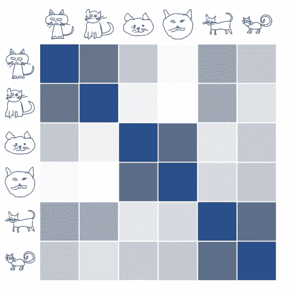

这个可视化显示了每张图像之间的距离；单元格越暗，它们越接近。例如，如果你查看 1x1 单元格、2x2 单元格等，你会看到这些单元格都较暗（距离为 0，因为它们是同一张图像）。你还会注意到另一个模式：沿着图表对角线排列的四个单元格的集群。这，因此，是我们的目标——看看我们是否能够通过它们的相似性对草图进行排序，例如正面绘制的猫、猫头和侧面绘制的猫。

带着我们的新知识，让我们回到 iPhone 项目 `QuickDraw.xcodeproj`，我们将复制此代码并实现排序。

随着 `QuickDraw` 项目现在已打开，从项目仓库文件夹 `/CoreMLModels/Chapter7/cnnsketchfeatureextractor.mlmodel` 定位到特征提取模型。选择模型后，将其拖放到你的 Xcode 项目中，保留导入选项的默认设置。

现在模型已导入，从左侧面板（在 Xcode 中）选择文件 `QueryFacade.swift` 以将其在编辑区域中打开。在打开类后，在 `QueryFacade` 类的顶部添加一个实例变量，如下所示：

```py
let sketchFeatureExtractor = cnnsketchfeatureextractor()
```

接下来，将 `extractFeaturesFromImage`、`cosineSimilarity`、`dot` 和 `magnitude` 方法从你的游乐场复制到 `QueryFacade` 类中，如下所示：

```py
func extractFeaturesFromImage(image:CIImage) -> MLMultiArray?{
    // obtain the CVPixelBuffer from the image
    guard let imagePixelBuffer = image
        .resize(size: self.targetSize)
        .rescalePixels()?
        .toPixelBuffer(context: self.context, gray: true) else {
        return nil
    }

    guard let features = try? self.sketchFeatureExtractor
        .prediction(image: imagePixelBuffer) else{
        return nil
    }

    return features.classActivations
}

func cosineSimilarity(vecA: MLMultiArray,
                                  vecB: MLMultiArray) -> Double {
    return 1.0 - self.dot(vecA:vecA, vecB:vecB) /
        (self.magnitude(vec: vecA) * self.magnitude(vec: vecB))
}

func dot(vecA: MLMultiArray, vecB: MLMultiArray) -> Double {
    guard vecA.shape.count == 1 && vecB.shape.count == 1 else{
        fatalError("Expecting vectors (tensor with 1 rank)")
    }

    guard vecA.count == vecB.count else {
        fatalError("Excepting count of both vectors to be equal")
    }

    let count = vecA.count
    let vecAPtr = UnsafeMutablePointer<Double>(
        OpaquePointer(vecA.dataPointer)
    )
    let vecBPptr = UnsafeMutablePointer<Double>(
        OpaquePointer(vecB.dataPointer)
    )
    var output: Double = 0.0

    vDSP_dotprD(vecAPtr, 1,
                vecBPptr, 1,
                &output,
                vDSP_Length(count))

    var x: Double = 0

    for i in 0..<vecA.count{
        x += vecA[i].doubleValue * vecB[i].doubleValue
    }

    return x
}

func magnitude(vec: MLMultiArray) -> Double {
    guard vec.shape.count == 1 else{
        fatalError("Expecting a vector (tensor with 1 rank)")
    }

    let count = vec.count
    let vecPtr = UnsafeMutablePointer<Double>(
        OpaquePointer(vec.dataPointer)
    )
    var output: Double = 0.0
    vDSP_svsD(vecPtr, 1, &output, vDSP_Length(count))

    return sqrt(output)
}
```

现在我们有了这些方法，是时候利用它们了。定位到方法 `sortByVisualSimilarity(images:[CIImage], sketchImage:CIImage)`；此方法已在 `queryCurrentSketch` 方法中调用，但目前它只是返回传入的列表。我们想要在这个方法中添加一些排序，以便将最类似于用户草图的照片放在前面。让我们分块构建，从提取用户草图的照片特征开始。将以下代码添加到 `sortByVisualSimilarity` 方法的主体中，替换其当前内容：

```py
guard let sketchFeatures = self.extractFeaturesFromImage(
    image: sketchImage) else{
    return nil
}
```

接下来，我们想要所有其他图像的特征，这可以通过遍历列表并将它们存储在数组中简单地完成。添加以下代码以实现这一点：

```py
var similatiryScores = Array<Double>(
    repeating:1.0,
    count:images.count)

for i in 0..<images.count{
    var similarityScore : Double = 1.0

    if let imageFeatures = self.extractFeaturesFromImage(
        image: images[i]){
        similarityScore = self.cosineSimilarity(
            vecA: sketchFeatures,
            vecB: imageFeatures)
    }

    similatiryScores[i] = similarityScore

    if self.isInterrupted{
        return nil
    }
}
```

如我们之前所做的那样，在处理每张图像后，我们检查属性 `isInterrupted` 以确定进程是否被中断，然后再继续处理下一张图像。我们的最终任务是排序并返回这些图像；将以下代码添加到 `sortByVisualSimilarity` 方法的主体中：

```py
return images.enumerated().sorted { (elemA, elemB) -> Bool in
    return similatiryScores[elemA.offset] < similatiryScores[elemB.offset]
    }.map { (item) -> CIImage in
        return item.element
}
```

在实施之后，现在是构建和运行你的项目的好时机，以查看一切是否正常工作，并将结果与之前的构建进行比较。

这就结束了本章；在进入下一章之前，我们将简要总结。

# 摘要

你还在这里。我很惊讶，恭喜你！这是一个漫长但富有成效的章节。我们看到了另一个例子，说明了我们可以如何应用卷积神经网络（CNNs），在这个过程中，我们进一步了解了它们的工作原理、如何调整它们以及我们可以如何修改它们。我们看到了如何使用学习到的特征不仅用于分类，还用于排名，这是一种在许多领域（如时尚发现和推荐引擎）中使用的技巧。我们还花了很多时间构建一个绘图应用程序，我们将在下一章继续使用它。在那里，我们将再次探索如何使用在 Google 的 `QuickDraw` 数据集上训练的循环神经网络（RNN）执行草图分类。前方有很多乐趣，让我们开始吧。
